# Homework 1 Report

## 题1: 虫口模型与 Logistic 映射

**代码结构**：
- 迭代映射与导数：[src/iterative_equation.py](src/iterative_equation.py)
- 数值分析工具（分岔图、Lyapunov 指数）：[src/iter_analysis.py](src/iter_analysis.py)
- 可视化工具：[src/iter_plot.py](src/iter_plot.py)
- 运行脚本：[scripts/problem1.py](scripts/problem1.py)

---

### 1. $x_{n+1} = 1 - \mu x_n^2$ 的长时间行为

**分岔图与 Lyapunov 指数**：

  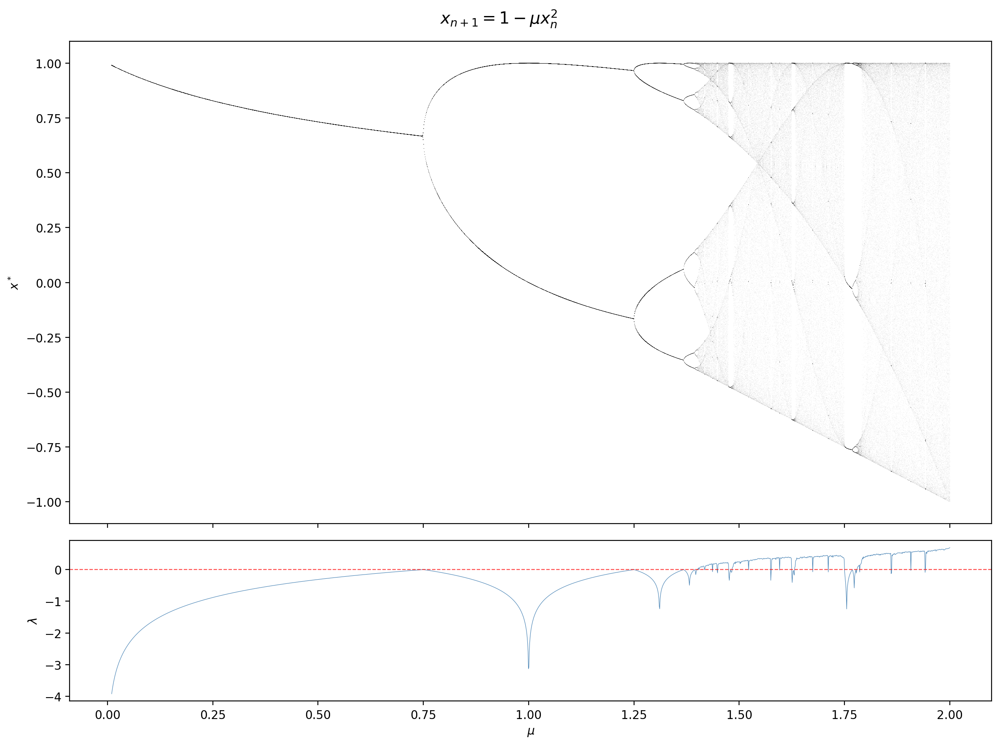

**分析**：

不动点为 $x^* = \frac{-1+\sqrt{1+4\mu}}{2\mu}$，其稳定性由 $|f'(x^*)| = 2\mu x^*$ 决定。当 $2\mu x^* < 1$ 时不动点稳定，解得首次分岔临界值 $\mu_1 = 3/4 = 0.75$。

随 $\mu$ 增大，系统经历以下阶段：

| 区间 | 行为 | Lyapunov 指数 |
|------|------|:---:|
| $0 < \mu < 0.75$ | 稳定不动点 | $\lambda < 0$ |
| $\mu \approx 0.75$ | 首次倍周期分岔（周期-2） | $\lambda = 0$（分岔点） |
| $0.75 < \mu \lesssim 1.25$ | 倍周期级联（周期-2, 4, 8, ...） | $\lambda < 0$（各分岔点处触零） |
| $\mu \gtrsim 1.25$ | 混沌带，内含周期窗口 | $\lambda > 0$（混沌），窗口内 $\lambda < 0$ |
| $\mu \to 2$ | 完全混沌 | $\lambda > 0$ |

倍周期分岔点之比收敛于 **Feigenbaum 常数** $\delta \approx 4.669$，这是一维单峰映射的普适常数。

**与初值 $x_0$ 的关系**：

  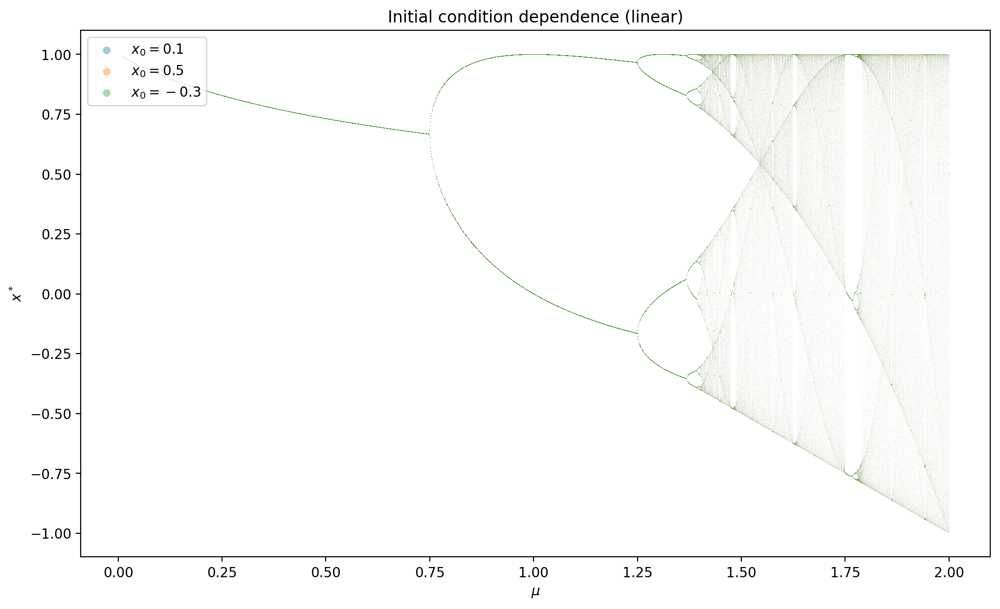

取 $x_0 = 0.1,\ 0.5,\ -0.3$ 三个初值分别计算分岔图并叠加，结果**完全重合**（只看到最后绘制的颜色）。这说明：对于 $\mu \in (0, 2)$，所有 $x_0 \in (-1, 1)$ 最终收敛到**同一吸引子**。

原因：$[-1, 1]$ 是该映射在 $\mu \in [0, 2]$ 下的**不变区间**（$x \in [-1,1] \Rightarrow f(x) \in [1-\mu, 1] \subseteq [-1, 1]$），所有初值共享同一吸引盆。初值仅影响瞬态过程的长短，不影响长时间行为。

**代表性时间序列**：

  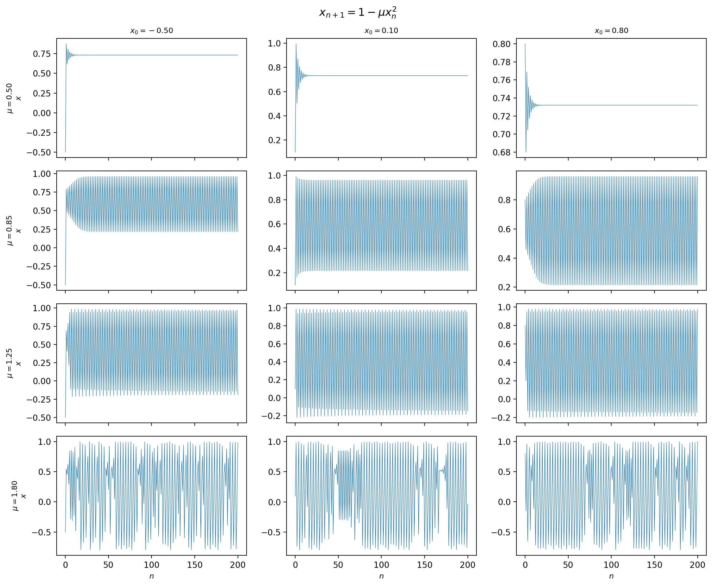

四行分别对应 $\mu = 0.50$（不动点）、$0.85$（周期-2）、$1.25$（高阶倍周期）、$1.80$（混沌），三列为不同初值。可以看到瞬态长度不同，但稳态行为一致。

---

### 2. $x_{n+1} = \cos x_n - \mu x_n^2$ 的长时间行为

**参数区间选择**：
- $\mu \in (0, 1.2)$：当 $\mu = 0$ 时，映射退化为 $x_{n+1} = \cos x_n$，不动点为 Dottie 数 $\approx 0.739$。由于 $\cos x$ 本身已有非线性成分，$-\mu x^2$ 项使分岔更早发生。$\mu > 1.2$ 后绝大多数轨道发散。
- $x_0 \in (-1, 1)$：与线性情况一致。

**分岔图与 Lyapunov 指数**：

  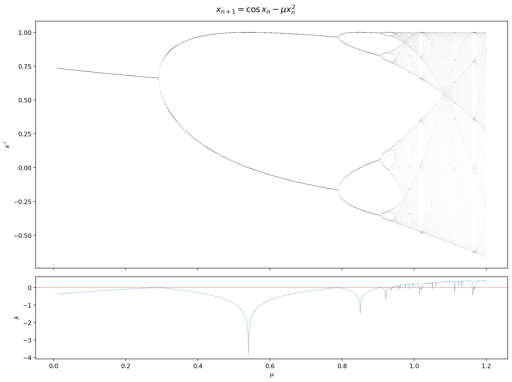

**分析**：

cosine 映射的导数为 $f'(x) = -\sin x - 2\mu x$，不动点稳定条件 $|\sin x^* + 2\mu x^*| < 1$ 给出首次分岔约在 $\mu \approx 0.28$，远早于线性映射的 $0.75$。这是因为 $\cos x$ 本身在不动点处的导数 $-\sin(0.739) \approx -0.67$ 已经较大，$-2\mu x$ 项的少量增加即可使总导数越过 $-1$ 的阈值。

后续同样出现完整的倍周期级联→混沌→周期窗口结构，与线性映射定性一致。

**初值依赖性**（同样不依赖 $x_0$）：

  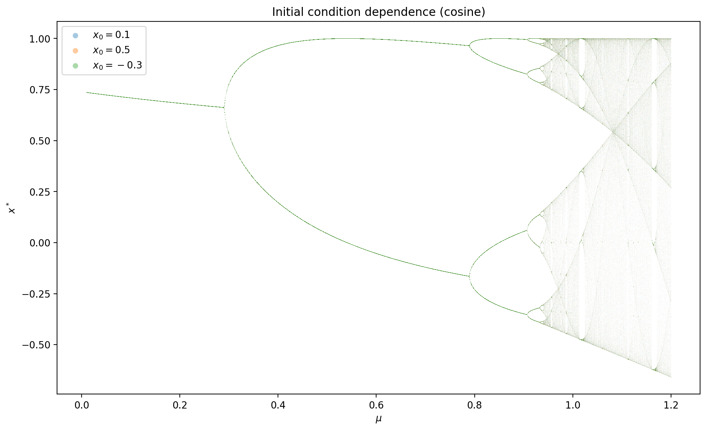

---

### 3. 两种映射的比较

  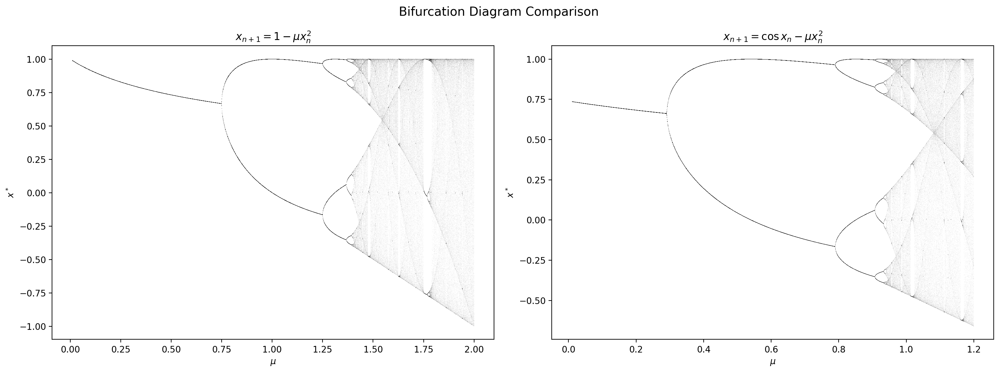

**相同点**（普适性）：
- 两者都经历 **不动点 → 倍周期级联 → 混沌** 的标准路径
- 混沌区内都存在**周期窗口**（最显著的是周期-3 窗口）
- 倍周期分岔比率都收敛于 Feigenbaum 常数 $\delta \approx 4.669$，这是一维单峰映射的**普适性**体现——具体的映射函数不同，但分岔的标度结构相同

**不同点**：
- **分岔起点不同**：线性映射在 $\mu = 0.75$ 首次分岔，cosine 映射在 $\mu \approx 0.28$ 即分岔。$\cos x$ 的非线性使系统更"容易"失稳
- **有界区间不同**：线性映射在 $\mu \in (0, 2)$ 全域有界，cosine 映射在 $\mu \gtrsim 1.2$ 后大多数轨道发散
- **吸引子值域不同**：线性映射的混沌带可达 $x \in [-1, 1]$，cosine 映射的混沌带更窄（约 $[-0.6, 1.0]$）

**结论**：两种映射属于同一**普适类**（universality class）——单峰映射（具有唯一极大值的一维映射）。Feigenbaum 理论保证了这一类映射在倍周期分岔路径上具有相同的标度行为，与映射的具体形式无关。

## 题2: 开心消消乐 (Abelian Sandpile Model)

### 模型概述

本题所描述的“开心消消乐”游戏，实际上是经典的二维 **Abelian Sandpile Model (ASM)**，也称为 Bak-Tang-Wiesenfeld (BTW) 模型。该模型是研究 **自组织临界性 (Self-Organized Criticality, SOC)** 的典型系统。

**代码结构**：
- 核心引擎：[src/basic_component.py](src/basic_component.py) — `GridPlaygroundContainer` 类，实现单步演化逻辑. 其脚手架代码可见[[Computational Physics/HW-1/drafts/draft|draft]].
- 并行计算与数据处理：[src/container_parallel.py](src/container_parallel.py) — 多进程并发、对数分箱、幂律拟合工具

**演化规则**：
- 每次随机向网格中一个格点添加 1 个方块
- 当某格点高度 $z \ge 4$ 时，该格点发生崩塌（Toppling）：自身减少 4，向四个最近邻各传递 1 个方块
- **并行更新**：在每一个时间步内，所有 $z \ge 4$ 的格点**同时崩塌**，并记录总崩塌次数（即该步“得分” $s$）；重复此过程直至场上无不稳定格点
- **开放边界**：边界格点崩塌时，部分方块流出系统（耗散）。这是系统能够达到稳态的关键机制

---

### 1. 网格平均方块密度 $n(t)$ 的演化

**实验设置**：
- 系统尺寸 $L=32$
- 演化步数 $T=10000$ 和 $T=20000$（两组对比）
- 脚本：[scripts/question_1_run.py](scripts/question_1_run.py)

**结果**：

| 演化步数 | 5000步密度 | 10000步密度 | 15000步密度 | 20000步密度 |
|:---:|:---:|:---:|:---:|:---:|
| $T=10000$ | 2.0938 | 2.0938 | — | — |
| $T=20000$ | 2.0869 | 2.0811 | 2.0840 | 2.0811 |

  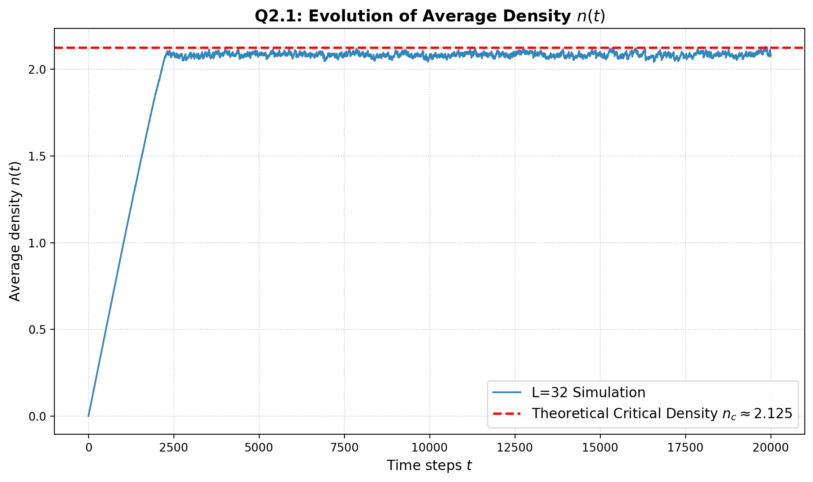

**分析**：

从图中可以清晰地观察到两个阶段：

1. **瞬态线性增长期**（$t \lesssim 2500$）：初始网格为空，每一步添加一个方块但几乎不发生崩塌，因此总方块数 $N$ 随 $t$ 线性增长，密度 $n(t) = N/L^2$ 呈现近乎完美的线性上升。
2. **稳态涨落期**（$t \gtrsim 2500$）：当密度增长到足够高，崩塌事件开始频繁发生，边界耗散使得每步注入的 1 个方块与平均流出量达到**动态平衡**。密度在临界值附近小幅波动，不再系统性增长。

实测稳态密度约为 $n_c \approx 2.08$，略低于二维 BTW 模型的理论值 $n_c^{\text{theory}} \approx 2.125$（红色虚线）。这一偏差是有限尺寸效应的体现：$L=32$ 时边界占比相对较大，耗散偏强，导致稳态密度略低于热力学极限值。

**物理意义**：密度的自发饱和揭示了系统的**自组织**本质——无需外部调参，系统自动演化至临界态并维持在该状态附近。

---

### 2. 雪崩规模分布 $P(s)$

**实验设置**：
- 系统尺寸 $L=64$
- 总演化步数 $T=20000$，热启动（burn-in）比例 15%，即舍弃前 3000 步的瞬态数据
- 仅统计 $s > 0$ 的非零得分事件
- 脚本：[scripts/question_2_run.py](scripts/question_2_run.py)

**结果**：

首先观察线性坐标下的原始频率分布：

  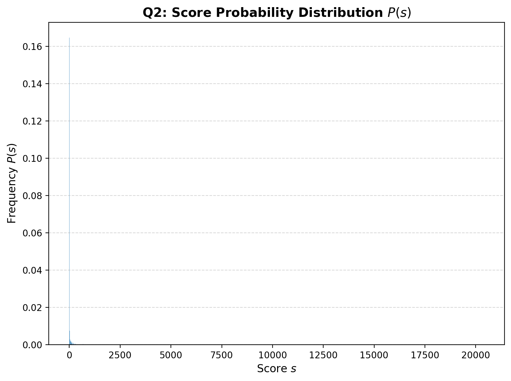

该图呈现出典型的**重尾分布**特征：绝大多数时间步的得分集中在极小值（$s=1,2,3,\ldots$），但存在少量极大得分事件（$s$ 可达数千甚至上万），在线性坐标下几乎不可见。

为揭示尾部结构，我们将数据转换到双对数坐标系。原始散点图（Raw Frequency）在大 $s$ 处离散噪声严重：

  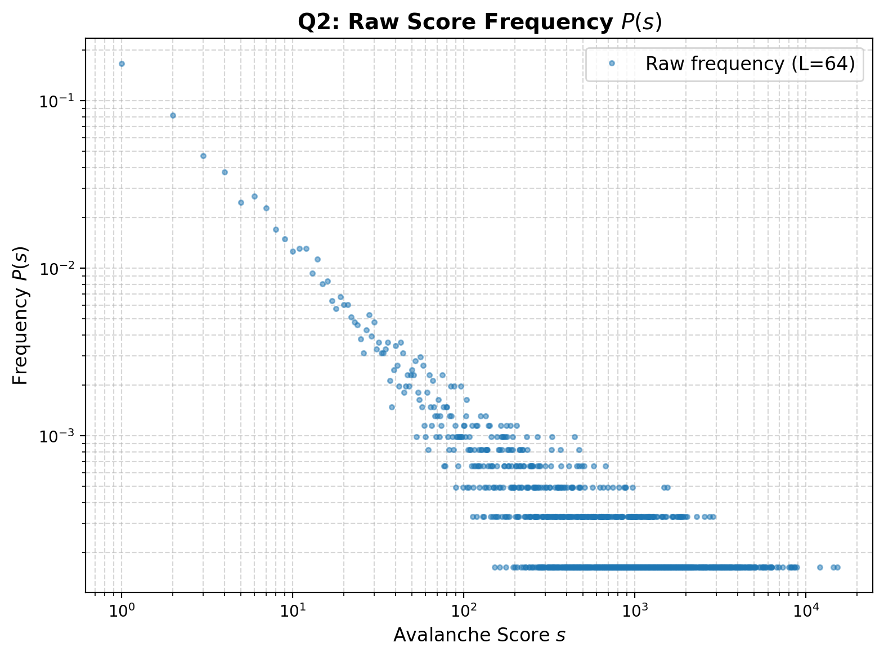

为消除离散噪声，采用**对数分箱（Logarithmic Binning）** 技术（分箱宽度按因子 $a=1.2$ 指数增长），将概率密度平滑后进行幂律拟合：

  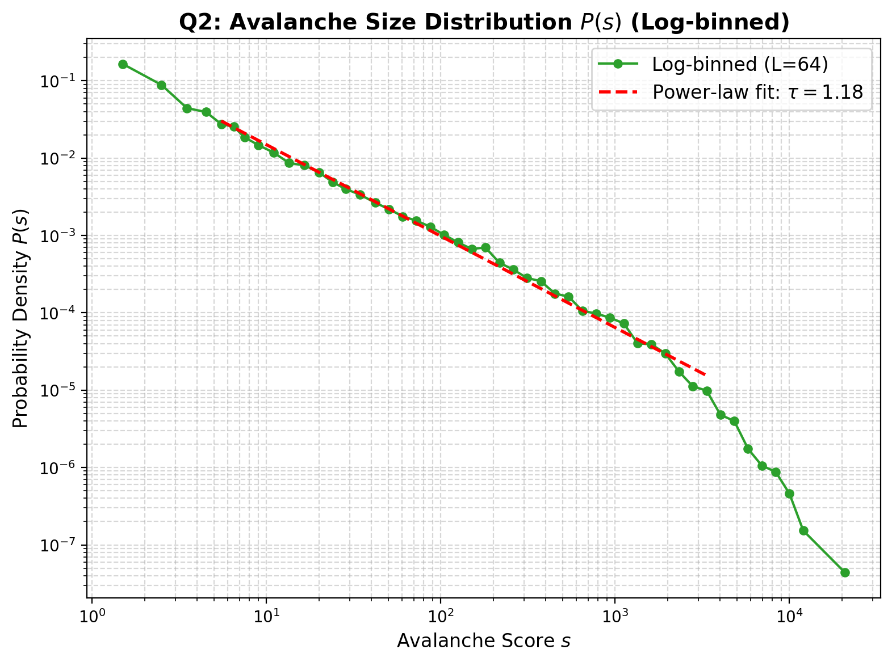

多次独立运行的拟合结果：$\tau = 1.173,\ 1.166,\ 1.182$，取平均得到：

$$\boxed{\tau \approx 1.17 \pm 0.01}$$

**分析**：

在双对数坐标下，$P(s)$ 在约两个数量级的范围内（$s \sim 5$ 至 $s \sim 2000$）呈现出优良的线性关系，表明雪崩规模服从**幂律分布（Power-law distribution）**：

$$P(s) \sim s^{-\tau}, \quad \tau \approx 1.17$$

这种**无标度（Scale-free）** 特性是自组织临界系统的标志性特征，其物理含义为：
- 系统中不存在特征雪崩尺度，小规模和大规模雪崩遵循同一统计规律
- 大规模雪崩虽然罕见，但其发生概率远高于指数分布或高斯分布的预期——即“极端事件”不可忽略
- 在大 $s$ 端（$s \gtrsim 2000$），曲线出现向下弯折（指数截断），这是由系统有限尺寸 $L=64$ 造成的

> 关于幂律分布的更多直觉，可参考：[为何现在教科书都不讲幂律分布?（知乎）](https://www.zhihu.com/question/20313934/answer/2012311960952272569)

作为对比，$L=32,\ T=5000$ 的结果拟合得到 $\tau \approx 1.11$，幂律区间较短（约一个数量级），截断更早出现，这进一步说明了有限尺寸对统计的影响。

---

### 3. 系统尺寸 $L$ 的影响 (Finite-Size Effect)

**实验设置**：
- 系统尺寸 $L \in \{16, 32, 64, 128\}$
- 每个尺寸演化 $T=100000$ 步，热启动比例 30%
- 利用多进程并发计算（[src/container_parallel.py](src/container_parallel.py) 中的 `ContainerParallel` 类）
- 脚本：[scripts/question_3_4_run.py](scripts/question_3_4_run.py)

**结果**（下图左面板）：

  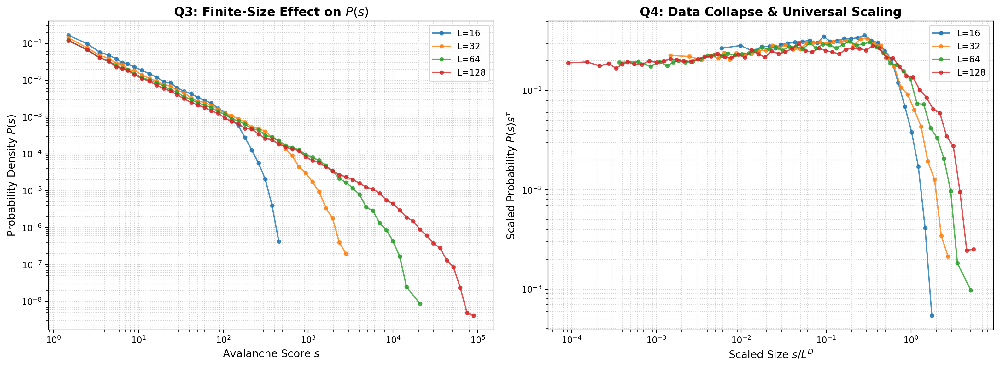

**分析**：

左图展示了四个尺寸下 $P(s)$ 的对比，可以观察到：

1. **幂律区的小 $s$ 段重合**：所有尺寸在 $s \lesssim 10$ 的区域内几乎完全重叠，说明小规模雪崩的统计行为不依赖系统尺寸，体现了**普适性（Universality）**。

2. **截断尺度随 $L$ 增大而右移**：
   - $L=16$：幂律行为在 $s \sim 10^2$ 处即发生截断
   - $L=32$：截断推迟至 $s \sim 10^3$
   - $L=64$：截断推迟至 $s \sim 10^4$
   - $L=128$：幂律延伸至 $s \sim 10^5$

   这是因为雪崩的空间范围受限于系统物理尺寸，最大可能的雪崩规模 $s_{\max}$ 随 $L$ 增大而增大。

3. **截断尺度的标度关系**：截断尺度 $s_c$ 近似满足 $s_c \sim L^D$，其中 $D \approx 2$ 为雪崩维数。这意味着在热力学极限 $L \to \infty$ 下，截断消失，纯粹的幂律分布在整个 $s$ 范围内成立。

---

### 4. 规律解释与数据塌缩 (Data Collapse)

**规律的物理解释**：

第（2）问中发现的幂律分布 $P(s) \sim s^{-\tau}$ 根源于系统的**自组织临界性（SOC）**：

- **自组织**：系统无需人为微调任何参数（如温度、耦合常数），仅通过“缓慢驱动（每步加一个方块）+ 边界耗散”的简单规则，自动演化并停留在临界点附近。
- **临界性**：在临界态中，系统的空间关联长度 $\xi$ 趋于发散（$\xi \sim L$），因此一个局部扰动（添加一个方块）可以在整个系统范围内传播，引发任意规模的雪崩连锁反应。这与热力学相变中临界点的长程关联类比，不同之处在于 SOC 不需要精细调参。
- **幂律 = 无标度**：临界态缺乏特征尺度，反映在统计分布上就是幂律。大地震与小地震遵循相同的 Gutenberg-Richter 定律，正是 SOC 思想在地球物理中的经典应用。

**有限尺寸标度分析 (Finite-Size Scaling)**：

为定量验证普适性，我们假设分布满足标度形式：

$$P(s, L) = s^{-\tau} \, \mathcal{G}\!\left(\frac{s}{L^D}\right)$$

其中 $\mathcal{G}(x)$ 是普适标度函数（Universal Scaling Function），$D$ 是雪崩维数。该式的含义是：幂律主体 $s^{-\tau}$ 由临界性决定，而截断行为由标度函数 $\mathcal{G}(s/L^D)$ 编码——当 $s/L^D \ll 1$ 时 $\mathcal{G} \approx \text{const}$（纯幂律），当 $s/L^D \gtrsim 1$ 时 $\mathcal{G}$ 快速衰减（指数截断）。

对坐标轴进行重标度变换：
- 横轴：$s / L^D$
- 纵轴：$P(s) \cdot s^{\tau}$

若标度假设成立，则不同 $L$ 的曲线应**塌缩（collapse）** 到同一条主曲线 $\mathcal{G}(x)$ 上。

**数据塌缩结果**（上图右面板）：

取 $D = 2$，$\tau$ 由 $L=128$ 数据自动拟合确定。从右面板可以看到：
- 在 $s/L^D \lesssim 0.3$ 的区域，四条曲线较好地重合为一条水平线（对应 $\mathcal{G} \approx \text{const}$），验证了幂律主体的普适性
- 在 $s/L^D \sim 1$ 附近，曲线开始急剧下降，对应有限尺寸截断
- 截断区域各尺寸的曲线依次分离，$L$ 越小截断越早，这与有限尺寸标度理论的预期一致

塌缩质量虽非完美（特别是在截断区和极小 $s$ 端存在偏差），但总体趋势清晰地支持了标度假设，验证了 $\tau \approx 1.1\text{-}1.2$、$D \approx 2$ 的临界指数取值在二维 BTW 模型的合理范围内。

**进一步思考**：
- BTW 沙堆模型是最早被提出的 SOC 模型（Bak, Tang & Wiesenfeld, 1987），其精确临界指数至今仍有争议，文献中 $\tau$ 的报道值在 $1.1 \sim 1.3$ 之间波动，这与雪崩规模的定义方式（总崩塌次数 vs. 涉及的不同格点数 vs. 持续时间）以及数据处理方法密切相关
- 该模型的 Abelian 性质——崩塌的最终构型与崩塌顺序无关——是其数学可处理性的核心，也保证了并行更新规则的正确性
- SOC 思想已被广泛应用于地震统计（Gutenberg-Richter 定律）、神经科学（神经雪崩）、森林火灾等自然现象的理解