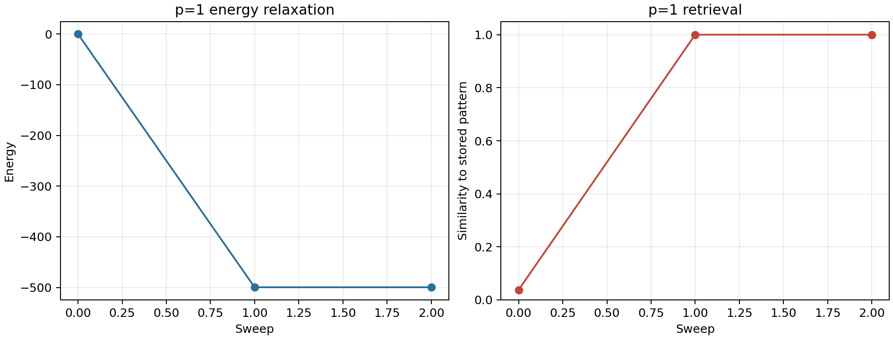
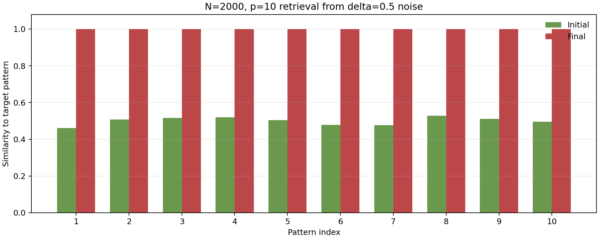
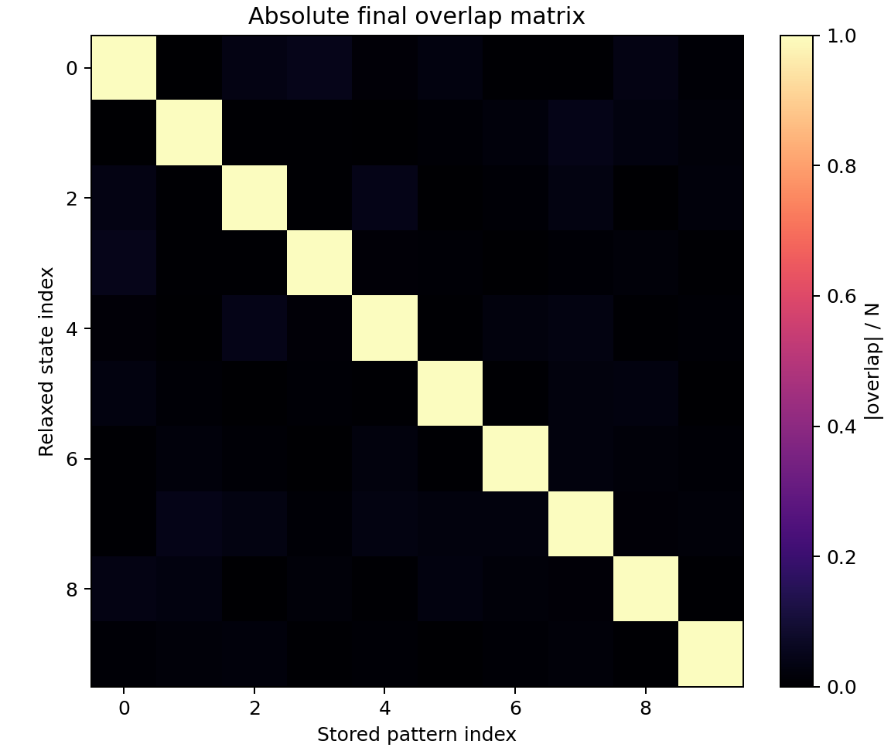
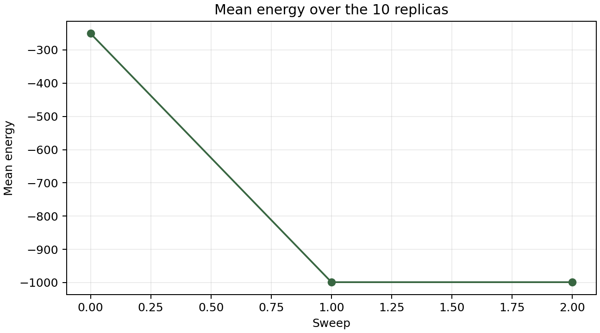
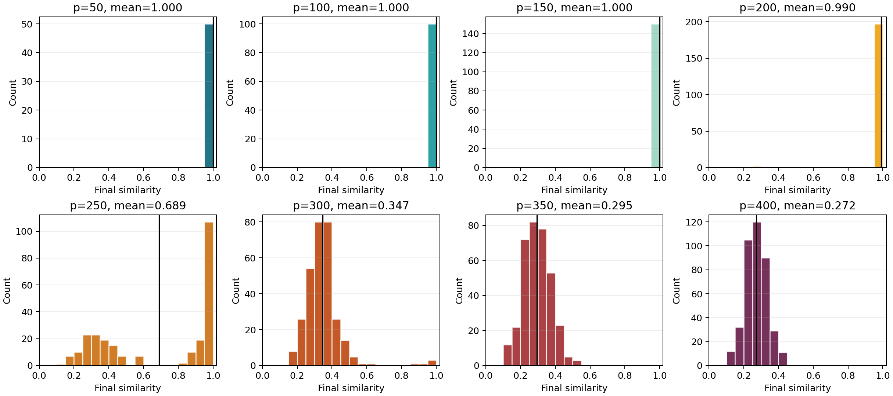
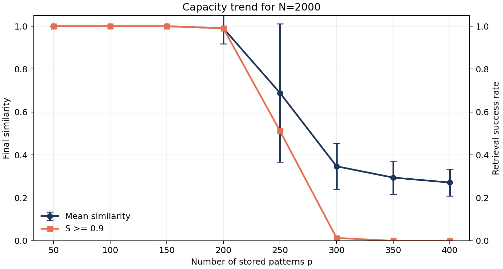

# Homework 10: 全连接 Ising 模型与 Hopfield 记忆


## 数值方法

代码见 `hopfield.py` 与 `run_experiments.py`。本次计算没有显式构造 $N\times N$ 的耦合矩阵，而是维护每个自旋态对所有记忆模式的 overlap：

$$
a_\mu(\mathbf{s})=\sum_i v_i^\mu s_i.
$$

于是一般的能量可以写成

$$
E(\mathbf{s})
=-\frac{1}{2N}\sum_{\mu=1}^p \left[\left(\sum_i v_i^\mu s_i\right)^2-N\right]
=-\frac{1}{2N}\sum_{\mu=1}^p a_\mu^2+\frac{p}{2}.
$$

单自旋翻转 $s_k\to -s_k$ 的局域场为

$$
h_k=\sum_{j\neq k}J_{kj}s_j
=\frac{1}{N}\sum_\mu v_k^\mu a_\mu-\frac{p}{N}s_k,
$$

能量变化为

$$
\Delta E=2s_kh_k
=\frac{2}{N}\left[s_k\sum_\mu v_k^\mu a_\mu-p\right].
$$

因此一次更新只需要 $O(p)$，接受 $\Delta E<0$ 的翻转，并同步更新所有 $a_\mu$：

$$
a_\mu\leftarrow a_\mu-2s_kv_k^\mu.
$$

这里把 $\Delta E=0$ 的翻转省略，因为它不降低能量，会让零温动力学在等能面上游走；本题关心的是能量下降到局域稳定态后的结构。

运行命令：

```powershell
python .\run_experiments.py --repeats 1 --max-sweeps 100 --p-values 50 100 150 200 250 300 350 400
```

随机种子固定为 `20260601`。所有数值均来自该命令的终端输出。

## 1. 解析结果：p = 1

当集合中只有一个模式 $\mathbf{v}$ 时，

$$
E(\mathbf{s})
=-\frac{1}{2N}\left[(\mathbf{v}\cdot\mathbf{s})^2-N\right]
=\frac{1}{2}-\frac{1}{2N}(\mathbf{v}\cdot\mathbf{s})^2.
$$

令

$$
q=\frac{1}{N}\mathbf{v}\cdot\mathbf{s},
$$

则

$$
E(\mathbf{s})=\frac{1}{2}-\frac{N}{2}q^2.
$$

能量只依赖于 $|\mathbf{v}\cdot\mathbf{s}|$，所以当 $|q|=1$ 时取最小值，即

$$
\mathbf{s}=\mathbf{v}\quad\text{或}\quad \mathbf{s}=-\mathbf{v}.
$$

基态能量为

$$
E_0=\frac{1}{2}-\frac{N}{2}=-\frac{N-1}{2}.
$$

因此基态二重简并，简并来自 Ising 模型的整体翻转对称性。

## 2(i). N = 1000, p = 1

终端输出给出随机初态与唯一记忆模式的相似度为

$$
S_C(\mathbf{s},\mathbf{v})=0.038000.
$$

随机初态几乎与 $\mathbf{v}$ 正交，这是高维随机 $\pm1$ 向量的典型行为。零温单自旋更新后，系统到达

$$
S_C=1.000000,\quad E=-499.500000,
$$

与解析基态能量 $-(1000-1)/2=-499.5$ 完全一致。本次随机初态的 overlap 为正，所以末态是 $+\mathbf{v}$；如果初始 overlap 为负，则会落到 $-\mathbf{v}$。



## 2(ii). N = 2000, p = 10, delta = 0.5

加入噪声的方式是：每个格点以概率 $\delta=0.5$ 被替换为一个新的随机自旋。因此初态的平均 overlap 不是 $0.75$，而是

$$
\langle v_i^\mu s_i^\mu\rangle=(1-\delta)\cdot 1+\delta\cdot 0=0.5.
$$

终端输出中的 10 个初始相似度确实都在 0.5 附近：

```text
initial_similarity [0.462, 0.507, 0.516, 0.519, 0.505, 0.479, 0.477, 0.528, 0.511, 0.495]
final_similarity [1.0, 1.0, 1.0, 1.0, 1.0, 1.0, 1.0, 1.0, 1.0, 1.0]
```

结果表明，对 $N=2000,p=10$，所有带噪声的初态都回到了对应的记忆模式。末态 $\mathbf{u}^\mu$ 与对应存储模式 $\mathbf{v}^\mu$ 的相似度全部为 1；末态对非目标存储模式的最大绝对 overlap 只有 `0.048000`，说明随机模式之间近似正交，串扰很弱。







## 2(iii). 改变 p 后的相似度分布

固定 $N=2000$、$\delta=0.5$，对 $p=50,100,\ldots,400$ 计算每个记忆模式对应末态的

$$
S_C^\mu=S_C(\mathbf{u}^\mu,\mathbf{v}^\mu).
$$

所有容量扫描均在零温单自旋更新下运行到无翻转的局域稳定态。终端输出如下：

```text
SEED 20260601
RUNTIME_SECONDS 254.907
P1
N 1000 p 1
initial_similarity 0.038000
initial_energy -0.222000
final_similarity 1.000000
final_energy -499.500000
ground_energy_exact -499.500000
sweeps 2
flips_per_sweep [481, 0]
final_state_type +v
P10
N 2000 p 10 delta 0.5
initial_similarity [0.462, 0.507, 0.516, 0.519, 0.505, 0.479, 0.477, 0.528, 0.511, 0.495]
final_similarity [1.0, 1.0, 1.0, 1.0, 1.0, 1.0, 1.0, 1.0, 1.0, 1.0]
final_energy [-1001.586975, -998.63501, -1000.286987, -998.086975, -999.059021, -997.598999, -997.078979, -1000.815002, -999.122986, -996.387024]
mean_final_similarity 1.000000
min_final_similarity 1.000000
max_off_diagonal_abs_overlap 0.048000
sweeps 2
flips_per_sweep [5001, 0]
CAPACITY
p samples mean std median q10 q90 min max success_ge_0p9 mean_sweeps max_last_sweep_flips
50 50 1.000000 0.000000 1.000000 1.000000 1.000000 1.000000 1.000000 1.000000 3.000 0
100 100 1.000000 0.000000 1.000000 1.000000 1.000000 1.000000 1.000000 1.000000 4.000 0
150 150 0.999780 0.000515 1.000000 0.999000 1.000000 0.997000 1.000000 1.000000 5.000 0
200 200 0.990380 0.072182 0.999000 0.994000 1.000000 0.270000 1.000000 0.990000 34.000 0
250 250 0.689152 0.321333 0.903000 0.272300 0.997000 0.149000 1.000000 0.512000 93.000 0
300 300 0.347013 0.106857 0.337000 0.241800 0.434800 0.161000 0.990000 0.013333 89.000 0
350 350 0.294634 0.077291 0.291500 0.202000 0.396200 0.109000 0.546000 0.000000 83.000 0
400 400 0.271508 0.062821 0.270000 0.195000 0.350100 0.095000 0.447000 0.000000 91.000 0
```

直方图显示出清楚的变化：





当 $p\le150$ 时，分布几乎全部集中在 $S_C=1$ 附近，说明记忆吸引子很稳定。到 $p=200$，平均相似度仍有 `0.990380`，但最低值已经掉到 `0.270000`，说明个别模式已经被串扰破坏。到 $p=250$，分布明显分裂：一部分模式仍能恢复到 $S_C\approx1$，另一部分落入低相似度的混合态或伪态，成功率降到 `0.512000`。当 $p=300,350,400$ 时，分布主体分别移动到约 `0.35, 0.29, 0.27`，恢复成功率接近 0。

这个变化说明，记忆模式数增加时，Hebb 耦合中的交叉项不再只是微小噪声，而会重塑能量景观：原先清晰的单个记忆盆地逐渐变浅、变窄，并与大量混合态和自旋玻璃式局域极小值竞争。

## 2(iv). 物理解释与思考

若系统正接近某个目标模式 $\mathbf{v}^\mu$，局域场可粗略写成

$$
h_i\approx v_i^\mu+\eta_i,
$$

其中第一项是目标记忆给出的信号，$\eta_i$ 来自其他 $p-1$ 个随机模式的串扰。对随机、近似正交的模式，串扰的方差随

$$
\alpha=\frac{p}{N}
$$

增大而增大。也就是说，真正控制容量的不是 $p$ 本身，而是装载率 $\alpha$。本题 $N=2000$ 时，$p=200,250,300$ 分别对应

$$
\alpha=0.100,\quad 0.125,\quad 0.150.
$$

数值结果显示明显失效区间位于 $p=200$ 到 $p=300$ 之间，与 Hopfield 随机记忆网络存在有限容量的物理图像一致。

还有两个值得注意的点：

1. 本题使用的是 $\delta=0.5$ 的强噪声初态，初始相似度只有约 0.5。即使如此，在低装载率下系统仍能完整恢复模式，说明吸引盆很大。
2. 高装载率下并不是所有模式同时突然失效，而是先出现分布展宽和部分失败。这是有限 $N$ 随机系统的典型现象：不同记忆模式受到的交叉 overlap 不完全相同，因此有些模式仍然保留较深吸引盆，有些模式先被串扰淹没。

总体结论是：这个全连接 Ising 模型在 Hebb 耦合下表现为联想记忆系统。低 $p/N$ 时，存储模式及其整体反向构型是稳定吸引子；随着 $p/N$ 增加，模式之间的串扰增强，系统从可靠记忆恢复逐渐过渡到混合态/伪态主导的复杂能量景观。
