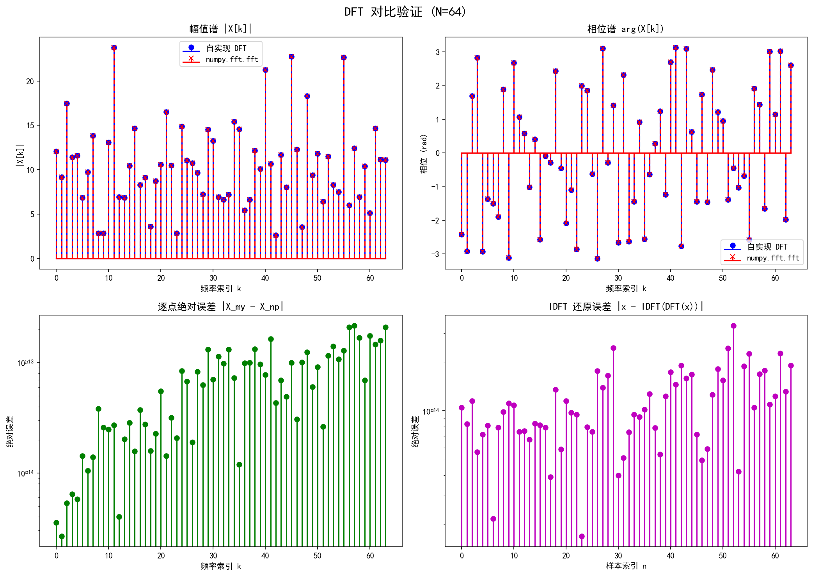
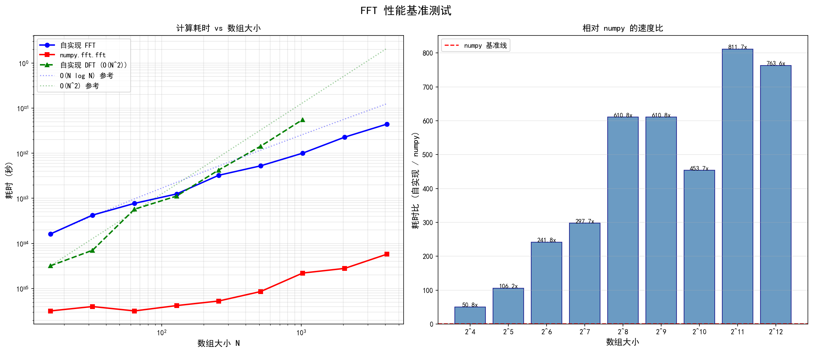
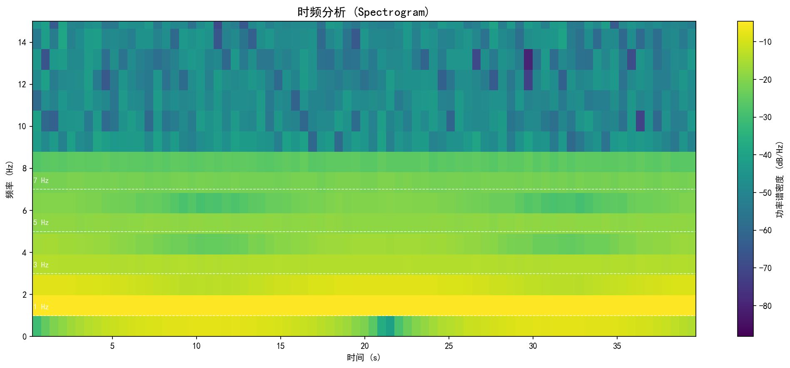
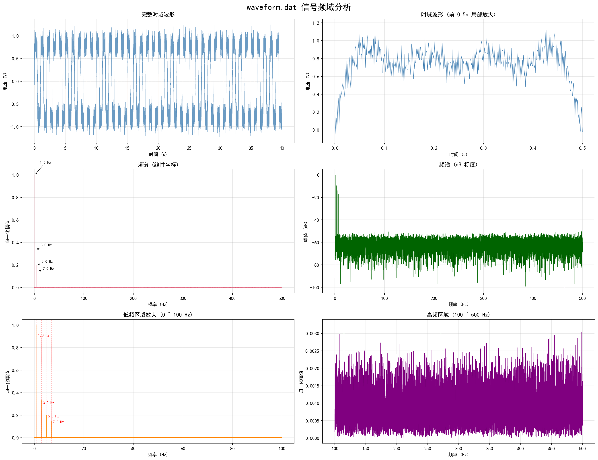
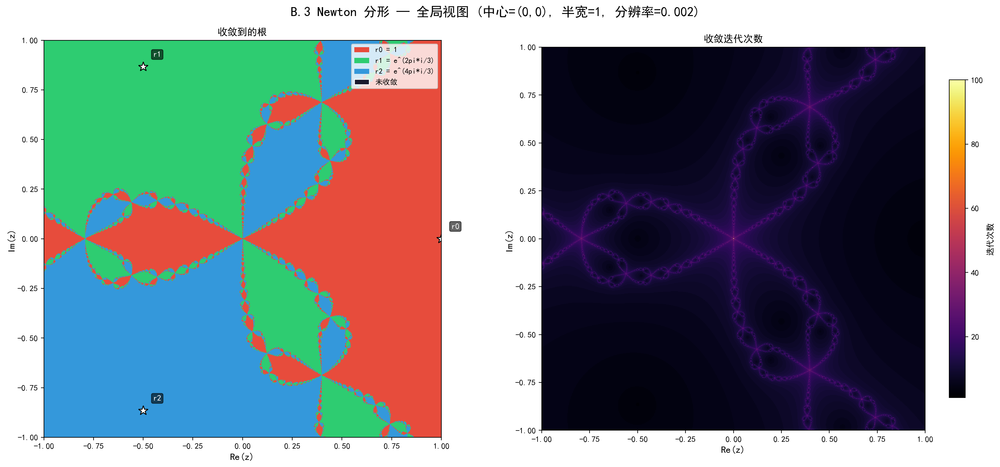
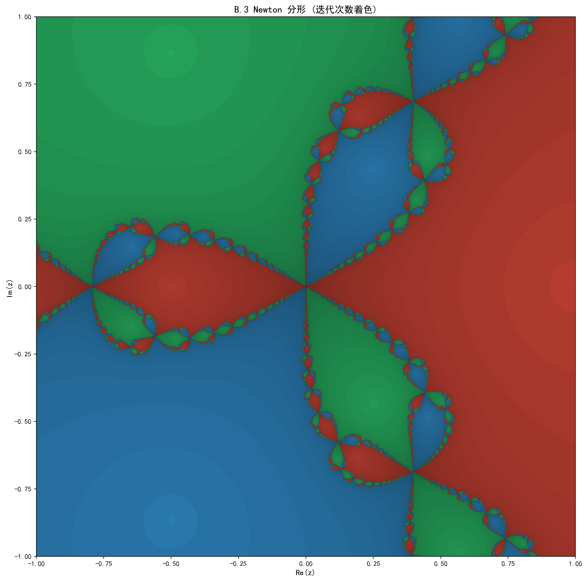
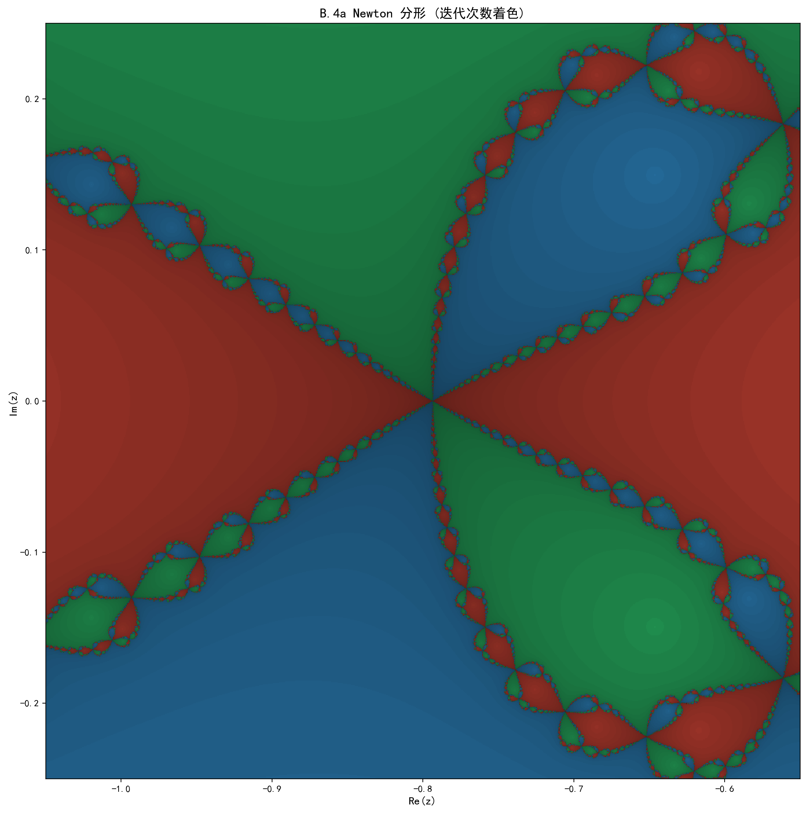
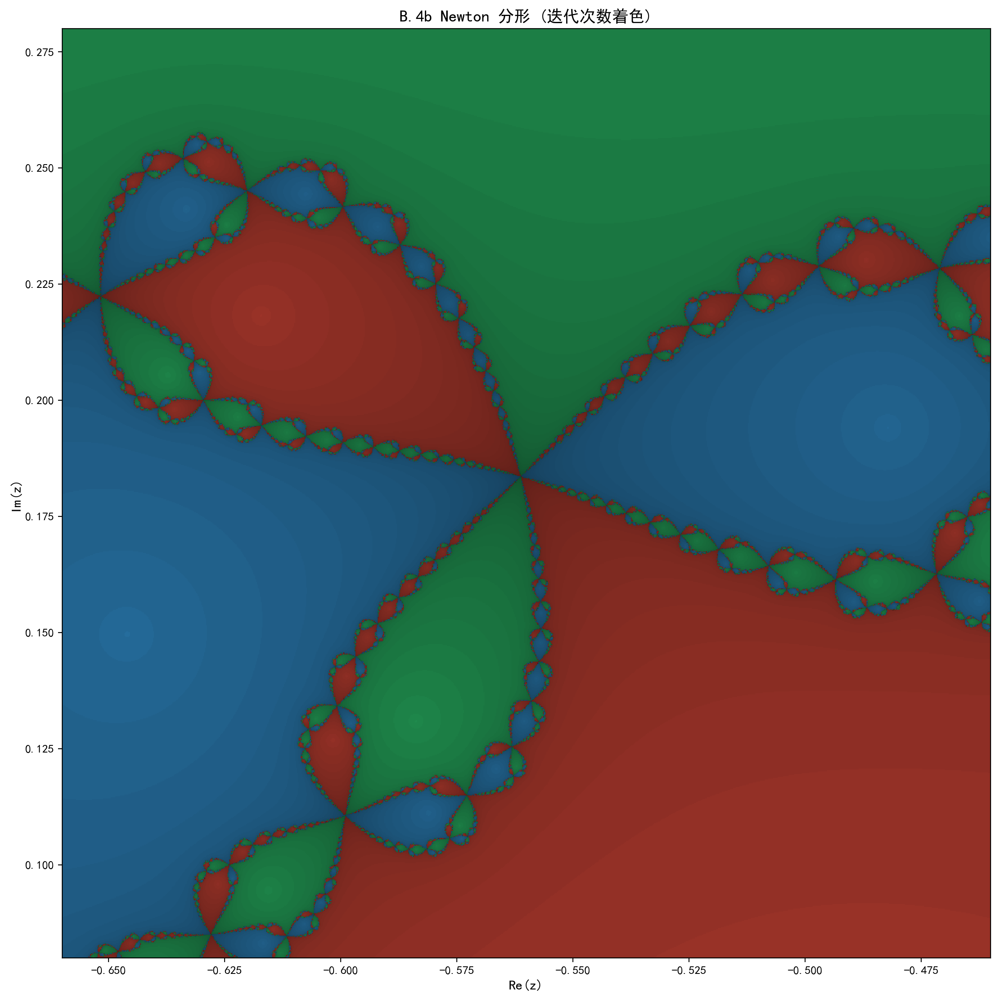
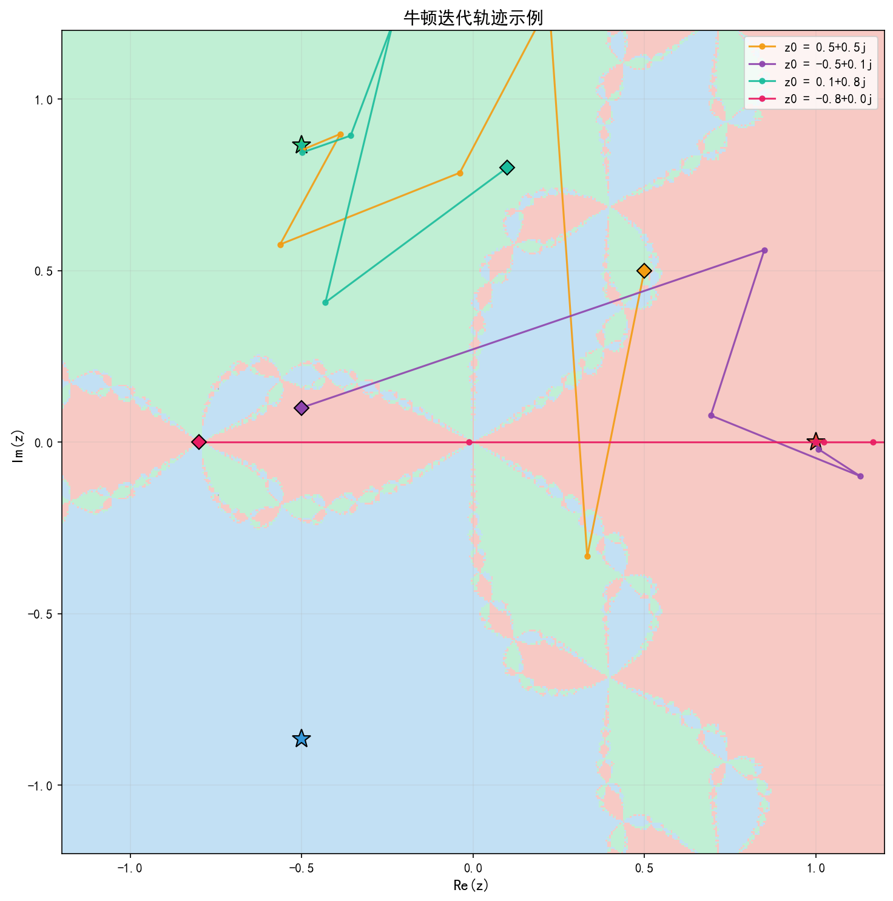

# 计算物理 Homework 2: FFT & 牛顿法

## 目录

- [项目结构](#项目结构)
- [环境与运行](#环境与运行)
- [A. DFT 和 FFT](#a-dft-和-fft)
  - [A.1 离散傅里叶变换 (DFT)](#a1-离散傅里叶变换-dft)
  - [A.2 Base-2 快速傅里叶变换 (FFT)](#a2-base-2-快速傅里叶变换-fft)
  - [A.3 信号频域分析](#a3-信号频域分析)
- [B. 牛顿迭代法](#b-牛顿迭代法)
  - [B.1 方程的根](#b1-方程的根)
  - [B.2 牛顿迭代递推公式](#b2-牛顿迭代递推公式)
  - [B.3 Newton 分形 — 全局视图](#b3-newton-分形--全局视图)
  - [B.4 Newton 分形 — 放大与自相似性](#b4-newton-分形--放大与自相似性)

---

## 项目结构

```
HW-2/
├── config/
│   ├── config.py          # 静态路径配置（项目根目录、数据/输出路径等）
│   └── config.yaml        # 动态运行参数（基准测试重复次数、随机种子、绘图参数等）
├── src/
│   ├── dft.py             # DFT / IDFT 核心算法
│   ├── fft.py             # Base-2 FFT / IFFT 核心算法 (Cooley-Tukey)
│   ├── signal_analysis.py # 信号加载、频谱计算、峰值检测
│   └── newton.py          # 牛顿迭代法核心算法与分形计算
├── scripts/
│   ├── run_dft_test.py         # A.1 DFT 验证与可视化
│   ├── run_fft_benchmark.py    # A.2 FFT 基准测试与复杂度分析
│   ├── run_signal_analysis.py  # A.3 波形信号频域分析
│   └── run_newton_fractal.py   # B.3/B.4 Newton 分形可视化
├── data/
│   └── waveform.dat       # 示波器采集的电压信号数据
├── output/                # 运行脚本自动生成的图片
├── ProbSet_2.md           # 题目原文
└── README.md              # 本文件
```


---

## A. DFT 和 FFT

### A.1 离散傅里叶变换 (DFT)

#### 问题

编写 DFT 程序，接受 `complex128` 一维数组，返回其离散傅里叶变换。给出测试样例并对比库函数结果。

#### 算法

DFT 严格按定义式实现：

$$X[k] = \sum_{n=0}^{N-1} x[n] \cdot e^{-2\pi i \cdot nk / N}, \quad k = 0, 1, \ldots, N-1$$

**关键实现 (`src/dft.py`):** 将上式改写为矩阵-向量乘法 $\mathbf{X} = \mathbf{W} \cdot \mathbf{x}$，其中 DFT 矩阵 $W_{kn} = e^{-2\pi i \cdot kn / N}$。利用 `np.outer(k, n)` 一次性构造指数矩阵，避免显式双重循环。复杂度 $O(N^2)$。

#### 测试结果

对随机 `complex128` 数组，自实现 DFT 与 `numpy.fft.fft` 的对比：

| N   | 最大绝对误差 | 相对误差 (L2) | 通过 |
|-----|-------------|--------------|------|
| 8   | 6.40e-15    | 7.72e-16     | YES  |
| 16  | 1.52e-14    | 1.63e-15     | YES  |
| 32  | 7.83e-14    | 3.98e-15     | YES  |
| 64  | 3.03e-13    | 8.27e-15     | YES  |
| 128 | 7.18e-13    | 1.36e-14     | YES  |

所有测试用例的最大绝对误差均在 $10^{-13}$ 以下，误差来源为浮点运算的舍入误差累积，属于正常范围。

#### 可视化



图中包含：
- 幅值谱 $|X[k]|$ 对比（蓝色自实现 vs 红色 numpy，完全重合）
- 相位谱对比
- 逐点绝对误差（$10^{-14} \sim 10^{-13}$ 量级）
- IDFT 还原误差（验证 $x = \text{IDFT}(\text{DFT}(x))$）

---

### A.2 Base-2 快速傅里叶变换 (FFT)

#### 问题

编写 Base-2 FFT，检查输入长度是否为 2 的幂次，给出 $2^4$ 到 $2^{12}$ 的测试。分析计算复杂度并与标准库对比用时。

#### 算法 — Cooley-Tukey 递归分治

**核心思想 (`src/fft.py`):** 将长度为 $N$ 的 DFT 按奇偶下标拆分为两个 $N/2$ 的子问题，通过蝶形运算合并：

$$X[k] = E[k] + W_N^k \cdot O[k], \quad X[k + N/2] = E[k] - W_N^k \cdot O[k]$$

其中 $W_N^k = e^{-2\pi ik/N}$ 为旋转因子 (twiddle factor)，$E[k]$ 和 $O[k]$ 分别是偶数/奇数子序列的 DFT。

递归终止条件：$N=1$ 时 DFT 就是元素本身。

#### 复杂度分析

| 算法 | 复杂度 | N=4096 时的运算量 |
|------|--------|------------------|
| DFT  | $O(N^2)$ | ~16,777,216 |
| FFT  | $O(N \log N)$ | ~49,152 |

**推导：** 递归关系 $T(N) = 2T(N/2) + O(N)$，共 $\log_2 N$ 层，每层 $N$ 次蝶形运算，总计 $N \log_2 N$。

#### 正确性验证

$2^4$ 到 $2^{12}$ 全部通过（最大绝对误差 < $10^{-8}$）：

| N    | 最大误差    | 通过 |
|------|-----------|------|
| 16   | 1.26e-15  | YES  |
| 32   | 2.59e-15  | YES  |
| 64   | 6.04e-15  | YES  |
| 128  | 1.78e-14  | YES  |
| 256  | 2.42e-14  | YES  |
| 512  | 3.66e-14  | YES  |
| 1024 | 6.90e-14  | YES  |
| 2048 | 1.15e-13  | YES  |
| 4096 | 1.88e-13  | YES  |

#### 性能对比

使用 `time.perf_counter_ns()` 计时（纳秒精度），每个大小重复 5 次取中位数：

| N    | 自实现 FFT | numpy FFT | 自实现 DFT | FFT/numpy 速度比 |
|------|-----------|-----------|-----------|-----------------|
| 16   | 162 us    | 3.2 us    | 32 us     | ~50x            |
| 64   | 774 us    | 3.2 us    | 576 us    | ~242x           |
| 256  | 3.24 ms   | 5.3 us    | 4.24 ms   | ~611x           |
| 1024 | 10.0 ms   | 22 us     | 55.7 ms   | ~454x           |
| 4096 | 44.1 ms   | 57.7 us   | N/A       | ~764x           |

**分析：**

1. **自实现 FFT 确实比 DFT 快。** 在 N=1024 时，FFT 耗时 10ms vs DFT 的 56ms，加速约 5.6 倍。理论上 $N / \log_2 N = 1024/10 = 102$ 倍，实际加速比较小是因为 Python 递归的额外开销抵消了一部分算法优势。

2. **自实现 FFT 比 numpy 慢约 50~800 倍。** 原因很明确：
   - numpy 底层调用 C/Fortran 编写的 FFTPACK / pocketfft，无解释器开销
   - 自实现使用 Python 递归，每次递归都有函数调用和数组切片开销
   - numpy 在底层使用了 SIMD 向量化指令和缓存优化

3. **复杂度趋势符合理论。** 从双对数图中可以看到，自实现 FFT 的斜率与 $O(N\log N)$ 参考线平行，DFT 的斜率与 $O(N^2)$ 参考线平行。



---

### A.3 信号频域分析

#### 问题

分析 `waveform.dat` 中示波器测量的电压信号的频域特征。

#### 数据概况

| 参数 | 值 |
|------|-----|
| 采样点数 | 40,000 |
| 采样间隔 | 0.001 s |
| 采样率 | 1000 Hz |
| 总时长 | 40 s |
| Nyquist 频率 | 500 Hz |
| 电压范围 | [-1.23, 1.25] V |

#### 频谱分析结果

FFT 后发现 **4 个显著的频率分量**，全部位于低频区域：

| 频率 (Hz) | 归一化幅值 | 周期 (s) | 与基频之比 |
|-----------|-----------|---------|-----------|
| **1.00**  | 1.0000    | 1.000   | 1 (基频)  |
| **3.00**  | 0.3340    | 0.333   | 3         |
| **5.00**  | 0.2006    | 0.200   | 5         |
| **7.00**  | 0.1439    | 0.143   | 7         |

#### 发现

这是一个 **方波信号** 叠加白噪声。判断依据：

1. **仅包含奇次谐波：** 频率分量为基频的 1, 3, 5, 7 倍，偶次谐波缺失——这是方波的标志性特征。

2. **幅值比接近 $1/n$：** 方波的傅里叶级数展开为：
   $$f(t) = \frac{4}{\pi} \sum_{n=1,3,5,...} \frac{1}{n} \sin(n\omega_0 t)$$
   理论幅值比为 $1 : 1/3 : 1/5 : 1/7 = 1 : 0.333 : 0.200 : 0.143$，与实测值 $1 : 0.334 : 0.201 : 0.144$ 高度吻合。

3. **宽带噪声本底：** 除了上述离散谱线外，整个频带内存在均匀的低幅值噪声本底（约 0.001~0.003），呈现白噪声特征。

4. **信号稳态性：** 从时频图 (Spectrogram) 可以看出，各频率分量在整个 40s 时间段内幅值恒定，说明信号是稳态的。



时频图中可清晰看到 1, 3, 5, 7 Hz 四条水平谐波带，亮度依次递减（对应 $1/n$ 幅值衰减），且在 0~40s 内保持均匀，证实了信号的稳态特征。9 Hz 以上为均匀噪声本底。

#### 可视化



图中包含：
- 完整 40s 时域波形 + 前 5s 局部放大（可见方波的正负半周交替）
- 频谱信号区域 (0~15 Hz) 放大，各峰标注频率与幅值
- dB 标度全频段频谱
- **实测 vs 方波理论 $1/n$ 的谐波幅值柱状对比** — 高度吻合
- 噪声本底分析（10~500 Hz 区间中位值约 0.001）

---

## B. 牛顿迭代法

### B.1 方程的根

求解 $f(z) = z^3 - 1 = 0$。

$z^3 = 1$ 的解是 **三次单位根**（unit roots of order 3），在复平面上均匀分布在单位圆上，相邻根之间夹角 $120°$：

$$r_0 = 1, \quad r_1 = e^{2\pi i/3} = -\frac{1}{2} + \frac{\sqrt{3}}{2}i, \quad r_2 = e^{4\pi i/3} = -\frac{1}{2} - \frac{\sqrt{3}}{2}i$$

可以验证：$z^3 - 1 = (z - r_0)(z - r_1)(z - r_2)$。

---

### B.2 牛顿迭代递推公式

对于一般函数 $f(z)$，**牛顿迭代法**的递推公式为：

$$\boxed{z_{n+1} = z_n - \frac{f(z_n)}{f'(z_n)}}$$

几何直觉：在 $z_n$ 处用切线近似 $f$，取切线的零点作为下一步的估计。

对于 $f(z) = z^3 - 1$，$f'(z) = 3z^2$，代入得到具体的递推公式：

$$z_{n+1} = z_n - \frac{z_n^3 - 1}{3z_n^2} = \frac{2z_n^3 + 1}{3z_n^2}$$

**关键实现 (`src/newton.py`):** `newton_step_z3()` 函数对整个网格向量化执行上式，对 $|f'(z)| < 10^{-15}$ 的点做除零保护。

---

### B.3 Newton 分形 — 全局视图

#### 问题

在以 $(0, 0)$ 为中心、半宽为 1 的正方形区域内，以分辨率 0.002 对每个初始点 $z_0 = x + iy$ 执行牛顿迭代，观察其收敛到哪个根。

#### 结果

网格 $1001 \times 1001 = 1{,}002{,}001$ 个点，最大迭代 100 次。



**左图**为根归属图（红=r0、绿=r1、蓝=r2），**右图**为迭代次数热力图（亮色=收敛慢，暗色=收敛快）。

迭代次数着色版本（亮度 $\propto$ 收敛速度）：



**观察：**
- 复平面被分成三个 **吸引盆** (basins of attraction)，分别收敛到三个根。
- 每个吸引盆的大部分区域中，初始点仅需 5~10 次迭代即可收敛。
- 三个吸引盆的边界不是光滑曲线，而是呈现复杂的 **分形结构**。
- 边界上的点需要大量迭代才能收敛（迭代次数热力图中的亮线），甚至可能不收敛。
- 整体结构具有 $120°$ 旋转对称性，反映了三个根在单位圆上的对称分布。

---

### B.4 Newton 分形 — 放大与自相似性

#### B.4a 放大到 (-0.8, 0.0) 附近

区域：以 $(-0.8, 0.0)$ 为中心，半宽 $0.25$，分辨率 $0.0005$。



#### B.4b 放大到 (-0.56, 0.18) 附近

区域：以 $(-0.56, 0.18)$ 为中心，半宽 $0.1$，分辨率 $0.0002$。



#### 发现的有趣现象

1. **自相似性 (Self-similarity)：** 这是分形最核心的特征。无论放大到什么尺度，我们都能观察到与全局图形相同的三叶花结构不断重复。B.4a 中可以看到和全局图完全一致的"花瓣"形状；B.4b 进一步放大后，每个小花瓣内部又包含更小的三叶结构——"递归式"地无限嵌套。

2. **分形边界 (Fractal boundary)：** 三个吸引盆的边界是 Julia 集的一部分，具有非整数的 Hausdorff 维数。边界不是光滑的（甚至不是可微的），而是处处"锯齿状"——**任意两个吸引盆的边界上，总能找到第三个吸引盆的点**。换言之，三个区域的边界完全重合，这一性质由 Shishikura 于 1990 年代严格证明。

3. **混沌敏感性：** 在分形边界附近，初始点的微小偏移就可能导致收敛到完全不同的根。这是确定性混沌的经典表现——迭代映射本身完全确定，但结果对初始条件极端敏感。

4. **迭代次数在边界处发散：** 从迭代次数热力图可以看到，边界处的点需要远多于内部点的迭代次数。在精确的边界上（Julia 集），牛顿迭代永远不会收敛到任何根。

#### 额外可视化：迭代轨迹



图中展示了 4 个不同初始点的牛顿迭代轨迹。可以看到：
- 远离边界的点（如 $z_0 = -0.8$）几乎直线收敛到最近的根。
- 靠近边界的点（如 $z_0 = -0.5 + 0.1i$）轨迹曲折，可能"跳过"最近的根而收敛到远处的根。

