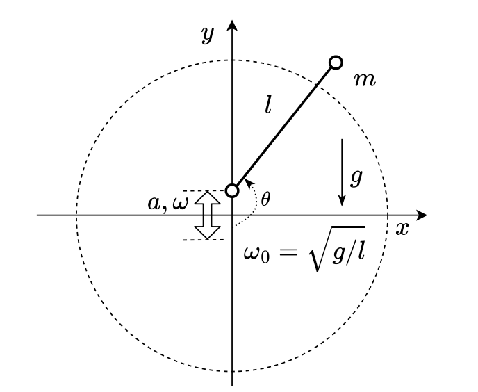
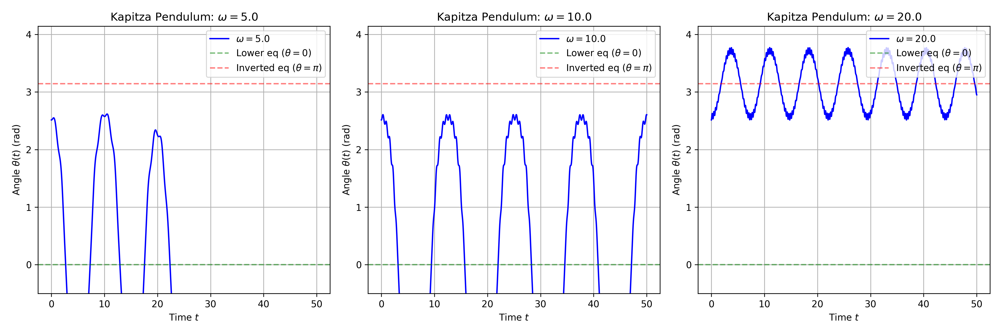
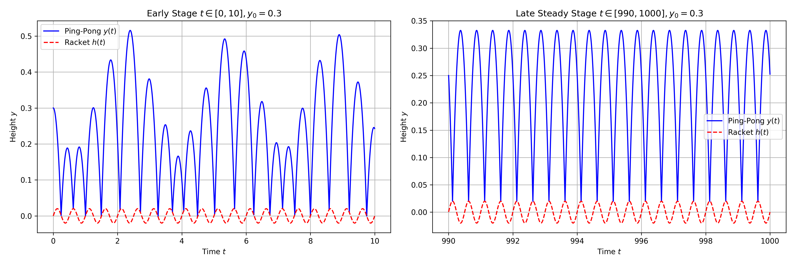
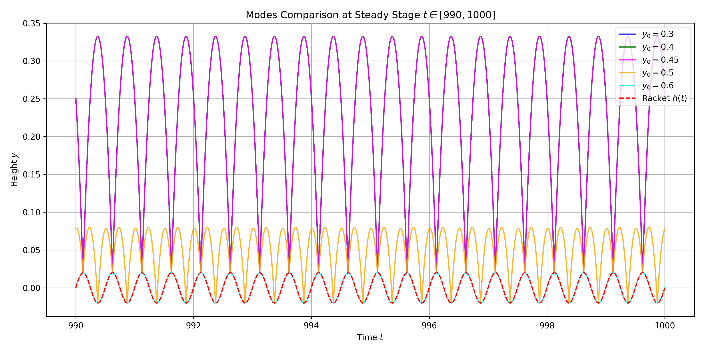

# Computational Physics - Homework 3


## 问题A：Kapitza 摆 (Kapitza Pendulum)

### A.1 系统建模与运动方程



取 $\theta$ 作为广义坐标（摆偏离 $y$ 轴负方向的角度），向下为 $\theta=0$，向上 $\theta=\pi$。
摆锤的坐标为：
$$x = l \sin \theta \\
y = a \cos(\omega t) - l \cos \theta$$
对其求导，得到速度的平方：
$$\dot{x}^2 + \dot{y}^2 = l^2 \dot{\theta}^2 - 2 a l \omega \sin(\omega t) \sin\theta \, \dot{\theta} + a^2 \omega^2 \sin^2(\omega t)$$
因此，系统的拉格朗日量 $L = T - V$ 为：
$$L = \frac{1}{2} m \left[ l^2 \dot{\theta}^2 - 2 a l \omega \sin(\omega t) \sin\theta \, \dot{\theta} + a^2 \omega^2 \sin^2(\omega t) \right] - mg(a \cos\omega t - l \cos\theta)$$
应用欧拉-拉格朗日方程 $\frac{d}{dt} \left( \frac{\partial L}{\partial \dot{\theta}} \right) - \frac{\partial L}{\partial \theta} = 0$ 进行推导：
1. $\frac{\partial L}{\partial \dot{\theta}} = m l^2 \dot{\theta} - m a l \omega \sin(\omega t) \sin\theta$
2. $\frac{d}{dt} \left( \frac{\partial L}{\partial \dot{\theta}} \right) = m l^2 \ddot{\theta} - m a l \omega^2 \cos(\omega t) \sin\theta - m a l \omega \sin(\omega t) \cos\theta \dot{\theta}$
3. $\frac{\partial L}{\partial \theta} = - m a l \omega \sin(\omega t) \cos\theta \dot{\theta} - mgl \sin \theta$

两者相减后化简得到系统的运动方程：
$$m l^2 \ddot{\theta} - m a l \omega^2 \cos(\omega t) \sin\theta + mgl \sin \theta = 0$$
化简得到角加速度：
$$\ddot{\theta} = - \left( \frac{g}{l} - \frac{a \omega^2}{l} \cos(\omega t) \right) \sin \theta$$
设系统的广义状态变量为 $u = [\theta, \dot{\theta}]^T$，以及系统参数 $p = \{l, m, g, a, \omega\}$，则运动方程可以显式地转换为如下的一阶偏微分方程组的向量形式：
$$\frac{d}{dt}u(t) = f(u,t,p) = 
\begin{bmatrix}
u_1 \\
-\left( \frac{g}{l} - \frac{a \omega^2}{l} \cos(\omega t) \right) \sin u_0
\end{bmatrix}$$
### A.2 Runge-Kutta 等数值方法实现

在 `src/ode_solver.py` 中，我们编写了一个经典的 4阶 Runge-Kutta 求解器（RK4），接口受 SciPy 的 `solve_ivp` 设计启发，使得任何满足 $f(t, y, *args)$ 的一阶ODE组在此接口中都可以直接调用。求解器的核心代码摘录如下：
```python
def rk4_step(f, t, y, dt, *args):
    k1 = f(t, y, *args)
    k2 = f(t + 0.5 * dt, y + 0.5 * dt * k1, *args)
    k3 = f(t + 0.5 * dt, y + 0.5 * dt * k2, *args)
    k4 = f(t + dt, y + dt * k3, *args)
    return y + (dt / 6.0) * (k1 + 2 * k2 + 2 * k3 + k4)
```
> **显式写出动力学 $f(u,t,p)$ 的意义：** 任何高阶常微分方程或方程组都可以并应当转化为第一阶常微分方程的向量流形式（如欧拉观点）。因为标准的数值方法（如RK4）依赖于根据当前状态 $(t, u)$ 前向计算局部切向量向来逼近下一步轨迹，我们只需知道系统当前流形的切向量。这种抽象让同样的 ODE 求解代码具备了极高的**通用性**。

### A.3 物理现象发现

针对 $l=m=g=1, a=0.1$ 和初始条件 $\theta(0) = \frac{4}{5}\pi, \dot{\theta}(0)=0$：
我们使用编写好的求解器代入不同频率 $\omega$ 进行积分，模拟结果如下：



可以观察到截然不同的动力学现象：
1. **$\omega = 5$**：运动极不稳定，摆锤不仅会迅速掉落，还会受强迫振动发生**绕轴翻旋**（$\theta$ 随时间向负方向不断增加超过 $2\pi$ 并持续震荡漂移）。
2. **$\omega = 10$**：高频分量不足以维持小球于倒置态，摆锤向下坠落，并越过最低点在 $\theta \approx 0$（即自然悬垂位置）附近进行长期的**周期振荡**（围绕下稳定点）。
3. **$\omega = 20$**：一个奇妙的现象发生了。尽管摆的初始位置 $\frac{4}{5}\pi$ 受重力会往下掉，但极高频的底座振荡导致摆锤没能掉下，而是反而向上靠拢，然后在 $\theta \approx \pi$（即**倒置/倒立状态**）附近稳定地振荡！

### A.4 理论合理解释

上述现象可以用**有效势能法 (Effective Potential)** 进行理论解释：
Kapitza摆存在快变量（底座的高频震动产生）和慢变量（宏观摆动）。在 $\omega \gg \sqrt{g/l}$ 且振幅微小的条件下，将角度分离为慢速漂移分量 $\Theta$ 与高频微小颤动分量 $\xi$，经过平均法积分掉高频项后，系统有效势能 $V_{\text{eff}}(\theta)$ 近似由重力势能和高频动能的皮动势加成构成：
$$V_{\text{eff}}(\theta) \approx mgl (1 - \cos\theta) + \frac{m a^2 \omega^2}{4} \sin^2\theta$$
我们需要分析 $\theta = \pi$ 处的稳定性（在最高点 $\cos\pi = -1, \sin\pi = 0$）：
其对 $\theta$ 的二阶导数为：
$$\frac{d^2 V_{\mathrm{eff}}}{d\theta^2} \Bigg|_{\theta=\pi} = mgl\cos\pi + \frac{m a^2 \omega^2}{2} (\cos^2\pi - \sin^2\pi) = -mgl + \frac{m a^2 \omega^2}{2}$$
当二阶导数 $>0$ 时，这个倒置平衡点就会从“不稳定鞍点”变为“稳定极小值点”。即：
$$\frac{a^2 \omega^2}{2} > gl \implies \omega > \sqrt{\frac{2gl}{a^2}} = \frac{\sqrt{2} \times 1}{0.1} \approx 14.14 \text{ rad/s}$$
*当 $\omega = 5, 10$ 时，$\omega < 14.14$，此条件未满足，有效势无法形成倒置点的势阱，重力主导摆锤下落；*
*当 $\omega = 20$ 时，$\omega > 14.14$，倒置位置有效势能存在一个局域稳定势阱，动能带来的高频压制力超过了重力倾覆力矩，从而把小摆锤稳稳地支撑在了空中。这就解释了为什么 $\omega=20$ 下摆会悬停并振荡。*

---

## 问题B：乒乓球 (Ping-Pong Bouncing)

### B.1 系统完整方程与碰撞规则

乒乓球受到重力与阻力，且将坐标和速度作为广义状态变量 $u = [y, v]^T$，运动方程在空中为：
$$\begin{cases}
\dot{y} = v \\
\dot{v} = -g - \gamma v
\end{cases}$$
当球触碰球拍时，位置满足 $y(t) = h(t) = A\sin(\omega t)$。
球拍由于质量极大，速度不受碰撞影响，因此碰后状态改变遵循完美弹性碰撞（相对速度反向）：
$$\begin{cases}
y_{after} = h(t_c) \\
v_{after} = 2A\omega\cos(\omega t_c) - v_{before}
\end{cases}$$

### B.2 碰撞的数值处理（Event Detection）

对于此类具有不连续跳跃边界的ODE问题，如果简单的按照固定步长 $dt$ 更新，很大可能 $dt$ 跨过边界后，球已经进入拍子底下造成负反馈错误甚至越界。为了高精度处理这个问题，我们需要引入碰撞事件检测机制。
1. **跨界检测**：在每一步的RK4评估出试探积分点后，检查是否满足 $y_{next} < h(t_{next})$。
2. **事件定位**：如果检测到跨界，在区间内使用二分法 (Bisection Method) 将时间步长细分，定位出极其精准的碰撞时间 $t_c$。
3. **状态突变与重启**：在 $t=t_c$ 处，更改速度的符号到 $v_{after}$，然后重启积分器。代码 `src/pingpong.py` 中的 `solve_with_collisions()` 即为此方法的实现。

### B.3 数值现象与稳态模式分析

**i. 不同时间段轨迹展示**
以下展示了 $y_0 = 0.3$ 下的模拟情况：



由于初始较高能量，小球初期产生混沌和高跳；但在末端 990-1000s 区间，小球已经彻底趋于一个极其规整的周期稳定解。

**ii. 稳定模式分析**
以下对比了不同初值 $y_0$ 的末态表现 (相图和时序稳定态)：



可以看出由于初值落在不同的吸引域 (basin of attraction)，它们进入了**不同的亚谐波锁定模式 (sub-harmonic resonance)**。有些是每次拍子上升都发生碰撞（1周期），有些则因为弹得很高，在空中飞过了几个拍子周期才落下（n周期）。

**iii. 耗散的作用**
阻尼引起系统相空间体积的指数收缩。如果没有阻尼，乒乓球很容易发生费米加速 (Fermi Acceleration)，即无限制地吸收能量；有了耗散，阻力消磨掉多余能量，系统最终被局限在收敛的低维吸引子（Attractor）上。

### B.4 更为精确的方法

该问题在原理上有 **分段精确解析法 (Piecewise Exact Method)**。
在两次碰撞之间的空中飞行段，运动微分方程是常系数线性方程，有严格的解析解：
$y(t) = C_1 + C_2 e^{-\gamma t} - \frac{g}{\gamma} t$ 
此时完全不需要使用离散的RK4差分方法，进而没有任何截断误差。只需要给定出发点，直接结合求根算法（如牛顿法）高精度解出超越方程 $y(t_c) = A\sin(\omega t_c)$ 找到下一个相交碰撞时间 $t_c$，迭代替换初值即可。此方法仅受系统浮点数舍入误差的限制。
