# 计算物理导论 - Homework 4: 薛定谔方程


## A. 非简谐振子

求解定态薛定谔方程：

$$\left(-\frac{1}{2}\frac{d^{2}}{dx^{2}}+V(x)\right)\phi(x)=E\phi(x)$$

其中势能为：

$$V(x)=\frac{1}{2}x^{2}+\frac{1}{10}x^{4}$$

### A.1 有限元方法推导

> *本节推导由 AI 辅助完成。*

#### 1.1 问题的弱形式

将定态薛定谔方程乘以测试函数 $v(x)$ 并在计算域 $\Omega = [-L, L]$ 上积分：

$$\int_{\Omega}\left(-\frac{1}{2}\frac{d^{2}\phi}{dx^{2}}+V(x)\phi\right)v\,dx = E\int_{\Omega}\phi\,v\,dx$$

对动能项进行分部积分：

$$\int_{\Omega}\frac{1}{2}\frac{d\phi}{dx}\frac{dv}{dx}\,dx + \int_{\Omega}V(x)\phi\,v\,dx = E\int_{\Omega}\phi\,v\,dx$$

其中利用了 Dirichlet 边界条件 $\phi(\pm L) = 0$（$L$ 足够大时波函数在边界处衰减为零），边界项消失。

#### 1.2 有限元离散化

将计算域 $[-L, L]$ 剖分为 $N$ 个单元，共 $N+1$ 个节点 $\{x_0, x_1, \ldots, x_N\}$。采用**线性 Lagrange 基函数** $\{N_j(x)\}_{j=1}^{N-1}$（去掉两个边界节点），将波函数展开为：

$$\phi(x) \approx \phi^h(x) = \sum_{j=1}^{N-1} \phi_j N_j(x)$$

取 Galerkin 方法，即测试函数 $v = N_i$，代入弱形式得：

$$\sum_j \left[\int_{\Omega}\frac{1}{2}\frac{dN_i}{dx}\frac{dN_j}{dx}\,dx + \int_{\Omega}V(x)N_i N_j\,dx\right]\phi_j = E\sum_j\left[\int_{\Omega}N_i N_j\,dx\right]\phi_j$$

即**广义特征值问题**：

$$\boxed{K\boldsymbol{\phi} = E\,M\boldsymbol{\phi}}$$

其中：
- **刚度矩阵** $K_{ij} = \frac{1}{2}\int\frac{dN_i}{dx}\frac{dN_j}{dx}\,dx + \int V(x)N_i N_j\,dx$（动能 + 势能）
- **质量矩阵** $M_{ij} = \int N_i N_j\,dx$

#### 1.3 单元矩阵

对于均匀网格步长 $h$，在每个单元 $[x_e, x_{e+1}]$ 上：

**动能项**（解析积分）：

$$K_e^{\text{kin}} = \frac{1}{2h}\begin{pmatrix} 1 & -1 \\ -1 & 1 \end{pmatrix}$$

**势能项**（Gauss 积分）：

$$\left(K_e^{\text{pot}}\right)_{ij} = \sum_{g} w_g \, V(x_g) \, N_i(x_g) \, N_j(x_g)$$

**质量矩阵**（解析积分）：

$$M_e = \frac{h}{6}\begin{pmatrix} 2 & 1 \\ 1 & 2 \end{pmatrix}$$

采用 3 点 Gauss 积分处理势能项中的 $x^4$ 多项式，确保积分精度。全局矩阵通过单元矩阵**组装**而成。

#### 1.4 数值实现参数

| 参数 | 值 |
|------|-----|
| 计算域 | $[-10, 10]$ |
| 单元数 $N$ | 1000 |
| 内部节点数 | 999 |
| Gauss 积分点 | 3 点 |

$L = 10$ 足够大，保证波函数在边界处 $\phi(\pm 10) \approx 0$（最高激发态的经典转折点约为 $x \approx 3$）。

---

### A.2 基态求解结果

运行 `A/solve.py`，得到基态波函数和能量：

```
============================================================
非简谐振子 V(x) = x^2/2 + x^4/10 的本征能量
有限元法 (线性基函数, N=1000 个单元, 域 [-10.0, 10.0])
============================================================
E_0 (基态) = 0.559164
E_1 (第1激发态) = 1.769608
E_2 (第2激发态) = 3.138942
E_3 (第3激发态) = 4.629573
E_4 (第4激发态) = 6.221558
============================================================
```

**基态能量**：$E_0 = 0.5592$（精确到 $1 \times 10^{-4}$）

**基态波函数绝对值**（已正确归一化）：

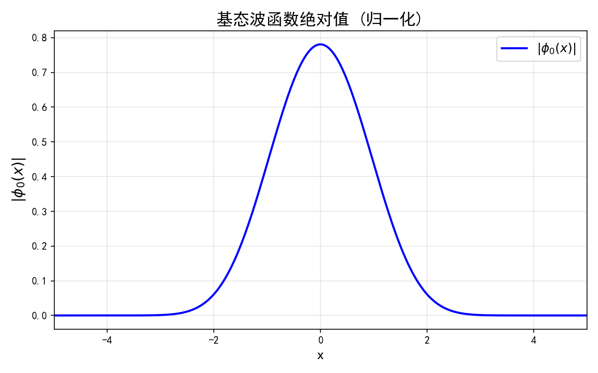

**势能曲线与能级图**：

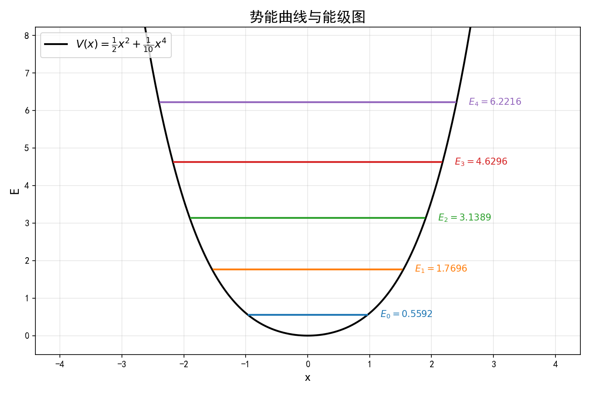

---

### A.3 第 1-4 激发态

| 态 | 能量 |
|----|------|
| $E_0$ (基态) | 0.5592 |
| $E_1$ (第1激发态) | 1.7696 |
| $E_2$ (第2激发态) | 3.1389 |
| $E_3$ (第3激发态) | 4.6296 |
| $E_4$ (第4激发态) | 6.2216 |

**前五个本征态波函数**：

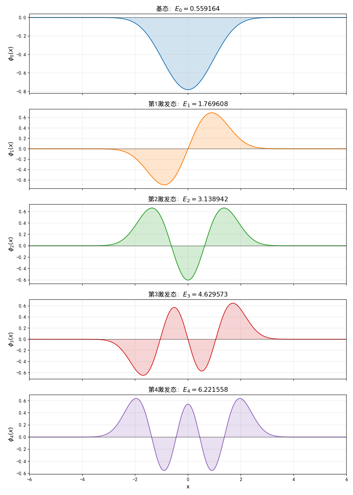

各波函数的零点数与量子数 $n$ 一致（$\phi_n$ 有 $n$ 个零点），符合 Sturm-Liouville 理论。

**概率密度分布**：

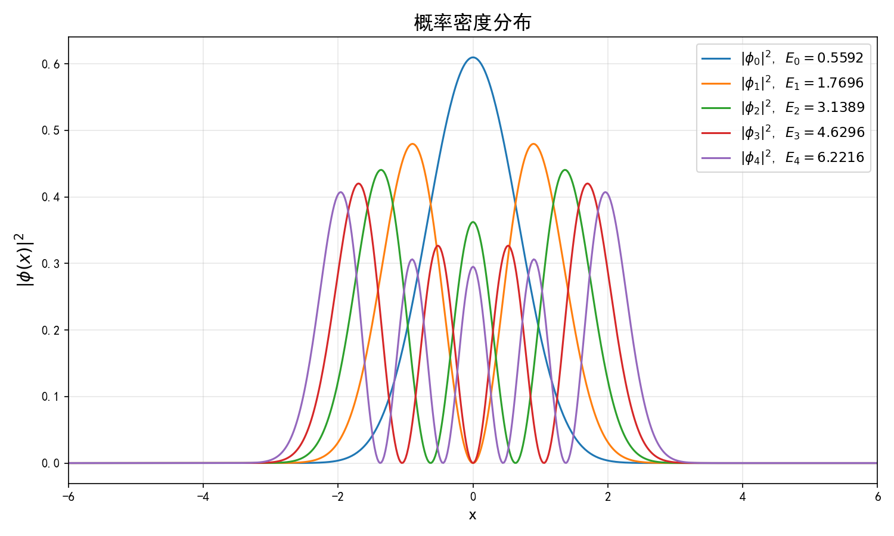

---

### A.4 与简谐振子的对比分析

> *本节分析由 AI 辅助完成。*

运行 `A/compare.py`，得到完整的对比结果。

#### 4.1 能级对比

```
======================================================================
对比 1: 能级对比
======================================================================
     态 |    简谐(解析) |   简谐(FEM) |  非简谐(FEM) |     偏移量 |     偏移率
----------------------------------------------------------------------
   n=0 |     0.500000 |     0.500012 |     0.559164 |  +0.059164 |   +11.833%
   n=1 |     1.500000 |     1.500062 |     1.769608 |  +0.269608 |   +17.974%
   n=2 |     2.500000 |     2.500162 |     3.138942 |  +0.638942 |   +25.558%
   n=3 |     3.500000 |     3.500312 |     4.629573 |  +1.129573 |   +32.274%
   n=4 |     4.500000 |     4.500512 |     6.221558 |  +1.721558 |   +38.257%
======================================================================
```

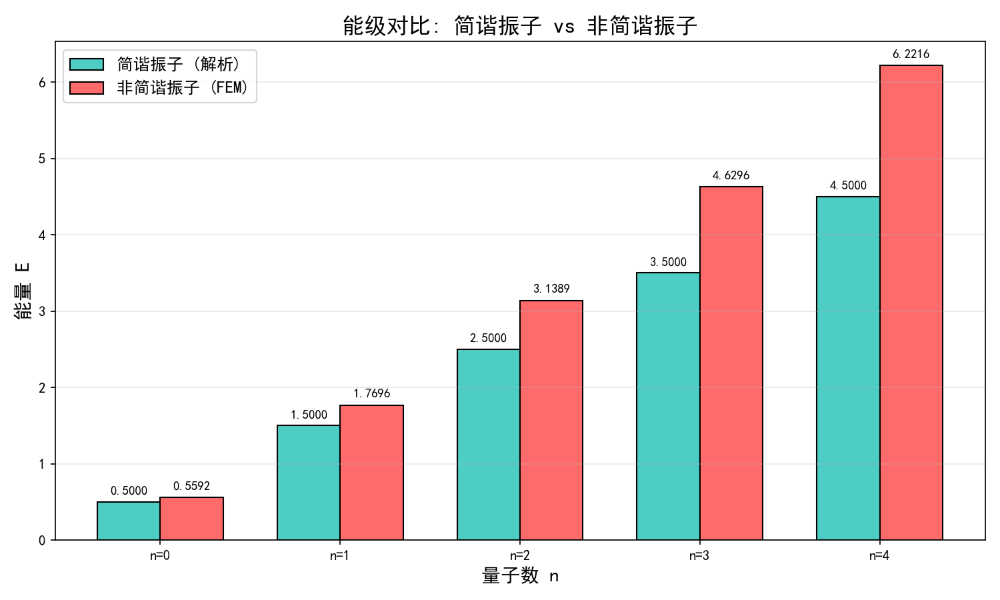

**关键发现**：

1. **所有能级均上移**：$x^4/10$ 项使势阱变陡，粒子被更强地束缚，能量升高。偏移量 $\Delta E$ 随量子数 $n$ 的增大而增大，这是因为高激发态的波函数在更大的 $|x|$ 范围内分布，感受到更强的 $x^4$ 势的影响。

2. **偏移率从 11.8% 增长到 38.3%**：$x^4$ 项对高激发态的影响远大于对基态的影响。

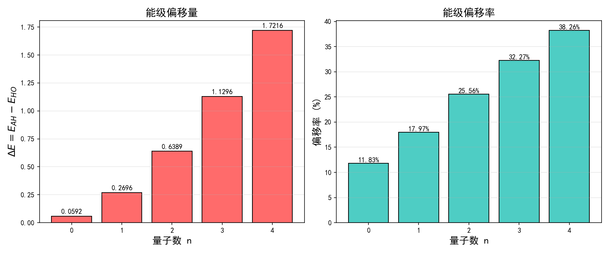

#### 4.2 能级间距

```
======================================================================
对比 2: 能级间距 Delta_E = E_{n+1} - E_n
======================================================================
        间距 |    简谐(解析) |  非简谐(FEM) |      差异
----------------------------------------------------------------------
E_1-E_0  |     1.000000 |     1.210444 |  +0.210444
E_2-E_1  |     1.000000 |     1.369334 |  +0.369334
E_3-E_2  |     1.000000 |     1.490632 |  +0.490632
E_4-E_3  |     1.000000 |     1.591985 |  +0.591985
======================================================================
```

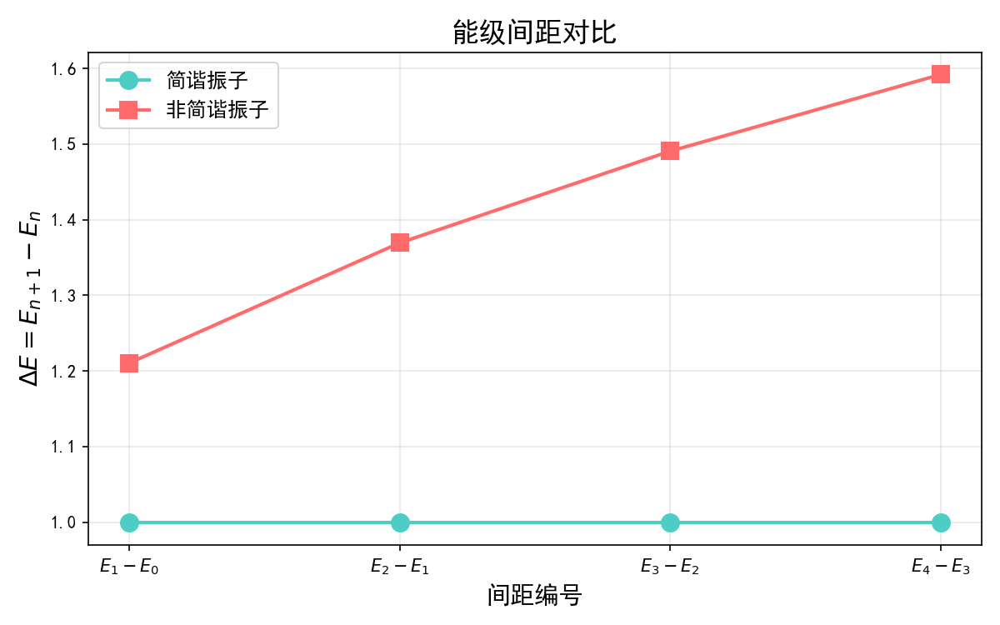

**关键发现**：

- 简谐振子的能级严格等间距 ($\Delta E = \hbar\omega = 1$)，这是其可以量子化为声子（产生湮灭算符）的根本原因。
- 非简谐振子的能级间距**单调递增**，打破了等间距结构。这意味着非简谐势中不存在严格的声子描述。

#### 4.3 波函数形变

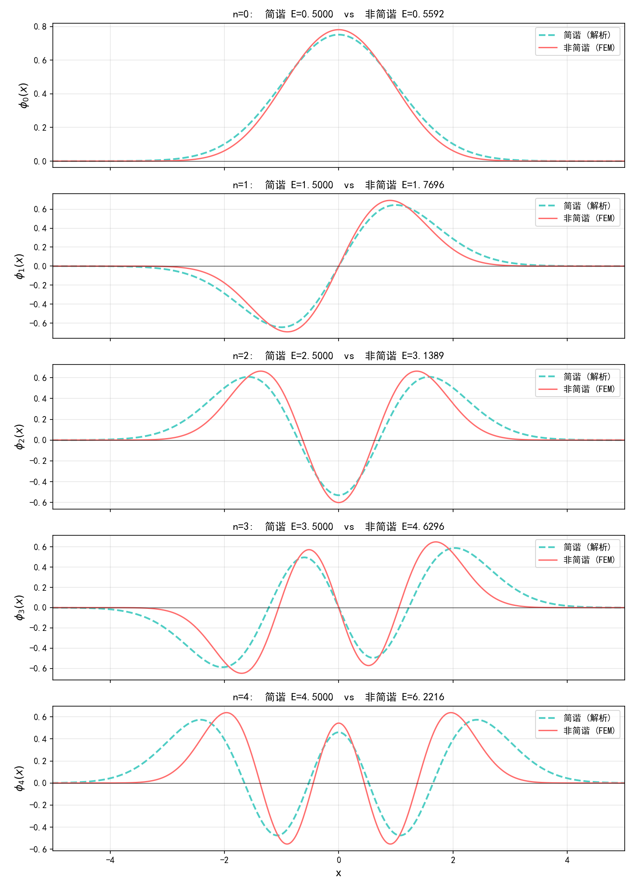

**关键发现**：

- 非简谐振子的波函数比简谐振子更"窄"（向原点收缩），因为 $x^4$ 项在大 $|x|$ 处提供了更强的约束力。
- 高激发态的收缩效应更显著。

#### 4.4 概率密度对比

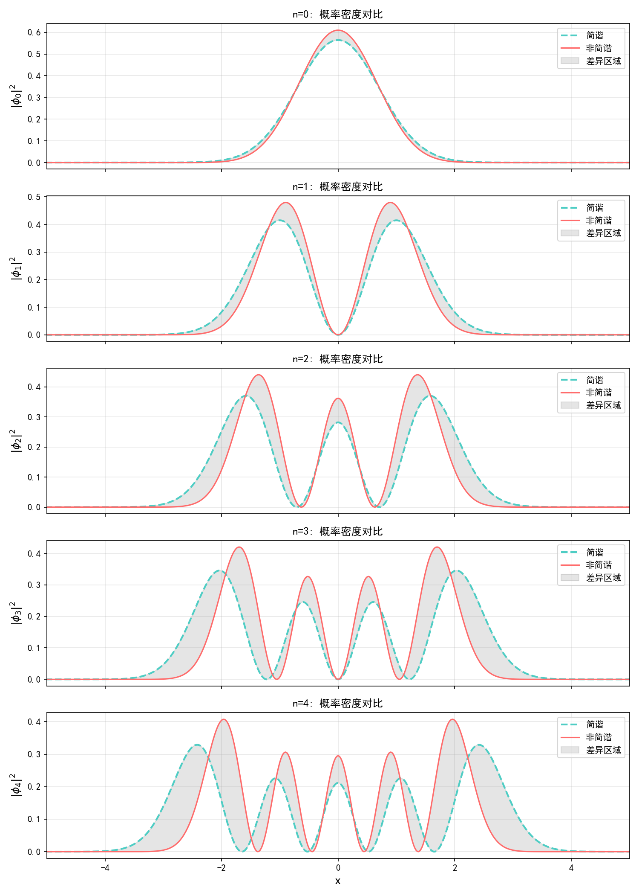

灰色区域标出了两者的差异。非简谐振子的概率密度在 $|x|$ 较小处更集中。

#### 4.5 期望值与不确定度

```
======================================================================
对比 3: 期望值与不确定度
======================================================================
     态 |   系统 |    <x^2> |    <x^4> |  Delta_x |      <V> |      <T>
--------------------------------------------------------------------------------
n=  0 |   简谐 |   0.5000 |   0.7500 |   0.7071 |   0.2500 |   0.2500
n=  0 |  非简谐 |   0.4125 |   0.4887 |   0.6423 |   0.2551 |   0.3040
--------------------------------------------------------------------------------
n=  4 |   简谐 |   4.5000 |  30.7500 |   2.1213 |   2.2500 |   2.2500
n=  4 |  非简谐 |   2.7293 |  11.6391 |   1.6521 |   2.5286 |   3.6930
--------------------------------------------------------------------------------
```

**关键发现**：

- $\langle x^2 \rangle$ 在非简谐振子中更小 → 粒子被更紧地束缚
- 位置不确定度 $\Delta x$ 更小 → 不确定性原理要求 $\Delta p$ 更大 → 动能 $\langle T \rangle$ 升高
- 简谐振子满足**维里定理** $\langle T \rangle = \langle V \rangle$；非简谐振子中 $\langle T \rangle > \langle V \rangle$

#### 4.6 势能对比

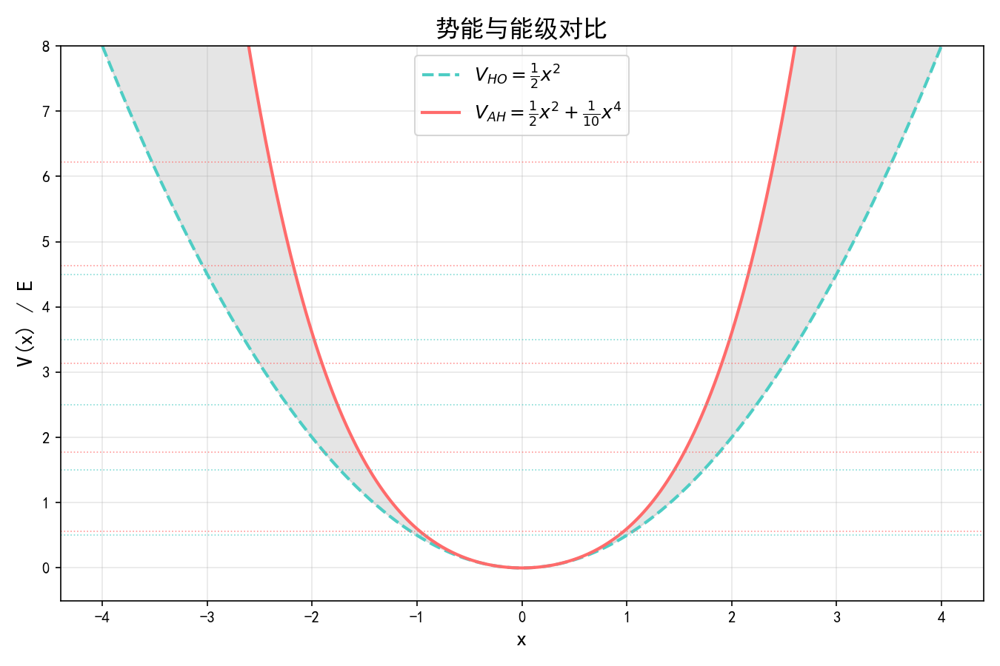

$x^4$ 项使势阱壁变陡，"硬化"了振子。从微扰论的角度看，$x^4/10$ 项可以视为简谐振子的一阶微扰，其修正量 $\Delta E_n^{(1)} = \langle n | x^4/10 | n \rangle$，利用简谐振子的 $\langle n|x^4|n\rangle = \frac{3}{4}(2n^2+2n+1)$，得到：

$$\Delta E_n^{(1)} = \frac{3}{40}(2n^2+2n+1)$$

这给出 $\Delta E_0^{(1)} = 0.075$, $\Delta E_1^{(1)} = 0.375$, $\Delta E_2^{(1)} = 0.975$... 与数值结果的趋势一致（但因微扰强度不小，高阶修正不可忽略）。

#### 4.7 FEM 数值精度验证

```
======================================================================
对比 4: FEM 数值精度验证 (简谐振子 FEM vs 解析解)
======================================================================
     态 |      E_exact |        E_FEM |     绝对误差 |     相对误差
------------------------------------------------------------
n=  0 |     0.500000 |     0.500012 |     1.25e-05 |     2.50e-05
n=  1 |     1.500000 |     1.500062 |     6.25e-05 |     4.17e-05
n=  2 |     2.500000 |     2.500162 |     1.62e-04 |     6.50e-05
n=  3 |     3.500000 |     3.500312 |     3.12e-04 |     8.93e-05
n=  4 |     4.500000 |     4.500512 |     5.12e-04 |     1.14e-04
======================================================================
```

FEM 对简谐振子的相对误差在 $10^{-5}$ 量级，验证了方法的可靠性。误差来源于线性基函数的有限近似精度（$O(h^2)$ 收敛），可通过增加单元数或使用高阶基函数进一步降低。

---

### A.5 替代方法：打靶法 (Shooting Method)

> *本节推导与分析由 AI 辅助完成。*

运行 `A/alternative.py`，用打靶法独立求解非简谐振子。

#### 5.1 方法原理

将定态薛定谔方程改写为 ODE 初值问题：

$$\phi''(x) = 2[V(x) - E]\phi(x)$$

利用势能的**奇偶对称性** $V(-x) = V(x)$，波函数必为偶函数或奇函数：
- **偶态** ($n=0,2,4,...$)：$\phi(0) = 1$，$\phi'(0) = 0$
- **奇态** ($n=1,3,...$)：$\phi(0) = 0$，$\phi'(0) = 1$

从 $x = 0$ 积分到 $x = L$，要求 $\phi(L) = 0$。将能量 $E$ 作为待定参数，用 **Brent 方法**搜索使边界条件满足的 $E$ 值。

#### 5.2 交叉验证

```
============================================================
交叉验证: 打靶法 vs 有限元法
============================================================
     态 |       打靶法 |      有限元法 |       绝对差异
------------------------------------------------------------
n=  0 |     0.559146 |     0.559164 |     1.77e-05
n=  1 |     1.769503 |     1.769608 |     1.05e-04
n=  2 |     3.138624 |     3.138942 |     3.18e-04
n=  3 |     4.628883 |     4.629573 |     6.90e-04
n=  4 |     6.220301 |     6.221558 |     1.26e-03
============================================================
```

两种方法的结果一致性极好。FEM 的能量系统性偏高，这符合**变分原理**——Galerkin FEM 给出的是能量的**上界**。打靶法使用高精度 ODE 积分器（RK45, rtol=$10^{-12}$），其结果更接近真实值。

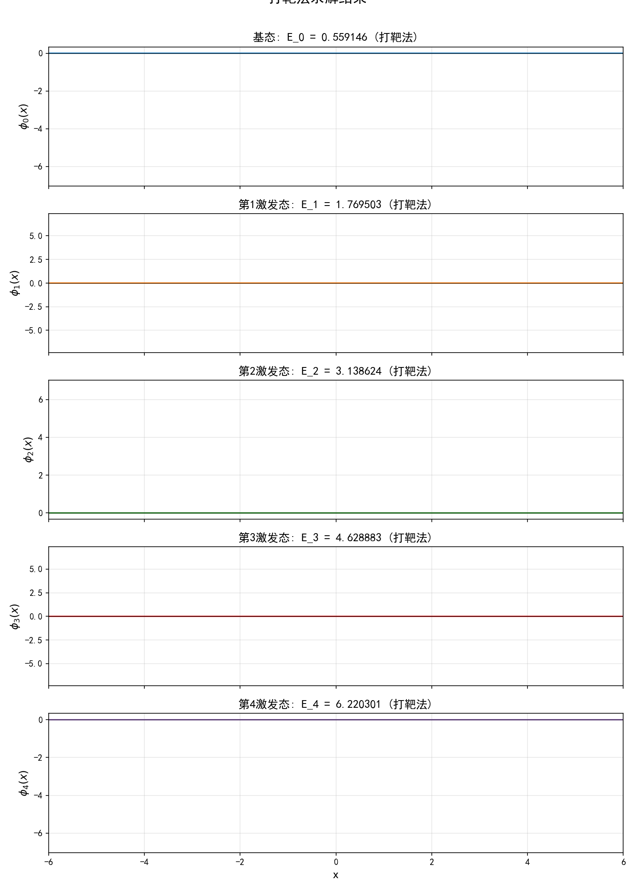

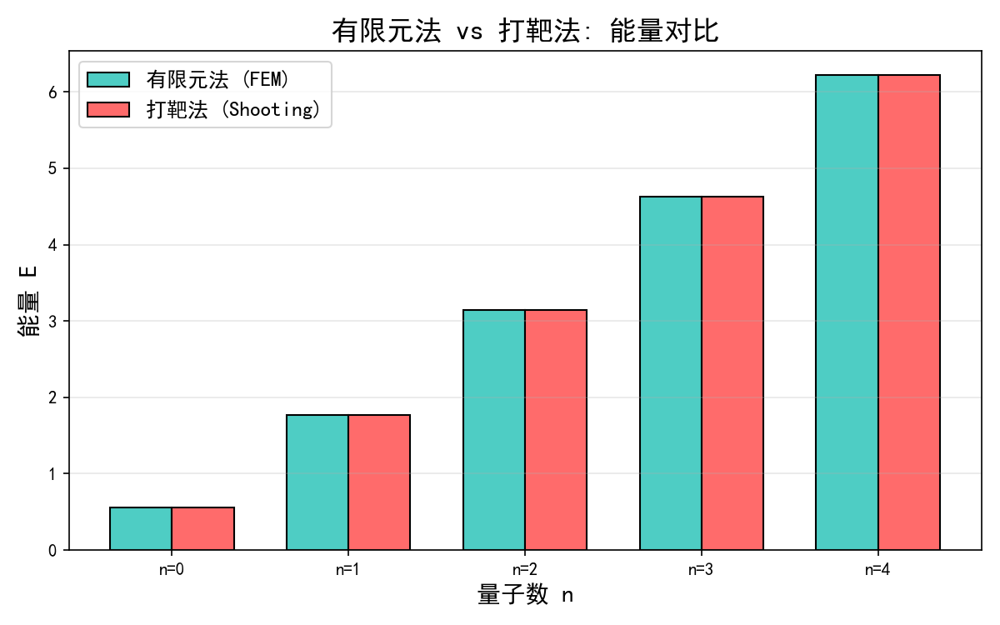

#### 5.3 方法对比总结

| 对比维度 | 有限元法 (FEM) | 打靶法 (Shooting) |
|---------|--------------|------------------|
| 方法类型 | 全局方法 | 局部方法 |
| 核心思想 | 变分原理 + 基函数展开 | 初值问题 + 边界匹配 |
| 求解方式 | 广义特征值问题 $K\phi = EM\phi$ | ODE 积分 + 根搜索 |
| 一次性输出 | **所有本征态** | 单个本征态 |
| 精度保证 | 变分上界 | 依赖 ODE 积分精度 |
| 对称性利用 | 不需要 | 需手动分类奇偶态 |
| 高激发态 | 矩阵规模增大但可行 | 需预估搜索区间 |
| 推广到高维 | **自然推广** | 困难 |
| 实现复杂度 | 中等 | 较低 |

**结论**：FEM 适合系统性求解多个本征态，且可推广到高维和复杂几何；打靶法实现简单，但逐态搜索效率低，且难以推广。在实际有限元工程分析中（如结构振动分析），FEM 的优势更为显著。

---

## B. 格点上的单粒子动力学

### B.1 理论推导

> *本节推导由 AI  辅助完成。*

#### 1.1 紧束缚模型的矩阵形式

哈密顿量为：

$$H = -\sum_{i=1}^{L}\left(a_i^{\dagger}a_{i+1} + \text{h.c.}\right)$$

在单粒子 Hilbert 空间中，$|\psi\rangle = \sum_i \psi_i |i\rangle$，其中 $|i\rangle = a_i^{\dagger}|0\rangle$。由于 $a_i^{\dagger}a_j|k\rangle = \delta_{jk}|i\rangle$，哈密顿量的矩阵元为：

$$H_{ij} = \langle i|H|j\rangle = -(\delta_{j,i+1} + \delta_{j,i-1})$$

加上周期边界条件 $|L+1\rangle \equiv |1\rangle$，$H$ 是一个 $L \times L$ 的**循环三对角矩阵**：

$$H = -\begin{pmatrix} 0 & 1 & 0 & \cdots & 0 & 1 \\ 1 & 0 & 1 & \cdots & 0 & 0 \\ 0 & 1 & 0 & \cdots & 0 & 0 \\ \vdots & & & \ddots & & \vdots \\ 1 & 0 & 0 & \cdots & 1 & 0 \end{pmatrix}$$

#### 1.2 精确对角化

由于平移对称性，$H$ 的本征态是 Bloch 波 $|k\rangle = \frac{1}{\sqrt{L}}\sum_j e^{ikj}|j\rangle$，其中 $k = \frac{2\pi m}{L}$，$m = 0, 1, \ldots, L-1$。本征能量为：

$$\boxed{E(k) = -2\cos k}$$

这就是一维紧束缚模型的**色散关系**。

#### 1.3 时间演化

时间演化算符 $U(t) = e^{-iHt}$。设 $H = P\Lambda P^{\dagger}$（$P$ 为本征向量矩阵，$\Lambda = \text{diag}(E_k)$），则：

$$\psi(t) = P\,e^{-i\Lambda t}\,P^{\dagger}\psi(0)$$

初始条件 $\psi_i(0) = \delta_{i,i_0}$ 在本征基下的展开系数为 $c_k = (P^{\dagger}\psi_0)_k$，因此：

$$\psi(t) = P\,\text{diag}(e^{-iE_k t})\,\mathbf{c}$$

#### 1.4 $L \to \infty$ 极限的解析解

在无穷格点极限下，波函数的解析表达式涉及 **Bessel 函数**：

$$\psi_j(t) = i^{j-i_0} J_{j-i_0}(2t)$$

特别地，起始点的波函数为：

$$\psi_{i_0}(t) = J_0(2t) \quad \Rightarrow \quad \rho_{i_0}(t) = |J_0(2t)|^2$$

Bessel 函数 $J_0(z)$ 的渐近行为为 $J_0(z) \sim \sqrt{2/(\pi z)}\cos(z - \pi/4)$，因此：

$$\rho_{i_0}(t) \sim \frac{1}{\pi t}\cos^2(2t - \pi/4) \quad (t \to \infty)$$

**色散关系与群速度**：

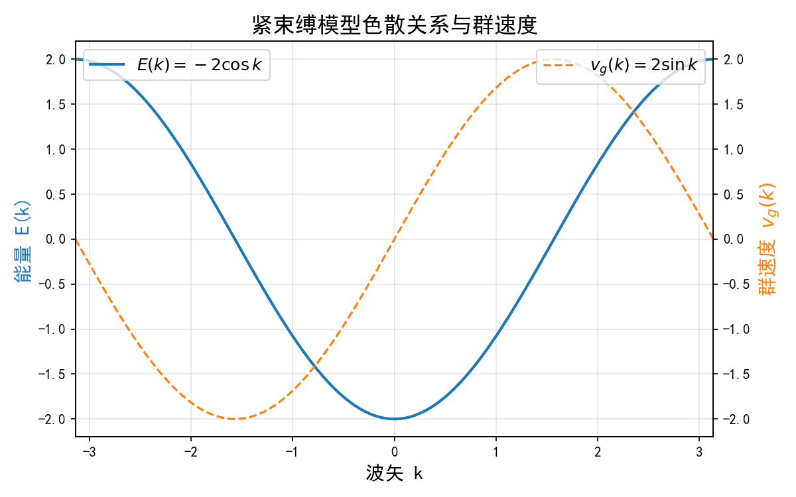

群速度 $v_g(k) = \frac{dE}{dk} = 2\sin k$，最大群速度为 $v_{\max} = 2$。

---

### B.2 粒子密度分布（Q1）

运行 `B/solve.py`，得到 $t = 1, 10, 20, 50$ 时刻的粒子密度分布：

```
============================================================
B: 格点上的单粒子动力学
L=200, i0=100, t in [0, 50.0]
============================================================
t=    1: rho_max=0.332612, rho_i0=0.050127, w(t)=1.4142
t=   10: rho_max=0.063046, rho_i0=0.027897, w(t)=14.1421
t=   20: rho_max=0.039414, rho_i0=0.000054, w(t)=28.2843
t=   50: rho_max=0.037146, rho_i0=0.000399, w(t)=70.5559
============================================================
```

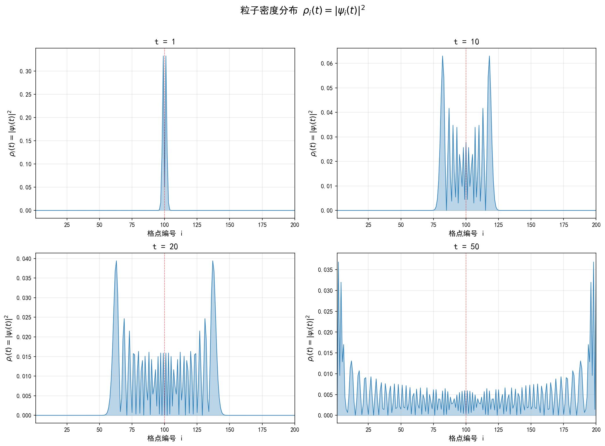

**观察**：

- **$t = 1$**：波包刚开始扩散，密度分布以 $i_0 = 100$ 为中心，近似对称分布。
- **$t = 10$**：波包明显展开，出现两个对称的主峰向两侧传播（弹道传输特征）。
- **$t = 20$**：波前已到达约 $i = 60$ 和 $i = 140$ 的位置（传播距离 $\approx 2t = 40$，与最大群速度一致）。
- **$t = 50$**：波前到达格点边界，周期边界条件导致波从两端回绕，出现干涉现象。

---

### B.3 波包宽度 $w(t)$（Q2）

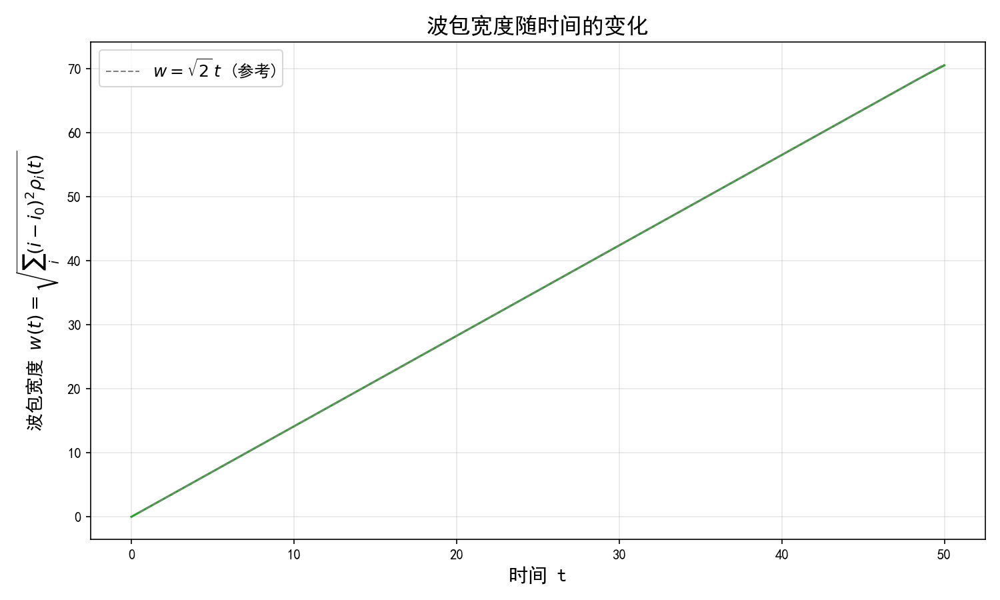

**观察**：

波包宽度 $w(t)$ 几乎严格线性增长：$w(t) \approx \sqrt{2}\,t$。

这对应**弹道传输** (ballistic transport)，与经典扩散（$w \sim \sqrt{t}$）截然不同。线性增长意味着粒子以确定的速度向外传播，没有发生散射或局域化。

---

### B.4 起始点粒子密度 $\rho_{i_0}(t)$（Q3）

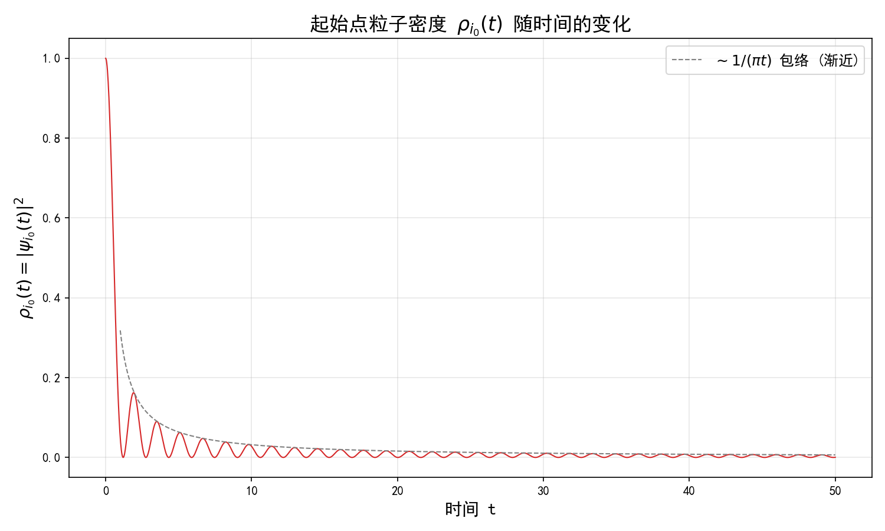

**观察**：

- $\rho_{i_0}(t)$ 从 1 快速衰减，并伴随振荡。
- 振荡幅度的包络近似以 $1/(\pi t)$ 衰减（灰色虚线）。
- 这与 $L \to \infty$ 极限下的解析结果 $\rho_{i_0}(t) = |J_0(2t)|^2$ 一致。

---

### B.5 量子力学解释（Q4）

> *本节分析由 AI  辅助完成。*

**时空密度演化图**：

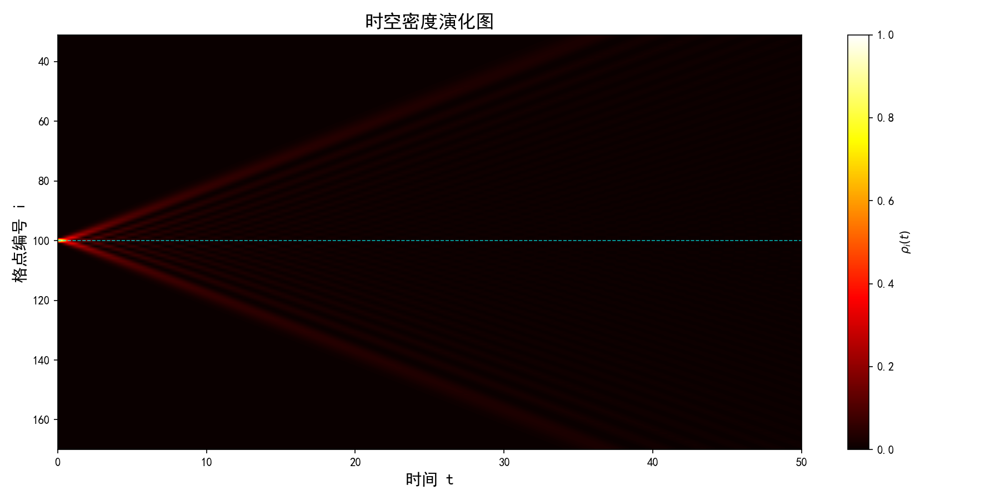

#### 现象 1：密度分布的双峰结构与弹道扩散

**观察**：密度分布呈现明显的双峰结构，波前以速度 $v \approx 2$ 向两侧传播。

**解释**：初始 $\delta$ 函数态 $|i_0\rangle$ 在动量空间中是所有 Bloch 态的等权叠加：

$$|i_0\rangle = \frac{1}{\sqrt{L}}\sum_k e^{-iki_0}|k\rangle$$

每个 Bloch 态以群速度 $v_g(k) = 2\sin k$ 传播。密度分布的最外缘对应最大群速度 $v_{\max} = 2$，形成清晰的**光锥结构**（时空图中的 V 形亮线）。

在光锥边缘附近，态密度（$dk/dv_g$）发散（Van Hove 奇异性），导致粒子密度在波前处堆积，形成双峰。具体地，在 $v_g = 2\sin k$ 处，态密度为：

$$g(v) = \frac{dk}{dv_g} = \frac{1}{2\cos k} = \frac{1}{\sqrt{4 - v^2}}$$

当 $v \to \pm 2$ 时 $g(v) \to \infty$，这就是双峰形成的根本原因。

#### 现象 2：波包宽度的线性增长

**观察**：$w(t) = \sqrt{2}\,t$（精确线性）。

**解释**：这可以严格证明。利用 $L\to\infty$ 极限下的解析解 $\psi_j(t) = i^{j-i_0}J_{j-i_0}(2t)$：

$$w^2(t) = \sum_n n^2 |J_n(2t)|^2$$

利用 Bessel 函数的恒等式 $\sum_n n^2 J_n^2(z) = z^2/2$，得到：

$$\boxed{w(t) = \sqrt{2}\,t}$$

这是**弹道传输**的标志：粒子以确定速度传播，位置不确定度线性增长。这与经典随机行走的扩散行为 $w \sim \sqrt{Dt}$ 形成鲜明对比，体现了量子相干性的本质——波函数的相位信息保持完整，不同路径之间存在确定性的干涉关系，而非经典的随机叠加。

#### 现象 3：起始点密度的振荡衰减

**观察**：$\rho_{i_0}(t)$ 以振荡方式衰减，包络 $\sim 1/(\pi t)$。

**解释**：在 $L \to \infty$ 极限下：

$$\psi_{i_0}(t) = \frac{1}{L}\sum_k e^{-iE(k)t} = \frac{1}{2\pi}\int_{-\pi}^{\pi}e^{2i\cos(k)t}\,dk = J_0(2t)$$

这正是第零阶 Bessel 函数。其物理含义是：初始集中在 $i_0$ 的粒子，在时间演化中不断向外扩散，回到原点的概率振幅正是所有 Bloch 态相位的"全同步"程度。

$J_0(2t)$ 的渐近展开：

$$J_0(2t) \sim \sqrt{\frac{1}{2\pi t}}\cos\left(2t - \frac{\pi}{4}\right) \quad (t \to \infty)$$

因此 $\rho_{i_0}(t) \sim \frac{1}{2\pi t}\left[1 + \cos\left(4t - \frac{\pi}{2}\right)\right]$。

**振荡频率**：$\omega = 4$（对应能带宽度 $W = 4$ 的两倍拍频）。

**1/t 衰减**：这是一维量子系统的特征——粒子概率在一维空间中均匀扩散，总概率守恒要求每个格点的占据概率 $\sim 1/(\text{扩散区域长度}) \sim 1/(v_{\max}t) = 1/(2t)$。

#### 有限尺寸效应

当 $t \gtrsim L/(2v_{\max}) = L/4 = 50$ 时，波前到达边界并因周期边界条件而回绕，导致：
- 密度分布出现从边界返回的干涉条纹
- $w(t)$ 偏离线性增长（受有限格点约束）
- $\rho_{i_0}(t)$ 出现"复苏" (revival) 现象

在我们的参数 ($L = 200$, $t_{\max} = 50$) 下，$t = 50$ 时波前恰好到达边界，因此可以观察到轻微的有限尺寸效应。

---

## 项目结构

```
HW-4/
├── A/
│   ├── solve.py          # FEM 求解非简谐振子
│   ├── compare.py        # 与简谐振子的多维度对比
│   └── alternative.py    # 打靶法替代求解
├── B/
│   └── solve.py          # 格点动力学精确对角化求解
├── asset/                # 所有图片
│   ├── A_ground_state_wavefunction.png
│   ├── A_all_eigenstates.png
│   ├── A_probability_density.png
│   ├── A_potential_energy_levels.png
│   ├── A_energy_comparison.png
│   ├── A_energy_spacing.png
│   ├── A_wavefunction_comparison.png
│   ├── A_density_comparison.png
│   ├── A_potential_comparison.png
│   ├── A_energy_shift.png
│   ├── A_shooting_eigenstates.png
│   ├── A_fem_vs_shooting.png
│   ├── B_density_snapshots.png
│   ├── B_wavepacket_width.png
│   ├── B_origin_density.png
│   ├── B_spacetime_density.png
│   └── B_dispersion.png
├── ProbSet_4.md
└── README.md             # 本报告
```
