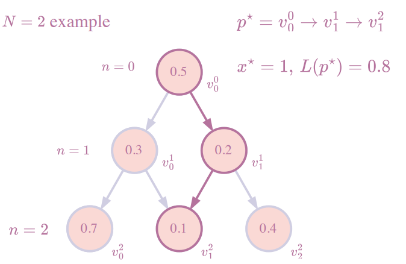

# 计算物理导论 - Homework 5: GP方程 & 最短路径

## A. TSSP方法 & GP方程

使用时间分裂谱方法 (time-splitting spectral, TSSP) 求解一维的含时 Gross-Pitaevskii 方程：

$$i\frac{\partial}{\partial t}\psi(x,t) = -\frac{1}{2}\frac{\partial^{2}}{\partial x^{2}} + V(x)\psi(x,t) + \eta(\psi)\psi(x,t)$$

其中，势能项取谐振子势 $V(x) = \frac{1}{2}x^{2}$。非线性项取 $\eta(\psi) = \frac{1}{2}|\psi|^{2}$。波函数初始条件为：

$$|\psi(x,0)| = \frac{1}{\sqrt{2\pi}}e^{-x^{2}/2}$$

1. 写出 TSSP 方法的基本原理，包括如何分解哈密顿量以及怎么处理动能项和势能项。为了方便求解，你需要怎样的边界条件？对一维问题，TSSP 方法的计算复杂度是多少？ (1.5分)
    
2. 选取时间范围 $t \in [0,20]$，求解密度函数 $\rho(x,t) \equiv |\psi(x,t)|^{2}$ 随着时间的演化情况。画出 $\rho$ 的热力图（横轴为 $t$，纵轴为 $x$）。你发现了什么？ (1分)
    
3. 画出同样时间中，波包宽度的演化情况。波包宽度定义为 $w(t) \equiv \langle x^{2} \rangle(t)$。你发现了什么？ (1分)
    
4. 结合 GP 方程的物理意义，定性解释上述现象。 (1分)
    
5. 你体会到 TSSP 方法有什么优势？ (0.5分)
    

---

## B. 堆上的最短路径

定义这样一个总共 $N$ 层 $(N \in \mathbb{N})$ 的堆和其上的“最短路径”如图：

(a). 第 $n$ 层拥有 $n+1$ 个节点 $v_{i}^{n}$。

(b). 每个节点 $v_{i}^{n}$ 指向 $n+1$ 层的两个子节点 $v_{i}^{n+1}, v_{i+1}^{n+1}$。

(c). 每个点 $v_{i}^{n}$ 上的取值是一个 $[0,1)$ 上均匀分布的随机数。

(d). 从根节点起，选择一条深度递增的路径直到最底层 $N$。路径的长度 $L(path) = \sum_{v \in path} v$。

(e). 最短路径为 $p^{*} = \text{argmin}[L(path)]$。与此同时，记录下最短路径的终点横坐标 $x^{*}$。

> 
> 
> _注：图中展示了 n=0 到 n=2 的节点分布，以及一个路径示例。_

1. 随机生成这样一个堆。 (1分)
    
2. 找到最短路径 $p^{*}$ 和终点横坐标 $x^{*}$，呈现代码并阐述你所使用的算法以及其复杂度。 (1.5分)
    
3. 对不同 $N$ 生成大量不同的堆，计算 $w(N) = \sqrt{\langle [x^{*}(N)]^{2} \rangle - \langle x^{*}(N) \rangle^{2}}$ 随着堆的高度的变化规律，你发现了什么？ (2分)
    
4. 尝试解释你发现的规律。 (0.5分)