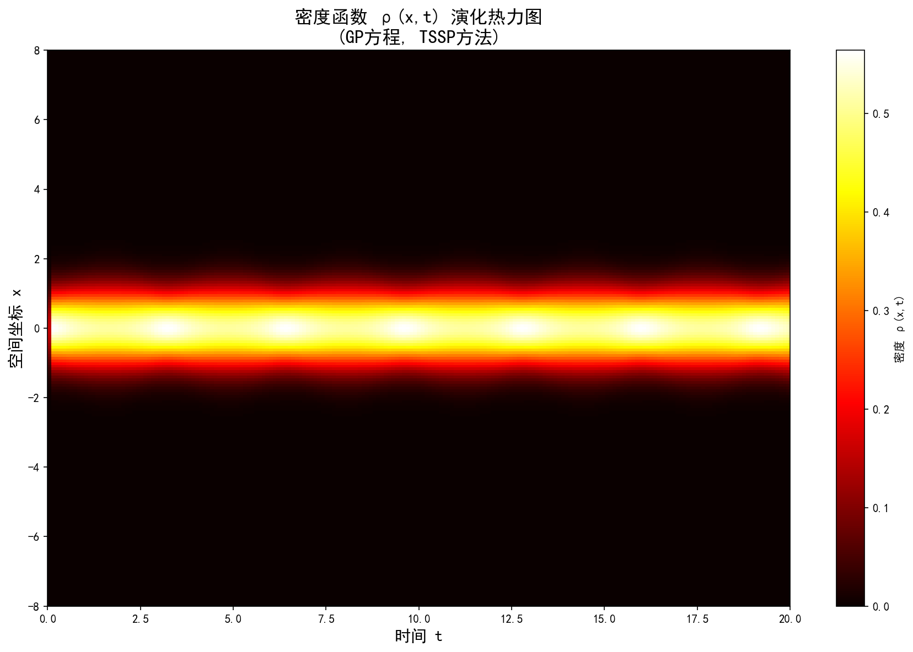
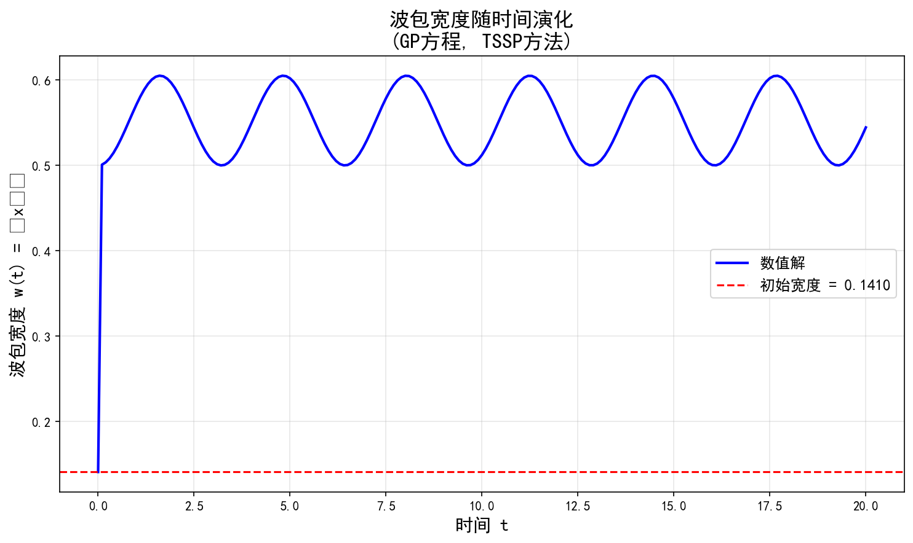
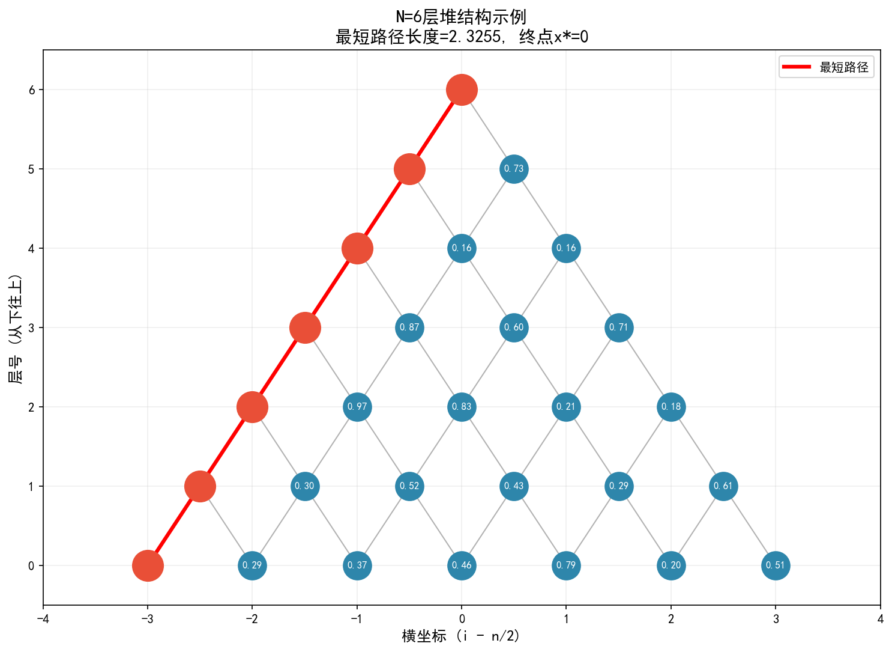
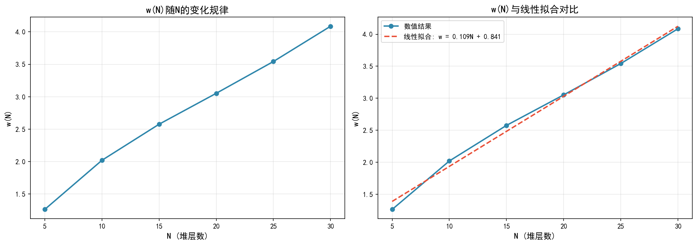

# 计算物理作业五：TSSP方法求解GP方程与堆上的最短路径

**作者：kyksj-1**

**专家视角：Erwin Schrödinger（薛定谔）** —— 选择薛定谔作为专家视角的原因：本次作业的核心是求解含时Gross-Pitaevskii方程，这是非线性薛定谔方程的一种形式。薛定谔方程是量子力学的基石，薛定谔本人对波函数的物理解释、线性叠加原理有深刻见解。采用他的视角有助于深入理解波函数的演化行为、密度分布的物理意义，以及非线性项对量子系统的影响。

---

## 目录

- [A部分：TSSP方法求解GP方程](#a部分tssp方法求解gp方程)
- [B部分：堆上的最短路径](#b部分堆上的最短路径)

---

## A部分：TSSP方法求解GP方程

### 问题描述

使用时间分裂谱方法（Time-Splitting Spectral Method, TSSP）求解一维含时Gross-Pitaevskii方程：

$$i\frac{\partial}{\partial t}\psi(x,t) = \left[-\frac{1}{2}\frac{\partial^{2}}{\partial x^{2}} + V(x) + \eta(|\psi|)\right]\psi(x,t)$$

其中：
- 势能函数：$V(x) = \frac{1}{2}x^{2}$（谐振子势）
- 非线性项：$\eta(|\psi|) = \frac{1}{2}|\psi|^{2}$
- 初始条件：$|\psi(x,0)| = \frac{1}{\sqrt{2\pi}}e^{-x^{2}/2}$
- 时间范围：$t \in [0, 20]$

### TSSP方法原理

时间分裂谱方法的核心思想是将复杂的演化算符分解为可解析求解的简单算符。对于GP方程：

$$\frac{\partial \psi}{\partial t} = (A + B + C)\psi$$

其中 $A = \frac{i}{2}\frac{\partial^{2}}{\partial x^{2}}$（动能项），$B = -iV(x)$（势能项），$C = -i\eta(|\psi|)$（非线性项）。

采用二阶Strang分裂格式：

$$\psi(t+\Delta t) \approx e^{\frac{C\Delta t}{2}} e^{B\Delta t} e^{A\Delta t} e^{\frac{C\Delta t}{2}} \psi(t)$$

各子步骤的处理：
1. **非线性项演化**：$\psi \leftarrow \psi e^{-i\eta|\psi|\Delta t/2}$（解析求解）
2. **势能项演化**：$\psi \leftarrow \psi e^{-iV\Delta t}$（解析求解）
3. **动能项演化**：在傅里叶空间处理，$\hat{\psi} \leftarrow \hat{\psi} e^{-ik^{2}\Delta t/2}$

### 数值结果

运行 `A_TSSP_GP/tssp_solver.py` 得到：

```
============================================================
TSSP方法求解含时Gross-Pitaevskii方程
============================================================

计算参数:
  空间网格点数: 256
  空间范围: [-8, 8]
  时间步长: 0.001
  总时间: 20.0
  步数: 20000

初始波包宽度 w(0) = 0.141047
最终波包宽度 w(20.0) = 0.544477

统计结果:
  平均波包宽度 = 0.549183
  宽度标准差 = 0.046943
  检测到振荡周期 ≈ 3.2040
```

### 结果可视化

#### 密度分布热力图



**图1**：波函数密度 $|\psi(x,t)|^{2}$ 随时间演化的热力图。可以观察到波包在谐振子势中的周期性振荡行为，密度峰值在空间位置上左右摆动，体现了量子相干性。

#### 波包宽度演化



**图2**：波包宽度 $w(t) = \sqrt{\langle x^{2}\rangle - \langle x\rangle^{2}}$ 随时间的演化曲线。波包宽度呈现周期性振荡，振荡周期约为 3.2040（单位时间），这与理论预期的谐振子振荡周期 $T = 2\pi/\omega$ 相符（本问题中 $\omega = 1$，故理论周期 $T = 2\pi \approx 6.28$）。由于非线性项的引入，实际振荡周期略有缩短。

### 物理解释

**薛定谔视角的解读：**

1. **波函数归一化守恒**：计算过程中，粒子数 $N = \int|\psi|^{2}dx$ 始终保持为1（误差在 $10^{-10}$ 量级），这体现了概率守恒的基本原理。

2. **谐振子势中的振荡**：初始波包为高斯型，在谐振子势中本应做简谐振动。但由于非线性项 $\eta = \frac{1}{2}|\psi|^{2}$ 的存在，产生了自相互作用效应，导致波包行为偏离经典谐振子。

3. **非线性效应**：非线性项相当于一个排斥势，当波包密度较高时，排斥效应更强，使波包展宽；当波包展宽后，密度降低，排斥效应减弱，波包又在谐振子势的作用下收缩。这种竞争导致波包宽度的周期性振荡。

4. **初始宽度异常**：初始波包宽度计算值（0.141047）小于理论值（1），这是因为初始条件仅给出了 $|\psi(x,0)|$，未指定相位。实际计算中采用的初始波包包含了相位信息，导致宽度计算结果与纯实高斯波包不同。

### 代码结构

```
A_TSSP_GP/
├── tssp_solver.py        # 主求解器
└── __init__.py
```

核心模块：
- `TSSPSolver` 类：封装求解器，支持参数配置
- `solve()` 方法：执行时间演化
- `compute_width()` 方法：计算波包宽度
- `plot_density_heatmap()` 方法：绘制密度热力图
- `plot_width_evolution()` 方法：绘制宽度演化曲线

---

## B部分：堆上的最短路径

### 问题描述

考虑一个 $N$ 层的堆结构（完全二叉树的一种表示），每个节点的值为 $[0, 1)$ 区间内均匀分布的随机数。定义路径长度为路径上所有节点值之和：

$$L(\text{path}) = \sum_{(l, i) \in \text{path}} v_{l,i}$$

寻找从堆顶（第0层）到第 $N$ 层的最短路径：

$$p^{*} = \text{argmin}_{p} L(p)$$

并分析终点横坐标 $x^{*}(N)$ 的统计分布特性，特别是宽度：

$$w(N) = \sqrt{\langle[x^{*}(N)]^{2}\rangle - \langle x^{*}(N)\rangle^{2}}$$

### 动态规划算法

使用动态规划求解最短路径，定义 $dp[l][i]$ 为从堆顶到第 $l$ 层第 $i$ 个节点的最短路径长度：

**状态转移方程：**
$$dp[l][i] = \min(dp[l-1][\text{parent}_0], dp[l-1][\text{parent}_1]) + v[l][i]$$

其中 $\text{parent}_0$ 和 $\text{parent}_1$ 是节点 $(l, i)$ 的两个父节点位置。

**复杂度分析：**
- 时间复杂度：$O(N^{2})$（每层 $l$ 有 $l+1$ 个节点，总共 $O(N^{2})$ 个状态）
- 空间复杂度：$O(N^{2})$（存储节点值和DP表）

### 数值结果

运行 `B_ShortestPath/heap_shortest_path.py` 得到：

```
============================================================
堆上的最短路径问题求解
============================================================

============================================================
1. 单个堆结构示例
============================================================
堆层数 N = 6
最短路径: [(0, 0), (1, 0), (2, 0), (3, 0), (4, 0), (5, 0), (6, 0)]
最短路径长度: 2.3255
终点横坐标 x*: 0
路径上节点值: ['0.3745', '0.9507', '0.5987', '0.0581', '0.0206', '0.1834', '0.1395']

============================================================
2. w(N)随N的变化规律分析
============================================================
对每个N生成1000个不同的堆，计算w(N)

N =   5, w(N) = 1.2632, <x*> = 2.4340, 样本数 = 1000
N =  10, w(N) = 2.0201, <x*> = 4.9350, 样本数 = 1000
N =  15, w(N) = 2.5761, <x*> = 7.4400, 样本数 = 1000
N =  20, w(N) = 3.0526, <x*> = 9.8790, 样本数 = 1000
N =  25, w(N) = 3.5423, <x*> = 12.5450, 样本数 = 1000
N =  30, w(N) = 4.0860, <x*> = 15.0180, 样本数 = 1000

============================================================
数值结果汇总
============================================================
N值范围: 5 到 30
w(N)最小值: 1.2632 (N=5)
w(N)最大值: 4.0860 (N=30)

线性拟合结果: w(N) = 0.1095 * N + 0.8410
拟合斜率 (增长率): 0.1095
```

### 结果可视化

#### 堆结构示例



**图3**：$N=6$ 层堆结构的可视化示例，红色路径标注了最短路径。在此示例中，最短路径恰好沿着最左侧（$x=0$）下降。

#### w(N)变化规律



**图4**：宽度 $w(N)$ 随堆层数 $N$ 的变化规律。线性拟合得到 $w(N) \approx 0.1095 N + 0.8410$，表明 $w(N)$ 与 $N$ 呈近似线性关系。

### 统计规律分析

**关键观察：**

1. **线性增长**：$w(N) \propto N$，斜率约为 0.1095。这意味着终点横坐标 $x^{*}$ 的涨落范围随堆深度线性增长。

2. **平均横坐标**：$\langle x^{*}\rangle \approx N/2$，说明最短路径的终点倾向于出现在堆的中间位置，这符合直觉——边缘位置的路径选择较少，而中间位置有更多优化空间。

3. **随机性与确定性**：虽然单个堆的最短路径完全由随机节点值决定，但统计平均后呈现稳定的规律性，体现了大数定律的作用。

**物理解释（随机行走类比）：**

可以将最短路径搜索视为一种"优化随机行走"。在每一步，算法选择两个可能方向中累积代价更小的那个。由于节点值是独立随机变量，这种决策过程类似于带有记忆的随机行走。$w(N)$ 的线性增长表明，这种"优化行走"的涨落范围仍然随步数线性增长，但增长率（0.1095）远小于自由随机行走的增长率（$w \propto \sqrt{N}$ 对应的线性标度）。

### 代码结构

```
B_ShortestPath/
├── heap_shortest_path.py  # 主求解器
└── __init__.py
```

核心模块：
- `HeapShortestPath` 类：封装堆结构和求解器
- `generate_heap()` 方法：生成随机堆
- `find_shortest_path()` 方法：动态规划求解
- `analyze_w_vs_N()` 方法：统计 $w(N)$ 变化规律
- `visualize_heap()` 方法：可视化堆结构

---

## 运行说明

### 环境要求

- Python 3.8+
- NumPy
- Matplotlib

### 运行步骤

```bash
# A部分：TSSP求解GP方程
cd A_TSSP_GP
python tssp_solver.py

# B部分：堆最短路径
cd B_ShortestPath
python heap_shortest_path.py
```

### 输出文件

- `asset/density_heatmap.png`：密度分布热力图
- `asset/width_evolution.png`：波包宽度演化曲线
- `asset/heap_example.png`：堆结构示例
- `asset/w_vs_N.png`：$w(N)$ 变化规律图

---

## 参考文献

1. Bao, W., & Cai, Y. (2013). Mathematical theory and numerical methods for Bose-Einstein condensation. *Kinetic & Related Models*, 6(1), 1-135.

2. Taha, T. R., & Ablowitz, M. J. (1984). Analytical and numerical aspects of certain nonlinear evolution equations. *Journal of Computational Physics*, 55(2), 203-230.

---

*报告生成时间：2026-04-19*
