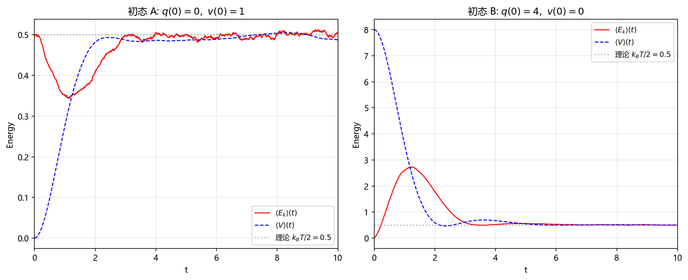
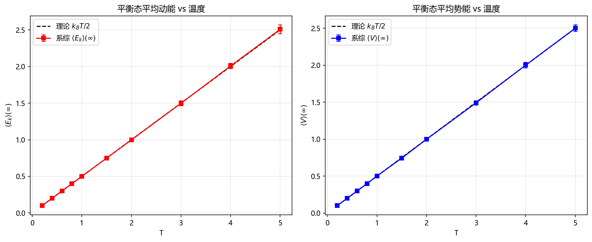
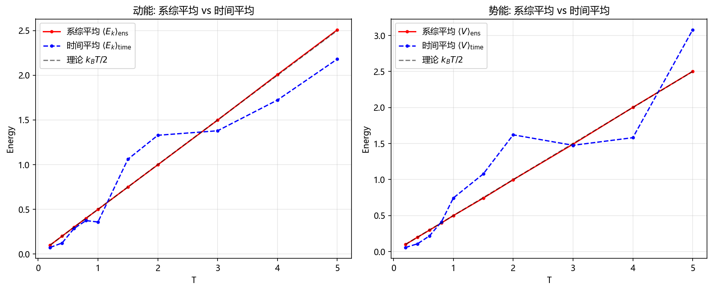
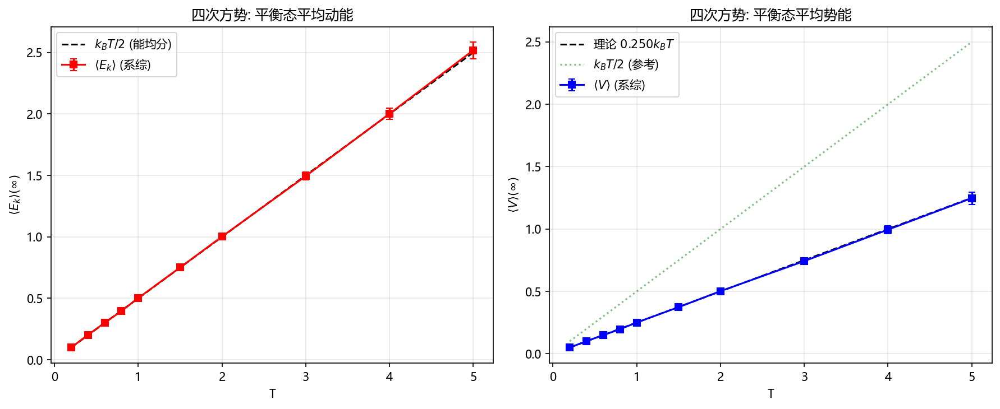
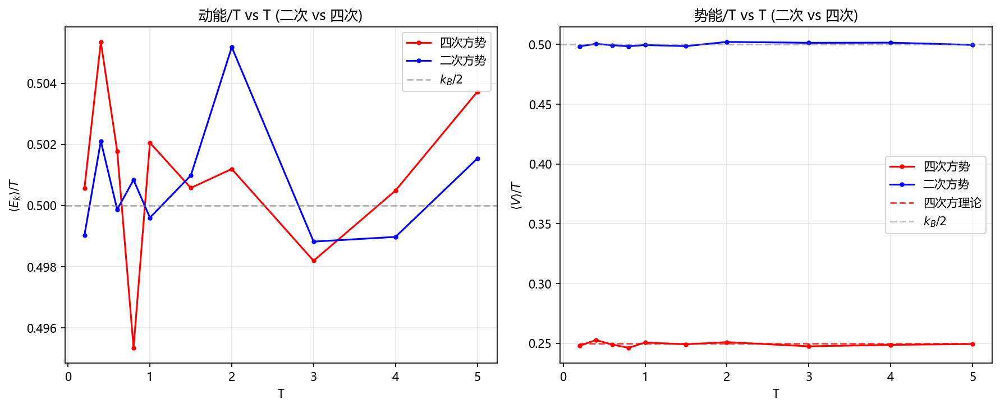
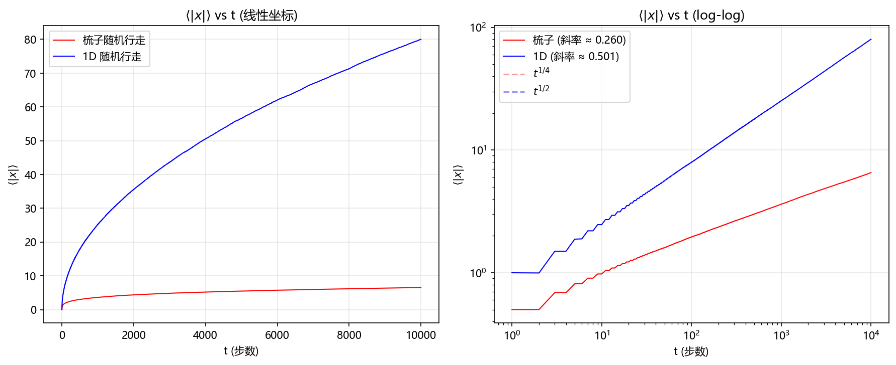
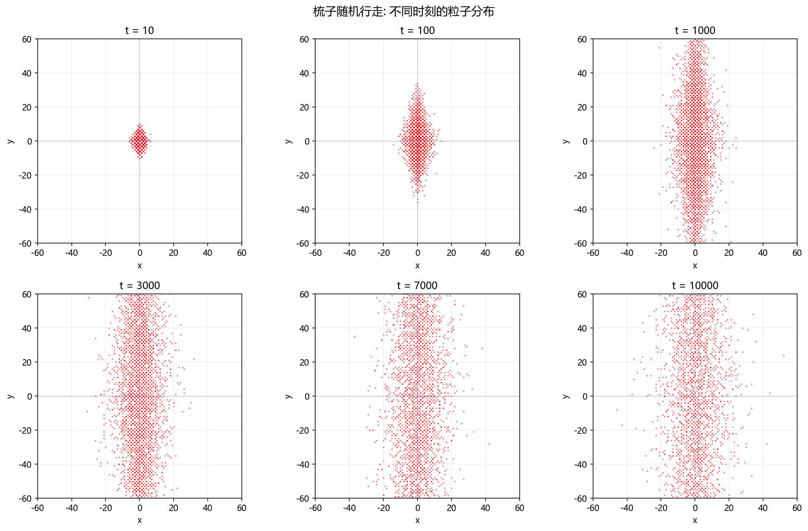
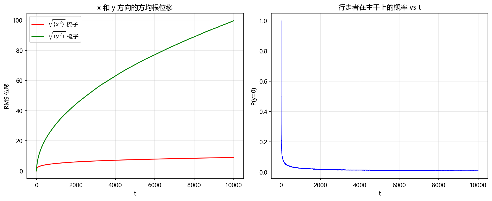

# 计算物理导论 - Homework 6

---

## Part A: Langevin 方程

### A.1 理论推导

#### 问题 1: 涨落-耗散关系

对 $V=0$ 的 Langevin 方程 $m\ddot{q}+\lambda\dot{q}=\xi(t)$, 令 $v=\dot{q}$:

$$m\dot{v} + \lambda v = \xi(t), \quad \langle\xi(t)\xi(t')\rangle = \mathcal{D}^2\delta(t-t')$$

形式解:

$$v(t)=v(0)e^{-\gamma t}+\frac{1}{m}\int_0^t e^{-\gamma(t-s)}\xi(s)ds,\quad \gamma=\lambda/m$$

稳态方均速度 ($t\to\infty$):

$$\langle v^2\rangle = \frac{\mathcal{D}^2}{2m\lambda}$$

由能均分定理 $\langle E_k\rangle = \frac{1}{2}m\langle v^2\rangle = \frac{1}{2}k_B T$ 得:

$$\boxed{\mathcal{D}^2 = 2\lambda k_B T}$$

**物理意义**: 这是涨落-耗散定理。噪声强度 $\mathcal{D}^2$ 正比于耗散系数 $\lambda$ 和温度 $T$。耗散越强, 维持热平衡所需的涨落也越大; 无耗散时, 噪声也必须为0, 否则粒子将不断被加热。

---

#### 问题 2: 离散化格式

将二阶 SDE 改写为两个一阶方程:

$$\begin{cases} dq = v\,dt \\ dv = -\gamma v\,dt - \frac{1}{m}V'(q)\,dt + \frac{\mathcal{D}}{m}dW_t \end{cases}$$

其中 $\langle dW_t^2\rangle = dt$。使用 **Symplectic Euler-Maruyama 格式**:

$$\begin{aligned} v_{n+1} &= v_n - \gamma v_n\Delta t - \frac{1}{m}V'(q_n)\Delta t + \frac{\mathcal{D}}{m}\sqrt{\Delta t}\,\zeta_n,\quad \zeta_n\sim\mathcal{N}(0,1) \\ q_{n+1} &= q_n + v_{n+1}\Delta t \end{aligned}$$

**精度与时间步长**: 
- 弱收敛阶(分布意义): $O(\Delta t)$
- 强收敛阶(路径意义): $O(\Delta t^{1/2})$

**与 ODE 求解的区别**: ODE 积分器(如 Euler)的全局误差为 $O(\Delta t^p)$ 且强弱收敛统一; SDE 积分器需区分弱/强收敛, 且随机项引入 $O(\sqrt{\Delta t})$ 的路径涨落。步长减半时, ODE 误差约减半, 而 SDE 强误差仅约减为原来的 $1/\sqrt{2}$。

---

### A.2 数值方法 (sde_solver.py)

代码位于 `part_a/sde_solver.py`, 核心接口:

```python
q, v = simulate_langevin(q0, v0, V_prime, m, lam, k_B, T, dt, num_steps, num_particles)
Ek_avg, V_avg = compute_ensemble_energies(q, v, V, m)
```

- **矢量化设计**: 所有粒子轨迹并行计算, 利用 numpy 数组运算避免逐粒子循环
- **随机数预生成**: 一次生成所有噪声项 `(num_particles, num_steps)` 的矩阵
- **辛格式**: Symplectic Euler 保持确定性部分的相空间体积

---

### A.3 结果: $V(x)=\frac{1}{2}x^2$, $T=1$, 两个初态

运行 `part_a/q3a_simulation.py`:

```
==================================================
问题3(a): 初态 A -- q(0)=0, v(0)=1
参数: k_B=1.0, m=1.0, λ=1.0, T=1.0, 噪声强度 D²=2.000
数值: dt=0.005, 步数=2000, 粒子数=10000
理论平衡值: ⟨E_k⟩=0.5, ⟨V⟩=0.5
--------------------------------------------------
初态A 弛豫后 ⟨E_k⟩ = 0.503343
初态A 弛豫后 ⟨V⟩   = 0.497668

==================================================
问题3(a): 初态 B -- q(0)=4, v(0)=0
--------------------------------------------------
初态B 弛豫后 ⟨E_k⟩ = 0.503266
初态B 弛豫后 ⟨V⟩   = 0.506173
```



**分析**: 两个初态均弛豫到 $\langle E_k\rangle \approx \langle V\rangle \approx 0.5 = k_B T/2$, 与能均分定理一致。初态 A (纯动能) 的弛豫更快; 初态 B (纯势能) 需更多动能缓冲时间。

---

### A.4 结果: $V(x)=\frac{1}{2}x^2$, 改变温度

运行 `part_a/q3b_varyT.py`:

```
============================================================
问题3(b): V = 1/2 x^2, 变温弛豫
数值: dt=0.005, t_max=50.0, 粒子数=5000
温度采样点: [0.2 0.4 0.6 0.8 1.  1.5 2.  3.  4.  5. ]
------------------------------------------------------------
T= 0.2  ⟨E_k⟩(∞)=0.100034±0.002045  ⟨V⟩(∞)=0.099295±0.001662  理论=0.100
T= 0.4  ⟨E_k⟩(∞)=0.200398±0.003763  ⟨V⟩(∞)=0.199400±0.002226  理论=0.200
T= 0.6  ⟨E_k⟩(∞)=0.301741±0.006404  ⟨V⟩(∞)=0.297776±0.005190  理论=0.300
T= 0.8  ⟨E_k⟩(∞)=0.400199±0.008148  ⟨V⟩(∞)=0.397931±0.007060  理论=0.400
T= 1.0  ⟨E_k⟩(∞)=0.498873±0.010246  ⟨V⟩(∞)=0.500444±0.009793  理论=0.500
T= 1.5  ⟨E_k⟩(∞)=0.749248±0.016356  ⟨V⟩(∞)=0.742763±0.013939  理论=0.750
T= 2.0  ⟨E_k⟩(∞)=0.998085±0.018847  ⟨V⟩(∞)=0.998141±0.017978  理论=1.000
T= 3.0  ⟨E_k⟩(∞)=1.497944±0.033400  ⟨V⟩(∞)=1.491413±0.029162  理论=1.500
T= 4.0  ⟨E_k⟩(∞)=2.007346±0.036727  ⟨V⟩(∞)=2.001968±0.037191  理论=2.000
T= 5.0  ⟨E_k⟩(∞)=2.507763±0.061821  ⟨V⟩(∞)=2.501825±0.045642  理论=2.500
```





**各态历经性分析**: 二次方势系统是各态历经的。系综平均与单粒子长时间平均在数值上趋近一致。时间平均的涨落随温度升高而增大(更大温度范围对应更热涨落), 但均值与系综一致 — 这正是各态历经性: 一个粒子在足够长时间内的平均等价于系综平均。

---

### A.5 结果: $V(x)=\frac{1}{2}x^4$

运行 `part_a/q3c_quartic.py`:

```
无量纲常数 ⟨y^4/2⟩_0 = 0.250000
因此 ⟨V⟩ = 0.250000 · k_B T
============================================================
问题3(c): V = (1/2) x^4, 变温弛豫
数值: dt=0.005, t_max=30.0, 步数=6000, 粒子数=3000
温度采样点: [0.2 0.4 0.6 0.8 1.  1.5 2.  3.  4.  5. ]
理论: ⟨E_k⟩ = k_B T/2,  ⟨V⟩ = 0.2500 · k_B T
------------------------------------------------------------
T= 0.2  ⟨E_k⟩=0.100114±0.002668  ⟨V⟩=0.049591±0.001935  Ek理论=0.1000  V理论=0.050000
T= 0.4  ⟨E_k⟩=0.202141±0.005092  ⟨V⟩=0.101127±0.003179  Ek理论=0.2000  V理论=0.100000
T= 0.6  ⟨E_k⟩=0.301066±0.007240  ⟨V⟩=0.149387±0.006074  Ek理论=0.3000  V理论=0.150000
T= 0.8  ⟨E_k⟩=0.396278±0.010710  ⟨V⟩=0.197044±0.008380  Ek理论=0.4000  V理论=0.200000
T= 1.0  ⟨E_k⟩=0.502055±0.011413  ⟨V⟩=0.250734±0.008399  Ek理论=0.5000  V理论=0.250000
T= 1.5  ⟨E_k⟩=0.750863±0.022006  ⟨V⟩=0.373827±0.015406  Ek理论=0.7500  V理论=0.375000
T= 2.0  ⟨E_k⟩=1.002394±0.023892  ⟨V⟩=0.502075±0.019844  Ek理论=1.0000  V理论=0.500000
T= 3.0  ⟨E_k⟩=1.494582±0.031602  ⟨V⟩=0.742641±0.023697  Ek理论=1.5000  V理论=0.750000
T= 4.0  ⟨E_k⟩=2.001954±0.044398  ⟨V⟩=0.995021±0.029945  Ek理论=2.0000  V理论=1.000000
T= 5.0  ⟨E_k⟩=2.518598±0.068120  ⟨V⟩=1.247277±0.049560  Ek理论=2.5000  V理论=1.250000
```





**差异分析**:

| 量 | $V=x^2/2$ | $V=x^4/2$ |
|----|-----------|-----------|
| $\langle E_k\rangle$ | $k_B T/2$ | $k_B T/2$ |
| $\langle V\rangle$ | $k_B T/2$ | $\mathbf{k_B T/4}$ |
| $\langle V\rangle/\langle E_k\rangle$ | 1 | 0.5 |

差异来源于 Virial 定理: 对于 $V\propto x^n$, 有 $\langle V\rangle = k_B T/n$。
- 二次方势 $n=2$: $\langle V\rangle = k_B T/2$
- 四次方势 $n=4$: $\langle V\rangle = k_B T/4$

四次方势更"陡", 粒子平均停留在更接近原点的位置, 因此平均势能更小。动能仍满足能均分 $\langle E_k\rangle = k_B T/2$, 因为动能只依赖速度的二次形式, 与势能形式无关。

---

## Part B: 梳子上的随机行走

### B.1 模型

- 行走者初始位于原点 $(0,0)$
- $y=0$ (主干): 等概率选 $\pm x, \pm y$ 四方向
- $y\neq 0$ (分支): 等概率选 $\pm y$ 两方向
- 矢量化并行 $N=50000$ 个行走者

### B.2 结果

运行 `part_b/run_comb.py`:

```
============================================================
梳子晶格上的随机行走
============================================================
行走者数: 50000, 最大步数: 10000
运行梳子行走...
运行 1D 行走...

关键数据点 (步数 → 梳子⟨|x|⟩ vs 1D⟨|x|⟩):
  t=  100  梳子⟨|x|⟩=1.9555   1D⟨|x|⟩=7.9342
  t=  500  梳子⟨|x|⟩=3.0077   1D⟨|x|⟩=17.8716
  t= 1000  梳子⟨|x|⟩=3.6205   1D⟨|x|⟩=25.2141
  t= 2000  梳子⟨|x|⟩=4.3611   1D⟨|x|⟩=35.5637
  t= 5000  梳子⟨|x|⟩=5.4839   1D⟨|x|⟩=56.5707
  t=10000  梳子⟨|x|⟩=6.5526   1D⟨|x|⟩=80.0307

log-log 拟合斜率 (t≥10):
  梳子: ⟨|x|⟩ ∝ t^0.2596  (预期: 1/4 = 0.25)
  1D:   ⟨|x|⟩ ∝ t^0.5010  (预期: 1/2 = 0.5)
  梳子幂律常数: exp(intercept) = 0.6008
  1D 幂律常数:   exp(intercept) = 0.7916
```







### B.3 物理规律

**核心发现**: 梳子上的随机行走向 $\langle|x|\rangle \propto t^{1/4}$, 远慢于普通一维行走的 $\propto t^{1/2}$。这是**反常次扩散** (subdiffusion)。

**物理原因**:
1. x 方向移动仅当粒子在主干 $(y=0)$ 上时才能发生
2. 粒子在主干上的时间占比 $P(y=0)$ 随时间减小(见图), 因为每次进入分支后需反复上下才能回到主干
3. x 方向有效步数 $\propto$ 在主干上的累计时间 $\propto t^{1/2}$, 每次在主干上的步给予 $\pm 1$ 位移 $\propto (t^{1/2})^{1/2} = t^{1/4}$

更精确: 从 y 方向的一维行走知 $P(y_t=0) \sim 1/\sqrt{t}$, 故有效 x 步数 $N_{\text{eff}} \sim \int_0^t P(y=0)\,dt \sim \sqrt{t}$, 从而 $\langle |x| \rangle \sim \sqrt{N_{\text{eff}}} \sim \sqrt{\sqrt{t}} = t^{1/4}$。

**与 1D 对比**:

| | 梳子随机行走 | 1D 随机行走 |
|---|---|---|
| 扩散标度 | $t^{1/4}$ (次扩散) | $t^{1/2}$ (正常扩散) |
| 几何约束 | x 移动需通过主干 | 无约束 |
| 在 $10^4$ 步后的 $\langle |x|\rangle$ | ~6.55 | ~80.0 |

---

## 代码结构

```
HW-6/
├── part_a/
│   ├── sde_solver.py       # SDE 求解器核心模块
│   ├── q3a_simulation.py   # 问题3(a): 双初态弛豫
│   ├── q3b_varyT.py        # 问题3(b): 二次势变温
│   ├── q3c_quartic.py      # 问题3(c): 四次势变温
│   └── plot_config.py      # matplotlib 中文字体配置
├── part_b/
│   ├── comb_walk.py        # 梳子/1D随机行走矢量模块
│   └── run_comb.py         # 主模拟脚本
├── asset/                   # 输出图片
│   ├── fig_a3a_energy.png
│   ├── fig_a3b_harmonic.png
│   ├── fig_a3b_ergodicity.png
│   ├── fig_a3c_quartic.png
│   ├── fig_a3c_comparison.png
│   ├── fig_b_combwalk.png
│   ├── fig_b_snapshots.png
│   └── fig_b_rms.png
└── README.md
```

每个模块均有清晰的函数接口和 docstring 说明, 可独立调用和复用。
