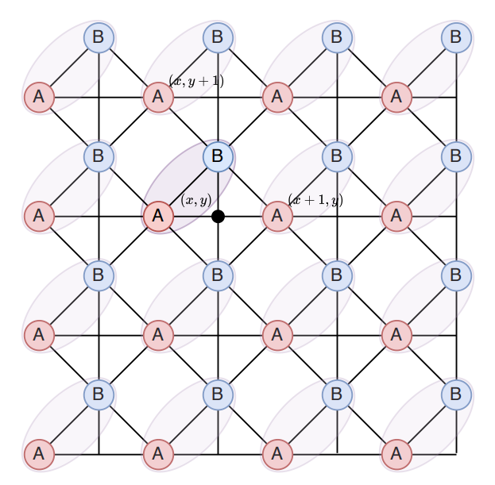

# 计算物理导论 - Homework 7

## A. 阻挫Ising模型

考虑方晶格上面的下列反铁磁Ising模型，每个元胞包含两个子格。

系统的哈密顿量为：

$$H=\frac{1}{2}J\sum_{(i,j)\in \text{bonds}}s_{i}s_{j}, \quad J>0$$

其中 bonds 代表所有有 bond 的邻居，例如对图中 $(x,y)$ 处的元胞，A 子格具有 4 个 B 邻居和 2 个 A 邻居。

现在考虑 $J=1$。取周期边界条件，系统两个方向的尺寸相同，即 $L_{x}=L_{y}=L$。

1. 找出系统的基态构型规则。这个模型的基态简并吗？(1分)
    
2. 计算边长为 $L$ 的模型的基态能量。(1分)
    
3. 在零温度下，简并的不同基态是等可能性出现的。现在寻找一个方法，尽可能地采样不同的基态构型。写出你的思路和方法，并给出代码。(3分)
    
4. 具体呈现 3 个不同的基态构型，验证它们都满足 (1) 中你发现的规则，验证能量是否是理论值。(1分)
    
5. **关联函数**：计算基态的关联函数：
    
    $$C^{\mu\nu}(r)=\langle s^{\mu}(R)\cdot s^{\nu}(R+r)\rangle_{R}$$
    
    其中 $\mu,\nu\in\{A,B\}$。作平均时，$R$ 取遍所有正格矢，而 $r$ 也取正格矢。用热力图画出这个关联函数。(1分) 观察关联函数在 $x, y$ 和对角线方向的值，你发现了什么规律？(2分)
    
6. 你能解释你发现的规律吗？(1分)