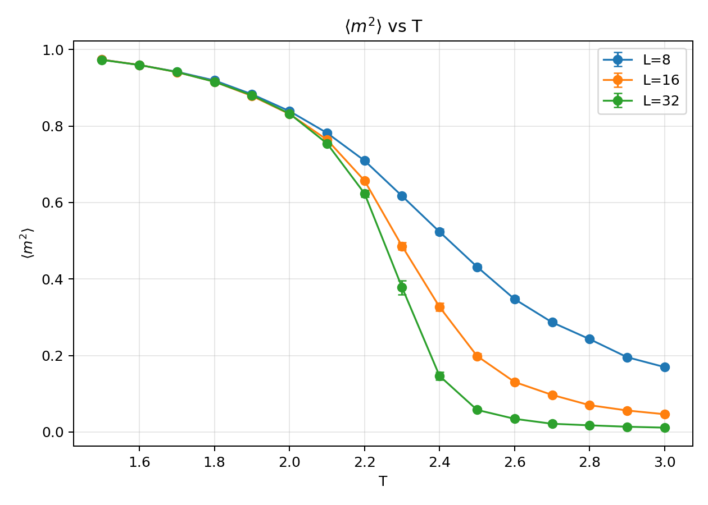
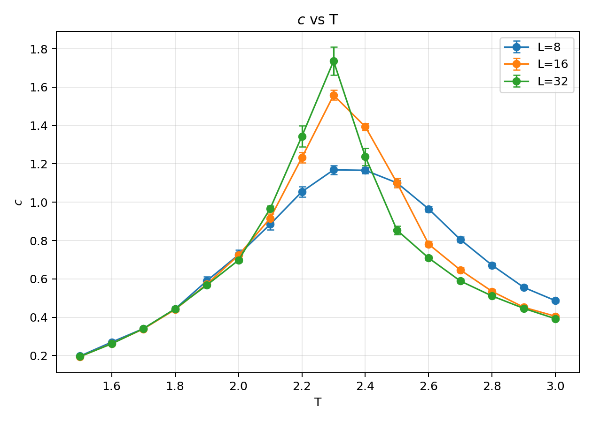
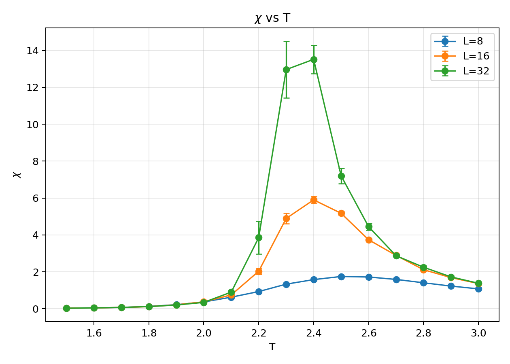
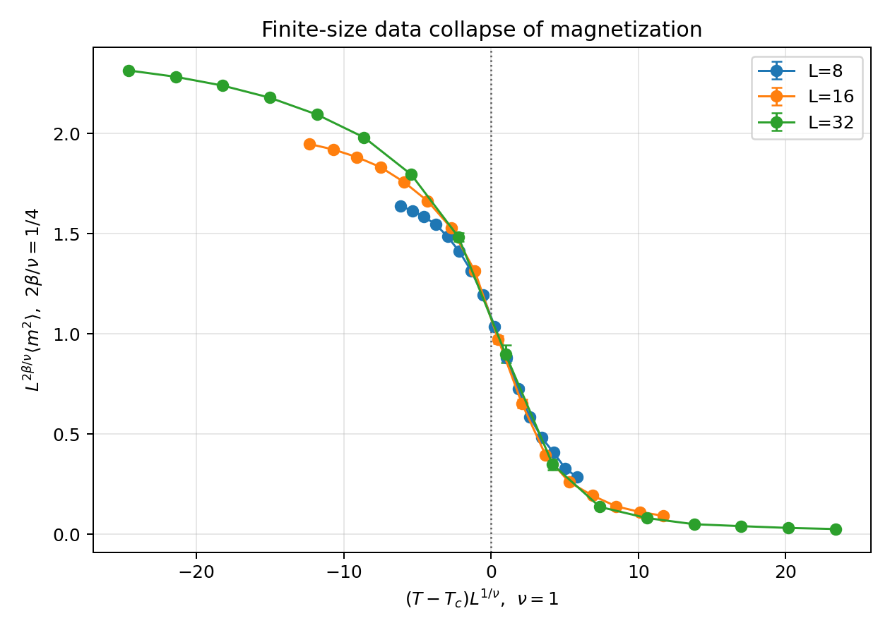
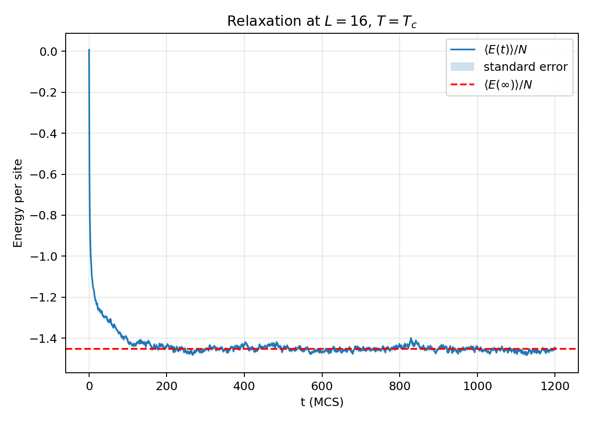
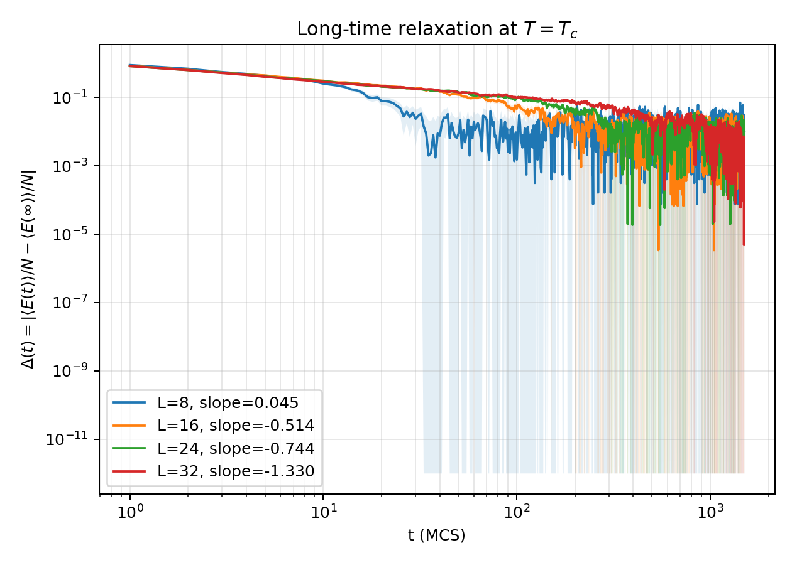

# Homework 8  Monte Carlo Study of the 2D Ising Model

本作业研究二维正方晶格 Ising 模型。哈密顿量取

$$
E=-\sum_{\langle ij\rangle}s_i s_j,\qquad s_i=\pm 1 .
$$

周期边界条件用于消除边缘效应。程序采用单自旋 Metropolis 更新。一次 Monte Carlo sweep 定义为尝试更新 $L^2$ 个自旋。

二维 Ising 模型的价值在于它同时有严格解和清晰的临界行为。小系统可以逐态枚举，用来检验 Monte Carlo 程序是否采样到正确的平衡分布；较大系统则展示有限尺寸如何把真正的热力学奇异性磨平。后者正是本题最值得分析的部分。

## A  平衡统计

### A1  $L=4,T=1$ 的精确枚举

对 $2^{16}=65536$ 个构型直接求和得到配分函数、平均能量和自由能。结果如下。

| quantity | value |
| --- | --- |
| $\langle E\rangle$ | $-31.9545350441$ |
| $F$ | $-32.6987214019$ |
| $\langle E\rangle/N$ | $-1.9971584403$ |
| $F/N$ | $-2.0436700876$ |

这个枚举结果不是为了替代 Monte Carlo，而是给后续程序一个硬基准。若 Metropolis 更新、周期边界或能量增量有任一处写错，低温小系统的能量会立刻偏离这个数值。

### A2  细致平衡

MCMC 的目标不是随意产生很多构型，而是让构型出现的长期频率等于正则系综权重。若构型记为 $s$，转移概率记为 $P(s\to s')$，细致平衡条件为

$$
\pi(s)P(s\to s')=\pi(s')P(s'\to s).
$$

这里的平衡权重是 Boltzmann 权重

$$
\pi(s)=\frac{1}{Z}\exp[-\beta E(s)],
\qquad
Z=\sum_s\exp[-\beta E(s)].
$$

本作业采用的更新过程是随机选择一个格点 $i$，尝试翻转该处自旋 $s_i\to -s_i$。正过程和逆过程是同一个局域翻转，只是起点和终点交换。由于每一步都从 $N=L^2$ 个格点中等概率选择一个格点，选择概率满足

$$
g(s\to s')=g(s'\to s)=\frac1N .
$$

因此非平凡部分只在接受概率 $A(s\to s')$。转移概率可写为

$$
P(s\to s')=g(s\to s')A(s\to s').
$$

代入细致平衡并利用选择概率对称，得到接受概率的约束

$$
\frac{A(s\to s')}{A(s'\to s)}
=\frac{\pi(s')}{\pi(s)}
=\exp[-\beta(E(s')-E(s))].
$$

记 $\Delta E=E(s')-E(s)$。Metropolis 选择为

$$
A(s\to s')=\min\{1,\exp(-\beta\Delta E)\}.
$$

若 $\Delta E\le 0$，新构型能量更低，接受概率为 1；反向过程的能量变化为 $-\Delta E>0$，接受概率为 $\exp(\beta\Delta E)$。两侧相乘后满足细致平衡。若 $\Delta E>0$，正向接受概率为 $\exp(-\beta\Delta E)$，反向接受概率为 1，同样满足上式。

对二维最近邻 Ising 模型，翻转一个自旋只改变它和四个邻居的相互作用能。若邻居和为

$$
h_i=s_{i+\hat x}+s_{i-\hat x}+s_{i+\hat y}+s_{i-\hat y},
$$

则局域能量变化为

$$
\Delta E=2s_i h_i .
$$

这也是代码中可以用 $O(1)$ 时间更新总能量的原因。由于单自旋翻转可以连接全部构型，并且拒绝步骤给出了非零的停留概率，马尔可夫链既不可约又非周期。因此平衡分布就是 Boltzmann 分布。

### A3  Monte Carlo 校验和误差估计

同一 $L=4,T=1$ 系统用 Monte Carlo 得到

$$
\langle E\rangle_{\rm MC}=-31.9520\pm0.0036 .
$$

每格点能量为

$$
\langle E\rangle_{\rm MC}/N=-1.99700\pm0.00023 .
$$

这里的误差来自 30 个连续分块的标准误。Monte Carlo 均值与精确枚举相差 $0.0025$，小于一个标准误。这个比较说明当前热化长度、测量间隔和局域能量更新在低温小系统上是自洽的。

### A4  温区扫描和误差棒

温度取 $T=1.5,1.6,\ldots,3.0$，系统尺寸取 $L=8,16,32$。每个温度点保留 12000 次测量，测量之间间隔 3 个 sweeps。误差棒由 24 个分块估计，图中所有热容、磁化率和磁化平方曲线都带有标准误。

低温区 $\langle m^2\rangle$ 接近 1，说明绝大部分构型停留在两个有序磁化扇区之一。升温后热涨落破坏长程序，曲线在 $T_c$ 附近快速下降。尺寸越大，下降越陡，这不是普通平滑函数的行为，而是热力学极限中非解析相变在有限系统中的影子。

热容峰值位置在本扫描精度下都落在 $T\simeq2.3$。峰高从 $L=8$ 的 $1.169\pm0.023$ 增至 $L=32$ 的 $1.74\pm0.07$。二维 Ising 模型的热容临界指数为 $\alpha=0$，严格意义上对应对数发散。因此峰高增长可见但不如磁化率猛烈，这一点和理论预期一致。

磁化率峰更能揭示临界涨落。峰值从 $L=8$ 的 $1.746\pm0.033$ 增至 $L=16$ 的 $5.90\pm0.19$，再到 $L=32$ 的 $13.5\pm0.8$。磁化率本质上测量 $M$ 的涨落，在临界点附近大尺度团簇不断形成和瓦解，所以它比能量相关的热容更敏感。

| $L$ | $T_{c,{\rm peak}}$ from $c$ | $c_{\rm max}$ | $T_{\chi,{\rm peak}}$ | $\chi_{\rm max}$ |
| --- | --- | --- | --- | --- |
| 8 | 2.3 | $1.169\pm0.023$ | 2.5 | $1.746\pm0.033$ |
| 16 | 2.3 | $1.558\pm0.026$ | 2.4 | $5.90\pm0.19$ |
| 32 | 2.3 | $1.74\pm0.07$ | 2.4 | $13.5\pm0.8$ |

峰位并不精确等于

$$
T_c=\frac{2}{\ln(1+\sqrt2)}=2.2691853142 .
$$

原因有两层。第一，温度步长为 0.1，峰位只能落在离散温度网格上。第二，有限尺寸系统没有真正的奇异点，所谓峰位是一个赝临界温度，并随 $L$ 改变而漂移。

### A5  数据塌缩

只比较不同 $L$ 的原始曲线还不够，因为有限尺寸标度给出了更强的检验。二维 Ising 模型有

$$
\beta=\frac18,\qquad \nu=1 .
$$

在临界区，磁化平方满足

$$
\langle m^2\rangle=L^{-2\beta/\nu}f\!\left((T-T_c)L^{1/\nu}\right).
$$

因此若把横轴改为 $(T-T_c)L$，纵轴改为 $L^{1/4}\langle m^2\rangle$，不同尺寸的数据应在临界邻域内落到近似同一条曲线上。

塌缩图的中心区域表现最好，特别是在 $(T-T_c)L$ 接近 0 的附近。远离中心后曲线逐渐分开，这并不是失败，而是标度形式本来只要求在临界区成立。$L=8$ 的偏离更明显，因为它的关联长度很快达到系统大小，非渐近修正仍然较强。这个图比单独的峰值图更有说服力，因为它同时检查了临界温度、临界指数和有限尺寸变量的选择。

## B  临界弛豫

### B1  $L=16$ 淬火到 $T_c$

初态取随机自旋构型，相当于从高温无序态瞬间淬火到临界温度。对 220 条独立轨道做系综平均，得到

稳态能量估计为

$$
\langle E(\infty)\rangle/N\simeq -1.45117 .
$$

用 $|\langle E(t)\rangle/N-\langle E(\infty)\rangle/N|<\epsilon$ 定义粗略弛豫时间，得到

| $\epsilon$ | relaxation time |
| --- | --- |
| 0.05 | 89 MCS |
| 0.02 | 111 MCS |
| 0.01 | 146 MCS |

这些数值不应理解为单一指数弛豫时间。临界点处没有固定的微观长度尺度，系统先经历较快的局域调整，随后由大尺度畴结构主导，能量差进入更慢的衰减区间。

### B2  尺寸效应和慢化

令

$$
\Delta(t)=\left|\langle E(t)\rangle/N-\langle E(\infty)\rangle/N\right| .
$$

对 $L=8,16,24,32$ 作 log-log 图。

中等和较大尺寸在一段时间窗内接近直线，说明临界弛豫不是简单的指数衰减。指数衰减会在 log-log 图上不断弯折，而这里出现了近似幂律区间。物理图像是临界点处关联长度增长，局域翻转需要通过越来越大的自旋团簇来重排能量，所以长波长模式成为慢变量。

$L=8$ 很快进入有限尺寸平台，拟合斜率不稳定。$L=16$ 和 $L=24$ 已经出现较清楚的慢衰减窗口。$L=32$ 的曲线延伸最久，但晚期误差带也变宽，因为大系统在固定轨道数下需要更长时间才能充分平均。有限尺寸不是这里的瑕疵，它正是临界慢化的观测窗口。

## 代码和输出

核心代码位于 [ising_core.py](ising_core.py)。[part_a.py](part_a.py) 完成精确枚举、平衡 Monte Carlo、分块误差估计和数据塌缩作图。[part_b.py](part_b.py) 完成临界淬火、系综平均和长时间弛豫分析。

数值结果保存在 [docs/a_results.json](docs/a_results.json) 与 [docs/b_results.json](docs/b_results.json)。图片保存在 [asset](asset) 目录。

实现上使用 Numba JIT 加速内层 Metropolis sweep，并用局域 $\Delta E$ 更新总能量。正的 $\Delta E$ 只有 4 和 8 两种非零可能，因此接受概率用小查表保存，避免在内层循环重复计算指数函数。
