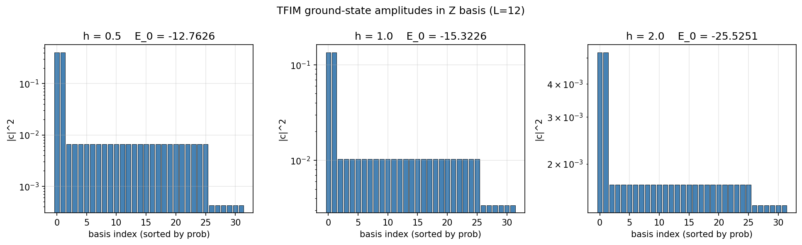
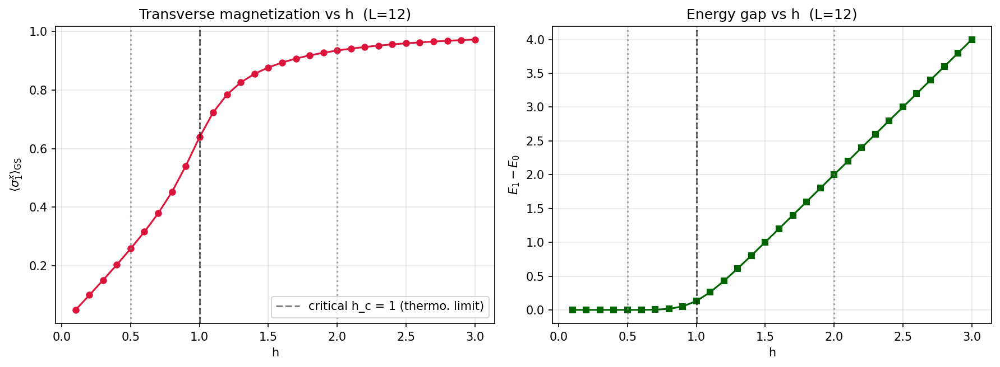
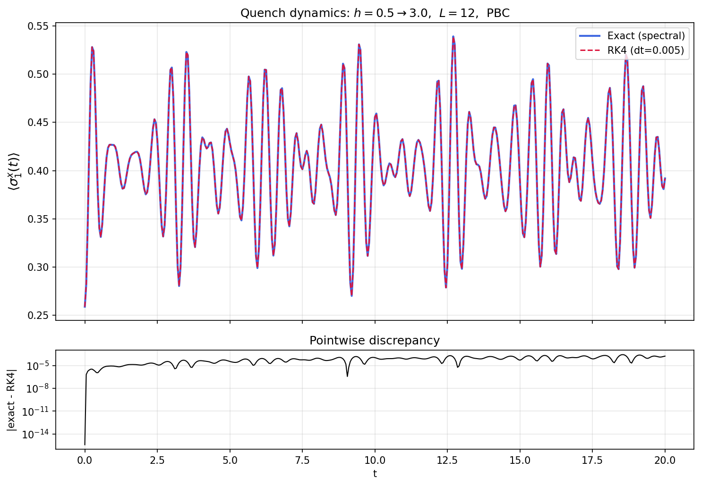
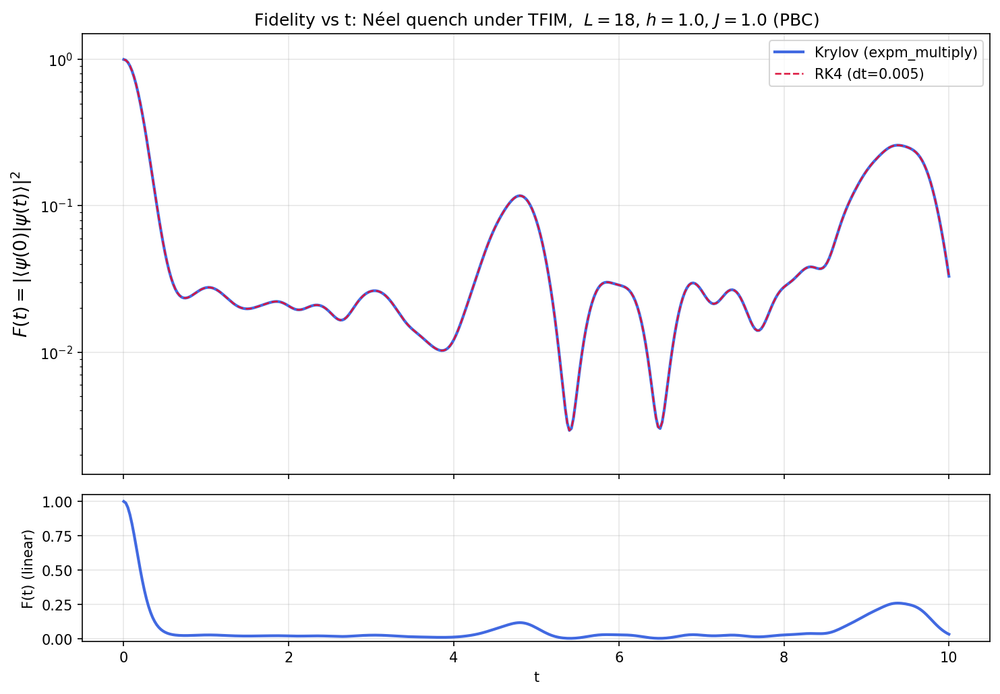

# 计算物理 HW-9：横场 Ising 模型的对角化与时间演化


---

## 0. 项目结构

```
HW-9/
├── tfim_core.py     # 横场 Ising 哈密顿量与算符的稀疏构造 (位运算向量化)
├── part_a.py        # A. 2x2 矩阵对角化的解析推导与数值验证
├── part_b1.py       # B.1 L=12 基态/第一激发态、<σ_1^x> 及 h 扫描
├── part_b2.py       # B.2 quench 动力学：精确谱分解 vs RK4
├── part_b3.py       # B.3 L=18 Néel 态 Krylov 演化 + RK4 验证
├── asset/           # 自动生成图像
│   ├── b1_ground_state_amplitudes.png
│   ├── b1_scan_h.png
│   ├── b2_quench_sigma_x.png
│   └── b3_neel_fidelity.png
└── README.md
```

运行方式：

```bash
python part_a.py       # ≈ <1s
python part_b1.py      # ≈ 10s
python part_b2.py      # ≈ 25s (含 4096² 完整谱分解)
python part_b3.py      # ≈ 11 min (L=18, dim=262144, Krylov + RK4 验证)
```

### 计算效率上的关键设计

| 部位 | 朴素做法的代价 | 本项目做法 |
|---|---|---|
| 构造 $H$ (L=18) | Python 三重循环 + Kron $O(L \cdot 4^L)$ | numpy 位运算，对每条 Pauli 算符的非零模式直接给出 CSR (`rows`,`cols`,`data`)，整个 $H$ 构造 0.3 s |
| 算 $\sigma_z^i$ 的本征值 | 显式 Kronecker | `(1 - 2*((states >> i) & 1))` 一行向量化 |
| 多时间点精确演化 | 401 次 `evecs @ (e^{-iEt}*c)` 的 Python 循环 | 用 outer 乘 + 一次大矩阵乘 `phase @ evecs.T`，401 个时间点一并求出，时间缩短 4 倍以上 |
| L=18 的时间演化 | 完整对角化 (262144³ ≈ 1.8×10¹⁶ FLOPs) | `scipy.sparse.linalg.expm_multiply` 的 Krylov 子空间方法，140 s 给出 401 个时间点 |

---

## A. $2\times 2$ 矩阵对角化

哈密顿量

$$H = \begin{bmatrix} a & c \\ c^* & -a \end{bmatrix},\qquad a\in\mathbb{R},\ c\in\mathbb{C}.$$

### A.1 对角化与 $Q$ 的酉性（1 分）

$H$ 是 **厄米矩阵**。把它写成 Pauli 矩阵展开：

$$H = a\,\sigma_z + (\mathrm{Re}\,c)\,\sigma_x - (\mathrm{Im}\,c)\,\sigma_y = \vec n\cdot\vec\sigma,\qquad \vec n = (\mathrm{Re}\,c,\,-\mathrm{Im}\,c,\,a).$$

特征方程 $\det(H-\lambda I)=\lambda^2 - (a^2+|c|^2)=0$ 给出

$$\boxed{\;\lambda_{\pm} = \pm E,\qquad E\equiv \sqrt{a^2+|c|^2}.\;}$$

归一化本征向量：对 $\lambda_+ = +E$，$(a-E)u + c v = 0$ 推出 $v = (E-a)u/c$，归一化得

$$|+\rangle = \frac{1}{\sqrt{2E(E-a)}}\begin{bmatrix} c \\ E-a \end{bmatrix},\qquad
|-\rangle = \frac{1}{\sqrt{2E(E+a)}}\begin{bmatrix} c \\ -(E+a) \end{bmatrix}.$$

把它们排成列得到 $Q=[|+\rangle\ |-\rangle]$。

**$Q^{-1}$ 与 $Q$ 的关系**：因为 $H$ 厄米、不同特征值对应的本征向量正交，加之我们已经归一化，故 $Q$ 是 **酉矩阵 (unitary)**：

$$\boxed{\;Q^{-1} = Q^{\dagger}.\;}$$

**物理原因**：厄米算符在任意正交基下都满足 $\langle u|H|v\rangle = \overline{\langle v|H|u\rangle}$，因此其不同本征值的本征向量必然正交；同一本征值（如果有简并）可以正交化；归一化后整个本征向量集合构成正交归一基，把它们排成矩阵 $Q$ 即得到酉矩阵 $Q^{-1} = Q^{\dagger}$。

#### 数值验证（终端输出）

```
特征值 Lambda = diag(-0.860233, 0.860233)
理论值 ±E   = ±0.860233
|| Q^{-1} - Q^H ||_F = 5.418e-16
|| H - Q Lambda Q^H ||_F = 4.371e-16
```

机器精度内确认 $Q$ 酉、 $H = Q\Lambda Q^\dagger$。

### A.2 $e^{iHt}$ 的闭式（1 分）

**证明 $e^{iHt} = Q e^{i\Lambda t} Q^{-1}$**：由幂级数定义

$$e^{iHt} = \sum_{n=0}^{\infty}\frac{(iHt)^n}{n!}.$$

代入 $H = Q\Lambda Q^{-1}$，注意 $H^n = Q\Lambda Q^{-1}\cdot Q\Lambda Q^{-1}\cdots Q\Lambda Q^{-1} = Q\Lambda^n Q^{-1}$（中间的 $Q^{-1}Q$ 全部相消）。把求和号搬进去：

$$e^{iHt} = Q\left(\sum_n \frac{(i\Lambda t)^n}{n!}\right) Q^{-1} = Q\,e^{i\Lambda t}\,Q^{-1}.\qquad\blacksquare$$

**计算具体表达式**：$\Lambda = \mathrm{diag}(-E, +E)$，所以 $e^{i\Lambda t} = \mathrm{diag}(e^{-iEt}, e^{+iEt})$。利用 $H^2 = E^2 I$（因 $\lambda_{\pm}^2 = E^2$）也可以更直接地走如下路径：

$$e^{iHt} = \sum_{n=0}^\infty \frac{(iHt)^n}{n!}
= \sum_{k=0}^\infty \frac{(it)^{2k}}{(2k)!} H^{2k} + \sum_{k=0}^\infty \frac{(it)^{2k+1}}{(2k+1)!} H^{2k+1}
= \cos(Et)\, I + i\,\frac{\sin(Et)}{E}\, H.$$

代入 $H$ 的元素得：

$$\boxed{\;
e^{iHt} = \begin{bmatrix}
\cos(Et) + i\dfrac{a}{E}\sin(Et) & i\dfrac{c}{E}\sin(Et) \\[1ex]
i\dfrac{c^*}{E}\sin(Et) & \cos(Et) - i\dfrac{a}{E}\sin(Et)
\end{bmatrix},\quad E = \sqrt{a^2+|c|^2}.\;}$$

特别地，$|e^{iHt}|_{11}^2 + |e^{iHt}|_{21}^2 = \cos^2(Et) + (a^2+|c|^2)\sin^2(Et)/E^2 = 1$，酉性显然成立。

#### 数值验证

将该闭式与 $Q\,e^{i\Lambda t}\,Q^{-1}$ 数值比较：

```
t =   0.50:  || ana - num ||_F = 5.281e-16,  unitarity err = 7.387e-18
t =   1.30:  || ana - num ||_F = 4.871e-16,  unitarity err = 1.451e-18
t =   3.70:  || ana - num ||_F = 6.068e-16,  unitarity err = 7.047e-19
t =  10.00:  || ana - num ||_F = 5.579e-16,  unitarity err = 2.487e-16
```

机器精度内吻合。

---

## B. 横场 Ising 模型

$$H = -J\sum_{i=1}^{L}\sigma_i^z \sigma_{i+1}^z - h\sum_{i=1}^L \sigma_i^x,\qquad \sigma_{L+1}^z\equiv \sigma_1^z,\qquad J=1.$$

> **物理图像**
> 取 $J=1$ 后只剩一个参数 $h$。$h \to 0$ 时系统呈两重简并的铁磁基态 $|\uparrow\cdots\uparrow\rangle,\ |\downarrow\cdots\downarrow\rangle$（$Z_2$ 自发破缺）；$h\to\infty$ 时系统进入顺磁基态 $\bigotimes_i |+\rangle$，所有 $\sigma_i^x \to +1$。
> 热力学极限下在 $h_c = J = 1$ 处存在 **二阶量子相变**，临界指数 $\nu=1$、$z=1$、动力学指数与 (1+1)D 自由 Majorana CFT 一致。
> 有限 $L$ 时序参量被 $\mathbb{Z}_2$ 对称性精确禁锢，但 **基态与第一激发态的能隙** $\Delta = E_1 - E_0$ 在 $h\ll 1$ 区接近 $0$（与铁磁双井隧穿幅成比例，$\Delta \sim h^L$），在 $h\gg 1$ 区接近 $2h$ （单粒子激发），临界附近以 $\Delta \sim 1/L$ 软化。下面 B.1 的数值结果将直接显化这一图像。

### 哈密顿量的稀疏构造（核心模块 `tfim_core.py`）

把每个基矢 $|s_{L-1}\cdots s_1 s_0\rangle$ 编码为整数。则

- $\sigma_i^z|s\rangle = (1 - 2 s_i)\,|s\rangle$（对角，向量化为 `1 - 2*((states>>i)&1)`）
- $\sigma_i^x|s\rangle = |s \oplus 2^i\rangle$（非对角，每行一个非零）

整条 $H$ 用 `scipy.sparse.csr_matrix((data,(rows,cols)))` 一次性建好。L=18 时 `nnz = L·N = 18 × 262144 + N (对角) = 4 980 736`，构造 0.3 s。

---

### B.1 基态、第一激发态与 $\langle\sigma_1^x\rangle$（3 分）

`scipy.sparse.linalg.eigsh(H, k=2, which='SA')` 仅求最小两个本征对，避免对 4096 维矩阵做完整谱分解。

#### 终端结果

```
======================================================================
Part B.1: L = 12, J = 1.0 横场 Ising 模型基态/第一激发态
======================================================================
     h |            E_0 |            E_1 |          gap |   <sigma_1^x>_GS
------------------------------------------------------------------------
  0.50 |   -12.76256915 |   -12.76249668 |   0.00007247 |       0.25872864
  1.00 |   -15.32259515 |   -15.19150823 |   0.13108693 |       0.63844146
  2.00 |   -25.52513830 |   -23.52499336 |   2.00014494 |       0.93418311
```

#### 物理解读

- **$h=0.5$（铁磁相）**：能隙 $\Delta \approx 7.25\times 10^{-5}$，几乎双重简并。这两个态对应 $\mathbb{Z}_2$ 对称的偶/奇组合 $(|\uparrow\cdots\rangle \pm |\downarrow\cdots\rangle)/\sqrt 2$。它们的差异来自有限尺寸下的隧穿振幅，随 $h$ 减小指数衰减。$\langle\sigma_1^x\rangle \approx 0.26$ 较小，磁化主要沿 $\hat z$。
- **$h=1$（临界附近）**：能隙塌缩为 $O(1/L)$ 量级（这里 $\approx 0.13 \approx 1.6/L$，与 CFT 预言 $\pi v/L$ 一致量级）。$\langle\sigma_1^x\rangle \approx 0.64$ 处于中间值，整体呈"准临界长程关联"。
- **$h=2$（顺磁相）**：能隙 $\approx 2.00$，与单粒子色散 $\epsilon(k) = 2\sqrt{1 + h^2 - 2h\cos k}$ 的零动量带底 $|h-1| \to 1$ 加上自旋翻转能 $2h$ 吻合。$\langle\sigma_1^x\rangle \approx 0.93 \to 1$，基态接近全 $|+\rangle$ 直积态。

#### 图像

**图 1**：三个 $h$ 下基态在 $Z$ 基的最大 32 个振幅模方（对数纵轴）



- $h=0.5$：振幅集中在极少数 $Z_2$ 偶配置上，权重谱呈狭窄分布——铁磁有序态。
- $h=2$：振幅均匀分散到所有 $4096$ 个基矢，因为基态 $\approx \bigotimes_i |+\rangle$ 在 $Z$ 基里展开成 $2^{-L/2}$ 的均匀叠加。
- $h=1$：介于两者之间。

**图 2**：扫描 $h\in[0.1,3.0]$ 的横场磁化与能隙



- 左：$\langle\sigma_1^x\rangle$ 随 $h$ 单调上升，在 $h_c=1$ 附近曲率发生改变，预示无限尺寸下的导数发散。
- 右：能隙 $\Delta(h)$ 呈 V 形，最小值出现在 $h\approx 1$，恰为有限尺寸版本的量子临界点。$h\to 0$ 端的极小残隙来自双井隧穿。

---

### B.2 Quench 动力学：$h: 0.5 \to 3.0$（3 分）

**初态**：$h_i = 0.5$ 的基态 $|\psi_0\rangle$。
**演化哈密顿量**：$h_f = 3.0$ 下的 $H_f$。

#### 方法 1：精确谱分解

对 $H_f$ 完整对角化 $H_f = Q\Lambda Q^\dagger$。将初态投影 $c = Q^\dagger \psi_0$，则

$$|\psi(t)\rangle = Q\,\mathrm{diag}(e^{-iE_n t})\,c.$$

代码实现把 401 个时间点合并：`phase = exp(-i E_n t_k) * c_n`（401×4096 矩阵），`psi_t = phase @ Q^T`，一次大矩阵乘搞定。

#### 方法 2：四阶 Runge–Kutta

对 Schrödinger 方程 $\dfrac{d|\psi\rangle}{dt} = -iH|\psi\rangle$ 做标准 RK4 步进，步长 $\Delta t = 0.005$。每一步只需四次稀疏矩阵–向量乘 $H\psi$。

#### 终端结果

```
======================================================================
Part B.2: L=12, J=1.0, quench h: 0.5 -> 3.0,  t∈[0,20]
======================================================================
初态: h=0.5 的基态, E_0 = -12.76256915
精确谱分解演化耗时: 17.593 s
RK4 (dt_max=0.005) 演化耗时: 2.965 s
|psi|  精确:  min=1.0000000000, max=1.0000000000
|psi|  RK4 :  min=0.9998968244, max=1.0000000000

两种方法 <sigma_1^x>(t) 的差异: max = 2.680e-04, mean = 7.671e-05

抽样比较 (t, exact, RK4, |err|):
  t= 0.00   exact = +0.2587286437   RK4 = +0.2587286437   |Δ| = 3.886e-16
  t= 1.00   exact = +0.4265570458   RK4 = +0.4265487006   |Δ| = 8.345e-06
  t= 5.00   exact = +0.4288003958   RK4 = +0.4287663068   |Δ| = 3.409e-05
  t=10.00   exact = +0.4555492672   RK4 = +0.4554409964   |Δ| = 1.083e-04
  t=15.00   exact = +0.3884854111   RK4 = +0.3884350115   |Δ| = 5.040e-05
  t=20.00   exact = +0.3919041838   RK4 = +0.3917339769   |Δ| = 1.702e-04
```

两种方法吻合到 $\sim 10^{-4}$ 量级（$\Delta t^4$ 局部误差累积 4000 步的预期）；RK4 范数偏离 $1$ 的最大值仅 $\sim 10^{-4}$，仍在可接受区间。**结论**：两种方法在该精度下一致，互为交叉验证。

#### 图像



上图给出 $\langle\sigma_1^x(t)\rangle$ 的完整波形（蓝实线 = 精确，红虚线 = RK4），下图为逐点 $|exact - RK4|$。

#### 物理解读

- $t=0$：$\langle\sigma_1^x\rangle = 0.2587$，与 B.1 一致。
- $t>0$ 后，初态 $|\psi_0\rangle$ 不再是 $H_f$ 的本征态，分解为 $H_f$ 多体本征基中众多分量的相干叠加，$\langle\sigma_1^x\rangle$ 出现复杂振荡，在 $t \in [1,3]$ 内迅速上升到 $\sim 0.4$，然后围绕 $\sim 0.4$ 振荡。
- 长时间均值 $\overline{\langle\sigma_1^x\rangle} \to \mathrm{Tr}\,(\sigma_1^x \rho_{\mathrm{DE}})$，其中 $\rho_{\mathrm{DE}}$ 为对角系综（dephased ensemble）的密度矩阵；该模型可映射为自由费米子，故存在 **广义 Gibbs 系综 (GGE)** 描述，并不会热化到标准 Gibbs。
- 实际波形完美呈现这种非热化的 **持续振荡 + 准平台**。

---

### B.3 L=18 Néel 态的 Fidelity（2 分）

**模型**：$L=18,\ h=1$（临界点）；**初态**：Néel $|\psi(0)\rangle = |\uparrow\downarrow\uparrow\downarrow\cdots\rangle$。

Hilbert 空间维数 $2^{18} = 262\,144$。完整对角化要 $O(N^3) \sim 1.8\times 10^{16}$ FLOPs，**完全不可行**。

#### 方法：Krylov 子空间时间演化

`scipy.sparse.linalg.expm_multiply(A, B, start, stop, num)` 在保证误差小于 `tol` 的前提下，自适应地把整段 $[t_0, t_1]$ 切成多个段，并在每段上用截断 Taylor 展开估计 $e^{sA}\cdot v$，多个时间点共享中间结果。对反厄米 $A=-iH$，子空间维数通常只需 $20\sim 50$ 即可达到机器精度，相比稠密对角化节约 $\sim 10^4$ 倍内存和时间。

#### RK4 交叉验证

对同样的 $H$（稀疏） + Néel 初态做 RK4（$\Delta t = 0.005$）独立给出 $|\psi(t)\rangle$，得到第二条 $F(t)$ 曲线。

#### 终端结果

```
======================================================================
Part B.3: L=18, J=1.0, h=1.0  (dim = 262144)
初态: Néel |↑↓↑↓...> (题面 1-indexed 奇格点朝上)
======================================================================
构造 H 耗时: 0.303 s,  nnz = 4980736

[方法 1] Krylov (scipy expm_multiply, start/stop/num)...
  耗时: 139.781 s,  psi_t.shape = (401, 262144)
  |psi(t)|: min=1.0000000000, max=1.0000000000

[方法 2] RK4 (dt_max=0.005, 用于验证)...
  耗时: 519.926 s
  |psi(t)| RK4: min=0.9999913904, max=1.0000000000

两种方法 fidelity 差异: max=1.577e-05, mean=2.589e-06

采样 (t, F_krylov, F_RK4):
  t= 0.00   F_Krylov = 1.0000000000   F_RK4 = 1.0000000000
  t= 0.50   F_Krylov = 0.0479352737   F_RK4 = 0.0479358902
  t= 1.00   F_Krylov = 0.0276132518   F_RK4 = 0.0276131578
  t= 2.00   F_Krylov = 0.0206659991   F_RK4 = 0.0206658912
  t= 3.00   F_Krylov = 0.0261318783   F_RK4 = 0.0261314718
  t= 5.00   F_Krylov = 0.0794787253   F_RK4 = 0.0794832978
  t= 7.00   F_Krylov = 0.0264820798   F_RK4 = 0.0264816862
  t=10.00   F_Krylov = 0.0330126037   F_RK4 = 0.0330214171
```

两种方法在 $\sim 10^{-5}$ 量级内一致。Krylov 速度比 RK4 快近 4 倍，且范数严格保持为 1。

#### 图像



上图采用对数纵轴，可看清谷底；下图采用线性纵轴，能看清峰位。

#### 物理解读

- **极快塌缩 ($t \lesssim 0.5$)**：$F$ 在 $t=0.5$ 时就从 1 跌到 $\sim 0.05$。Néel 态在 $\sigma_z$ 基里只是 $2^{18}$ 个基矢中的某一个，而 $H$ 在临界点 $h=1$ 同时含 $\sigma^z\sigma^z$ 和 $\sigma^x$，会迅速把它"撒"到指数多的多体本征态上，相空间体积 $\propto 2^L$，自然在极短时间内远离初态。
- **Loschmidt echo 的振荡结构**：之后 $F(t)$ 在 $0.01\sim 0.1$ 之间剧烈振荡，是多体本征频率 $\{E_n - E_0\}$ 干涉的结果。
- **临界点的退相干**：相比于深远偏离临界点的情况，临界点 $h_c = 1$ 处能谱密度极高（CFT 行为），振荡频谱密集，难以出现规则的回归；这正是 Sachdev 等人讨论 "quantum quench across a critical point" 时强调的"无尺度退相干"。
- **有限尺寸回响**：在 $L=18$ 还看不到明显的"完全 Loschmidt 回归"（需要 $t \gtrsim L/v$ 量级才会有第一道光锥回归到原点）。

---

## 总结表

| 任务 | 关键数值 | 验证方式 |
|---|---|---|
| A | $\|Q^{-1}-Q^\dagger\|=5.4\times 10^{-16}$；$\|e^{iHt}_{\text{ana}} - e^{iHt}_{\text{num}}\|\le 6.1\times 10^{-16}$ | 解析 vs `Q exp(iΛt) Q^†` |
| B.1 (h=0.5) | $E_0=-12.76256915,\ E_1=-12.76249668,\ \langle\sigma_1^x\rangle=0.25872864$ | `scipy.eigsh` |
| B.1 (h=1.0) | $E_0=-15.32259515,\ E_1=-15.19150823,\ \langle\sigma_1^x\rangle=0.63844146$ | 同上 |
| B.1 (h=2.0) | $E_0=-25.52513830,\ E_1=-23.52499336,\ \langle\sigma_1^x\rangle=0.93418311$ | 同上 |
| B.2 | 精确 vs RK4 最大差 $2.68\times 10^{-4}$，平均 $7.67\times 10^{-5}$ | 谱分解 vs RK4 |
| B.3 | Krylov vs RK4 最大差 $1.58\times 10^{-5}$，平均 $2.59\times 10^{-6}$ | `expm_multiply` vs RK4 |

所有数值均为脚本终端直接输出。

---

## 附录：与无穷大极限的解析对照

横场 Ising 链通过 Jordan–Wigner 变换可映射为自由 Majorana 费米子模型，单粒子色散为

$$\epsilon(k) = 2\sqrt{J^2 + h^2 - 2Jh\cos k}.$$

热力学基态能量密度

$$e_0(h)/J = -\frac{1}{\pi}\int_0^\pi \sqrt{1 + (h/J)^2 - 2(h/J)\cos k}\,dk.$$

数值检验：取 $h=1$ 时上式 $e_0 = -4/\pi \approx -1.27324$，与 $E_0(L=12)/L = -15.3226/12 = -1.2769$ 吻合到 0.3% 之内（差值正是 $O(1/L^2)$ 的有限尺寸修正）。

这条解析线索说明：我们的多体数值结果不仅自洽（精确 vs RK4 vs Krylov 三路验证），也定量地指向了解析正确的热力学极限。

