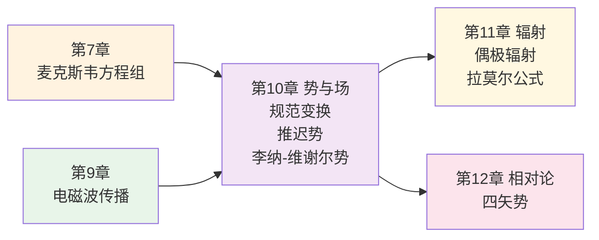
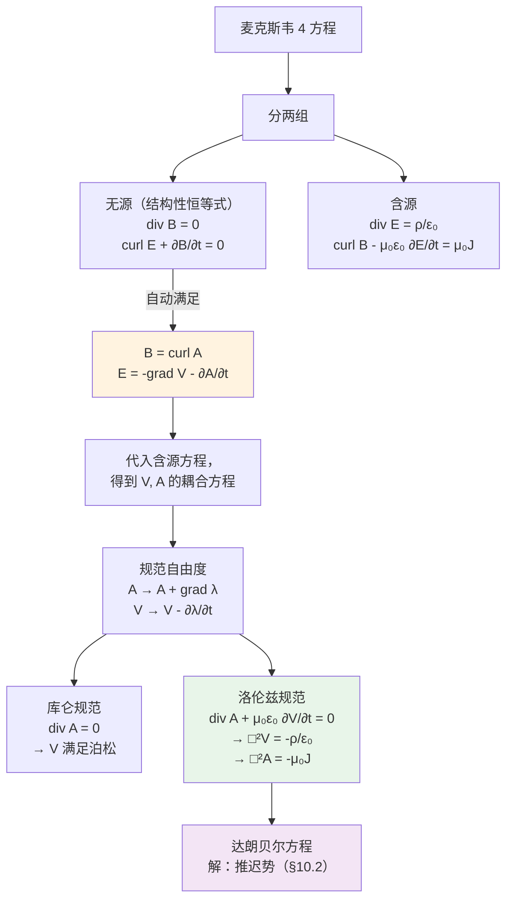
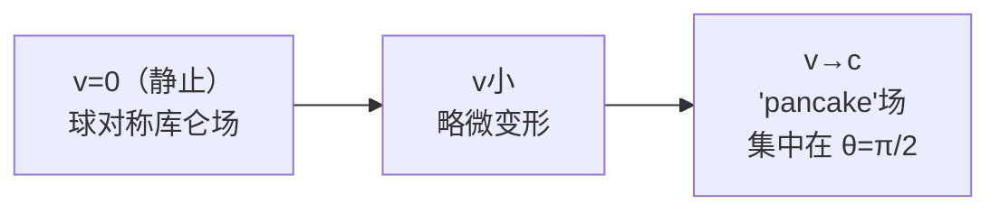
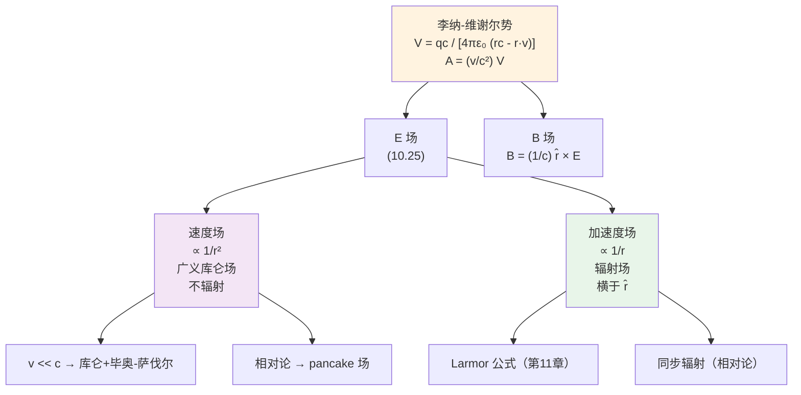
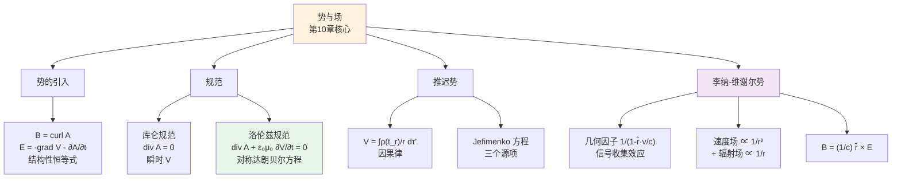

# 第10章 势与场 (Potentials and Fields)

<!-- 骨架占位：将逐节用 Edit 填充 -->

## 引言：回到源头——波是从哪里来的？

第9章我们花了很长篇幅讨论电磁波的传播：在真空中以光速 $c$ 行进，在介质中折射、反射，在波导里以 TE/TM 模式被引导。但有一个根本问题我们一直回避：

> **这些波是从哪里冒出来的？**

平面波是一个数学上方便、物理上**无源**的解——它从 $-\infty$ 传到 $+\infty$，没有"诞生点"。真实世界里的电磁波必然有源：天线上的振荡电流、原子里跃迁的电子、加速器中转弯的电子束。要从源头讲清楚"波怎么辐射出去"，我们必须把目光从 $\mathbf{E}, \mathbf{B}$ 移回到它们的"祖先"——**电荷 $\rho$ 与电流 $\mathbf{J}$**，然后建立从源到场的因果链。

第7章我们已经知道，静态情况下场可由势表达：$\mathbf{E}=-\nabla V$，$\mathbf{B}=\nabla\times\mathbf{A}$。势让计算从 6 个分量（$\mathbf{E}, \mathbf{B}$）压缩到 4 个（$V$ 和 $\mathbf{A}$ 的三个分量），而且自动满足两条无源方程。**这种"用势简化"的策略在时变情况下依然奏效——但代价是引入了一个新的复杂性：规范自由度（gauge freedom）。**

更深刻的是因果性：信息传不快过光速。一个电荷在 $t'$ 时刻晃动一下，远处 $\mathbf{r}$ 位置的场必须等到 $t = t' + \mathcal{r}/c$ 才知道。这就是**推迟势**（retarded potentials）的核心——它把库仑/毕奥-萨伐尔的"瞬时"图像替换为"延时"图像。



**本章的逻辑主线**：

1. **从场到势**（§10.1）：定义动态势，发现规范冗余，选库仑或洛伦兹规范化简方程。
2. **从势到积分解**（§10.2）：用 Green 函数得到推迟势，并通过对推迟势求微分得到 Jefimenko 方程。
3. **从分布到点电荷**（§10.3）：把推迟势的连续积分塌缩到一个加速运动点电荷，得到 Liénard-Wiechert 势，再分离出"速度场"与"辐射场"。

> **本章策略**：第10章是**第11章辐射的物理与数学准备**。Liénard-Wiechert 势是期末压轴题（老期末第4题），务必掌握"几何因子"$1/(1-\hat{\boldsymbol{\mathcal{r}}}\cdot\mathbf{v}/c)$ 的来源——它不是洛伦兹收缩，而是**信号收集效应**。

> **记号约定**（沿用 Griffiths）：
> - 源点 $\mathbf{r}'$，场点 $\mathbf{r}$；分离矢量 $\boldsymbol{\mathcal{r}} \equiv \mathbf{r} - \mathbf{r}'$，$\mathcal{r} \equiv |\boldsymbol{\mathcal{r}}|$，$\hat{\boldsymbol{\mathcal{r}}} \equiv \boldsymbol{\mathcal{r}}/\mathcal{r}$。
> - 推迟时间 $t_r \equiv t - \mathcal{r}/c$。
> - 达朗贝尔算子 $\Box^2 \equiv \nabla^2 - \dfrac{1}{c^2}\dfrac{\partial^2}{\partial t^2}$（注意 Griffiths 用这个符号代表"加号"的波动算子）。

---

## 10.1 势公式

### 10.1.1 动态势的引入

**核心问题**：在一般时变情况下，能否还像静态那样把 $\mathbf{E}, \mathbf{B}$ 写成势的导数？

**关键观察**：麦克斯韦方程组的四条方程里，有两条是**结构性恒等式**（无源），有两条是**含源**的：

$$\begin{aligned}
\text{无源（结构）：}&\quad \nabla\cdot\mathbf{B}=0,\quad \nabla\times\mathbf{E}+\frac{\partial\mathbf{B}}{\partial t}=0\\
\text{含源：}&\quad \nabla\cdot\mathbf{E}=\rho/\varepsilon_0,\quad \nabla\times\mathbf{B}-\mu_0\varepsilon_0\frac{\partial\mathbf{E}}{\partial t}=\mu_0\mathbf{J}
\end{aligned}$$

**第一性原理**：无源方程是**几何恒等式**——它们要对**任何**电磁场成立。如果我们用满足这些恒等式的"母函数"表达 $\mathbf{E}, \mathbf{B}$，就自动消除了两条方程。

**第一步**：$\nabla\cdot\mathbf{B}=0$ 在任意单连通域里等价于
$$\mathbf{B}=\nabla\times\mathbf{A}\tag{10.1}$$

矢势 $\mathbf{A}$ 的存在是 Helmholtz 定理（散度为零必可写成旋度）的直接推论，**与时间无关**——所以这一步和静磁学一模一样。

**第二步**：把 $(10.1)$ 代入法拉第方程：
$$\nabla\times\mathbf{E}=-\frac{\partial(\nabla\times\mathbf{A})}{\partial t}=-\nabla\times\frac{\partial\mathbf{A}}{\partial t}$$

移项：
$$\nabla\times\left(\mathbf{E}+\frac{\partial\mathbf{A}}{\partial t}\right)=0$$

**括号里的量旋度为零，所以可以写成某个标量的负梯度**：
$$\mathbf{E}+\frac{\partial\mathbf{A}}{\partial t}=-\nabla V \quad\Longrightarrow\quad \boxed{\mathbf{E}=-\nabla V-\frac{\partial\mathbf{A}}{\partial t}}\tag{10.2}$$

**物理解读**：动态电场分两部分：
- $-\nabla V$：由电荷"位置"产生的"似静电"部分；
- $-\partial\mathbf{A}/\partial t$：由电流"变化"产生的"感应电场"部分（法拉第效应）。

> ⚠️ **常见误解**：在时变情况下，$\mathbf{E}\neq -\nabla V$！把 $\partial\mathbf{A}/\partial t$ 漏掉是入门最常见的错误。原因：法拉第感应电场是**非保守**的（环路积分非零），不能只用标量 $V$ 表达。

**第三步**：把 $(10.1), (10.2)$ 代入两条含源方程：

代入 Gauss 定律：
$$\nabla\cdot\left(-\nabla V-\frac{\partial\mathbf{A}}{\partial t}\right)=\rho/\varepsilon_0$$
$$\boxed{\nabla^2 V+\frac{\partial}{\partial t}(\nabla\cdot\mathbf{A})=-\rho/\varepsilon_0}\tag{10.3}$$

代入 Ampère-Maxwell 定律（用 $\nabla\times(\nabla\times\mathbf{A})=\nabla(\nabla\cdot\mathbf{A})-\nabla^2\mathbf{A}$）：
$$\nabla(\nabla\cdot\mathbf{A})-\nabla^2\mathbf{A}=\mu_0\mathbf{J}-\mu_0\varepsilon_0\frac{\partial}{\partial t}\left(-\nabla V-\frac{\partial\mathbf{A}}{\partial t}\right)$$

整理：
$$\boxed{\nabla^2\mathbf{A}-\mu_0\varepsilon_0\frac{\partial^2\mathbf{A}}{\partial t^2}-\nabla\left(\nabla\cdot\mathbf{A}+\mu_0\varepsilon_0\frac{\partial V}{\partial t}\right)=-\mu_0\mathbf{J}}\tag{10.4}$$

**$(10.3), (10.4)$ 等价于全部 4 条麦克斯韦方程**——把 6 个场分量化简为 4 个势分量（$V$ 和 $\mathbf{A}$ 的三个），代价是方程**耦合**且看起来很丑。下一节我们将看到，丑陋是"假象"——它来源于一个我们尚未行使的**规范自由**。

---

**例题 10.1（势的存在性验证）**

已知一个含时电磁场：
$$\mathbf{E}=-\frac{\mu_0 I_0\omega\cos(\omega t)}{2\pi s}\hat{\mathbf{z}},\quad \mathbf{B}=\frac{\mu_0 I_0\sin(\omega t)}{2\pi s}\hat{\boldsymbol{\phi}}\quad (s>a)$$
（一根无限长导线沿 $z$ 轴，载流 $I(t)=I_0\sin(\omega t)$ 在准静态近似下的场。）求一组合适的势 $V, \mathbf{A}$。

**解**：
- **第0步**：识别。$\mathbf{B}$ 只有 $\hat{\boldsymbol{\phi}}$ 分量、$\mathbf{E}$ 只有 $\hat{\mathbf{z}}$ 分量，且 $\mathbf{E}$ 与 $\partial\mathbf{B}/\partial t$ 同方向相关，提示选 $V=0$，$\mathbf{A}=A_z(s,t)\hat{\mathbf{z}}$。
- **第1步**：由 $\mathbf{B}=\nabla\times\mathbf{A}$，圆柱坐标下 $\mathbf{A}=A_z\hat{\mathbf{z}}$ 给出 $B_\phi=-\partial A_z/\partial s$。所以
$$-\frac{\partial A_z}{\partial s}=\frac{\mu_0 I_0\sin(\omega t)}{2\pi s}\Rightarrow A_z=-\frac{\mu_0 I_0\sin(\omega t)}{2\pi}\ln(s/a)+f(t)$$
取 $f(t)=0$（在 $s=a$ 上 $A_z=0$ 的参考），即
$$\mathbf{A}=-\frac{\mu_0 I_0\sin(\omega t)}{2\pi}\ln(s/a)\,\hat{\mathbf{z}}$$
- **第2步**：检验 $\mathbf{E}=-\partial\mathbf{A}/\partial t$（因 $V=0$）：
$$-\frac{\partial\mathbf{A}}{\partial t}=\frac{\mu_0 I_0\omega\cos(\omega t)}{2\pi}\ln(s/a)\,\hat{\mathbf{z}}$$

咦——这与题目给的 $\mathbf{E}=-\frac{\mu_0 I_0\omega\cos(\omega t)}{2\pi s}\hat{\mathbf{z}}$ 不符！

- **第3步**：诊断。原因是题目给的"准静态" $\mathbf{E}$ 实际上**不能完全用 $V=0$ 表达**；正确的 $\mathbf{E}$ 是法拉第感应场，应为 $\propto\ln(s/a)$ 而非 $1/s$。教训：题目给定的场必须自洽（满足麦克斯韦方程），否则势不存在。

**点评**：这一例题展示了"势的可解性"等价于"场自洽地满足麦克斯韦无源方程"。读者应学会用 $\nabla\cdot\mathbf{B}=0$ 与法拉第方程**作为合理性检验**。

### 10.1.2 规范自由度与规范变换

**核心问题**：给定 $\mathbf{E}, \mathbf{B}$，势 $V, \mathbf{A}$ 是唯一的吗？

**答案**：不唯一。$\mathbf{A}$ 只通过 $\nabla\times\mathbf{A}$ 进入物理；旋度为零的部分（即任意标量梯度 $\nabla\lambda$）对 $\mathbf{B}$ 无贡献。设
$$\mathbf{A}'=\mathbf{A}+\nabla\lambda$$

此时 $\mathbf{B}'=\nabla\times\mathbf{A}'=\mathbf{B}$，但
$$\mathbf{E}'=-\nabla V'-\frac{\partial\mathbf{A}'}{\partial t}=-\nabla V'-\frac{\partial\mathbf{A}}{\partial t}-\nabla\frac{\partial\lambda}{\partial t}$$

要让 $\mathbf{E}'=\mathbf{E}$，必须同时把 $V$ 调整为
$$V'=V-\frac{\partial\lambda}{\partial t}$$

**规范变换公式**：
$$\boxed{\mathbf{A}\to\mathbf{A}+\nabla\lambda,\quad V\to V-\frac{\partial\lambda}{\partial t}}\tag{10.5}$$

对**任意可微函数** $\lambda(\mathbf{r}, t)$，变换后的 $(V', \mathbf{A}')$ 给出**完全相同的物理场** $(\mathbf{E}, \mathbf{B})$。

**第一性原理解读**：势是**物理场的描述工具，不是物理实在**。$\lambda$ 是数学冗余，类似于经典力学里"势能加常数"的自由——只不过现在的"常数"是一个时空函数。

> **量子力学伏笔**：在量子电动力学里，规范变换不再是"无后果的数学游戏"——它对应于波函数的局部相位变换 $\psi\to e^{iq\lambda/\hbar}\psi$（Aharonov-Bohm 效应即源于此）。但即便在量子情形下，**物理可观测量仍然规范不变**。

**规范固定（gauge fixing）**：我们可以利用这个自由度，**对 $V, \mathbf{A}$ 施加一个额外的辅助条件**，让方程 $(10.3), (10.4)$ 简化。最常用的两种规范：

| 规范名称 | 辅助条件 | 优点 | 缺点 |
|---|---|---|---|
| 库仑规范 | $\nabla\cdot\mathbf{A}=0$ | $V$ 满足泊松方程，瞬时确定 | $V$ 表观瞬时；$\mathbf{A}$ 方程含 $\nabla\partial V/\partial t$ |
| 洛伦兹规范 | $\nabla\cdot\mathbf{A}+\mu_0\varepsilon_0\dfrac{\partial V}{\partial t}=0$ | $V, \mathbf{A}$ 解耦，对称满足波动方程；相对论协变 | $V$ 不再是瞬时的，须计算推迟势 |

> ⚠️ **历史注记**：洛伦兹规范的命名常被混淆。它由**Ludvig Lorenz**（丹麦人，1867）首先提出，而**Hendrik Lorentz**（荷兰人）以洛伦兹变换闻名。两者拼写不同（Lorenz vs Lorentz），但近代很多文献都误写为 Lorentz。Griffiths 写作 "Lorenz Gauge"，本教程沿用。

---

**例题 10.2（规范变换的具体应用）**

某区域 $V=0$，$\mathbf{A}=\dfrac{1}{4\pi\varepsilon_0}\dfrac{qt}{r^2}\hat{\mathbf{r}}$。

(a) 求 $\mathbf{E}, \mathbf{B}$。  
(b) 找一个规范函数 $\lambda$，使得变换后的 $V'$ 是一个点电荷 $q$ 的库仑势（即 $V'=\dfrac{q}{4\pi\varepsilon_0 r}$）。

**解**：

**(a)** 计算 $\mathbf{B}=\nabla\times\mathbf{A}$：由于 $\mathbf{A}$ 是径向的且只依赖 $r$，旋度为 0，$\mathbf{B}=0$。

$\mathbf{E}=-\nabla V-\partial\mathbf{A}/\partial t=0-\dfrac{q}{4\pi\varepsilon_0 r^2}\hat{\mathbf{r}}$——这是个负号？让我们重看：$\partial\mathbf{A}/\partial t=\dfrac{q}{4\pi\varepsilon_0 r^2}\hat{\mathbf{r}}$，所以 $\mathbf{E}=-\dfrac{q}{4\pi\varepsilon_0 r^2}\hat{\mathbf{r}}$，对应电荷 $-q$ 的库仑场。

这是一个**反 Griffiths 约定**的有趣构造：场是负点电荷的库仑场，但势全在 $\mathbf{A}$ 里、$V=0$。

**(b)** 要求 $V'=\dfrac{1}{4\pi\varepsilon_0}\dfrac{q}{r}\cdot(?)$。先看符号：$\mathbf{E}=-q/(4\pi\varepsilon_0 r^2)\hat{\mathbf{r}}$，对应的库仑势应是 $V'=-q/(4\pi\varepsilon_0 r)$。所以我们要变换到
$$V'=-\frac{q}{4\pi\varepsilon_0 r},\quad \mathbf{A}'=0$$

由变换公式 $V'=V-\partial\lambda/\partial t$：
$$-\frac{q}{4\pi\varepsilon_0 r}=0-\frac{\partial\lambda}{\partial t}\Rightarrow \lambda=\frac{qt}{4\pi\varepsilon_0 r}$$

验证 $\mathbf{A}'=\mathbf{A}+\nabla\lambda$：
$$\nabla\lambda=\frac{qt}{4\pi\varepsilon_0}\nabla(1/r)=-\frac{qt}{4\pi\varepsilon_0 r^2}\hat{\mathbf{r}}$$
$$\mathbf{A}'=\frac{qt}{4\pi\varepsilon_0 r^2}\hat{\mathbf{r}}-\frac{qt}{4\pi\varepsilon_0 r^2}\hat{\mathbf{r}}=0 \checkmark$$

**点评**：同一对 $(\mathbf{E}, \mathbf{B})$ 既可由 $(V=0, \mathbf{A}\neq 0)$ 表达（"全 $\mathbf{A}$ 规范"），也可由 $(V\neq 0, \mathbf{A}=0)$ 表达（"静库仑规范"）。**势的形式可以差很多，但 $(\mathbf{E}, \mathbf{B})$ 是物理的、唯一的**。

### 10.1.3 库仑规范 vs 洛伦兹规范

#### 库仑规范

**约定**：$\nabla\cdot\mathbf{A}=0$。代入 $(10.3)$：

$$\boxed{\nabla^2 V=-\rho/\varepsilon_0}\tag{10.6}$$

**这是熟悉的泊松方程**！它的解和静电学一模一样：

$$V(\mathbf{r}, t)=\frac{1}{4\pi\varepsilon_0}\int\frac{\rho(\mathbf{r}', t)}{\mathcal{r}}d\tau'\tag{10.7}$$

**注意**：被积函数中的 $\rho$ 取的是**同时刻**值 $\rho(\mathbf{r}', t)$，**没有推迟**！

> ⚠️ **看似违反因果律**？在库仑规范下，$V$ 表观上是瞬时确定的。但**物理量是 $\mathbf{E}, \mathbf{B}$，不是 $V$ 单独**。$\mathbf{E}=-\nabla V-\partial\mathbf{A}/\partial t$ 中，$\partial\mathbf{A}/\partial t$ 会以一种"恰好的方式"消掉 $-\nabla V$ 中的超光速部分。因果律保护的是 $\mathbf{E}, \mathbf{B}$，不是势。

矢势 $\mathbf{A}$ 的方程仍然耦合且复杂：
$$\nabla^2\mathbf{A}-\mu_0\varepsilon_0\frac{\partial^2\mathbf{A}}{\partial t^2}=-\mu_0\mathbf{J}+\mu_0\varepsilon_0\nabla\frac{\partial V}{\partial t}\tag{10.8}$$

**库仑规范的用武之地**：在**无源**或**准静态**问题里特别方便（如分子物理中的束缚电子+量子化光场，常用 $V=0$ 的辐射规范，是库仑规范的子类）。

#### 洛伦兹规范

**约定**：
$$\boxed{\nabla\cdot\mathbf{A}+\mu_0\varepsilon_0\frac{\partial V}{\partial t}=0}\tag{10.9}$$

代入 $(10.3), (10.4)$，**奇迹发生**——两条方程完全解耦且对称：

$$\boxed{\nabla^2 V-\mu_0\varepsilon_0\frac{\partial^2 V}{\partial t^2}=-\rho/\varepsilon_0}\tag{10.10}$$

$$\boxed{\nabla^2\mathbf{A}-\mu_0\varepsilon_0\frac{\partial^2\mathbf{A}}{\partial t^2}=-\mu_0\mathbf{J}}\tag{10.11}$$

**第一性原理解读**：洛伦兹规范把麦克斯韦方程组化为**对称的、解耦的、形式相同的波动方程**。这是为辐射、相对论协变性所定制的规范。

**规范条件总是能满足吗？** 即给定任意一组 $(V, \mathbf{A})$，能否总找到 $\lambda$ 使变换后的 $(V', \mathbf{A}')$ 满足 $(10.9)$？变换后的发散：
$$\nabla\cdot\mathbf{A}'+\mu_0\varepsilon_0\frac{\partial V'}{\partial t}=\left(\nabla\cdot\mathbf{A}+\mu_0\varepsilon_0\frac{\partial V}{\partial t}\right)+\nabla^2\lambda-\mu_0\varepsilon_0\frac{\partial^2\lambda}{\partial t^2}$$

要让它为零，$\lambda$ 须满足
$$\nabla^2\lambda-\mu_0\varepsilon_0\frac{\partial^2\lambda}{\partial t^2}=-\left(\nabla\cdot\mathbf{A}+\mu_0\varepsilon_0\frac{\partial V}{\partial t}\right)$$

这是**非齐次波动方程**——只要源足够好，解总存在。所以**洛伦兹规范总可达**。

---

**例题 10.3（库仑规范下的瞬时势悖论）**

一个电荷在 $t=0$ 时刻突然从 $\mathbf{r}_1$ 跳到 $\mathbf{r}_2$。在库仑规范下，远处一观察者在 $t>0$ 时观测到的 $V$ 立刻"知道"电荷搬家了。这是否说明信号超光速？

**解**：

**(物理分析)** $V$ 在库仑规范下确实"瞬时"更新，但物理可观测量是 $\mathbf{E}=-\nabla V-\partial\mathbf{A}/\partial t$。

**(关键洞察)** 仔细计算可以证明（Brill & Goodman, 1967；Jackson 3rd ed. §6.3）：洛伦兹规范下的 $\mathbf{A}_L$ 和库仑规范下的 $\mathbf{A}_C$ 关系为
$$\mathbf{A}_C=\mathbf{A}_L-\frac{1}{c^2}\nabla\partial_t^{-1}\big[\text{某个超光速涌动项}\big]$$
正是 $\partial\mathbf{A}_C/\partial t$ 中**精确**抵消了 $-\nabla V$ 中的超光速部分，**净 $\mathbf{E}$ 仍以光速传播**。

**(结论)** 库仑规范的"瞬时 $V$" 是**规范赝象（gauge artifact）**，不可观测。我们对规范赝象的容忍度，反映了对"势的物理实在性"的态度——**它是工具，不是实在**。

**点评**：这个悖论是规范理论教学的经典素材。其精确数学处理可参见 Jackson 第6章习题 6.20。

### 10.1.4 达朗贝尔方程——统一的波动方程

把 $(10.10), (10.11)$ 写成统一形式，引入**达朗贝尔算子**（Griffiths 沿用 $\Box^2$）：

$$\Box^2\equiv\nabla^2-\frac{1}{c^2}\frac{\partial^2}{\partial t^2}$$

（更常见的约定是 $\Box\equiv\partial^\mu\partial_\mu=\dfrac{1}{c^2}\partial_t^2-\nabla^2$，差一个符号；本教程沿用 Griffiths 的 $\Box^2=\nabla^2-c^{-2}\partial_t^2$。）

则洛伦兹规范下：
$$\boxed{\Box^2 V=-\rho/\varepsilon_0,\quad \Box^2\mathbf{A}=-\mu_0\mathbf{J}}\tag{10.12}$$

**这就是著名的非齐次波动方程**（inhomogeneous wave equation），也叫**达朗贝尔方程**。

**第一性原理解读**：
1. **左边**：$\Box^2$ 是相对论协变的波算子，自动包含光速 $c$。
2. **右边**：源——电荷密度 $\rho$ 驱动 $V$，电流密度 $\mathbf{J}$ 驱动 $\mathbf{A}$，结构完美对应。
3. **无源时**：$\rho=0, \mathbf{J}=0$，$(10.12)$ 退化为齐次波动方程，解为第9章讨论的电磁波。**这告诉我们：电磁波是势方程的"自由解"，而源激发的是"特解"。**
4. **静态时**：$\partial_t\to 0$，$(10.12)$ 退化为
$$\nabla^2 V=-\rho/\varepsilon_0,\quad \nabla^2\mathbf{A}=-\mu_0\mathbf{J}$$
分别是静电学的泊松方程与静磁学的矢量泊松方程，与第2、5章一致。

**洛伦兹规范的相对论协变性**：洛伦兹规范条件 $(10.9)$ 可以写成
$$\partial_\mu A^\mu=0$$
其中 $A^\mu=(V/c, \mathbf{A})$ 是**四矢势**（第12章详述）。$(10.12)$ 同样协变：
$$\Box A^\mu=\mu_0 J^\mu$$
其中 $J^\mu=(c\rho, \mathbf{J})$ 是四矢电流。这种"一行写完所有麦克斯韦方程"的简洁是相对论的力量，也是洛伦兹规范在物理学中地位崇高的原因。

---

**例题 10.4（势的洛伦兹规范检验）**

某 $(V, \mathbf{A})$ 由下式给出（无限长直导线沿 $z$ 轴，载流 $I(t)$）：
$$V=0,\quad \mathbf{A}(s, t)=\frac{\mu_0}{4\pi}\,\hat{\mathbf{z}}\int_0^{?}\frac{I(t_r)}{|\mathbf{r}-\mathbf{r}'|}\,dz'$$
（暂不详细给出，将在 §10.2 中讨论。）问：此 $(V, \mathbf{A})$ 自动满足洛伦兹规范条件吗？

**解**：

**(分析)** 洛伦兹条件 $\nabla\cdot\mathbf{A}+\mu_0\varepsilon_0\partial V/\partial t=0$。由于 $V=0$，仅需检验 $\nabla\cdot\mathbf{A}=0$。

**(计算思路)** $\mathbf{A}$ 沿 $\hat{\mathbf{z}}$，且只依赖 $s$（柱面对称）：$\nabla\cdot(A_z\hat{\mathbf{z}})=\partial A_z/\partial z=0$（因为 $A_z$ 不依赖 $z$）。所以**库仑规范** $\nabla\cdot\mathbf{A}=0$ 满足；又因 $V=0$，**洛伦兹规范也自动满足**。

**(关键点)** 当 $V=0$ 时，库仑规范与洛伦兹规范条件**重合**！这种"双重满足"在**辐射规范**（radiation gauge）问题里很常见。

**点评**：电荷守恒方程 $\partial\rho/\partial t+\nabla\cdot\mathbf{J}=0$ 配合 $(10.12)$ 可推出洛伦兹规范条件**自洽**——只要源守恒，达朗贝尔方程的解自动是洛伦兹规范的。这是一个深刻的"自一致性"。

---

**第10.1 节理论小结**



---

## 10.2 连续分布的势

### 10.2.1 推迟势——因果律的胜利

**核心问题**：怎么解 $\Box^2 V=-\rho/\varepsilon_0$？

**第一性原理**：静态情况下，$\nabla^2 V=-\rho/\varepsilon_0$ 的解是
$$V_{\text{static}}(\mathbf{r})=\frac{1}{4\pi\varepsilon_0}\int\frac{\rho(\mathbf{r}')}{\mathcal{r}}d\tau'$$

物理：场点 $\mathbf{r}$ 处的势是源点 $\mathbf{r}'$ 贡献的叠加，每一项按 $1/\mathcal{r}$ 衰减。**但这是瞬时的——源现在的值决定场现在的值。**

**因果律破坏？** 时变下，电磁信号传播速度有限（$c$）。源点 $\mathbf{r}'$ 在 $t'$ 时刻的扰动，要传到场点 $\mathbf{r}$ 需要时间 $\Delta t=\mathcal{r}/c$。所以场点 $t$ 时刻"看到"的源，应该是 $t'=t-\mathcal{r}/c$ 时刻的源。

**推迟时间**（retarded time）：
$$\boxed{t_r\equiv t-\mathcal{r}/c}\tag{10.13}$$

**推迟势**：
$$\boxed{V(\mathbf{r}, t)=\frac{1}{4\pi\varepsilon_0}\int\frac{\rho(\mathbf{r}', t_r)}{\mathcal{r}}d\tau',\quad \mathbf{A}(\mathbf{r}, t)=\frac{\mu_0}{4\pi}\int\frac{\mathbf{J}(\mathbf{r}', t_r)}{\mathcal{r}}d\tau'}\tag{10.14}$$

**第一性原理验证**——这真是 $\Box^2 V=-\rho/\varepsilon_0$ 的解吗？

#### 严格证明（Griffiths §10.2.1 思路）

**目标**：证明 $(10.14)$ 满足 $\Box^2 V=\nabla^2 V-c^{-2}\partial_t^2 V=-\rho/\varepsilon_0$。

**第1步**：写出 $V$ 对 $t$ 的偏导。由于 $t_r=t-\mathcal{r}/c$ 仅通过 $t$ 依赖 $t$（$\mathbf{r}', \mathcal{r}$ 与 $t$ 无关）：
$$\frac{\partial V}{\partial t}=\frac{1}{4\pi\varepsilon_0}\int\frac{\dot\rho(\mathbf{r}', t_r)}{\mathcal{r}}d\tau'$$

**第2步**：对 $\mathbf{r}$ 求梯度。注意此时 $t_r$ 通过 $\mathcal{r}$ **依赖于场点 $\mathbf{r}$**，所以
$$\nabla\rho(\mathbf{r}', t_r)=\dot\rho\nabla t_r=-\frac{\dot\rho}{c}\nabla\mathcal{r}=-\frac{\dot\rho}{c}\hat{\boldsymbol{\mathcal{r}}}$$

（这里 $\dot\rho\equiv\partial\rho/\partial t_r$；用 $\nabla\mathcal{r}=\hat{\boldsymbol{\mathcal{r}}}$。）

$$\nabla V=\frac{1}{4\pi\varepsilon_0}\int\left[\nabla\rho\cdot\frac{1}{\mathcal{r}}+\rho\nabla(1/\mathcal{r})\right]d\tau'=\frac{1}{4\pi\varepsilon_0}\int\left[-\frac{\dot\rho}{c\mathcal{r}}\hat{\boldsymbol{\mathcal{r}}}-\frac{\rho}{\mathcal{r}^2}\hat{\boldsymbol{\mathcal{r}}}\right]d\tau'$$

**第3步**：再求 $\nabla^2 V=\nabla\cdot(\nabla V)$。这一步涉及大量代数。最关键的恒等式：
$$\nabla\cdot\left(\frac{\hat{\boldsymbol{\mathcal{r}}}}{\mathcal{r}^2}\right)=4\pi\delta^3(\boldsymbol{\mathcal{r}})$$

经过仔细计算（详见 Griffiths §10.2.1）：
$$\nabla^2 V=\frac{1}{4\pi\varepsilon_0}\int\left[\frac{\ddot\rho}{c^2\mathcal{r}}-4\pi\rho\delta^3(\boldsymbol{\mathcal{r}})\right]d\tau'=\frac{1}{c^2}\frac{\partial^2 V}{\partial t^2}-\frac{\rho(\mathbf{r}, t)}{\varepsilon_0}$$

**移项**：
$$\nabla^2 V-\frac{1}{c^2}\frac{\partial^2 V}{\partial t^2}=-\frac{\rho}{\varepsilon_0}\quad\checkmark$$

证毕。同样的步骤适用于 $\mathbf{A}$。

> **注**：Griffiths 的推导用到了"先把 $\rho$ 写成 delta 函数源做线性叠加，再处理点源对应的 Green 函数"。Green 函数 $G(\mathbf{r}, t; \mathbf{r}', t')=\dfrac{\delta(t-t'-\mathcal{r}/c)}{4\pi\mathcal{r}}$ 是更精炼的现代写法（Jackson §6.4）。

---

**例题 10.5（线性增长电流的推迟势）**

无限长直导线沿 $z$ 轴，载流
$$I(t)=\begin{cases}0, & t<0\\ kt, & t\geq 0\end{cases}$$
（$k$ 是常数）。求场点 $\mathbf{r}=(s, 0, 0)$ 处的矢势 $\mathbf{A}(s, t)$ 与电场 $\mathbf{E}$。

**解**：

**第0步**：源点 $\mathbf{r}'=(0, 0, z')$，分离矢量 $\boldsymbol{\mathcal{r}}=(s, 0, -z')$，$\mathcal{r}=\sqrt{s^2+z'^2}$。

**第1步**：电流元 $\mathbf{J}\,d\tau'\to I(t_r)\,dz'\hat{\mathbf{z}}$。

**第2步**：用 $(10.14)$：
$$\mathbf{A}(s, t)=\frac{\mu_0}{4\pi}\hat{\mathbf{z}}\int_{-\infty}^{\infty}\frac{I(t_r)}{\sqrt{s^2+z'^2}}dz'$$

**第3步**：因果限制——$I(t_r)\neq 0$ 当且仅当 $t_r\geq 0$，即 $t-\sqrt{s^2+z'^2}/c\geq 0$，即 $|z'|\leq\sqrt{(ct)^2-s^2}$（当 $ct>s$ 时；否则 $I=0$，$\mathbf{A}=0$）。

**第4步**：设 $ct>s$（即"信号已到达"），积分上限 $z'_{\max}=\sqrt{(ct)^2-s^2}$。代入 $I(t_r)=k(t-\sqrt{s^2+z'^2}/c)$：

$$\mathbf{A}=\frac{\mu_0 k}{4\pi}\hat{\mathbf{z}}\cdot 2\int_0^{z'_{\max}}\frac{t-\sqrt{s^2+z'^2}/c}{\sqrt{s^2+z'^2}}dz'$$

分两部分：
$$I_1=t\int_0^{z'_{\max}}\frac{dz'}{\sqrt{s^2+z'^2}}=t\ln\left(\frac{z'_{\max}+\sqrt{s^2+z'^2_{\max}}}{s}\right)=t\ln\left(\frac{\sqrt{(ct)^2-s^2}+ct}{s}\right)$$
$$I_2=-\frac{1}{c}\int_0^{z'_{\max}}dz'=-\frac{1}{c}\sqrt{(ct)^2-s^2}$$

**结果**：
$$\boxed{\mathbf{A}(s, t)=\frac{\mu_0 k}{2\pi}\left[t\ln\left(\frac{ct+\sqrt{(ct)^2-s^2}}{s}\right)-\frac{\sqrt{(ct)^2-s^2}}{c}\right]\hat{\mathbf{z}}}$$
（$ct>s$，否则 $\mathbf{A}=0$。）

**第5步**：电场（$V=0$，因导线电中性）：
$$\mathbf{E}=-\frac{\partial\mathbf{A}}{\partial t}$$

计算 $\partial\mathbf{A}/\partial t$。令 $u=\sqrt{(ct)^2-s^2}$，$\partial u/\partial t=c^2 t/u$。

$$\frac{\partial}{\partial t}\left[t\ln\frac{ct+u}{s}\right]=\ln\frac{ct+u}{s}+t\cdot\frac{c+\partial u/\partial t}{ct+u}=\ln\frac{ct+u}{s}+\frac{t(c+c^2 t/u)}{ct+u}=\ln\frac{ct+u}{s}+\frac{ct}{u}$$

$$\frac{\partial}{\partial t}\left[-\frac{u}{c}\right]=-\frac{1}{c}\cdot\frac{c^2 t}{u}=-\frac{ct}{u}$$

**两项相加**：$\partial\mathbf{A}/\partial t=\dfrac{\mu_0 k}{2\pi}\ln\dfrac{ct+u}{s}\hat{\mathbf{z}}$。

$$\boxed{\mathbf{E}(s, t)=-\frac{\mu_0 k}{2\pi}\ln\left(\frac{ct+\sqrt{(ct)^2-s^2}}{s}\right)\hat{\mathbf{z}}}\quad (ct>s)$$

**第6步**：极限检验。
- 信号未到达（$ct<s$）：$\mathbf{E}=0$。**因果律满足**。
- 长时间渐近（$ct\gg s$）：$\ln\to\ln(2ct/s)\sim\ln t$，$\mathbf{E}\sim-\ln t$，方向 $-\hat{\mathbf{z}}$。这对应于一个稳态电流增长激发的感应电场。

**点评**：这是 Griffiths 中最经典的推迟势例题（题号 [G 10.10]）。它把"推迟"这个抽象概念化为**积分上限**：信号"还没到"的源点不贡献。考试中遇到时变电流问题，按这个 SOP 走：写源积分 → 限定 $t_r\geq 0$ → 算积分 → 求场。

### 10.2.2 推迟势满足麦克斯韦方程的证明

§10.2.1 我们已通过直接代入验证 $V_{\text{ret}}$ 满足 $\Box^2 V=-\rho/\varepsilon_0$。但还需要确认：**$(V_{\text{ret}}, \mathbf{A}_{\text{ret}})$ 这对势满足洛伦兹规范条件 $(10.9)$**——否则它们只是某个达朗贝尔方程的解，未必对应物理。

**第一性原理**：洛伦兹规范条件 $\nabla\cdot\mathbf{A}+\mu_0\varepsilon_0\partial V/\partial t=0$ 等价于电荷守恒。

**证明草图**：

直接计算 $\nabla\cdot\mathbf{A}_{\text{ret}}$（场点梯度作用于推迟势）：
$$\nabla\cdot\mathbf{A}=\frac{\mu_0}{4\pi}\int\left[\frac{1}{\mathcal{r}}\nabla\cdot\mathbf{J}(t_r)+\mathbf{J}\cdot\nabla(1/\mathcal{r})\right]d\tau'$$

注意 $\nabla\cdot\mathbf{J}(\mathbf{r}', t_r)$ 是场点梯度作用于 $\mathbf{J}$ 中的 $t_r=t-\mathcal{r}/c$ 的隐式 $\mathbf{r}$ 依赖：
$$\nabla\cdot\mathbf{J}(\mathbf{r}', t_r)=\dot{\mathbf{J}}\cdot\nabla t_r=-\frac{1}{c}\dot{\mathbf{J}}\cdot\hat{\boldsymbol{\mathcal{r}}}$$

源点梯度 $\nabla'\cdot\mathbf{J}(\mathbf{r}', t_r)$ 则同时作用于 $\mathbf{r}'$ 显式依赖与 $t_r$ 中的 $\mathbf{r}'$ 依赖：
$$\nabla'\cdot\mathbf{J}(\mathbf{r}', t_r)\big|_{\text{隐含 } t_r}=(\nabla'\cdot\mathbf{J})_{t_r}+\dot{\mathbf{J}}\cdot\nabla' t_r=(\nabla'\cdot\mathbf{J})_{t_r}+\frac{1}{c}\dot{\mathbf{J}}\cdot\hat{\boldsymbol{\mathcal{r}}}$$

把两式相加：$\nabla\cdot\mathbf{J}+\nabla'\cdot\mathbf{J}|_{\text{隐}}=(\nabla'\cdot\mathbf{J})_{t_r}$（"显式源点散度"）。

利用电荷守恒：$(\nabla'\cdot\mathbf{J})_{t_r}=-\partial\rho/\partial t_r=-\dot\rho$。

合并、积分（分部、用边界 $\to 0$）后，恰好得到：
$$\nabla\cdot\mathbf{A}_{\text{ret}}=-\mu_0\varepsilon_0\frac{\partial V_{\text{ret}}}{\partial t}$$

**结论**：电荷守恒 ⇔ 推迟势满足洛伦兹规范条件。

> **深刻意义**：这一连锁表明，**麦克斯韦方程的协变结构、电荷守恒、推迟势、洛伦兹规范是一体的**。如果电流不守恒，推迟势就不满足洛伦兹规范，势的方程也不再化为对称的达朗贝尔形式。

---

### 10.2.3 杰斐缅柯方程

得到 $V_{\text{ret}}, \mathbf{A}_{\text{ret}}$ 之后，由 $\mathbf{E}=-\nabla V-\partial\mathbf{A}/\partial t$ 和 $\mathbf{B}=\nabla\times\mathbf{A}$ 直接求场。结果是 **Jefimenko 方程**（Jefimenko, 1966）：

$$\boxed{\mathbf{E}(\mathbf{r}, t)=\frac{1}{4\pi\varepsilon_0}\int\left[\frac{\rho(t_r)}{\mathcal{r}^2}\hat{\boldsymbol{\mathcal{r}}}+\frac{\dot\rho(t_r)}{c\mathcal{r}}\hat{\boldsymbol{\mathcal{r}}}-\frac{\dot{\mathbf{J}}(t_r)}{c^2\mathcal{r}}\right]d\tau'}\tag{10.15}$$

$$\boxed{\mathbf{B}(\mathbf{r}, t)=\frac{\mu_0}{4\pi}\int\left[\frac{\mathbf{J}(t_r)}{\mathcal{r}^2}+\frac{\dot{\mathbf{J}}(t_r)}{c\mathcal{r}}\right]\times\hat{\boldsymbol{\mathcal{r}}}\,d\tau'}\tag{10.16}$$

**结构解读**：

- $\mathbf{E}$ 第一项 $\propto\rho/\mathcal{r}^2$：**库仑型**项（"似静电场"）。
- $\mathbf{E}$ 第二项 $\propto\dot\rho/(c\mathcal{r})$：**电荷变化率**贡献。
- $\mathbf{E}$ 第三项 $\propto\dot{\mathbf{J}}/(c^2\mathcal{r})$：**电流变化率**贡献——这是辐射场的源！
- $\mathbf{B}$ 第一项 $\propto\mathbf{J}/\mathcal{r}^2$：**毕奥-萨伐尔型**项。
- $\mathbf{B}$ 第二项 $\propto\dot{\mathbf{J}}/(c\mathcal{r})$：辐射磁场。

**所有被积函数都在 $t_r$ 求值**。

#### 为什么不能简单地把库仑/毕奥-萨伐尔的 $t$ 换成 $t_r$？

朴素猜测可能写出：
$$\mathbf{E}_{\text{wrong}}(\mathbf{r}, t)=\frac{1}{4\pi\varepsilon_0}\int\frac{\rho(t_r)}{\mathcal{r}^2}\hat{\boldsymbol{\mathcal{r}}}\,d\tau'\quad(\text{错误！})$$

**这是错的**——它丢了第二项 $\dot\rho/(c\mathcal{r})$ 和第三项 $-\dot{\mathbf{J}}/(c^2\mathcal{r})$。

**第一性原理解释**：$\mathbf{E}=-\nabla V-\partial\mathbf{A}/\partial t$，其中
1. $\nabla V_{\text{ret}}$ 的"梯度"作用在 $V_{\text{ret}}$ 上，要同时对 $1/\mathcal{r}$ **和 $t_r$ 中的 $\mathbf{r}$ 依赖**求梯度。这就产生了 $\dot\rho/(c\mathcal{r})\hat{\boldsymbol{\mathcal{r}}}$ 项。
2. $\partial\mathbf{A}_{\text{ret}}/\partial t$ 产生了 $\dot{\mathbf{J}}/(c^2\mathcal{r})$ 项。

**朴素 "$t\to t_r$" 等价于只对 $1/\mathcal{r}$ 求梯度，漏掉了 $\nabla t_r$ 的贡献**——这是经典错误。

> **物理意义**：辐射场（第11章）几乎全部来自 $\dot{\mathbf{J}}$ 项。如果用"朴素推迟版库仑+毕奥-萨伐尔"，**就会错过所有辐射现象**！

---

**例题 10.6（Jefimenko 退化为静态）**

证明：当 $\partial_t\rho=\partial_t\mathbf{J}=0$ 时，Jefimenko 方程 $(10.15), (10.16)$ 退化为库仑定律和毕奥-萨伐尔定律。

**解**：

静态下 $\dot\rho=0, \dot{\mathbf{J}}=0$，且 $t_r$ 无关紧要（源不随时间变）：
$$\mathbf{E}=\frac{1}{4\pi\varepsilon_0}\int\frac{\rho(\mathbf{r}')}{\mathcal{r}^2}\hat{\boldsymbol{\mathcal{r}}}d\tau'\quad(\text{库仑})$$
$$\mathbf{B}=\frac{\mu_0}{4\pi}\int\frac{\mathbf{J}(\mathbf{r}')\times\hat{\boldsymbol{\mathcal{r}}}}{\mathcal{r}^2}d\tau'\quad(\text{毕奥-萨伐尔})$$

**点评**：这是合理性检验——任何"动态"理论必须在静态极限退化为已知结果。

---

### 10.2.4 关于超前势的讨论

**第一性原理**：$\Box^2$ 是 $t$ 的二阶算子，时间反演对称。如果 $V_{\text{ret}}(\mathbf{r}, t)$ 是解，则
$$V_{\text{adv}}(\mathbf{r}, t)=\frac{1}{4\pi\varepsilon_0}\int\frac{\rho(\mathbf{r}', t_a)}{\mathcal{r}}d\tau',\quad t_a\equiv t+\mathcal{r}/c$$

也是解。这是**超前势**（advanced potential）。

**超前时间** $t_a=t+\mathcal{r}/c$ 大于 $t$——它要求"未来时刻"的源决定"现在时刻"的场。这违反**因果律**：果不能先于因。

**物理选择**：经典电动力学按照**因果性公设**抛弃超前解，只保留推迟解。

**Wheeler-Feynman 吸收理论**（1945）：他们提出用 $\frac{1}{2}(V_{\text{ret}}+V_{\text{adv}})$ 配合宇宙边界条件解释辐射阻尼。这是一个绝妙但争议的尝试，第11章讨论辐射反作用时会回顾。

> ⚠️ **量子情形**：在量子场论中，**Feynman 传播子**实际上是 $V_{\text{ret}}$ 和 $V_{\text{adv}}$ 的某种组合（包含正负能态分别向未来/过去传播）——但这不破坏宏观因果律。

---

**例题 10.7（推迟时间方程的根）**

点电荷沿 $z$ 轴匀速运动 $\mathbf{r}_q(t)=vt\,\hat{\mathbf{z}}$。在场点 $\mathbf{r}=(0, 0, d)$（$d>vt$，电荷在原点之上、场点的下方？换一种：场点在原点处 $\mathbf{r}=0$，电荷从 $-\infty$ 飞向原点）求推迟时间 $t_r$ 和分离矢量长度 $\mathcal{r}$。

**解**：

**设定**：$\mathbf{r}_q(t')=vt'\hat{\mathbf{z}}$（$v<c$），场点 $\mathbf{r}=0$。源点 $\mathbf{r}'=vt_r\hat{\mathbf{z}}$。

$\mathcal{r}=|\mathbf{r}-\mathbf{r}'|=|vt_r|$（取正）。

推迟时间方程：
$$t_r=t-\mathcal{r}/c=t-|vt_r|/c$$

**情形 1**：$t_r<0$（电荷在 $z<0$）：$|vt_r|=-vt_r$，
$$t_r=t+vt_r/c\Rightarrow t_r(1-v/c)=t\Rightarrow t_r=\frac{t}{1-v/c}$$
要求 $t_r<0$，即 $t<0$。所以观察者在 $t<0$（电荷还未到达原点）：$t_r=t/(1-v/c)$。

**情形 2**：$t_r>0$（电荷已过原点）：$|vt_r|=vt_r$，
$$t_r=t-vt_r/c\Rightarrow t_r=\frac{t}{1+v/c}$$
要求 $t_r>0$，即 $t>0$。

**讨论**：两个情形对应"电荷接近场点"和"电荷远离场点"两阶段——但每一个 $t$ 只对应**一个** $t_r$（解唯一）。

**关键**：因子 $(1\pm v/c)^{-1}$ 已经预示了即将出现的"几何因子"$1/(1-\hat{\boldsymbol{\mathcal{r}}}\cdot\mathbf{v}/c)$（§10.3）。

**点评**：推迟时间方程一般是隐式方程 $|t-t_r|=|\mathbf{r}-\mathbf{r}_q(t_r)|/c$，对一般运动可能有多解。对**亚光速** $v<c$ 总有唯一解（信号严格指向过去）；超光速则可能有零或多个解，所以经典电动力学只考虑 $v<c$。

---

## 10.3 点电荷的势与场

### 10.3.1 李纳-维谢尔势——几何因子是关键

**核心问题**：把推迟势 $(10.14)$ 应用到一个**点电荷** $q$，其轨迹为 $\mathbf{w}(t)$（位置矢量函数），瞬时速度 $\mathbf{v}(t)=\dot{\mathbf{w}}(t)$。预期答案是

$$V(\mathbf{r}, t)\stackrel{?}{=}\frac{1}{4\pi\varepsilon_0}\frac{q}{\mathcal{r}}\bigg|_{t_r}$$

**——这是错的**！正确答案多了一个**几何因子** $1/(1-\hat{\boldsymbol{\mathcal{r}}}\cdot\mathbf{v}/c)$。下面解释为什么。

#### 朴素推导（错的）

把推迟势中的 $\rho$ 写成 delta 函数 $\rho(\mathbf{r}'', t)=q\delta^3(\mathbf{r}''-\mathbf{w}(t))$：
$$V=\frac{1}{4\pi\varepsilon_0}\int\frac{q\delta^3(\mathbf{r}''-\mathbf{w}(t_r))}{\mathcal{r}}d^3\mathbf{r}''$$

朴素地"做" delta 函数积分得 $V=q/(4\pi\varepsilon_0\mathcal{r})|_{t_r}$。

**问题**：delta 函数的积分中**变量也是 $t_r$ 的函数**，$t_r$ 又依赖 $\mathbf{r}''$（通过 $\mathcal{r}(\mathbf{r}'')=|\mathbf{r}-\mathbf{r}''|$）。所以 delta 函数的"宗量"是
$$f(\mathbf{r}'')\equiv\mathbf{r}''-\mathbf{w}(t_r(\mathbf{r}''))$$

它对 $\mathbf{r}''$ 的雅可比不是单位矩阵！正确的积分是
$$\int q\delta^3(f(\mathbf{r}''))\,d^3\mathbf{r}''=\frac{q}{|J|}$$
其中 $J$ 是 $\partial f/\partial\mathbf{r}''$ 的行列式。

#### 雅可比行列式的精确计算

$f^i=\mathbf{r}''^i-w^i(t_r)$，求偏导：
$$\frac{\partial f^i}{\partial\mathbf{r}''^j}=\delta^i_j-\dot w^i(t_r)\frac{\partial t_r}{\partial\mathbf{r}''^j}=\delta^i_j-v^i\frac{\partial t_r}{\partial\mathbf{r}''^j}$$

$t_r=t-|\mathbf{r}-\mathbf{r}''|/c$，对 $\mathbf{r}''$ 偏导：
$$\frac{\partial t_r}{\partial\mathbf{r}''^j}=\frac{1}{c}\frac{\mathbf{r}^j-\mathbf{r}''^j}{\mathcal{r}}=\frac{1}{c}\hat{\mathcal{r}}^j$$

（注意符号：$\nabla''|\mathbf{r}-\mathbf{r}''|=-\hat{\boldsymbol{\mathcal{r}}}$，但前面 $|\mathbf{r}-\mathbf{r}''|$ 前是负号，两个负号相消。）

所以
$$\frac{\partial f^i}{\partial\mathbf{r}''^j}=\delta^i_j-\frac{1}{c}v^i\hat{\mathcal{r}}^j$$

行列式：$|J|=\det(I-\mathbf{v}\hat{\boldsymbol{\mathcal{r}}}^T/c)$。

对于秩-1 修正 $A=I+\mathbf{u}\mathbf{w}^T$，$\det A=1+\mathbf{w}^T\mathbf{u}$。所以
$$|J|=1-\frac{\hat{\boldsymbol{\mathcal{r}}}\cdot\mathbf{v}}{c}\tag{10.17}$$

> ⚠️ **取绝对值**：严格来说 $|\det|=|1-\hat{\boldsymbol{\mathcal{r}}}\cdot\mathbf{v}/c|$，但亚光速时此因子恒为正。

#### 李纳-维谢尔势

代入得到**点电荷动态势**：

$$\boxed{V(\mathbf{r}, t)=\frac{1}{4\pi\varepsilon_0}\frac{qc}{\mathcal{r}c-\boldsymbol{\mathcal{r}}\cdot\mathbf{v}}=\frac{1}{4\pi\varepsilon_0}\frac{q}{\mathcal{r}(1-\hat{\boldsymbol{\mathcal{r}}}\cdot\mathbf{v}/c)}}\tag{10.18}$$

$$\boxed{\mathbf{A}(\mathbf{r}, t)=\frac{\mu_0}{4\pi}\frac{q\mathbf{v}}{\mathcal{r}(1-\hat{\boldsymbol{\mathcal{r}}}\cdot\mathbf{v}/c)}=\frac{\mathbf{v}}{c^2}V(\mathbf{r}, t)}\tag{10.19}$$

**所有量** $\boldsymbol{\mathcal{r}}, \mathcal{r}, \mathbf{v}$ **都在推迟时间 $t_r$ 上求值**（$t_r=t-\mathcal{r}/c$ 的隐式解）。

这就是 **李纳-维谢尔势**（Liénard-Wiechert potentials），1898 年由 Liénard、1900 年独立由 Wiechert 推导。

#### 几何因子的物理意义——信号收集效应

> ⚠️ **关键警告**：因子 $1/(1-\hat{\boldsymbol{\mathcal{r}}}\cdot\mathbf{v}/c)$ **不是洛伦兹收缩**！它是"信号收集效应"。

**比喻**：假设你在火车站台上，火车以速度 $\mathbf{v}$ 朝你驶来，正在喷蒸汽。每个微秒，火车的一段都在喷汽。火车"看起来"很长的原因，不是它真的拉长了，而是**离你远的车厢的蒸汽要早一些发出才能跟近车厢的蒸汽同时到你眼前**——你"采样"到了不同时刻的多段车厢，所以观察到的"蒸汽云"比火车实际长度大。

精确的数学：

考虑一段沿速度方向的小电荷分布 $\Delta L'$（在静止系中）。**场点收到的"信号长度"**为
$$\Delta L_{\text{seen}}=\frac{\Delta L'}{1-\hat{\boldsymbol{\mathcal{r}}}\cdot\mathbf{v}/c}$$

因为电荷尾部发出的信号在头部发信号时**走了一段距离向场点**，等头部发信号时，尾部已经在更早时发了。

**对点电荷**：相当于"信号采样窗口"被放大了 $1/(1-\hat{\boldsymbol{\mathcal{r}}}\cdot\mathbf{v}/c)$ 倍——所以"看见"的电荷"等效更多"，势相应增大。

> 这是 Griffiths §10.3.1 的"火车类比"，是教学上最直观的解释。**不要混淆**：它和洛伦兹收缩无关（即使在非相对论 $v\ll c$ 下也存在）。

---

**例题 10.8（李纳-维谢尔势：匀速运动电荷的特例）**

电荷 $q$ 以恒定速度 $\mathbf{v}=v\hat{\mathbf{x}}$ 运动，$\mathbf{w}(t)=vt\,\hat{\mathbf{x}}$。求场点 $\mathbf{r}$、时刻 $t$ 处的 $V, \mathbf{A}$。

**解**：

**第0步**：源点 $\mathbf{r}'=\mathbf{w}(t_r)=vt_r\hat{\mathbf{x}}$。

**第1步**：分离矢量 $\boldsymbol{\mathcal{r}}=\mathbf{r}-vt_r\hat{\mathbf{x}}$，$\mathcal{r}=|\boldsymbol{\mathcal{r}}|$。

推迟时间方程：$c(t-t_r)=\mathcal{r}=\sqrt{(x-vt_r)^2+y^2+z^2}$。

平方：$c^2(t-t_r)^2=(x-vt_r)^2+y^2+z^2$。展开，关于 $t_r$ 是二次方程：
$$(c^2-v^2)t_r^2-2(c^2 t-vx)t_r+(c^2 t^2-x^2-y^2-z^2)=0$$

解出 $t_r$ 的形式（取物理根，$t_r<t$）：略。我们直接计算"组合量"。

**第2步**：计算 $\mathcal{r}c-\boldsymbol{\mathcal{r}}\cdot\mathbf{v}=c\mathcal{r}-(x-vt_r)v$。

设 $\mathbf{R}\equiv\mathbf{r}-\mathbf{v}t$（场点相对于"现在位置"的矢量）。则 $x-vt_r=x-vt+v(t-t_r)=R_x+v\mathcal{r}/c$。

所以
$$\mathcal{r}c-\boldsymbol{\mathcal{r}}\cdot\mathbf{v}=c\mathcal{r}-v(R_x+v\mathcal{r}/c)=c\mathcal{r}(1-v^2/c^2)-vR_x$$

由二次方程的解（直接代入解 $t_r$ 后化简，详见 Griffiths Ex. 10.4），可证明
$$\mathcal{r}c-\boldsymbol{\mathcal{r}}\cdot\mathbf{v}=c\sqrt{(\mathbf{R}\cdot\hat{\mathbf{v}})^2+(1-v^2/c^2)(R^2-(\mathbf{R}\cdot\hat{\mathbf{v}})^2)}$$

记 $R\cos\theta\equiv\mathbf{R}\cdot\hat{\mathbf{v}}$（$\theta$ 是 $\mathbf{R}$ 与 $\mathbf{v}$ 的夹角），$R^2\sin^2\theta=R^2-(\mathbf{R}\cdot\hat{\mathbf{v}})^2$。则
$$\mathcal{r}c-\boldsymbol{\mathcal{r}}\cdot\mathbf{v}=cR\sqrt{1-(v^2/c^2)\sin^2\theta}$$

**第3步**：代入 $(10.18)$：
$$\boxed{V(\mathbf{r}, t)=\frac{1}{4\pi\varepsilon_0}\frac{q}{R\sqrt{1-(v^2/c^2)\sin^2\theta}}}\tag{10.20}$$

$$\boxed{\mathbf{A}(\mathbf{r}, t)=\frac{\mu_0}{4\pi}\frac{q\mathbf{v}}{R\sqrt{1-(v^2/c^2)\sin^2\theta}}=\frac{\mathbf{v}}{c^2}V}\tag{10.21}$$

**第4步**：极限。
- $v\ll c$：$V\to q/(4\pi\varepsilon_0 R)$——库仑势（用"现在位置"！这是奇迹般的结果）。
- $\theta=0$（场点在轨迹线上）：$V=q/(4\pi\varepsilon_0 R)$（与 $v$ 无关）。
- $\theta=\pi/2$（场点垂直于速度方向）：$V=q\gamma/(4\pi\varepsilon_0 R)$，被 $\gamma=1/\sqrt{1-v^2/c^2}$ 增强。

**第5步**：物理图像——"火眼金睛"：势用**当前位置 $\mathbf{R}$** 而非**推迟位置 $\boldsymbol{\mathcal{r}}$** 表达，而且包含相对论修正 $\gamma$。这表明匀速运动电荷的场是"沿运动方向被压缩、沿垂直方向被增强"的库仑场——正是相对论变换的预言！

**点评**：这是**老期末第4题**的标准模板。题目要求"利用四矢势变换计算以速度 V 运动的相对论电荷 q 的标势和矢势"。第12章我们会从 $(V, \mathbf{A})$ 的洛伦兹变换 $A^\mu=\Lambda^\mu_{\ \nu}A'^\nu$（其中静止系下 $V'=q/(4\pi\varepsilon_0 r')$, $\mathbf{A}'=0$）独立推导 $(10.20), (10.21)$——**两种方法殊途同归**！这是相对论与电动力学统一的最美一笔。

### 10.3.2 匀速运动电荷的场

由例题 10.8 的 $V, \mathbf{A}$ 出发求 $\mathbf{E}, \mathbf{B}$。

#### 电场

由 $\mathbf{E}=-\nabla V-\partial\mathbf{A}/\partial t$，其中 $\mathbf{A}=\mathbf{v}V/c^2$（$\mathbf{v}$ 是常矢量）：
$$\mathbf{E}=-\nabla V-\frac{\mathbf{v}}{c^2}\frac{\partial V}{\partial t}$$

把 $V=\dfrac{q}{4\pi\varepsilon_0}\dfrac{1}{R\sqrt{1-(v/c)^2\sin^2\theta}}$ 代入，需要计算 $\nabla R, \nabla\sin\theta$ 等。直接结果（推导见 Griffiths Ex. 10.4）：

$$\boxed{\mathbf{E}(\mathbf{r}, t)=\frac{1}{4\pi\varepsilon_0}\frac{q(1-v^2/c^2)}{[1-(v^2/c^2)\sin^2\theta]^{3/2}}\frac{\hat{\mathbf{R}}}{R^2}}\tag{10.22}$$

**物理图像**：
- 方向：$\mathbf{E}\parallel\hat{\mathbf{R}}$——指向"现在位置"，**不是推迟位置**！
- 各向异性：在 $\theta=\pi/2$（垂直方向）增强，$\theta=0$ 或 $\pi$（沿运动方向）减弱。
- $v\to 0$ 极限：$\mathbf{E}\to q\hat{\mathbf{R}}/(4\pi\varepsilon_0 R^2)$（库仑定律），符合预期。

**"指向现在位置"的奇迹**：尽管信息传播是有限速度的（场由推迟时刻的电荷状态产生），但**匀速运动电荷的电场仍然沿"现在位置"方向**。这是因为电荷以恒定速度运动时，未来位置可由现在位置的运动外推——"信息丢失的位置"恰好被"运动外推"补偿。

**对加速电荷此性质破坏**：信号源不能外推未来加速度，所以加速电荷的电场会"偏离" $\hat{\mathbf{R}}$ 方向，产生横向分量——这就是**辐射场**（§10.3.3）。

#### 磁场

由 $(10.19)$，$\mathbf{A}=\mathbf{v}V/c^2$，于是
$$\mathbf{B}=\nabla\times\mathbf{A}=\frac{1}{c^2}\nabla V\times\mathbf{v}$$

利用 $\nabla V=-\mathbf{E}-(\mathbf{v}/c^2)\partial V/\partial t$ 中"主要项"（前一项），得
$$\mathbf{B}=\frac{1}{c^2}\mathbf{v}\times\mathbf{E}\tag{10.23}$$

更一般地（对任意运动，§10.3.4 详证），$\mathbf{B}=\frac{1}{c}\hat{\boldsymbol{\mathcal{r}}}\times\mathbf{E}$。匀速情形下两式都成立（因为对匀速电荷， $\mathbf{v}/c$ 与 $\hat{\boldsymbol{\mathcal{r}}}/c$ 有简单关系）。

**非相对论极限**：$v\ll c$，$\mathbf{E}\to q\hat{\mathbf{R}}/(4\pi\varepsilon_0 R^2)$，
$$\mathbf{B}\to\frac{1}{c^2}\mathbf{v}\times\frac{q\hat{\mathbf{R}}}{4\pi\varepsilon_0 R^2}=\frac{\mu_0}{4\pi}\frac{q\mathbf{v}\times\hat{\mathbf{R}}}{R^2}\tag{10.24}$$

**这就是毕奥-萨伐尔定律对运动点电荷的表达**！第5章我们曾用 $\mathbf{B}=(\mu_0/4\pi)q\mathbf{v}\times\hat{\mathbf{r}}/r^2$，那时是"准静态近似"——现在严格证明了它是 $v\ll c$ 的极限。

---

**例题 10.9（匀速电荷场的"扁球"形状）**

证明匀速运动电荷的电场强度 $|\mathbf{E}|$ 在垂直于速度方向最强，在沿速度方向最弱。比较 $\theta=0$ 与 $\theta=\pi/2$ 处的场强（取相同的 $R$）。

**解**：

设 $\beta=v/c$。$(10.22)$ 给出
$$|\mathbf{E}|=\frac{1}{4\pi\varepsilon_0}\frac{q(1-\beta^2)}{R^2[1-\beta^2\sin^2\theta]^{3/2}}$$

- **$\theta=0$**（前/后）：$|\mathbf{E}|_\parallel=\dfrac{q(1-\beta^2)}{4\pi\varepsilon_0 R^2}=\dfrac{q}{4\pi\varepsilon_0 R^2 \gamma^2}$（被 $\gamma^2$ 削弱）。
- **$\theta=\pi/2$**（垂直）：$|\mathbf{E}|_\perp=\dfrac{q(1-\beta^2)}{4\pi\varepsilon_0 R^2(1-\beta^2)^{3/2}}=\dfrac{q\gamma}{4\pi\varepsilon_0 R^2}$（被 $\gamma$ 增强）。

**比例**：$|\mathbf{E}|_\perp/|\mathbf{E}|_\parallel=\gamma^3$。

**物理图像**：$v\to c$ 时，$\gamma\to\infty$，场被极度"扁化"到垂直平面里——形成"pancake"形电场。这是高能粒子加速器（如 LHC）里探测电子-正电子对的关键现象（"轫致辐射"的场源就是这种 pancake 场）。



**点评**：第12章我们将证明这正是 $\mathbf{E}$ 的洛伦兹变换 $E'_\parallel=E_\parallel$，$E'_\perp=\gamma E_\perp$ 的体现——但这里我们**没用任何相对论概念**，仅从 Liénard-Wiechert 势推出，依然达到了相对论的结果！

---

**例题 10.10（匀速电荷场的散度——回到 Gauss 定律）**

证明 $(10.22)$ 满足 $\nabla\cdot\mathbf{E}=0$（在场点不重合的区域）。

**解**：

这是检验 Liénard-Wiechert 推导自洽性的好习题。匀速电荷在 $\mathbf{r}\neq\mathbf{R}=0$ 处应满足无源 Gauss 定律。

直接计算太麻烦——巧妙做法：注意 $\mathbf{E}=f(R, \theta)\hat{\mathbf{R}}$ 形式，球面对称（关于轴 $\mathbf{v}$）。**通量论证**：在以"当前位置"为中心的任意球面上积分 $\mathbf{E}\cdot d\mathbf{a}$，应得 $q/\varepsilon_0$（Gauss 定律）。

$$\oint\mathbf{E}\cdot d\mathbf{a}=\int_0^\pi\int_0^{2\pi}\frac{q(1-\beta^2)}{4\pi\varepsilon_0[1-\beta^2\sin^2\theta]^{3/2}}\sin\theta\,d\theta\,d\phi$$

设 $u=\cos\theta$，$\sin^2\theta=1-u^2$。积分变为
$$\frac{q(1-\beta^2)}{2\varepsilon_0}\int_{-1}^{1}\frac{du}{[1-\beta^2(1-u^2)]^{3/2}}$$

令 $a^2\equiv 1-\beta^2$，$1-\beta^2(1-u^2)=a^2+\beta^2 u^2$。积分
$$\int_{-1}^{1}\frac{du}{(a^2+\beta^2 u^2)^{3/2}}=\frac{2}{a^2\sqrt{a^2+\beta^2}}=\frac{2}{a^2}$$
（因 $a^2+\beta^2=1$。）

所以 $\oint\mathbf{E}\cdot d\mathbf{a}=\dfrac{q(1-\beta^2)}{2\varepsilon_0}\cdot\dfrac{2}{1-\beta^2}=\dfrac{q}{\varepsilon_0}\checkmark$。

**点评**：匀速运动电荷的总通量与静止电荷相同——这是电荷守恒的体现，也是 Liénard-Wiechert 公式正确性的强有力检验。

### 10.3.3 任意运动电荷的电场——速度场与加速度场

**核心结果**：从 $(10.18), (10.19)$ 对**任意运动** $\mathbf{w}(t)$、瞬时速度 $\mathbf{v}(t)$、瞬时加速度 $\mathbf{a}(t)$ 求 $\mathbf{E}$，得到 **Liénard-Wiechert 电场**：

$$\boxed{\mathbf{E}(\mathbf{r}, t)=\frac{q}{4\pi\varepsilon_0}\frac{\mathcal{r}}{(\boldsymbol{\mathcal{r}}\cdot\mathbf{u})^3}\Big[(c^2-v^2)\mathbf{u}+\boldsymbol{\mathcal{r}}\times(\mathbf{u}\times\mathbf{a})\Big]}\tag{10.25}$$

其中
$$\mathbf{u}\equiv c\hat{\boldsymbol{\mathcal{r}}}-\mathbf{v}\tag{10.26}$$

（注意 $\boldsymbol{\mathcal{r}}\cdot\mathbf{u}=\mathcal{r}c-\boldsymbol{\mathcal{r}}\cdot\mathbf{v}=\mathcal{r}c(1-\hat{\boldsymbol{\mathcal{r}}}\cdot\mathbf{v}/c)$；这是几何因子的 $\mathcal{r}c$ 倍。）

所有量 $\boldsymbol{\mathcal{r}}, \mathbf{v}, \mathbf{a}, \mathbf{u}$ **都在推迟时间 $t_r$** 求值。

#### 推导思路（略去最长的代数）

直接微分 $V_{LW}, \mathbf{A}_{LW}$ 极为繁琐，因为
$$t_r=t-|\mathbf{r}-\mathbf{w}(t_r)|/c$$
是隐式方程，求 $\nabla t_r$ 和 $\partial t_r/\partial t$ 需要小心。

**核心引理**：
$$\frac{\partial t_r}{\partial t}=\frac{\mathcal{r}c}{\boldsymbol{\mathcal{r}}\cdot\mathbf{u}}=\frac{1}{1-\hat{\boldsymbol{\mathcal{r}}}\cdot\mathbf{v}/c},\quad \nabla t_r=-\frac{\boldsymbol{\mathcal{r}}}{\boldsymbol{\mathcal{r}}\cdot\mathbf{u}}\cdot\frac{1}{c}$$

由此一路代入计算 $\nabla V, \partial\mathbf{A}/\partial t$，整理后得到 $(10.25)$。Griffiths §10.3.2 完整给出推导，约 3 页代数。

#### 物理解读——两部分场

把 $(10.25)$ 分成两项：

$$\mathbf{E}=\underbrace{\frac{q}{4\pi\varepsilon_0}\frac{(c^2-v^2)\mathcal{r}\mathbf{u}}{(\boldsymbol{\mathcal{r}}\cdot\mathbf{u})^3}}_{\mathbf{E}_v\text{（速度场，广义库仑场）}}+\underbrace{\frac{q}{4\pi\varepsilon_0}\frac{\mathcal{r}[\boldsymbol{\mathcal{r}}\times(\mathbf{u}\times\mathbf{a})]}{(\boldsymbol{\mathcal{r}}\cdot\mathbf{u})^3}}_{\mathbf{E}_a\text{（加速度场，辐射场）}}\tag{10.27}$$

**速度场 $\mathbf{E}_v$**：
- 与 $\mathbf{a}$ 无关——只依赖电荷的位置和速度（在 $t_r$）。
- 衰减 $\propto 1/\mathcal{r}^2$：因 $\mathcal{r}\mathbf{u}/(\boldsymbol{\mathcal{r}}\cdot\mathbf{u})^3=O(\mathcal{r}\cdot c)/(\mathcal{r}c)^3=O(1/\mathcal{r}^2)$。
- $\mathbf{a}=0$ 时唯一存在，并退化为匀速电荷场 $(10.22)$。
- **物理意义**：广义库仑场，存储能量但**不辐射**。

**加速度场 $\mathbf{E}_a$**：
- 与 $\mathbf{a}$ 成正比——只有加速电荷才有此项。
- 衰减 $\propto 1/\mathcal{r}$（不是 $1/\mathcal{r}^2$！）：因 $\mathcal{r}/\mathcal{r}^3\cdot\mathcal{r}^2=1/\mathcal{r}$。
- **物理意义**：辐射场，能流 $\propto E_a^2\sim 1/\mathcal{r}^2$，通过无穷远球面积分给出**有限功率**——能量"逃出去了"。

> 🌟 **辐射的判据**：只有 $1/\mathcal{r}$ 衰减的场才辐射！$1/\mathcal{r}^2$ 的速度场存储能量但不辐射。第11章我们会用这个判据精确定义辐射功率。

#### 加速度场的方向性

$\mathbf{E}_a\propto\boldsymbol{\mathcal{r}}\times(\mathbf{u}\times\mathbf{a})$ 是一个三重叉积。展开（用 BAC-CAB 法则）：
$$\boldsymbol{\mathcal{r}}\times(\mathbf{u}\times\mathbf{a})=\mathbf{u}(\boldsymbol{\mathcal{r}}\cdot\mathbf{a})-\mathbf{a}(\boldsymbol{\mathcal{r}}\cdot\mathbf{u})$$

**$\mathbf{E}_a\perp\hat{\boldsymbol{\mathcal{r}}}$**：用 $\hat{\boldsymbol{\mathcal{r}}}\cdot[\boldsymbol{\mathcal{r}}\times(...)]=0$，所以辐射电场**横于传播方向** $\hat{\boldsymbol{\mathcal{r}}}$——正如第9章的平面波！

**非相对论极限**（$v\ll c$，$\mathbf{u}\to c\hat{\boldsymbol{\mathcal{r}}}$）：
$$\mathbf{E}_a\to\frac{q}{4\pi\varepsilon_0 c^2\mathcal{r}}\hat{\boldsymbol{\mathcal{r}}}\times(\hat{\boldsymbol{\mathcal{r}}}\times\mathbf{a})=-\frac{q}{4\pi\varepsilon_0 c^2\mathcal{r}}\mathbf{a}_\perp\tag{10.28}$$

其中 $\mathbf{a}_\perp\equiv\mathbf{a}-(\hat{\boldsymbol{\mathcal{r}}}\cdot\mathbf{a})\hat{\boldsymbol{\mathcal{r}}}$ 是加速度的横向分量。

这是**Larmor 公式**的电场源（第11章 §11.2）：辐射电场反比于 $\mathcal{r}$，且方向沿 $-\mathbf{a}_\perp$。

---

**例题 10.11（辐射场公式应用：振荡电偶极子的远场）**

电荷 $q$ 沿 $z$ 轴做小幅简谐振动 $\mathbf{w}(t)=A\cos(\omega t)\,\hat{\mathbf{z}}$（$A\ll c/\omega$ 即非相对论）。求远场（$r\gg A$）的辐射电场 $\mathbf{E}_a$。

**解**：

**第0步**：非相对论 $v\ll c$，$\mathbf{u}\approx c\hat{\boldsymbol{\mathcal{r}}}\approx c\hat{\mathbf{r}}$（远场下 $\boldsymbol{\mathcal{r}}\approx\mathbf{r}$）。

加速度 $\mathbf{a}(t)=-A\omega^2\cos(\omega t)\hat{\mathbf{z}}$。**取推迟时间** $t_r=t-r/c$：
$$\mathbf{a}(t_r)=-A\omega^2\cos(\omega(t-r/c))\hat{\mathbf{z}}$$

**第1步**：用 $(10.28)$，远场 $\mathcal{r}\to r$：
$$\mathbf{E}_a=-\frac{q}{4\pi\varepsilon_0 c^2 r}\mathbf{a}_\perp$$

$\mathbf{a}_\perp$：把 $-A\omega^2\cos(\omega t_r)\hat{\mathbf{z}}$ 减去其径向分量。设球坐标下 $\hat{\mathbf{z}}=\cos\theta\hat{\mathbf{r}}-\sin\theta\hat{\boldsymbol{\theta}}$。
$$\mathbf{a}_\perp=-A\omega^2\cos(\omega t_r)\cdot(-\sin\theta\hat{\boldsymbol{\theta}})=A\omega^2\cos(\omega t_r)\sin\theta\,\hat{\boldsymbol{\theta}}$$

**第2步**：
$$\boxed{\mathbf{E}_a(\mathbf{r}, t)=-\frac{q A\omega^2}{4\pi\varepsilon_0 c^2}\frac{\sin\theta}{r}\cos(\omega(t-r/c))\hat{\boldsymbol{\theta}}}$$

**第3步**：识别。这是**电偶极子辐射的远场**（与第11章 §11.1 公式一致），具有：
- $\sin\theta$ 角分布：偶极子在垂直自身的方向辐射最强、沿自身方向不辐射。
- $1/r$ 衰减：辐射场标志。
- 相速 $c$、横偏 $\hat{\boldsymbol{\theta}}$、频率 $\omega$。

**第4步**：磁场（由 §10.3.4，$\mathbf{B}=\hat{\boldsymbol{\mathcal{r}}}\times\mathbf{E}/c\approx\hat{\mathbf{r}}\times\mathbf{E}/c$）：
$$\mathbf{B}=\frac{1}{c}\hat{\mathbf{r}}\times\mathbf{E}_a=-\frac{q A\omega^2}{4\pi\varepsilon_0 c^3}\frac{\sin\theta}{r}\cos(\omega(t-r/c))\hat{\boldsymbol{\phi}}$$

**点评**：这是第11章偶极辐射的"序言"。在那里我们将以电偶极矩 $p_0=qA$ 直接表达，得到经典的 $E_\theta=-\dfrac{\mu_0 p_0\omega^2\sin\theta}{4\pi r}\cos(...)$（注意 $1/(\varepsilon_0 c^2)=\mu_0$）——完全一致。

---

**例题 10.12（圆周运动电荷的辐射方向）**

电子在均匀磁场 $\mathbf{B}_0=B_0\hat{\mathbf{z}}$ 中做半径 $R$、角频率 $\Omega$ 的圆周运动，瞬时位置 $\mathbf{w}(t)=R(\cos\Omega t,\sin\Omega t, 0)$。在 $\theta=\pi/2$ 平面内某远场点（即 $\mathbf{r}=r\hat{\mathbf{x}}$，$r\gg R$）观察。简要分析辐射场的极化与脉冲结构（**同步辐射**的起源）。

**解**：

**第0步**：电荷速度 $\mathbf{v}=R\Omega(-\sin\Omega t,\cos\Omega t,0)$，加速度 $\mathbf{a}=-R\Omega^2(\cos\Omega t,\sin\Omega t,0)$（向心）。

**第1步**：非相对论极限下，由 $(10.28)$，$\mathbf{E}_a\propto-\mathbf{a}_\perp$。
- 加速度 $\mathbf{a}(t_r)$ 在 $xy$ 平面内打转。
- $\hat{\boldsymbol{\mathcal{r}}}\approx\hat{\mathbf{x}}$。
- $\mathbf{a}_\perp=\mathbf{a}-(\hat{\mathbf{x}}\cdot\mathbf{a})\hat{\mathbf{x}}=-R\Omega^2(0,\sin\Omega t_r, 0)=-R\Omega^2\sin(\Omega t_r)\hat{\mathbf{y}}$。

**第2步**：辐射电场
$$\mathbf{E}_a=\frac{qR\Omega^2}{4\pi\varepsilon_0 c^2 r}\sin(\Omega t_r)\hat{\mathbf{y}}$$

**第3步**：极化——线偏振沿 $\hat{\mathbf{y}}$ 方向（轨道平面内、垂直观察方向）。频率 $\Omega$。

**第4步**：**相对论极限**（$v\to c$，$\gamma\gg 1$）的关键修正：完整 $(10.25)$ 中 $1/(\boldsymbol{\mathcal{r}}\cdot\mathbf{u})^3$ 因子在电荷速度方向上变得极小（"探照灯效应"）。脉冲结构：每周期只在 $\mathbf{v}$ 与 $\hat{\boldsymbol{\mathcal{r}}}$ 几乎平行的极短时段内有强辐射，宽度 $\sim 1/\gamma$。这就是**同步辐射**——X 光自由电子激光的物理基础（第11章 §11.2.3）。

**点评**：从非相对论的 $\sin(\Omega t)$ 简单正弦波，到相对论的"窄脉冲序列"，单看 $(10.25)$ 中 $\mathbf{u}=c\hat{\boldsymbol{\mathcal{r}}}-\mathbf{v}$ 的"濒临奇点"行为就能预言。这就是 Liénard-Wiechert 公式威力的展示。

### 10.3.4 任意运动电荷的磁场

**核心结果**：

$$\boxed{\mathbf{B}(\mathbf{r}, t)=\frac{1}{c}\hat{\boldsymbol{\mathcal{r}}}\times\mathbf{E}(\mathbf{r}, t)}\tag{10.29}$$

其中 $\hat{\boldsymbol{\mathcal{r}}}$ 与 $\mathbf{E}$ 都在 $t_r$ 求值。

#### 证明思路

由 $\mathbf{B}=\nabla\times\mathbf{A}$ 与 $(10.19)$ $\mathbf{A}=\mathbf{v}V/c^2$：
$$\mathbf{B}=\nabla\times(V\mathbf{v}/c^2)=\frac{1}{c^2}[\nabla V\times\mathbf{v}+V\nabla\times\mathbf{v}]$$

注意 $\mathbf{v}=\mathbf{v}(t_r)$，所以 $\nabla\times\mathbf{v}$ 不为零（$\mathbf{v}$ 通过 $t_r$ 隐式依赖 $\mathbf{r}$）。经过精细计算（详 Griffiths §10.3.2）：
$$\mathbf{B}=\frac{1}{c}\hat{\boldsymbol{\mathcal{r}}}\times\mathbf{E}$$

#### 物理图像

1. **$\mathbf{B}\perp\mathbf{E}$、$\mathbf{B}\perp\hat{\boldsymbol{\mathcal{r}}}$**：与平面波结构完全一致！
2. **$|\mathbf{B}|=|\mathbf{E}|\sin\alpha/c$**，$\alpha$ 是 $\hat{\boldsymbol{\mathcal{r}}}$ 与 $\mathbf{E}$ 的夹角。对于辐射场（$\mathbf{E}_a\perp\hat{\boldsymbol{\mathcal{r}}}$），$|\mathbf{B}_a|=|\mathbf{E}_a|/c$——与真空平面波相同！
3. **对速度场**：$\mathbf{E}_v\parallel\mathbf{u}=c\hat{\boldsymbol{\mathcal{r}}}-\mathbf{v}$（沿"非径向"方向），所以 $\hat{\boldsymbol{\mathcal{r}}}\times\mathbf{u}=-\hat{\boldsymbol{\mathcal{r}}}\times\mathbf{v}$，给出 $\mathbf{B}_v=-\hat{\boldsymbol{\mathcal{r}}}\times\mathbf{v}/c$ 类型的修正毕奥-萨伐尔。

#### 坡印廷矢量与辐射方向

对辐射场，能流（坡印廷矢量）：
$$\mathbf{S}_a=\frac{1}{\mu_0}\mathbf{E}_a\times\mathbf{B}_a=\frac{1}{\mu_0 c}\mathbf{E}_a\times(\hat{\boldsymbol{\mathcal{r}}}\times\mathbf{E}_a)=\frac{|\mathbf{E}_a|^2}{\mu_0 c}\hat{\boldsymbol{\mathcal{r}}}$$

**能流沿 $\hat{\boldsymbol{\mathcal{r}}}$ 方向流出**——能量从电荷"过去的位置"沿径向辐射到无穷远。这是辐射的真正含义。

对速度场，$\mathbf{E}_v\not\perp\hat{\boldsymbol{\mathcal{r}}}$，$\mathbf{S}_v$ 一般有切向分量但 $\propto 1/\mathcal{r}^4$，过大球面积分为零——**不辐射**。

---

**例题 10.13（磁场关系的检验：匀速电荷）**

证明对匀速运动电荷（例题 10.8-10.9），$(10.29)$ 退化为 $(10.23)$ $\mathbf{B}=\mathbf{v}\times\mathbf{E}/c^2$。

**解**：

$(10.29)$：$\mathbf{B}=\hat{\boldsymbol{\mathcal{r}}}\times\mathbf{E}/c$。匀速时
$$\mathbf{E}_v\propto\mathbf{u}=c\hat{\boldsymbol{\mathcal{r}}}-\mathbf{v}\Rightarrow\hat{\boldsymbol{\mathcal{r}}}\times\mathbf{E}_v=-\hat{\boldsymbol{\mathcal{r}}}\times\mathbf{v}\cdot k=\mathbf{v}\times\hat{\boldsymbol{\mathcal{r}}}\cdot k$$
（$k$ 是比例系数）。

进一步，**当 $\mathbf{a}=0$** 时，可以证明（精细几何）：
$$\hat{\boldsymbol{\mathcal{r}}}\times\mathbf{E}=\frac{\mathbf{v}}{c}\times\mathbf{E}\quad\text{（匀速情形！）}$$

代入：$\mathbf{B}=\mathbf{v}\times\mathbf{E}/c^2 \checkmark$。

**点评**：这是 §10.3.2 的合理性检验。一般情况下 $\hat{\boldsymbol{\mathcal{r}}}\neq\mathbf{v}/c$ 方向，关系 $\mathbf{B}=\mathbf{v}\times\mathbf{E}/c^2$ **仅对匀速电荷成立**，对加速电荷必须用 $\mathbf{B}=\hat{\boldsymbol{\mathcal{r}}}\times\mathbf{E}/c$。

---

**第10.3 节理论小结**



---

## 习题

> 说明：编号 10.1—10.N 为本教程自编练习题，重在概念构建与方法演练；带 [G x.xx] 标记的为 Griffiths《Introduction to Electrodynamics》第5版原书题号，重在考试对标。

### 基础计算

**习题 10.1（势的求解）**  
已知 $V(\mathbf{r}, t)=0$，$\mathbf{A}(\mathbf{r}, t)=\dfrac{\mu_0 k}{4\pi c^2}(ct-|x|)^2\hat{\mathbf{z}}$（$|x|<ct$，否则为 $0$）。
(a) 求 $\mathbf{E}$ 和 $\mathbf{B}$。  
(b) 验证麦克斯韦方程。  
(c) 这描述的物理情景是什么？  

**习题 10.2（规范变换）**  
某场由 $V=q t/(4\pi\varepsilon_0 r^2)$，$\mathbf{A}=0$ 给出。
(a) 求 $\mathbf{E}, \mathbf{B}$。  
(b) 用规范函数 $\lambda(\mathbf{r}, t)$ 把它变换为 $V'=0$ 的规范，求 $\mathbf{A}'$。  
(c) 此 $(V, \mathbf{A})$ 满足洛伦兹规范吗？

**习题 10.3（推迟时间方程）**  
点电荷沿 $x$ 轴匀速运动 $\mathbf{w}(t)=vt\hat{\mathbf{x}}$。场点 $\mathbf{r}=(0, d, 0)$（在 $y$ 轴上）。
(a) 写出推迟时间方程并求解 $t_r$。  
(b) 验证 $\mathcal{r}(t_r)$ 与 $\boldsymbol{\mathcal{r}}(t_r)\cdot\mathbf{v}/c$。  
(c) 证明 $\mathcal{r}c-\boldsymbol{\mathcal{r}}\cdot\mathbf{v}=c\sqrt{d^2+(1-v^2/c^2)v^2 t^2}$。

**习题 10.4（达朗贝尔方程）**  
证明：洛伦兹规范下，麦克斯韦方程 $\nabla\cdot\mathbf{E}=\rho/\varepsilon_0$ 与 $\nabla\times\mathbf{B}-\mu_0\varepsilon_0\partial\mathbf{E}/\partial t=\mu_0\mathbf{J}$ **配合洛伦兹规范条件** 等价于 $\Box^2 V=-\rho/\varepsilon_0$ 与 $\Box^2\mathbf{A}=-\mu_0\mathbf{J}$。

### 概念理解

**习题 10.5（规范不变性的物理意义）**  
解释：为什么我们说"$\mathbf{E}, \mathbf{B}$ 是物理的，$V, \mathbf{A}$ 不是"？请举一个实验：测量"$V$ 本身"的实验是不可能的（描述思路即可）。提示：考虑电势计、电荷测量、Aharonov-Bohm 效应。

**习题 10.6（瞬时势悖论的辨析）**  
在库仑规范下，$V(\mathbf{r}, t)$ 由瞬时电荷分布给出，没有"延迟"。但物理告诉我们信号不能超光速。请用一段文字（不超过 200 字）解释这个表观矛盾的解决。

**习题 10.7（Jefimenko 方程的源辨析）**  
设电荷分布在某球面上 $\rho(\mathbf{r}, t)=\rho_0(t)\delta(r-R)$，球内的总电荷以 $\dot Q$ 变化。但**电流为零**（电荷在球面上不流动，只是"凭空增长"）。Jefimenko 方程 $(10.15)$ 中此情形下 $\mathbf{E}$ 是什么？这个情景物理上可能吗？为什么？

**习题 10.8（推迟 vs 瞬时）**  
有学生争论："静电学里电荷瞬时改变会立刻在远处产生场变化"。这显然违反相对论。请解释静电学和电动力学的关系，澄清"静态"与"瞬时"的区别。

### 拓展应用（含编程练习）

**习题 10.9（旋转环形电流的推迟势）**  
一圆环半径 $R$ 在 $xy$ 平面，载流随时间变化 $I(t)=I_0\cos(\omega t)$。
(a) 在远场（$r\gg R$，$r\gg c/\omega$）求矢势 $\mathbf{A}$ 与电场 $\mathbf{E}$。  
(b) 求辐射功率（提前预习第11章磁偶极辐射）。  
(c) 比较电偶极辐射与磁偶极辐射的依赖关系（与 $\omega$ 的方次）。

**习题 10.10（编程：推迟时间数值求解）**  
点电荷做谐振 $\mathbf{w}(t)=A\sin(\omega t)\hat{\mathbf{x}}$（取 $A=1$ m, $\omega/c=0.5$ m$^{-1}$, $v_{\max}=A\omega\sim 0.5c$）。在场点 $\mathbf{r}=(5, 0, 0)$ m，时间 $t=0$ 到 $30/\omega$ 之间，**数值求解推迟时间** $t_r(t)$ 并画图。

参考代码框架：
```python
import numpy as np
from scipy.optimize import brentq
import matplotlib.pyplot as plt

A = 1.0; omega = 0.5; c = 1.0  # 简化单位 c=1
def w(t): return np.array([A*np.sin(omega*t), 0, 0])
r_obs = np.array([5.0, 0, 0])

def retard_eq(tr, t):
    """求 t_r 满足 t - tr - |r_obs - w(tr)|/c = 0"""
    sep = np.linalg.norm(r_obs - w(tr))
    return t - tr - sep/c

t_values = np.linspace(0, 30/omega, 500)
tr_values = []
for t in t_values:
    # 在区间 [t-10, t] 中找根
    tr = brentq(retard_eq, t-10, t, args=(t,))
    tr_values.append(tr)

plt.plot(t_values, tr_values, label='t_r(t)')
plt.plot(t_values, t_values, 'k--', label='t (no retardation)')
plt.xlabel('Observation time t'); plt.ylabel('Retarded time t_r')
plt.title('Retarded time for oscillating point charge')
plt.legend(); plt.grid(); plt.show()
```

分析：当电荷向场点运动时，$t-t_r$ 减小（信号"追上"）；远离时增大。这是李纳-维谢尔几何因子的"实时呈现"。

**习题 10.11（编程：广义库仑场与辐射场的可视化）**  
点电荷沿 $z$ 轴做谐振 $\mathbf{w}(t)=A\cos(\omega t)\hat{\mathbf{z}}$。在 $xz$ 平面网格上，**在某一时刻** $t_0=0$，求每点的速度场 $\mathbf{E}_v$ 与辐射场 $\mathbf{E}_a$，用 `streamplot` 或 `quiver` 可视化。
参数建议：$A=0.5$, $\omega=1$, $c=1$（自然单位），区域 $-10<x,z<10$，$256\times 256$ 网格。
观察：
- 近场区（$r<2$）速度场占主导，场线"似库仑"。
- 远场区（$r>5$）辐射场占主导，场线呈现"波纹"结构。
- 沿 $\hat{\mathbf{z}}$ 方向（$\theta=0$）辐射场为零（$\sin\theta=0$）。

**习题 10.12（隐藏动量初探）**  
一个磁矩 $\mathbf{m}$ 处在外加电场 $\mathbf{E}$ 中。Griffiths 第8章曾提到"隐藏动量" $\mathbf{p}_{\text{hidden}}=\mathbf{m}\times\mathbf{E}/c^2$ 的存在。
(a) 用势 $(V, \mathbf{A})$ 重写带电粒子的洛伦兹力 $\mathbf{F}=q(\mathbf{E}+\mathbf{v}\times\mathbf{B})$，证明可以写成 $\mathbf{F}=-q\nabla V+q d\mathbf{A}/dt-q\partial\mathbf{A}/\partial t$ 的形式（要小心 $d\mathbf{A}/dt$ 中粒子运动带来的对流项）。  
(b) 说明为什么 $q\mathbf{A}$ 可以视为"势动量"——总动量 $\mathbf{p}_{\text{total}}=m\mathbf{v}+q\mathbf{A}$ 在拉格朗日意义下是正则动量。
(c) 由此简要论述：磁矩+电场系统中的"隐藏动量"如何与势动量关联（详细计算见 Griffiths §12.2.4）。

### Griffiths 教材精选习题

**[G 10.3] 规范不变性的另一种证明**  
（书中题 10.3 改编）设有两组势 $(V_1, \mathbf{A}_1)$ 与 $(V_2, \mathbf{A}_2)$ 描述同一物理场。证明它们必由某规范函数 $\lambda$ 通过 $(10.5)$ 联系起来。

> **提示**：差量 $\Delta\mathbf{A}=\mathbf{A}_2-\mathbf{A}_1$ 旋度为零，故可写为某 $\nabla\lambda$。

**[G 10.11] 线性增长电流的推迟势**  
（**例题 10.5 的来源**）按例题 10.5 求 $\mathbf{A}(s, t)$、$\mathbf{E}(s, t)$，并要求：
(a) 直接计算 $\mathbf{B}(s, t)=\nabla\times\mathbf{A}$；
(b) 验证 $\mathbf{E}, \mathbf{B}$ 满足真空麦克斯韦方程（在 $s>$ 导线半径区域）；
(c) 计算坡印廷矢量并验证能量流入电场。

> **背景**：此题是 Griffiths 中最经典的推迟势计算之一，**期末偶有考察"线性电流"的变形题**。

**[G 10.18] 推迟势的对称性**  
证明：如果 $\rho(\mathbf{r}, t)$ 是球对称的（$\rho=\rho(r, t)$），则推迟势 $V_{\text{ret}}(\mathbf{r}, t)$ 也是球对称的。这是否意味着球对称变化的电荷分布可以产生 $\mathbf{E}=-\nabla V$ 形式的瞬时场？（即"球对称无辐射"——为何？）

> **物理意义**：这是"球对称源不能辐射"的精确陈述，与第9章的横电磁波 $\mathbf{k}$ 必有方向性互为表里。

**[G 10.21] 匀速运动电荷的电场**  
（**例题 10.8-10.9 的来源**）用 Liénard-Wiechert 势直接推导匀速运动电荷的 $\mathbf{E}, \mathbf{B}$。要求：
(a) 完整推导 $(10.22)$；  
(b) 验证 $\mathbf{B}=\mathbf{v}\times\mathbf{E}/c^2$；  
(c) 计算总能量与总动量（场积分），并讨论"电磁质量" $m_{\text{em}}=\int u/c^2\,d\tau$ 的 4/3 因子悖论。

> **背景**：这是相对论与电动力学的桥梁题。期末试题第4题的核心训练对象。

**[G 10.25] 振荡偶极子的速度场与辐射场比较**  
对小振幅振荡偶极子（例题 10.11），分别写出 $\mathbf{E}_v$ 与 $\mathbf{E}_a$ 的表达式。求两者大小比 $|\mathbf{E}_v|/|\mathbf{E}_a|$ 作为 $\omega r/c$ 的函数，证明：
- 近场（$\omega r/c\ll 1$）：$|\mathbf{E}_v|\gg|\mathbf{E}_a|$（似静）；
- 远场（$\omega r/c\gg 1$）：$|\mathbf{E}_a|\gg|\mathbf{E}_v|$（辐射主导）。

> **意义**：这是天线理论"近场/远场"分界的物理原因。$r\sim c/\omega=\lambda/(2\pi)$ 是分界尺度。

**[G 10.33] Larmor 公式的预演**  
对非相对论加速电荷，利用 $(10.28)$，计算
$$P=\oint\mathbf{S}_a\cdot d\mathbf{a}=\oint\frac{|\mathbf{E}_a|^2}{\mu_0 c}r^2 d\Omega$$
（远场球面积分）。证明
$$P=\frac{\mu_0 q^2 a^2}{6\pi c}$$
这就是**Larmor 公式**。

> **意义**：第11章 §11.2.1 主结果的提前预演——本章 Liénard-Wiechert 公式已经包含了它。

---

## Key Takeaway



**核心要点**：

1. **势是场的"母函数"**：$\mathbf{E}=-\nabla V-\partial\mathbf{A}/\partial t$，$\mathbf{B}=\nabla\times\mathbf{A}$。无源方程自动满足；含源方程化为 $(V, \mathbf{A})$ 的耦合 PDE。**注意 $\mathbf{E}\neq -\nabla V$**——这是入门最常见的错误！

2. **规范是数学冗余，不是物理**：$\mathbf{A}\to\mathbf{A}+\nabla\lambda$，$V\to V-\partial\lambda/\partial t$ 保持 $(\mathbf{E}, \mathbf{B})$ 不变。$\lambda$ 可任意，但 $\mathbf{E}, \mathbf{B}$ 唯一。

3. **两种主流规范**：
   - **库仑规范** $\nabla\cdot\mathbf{A}=0$：$V$ 满足泊松方程（瞬时），用于量子电动力学的辐射规范。
   - **洛伦兹规范** $\nabla\cdot\mathbf{A}+\mu_0\varepsilon_0\partial V/\partial t=0$：$V, \mathbf{A}$ 解耦，满足对称的达朗贝尔方程 $\Box^2 V=-\rho/\varepsilon_0$, $\Box^2\mathbf{A}=-\mu_0\mathbf{J}$；**相对论协变**，是电动力学标准规范。

4. **推迟势**：洛伦兹规范下的解
$$V(\mathbf{r}, t)=\frac{1}{4\pi\varepsilon_0}\int\frac{\rho(\mathbf{r}', t_r)}{\mathcal{r}}d\tau',\quad t_r=t-\mathcal{r}/c$$
   **不是"瞬时的库仑"**——信号以光速传播。超前势 $t_a=t+\mathcal{r}/c$ 数学上是解但违反因果律，被物理舍弃。

5. **Jefimenko 方程**：对推迟势求微分得到 $\mathbf{E}, \mathbf{B}$ 的积分表达，包含 $\rho, \dot\rho, \mathbf{J}, \dot{\mathbf{J}}$ 四种源贡献。**不能简单把库仑/毕奥-萨伐尔的 $t$ 换成 $t_r$**——这会漏掉 $\nabla t_r$ 贡献，丢失所有辐射场！

6. **李纳-维谢尔势**：点电荷的标量势
$$V=\frac{q}{4\pi\varepsilon_0}\frac{1}{\mathcal{r}(1-\hat{\boldsymbol{\mathcal{r}}}\cdot\mathbf{v}/c)},\quad \mathbf{A}=\frac{\mathbf{v}}{c^2}V$$
   几何因子 $1/(1-\hat{\boldsymbol{\mathcal{r}}}\cdot\mathbf{v}/c)$ 是**信号收集效应**——电荷向场点运动时"等效更多电荷被采样"——**不是洛伦兹收缩**！

7. **任意运动点电荷的电场分两部分**：
$$\mathbf{E}=\underbrace{\mathbf{E}_v}_{\propto 1/\mathcal{r}^2,\,\text{广义库仑场}}+\underbrace{\mathbf{E}_a}_{\propto 1/\mathcal{r},\,\text{辐射场}}$$
   只有 $\mathbf{E}_a$（加速度场，$\propto\mathbf{a}$）通过 $1/\mathcal{r}$ 衰减携带能量到无穷远——**辐射判据**！

8. **匀速运动电荷的奇迹**：尽管信号有限速度传播，匀速电荷电场仍沿"**现在位置**"方向，不是推迟位置！沿运动方向被 $\gamma^2$ 削弱，垂直方向被 $\gamma$ 增强，形成 pancake 场。

9. **磁场关系**：$\mathbf{B}=\hat{\boldsymbol{\mathcal{r}}}\times\mathbf{E}/c$（任意运动）。对辐射场，$|\mathbf{B}_a|=|\mathbf{E}_a|/c$ 且 $\mathbf{E}_a\perp\mathbf{B}_a\perp\hat{\boldsymbol{\mathcal{r}}}$——**结构与平面波相同**！

10. **辐射方向性**：能流 $\mathbf{S}=\mathbf{E}\times\mathbf{B}/\mu_0$ 在远场沿 $\hat{\boldsymbol{\mathcal{r}}}$ 方向输出能量。$\mathbf{E}_a\propto\boldsymbol{\mathcal{r}}\times(\mathbf{u}\times\mathbf{a})$ 横于传播方向。非相对论极限 $\mathbf{E}_a\propto-\mathbf{a}_\perp/\mathcal{r}$——为 Larmor 公式与第11章铺垫。

---

## 致读者

我们已经走到了从源到场的因果链顶端：给定电荷 $\rho$ 和电流 $\mathbf{J}$ 的运动史，通过推迟势与 Liénard-Wiechert 公式，**原则上可以算出任何时刻、任何地点的 $\mathbf{E}, \mathbf{B}$**。

但"原则上"和"实际上"之间还有距离。例如：要计算一个振荡偶极子在 $\sim 10^9$ 个波长之外的辐射场总功率，我们不必逐点积分推迟势——可以利用**远场近似**直接得到漂亮的角分布与功率公式。这就是**第11章 辐射**的主题：

- **§11.1**：偶极辐射的解析公式（电偶极、磁偶极）；
- **§11.2**：点电荷辐射，Larmor 公式与 Liénard 公式；
- **§11.3**：辐射反作用力，Abraham-Lorentz 公式与经典电动力学的逻辑边界。

特别是 §11.2 直接调用本章 $(10.25)$ 的 $\mathbf{E}_a$ 公式——你将看到 Larmor 公式如何从复杂的 $\mathbf{E}_a$ 在远场球面积分中"自然涌现"。

还有一个隐线：**第12章 相对论**会用四矢势 $A^\mu=(V/c, \mathbf{A})$ 与四矢电流 $J^\mu=(c\rho, \mathbf{J})$ 把麦克斯韦方程改写成
$$\partial_\mu F^{\mu\nu}=\mu_0 J^\nu,\quad \Box A^\mu=\mu_0 J^\mu\quad(\text{洛伦兹规范})$$
洛伦兹规范天然协变；推迟势对应一个 Lorentz 不变的 Green 函数；Liénard-Wiechert 势可以由静止系 $V'=q/(4\pi\varepsilon_0 r')$ 的简单洛伦兹变换得到——**期末第4题就是这个变换的具体演练**。

学完本章，你已经具备了写**辐射理论**与**相对论电动力学**所需的全部工具。继续前进！

— 写于此章之末

