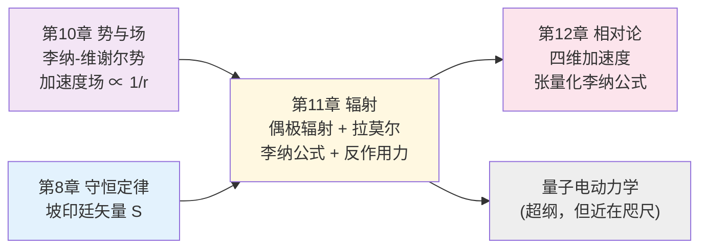
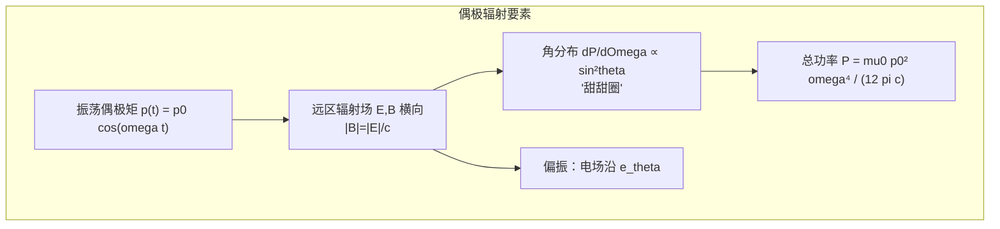
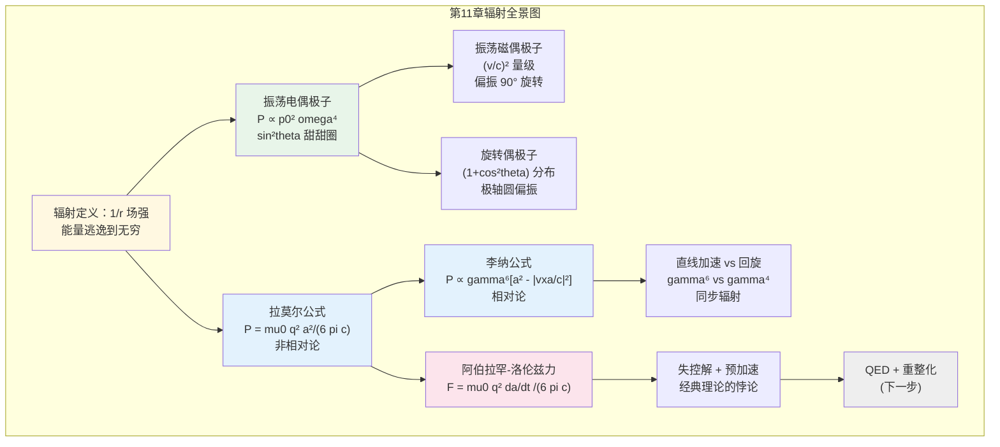

# 第11章 辐射 (Radiation)

## 引言：电荷如何"撕下"一片电磁场？

第9章我们研究了已经存在的电磁波如何传播、反射、折射；第10章我们用推迟势和李纳-维谢尔势精确描述了任意运动电荷产生的电磁场。但还剩下最深刻的问题：

> **电荷究竟以什么方式"扔出"电磁波？**
> **一个加速的电子能"撕下"多少电磁能量？**
> **被撕下的能量反作用于电荷本身，又会发生什么？**

这就是辐射理论的核心。它不仅是经典电动力学的"压轴篇章"，也是通向量子电动力学、激光物理、天体物理（脉冲星、同步辐射、宇宙微波背景）的桥梁。



**本章三大主线**：

1. **偶极辐射**（§11.1）：振荡电偶极子是最简单、最普适的辐射源。任何辐射源在远区都可做多极展开，电偶极辐射是主导项。**辐射强度的 $\sin^2\theta$ "甜甜圈"分布、$P\propto\omega^4$ 标度律——这些是无线电、瑞利散射、天线设计的基础**。

2. **点电荷辐射**（§11.2）：从李纳-维谢尔加速度场出发，推导任意运动点电荷的辐射功率。非相对论极限给出 **拉莫尔公式 $P=\mu_0 q^2 a^2/(6\pi c)$**；相对论推广给出 **李纳公式**，包含 $\gamma^6$ 因子——这是同步辐射、玻尔原子寿命、加速器物理的核心。

3. **辐射反作用力**（§11.3）：辐射带走能量，必有反作用力作用于电荷本身。**阿伯拉罕-洛伦兹力 $\mathbf{F}_{rad}=\mu_0 q^2\dot{\mathbf{a}}/(6\pi c)$** 形式优美，却带来"预加速"与"失控解"等非物理现象——经典点电荷模型的固有缺陷，启发了 QED 与质量重整化。

> **本章策略**：第11章是**期末考试的核心压轴章节**！历年期末必考：① 玻尔氢原子寿命（拉莫尔公式）；② 四维加速度 → 李纳公式；③ 旋转电偶极子辐射剖面 + 偏振 + 平均功率。请精读每个例题，特别是 例题 11.5（电偶极辐射全推导）、例题 11.8（旋转偶极子）、例题 11.13（玻尔原子寿命）、例题 11.15（李纳公式应用）。

---

## 11.1 偶极辐射

### 11.1.1 什么是"辐射"？——能量逃逸到无穷远

我们先给"辐射"一个**操作性定义**。

考虑某个有限大小的电荷-电流分布，被一个半径 $r$ 的大球面包围。第8章告诉我们能量从场中流出的速率由**坡印廷矢量** $\mathbf{S} = (1/\mu_0)\mathbf{E}\times\mathbf{B}$ 给出。球面上的总辐射功率为：

$$P_{\rm rad}(r) = \oint \mathbf{S}\cdot d\mathbf{a} = \oint \mathbf{S}\cdot\hat{\mathbf{r}}\, r^2\sin\theta\, d\theta\, d\varphi$$

**关键问题**：当 $r\to\infty$，这个积分是否还有有限值？

球面面积 $\propto r^2$，所以为了让积分**不为零**，必须有：

$$|\mathbf{S}|\propto \frac{1}{r^2}\quad\text{at large } r$$

进一步，$|\mathbf{S}|\propto |\mathbf{E}|^2$（或 $|\mathbf{B}|^2$），所以辐射场必须满足：

$$\boxed{|\mathbf{E}_{\rm rad}|\propto \frac{1}{r},\quad |\mathbf{B}_{\rm rad}|\propto\frac{1}{r}\quad(r\to\infty)}$$

**这就是辐射场的标志性特征**。

**对比**：
- **静电库仑场** $\mathbf{E}\propto 1/r^2 \Rightarrow |\mathbf{S}|\propto 1/r^4$，球面积分 $\propto 1/r^2 \to 0$。**静电场不辐射**。
- **速度场**（李纳-维谢尔场的"广义库仑场"部分）$\propto 1/r^2$，同样不辐射。
- **加速度场**（李纳-维谢尔场的"辐射场"部分）$\propto a/r$，是唯一对无穷远能流有贡献的部分。

> **物理图景**：能量"撕"出电荷需要某种"长程"机制。$1/r$ 的场比 $1/r^2$ 的场衰减得**慢**得多，因此能在无穷远处依然携带能量。直观上，加速度产生的"扭曲信号"以光速向外传播，永远不"收回"。

### 11.1.2 振荡电偶极子——辐射的"标准模型"

考虑沿 $\hat{\mathbf{z}}$ 方向放置的**振荡电偶极子**：

$$p(t) = p_0\cos(\omega t),\quad \mathbf{p}(t) = p_0\cos(\omega t)\hat{\mathbf{z}}$$

物理模型：两个小球 $\pm q(t)$ 相距 $d$，电荷 $q(t) = q_0\cos(\omega t)$，使 $p_0 = q_0 d$。这是天线最朴素的模型，也是分子振动辐射的基础。

**三种长度尺度**：

| 尺度 | 含义 | 极限 |
|------|------|------|
| $d$ | 偶极子大小 | $d\ll \lambda$（点偶极极限） |
| $\lambda = 2\pi c/\omega$ | 辐射波长 | 中间桥梁 |
| $r$ | 观察点距离 | $r\gg \lambda$（远区/辐射区） |

我们要研究的是 **远区** $r\gg \lambda\gg d$。

#### 第一步：推迟标势 $V$

正电荷 $+q(t)$ 在 $\mathbf{r}_+ = (d/2)\hat{\mathbf{z}}$；负电荷 $-q(t)$ 在 $\mathbf{r}_- = -(d/2)\hat{\mathbf{z}}$。观察点 $\mathbf{r} = (r,\theta,\varphi)$。

到两电荷的距离：
$$\mathcal{r}_\pm = \sqrt{r^2\mp rd\cos\theta + d^2/4}$$

在 $d\ll r$ 下展开到 $\mathcal{O}(d)$：
$$\mathcal{r}_\pm \approx r\left(1\mp\frac{d}{2r}\cos\theta\right)$$

倒数：
$$\frac{1}{\mathcal{r}_\pm}\approx \frac{1}{r}\left(1\pm \frac{d}{2r}\cos\theta\right)$$

**推迟时间**：
$$t_\pm^r = t - \mathcal{r}_\pm/c \approx t - r/c \pm (d/2c)\cos\theta = t_0 \pm \frac{d\cos\theta}{2c}$$

其中 $t_0 \equiv t - r/c$ 是观察点收到信号时电荷"应有的"中心时刻。

电荷在推迟时刻的值：
$$q(t_\pm^r) = q_0\cos\left[\omega\left(t_0\pm\frac{d\cos\theta}{2c}\right)\right]$$

推迟标势：
$$V(\mathbf{r},t) = \frac{1}{4\pi\varepsilon_0}\left[\frac{q(t_+^r)}{\mathcal{r}_+} - \frac{q(t_-^r)}{\mathcal{r}_-}\right]$$

在 $d\ll \lambda$（即 $\omega d/c \ll 1$）下展开三角函数：
$$\cos\left[\omega t_0 \pm \frac{\omega d\cos\theta}{2c}\right] \approx \cos(\omega t_0)\mp \frac{\omega d\cos\theta}{2c}\sin(\omega t_0)$$

代入：

$$V \approx \frac{q_0}{4\pi\varepsilon_0}\left\{\frac{1}{r}\left[1+\frac{d\cos\theta}{2r}\right]\left[\cos\omega t_0 - \frac{\omega d\cos\theta}{2c}\sin\omega t_0\right]\right.$$
$$\left.-\frac{1}{r}\left[1-\frac{d\cos\theta}{2r}\right]\left[\cos\omega t_0 + \frac{\omega d\cos\theta}{2c}\sin\omega t_0\right]\right\}$$

展开后保留 $\mathcal{O}(d)$ 一阶项：

$$V \approx \frac{q_0 d\cos\theta}{4\pi\varepsilon_0 r}\left[\frac{\cos\omega t_0}{r} - \frac{\omega\sin\omega t_0}{c}\right]$$

第一项 $\propto 1/r^2$ 是**静态偶极势的推迟版本**（"近场"），第二项 $\propto 1/r$ 是**辐射项**。

在远区 $r\gg \lambda$ 即 $\omega r/c\gg 1$，第二项主导：

$$\boxed{V_{\rm rad}(\mathbf{r},t) = -\frac{p_0\omega}{4\pi\varepsilon_0 c}\cdot\frac{\sin\theta}{r}\sin[\omega(t-r/c)]}$$

注意我们已经用了 $p_0 = q_0 d$，并定义 $t_0 = t - r/c$。

> **关键洞察**：辐射势中**没有静态偶极子那种 $1/r^2$ 行为**，而是 $1/r$ 行为，乘以一个角因子 $\sin\theta$。$\sin\theta$ 反映：在偶极子轴上（$\theta=0$）方向无信号，在赤道面上（$\theta=\pi/2$）信号最强——**因为只有横向振动才发出向外的横波**。

#### 第二步：推迟矢势 $\mathbf{A}$

矢势由电流 $\mathbf{I}(t) = \dot q(t) \hat{\mathbf{z}}$ 产生（电荷在 $-d/2$ 到 $d/2$ 之间往复振荡）：

$$\mathbf{A}(\mathbf{r},t) = \frac{\mu_0}{4\pi}\int_{-d/2}^{d/2}\frac{\dot q(t-\mathcal{r}/c)}{\mathcal{r}}d z'\, \hat{\mathbf{z}}$$

在 $d\ll r,\lambda$ 极限下，分母 $\mathcal{r}\to r$，分子的推迟时间近似为 $t_0$，所以：

$$\mathbf{A}(\mathbf{r},t) \approx \frac{\mu_0}{4\pi r}\dot q(t_0)\cdot d\, \hat{\mathbf{z}} = \frac{\mu_0 \dot p(t_0)}{4\pi r}\hat{\mathbf{z}}$$

代入 $\dot p(t_0) = -p_0\omega\sin\omega t_0$：

$$\boxed{\mathbf{A}_{\rm rad}(\mathbf{r},t) = -\frac{\mu_0 p_0\omega}{4\pi r}\sin[\omega(t-r/c)]\,\hat{\mathbf{z}}}$$

> **注意**：矢势已经天然是 $1/r$ 形式（无需多极展开）。这是因为偶极电流的"中心矩"已经在 $\dot p$ 里。

#### 第三步：辐射场 $\mathbf{E}, \mathbf{B}$

$$\mathbf{E}_{\rm rad} = -\nabla V_{\rm rad} - \frac{\partial \mathbf{A}_{\rm rad}}{\partial t}$$

在远区，只保留 $1/r$ 项，且**梯度只对相位作用**（$\nabla$ 作用于 $1/r$ 给出 $1/r^2$ 项，丢掉）：

$$\nabla\sin\omega(t-r/c) = -\frac{\omega}{c}\cos\omega(t-r/c)\hat{\mathbf{r}}$$

计算（细节繁琐但直接）：

$$\boxed{\mathbf{E}_{\rm rad}(\mathbf{r},t) = -\frac{\mu_0 p_0\omega^2}{4\pi r}\sin\theta\cos[\omega(t-r/c)]\,\hat{\boldsymbol{\theta}}}$$

$$\boxed{\mathbf{B}_{\rm rad}(\mathbf{r},t) = -\frac{\mu_0 p_0\omega^2}{4\pi c r}\sin\theta\cos[\omega(t-r/c)]\,\hat{\boldsymbol{\varphi}}}$$

**这是辐射场的标准形式**！它们满足：

1. **横向性**：$\mathbf{E}\perp \hat{\mathbf{r}}$，$\mathbf{B}\perp\hat{\mathbf{r}}$，$\mathbf{E}\perp\mathbf{B}$。
2. **相位锁定**：$|\mathbf{B}| = |\mathbf{E}|/c$，与第9章平面波一致——远区辐射场局域看就像球面平面波。
3. **方向**：$\mathbf{E}\times\mathbf{B}\parallel \hat{\mathbf{r}}$，能量向外辐射。
4. **角分布**：$\propto \sin\theta$，在偶极子轴上为零，赤道最强。

#### 第四步：辐射功率与角分布

**坡印廷矢量**：

$$\mathbf{S} = \frac{1}{\mu_0}\mathbf{E}\times\mathbf{B} = \frac{\mu_0}{c}\left[\frac{p_0\omega^2\sin\theta}{4\pi r}\cos\omega(t-r/c)\right]^2\hat{\mathbf{r}}$$

**时间平均**（$\langle\cos^2\rangle = 1/2$）：

$$\boxed{\langle\mathbf{S}\rangle = \frac{\mu_0 p_0^2\omega^4}{32\pi^2 c}\cdot\frac{\sin^2\theta}{r^2}\hat{\mathbf{r}}}$$

这就是著名的"**$\sin^2\theta$ 甜甜圈**"角分布！

**总辐射功率**（对球面积分）：

$$\langle P\rangle = \oint\langle\mathbf{S}\rangle\cdot d\mathbf{a} = \frac{\mu_0 p_0^2\omega^4}{32\pi^2 c}\int_0^{2\pi}d\varphi\int_0^{\pi}\sin^2\theta\cdot\sin\theta\, d\theta$$

角积分 $\int_0^\pi \sin^3\theta\, d\theta = 4/3$，所以：

$$\boxed{\langle P\rangle = \frac{\mu_0 p_0^2\omega^4}{12\pi c}}$$

这就是 **电偶极子辐射的拉莫尔公式（Larmor formula for an oscillating dipole）**。

#### 物理图景与极限验证

> **$P\propto \omega^4$ 标度律**——这是**蓝天之所以蓝**的根源。可见光照到大气分子（看作小偶极子）时，散射功率 $\propto\omega^4$，蓝光（高 $\omega$）被散射比红光强 $(\omega_{\rm 蓝}/\omega_{\rm 红})^4\sim 16$ 倍。所以白天天空散射光蓝，傍晚太阳穿过大气厚度大、蓝光散没了，剩下红光直射——夕阳是红的。

> **$P\propto p_0^2$**——线性叠加：双倍偶极矩产生四倍功率。

> **$\omega\to 0$ 极限**：$\langle P\rangle\to 0$，静止偶极子不辐射 ✓

**例题 11.1**：FM 广播天线
- 一根 $L = 1$ m 长的天线工作在 $f = 100$ MHz。假设可视为偶极矩 $p_0\sim qL$ 的振荡偶极子，电荷振幅 $q_0 = 10^{-8}$ C。求辐射功率。

**解**：

$\omega = 2\pi f = 6.28\times 10^8$ rad/s。$\lambda = c/f = 3$ m，$L = 1\sim\lambda/3$，"短偶极"近似勉强成立。

$p_0 = q_0 L = 10^{-8}$ C·m。

$$\langle P\rangle = \frac{\mu_0 p_0^2\omega^4}{12\pi c} = \frac{(4\pi\times 10^{-7})(10^{-8})^2(6.28\times 10^8)^4}{12\pi\times 3\times 10^8}$$

数值：分子 $\approx 4\pi\times 10^{-7}\times 10^{-16}\times 1.55\times 10^{35} \approx 1.95\times 10^{13}$；分母 $\approx 1.13\times 10^{10}$。

$$\langle P\rangle \approx 1.7\times 10^3\text{ W} \approx 1.7\text{ kW}$$

合理量级！实际广播台天线辐射功率正是 kW 量级。

**辐射电阻**：把辐射看成"电阻"耗散能量：$\langle P\rangle = \frac{1}{2}I_0^2 R_{\rm rad}$，其中 $I_0 = q_0\omega$。

$$R_{\rm rad} = \frac{2\langle P\rangle}{I_0^2} = \frac{\mu_0 \omega^2 d^2}{6\pi c} = \frac{2\pi}{3}\sqrt{\frac{\mu_0}{\varepsilon_0}}\left(\frac{d}{\lambda}\right)^2 \approx 790\left(\frac{d}{\lambda}\right)^2\Omega$$

对短偶极天线 $d\ll\lambda$，$R_{\rm rad}$ 很小——这正是为什么天线越长（接近 $\lambda/2$）效率越高。

### 11.1.3 振荡磁偶极子

**对偶推理**：把电偶极子 $\mathbf{p}\to$ 磁偶极子 $\mathbf{m}$，$1/\varepsilon_0 \to \mu_0 c^2$，$c\to c$，可以"猜出"答案。但我们走一遍正规推导，因为期末可能直接考。

**物理模型**：圆环电流，半径 $b$，电流振荡：

$$I(t) = I_0\cos\omega t,\quad \mathbf{m}(t) = \pi b^2 I_0\cos\omega t\,\hat{\mathbf{z}} = m_0\cos\omega t\,\hat{\mathbf{z}}$$

**远区**条件：$b\ll \lambda\ll r$。

#### 推导（要点）

矢势（环对称，只有 $\hat{\boldsymbol{\varphi}}$ 分量）：

$$A_\varphi(\mathbf{r},t) = \frac{\mu_0}{4\pi}\oint \frac{I(t-\mathcal{r}/c)}{\mathcal{r}}\cos\varphi'\, b\, d\varphi'$$

类似电偶极子的展开，在 $b\ll \lambda$ 下：

$$\boxed{\mathbf{A}_{\rm rad}^{\rm magnetic} = -\frac{\mu_0 m_0\omega}{4\pi c r}\sin\theta\sin[\omega(t-r/c)]\,\hat{\boldsymbol{\varphi}}}$$

辐射场（只保留 $1/r$ 项）：

$$\boxed{\mathbf{E}_{\rm rad}^{\rm m} = \frac{\mu_0 m_0\omega^2}{4\pi c r}\sin\theta\cos[\omega(t-r/c)]\,\hat{\boldsymbol{\varphi}}}$$

$$\boxed{\mathbf{B}_{\rm rad}^{\rm m} = -\frac{\mu_0 m_0\omega^2}{4\pi c^2 r}\sin\theta\cos[\omega(t-r/c)]\,\hat{\boldsymbol{\theta}}}$$

**注意 E 和 B 互换了 $\hat{\boldsymbol{\theta}}$↔$\hat{\boldsymbol{\varphi}}$**——电偶极的 $\mathbf{E}$ 沿 $\hat{\boldsymbol{\theta}}$（"经向"），磁偶极的 $\mathbf{E}$ 沿 $\hat{\boldsymbol{\varphi}}$（"纬向"）。物理：电偶极线偏振的偏振面在轴向平面；磁偶极线偏振的偏振面与轴垂直。

**辐射功率**：

$$\boxed{\langle P\rangle = \frac{\mu_0 m_0^2\omega^4}{12\pi c^3}}$$

#### 电 vs 磁偶极辐射的比较

$$\frac{\langle P\rangle_{\rm magnetic}}{\langle P\rangle_{\rm electric}} = \frac{m_0^2/c^3}{p_0^2/c} = \frac{m_0^2}{p_0^2 c^2}$$

对一个圆环电流 $m_0 = \pi b^2 I_0 \sim I_0 b^2$；对一个简谐振荡的电偶极子，$p_0 = q_0 d$，与电荷振荡相联系 $I_0 = q_0\omega$，所以 $p_0 = I_0 d/\omega$（特征值）。代入：

$$\frac{P_m}{P_e}\sim \left(\frac{\omega b}{c}\right)^2 = \left(\frac{2\pi b}{\lambda}\right)^2 \ll 1\quad\text{若 } b\ll\lambda$$

**磁偶极辐射比电偶极辐射小 $(v/c)^2$ 量级**。这是为什么一般天线都是电偶极天线。

> **何时磁偶极占主导？** 当电偶极矩为零（例如对称的反并联电荷分布）时，多极展开的下一项就是磁偶极。原子的禁戒跃迁、超精细结构跃迁、地球的磁偶极辐射（如果旋转加速）就属此类。

**例题 11.2**：磁偶极辐射 vs 电偶极辐射
一个相同尺寸 $L$、相同电流幅值 $I_0$ 的电偶极天线与磁偶极环（半径 $b=L$）相比，哪个辐射功率大？比值多少？$L = 1$ m，$\omega = 2\pi\times 10^8$ rad/s。

**解**：

电偶极矩 $p_0 = I_0 L/\omega$；磁偶极矩 $m_0 = \pi L^2 I_0$。

$$\frac{P_m}{P_e} = \frac{m_0^2/c^3}{p_0^2/c} = \frac{(\pi L^2 I_0)^2 \omega^2}{(I_0 L)^2 c^2} = \frac{\pi^2 L^2\omega^2}{c^2}$$

数值：$\omega L/c = 2\pi\times 10^8\times 1/3\times 10^8 = 2\pi/3\approx 2.1$。

$$P_m/P_e\approx \pi^2\times (2.1)^2 \approx 43$$

**奇怪——磁偶极反而大！** 但这是因为我们取 $b = L =\lambda/3$ 已经不满足 $b\ll\lambda$。在严格的小偶极极限下，电偶极辐射占优。这个例题恰好提醒：**多极展开的有效性受 $L/\lambda$ 约束**。

### 11.1.4 任意源的辐射——多极展开

对任意有限尺寸的电荷-电流分布 $\rho(\mathbf{r}',t), \mathbf{J}(\mathbf{r}',t)$，做**多极展开**：

$$\text{源} = \underbrace{\text{电单极}}_{=0\text{ (电荷守恒)}} + \text{电偶极} + \text{磁偶极} + \text{电四极} + \cdots$$

**辐射功率的层级**：

$$P_{\rm dipole}^{\rm electric}\sim \frac{\mu_0|\ddot{\mathbf{p}}|^2}{12\pi c}\sim \frac{\mu_0 p_0^2\omega^4}{12\pi c}$$

$$P_{\rm dipole}^{\rm magnetic}\sim \frac{\mu_0 m_0^2\omega^4}{12\pi c^3}\sim (v/c)^2 P_{\rm dipole}^{\rm electric}$$

$$P_{\rm quadrupole}^{\rm electric}\sim \frac{\mu_0 Q^2\omega^6}{c^3}\sim (\omega L/c)^2 P_{\rm dipole}^{\rm electric}\sim (v/c)^2 P_{\rm dipole}^{\rm electric}$$

> **关键洞察**：每升高一阶多极，辐射功率小一个 $(v/c)^2$ 因子（其中 $v\sim\omega L$ 是源中典型粒子速度）。对非相对论源 $v\ll c$，**电偶极辐射几乎总是主导项**——这就是为什么"偶极近似"在无线电、原子物理中如此普遍。

#### 紧凑形式：拉莫尔的偶极版本

把电偶极辐射写成**瞬时**形式（不取时间平均）：

$$\boxed{P(t) = \frac{\mu_0|\ddot{\mathbf{p}}(t_0)|^2}{6\pi c}}$$

其中 $t_0 = t - r/c$ 是推迟时间（远场观察点上 $t$ 时刻接收到的辐射对应源 $t_0$ 时刻的状态）。这个公式适用于**任意振荡的电偶极矩**——不必简谐！

**例题 11.3**：脉冲电偶极辐射
一个偶极矩为高斯脉冲：$p(t) = p_0 e^{-t^2/\tau^2}$。求总辐射的能量。

**解**：

$\dot p = -\frac{2t}{\tau^2}p_0 e^{-t^2/\tau^2}$

$\ddot p = \frac{2p_0}{\tau^2}\left(\frac{2t^2}{\tau^2}-1\right)e^{-t^2/\tau^2}$

$|\ddot p|^2 = \frac{4p_0^2}{\tau^4}\left(\frac{2t^2}{\tau^2}-1\right)^2 e^{-2t^2/\tau^2}$

总能量：

$$U = \int_{-\infty}^{\infty}P(t)dt = \frac{\mu_0}{6\pi c}\cdot\frac{4p_0^2}{\tau^4}\int_{-\infty}^{\infty}\left(\frac{2t^2}{\tau^2}-1\right)^2 e^{-2t^2/\tau^2}dt$$

换元 $u = t\sqrt{2}/\tau$，$dt = \tau\, du/\sqrt 2$：

$$\int = \frac{\tau}{\sqrt 2}\int_{-\infty}^{\infty}(u^2-1)^2 e^{-u^2}du$$

利用 $\int u^4 e^{-u^2}du = 3\sqrt\pi/4$，$\int u^2 e^{-u^2}du = \sqrt\pi/2$，$\int e^{-u^2}du = \sqrt\pi$：

$$\int (u^2-1)^2 e^{-u^2}du = 3\sqrt\pi/4 - \sqrt\pi + \sqrt\pi = 3\sqrt\pi/4$$

所以 $\int = \frac{3\sqrt{2\pi}\tau}{8}$，

$$U = \frac{\mu_0}{6\pi c}\cdot\frac{4p_0^2}{\tau^4}\cdot\frac{3\sqrt{2\pi}\tau}{8} = \frac{\mu_0 p_0^2 \sqrt{2\pi}}{4\pi c\tau^3}$$

**物理**：脉冲越尖锐（$\tau$ 越小）辐射能量越大（$\propto 1/\tau^3$）——快速变化的偶极矩辐射剧烈。这是闪电（毫秒级电流脉冲产生宽频射电）的原理。

### 11.1.5 偶极辐射的几何与对称性

#### 角分布的可视化

电偶极辐射强度 $\langle dP/d\Omega\rangle \propto \sin^2\theta$：

```
   z ↑ (偶极子方向)
       |
       . 0 (轴向，无辐射)
       |
   .   |   .
   .   |   .   ← 中等强度 (theta ~ 45°)
       |
.======.======.← 最强 (theta = 90°，赤道面)
       |
   .   |   .
       |
       . 0
```

3D 形状像一个**甜甜圈 (torus / donut)**，孔位于偶极子轴向。

#### 极化（偏振）

辐射的电场沿 $\hat{\boldsymbol{\theta}}$ 方向——这是**经向偏振**（沿子午线）。在赤道面 $\theta=\pi/2$ 处，$\hat{\boldsymbol{\theta}} = -\hat{\mathbf{z}}$，即**偏振方向沿偶极子轴**。

> **直觉记忆**：偏振方向就是偶极子振动方向在垂直于视线的平面上的**投影**！在轴向看，投影为零（无辐射）；在赤道看，投影完整（最强辐射且偏振沿原轴）。



---

## 11.2 点电荷辐射

现在从"振荡偶极子"过渡到更基本的对象：**任意运动的单个点电荷**。

### 11.2.1 任意运动电荷的辐射场（回顾第10章）

第10章已推导：任意运动的点电荷在场点 $\mathbf{r}$ 产生的电磁场分为**两部分**：

$$\mathbf{E} = \mathbf{E}_v + \mathbf{E}_a$$

其中：

- **速度场（广义库仑场，$1/\mathcal{r}^2$）**：
$$\mathbf{E}_v = \frac{q}{4\pi\varepsilon_0}\frac{(1-v^2/c^2)(\hat{\boldsymbol{\mathcal{r}}}-\mathbf{v}/c)}{\mathcal{r}^2(1-\hat{\boldsymbol{\mathcal{r}}}\cdot\mathbf{v}/c)^3}$$
- **加速度场（辐射场，$1/\mathcal{r}$）**：
$$\boxed{\mathbf{E}_a = \frac{q}{4\pi\varepsilon_0 c^2}\frac{\hat{\boldsymbol{\mathcal{r}}}\times[(\hat{\boldsymbol{\mathcal{r}}}-\mathbf{v}/c)\times\mathbf{a}]}{\mathcal{r}(1-\hat{\boldsymbol{\mathcal{r}}}\cdot\mathbf{v}/c)^3}}\bigg|_{t_r}$$

磁场总是 $\mathbf{B} = \hat{\boldsymbol{\mathcal{r}}}\times\mathbf{E}/c$。

**所有量都在推迟时刻 $t_r$ 取值**，$\mathcal{r}=|\mathbf{r}-\mathbf{w}(t_r)|$，$\hat{\boldsymbol{\mathcal{r}}}$ 是从源指向场点的单位矢量。

**辐射场的关键特征**：
1. $\mathbf{E}_a\propto a/\mathcal{r}$（线性正比加速度，反比距离）
2. $\mathbf{E}_a\perp\hat{\boldsymbol{\mathcal{r}}}$（因为 $\hat{\boldsymbol{\mathcal{r}}}\times[\cdot]\perp\hat{\boldsymbol{\mathcal{r}}}$）
3. $\mathbf{E}_a, \mathbf{B}_a, \hat{\boldsymbol{\mathcal{r}}}$ 构成右手系

> **物理图景**：加速度场就像电荷"突然变向"时甩出的**鞭子尖**，它以光速向外传播，永不收回。

### 11.2.2 拉莫尔公式：非相对论极限

考虑 $v\ll c$，所以 $\hat{\boldsymbol{\mathcal{r}}} - \mathbf{v}/c\to\hat{\boldsymbol{\mathcal{r}}}$，$(1-\hat{\boldsymbol{\mathcal{r}}}\cdot\mathbf{v}/c)\to 1$。辐射场简化为：

$$\mathbf{E}_a = \frac{q}{4\pi\varepsilon_0 c^2}\frac{\hat{\boldsymbol{\mathcal{r}}}\times(\hat{\boldsymbol{\mathcal{r}}}\times\mathbf{a})}{\mathcal{r}}$$

使用 BAC-CAB 公式 $\hat{\boldsymbol{\mathcal{r}}}\times(\hat{\boldsymbol{\mathcal{r}}}\times\mathbf{a}) = (\hat{\boldsymbol{\mathcal{r}}}\cdot\mathbf{a})\hat{\boldsymbol{\mathcal{r}}} - \mathbf{a}$：

$$\boxed{\mathbf{E}_a = \frac{q}{4\pi\varepsilon_0 c^2 \mathcal{r}}[(\hat{\boldsymbol{\mathcal{r}}}\cdot\mathbf{a})\hat{\boldsymbol{\mathcal{r}}} - \mathbf{a}]}$$

这就是非相对论辐射场。令 $\theta$ 为 $\hat{\boldsymbol{\mathcal{r}}}$ 与 $\mathbf{a}$ 的夹角：

$$|\mathbf{E}_a|^2 = \left(\frac{q}{4\pi\varepsilon_0 c^2\mathcal{r}}\right)^2 a^2\sin^2\theta$$

（因为 $|(\hat{\boldsymbol{\mathcal{r}}}\cdot\mathbf{a})\hat{\boldsymbol{\mathcal{r}}}-\mathbf{a}|^2 = |\mathbf{a}_\perp|^2 = a^2\sin^2\theta$，即"垂直于 $\hat{\boldsymbol{\mathcal{r}}}$ 的加速度分量"）

**坡印廷矢量**：

$$\mathbf{S} = \frac{1}{\mu_0 c}|\mathbf{E}_a|^2\hat{\boldsymbol{\mathcal{r}}} = \frac{\mu_0 q^2 a^2}{16\pi^2 c}\cdot\frac{\sin^2\theta}{\mathcal{r}^2}\hat{\boldsymbol{\mathcal{r}}}$$

**角分布**：

$$\boxed{\frac{dP}{d\Omega} = \frac{\mu_0 q^2 a^2}{16\pi^2 c}\sin^2\theta}$$

同样是 **$\sin^2\theta$ "甜甜圈"分布**，对称轴沿 $\mathbf{a}$ 方向。

**总辐射功率**（对球面积分，$\int\sin^3\theta d\theta = 4/3$）：

$$\boxed{P = \frac{\mu_0 q^2 a^2}{6\pi c}\quad\text{（拉莫尔公式，Larmor formula）}}$$

也可写为：$P = q^2 a^2/(6\pi\varepsilon_0 c^3)$ （用 $\mu_0 = 1/(\varepsilon_0 c^2)$）。

> **物理图景**：
> - $P\propto q^2$：辐射来自电荷与场的耦合，单极辐射强度自然 $\propto q^2$。
> - $P\propto a^2$：加速度场 $\propto a$，能流 $\propto E^2 \propto a^2$。
> - **必须有加速度才辐射**：$a=0\Rightarrow P=0$。匀速电荷的"场"在所有惯性系中都不辐射（这是相对论的内在要求）。

#### 拉莫尔公式与振荡偶极辐射的一致性

对偶极子 $\mathbf{p} = p_0\cos\omega t\hat{\mathbf{z}}$，等价于两电荷 $\pm q$ 以加速度 $a = \omega^2 d/2\cdot\cos\omega t$ 振荡，但**两电荷辐射相干叠加**（不是简单加和！）。直接套用拉莫尔公式：

$$P_{\rm Larmor}(\pm q) = \frac{\mu_0 q^2 a^2}{6\pi c}$$

但这是单个电荷的瞬时功率，对两个反相运动电荷必须考虑相位差——结果应回到偶极公式。**练习**：验证由 $\langle a^2\rangle = \omega^4 d^2/8$，单电荷辐射 $\langle P\rangle = \mu_0 q^2\omega^4 d^2/(48\pi c)$，两电荷干涉后的偶极辐射 $\langle P\rangle = \mu_0 p_0^2\omega^4/(12\pi c) = \mu_0 q^2 d^2\omega^4/(12\pi c)$，比值 4——正是**相干增强**因子。

### 11.2.3 例题：经典电子的辐射

**例题 11.4**：电子在均匀电场中的辐射损失
电子（质量 $m$，电荷 $-e$）在匀强电场 $E_0$ 中被加速。求其辐射功率，并与从电场获得的功率比较。

**解**：

加速度 $a = eE_0/m$。

辐射功率：
$$P_{\rm rad} = \frac{\mu_0 e^2 a^2}{6\pi c} = \frac{\mu_0 e^4 E_0^2}{6\pi c m^2}$$

电子从电场获得功率（瞬时速度 $v$）：
$$P_{\rm gain} = e E_0 v$$

比值：
$$\frac{P_{\rm rad}}{P_{\rm gain}} = \frac{\mu_0 e^3 E_0}{6\pi c m^2 v}$$

数值估算：$m_e = 9.1\times 10^{-31}$ kg，$e = 1.6\times 10^{-19}$ C，$E_0 = 10^6$ V/m（强电场），$v = c/10$：

$$P_{\rm rad}/P_{\rm gain} \sim \frac{(4\pi\times 10^{-7})(1.6\times 10^{-19})^3(10^6)}{6\pi\times 3\times 10^8\times (9.1\times 10^{-31})^2\times 3\times 10^7}\sim 10^{-12}$$

**辐射损失完全可以忽略**——在直线加速器中辐射只是次要效应。但这个结论会被相对论改变！

### 11.2.4 李纳公式：相对论推广

当 $v\to c$，"几何因子" $(1-\hat{\boldsymbol{\mathcal{r}}}\cdot\mathbf{v}/c)^{-3}$ 变得巨大，必须严格处理。

**几何因素剖析**：

辐射场 $\propto 1/[\mathcal{r}(1-\hat{\boldsymbol{\mathcal{r}}}\cdot\mathbf{v}/c)^3]$，能流 $\propto E^2$，所以含 $1/(1-\hat{\boldsymbol{\mathcal{r}}}\cdot\mathbf{v}/c)^6$。

但还有一个微妙之处：**坡印廷矢量是单位时间通过单位面积的能量，但"单位时间"在场点和源点不同！** 源在推迟时刻 $t_r$，场点在当前时刻 $t$。

$$\frac{dW}{dt_r} = \frac{dW/dt}{dt/dt_r}\cdot\frac{dt}{dt_r} = \mathbf{S}\cdot d\mathbf{a}\cdot\frac{dt}{dt_r}$$

由推迟关系 $t = t_r + \mathcal{r}(t_r)/c$，求导：

$$\frac{dt}{dt_r} = 1 + \frac{1}{c}\frac{d\mathcal{r}}{dt_r} = 1 - \frac{\hat{\boldsymbol{\mathcal{r}}}\cdot\mathbf{v}}{c}$$

所以**单位源时间**的辐射功率（这是物理上真正有意义的电荷损失的能量速率）：

$$\frac{dP}{d\Omega} = \mathcal{r}^2 (\mathbf{S}\cdot\hat{\boldsymbol{\mathcal{r}}})\cdot\left(1 - \frac{\hat{\boldsymbol{\mathcal{r}}}\cdot\mathbf{v}}{c}\right)$$

这相比"$\mathcal{r}^2(\mathbf{S}\cdot\hat{\boldsymbol{\mathcal{r}}})$"少了一个 $(1-\hat{\boldsymbol{\mathcal{r}}}\cdot\mathbf{v}/c)$ 因子，所以净因子变成 $1/(1-\hat{\boldsymbol{\mathcal{r}}}\cdot\mathbf{v}/c)^5$。

完整角分布（细节繁，结果直接给出）：

$$\boxed{\frac{dP}{d\Omega} = \frac{\mu_0 q^2}{16\pi^2 c}\frac{\big|\hat{\boldsymbol{\mathcal{r}}}\times[(\hat{\boldsymbol{\mathcal{r}}}-\mathbf{v}/c)\times\mathbf{a}]\big|^2}{(1-\hat{\boldsymbol{\mathcal{r}}}\cdot\mathbf{v}/c)^5}}$$

对全立体角积分（这是个繁琐的计算，结果是漂亮的不变形式）：

$$\boxed{P = \frac{\mu_0 q^2 \gamma^6}{6\pi c}\left[a^2 - \left|\frac{\mathbf{v}\times\mathbf{a}}{c}\right|^2\right]\quad\text{（李纳公式 Liénard）}}$$

其中 $\gamma = 1/\sqrt{1-v^2/c^2}$。

**等价的张量形式**（第12章会推导）：

$$P = -\frac{\mu_0 q^2}{6\pi m^2 c}\frac{dp^\mu}{d\tau}\frac{dp_\mu}{d\tau}$$

其中 $p^\mu$ 是四动量，$\tau$ 是固有时。**这个形式显然是洛伦兹不变量**——任何惯性系测得的辐射功率相同。

#### 验证：$v\to 0$ 极限退化为拉莫尔

$\gamma\to 1$，$\mathbf{v}\times\mathbf{a}\to 0$（量级），所以：

$$P\to \frac{\mu_0 q^2 a^2}{6\pi c}$$ ✓

### 11.2.5 同步辐射：直线加速器 vs 回旋加速器

李纳公式 $P\propto \gamma^6[a^2 - |\mathbf{v}\times\mathbf{a}/c|^2]$ 因 $\mathbf{a}$ 与 $\mathbf{v}$ 的几何关系不同而行为迥异。

#### 情形 A：直线加速器（$\mathbf{a}\parallel\mathbf{v}$）

$\mathbf{v}\times\mathbf{a} = 0$：

$$\boxed{P_{\rm linear} = \frac{\mu_0 q^2 a^2\gamma^6}{6\pi c}}$$

但加速度可用力来表达，$F = dp/dt$。沿运动方向，$p = \gamma m v$，导数：

$$F_\parallel = \frac{d(\gamma m v)}{dt} = m(\gamma^3 a)$$

所以 $a = F_\parallel/(\gamma^3 m)$，代入：

$$P_{\rm linear} = \frac{\mu_0 q^2 \gamma^6}{6\pi c}\cdot\frac{F_\parallel^2}{\gamma^6 m^2} = \frac{\mu_0 q^2 F_\parallel^2}{6\pi c m^2}$$

**惊人结果**：**直线加速器辐射损失与 $\gamma$ 无关，仅取决于力**。这是为什么直线加速器（如 SLAC）能加速电子到非常高能量而辐射损失不太严重——只要外力 $F$ 不太大。

#### 情形 B：回旋加速器（$\mathbf{a}\perp\mathbf{v}$）

$|\mathbf{v}\times\mathbf{a}| = va$，所以 $|\mathbf{v}\times\mathbf{a}/c|^2 = v^2 a^2/c^2 = a^2(1-1/\gamma^2)$：

$$a^2 - |\mathbf{v}\times\mathbf{a}/c|^2 = a^2/\gamma^2$$

$$\boxed{P_{\rm circular} = \frac{\mu_0 q^2 a^2\gamma^4}{6\pi c}}$$

横向加速度（圆周运动）$a = v^2/R\approx c^2/R$（$v\approx c$）。**$\gamma^4$ 因子非常致命！**

对环形电子-正电子对撞机（如 LEP），$\gamma \sim 10^5$，辐射损失成为主要瓶颈：每圈损失能量 $\Delta E \propto \gamma^4$，必须用射频腔不断补充。这就是为什么大型粒子物理实验现在转向 **直线对撞机 ILC** 或 **质子环** LHC（质子比电子重 1836 倍，同样能量下 $\gamma$ 小 1836 倍，辐射小 $1836^4\sim 10^{13}$ 倍）。

#### 例题 11.5：同步辐射功率
LEP（欧洲核子中心的电子对撞机）周长 27 km，电子能量 100 GeV。求每个电子每圈的辐射损失。

**解**：

电子 $m_ec^2 = 0.511$ MeV，所以 $\gamma = 100\text{ GeV}/0.511\text{ MeV}\approx 2\times 10^5$。

环半径 $R = 27\text{ km}/(2\pi)\approx 4300$ m。

向心加速度（在源参考系中需用相对论形式，但用 $a\approx c^2/R$ 代入李纳公式时已经隐含相对论效应）：

$$P = \frac{\mu_0 q^2 a^2 \gamma^4}{6\pi c} = \frac{\mu_0 e^2 c^3 \gamma^4}{6\pi R^2}$$

数值：

$$P\approx \frac{(4\pi\times 10^{-7})(1.6\times 10^{-19})^2(3\times 10^8)^3(2\times 10^5)^4}{6\pi (4300)^2}$$

$$\approx \frac{(4\pi\times 10^{-7})(2.56\times 10^{-38})(2.7\times 10^{25})(1.6\times 10^{21})}{6\pi\times 1.85\times 10^7}$$

$$\approx 7.5\times 10^{-3}\text{ W} = 7.5\text{ mW}$$

每圈周期 $T = 2\pi R/c\approx 9\times 10^{-5}$ s，所以每圈损失能量：

$$\Delta E = P\cdot T \approx 7.5\times 10^{-3}\times 9\times 10^{-5}\approx 6.8\times 10^{-7}\text{ J} \approx 4\text{ GeV}$$

**每圈损失 4 GeV！** 这就是 LEP 必须把电子加速到 100 GeV 后停止——再高的话辐射损失就超过加速腔能补充的能量了。

### 11.2.6 角分布与"探照灯"效应

非相对论的拉莫尔角分布是对称的 $\sin^2\theta$（关于加速度方向）。相对论下，分母 $(1-\hat{\boldsymbol{\mathcal{r}}}\cdot\mathbf{v}/c)^5$ 使辐射**强烈前射**。

对 $\mathbf{a}\parallel\mathbf{v}$ 情形，辐射峰值在 $\theta\approx 1/\gamma$（相对速度方向的角度）。当 $\gamma\sim 10^4$，辐射集中在毫弧度锥内——这就是同步辐射的"**探照灯效应** (searchlight effect)"。

**物理意义**：同步加速器产生的辐射是**亮度极高、方向性极好的 X 射线源**，已成为材料科学、生物学的关键工具。中国上海光源、合肥光源都是基于这个原理。

#### 例题 11.6：辐射前射角
高能电子（$\gamma = 1000$）在弯转磁铁中辐射。求辐射主瓣的张角。

**解**：辐射主要集中在 $\theta \lesssim 1/\gamma = 10^{-3}$ rad = 1 mrad。

如果探测器距离弯转点 10 m，辐射光斑大小约 10 mm——非常窄的"光束"。

### 11.2.7 旋转电偶极子的辐射（期末必考！）

**例题 11.7**：旋转电偶极子的辐射剖面与平均功率（核心例题，直接对标老期末题5）

一个电偶极子 $\mathbf{p}(t) = p_0[\cos(\omega t)\hat{\mathbf{x}} + \sin(\omega t)\hat{\mathbf{y}}]$ 以角速度 $\omega$ 在 $xy$ 平面内匀速旋转。求：
1. 辐射场的角分布与偏振
2. 平均辐射功率
3. 特殊观察方向（$\theta=0,\pi/2,\pi$）的偏振性质

**解**：

**关键思想**：可将其分解为两个互垂直的振荡偶极子：

$$\mathbf{p}(t) = \mathbf{p}_x(t) + \mathbf{p}_y(t),\quad \mathbf{p}_x = p_0\cos\omega t\hat{\mathbf{x}},\quad \mathbf{p}_y = p_0\sin\omega t\hat{\mathbf{y}}$$

两个偶极子相位差 $\pi/2$，振幅相同——是"圆偏振"的电流分布。

**总辐射功率**（线性叠加，因相互独立 $\langle\cos\omega t\sin\omega t\rangle = 0$）：

$$\langle P\rangle = \langle P_x\rangle + \langle P_y\rangle = 2\cdot \frac{\mu_0 p_0^2\omega^4}{12\pi c} = \frac{\mu_0 p_0^2\omega^4}{6\pi c}$$

或等价地用 $|\ddot{\mathbf{p}}|^2$ 公式：

$$\ddot{\mathbf{p}} = -\omega^2\mathbf{p},\quad |\ddot{\mathbf{p}}|^2 = \omega^4 p_0^2$$

时间平均 = 瞬时（恒定！）：

$$\boxed{\langle P\rangle = \frac{\mu_0 \omega^4 p_0^2}{6\pi c}}\quad\text{（旋转偶极子）}$$

**注意**：是两个振荡偶极子之和（不再除 2 取平均）。

**角分布**：观察方向 $\hat{\boldsymbol{\mathcal{r}}}$（设球坐标极角 $\theta$，方位角 $\varphi$）。

- $\mathbf{p}_x$ 偶极子对该方向辐射 $\propto \sin^2\theta_x$，其中 $\theta_x$ 是 $\hat{\mathbf{r}}$ 与 $\hat{\mathbf{x}}$ 夹角；$\cos\theta_x = \sin\theta\cos\varphi$。
- $\mathbf{p}_y$ 偶极子辐射 $\propto \sin^2\theta_y$；$\cos\theta_y = \sin\theta\sin\varphi$。

两偶极子振幅同但相位差 $\pi/2$，时间平均交叉项为零，所以：

$$\langle dP/d\Omega\rangle = \frac{\mu_0 p_0^2\omega^4}{32\pi^2 c}[\sin^2\theta_x + \sin^2\theta_y]$$

$$= \frac{\mu_0 p_0^2\omega^4}{32\pi^2 c}[2 - \cos^2\theta_x - \cos^2\theta_y]$$

$$= \frac{\mu_0 p_0^2\omega^4}{32\pi^2 c}[2 - \sin^2\theta(\cos^2\varphi+\sin^2\varphi)] = \frac{\mu_0 p_0^2\omega^4}{32\pi^2 c}[2 - \sin^2\theta]$$

$$= \boxed{\frac{\mu_0 p_0^2\omega^4}{32\pi^2 c}(1 + \cos^2\theta)}$$

**这是旋转偶极子的辐射角分布**！

**积分验证**：
$$\int(1+\cos^2\theta)\sin\theta d\theta d\varphi = 2\pi\int_0^\pi(1+\cos^2\theta)\sin\theta d\theta = 2\pi\cdot[2 + 2/3] = 16\pi/3$$

$$\langle P\rangle = \frac{\mu_0 p_0^2\omega^4}{32\pi^2 c}\cdot\frac{16\pi}{3} = \frac{\mu_0 p_0^2\omega^4}{6\pi c}\ \checkmark$$

**特殊方向的偏振分析**：

| 方向 | $\theta$ | 辐射强度 | 偏振 |
|------|----------|----------|------|
| **极轴方向**（$\pm\hat{\mathbf{z}}$） | $0,\pi$ | $\propto 2$（最强） | **圆偏振**！（两正交偶极子等振幅、相位差 $\pi/2$，看上去就是圆偏振） |
| **赤道方向**（$xy$ 面内） | $\pi/2$ | $\propto 1$（一半） | **线偏振**（沿 $\hat{\mathbf{z}}$，因 $\hat{\mathbf{r}}\perp$ 偶极平面，$\hat{\boldsymbol{\theta}}\parallel\hat{\mathbf{z}}$） |
| 一般方向 | 其它 | 中等 | **椭圆偏振** |

> **物理图景**：从北极看下来，旋转偶极子像一根"打转的指挥棒"，发出**圆偏振光**——这是天文学家鉴定**脉冲星**辐射机制的关键线索（脉冲星的圆偏振辐射来自磁极区域的高速电子旋转）。

### 11.2.8 玻尔氢原子寿命（期末必考！）

**例题 11.8**：经典玻尔原子的不稳定性（直接对标新期末题4）

在经典物理中，氢原子的电子绕质子做圆周运动（玻尔半径 $a_0 = 5.29\times 10^{-11}$ m，电子速度 $v_0 = 2.19\times 10^6$ m/s）。但电子做圆周运动有**向心加速度**，根据拉莫尔公式必持续辐射能量——电子会沿螺旋线坠入质子。求经典电子从玻尔轨道坠入原子核的时间。

**解**：

**第一步：圆轨道能量**
半径 $r$ 处的电子（库仑力 = 向心力）：

$$\frac{e^2}{4\pi\varepsilon_0 r^2} = \frac{m v^2}{r}\Rightarrow v^2 = \frac{e^2}{4\pi\varepsilon_0 m r}$$

总能量（$T+U = (1/2)mv^2 - e^2/(4\pi\varepsilon_0 r) = -e^2/(8\pi\varepsilon_0 r)$）：

$$E(r) = -\frac{e^2}{8\pi\varepsilon_0 r}$$

**第二步：加速度与辐射功率**

向心加速度 $a = v^2/r = e^2/(4\pi\varepsilon_0 m r^2)$。

拉莫尔功率：

$$P = \frac{\mu_0 e^2 a^2}{6\pi c} = \frac{\mu_0 e^2}{6\pi c}\cdot\frac{e^4}{(4\pi\varepsilon_0)^2 m^2 r^4} = \frac{e^6}{6\pi (4\pi)^2 \varepsilon_0^2 \varepsilon_0 c^3 m^2 r^4}$$

（用 $\mu_0 = 1/\varepsilon_0 c^2$）。简记：

$$P = \frac{e^6}{96\pi^3 \varepsilon_0^3 c^3 m^2 r^4}$$

**第三步：能量守恒（含辐射损耗）**

能量损失率 = 辐射功率：

$$-\frac{dE}{dt} = P$$

由 $E = -e^2/(8\pi\varepsilon_0 r)$，

$$\frac{dE}{dr} = \frac{e^2}{8\pi\varepsilon_0 r^2}\Rightarrow \frac{dE}{dt} = \frac{e^2}{8\pi\varepsilon_0 r^2}\frac{dr}{dt}$$

代入：

$$-\frac{e^2}{8\pi\varepsilon_0 r^2}\frac{dr}{dt} = \frac{e^6}{96\pi^3\varepsilon_0^3 c^3 m^2 r^4}$$

$$\frac{dr}{dt} = -\frac{8\pi\varepsilon_0 r^2}{e^2}\cdot\frac{e^6}{96\pi^3\varepsilon_0^3 c^3 m^2 r^4} = -\frac{e^4}{12\pi^2\varepsilon_0^2 c^3 m^2 r^2}$$

**第四步：积分求时间**

$$r^2 dr = -\frac{e^4}{12\pi^2\varepsilon_0^2 c^3 m^2}dt$$

$$\int_{a_0}^{0}r^2 dr = -\frac{a_0^3}{3} = -\frac{e^4}{12\pi^2\varepsilon_0^2 c^3 m^2}\tau$$

$$\boxed{\tau = \frac{4\pi^2\varepsilon_0^2 c^3 m^2 a_0^3}{e^4}}$$

**第五步：数值计算**

让我们用更便利的"经典电子半径" $r_e = e^2/(4\pi\varepsilon_0 m c^2) = 2.82\times 10^{-15}$ m。则：

$$\tau = \frac{4\pi^2\varepsilon_0^2 c^3 m^2 a_0^3}{e^4} = \frac{a_0^3}{4 r_e^2\cdot c}\cdot\frac{1}{4\pi^2/\pi^2}$$

让我重新代数化简：

$$\tau = \frac{a_0^3}{(e^2/4\pi\varepsilon_0 m c^2)^2\cdot c\cdot 4} = \frac{a_0^3}{4 r_e^2 c}$$

数值：

$$\tau = \frac{(5.29\times 10^{-11})^3}{4\times (2.82\times 10^{-15})^2\times 3\times 10^8}$$

$$= \frac{1.48\times 10^{-31}}{4\times 7.95\times 10^{-30}\times 3\times 10^8} = \frac{1.48\times 10^{-31}}{9.54\times 10^{-21}}$$

$$\approx 1.55\times 10^{-11}\text{ s}$$

$$\boxed{\tau\approx 1.6\times 10^{-11}\text{ s}\sim 10^{-11}\text{ s}}$$

**物理结论**：

> 按照经典理论，氢原子在约 **16 皮秒**内就会塌缩！但氢原子明明可以**永远稳定**——这就是 1913 年玻尔提出量子化轨道的根本原因。经典电动力学在原子尺度彻底失败，**直接催生了量子力学**。

**注**：此例题是经典物理史上最深刻的危机之一，也是历年期末必考。请背熟推导步骤。

---

## 11.3 辐射反作用力

### 11.3.1 反作用力的必要性

电荷辐射能量到无穷远——能量必须**来自电荷本身的动能**。换言之，必有某种"力"作用于辐射电荷，使其减速。这就是 **辐射反作用力** (radiation reaction force) 或 **辐射阻尼力** (radiation damping)。

它不是来自外界，而是 **电荷与自己产生的场的相互作用**（自力 self-force）——加速电荷的辐射场反作用于电荷本身。

**直观图景**：振荡电子像在水中振动的桨叶，必须克服"水的阻力"——但这里的"水"是它自己激起的电磁波。

> **诺贝尔级洞察**：辐射反作用力的存在是从能量守恒**严格要求**的，不是新假设。但它的精确形式（如何依赖电荷的运动）需要仔细推导，并会暴露经典点电荷理论的根本困难。

### 11.3.2 阿伯拉罕-洛伦兹公式的推导

我们从**能量平衡**出发：在一个完整周期（或两次状态相同的时刻之间）的能量损耗等于辐射功率的积分。

**前提**：电荷在做某种 **周期性或起止状态相同** 的运动（这样可以做巧妙的部分积分）。

**能量守恒**：

$$\int_{t_1}^{t_2}\mathbf{F}_{\rm rad}\cdot\mathbf{v}\,dt = -\int_{t_1}^{t_2} P\,dt = -\frac{\mu_0 q^2}{6\pi c}\int_{t_1}^{t_2} \mathbf{a}\cdot\mathbf{a}\,dt$$

（我们要求"反作用力做的功 = 负的辐射能量"）

**关键技巧：分部积分**

考虑 $\int \mathbf{a}\cdot\mathbf{a}\, dt$。用 $\mathbf{a} = d\mathbf{v}/dt$：

$$\int_{t_1}^{t_2}\mathbf{a}\cdot\mathbf{a}\,dt = \int_{t_1}^{t_2}\mathbf{a}\cdot\frac{d\mathbf{v}}{dt}dt$$

分部积分：

$$= [\mathbf{a}\cdot\mathbf{v}]_{t_1}^{t_2} - \int_{t_1}^{t_2}\dot{\mathbf{a}}\cdot\mathbf{v}\,dt$$

**关键假设**：在区间端点 $t_1, t_2$，**$\mathbf{a}\cdot\mathbf{v}$ 相等**（例如周期性运动一周期，或运动起止静止时 $\mathbf{a}=0$ 或 $\mathbf{v}=0$）。则边界项为零：

$$\int\mathbf{a}\cdot\mathbf{a}\,dt = -\int\dot{\mathbf{a}}\cdot\mathbf{v}\,dt$$

代回能量守恒：

$$\int\mathbf{F}_{\rm rad}\cdot\mathbf{v}\,dt = -\frac{\mu_0 q^2}{6\pi c}\cdot\left(-\int\dot{\mathbf{a}}\cdot\mathbf{v}\,dt\right) = \int\frac{\mu_0 q^2}{6\pi c}\dot{\mathbf{a}}\cdot\mathbf{v}\,dt$$

由于此式对任意周期运动（任意 $\mathbf{v}(t)$）都成立，被积函数必然相等（至少在周期平均意义下）：

$$\boxed{\mathbf{F}_{\rm rad} = \frac{\mu_0 q^2}{6\pi c}\dot{\mathbf{a}} = \frac{q^2}{6\pi\varepsilon_0 c^3}\dot{\mathbf{a}}\quad\text{（阿伯拉罕-洛伦兹公式）}}$$

**这是经典电动力学中最奇异的方程之一**！

### 11.3.3 阿伯拉罕-洛伦兹公式的奇异特征

公式 $\mathbf{F}_{\rm rad}\propto \dot{\mathbf{a}}$ 包含**加速度的时间导数**（"jerk"，急动度）。这导致两个严重的非物理现象：

#### 现象 A：失控解 (Runaway Solutions)

将牛顿第二定律 + 反作用力，假设无其它力：

$$m\mathbf{a} = \mathbf{F}_{\rm rad} = \frac{\mu_0 q^2}{6\pi c}\dot{\mathbf{a}}$$

定义 **特征时间**：

$$\boxed{\tau \equiv \frac{\mu_0 q^2}{6\pi m c} = \frac{q^2}{6\pi\varepsilon_0 m c^3}}$$

对电子，$\tau_e\approx 6.27\times 10^{-24}$ s（约为光穿越经典电子半径的时间）。

方程变为：

$$\mathbf{a} = \tau \dot{\mathbf{a}}$$

**解**：$\mathbf{a}(t) = \mathbf{a}_0 e^{t/\tau}$

即使没有任何外力，电荷的加速度可以**指数增长**！这显然违背能量守恒——这就是 **失控解 (runaway motion)**。

#### 现象 B：预加速 (Preacceleration)

若有外力 $\mathbf{F}_{\rm ext}(t)$，

$$m\mathbf{a} = \mathbf{F}_{\rm ext} + \frac{\mu_0 q^2}{6\pi c}\dot{\mathbf{a}}\Rightarrow \mathbf{a} - \tau\dot{\mathbf{a}} = \mathbf{F}_{\rm ext}/m$$

这是一阶线性 ODE，其物理解（剔除指数发散）为：

$$\mathbf{a}(t) = \frac{1}{m\tau}\int_t^{\infty}e^{-(t'-t)/\tau}\mathbf{F}_{\rm ext}(t')dt'$$

**注意上下限**！$t'$ 从 $t$ 到 $\infty$——**电荷的当前加速度依赖于未来的力**。这就是 **预加速**：电荷在外力作用前 $\sim\tau$ 时间就开始"响应"。

**例**：阶跃力 $\mathbf{F}_{\rm ext}(t) = F_0\Theta(t)$，

$$\mathbf{a}(t) = \begin{cases}(F_0/m)e^{t/\tau}, & t<0\\ F_0/m, & t>0\end{cases}$$

在 $t<0$（外力还没出现！），加速度已经在指数增长，违反**因果律**。

> **物理评论**：$\tau_e\sim 10^{-24}$ s 极小，预加速的时间尺度小到经典理论失效（这远小于"经典电子半径"内的光行时间）。在经典域内，这些悖论"实际上"不被观测到。但作为**理论框架**，阿伯拉罕-洛伦兹方程的奇异性提示：**经典点电荷模型是不自洽的**。

### 11.3.4 物理意义：经典电动力学的极限

阿伯拉罕-洛伦兹方程的悖论根源在哪里？

**根源 1：点电荷的自能发散**

经典点电荷的静电自能：

$$U_{\rm self} = \frac{e^2}{8\pi\varepsilon_0 r}\bigg|_{r\to 0}\to \infty$$

这意味着"点电荷"携带无穷大的静电能量。任何用 $E = mc^2$ 换算的"电磁质量"都是无穷的。经典理论无法自洽地描述点电荷。

**根源 2：自相互作用的发散**

电荷的辐射场作用于其自身，但场在源处奇异。任何尝试用电荷分布（如均匀带电球壳）代替点电荷的"模型"都会引入电荷的"机械刚性"——这又违反相对论（信号速度 > c）。

**解决方向：量子电动力学（QED）**

QED 通过 **质量重整化 (mass renormalization)** 巧妙解决：
- 区分"裸质量"$m_0$（理论中的参数，可以取负或无穷）与"物理质量" $m_{\rm phys}$（实验测量值）
- 将自能发散吸收到 $m_0$ 的重新定义中
- 所有物理可观测量保持有限

这是 20 世纪物理学最深刻的思想之一（费曼、施温格、朝永振一郎因此获 1965 年诺贝尔奖）。

> **历史插曲**：1933 年 Dirac 推导了在阿伯拉罕-洛伦兹基础上的相对论推广（**洛伦兹-狄拉克方程 LAD**），但保留了同样的悖论。1975 年 Landau-Lifshitz 提出了一个修正方程（用 $\mathbf{F}_{\rm ext}$ 替代 $\dot{\mathbf{a}}$），在弱辐射极限下消除了悖论，但严格来说仍是近似。**经典理论在这里达到了它的极限**。

### 11.3.5 例题：辐射阻尼振子

**例题 11.9**：辐射阻尼对谐振子的影响
一个质量 $m$、电荷 $q$ 的粒子被弹性力 $-m\omega_0^2 x$ 约束。考虑辐射反作用力，写出运动方程并求解。

**解**：

运动方程：

$$m\ddot x = -m\omega_0^2 x + m\tau \dddot x$$

化简：

$$\ddot x + \omega_0^2 x = \tau \dddot x$$

**简化近似**（弱辐射阻尼，$\omega_0\tau\ll 1$）：用 $\ddot x\approx -\omega_0^2 x$，所以 $\dddot x\approx -\omega_0^2 \dot x$：

$$\ddot x + \omega_0^2\tau\dot x + \omega_0^2 x = 0$$

这是熟悉的阻尼振子方程！阻尼系数 $\gamma = \omega_0^2\tau$。

**解**：

$$x(t) = x_0 e^{-\gamma t/2}\cos(\omega' t)$$

其中 $\omega'\approx \omega_0$。

**寿命**：振幅衰减到 $1/e$ 的时间：

$$T_{\rm life} = \frac{2}{\gamma} = \frac{2}{\omega_0^2\tau}$$

**物理意义**：辐射阻尼提供振子的自然寿命（甚至在没有任何外阻尼时）。这正是原子谱线的"自然线宽"——原子激发态的辐射衰变是同样的物理。

**数值估算**：氢原子 Lyman 跃迁 $\omega_0\sim 10^{16}$ rad/s，$\tau_e = 6\times 10^{-24}$ s：
$$T_{\rm life}\sim 2/(10^{32}\times 6\times 10^{-24})\sim 3\times 10^{-9}\text{ s} = 3\text{ ns}$$

与实验测得的原子激发态寿命（ns 量级）惊人吻合！经典理论在这里反而给出了合理的数量级——这是因为我们的"经典电子做圆周运动"模型恰好是量子振荡偶极子矩阵元的合理替代。

#### 例题 11.10：电荷在均匀磁场中的辐射阻尼

**问**：电荷 $q$、质量 $m$ 在均匀磁场 $\mathbf{B}_0 = B_0\hat{\mathbf{z}}$ 中做圆周运动，考虑辐射阻尼，估算螺距如何缩小。

**解**：

无辐射时，电荷做半径 $r$、角频率 $\omega_c = qB_0/m$ 的圆周运动，动能 $T = \frac{1}{2}mv^2 = \frac{1}{2}m\omega_c^2 r^2$。

辐射功率（非相对论）：
$$P = \frac{\mu_0 q^2 a^2}{6\pi c} = \frac{\mu_0 q^2 \omega_c^4 r^2}{6\pi c}$$

由能量守恒 $dT/dt = -P$：

$$m\omega_c^2 r\frac{dr}{dt} = -\frac{\mu_0 q^2\omega_c^4 r^2}{6\pi c}$$

$$\frac{1}{r}\frac{dr}{dt} = -\frac{\mu_0 q^2\omega_c^2}{6\pi m c} = -\omega_c^2 \tau$$

**解**：

$$r(t) = r_0 e^{-\omega_c^2\tau t}$$

**特征时间**：$T_{\rm decay} = 1/(\omega_c^2\tau)$。

对电子在 $B_0 = 1$ T 中，$\omega_c = eB_0/m_e\approx 1.76\times 10^{11}$ rad/s，
$$T_{\rm decay}\sim 1/(10^{22}\times 6\times 10^{-24}) \sim 16\text{ s}$$

实验室磁场下电子的回旋辐射衰减很慢。但在中子星（$B\sim 10^8$ T）中，$T\sim 10^{-16}$ s——极快！这是中子星辐射机制的关键。

### 11.3.6 阿伯拉罕-洛伦兹力的相对论推广

完整相对论的辐射反作用力（**洛伦兹-狄拉克方程 LAD**）：

$$\mathbf{F}_{\rm LAD}^\mu = \frac{\mu_0 q^2}{6\pi c}\left[\frac{d^2 u^\mu}{d\tau^2} + \frac{u^\mu}{c^2}\frac{d u^\nu}{d\tau}\frac{d u_\nu}{d\tau}\right]$$

其中 $u^\mu = dx^\mu/d\tau$ 是四维速度。第二项保证 $F^\mu u_\mu = 0$（即反作用力总是与四维速度正交，符合相对论的约束）。

这是第12章的话题，本章不展开。

---

## 习题

**说明**：编号 11.1—11.13 为自编练习题。编号 [G 11.x] 为 Griffiths 教材精选习题。**第11章是期末考试压轴章节**，建议优先完成例题相关习题与 [G 11.4]、[G 11.14]。

### 基础计算

**11.1** 振荡电偶极子的辐射功率
一个振荡电偶极子 $p(t) = p_0\cos\omega t$，$p_0 = 10^{-29}$ C·m，$\omega = 4\times 10^{15}$ rad/s（可见光频率）：
1. 求平均辐射功率
2. 求在赤道方向（$\theta=\pi/2$）上距离 $r=1$ m 处的电场振幅
3. 估算这个偶极子相当于"多少个原子"在辐射（设单个原子辐射功率 $\sim 10^{-12}$ W）

**11.2** 拉莫尔公式的应用
质子（$q=+e$，$m=1.67\times 10^{-27}$ kg）在加速器中受 $E=10^6$ V/m 电场加速：
1. 求瞬时辐射功率
2. 求电场对质子做功率（速度 $v=c/10$ 时）
3. 比较，判断辐射损失是否可忽略

**11.3** 偶极辐射的辐射电阻
一个长度 $d = 10$ cm 的电偶极天线工作在频率 $f = 100$ MHz：
1. 求辐射电阻 $R_{\rm rad}$
2. 比较 $R_{\rm rad}$ 与铜线电阻（线径 1 mm，长 10 cm，$\sigma = 5.96\times 10^7$ S/m），判断天线效率
3. 哪些方法可提高效率？

**11.4** 同步辐射的能量损失
一个电子在直径 $D=50$ m 的同步加速器中做圆周运动，能量 $E_e = 1$ GeV：
1. 求 $\gamma$ 因子和每圈辐射能量损失
2. 求需要多大功率的射频腔才能维持电子能量
3. 估算每圈辐射的脉冲宽度（提示：$\Delta t\sim 1/(\gamma^3\omega_c)$）

**11.5** 旋转偶极子的辐射偏振
一个 $\mathbf{p} = p_0[\cos\omega t\hat{\mathbf{x}}+\sin\omega t\hat{\mathbf{y}}]$ 旋转偶极子：
1. 在 $+\hat{\mathbf{z}}$ 方向观察，辐射的电场方向如何随时间变化？画图。
2. 在 $+\hat{\mathbf{x}}$ 方向观察呢？
3. 在 $\hat{\mathbf{n}} = \hat{\mathbf{x}}/\sqrt 2 + \hat{\mathbf{z}}/\sqrt 2$ 方向观察呢？（椭圆偏振分析）

### 概念理解

**11.6** "辐射"为什么需要加速度？
1. 用 $1/r^2$ 与 $1/r$ 场强的对比，解释为什么静止电荷与匀速运动电荷不辐射
2. 这是否违反相对论？（提示：匀速运动电荷的场可以用洛伦兹变换从静止情形得出——不辐射是必然的）
3. 等价原理与重力场中静止电荷——经典理论给出什么结论？讨论是否辐射的争议

**11.7** $\omega^4$ 标度律与天空之色
1. 用 $P\propto\omega^4$ 解释天空为何蓝
2. 解释夕阳为何红
3. 解释为何月亮（白色）背后的天是黑的，而白天天是蓝的（提示：散射 vs 直射）
4. 解释偏振光眼镜防眩光（散射光是部分偏振的）

**11.8** 直线加速 vs 回旋加速：哪个辐射更严重？
1. 对 $\gamma = 10^5$ 的电子，比较 $P_{\rm linear}$ 与 $P_{\rm circular}$（在相同加速度 $a$ 下）
2. 在直线加速器中辐射损失 $\propto F_\parallel^2$ 与 $\gamma$ 无关；在回旋加速器中 $\propto \gamma^4$。为什么？
3. 这与第7章 LHC 选用质子（而非电子）的原因吗？详细分析

**11.9** 反作用力为什么是 $\dot{\mathbf{a}}$ 不是 $\mathbf{a}$？
1. 用阿伯拉罕-洛伦兹推导中的"边界项消失"条件，解释为什么得到的反作用力含 $\dot{\mathbf{a}}$
2. 这是否意味着"瞬时辐射反作用力 $\propto \dot{\mathbf{a}}$"是错的？
3. Landau-Lifshitz 的修正用 $\mathbf{F}_{\rm ext}$ 替代 $\dot{\mathbf{a}}$，物理动机是什么？

**11.10** 玻尔原子模型的失败启示了什么？
1. 用拉莫尔公式估算氢原子寿命（皮秒级），与实验事实（无限稳定）矛盾
2. 这个矛盾如何启发玻尔的量子化轨道假设？
3. 量子力学中电子的"基态"不辐射，与经典理论的"加速电荷必辐射"如何调和？

### 拓展应用

**11.11** 太阳的辐射机制
太阳辐射主要来自 $T\sim 5800$ K 的等离子体（电子-离子碰撞辐射，即韧致辐射 bremsstrahlung）。
1. 用能均分定理估算电子的热速度 $v_{\rm th}$
2. 估算电子-质子库仑碰撞的加速度量级
3. 用拉莫尔公式估算单个电子的辐射功率
4. 简述：为何这种"韧致辐射"是连续谱（非线谱）

**11.12** 编程练习：偶极辐射角分布
绘制振荡电偶极子（$\sin^2\theta$）和旋转偶极子（$1+\cos^2\theta$）的辐射角分布。
1. 用 `matplotlib` 极坐标绘 $dP/d\Omega$ vs $\theta$
2. 用 3D 球面绘制甜甜圈
3. 比较两者的总功率比

```python
import numpy as np
import matplotlib.pyplot as plt
from mpl_toolkits.mplot3d import Axes3D

# 角分布
theta = np.linspace(0, np.pi, 200)
osc_dipole = np.sin(theta)**2          # 振荡偶极子
rot_dipole = 1 + np.cos(theta)**2       # 旋转偶极子

# 极坐标对比
fig, axes = plt.subplots(1, 2, figsize=(12, 6), 
                          subplot_kw={'projection': 'polar'})
axes[0].plot(theta, osc_dipole, color='red')
axes[0].plot(-theta, osc_dipole, color='red')  # 对称
axes[0].set_title('Oscillating dipole: sin²θ')
axes[1].plot(theta, rot_dipole, color='blue')
axes[1].plot(-theta, rot_dipole, color='blue')
axes[1].set_title('Rotating dipole: 1 + cos²θ')
plt.tight_layout()
plt.show()

# 3D 甜甜圈
phi = np.linspace(0, 2*np.pi, 100)
THETA, PHI = np.meshgrid(theta, phi)
R = np.sin(THETA)**2
X = R * np.sin(THETA) * np.cos(PHI)
Y = R * np.sin(THETA) * np.sin(PHI)
Z = R * np.cos(THETA)

fig = plt.figure(figsize=(8, 8))
ax = fig.add_subplot(111, projection='3d')
ax.plot_surface(X, Y, Z, cmap='plasma', alpha=0.8)
ax.set_title('Oscillating dipole radiation pattern (3D)')
ax.set_xlabel('x'); ax.set_ylabel('y'); ax.set_zlabel('z (dipole axis)')
plt.show()
```

**11.13** 编程练习：阿伯拉罕-洛伦兹方程的数值积分
研究 $m\ddot x = -m\omega_0^2 x + m\tau\dddot x$（弹簧振子 + 辐射反作用力）的失控解。

1. 用 4 阶 Runge-Kutta 求解，初始条件 $x(0)=1, \dot x(0)=0, \ddot x(0)=0$
2. 设置 $\omega_0\tau$ = 0.01, 0.1, 0.3 三种情况，观察长时间行为
3. 验证：当 $\omega_0\tau$ 不太小时，会出现失控解
4. 与 Landau-Lifshitz 修正方程对比：$\ddot x = -\omega_0^2 x - \omega_0^2\tau\dot x$（弱阻尼极限）

```python
import numpy as np
import matplotlib.pyplot as plt
from scipy.integrate import solve_ivp

omega0 = 1.0
tau_list = [0.01, 0.1, 0.3]

def AL_equation(t, y, tau):
    """阿伯拉罕-洛伦兹方程的一阶系统：
    y = [x, v, a], dy/dt = [v, a, da/dt]
    da/dt = (a + omega0² x) / tau    （从 a = tau*da/dt - omega0² x ）"""
    x, v, a = y
    dadt = (a + omega0**2 * x) / tau
    return [v, a, dadt]

def LL_equation(t, y, tau):
    """Landau-Lifshitz 近似：x'' + tau omega0² x' + omega0² x = 0"""
    x, v = y
    return [v, -omega0**2 * x - tau * omega0**2 * v]

t_span = (0, 50)
t_eval = np.linspace(*t_span, 5000)

fig, axes = plt.subplots(2, 1, figsize=(10, 8))

for tau in tau_list:
    # AL 方程
    sol_AL = solve_ivp(AL_equation, t_span, [1.0, 0.0, 0.0],
                       args=(tau,), t_eval=t_eval, method='RK45',
                       rtol=1e-8)
    axes[0].plot(sol_AL.t, sol_AL.y[0], label=f'tau={tau}')
    
    # LL 方程
    sol_LL = solve_ivp(LL_equation, t_span, [1.0, 0.0],
                       args=(tau,), t_eval=t_eval, method='RK45',
                       rtol=1e-8)
    axes[1].plot(sol_LL.t, sol_LL.y[0], label=f'tau={tau}')

axes[0].set_ylabel('x(t) - AL eq (may runaway)')
axes[0].set_xlabel('t')
axes[0].legend(); axes[0].grid()
axes[0].set_title('Abraham-Lorentz equation: runaway behavior')

axes[1].set_ylabel('x(t) - LL eq (well-behaved)')
axes[1].set_xlabel('t')
axes[1].legend(); axes[1].grid()
axes[1].set_title('Landau-Lifshitz equation: simple damping')

plt.tight_layout()
plt.show()
```

### Griffiths 教材精选习题

**[G 11.3]** 电偶极子的辐射电阻
一个长度 $d$ 的振荡电偶极天线，载波频率 $\omega$：
1. 推导辐射电阻 $R_{\rm rad} = 80\pi^2(d/\lambda)^2 \Omega \approx 790(d/\lambda)^2 \Omega$
2. 对 $d = 5$ cm，$\nu = 10^8$ Hz，求 $R_{\rm rad}$
3. 比较与铜导线电阻，评估天线效率

**[G 11.4]** 旋转电偶极子的辐射剖面（常考大题）
偶极矩 $\mathbf{p}(t) = p_0[\cos\omega t\,\hat{\mathbf{x}} + \sin\omega t\,\hat{\mathbf{y}}]$。
1. 求时间平均的角分布 $\langle dP/d\Omega\rangle$
2. 求总辐射功率
3. 沿 $\hat{\mathbf{z}}$ 方向观察，辐射的偏振性质（圆偏振）
4. 在赤道面观察，偏振性质（线偏振）

**[G 11.11]** 随时间变化的磁偶极矩
一个圆环电流 $I(t) = I_0 + kt$ 的辐射功率？这是一个**线性增长**的电流，磁矩 $m(t) = m_0 + kt\cdot\pi b^2$。
1. 求 $\dot m, \ddot m$
2. 求瞬时辐射功率 $P\propto \ddot m^2$
3. 注意：常数 $\dot m\neq 0$ 也辐射！这与线性增长的磁矩有关

**[G 11.13]** 减速电荷的辐射能量损失
一个电荷以速度 $v_0$ 入射，在距离 $L$ 内减速到零（如撞击金属靶）。假设减速均匀。
1. 求加速度 $a = -v_0^2/(2L)$
2. 用拉莫尔公式求总辐射能量
3. 比较与电荷损失的总动能 $\frac{1}{2}mv_0^2$，求辐射效率
4. 这是 X 射线管中**韧致辐射 (bremsstrahlung)** 的简化模型

**[G 11.14]** 玻尔原子的寿命（直接命中期末第4题）
按例题 11.8 完整推导：
1. 验证 $\tau = a_0^3/(4 r_e^2 c)$
2. 用 $r_e = 2.82\times 10^{-15}$ m、$a_0 = 5.29\times 10^{-11}$ m 求数值
3. 思考：为什么实际氢原子是稳定的？（→ 量子化）

**[G 11.16]** 加速度垂直于速度时的同步辐射
推导 $P_{\rm circular} = \mu_0 q^2 a^2 \gamma^4/(6\pi c)$，从李纳公式出发，证明：
1. 用 $\mathbf{a}\perp \mathbf{v}$，$|\mathbf{v}\times\mathbf{a}|^2 = v^2 a^2$
2. 化简方括号 $a^2 - v^2 a^2/c^2 = a^2/\gamma^2$
3. 得到结论。讨论 $\gamma\to 1$ 极限回到拉莫尔公式 ✓

**[G 11.21]** 旋转偶极子的辐射反作用力矩
旋转偶极子 $\mathbf{p}(t) = p_0[\cos\omega t\,\hat{\mathbf{x}} + \sin\omega t\,\hat{\mathbf{y}}]$ 因辐射损失能量，必有反作用力矩使其减速。
1. 推导反作用力矩 $\boldsymbol{\tau}_{\rm rad}$（提示：从 $P = \boldsymbol{\tau}\cdot\boldsymbol{\omega}$）
2. 求偶极子能量耗尽（速度降到零）的时间尺度
3. 这是脉冲星减速的简化模型

**[G 11.25]** 地球磁偶极辐射
地球磁偶极矩 $m\approx 8\times 10^{22}$ A·m²，自转角速度 $\omega = 2\pi/86400$ rad/s（24 小时）。
1. 把地球视为旋转磁偶极子，估算辐射功率
2. 比较与太阳辐射的能量输入率（$\sim 10^{17}$ W）
3. 这是为什么地球磁场可以长时间稳定？

**[G 11.27]** 非相对论点电荷辐射的动量
非相对论辐射不仅带走能量，还带走**动量**：
1. 用动量密度 $\mathbf{g} = \mathbf{S}/c^2$ 求辐射动量流
2. 证明对各向同性辐射，动量流为零（"反冲为零"）
3. 但对非对称运动（如 X 射线管中减速），辐射动量流不为零，导致电子受"辐射反作用动量"

---

## Key Takeaway

1. **辐射的本质**：能量永久逃逸到无穷远，要求场强按 $|\mathbf{E}_{\rm rad}|\propto 1/r$ 衰减——只有**加速电荷**才能产生这样的场。

2. **电偶极辐射**（最重要）：
   - $\langle P\rangle = \mu_0 p_0^2\omega^4/(12\pi c)$
   - 角分布 $\propto \sin^2\theta$（甜甜圈）
   - $\propto \omega^4$ 标度律是瑞利散射、天空蓝、夕阳红的根源

3. **磁偶极辐射**：$\langle P\rangle = \mu_0 m_0^2\omega^4/(12\pi c^3)$，比电偶极少 $(v/c)^2$ 因子。任意源在远区做多极展开，每升一阶小 $(v/c)^2$，故电偶极在非相对论极限下永远主导。

4. **拉莫尔公式**（非相对论）：$P = \mu_0 q^2 a^2/(6\pi c)$。所有"点电荷加速辐射"问题的起点。

5. **李纳公式**（相对论）：$P = \mu_0 q^2\gamma^6[a^2 - |\mathbf{v}\times\mathbf{a}/c|^2]/(6\pi c)$。
   - **直线加速**：$P\propto a^2\gamma^6$，但用力表示后与 $\gamma$ 无关
   - **回旋加速**：$P\propto a^2\gamma^4$，巨大的 $\gamma^4$ 因子使电子环形对撞机受限

6. **同步辐射的"探照灯"**：高 $\gamma$ 电荷的辐射集中在 $\Delta\theta\sim 1/\gamma$ 锥内。同步辐射光源是高亮度 X 射线源的物理基础。

7. **旋转偶极子**：$\langle P\rangle = \mu_0 p_0^2\omega^4/(6\pi c)$（电偶极的 2 倍）。角分布 $\propto (1+\cos^2\theta)$。沿旋转轴看是圆偏振，赤道看是线偏振。**期末必考！**

8. **玻尔原子寿命**：$\tau = a_0^3/(4 r_e^2 c)\approx 1.6\times 10^{-11}$ s。经典电子塌缩入核——**经典物理的根本危机**，催生量子力学。**期末必考！**

9. **阿伯拉罕-洛伦兹力**：$\mathbf{F}_{\rm rad} = \mu_0 q^2\dot{\mathbf{a}}/(6\pi c)$。从能量守恒严格导出，但带来失控解与预加速悖论。

10. **经典理论的极限**：点电荷模型在自能、自相互作用上发散。完整解决需要量子电动力学（QED）与质量重整化——经典电动力学的最深刻警告。



---

## 致读者

你已经走完了**经典电动力学的最后一座高峰**——辐射理论。如果说第9章电磁波告诉你"光是什么"，第10章李纳-维谢尔势告诉你"电荷如何制造场"，那么本章告诉你的就是**"加速电荷如何把能量永久撒向宇宙"**。

我们走过的旅程：

1. **§11.1 偶极辐射**：从振荡电偶极子的完整推导出发，建立 $1/r$ 辐射场的图像，$\sin^2\theta$ 甜甜圈分布，$\omega^4$ 标度律——这就是为什么天空是蓝的。
2. **§11.2 点电荷辐射**：从李纳-维谢尔加速度场出发，拉莫尔公式给出经典图像，李纳公式给出相对论推广。直线加速器辐射温和，回旋加速器辐射致命——这决定了 LEP 时代的终结。玻尔原子在 $10^{-11}$ 秒内塌缩——经典物理的破产宣言。
3. **§11.3 辐射反作用力**：能量守恒严格要求的阿伯拉罕-洛伦兹力，形式优美却带来预加速与失控解——经典点电荷模型不自洽的明证，QED 的入场券。

**几个深刻的物理图景**：

- **加速 ↔ 辐射**：这个简单的事实背后藏着深刻的相对论一致性。匀速电荷在任何惯性系都不辐射——因为不辐射是**电磁场全部信息可以用洛伦兹变换从静止情形导出**的必然推论。
- **$\omega^4$ 蓝天**：瑞利散射看似是大气物理学的小细节，实则是经典电动力学最直观的胜利。每个晴天的天空都在向你证明麦克斯韦方程组。
- **同步辐射的双面**：在加速器物理中它是损失，在 X 射线源中它是宝藏。上海光源、合肥光源每天产生的高亮度 X 射线，本质都是 $\gamma^4$ 物理在工作。
- **玻尔原子的危机**：经典电动力学预言原子在皮秒内塌缩，但每个氢原子都稳定存在。这个矛盾不是技术细节，而是**经典物理的根本破产**——量子力学唯一的、必然的、绝对的出路。

但你也应该注意到：**李纳公式的相对论推广是临时的**！我们看到 $\gamma^6$ 因子神奇地出现，看到 $a^2 - |\mathbf{v}\times\mathbf{a}/c|^2$ 这种"奇怪"的组合，看到力与 $\gamma$ 的复杂关系——这些都在强烈暗示：**电磁学和相对论原本就该是一体的**。我们一直把电场 $\mathbf{E}$ 和磁场 $\mathbf{B}$ 当成两个独立对象，但它们的变换规则、辐射公式、能流动量却处处呼喊着"我们是同一个东西的两面"。

这就是第12章的故事：

- **第12章《电动力学与相对论》**：迈克尔逊-莫雷实验、爱因斯坦的两条公设、洛伦兹变换、四维矢量、电磁场张量 $F^{\mu\nu}$。我们将看到麦克斯韦方程组以惊人的方式简化为两行：

$$\partial_\nu F^{\mu\nu} = \mu_0 J^\mu,\quad \partial_\lambda F_{\mu\nu} + \partial_\mu F_{\nu\lambda} + \partial_\nu F_{\lambda\mu} = 0$$

  - **场的统一**：磁场不过是运动电场的相对论效应
  - **四维势**：$A^\mu = (V/c, \mathbf{A})$ 是真正的物理对象
  - **辐射张量化**：李纳公式将以 $P = -(\mu_0 q^2/6\pi m^2 c)(dp^\mu/d\tau)(dp_\mu/d\tau)$ 的优美形式重写——洛伦兹不变量自然显现

**学习建议**：在进入第12章之前，请确保你：

1. 能完整推导振荡电偶极子的辐射场（§11.1.2 全过程），不查公式
2. 能用拉莫尔公式估算任意加速电荷的辐射功率（包括玻尔原子寿命、同步加速器、韧致辐射）
3. 能熟练区分 $\mathbf{a}\parallel\mathbf{v}$ 与 $\mathbf{a}\perp\mathbf{v}$ 时李纳公式的形式与物理意义
4. 能解释为什么旋转偶极子在极轴是圆偏振、在赤道是线偏振
5. 能讲清阿伯拉罕-洛伦兹悖论的物理根源，理解为何经典点电荷模型不自洽
6. 完成至少 5 道本章习题（建议 11.5、11.8、11.10、[G 11.4]、[G 11.14]）
7. 思考：电荷与场之间的"自相互作用"为何如此棘手？这一思考将引导你理解 QED 与重整化

经典电动力学的旅程接近终点。下一章我们将看到：**麦克斯韦方程组本质上就是相对论的——电与磁、空间与时间、能量与动量，全都是同一个时空几何的不同投影**。这是物理学最深刻的统一之一，也是 20 世纪物理学革命的起点。

电荷以光速向宇宙撒下它的能量，而我们终于能用方程描述这一切。下一步，让我们看看时空本身如何重塑这场盛会。
