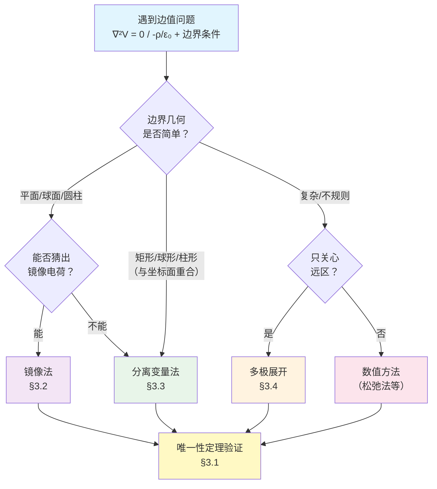
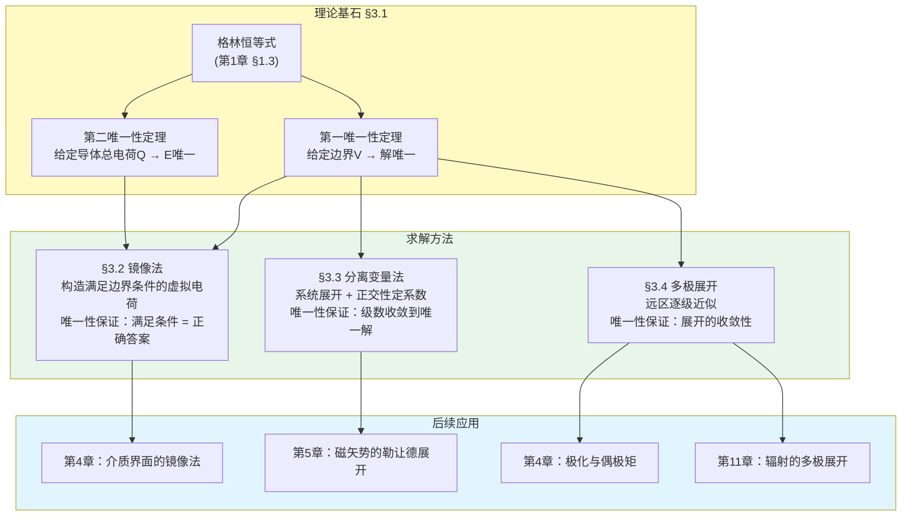
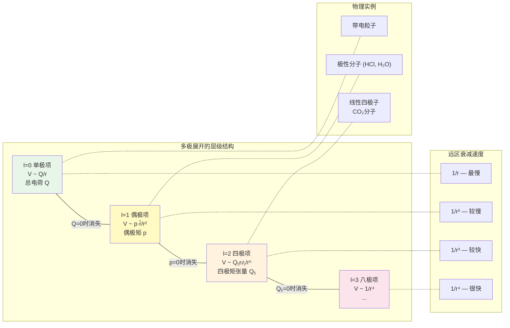
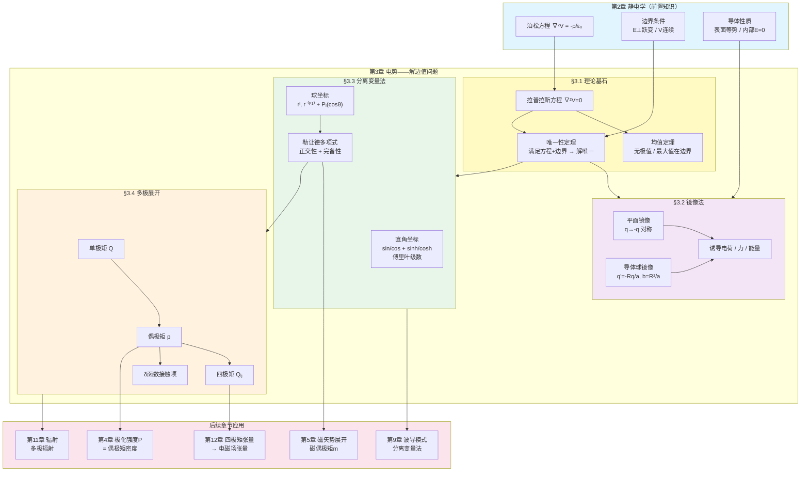

# 第3章 电势 (Potentials) —— 解边值问题

## 引言：为什么需要更强大的求解技巧？

在第2章中，我们建立了一条清晰的策略升级路径：**库仑定律（通用但笨拙）→ 高斯定律（优雅但需要对称性）→ 电势（万能但需要积分/求解微分方程）**。

电势方法的核心方程是泊松方程：

$$\nabla^2 V = -\frac{\rho}{\varepsilon_0}$$

当你知道空间中所有电荷的分布 $\rho(\mathbf{r})$ 时，原则上可以通过积分 $V(\mathbf{r}) = \frac{1}{4\pi\varepsilon_0}\int \frac{\rho(\mathbf{r}')}{|\mathbf{r} - \mathbf{r}'|} d\tau'$ 求出电势。但现实中的问题往往不是这样的——你通常不知道所有的电荷分布。

考虑这样一个场景：一个点电荷 $q$ 放在一块接地导体平面附近。你知道 $q$ 的位置，但导体表面上的**诱导电荷**（回忆第2章 §2.5.2）分布如何？它取决于 $q$ 的电场，而 $q$ 的电场又被诱导电荷所修改——这是一个自洽问题！直接积分求解几乎不可能。

我们真正面对的是一个**边值问题（Boundary Value Problem）**：在某些区域内求解拉普拉斯方程或泊松方程，同时满足边界上的给定条件（如导体表面的电势值或电荷量）。本章将为你装备三件强大的武器来攻克这类问题：

1. **镜像法（Method of Images）**：用虚拟的"镜像电荷"巧妙地满足边界条件——这是一门艺术，依赖于灵感和经验。
2. **分离变量法（Separation of Variables）**：将偏微分方程系统地化为常微分方程——这是一台机器，只要坐标系与边界匹配就能运转。
3. **多极展开（Multipole Expansion）**：在远离源的区域，用电荷分布的整体特征（总电荷、偶极矩、四极矩……）逐级近似电势——这是一种哲学，揭示了物理学中"粗粒化"的深刻思想。

但在使用这些武器之前，我们必须先回答一个根本性的问题：**我们怎么知道找到的解是唯一正确的？** 答案就是本章的理论基石——唯一性定理。

**本章方法选择指南**：面对一个边值问题时，如何选择最合适的方法？



---

## 3.1 拉普拉斯方程 (Laplace's Equation)

### 3.1.1 拉普拉斯方程的性质

在第2章 §2.3.4 中，我们从 $\mathbf{E} = -\nabla V$ 和 $\nabla \cdot \mathbf{E} = \rho/\varepsilon_0$ 推导出了泊松方程 $\nabla^2 V = -\rho/\varepsilon_0$。在没有电荷的区域（$\rho = 0$），泊松方程退化为**拉普拉斯方程**：

$$\boxed{\nabla^2 V = 0}$$

这个看似简单的方程蕴含着极其丰富的数学性质。让我们从最简单的情况开始。

**一维拉普拉斯方程**

在一维中，$\nabla^2 V = d^2V/dx^2 = 0$，其解为：

$$V(x) = mx + b$$

即一条直线。这意味着：
- **无极值**：一维中 $V$ 在区域内没有极大值或极小值，它总是从一端单调变化到另一端。
- **均值性质**：$V$ 在任意点 $x$ 处的值恰好等于其两侧等距点值的平均：$V(x) = \frac{1}{2}[V(x-a) + V(x+a)]$。

这两条性质不是一维的巧合，它们是拉普拉斯方程在任意维度下的**本质特征**。

**二维拉普拉斯方程**

在二维中，$\frac{\partial^2 V}{\partial x^2} + \frac{\partial^2 V}{\partial y^2} = 0$。其解的物理图像是一张"弹性橡皮膜"——当你在边界上钉住膜的高度，膜会自然松弛到最平滑的形状，不会在内部出现凸起或凹陷。

**均值性质**：$V$ 在任意点 $(x,y)$ 处的值等于以该点为圆心的**任意圆周**上 $V$ 的平均值。

**三维拉普拉斯方程**

在三维中，均值定理推广为：

> **拉普拉斯方程的球面均值定理**：如果 $V$ 满足拉普拉斯方程，则 $V$ 在任意点 $P$ 处的值等于以 $P$ 为球心的**任意球面**上 $V$ 的平均值：
>
> $$\boxed{V(P) = \frac{1}{4\pi R^2} \oint_{\text{球面}} V \, da}$$
>
> 其中 $R$ 是球面的半径（只要球面完全在 $\rho = 0$ 的区域内）。

**由均值定理推出的核心推论**：

**推论1（无极值定理）**：满足拉普拉斯方程的函数在区域内部不可能有极大值或极小值。

*证明*：假设 $V$ 在某点 $P$ 处取极大值。则在 $P$ 的任何邻域内，$V$ 的值都不超过 $V(P)$。画一个以 $P$ 为心的小球面，球面上 $V \leq V(P)$，但均值定理要求球面上的平均值等于 $V(P)$，这只有在球面上 $V$ 处处等于 $V(P)$ 时才可能。重复这一论证，可以推出 $V$ 在整个区域内为常数——与假设 $P$ 是极大值点矛盾（除非 $V$ 是平凡的常数解）。

**推论2（最大值原理）**：$V$ 的最大值和最小值只能出现在区域的**边界**上。

这条推论有着深远的物理意义：**在无源区域内，电势不可能自发地形成"高地"或"洼地"**。空间中的每一点都是周围各方向的"民主平均"。这正是为什么静电屏蔽有效——如果一个闭合导体腔内没有电荷，那么腔内的电势不可能偏离边界值，它必须处处等于边界上的常数（导体等势）。

---

**例题 3.1**：验证拉普拉斯方程的均值性质

(a) 一维：设 $V(x)$ 满足 $d^2V/dx^2 = 0$，证明 $V(x) = \frac{1}{2}[V(x-a) + V(x+a)]$ 对任意 $a$ 成立。

(b) 二维：设 $V(x,y) = e^x \sin y$，验证它满足二维拉普拉斯方程，并验证在原点处 $V$ 等于以原点为圆心、半径为 $R$ 的圆周上的平均值（对小 $R$ 验证到二阶近似）。

**解**：

(a) 由 $d^2V/dx^2 = 0$ 得 $V(x) = mx + b$。则

$$\frac{1}{2}[V(x-a) + V(x+a)] = \frac{1}{2}[m(x-a)+b + m(x+a)+b] = mx + b = V(x) \quad \checkmark$$

(b) 验证拉普拉斯方程：$\frac{\partial^2}{\partial x^2}(e^x \sin y) = e^x \sin y$，$\frac{\partial^2}{\partial y^2}(e^x \sin y) = -e^x \sin y$，两者之和为零。$\checkmark$

在原点 $V(0,0) = e^0 \sin 0 = 0$。圆周上的参数化：$x = R\cos\phi$，$y = R\sin\phi$，$\phi \in [0, 2\pi)$。

$$\langle V \rangle = \frac{1}{2\pi}\int_0^{2\pi} e^{R\cos\phi}\sin(R\sin\phi)\,d\phi$$

对小 $R$ 展开：$e^{R\cos\phi} \approx 1 + R\cos\phi + \frac{R^2\cos^2\phi}{2} + \cdots$，$\sin(R\sin\phi) \approx R\sin\phi - \frac{R^3\sin^3\phi}{6} + \cdots$。

到二阶：
$$\langle V \rangle \approx \frac{1}{2\pi}\int_0^{2\pi}\left[R\sin\phi + R^2\cos\phi\sin\phi + \frac{R^2\cos^2\phi}{2}\cdot R\sin\phi + \cdots\right]d\phi$$

第一项 $\int_0^{2\pi}R\sin\phi\,d\phi = 0$；第二项 $\int_0^{2\pi}R^2\cos\phi\sin\phi\,d\phi = 0$（正交性）。所有到 $R^2$ 阶的项积分均为零，故 $\langle V \rangle = 0 = V(0,0)$。$\checkmark$

---

### 3.1.2 第一唯一性定理

既然拉普拉斯方程的解具有如此美妙的性质，一个自然的问题是：**给定边界条件，解是否唯一？** 答案是肯定的，而且证明依赖于我们在第1章 §1.3 中学过的格林恒等式。

> **第一唯一性定理**：设区域 $\mathcal{V}$ 的边界面 $\mathcal{S}$ 上给定了电势 $V$ 的值（狄利克雷边界条件），则在 $\mathcal{V}$ 内满足泊松方程 $\nabla^2 V = -\rho/\varepsilon_0$ 的解是唯一的。

**严格证明**：

假设存在两个满足相同泊松方程和相同边界条件的解 $V_1$ 和 $V_2$。定义差函数：

$$W \equiv V_1 - V_2$$

则 $W$ 满足：
- 在 $\mathcal{V}$ 内：$\nabla^2 W = \nabla^2 V_1 - \nabla^2 V_2 = (-\rho/\varepsilon_0) - (-\rho/\varepsilon_0) = 0$（拉普拉斯方程）
- 在 $\mathcal{S}$ 上：$W = V_1 - V_2 = 0$（边界条件相同）

现在利用格林第一恒等式（取 $T = U = W$）：

$$\int_\mathcal{V} (W\nabla^2 W + \nabla W \cdot \nabla W)\,d\tau = \oint_\mathcal{S} W\frac{\partial W}{\partial n}\,da$$

由于 $\nabla^2 W = 0$（在 $\mathcal{V}$ 内）且 $W = 0$（在 $\mathcal{S}$ 上），上式简化为：

$$\int_\mathcal{V} |\nabla W|^2\,d\tau = 0$$

被积函数 $|\nabla W|^2 \geq 0$，积分为零意味着 $|\nabla W|^2 = 0$ 处处成立，即 $\nabla W = 0$。因此 $W$ 在整个 $\mathcal{V}$ 内是常数。结合 $W = 0$ 在边界上，得 $W = 0$ 处处成立。

$$\boxed{V_1 = V_2 \quad \text{在} \; \mathcal{V} \; \text{内处处成立}}$$

**物理意义**：如果你通过**任何手段**——无论是灵感还是猜测——找到了一个满足泊松方程和边界条件的解，那它就是**唯一正确的解**。你不需要担心是否还有其他可能。这就是镜像法的理论基石：镜像电荷构造的解满足方程和边界条件，因此它**必然**是正确的解。

**推论（纽曼边界条件）**：如果边界条件给定的是电势的法向导数 $\partial V/\partial n$（即电场的法向分量），则解在相差一个加法常数的意义下唯一。证明类似，只是右端面积分为零的条件变为 $\partial W/\partial n = 0$。

### 3.1.3 第二唯一性定理

在许多实际问题中，我们面对的是导体系统。此时边界条件的形式略有不同——我们知道的不是导体表面每一点的电势，而是每个导体携带的**总电荷**。

> **第二唯一性定理**：在含有若干导体的系统中，如果给定了：
> - 每个导体上的**总电荷** $Q_i$
> - 导体之间的空间中的电荷分布 $\rho$
>
> 则电场 $\mathbf{E}$ 是唯一确定的。

**严格证明**：

假设存在两个满足条件的电场 $\mathbf{E}_1$ 和 $\mathbf{E}_2$。它们各自对应的面电荷密度为 $\sigma_1$ 和 $\sigma_2$，虽然分布不同，但每个导体上的总电荷相同：$\oint \sigma_1\,da = \oint \sigma_2\,da = Q_i$。

定义 $\mathbf{E}_3 \equiv \mathbf{E}_1 - \mathbf{E}_2$，对应的面电荷密度 $\sigma_3 = \sigma_1 - \sigma_2$。则：

- 在空间中：$\nabla \cdot \mathbf{E}_3 = (\rho - \rho)/\varepsilon_0 = 0$
- 在每个导体表面上：$\oint \sigma_3\,da = Q_i - Q_i = 0$

由 $\mathbf{E}_3 = -\nabla W$（$W = V_1 - V_2$），$W$ 在每个导体上是常数（导体等势），设为 $C_i$。

构造积分（利用散度定理）：

$$\int_\mathcal{V} |\mathbf{E}_3|^2\,d\tau = -\int_\mathcal{V} \mathbf{E}_3 \cdot \nabla W\,d\tau = -\oint_\mathcal{S}} W\,\mathbf{E}_3 \cdot d\mathbf{a} + \int_\mathcal{V} W(\nabla \cdot \mathbf{E}_3)\,d\tau$$

第二项为零（因为 $\nabla \cdot \mathbf{E}_3 = 0$）。面积分包含两部分：
- **外边界**（取在无穷远）：$W \to 0$（假设总电荷有限），贡献为零。
- **各导体表面**：$W = C_i$ 为常数，可提出积分。$\oint \mathbf{E}_3 \cdot d\mathbf{a} = \oint \sigma_3/\varepsilon_0\,da = 0$，贡献为零。

因此 $\int |\mathbf{E}_3|^2\,d\tau = 0$，即 $\mathbf{E}_3 = 0$ 处处成立。

$$\boxed{\mathbf{E}_1 = \mathbf{E}_2}$$

**物理意义**：第二唯一性定理告诉我们，即使不知道导体表面电荷的精确分布，只要知道每个导体的总电荷，电场就已经被唯一确定了。表面电荷会自动调整自己的分布来满足这一要求。这再次为镜像法提供了坚实的理论保障。

---

**例题 3.2**：利用唯一性定理论证：一个接地导体腔内若无电荷，则腔内电势处处为零。

**解**：

设导体腔的内表面为 $\mathcal{S}$，腔内区域为 $\mathcal{V}$。

**条件**：
- 导体接地：$V = 0$ 在 $\mathcal{S}$ 上（整个内表面等势且为零）
- 腔内无电荷：$\rho = 0$ 在 $\mathcal{V}$ 内

因此 $V$ 在腔内满足拉普拉斯方程 $\nabla^2 V = 0$，且边界上 $V = 0$。

一个显然的解是 $V = 0$（常数函数，其拉普拉斯为零，且满足边界条件）。

由**第一唯一性定理**，这个解是唯一的。因此：

$$\boxed{V = 0 \quad \text{腔内处处成立}}$$

**推论**：腔内的电场 $\mathbf{E} = -\nabla V = 0$。这就是**静电屏蔽**的数学证明——无论导体外部的电场如何变化，腔内始终不受影响。

**重要注记**：如果导体不接地而是携带电荷 $Q$，腔内电势为某个常数（不一定为零），但结论本质不变——腔内电场为零，电荷全部分布在外表面。

**唯一性定理与三大方法的逻辑关系**：



---

## 3.2 镜像法 (Method of Images)

有了唯一性定理做后盾，我们可以大胆地使用一种看似"不正当"的方法——镜像法。它的核心思想是：

> **如果你能通过某种诡计（trick）找到一个满足正确边界条件和正确微分方程的解，那么根据唯一性定理，这个解就是唯一正确的答案。**

所谓"诡计"就是：在感兴趣的区域**之外**放置虚拟的"镜像电荷"，使得它们与真实电荷一起产生的电势恰好满足边界条件。这些镜像电荷并不真实存在——它们只是一种数学构造。但由于唯一性定理保证了解的唯一性，只要边界条件对了，答案就对了。

### 3.2.1 经典镜像：点电荷与无限大接地导体平面

**问题**：一个点电荷 $+q$ 位于距无限大接地导体平面（$V = 0$）高度 $d$ 处。求导体上方区域的电势分布。

**物理图景**：接地平面上会出现诱导电荷（回忆第2章 §2.5.2），这些电荷的分布使得平面上处处 $V = 0$。我们不知道诱导电荷的具体分布，但我们可以绕过这个困难。

**镜像构造**：想象在导体平面的**另一侧**（即平面下方距离 $d$ 处）放置一个镜像电荷 $-q$。这个电荷当然不是真实的——平面下方实际上是导体内部。但考虑 $+q$ 和 $-q$ 在**整个空间**中产生的电势：

建立坐标系，令导体平面为 $z = 0$ 平面，$+q$ 在 $(0,0,d)$，镜像电荷 $-q$ 在 $(0,0,-d)$。在 $z > 0$ 的区域中：

$$V(\mathbf{r}) = \frac{1}{4\pi\varepsilon_0}\left[\frac{q}{\sqrt{x^2 + y^2 + (z-d)^2}} - \frac{q}{\sqrt{x^2 + y^2 + (z+d)^2}}\right]$$

**验证边界条件**：在 $z = 0$ 平面上：

$$V(x,y,0) = \frac{q}{4\pi\varepsilon_0}\left[\frac{1}{\sqrt{x^2+y^2+d^2}} - \frac{1}{\sqrt{x^2+y^2+d^2}}\right] = 0 \quad \checkmark$$

**验证微分方程**：在 $z > 0$ 区域内（排除 $+q$ 所在点），$V$ 满足拉普拉斯方程（因为 $-q$ 在 $z < 0$，不影响 $z > 0$ 区域的方程）。$\checkmark$

由**第一唯一性定理**，上面的 $V$ 就是导体上方区域的唯一正确解。

**计算诱导电荷密度**

导体表面的面电荷密度由第2章 §2.5.1 的结论给出：$\sigma = -\varepsilon_0 \frac{\partial V}{\partial n}\big|_{\text{surface}}$。这里法向方向为 $+z$ 方向，所以：

$$\sigma(x,y) = -\varepsilon_0 \frac{\partial V}{\partial z}\bigg|_{z=0}$$

计算偏导数：

$$\frac{\partial V}{\partial z} = \frac{q}{4\pi\varepsilon_0}\left[-\frac{z-d}{(x^2+y^2+(z-d)^2)^{3/2}} + \frac{z+d}{(x^2+y^2+(z+d)^2)^{3/2}}\right]$$

在 $z = 0$ 处：

$$\frac{\partial V}{\partial z}\bigg|_{z=0} = \frac{q}{4\pi\varepsilon_0}\left[\frac{d}{(x^2+y^2+d^2)^{3/2}} + \frac{d}{(x^2+y^2+d^2)^{3/2}}\right] = \frac{qd}{2\pi\varepsilon_0(x^2+y^2+d^2)^{3/2}}$$

因此：

$$\boxed{\sigma(x,y) = -\frac{qd}{2\pi(x^2+y^2+d^2)^{3/2}}}$$

引入到平面上点 $(x,y)$ 距原点的距离 $s = \sqrt{x^2+y^2}$：

$$\sigma = -\frac{qd}{2\pi(s^2+d^2)^{3/2}}$$

**验证总诱导电荷**：

$$Q_{\text{ind}} = \int_0^\infty \sigma \cdot 2\pi s\,ds = -qd\int_0^\infty \frac{s\,ds}{(s^2+d^2)^{3/2}}$$

令 $u = s^2 + d^2$，$du = 2s\,ds$：

$$Q_{\text{ind}} = -qd \cdot \frac{1}{2}\int_{d^2}^\infty u^{-3/2}\,du = -qd \cdot \frac{1}{2}\left[-2u^{-1/2}\right]_{d^2}^{\infty} = -qd \cdot \frac{1}{d} = -q$$

$$\boxed{Q_{\text{ind}} = -q}$$

总诱导电荷恰好等于镜像电荷的电荷量，这绝非巧合——它是高斯定律的直接推论。

**电荷受力**

在导体上方 $z > 0$ 区域中，电势等价于两个点电荷 $+q$ 和 $-q$ 的组合。因此 $+q$ 受到的力等于它与镜像电荷 $-q$ 之间的库仑力：

$$\boxed{F = -\frac{1}{4\pi\varepsilon_0}\frac{q^2}{(2d)^2}\hat{\mathbf{z}} = -\frac{q^2}{16\pi\varepsilon_0 d^2}\hat{\mathbf{z}}}$$

力沿 $-z$ 方向（吸引力），这符合直觉——点电荷被导体表面上的异号诱导电荷所吸引。

**系统能量**

**陷阱警示**：系统的能量**不是** $-\frac{1}{4\pi\varepsilon_0}\frac{q^2}{2d}$（两个点电荷之间的互能）。镜像电荷不是真实电荷！

正确的能量可以通过将电荷从无穷远处移到距平面 $d$ 处所做的功来计算：

$$W = -\int_\infty^d \mathbf{F} \cdot d\mathbf{l} = -\int_\infty^d \left(-\frac{q^2}{16\pi\varepsilon_0 z^2}\right)dz = -\frac{q^2}{16\pi\varepsilon_0}\left[\frac{1}{z}\right]_\infty^d$$

$$\boxed{W = -\frac{q^2}{16\pi\varepsilon_0 d}}$$

注意这恰好是两点电荷互能 $-\frac{q^2}{4\pi\varepsilon_0(2d)}$ 的**一半**！差别在于：将真实电荷移到位时，诱导电荷会自发重新分布（不需要外力做功），而在两个真实点电荷的系统中，两个电荷都需要被"移到位"。

---

**例题 3.3**：点电荷 $+q$ 距无限大接地导体平面距离 $d$。

(a) 求平面上诱导电荷密度的最大值及其位置。
(b) 在什么距离处，诱导电荷密度降为最大值的一半？
(c) 验证对于 $d \to 0$（电荷紧贴导体），力趋于无穷大；对于 $d \to \infty$，力趋于零。

**解**：

(a) $|\sigma| = \frac{qd}{2\pi(s^2+d^2)^{3/2}}$，当 $s = 0$（电荷正下方）时取最大值：

$$\boxed{|\sigma|_{\max} = \frac{q}{2\pi d^2}}$$

(b) 令 $|\sigma| = \frac{1}{2}|\sigma|_{\max}$：

$$\frac{qd}{2\pi(s^2+d^2)^{3/2}} = \frac{q}{4\pi d^2}$$

$$\frac{d}{(s^2+d^2)^{3/2}} = \frac{1}{2d^2}$$

$$(s^2+d^2)^{3/2} = 2d^3$$

$$s^2 + d^2 = (2)^{2/3}d^2$$

$$\boxed{s = d\sqrt{2^{2/3} - 1} \approx 0.766\,d}$$

(c) 当 $d \to 0$：$F = \frac{q^2}{16\pi\varepsilon_0 d^2} \to \infty$。$\checkmark$
当 $d \to \infty$：$F = \frac{q^2}{16\pi\varepsilon_0 d^2} \to 0$。$\checkmark$

这些极限完全符合物理直觉：电荷越靠近导体，诱导电荷越集中，吸引力越强。

---

### 3.2.2 点电荷与接地导体球

**问题**：一个点电荷 $+q$ 位于原点为球心、半径为 $R$ 的接地导体球（$V = 0$）外部，距球心 $a$（$a > R$）处。求球外区域的电势分布。

这个问题比平面情况复杂得多，因为球面的几何形状意味着镜像电荷的大小和位置都需要精心确定。

**镜像构造的推导**

将真实电荷 $+q$ 放在 $z$ 轴上距原点 $a$ 处。我们猜测镜像电荷 $q'$ 也在 $z$ 轴上，距原点 $b$ 处（$b < R$，在球内部）。要求球面（$r = R$）上处处 $V = 0$。

球面上任意一点到 $+q$ 的距离为 $\mathcal{r}_1 = \sqrt{R^2 + a^2 - 2Ra\cos\theta}$，到 $q'$ 的距离为 $\mathcal{r}_2 = \sqrt{R^2 + b^2 - 2Rb\cos\theta}$。

边界条件要求：

$$\frac{q}{\mathcal{r}_1} + \frac{q'}{\mathcal{r}_2} = 0 \quad \text{对所有} \; \theta$$

即 $q'/q = -\mathcal{r}_2/\mathcal{r}_1$ 对所有 $\theta$ 成立。这意味着 $\mathcal{r}_2/\mathcal{r}_1$ 必须与 $\theta$ 无关。

$$\frac{\mathcal{r}_2^2}{\mathcal{r}_1^2} = \frac{R^2 + b^2 - 2Rb\cos\theta}{R^2 + a^2 - 2Ra\cos\theta}$$

要使此比值与 $\theta$ 无关，需要分子和分母中 $\cos\theta$ 的系数成比例：

$$\frac{R^2 + b^2}{R^2 + a^2} = \frac{2Rb}{2Ra} = \frac{b}{a}$$

从第二个等式：$R^2 + b^2 = \frac{b}{a}(R^2 + a^2) = \frac{bR^2}{a} + ab$

$$R^2 - \frac{bR^2}{a} = ab - b^2 = b(a-b)$$

$$R^2\frac{a-b}{a} = b(a-b)$$

若 $a \neq b$（显然如此），消去 $(a-b)$：

$$\boxed{b = \frac{R^2}{a}}$$

代回比值关系：$\mathcal{r}_2/\mathcal{r}_1 = \sqrt{b/a} = R/a$，因此：

$$\boxed{q' = -\frac{R}{a}q}$$

这是一个美丽的结果：**镜像电荷的位置 $b = R^2/a$ 是真实电荷位置 $a$ 关于球面的"反演点"**（$ab = R^2$）。镜像电荷的大小按 $R/a$ 比例缩小。

**球外电势**（$r > R$）：

$$\boxed{V(r,\theta) = \frac{1}{4\pi\varepsilon_0}\left[\frac{q}{\sqrt{r^2 + a^2 - 2ra\cos\theta}} - \frac{Rq/a}{\sqrt{r^2 + R^4/a^2 - 2rR^2\cos\theta/a}}\right]}$$

**诱导电荷密度**

$$\sigma(\theta) = -\varepsilon_0\frac{\partial V}{\partial r}\bigg|_{r=R}$$

经过仔细计算（过程较长但直接）：

$$\boxed{\sigma(\theta) = -\frac{q}{4\pi R}\frac{a^2 - R^2}{(R^2 + a^2 - 2Ra\cos\theta)^{3/2}}}$$

**验证总诱导电荷**：

$$Q_{\text{ind}} = \oint \sigma\,da = \int_0^{2\pi}\int_0^{\pi}\sigma(\theta)\,R^2\sin\theta\,d\theta\,d\phi = -\frac{qR(a^2-R^2)}{2}\int_0^{\pi}\frac{\sin\theta\,d\theta}{(R^2+a^2-2Ra\cos\theta)^{3/2}}$$

令 $u = R^2 + a^2 - 2Ra\cos\theta$，$du = 2Ra\sin\theta\,d\theta$：

$$Q_{\text{ind}} = -\frac{q(a^2-R^2)}{4a}\int_{(a-R)^2}^{(a+R)^2}u^{-3/2}\,du = -\frac{q(a^2-R^2)}{4a}\left[-2u^{-1/2}\right]_{(a-R)^2}^{(a+R)^2}$$

$$= -\frac{q(a^2-R^2)}{4a}\cdot 2\left[\frac{1}{a-R} - \frac{1}{a+R}\right] = -\frac{q(a^2-R^2)}{4a}\cdot\frac{4R}{a^2-R^2} = -\frac{qR}{a}$$

$$\boxed{Q_{\text{ind}} = -\frac{R}{a}q = q'}$$

再次验证：总诱导电荷等于镜像电荷。

---

**例题 3.4**：点电荷 $+q$ 在半径为 $R$ 的接地导体球外，距球心 $a$。

(a) 求电荷受到的力。
(b) 当电荷远离导体球时（$a \gg R$），力的渐近行为如何？
(c) 当电荷接近导体球表面时（$a \to R^+$），力的渐近行为如何？

**解**：

(a) 利用镜像电荷，力为 $+q$ 与 $q' = -Rq/a$（距 $+q$ 距离为 $a - b = a - R^2/a = (a^2 - R^2)/a$）之间的库仑力：

$$F = \frac{1}{4\pi\varepsilon_0}\frac{q \cdot q'}{(a-b)^2} = -\frac{1}{4\pi\varepsilon_0}\frac{q^2 Ra}{(a^2-R^2)^2}$$

$$\boxed{F = -\frac{q^2 Ra}{4\pi\varepsilon_0(a^2-R^2)^2}}$$

负号表示吸引力（指向球心）。

(b) 当 $a \gg R$：$a^2 - R^2 \approx a^2$，故

$$F \approx -\frac{q^2 R}{4\pi\varepsilon_0 a^3}$$

力按 $1/a^3$ 衰减（比两个点电荷之间的 $1/a^2$ 更快），这是因为远处看来，导体球上的诱导电荷构成一个偶极子，偶极子-电荷相互作用按 $1/r^3$ 衰减。

(c) 当 $a \to R^+$：令 $\epsilon = a - R$（$\epsilon \ll R$），则 $a^2 - R^2 = (a+R)(a-R) \approx 2R\epsilon$，$a \approx R$：

$$F \approx -\frac{q^2 R^2}{4\pi\varepsilon_0 \cdot 4R^2\epsilon^2} = -\frac{q^2}{16\pi\varepsilon_0\epsilon^2}$$

这正是点电荷与接地平面的结果！当电荷非常靠近球面时，球面局部近似为平面，完全合理。$\checkmark$

---

**例题 3.5**：将例题 3.4 推广到导体球**不接地**而是保持电中性（总电荷为零）的情况。

**解**：

对于不接地、总电荷为零的导体球，接地情况下球面上的诱导电荷总量为 $q' = -Rq/a$，但现在球需要保持电中性。我们可以这样处理：

**步骤1**：先用接地球的镜像电荷 $q' = -Rq/a$ 在 $b = R^2/a$ 处满足 $V = 0$ 的条件。

**步骤2**：为了使总电荷为零，需要额外放置一个电荷 $-q' = +Rq/a$ 在球心处。在球面上，球心处的点电荷产生均匀的电势 $\frac{Rq/a}{4\pi\varepsilon_0 R}$（在球面每一点等距），因此**不改变球面上电势的均匀性**（仅整体抬升），也不破坏拉普拉斯方程。

因此，不接地中性导体球的解需要**两个**镜像电荷：
- $q_1 = -\frac{R}{a}q$ 在距球心 $b = \frac{R^2}{a}$ 处
- $q_2 = +\frac{R}{a}q$ 在球心处

电荷受到的力：

$$F = \frac{q}{4\pi\varepsilon_0}\left[\frac{q_1}{(a-b)^2} + \frac{q_2}{a^2}\right] = \frac{q}{4\pi\varepsilon_0}\left[-\frac{Rq/a}{(a-R^2/a)^2} + \frac{Rq/a}{a^2}\right]$$

$$\boxed{F = -\frac{q^2R}{4\pi\varepsilon_0}\left[\frac{a}{(a^2-R^2)^2} - \frac{1}{a^3}\right]}$$

**极限验证**：当 $a \gg R$ 时，第一项 $\approx 1/a^3$，第二项也是 $1/a^3$，需要更精细的展开：

$$\frac{a}{(a^2-R^2)^2} = \frac{1}{a^3}\frac{1}{(1-R^2/a^2)^2} \approx \frac{1}{a^3}\left(1 + \frac{2R^2}{a^2} + \cdots\right)$$

$$F \approx -\frac{q^2R}{4\pi\varepsilon_0}\cdot\frac{2R^2}{a^5} = -\frac{q^2R^3}{2\pi\varepsilon_0 a^5}$$

力按 $1/a^5$ 衰减——比接地球快两个量级。这是因为中性导体球在外场中产生的是**偶极子**响应（而非单极），偶极-电荷力按 $1/r^4$ 走，诱导偶极矩本身又依赖 $1/r$，合起来就是 $1/a^5$。

---

### 3.2.3 镜像法的其他应用与局限

**点电荷与两个正交接地平面**

当两个接地导体平面相互垂直（如 $xz$ 平面和 $yz$ 平面，即 $x = 0$ 和 $y = 0$），需要**三个**镜像电荷来满足两个平面上 $V = 0$ 的条件。如果 $+q$ 在 $(a, b, 0)$，则镜像电荷为：
- $-q$ 在 $(-a, b, 0)$（关于 $x = 0$ 面的镜像）
- $-q$ 在 $(a, -b, 0)$（关于 $y = 0$ 面的镜像）
- $+q$ 在 $(-a, -b, 0)$（关于两个面的镜像）

一般地，对于两个夹角为 $\pi/n$（$n$ 为正整数）的平面，需要 $2n - 1$ 个镜像电荷。

**介质界面的镜像法**（为第4章铺垫）

当一个点电荷位于两种不同介电常数的介质界面附近时，也可以使用镜像法。这将在第4章学习线性电介质时详细讨论。

**镜像法的局限性**

镜像法虽然优雅，但它有严格的限制：**只有当边界几何足够简单时，才能找到有限个镜像电荷来精确满足边界条件**。已知可以使用镜像法的经典构型包括：
- 无限大平面
- 球面
- 圆柱面（需要线电荷作为镜像）
- 两个正交或特定角度的平面
- 介质平界面

对于更一般的几何形状（如椭球、不规则曲面），镜像法通常无法使用，需要借助分离变量法或数值方法。

---

## 3.3 分离变量法 (Separation of Variables)

镜像法是一门艺术——它依赖于灵感，只适用于少数特殊几何。我们需要一种**系统的、机械化的**方法来求解拉普拉斯方程。分离变量法就是这样一台机器：只要边界与坐标面重合，它就能工作。

### 3.3.1 方法概述

分离变量法的核心思想异常简单：

> **假设解可以写成各坐标变量的单变量函数之乘积**。

例如，在直角坐标系中假设 $V(x,y) = X(x)Y(y)$，在球坐标系中假设 $V(r,\theta) = R(r)\Theta(\theta)$。将这种形式代入拉普拉斯方程，利用"依赖不同变量的项之和为常数"的事实，将偏微分方程分解为若干常微分方程（ODE）。每个 ODE 都可以用标准方法求解。

**一般流程**：

1. **选择坐标系**：使边界面与某个坐标面重合（这是关键！）
2. **假设分离形式**：$V = f_1(\xi_1) \cdot f_2(\xi_2) \cdot f_3(\xi_3)$
3. **代入方程**：将拉普拉斯方程化为关于各变量的 ODE
4. **引入分离常数**：将"不同变量的函数之和为零"转化为各自等于常数
5. **求解 ODE**：得到通解（含待定系数）
6. **叠加**：利用线性性，将所有满足方程的解叠加
7. **确定系数**：利用边界条件和正交性确定系数


### 3.3.2 直角坐标系下的分离变量法

**二维问题：矩形区域**

考虑一个简单而重要的问题：在二维中，$V(x,y)$ 满足拉普拉斯方程 $\frac{\partial^2 V}{\partial x^2} + \frac{\partial^2 V}{\partial y^2} = 0$。

**第一步**：假设 $V(x,y) = X(x)Y(y)$。代入：

$$X''Y + XY'' = 0$$

两边除以 $XY$：

$$\frac{X''}{X} + \frac{Y''}{Y} = 0$$

关键观察：$X''/X$ 只依赖 $x$，$Y''/Y$ 只依赖 $y$。它们的和为零，这只有在**两者分别为常数**时才可能（否则，改变 $x$ 不改变 $y$ 的项，总和就不能保持为零）。设：

$$\frac{X''}{X} = C_1, \quad \frac{Y''}{Y} = C_2, \quad C_1 + C_2 = 0$$

即 $C_1 = -C_2$。我们可以设 $C_1 = k^2$（正数），则 $C_2 = -k^2$，或者 $C_1 = -k^2$，$C_2 = k^2$。选择哪一种由边界条件决定。

**情况1**：$X'' = k^2 X$（指数解），$Y'' = -k^2 Y$（振荡解）

$$X(x) = Ae^{kx} + Be^{-kx}, \quad Y(y) = C\sin(ky) + D\cos(ky)$$

**情况2**：$X'' = -k^2 X$（振荡解），$Y'' = k^2 Y$（指数解）

$$X(x) = A\sin(kx) + B\cos(kx), \quad Y(y) = Ce^{ky} + De^{-ky}$$

**如何选择？** 关键原则：**在边界条件要求函数为零的方向上，选择振荡解（正弦/余弦）**，因为振荡函数可以满足多个零点的需求；在另一个方向上选择指数解（或双曲函数）。

---

**例题 3.6**：求解二维矩形区域的拉普拉斯方程

一个二维矩形区域，三面接地、一面给定电势。具体地，边界条件为：

$$V(0, y) = 0, \quad V(a, y) = 0, \quad V(x, 0) = 0, \quad V(x, b) = V_0(x)$$

其中 $V_0(x)$ 是给定的函数。

**解**：

**第一步：确定振荡方向**。$x$ 方向上有两个齐次条件（$V = 0$ 在 $x = 0$ 和 $x = a$），所以 $x$ 方向取振荡解：

$$X'' = -k^2X, \quad Y'' = k^2Y$$

$$X(x) = A\sin(kx) + B\cos(kx), \quad Y(y) = Ce^{ky} + De^{-ky}$$

**第二步：应用齐次边界条件**。

$V(0,y) = 0$：$X(0)Y(y) = 0 \Rightarrow X(0) = 0$，即 $B = 0$，所以 $X(x) = A\sin(kx)$。

$V(a,y) = 0$：$X(a) = A\sin(ka) = 0 \Rightarrow ka = n\pi$（$n = 1, 2, 3, \dots$），即 $k_n = n\pi/a$。

$V(x,0) = 0$：$Y(0) = C + D = 0$，即 $D = -C$，所以 $Y(y) = C(e^{k_n y} - e^{-k_n y}) = 2C\sinh(k_n y)$。

**第三步：叠加**。每个 $n$ 给出一个满足拉普拉斯方程和三个齐次边界条件的解。由线性性，一般解为：

$$V(x,y) = \sum_{n=1}^{\infty} c_n \sin\left(\frac{n\pi x}{a}\right)\sinh\left(\frac{n\pi y}{a}\right)$$

**第四步：确定系数**（傅里叶技巧）。利用最后一个边界条件 $V(x,b) = V_0(x)$：

$$V_0(x) = \sum_{n=1}^{\infty} c_n \sinh\left(\frac{n\pi b}{a}\right)\sin\left(\frac{n\pi x}{a}\right)$$

这是一个傅里叶正弦级数。利用 $\sin$ 函数的正交性（$\int_0^a \sin\frac{m\pi x}{a}\sin\frac{n\pi x}{a}\,dx = \frac{a}{2}\delta_{mn}$），两边乘以 $\sin\frac{m\pi x}{a}$ 并在 $[0, a]$ 上积分：

$$\int_0^a V_0(x)\sin\frac{m\pi x}{a}\,dx = c_m\sinh\frac{m\pi b}{a}\cdot\frac{a}{2}$$

$$\boxed{c_n = \frac{2}{a\sinh(n\pi b/a)}\int_0^a V_0(x)\sin\frac{n\pi x}{a}\,dx}$$

**特例**：若 $V_0(x) = V_0$（常数），则

$$\int_0^a V_0\sin\frac{n\pi x}{a}\,dx = V_0\left[-\frac{a}{n\pi}\cos\frac{n\pi x}{a}\right]_0^a = \frac{V_0 a}{n\pi}[1 - (-1)^n] = \begin{cases} \frac{2V_0 a}{n\pi} & n\text{ 为奇数} \\ 0 & n\text{ 为偶数}\end{cases}$$

$$V(x,y) = \frac{4V_0}{\pi}\sum_{n=1,3,5,\dots}\frac{1}{n}\frac{\sinh(n\pi y/a)}{\sinh(n\pi b/a)}\sin\frac{n\pi x}{a}$$

**物理直觉**：电势从底面的零"爬升"到顶面的 $V_0$，在矩形区域内平滑过渡。高阶项（大 $n$）衰减极快（$\sinh$ 的指数增长），所以级数收敛很好——远离顶面几个"波长"后，电势分布几乎只由 $n=1$ 项决定。

---

**例题 3.7**：三维立方体盒子的分离变量法

一个边长为 $a$ 的立方体盒子，五面接地（$V = 0$），第六面（$z = a$ 面）上 $V = V_0$（常数）。求盒内的电势分布。

**解**：

三维拉普拉斯方程：$\frac{\partial^2 V}{\partial x^2} + \frac{\partial^2 V}{\partial y^2} + \frac{\partial^2 V}{\partial z^2} = 0$。

假设 $V(x,y,z) = X(x)Y(y)Z(z)$，代入并分离：

$$\frac{X''}{X} + \frac{Y''}{Y} + \frac{Z''}{Z} = 0$$

$x$ 和 $y$ 方向上各有两个齐次条件，所以取振荡解；$z$ 方向上只有 $V(x,y,0) = 0$ 一个齐次条件，取指数（双曲）解。

$$X'' = -k_x^2 X, \quad Y'' = -k_y^2 Y, \quad Z'' = (k_x^2 + k_y^2)Z$$

边界条件确定：$X(0) = X(a) = 0 \Rightarrow k_x = m\pi/a$，$Y(0) = Y(a) = 0 \Rightarrow k_y = n\pi/a$，$Z(0) = 0 \Rightarrow Z \propto \sinh(\gamma_{mn}z)$。

其中 $\gamma_{mn} = \pi\sqrt{m^2 + n^2}/a$。一般解：

$$V(x,y,z) = \sum_{m=1}^{\infty}\sum_{n=1}^{\infty}c_{mn}\sin\frac{m\pi x}{a}\sin\frac{n\pi y}{a}\sinh(\gamma_{mn}z)$$

利用 $V(x,y,a) = V_0$ 和二维正交性：

$$c_{mn} = \frac{4}{a^2\sinh(\gamma_{mn}a)}\int_0^a\int_0^a V_0\sin\frac{m\pi x}{a}\sin\frac{n\pi y}{a}\,dx\,dy$$

对于 $V_0$ 为常数：

$$c_{mn} = \begin{cases} \frac{16V_0}{\pi^2 mn\sinh(\gamma_{mn}a)} & m, n \text{ 均为奇数} \\ 0 & \text{其他} \end{cases}$$

$$\boxed{V(x,y,z) = \frac{16V_0}{\pi^2}\sum_{\substack{m=1,3,5,\dots \\ n=1,3,5,\dots}}\frac{\sin\frac{m\pi x}{a}\sin\frac{n\pi y}{a}\sinh(\gamma_{mn}z)}{mn\sinh(\gamma_{mn}a)}}$$

**极限验证**：在 $z = a$ 面的中心 $(a/2, a/2, a)$：级数应收敛到 $V_0$。取前几项：$m = n = 1$ 给出主要贡献 $\frac{16V_0}{\pi^2}\cdot 1 \cdot 1 \cdot 1 = \frac{16V_0}{\pi^2} \approx 1.62V_0$（过高），但高阶项会交替修正，级数最终收敛到 $V_0$。$\checkmark$

---

### 3.3.3 球坐标系下的分离变量法

直角坐标系的分离变量法适合矩形边界。对于球形或锥形边界，我们需要在球坐标系中工作。

考虑**轴对称**（azimuthal symmetry）问题，即 $V$ 不依赖于方位角 $\phi$。此时拉普拉斯方程（回忆第1章 §1.4 中球坐标下的拉普拉斯算符）为：

$$\frac{1}{r^2}\frac{\partial}{\partial r}\left(r^2\frac{\partial V}{\partial r}\right) + \frac{1}{r^2\sin\theta}\frac{\partial}{\partial\theta}\left(\sin\theta\frac{\partial V}{\partial\theta}\right) = 0$$

假设 $V(r,\theta) = R(r)\Theta(\theta)$，代入并乘以 $r^2/(R\Theta)$：

$$\frac{1}{R}\frac{d}{dr}\left(r^2\frac{dR}{dr}\right) + \frac{1}{\Theta\sin\theta}\frac{d}{d\theta}\left(\sin\theta\frac{d\Theta}{d\theta}\right) = 0$$

第一项只依赖 $r$，第二项只依赖 $\theta$，两者之和为零，因此各自为常数。设第一项等于 $l(l+1)$：

**径向方程**：

$$\frac{d}{dr}\left(r^2\frac{dR}{dr}\right) = l(l+1)R$$

通解为 $R(r) = Ar^l + Br^{-(l+1)}$（可以通过假设 $R = r^p$ 代入验证）。

**角度方程**：

$$\frac{1}{\sin\theta}\frac{d}{d\theta}\left(\sin\theta\frac{d\Theta}{d\theta}\right) = -l(l+1)\Theta$$

令 $x = \cos\theta$，此方程变为著名的**勒让德方程**：

$$\frac{d}{dx}\left[(1-x^2)\frac{d\Theta}{dx}\right] + l(l+1)\Theta = 0$$

为使解在 $\theta = 0$（$x = 1$）和 $\theta = \pi$（$x = -1$）处有限，$l$ 必须为非负整数 $l = 0, 1, 2, \dots$，相应的解就是**勒让德多项式** $P_l(\cos\theta)$。

因此，轴对称拉普拉斯方程的一般解为：

$$\boxed{V(r,\theta) = \sum_{l=0}^{\infty}\left(A_l r^l + \frac{B_l}{r^{l+1}}\right)P_l(\cos\theta)}$$

这就是球坐标分离变量法的万能公式。剩下的任务是：利用边界条件确定系数 $A_l$ 和 $B_l$。

### 3.3.4 勒让德多项式 (Legendre Polynomials)

勒让德多项式是球坐标分离变量法的数学引擎，值得我们花些时间了解它们的性质。

**前几个勒让德多项式**：

$$P_0(x) = 1$$
$$P_1(x) = x$$
$$P_2(x) = \frac{1}{2}(3x^2 - 1)$$
$$P_3(x) = \frac{1}{2}(5x^3 - 3x)$$
$$P_4(x) = \frac{1}{8}(35x^4 - 30x^2 + 3)$$

其中 $x = \cos\theta$。

**罗德里格斯公式 (Rodrigues' Formula)**：

$$\boxed{P_l(x) = \frac{1}{2^l l!}\frac{d^l}{dx^l}(x^2 - 1)^l}$$

这个公式在需要推导勒让德多项式的特定性质时非常有用。

**归一化**：$P_l(1) = 1$ 对所有 $l$ 成立。

**正交性**（这是分离变量法中确定系数的关键）：

$$\boxed{\int_{-1}^{1}P_l(x)P_{l'}(x)\,dx = \frac{2}{2l+1}\delta_{ll'}}$$

其中 $\delta_{ll'}$ 是克罗内克 $\delta$ 符号（回忆第1章 §1.7）。

*证明思路*：勒让德方程可以写成斯图姆-刘维尔形式 $\frac{d}{dx}[(1-x^2)\Theta'] + l(l+1)\Theta = 0$，不同本征值对应的本征函数自动正交。

**完备性**：在 $[-1, 1]$ 上，**任何**（分段连续的）函数 $f(x)$ 都可以展开为勒让德级数：

$$f(x) = \sum_{l=0}^{\infty}C_l P_l(x)$$

其中系数由正交性确定：

$$\boxed{C_l = \frac{2l+1}{2}\int_{-1}^{1}f(x)P_l(x)\,dx}$$

这就是球坐标中的"傅里叶技巧"。

**递推关系**（实用计算工具）：

$$(l+1)P_{l+1}(x) = (2l+1)xP_l(x) - lP_{l-1}(x)$$

从 $P_0 = 1$ 和 $P_1 = x$ 出发，可以用此关系递推生成所有的 $P_l$。

---

**例题 3.8**：将函数 $f(\theta) = \cos^2\theta$ 展开为勒让德多项式。

**解**：

令 $x = \cos\theta$，则 $f = x^2$。注意到：

$$P_2(x) = \frac{1}{2}(3x^2 - 1) \quad \Rightarrow \quad x^2 = \frac{2P_2(x) + 1}{3} = \frac{2}{3}P_2(x) + \frac{1}{3}P_0(x)$$

因此：

$$\boxed{\cos^2\theta = \frac{1}{3}P_0(\cos\theta) + \frac{2}{3}P_2(\cos\theta)}$$

**验证**：利用正交性公式计算系数。

$$C_0 = \frac{1}{2}\int_{-1}^{1}x^2 \cdot 1\,dx = \frac{1}{2}\cdot\frac{2}{3} = \frac{1}{3} \quad \checkmark$$

$$C_1 = \frac{3}{2}\int_{-1}^{1}x^2 \cdot x\,dx = \frac{3}{2}\cdot 0 = 0 \quad \checkmark \text{ （奇函数积分为零）}$$

$$C_2 = \frac{5}{2}\int_{-1}^{1}x^2\cdot\frac{1}{2}(3x^2-1)\,dx = \frac{5}{4}\int_{-1}^{1}(3x^4 - x^2)\,dx = \frac{5}{4}\left[\frac{6}{5} - \frac{2}{3}\right] = \frac{5}{4}\cdot\frac{8}{15} = \frac{2}{3} \quad \checkmark$$

---

### 3.3.5 球坐标分离变量法的应用

现在我们有了完整的工具箱：一般解公式 + 勒让德多项式的正交性。让我们用几个经典例题来展示这台机器的威力。

---

**例题 3.9**：导体球在均匀外电场中——经典中的经典

一个半径为 $R$ 的接地导体球（$V = 0$）被放入原本均匀的外电场 $\mathbf{E}_0 = E_0\hat{\mathbf{z}}$ 中。求球外的电势分布和球面上的诱导电荷密度。

**解**：

**边界条件分析**：
1. 球面上：$V(R, \theta) = 0$（接地）
2. 远处：$V \to -E_0 z = -E_0 r\cos\theta = -E_0 r P_1(\cos\theta)$（均匀场的电势）

**利用一般解**：在球外（$r > R$），解中不能含 $r^l$ 的 $l \geq 2$ 项（否则远处不趋于均匀场），但需要 $l = 1$ 的 $r^1$ 项来匹配远处行为。同时需要 $r^{-(l+1)}$ 项来满足球面条件。

$$V(r,\theta) = \sum_{l=0}^{\infty}\left(A_l r^l + \frac{B_l}{r^{l+1}}\right)P_l(\cos\theta)$$

**远处条件**（$r \to \infty$）：$V \to -E_0 r\cos\theta$，要求：
- $A_1 = -E_0$（$l = 1$ 项的系数）
- $A_l = 0$ 对 $l \neq 1$（其他 $r^l$ 项在远处趋于无穷，不允许）

所以：

$$V(r,\theta) = -E_0 r\cos\theta + \sum_{l=0}^{\infty}\frac{B_l}{r^{l+1}}P_l(\cos\theta)$$

**球面条件**（$V(R,\theta) = 0$）：

$$0 = -E_0 R\cos\theta + \sum_{l=0}^{\infty}\frac{B_l}{R^{l+1}}P_l(\cos\theta)$$

由勒让德多项式的正交性，$\cos\theta = P_1(\cos\theta)$ 只匹配 $l = 1$ 项。因此：
- $B_1/R^2 = E_0 R$，即 $B_1 = E_0 R^3$
- $B_l = 0$ 对 $l \neq 1$

**最终结果**：

$$\boxed{V(r,\theta) = -E_0\left(r - \frac{R^3}{r^2}\right)\cos\theta}$$

**物理解读**：第一项 $-E_0 r\cos\theta$ 是外加均匀场的电势；第二项 $E_0\frac{R^3}{r^2}\cos\theta$ 恰好是一个电偶极子的电势（偶极矩 $p = 4\pi\varepsilon_0 R^3 E_0$）。因此，**接地导体球在均匀外场中的响应等效于一个电偶极子**。

**诱导电荷密度**：

$$\sigma(\theta) = -\varepsilon_0\frac{\partial V}{\partial r}\bigg|_{r=R} = -\varepsilon_0\left[-E_0\left(1 + \frac{2R^3}{R^3}\right)\cos\theta\right] = 3\varepsilon_0 E_0\cos\theta$$

$$\boxed{\sigma(\theta) = 3\varepsilon_0 E_0\cos\theta}$$

在 $\theta = 0$（"北极"，面向电场方向）处 $\sigma > 0$，在 $\theta = \pi$（"南极"）处 $\sigma < 0$。总诱导电荷为零（接地球是电中性的——等等，这对吗？接地球可以从地线吸收或释放电荷。但此处 $\int\sigma\,da = 3\varepsilon_0 E_0\int_0^\pi\cos\theta\cdot 2\pi R^2\sin\theta\,d\theta = 0$，确实为零）。

---

**例题 3.10**：球面上给定电势分布

一个半径为 $R$ 的球面上，电势分布为 $V_0(\theta)$（球内外无自由电荷）。求球内和球外的电势。

**解**：

**球内**（$r < R$）：$r^{-(l+1)}$ 项在 $r = 0$ 处发散，必须令 $B_l = 0$：

$$V_{\text{in}}(r,\theta) = \sum_{l=0}^{\infty}A_l r^l P_l(\cos\theta)$$

**球外**（$r > R$）：$r^l$ 项在 $r \to \infty$ 时发散，必须令 $A_l = 0$：

$$V_{\text{out}}(r,\theta) = \sum_{l=0}^{\infty}\frac{B_l}{r^{l+1}}P_l(\cos\theta)$$

**边界条件**：在 $r = R$ 处，$V_{\text{in}} = V_{\text{out}} = V_0(\theta)$。

$$V_0(\theta) = \sum_{l=0}^{\infty}A_l R^l P_l(\cos\theta)$$

利用正交性：

$$A_l R^l = \frac{2l+1}{2}\int_{-1}^{1}V_0(\theta)P_l(\cos\theta)\,d(\cos\theta)$$

类似地，$B_l = A_l R^{2l+1}$。

**具体例子**：若 $V_0(\theta) = k\cos\theta = kP_1(\cos\theta)$（只有 $l = 1$ 项），则：

$$A_1 = k/R, \quad B_1 = kR^2$$

$$\boxed{V_{\text{in}} = \frac{k}{R}r\cos\theta = \frac{k}{R}z, \quad V_{\text{out}} = \frac{kR^2}{r^2}\cos\theta}$$

球内电场**恰好均匀**：$\mathbf{E}_{\text{in}} = -\nabla V_{\text{in}} = -k/R\,\hat{\mathbf{z}}$。这个令人惊讶的结果——球面上的 $\cos\theta$ 分布在球内产生均匀场——与导体球在均匀外场中的问题有深刻的对偶关系。

---

**例题 3.11**：球面上的面电荷分布

一个半径为 $R$ 的球面上粘贴着面电荷密度 $\sigma(\theta) = k\cos\theta$（$k$ 为常数）。球内外无其他电荷。求球内和球外的电势。

**解**：

这个问题与例题 3.10 的关键区别在于：**电势在球面上是连续的，但电场的法向分量有跃变**（回忆第2章 §2.3.5 的边界条件）。

设球内外的电势形式如例题 3.10。连续性条件：

$$V_{\text{in}}(R,\theta) = V_{\text{out}}(R,\theta) \quad \Rightarrow \quad A_l R^l = \frac{B_l}{R^{l+1}}$$

即 $B_l = A_l R^{2l+1}$。

法向跃变条件（$\hat{\mathbf{n}} = \hat{\mathbf{r}}$）：

$$-\varepsilon_0\left(\frac{\partial V_{\text{out}}}{\partial r} - \frac{\partial V_{\text{in}}}{\partial r}\right)\bigg|_{r=R} = \sigma(\theta)$$

$$-\varepsilon_0\left[-\sum_l(l+1)\frac{B_l}{R^{l+2}}P_l - \sum_l lA_l R^{l-1}P_l\right] = k\cos\theta$$

代入 $B_l = A_l R^{2l+1}$：

$$\varepsilon_0\sum_l(2l+1)A_l R^{l-1}P_l(\cos\theta) = k\cos\theta = kP_1(\cos\theta)$$

只有 $l = 1$ 项有贡献：$\varepsilon_0 \cdot 3 \cdot A_1 = k$，即 $A_1 = k/(3\varepsilon_0)$，$B_1 = kR^3/(3\varepsilon_0)$。

$$\boxed{V_{\text{in}} = \frac{k}{3\varepsilon_0}r\cos\theta, \quad V_{\text{out}} = \frac{kR^3}{3\varepsilon_0}\frac{\cos\theta}{r^2}}$$

球内为均匀电场 $\mathbf{E}_{\text{in}} = -\frac{k}{3\varepsilon_0}\hat{\mathbf{z}}$；球外为偶极场（偶极矩 $p = 4\pi kR^3/3$）。这个结果在第4章中将具有重要意义——它与均匀极化球的电场完全相同。

---

## 3.4 多极展开 (Multipole Expansion)

镜像法和分离变量法都是在给定边界条件下**精确求解**拉普拉斯方程的方法。但在许多物理问题中，我们并不需要精确解——我们只关心**远处**的电势。多极展开正是为此而生的近似方法。

### 3.4.1 远区势的展开

**物理动机**：站在远处观察一团复杂的电荷分布，细节变得模糊，你首先感知到的是它的总电荷（单极矩），其次是电荷分布的不对称性（偶极矩），再其次是更精细的结构（四极矩）……这种逐级精化的思想是物理学中"粗粒化"的典型范例。

**数学出发点**：一团电荷 $\rho(\mathbf{r}')$ 在远处场点 $\mathbf{r}$ 的电势为：

$$V(\mathbf{r}) = \frac{1}{4\pi\varepsilon_0}\int\frac{\rho(\mathbf{r}')}{|\mathbf{r} - \mathbf{r}'|}\,d\tau'$$

当 $r \gg r'$（场点远离电荷分布）时，我们可以将 $1/|\mathbf{r} - \mathbf{r}'|$ 展开。利用余弦定理和勒让德多项式的生成函数（回忆 §3.3.4），有：

$$\frac{1}{|\mathbf{r} - \mathbf{r}'|} = \frac{1}{r}\sum_{l=0}^{\infty}\left(\frac{r'}{r}\right)^l P_l(\cos\alpha)$$

其中 $\alpha$ 是 $\mathbf{r}$ 和 $\mathbf{r}'$ 之间的夹角。代入电势公式：

$$\boxed{V(\mathbf{r}) = \frac{1}{4\pi\varepsilon_0}\sum_{l=0}^{\infty}\frac{1}{r^{l+1}}\int (r')^l P_l(\cos\alpha)\rho(\mathbf{r}')\,d\tau'}$$

这就是**多极展开**。每一项按 $1/r$ 的幂次递减：

- $l = 0$：$\sim 1/r$（单极项）
- $l = 1$：$\sim 1/r^2$（偶极项）
- $l = 2$：$\sim 1/r^3$（四极项）
- ……

在足够远处，低阶项主导，这就是多极展开作为近似方法的价值所在。



### 3.4.2 单极矩与偶极矩

**单极项**（$l = 0$）：

$$V_{\text{mon}} = \frac{1}{4\pi\varepsilon_0}\frac{1}{r}\int\rho(\mathbf{r}')\,d\tau' = \frac{Q}{4\pi\varepsilon_0 r}$$

其中 $Q = \int\rho\,d\tau'$ 是电荷的**总量**（即"单极矩"）。这就是一个点电荷 $Q$ 在 $r$ 处的电势。如果 $Q \neq 0$，在非常远处，任何电荷分布看起来都像一个点电荷。

**偶极项**（$l = 1$）：

$$V_{\text{dip}} = \frac{1}{4\pi\varepsilon_0}\frac{1}{r^2}\int r'\cos\alpha\,\rho(\mathbf{r}')\,d\tau'$$

注意 $r'\cos\alpha = \mathbf{r}' \cdot \hat{\mathbf{r}}$（$\mathbf{r}'$ 在 $\hat{\mathbf{r}}$ 方向上的投影）。定义**电偶极矩**：

$$\boxed{\mathbf{p} \equiv \int \mathbf{r}'\rho(\mathbf{r}')\,d\tau'}$$

对于离散电荷系统：$\mathbf{p} = \sum_i q_i \mathbf{r}_i'$。

偶极电势为：

$$\boxed{V_{\text{dip}} = \frac{1}{4\pi\varepsilon_0}\frac{\mathbf{p}\cdot\hat{\mathbf{r}}}{r^2} = \frac{1}{4\pi\varepsilon_0}\frac{p\cos\theta}{r^2}}$$

其中 $\theta$ 是 $\mathbf{p}$ 与 $\hat{\mathbf{r}}$ 之间的夹角。

**偶极矩的物理意义**：偶极矩度量的是电荷分布的"不对称性"。一个净电荷为零但正负电荷中心不重合的分布，具有非零的偶极矩。最简单的例子是一对等量异号电荷 $+q$ 和 $-q$，间距为 $d$，偶极矩为 $\mathbf{p} = q\mathbf{d}$（从 $-q$ 指向 $+q$）。

---

**例题 3.12**：计算几种电荷构型的偶极矩

(a) 电荷 $+q$ 在 $(0,0,d)$，$-q$ 在原点。
(b) 电荷 $+q$ 在 $(0,0,d)$，$-q$ 在 $(0,0,-d)$。
(c) 电荷 $+q$ 在 $(d,0,0)$ 和 $(0,d,0)$，$-2q$ 在原点。

**解**：

(a) $\mathbf{p} = q(0,0,d) + (-q)(0,0,0) = qd\hat{\mathbf{z}}$

$$\boxed{\mathbf{p} = qd\hat{\mathbf{z}}}$$

(b) $\mathbf{p} = q(0,0,d) + (-q)(0,0,-d) = 2qd\hat{\mathbf{z}}$

$$\boxed{\mathbf{p} = 2qd\hat{\mathbf{z}}}$$

(c) $\mathbf{p} = q(d,0,0) + q(0,d,0) + (-2q)(0,0,0) = qd(\hat{\mathbf{x}} + \hat{\mathbf{y}})$

$$\boxed{\mathbf{p} = qd(\hat{\mathbf{x}} + \hat{\mathbf{y}})}$$

方向为 $xy$ 平面的对角线方向，大小为 $\sqrt{2}qd$。

---

### 3.4.3 四极矩与更高阶

**四极项**（$l = 2$）：

$$V_{\text{quad}} = \frac{1}{4\pi\varepsilon_0}\frac{1}{r^3}\int(r')^2 P_2(\cos\alpha)\rho(\mathbf{r}')\,d\tau'$$

$$= \frac{1}{4\pi\varepsilon_0}\frac{1}{r^3}\int(r')^2\frac{1}{2}(3\cos^2\alpha - 1)\rho(\mathbf{r}')\,d\tau'$$

这个积分可以用**四极矩张量** $Q_{ij}$ 来表示（回忆第1章 §1.7 的张量概念）：

$$\boxed{Q_{ij} \equiv \int(3r_i'r_j' - r'^2\delta_{ij})\rho(\mathbf{r}')\,d\tau'}$$

其中 $r_i'$ 是 $\mathbf{r}'$ 的第 $i$ 个分量。四极矩张量的关键性质：

1. **对称性**：$Q_{ij} = Q_{ji}$（6个独立分量）
2. **无迹性**：$Q_{xx} + Q_{yy} + Q_{zz} = 0$（5个独立分量）

四极电势可以写为：

$$V_{\text{quad}} = \frac{1}{4\pi\varepsilon_0}\frac{1}{4r^5}\sum_{i,j}Q_{ij}r_i r_j$$

**轴对称情况**：如果电荷分布关于 $z$ 轴对称，四极矩张量对角化为 $Q_{xx} = Q_{yy} = -Q_{zz}/2$，只需一个参数 $Q_{zz}$ 即可完全描述。

---

**例题 3.13**：线性四极子的四极矩和远区电势

三个电荷排列在 $z$ 轴上：$+q$ 在 $z = +d$，$-2q$ 在原点，$+q$ 在 $z = -d$。

(a) 计算单极矩和偶极矩。
(b) 计算四极矩张量。
(c) 写出远区电势的主导项。

**解**：

(a) **单极矩**：$Q = q + (-2q) + q = 0$。

**偶极矩**：$\mathbf{p} = q(0,0,d) + (-2q)(0,0,0) + q(0,0,-d) = 0$。

单极和偶极都为零！这意味着这个电荷构型的远区电势由四极项主导。

(b) **四极矩张量**（只需计算非零分量）：

$$Q_{zz} = \sum_i q_i(3z_i^2 - r_i^2)$$

对每个电荷：
- $+q$ 在 $(0,0,d)$：$3d^2 - d^2 = 2d^2$，贡献 $2qd^2$
- $-2q$ 在原点：$0$
- $+q$ 在 $(0,0,-d)$：$3d^2 - d^2 = 2d^2$，贡献 $2qd^2$

$$Q_{zz} = 4qd^2$$

由无迹性：$Q_{xx} = Q_{yy} = -Q_{zz}/2 = -2qd^2$。非对角元全为零（轴对称）。

$$\boxed{Q_{ij} = 2qd^2\begin{pmatrix}-1 & 0 & 0 \\ 0 & -1 & 0 \\ 0 & 0 & 2\end{pmatrix}}$$

(c) 远区电势（四极主导）：

$$V_{\text{quad}} = \frac{1}{4\pi\varepsilon_0}\frac{Q_{zz}}{4r^3}(3\cos^2\theta - 1) = \frac{1}{4\pi\varepsilon_0}\frac{qd^2}{r^3}(3\cos^2\theta - 1)$$

$$\boxed{V \approx \frac{qd^2}{4\pi\varepsilon_0 r^3}(3\cos^2\theta - 1)}$$

按 $1/r^3$ 衰减——比偶极势的 $1/r^2$ 更快，比单极势的 $1/r$ 快得多。在远处，四极子几乎"消失"了。这是因为正负电荷的抵消更加彻底。

---

### 3.4.4 纯偶极子与物理偶极子

在讨论偶极子的电场时，需要区分两个密切相关但不同的概念。

**物理偶极子（Physical Dipole）**：两个电荷 $+q$ 和 $-q$ 间距为 $d$，偶极矩 $p = qd$。这是一个真实的电荷构型，在任何距离上都有确定的电势和电场。

**纯偶极子（Pure/Ideal Dipole）**：令 $q \to \infty$、$d \to 0$，同时保持 $p = qd$ 有限。这是一个数学理想化——一个无限小的电荷分布，却携带有限的偶极矩。

两者的区别在近区（$r \sim d$）时显著：物理偶极子有复杂的近场结构，而纯偶极子只有偶极项。但在远区（$r \gg d$），两者的电势和电场**完全一致**，因为高阶多极矩（四极、八极……）在远处可以忽略。

**偶极子的电场**

从偶极势 $V_{\text{dip}} = \frac{1}{4\pi\varepsilon_0}\frac{p\cos\theta}{r^2}$ 出发，取梯度：

$$E_r = -\frac{\partial V}{\partial r} = \frac{1}{4\pi\varepsilon_0}\frac{2p\cos\theta}{r^3}$$

$$E_\theta = -\frac{1}{r}\frac{\partial V}{\partial\theta} = \frac{1}{4\pi\varepsilon_0}\frac{p\sin\theta}{r^3}$$

$$E_\phi = 0$$

合并为矢量形式（无坐标表达）：

$$\boxed{\mathbf{E}_{\text{dip}}(\mathbf{r}) = \frac{1}{4\pi\varepsilon_0}\frac{1}{r^3}\left[3(\mathbf{p}\cdot\hat{\mathbf{r}})\hat{\mathbf{r}} - \mathbf{p}\right] \quad (r \neq 0)}$$

这个公式只对 $r \neq 0$ 成立。在原点处（对纯偶极子），电场存在奇异性。

---

**例题 3.14**：偶极子电场的完整表达式（含 $\delta$ 函数项）

推导纯偶极子在**包括原点**的完整电场表达式。

**解**：

考虑一个沿 $z$ 轴的物理偶极子：$+q$ 在 $(0,0,d/2)$，$-q$ 在 $(0,0,-d/2)$。在原点处的电场方向为 $-\hat{\mathbf{z}}$（从 $+q$ 指向 $-q$，与 $\mathbf{p}$ 方向相反）。

当取纯偶极子极限（$d \to 0$，$q \to \infty$，$qd = p$）时，原点处的电场变为无穷大，但在一个无穷小的体积内。这正是 $\delta$ 函数的特征。

通过严格的计算（对物理偶极子的场取极限，或者利用 $\nabla^2(1/r)$ 的分布论结果——回忆第1章 §1.5），可以证明：

$$\boxed{\mathbf{E}_{\text{dip}}(\mathbf{r}) = \frac{1}{4\pi\varepsilon_0}\frac{1}{r^3}\left[3(\mathbf{p}\cdot\hat{\mathbf{r}})\hat{\mathbf{r}} - \mathbf{p}\right] - \frac{1}{3\varepsilon_0}\mathbf{p}\,\delta^3(\mathbf{r})}$$

$\delta$ 函数项只在原点有贡献，对远区电场没有影响。但它在量子力学中极为重要：氢原子超精细结构的计算中，电子波函数在质子位置的概率不为零，这个 $\delta$ 函数项正是导致超精细分裂的原因之一。

**验证**：将 $\mathbf{E}$ 对包含原点的球做体积分。不含 $\delta$ 项时，$1/r^3$ 的积分中 $3(\mathbf{p}\cdot\hat{\mathbf{r}})\hat{\mathbf{r}} - \mathbf{p}$ 在球面上的平均值为 $-\frac{2}{3}\mathbf{p}$（利用 $\langle\hat{r}_i\hat{r}_j\rangle = \delta_{ij}/3$）。加上 $\delta$ 项的贡献 $-\mathbf{p}/3\varepsilon_0 \cdot \varepsilon_0 = -\mathbf{p}/3$... 完整验证需要更仔细的处理，但关键点是 $\delta$ 项使得高斯定律 $\nabla \cdot \mathbf{E} = \rho/\varepsilon_0$ 在原点也成立。

---

### 3.4.5 偶极矩的原点依赖性

偶极矩的定义 $\mathbf{p} = \int\mathbf{r}'\rho\,d\tau'$ 依赖于坐标原点的选择。如果原点平移 $\mathbf{a}$（即 $\mathbf{r}' \to \mathbf{r}' - \mathbf{a}$），新的偶极矩为：

$$\mathbf{p}' = \int(\mathbf{r}' - \mathbf{a})\rho\,d\tau' = \mathbf{p} - \mathbf{a}\int\rho\,d\tau' = \mathbf{p} - Q\mathbf{a}$$

因此：

> **偶极矩的原点依赖性**：
> - 若 $Q \neq 0$，偶极矩依赖于原点选择（$\mathbf{p}' = \mathbf{p} - Q\mathbf{a}$）
> - 若 $Q = 0$，偶极矩与原点无关——它是电荷分布的**内禀性质**

这与刚体力学中的类比是完美的：质心位置取决于坐标系，但总质量为零的系统不存在（除非考虑正负质量）。在电磁学中，$Q = 0$ 的系统比比皆是（如偶极分子），其偶极矩是真正的物理量。

---

**例题 3.15**：偶极矩的原点依赖性

电荷 $+3q$ 在 $(0, 0, d)$，$-q$ 在原点。

(a) 以原点为参考计算偶极矩。
(b) 以 $+3q$ 所在位置为参考计算偶极矩。
(c) 解释差异。

**解**：

(a) $\mathbf{p} = 3q(0,0,d) + (-q)(0,0,0) = 3qd\hat{\mathbf{z}}$

(b) 新原点在 $(0,0,d)$。相对新原点，$+3q$ 在 $(0,0,0)$，$-q$ 在 $(0,0,-d)$：

$$\mathbf{p}' = 3q(0,0,0) + (-q)(0,0,-d) = qd\hat{\mathbf{z}}$$

(c) 验证公式：$Q = 3q - q = 2q$，$\mathbf{a} = (0,0,d)$（从旧原点到新原点的位移）。

$$\mathbf{p}' = \mathbf{p} - Q\mathbf{a} = 3qd\hat{\mathbf{z}} - 2q \cdot d\hat{\mathbf{z}} = qd\hat{\mathbf{z}} \quad \checkmark$$

由于 $Q = 2q \neq 0$，偶极矩确实依赖于原点。但这并不意味着偶极势是模糊的——对于给定原点，多极展开的每一项都是确定的，只是不同原点下各阶贡献的相对大小不同。**物理上可观测的量（如远区电势）不依赖于原点选择**，因为不同原点的多极展开在求和后给出相同的结果。

---

## 习题

> **说明**：编号 3.1—3.13 为自编练习题，覆盖基础计算、概念理解和拓展应用三个层次。Griffiths 教材原书精选习题单独列于最后一小节，标注为 [G x.xx]。

### 基础计算

**3.1**（自编）一个点电荷 $+2q$ 距无限大接地导体平面高度 $h$。(a) 写出镜像电荷的位置和大小。(b) 计算平面上诱导电荷密度 $\sigma$ 的表达式。(c) 验证总诱导电荷 $Q_{\text{ind}} = -2q$。

**3.2**（自编）一个无限长矩形管道（$0 \leq x \leq a$，$0 \leq y \leq b$），四壁中三面接地，第四面（$y = b$）的电势为 $V_0\sin(\pi x/a)$。利用分离变量法求管道内的电势 $V(x,y)$。

**提示**：由于给定电势恰好是单个正弦模式，只需 $n = 1$ 项。

**3.3**（自编）利用勒让德多项式的正交性，计算 $\int_{-1}^{1}x^3 P_3(x)\,dx$。

**提示**：先将 $x^3$ 用 $P_1$ 和 $P_3$ 表示。

**3.4**（自编）四个电荷位于正方形的顶点：$+q$ 在 $(d, 0, 0)$ 和 $(-d, 0, 0)$，$-q$ 在 $(0, d, 0)$ 和 $(0, -d, 0)$。(a) 计算总电荷 $Q$。(b) 计算偶极矩 $\mathbf{p}$。(c) 计算四极矩张量 $Q_{ij}$ 的非零分量。

**3.5**（自编）一个球面（半径 $R$）上的电势分布为 $V(\theta) = V_0(3\cos^2\theta - 1)$。利用勒让德展开，求球内的电势 $V(r, \theta)$。

**提示**：$3\cos^2\theta - 1 = 2P_2(\cos\theta)$。

### 概念理解

**3.6**（自编）唯一性定理保证：只要找到一个满足拉普拉斯方程和边界条件的解，它就是唯一的。但如果我随意"猜"一个函数，它几乎不可能同时满足方程和边界条件。那么镜像法为什么能成功？它的"猜"是随机的吗？请解释镜像法的构造逻辑与唯一性定理之间的关系。

**3.7**（自编）在镜像法中，镜像电荷位于导体内部（感兴趣区域之外）。有人说："既然镜像电荷不存在，那为什么它能给出正确的电场？" 请用唯一性定理给出严谨的回答，并指出镜像法求出的"电场"在哪个区域有效、在哪个区域无效。

**3.8**（自编）对于一个电荷分布，其多极展开的前几项为：$V \approx V_{\text{mon}} + V_{\text{dip}} + V_{\text{quad}} + \cdots$。(a) 在什么条件下可以只保留到偶极项？(b) 如果截断到偶极项，误差的量级是多少？(c) 举一个"截断到偶极项会严重失真"的例子。

**3.9**（自编）一个带净电荷 $Q \neq 0$ 的分布，其偶极矩 $\mathbf{p}$ 依赖于原点选择。但在计算远区电势时，多极展开的主导项（单极项 $V_{\text{mon}} = Q/(4\pi\varepsilon_0 r)$）不依赖于原点。那么偶极项的原点依赖性会导致物理上的矛盾吗？请给出分析。

**提示**：考虑将坐标原点移到 $\mathbf{a}$ 后，新坐标系中的 $r$ 和 $\hat{\mathbf{r}}$ 也发生了变化。

### 拓展应用

**3.10**（自编）一个点电荷 $+q$ 位于半径为 $R$ 的接地导体球外，距球心 $a$。(a) 写出球外的电势（利用镜像法）。(b) 计算球面上诱导电荷密度的最大值和最小值。(c) 将 $q$ 从 $a$ 移到无穷远所需的功。(d) 如果导体球不接地而携带总电荷 $Q$，电势如何修改？

**3.11**（自编 · 编程练习）**用松弛法（Method of Relaxation）数值求解二维拉普拉斯方程**

考虑一个 $1 \times 1$ 的正方形区域，边界条件为：底边 $V = 0$，顶边 $V = 100$，左右两边 $V = 0$。

(a) 将区域离散化为 $N \times N$ 的网格（建议 $N = 50$）。利用拉普拉斯方程的均值性质（每个内部节点的电势等于四个最近邻的平均值），迭代求解直至收敛。

(b) 将数值解与例题 3.6 的解析解对比，绘制两者在 $x = 0.5$ 截面上的 $V(y)$ 曲线。

(c) 研究收敛速度与网格大小 $N$ 的关系。

```python
# Python 框架代码
import numpy as np
import matplotlib.pyplot as plt

def relaxation_2d(N=50, tol=1e-5, max_iter=10000):
    """用松弛法求解二维拉普拉斯方程"""
    V = np.zeros((N+1, N+1))

    # 设置边界条件
    V[-1, :] = 100  # 顶边 V = 100
    # 底边、左边、右边已经是 0

    for iteration in range(max_iter):
        V_old = V.copy()
        # 更新内部节点
        for i in range(1, N):
            for j in range(1, N):
                V[i, j] = 0.25 * (V[i+1,j] + V[i-1,j] + V[i,j+1] + V[i,j-1])

        # 检查收敛
        if np.max(np.abs(V - V_old)) < tol:
            print(f"收敛于第 {iteration} 次迭代")
            break

    return V

# 求解并可视化
V = relaxation_2d()
x = np.linspace(0, 1, V.shape[1])
y = np.linspace(0, 1, V.shape[0])
X, Y = np.meshgrid(x, y)

fig, axes = plt.subplots(1, 2, figsize=(14, 5))
# 左图：等势线
c = axes[0].contour(X, Y, V, levels=20)
axes[0].clabel(c, inline=True, fontsize=8)
axes[0].set_title('Relaxation Method: Equipotential Lines')
axes[0].set_xlabel('x'); axes[0].set_ylabel('y')

# 右图：截面对比
mid = V.shape[1] // 2
axes[1].plot(y, V[:, mid], 'b-', label='Numerical (Relaxation)')
# 在此添加解析解的对比曲线
axes[1].set_title('V(y) at x = 0.5')
axes[1].set_xlabel('y'); axes[1].set_ylabel('V')
axes[1].legend()

plt.tight_layout()
plt.savefig('relaxation_laplace.png', dpi=150, bbox_inches='tight')
plt.show()
```

**3.12**（自编 · 编程练习）**多极展开可视化：偶极子与四极子**

(a) 编写 Python 脚本，分别绘制以下电荷构型的等势线和电场线：
- 电偶极子：$+q$ 在 $(0, 0, d)$，$-q$ 在 $(0, 0, -d)$
- 线性四极子：$+q$ 在 $(0, 0, d)$，$-2q$ 在原点，$+q$ 在 $(0, 0, -d)$

(b) 在同一张图中叠加多极展开的近似（截断到偶极/四极项），观察近似在不同距离的精度。

```python
# Python 框架代码
import numpy as np
import matplotlib.pyplot as plt

def E_point_charge(q, r0, X, Y):
    """计算点电荷q在位置r0=(x0,y0)处对网格(X,Y)的电场"""
    dx = X - r0[0]
    dy = Y - r0[1]
    r = np.sqrt(dx**2 + dy**2)
    r = np.maximum(r, 1e-10)  # 避免除以零
    Ex = q * dx / r**3
    Ey = q * dy / r**3
    return Ex, Ey

def V_point_charge(q, r0, X, Y):
    """计算点电荷的电势"""
    dx = X - r0[0]
    dy = Y - r0[1]
    r = np.sqrt(dx**2 + dy**2)
    r = np.maximum(r, 1e-10)
    return q / r

# 创建网格（xz平面）
x = np.linspace(-4, 4, 200)
z = np.linspace(-4, 4, 200)
X, Z = np.meshgrid(x, z)

d = 1.0  # 电荷间距参数
q = 1.0

# 偶极子
fig, axes = plt.subplots(1, 2, figsize=(14, 6))
V_dip = V_point_charge(q, (0, d), X, Z) + V_point_charge(-q, (0, -d), X, Z)
Ex_dip, Ez_dip = E_point_charge(q, (0, d), X, Z)
ex2, ez2 = E_point_charge(-q, (0, -d), X, Z)
Ex_dip += ex2; Ez_dip += ez2

# 绘制偶极子
levels = np.linspace(-2, 2, 21)
axes[0].contour(X, Z, V_dip, levels=levels, cmap='RdBu_r')
E_mag = np.sqrt(Ex_dip**2 + Ez_dip**2)
axes[0].streamplot(X, Z, Ex_dip, Ez_dip, density=1.5,
                    color=np.log(E_mag+1), cmap='inferno', linewidth=0.8)
axes[0].set_title('Electric Dipole')
axes[0].set_xlim(-4, 4); axes[0].set_ylim(-4, 4)
axes[0].set_aspect('equal')

# 绘制四极子（自行补充）
# ...

plt.tight_layout()
plt.savefig('multipole_visualization.png', dpi=150, bbox_inches='tight')
plt.show()
```

**3.13**（自编）**两个导体球的镜像法：无穷镜像级数**

两个半径均为 $R$ 的接地导体球，球心相距 $D$（$D > 2R$）。一个点电荷 $+q$ 放在两球之间的连心线中点。

(a) 解释为什么需要无穷多个镜像电荷（每个球产生的镜像在另一个球上又需要新的镜像）。(b) 写出前三级镜像电荷的位置和大小。(c) 讨论级数的收敛性。

### Griffiths 教材精选习题

> 以下习题直接对应 Griffiths《Introduction to Electrodynamics》第五版题号，标注为 **[G x.xx]**。建议在掌握本章正文内容后练习。标注"期中重点"的题目与往年考试高度吻合。

**[G 3.8] 接地导体球的镜像法——诱导电荷与能量**（期中重点）

一个点电荷 $q$ 在半径为 $R$ 的接地导体球外距球心 $a$ 处。

(a) 求诱导电荷面密度 $\sigma(\theta)$（用 $q, R, a, \theta$ 表示）。
(b) 对 $\sigma$ 积分验证总诱导电荷 $Q_{\text{ind}} = -Rq/a$。
(c) 计算 $q$ 与诱导电荷之间的库仑力。
(d) 计算 $q$-球系统的能量（将 $q$ 从 $a$ 移到无穷远所需的功）。

---

**[G 3.10] 中性导体球的镜像电荷设置**

一个不接地且初始不带电荷的中性导体球（半径 $R$），附近放置一个点电荷 $+q$（距球心 $a$）。

利用镜像法求球外电势。

**提示**：需要两个镜像电荷——一个位于球面反演点处（大小 $-Rq/a$），另一个位于球心处（大小 $+Rq/a$，以保持总电荷为零）。比较你的结果与例题 3.5。

---

**[G 3.14] 双圆柱的镜像法——经典难题**

两个平行圆柱导体（半径 $a$，轴线间距 $d$），分别带电势 $+V_0$ 和 $-V_0$。利用镜像法（线电荷镜像）求它们之间的电容。

**提示**：这个问题的核心是找到两根等效线电荷的位置，使得等势面恰好为两个圆柱面。利用"阿波罗尼乌斯圆"（到两个定点距离之比为常数的点的轨迹是圆）。

---

**[G 3.18] 笛卡尔坐标下的分离变量法：立方体盒子**

一个边长为 $a$ 的立方体盒子，五面接地，第六面（$z = a$）上的电势为 $V_0(x,y) = V_0$（常数）。求盒内电势。

**提示**：参考例题 3.7。结果为双重正弦傅里叶级数，只有奇数项有贡献。

---

**[G 3.20] 球坐标下的分离变量法**

一个半径 $R$ 的球面上的电势分布为 $V_0(\theta) = k\sin^2\theta$。求球内和球外的电势。

**提示**：$\sin^2\theta = 1 - \cos^2\theta$，利用例题 3.8 的方法将其展开为勒让德多项式。

---

**[G 3.22] 勒让德多项式求球面任意电荷分布**（期中重点）

一个半径为 $R$ 的球壳上的面电荷密度为 $\sigma(\theta) = k\cos\theta$。

(a) 利用分离变量法和边界条件，求球内和球外的电势。
(b) 计算球内的电场。
(c) 计算球的总偶极矩。

**提示**：参考例题 3.11。球内电场应为均匀的。

---

**[G 3.25] 半球壳不同电荷密度的展开**

一个半径为 $R$ 的球面，上半球（$0 \leq \theta < \pi/2$）带面电荷密度 $+\sigma_0$，下半球（$\pi/2 < \theta \leq \pi$）带面电荷密度 $-\sigma_0$。求球内和球外的电势（展开到 $l = 3$ 项）。

**提示**：需要计算 $\int_0^1 P_l(x)\,dx$，利用罗德里格斯公式或递推关系。

---

**[G 3.32] 面电荷分布的电偶极矩**（期中重点）

一个半径为 $R$ 的球面上的面电荷密度为 $\sigma(\theta) = k\cos\theta$。直接用定义 $\mathbf{p} = \int\mathbf{r}'\sigma\,da'$ 计算电偶极矩，并验证它与 [G 3.22] 的结果一致。

---

**[G 3.38] 无坐标形式的偶极子电场表达式**

从偶极势 $V = \frac{1}{4\pi\varepsilon_0}\frac{\mathbf{p}\cdot\hat{\mathbf{r}}}{r^2}$ 出发，推导出偶极子电场的无坐标表达式：

$$\mathbf{E}_{\text{dip}} = -\frac{1}{4\pi\varepsilon_0}\frac{1}{r^3}[3(\mathbf{p}\cdot\hat{\mathbf{r}})\hat{\mathbf{r}} - \mathbf{p}]$$

**提示**：利用 $\nabla(f\mathbf{A}) = f\nabla\mathbf{A} + \mathbf{A}\nabla f$ 的向量恒等式，以及 $\nabla(1/r^n)$ 和 $\nabla(\hat{\mathbf{r}}\cdot\mathbf{p})$ 的表达式。

---

**[G 3.47] 同心球壳的复杂边值问题**

两个同心导体球壳，内球半径 $a$，外球半径 $b$。内球的电势为 $V(\theta) = V_0\cos\theta$，外球接地。求两球之间的电势。

**提示**：一般解中同时保留 $r^l$ 和 $r^{-(l+1)}$ 项，用两个边界条件确定系数。由于 $V_0\cos\theta = V_0 P_1(\cos\theta)$，只需 $l = 1$。

---

## 本章知识图谱



## Key Takeaway（本章核心要点）

1. **唯一性定理是一切的基石**：第一和第二唯一性定理保证了在给定边界条件下，拉普拉斯/泊松方程的解是唯一的。这意味着：无论你用什么方法找到满足条件的解——无论多么"不正当"——它都是唯一正确的答案。

2. **镜像法的精髓在于"猜"**：镜像法不是在"求解"方程，而是在"构造"一个已知解（虚拟电荷的电势）使其恰好满足边界条件。它的合法性完全依赖于唯一性定理。代价是：它只适用于少数简单几何（平面、球面等）。

3. **分离变量法是最系统的方法**：当坐标面与边界重合时，分离变量法将偏微分方程化为常微分方程组，然后利用正弦函数（直角坐标）或勒让德多项式（球坐标）的正交完备性来确定系数。它像一台机器，虽然不如镜像法优雅，但适用范围更广。

4. **多极展开揭示了"观察距离"的哲学**：在远处看一团电荷，你首先看到的是总电荷（单极矩），其次是不对称性（偶极矩），再其次是更精细的结构（四极矩）……这种逐级精化的思想贯穿整个物理学——从粒子物理的有效场论到宇宙学的多极分析（CMB 各向异性的 $C_l$ 谱）。

5. **勒让德多项式是球对称问题的自然语言**：正如正弦函数是矩形区域的自然基函数，$P_l(\cos\theta)$ 是球形几何的自然基函数。它们的正交性和完备性使得球坐标中的边值问题可以被系统地求解。

6. **偶极子电场的 $\delta$ 函数项连接经典与量子**：纯偶极子在原点处的 $\delta^3(\mathbf{r})$ 项在经典电磁学中似乎只是一个技术细节，但在量子力学中它直接导致了氢原子的超精细结构。这是经典理论中隐藏着量子物理线索的又一个例子。

---

**致读者**：本章为你装备了三件攻克边值问题的武器。它们的适用范围和风格各不相同：

**镜像法**（适合简单几何，依赖灵感）→ **分离变量法**（适合坐标匹配的几何，系统机械）→ **多极展开**（适合远区近似，物理直觉驱动）

更重要的是，本章引入的**偶极矩**概念将在第4章中成为理解物质（电介质）如何响应电场的核心工具。当你学习极化强度 $\mathbf{P}$（等于单位体积内的偶极矩之和）时，你会发现本章的多极展开理论提供了从微观到宏观的桥梁。

同样，分离变量法中勒让德多项式的技巧在第5章（静磁学的磁矢势展开）和第9章（电磁波的模式分析）中将反复出现。你在本章投入的每一分钟，都将在后续章节中获得十倍的回报。

