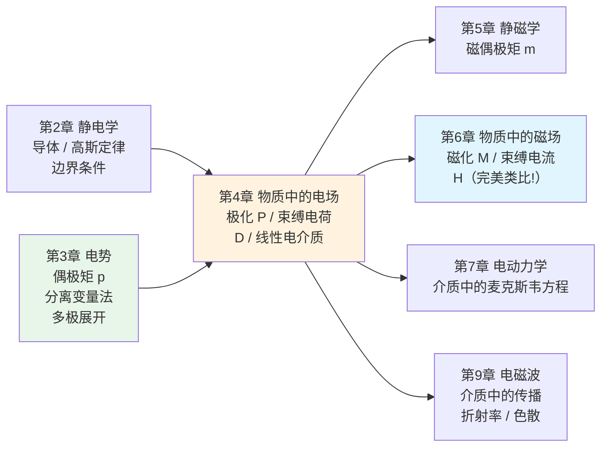
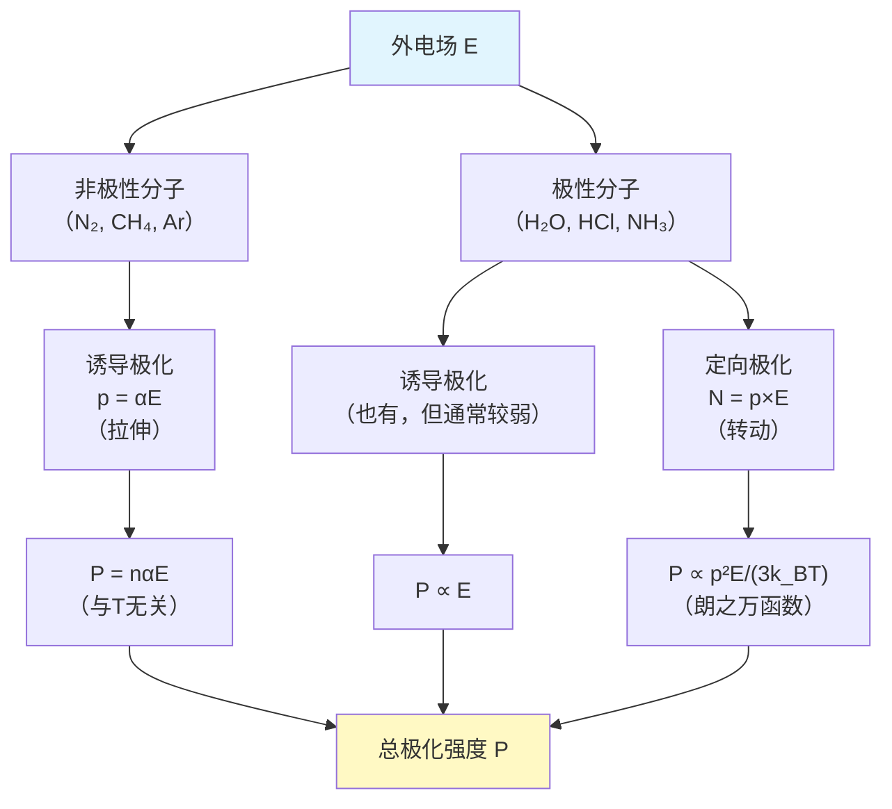
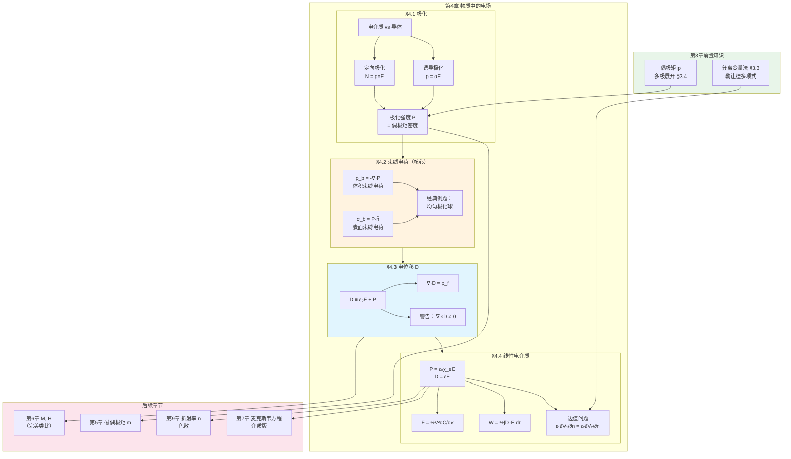

# 第4章 物质中的电场 (Electric Fields in Matter)

## 引言：从真空到物质——电磁学的"第二次革命"

在第2章和第3章中，我们一直在处理一个理想化的世界：**真空中的静电场**。所有的电荷都是"自由"的——我们知道它们的位置（或至少知道边界条件），然后用库仑定律、高斯定律或边值问题的各种技巧来求解电场。

但真实世界充满了**物质**。当你把一块塑料放进一个平行板电容器中，会发生什么？当你把一个玻璃球放入均匀电场中，电场线会如何弯曲？当你在导线外面包裹绝缘橡胶时，电场如何改变？

要回答这些问题，我们必须理解物质对电场的**响应**。

回忆第2章 §2.5，我们已经讨论过一类物质——**导体（Conductors）**：其中的自由电荷可以自由移动，直到内部电场为零。导体的响应是"彻底的"——它完全屏蔽了内部电场。

本章我们将研究另一大类物质——**电介质（Dielectrics）**，即绝缘体。它们没有自由电荷，但它们的原子和分子可以在外电场的作用下发生微小的形变或转动，产生大量微小的**电偶极子**。

这正是第3章 §3.4 偶极矩概念的直接延续和大规模应用。在第3章中，我们学会了用单极矩、偶极矩、四极矩来描述一团电荷在远处产生的势；现在，我们将看到**整块物质就是一团对齐排列的电偶极子**，而描述这种集体效应的核心量——极化强度 $\mathbf{P}$——正是"单位体积的偶极矩"。

本章的核心思想可以概括为一个三段论：

$$\text{外电场} \xrightarrow{\text{极化}} \text{束缚电荷} \xrightarrow{\text{叠加}} \text{修改后的电场}$$

这构成了一个自洽的循环：电场极化物质，极化产生束缚电荷，束缚电荷反过来改变电场。为了打破这个循环，我们将引入一个新的辅助矢量——**电位移 $\mathbf{D}$**——它只"看到"自由电荷，从而将问题简化。

**本章与前后章节的关系**：



> **致读者**：本章的结构与第6章（物质中的磁场）高度平行。在学习本章时，请有意识地建立"电/磁类比"的思维框架——极化强度 $\mathbf{P}$ 对应磁化强度 $\mathbf{M}$，束缚电荷对应束缚电流，电位移 $\mathbf{D}$ 对应辅助场 $\mathbf{H}$。这种类比将在第6章中为你节省大量的学习时间。

---

## 4.1 极化 (Polarization)

### 4.1.1 电介质

在第2章 §2.5 中，我们将物质粗略地分为两大类：

- **导体（Conductors）**：含有"无限供应"的自由电荷，可以在材料内自由移动。在外电场作用下，自由电荷重新分布，直到导体内部电场为零（静电平衡）。
- **绝缘体（Insulators）** 或 **电介质（Dielectrics）**：所有的电荷都被束缚在原子或分子上，不能自由移动。

> **名词辨析**："绝缘体"和"电介质"并不完全相同——"绝缘体"强调的是"不导电"，"电介质"强调的是"能被电场极化"。但在实践中，几乎所有的绝缘体都是电介质，反之亦然，所以我们不做严格区分。

虽然电介质中的电荷不能长距离迁移，但它们可以在外电场的作用下发生**微小的位移**：正电荷沿电场方向微移，负电荷逆电场方向微移。这种位移虽然极其微小（远小于原子尺度），但它的宏观效果是显著的——整个物质呈现出一种被称为**极化（Polarization）** 的状态。

极化的微观机制有两种，取决于物质的分子类型：

1. **非极性分子**（如 $\text{N}_2$, $\text{CH}_4$）→ 诱导偶极子（下一小节）
2. **极性分子**（如 $\text{H}_2\text{O}$, $\text{HCl}$）→ 永久偶极子的定向排列（§4.1.3）

两种机制的最终结果是相同的：**大量微小的电偶极子沿电场方向排列**。

---

### 4.1.2 诱导偶极子与原子极化率

**物理图景**：考虑一个简单的原子模型。在没有外电场时，正电荷（原子核）位于负电荷（电子云）的中心，两者完全对称，总偶极矩为零。

当施加外电场 $\mathbf{E}$ 时：
- 原子核被沿 $\mathbf{E}$ 方向拉动
- 电子云被沿 $-\mathbf{E}$ 方向拉动
- 正负电荷中心发生微小分离，产生一个**诱导偶极矩（Induced Dipole Moment）**

这个过程类似于拉伸一根弹簧：外力（电场力）试图拉开正负电荷，而原子内部的库仑引力（"弹簧"的回复力）试图将它们拉回。平衡时，诱导偶极矩正比于外电场：

$$\boxed{\mathbf{p} = \alpha \mathbf{E}}$$

其中 $\alpha$ 称为**原子极化率（Atomic Polarizability）**。

> **关键洞察**：极化率 $\alpha$ 衡量的是原子（或分子）在外电场作用下"有多容易被拉伸"。它取决于原子的内部结构——电子云越"松散"，$\alpha$ 越大。

**定量估算——粗糙但管用的模型**

让我们用一个极其简单的模型来估算 $\alpha$。假设原子由一个点状正电荷 $+q$（原子核）位于一个半径为 $a$、均匀分布的负电荷球 $-q$（电子云）的中心。

当外电场 $\mathbf{E}$ 导致原子核从中心偏移距离 $d$ 时（回忆第2章习题2.13，或例题2.12），电子云对核的回复电场为：

$$E_{\text{回复}} = \frac{1}{4\pi\varepsilon_0}\frac{qd}{a^3}$$

（这是均匀带电球体内部 $r = d$ 处的电场，方向从中心指向核。）

平衡条件：$qE = \frac{1}{4\pi\varepsilon_0}\frac{q^2 d}{a^3}$，即 $E = \frac{qd}{4\pi\varepsilon_0 a^3}$。

因此偶极矩 $p = qd = (4\pi\varepsilon_0 a^3) E$，得到：

$$\boxed{\alpha = 4\pi\varepsilon_0 a^3 = 3\varepsilon_0 v}$$

其中 $v = \frac{4}{3}\pi a^3$ 是原子的体积。

> **物理检验**：这个结果虽然粗糙（实际值与此相差2-4倍），但它捕捉了正确的量级和定性规律——**原子越大，极化率越大**。这是合理的：更大的电子云意味着更"松散"的束缚，更容易被拉伸。

**实验数据**

下表列出了一些原子的极化率（单位：$\alpha/4\pi\varepsilon_0$，以 $10^{-30}\,\text{m}^3$ 为单位）：

| H | He | Li | Be | C | Ne | Na | Ar | K | Cs |
|---|---|---|---|---|---|---|---|---|---|
| 0.667 | 0.205 | 24.3 | 5.60 | 1.67 | 0.396 | 24.1 | 1.64 | 43.4 | 59.4 |

注意规律：碱金属（Li, Na, K, Cs）的极化率远大于惰性气体（He, Ne, Ar），这是因为碱金属的最外层电子只有一个，束缚较弱。Cs 的极化率最大，因为它的原子半径最大。

**分子极化率：各向异性**

对于分子，情况更为复杂。由于分子的几何结构不是球对称的，沿不同方向施加电场，极化的程度可能不同。例如，CO$_2$ 分子沿轴向的极化率大于垂直方向。

一般地，对于各向异性的分子，$\mathbf{p} = \alpha\mathbf{E}$ 需要推广为张量形式（回忆第1章 §1.7 的张量语言）：

$$p_i = \sum_j \alpha_{ij} E_j$$

其中 $\alpha_{ij}$ 是一个 $3\times 3$ 的**极化率张量（Polarizability Tensor）**。在分子的主轴坐标系中，这个张量是对角的：

$$\alpha_{ij} = \begin{pmatrix} \alpha_1 & 0 & 0 \\ 0 & \alpha_2 & 0 \\ 0 & 0 & \alpha_3 \end{pmatrix}$$

对于大量随机取向的分子，平均效果等价于使用**各向同性的平均极化率** $\bar{\alpha} = \frac{1}{3}(\alpha_1 + \alpha_2 + \alpha_3)$。

---

**例题 4.1**：原子极化的数量级估算

一个氢原子（玻尔半径 $a_0 = 0.529 \times 10^{-10}\,\text{m}$）被置于两块相距 $d = 1\,\text{mm}$ 的平行金属板之间，板间电压为 $V = 500\,\text{V}$。

(a) 估算正负电荷中心的分离距离 $\delta$。
(b) 电离氢原子大约需要多大的电压？

**解**：

(a) 板间电场 $E = V/d = 500/10^{-3} = 5 \times 10^5 \,\text{V/m}$。

由 $p = \alpha E$ 和 $p = e\delta$（$e$ 为电子电荷），得 $\delta = \alpha E / e$。

由表可知氢原子 $\alpha/4\pi\varepsilon_0 = 0.667 \times 10^{-30}\,\text{m}^3$，故 $\alpha = 4\pi\varepsilon_0 \times 0.667 \times 10^{-30} = 7.42 \times 10^{-41}\,\text{C}^2\text{s}^2/(\text{kg}\cdot\text{m}^3)$。

$$\delta = \frac{\alpha E}{e} = \frac{7.42 \times 10^{-41} \times 5 \times 10^5}{1.6 \times 10^{-19}} \approx 2.3 \times 10^{-16}\,\text{m}$$

这仅为玻尔半径的 $\delta/a_0 \approx 4.4 \times 10^{-6}$，即百万分之四！极化导致的位移极其微小，远在亚原子尺度。

(b) 电离意味着 $\delta \sim a_0$，即 $E_{\text{ion}} \sim e a_0 / \alpha \approx \frac{1.6\times 10^{-19}\times 5.29\times 10^{-11}}{7.42\times 10^{-41}} \approx 1.1 \times 10^{11}\,\text{V/m}$。

对应电压 $V_{\text{ion}} = E_{\text{ion}} \times d \approx 1.1 \times 10^{11} \times 10^{-3} \approx 10^8\,\text{V}$，即约 $10^8$ 伏特！

> **教训**：普通实验室电场对原子的极化是极其微弱的。但当 $10^{23}$ 个原子同时被极化时，其宏观累积效应是显著的——这正是电介质物理的核心。

---

### 4.1.3 极性分子的定向排列

有些分子——即使在没有外电场时——就已经具有永久的偶极矩。这类分子称为**极性分子（Polar Molecules）**。

最典型的例子是水分子 $\text{H}_2\text{O}$。由于氧原子的电负性远大于氢原子，共享电子更靠近氧端，导致氧端带负电、氢端带正电，形成永久偶极矩 $p \approx 6.1 \times 10^{-30}\,\text{C}\cdot\text{m}$。水分子的键角约为 $105°$，这种V形结构使得两个O-H键的偶极矩不会相互抵消。

> **对比**：CO$_2$ 虽然也是由极性键组成，但由于其线性对称结构（O=C=O），两个键的偶极矩恰好抵消，总偶极矩为零——它是**非极性分子**。

**外电场对极性分子的作用**

当极性分子被置于外电场 $\mathbf{E}$ 中时，电场会对它施加一个**转矩（Torque）**，试图使偶极矩转向电场方向。

推导：设偶极子由 $+q$ 和 $-q$ 两个点电荷组成，间距为 $\mathbf{d}$（从 $-q$ 指向 $+q$），偶极矩 $\mathbf{p} = q\mathbf{d}$。

在均匀电场 $\mathbf{E}$ 中：
- $+q$ 受力 $\mathbf{F}_+ = q\mathbf{E}$
- $-q$ 受力 $\mathbf{F}_- = -q\mathbf{E}$
- 合力 $\mathbf{F} = \mathbf{F}_+ + \mathbf{F}_- = 0$（均匀场中偶极子不受净力）

但这两个力形成一个**力偶**，产生转矩：

$$\mathbf{N} = \mathbf{r}_+ \times \mathbf{F}_+ + \mathbf{r}_- \times \mathbf{F}_- = \mathbf{d} \times q\mathbf{E}$$

$$\boxed{\mathbf{N} = \mathbf{p} \times \mathbf{E}}$$

转矩的方向使 $\mathbf{p}$ 趋向于与 $\mathbf{E}$ 对齐。这就像指南针在磁场中转动一样——极性分子在电场中会"摆动"到与电场平行的方向。

**偶极子在电场中的能量**

将偶极子从与电场垂直的位置（$\theta = 90°$）转到角度 $\theta$ 所需的功为：

$$W = \int_{90°}^{\theta} N\, d\theta' = \int_{90°}^{\theta} pE\sin\theta'\, d\theta' = -pE\cos\theta$$

定义偶极子在电场中的**势能**：

$$\boxed{U = -\mathbf{p} \cdot \mathbf{E}}$$

稳定平衡位置为 $\mathbf{p} \parallel \mathbf{E}$（$\theta = 0$，$U = -pE$，能量最低）；不稳定平衡为 $\mathbf{p}$ 反平行于 $\mathbf{E}$（$\theta = \pi$，$U = +pE$，能量最高）。

**非均匀场中的力**

如果电场不均匀（$\mathbf{E}$ 随位置变化），$+q$ 处的电场与 $-q$ 处的电场不完全相同，合力不再为零。对于理想偶极子（$d \to 0$, $q \to \infty$, $p = qd$ 固定），净力为：

$$\boxed{\mathbf{F} = \nabla(\mathbf{p} \cdot \mathbf{E})}$$

> **物理意义**：偶极子被吸引向电场**增强**的方向。这就是为什么碎纸片会被带电梳子吸引——梳子的电场在近处较强，碎纸片中的诱导偶极子被拉向梳子。

---

**例题 4.2**：极性分子在电场中的行为

一个水分子（$p = 6.1 \times 10^{-30}\,\text{C}\cdot\text{m}$）被置于大小为 $E = 10^5\,\text{V/m}$ 的均匀电场中。

(a) 当 $\mathbf{p}$ 与 $\mathbf{E}$ 成 $90°$ 角时，转矩的大小是多少？
(b) 将分子从 $\theta = 90°$ 转到与电场平行的位置，释放的能量是多少？
(c) 在室温 $T = 300\,\text{K}$ 下，比较 $pE$ 与热能 $k_BT$。这说明什么？

**解**：

(a) $N = pE\sin 90° = 6.1 \times 10^{-30} \times 10^5 = 6.1 \times 10^{-25}\,\text{N}\cdot\text{m}$。

(b) $\Delta U = U(0°) - U(90°) = -pE - 0 = -6.1 \times 10^{-25}\,\text{J}$（释放能量）。

(c) $k_BT = 1.38 \times 10^{-23} \times 300 = 4.14 \times 10^{-21}\,\text{J}$。

$$\frac{pE}{k_BT} = \frac{6.1 \times 10^{-25}}{4.14 \times 10^{-21}} \approx 1.5 \times 10^{-4}$$

> **物理结论**：在普通电场强度下，$pE \ll k_BT$——热运动的能量远大于电场对偶极子的取向能。这意味着**热涨落会严重干扰偶极子的对齐**，极化效果很弱。只有在极低温或极强电场下，极性分子才能显著地排列。这就是为什么水的介电常数（$\varepsilon_r \approx 80$）在温度升高时会降低。

---

**例题 4.3**：偶极子在非均匀场中的力

一个中性原子（极化率 $\alpha$）被置于点电荷 $Q$ 的电场中，距离为 $r$。求原子所受的力。

**解**：

点电荷的电场为 $\mathbf{E} = \frac{Q}{4\pi\varepsilon_0 r^2}\hat{\mathbf{r}}$。

原子被极化，产生诱导偶极矩 $\mathbf{p} = \alpha\mathbf{E} = \frac{\alpha Q}{4\pi\varepsilon_0 r^2}\hat{\mathbf{r}}$。

偶极子在非均匀场中的力：$\mathbf{F} = \nabla(\mathbf{p}\cdot\mathbf{E})$。

由于 $\mathbf{p} \parallel \mathbf{E}$（径向方向），有：

$$\mathbf{p}\cdot\mathbf{E} = \alpha E^2 = \alpha\left(\frac{Q}{4\pi\varepsilon_0}\right)^2 \frac{1}{r^4}$$

因此：

$$\mathbf{F} = \nabla\left[\alpha\left(\frac{Q}{4\pi\varepsilon_0}\right)^2 \frac{1}{r^4}\right] = -\frac{4\alpha}{4\pi\varepsilon_0}\left(\frac{Q}{4\pi\varepsilon_0}\right) \frac{Q}{r^5}\hat{\mathbf{r}}$$

$$\boxed{F = -\frac{\alpha Q^2}{8\pi^2\varepsilon_0^2 r^5}}$$

> **注意**：(1) 力为**吸引力**（负号，指向 $Q$），无论 $Q$ 的符号如何。这是因为诱导偶极矩的方向总是使较近的端带异号电荷。(2) 力正比于 $1/r^5$——比库仑力（$1/r^2$）衰减快得多。(3) 力正比于 $\alpha$——极化率越大，力越大。

---

### 4.1.4 极化强度矢量 $\mathbf{P}$

不论极化的微观机制是诱导极化（非极性分子）还是定向极化（极性分子），宏观结果都是相同的：**大量微小的偶极子大致沿电场方向排列**。

为了描述这种集体效应，我们定义**极化强度（Polarization）** 矢量：

$$\boxed{\mathbf{P} \equiv \frac{\text{单位体积内的总偶极矩}}{\text{体积}} = n\langle\mathbf{p}\rangle}$$

其中 $n$ 是分子数密度（单位体积内的分子数），$\langle\mathbf{p}\rangle$ 是每个分子偶极矩的平均值。$\mathbf{P}$ 的单位是 $\text{C/m}^2$（电荷/面积，与面电荷密度相同的量纲——这不是巧合，见§4.2）。

> **与第3章的联系**：在第3章 §3.4 中，我们学到了一个任意电荷分布的电势可以展开为 $V = V_{\text{mon}} + V_{\text{dip}} + V_{\text{quad}} + \cdots$，其中偶极项 $V_{\text{dip}} = \frac{1}{4\pi\varepsilon_0}\frac{\mathbf{p}\cdot\hat{\mathbf{r}}}{r^2}$ 取决于总偶极矩 $\mathbf{p} = \int \mathbf{r}'\rho(\mathbf{r}')\,d\tau'$。现在，$\mathbf{P}$ 就是偶极矩的**空间密度**——一小块体积 $d\tau$ 贡献的偶极矩为 $d\mathbf{p} = \mathbf{P}\,d\tau$，总偶极矩为 $\mathbf{p} = \int \mathbf{P}\,d\tau$。

**极化的两种极端情况**：



对于非极性分子，$\mathbf{P} = n\alpha\mathbf{E}$（与温度无关）。

对于极性分子，定向极化受热运动竞争，经统计力学处理（朗之万函数），在 $pE \ll k_BT$ 的通常情况下，$\langle p_{\parallel}\rangle \approx p^2E/(3k_BT)$，故极化强度：

$$\mathbf{P} \approx \frac{np^2}{3k_BT}\mathbf{E}$$

无论哪种机制，在通常条件下（电场不太强），**$\mathbf{P}$ 正比于 $\mathbf{E}$**。这个正比关系是§4.4中"线性电介质"理论的实验基础。

---

## 4.2 极化物体的电场 (The Field of a Polarized Object)

### 4.2.1 束缚电荷的推导

现在我们面临本章的**核心问题**：一块极化的物质产生什么样的电场？

从微观角度看，极化物体是大量微小偶极子的集合。每个偶极子都产生一个偶极场（回忆第3章 §3.4.4），总电场就是所有偶极子电场的叠加。但如果我们直接对 $10^{23}$ 个偶极子求和，那是不现实的。

幸运的是，有一种更巧妙的方法。**关键思想**：先计算极化物体产生的**电势**，然后对其进行巧妙的数学变换，将它化为等效电荷分布产生的势——这些等效电荷就是"束缚电荷"。

**推导过程**

第3章 §3.4.2 告诉我们，一个位于 $\mathbf{r}'$ 处、偶极矩为 $\mathbf{p}$ 的偶极子在 $\mathbf{r}$ 处产生的电势为：

$$V_{\text{dip}}(\mathbf{r}) = \frac{1}{4\pi\varepsilon_0}\frac{\mathbf{p}\cdot\hat{\boldsymbol{\mathscr{r}}}}{\mathscr{r}^2}$$

其中 $\boldsymbol{\mathscr{r}} = \mathbf{r} - \mathbf{r}'$ 是从偶极子位置到场点的分离矢量。

一小块极化物质 $d\tau'$ 贡献的偶极矩为 $d\mathbf{p} = \mathbf{P}(\mathbf{r}')\,d\tau'$，对整个物体积分：

$$V(\mathbf{r}) = \frac{1}{4\pi\varepsilon_0}\int_{\mathcal{V}} \frac{\mathbf{P}(\mathbf{r}')\cdot\hat{\boldsymbol{\mathscr{r}}}}{\mathscr{r}^2}\,d\tau' \tag{4.1}$$

现在运用第1章 §1.2 中的一个关键恒等式（回忆习题1.13）：

$$\nabla'\left(\frac{1}{\mathscr{r}}\right) = \frac{\hat{\boldsymbol{\mathscr{r}}}}{\mathscr{r}^2}$$

> **注意**：这里 $\nabla'$ 是对**源坐标** $\mathbf{r}'$ 求梯度，不是对场点 $\mathbf{r}$ 求梯度。

代入 (4.1)：

$$V = \frac{1}{4\pi\varepsilon_0}\int_{\mathcal{V}} \mathbf{P}\cdot\nabla'\left(\frac{1}{\mathscr{r}}\right)d\tau'$$

利用矢量恒等式（乘积法则）：

$$\nabla'\cdot\left(\frac{\mathbf{P}}{\mathscr{r}}\right) = \frac{1}{\mathscr{r}}(\nabla'\cdot\mathbf{P}) + \mathbf{P}\cdot\nabla'\left(\frac{1}{\mathscr{r}}\right)$$

因此：

$$\mathbf{P}\cdot\nabla'\left(\frac{1}{\mathscr{r}}\right) = \nabla'\cdot\left(\frac{\mathbf{P}}{\mathscr{r}}\right) - \frac{1}{\mathscr{r}}(\nabla'\cdot\mathbf{P})$$

代回积分：

$$V = \frac{1}{4\pi\varepsilon_0}\left[\int_{\mathcal{V}} \nabla'\cdot\left(\frac{\mathbf{P}}{\mathscr{r}}\right)d\tau' - \int_{\mathcal{V}} \frac{\nabla'\cdot\mathbf{P}}{\mathscr{r}}\,d\tau'\right]$$

对第一个积分使用散度定理（$\int_{\mathcal{V}}\nabla'\cdot\mathbf{F}\,d\tau' = \oint_{\mathcal{S}}\mathbf{F}\cdot d\mathbf{a}'$）：

$$V(\mathbf{r}) = \frac{1}{4\pi\varepsilon_0}\oint_{\mathcal{S}} \frac{\mathbf{P}\cdot\hat{\mathbf{n}}'}{\mathscr{r}}\,da' + \frac{1}{4\pi\varepsilon_0}\int_{\mathcal{V}} \frac{(-\nabla'\cdot\mathbf{P})}{\mathscr{r}}\,d\tau'$$

仔细审视这个结果。第一项是**面电荷密度**产生的电势（形如 $\frac{1}{4\pi\varepsilon_0}\oint\frac{\sigma}{r}da$），第二项是**体电荷密度**产生的电势（形如 $\frac{1}{4\pi\varepsilon_0}\int\frac{\rho}{r}d\tau$）。因此我们定义：

$$\boxed{\sigma_b \equiv \mathbf{P}\cdot\hat{\mathbf{n}}} \qquad \text{（表面束缚电荷密度）}$$

$$\boxed{\rho_b \equiv -\nabla\cdot\mathbf{P}} \qquad \text{（体积束缚电荷密度）}$$

这就是本章的核心结论：

> **极化物体的电场，等价于体内分布着体电荷密度 $\rho_b = -\nabla\cdot\mathbf{P}$、表面分布着面电荷密度 $\sigma_b = \mathbf{P}\cdot\hat{\mathbf{n}}$ 所产生的电场。**

这些电荷被称为**束缚电荷（Bound Charges）**，因为它们不能自由移动——它们是极化效应的宏观等效表述。

---

### 4.2.2 束缚电荷的物理图像

数学推导虽然严密，但我们必须理解束缚电荷的**物理起源**。

**体积束缚电荷 $\rho_b = -\nabla\cdot\mathbf{P}$**

想象一排排首尾相连的偶极子：每个偶极子的正端与邻居的负端紧贴在一起，正负电荷相互抵消。如果极化是**均匀的**（$\mathbf{P}$ 处处相同），那么每个正电荷都恰好被邻居的负电荷抵消——**体内没有净电荷**，$\rho_b = -\nabla\cdot\mathbf{P} = 0$。

但如果极化是**不均匀的**（$\mathbf{P}$ 随位置变化），抵消就不完全了。在 $\mathbf{P}$ **发散**（$\nabla\cdot\mathbf{P} > 0$）的地方，正电荷被"推走"的多、"推来"的少，留下净负电荷——这就是 $\rho_b = -\nabla\cdot\mathbf{P} < 0$。

> **类比**：就像一排人手拉手，如果人群均匀分布则到处密度相同；但如果人群向外扩散（$\nabla\cdot\mathbf{P} > 0$），中心就会"变空"（负电荷积累）。

**表面束缚电荷 $\sigma_b = \mathbf{P}\cdot\hat{\mathbf{n}}$**

在极化物体的**表面**，偶极子链被截断了——最后一个偶极子的正端（或负端）没有邻居来抵消，暴露出净电荷。如果 $\mathbf{P}$ 指向外法线方向（$\mathbf{P}\cdot\hat{\mathbf{n}} > 0$），正端朝外，表面呈正电荷；如果 $\mathbf{P}$ 反平行于 $\hat{\mathbf{n}}$，负端朝外，表面呈负电荷。

> **直觉图像**：均匀极化的物体就像一块被均匀拉伸的"弹簧垫"——内部到处正负抵消，只有两端露出相反的电荷。这完全类似于平行板电容器！

**总束缚电荷为零**

一个重要的一致性检验：极化不会凭空创造电荷。总束缚电荷应该为零：

$$Q_b = \oint_{\mathcal{S}} \sigma_b\,da + \int_{\mathcal{V}} \rho_b\,d\tau = \oint_{\mathcal{S}} \mathbf{P}\cdot\hat{\mathbf{n}}\,da + \int_{\mathcal{V}}(-\nabla\cdot\mathbf{P})\,d\tau$$

由散度定理，$\oint_{\mathcal{S}} \mathbf{P}\cdot d\mathbf{a} = \int_{\mathcal{V}}\nabla\cdot\mathbf{P}\,d\tau$，因此：

$$Q_b = \int_{\mathcal{V}}\nabla\cdot\mathbf{P}\,d\tau - \int_{\mathcal{V}}\nabla\cdot\mathbf{P}\,d\tau = 0 \quad \checkmark$$

> **这正如预期**：极化只是将已有的电荷重新分布（正电荷向一端移动、负电荷向另一端移动），而不是产生新的电荷。

---

**例题 4.4**：均匀极化球

一个半径为 $R$ 的球体，具有均匀的极化强度 $\mathbf{P} = P\hat{\mathbf{z}}$。求球内外的电场。

**解**：

这是电介质理论中最经典的例题。选取 $z$ 轴沿 $\mathbf{P}$ 方向。

**第一步：求束缚电荷。**

体积束缚电荷：$\rho_b = -\nabla\cdot\mathbf{P} = 0$（因为 $\mathbf{P}$ 是常矢量）。

表面束缚电荷：$\sigma_b = \mathbf{P}\cdot\hat{\mathbf{n}} = P\hat{\mathbf{z}}\cdot\hat{\mathbf{r}} = P\cos\theta$。

> **物理图像**：球体内部没有净电荷积累（极化均匀），但球面上出现了 $\sigma_b = P\cos\theta$ 的面电荷分布——北极（$\theta = 0$）为正、南极（$\theta = \pi$）为负，就像地球的"正负极"。

**第二步：求电场。**

这个面电荷分布 $\sigma_b = P\cos\theta$ 有一个巧妙的解法——它等价于两个略微错开的、均匀带电球体的叠加（回忆第2章习题2.19）。

设想一个均匀正电荷球（电荷密度 $+\rho_0$，中心在 $+\mathbf{d}/2$）和一个均匀负电荷球（电荷密度 $-\rho_0$，中心在 $-\mathbf{d}/2$）重叠。当 $d \to 0$, $\rho_0 \to \infty$ 而 $\rho_0 \mathbf{d} = \mathbf{P}$ 保持有限时，重叠区域的电荷密度恰好为零，而表面上出现的等效面电荷密度正是 $P\cos\theta$。

由第2章习题2.19的结论，两个重叠球在重叠区内的电场为：

$$\mathbf{E}_{\text{in}} = -\frac{\rho_0 \mathbf{d}}{3\varepsilon_0} = -\frac{\mathbf{P}}{3\varepsilon_0}$$

因此球内电场为**均匀场**：

$$\boxed{\mathbf{E}_{\text{in}} = -\frac{\mathbf{P}}{3\varepsilon_0} = -\frac{P}{3\varepsilon_0}\hat{\mathbf{z}}}$$

> **注意**：球内电场与极化方向**相反**！这称为**退极化场（Depolarization Field）**——极化自身产生的电场会削弱导致极化的原始外电场。退极化因子取决于物体的几何形状：对于球体是 $1/3$，对于无限长圆柱（垂直于轴）是 $1/2$，对于无限大平板（垂直于法线）是 $1$。

球外的电场等价于一个位于球心的**纯偶极子**的场，总偶极矩为：

$$\mathbf{p}_{\text{total}} = \frac{4}{3}\pi R^3 \mathbf{P}$$

$$\boxed{\mathbf{E}_{\text{out}} = \frac{1}{4\pi\varepsilon_0}\frac{1}{r^3}\left[3(\mathbf{p}\cdot\hat{\mathbf{r}})\hat{\mathbf{r}} - \mathbf{p}\right] = \frac{P R^3}{3\varepsilon_0 r^3}(2\cos\theta\,\hat{\mathbf{r}} + \sin\theta\,\hat{\boldsymbol{\theta}})}$$

**极限验证**：
- 当 $r = R$ 时，$E_{r,\text{out}} = \frac{2P\cos\theta}{3\varepsilon_0}$，$E_{\theta,\text{out}} = \frac{P\sin\theta}{3\varepsilon_0}$。球内 $E_r = -P\cos\theta/(3\varepsilon_0)$，$E_\theta = P\sin\theta/(3\varepsilon_0)$。切向分量在 $r = R$ 处连续（$\checkmark$），法向分量有跃变 $\Delta E_r = P\cos\theta/\varepsilon_0 = \sigma_b/\varepsilon_0$（$\checkmark$，第2章边界条件）。

---

**例题 4.5**：非均匀极化球

一个半径为 $R$ 的球体，极化强度 $\mathbf{P}(\mathbf{r}) = k\mathbf{r}$（$k$ 为常数，$\mathbf{r}$ 是从球心出发的位矢）。

(a) 求束缚电荷 $\sigma_b$ 和 $\rho_b$。
(b) 求球内外的电场。

**解**：

(a) 体积束缚电荷：

$$\rho_b = -\nabla\cdot\mathbf{P} = -\nabla\cdot(k\mathbf{r}) = -k\nabla\cdot\mathbf{r} = -3k$$

（利用 $\nabla\cdot\mathbf{r} = 3$。）

表面束缚电荷：

$$\sigma_b = \mathbf{P}\cdot\hat{\mathbf{n}}\big|_{r=R} = kR\hat{\mathbf{r}}\cdot\hat{\mathbf{r}} = kR$$

一致性检验：$Q_b = \sigma_b \cdot 4\pi R^2 + \rho_b \cdot \frac{4}{3}\pi R^3 = 4\pi R^2(kR) + \frac{4}{3}\pi R^3(-3k) = 4\pi kR^3 - 4\pi kR^3 = 0$。$\checkmark$

(b) 利用高斯定律（由于对称性，$\mathbf{E}$ 为径向且只依赖于 $r$）：

**球内**（$r < R$）：高斯面内的束缚电荷为 $Q_{\text{enc}} = \rho_b \cdot \frac{4}{3}\pi r^3 = -3k\cdot\frac{4}{3}\pi r^3 = -4\pi kr^3$。

$$\varepsilon_0 E(4\pi r^2) = -4\pi kr^3 \implies \boxed{E_{\text{in}} = -\frac{kr}{\varepsilon_0}\hat{\mathbf{r}}}$$

**球外**（$r > R$）：高斯面内包含全部束缚电荷 $Q_b = 0$，所以：

$$\boxed{\mathbf{E}_{\text{out}} = 0}$$

> **有趣的结果**：尽管球内有均匀的负束缚体电荷和表面的正束缚面电荷，但它们恰好完全抵消，使得球外电场为零！球内的电场径向向内，大小正比于 $r$。

---

**例题 4.6**：均匀极化圆柱体

一个半径为 $a$、长度为 $L$ 的圆柱体，具有均匀极化强度 $\mathbf{P} = P\hat{\mathbf{z}}$（沿轴向）。定性分析束缚电荷分布和电场线形状。

**解**：

体积束缚电荷：$\rho_b = -\nabla\cdot\mathbf{P} = 0$。

表面束缚电荷：
- 顶面（$\hat{\mathbf{n}} = +\hat{\mathbf{z}}$）：$\sigma_b = P\hat{\mathbf{z}}\cdot\hat{\mathbf{z}} = +P$
- 底面（$\hat{\mathbf{n}} = -\hat{\mathbf{z}}$）：$\sigma_b = P\hat{\mathbf{z}}\cdot(-\hat{\mathbf{z}}) = -P$
- 侧面（$\hat{\mathbf{n}} = \hat{\mathbf{s}}$）：$\sigma_b = P\hat{\mathbf{z}}\cdot\hat{\mathbf{s}} = 0$

因此，均匀极化圆柱体等价于上下两个圆盘面电荷：上正下负。

定性行为取决于长径比 $L/a$：
- $L \gg a$（长棒/bar electret）：类似于螺线管（只不过是电场而非磁场），内部电场近似均匀、沿 $-\hat{\mathbf{z}}$ 方向（退极化场），外部类似偶极子场。
- $L \ll a$（薄圆盘）：类似于平行板电容器，两板之间电场近似 $\mathbf{E} \approx -P/\varepsilon_0\,\hat{\mathbf{z}}$（退极化因子接近1）。
- $L \approx a$：中间情况，电场线形状较复杂。

> **与第5章的预告**：这种"bar electret"（极化棒）在电学中的地位，完全类似于第5章中永磁铁（磁化棒）在磁学中的地位。极化棒两端的束缚面电荷 $\pm P$ 类比于磁化棒两端的"磁荷"$\pm M$（尽管磁荷并不真实存在——这将在第6章详细讨论）。

---

### 4.2.3 微观场与宏观场

到目前为止，我们一直在默认地做一件大胆的事：将极化物体看作连续的偶极子分布，然后用积分来计算电势。但如果你仔细想想，在物体**内部**，这种做法是可疑的。

在物质外部，场点距离所有偶极子都很远（$\mathscr{r}$ 远大于分子间距），偶极子近似完全合法。但在物质**内部**，你就坐在偶极子中间——距离某些偶极子极近，偶极子近似（$V \approx \frac{\mathbf{p}\cdot\hat{\mathbf{r}}}{4\pi\varepsilon_0 r^2}$）根本不成立！

**解决方案**：宏观平均。

真实的微观电场在原子尺度上是剧烈涨落的——在原子核处电场极强，在电子云中方向反转，从一个原子到下一个原子完全不同。我们实际测量和关心的**宏观电场**是对这些微观涨落进行**空间平均**的结果。

Griffiths 给出了一个精致的论证：在物质内部任取一点 $\mathbf{r}$，画一个小球面（半径 $R$，远大于分子间距但远小于宏观尺度）。可以将总电势分解为：

- $V_{\text{out}}$：球外偶极子的贡献（这些偶极子距离 $\mathbf{r}$ 足够远，偶极子近似成立）
- $V_{\text{in}}$：球内偶极子的贡献（需要更仔细的处理）

利用第3章习题3.51d的结果：**球外电荷在球内的平均场等于它们在球心处的场**。而第3章公式(3.105)告诉我们：**球内均匀极化对球心的平均场**为 $\mathbf{E}_{\text{avg}} = -\frac{\mathbf{P}}{3\varepsilon_0}$。

两者结合，结果是：将极化物质连续化处理后用公式 (4.1) 计算得到的电场，恰好就是真实微观场的**宏观平均值**。

$$\mathbf{E}_{\text{宏观}} = \langle\mathbf{E}_{\text{微观}}\rangle_{\text{空间平均}}$$

> **这是一个非平凡但令人安心的结果**：我们的连续化处理（用 $\mathbf{P}$ 描述极化、用 $\rho_b$ 和 $\sigma_b$ 计算电场）虽然看似粗暴，但得到的恰好是物理上有意义的宏观场。从此以后，我们可以安心地使用束缚电荷公式来计算物质内部的电场。

---

## 4.3 电位移矢量 $\mathbf{D}$ (The Electric Displacement)

### 4.3.1 介质中的高斯定律

在§4.2中，我们发现极化效应产生了束缚电荷 $\rho_b$ 和 $\sigma_b$。这些束缚电荷产生的电场，与自由电荷产生的电场叠加在一起，构成了总电场 $\mathbf{E}$。

高斯定律（第2章 §2.2.2）在任何情况下都成立：

$$\varepsilon_0\nabla\cdot\mathbf{E} = \rho_{\text{total}} = \rho_f + \rho_b$$

其中 $\rho_f$ 是**自由电荷密度**（由我们主动放置的、可以控制的电荷），$\rho_b = -\nabla\cdot\mathbf{P}$ 是束缚电荷密度。代入：

$$\varepsilon_0\nabla\cdot\mathbf{E} = \rho_f - \nabla\cdot\mathbf{P}$$

$$\nabla\cdot(\varepsilon_0\mathbf{E} + \mathbf{P}) = \rho_f$$

这启发我们定义一个新的矢量：

$$\boxed{\mathbf{D} \equiv \varepsilon_0\mathbf{E} + \mathbf{P}}$$

称为**电位移矢量（Electric Displacement）**。于是介质中的高斯定律化为极其简洁的形式：

$$\boxed{\nabla\cdot\mathbf{D} = \rho_f} \qquad \text{或积分形式} \qquad \boxed{\oint \mathbf{D}\cdot d\mathbf{a} = Q_{f,\text{enc}}}$$

> **这是一个巨大的简化**：$\mathbf{D}$ 的散度只依赖于**自由电荷**！你不需要知道束缚电荷的分布就能直接使用这个方程。对于具有足够对称性的问题，我们可以像用 $\mathbf{E}$ 的高斯定律一样，用 $\mathbf{D}$ 的高斯定律来直接求解。

---

**例题 4.7**：$\mathbf{D}$ 的高斯定律应用

一根均匀线电荷（线电荷密度 $\lambda$）被包裹在一层橡胶绝缘体中（外径 $a$）。求电位移 $\mathbf{D}$。

**解**：

由于无限长圆柱对称性，$\mathbf{D}$ 只有径向分量且只依赖于 $s$（到轴线的距离）。取一个同轴圆柱面（半径 $s$，长度 $L$）作为高斯面：

$$D(2\pi s L) = \lambda L$$

$$\boxed{\mathbf{D} = \frac{\lambda}{2\pi s}\hat{\mathbf{s}}}$$

注意这个结果在绝缘体内部（$s < a$）和外部（$s > a$）都适用！

在绝缘体外部（$s > a$），$\mathbf{P} = 0$，所以 $\mathbf{E} = \frac{1}{\varepsilon_0}\mathbf{D} = \frac{\lambda}{2\pi\varepsilon_0 s}\hat{\mathbf{s}}$——这正是真空中线电荷的电场（$\checkmark$）。

在绝缘体内部（$s < a$），如果不知道 $\mathbf{P}$ 的具体形式，我们只能给出 $\mathbf{D}$，**无法确定 $\mathbf{E}$**。

> **教训**：$\mathbf{D}$ 的高斯定律虽然简洁，但从 $\mathbf{D}$ 到 $\mathbf{E}$ 还需要知道 $\mathbf{P}$——即需要知道物质的本构关系（如 $\mathbf{P} = \varepsilon_0\chi_e\mathbf{E}$），见§4.4。

---

### 4.3.2 $\mathbf{D}$ 的边界条件

在两种不同介质的界面上，$\mathbf{D}$ 的法向分量和切向分量分别满足什么边界条件？

**法向分量**：取一个跨越界面的高斯"饼盒"（pill box），高度趋于零：

$$\oint \mathbf{D}\cdot d\mathbf{a} = Q_{f,\text{enc}} = \sigma_f \cdot A$$

$$D_{1\perp} - D_{2\perp} = \sigma_f$$

其中 $\sigma_f$ 是界面上的**自由面电荷密度**。

$$\boxed{D_{1}^{\perp} - D_{2}^{\perp} = \sigma_f}$$

**切向分量**：$\mathbf{D}$ 的切向分量**不一定连续**。由于 $\nabla\times\mathbf{E} = 0$（静电场无旋），取一个跨越界面的环路：

$$E_{1}^{\parallel} = E_{2}^{\parallel}$$

但这并不意味着 $D_1^{\parallel} = D_2^{\parallel}$，因为 $\mathbf{D} = \varepsilon_0\mathbf{E} + \mathbf{P}$，而 $\mathbf{P}$ 在界面两侧通常不同：

$$D_1^{\parallel} - D_2^{\parallel} = P_1^{\parallel} - P_2^{\parallel}$$

> **与 $\mathbf{E}$ 的边界条件对比**（回忆第2章 §2.3.5）：
>
> | 量 | 法向跃变 | 切向跃变 |
> |---|---|---|
> | $\mathbf{E}$ | $\Delta E_\perp = \sigma_{\text{total}}/\varepsilon_0$ | $\Delta E_\parallel = 0$ |
> | $\mathbf{D}$ | $\Delta D_\perp = \sigma_f$ | $\Delta D_\parallel = \Delta P_\parallel$（一般不为零） |

---

### 4.3.3 关于 $\mathbf{D}$ 的警告——它不是一个"真正的场"

$\mathbf{D}$ 看起来很方便，但必须认清它的局限性。**$\mathbf{D}$ 并不是一个基本的物理场——它是一个数学辅助量**。以下是三条重要的警告：

**警告1：$\mathbf{D}$ 的旋度不一定为零**

$$\nabla\times\mathbf{D} = \varepsilon_0(\nabla\times\mathbf{E}) + \nabla\times\mathbf{P} = 0 + \nabla\times\mathbf{P} = \nabla\times\mathbf{P}$$

而 $\nabla\times\mathbf{P}$ 一般不为零！因此 $\mathbf{D}$ 不是一个保守场，不能定义"$\mathbf{D}$-势"。

> **回忆亥姆霍兹定理**（第1章 §1.6）：一个矢量场由其散度和旋度唯一确定。我们知道 $\nabla\cdot\mathbf{D} = \rho_f$，但 $\nabla\times\mathbf{D} = \nabla\times\mathbf{P}$——后者取决于具体的极化分布，不像 $\nabla\times\mathbf{E} = 0$ 那样普适。因此，**仅从自由电荷不能唯一确定 $\mathbf{D}$**。

**警告2：$\mathbf{D}$ 的高斯定律不等于库仑定律**

对于 $\mathbf{E}$，我们可以从高斯定律推导出库仑定律（因为 $\nabla\times\mathbf{E} = 0$ 保证了 $\mathbf{E}$ 的唯一性）。但对于 $\mathbf{D}$，由于旋度不为零，仅从 $\nabla\cdot\mathbf{D} = \rho_f$ 无法唯一确定 $\mathbf{D}$，更不存在类似库仑定律的公式。

**警告3：$\mathbf{D}$ 的意义依赖于"自由电荷"与"束缚电荷"的区分**

在晶体（如NaCl）中，极化的定义本身就有模糊性——取不同的"基元"会给出不同的 $\mathbf{P}$，从而不同的 $\rho_b$、$\rho_f$ 和 $\mathbf{D}$。当然，无论如何选择，$\mathbf{E}$（总电场）始终是唯一确定的物理量。

> **总结**：$\mathbf{D}$ 是一个有用的**计算工具**，但物理上最基本的场始终是 $\mathbf{E}$。把 $\mathbf{D}$ 当作"类电场"来直觉理解是危险的。

---

## 4.4 线性电介质 (Linear Dielectrics)

### 4.4.1 电极化率、介电常数与电容率

在§4.1中我们看到，在通常条件下（电场不太强），$\mathbf{P}$ 正比于 $\mathbf{E}$。对于**各向同性（Isotropic）** 的材料，这个关系写为：

$$\boxed{\mathbf{P} = \varepsilon_0 \chi_e \mathbf{E}}$$

其中 $\chi_e$ 是无量纲的**电极化率（Electric Susceptibility）**。满足此关系的材料称为**线性电介质（Linear Dielectrics）**。

> **注意**：这里的 $\mathbf{E}$ 是**总电场**——包括外加电场和极化本身产生的电场。这使得上式实际上是一个自洽方程（$\mathbf{P}$ 取决于 $\mathbf{E}$，而 $\mathbf{E}$ 又受 $\mathbf{P}$ 影响），但线性关系使得它可以被精确求解。

代入 $\mathbf{D}$ 的定义：

$$\mathbf{D} = \varepsilon_0\mathbf{E} + \mathbf{P} = \varepsilon_0\mathbf{E} + \varepsilon_0\chi_e\mathbf{E} = \varepsilon_0(1 + \chi_e)\mathbf{E}$$

定义：

$$\boxed{\varepsilon \equiv \varepsilon_0(1 + \chi_e) = \varepsilon_0\varepsilon_r} \qquad \text{（电容率/介电常数）}$$

其中 $\varepsilon_r \equiv 1 + \chi_e$ 称为**相对电容率（Relative Permittivity）** 或**介电常数（Dielectric Constant）**。

因此，在线性电介质中：

$$\boxed{\mathbf{D} = \varepsilon\mathbf{E}}$$

一些常见材料的介电常数：

| 材料 | $\varepsilon_r$ | 材料 | $\varepsilon_r$ |
|------|----------|------|----------|
| 真空 | 1 | 苯 | 2.28 |
| 空气（干燥） | 1.000536 | 金刚石 | 5.7–5.9 |
| 氩气 | 1.000517 | 食盐 (NaCl) | 5.9 |
| 水蒸气 (100°C) | 1.00589 | 硅 | 11.7 |
| 聚乙烯 | 2.25 | 甲醇 | 33.0 |
| 石蜡 | 2.1–2.5 | **水** | **80.1** |
| 玻璃 | 4.7–7.0 | 冰 (−30°C) | 104 |

> **水的介电常数 $\varepsilon_r \approx 80$ 为何如此之大？** 这是因为水是极性分子（$p \approx 6.1 \times 10^{-30}\,\text{C}\cdot\text{m}$），其定向极化对总极化贡献极大。水的高介电常数使得水成为一种极好的溶剂——它能有效屏蔽离子间的库仑力（按因子 $1/\varepsilon_r$ 衰减），从而使盐等离子化合物溶解。

**线性电介质中束缚电荷密度与自由电荷密度的关系**

在线性电介质中，由 $\mathbf{P} = \varepsilon_0\chi_e\mathbf{E}$ 和 $\mathbf{D} = \varepsilon\mathbf{E}$ 得：

$$\mathbf{P} = \frac{\varepsilon_0\chi_e}{\varepsilon}\mathbf{D} = \frac{\chi_e}{1+\chi_e}\mathbf{D}$$

因此：

$$\rho_b = -\nabla\cdot\mathbf{P} = -\frac{\chi_e}{1+\chi_e}\nabla\cdot\mathbf{D} = -\frac{\chi_e}{1+\chi_e}\rho_f$$

$$\boxed{\rho_b = -\frac{\chi_e}{1+\chi_e}\rho_f}$$

> **重要推论**：在**均匀**线性电介质中，如果**没有嵌入自由电荷**（$\rho_f = 0$），则 $\rho_b = 0$——体内没有束缚电荷。任何净电荷只出现在介质的**表面**上。这意味着介质内部的电势满足拉普拉斯方程 $\nabla^2 V = 0$，第3章的所有方法（分离变量法等）直接可用！

---

### 4.4.2 线性电介质中的边值问题

在均匀线性电介质中，如果没有嵌入自由电荷，电势满足拉普拉斯方程。边界条件需要修改：

在两种线性电介质（$\varepsilon_1$ 和 $\varepsilon_2$）的界面上，如果没有自由面电荷（$\sigma_f = 0$）：

$$\boxed{\varepsilon_1 \frac{\partial V_1}{\partial n} = \varepsilon_2 \frac{\partial V_2}{\partial n}}$$

（这来自 $D_1^\perp = D_2^\perp$，即 $\varepsilon_1 E_1^\perp = \varepsilon_2 E_2^\perp$，再用 $E_\perp = -\partial V/\partial n$。）

加上 $V$ 本身的连续性 $V_1 = V_2$，这就是线性电介质边值问题的完整边界条件。

---

**例题 4.8**：均匀外场中的线性电介质球（经典！）

一个半径为 $R$、介电常数为 $\varepsilon_r$ 的均匀线性电介质球，被置于原本均匀的外电场 $\mathbf{E}_0 = E_0\hat{\mathbf{z}}$ 中。求球内外的电势和电场。

**解**：

这与第3章的分离变量法完全类似，只是边界条件从"导体表面 $V = \text{const}$"变为"介质界面 $\varepsilon$ 跃变"。

没有自由电荷，球内外电势都满足拉普拉斯方程。由方位角对称性（$\phi$ 无关），采用球坐标分离变量：

$$V_{\text{in}}(r,\theta) = \sum_{l=0}^{\infty} A_l r^l P_l(\cos\theta) \qquad (r < R)$$

$$V_{\text{out}}(r,\theta) = -E_0 r\cos\theta + \sum_{l=0}^{\infty} \frac{B_l}{r^{l+1}} P_l(\cos\theta) \qquad (r > R)$$

（已排除 $r < R$ 中的 $r^{-(l+1)}$ 项以保证原点有限，并已要求 $r \to \infty$ 时 $V \to -E_0 r\cos\theta$。）

**边界条件**：

(i) $V_{\text{in}} = V_{\text{out}}$ 在 $r = R$（电势连续）

(ii) $\varepsilon \frac{\partial V_{\text{in}}}{\partial r} = \varepsilon_0 \frac{\partial V_{\text{out}}}{\partial r}$ 在 $r = R$（$D_r$ 连续，无自由面电荷）

由 (i)：$A_l R^l = \frac{B_l}{R^{l+1}}$（$l \neq 1$），$A_1 R = -E_0 R + \frac{B_1}{R^2}$（$l = 1$）。

由 (ii)：$\varepsilon l A_l R^{l-1} = -\varepsilon_0(l+1)\frac{B_l}{R^{l+2}}$（$l \neq 1$），$\varepsilon A_1 = -\varepsilon_0(-E_0 - \frac{2B_1}{R^3})$（$l = 1$）。

对 $l \neq 1$，这两个方程只有平凡解 $A_l = B_l = 0$。

对 $l = 1$，联立：

$$A_1 R = -E_0 R + \frac{B_1}{R^2}$$
$$\varepsilon A_1 = \varepsilon_0 E_0 + \frac{2\varepsilon_0 B_1}{R^3}$$

从第一式 $B_1 = (A_1 + E_0)R^3$，代入第二式：

$$\varepsilon A_1 = \varepsilon_0 E_0 + 2\varepsilon_0(A_1 + E_0) = 2\varepsilon_0 A_1 + 3\varepsilon_0 E_0$$

$$(\varepsilon - 2\varepsilon_0)A_1 = 3\varepsilon_0 E_0$$

$$A_1 = \frac{3\varepsilon_0 E_0}{\varepsilon + 2\varepsilon_0} = \frac{3E_0}{\varepsilon_r + 2}$$

$$B_1 = \left(\frac{3E_0}{\varepsilon_r + 2} + E_0\right)R^3 = \frac{\varepsilon_r - 1}{\varepsilon_r + 2}E_0 R^3$$

因此：

$$\boxed{V_{\text{in}} = -\frac{3E_0}{\varepsilon_r + 2}\,r\cos\theta}$$

$$V_{\text{out}} = -E_0 r\cos\theta + \frac{\varepsilon_r - 1}{\varepsilon_r + 2}\frac{E_0 R^3}{r^2}\cos\theta$$

球内电场为**均匀场**：

$$\boxed{\mathbf{E}_{\text{in}} = \frac{3}{\varepsilon_r + 2}\mathbf{E}_0}$$

> **物理解读**：
> - 球内电场是均匀的，方向与外场相同，但大小被**削弱**了因子 $3/(\varepsilon_r + 2)$。
> - 当 $\varepsilon_r = 1$（真空），$\mathbf{E}_{\text{in}} = \mathbf{E}_0$（$\checkmark$，无极化效应）。
> - 当 $\varepsilon_r \to \infty$（完美导体极限），$\mathbf{E}_{\text{in}} \to 0$（$\checkmark$，导体内部无电场）。
> - 球外的电场 = 均匀外场 + 一个偶极子场（第二项），等效偶极矩为 $\mathbf{p} = 4\pi\varepsilon_0\frac{\varepsilon_r - 1}{\varepsilon_r + 2}R^3 \mathbf{E}_0$。
> - 与例题4.4对比：均匀极化球（$\mathbf{P}$ 已知）的内场为 $-\mathbf{P}/(3\varepsilon_0)$；线性电介质球（$\varepsilon_r$ 已知）的内场为 $3\mathbf{E}_0/(\varepsilon_r+2)$。后者是自洽解，自动包含了极化的反馈效应。

---

**例题 4.9**：电介质上方的点电荷（镜像法）

设 $z < 0$ 的半空间填满了均匀线性电介质（极化率 $\chi_e$），一个点电荷 $q$ 位于 $z = d > 0$ 处（真空中）。求 $z > 0$ 区域的电场。

**解**：

界面 $z = 0$ 上的束缚面电荷 $\sigma_b$ 与 $q$ 的符号相反（$q$ 的电场使介质表面极化，近端感应出异号电荷）。由§4.2的公式 $\sigma_b = P_z|_{z=0^-} = \varepsilon_0\chi_e E_z|_{z=0^-}$。

由于没有体内自由电荷（$\rho_f = 0$）和体内束缚电荷（线性电介质中 $\rho_b \propto \rho_f = 0$），问题简化为：

- $z > 0$：拉普拉斯方程，源只有 $q$ 和界面上的 $\sigma_b$
- $z < 0$：拉普拉斯方程，源只有界面上的 $\sigma_b$

运用镜像法（与第3章 §3.2 中导体平面镜像法类似，但需修改）：

**对 $z > 0$**，用一个位于 $(0,0,-d)$ 的镜像电荷 $q_b$ 来等效 $\sigma_b$ 的影响：

$$V_{z>0} = \frac{1}{4\pi\varepsilon_0}\left[\frac{q}{\sqrt{x^2+y^2+(z-d)^2}} + \frac{q_b}{\sqrt{x^2+y^2+(z+d)^2}}\right]$$

**对 $z < 0$**，用一个位于 $(0,0,d)$ 的等效电荷 $(q + q_b)$ 来产生所有场：

$$V_{z<0} = \frac{1}{4\pi\varepsilon_0}\frac{q + q_b}{\sqrt{x^2+y^2+(z-d)^2}} \cdot \frac{1}{\varepsilon_r}$$

实际上更简洁的做法是直接利用边界条件确定 $q_b$。在 $z = 0$ 处：

- $V$ 连续：这自动满足（两个表达式在 $z=0$ 处给出相同的 $r$ 依赖形式）。
- $D_z$ 连续（$\sigma_f = 0$）：$\varepsilon_0 E_z|_{z=0^+} = \varepsilon E_z|_{z=0^-}$。

经过计算（对 $z = 0$ 处的电场分量取极限并匹配）：

$$\boxed{q_b = -\frac{\chi_e}{2 + \chi_e}\,q = -\frac{\varepsilon_r - 1}{\varepsilon_r + 1}\,q}$$

> **极限验证**：
> - $\varepsilon_r = 1$（无电介质）：$q_b = 0$（$\checkmark$）
> - $\varepsilon_r \to \infty$（完美导体）：$q_b \to -q$（$\checkmark$，回到第3章的接地导体平面镜像法！）
> - 力：$F = \frac{1}{4\pi\varepsilon_0}\frac{q\,q_b}{(2d)^2} = -\frac{1}{4\pi\varepsilon_0}\frac{\varepsilon_r - 1}{\varepsilon_r + 1}\frac{q^2}{4d^2}$（吸引力，大小介于导体情况和无介质情况之间）。

---

### 4.4.3 电介质系统中的能量

在第2章 §2.4.3 中，我们推导了真空中静电场的能量：

$$W = \frac{\varepsilon_0}{2}\int E^2\,d\tau$$

在有电介质的情况下，能量公式需要修改。关键问题是："能量"包括哪些？

**推导**：考虑一个过程——逐步增加自由电荷（从零增加到最终值），同时允许电介质响应。增加自由电荷 $\Delta\rho_f$ 所需的功为：

$$\Delta W = \int (\Delta\rho_f) V\,d\tau = \int [\nabla\cdot(\Delta\mathbf{D})] V\,d\tau$$

分部积分后：

$$\Delta W = \int (\Delta\mathbf{D})\cdot\mathbf{E}\,d\tau$$

如果介质是线性的（$\mathbf{D} = \varepsilon\mathbf{E}$），则 $\frac{1}{2}\Delta(\mathbf{D}\cdot\mathbf{E}) = (\Delta\mathbf{D})\cdot\mathbf{E}$，积分得：

$$\boxed{W = \frac{1}{2}\int \mathbf{D}\cdot\mathbf{E}\,d\tau = \frac{1}{2}\int \varepsilon E^2\,d\tau}$$

> **两个公式的区别**：
> - $W_{\text{真空}} = \frac{\varepsilon_0}{2}\int E^2\,d\tau$——只计入电场本身的能量。
> - $W_{\text{介质}} = \frac{1}{2}\int \mathbf{D}\cdot\mathbf{E}\,d\tau$——包括电场能量**加上**极化分子的"弹簧"势能（即拉伸/转动分子所做的功）。
>
> 第一个公式在有介质时仍然正确，但它只给出纯电场能量，不包含分子形变能。第二个公式给出了"组装"整个系统（包括极化介质）的总功。

---

**例题 4.10**：含电介质的平行板电容器的能量

平行板电容器（面积 $A$，间距 $d$），板间充满介电常数为 $\varepsilon_r$ 的线性电介质。板上自由电荷面密度为 $\pm\sigma_f$。

(a) 求 $\mathbf{D}$, $\mathbf{E}$, $\mathbf{P}$ 和束缚面电荷 $\sigma_b$。
(b) 用两种公式计算能量，比较差异并解释。

**解**：

设正板在 $z = d$（面电荷密度 $+\sigma_f$），负板在 $z = 0$（面电荷密度 $-\sigma_f$）。电场从正板指向负板，即 $\mathbf{E}$ 沿 $-\hat{\mathbf{z}}$ 方向。

(a) 取饼盒高斯面包围正板：$\mathbf{D}$ 的高斯定律给出板间 $D = \sigma_f$（方向从正板指向负板）。各物理量的大小：

$$D = \sigma_f, \qquad E = \frac{\sigma_f}{\varepsilon_0\varepsilon_r}, \qquad P = \frac{\varepsilon_r - 1}{\varepsilon_r}\sigma_f$$

方向均从正板指向负板（$-\hat{\mathbf{z}}$）。

束缚面电荷（$\hat{\mathbf{n}}$ 为介质**外法线**）：

- 靠近**正板**的介质面（$z = d$）：$\hat{\mathbf{n}} = +\hat{\mathbf{z}}$，而 $\mathbf{P}$ 沿 $-\hat{\mathbf{z}}$，故 $\sigma_b = \mathbf{P}\cdot\hat{\mathbf{n}} = -P < 0$
- 靠近**负板**的介质面（$z = 0$）：$\hat{\mathbf{n}} = -\hat{\mathbf{z}}$，故 $\sigma_b = \mathbf{P}\cdot\hat{\mathbf{n}} = +P > 0$

> **物理图像**：$\mathbf{E}$ 从正板指向负板，$\mathbf{P} \parallel \mathbf{E}$。介质分子被拉伸——正端朝负板、负端朝正板。靠近正板的介质面暴露**负**电荷，部分抵消正板的正电荷，使电场减弱至 $E = \sigma_f/(\varepsilon_0\varepsilon_r)$。$\checkmark$

(b) 两种能量公式：

$$W_1 = \frac{\varepsilon_0}{2}\int E^2\,d\tau = \frac{\sigma_f^2\,Ad}{2\varepsilon_0\varepsilon_r^2} \qquad \text{（纯电场能量）}$$

$$W_2 = \frac{1}{2}\int \mathbf{D}\cdot\mathbf{E}\,d\tau = \frac{\sigma_f^2\,Ad}{2\varepsilon_0\varepsilon_r} \qquad \text{（组装系统的总功）}$$

$W_1 < W_2$，差值 $\Delta W = \frac{\sigma_f^2 Ad}{2\varepsilon_0}\frac{\varepsilon_r - 1}{\varepsilon_r^2}$ 正是极化分子的"弹簧"势能。

> **实用结论**：电容 $C = \varepsilon_r C_{\text{vac}} = \varepsilon_0\varepsilon_r A/d$。插入电介质使电容增大 $\varepsilon_r$ 倍。

---

### 4.4.4 作用在电介质上的力

正如导体被电场吸引（第2章 §2.5.3），电介质也会被电场吸引——本质原因相同：束缚电荷受电场力作用。

但直接计算这些力是困难的——主要困难在于**边缘场（Fringing Field）**。以平行板电容器中部分插入电介质为例，真正拉动电介质的力来自电容器边缘处的非均匀场，而边缘场的精确计算是臭名昭著地困难。

幸运的是，有一种巧妙的能量方法可以绕过这个困难。

**能量法求力**

设电介质在 $x$ 方向可滑动，系统能量 $W$ 取决于电介质的位置 $x$。将电介质拉出距离 $dx$，由虚功原理：

$$F_{\text{me}}\,dx = dW \implies F_{\text{me}} = \frac{dW}{dx}$$

其中 $F_{\text{me}}$ 是**我**施加的力。电场对介质的力为 $F = -F_{\text{me}}$（方向相反）。

**关键**：必须区分两种情形：

**情形1：电容器与电池断开（$Q$ = 常数）**

$$\boxed{F = -\frac{dW}{dx}\bigg|_Q}$$

**情形2：电容器与电池相连（$V$ = 常数）**

电池做功 $VdQ$，总能量变化 $dW = F_{\text{me}}dx + VdQ$。考虑到 $W = \frac{1}{2}QV = \frac{1}{2}CV^2$，以及 $dW = \frac{1}{2}V^2 dC$，$VdQ = V^2 dC$：

$$F_{\text{me}}dx = dW - VdQ = \frac{1}{2}V^2 dC - V^2 dC = -\frac{1}{2}V^2 dC$$

因此电场对介质的力为：

$$\boxed{F = +\frac{1}{2}V^2\frac{dC}{dx}}$$

> **臭名昭著的符号陷阱**：如果你天真地在恒压情形中用 $F = -dW/dx$（忽略电池做功），你会得到**符号错误**的结果。必须记住：恒压时电池在放电，必须把电池做的功计入总能量平衡。

---

**例题 4.11**：电容器中电介质的受力

平行板电容器（板面积 $A = lw$，间距 $d$），电介质板（介电常数 $\varepsilon_r$，宽度 $w$）从一端插入长度 $x$。电容器保持电压 $V$。求电介质受到的力。

**解**：

电容由两部分并联组成：

$$C(x) = \frac{\varepsilon_0\varepsilon_r w x}{d} + \frac{\varepsilon_0 w(l-x)}{d} = \frac{\varepsilon_0 w}{d}[\varepsilon_r x + (l-x)] = \frac{\varepsilon_0 w}{d}[(\varepsilon_r - 1)x + l]$$

$$\frac{dC}{dx} = \frac{\varepsilon_0(\varepsilon_r - 1)w}{d} = \frac{\varepsilon_0\chi_e w}{d}$$

恒压情形的力：

$$F = \frac{1}{2}V^2\frac{dC}{dx} = \frac{\varepsilon_0\chi_e w V^2}{2d}$$

力为正值（沿 $+x$ 方向），即电介质**被拉入**电容器。

> **物理直觉**：电介质被拉入电场较强的区域。平行板电容器内部电场较强，边缘外部电场为零，因此边缘场将电介质向内拉。力的大小正比于 $\chi_e$（极化越强，力越大）和 $V^2$（电场越强，力越大）。

---

## 习题

> **说明**：编号 4.1—4.12 为自编练习题，涵盖基础计算、概念理解与拓展应用三个层次。之后的 [G x.xx] 题目选自 Griffiths《Introduction to Electrodynamics》第五版。

### 基础计算

**习题 4.1** 一个极化率为 $\alpha$ 的原子位于点电荷 $Q$（$Q > 0$）的电场中，距离 $Q$ 为 $r$。

(a) 求原子的诱导偶极矩 $\mathbf{p}$。
(b) 求 $Q$ 对原子的吸引力。
(c) 验证当 $\alpha = 4\pi\varepsilon_0 a^3$（导体球极化率）时，结果与第3章导体球的镜像法一致。

**习题 4.2** 一个半径为 $R$ 的球体具有极化强度 $\mathbf{P} = P_0(1 - r^2/R^2)\hat{\mathbf{z}}$。

(a) 求体积束缚电荷密度 $\rho_b$ 和表面束缚电荷密度 $\sigma_b$。
(b) 验证总束缚电荷为零。

**习题 4.3** 一个无限长圆柱体（半径 $R$）具有极化强度 $\mathbf{P} = ks\hat{\mathbf{s}}$（$k$ 为常数，$s$ 为到轴线的距离）。

(a) 求 $\rho_b$ 和 $\sigma_b$。
(b) 利用高斯定律求圆柱内外的电场。

**习题 4.4** 一个线性电介质球（半径 $R$，介电常数 $\varepsilon_r$）的中心嵌入一个点电荷 $q$。

(a) 利用 $\mathbf{D}$ 的高斯定律求 $\mathbf{D}$、$\mathbf{E}$ 和 $\mathbf{P}$。
(b) 求 $\rho_b$ 和 $\sigma_b$，并验证总束缚电荷为 $-q\chi_e/(1+\chi_e)$（体积）和 $+q\chi_e/(1+\chi_e)$（表面），总和为零。

### 概念理解

**习题 4.5** 关于 $\mathbf{D}$，判断以下说法的正误并简要说明理由：

(a) "$\mathbf{D}$ 的旋度总是零。"
(b) "$\mathbf{D}$ 只由自由电荷决定。"
(c) "在线性电介质中，$\mathbf{D}$ 满足库仑定律。"
(d) "如果空间中没有自由电荷，则 $\mathbf{D} = 0$ 处处成立。"

**习题 4.6** 一块均匀极化的"bar electret"（圆柱体，长度 $L$，半径 $a$，极化强度 $\mathbf{P} = P\hat{\mathbf{z}}$）。

(a) 画出 $\mathbf{P}$、$\mathbf{E}$ 和 $\mathbf{D}$ 的场线草图（假设 $L \approx 2a$）。
(b) 指出 $\mathbf{D}$ 的场线在哪里闭合（或终止）——它们不终止在自由电荷上（因为没有自由电荷），为什么？

*提示*：$\mathbf{E}$ 的场线终止在所有电荷上（自由 + 束缚）；$\mathbf{D}$ 的场线只终止在自由电荷上。当 $\rho_f = 0$ 时，$\nabla\cdot\mathbf{D} = 0$，$\mathbf{D}$ 的场线无源无汇，但 $\nabla\times\mathbf{D} = \nabla\times\mathbf{P} \neq 0$，$\mathbf{D}$ 的场线可以弯曲。

**习题 4.7** 两种线性电介质（介电常数 $\varepsilon_1$ 和 $\varepsilon_2$）的界面上没有自由电荷。证明电场线在界面处的折射满足：

$$\frac{\tan\theta_2}{\tan\theta_1} = \frac{\varepsilon_2}{\varepsilon_1}$$

其中 $\theta_1$、$\theta_2$ 分别是电场线在两侧与法线的夹角。这与光学中的斯涅尔定律在形式上有何异同？一个由电介质制成的凸"透镜"能聚焦电场线吗？

**习题 4.8** 解释为什么水（$\varepsilon_r \approx 80$）是一种良好的离子溶剂，而苯（$\varepsilon_r \approx 2.3$）不是。定量估算：在水中和苯中，两个相距 $r = 0.3\,\text{nm}$ 的 Na$^+$ 和 Cl$^-$ 离子之间的库仑引力分别是多少？比较 $k_BT$（$T = 300\,\text{K}$）。

### 拓展应用（含编程练习）

**习题 4.9** (**克劳修斯-莫索提公式**) 在密集介质中，作用在单个分子上的电场不等于宏观场 $\mathbf{E}$，而是包括一个"洛伦兹修正"：

$$\mathbf{E}_{\text{local}} = \mathbf{E} + \frac{\mathbf{P}}{3\varepsilon_0}$$

利用 $\mathbf{p} = \alpha\mathbf{E}_{\text{local}}$ 和 $\mathbf{P} = n\mathbf{p}$，推导克劳修斯-莫索提公式：

$$\frac{\varepsilon_r - 1}{\varepsilon_r + 2} = \frac{n\alpha}{3\varepsilon_0}$$

验证：对于表4.1中的气体（$n$ 由理想气体状态方程计算），此公式与表4.2中的 $\varepsilon_r$ 是否一致？

**习题 4.10** (**逐次迭代法**) 把一个介电常数为 $\varepsilon_r$ 的电介质球放入均匀外场 $\mathbf{E}_0$。

(a) 假设球内初始场就是 $\mathbf{E}_0$，由此计算极化 $\mathbf{P}_0 = \varepsilon_0\chi_e\mathbf{E}_0$。
(b) $\mathbf{P}_0$ 产生的退极化场 $\mathbf{E}_1 = -\mathbf{P}_0/(3\varepsilon_0)$ 修改了球内场。新的极化 $\mathbf{P}_1 = \varepsilon_0\chi_e\mathbf{E}_1$。如此迭代下去，求 $\mathbf{E}_0 + \mathbf{E}_1 + \mathbf{E}_2 + \cdots$ 的求和结果。
(c) 与例题4.8的精确解 $\mathbf{E}_{\text{in}} = 3\mathbf{E}_0/(\varepsilon_r + 2)$ 进行比较。

**习题 4.11** (**编程练习：电介质球的电场可视化**)

用 Python 编写程序，绘制均匀外场 $\mathbf{E}_0$ 中线性电介质球（$\varepsilon_r = 4$）的电场线图。

要求：
- 球内外分别使用例题4.8的解析解。
- 用 `matplotlib` 的 `streamplot` 函数绘制电场线。
- 观察 $\varepsilon_r = 1$（真空）、$\varepsilon_r = 4$、$\varepsilon_r \to \infty$（导体极限）时电场线的变化。

参考框架：

```python
import numpy as np
import matplotlib.pyplot as plt

def E_field(x, y, eps_r, R=1, E0=1):
    """计算电介质球在均匀外场中的电场（xz平面）"""
    r = np.sqrt(x**2 + y**2)
    theta = np.arctan2(np.sqrt(x**2), y)  # y 作为 z 轴
    cos_t = y / np.where(r > 0, r, 1)
    sin_t = x / np.where(r > 0, r, 1)

    # 球内（均匀场）
    E_in = 3 * E0 / (eps_r + 2)
    Ex_in = 0 * x
    Ey_in = E_in * np.ones_like(y)

    # 球外（均匀场 + 偶极子场）
    p_coeff = (eps_r - 1) / (eps_r + 2) * R**3
    Er_out = E0 * cos_t + 2 * E0 * p_coeff * cos_t / r**3
    Et_out = -E0 * sin_t + E0 * p_coeff * sin_t / r**3

    Ex_out = Er_out * sin_t + Et_out * cos_t
    Ey_out = Er_out * cos_t - Et_out * sin_t

    mask = r <= R
    Ex = np.where(mask, Ex_in, Ex_out)
    Ey = np.where(mask, Ey_in, Ey_out)

    return Ex, Ey

# 绘图
fig, axes = plt.subplots(1, 3, figsize=(15, 5))
for ax, eps_r in zip(axes, [1, 4, 100]):
    x = np.linspace(-3, 3, 200)
    y = np.linspace(-3, 3, 200)
    X, Y = np.meshgrid(x, y)
    Ex, Ey = E_field(X, Y, eps_r)
    speed = np.sqrt(Ex**2 + Ey**2)
    ax.streamplot(X, Y, Ex, Ey, density=2, color=speed, cmap='coolwarm')
    circle = plt.Circle((0, 0), 1, fill=False, color='black', linewidth=2)
    ax.add_patch(circle)
    ax.set_xlim(-3, 3); ax.set_ylim(-3, 3)
    ax.set_aspect('equal')
    ax.set_title(f'$\\varepsilon_r = {eps_r}$')

plt.tight_layout()
plt.savefig('dielectric_sphere_field.png', dpi=150)
plt.show()
```

**习题 4.12** (**编程练习：极化球的电场分布*)

用 Python 可视化例题4.4（均匀极化球）的电场：

(a) 用 `quiver` 和 `streamplot` 分别绘制球内外的电场矢量图。
(b) 在同一张图上标注束缚面电荷 $\sigma_b = P\cos\theta$ 的分布（用颜色表示）。
(c) 定性验证：球内电场均匀且方向与 $\mathbf{P}$ 相反；球外电场为偶极子场。

### Griffiths 教材精选习题

以下习题选自 Griffiths《Introduction to Electrodynamics》第五版，标注为 [G x.xx]。它们经过精选，与本章核心考点高度对齐。

**[G 4.10]** 一个半径为 $R$ 的球体，极化强度 $\mathbf{P}(\mathbf{r}) = k\mathbf{r}$（$k$ 为常数）。

(a) 计算 $\sigma_b$ 和 $\rho_b$。
(b) 求球内外的电场。

*背景*：这是最典型的非均匀极化问题，直击期中考试第1题的考点。注意体积束缚电荷为常数（$\rho_b = -3k$），利用球对称性可直接用高斯定律。

**[G 4.13]** 一个半径为 $a$、均匀极化（$\mathbf{P}$ 沿轴向）的圆柱体。求圆柱体内部中心处的电场。

*背景*：将圆柱体视为两个略微错开的均匀带电圆柱体的叠加，类似于例题4.4的球体处理方法。注意退极化因子与球体不同。

**[G 4.16]** 假设一块大电介质内部的电场为 $\mathbf{E}_0$，电位移为 $\mathbf{D}_0 = \varepsilon_0\mathbf{E}_0 + \mathbf{P}$。

(a) 现在在介质中挖去一个小**球形**空腔。求空腔中心的电场。
(b) 挖去一个沿 $\mathbf{E}_0$ 方向的小"针形"空腔（长度 $\gg$ 直径）。求空腔中的电场。
(c) 挖去一个垂直于 $\mathbf{E}_0$ 的薄"饼形"空腔（直径 $\gg$ 厚度）。求空腔中的电场。

*背景*：这是理解 $\mathbf{E}$、$\mathbf{D}$、$\mathbf{P}$ 三者关系的经典思想实验。三种空腔形状分别测量了三个不同的物理量。

**[G 4.18]** 平行板电容器的板间被两层不同的电介质填充（$\varepsilon_1$ 和 $\varepsilon_2$，各占一半厚度）。

(a) 求各层中的 $\mathbf{E}$、$\mathbf{D}$ 和 $\mathbf{P}$。
(b) 求两层之间界面上的束缚面电荷 $\sigma_b$。
(c) 求各板上的自由面电荷 $\sigma_f$。

*背景*：考试中电介质层叠电容器是常见题型。注意 $\mathbf{D}$ 在界面法向连续（无自由面电荷时），但 $\mathbf{E}$ 不连续。

**[G 4.24]** 一个半径为 $a$ 的不带电导体球，外面包裹了一层介电常数为 $\varepsilon_r$ 的厚绝缘壳（外径 $b$），整体放入均匀外电场 $\mathbf{E}_0$ 中。求绝缘层中的电场。

*背景*：这是例题4.8的升级版——增加了导体内核。需要同时满足导体和电介质的边界条件，是分离变量法的综合练习。

**[G 4.30]** 一个电偶极子 $\mathbf{p}$（指向 $y$ 方向）放在两块导体板之间（板与 $x$ 轴成小角度 $\theta$，保持电势 $\pm V$）。求作用在偶极子上的力和转矩。

*背景*：综合运用偶极子受力公式和电容器中的场分布。

**[G 4.36]** 一个点电荷 $q$ 嵌在半径为 $R$、极化率为 $\chi_e$ 的线性电介质球的中心。求 $\mathbf{E}$、$\mathbf{P}$、$\rho_b$、$\sigma_b$。总束缚表面电荷是多少？补偿的负束缚电荷在哪里？

*背景*：这是习题4.4的课本版本。注意体积束缚电荷的分布涉及 $\delta$ 函数——点电荷位置处 $\rho_f = q\delta^3(\mathbf{r})$，因此 $\rho_b = -\frac{\chi_e}{1+\chi_e}q\delta^3(\mathbf{r})$。

---

**全景知识图谱**



## Key Takeaway（本章核心要点）

1. **极化的微观机制有两种，宏观效果相同**：非极性分子的诱导极化（$\mathbf{p} = \alpha\mathbf{E}$）和极性分子的定向极化（$\mathbf{N} = \mathbf{p}\times\mathbf{E}$）都导致大量偶极子沿电场排列，产生宏观极化强度 $\mathbf{P}$。

2. **束缚电荷是极化的宏观等效表述**：$\rho_b = -\nabla\cdot\mathbf{P}$（极化不均匀时出现在体内），$\sigma_b = \mathbf{P}\cdot\hat{\mathbf{n}}$（极化被截断时出现在表面）。极化只重新分配电荷，不创造新电荷——总束缚电荷始终为零。

3. **$\mathbf{D}$ 是有用的工具，但不是基本场**：$\mathbf{D} = \varepsilon_0\mathbf{E} + \mathbf{P}$ 的散度只"看到"自由电荷（$\nabla\cdot\mathbf{D} = \rho_f$），使得对称问题的求解大为简化。但 $\nabla\times\mathbf{D} \neq 0$（一般），$\mathbf{D}$ 不满足库仑定律，不能定义势函数——它不是一个"真正的场"。

4. **线性电介质将第3章的方法论直接搬过来**：$\mathbf{P} = \varepsilon_0\chi_e\mathbf{E}$, $\mathbf{D} = \varepsilon\mathbf{E}$。在均匀线性电介质中（无嵌入自由电荷），$V$ 满足拉普拉斯方程，边界条件变为 $\varepsilon_1\partial V_1/\partial n = \varepsilon_2\partial V_2/\partial n$——分离变量法、镜像法全部可用。

5. **退极化场是理解物质响应的核心概念**：均匀极化球的内部电场 $\mathbf{E}_{\text{in}} = -\mathbf{P}/(3\varepsilon_0)$ 与 $\mathbf{P}$ 方向相反，削弱导致极化的外电场。退极化因子取决于几何形状（球 $1/3$，圆柱 $1/2$，平板 $1$）。

6. **本章的结构将在第6章中被完美复制**：极化 $\mathbf{P}$ → 磁化 $\mathbf{M}$，束缚电荷 → 束缚电流，$\mathbf{D}$ → $\mathbf{H}$，$\varepsilon$ → $\mu$。建立这种类比是高效学习电磁学的关键。

---

**致读者**：本章完成了从真空电磁学到物质电磁学的跨越。核心思想只有一个：**物质对外电场的响应可以用束缚电荷（或束缚电流）来等效描述**。

在第5章中，我们将转向磁学——学习洛伦兹力、毕奥-萨伐尔定律、安培定律，以及磁矢势的多极展开（引出磁偶极矩 $\mathbf{m}$）。而第6章则是本章的"磁学翻版"——你将看到磁化强度 $\mathbf{M}$、束缚电流 $\mathbf{J}_b = \nabla\times\mathbf{M}$、辅助场 $\mathbf{H}$，以及线性磁介质中 $\mu$ 的角色——一切都与本章惊人地平行。

你在本章建立的"极化→束缚源→辅助场→线性本构关系"的思维框架，将在整个电磁学的后半程中反复发挥作用。
