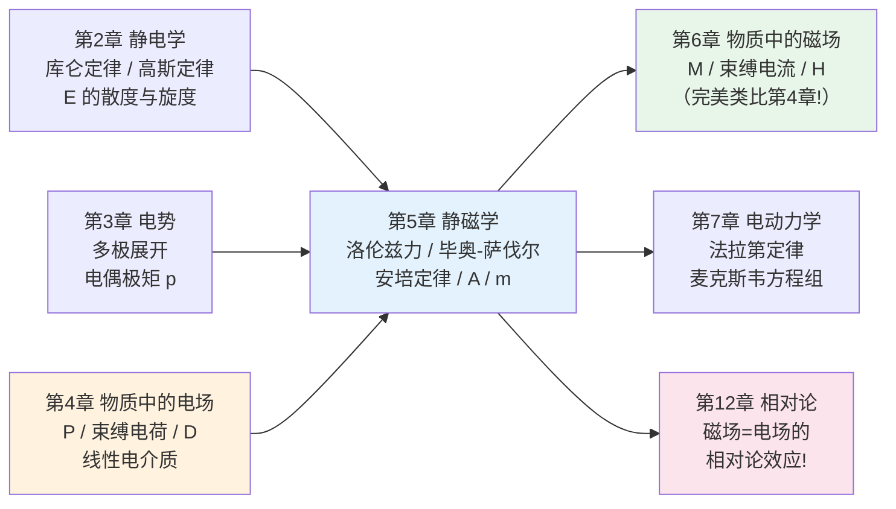
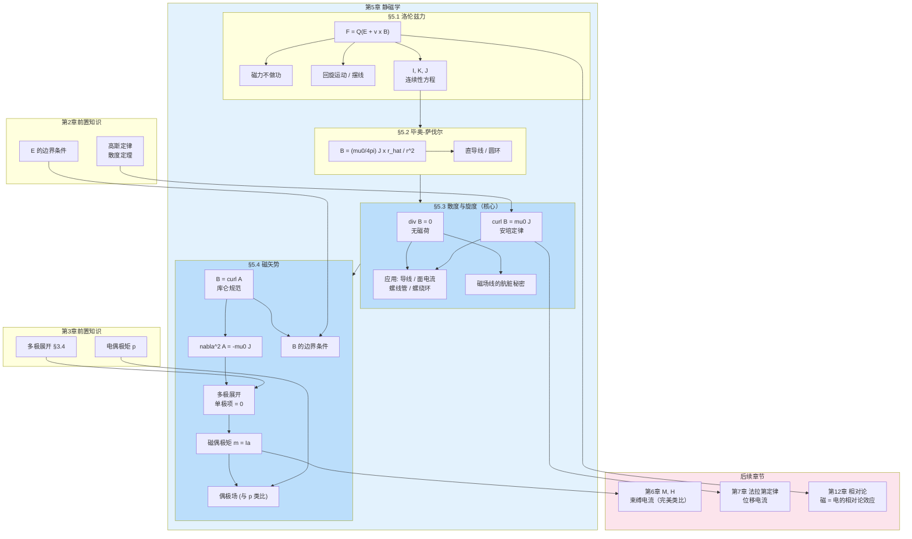

# 第5章 静磁学 (Magnetostatics)

## 引言：当电荷开始运动

在前三章中，我们构建了一个完整的**静电学**体系：静止电荷产生电场 $\mathbf{E}$，电场满足 $\nabla\cdot\mathbf{E} = \rho/\varepsilon_0$ 和 $\nabla\times\mathbf{E} = 0$，由此引出标量电势 $V$、拉普拉斯方程、边值问题的各种技巧（镜像法、分离变量法、多极展开），以及物质中的电场（极化 $\mathbf{P}$、束缚电荷、电位移 $\mathbf{D}$）。

现在，让我们迈出革命性的一步——**让电荷动起来**。

想象这样一个演示实验：两根导线从天花板悬挂下来，相距几厘米。当我接通电源，让电流从一根导线向上流、从另一根向下流时，两根导线**相互排斥**——它们跳开了（Fig. 5.1a）。如果我让电流在两根导线中沿同一方向流动，它们竟然**相互吸引**（Fig. 5.1b）！

这种力**不是**静电力。两根导线整体是电中性的——你在它们附近放一个试验电荷，感受不到任何电场。那么，是什么力在起作用？

答案是：**运动电荷**（即电流）在其周围的空间中产生了一种全新的场——**磁场 $\mathbf{B}$**。静止电荷只产生电场 $\mathbf{E}$；运动电荷在产生电场的同时，还额外产生磁场 $\mathbf{B}$。而另一个运动电荷（电流）会"感受"到这个磁场，从而受到力的作用。

这就是本章的主题——**静磁学（Magnetostatics）**：研究**稳恒电流**（不随时间变化的电流）产生的磁场。

> **术语辨析**："静磁学"这个名字听起来有些矛盾——"静"和"磁"似乎不搭配，因为磁场是由**运动**电荷产生的。这里的"静"指的是电流分布不随时间变化（$\partial\mathbf{J}/\partial t = 0$），而不是电荷不运动。更准确的说法是"稳恒电流的磁场理论"。

**本章的核心任务**：建立静磁学的完整理论框架，使之与静电学完美对称。

$$
\text{静电学：} \rho \xrightarrow{\text{库仑定律}} \mathbf{E} \xrightarrow{\nabla\cdot\mathbf{E},\,\nabla\times\mathbf{E}} \text{高斯定律 + 无旋性} \xrightarrow{} V
$$

$$
\text{静磁学：} \mathbf{J} \xrightarrow{\text{毕奥-萨伐尔定律}} \mathbf{B} \xrightarrow{\nabla\cdot\mathbf{B},\,\nabla\times\mathbf{B}} \text{无源性 + 安培定律} \xrightarrow{} \mathbf{A}
$$

**本章与前后章节的关系**：



> **致读者**：本章的结构**刻意**与第2章（静电学）平行。在学习过程中，请不断建立"电/磁类比"——库仑定律 ↔ 毕奥-萨伐尔定律，高斯定律 ↔ ∇·B = 0（无磁荷），∇×E = 0 ↔ 安培定律，标量势 $V$ ↔ 磁矢势 $\mathbf{A}$，电偶极矩 $\mathbf{p}$ ↔ 磁偶极矩 $\mathbf{m}$。这种对称性不是巧合——它深刻反映了麦克斯韦方程组的内在结构，并将在第12章的相对论视角中获得终极解释：**磁场不过是电场在不同惯性系下的相对论效应**。

---

## 5.1 洛伦兹力定律 (The Lorentz Force Law)

### 5.1.1 磁场

回忆静电学的逻辑起点：我们有一组源电荷 $q_1, q_2, \ldots$，想要计算它们对另一个试验电荷 $Q$ 的力。在静电学中，源电荷静止，产生电场 $\mathbf{E}$，试验电荷受力 $\mathbf{F} = Q\mathbf{E}$。

现在源电荷在运动（形成电流）。实验发现，运动的源电荷除了产生电场外，还在其周围产生**磁场 $\mathbf{B}$**。如果你在通电导线附近放一个小罗盘（磁针），你会发现一件奇特的事情：磁针既不指向导线，也不背离导线，而是**绕着导线旋转**（Fig. 5.2）。如果你用右手握住导线，拇指指向电流方向，那么你的四指弯曲的方向就是磁场的方向——这就是著名的**右手定则**。

两根平行导线之间的吸引力（同向电流）和排斥力（反向电流）又如何解释呢？在第二根导线处，第一根导线产生的磁场指向纸面内。第二根导线中的电流向上，磁场指向纸面内，而产生的力却指向左方——朝向第一根导线。这需要一个**非常奇特的力定律**来解释这些方向的组合。

### 5.1.2 磁力

事实上，磁场 $\mathbf{B}$ 中以速度 $\mathbf{v}$ 运动的电荷 $Q$ 所受的磁力恰好是一个叉积：

$$\boxed{\mathbf{F}_{\text{mag}} = Q(\mathbf{v}\times\mathbf{B})}$$

这就是**洛伦兹力定律**（磁力部分）。如果同时存在电场和磁场，电荷受到的总力为：

$$\boxed{\mathbf{F} = Q[\mathbf{E} + (\mathbf{v}\times\mathbf{B})]}$$

这是完整的**洛伦兹力定律**，是电磁学中最基本的力学方程之一——它不是被"推导"出来的，而是一个**公理**，其正确性由实验验证。

> **关键观察**：磁力的方向总是**垂直于**速度 $\mathbf{v}$ 和磁场 $\mathbf{B}$ 所张成的平面。这意味着磁力永远不会沿速度方向，因此——

$$\boxed{\text{磁力不做功}}$$

证明极其简单：磁力做的功为 $dW_{\text{mag}} = \mathbf{F}_{\text{mag}}\cdot d\mathbf{l} = Q(\mathbf{v}\times\mathbf{B})\cdot\mathbf{v}\,dt = 0$，因为 $(\mathbf{v}\times\mathbf{B})\cdot\mathbf{v} = 0$（叉积与其中任一因子正交）。

> **深刻含义**：磁力只能改变速度的**方向**，不能改变速度的**大小**（即动能）。磁场就像一个完美的"方向舵"——它可以把粒子拐来拐去，但永远不会加速或减速它。这个看似简单的性质引发了一系列深刻的悖论："磁起重机提起汽车时，谁在做功？"——答案令人惊讶：不是磁力，而是维持电流的电池！（详见例题5.3）

---

**例题 5.1**：回旋运动（Cyclotron motion）

一个电荷 $Q$、质量 $m$ 的带电粒子以速度 $v$ 垂直射入均匀磁场 $\mathbf{B} = B\hat{\mathbf{z}}$ 中。求粒子的运动轨迹。

**解**：

**物理分析**：磁力 $\mathbf{F} = Q\mathbf{v}\times\mathbf{B}$ 始终垂直于 $\mathbf{v}$，大小不变（$|F| = QvB$），方向始终指向某个固定中心——这恰好是**匀速圆周运动**的向心力特征！

磁力提供向心力：

$$QvB = m\frac{v^2}{R}$$

解出**回旋半径**（又称**拉莫尔半径**）：

$$\boxed{R = \frac{mv}{QB} = \frac{p}{QB}}$$

其中 $p = mv$ 是粒子的动量。**回旋频率**（角频率）为：

$$\boxed{\omega = \frac{v}{R} = \frac{QB}{m}}$$

这称为**回旋频率（cyclotron frequency）**，它**不依赖于粒子的速度**——这是一个非常重要的性质，也是回旋加速器（cyclotron）能够工作的关键原理。

> **应用**：回旋公式 $p = QBR$ 提供了一种测量带电粒子动量的简单而精确的方法——让粒子穿过已知的磁场区域，测量其轨迹的曲率半径，就能直接读出动量。这正是粒子物理实验中测定基本粒子动量的标准手段。

如果粒子还有一个沿 $\mathbf{B}$ 方向的速度分量 $v_\parallel$，磁力不影响这个分量（$\mathbf{v}_\parallel \times \mathbf{B} = 0$），粒子在 $z$ 方向匀速运动，而在垂直平面内做圆周运动——合成轨迹为**螺旋线（helix）**，螺旋半径 $R = mv_\perp/(QB)$。

---

**例题 5.2**：摆线运动（Cycloid motion）

均匀磁场 $\mathbf{B} = B\hat{\mathbf{x}}$ 和均匀电场 $\mathbf{E} = E\hat{\mathbf{z}}$ 同时存在。一个正电荷从原点由静止释放。求运动轨迹。

**解**：

**定性分析**：初始时粒子静止，磁力为零，电场加速粒子沿 $+z$ 方向运动。当粒子获得 $z$ 方向速度后，磁力 $Q\mathbf{v}\times\mathbf{B}$ 将产生 $y$ 方向的分量，把粒子拽向 $y$ 方向。随着粒子加速，磁力越来越强，最终将粒子弯回——直到 $z$ 方向速度为零，然后电场重新接管……如此循环。

**定量求解**：$x$ 方向没有力（$\mathbf{E}$ 和 $\mathbf{v}\times\mathbf{B}$ 均无 $x$ 分量），所以运动限制在 $yz$ 平面。

$$\mathbf{F} = Q(\mathbf{E} + \mathbf{v}\times\mathbf{B}) = Q(E\hat{\mathbf{z}} + B\dot{z}\hat{\mathbf{y}} - B\dot{y}\hat{\mathbf{z}}) = m(\ddot{y}\hat{\mathbf{y}} + \ddot{z}\hat{\mathbf{z}})$$

分量形式：

$$\ddot{y} = \omega\dot{z}, \quad \ddot{z} = \omega\left(\frac{E}{B} - \dot{y}\right)$$

其中 $\omega \equiv QB/m$ 为回旋频率。

令 $u \equiv \dot{y} - E/B$，则 $\dot{u} = \ddot{y} - 0 = \omega\dot{z}$，$\ddot{u} = \omega\ddot{z} = \omega(-\omega u) = -\omega^2 u$。

这是简谐运动方程！通解 $u = C\cos(\omega t + \phi)$。初始条件 $\dot{y}(0) = 0$ 得 $u(0) = -E/B$，$\dot{z}(0) = 0$ 得 $\dot{u}(0) = 0$，故 $\phi = 0$，$C = -E/B$。

$$\dot{y} = \frac{E}{B}(1-\cos\omega t), \quad \dot{z} = \frac{E}{B}\sin\omega t$$

积分（$y(0) = z(0) = 0$）：

$$\boxed{y(t) = \frac{E}{\omega B}(\omega t - \sin\omega t), \quad z(t) = \frac{E}{\omega B}(1 - \cos\omega t)}$$

令 $R \equiv E/(\omega B)$，消去参数得：

$$(y - R\omega t)^2 + (z - R)^2 = R^2$$

这是一个圆心在 $(0, R\omega t, R)$ 处、半径为 $R$ 的圆——圆心沿 $y$ 方向以速度 $u = \omega R = E/B$ 匀速移动。粒子的轨迹就像一个**车轮边缘上的一个点**——这种曲线称为**摆线（cycloid）**。

> **惊人之处**：粒子的总体漂移方向不是沿 $\mathbf{E}$（$z$ 方向），而是沿 $\mathbf{E}\times\mathbf{B}$ 方向（$y$ 方向），漂移速度为 $v_{\text{drift}} = E/B$。这就是著名的 **$\mathbf{E}\times\mathbf{B}$ 漂移**，在等离子体物理中至关重要。

---

**例题 5.3**：磁力"做功"的悖论

一个矩形导线环（宽度 $a$），载有电流 $I$，悬挂在均匀磁场 $\mathbf{B}$（垂直纸面向内）的区域中。线环的重量为 $mg$。

(a) 求使线环悬浮所需的电流 $I$。
(b) 如果增大电流使线环上升高度 $h$，磁力"做的功"是多少？到底是谁做了功？

**解**：

(a) 线环上方水平段受向上的磁力 $F = IBa$（下方水平段不在磁场区域内或两侧竖直段力相互抵消）。悬浮条件 $IBa = mg$，故：

$$I = \frac{mg}{Ba}$$

(b) 线环上升 $h$ 时，磁力"做的功"似乎是 $W = IBah = mgh$。但我们已经证明**磁力不做功**！矛盾在哪里？

**精细分析**：当线环开始上升时，导线中的电荷不再只有水平速度——它们还获得了一个**竖直向上**的速度分量 $u$。此时磁力 $\mathbf{F} = Q\mathbf{v}\times\mathbf{B}$ 不再纯粹向上，而是**倾斜**的：它有一个竖直分量（提供上升力）和一个**水平分量**（**反对**电流方向）。

磁力的竖直分量做正功（提升线环），但水平分量做**等量的负功**（阻碍电荷沿导线流动）。净功为零！

那么谁提供了能量？是**电池**（或维持电流的电源）。电池必须做额外的功来克服磁力的水平分量，推动电荷沿导线流动。磁力只是一个"转向器"——它把电池提供的水平动力**重新定向**为竖直的提升力。

> **类比**：就像用拖把推箱子上斜坡（回忆 Griffiths Fig. 5.11）。斜坡的法向力不做功（始终垂直于位移），但它把你的水平推力"重新定向"为竖直的提升力。做功的是你，不是斜坡。磁力在这里扮演的角色完全相同——**重定向力的方向**，但自己不贡献能量。

---

### 5.1.3 电流

**电流（Current）** 是单位时间通过导线某截面的电荷量。负电荷向左运动等价于正电荷向右运动，因此我们约定电流方向为正电荷的流动方向。电流的单位是**安培（A）**：$1\,\text{A} = 1\,\text{C/s}$。

如果线电荷密度为 $\lambda$，以速度 $v$ 沿导线运动，则：

$$I = \lambda v$$

电流实际上是矢量：$\mathbf{I} = \lambda\mathbf{v}$。但由于导线限制了电流的路径，通常我们只关心其大小。

载流导线段在磁场中受的力为：

$$\boxed{\mathbf{F}_{\text{mag}} = \int I(d\mathbf{l}\times\mathbf{B})}$$

当电流均匀时，$I$ 可提到积分号外：$\mathbf{F}_{\text{mag}} = I\int (d\mathbf{l}\times\mathbf{B})$。

**面电流密度 $\mathbf{K}$**

当电荷在一个面上流动时（如金属片表面），我们用**面电流密度** $\mathbf{K}$ 来描述：

$$\mathbf{K} \equiv \frac{d\mathbf{I}}{dl_\perp} = \sigma\mathbf{v}$$

其中 $dl_\perp$ 是垂直于电流方向的宽度，$\sigma$ 是表面电荷密度。$K$ 的量纲为 A/m。

面电流受的磁力：

$$\mathbf{F}_{\text{mag}} = \int (\mathbf{K}\times\mathbf{B})\,da$$

> **警告**：正如 $\mathbf{E}$ 在表面电荷处不连续（回忆第2章 §2.3.5），$\mathbf{B}$ 在面电流处也不连续（§5.4.2）。在计算面电流受力时，必须使用界面两侧的**平均场**。

**体电流密度 $\mathbf{J}$**

当电荷在三维体内流动时，用**体电流密度** $\mathbf{J}$ 描述：

$$\mathbf{J} \equiv \frac{d\mathbf{I}}{da_\perp} = \rho\mathbf{v}$$

其中 $da_\perp$ 是垂直于流动方向的面元，$\rho$ 是体电荷密度。$J$ 的量纲为 A/m$^2$。

穿过任意曲面 $\mathcal{S}$ 的总电流：

$$I = \int_{\mathcal{S}} \mathbf{J}\cdot d\mathbf{a}$$

体电流受的磁力：

$$\boxed{\mathbf{F}_{\text{mag}} = \int (\mathbf{J}\times\mathbf{B})\,d\tau}$$

> **"翻译字典"**：不同电流形式之间有统一的对应关系——在任何包含电流的公式中，你可以按照以下规则互相转换：
>
> $$\sum_i q_i\mathbf{v}_i \;\longleftrightarrow\; \int\mathbf{I}\,dl \;\longleftrightarrow\; \int\mathbf{K}\,da \;\longleftrightarrow\; \int\mathbf{J}\,d\tau$$

---

**例题 5.4**：均匀载流导线的体电流密度

(a) 均匀电流 $I$ 流过半径为 $a$ 的圆柱导线，求体电流密度 $\mathbf{J}$。

(b) 若电流密度正比于到轴线的距离，$J = ks$，求导线中的总电流。

**解**：

(a) 电流均匀分布在截面上：$J = I/(\pi a^2)$。方向沿导线轴线。

(b) 总电流 $I = \int \mathbf{J}\cdot d\mathbf{a} = \int_0^{2\pi}\int_0^a (ks)(s\,ds\,d\phi) = 2\pi k\int_0^a s^2\,ds = \frac{2}{3}\pi ka^3$。

---

### 5.1.4 电荷守恒与连续性方程

电荷是守恒的——从任何闭合曲面流出的电流，必然等于该体积内电荷减少的速率：

$$\oint_{\mathcal{S}} \mathbf{J}\cdot d\mathbf{a} = -\frac{d}{dt}\int_{\mathcal{V}} \rho\,d\tau = -\int_{\mathcal{V}} \frac{\partial\rho}{\partial t}\,d\tau$$

利用散度定理，得到**连续性方程**：

$$\boxed{\nabla\cdot\mathbf{J} = -\frac{\partial\rho}{\partial t}}$$

这是电荷局部守恒的精确数学表述。

在**静磁学**中，电荷密度不随时间变化（$\partial\rho/\partial t = 0$），连续性方程简化为：

$$\boxed{\nabla\cdot\mathbf{J} = 0 \quad \text{（稳恒电流条件）}}$$

这意味着稳恒电流没有"源"和"汇"——电流线永远闭合。电流不会在任何地方堆积或消耗电荷。

> **重要推论**：一个运动的**点电荷**不可能构成稳恒电流——它在某一瞬间在这里，下一瞬间就走了。这意味着在静磁学中，我们**不能**像静电学那样从单个点电荷出发逐步推广——我们必须从头就处理**连续的电流分布**。

---

### 5.1.5 旋转带电体的电流密度

旋转带电体是静磁学中一类极其重要的问题——它们自然地将电荷分布转化为电流分布，是计算磁偶极矩的核心素材，也是**考试的高频考点**（回忆期中第3题！）。

---

**例题 5.5**：旋转带电球面的面电流密度（期中第3题第1问）

一个半径为 $R$ 的球壳，表面均匀带电（总电荷 $Q$），绕 $z$ 轴以角速度 $\omega$ 旋转。求面电流密度 $\mathbf{K}$。

**解**：

**物理图景**：球面上每一小块面电荷 $\sigma\,da$（其中 $\sigma = Q/(4\pi R^2)$）随球壳旋转，形成一个小环形电流。在球坐标中，纬度 $\theta$ 处的面元以速度 $\mathbf{v} = \boldsymbol{\omega}\times\mathbf{r}'$ 运动（$\mathbf{r}'$ 为面元到球心的矢径）。

在纬度 $\theta$ 处，面元到旋转轴的距离为 $R\sin\theta$，线速度大小为 $v = \omega R\sin\theta$，方向沿 $\hat{\boldsymbol{\phi}}$。

因此：

$$\boxed{\mathbf{K} = \sigma\mathbf{v} = \sigma\omega R\sin\theta\,\hat{\boldsymbol{\phi}} = \frac{Q\omega}{4\pi R}\sin\theta\,\hat{\boldsymbol{\phi}}}$$

> **验证**：$\mathbf{K}$ 在赤道（$\theta = \pi/2$）最大，在两极（$\theta = 0, \pi$）为零——合理，因为极点处线速度为零。

---

**例题 5.6**：旋转带电实心球的体电流密度（期中第3题第2问）

一个半径为 $R$ 的实心球，体内均匀带电（总电荷 $Q$），绕 $z$ 轴以角速度 $\omega$ 旋转。求体电流密度 $\mathbf{J}$。

**解**：

体电荷密度 $\rho = Q/(\frac{4}{3}\pi R^3) = \frac{3Q}{4\pi R^3}$。

球内 $(r, \theta, \phi)$ 处，电荷到旋转轴的距离为 $r\sin\theta$，线速度 $v = \omega r\sin\theta$，方向沿 $\hat{\boldsymbol{\phi}}$。

$$\boxed{\mathbf{J} = \rho\mathbf{v} = \rho\omega r\sin\theta\,\hat{\boldsymbol{\phi}} = \frac{3Q\omega}{4\pi R^3}r\sin\theta\,\hat{\boldsymbol{\phi}}}$$

也可以用矢量形式简洁地表示：$\mathbf{J} = \rho(\boldsymbol{\omega}\times\mathbf{r})$。

> **自洽性检验**：验证 $\nabla\cdot\mathbf{J} = 0$。在球坐标中，$\mathbf{J}$ 只有 $\hat{\boldsymbol{\phi}}$ 分量，且 $J_\phi$ 不依赖于 $\phi$，所以 $\nabla\cdot\mathbf{J} = \frac{1}{r\sin\theta}\frac{\partial J_\phi}{\partial\phi} = 0$。✓ 这确实是稳恒电流。

> **从面电荷到体电荷的统一视角**：将实心球看作无数同心薄球壳的叠加。半径 $r$、厚度 $dr$ 的薄球壳的面电荷密度为 $\sigma_{\text{shell}} = \rho\,dr$，其面电流密度为 $\mathbf{K}_{\text{shell}} = \rho\,dr\cdot\omega r\sin\theta\,\hat{\boldsymbol{\phi}}$。这与 $\mathbf{J}\,dr$ 完全一致。

---

## 5.2 毕奥-萨伐尔定律 (The Biot-Savart Law)

### 5.2.1 稳恒电流

在正式引入磁场的计算方法之前，让我们明确"静磁学"的适用条件：

$$\boxed{\frac{\partial\rho}{\partial t} = 0, \quad \frac{\partial\mathbf{J}}{\partial t} = \mathbf{0} \quad \text{（静磁学条件）}}$$

$$\text{静止电荷} \Rightarrow \text{恒定电场：静电学}$$
$$\text{稳恒电流} \Rightarrow \text{恒定磁场：静磁学}$$

当然，真正不随时间变化的电流在现实中并不存在——但只要电流的变化足够缓慢（如家用交流电，频率仅 50/60 Hz），静磁学近似就足够好了。

> **注意**：一个运动的**点电荷**并不构成稳恒电流——它在某处一闪而过。因此，静磁学中不存在一个简单的"磁场版库仑定律"可以从单个运动电荷出发。我们从一开始就必须处理扩展的电流分布。

### 5.2.2 稳恒电流的磁场

稳恒线电流的磁场由**毕奥-萨伐尔定律（Biot-Savart law）** 给出：

$$\boxed{\mathbf{B}(\mathbf{r}) = \frac{\mu_0}{4\pi}I\int\frac{d\mathbf{l}'\times\hat{\boldsymbol{\mathscr{r}}}}{\mathscr{r}^2}}$$

其中：
- $d\mathbf{l}'$ 是沿电流方向的线元（**源点**坐标 $\mathbf{r}'$）
- $\boldsymbol{\mathscr{r}} = \mathbf{r} - \mathbf{r}'$ 是从源点到**场点** $\mathbf{r}$ 的分离矢量
- $\mathscr{r} = |\boldsymbol{\mathscr{r}}|$，$\hat{\boldsymbol{\mathscr{r}}} = \boldsymbol{\mathscr{r}}/\mathscr{r}$
- $\mu_0 = 4\pi\times 10^{-7}\,\text{N/A}^2$ 是**真空磁导率**

对于面电流和体电流，只需做替换 $I\,d\mathbf{l}' \to \mathbf{K}\,da'$ 或 $\mathbf{J}\,d\tau'$：

$$\mathbf{B}(\mathbf{r}) = \frac{\mu_0}{4\pi}\int\frac{\mathbf{K}(\mathbf{r}')\times\hat{\boldsymbol{\mathscr{r}}}}{\mathscr{r}^2}\,da', \quad \mathbf{B}(\mathbf{r}) = \frac{\mu_0}{4\pi}\int\frac{\mathbf{J}(\mathbf{r}')\times\hat{\boldsymbol{\mathscr{r}}}}{\mathscr{r}^2}\,d\tau'$$

> **与库仑定律的类比**：毕奥-萨伐尔定律之于静磁学，正如库仑定律之于静电学。比较：
>
> $$\mathbf{E}(\mathbf{r}) = \frac{1}{4\pi\varepsilon_0}\int\frac{\rho(\mathbf{r}')\hat{\boldsymbol{\mathscr{r}}}}{\mathscr{r}^2}\,d\tau' \quad \longleftrightarrow \quad \mathbf{B}(\mathbf{r}) = \frac{\mu_0}{4\pi}\int\frac{\mathbf{J}(\mathbf{r}')\times\hat{\boldsymbol{\mathscr{r}}}}{\mathscr{r}^2}\,d\tau'$$
>
> 相同点：都是 $1/\mathscr{r}^2$ 依赖关系（平方反比律），都是从源的积分。
> 不同点：库仑定律中电场沿 $\hat{\boldsymbol{\mathscr{r}}}$ 方向（径向），毕奥-萨伐尔定律中磁场沿 $d\mathbf{l}'\times\hat{\boldsymbol{\mathscr{r}}}$ 方向（"环绕"电流），这来自叉积的本质。

---

**例题 5.7**：无限长直导线的磁场

一根无限长直导线载有稳恒电流 $I$。求距导线 $s$ 处的磁场。

**解**：

将导线沿 $z$ 轴放置，场点位于 $y$ 轴上距离 $s$ 处。线元 $d\mathbf{l}' = dz'\hat{\mathbf{z}}$，$\boldsymbol{\mathscr{r}} = -z'\hat{\mathbf{z}} + s\hat{\mathbf{s}}$，$\mathscr{r} = \sqrt{s^2 + z'^2}$。

$d\mathbf{l}'\times\hat{\boldsymbol{\mathscr{r}}}$ 的大小为 $dz'\sin\alpha = dz'\cdot\frac{s}{\mathscr{r}}$，方向为 $\hat{\boldsymbol{\phi}}$（右手定则）。

用角度 $\theta$ 参数化（$z' = -s\tan\theta$，$dz' = -s/\cos^2\theta\,d\theta$，$\mathscr{r} = s/\cos\theta$）：

$$B = \frac{\mu_0 I}{4\pi}\int_{\theta_1}^{\theta_2}\frac{\cos\theta}{s}\,d\theta = \frac{\mu_0 I}{4\pi s}(\sin\theta_2 - \sin\theta_1)$$

对于无限长导线，$\theta_1 = -\pi/2$，$\theta_2 = \pi/2$：

$$\boxed{\mathbf{B} = \frac{\mu_0 I}{2\pi s}\hat{\boldsymbol{\phi}}}$$

> **物理要点**：
> - 磁场大小与距离成反比（$\propto 1/s$），与无限长线电荷的电场相同
> - 磁场方向为**环形**——围绕导线旋转，而不是指向或远离导线
> - 对于有限长导线段（$\theta_1$ 到 $\theta_2$），公式为 $B = \frac{\mu_0 I}{4\pi s}(\sin\theta_2 - \sin\theta_1)$

**应用：两平行长直导线间的力**

两根平行导线，间距 $d$，分别载电流 $I_1$ 和 $I_2$。导线1在导线2处产生的磁场大小为 $B_1 = \mu_0 I_1/(2\pi d)$。导线2每单位长度受的力为：

$$\boxed{\frac{F}{L} = \frac{\mu_0 I_1 I_2}{2\pi d}}$$

同向电流**吸引**，反向电流**排斥**——与 §5.1.1 的实验观察一致。

> **历史注释**：这个公式曾经是**安培**的定义基础。在 2019 年国际单位制改革之前，1 安培被定义为"两根相距 1 m 的无限长平行导线中，使每米导线受力恰好为 $2\times 10^{-7}\,\text{N}$ 的电流"。

---

**例题 5.8**：圆环电流轴线上的磁场

一个半径为 $R$ 的圆形电流环，载有稳恒电流 $I$，位于 $xy$ 平面内。求轴线上距中心 $z$ 处的磁场。

**解**：

**对称性分析**：由于环的旋转对称性，磁场在轴线上只有 $z$ 分量（水平分量在对称元素的贡献中相互抵消）。

每个线元 $d\mathbf{l}'$ 与 $\hat{\boldsymbol{\mathscr{r}}}$ 的叉积的竖直分量为 $|d\mathbf{l}'|\cos\theta/\mathscr{r}^2$，其中 $\cos\theta = R/\mathscr{r}$，$\mathscr{r} = \sqrt{R^2 + z^2}$，$\oint dl' = 2\pi R$。

$$\boxed{B(z) = \frac{\mu_0 I}{2}\frac{R^2}{(R^2 + z^2)^{3/2}}}$$

**极限验证**：

- **环心处**（$z = 0$）：$B(0) = \mu_0 I/(2R)$ ✓
- **远处**（$z \gg R$）：$B \approx \frac{\mu_0 I R^2}{2z^3} = \frac{\mu_0}{4\pi}\frac{2m}{z^3}$，其中 $m = I\pi R^2$ 是磁偶极矩——远处看起来像一个磁偶极子！这与第3章中电偶极子的远场（$E \propto p/r^3$）完全对应。这个结果将在 §5.4.3 中从多极展开的角度被严格证明。

---

**例题 5.9**：亥姆霍兹线圈

两个相同的圆形线圈（半径 $R$，电流 $I$，同方向），同轴放置，间距 $d$。求使两线圈中间点处磁场最均匀的间距。

**解**：

轴线上的总磁场为两个线圈贡献之和。以两线圈中点为原点，两线圈分别在 $z = -d/2$ 和 $z = d/2$ 处：

$$B(z) = \frac{\mu_0 IR^2}{2}\left[\frac{1}{(R^2 + (z-d/2)^2)^{3/2}} + \frac{1}{(R^2 + (z+d/2)^2)^{3/2}}\right]$$

在中点 $z = 0$ 处，由对称性，$\partial B/\partial z = 0$（奇数阶导数为零）。为使场最均匀，我们要求 $\partial^2 B/\partial z^2|_{z=0} = 0$。

经过计算（对 $(R^2 + u^2)^{-3/2}$ 求二阶导数），条件为：

$$d = R$$

即**线圈间距等于半径**。此时中心处磁场为：

$$B_{\text{center}} = \frac{8\mu_0 I}{5\sqrt{5}\,R} \approx \frac{0.7155\,\mu_0 I}{R}$$

这种配置称为**亥姆霍兹线圈（Helmholtz coil）**，是实验室中产生近似均匀磁场的标准装置。

> **实用价值**：亥姆霍兹线圈在原子物理（塞曼效应实验）、磁共振成像（MRI）标定、电磁兼容性测试等领域广泛使用。

---

## 5.3 $\mathbf{B}$ 的散度与旋度 (The Divergence and Curl of B)

### 5.3.1 从毕奥-萨伐尔定律到微分方程

在静电学中，我们从库仑定律出发，推导出了电场的两个微分性质：$\nabla\cdot\mathbf{E} = \rho/\varepsilon_0$（高斯定律）和 $\nabla\times\mathbf{E} = 0$（无旋性）。现在我们要对磁场做同样的事情——从毕奥-萨伐尔定律出发，推导 $\nabla\cdot\mathbf{B}$ 和 $\nabla\times\mathbf{B}$。

体电流版本的毕奥-萨伐尔定律为：

$$\mathbf{B}(\mathbf{r}) = \frac{\mu_0}{4\pi}\int\frac{\mathbf{J}(\mathbf{r}')\times\hat{\boldsymbol{\mathscr{r}}}}{\mathscr{r}^2}\,d\tau'$$

**$\mathbf{B}$ 的散度**

取散度：

$$\nabla\cdot\mathbf{B} = \frac{\mu_0}{4\pi}\int\nabla\cdot\left(\mathbf{J}\times\frac{\hat{\boldsymbol{\mathscr{r}}}}{\mathscr{r}^2}\right)d\tau'$$

利用矢量恒等式 $\nabla\cdot(\mathbf{J}\times\frac{\hat{\boldsymbol{\mathscr{r}}}}{\mathscr{r}^2}) = \frac{\hat{\boldsymbol{\mathscr{r}}}}{\mathscr{r}^2}\cdot(\nabla\times\mathbf{J}) - \mathbf{J}\cdot(\nabla\times\frac{\hat{\boldsymbol{\mathscr{r}}}}{\mathscr{r}^2})$。

由于 $\mathbf{J}$ 是 $\mathbf{r}'$ 的函数，对 $\mathbf{r}$ 的旋度为零；$\nabla\times(\hat{\boldsymbol{\mathscr{r}}}/\mathscr{r}^2) = \mathbf{0}$（回忆第1章 Prob 1.63b）。因此：

$$\boxed{\nabla\cdot\mathbf{B} = 0}$$

**磁场是无散的**。用积分形式（散度定理）：

$$\oint_{\mathcal{S}} \mathbf{B}\cdot d\mathbf{a} = 0$$

穿过任意闭合曲面的磁通量总是零。

> **物理意义**：$\nabla\cdot\mathbf{E} = \rho/\varepsilon_0$ 的右边是电荷密度——电场线从正电荷"发出"，终止在负电荷上。$\nabla\cdot\mathbf{B} = 0$ 意味着不存在"磁荷"（磁单极子）——**磁场线没有起点和终点**。

**$\mathbf{B}$ 的旋度**

取旋度的推导更为复杂（详见下方深入选学），最终结果为：

$$\boxed{\nabla\times\mathbf{B} = \mu_0\mathbf{J}}$$

这就是（微分形式的）**安培定律（Ampère's law）**。

> **对比静电学**：
>
> | | 散度 | 旋度 |
> |---|---|---|
> | 静电场 $\mathbf{E}$ | $\nabla\cdot\mathbf{E} = \rho/\varepsilon_0$（有源） | $\nabla\times\mathbf{E} = 0$（无旋） |
> | 静磁场 $\mathbf{B}$ | $\nabla\cdot\mathbf{B} = 0$（无源） | $\nabla\times\mathbf{B} = \mu_0\mathbf{J}$（有旋） |
>
> 电场的"源"是电荷（散度非零），磁场的"源"是电流（旋度非零）。电场线发散，磁场线旋转——这是电与磁最根本的拓扑区别。

---

> ### 🔬 深入选学：从毕奥-萨伐尔定律严格推导 $\nabla\times\mathbf{B} = \mu_0\mathbf{J}$
>
> *本节给出完整的数学证明，供有兴趣的读者深入理解。初学者可跳过，直接接受结论。*
>
> 从毕奥-萨伐尔定律出发：
>
> $$\nabla\times\mathbf{B} = \frac{\mu_0}{4\pi}\int\nabla\times\left(\mathbf{J}\times\frac{\hat{\boldsymbol{\mathscr{r}}}}{\mathscr{r}^2}\right)d\tau'$$
>
> 利用 BAC-CAB 法则的推广（乘积法则8）：
>
> $$\nabla\times\left(\mathbf{J}\times\frac{\hat{\boldsymbol{\mathscr{r}}}}{\mathscr{r}^2}\right) = \mathbf{J}\left(\nabla\cdot\frac{\hat{\boldsymbol{\mathscr{r}}}}{\mathscr{r}^2}\right) - (\mathbf{J}\cdot\nabla)\frac{\hat{\boldsymbol{\mathscr{r}}}}{\mathscr{r}^2}$$
>
> （我们已利用了 $\mathbf{J}$ 不依赖于 $\mathbf{r}$，因此含 $\nabla\times\mathbf{J}$ 的项和 $(\frac{\hat{\boldsymbol{\mathscr{r}}}}{\mathscr{r}^2}\cdot\nabla)\mathbf{J}$ 的项均为零。）
>
> **第一项**：$\nabla\cdot(\hat{\boldsymbol{\mathscr{r}}}/\mathscr{r}^2) = 4\pi\delta^3(\boldsymbol{\mathscr{r}})$（回忆第1章 Eq. 1.100）。因此：
>
> $$\frac{\mu_0}{4\pi}\int\mathbf{J}(\mathbf{r}')\,4\pi\delta^3(\mathbf{r}-\mathbf{r}')\,d\tau' = \mu_0\mathbf{J}(\mathbf{r})$$
>
> 这正是我们想要的结果！
>
> **第二项**：需要证明 $\int(\mathbf{J}\cdot\nabla)(\hat{\boldsymbol{\mathscr{r}}}/\mathscr{r}^2)\,d\tau' = 0$。
>
> 关键技巧：$\nabla$ 作用于 $\hat{\boldsymbol{\mathscr{r}}}/\mathscr{r}^2$ 时，可以转换为 $-\nabla'$（因为 $\boldsymbol{\mathscr{r}} = \mathbf{r} - \mathbf{r}'$ 只依赖于差值）。于是：
>
> $$-(\mathbf{J}\cdot\nabla)\frac{\hat{\boldsymbol{\mathscr{r}}}}{\mathscr{r}^2} = (\mathbf{J}\cdot\nabla')\frac{\hat{\boldsymbol{\mathscr{r}}}}{\mathscr{r}^2}$$
>
> 考虑 $x$ 分量：$(\mathbf{J}\cdot\nabla')\frac{x-x'}{\mathscr{r}^3} = \nabla'\cdot\left[\frac{x-x'}{\mathscr{r}^3}\mathbf{J}\right] - \frac{x-x'}{\mathscr{r}^3}(\nabla'\cdot\mathbf{J})$。
>
> 对于稳恒电流，$\nabla'\cdot\mathbf{J} = 0$。全散度项对全空间积分后化为面积分（散度定理），当积分区域足够大（所有电流都在内部）时，边界上 $\mathbf{J} = 0$，面积分为零。
>
> 因此第二项确实为零，证毕。

---

### 5.3.2 安培定律及其应用

由斯托克斯定理，将 $\nabla\times\mathbf{B} = \mu_0\mathbf{J}$ 转化为积分形式：

$$\int(\nabla\times\mathbf{B})\cdot d\mathbf{a} = \oint\mathbf{B}\cdot d\mathbf{l} = \mu_0\int\mathbf{J}\cdot d\mathbf{a}$$

即：

$$\boxed{\oint\mathbf{B}\cdot d\mathbf{l} = \mu_0 I_{\text{enc}}}$$

其中 $I_{\text{enc}} = \int\mathbf{J}\cdot d\mathbf{a}$ 是穿过安培环路所围曲面的总电流。这就是**安培定律（Ampère's law）** 的积分形式。

> **与高斯定律的类比**：
>
> $$\oint\mathbf{E}\cdot d\mathbf{a} = \frac{Q_{\text{enc}}}{\varepsilon_0} \quad \longleftrightarrow \quad \oint\mathbf{B}\cdot d\mathbf{l} = \mu_0 I_{\text{enc}}$$
>
> 高斯定律用**面积分**（通量）关联电荷；安培定律用**线积分**（环流）关联电流。两者的结构完全平行。

**安培定律的使用条件**：与高斯定律一样，安培定律始终正确（对稳恒电流），但只在具有足够**对称性**时才实用——你需要能够利用对称性将 $B$ 从积分号中提出来。适用的对称性配置有四种：

1. **无限长直线电流**（圆柱对称）
2. **无限大面电流**（平面对称）
3. **无限长螺线管**（平移 + 旋转对称）
4. **螺绕环**（旋转对称）

---

**例题 5.10**：安培定律求长直导线磁场（与例题5.7对照）

距离一根无限长直导线 $s$ 处的磁场。

**解**：

由对称性，$\mathbf{B}$ 沿 $\hat{\boldsymbol{\phi}}$ 方向且大小只依赖于 $s$。取以导线为轴、半径 $s$ 的圆形安培环路：

$$\oint\mathbf{B}\cdot d\mathbf{l} = B(2\pi s) = \mu_0 I$$

$$B = \frac{\mu_0 I}{2\pi s}$$

与毕奥-萨伐尔定律的结果（例题5.7）完全一致，但**简洁得多**！这就是安培定律的威力——当对称性允许时，一行搞定。

---

**例题 5.11**：无限大面电流的磁场

在 $xy$ 平面上有均匀面电流 $\mathbf{K} = K\hat{\mathbf{x}}$。求空间中的磁场。

**解**：

**方向分析**：磁场能否有 $x$ 分量？不能——毕奥-萨伐尔定律告诉我们 $\mathbf{B}$ 垂直于 $\mathbf{K}$。能否有 $z$ 分量？不能——$+y$ 和 $-y$ 处的电流丝产生的竖直分量相互抵消。因此 $\mathbf{B}$ 只有 $y$ 分量，且在面电流上方指向 $-\hat{\mathbf{y}}$，下方指向 $+\hat{\mathbf{y}}$。

取平行于 $yz$ 平面、跨越电流面的矩形安培环路（宽度 $l$）：

$$\oint\mathbf{B}\cdot d\mathbf{l} = 2Bl = \mu_0 Kl$$

$$\boxed{\mathbf{B} = \begin{cases} +\frac{\mu_0}{2}K\,\hat{\mathbf{y}} & z < 0 \\ -\frac{\mu_0}{2}K\,\hat{\mathbf{y}} & z > 0 \end{cases}}$$

更简洁地：$\mathbf{B} = \pm\frac{\mu_0}{2}K\,\hat{\mathbf{y}}$（上负下正）。

> **注意**：磁场**不随距面电流的距离衰减**，正如无限大面电荷的电场是常数（回忆第2章 Ex. 2.5）。跨越面电流时，$\mathbf{B}$ 的**切向分量**发生跃变 $\Delta B = \mu_0 K$。

---

**例题 5.12**：无限长螺线管的磁场

一根无限长螺线管，半径 $R$，单位长度 $n$ 匝，电流 $I$。求内外磁场。

**解**：

**方向分析**：螺线管内的磁场是否有径向分量？不会——如果 $B_s > 0$（向外），反转电流方向应翻转磁场，但反转电流等价于翻转螺线管上下——径向不应改变。矛盾，故 $B_s = 0$。是否有环向分量 $B_\phi$？对同心圆安培环路，$\oint\mathbf{B}\cdot d\mathbf{l} = B_\phi(2\pi s) = \mu_0 I_{\text{enc}} = 0$（环路不穿过任何电流），所以 $B_\phi = 0$。

因此 $\mathbf{B}$ 只有 $z$ 分量，且由对称性只依赖于 $s$。

**外部**（$s > R$）：取完全在外部的矩形安培环路（平行于轴），两段 $B(a)L - B(b)L = 0$（不围住电流），故 $B(a) = B(b)$——外部磁场处处相等。但 $s \to \infty$ 时 $B \to 0$，所以：

$$B_{\text{外}} = 0$$

**内部**（$s < R$）：取跨越螺线管壁的矩形安培环路（长度 $L$），一段在内、一段在外：

$$BL = \mu_0 nIL$$

$$\boxed{\mathbf{B} = \begin{cases} \mu_0 nI\,\hat{\mathbf{z}} & s < R \text{（内部）} \\ \mathbf{0} & s > R \text{（外部）} \end{cases}}$$

> **惊人结果**：螺线管内部磁场是**均匀的**——不依赖于到轴线的距离！外部磁场恰好为零。螺线管之于静磁学，正如平行板电容器之于静电学——一个产生均匀场的简单装置。

---

**例题 5.13**：螺绕环（Toroid）的磁场

一个螺绕环（"甜甜圈"），共 $N$ 匝，电流 $I$。求内部和外部的磁场。

**解**：

**方向分析**：同螺线管类似的论证可以证明，螺绕环的磁场只有 $\hat{\boldsymbol{\phi}}$ 分量（环绕对称轴方向），且只依赖于到对称轴的距离 $s$。

取以螺绕环对称轴为中心、半径 $s$ 的圆形安培环路：

**环内**（$a < s < b$，$a$ 和 $b$ 分别是螺绕环内外半径）：

$$B(2\pi s) = \mu_0 NI$$

$$\boxed{\mathbf{B} = \frac{\mu_0 NI}{2\pi s}\hat{\boldsymbol{\phi}} \quad \text{（环内）}}$$

**环外**和**中心孔内**：安培环路不围住任何电流，$B = 0$。

> **与螺线管的联系**：当螺绕环的半径远大于截面尺寸时（$s \approx$ 常数），环内磁场近似均匀，$B \approx \mu_0 NI/(2\pi s_{\text{avg}}) = \mu_0 nI$（其中 $n = N/(2\pi s_{\text{avg}})$ 为单位长度匝数），退化为螺线管公式。

---

**例题 5.14**：粗导线的磁场

一根半径为 $a$ 的长圆柱导线载有总电流 $I$。

(a) 电流均匀分布在截面上。求导线内外的磁场。
(b) 电流密度 $J = ks$（$k$ 为常数）。求导线内外的磁场。

**解**：

(a) **均匀电流**：$J = I/(\pi a^2)$。

由对称性，$\mathbf{B}$ 沿 $\hat{\boldsymbol{\phi}}$ 方向。

- **外部**（$s > a$）：$\oint\mathbf{B}\cdot d\mathbf{l} = B(2\pi s) = \mu_0 I$，故 $B = \mu_0 I/(2\pi s)$。
- **内部**（$s < a$）：$I_{\text{enc}} = J\cdot\pi s^2 = I\frac{s^2}{a^2}$，故 $B(2\pi s) = \mu_0 I\frac{s^2}{a^2}$，即：

$$\boxed{B = \begin{cases} \frac{\mu_0 I}{2\pi}\frac{s}{a^2} & s \leq a \\ \frac{\mu_0 I}{2\pi s} & s \geq a \end{cases}}$$

内部磁场**正比于** $s$（从中心到表面线性增加），外部**反比于** $s$（与细导线相同）。在表面 $s = a$ 处连续。

(b) **非均匀电流** $J = ks$：

首先确定 $k$：$I = \int_0^a ks \cdot 2\pi s\,ds = \frac{2}{3}\pi ka^3$，故 $k = 3I/(2\pi a^3)$。

- **外部**（$s > a$）：同上，$B = \mu_0 I/(2\pi s)$。
- **内部**（$s < a$）：$I_{\text{enc}} = \int_0^s ks'\cdot 2\pi s'\,ds' = \frac{2}{3}\pi ks^3 = I\frac{s^3}{a^3}$。

$$\boxed{B = \begin{cases} \frac{\mu_0 I}{2\pi}\frac{s^2}{a^3} & s \leq a \\ \frac{\mu_0 I}{2\pi s} & s \geq a \end{cases}}$$

内部磁场现在正比于 $s^2$（更加集中在外围）。

---

### 5.3.3 静磁学与静电学的对比

让我们在这里做一个全面的总结，将静电学和静磁学放在一起对比：

| | **静电学** | **静磁学** |
|---|---|---|
| 源 | 静止电荷 $\rho$ | 稳恒电流 $\mathbf{J}$ |
| 场 | 电场 $\mathbf{E}$ | 磁场 $\mathbf{B}$ |
| 基本定律 | 库仑定律 | 毕奥-萨伐尔定律 |
| 散度 | $\nabla\cdot\mathbf{E} = \rho/\varepsilon_0$ | $\nabla\cdot\mathbf{B} = 0$ |
| 旋度 | $\nabla\times\mathbf{E} = 0$ | $\nabla\times\mathbf{B} = \mu_0\mathbf{J}$ |
| 积分工具 | 高斯定律 $\oint\mathbf{E}\cdot d\mathbf{a} = Q_{\text{enc}}/\varepsilon_0$ | 安培定律 $\oint\mathbf{B}\cdot d\mathbf{l} = \mu_0 I_{\text{enc}}$ |
| 场线特征 | 始于正电荷，终于负电荷 | 无始无终（闭合或无穷延伸） |
| 力 | $\mathbf{F} = Q\mathbf{E}$ | $\mathbf{F} = Q\mathbf{v}\times\mathbf{B}$ |
| 做功 | 电场力做功 | 磁力不做功 |
| 势 | 标量势 $V$（$\mathbf{E} = -\nabla V$） | 磁矢势 $\mathbf{A}$（$\mathbf{B} = \nabla\times\mathbf{A}$） |

> **电磁力的强度对比**：电场力和磁场力的强度差异巨大。从常数 $\varepsilon_0$ 和 $\mu_0$ 的量级以及典型粒子速度来看，电场力通常远强于磁场力。只有当电荷以接近光速运动时，磁力才能与电力匹敌。我们之所以在日常生活中能感受到磁力（如磁铁吸附冰箱门），是因为导线保持了电中性——正负电荷密度精确抵消（将在第5章习题中证明 $\rho_- = -\rho_+\gamma^2$），留下纯粹的磁效应。

---

### 5.3.4 磁场线的"肮脏小秘密"

在静电学中，我们发现把场矢量连成线（场线）是直观而有用的。场线的切线方向给出场的方向，场线的密度（单位面积通过的条数）给出场的大小。

对磁场也可以这样做。$\nabla\cdot\mathbf{B} = 0$ 保证了磁通量沿"通量管"守恒——如果在一端画了 $n$ 条线代表通量 $B_1 a_1$，那么在另一端通量 $B_2 a_2$ 必须相同。因此磁场线的密度确实代表了场的大小。

在简单的对称情形中（无限长直导线、螺线管、螺绕环），磁场线形成**闭合环路**。你常常会在教科书中读到："磁场线总是闭合的。"

**但这是错的。**

准确地说，这只在极特殊的对称情形下成立。考虑一个更一般的情况：一个圆形电流环加上一根沿 $z$ 轴的长直导线。直导线产生环向（$\hat{\boldsymbol{\phi}}$）磁场，电流环产生近似偶极子场——两者叠加形成**螺旋形**的磁场线。一般来说，这条螺旋线在绕过一圈后**不会回到出发点**。它会一直缠绕下去，永远不闭合，最终填满一个甜甜圈形的曲面。

> **这就是磁场线的"肮脏小秘密"（dirty little secret）**：对于除最简单的对称情形外的绝大多数电流构型，磁场线**不闭合**。它们要么延伸到无穷远，要么像无理数一样永远缠绕却不重复。如果你一定要用磁场线来表示场的大小（线密度 ∝ 场强），你就不得不接受磁场线在某些地方"跳跃"——丢失了连续性和唯一性。
>
> Faraday 当年将场线视为真实存在的物理实体（如空间中的蛛丝或橡皮筋），这在简单情形中是美妙的直觉工具，但在一般情况下是误导的。在 Maxwell 的理论中，场线不扮演任何角色——真正的物理量是空间中每一点的**场矢量**，场线只是辅助视觉工具，不能太当真。

> **为什么静电场线没有这个问题？**
> 因为 $\nabla\times\mathbf{E} = 0$——静电场是**无旋的**（保守力场），其场线从正电荷出发到负电荷终止，不会形成闭合环路，也不可能出现"螺旋缠绕"。磁场恰恰相反：$\nabla\times\mathbf{B} = \mu_0\mathbf{J} \neq 0$，磁场有旋度，场线有卷曲的趋势——这正是导致"不闭合"的根源。

---

> ### 🔬 深入选学：安培定律在静磁学之外的失效
>
> *本节讨论安培定律的适用范围限制，为第7章麦克斯韦的位移电流修正做铺垫。*
>
> 安培定律 $\nabla\times\mathbf{B} = \mu_0\mathbf{J}$ 取散度得 $\nabla\cdot(\nabla\times\mathbf{B}) = \mu_0\nabla\cdot\mathbf{J} = 0$（左边恒等于零）。这要求 $\nabla\cdot\mathbf{J} = 0$——即稳恒电流条件。
>
> 如果电流**不是**稳恒的（如给电容器充电时，电流在导线端头中断），$\nabla\cdot\mathbf{J} \neq 0$，安培定律就产生了内在矛盾！这就是麦克斯韦发现的"安培定律的散度灾难"——它将在第7章被**位移电流**（$\mu_0\varepsilon_0\partial\mathbf{E}/\partial t$）修补，从而完成麦克斯韦方程组的最后一块拼图。
>
> 这个修正项的发现过程极其优美：麦克斯韦注意到，如果你在安培定律的右边加上 $\mu_0\varepsilon_0\partial\mathbf{E}/\partial t$，取散度后变为 $\mu_0\nabla\cdot\mathbf{J} + \mu_0\varepsilon_0\frac{\partial}{\partial t}(\nabla\cdot\mathbf{E}) = \mu_0(\nabla\cdot\mathbf{J} + \frac{\partial\rho}{\partial t}) = 0$（连续性方程！），矛盾消除。更深刻的是，这个看似纯数学的修正项预言了**电磁波的存在**——这是第9章的故事。

---

## 5.4 磁矢势 (Magnetic Vector Potential)

### 5.4.1 矢势 $\mathbf{A}$

在静电学中，$\nabla\times\mathbf{E} = 0$ 允许我们引入标量势：$\mathbf{E} = -\nabla V$。

类似地，$\nabla\cdot\mathbf{B} = 0$ 允许我们引入**磁矢势（vector potential）** $\mathbf{A}$：

$$\boxed{\mathbf{B} = \nabla\times\mathbf{A}}$$

这个表述自动满足 $\nabla\cdot\mathbf{B} = 0$（因为旋度的散度恒等于零），所以 $\nabla\cdot\mathbf{B} = 0$ 被"内置"在了势的定义中。

将 $\mathbf{B} = \nabla\times\mathbf{A}$ 代入安培定律：

$$\nabla\times\mathbf{B} = \nabla\times(\nabla\times\mathbf{A}) = \nabla(\nabla\cdot\mathbf{A}) - \nabla^2\mathbf{A} = \mu_0\mathbf{J}$$

**规范自由度**：$\mathbf{B} = \nabla\times\mathbf{A}$ 中，给 $\mathbf{A}$ 加上任意标量函数的梯度 $\nabla\lambda$（$\mathbf{A}' = \mathbf{A} + \nabla\lambda$）不改变 $\mathbf{B}$（因为 $\nabla\times(\nabla\lambda) = 0$）。这种自由度称为**规范自由度**。

我们利用这种自由度来选择 $\nabla\cdot\mathbf{A} = 0$，这称为**库仑规范（Coulomb gauge）**。在库仑规范下：

$$\boxed{\nabla^2\mathbf{A} = -\mu_0\mathbf{J}}$$

这是三个标量泊松方程（每个笛卡尔分量一个）！与静电学的泊松方程 $\nabla^2 V = -\rho/\varepsilon_0$ 完全对应。

> **为什么总能选到库仑规范？** 如果初始的 $\mathbf{A}_0$ 不满足 $\nabla\cdot\mathbf{A}_0 = 0$，令 $\mathbf{A} = \mathbf{A}_0 + \nabla\lambda$，则 $\nabla\cdot\mathbf{A} = \nabla\cdot\mathbf{A}_0 + \nabla^2\lambda = 0$，即 $\nabla^2\lambda = -\nabla\cdot\mathbf{A}_0$。这又是一个泊松方程——我们知道它有解（与静电势的求解完全一样）。

由泊松方程，如果 $\mathbf{J}$ 在无穷远处衰减到零，解为（与 $V = \frac{1}{4\pi\varepsilon_0}\int\frac{\rho}{\mathscr{r}}d\tau'$ 类比）：

$$\boxed{\mathbf{A}(\mathbf{r}) = \frac{\mu_0}{4\pi}\int\frac{\mathbf{J}(\mathbf{r}')}{\mathscr{r}}\,d\tau'}$$

对于线电流和面电流：

$$\mathbf{A} = \frac{\mu_0}{4\pi}\int\frac{\mathbf{I}}{\mathscr{r}}\,dl' = \frac{\mu_0 I}{4\pi}\int\frac{d\mathbf{l}'}{\mathscr{r}}, \quad \mathbf{A} = \frac{\mu_0}{4\pi}\int\frac{\mathbf{K}}{\mathscr{r}}\,da'$$

> **$\mathbf{A}$ vs $V$ 的对比**：
> - $V$ 是标量，$\mathbf{A}$ 是矢量（三个分量，计算量约为三倍）
> - $V$ 有直接的物理意义（单位电荷的势能），$\mathbf{A}$ 在经典力学中没有直接的力学意义（但在量子力学中意义重大——Aharonov-Bohm 效应）
> - 两者的方向特征不同：$V$ 的"源" $\rho$ 是标量，$\mathbf{A}$ 的"源" $\mathbf{J}$ 是矢量，因此 $\mathbf{A}$ 的方向倾向于**跟随电流方向**

---

**例题 5.15**：旋转带电球壳的磁矢势

一个半径为 $R$ 的球壳，表面均匀带电 $\sigma$，绕 $z$ 轴以角速度 $\omega$ 旋转。求磁矢势 $\mathbf{A}$ 和磁场 $\mathbf{B}$。

**解**：

这是 Griffiths 的经典 Example 5.11。面电流密度为 $\mathbf{K} = \sigma\mathbf{v} = \sigma\omega R\sin\theta\,\hat{\boldsymbol{\phi}}$（参见例题5.5）。

由于对称性，$\mathbf{A}$ 只有 $\hat{\boldsymbol{\phi}}$ 分量。经过详细的积分计算（将 $\boldsymbol{\omega}$ 轴倾斜到 $xz$ 平面以方便处理方位角积分，最后回到自然坐标），结果为：

$$\boxed{\mathbf{A}(r, \theta) = \begin{cases} \dfrac{\mu_0 R\sigma\omega}{3}r\sin\theta\,\hat{\boldsymbol{\phi}} & r \leq R \\[10pt] \dfrac{\mu_0 R^4\sigma\omega}{3}\dfrac{\sin\theta}{r^2}\,\hat{\boldsymbol{\phi}} & r \geq R \end{cases}}$$

取旋度得磁场：

**球壳内部**：

$$\mathbf{B}_{\text{in}} = \nabla\times\mathbf{A} = \frac{2\mu_0 R\sigma\omega}{3}(\cos\theta\,\hat{\mathbf{r}} - \sin\theta\,\hat{\boldsymbol{\theta}}) = \frac{2}{3}\mu_0\sigma R\omega\,\hat{\mathbf{z}}$$

$$\boxed{\mathbf{B}_{\text{in}} = \frac{2}{3}\mu_0\sigma R\omega\,\hat{\mathbf{z}}}$$

内部磁场是**均匀的**！方向沿旋转轴，完全类似于均匀极化球内部的均匀退极化场（第4章例题4.4）。

**球壳外部**：

$$\mathbf{B}_{\text{out}} = \frac{\mu_0}{4\pi}\frac{2m\cos\theta}{r^3}\hat{\mathbf{r}} + \frac{\mu_0}{4\pi}\frac{m\sin\theta}{r^3}\hat{\boldsymbol{\theta}}$$

其中 $m = \frac{4}{3}\pi R^4\sigma\omega$ 是球壳的磁偶极矩（将在 §5.4.3 验证）。外部磁场是**纯偶极子场**。

> **"壳内均匀，壳外偶极"**——这与第4章均匀极化球的 "$\mathbf{E}_{\text{in}}$ 均匀，$\mathbf{E}_{\text{out}}$ 偶极"完美对应，再次体现了电/磁类比。

---

**例题 5.16**：无限长螺线管的磁矢势

半径 $R$，单位长度 $n$ 匝，电流 $I$ 的无限长螺线管。求磁矢势。

**解**：

我们已知磁场为（例题5.12）：$\mathbf{B} = \mu_0 nI\,\hat{\mathbf{z}}$（内部），$\mathbf{B} = 0$（外部）。

利用"安培定律的类比"：$\oint\mathbf{A}\cdot d\mathbf{l} = \int\mathbf{B}\cdot d\mathbf{a} = \Phi$（磁通量）。

由对称性，$\mathbf{A}$ 沿 $\hat{\boldsymbol{\phi}}$ 方向且只依赖于 $s$。取半径 $s$ 的圆环路：

**内部**（$s \leq R$）：$A(2\pi s) = \mu_0 nI(\pi s^2)$，故：

$$\boxed{\mathbf{A} = \frac{\mu_0 nI}{2}s\,\hat{\boldsymbol{\phi}} \quad (s \leq R)}$$

**外部**（$s \geq R$）：$A(2\pi s) = \mu_0 nI(\pi R^2)$，故：

$$\boxed{\mathbf{A} = \frac{\mu_0 nI}{2}\frac{R^2}{s}\,\hat{\boldsymbol{\phi}} \quad (s \geq R)}$$

> **惊人之处**：螺线管外部 $\mathbf{B} = 0$，但 $\mathbf{A} \neq 0$！矢势在磁场为零的区域仍然存在。在经典电磁学中这无关紧要（只有 $\mathbf{B}$ 才有力学效应），但在量子力学中，$\mathbf{A}$ 本身就是物理的——一个电子经过螺线管外部时，虽然不受磁力，但其量子态的**相位**会被 $\mathbf{A}$ 改变，导致可观测的干涉效应。这就是著名的 **Aharonov-Bohm 效应**（见下方深入选学）。

---

### 5.4.2 静磁场的边界条件

正如电场在表面电荷处不连续（第2章 §2.3.5），磁场在面电流处也不连续。

**法向分量**：对跨越表面的薄"药片盒"应用 $\oint\mathbf{B}\cdot d\mathbf{a} = 0$：

$$\boxed{B_{\text{above}}^{\perp} = B_{\text{below}}^{\perp}}$$

磁场的法向分量**连续**（因为 $\nabla\cdot\mathbf{B} = 0$——没有"磁荷"来产生跳变）。

**切向分量**：对跨越表面且**垂直于**电流方向的安培环路：

$$B_{\text{above}}^{\parallel} - B_{\text{below}}^{\parallel} = \mu_0 K$$

其中 $K$ 是面电流密度的垂直于环路的分量。更一般地：

$$\boxed{\mathbf{B}_{\text{above}} - \mathbf{B}_{\text{below}} = \mu_0(\mathbf{K}\times\hat{\mathbf{n}})}$$

其中 $\hat{\mathbf{n}}$ 是从"below"指向"above"的法向。

> **对比**：电场的边界条件 $\mathbf{E}_{\text{above}} - \mathbf{E}_{\text{below}} = (\sigma/\varepsilon_0)\hat{\mathbf{n}}$——电场的**法向**分量跳变（由面电荷引起）。磁场的**切向**分量跳变（由面电流引起）。散度↔法向跳变，旋度↔切向跳变——这是散度定理和斯托克斯定理在边界条件中的体现。

**矢势的边界条件**：

磁矢势在界面两侧**连续**：

$$\mathbf{A}_{\text{above}} = \mathbf{A}_{\text{below}}$$

但其法向导数不连续：

$$\frac{\partial\mathbf{A}_{\text{above}}}{\partial n} - \frac{\partial\mathbf{A}_{\text{below}}}{\partial n} = -\mu_0\mathbf{K}$$

---

### 5.4.3 多极展开与磁偶极矩

在第3章 §3.4 中，我们学会了将远处的电势展开为多极级数（$1/r$, $1/r^2$, $1/r^3$, ...）。现在对磁矢势做同样的操作。

对于远离电流源的点（$r \gg r'$），利用勒让德展开：

$$\frac{1}{\mathscr{r}} = \frac{1}{r}\sum_{n=0}^{\infty}\left(\frac{r'}{r}\right)^n P_n(\cos\alpha)$$

代入 $\mathbf{A} = \frac{\mu_0 I}{4\pi}\oint\frac{d\mathbf{l}'}{\mathscr{r}}$ 得多极展开：

$$\mathbf{A}(\mathbf{r}) = \frac{\mu_0 I}{4\pi}\left[\frac{1}{r}\oint d\mathbf{l}' + \frac{1}{r^2}\oint r'\cos\alpha\,d\mathbf{l}' + \frac{1}{r^3}\oint (r')^2\left(\frac{3\cos^2\alpha-1}{2}\right)d\mathbf{l}' + \cdots\right]$$

**单极项**（$1/r$）：

$$\oint d\mathbf{l}' = \mathbf{0}$$

闭合回路的总位移为零。**磁单极项恒为零**——这反映了不存在磁单极子（$\nabla\cdot\mathbf{B} = 0$ 的直接结果）。

> **与电学的深刻区别**：在电学中，只有当总电荷为零时，单极项才消失。但在磁学中，单极项**总是**消失，无论电流如何分布。因此，磁势的主导项是偶极项，磁偶极子在磁学中的地位，比电偶极子在电学中的地位更加"核心"。

**偶极项**（$1/r^2$）：

经过矢量恒等式的处理（利用 $\oint(\hat{\mathbf{r}}\cdot\mathbf{r}')d\mathbf{l}' = -\hat{\mathbf{r}}\times\int d\mathbf{a}'$），偶极项简化为：

$$\boxed{\mathbf{A}_{\text{dip}}(\mathbf{r}) = \frac{\mu_0}{4\pi}\frac{\mathbf{m}\times\hat{\mathbf{r}}}{r^2}}$$

其中 $\mathbf{m}$ 是**磁偶极矩（magnetic dipole moment）**：

$$\boxed{\mathbf{m} = I\int d\mathbf{a} = I\mathbf{a}}$$

对于平面线圈，$\mathbf{a}$ 就是线圈围成的面积矢量（面积大小，方向由右手定则确定）。

对于体电流分布，磁偶极矩推广为：

$$\boxed{\mathbf{m} = \frac{1}{2}\int(\mathbf{r}'\times\mathbf{J})\,d\tau'}$$

> **关键性质**：磁偶极矩**不依赖于原点选择**。这是因为磁单极项恒为零——回忆第3章 §3.4.3，电偶极矩只有在总电荷为零时才不依赖于原点，而磁偶极矩**总是**如此。

**磁偶极子的场**

将 $\mathbf{m}$ 沿 $z$ 轴放置，$\mathbf{A}_{\text{dip}} = \frac{\mu_0}{4\pi}\frac{m\sin\theta}{r^2}\hat{\boldsymbol{\phi}}$，取旋度：

$$\boxed{\mathbf{B}_{\text{dip}} = \frac{\mu_0 m}{4\pi r^3}(2\cos\theta\,\hat{\mathbf{r}} + \sin\theta\,\hat{\boldsymbol{\theta}})}$$

无坐标形式：

$$\boxed{\mathbf{B}_{\text{dip}} = \frac{\mu_0}{4\pi}\frac{1}{r^3}[3(\mathbf{m}\cdot\hat{\mathbf{r}})\hat{\mathbf{r}} - \mathbf{m}]}$$

> **惊人的结果**：磁偶极子的场与电偶极子的场（第3章 Eq. 3.103）**在形式上完全相同**（将 $\mathbf{p}$ 换成 $\mathbf{m}$，$1/(4\pi\varepsilon_0)$ 换成 $\mu_0/(4\pi)$）！这种电/磁对偶性将贯穿整本书。

---

**例题 5.17**：旋转带电圆盘的磁偶极矩（期中第3题变体）

一个半径为 $R$ 的圆盘，表面均匀带电 $\sigma$，绕通过中心的垂直轴以角速度 $\omega$ 旋转。求磁偶极矩。

**解**：

将圆盘看作无数同心细环的叠加。半径 $r$、宽度 $dr$ 的环形带的电荷为 $dq = \sigma\cdot 2\pi r\,dr$。旋转周期 $T = 2\pi/\omega$，故该细环的电流为：

$$dI = \frac{dq}{T} = \frac{\sigma\cdot 2\pi r\,dr}{2\pi/\omega} = \sigma\omega r\,dr$$

该细环的面积为 $\pi r^2$，故其磁偶极矩为：

$$dm = dI\cdot\pi r^2 = \pi\sigma\omega r^3\,dr$$

对整个圆盘积分：

$$\boxed{m = \int_0^R \pi\sigma\omega r^3\,dr = \frac{\pi\sigma\omega R^4}{4}}$$

方向沿 $\hat{\mathbf{z}}$（右手定则）。

---

**例题 5.18**：旋转带电球的磁偶极矩（直击期中第3题）

(a) 半径 $R$、表面均匀带电 $Q$ 的球壳，以角速度 $\omega$ 旋转。求 $\mathbf{m}$。

(b) 半径 $R$、体内均匀带电 $Q$ 的实心球，以角速度 $\omega$ 旋转。求 $\mathbf{m}$。

**解**：

**(a) 旋转带电球面**

方法：将球面分解为无数细环。在纬度 $\theta$ 处（$\theta$ 是极角），宽度 $R\,d\theta$ 的窄环带：

- 半径：$R\sin\theta$
- 面积：$2\pi R\sin\theta \cdot R\,d\theta$
- 电荷：$dq = \sigma\cdot 2\pi R^2\sin\theta\,d\theta$，其中 $\sigma = Q/(4\pi R^2)$
- 电流：$dI = dq \cdot \omega/(2\pi) = \frac{Q\omega}{4\pi}\sin\theta\,d\theta$
- 该环的面积：$\pi(R\sin\theta)^2 = \pi R^2\sin^2\theta$
- 该环的磁矩：$dm = dI\cdot\pi R^2\sin^2\theta = \frac{Q\omega R^2}{4}\sin^3\theta\,d\theta$

积分：

$$m = \frac{Q\omega R^2}{4}\int_0^{\pi}\sin^3\theta\,d\theta = \frac{Q\omega R^2}{4}\cdot\frac{4}{3}$$

$$\boxed{m = \frac{Q\omega R^2}{3}}$$

> **验证**：与例题5.15中旋转球壳的外部磁场比较。外部场为偶极子场，$m = \frac{4}{3}\pi R^4\sigma\omega = \frac{4}{3}\pi R^4\cdot\frac{Q}{4\pi R^2}\cdot\omega = \frac{Q\omega R^2}{3}$。✓

**(b) 旋转带电实心球**

将实心球看作无数同心薄球壳的叠加。半径 $r$、厚度 $dr$ 的球壳的电荷 $dQ = \rho\cdot 4\pi r^2\,dr$（其中 $\rho = 3Q/(4\pi R^3)$），其磁矩（利用(a)的结果 $m_{\text{shell}} = dQ\cdot\omega r^2/3$）：

$$dm = \frac{dQ\cdot\omega r^2}{3} = \frac{\rho\cdot 4\pi r^2\,dr\cdot\omega r^2}{3} = \frac{4\pi\rho\omega}{3}r^4\,dr$$

积分：

$$m = \frac{4\pi\rho\omega}{3}\int_0^R r^4\,dr = \frac{4\pi\rho\omega R^5}{15} = \frac{4\pi\omega R^5}{15}\cdot\frac{3Q}{4\pi R^3}$$

$$\boxed{m = \frac{Q\omega R^2}{5}}$$

> **对比**：球面 $m = QR^2\omega/3$，实心球 $m = QR^2\omega/5$。实心球的磁矩更小——因为内部电荷离旋转轴更近（"力臂"更短）。
>
> **统一公式**：两者都可以写成 $m = \frac{Q}{2M}L$ 的形式（$M$ 为质量，$L = I_{\text{转动惯量}}\omega$ 为角动量），其中 $Q/(2M)$ 是**旋磁比（gyromagnetic ratio）**。这个关系在量子力学中具有深刻意义——电子的自旋磁矩与自旋角动量之间恰好也是这种比例关系（但比例系数多一个因子2——这需要 Dirac 方程才能解释）。

---

**例题 5.19**：两共轴小线圈的互作用能与力（直击期中第2题）

两个共轴的圆形小线圈，半径分别为 $r_1 \ll r_2$，载电流 $I_1$ 和 $I_2$（**方向相反**），圆心相距 $d$（$d \gg r_1$）。求互作用能和两线圈间的力。

**解**：

由于 $r_1 \ll d$，线圈1可视为磁偶极子，偶极矩 $\mathbf{m}_1 = I_1\pi r_1^2\,\hat{\mathbf{z}}$（方向沿轴线）。

**线圈1在线圈2处产生的磁场**：

沿轴线（$\theta = 0$），磁偶极子的场为：

$$\mathbf{B}_1(d) = \frac{\mu_0}{4\pi}\frac{2m_1}{d^3}\hat{\mathbf{z}}$$

**互作用能**：

线圈2的磁矩为 $\mathbf{m}_2 = -I_2\pi r_2^2\,\hat{\mathbf{z}}$（方向相反）。磁偶极子在外磁场中的能量为 $U = -\mathbf{m}\cdot\mathbf{B}$：

$$U = -\mathbf{m}_2\cdot\mathbf{B}_1 = -(-I_2\pi r_2^2)\cdot\frac{\mu_0}{4\pi}\frac{2I_1\pi r_1^2}{d^3}$$

$$\boxed{U = \frac{\mu_0\pi I_1 I_2 r_1^2 r_2^2}{2d^3}}$$

> **符号分析**：$U > 0$——反向电流的线圈"不愿意"靠近。同向电流时 $U < 0$，系统趋于降低能量，线圈相互吸引。

**力**：

$$F = -\frac{dU}{dd} = -\frac{\mu_0\pi I_1 I_2 r_1^2 r_2^2}{2}\cdot(-3)d^{-4} = \frac{3\mu_0\pi I_1 I_2 r_1^2 r_2^2}{2d^4}$$

$$\boxed{F = \frac{3\mu_0 m_1 m_2}{2\pi d^4}}$$

力为正（$F > 0$），即**排斥力**（反向电流互斥），方向沿轴线使两线圈远离。

> **一般公式**：对于沿共轴方向排列的两个磁偶极子（$\mathbf{m}_1$ 和 $\mathbf{m}_2$ 都沿 $z$ 轴），互作用能为 $U = -\frac{\mu_0}{4\pi}\frac{2m_1 m_2}{d^3}$（同向取负号——吸引），力为 $F = -\frac{3\mu_0 m_1 m_2}{2\pi d^4}$（同向取负号——吸引力）。这些公式与电偶极子的对应公式形式相同（$p \leftrightarrow m$，$1/(4\pi\varepsilon_0) \leftrightarrow \mu_0/(4\pi)$）。

---

> ### 🔬 深入选学：规范变换与 Aharonov-Bohm 效应
>
> *本节讨论磁矢势的深层物理意义。初学者可跳过。*
>
> **规范变换**
>
> 我们已经提到，$\mathbf{A}$ 存在规范自由度：$\mathbf{A}' = \mathbf{A} + \nabla\lambda$ 给出相同的 $\mathbf{B}$。在经典电磁学中，这意味着 $\mathbf{A}$ 本身"不是物理的"——只有 $\mathbf{B} = \nabla\times\mathbf{A}$ 才是可观测量。
>
> 我们选择的**库仑规范** $\nabla\cdot\mathbf{A} = 0$ 只是众多合法选择之一。在第10章中，我们将遇到另一种重要的选择——**洛伦兹规范** $\nabla\cdot\mathbf{A} = -\mu_0\varepsilon_0\frac{\partial V}{\partial t}$（在含时情形中更加对称）。
>
> 但要注意：不同规范下的 $\mathbf{A}$ 可能在数值上大不相同（例如均匀场 $\mathbf{B} = B\hat{\mathbf{z}}$ 的矢势可以选 $\mathbf{A}_1 = -\frac{1}{2}B\,y\,\hat{\mathbf{x}} + \frac{1}{2}B\,x\,\hat{\mathbf{y}}$ 或 $\mathbf{A}_2 = -B\,y\,\hat{\mathbf{x}}$，两者给出相同的 $\mathbf{B}$），只有旋度才是物理不变的。
>
> **Aharonov-Bohm 效应**
>
> 1959 年，Aharonov 和 Bohm 提出了一个震撼性的预言：在量子力学中，$\mathbf{A}$（而不仅是 $\mathbf{B}$）直接影响带电粒子的行为。
>
> 设想一个无限长螺线管，内部 $\mathbf{B} \neq 0$，外部 $\mathbf{B} = 0$（例题5.12）。但外部 $\mathbf{A} \neq 0$（例题5.16：$\mathbf{A} = \frac{\mu_0 nI R^2}{2s}\hat{\boldsymbol{\phi}}$）。
>
> 让一束电子**仅经过螺线管外部**（$\mathbf{B} = 0$ 的区域），分成两路绕过螺线管后重新汇合。经典上，两路电子不受任何磁力。但量子力学预言：两路电子因为"浸泡"在不同的 $\mathbf{A}$ 中，会获得不同的量子相位，从而在汇合处产生**可观测的干涉图样**——这个相位差正比于螺线管中的磁通量 $\Phi = \mu_0 nI\pi R^2$。
>
> 这个效应已被实验精确验证，证明了 $\mathbf{A}$ 在量子力学中不仅仅是数学工具，而是**真正的物理量**。当然，可观测量仍然是规范不变的——Aharonov-Bohm 相位差 $\Delta\phi = \frac{q}{\hbar}\oint\mathbf{A}\cdot d\mathbf{l} = \frac{q}{\hbar}\Phi$ 不依赖于规范选择。
>
> 这是经典电磁学留给量子力学最精彩的"伏笔"之一。

---

> ### 🔬 深入选学：磁标量势
>
> *本节讨论一种在无电流区域有用的替代势。*
>
> 我们知道，在无电流区域（$\mathbf{J} = 0$），安培定律退化为 $\nabla\times\mathbf{B} = 0$——磁场是无旋的！此时可以定义**磁标量势（magnetic scalar potential）** $U$：
>
> $$\mathbf{B} = -\nabla U$$
>
> 结合 $\nabla\cdot\mathbf{B} = 0$ 得 $\nabla^2 U = 0$——拉普拉斯方程！这意味着第3章中所有求解拉普拉斯方程的技巧（分离变量法、多极展开、唯一性定理）都可以直接应用于磁场问题。
>
> **但有一个致命限制**：$U$ 只在**无电流的单连通区域**中有定义。如果区域包围了一根载流导线（如圆环安培环路），从 $a$ 点出发绕导线一圈回到 $a$ 点时，$\oint\mathbf{B}\cdot d\mathbf{l} = \mu_0 I \neq 0$，这意味着 $U(a) \neq U(a)$——标量势是**多值的**！
>
> 因此，磁标量势只能在小心选择的、不环绕任何电流的区域中使用——它是一个有用但有限的工具。
>
> **应用举例**：磁偶极子的磁标量势。对于一个位于原点、磁矩沿 $\hat{\mathbf{z}}$ 的纯磁偶极子，在 $r > 0$ 处 $\mathbf{J} = 0$，可以写：
>
> $$U_{\text{dip}} = -\frac{\mu_0}{4\pi}\frac{m\cos\theta}{r^2}$$
>
> 验证 $\mathbf{B} = -\nabla U$ 给出正确的偶极场。注意这与电偶极势 $V_{\text{dip}} = \frac{1}{4\pi\varepsilon_0}\frac{p\cos\theta}{r^2}$ 仅差一个符号和常数替换。

---

## 习题

> **说明**：编号 5.1—5.13 为自编练习题，涵盖基础计算、概念理解与拓展应用三个层次。之后的 [G x.xx] 题目选自 Griffiths《Introduction to Electrodynamics》第五版。

### 基础计算

**习题 5.1** 一个质子（$q = 1.6\times 10^{-19}\,\text{C}$，$m = 1.67\times 10^{-27}\,\text{kg}$）以动能 $K = 5\,\text{MeV}$ 射入 $B = 1\,\text{T}$ 的均匀磁场中（垂直射入）。

(a) 求回旋半径和回旋频率。
(b) 如果是电子（$m_e = 9.11\times 10^{-31}\,\text{kg}$）以相同动能射入，半径变为多少？
(c) 为什么粒子物理实验中需要巨大的加速器？

**习题 5.2** 一根无限长直导线载电流 $I$。在距导线 $d$ 处有一个正方形线圈（边长 $a$，$a < d$），线圈平面包含导线。求线圈受的磁力的大小和方向（线圈载电流 $I_0$，与直导线中的电流同向）。

**习题 5.3** 一个半径为 $R$、总电荷 $Q$ 的均匀带电圆环，绕通过其中心且垂直于环面的轴以角速度 $\omega$ 旋转。

(a) 求等效电流 $I$ 和磁偶极矩 $\mathbf{m}$。
(b) 如果 $Q = 1\,\mu\text{C}$，$R = 0.1\,\text{m}$，$\omega = 100\,\text{rad/s}$，$m$ 的数值是多少？
(c) 在轴线上远处（$z \gg R$），磁场的近似表达式是什么？

**习题 5.4** 用安培定律求一根半径为 $a$、均匀载流 $I$ 的长直圆柱导线的磁场。然后用同一根导线，在其内部钻去一个半径为 $b$（$b < a$）、轴线偏移 $d$（$d + b < a$）的圆柱形孔洞。证明孔洞内部的磁场是**均匀的**，并求出其大小和方向。

*提示*：利用叠加原理——有孔的导线 = 完整导线 + 反向电流的小导线。

**习题 5.5** 一个无限长圆柱导体（半径 $R$）载有体电流密度 $\mathbf{J} = J_0 e^{-s/\lambda}\hat{\mathbf{z}}$（$s$ 为到轴的距离，$\lambda$ 为特征长度）。

(a) 求总电流 $I$。
(b) 利用安培定律，求导体内外的磁场 $\mathbf{B}(s)$。

### 概念理解

**习题 5.6** 判断以下说法的正误，并简要说明理由：

(a) "磁场线总是闭合的。"
(b) "如果空间中没有电流，则 $\mathbf{B} = 0$ 处处成立。"
(c) "安培定律 $\oint\mathbf{B}\cdot d\mathbf{l} = \mu_0 I_{\text{enc}}$ 只适用于具有对称性的情况。"
(d) "磁矢势 $\mathbf{A}$ 总是沿电流方向。"
(e) "如果 $\nabla\times\mathbf{B} = 0$（某区域内），则该区域内可以定义磁标量势 $\mathbf{B} = -\nabla U$。"

**习题 5.7** 一根无限长直导线载有电流 $I$。

(a) 直接从毕奥-萨伐尔定律和安培定律两种方法，分别计算距导线 $s$ 处的磁场。验证结果一致。
(b) 解释为什么安培定律可以用于此问题，但不能用于求有限长导线段的磁场。
(c) 如果 $\nabla\times\mathbf{B} = \mu_0\mathbf{J}$ 对安培定律取散度得到 $\nabla\cdot\mathbf{J} = 0$，这意味着什么？如果电流**不是**稳恒的，安培定律会出什么问题？

**习题 5.8** 一个小磁偶极子 $\mathbf{m} = m\hat{\mathbf{z}}$ 位于坐标原点。

(a) 写出其远场 $\mathbf{B}_{\text{dip}}$ 的表达式（球坐标和无坐标形式）。
(b) 将此结果与电偶极子的场（第3章 Eq. 3.103）进行详细对比，列出所有相同点和不同点。
(c) 在原点处，电偶极子的场存在一个 $\delta$ 函数项 $-\frac{1}{3\varepsilon_0}\mathbf{p}\,\delta^3(\mathbf{r})$（Griffiths Eq. 3.106）。对应地，磁偶极子在原点处也有一个 $\delta$ 函数项。写出磁偶极子的**完整**场表达式（含接触项）。

*提示*：Griffiths Eq. 5.94: $\mathbf{B}_{\text{dip}} = \frac{\mu_0}{4\pi r^3}[3(\mathbf{m}\cdot\hat{\mathbf{r}})\hat{\mathbf{r}} - \mathbf{m}] + \frac{2\mu_0}{3}\mathbf{m}\,\delta^3(\mathbf{r})$。这个接触项在量子力学中解释了氢原子的**超精细结构**。

### 拓展应用（含编程练习）

**习题 5.9** (**旋磁比**) 一个均匀带电（电荷 $Q$、质量 $M$）的刚体绕对称轴以角速度 $\omega$ 旋转。

(a) 证明磁偶极矩 $\mathbf{m}$ 与角动量 $\mathbf{L}$ 的关系为 $\mathbf{m} = \frac{Q}{2M}\mathbf{L}$（$Q/(2M)$ 称为旋磁比）。
(b) 验证对圆环、圆盘、球面和实心球，这个关系都成立。
(c) 量子力学告诉我们，电子的自旋角动量为 $\frac{1}{2}\hbar$。据此估算电子的磁矩（$e/(2m_e) \cdot \hbar/2$，这个量称为**玻尔磁子** $\mu_B$）。实际值与此有何偏差？

**习题 5.10** (**两磁偶极子的一般互作用**) 两个磁偶极矩 $\mathbf{m}_1$ 和 $\mathbf{m}_2$，分离矢量 $\mathbf{r}$（从 $\mathbf{m}_1$ 到 $\mathbf{m}_2$）。

(a) 写出互作用能 $U = -\mathbf{m}_2\cdot\mathbf{B}_1$（$\mathbf{B}_1$ 是 $\mathbf{m}_1$ 产生的偶极场）。
(b) 对以下特殊构型求 $U$：(i) 两偶极矩平行且沿连线方向；(ii) 两偶极矩平行但垂直于连线；(iii) 两偶极矩反平行。
(c) 对(a)中的一般表达式，推导力 $\mathbf{F} = -\nabla U$。

**习题 5.11** (**编程练习：磁场中的粒子轨迹**)

用 Python 编写程序，模拟带电粒子在各种磁场中的运动轨迹。使用 **Magnetic Velocity Verlet** 算法（参见 Griffiths Prob. 5.66）或简单的 Euler 方法。

要求：
- 场景 (a)：均匀磁场中的回旋运动。验证回旋半径和频率。
- 场景 (b)：均匀电场 + 均匀磁场中的摆线运动（与例题5.2对比）。
- 场景 (c)：长直导线磁场中的粒子运动（$\mathbf{B} = \frac{\mu_0 I}{2\pi s}\hat{\boldsymbol{\phi}}$）。观察螺旋线轨迹。
- 用 `matplotlib` 绘制 3D 轨迹图。

参考框架：

```python
import numpy as np
import matplotlib.pyplot as plt
from mpl_toolkits.mplot3d import Axes3D

def magnetic_velocity_verlet(x0, v0, q, m, dt, n_steps, B_field):
    """
    磁场 Velocity Verlet 积分器
    x0: 初始位置 [x, y, z]
    v0: 初始速度 [vx, vy, vz]
    q, m: 电荷和质量
    dt: 时间步长
    n_steps: 步数
    B_field: 磁场函数 B_field(x, y, z) -> [Bx, By, Bz]
    """
    positions = np.zeros((n_steps, 3))
    velocities = np.zeros((n_steps, 3))
    positions[0] = x0
    velocities[0] = v0
    alpha = q * dt / (2 * m)

    for i in range(1, n_steps):
        x, y, z = positions[i-1]
        v = velocities[i-1]
        B = np.array(B_field(x, y, z))

        # 半步速度更新
        d = v + alpha * np.cross(v, B)
        # 位置更新
        x_new = positions[i-1] + d * dt
        positions[i] = x_new
        # 全步速度更新
        B_new = np.array(B_field(*x_new))
        C = np.array(B_field(*positions[i-1]))  # 简化：用旧位置的场
        v_new = (d + alpha * np.cross(d, B_new)) / (1 + alpha**2 * np.dot(B_new, B_new))
        velocities[i] = v_new

    return positions, velocities

# 场景 (a): 均匀磁场
def B_uniform(x, y, z):
    return [0, 0, 1]  # B = 1 T 沿 z 轴

# 场景 (c): 长直导线
def B_wire(x, y, z, I=1, mu0=1):
    s2 = x**2 + y**2
    if s2 < 1e-10:
        return [0, 0, 0]
    B_mag = mu0 * I / (2 * np.pi * np.sqrt(s2))
    return [-B_mag * y / np.sqrt(s2), B_mag * x / np.sqrt(s2), 0]

# 运行模拟并绘图
fig = plt.figure(figsize=(15, 5))

# (a) 回旋运动
ax1 = fig.add_subplot(131, projection='3d')
pos, vel = magnetic_velocity_verlet(
    [1, 0, 0], [0, 1, 0.1], q=1, m=1, dt=0.01, n_steps=5000, B_field=B_uniform
)
ax1.plot(*pos.T, linewidth=0.5)
ax1.set_title('Cyclotron + Helix')

# (b) E x B drift (需要修改积分器以包含电场)
# (c) 导线磁场中的粒子
ax3 = fig.add_subplot(133, projection='3d')
pos3, _ = magnetic_velocity_verlet(
    [1, 0, 0], [0, 0.1, 0.1], q=1, m=1, dt=0.005, n_steps=20000, B_field=B_wire
)
ax3.plot(*pos3.T, linewidth=0.3)
ax3.set_title('Particle near wire')

plt.tight_layout()
plt.savefig('particle_trajectories.png', dpi=150)
plt.show()
```

**习题 5.12** (**编程练习：螺线管与圆环电流的磁场可视化**)

用 Python 可视化以下磁场配置：

(a) 单个圆环电流的磁场线（$xz$ 平面，用 `streamplot`）。
(b) 亥姆霍兹线圈（间距 $d = R$）的磁场线。对比 $d = R/2$ 和 $d = 2R$ 的情况。
(c) 在同一张图上画出轴线上 $B(z)$ 的分布，标注中心处磁场的均匀区域。

*提示*：圆环电流在离轴点的精确磁场需要用椭圆积分（Griffiths Prob. 5.68），但对于可视化目的，可以将线圈离散为 $N$ 个小段，用毕奥-萨伐尔定律数值求和。

参考框架：

```python
import numpy as np
import matplotlib.pyplot as plt

def B_loop(x, z, R=1, I=1, N=100):
    """
    用数值毕奥-萨伐尔法计算单个圆环电流在 xz 平面上的磁场
    圆环在 z=0, 半径 R, 电流 I
    """
    mu0 = 1  # 归一化单位
    Bx, Bz = 0, 0
    for i in range(N):
        phi = 2 * np.pi * i / N
        dphi = 2 * np.pi / N
        # 源点
        xp = R * np.cos(phi)
        yp = R * np.sin(phi)
        zp = 0
        # dl = R dphi * (-sin(phi), cos(phi), 0)
        dlx = -R * np.sin(phi) * dphi
        dly = R * np.cos(phi) * dphi
        dlz = 0
        # 分离矢量
        rx = x - xp
        ry = 0 - yp
        rz = z - zp
        r_mag = np.sqrt(rx**2 + ry**2 + rz**2)
        r_mag = np.where(r_mag < 1e-10, 1e-10, r_mag)
        # dl x r_hat / r^2
        cross_x = dly * rz - dlz * ry
        cross_y = dlz * rx - dlx * rz
        cross_z = dlx * ry - dly * rx
        Bx += mu0 / (4 * np.pi) * I * cross_x / r_mag**3
        Bz += mu0 / (4 * np.pi) * I * cross_z / r_mag**3
    return Bx, Bz

# 绘制场线
x = np.linspace(-3, 3, 80)
z = np.linspace(-3, 3, 80)
X, Z = np.meshgrid(x, z)
BX, BZ = B_loop(X, Z, R=1, I=1)

fig, ax = plt.subplots(figsize=(8, 8))
speed = np.sqrt(BX**2 + BZ**2)
ax.streamplot(X, Z, BX, BZ, density=2, color=np.log(speed+1e-5), cmap='coolwarm')
circle = plt.Circle((1, 0), 0.05, color='red')
circle2 = plt.Circle((-1, 0), 0.05, color='red')
ax.add_patch(circle)
ax.add_patch(circle2)
ax.set_xlim(-3, 3)
ax.set_ylim(-3, 3)
ax.set_aspect('equal')
ax.set_xlabel('x')
ax.set_ylabel('z')
ax.set_title('Magnetic field of a current loop')
plt.savefig('current_loop_field.png', dpi=150)
plt.show()
```

**习题 5.13** (**综合题：磁偶极子的等效电流环**) 地球可以近似为一个磁偶极子，磁矩 $m \approx 8\times 10^{22}\,\text{A}\cdot\text{m}^2$。

(a) 如果这个磁矩由地球赤道处的一个单匝电流环产生（$R_{\oplus} = 6.4\times 10^6\,\text{m}$），需要多大的电流？
(b) 地球表面极点处（$\theta = 0$）的偶极磁场大小是多少？赤道处（$\theta = \pi/2$）呢？
(c) 地球偶极场的辐射功率（$P = \frac{\mu_0 m^2\omega^4}{6\pi c^3}$，$\omega$ 为自转角频率）是多少？这个功率与地球接收的太阳辐射功率（$\sim 1.7\times 10^{17}\,\text{W}$）相比如何？

### Griffiths 教材精选习题

以下习题选自 Griffiths《Introduction to Electrodynamics》第五版，标注为 [G x.xx]。它们经过精选，与本章核心考点高度对齐。

**[G 5.6]**

(a) 一个唱片表面均匀带有面电荷密度 $\sigma$。如果它以角速度 $\omega$ 旋转，距中心 $r$ 处的面电流密度 $K$ 是什么？

(b) 一个半径 $R$、总电荷 $Q$ 的均匀带电实心球，绕 $z$ 轴以角速度 $\omega$ 旋转。求球内任意点 $(r, \theta, \phi)$ 处的体电流密度 $\mathbf{J}$。

*背景*：这道题直接对应期中第3题。(a) 是旋转带电面的电流密度，(b) 是旋转带电体的电流密度。

**[G 5.11]** 求由 $n$ 匝/单位长度的螺线管（半径 $a$，电流 $I$）在轴线上点 $P$ 处产生的磁场。用 Example 5.6 的结果，将答案表示为 $\theta_1$ 和 $\theta_2$ 的函数。对于无限长螺线管，结果是什么？

*背景*：这是从毕奥-萨伐尔定律角度理解螺线管的关键练习。

**[G 5.14]** 长圆柱导线（半径 $a$）载有稳恒电流 $I$。求内外磁场。(a) 电流均匀分布；(b) $J \propto s$。

*背景*：安培定律的基本应用，与例题5.14对应。

**[G 5.25]** 求有限长载流直导线段（从 $z_1$ 到 $z_2$）的磁矢势 $\mathbf{A}$。验证 $\nabla\times\mathbf{A}$ 与 Eq. 5.37 一致。

*背景*：矢势的直接计算练习。注意有限导线段本身不能支持稳恒电流——它必须是闭合回路的一部分。

**[G 5.37]** 一个半径 $R$ 的圆形线圈，载有电流 $I$，位于 $xy$ 平面。(a) 磁偶极矩是什么？(b) 远处的近似磁场？(c) 验证在 $z$ 轴上，偶极近似与 Ex. 5.6 的精确结果一致（$z \gg R$）。

*背景*：磁偶极矩的定义和远场近似。

**[G 5.39]**

(a) 求旋转带电圆盘（$\sigma$，$\omega$，半径 $R$）的磁偶极矩。

(b) 求旋转带电球壳（Ex. 5.11）的磁偶极矩。验证 $r > R$ 的矢势确实是纯偶极势。

*背景*：直接命中期中第3题。与例题5.17和5.18对应。

**[G 5.41]** 分析带电粒子（电荷 $q$，质量 $m$）在长直导线磁场中的运动。

(a) 动能是否守恒？(b) 在柱坐标中写出力的分量。(c) 求运动方程。(d) 设 $\dot{z} = $ 常数，描述运动。

*背景*：磁场中的粒子运动综合题，可与编程练习5.11的场景(c)对照。

**[G 5.53]** 从毕奥-萨伐尔定律和洛伦兹力定律出发，证明线圈2受到线圈1的力可以写成：

$$\mathbf{F}_2 = -\frac{\mu_0}{4\pi}I_1 I_2\oint\oint\frac{\hat{\boldsymbol{\mathscr{r}}}}{\mathscr{r}^2}\,d\mathbf{l}_1\cdot d\mathbf{l}_2$$

由此证明 $\mathbf{F}_2 = -\mathbf{F}_1$（牛顿第三定律成立）。

*背景*：直接命中期中第2题（两线圈间的力）。证明过程展示了毕奥-萨伐尔定律与洛伦兹力的结合。

**[G 5.54]** 任意极坐标方程 $r(\theta)$ 定义的平面导线环载有电流 $I$。证明环中心的磁场大小为：

$$B = \frac{\mu_0 I}{4\pi}\oint\frac{d\theta}{r}$$

并对以下形状验证：(b) 圆形、(c) Lituus 螺线、(d) 圆锥曲线。

*背景*：毕奥-萨伐尔定律的优美应用。

**[G 5.66]** (**计算机模拟**) 使用 Magnetic Velocity Verlet 算法模拟带电粒子在磁场中的运动。

(a) 均匀磁场中测试（验证回旋运动）。
(b) 验证速度守恒。
(c) 长直导线磁场中的粒子（观察螺旋运动）。
(d) 探索不同初始条件下的丰富运动模式。

*背景*：这是 Griffiths 第五版新增的计算物理题。与自编习题5.11互补，Griffiths 用 Mathematica，我们用 Python。

---

**全景知识图谱**



## Key Takeaway（本章核心要点）

1. **洛伦兹力定律是磁学的起点**：$\mathbf{F} = Q(\mathbf{v}\times\mathbf{B})$。磁力垂直于速度，因此**不做功**——磁场只改变运动方向，不改变动能。回旋运动（$R = mv/(QB)$，$\omega = QB/m$）和 $\mathbf{E}\times\mathbf{B}$ 漂移是两个基本运动模式。

2. **毕奥-萨伐尔定律是静磁学的"库仑定律"**：$\mathbf{B} = \frac{\mu_0}{4\pi}\int\frac{\mathbf{J}\times\hat{\boldsymbol{\mathscr{r}}}}{\mathscr{r}^2}d\tau'$。从中可以推导出 $\nabla\cdot\mathbf{B} = 0$（无磁荷）和 $\nabla\times\mathbf{B} = \mu_0\mathbf{J}$（安培定律），完全确定了静磁场的微分结构。

3. **安培定律是高效的计算工具**（前提是有对称性）：适用于无限长直线、无限大平面、无限长螺线管、螺绕环四种标准构型。对螺线管：内部均匀场 $B = \mu_0 nI$，外部为零。

4. **磁矢势 $\mathbf{A}$ 满足泊松方程** $\nabla^2\mathbf{A} = -\mu_0\mathbf{J}$（库仑规范下），其解为 $\mathbf{A} = \frac{\mu_0}{4\pi}\int\frac{\mathbf{J}}{\mathscr{r}}d\tau'$。$\mathbf{A}$ 存在规范自由度（$\mathbf{A}' = \mathbf{A} + \nabla\lambda$），在经典力学中无直接物理意义，但在量子力学中具有深刻意义（Aharonov-Bohm 效应）。

5. **磁偶极矩 $\mathbf{m} = I\mathbf{a}$ 主导远场行为**：由于磁单极项恒为零（$\oint d\mathbf{l}' = 0$），磁势的远场由偶极项主导。磁偶极子的场 $\mathbf{B}_{\text{dip}} = \frac{\mu_0}{4\pi r^3}[3(\mathbf{m}\cdot\hat{\mathbf{r}})\hat{\mathbf{r}} - \mathbf{m}]$ 与电偶极子的场**形式完全相同**。

6. **电/磁类比贯穿全章，将在第6章被完美复制**：库仑↔毕奥-萨伐尔，高斯↔$\nabla\cdot\mathbf{B}=0$，$\nabla\times\mathbf{E}=0$↔安培，$V$↔$\mathbf{A}$，$\mathbf{p}$↔$\mathbf{m}$。第6章将在此基础上引入磁化 $\mathbf{M}$↔极化 $\mathbf{P}$，束缚电流↔束缚电荷，$\mathbf{H}$↔$\mathbf{D}$，$\mu$↔$\varepsilon$。

---

**致读者**：至此，真空中的静磁学理论已经完整建立。你已经掌握了从电流分布计算磁场的全套工具——毕奥-萨伐尔定律（通用但费力）、安培定律（高效但需对称性）、磁矢势（系统但矢量化）。

在第6章中，这些工具将被应用于**物质中的磁场**——你将看到与第4章惊人平行的故事：物质的磁化 $\mathbf{M}$ 对应极化 $\mathbf{P}$，束缚电流 $\mathbf{J}_b = \nabla\times\mathbf{M}$ 对应束缚电荷 $\rho_b = -\nabla\cdot\mathbf{P}$，辅助场 $\mathbf{H}$ 对应 $\mathbf{D}$，线性磁介质中的 $\mu$ 对应 $\varepsilon$。你在本章建立的所有框架，将在第6章中一一找到磁学翻版。
