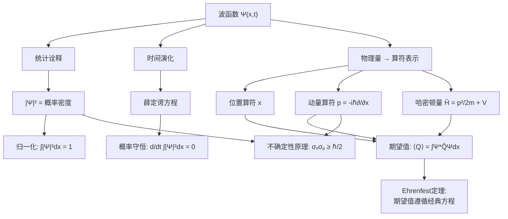

根据OUTLINE.md的要求，第1章"波函数"需要完成以下内容：

## 章节结构规划

| 小节 | 核心内容 | 数学重点 | 物理图景 |
|------|----------|----------|----------|
| 1.1 薛定谔方程 | 直接引入含时SE | 偏微分方程形式 | 从经典力学目标对比引入 |
| 1.2 统计诠释 | 玻恩诠释、测量问题 | 概率密度概念 | 三种哲学流派、波函数坍缩 |
| 1.3 概率 | 期望值、方差、标准差 | 统计学公式推导 | 量子涨落的数学基础 |
| 1.4 归一化 | 概率守恒 | 分部积分证明 | 边界条件的物理意义 |
| 1.5 动量 | 动量算符、Ehrenfest定理 | 期望值时间导数 | 经典-量子对应关系 |
| 1.6 不确定性原理 | 定性解释与定量陈述 | 德布罗意关系 | 测量的根本限制 |

## 写作要点

1. **循序渐进**：从经典力学过渡，建立物理直觉
2. **数学严谨**：每个重要结论都有完整推导
3. **习题设计**：每节3-5道习题，涵盖概念理解、计算练习、物理思考
4. **Key Takeaway**：每节末尾总结核心要点

---

# 第1章：波函数

> **本章核心问题**：量子力学的基本研究对象是什么？它如何描述物理世界？

在经典力学中，我们的目标是确定粒子的位置 $x(t)$——一旦知道了位置随时间的变化，我们就能计算速度、加速度、能量等所有物理量。给定初始条件和受力情况，牛顿第二定律 $F = ma$ 会告诉我们粒子如何运动。

量子力学彻底改变了这幅图景。我们不再追踪粒子的精确轨迹，转而研究一个称为**波函数**的数学对象 $\Psi(x,t)$。这个函数包含了关于粒子状态的所有信息，但它给出的不是确定的位置，而是**概率**。本章的目标是理解波函数的物理意义，掌握它的数学性质，并初步认识量子力学与经典力学的深刻差异。

---

## 1.1 薛定谔方程

### 1.1.1 从经典到量子：目标的转变

在经典力学中，描述一个粒子的运动意味着回答这样的问题：粒子在时刻 $t$ 的位置 $x(t)$ 是多少？给定初始位置 $x(0)$ 和初始速度 $v(0)$，牛顿方程

$$m\frac{d^2 x}{dt^2} = F(x, t)$$

唯一确定了粒子的未来轨迹。这是一条确定的、可预测的世界线。

量子力学放弃了这种决定论式的描述。我们不再问"粒子在哪里"，而是问"粒子在某处被发现的**概率**是多少"。这个概率由一个复值函数 $\Psi(x,t)$ 描述，称为**波函数**。

波函数本身不是物理可观测量——你不能直接测量 $\Psi$。但波函数的模方 $|\Psi(x,t)|^2$ 给出了在时刻 $t$、位置 $x$ 附近找到粒子的概率密度。这是量子力学的核心假设之一，我们将在下一节详细讨论。

### 1.1.2 含时薛定谔方程

现在的问题是：波函数 $\Psi(x,t)$ 如何随时间演化？在经典力学中，牛顿方程告诉我们 $x(t)$ 如何变化。在量子力学中，相应的角色由**薛定谔方程**扮演。

对于在势场 $V(x,t)$ 中运动的质量为 $m$ 的粒子，含时薛定谔方程为：

$$\boxed{i\hbar \frac{\partial \Psi}{\partial t} = -\frac{\hbar^2}{2m} \frac{\partial^2 \Psi}{\partial x^2} + V\Psi}$$

其中 $\hbar = h/2\pi$ 是约化普朗克常数，$h \approx 6.626 \times 10^{-34}$ J·s 是普朗克常数。

**关于这个方程，有几点需要立即说明：**

1. **我们不推导薛定谔方程**。就像牛顿定律不是从更基本的原理推导出来的一样，薛定谔方程是量子力学的基本假设。它的正确性来自于它的预言与实验的一致性。

2. **这是一个偏微分方程**。波函数 $\Psi(x,t)$ 依赖于空间坐标 $x$ 和时间 $t$，方程涉及对时间和空间的导数。

3. **方程中出现了虚数单位 $i$**。这意味着波函数一般是复值函数，这是量子力学区别于经典波动的关键特征之一。

4. **方程是线性的**。如果 $\Psi_1$ 和 $\Psi_2$ 都是解，那么它们的线性组合 $a\Psi_1 + b\Psi_2$ 也是解。这导致了著名的**叠加原理**。

### 1.1.3 方程的结构分析

让我们仔细审视薛定谔方程的结构。将方程重写：

$$i\hbar \frac{\partial \Psi}{\partial t} = \hat{H}\Psi$$

其中我们定义了**哈密顿算符**：

$$\hat{H} = -\frac{\hbar^2}{2m} \frac{\partial^2}{\partial x^2} + V(x,t)$$

这个算符对应于经典力学中的总能量。第一项 $-\frac{\hbar^2}{2m} \frac{\partial^2}{\partial x^2}$ 对应于动能 $\frac{p^2}{2m}$，第二项 $V(x,t)$ 是势能。

**为什么动能项是这个形式？** 这涉及到动量在量子力学中的表示。在量子力学中，动量被表示为一个**算符**：

$$\hat{p} = -i\hbar \frac{\partial}{\partial x}$$

因此，动能算符是：

$$\frac{\hat{p}^2}{2m} = \frac{1}{2m}\left(-i\hbar \frac{\partial}{\partial x}\right)^2 = -\frac{\hbar^2}{2m} \frac{\partial^2}{\partial x^2}$$

我们将在第1.5节详细讨论动量算符的来源。

### 1.1.4 一维与三维

本章我们主要讨论一维情况，即粒子沿 $x$ 轴运动。三维情况下的薛定谔方程是：

$$i\hbar \frac{\partial \Psi}{\partial t} = -\frac{\hbar^2}{2m} \nabla^2 \Psi + V\Psi$$

其中 $\nabla^2 = \frac{\partial^2}{\partial x^2} + \frac{\partial^2}{\partial y^2} + \frac{\partial^2}{\partial z^2}$ 是拉普拉斯算符。三维问题将在第4章详细讨论。

---

### 习题 1.1

**(a)** 验证：如果 $\Psi_1$ 和 $\Psi_2$ 都是同一个薛定谔方程的解，那么 $a\Psi_1 + b\Psi_2$（其中 $a$、$b$ 为任意复常数）也是解。

**(b)** 这个性质（叠加原理）在物理上意味着什么？举一个具体的物理例子说明。

**(c)** 牛顿方程 $m\ddot{x} = F(x)$ 是否具有类似的线性叠加性质？为什么？

---

### 习题 1.2

考虑自由粒子（$V = 0$）的薛定谔方程。验证以下函数是方程的解：

$$\Psi(x,t) = Ae^{i(kx - \omega t)}$$

并找出 $k$、$\omega$ 与粒子能量 $E$、动量 $p$ 之间的关系。（提示：将 $\Psi$ 代入方程，比较两边的系数。）

---

### Key Takeaway: 1.1 薛定谔方程

| 要点 | 内容 |
|------|------|
| **研究对象** | 波函数 $\Psi(x,t)$，一个复值函数 |
| **演化方程** | 含时薛定谔方程 $i\hbar \frac{\partial \Psi}{\partial t} = \hat{H}\Psi$ |
| **哈密顿算符** | $\hat{H} = -\frac{\hbar^2}{2m} \frac{\partial^2}{\partial x^2} + V$，对应总能量 |
| **动量算符** | $\hat{p} = -i\hbar \frac{\partial}{\partial x}$ |
| **核心特征** | 线性方程 → 叠加原理；复值函数 → 量子干涉 |

---

## 1.2 统计诠释

### 1.2.1 玻恩诠释

薛定谔方程告诉我们波函数如何演化，但它没有告诉我们波函数**是什么**。波函数的物理意义由**玻恩诠释**（Born interpretation）给出：

$$\boxed{|\Psi(x,t)|^2 dx = \text{在时刻 } t \text{、位置 } x \text{ 与 } x+dx \text{ 之间找到粒子的概率}}$$

更精确地说，$|\Psi(x,t)|^2$ 是**概率密度**。粒子在区域 $[a, b]$ 内被发现的概率是：

$$P(a \le x \le b) = \int_a^b |\Psi(x,t)|^2 dx$$

由于 $|\Psi|^2 = \Psi^* \Psi$（$\Psi^*$ 是 $\Psi$ 的复共轭），概率密度总是非负实数，这是物理上必需的。

**玻恩诠释是量子力学的核心假设之一。** 它将波函数——一个抽象的数学对象——与实验可观测量（测量位置得到特定结果的概率）联系起来。

### 1.2.2 测量前粒子在哪里？三种哲学立场

玻恩诠释引出了一个深刻的哲学问题：**在测量之前，粒子到底在哪里？**

这个问题看似简单，却触及了量子力学诠释的核心。历史上存在三种主要立场：

#### 立场一：实在论（爱因斯坦）

> "粒子在测量之前就有确定的位置，只是我们不知道而已。波函数反映了我们知识的缺乏，就像统计力学中的概率分布。"

这种观点认为量子力学是**不完备的**——存在我们尚未发现的"隐变量"，一旦知道了这些隐变量，粒子的行为就是完全确定的。爱因斯坦的名言"上帝不掷骰子"正是这种立场的体现。

#### 立场二：正统论（哥本哈根诠释，玻尔）

> "粒子在测量之前没有确定的位置。测量行为本身'创造'了粒子的位置。波函数描述的是一种'潜在性'，而非'实在性'。"

这种观点认为量子力学是**完备的**。测量不是揭示预先存在的属性，而是**使属性得以实现**。这导致了著名的**波函数坍缩**（wave function collapse）：测量瞬间，波函数从扩展的概率分布"坍缩"到测量结果对应的态。

#### 立场三：不可知论（泡利）

> "这个问题没有意义。物理学只关心可观测量的关系，'测量前粒子在哪里'不是一个可验证的问题，因此不值得讨论。"

这种立场强调**实证主义**：只讨论可以通过实验验证的命题。

#### 贝尔定理：正统论的胜利

1964年，约翰·贝尔（John Bell）证明了一个惊人的定理：**任何局域隐变量理论都不可能重现量子力学的所有预言。**

贝尔不等式给出了局域隐变量理论必须满足的限制。随后的实验（Aspect, 1982; 以及后来的更多精密实验）明确表明：**自然界违反贝尔不等式。**

这意味着：
- 爱因斯坦的局域实在论是错误的。
- 量子力学的非定域性是真实的——纠缠粒子之间存在超越经典直觉的关联。
- 正统诠释（或其变体）更接近物理实在的本质。

**我们将在第12章详细讨论贝尔定理。** 在此之前，我们采用实用主义立场：波函数提供了计算测量概率的规则，至于"测量前发生了什么"，我们暂时搁置。

### 1.2.3 波函数坍缩

正统诠释引入了一个关键概念：**波函数坍缩**。

假设粒子的波函数是 $\Psi(x,0)$，在 $t=0$ 时刻我们测量其位置，结果发现粒子在 $x_0$ 附近。那么，测量**之后**的瞬间，波函数发生了什么变化？

答案是：波函数**坍缩**到测量结果对应的态。如果测量精度为 $\Delta x$，则测量后的波函数变成一个在 $x_0$ 附近宽度为 $\Delta x$ 的窄峰。

**坍缩的特点：**

1. **非幺正过程**：薛定谔方程描述的是连续、可逆的幺正演化，而坍缩是瞬间、不可逆的。这意味着坍缩不能用薛定谔方程描述。

2. **概率性**：坍缩结果是随机的，只能预测概率，不能预测具体结果。

3. **测量问题**：什么算作"测量"？测量仪器也是量子系统，为什么它不遵循薛定谔方程？这是量子力学基础中著名的**测量问题**，至今仍在研究中。

### 1.2.4 一个具体例子

让我们用一个简单例子来理解统计诠释。假设某粒子的波函数在 $t=0$ 时刻为：

$$\Psi(x,0) = \begin{cases} A\sqrt{a - |x|} & \text{if } |x| < a \\ 0 & \text{if } |x| \ge a \end{cases}$$

其中 $A$ 是待定常数，$a > 0$ 是给定参数。

**问题：粒子在原点右侧（$x > 0$）被发现的概率是多少？**

首先，我们需要确定归一化常数 $A$。根据概率守恒：

$$\int_{-\infty}^{\infty} |\Psi(x,0)|^2 dx = 1$$

计算：

$$\int_{-a}^{a} |A|^2 (a - |x|) dx = |A|^2 \cdot 2\int_0^a (a - x) dx = |A|^2 \cdot 2 \left[ ax - \frac{x^2}{2} \right]_0^a = |A|^2 \cdot a^2$$

因此 $|A|^2 a^2 = 1$，取 $A$ 为正实数，得 $A = 1/a$。

现在计算粒子在 $x > 0$ 的概率：

$$P(x > 0) = \int_0^a |\Psi|^2 dx = \frac{1}{a^2} \int_0^a (a - x) dx = \frac{1}{a^2} \cdot \frac{a^2}{2} = \frac{1}{2}$$

这个结果是合理的：由于波函数关于原点对称，粒子在左右两侧的概率相等。

---

### 习题 1.3

假设粒子的波函数为：

$$\Psi(x,0) = \begin{cases} A(a - |x|) & \text{if } |x| < a \\ 0 & \text{otherwise} \end{cases}$$

**(a)** 求归一化常数 $A$。

**(b)** 计算 $P(-a/2 < x < a/2)$。

**(c)** 在哪个位置找到粒子的概率密度最大？

---

### 习题 1.4（思考题）

考虑以下陈述："波函数坍缩意味着信息瞬间传播，这违反了相对论。" 

请分析这个陈述。坍缩是否真的传递了信息？如果能，如何传递？如果不能，为什么？（提示：考虑两个纠缠粒子的情形，测量其中一个是否能让你向远处发送信号？）

---

### Key Takeaway: 1.2 统计诠释

| 要点 | 内容 |
|------|------|
| **玻恩诠释** | $|\Psi(x,t)|^2$ 是概率密度 |
| **概率计算** | $P(a \le x \le b) = \int_a^b |\Psi|^2 dx$ |
| **三种立场** | 实在论（隐变量）、正统论（坍缩）、不可知论 |
| **贝尔定理** | 排除了局域隐变量理论，支持量子力学的非定域性 |
| **波函数坍缩** | 测量瞬间波函数突变，不能用薛定谔方程描述 |

---

## 1.3 概率

### 1.3.1 为什么需要概率论？

量子力学的核心特征是**概率性**。即使我们完全知道了波函数，也只能预测测量结果的概率，而非确定的结果。因此，掌握概率论的基本工具是学习量子力学的必要准备。

本节复习概率论的基本概念，并建立量子力学中计算期望值和不确定性的数学框架。

### 1.3.2 离散随机变量

设随机变量 $j$ 可以取离散值 $j_1, j_2, j_3, \ldots$，取值 $j_n$ 的概率为 $P(j_n)$。概率满足归一化条件：

$$\sum_n P(j_n) = 1$$

**期望值（平均值）**定义为：

$$\langle j \rangle = \sum_n j_n P(j_n)$$

期望值告诉我们"平均而言"会得到什么结果。注意：期望值不一定是 $j$ 可能取的值之一。例如，掷骰子的期望值是 $3.5$，但你永远掷不出 $3.5$。

**方差**衡量测量结果围绕期望值的离散程度：

$$\sigma^2 = \langle (j - \langle j \rangle)^2 \rangle = \sum_n (j_n - \langle j \rangle)^2 P(j_n)$$

方差开方得到**标准差** $\sigma$，它具有与 $j$ 相同的量纲，物理意义更直观。

**重要恒等式**：方差可以简化计算：

$$\boxed{\sigma^2 = \langle j^2 \rangle - \langle j \rangle^2}$$

**证明**：

$$\begin{align}
\sigma^2 &= \langle (j - \langle j \rangle)^2 \rangle = \langle j^2 - 2j\langle j \rangle + \langle j \rangle^2 \rangle \\
&= \langle j^2 \rangle - 2\langle j \rangle\langle j \rangle + \langle j \rangle^2 \\
&= \langle j^2 \rangle - \langle j \rangle^2
\end{align}$$

这里我们用到了期望值的线性性质：$\langle a + b \rangle = \langle a \rangle + \langle b \rangle$，以及 $\langle c \cdot j \rangle = c\langle j \rangle$（$c$ 为常数）。

### 1.3.3 连续随机变量

对于连续变量 $x$，概率 $P(x)$ 变为概率密度 $\rho(x)$。粒子在 $[a, b]$ 区间内的概率为：

$$P(a \le x \le b) = \int_a^b \rho(x) dx$$

归一化条件：

$$\int_{-\infty}^{\infty} \rho(x) dx = 1$$

期望值和方差的定义与离散情况类似，只需将求和换成积分：

$$\langle x \rangle = \int_{-\infty}^{\infty} x \rho(x) dx$$

$$\sigma^2 = \langle x^2 \rangle - \langle x \rangle^2 = \int_{-\infty}^{\infty} x^2 \rho(x) dx - \left( \int_{-\infty}^{\infty} x \rho(x) dx \right)^2$$

### 1.3.4 量子力学中的期望值

在量子力学中，概率密度由波函数给出：$\rho(x) = |\Psi(x,t)|^2$。因此，位置 $x$ 的期望值为：

$$\boxed{\langle x \rangle = \int_{-\infty}^{\infty} x |\Psi(x,t)|^2 dx}$$

更一般地，对于任意位置函数 $f(x)$：

$$\langle f(x) \rangle = \int_{-\infty}^{\infty} f(x) |\Psi(x,t)|^2 dx$$

**注意**：$\langle x \rangle$ 一般是时间的函数，因为波函数随时间演化。粒子可能"移动"，即 $\langle x \rangle$ 随时间变化。

### 1.3.5 例子：高斯波包

考虑一个归一化的高斯波包：

$$|\Psi(x,0)|^2 = \frac{1}{\sqrt{2\pi}\sigma} e^{-\frac{(x-x_0)^2}{2\sigma^2}}$$

这是一个以 $x_0$ 为中心、宽度为 $\sigma$ 的高斯分布。

**计算期望值**：

$$\langle x \rangle = \int_{-\infty}^{\infty} x \cdot \frac{1}{\sqrt{2\pi}\sigma} e^{-\frac{(x-x_0)^2}{2\sigma^2}} dx$$

令 $u = x - x_0$，则 $x = u + x_0$，$dx = du$：

$$\langle x \rangle = \frac{1}{\sqrt{2\pi}\sigma} \int_{-\infty}^{\infty} (u + x_0) e^{-\frac{u^2}{2\sigma^2}} du = x_0$$

第一个积分 $\int u e^{-u^2/2\sigma^2} du = 0$（奇函数在对称区间积分），第二个积分给出归一化条件 $= 1$。

**计算方差**：

$$\langle x^2 \rangle = \int_{-\infty}^{\infty} x^2 \cdot \frac{1}{\sqrt{2\pi}\sigma} e^{-\frac{(x-x_0)^2}{2\sigma^2}} dx$$

同样令 $u = x - x_0$：

$$\langle x^2 \rangle = \frac{1}{\sqrt{2\pi}\sigma} \int_{-\infty}^{\infty} (u + x_0)^2 e^{-\frac{u^2}{2\sigma^2}} du$$

展开 $(u + x_0)^2 = u^2 + 2x_0 u + x_0^2$：

$$\langle x^2 \rangle = \frac{1}{\sqrt{2\pi}\sigma} \left[ \int_{-\infty}^{\infty} u^2 e^{-\frac{u^2}{2\sigma^2}} du + 2x_0 \underbrace{\int_{-\infty}^{\infty} u e^{-\frac{u^2}{2\sigma^2}} du}_{=0} + x_0^2 \underbrace{\int_{-\infty}^{\infty} e^{-\frac{u^2}{2\sigma^2}} du}_{=\sqrt{2\pi}\sigma} \right]$$

第一个积分是高斯分布的二阶矩，结果为 $\sqrt{2\pi}\sigma \cdot \sigma^2$。因此：

$$\langle x^2 \rangle = \sigma^2 + x_0^2$$

方差：

$$\sigma_x^2 = \langle x^2 \rangle - \langle x \rangle^2 = \sigma^2 + x_0^2 - x_0^2 = \sigma^2$$

这正是我们预期的：高斯分布的参数 $\sigma$ 就是标准差。

---

### 习题 1.5

证明对于任意概率分布，方差 $\sigma^2 \ge 0$。在什么情况下 $\sigma^2 = 0$？这在物理上意味着什么？

---

### 习题 1.6

设粒子的波函数为 $\Psi(x) = A e^{-\lambda|x|}$（$\lambda > 0$）。

**(a)** 归一化波函数，求 $A$。

**(b)** 计算 $\langle x \rangle$ 和 $\langle x^2 \rangle$。

**(c)** 计算位置的标准差 $\sigma_x$。

**(d)** 在哪个位置概率密度最大？这与 $\langle x \rangle$ 是否相同？

---

### 习题 1.7

考虑一个离散系统，粒子只能处于三个位置：$x_1 = -a$，$x_2 = 0$，$x_3 = a$，概率分别为 $P_1$，$P_2$，$P_3$。

**(a)** 写出归一化条件。

**(b)** 若 $P_1 = P_3 = \frac{1}{4}$，求 $P_2$，并计算 $\langle x \rangle$ 和 $\sigma_x$。

**(c)** 若 $P_1 = P_2 = P_3 = \frac{1}{3}$，$\langle x \rangle$ 和 $\sigma_x$ 是多少？解释结果。

---

### Key Takeaway: 1.3 概率

| 概念 | 离散情况 | 连续情况 |
|------|----------|----------|
| **概率** | $P(j_n)$ | $\rho(x) dx$ |
| **归一化** | $\sum_n P(j_n) = 1$ | $\int \rho(x) dx = 1$ |
| **期望值** | $\langle j \rangle = \sum_n j_n P(j_n)$ | $\langle x \rangle = \int x \rho(x) dx$ |
| **方差** | $\sigma^2 = \langle j^2 \rangle - \langle j \rangle^2$ | $\sigma^2 = \langle x^2 \rangle - \langle x \rangle^2$ |
| **量子力学** | — | $\rho(x) = |\Psi(x,t)|^2$ |

---

## 1.4 归一化

### 1.4.1 归一化的物理意义

根据统计诠释，$|\Psi(x,t)|^2$ 是概率密度。既然粒子一定存在于某处，概率密度在全空间的积分必须等于 1：

$$\boxed{\int_{-\infty}^{\infty} |\Psi(x,t)|^2 dx = 1}$$

这称为**归一化条件**。满足这个条件的波函数称为**归一化的**。

**问题**：如果给定的波函数不满足归一化条件怎么办？

**答案**：如果 $\int |\Psi|^2 dx = N \neq 1$（$N$ 为有限正数），我们可以将波函数重新归一化：

$$\Psi_{\text{归一化}} = \frac{1}{\sqrt{N}} \Psi$$

这样：

$$\int \left| \frac{1}{\sqrt{N}} \Psi \right|^2 dx = \frac{1}{N} \int |\Psi|^2 dx = \frac{N}{N} = 1$$

**注意**：并非所有波函数都可以归一化。如果 $\int |\Psi|^2 dx$ 发散，则波函数不能表示单个粒子。这类波函数（如平面波）需要特殊处理，我们将在第2章讨论。

### 1.4.2 概率守恒

归一化条件在 $t=0$ 时刻成立。问题是：**波函数随时间演化后，归一化条件是否仍然成立？**

换句话说，粒子会不会"消失"或"凭空出现"？答案是否定的。我们来证明这一点。

**定理**：如果波函数 $\Psi(x,t)$ 满足薛定谔方程，且在 $t=0$ 时归一化，则在任意时刻 $t$ 都归一化。

**证明**：

定义总概率：

$$P(t) = \int_{-\infty}^{\infty} |\Psi(x,t)|^2 dx = \int_{-\infty}^{\infty} \Psi^* \Psi dx$$

对时间求导：

$$\frac{dP}{dt} = \int_{-\infty}^{\infty} \left( \frac{\partial \Psi^*}{\partial t} \Psi + \Psi^* \frac{\partial \Psi}{\partial t} \right) dx$$

利用薛定谔方程：

$$\frac{\partial \Psi}{\partial t} = \frac{i\hbar}{2m} \frac{\partial^2 \Psi}{\partial x^2} - \frac{i}{\hbar} V\Psi$$

取复共轭：

$$\frac{\partial \Psi^*}{\partial t} = -\frac{i\hbar}{2m} \frac{\partial^2 \Psi^*}{\partial x^2} + \frac{i}{\hbar} V\Psi^*$$

（注意：假设 $V$ 是实函数。）

代入 $\frac{dP}{dt}$：

$$\frac{dP}{dt} = \int_{-\infty}^{\infty} \left[ \left( -\frac{i\hbar}{2m} \frac{\partial^2 \Psi^*}{\partial x^2} + \frac{i}{\hbar} V\Psi^* \right) \Psi + \Psi^* \left( \frac{i\hbar}{2m} \frac{\partial^2 \Psi}{\partial x^2} - \frac{i}{\hbar} V\Psi \right) \right] dx$$

含 $V$ 的项相互抵消：

$$\frac{dP}{dt} = \frac{i\hbar}{2m} \int_{-\infty}^{\infty} \left( \Psi^* \frac{\partial^2 \Psi}{\partial x^2} - \frac{\partial^2 \Psi^*}{\partial x^2} \Psi \right) dx$$

现在使用**分部积分**：

$$\int_{-\infty}^{\infty} \Psi^* \frac{\partial^2 \Psi}{\partial x^2} dx = \left[ \Psi^* \frac{\partial \Psi}{\partial x} \right]_{-\infty}^{\infty} - \int_{-\infty}^{\infty} \frac{\partial \Psi^*}{\partial x} \frac{\partial \Psi}{\partial x} dx$$

对于可归一化的波函数，当 $|x| \to \infty$ 时 $\Psi \to 0$（否则积分发散），因此边界项为零：

$$\int_{-\infty}^{\infty} \Psi^* \frac{\partial^2 \Psi}{\partial x^2} dx = - \int_{-\infty}^{\infty} \frac{\partial \Psi^*}{\partial x} \frac{\partial \Psi}{\partial x} dx$$

同理：

$$\int_{-\infty}^{\infty} \frac{\partial^2 \Psi^*}{\partial x^2} \Psi dx = - \int_{-\infty}^{\infty} \frac{\partial \Psi^*}{\partial x} \frac{\partial \Psi}{\partial x} dx$$

因此两项相等，相减为零：

$$\frac{dP}{dt} = 0$$

**证毕。**

### 1.4.3 概率流密度

上述证明可以更深入地理解。定义**概率流密度**（probability current）：

$$\boxed{J(x,t) = \frac{i\hbar}{2m} \left( \Psi \frac{\partial \Psi^*}{\partial x} - \Psi^* \frac{\partial \Psi}{\partial x} \right)}$$

可以验证，$J$ 是实数（$J^* = J$）。

利用薛定谔方程，可以推导出**概率连续性方程**：

$$\frac{\partial |\Psi|^2}{\partial t} + \frac{\partial J}{\partial x} = 0$$

这类似于流体力学中的质量守恒方程或电磁学中的电荷守恒方程。它表明：概率密度在某点的变化率等于概率流流入该点的净速率。

对全空间积分：

$$\frac{d}{dt} \int_{-\infty}^{\infty} |\Psi|^2 dx = -\int_{-\infty}^{\infty} \frac{\partial J}{\partial x} dx = -[J]_{-\infty}^{\infty}$$

对于归一化波函数，$J(\pm\infty) = 0$，因此概率守恒。

### 1.4.4 边界条件

概率守恒的证明依赖于边界条件：当 $|x| \to \infty$ 时，$\Psi \to 0$ 足够快使得积分收敛。

这个边界条件有深刻的物理意义：
1. **粒子被限制在有限区域**：波函数在无穷远处为零意味着粒子不可能在无穷远处被发现。
2. **平方可积**：波函数属于希尔伯特空间 $L^2$（平方可积函数空间）。
3. **物理可实现性**：真实的物理系统（如束缚态）都满足这个条件。

---

### 习题 1.8

证明概率流密度 $J$ 可以写成：

$$J = \frac{\hbar}{m} \text{Im}\left( \Psi^* \frac{\partial \Psi}{\partial x} \right) = \frac{\hbar}{m} |\Psi|^2 \frac{\partial \phi}{\partial x}$$

其中 $\Psi = |\Psi| e^{i\phi}$，$\phi$ 是波函数的相位。

---

### 习题 1.9

考虑自由粒子的平面波 $\Psi(x,t) = Ae^{i(kx-\omega t)}$。

**(a)** 这个波函数是否可归一化？

**(b)** 计算概率流密度 $J$。

**(c)** 解释 $J$ 的物理意义。（提示：考虑 $J/|\Psi|^2$）

---

### 习题 1.10

在 $t=0$ 时刻，粒子的波函数为：

$$\Psi(x,0) = Ae^{-ax^2}$$

其中 $a > 0$ 是实常数。

**(a)** 归一化波函数，求 $A$。

**(b)** 假设势能 $V(x) = \frac{1}{2}m\omega^2 x^2$（谐振子势），波函数随时间演化。在 $t > 0$ 时刻，波函数是否仍然归一化？为什么？

---

### Key Takeaway: 1.4 归一化

| 要点 | 内容 |
|------|------|
| **归一化条件** | $\int_{-\infty}^{\infty} |\Psi|^2 dx = 1$ |
| **重新归一化** | $\Psi \to \Psi/\sqrt{N}$，其中 $N = \int |\Psi|^2 dx$ |
| **概率守恒** | $\frac{d}{dt}\int |\Psi|^2 dx = 0$（需满足边界条件） |
| **概率流密度** | $J = \frac{i\hbar}{2m}\left(\Psi\frac{\partial\Psi^*}{\partial x} - \Psi^*\frac{\partial\Psi}{\partial x}\right)$ |
| **连续性方程** | $\frac{\partial|\Psi|^2}{\partial t} + \frac{\partial J}{\partial x} = 0$ |
| **边界条件** | $|x| \to \infty$ 时 $\Psi \to 0$（平方可积） |

---

## 1.5 动量

### 1.5.1 位置期望值的时间演化

我们已经知道如何计算位置的期望值 $\langle x \rangle$。现在问：**$\langle x \rangle$ 如何随时间变化？**

这个问题将引导我们发现动量在量子力学中的表示。

计算 $\langle x \rangle$ 对时间的导数：

$$\frac{d\langle x \rangle}{dt} = \frac{d}{dt} \int_{-\infty}^{\infty} x |\Psi|^2 dx = \int_{-\infty}^{\infty} x \frac{\partial}{\partial t}(\Psi^*\Psi) dx$$

利用概率连续性方程 $\frac{\partial|\Psi|^2}{\partial t} = -\frac{\partial J}{\partial x}$：

$$\frac{d\langle x \rangle}{dt} = -\int_{-\infty}^{\infty} x \frac{\partial J}{\partial x} dx$$

分部积分：

$$\frac{d\langle x \rangle}{dt} = -[xJ]_{-\infty}^{\infty} + \int_{-\infty}^{\infty} J dx$$

边界项为零（因为 $\Psi(\pm\infty) = 0$），所以：

$$\frac{d\langle x \rangle}{dt} = \int_{-\infty}^{\infty} J dx$$

代入概率流密度的表达式：

$$J = \frac{i\hbar}{2m}\left(\Psi\frac{\partial\Psi^*}{\partial x} - \Psi^*\frac{\partial\Psi}{\partial x}\right)$$

$$\frac{d\langle x \rangle}{dt} = \frac{i\hbar}{2m} \int_{-\infty}^{\infty} \left(\Psi\frac{\partial\Psi^*}{\partial x} - \Psi^*\frac{\partial\Psi}{\partial x}\right) dx$$

对第一项分部积分：

$$\int_{-\infty}^{\infty} \Psi\frac{\partial\Psi^*}{\partial x} dx = [\Psi\Psi^*]_{-\infty}^{\infty} - \int_{-\infty}^{\infty} \frac{\partial\Psi}{\partial x}\Psi^* dx = -\int_{-\infty}^{\infty} \Psi^*\frac{\partial\Psi}{\partial x} dx$$

因此：

$$\frac{d\langle x \rangle}{dt} = \frac{i\hbar}{2m} \left( -\int_{-\infty}^{\infty} \Psi^*\frac{\partial\Psi}{\partial x} dx - \int_{-\infty}^{\infty} \Psi^*\frac{\partial\Psi}{\partial x} dx \right) = -\frac{i\hbar}{m} \int_{-\infty}^{\infty} \Psi^*\frac{\partial\Psi}{\partial x} dx$$

### 1.5.2 动量算符的引入

将上式重写：

$$\frac{d\langle x \rangle}{dt} = \int_{-\infty}^{\infty} \Psi^* \left( \frac{\hbar}{i} \frac{\partial}{\partial x} \right) \Psi dx$$

在经典力学中，$\frac{dx}{dt} = v = \frac{p}{m}$，即 $p = m\frac{dx}{dt}$。类比地，我们定义：

$$\boxed{\langle p \rangle = m\frac{d\langle x \rangle}{dt} = \int_{-\infty}^{\infty} \Psi^* \left( \frac{\hbar}{i} \frac{\partial}{\partial x} \right) \Psi dx}$$

这引出了**动量算符**：

$$\boxed{\hat{p} = -i\hbar \frac{\partial}{\partial x} = \frac{\hbar}{i} \frac{\partial}{\partial x}}$$

动量期望值的计算公式：

$$\langle p \rangle = \int_{-\infty}^{\infty} \Psi^* \hat{p} \Psi dx = \int_{-\infty}^{\infty} \Psi^* \left( -i\hbar \frac{\partial}{\partial x} \right) \Psi dx$$

**物理意义**：动量在量子力学中不是一个简单的数值，而是一个**算符**。当我们说"测量动量"，实际上是在用动量算符作用于波函数。

### 1.5.3 算符期望值的一般形式

位置和动量期望值的计算可以统一写成"三明治"形式：

$$\langle Q \rangle = \int_{-\infty}^{\infty} \Psi^* \hat{Q} \Psi dx$$

其中 $\hat{Q}$ 是对应于物理量 $Q$ 的算符。

| 物理量 | 算符 |
|--------|------|
| 位置 $x$ | $\hat{x} = x$（乘以 $x$） |
| 动量 $p$ | $\hat{p} = -i\hbar \frac{\partial}{\partial x}$ |
| 动能 $T = \frac{p^2}{2m}$ | $\hat{T} = -\frac{\hbar^2}{2m} \frac{\partial^2}{\partial x^2}$ |
| 哈密顿量 $H = T + V$ | $\hat{H} = -\frac{\hbar^2}{2m} \frac{\partial^2}{\partial x^2} + V(x)$ |

### 1.5.4 Ehrenfest 定理

现在我们计算 $\langle p \rangle$ 对时间的导数：

$$\frac{d\langle p \rangle}{dt} = \frac{d}{dt} \int_{-\infty}^{\infty} \Psi^* \hat{p} \Psi dx = \int_{-\infty}^{\infty} \left( \frac{\partial \Psi^*}{\partial t} \hat{p} \Psi + \Psi^* \hat{p} \frac{\partial \Psi}{\partial t} \right) dx$$

利用薛定谔方程及其复共轭：

$$\frac{\partial \Psi}{\partial t} = \frac{1}{i\hbar} \hat{H}\Psi, \quad \frac{\partial \Psi^*}{\partial t} = -\frac{1}{i\hbar} (\hat{H}\Psi)^*$$

代入：

$$\frac{d\langle p \rangle}{dt} = \frac{1}{i\hbar} \int_{-\infty}^{\infty} \left( -(\hat{H}\Psi)^* \hat{p}\Psi + \Psi^* \hat{p}\hat{H}\Psi \right) dx$$

对于实势能 $V(x)$，经过计算（利用分部积分和边界条件）可得：

$$\boxed{\frac{d\langle p \rangle}{dt} = \left\langle -\frac{\partial V}{\partial x} \right\rangle}$$

这就是**Ehrenfest 定理**的一维形式。

**物理意义**：期望值遵循经典力学方程！

$$\frac{d\langle x \rangle}{dt} = \frac{\langle p \rangle}{m}, \quad \frac{d\langle p \rangle}{dt} = \left\langle -\frac{\partial V}{\partial x} \right\rangle$$

这正是牛顿第二定律 $F = ma$ 的量子对应：

$$\frac{d\langle p \rangle}{dt} = \langle F \rangle$$

**注意**：这不是说粒子遵循经典轨迹。$\langle x \rangle$ 和 $\langle p \rangle$ 是期望值，粒子本身的位置和动量都是不确定的。但当不确定性很小时（宏观极限），量子期望值的行为趋近于经典力学。

### 1.5.5 例子：自由粒子

对于自由粒子（$V = 0$），Ehrenfest 定理给出：

$$\frac{d\langle p \rangle}{dt} = 0$$

动量期望值守恒。同时：

$$\frac{d\langle x \rangle}{dt} = \frac{\langle p \rangle}{m} = \text{常数}$$

因此：

$$\langle x \rangle(t) = \langle x \rangle(0) + \frac{\langle p \rangle}{m} t$$

波包的"中心"以恒定速度移动，就像经典粒子一样。

---

### 习题 1.11

证明：对于任意实势能 $V(x)$，有

$$\frac{d\langle T \rangle}{dt} = -\frac{\hbar}{m} \text{Im} \int_{-\infty}^{\infty} \frac{\partial \Psi^*}{\partial x} \frac{\partial V}{\partial x} \Psi dx$$

其中 $\langle T \rangle$ 是动能期望值。

---

### 习题 1.12

设粒子的波函数为 $\Psi(x,t) = Ae^{-a(ax^2 + ibt)}$，其中 $a > 0$，$b$ 为实常数。

**(a)** 归一化波函数，求 $A$（作为 $a$ 的函数）。

**(b)** 计算 $\langle x \rangle$ 和 $\langle p \rangle$。

**(c)** 验证 $\frac{d\langle x \rangle}{dt} = \frac{\langle p \rangle}{m}$。

**(d)** 这个波函数是否满足自由粒子的薛定谔方程？如果是，$a$ 和 $b$ 之间有什么关系？

---

### 习题 1.13

利用 Ehrenfest 定理证明：对于谐振子势 $V(x) = \frac{1}{2}m\omega^2 x^2$，期望值 $\langle x \rangle(t)$ 满足经典谐振子方程：

$$\frac{d^2\langle x \rangle}{dt^2} + \omega^2 \langle x \rangle = 0$$

---

### Key Takeaway: 1.5 动量

| 要点 | 内容 |
|------|------|
| **动量算符** | $\hat{p} = -i\hbar \frac{\partial}{\partial x}$ |
| **期望值形式** | $\langle Q \rangle = \int \Psi^* \hat{Q} \Psi dx$ |
| **Ehrenfest 定理** | $\frac{d\langle x \rangle}{dt} = \frac{\langle p \rangle}{m}$，$\frac{d\langle p \rangle}{dt} = \langle -\frac{\partial V}{\partial x} \rangle$ |
| **经典对应** | 期望值遵循牛顿方程 |
| **物理意义** | 量子力学的期望值在宏观极限下回归经典力学 |

---

## 1.6 不确定性原理

### 1.6.1 定性理解：从经典波到量子波

在深入数学推导之前，让我们先建立不确定性原理的物理直觉。

考虑一根振动的绳子。如果我们问："波在哪里？"——答案取决于波的类型：

- **一个尖锐的脉冲**：位置非常明确，但它不是一个周期性的波，很难定义"波长"。
- **一个完美的正弦波**：波长非常明确，但波延伸到整个绳子，位置完全不确定。

这不是量子力学的特殊性质，而是**波动的普遍性质**：位置精确性和波长精确性是互斥的。

德布罗意关系 $p = h/\lambda = \hbar k$ 将波长与动量联系起来。因此，**位置的不确定性和动量的不确定性必然相关**：

$$\Delta x \cdot \Delta \lambda \sim 1 \quad \Rightarrow \quad \Delta x \cdot \Delta p \sim \hbar$$

这就是不确定性原理的物理根源。

### 1.6.2 标准差作为不确定性

在量子力学中，我们用**标准差**来量化不确定性：

$$\sigma_x = \sqrt{\langle x^2 \rangle - \langle x \rangle^2}$$

$$\sigma_p = \sqrt{\langle p^2 \rangle - \langle p \rangle^2}$$

标准差衡量测量结果围绕期望值的离散程度。如果 $\sigma_x = 0$，每次测量位置都得到相同的结果 $\langle x \rangle$；如果 $\sigma_x$ 很大，测量结果分散在很宽的范围内。

### 1.6.3 海森堡不确定性原理

**海森堡不确定性原理**指出：

$$\boxed{\sigma_x \sigma_p \ge \frac{\hbar}{2}}$$

这意味着：**不可能同时精确知道粒子的位置和动量。** 如果位置测量很精确（$\sigma_x$ 小），动量必然很不确定（$\sigma_p$ 大），反之亦然。

**严格证明将在第3章给出**，那里我们将利用施瓦茨不等式和对易关系。这里我们只给出物理理解和应用。

### 1.6.4 物理意义

不确定性原理不是测量技术的限制，而是**自然的根本性质**。它不是"我们无法同时精确测量位置和动量"，而是"粒子根本不同时具有确定的位置和动量"。

这可以通过以下思想实验理解：

**海森堡显微镜**：假设我们要用光测量电子的位置。光的波长 $\lambda$ 决定了位置测量的精度：$\Delta x \sim \lambda$。但光子带有动量 $p = h/\lambda$，当光子撞击电子时，会传递不可预测的动量，导致电子动量的不确定性 $\Delta p \sim h/\lambda$。因此 $\Delta x \cdot \Delta p \sim h$。

这个思想实验说明了测量过程的根本限制，但不确定性原理更深刻：即使不进行任何测量，粒子也不具有同时确定的位置和动量。

### 1.6.5 最小不确定性波包

不确定性原理允许 $\sigma_x \sigma_p = \hbar/2$ 吗？答案是肯定的。达到这个下限的波函数称为**最小不确定性波包**。

可以证明，**高斯波包**是最小不确定性波包：

$$\Psi(x) = A e^{-ax^2} e^{ikx}$$

其中 $a > 0$，$k$ 是实数。对于这个波函数：

$$\sigma_x = \frac{1}{\sqrt{4a}}, \quad \sigma_p = \hbar\sqrt{a}$$

因此：

$$\sigma_x \sigma_p = \frac{\hbar}{2}$$

恰好达到不确定性原理的下限。

### 1.6.6 能量-时间不确定性原理

另一个重要的不确定性关系是：

$$\boxed{\sigma_E \sigma_t \ge \frac{\hbar}{2}}$$

这里 $\sigma_E$ 是能量的不确定性，$\sigma_t$ 是时间的某种"不确定性"。

**注意**：这个关系与位置-动量不确定性原理有本质区别。时间 $t$ 不是算符，也不是可观测量，而是一个参数。$\sigma_t$ 的含义需要仔细解释：

- 对于不稳定态，$\sigma_t$ 是态的寿命，$\sigma_E$ 是能级宽度。
- 对于演化系统，$\sigma_t$ 是可观测量发生显著变化所需的时间。

**Mandelstam-Tamm 形式**：设可观测量 $A$ 的期望值为 $\langle A \rangle$，定义特征时间：

$$\tau_A = \frac{\sigma_A}{|d\langle A \rangle/dt|}$$

则：

$$\sigma_E \cdot \tau_A \ge \frac{\hbar}{2}$$

这表示：能量越确定的态，演化越慢。

### 1.6.7 应用例子

**例子：原子核的 $\alpha$ 衰变**

$\alpha$ 粒子在原子核内被束缚，但可以通过量子隧穿逃逸。设 $\alpha$ 粒子在核内的寿命为 $\tau \sim 10^{10}$ 年（对于 ${}^{238}\text{U}$），则能量不确定性：

$$\sigma_E \sim \frac{\hbar}{2\tau} \sim 10^{-54} \text{ J}$$

这非常小，说明衰变能是相当确定的。

**例子：共振态粒子**

某些短寿命粒子（如 $\Delta$ 重子）的寿命 $\tau \sim 10^{-23}$ s，对应的能量宽度：

$$\sigma_E \sim \frac{\hbar}{2\tau} \sim 100 \text{ MeV}$$

这就是为什么在粒子物理实验中，共振态表现为很宽的"峰"而非尖锐的谱线。

---

### 习题 1.14

一个粒子的位置不确定度为 $\sigma_x = 1.0 \times 10^{-10}$ m（约一个原子的大小）。

**(a)** 估计动量的最小不确定度 $\sigma_p$。

**(b)** 如果粒子是电子（$m = 9.11 \times 10^{-31}$ kg），速度的不确定度 $\sigma_v$ 是多少？

**(c)** 这个不确定度与电子在原子中的典型速度（约 $10^6$ m/s）相比如何？

---

### 习题 1.15

证明：如果波函数是实函数（$\Psi^* = \Psi$），则 $\langle p \rangle = 0$。

**提示**：直接计算 $\langle p \rangle = \int \Psi (-i\hbar \frac{\partial}{\partial x}) \Psi dx$，利用分部积分。

---

### 习题 1.16

考虑两个高斯波包：

- 波包 A：$\Psi_A(x) = A_A e^{-a_A x^2}$，其中 $a_A = a$
- 波包 B：$\Psi_B(x) = A_B e^{-a_B x^2}$，其中 $a_B = 4a$

**(a)** 计算两个波包的 $\sigma_x$ 和 $\sigma_p$。

**(b)** 验证两者都满足不确定性原理。

**(c)** 哪个波包的位置更确定？哪个的动量更确定？

**(d)** 两个波包的 $\sigma_x \sigma_p$ 乘积是否相同？为什么？

---

### 习题 1.17（挑战题）

设粒子的波函数为 $\Psi(x) = A e^{-|x|/a}$（$a > 0$）。

**(a)** 归一化波函数。

**(b)** 计算 $\langle x \rangle$，$\langle x^2 \rangle$，$\sigma_x$。

**(c)** 计算 $\langle p \rangle$，$\langle p^2 \rangle$，$\sigma_p$。

**(d)** 验证不确定性原理。

**(e)** 这个波函数是否是最小不确定性波包？如果不是，$\sigma_x \sigma_p$ 比下限 $\hbar/2$ 大多少倍？

---

### Key Takeaway: 1.6 不确定性原理

| 要点 | 内容 |
|------|------|
| **位置-动量不确定性** | $\sigma_x \sigma_p \ge \hbar/2$ |
| **物理根源** | 波动性质 + 德布罗意关系 |
| **最小不确定性波包** | 高斯波包达到下限 $\sigma_x \sigma_p = \hbar/2$ |
| **能量-时间不确定性** | $\sigma_E \sigma_t \ge \hbar/2$（时间不是算符） |
| **物理意义** | 不是测量限制，而是自然的根本性质 |

---

## 本章总结

### 核心概念图



### 关键公式汇总

| 公式名称 | 表达式 |
|----------|--------|
| 含时薛定谔方程 | $i\hbar \frac{\partial \Psi}{\partial t} = -\frac{\hbar^2}{2m} \frac{\partial^2 \Psi}{\partial x^2} + V\Psi$ |
| 归一化条件 | $\int_{-\infty}^{\infty} |\Psi|^2 dx = 1$ |
| 概率流密度 | $J = \frac{i\hbar}{2m}\left(\Psi\frac{\partial\Psi^*}{\partial x} - \Psi^*\frac{\partial\Psi}{\partial x}\right)$ |
| 连续性方程 | $\frac{\partial|\Psi|^2}{\partial t} + \frac{\partial J}{\partial x} = 0$ |
| 动量算符 | $\hat{p} = -i\hbar \frac{\partial}{\partial x}$ |
| 期望值 | $\langle Q \rangle = \int \Psi^* \hat{Q} \Psi dx$ |
| 方差 | $\sigma^2 = \langle Q^2 \rangle - \langle Q \rangle^2$ |
| Ehrenfest 定理 | $\frac{d\langle p \rangle}{dt} = \langle -\frac{\partial V}{\partial x} \rangle$ |
| 不确定性原理 | $\sigma_x \sigma_p \ge \frac{\hbar}{2}$ |

### 物理图景建立

1. **量子力学的核心转变**：从决定论轨迹到概率分布。波函数 $\Psi(x,t)$ 包含了系统的全部信息，但给出的是概率性预言。

2. **测量的角色**：测量不是被动地揭示预先存在的属性，而是主动地"实现"属性。波函数坍缩是量子力学最神秘的特征之一。

3. **经典-量子对应**：Ehrenfest 定理表明，在期望值层面，量子力学回归经典力学。这是"对应原理"的体现。

4. **不确定性的根源**：不确定性原理不是技术限制，而是波粒二象性和德布罗意关系的必然结果。它揭示了自然的根本非决定论性质。

---

## 补充习题

### 习题 1.18

考虑波函数 $\Psi(x,0) = A e^{-|x|}$（$A$ 为归一化常数）。

**(a)** 求 $A$。

**(b)** 计算 $\langle x \rangle$，$\langle x^2 \rangle$，$\sigma_x$。

**(c)** 计算 $\langle p \rangle$。

**(d)** 这个波函数在 $x=0$ 处是否可导？这对物理量有什么影响？

---

### 习题 1.19

证明：对于任意归一化的波函数 $\Psi(x)$，有

$$\langle p \rangle = m \frac{d\langle x \rangle}{dt}$$

**提示**：从 $\langle x \rangle$ 的定义出发，利用薛定谔方程和分部积分。

---

### 习题 1.20（编程题）

使用 Python 或其他编程语言，完成以下任务：

**(a)** 定义一个高斯波包 $\Psi(x) = (2a/\pi)^{1/4} e^{-ax^2}$，取 $a = 1$。

**(b)** 数值计算 $|\Psi(x)|^2$ 并作图。

**(c)** 数值计算 $\langle x \rangle$，$\langle x^2 \rangle$，$\sigma_x$，并与解析结果比较。

**(d)** 数值计算 $\langle p^2 \rangle$（提示：$\langle p^2 \rangle = \int \Psi^* (-\hbar^2 \frac{\partial^2}{\partial x^2}) \Psi dx$），取 $\hbar = 1$。

**(e)** 验证 $\sigma_x \sigma_p = \hbar/2$。

---

### 习题 1.21

设粒子的波函数为 $\Psi(x) = A \sin(kx)$，定义域为 $0 \le x \le a$，在域外为零。

**(a)** 归一化波函数，求 $A$ 作为 $k$ 和 $a$ 的函数。

**(b)** 若 $k = n\pi/a$（$n$ 为正整数），计算 $\langle x \rangle$ 和 $\langle p \rangle$。

**(c)** 这个波函数是否是动量的本征态？（即测量动量是否得到确定值？）

---

### 习题 1.22（思考题）

考虑以下陈述："不确定性原理说我们不能同时精确测量位置和动量。但我们可以先精确测量位置，然后立即精确测量动量，这样不就同时知道了两者吗？"

请分析这个论证的问题所在。测量位置后，粒子的状态发生了什么变化？这对后续的动量测量有什么影响？

---

### 习题 1.23（编程题：高斯波包的动态演化）

一个自由粒子的初始波函数为高斯波包：

$$\Psi(x,0) = \left(\frac{2a}{\pi}\right)^{1/4} e^{-ax^2} e^{ik_0 x}$$

其中 $a > 0$ 控制波包宽度，$k_0$ 是中心波数。

使用 Python 完成以下任务：

**(a)** 利用傅里叶变换求出动量空间波函数 $\phi(k)$，然后通过逆变换计算含时波函数：

$$\Psi(x,t) = \frac{1}{\sqrt{2\pi}} \int_{-\infty}^{\infty} \phi(k) e^{i(kx - \omega(k) t)} dk$$

其中 $\omega(k) = \hbar k^2 / 2m$。（提示：对高斯函数的傅里叶变换仍是高斯函数，可用解析结果验证数值计算。）

**(b)** 制作动画或多帧图，展示 $|\Psi(x,t)|^2$ 在不同时刻的演化。观察：
- 波包中心以什么速度移动？
- 波包宽度如何随时间变化？

**(c)** 在同一张图中画出 $t = 0, 1, 2, 4$ 时刻（自然单位 $\hbar = m = 1$）的 $|\Psi(x,t)|^2$，验证波包扩散现象。

参考代码框架：

```python
import numpy as np
import matplotlib.pyplot as plt

# ============================================================
# 高斯波包的时间演化
# ============================================================

# --- 参数设置 (自然单位: hbar = m = 1) ---
a = 1.0      # 波包宽度参数
k0 = 5.0     # 中心波数（决定波包运动速度）
hbar = 1.0
m = 1.0

# --- 空间和时间网格 ---
x = np.linspace(-20, 40, 2000)
times = [0, 1, 2, 4]

# --- 解析解 ---
def gaussian_wavepacket(x, t, a, k0, hbar, m):
    """高斯波包的解析含时波函数"""
    # 含时宽度参数
    sigma_t = a + 1j * hbar * t / (2 * m)
    # 归一化因子
    norm = (2 * a / np.pi) ** 0.25
    # 波函数
    psi = norm / np.sqrt(2 * sigma_t / (2 * a)) * \
          np.exp(-a * (x - hbar * k0 * t / m) ** 2 / (4 * a * sigma_t)) * \
          np.exp(1j * k0 * (x - hbar * k0 * t / (2 * m)))
    # 更简洁的形式：直接用复宽度
    alpha = a / (1 + 2j * a * hbar * t / m)
    psi2 = (2 * a / np.pi) ** 0.25 * \
           np.sqrt(alpha / a) * \
           np.exp(-alpha * (x - hbar * k0 * t / m) ** 2) * \
           np.exp(1j * k0 * x - 1j * hbar * k0 ** 2 * t / (2 * m))
    return psi2

# --- 绘图 ---
plt.figure(figsize=(12, 6))
colors = ['#1f77b4', '#ff7f0e', '#2ca02c', '#d62728']

for i, t in enumerate(times):
    psi = gaussian_wavepacket(x, t, a, k0, hbar, m)
    prob = np.abs(psi) ** 2
    plt.plot(x, prob, color=colors[i], linewidth=1.5,
             label=f't = {t}')

plt.xlabel('x', fontsize=14)
plt.ylabel(r'$|\Psi(x,t)|^2$', fontsize=14)
plt.title('高斯波包的时间演化（自由粒子）', fontsize=14)
plt.legend(fontsize=12)
plt.grid(True, alpha=0.3)
plt.xlim(-10, 40)
plt.tight_layout()
plt.savefig('gaussian_wavepacket_evolution.png', dpi=150)
plt.show()

# --- 验证 ---
for t in times:
    psi = gaussian_wavepacket(x, t, a, k0, hbar, m)
    norm = np.trapz(np.abs(psi) ** 2, x)
    x_avg = np.trapz(x * np.abs(psi) ** 2, x)
    x2_avg = np.trapz(x ** 2 * np.abs(psi) ** 2, x)
    sigma_x = np.sqrt(x2_avg - x_avg ** 2)
    # 理论宽度
    sigma_theory = np.sqrt(1 / (4 * a) * (1 + (2 * a * hbar * t / m) ** 2))
    print(f"t = {t}: 归一化 = {norm:.6f}, "
          f"<x> = {x_avg:.4f} (理论: {hbar*k0*t/m:.4f}), "
          f"sigma_x = {sigma_x:.4f} (理论: {sigma_theory:.4f})")
```

**说明**：
- 波包中心以群速度 $v_g = \hbar k_0 / m$ 移动
- 波包宽度 $\sigma_x(t) = \sigma_x(0)\sqrt{1 + (2a\hbar t/m)^2}$ 随时间增大——这就是**波包扩散**
- 尽管波包扩散，总概率始终守恒（归一化不变）

---

---

**第1章完**

下一章我们将学习定态薛定谔方程，并求解一系列重要的量子系统：无限深势阱、谐振子、自由粒子等。这些解将展示量子力学的核心特征：能量量子化、隧穿效应、零点能等。