# 第2章：定态薛定谔方程

> **本章核心问题**：如何求解薛定谔方程？什么样的量子态具有确定的能量？

在第1章中，我们引入了波函数 $\Psi(x,t)$ 和它满足的含时薛定谔方程。但这个偏微分方程相当复杂——它同时包含对时间和空间的导数。本章的关键策略是：**分离变量法**。我们将发现，当势能不显含时间时，薛定谔方程可以分解为一个空间部分（定态薛定谔方程）和一个时间部分。空间部分的解称为**定态**，它们是量子力学的基石——任何波函数都可以展开为定态的线性组合。

本章的主要内容是求解一系列经典的一维势场问题。每个势场不仅展示特定的物理现象（能量量子化、隧穿、散射等），还引入特定的数学技巧（升降算符、幂级数法、傅里叶变换等），这些技巧将在后续章节中反复使用。

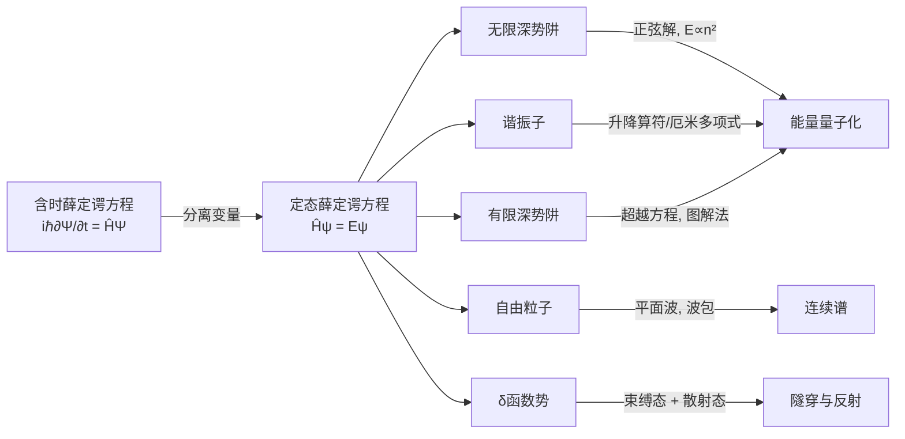

---

## 2.1 定态 (Stationary States)

### 2.1.1 分离变量法

我们面对的是含时薛定谔方程：

$$i\hbar \frac{\partial \Psi}{\partial t} = -\frac{\hbar^2}{2m} \frac{\partial^2 \Psi}{\partial x^2} + V(x)\Psi$$

注意这里一个关键假设：**势能 $V$ 仅依赖于位置 $x$，不显含时间 $t$**。这涵盖了大量重要的物理系统（如束缚态、势阱等）。

在这一假设下，我们尝试**分离变量法**——假设波函数可以写成空间部分与时间部分的乘积：

$$\Psi(x,t) = \psi(x)\varphi(t)$$

将此代入薛定谔方程：

$$i\hbar \psi(x) \frac{d\varphi}{dt} = -\frac{\hbar^2}{2m} \frac{d^2\psi}{dx^2} \varphi(t) + V(x)\psi(x)\varphi(t)$$

两边同除以 $\psi(x)\varphi(t)$：

$$i\hbar \frac{1}{\varphi} \frac{d\varphi}{dt} = -\frac{\hbar^2}{2m} \frac{1}{\psi} \frac{d^2\psi}{dx^2} + V(x)$$

现在，左边**只依赖于 $t$**，右边**只依赖于 $x$**。一个仅含 $t$ 的函数等于一个仅含 $x$ 的函数，对所有 $x$ 和 $t$ 都成立——这只有在两边都等于同一个**常数**时才可能。我们将这个分离常数称为 $E$：

$$i\hbar \frac{1}{\varphi} \frac{d\varphi}{dt} = E$$

$$-\frac{\hbar^2}{2m} \frac{d^2\psi}{dx^2} + V(x)\psi = E\psi$$

### 2.1.2 时间方程的解

时间方程极其简单：

$$\frac{d\varphi}{dt} = -\frac{iE}{\hbar}\varphi$$

这是一阶常微分方程，解为：

$$\varphi(t) = e^{-iEt/\hbar}$$

（吸收常数到 $\psi(x)$ 中即可，无需额外归一化系数。）

### 2.1.3 定态薛定谔方程

空间方程——**定态薛定谔方程**（Time-Independent Schrödinger Equation, TISE）：

$$\boxed{\hat{H}\psi = E\psi \quad \Longleftrightarrow \quad -\frac{\hbar^2}{2m} \frac{d^2\psi}{dx^2} + V(x)\psi(x) = E\psi(x)}$$

这是一个**本征值方程**：哈密顿算符 $\hat{H}$ 作用于 $\psi$，得到 $\psi$ 本身乘以常数 $E$。换言之，$\psi$ 是 $\hat{H}$ 的**本征函数**，$E$ 是对应的**本征值**。

物理上，$E$ 就是**系统的能量**。我们很快会看到，这不是巧合——定态具有确定的能量。

### 2.1.4 分离变量解的性质

将两个方程的解合并，分离变量法给出的解为：

$$\Psi(x,t) = \psi(x) e^{-iEt/\hbar}$$

这类解称为**定态**（stationary states）。为什么叫"定态"？它并非静止不动——波函数仍然包含时间因子 $e^{-iEt/\hbar}$。但定态有三个极其重要的性质：

---

#### 性质一：概率密度不含时

$$|\Psi(x,t)|^2 = \Psi^*\Psi = \psi^* e^{+iEt/\hbar} \cdot \psi e^{-iEt/\hbar} = |\psi(x)|^2$$

时间因子恰好抵消！概率密度是**常数**（相对于时间），这正是"定态"名称的由来。

推论：所有期望值也不含时。对于任何仅依赖 $x$ 的物理量 $Q(x)$：

$$\langle Q \rangle = \int \Psi^* Q(x) \Psi \, dx = \int |\psi|^2 Q(x) \, dx$$

与时间无关。特别地，$\langle x \rangle$ 是常数，因此 $\frac{d\langle x \rangle}{dt} = 0$，从而 $\langle p \rangle = m\frac{d\langle x \rangle}{dt} = 0$。

> **物理图景**：定态就像一个"驻波"——概率分布的形状固定不变，没有概率的流动。

---

#### 性质二：具有确定的能量

在定态 $\Psi = \psi e^{-iEt/\hbar}$ 中，哈密顿量的期望值是：

$$\langle H \rangle = \int \Psi^* \hat{H} \Psi \, dx = \int \psi^* \hat{H} \psi \, dx = E \int |\psi|^2 dx = E$$

其中我们使用了 $\hat{H}\psi = E\psi$ 和归一化条件。

更重要的是，能量的方差为零：

$$\langle H^2 \rangle = \int \psi^* \hat{H}^2 \psi \, dx = \int \psi^* \hat{H}(E\psi) \, dx = E \int \psi^* \hat{H}\psi \, dx = E^2$$

因此：

$$\sigma_H^2 = \langle H^2 \rangle - \langle H \rangle^2 = E^2 - E^2 = 0$$

**方差为零意味着：每次测量能量，都必然得到确定的值 $E$。** 定态是能量的本征态，在定态上测量能量没有任何不确定性。

---

#### 性质三：通解是定态的线性组合

定态薛定谔方程 $\hat{H}\psi = E\psi$ 通常允许无穷多个解 $\psi_1, \psi_2, \psi_3, \ldots$，分别对应能量 $E_1, E_2, E_3, \ldots$。每个解给出一个定态：

$$\Psi_n(x,t) = \psi_n(x) e^{-iE_n t/\hbar}$$

由于含时薛定谔方程是**线性的**，这些定态的任意线性组合也是解：

$$\boxed{\Psi(x,t) = \sum_{n=1}^{\infty} c_n \psi_n(x) e^{-iE_n t/\hbar}}$$

这就是含时薛定谔方程的**通解**。

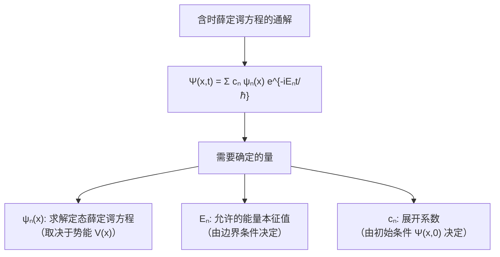

**关键要点**：一旦我们解出了定态薛定谔方程（找到所有 $\psi_n$ 和 $E_n$），含时问题就完全解决了。唯一剩下的工作是确定展开系数 $c_n$——这由初始条件 $\Psi(x,0)$ 决定：

$$\Psi(x,0) = \sum_{n=1}^{\infty} c_n \psi_n(x)$$

这是一个**广义傅里叶级数**。如何求 $c_n$？答案是利用本征函数的**正交性**——这将在2.2节详细讨论。

### 2.1.5 展开系数的物理意义

通解中的系数 $c_n$ 有什么物理意义？

考虑通解 $\Psi(x,t) = \sum c_n \psi_n e^{-iE_n t/\hbar}$，计算能量的期望值：

$$\langle H \rangle = \int \Psi^* \hat{H} \Psi \, dx = \sum_n \sum_m c_m^* c_n E_n \int \psi_m^* \psi_n \, dx$$

利用本征函数的正交归一性 $\int \psi_m^* \psi_n \, dx = \delta_{mn}$（将在2.2节证明），得到：

$$\langle H \rangle = \sum_n |c_n|^2 E_n$$

而归一化条件要求：

$$\int |\Psi|^2 dx = \sum_n |c_n|^2 = 1$$

这些结果有明确的统计诠释：

$$\boxed{|c_n|^2 = \text{测量能量得到 } E_n \text{ 的概率}}$$

这就是量子力学**广义统计诠释**的体现（将在第3章系统阐述）：
- $|c_n|^2$ 是测量能量得到 $E_n$ 的概率
- $\sum_n |c_n|^2 = 1$ 是概率归一化
- $\langle H \rangle = \sum_n |c_n|^2 E_n$ 是能量期望值的概率加权平均

**注意**：$|c_n|^2$ 不含时间。一旦初始条件确定了 $c_n$，测量能量得到各 $E_n$ 的概率就固定了，不随时间变化。这是能量的一个特殊性质，称为**能量守恒**的量子表述。

### 2.1.6 为什么要关心定态？

学生可能会问：真实的物理系统不一定处于定态，为什么我们花大量精力求解定态？

答案有三层：

1. **定态是"基"**。正如任何向量都可以用基向量展开，任何波函数都可以用定态展开。只要我们有了完整的定态集合 $\{\psi_n\}$，就能构造**任意**波函数的时间演化。

2. **时间演化在定态展开下变得平凡**。在一般情况下，求解偏微分方程很困难。但在定态展开下，时间演化仅仅是给每一项乘以相位因子 $e^{-iE_n t/\hbar}$。复杂的偏微分方程被化简为代数运算。

3. **定态本身就有物理意义**。它代表具有确定能量的态。原子的能级结构、分子的振动模式——这些本身就是定态。

### 2.1.7 解题策略总结

求解一维量子系统的标准流程：

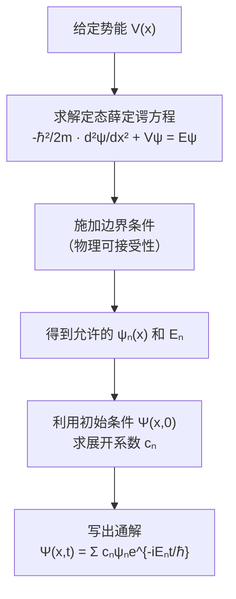

本章剩余部分将对一系列重要的势能 $V(x)$ 执行这一流程。

---

### 习题 2.1

**(a)** 证明：如果 $\Psi_1(x,t) = \psi_1(x)e^{-iE_1 t/\hbar}$ 和 $\Psi_2(x,t) = \psi_2(x)e^{-iE_2 t/\hbar}$ 都是定态（$E_1 \neq E_2$），那么它们的线性组合 $\Psi = c_1\Psi_1 + c_2\Psi_2$ **不是**定态（即 $|\Psi|^2$ 含时间）。

**(b)** 显式计算 $|\Psi(x,t)|^2$，并找出概率密度的振荡频率。

**(c)** 证明尽管概率密度含时间，总概率 $\int |\Psi|^2 dx$ 仍然不含时间。

---

### 习题 2.2

假设在 $t=0$ 时，粒子的波函数可以展开为两个定态的叠加：

$$\Psi(x,0) = c_1 \psi_1(x) + c_2 \psi_2(x)$$

其中 $\psi_1, \psi_2$ 是归一化的、正交的（$\int \psi_1^* \psi_2 \, dx = 0$），能量分别为 $E_1, E_2$。

**(a)** 写出 $\Psi(x,t)$。

**(b)** 归一化条件对 $c_1, c_2$ 施加了什么限制？

**(c)** 计算 $\langle H \rangle$ 和 $\sigma_H^2$。

**(d)** 在什么条件下 $\sigma_H = 0$？这在物理上意味着什么？

---

### 习题 2.3（思考题）

一个粒子处于能量本征态 $\psi_n$，对应能量 $E_n$。

**(a)** 我们在某时刻测量了粒子的位置，得到了结果 $x_0$。测量后粒子还处于能量本征态吗？

**(b)** 如果紧接着再测量能量，结果一定是 $E_n$ 吗？为什么？

**(c)** 这个例子如何体现不确定性原理？

---

### Key Takeaway: 2.1 定态

| 要点          | 内容                                                |
| ----------- | ------------------------------------------------- |
| **分离变量**    | $\Psi(x,t) = \psi(x)e^{-iEt/\hbar}$，要求 $V = V(x)$ |
| **定态薛定谔方程** | $\hat{H}\psi = E\psi$，本征值方程                       |
| **定态性质一**   | 概率密度 $\Psi^2 =\psi^2$ 不含时间                        |
| **定态性质二**   | 能量完全确定：$\sigma_H = 0$，每次测量必得 $E$                  |
| **定态性质三**   | 通解 $\Psi = \sum c_n \psi_n e^{-iE_n t/\hbar}$     |
| **展开系数**    | $c_n^2$ = 测量能量得到 $E_n$ 的概率                        |

---

## 2.2 一维无限深方势阱 (The Infinite Square Well)

### 2.2.1 问题的提出

我们首先考虑最简单的量子力学束缚态问题——**一维无限深方势阱**（也称"粒子在盒中"）。尽管这个模型在现实中并不精确存在，但它展示了量子力学最核心的特征：**能量量子化**，并且为我们理解更复杂的势场奠定基础。

势能定义为：

$$V(x) = \begin{cases} 0, & 0 < x < a \\ \infty, & \text{其他} \end{cases}$$

物理图景：粒子被限制在宽度为 $a$ 的"盒子"中，盒壁是无穷高的势垒，粒子绝不可能穿越。

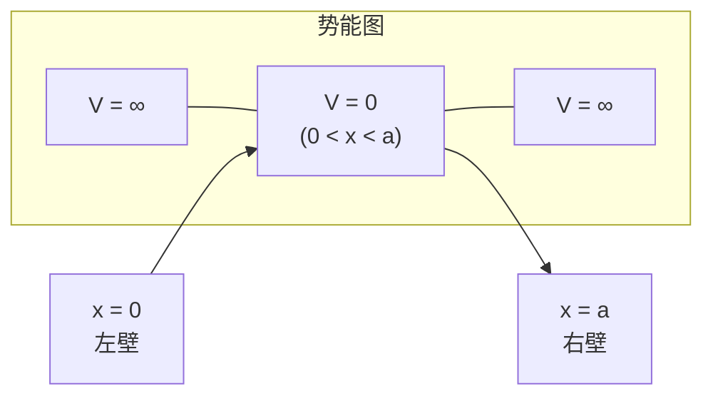

**边界条件**：在势阱外部（$x < 0$ 或 $x > a$），$V = \infty$。若 $V\psi = E\psi$ 要成立且 $E$ 有限，则在势阱外部必须有：

$$\psi(x) = 0 \quad (x \le 0 \text{ 或 } x \ge a)$$

波函数的连续性要求在壁处：

$$\boxed{\psi(0) = 0, \quad \psi(a) = 0}$$

这就是我们需要施加的**边界条件**。

### 2.2.2 求解定态薛定谔方程

在势阱内部（$0 < x < a$），$V = 0$，定态薛定谔方程简化为：

$$-\frac{\hbar^2}{2m} \frac{d^2\psi}{dx^2} = E\psi$$

整理为：

$$\frac{d^2\psi}{dx^2} = -\frac{2mE}{\hbar^2}\psi$$

定义：

$$k \equiv \frac{\sqrt{2mE}}{\hbar}$$

则方程变为：

$$\frac{d^2\psi}{dx^2} = -k^2\psi$$

这是最简单的二阶常微分方程，通解为：

$$\psi(x) = A\sin(kx) + B\cos(kx)$$

其中 $A$、$B$ 是待定常数。

> **注意**：这里隐含了 $E > 0$。如果 $E < 0$，则 $k$ 是虚数，解变为指数函数（双曲函数），在 $[0, a]$ 上无法满足两端为零的边界条件（除非 $\psi \equiv 0$）。如果 $E = 0$，则 $\psi = Ax + B$，同样只有平凡解。因此，**在无限深势阱中，$E$ 必须严格大于零**。

### 2.2.3 施加边界条件

**边界条件一：$\psi(0) = 0$**

$$\psi(0) = A\sin(0) + B\cos(0) = B = 0$$

因此 $B = 0$，解简化为：

$$\psi(x) = A\sin(kx)$$

**边界条件二：$\psi(a) = 0$**

$$\psi(a) = A\sin(ka) = 0$$

$A = 0$ 意味着 $\psi \equiv 0$（无意义的平凡解）。因此：

$$\sin(ka) = 0 \quad \Rightarrow \quad ka = n\pi, \quad n = 1, 2, 3, \ldots$$

> **为什么 $n \neq 0$？** 因为 $n = 0$ 意味着 $k = 0$，即 $\psi(x) = 0$（平凡解）。
>
> **为什么排除负整数 $n$？** 因为 $\sin(-n\pi x/a) = -\sin(n\pi x/a)$，负号可以吸收到常数 $A$ 中，不产生新的独立解。

### 2.2.4 能量量子化

从 $k_n = n\pi/a$ 和 $k = \sqrt{2mE}/\hbar$，可以解出允许的能量：

$$k_n = \frac{n\pi}{a} = \frac{\sqrt{2mE_n}}{\hbar}$$

$$\boxed{E_n = \frac{n^2 \pi^2 \hbar^2}{2ma^2}, \quad n = 1, 2, 3, \ldots}$$

这是量子力学的标志性结果之一：**能量不是连续的，而是量子化的。** 粒子只能取特定的能量值 $E_1, E_2, E_3, \ldots$。

定义**基态能量**（$n = 1$ 对应的最低能量）：

$$E_1 = \frac{\pi^2 \hbar^2}{2ma^2}$$

则所有允许的能量可以简洁地写为：

$$E_n = n^2 E_1$$

几个值得注意的特征：

1. **最低能量不为零**：$E_1 > 0$，即使在最低能态，粒子仍有"零点能"。这是不确定性原理的直接后果——如果粒子在宽度 $a$ 的盒中，$\sigma_x \lesssim a$，因此 $\sigma_p \gtrsim \hbar/(2a)$，对应的最小动能为 $\sigma_p^2/(2m) \sim \hbar^2/(8ma^2)$，与 $E_1$ 同量级。

2. **能级间距随 $n$ 增大而增大**：$E_{n+1} - E_n = (2n+1)E_1$，高能级之间的间距更大。这与谐振子形成鲜明对比（谐振子能级等间距）。

3. **$E_n \propto n^2$**：能量与量子数的平方成正比。

4. **$E_n \propto 1/(ma^2)$**：势阱越宽或粒子质量越大，能量越低、间距越小。在宏观极限下（$m$ 和 $a$ 都很大），量子化效应消失。

### 2.2.5 归一化的本征函数

定态薛定谔方程的解（施加边界条件后）为：

$$\psi_n(x) = A\sin\left(\frac{n\pi}{a}x\right)$$

归一化条件：

$$\int_0^a |\psi_n|^2 dx = |A|^2 \int_0^a \sin^2\left(\frac{n\pi}{a}x\right) dx = 1$$

计算积分。利用 $\sin^2\theta = \frac{1}{2}(1 - \cos 2\theta)$：

$$\int_0^a \sin^2\left(\frac{n\pi}{a}x\right) dx = \frac{1}{2}\int_0^a \left[1 - \cos\left(\frac{2n\pi}{a}x\right)\right] dx$$

$$= \frac{1}{2}\left[x - \frac{a}{2n\pi}\sin\left(\frac{2n\pi}{a}x\right)\right]_0^a = \frac{a}{2}$$

因此 $|A|^2 \cdot a/2 = 1$，取 $A$ 为正实数：

$$\boxed{\psi_n(x) = \sqrt{\frac{2}{a}}\sin\left(\frac{n\pi}{a}x\right), \quad n = 1, 2, 3, \ldots}$$

这是一维无限深方势阱的**归一化本征函数**。

### 2.2.6 本征函数的正交性 (Orthogonality)

现在我们证明一个极其重要的性质：**不同能级对应的本征函数是正交的**。

**定理**：对于 $m \neq n$，

$$\int_0^a \psi_m^*(x) \psi_n(x) \, dx = 0$$

**证明**：

$$\int_0^a \psi_m^* \psi_n \, dx = \frac{2}{a}\int_0^a \sin\left(\frac{m\pi}{a}x\right)\sin\left(\frac{n\pi}{a}x\right) dx$$

利用积化和差公式 $\sin\alpha\sin\beta = \frac{1}{2}[\cos(\alpha - \beta) - \cos(\alpha + \beta)]$：

$$= \frac{1}{a}\int_0^a \left[\cos\left(\frac{(m-n)\pi}{a}x\right) - \cos\left(\frac{(m+n)\pi}{a}x\right)\right] dx$$

当 $m \neq n$ 时，$(m-n)$ 和 $(m+n)$ 都是非零整数，因此：

$$\int_0^a \cos\left(\frac{k\pi}{a}x\right) dx = \frac{a}{k\pi}\sin(k\pi) = 0 \quad (k \neq 0, \, k \in \mathbb{Z})$$

两项都为零，因此整个积分为零。

当 $m = n$ 时，第一个余弦变为 $\cos(0) = 1$，积分给出 $a$；第二个余弦仍然积分为零。因此总积分为 $\frac{1}{a} \cdot a = 1$。

综合两种情况，我们引入**克罗内克 $\delta$**：

$$\delta_{mn} = \begin{cases} 0, & m \neq n \\ 1, & m = n \end{cases}$$

正交归一性可以统一表示为：

$$\boxed{\int_0^a \psi_m^*(x) \psi_n(x) \, dx = \delta_{mn}}$$

这称为**正交归一关系**（Orthonormality）。

> **从更一般的角度理解正交性**：正交性不是无限深势阱的特例，而是**厄米算符本征函数的普遍性质**。哈密顿量 $\hat{H}$ 是厄米算符，属于不同本征值的本征函数必然正交。这一点将在第3章中严格证明。在这里，我们通过直接计算验证了这一性质。

### 2.2.7 傅里叶级数技巧 (Fourier's Trick)

现在我们来解决一个核心问题：如何确定通解中的展开系数 $c_n$？

在2.1节中，我们知道通解为：

$$\Psi(x,t) = \sum_{n=1}^{\infty} c_n \psi_n(x) e^{-iE_n t/\hbar}$$

在 $t = 0$ 时刻：

$$\Psi(x,0) = \sum_{n=1}^{\infty} c_n \psi_n(x) = \sqrt{\frac{2}{a}} \sum_{n=1}^{\infty} c_n \sin\left(\frac{n\pi}{a}x\right)$$

这是一个**傅里叶正弦级数**。如何求 $c_n$？

**傅里叶技巧**：将上式两边乘以 $\psi_m^*(x)$，然后在 $[0, a]$ 上积分：

$$\int_0^a \psi_m^*(x) \Psi(x,0) \, dx = \sum_{n=1}^{\infty} c_n \int_0^a \psi_m^*(x) \psi_n(x) \, dx = \sum_{n=1}^{\infty} c_n \delta_{mn} = c_m$$

因此：

$$\boxed{c_n = \int_0^a \psi_n^*(x) \Psi(x,0) \, dx = \sqrt{\frac{2}{a}} \int_0^a \sin\left(\frac{n\pi}{a}x\right) \Psi(x,0) \, dx}$$

这就是**傅里叶级数技巧**——利用本征函数的正交性，通过积分"投影"出每个展开系数。

> **类比**：这与向量的内积运算完全类似。如果 $\mathbf{v} = \sum_n c_n \hat{e}_n$（$\hat{e}_n$ 是正交归一基），则 $c_n = \hat{e}_n \cdot \mathbf{v}$。在函数空间中，"内积"对应积分 $\langle f | g \rangle = \int f^*(x) g(x) dx$，傅里叶系数 $c_n = \langle \psi_n | \Psi(x,0) \rangle$ 就是函数的"投影"。

### 2.2.8 完整解题示例

**例题**：设一维无限深方势阱中，粒子在 $t=0$ 的波函数为：

$$\Psi(x,0) = Ax(a-x), \quad 0 \le x \le a$$

求 $\Psi(x,t)$。

**第一步：归一化**

$$\int_0^a |A|^2 x^2(a-x)^2 dx = |A|^2 \int_0^a (a^2x^2 - 2ax^3 + x^4) dx$$

$$= |A|^2 \left[\frac{a^2 x^3}{3} - \frac{2a x^4}{4} + \frac{x^5}{5}\right]_0^a = |A|^2 \left[\frac{a^5}{3} - \frac{a^5}{2} + \frac{a^5}{5}\right] = |A|^2 \cdot \frac{a^5}{30}$$

因此 $A = \sqrt{30/a^5}$。

**第二步：求展开系数 $c_n$**

$$c_n = \sqrt{\frac{2}{a}} \int_0^a \sin\left(\frac{n\pi x}{a}\right) \cdot \sqrt{\frac{30}{a^5}} \, x(a-x) \, dx$$

$$= \frac{\sqrt{60}}{a^3} \int_0^a x(a-x)\sin\left(\frac{n\pi x}{a}\right) dx$$

这个积分需要分部积分两次。令 $u = n\pi x/a$，则 $x = au/n\pi$，$dx = a \, du/(n\pi)$：

$$\int_0^a x(a-x)\sin\left(\frac{n\pi x}{a}\right) dx = \frac{a^3}{(n\pi)^3}\int_0^{n\pi} u(n\pi - u)\sin u \, du$$

利用 $\int_0^{n\pi} u\sin u \, du$ 和 $\int_0^{n\pi} u^2 \sin u \, du$ 的标准结果（可以通过分部积分计算），最终得到：

$$\int_0^a x(a-x)\sin\left(\frac{n\pi x}{a}\right) dx = \frac{2a^3}{(n\pi)^3}[1 - (-1)^n] = \begin{cases} \frac{4a^3}{(n\pi)^3}, & n \text{ 为奇数} \\ 0, & n \text{ 为偶数} \end{cases}$$

因此：

$$c_n = \begin{cases} \frac{4\sqrt{60}}{(n\pi)^3} = \frac{8\sqrt{15}}{(n\pi)^3}, & n \text{ 为奇数} \\ 0, & n \text{ 为偶数} \end{cases}$$

> **为什么偶数项系数为零？** 因为 $\Psi(x,0) = Ax(a-x)$ 关于 $x = a/2$ 具有**偶对称性**（即 $\Psi(a/2+y, 0) = \Psi(a/2-y, 0)$），而 $\psi_n$ 对于偶数 $n$ 关于 $x = a/2$ 是奇对称的。奇函数与偶函数的乘积是奇函数，在对称区间上积分为零。

**第三步：写出通解**

$$\Psi(x,t) = \left(\frac{30}{a}\right)^{1/2} \sum_{\substack{n=1,3,5,\ldots}}^{\infty} \frac{4}{(n\pi)^3} \cdot \sqrt{\frac{2}{a}} \sin\left(\frac{n\pi x}{a}\right) e^{-iE_n t/\hbar}$$

整理：

$$\Psi(x,t) = \left(\frac{30}{a}\right)^{1/2} \left(\frac{2}{a}\right)^{1/2} \sum_{\substack{n=1,3,5,\ldots}} \frac{4}{(n\pi)^3} \sin\left(\frac{n\pi x}{a}\right) e^{-in^2 \pi^2 \hbar t/(2ma^2)}$$

**检验**：$\sum_n |c_n|^2 = 1$？

$$\sum_{\substack{n=1,3,5,\ldots}} |c_n|^2 = \sum_{\substack{n=1,3,5,\ldots}} \frac{960}{(n\pi)^6}$$

利用 $\sum_{\substack{n=1,3,5,\ldots}} \frac{1}{n^6} = \frac{\pi^6}{960}$，得到 $\sum |c_n|^2 = 960 \cdot \frac{1}{\pi^6} \cdot \frac{\pi^6}{960} = 1$。

### 2.2.9 本征函数的完备性

我们在上面的计算中默认了一个重要事实：**任何**（合理的）函数 $f(x)$（在 $[0, a]$ 上定义，在端点为零）都可以展开为 $\{\psi_n(x)\}$ 的线性组合：

$$f(x) = \sum_{n=1}^{\infty} c_n \psi_n(x)$$

这称为本征函数集的**完备性**（Completeness）。对于无限深势阱，这就是傅里叶级数理论的一个经典结果——任何满足 Dirichlet 条件的函数都可以展开为正弦级数。

完备性的数学表述是：

$$\sum_{n=1}^{\infty} \psi_n(x)\psi_n^*(x') = \delta(x - x')$$

这称为**完备性关系**或**闭合关系**。它表明本征函数集"填满"了整个函数空间。

> **正交性 + 完备性 = 完美基底**。正交性保证了展开系数可以唯一确定（通过傅里叶技巧），完备性保证了任何波函数都可以展开。两者结合，使得本征函数集成为函数空间的一组"正交归一基"。

---

### 习题 2.4

一维无限深势阱（$0 < x < a$）中，粒子在 $t=0$ 的波函数为：

$$\Psi(x,0) = A\sin^3\left(\frac{\pi x}{a}\right)$$

**(a)** 利用三角恒等式 $\sin^3\theta = \frac{3}{4}\sin\theta - \frac{1}{4}\sin 3\theta$，将 $\Psi(x,0)$ 展开为本征函数的线性组合。

**(b)** 求归一化常数 $A$。

**(c)** 写出 $\Psi(x,t)$。

**(d)** 测量能量，可能得到哪些值？各自的概率是多少？

**(e)** 计算 $\langle H \rangle$。

---

### 习题 2.5（计算题）

一维无限深势阱中，粒子在 $t=0$ 的波函数为：

$$\Psi(x,0) = \begin{cases} A, & 0 < x < a/2 \\ 0, & a/2 < x < a \end{cases}$$

**(a)** 求归一化常数 $A$。

**(b)** 利用傅里叶技巧，计算展开系数 $c_n$。

**(c)** 测量能量得到 $E_1$ 的概率是多少？数值上等于多少？

**(d)** 所有概率之和等于 1 吗？

---

### 习题 2.6（思考题）

**(a)** 证明无限深方势阱中，$\langle p \rangle = 0$ 对所有定态成立。给出物理解释。

**(b)** 计算 $\langle p^2 \rangle$ 对第 $n$ 个定态。

**(c)** 利用 $\langle T \rangle = \langle p^2 \rangle / (2m)$ 验证 $\langle T \rangle = E_n$。这是否合理？为什么？

**(d)** 计算 $\sigma_p$，验证不确定性原理 $\sigma_x \sigma_p \ge \hbar/2$。（提示：$\langle x^2 \rangle$ 的计算需要利用 $\int_0^a x^2 \sin^2(n\pi x/a) dx = \frac{a^3}{6}\left(1 - \frac{3}{2n^2\pi^2}\right)$。）

---

### 习题 2.7

对于无限深势阱中的第 $n$ 个本征态：

**(a)** 在哪些位置粒子被发现的概率密度为零？这些位置称为**节点**（nodes）。第 $n$ 个态有多少个节点？

**(b)** 在哪个位置概率密度最大？

**(c)** 物理上，为什么高激发态有更多节点？（提示：联系动能和波函数的"震荡频率"。）

---

### Key Takeaway: 2.2 一维无限深方势阱

| 要点 | 内容 |
|------|------|
| **势能** | $V = 0$（$0 < x < a$），$V = \infty$（其他） |
| **边界条件** | $\psi(0) = \psi(a) = 0$ |
| **本征函数** | $\psi_n(x) = \sqrt{2/a}\sin(n\pi x/a)$ |
| **能量量子化** | $E_n = n^2\pi^2\hbar^2/(2ma^2)$，$n = 1,2,3,\ldots$ |
| **正交归一性** | $\int_0^a \psi_m^* \psi_n \, dx = \delta_{mn}$ |
| **傅里叶技巧** | $c_n = \int_0^a \psi_n^*(x)\Psi(x,0)\,dx$ |
| **完备性** | 任何满足边界条件的函数可展开为 $\{\psi_n\}$ 的级数 |
| **零点能** | $E_1 = \pi^2\hbar^2/(2ma^2) > 0$（不确定性原理的结果） |

---

## 2.3 谐振子 (The Harmonic Oscillator)

### 2.3.1 为什么谐振子如此重要？

**谐振子是整个物理学中最重要的模型之一**——这绝非夸张。以下是几个理由：

1. **普适性**：任何势能在稳定平衡点附近都近似为二次函数（谐振子势）。将 $V(x)$ 在极小值 $x_0$ 处泰勒展开：

$$V(x) \approx V(x_0) + \underbrace{V'(x_0)}_{=0}(x - x_0) + \frac{1}{2}\underbrace{V''(x_0)}_{\equiv k}(x - x_0)^2 + \cdots$$

在小振幅下，高阶项可忽略，系统就是一个谐振子，角频率 $\omega = \sqrt{k/m}$。

2. **量子场论的基础**：电磁场的每个模式都等价于一个量子谐振子。光子的产生和湮灭、声子、等离子体振荡——这些都是谐振子的不同化身。

3. **精确可解**：谐振子是为数不多的可以精确求解的量子力学问题之一，而且有两种完全不同但互补的求解方法。

谐振子势为：

$$V(x) = \frac{1}{2}m\omega^2 x^2$$

定态薛定谔方程为：

$$-\frac{\hbar^2}{2m}\frac{d^2\psi}{dx^2} + \frac{1}{2}m\omega^2 x^2 \psi = E\psi$$

我们将用两种方法求解这个方程。

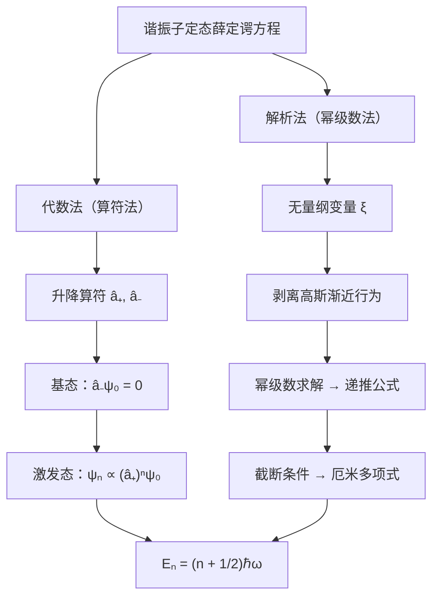

---

### 2.3.2 代数法 (Algebraic Method)

代数法（又称算符法或 Dirac 法）是一种极其优雅的方法。它不直接求解微分方程，而是利用算符的代数关系推导出能谱和本征函数。这种方法的思想将在角动量理论中再次出现。

#### 步骤一：因式分解哈密顿量

谐振子的哈密顿量为：

$$\hat{H} = \frac{\hat{p}^2}{2m} + \frac{1}{2}m\omega^2 x^2$$

如果 $\hat{p}$ 和 $x$ 是普通数（而非算符），我们可以将 $u^2 + v^2$ 因式分解为 $(u + iv)(u - iv)$。对于算符，我们尝试类似的操作。

定义两个算符：

$$\boxed{\hat{a}_- \equiv \frac{1}{\sqrt{2\hbar m\omega}}(i\hat{p} + m\omega x), \quad \hat{a}_+ \equiv \frac{1}{\sqrt{2\hbar m\omega}}(-i\hat{p} + m\omega x)}$$

$\hat{a}_-$ 称为**降低算符**（lowering operator）或**湮灭算符**（annihilation operator），$\hat{a}_+$ 称为**升高算符**（raising operator）或**产生算符**（creation operator）。

> **注意**：$\hat{a}_+$ 是 $\hat{a}_-$ 的厄米共轭：$\hat{a}_+ = (\hat{a}_-)^\dagger$。

#### 步骤二：计算 $\hat{a}_-\hat{a}_+$ 和 $\hat{a}_+\hat{a}_-$

$$\hat{a}_-\hat{a}_+ = \frac{1}{2\hbar m\omega}(i\hat{p} + m\omega x)(-i\hat{p} + m\omega x)$$

展开：

$$= \frac{1}{2\hbar m\omega}\left[-i\hat{p}(-i\hat{p}) + i\hat{p}(m\omega x) + m\omega x(-i\hat{p}) + m\omega x \cdot m\omega x\right]$$

$$= \frac{1}{2\hbar m\omega}\left[\hat{p}^2 + im\omega(\hat{p}x - x\hat{p}) + m^2\omega^2 x^2\right]$$

关键一步：$\hat{p}x - x\hat{p}$ 就是动量与位置的**对易子**（commutator）：

$$[\hat{p}, x] = \hat{p}x - x\hat{p}$$

计算这个对易子。对任意函数 $f(x)$：

$$[\hat{p}, x]f = -i\hbar\frac{d}{dx}(xf) - x\left(-i\hbar\frac{df}{dx}\right) = -i\hbar\left(f + x\frac{df}{dx}\right) + i\hbar x\frac{df}{dx} = -i\hbar f$$

因此：

$$\boxed{[\hat{p}, x] = -i\hbar}$$

或等价地：

$$\boxed{[x, \hat{p}] = i\hbar}$$

这是量子力学中**最重要的对易关系**，称为**正则对易关系**（canonical commutation relation）。

代入：

$$\hat{a}_-\hat{a}_+ = \frac{1}{2\hbar m\omega}\left[\hat{p}^2 + m^2\omega^2 x^2 + im\omega(-i\hbar)\right] = \frac{1}{2\hbar m\omega}\left[\hat{p}^2 + m^2\omega^2 x^2 + m\omega\hbar\right]$$

$$= \frac{1}{\hbar\omega}\left[\frac{\hat{p}^2}{2m} + \frac{1}{2}m\omega^2 x^2\right] + \frac{1}{2} = \frac{\hat{H}}{\hbar\omega} + \frac{1}{2}$$

类似地：

$$\hat{a}_+\hat{a}_- = \frac{\hat{H}}{\hbar\omega} - \frac{1}{2}$$

因此哈密顿量可以写成：

$$\boxed{\hat{H} = \hbar\omega\left(\hat{a}_+\hat{a}_- + \frac{1}{2}\right) = \hbar\omega\left(\hat{a}_-\hat{a}_+ - \frac{1}{2}\right)}$$

#### 步骤三：升降算符的对易子

从上面两个表达式相减：

$$\hat{a}_-\hat{a}_+ - \hat{a}_+\hat{a}_- = 1$$

即：

$$\boxed{[\hat{a}_-, \hat{a}_+] = 1}$$

这是升降算符的**基本对易关系**。

#### 步骤四：升降算符的核心性质

**定理**：如果 $\psi$ 是哈密顿量的本征函数，能量为 $E$，即 $\hat{H}\psi = E\psi$，那么：

- $\hat{a}_+\psi$ 也是本征函数，能量为 $E + \hbar\omega$；
- $\hat{a}_-\psi$ 也是本征函数，能量为 $E - \hbar\omega$。

**证明**：我们需要证明 $\hat{H}(\hat{a}_+\psi) = (E + \hbar\omega)(\hat{a}_+\psi)$。

首先，推导 $[\hat{H}, \hat{a}_+]$。由 $\hat{H} = \hbar\omega(\hat{a}_+\hat{a}_- + 1/2)$：

$$[\hat{H}, \hat{a}_+] = \hbar\omega[\hat{a}_+\hat{a}_-, \hat{a}_+]$$

利用恒等式 $[AB, C] = A[B, C] + [A, C]B$：

$$[\hat{a}_+\hat{a}_-, \hat{a}_+] = \hat{a}_+[\hat{a}_-, \hat{a}_+] + [\hat{a}_+, \hat{a}_+]\hat{a}_- = \hat{a}_+ \cdot 1 + 0 = \hat{a}_+$$

因此：

$$[\hat{H}, \hat{a}_+] = \hbar\omega\hat{a}_+$$

即 $\hat{H}\hat{a}_+ - \hat{a}_+\hat{H} = \hbar\omega\hat{a}_+$，也就是：

$$\hat{H}(\hat{a}_+\psi) = \hat{a}_+\hat{H}\psi + \hbar\omega\hat{a}_+\psi = \hat{a}_+(E\psi) + \hbar\omega(\hat{a}_+\psi) = (E + \hbar\omega)(\hat{a}_+\psi)$$

同理可证 $[\hat{H}, \hat{a}_-] = -\hbar\omega\hat{a}_-$，从而：

$$\hat{H}(\hat{a}_-\psi) = (E - \hbar\omega)(\hat{a}_-\psi)$$

**证毕。**

> **物理图景**：$\hat{a}_+$ 将粒子"升高"一个能级（增加 $\hbar\omega$ 的能量），$\hat{a}_-$ 将粒子"降低"一个能级（减少 $\hbar\omega$ 的能量）。这就像量子阶梯上的上行和下行。

#### 步骤五：确定基态

如果我们不断地对某个本征态施加降低算符 $\hat{a}_-$，能量就会不断下降：$E, E - \hbar\omega, E - 2\hbar\omega, \ldots$ 但能量不可能无限下降——谐振子的势能非负，动能也非负，因此 $E$ 必须有一个下限。

**关键**：必须存在一个最低能态 $\psi_0$（基态），使得 $\hat{a}_-$ 不能再降低它：

$$\boxed{\hat{a}_-\psi_0 = 0}$$

这不是 $\hat{a}_-\psi_0$ 等于某个非零函数，而是严格等于零函数。

> **为什么不能是非零的？** 假设 $\hat{a}_-\psi_0 \neq 0$，那么根据步骤四，$\hat{a}_-\psi_0$ 就是能量 $E_0 - \hbar\omega$ 的本征函数，比 $\psi_0$ 的能量还低，这与 $\psi_0$ 是最低能态矛盾。所以 $\hat{a}_-\psi_0$ 必须为零。

#### 步骤六：求解基态波函数

$\hat{a}_-\psi_0 = 0$ 是一个一阶微分方程：

$$\frac{1}{\sqrt{2\hbar m\omega}}\left(i \cdot (-i\hbar)\frac{d}{dx} + m\omega x\right)\psi_0 = 0$$

$$\frac{1}{\sqrt{2\hbar m\omega}}\left(\hbar\frac{d\psi_0}{dx} + m\omega x\psi_0\right) = 0$$

$$\frac{d\psi_0}{dx} = -\frac{m\omega}{\hbar}x\psi_0$$

这是可分离变量的一阶 ODE：

$$\frac{d\psi_0}{\psi_0} = -\frac{m\omega}{\hbar}x \, dx$$

两边积分：

$$\ln\psi_0 = -\frac{m\omega}{2\hbar}x^2 + \text{常数}$$

$$\psi_0(x) = A_0 \, e^{-\frac{m\omega}{2\hbar}x^2}$$

**基态波函数是高斯函数！**

归一化：

$$\int_{-\infty}^{\infty} |A_0|^2 e^{-\frac{m\omega}{\hbar}x^2} dx = |A_0|^2 \sqrt{\frac{\pi\hbar}{m\omega}} = 1$$

$$A_0 = \left(\frac{m\omega}{\pi\hbar}\right)^{1/4}$$

因此：

$$\boxed{\psi_0(x) = \left(\frac{m\omega}{\pi\hbar}\right)^{1/4} e^{-\frac{m\omega}{2\hbar}x^2}}$$

#### 步骤七：基态能量

将 $\hat{a}_-\psi_0 = 0$ 代入 $\hat{H} = \hbar\omega(\hat{a}_+\hat{a}_- + 1/2)$：

$$\hat{H}\psi_0 = \hbar\omega\left(\hat{a}_+\underbrace{\hat{a}_-\psi_0}_{=0} + \frac{1}{2}\psi_0\right) = \frac{1}{2}\hbar\omega\psi_0$$

因此基态能量为：

$$\boxed{E_0 = \frac{1}{2}\hbar\omega}$$

这就是**零点能**——谐振子的最低能量不是零，而是 $\hbar\omega/2$。这是不确定性原理的直接后果。

#### 步骤八：构造所有激发态

反复施加 $\hat{a}_+$，我们可以构造所有能级：

$$\psi_1 = A_1 \hat{a}_+\psi_0, \quad \psi_2 = A_2 (\hat{a}_+)^2\psi_0, \quad \ldots$$

能量依次为：

$$E_0 = \frac{1}{2}\hbar\omega, \quad E_1 = \frac{3}{2}\hbar\omega, \quad E_2 = \frac{5}{2}\hbar\omega, \quad \ldots$$

一般地：

$$\boxed{E_n = \left(n + \frac{1}{2}\right)\hbar\omega, \quad n = 0, 1, 2, \ldots}$$

能级是**等间距**的，间距为 $\hbar\omega$。这与无限深势阱形成对比（无限深势阱 $E_n \propto n^2$，间距随 $n$ 增大）。

现在确定归一化系数 $A_n$。我们需要：

$$\psi_n = A_n \hat{a}_+\psi_{n-1}$$

计算 $\int |\hat{a}_+\psi_{n-1}|^2 dx$。利用 $\hat{a}_+ = (\hat{a}_-)^\dagger$：

$$\int (\hat{a}_+\psi_{n-1})^*(\hat{a}_+\psi_{n-1}) dx = \int \psi_{n-1}^* \hat{a}_-\hat{a}_+\psi_{n-1} dx$$

由 $\hat{a}_-\hat{a}_+ = \hat{H}/(\hbar\omega) + 1/2$：

$$\hat{a}_-\hat{a}_+\psi_{n-1} = \left(\frac{E_{n-1}}{\hbar\omega} + \frac{1}{2}\right)\psi_{n-1} = \left(n - 1 + \frac{1}{2} + \frac{1}{2}\right)\psi_{n-1} = n\psi_{n-1}$$

因此：

$$\int |\hat{a}_+\psi_{n-1}|^2 dx = n \int |\psi_{n-1}|^2 dx = n$$

归一化要求 $|A_n|^2 \cdot n = 1$，即 $A_n = 1/\sqrt{n}$。

类似地可以证明：

$$\hat{a}_+\psi_n = \sqrt{n+1}\,\psi_{n+1}, \quad \hat{a}_-\psi_n = \sqrt{n}\,\psi_{n-1}$$

因此：

$$\boxed{\psi_n = \frac{1}{\sqrt{n!}}(\hat{a}_+)^n\psi_0}$$

这给出了所有本征函数的递推构造。

#### 步骤九：显式计算前几个本征函数

利用 $\hat{a}_+ = \frac{1}{\sqrt{2\hbar m\omega}}\left(-\hbar\frac{d}{dx} + m\omega x\right)$：

**$n = 0$（基态）**：

$$\psi_0(x) = \left(\frac{m\omega}{\pi\hbar}\right)^{1/4} e^{-\frac{m\omega}{2\hbar}x^2}$$

**$n = 1$（第一激发态）**：

$$\psi_1 = \hat{a}_+\psi_0 = \frac{1}{\sqrt{2\hbar m\omega}}\left(-\hbar\frac{d}{dx} + m\omega x\right)\psi_0$$

计算 $\frac{d\psi_0}{dx} = -\frac{m\omega}{\hbar}x\psi_0$：

$$\psi_1 = \frac{1}{\sqrt{2\hbar m\omega}}\left(-\hbar\left(-\frac{m\omega}{\hbar}x\psi_0\right) + m\omega x\psi_0\right) = \frac{1}{\sqrt{2\hbar m\omega}} \cdot 2m\omega x\psi_0$$

$$\psi_1(x) = \left(\frac{m\omega}{\pi\hbar}\right)^{1/4} \sqrt{\frac{2m\omega}{\hbar}} \, x \, e^{-\frac{m\omega}{2\hbar}x^2}$$

**$n = 2$（第二激发态）**：

$$\psi_2 = \frac{1}{\sqrt{2}}\hat{a}_+\psi_1$$

经过计算（留作习题验证）：

$$\psi_2(x) = \left(\frac{m\omega}{\pi\hbar}\right)^{1/4} \frac{1}{\sqrt{2}} \left(\frac{2m\omega}{\hbar}x^2 - 1\right) e^{-\frac{m\omega}{2\hbar}x^2}$$

规律已经显现：$\psi_n(x)$ 是一个 $n$ 次多项式乘以高斯函数。这些多项式正是**厄米多项式**，我们在解析法中会更系统地推导。

---

### 2.3.3 解析法 (Analytic Method)

代数法优雅而强大，但它没有直接展示微分方程的求解过程。解析法则用传统的幂级数方法求解，让我们理解厄米多项式的来历。

#### 步骤一：引入无量纲变量

定态薛定谔方程为：

$$-\frac{\hbar^2}{2m}\frac{d^2\psi}{dx^2} + \frac{1}{2}m\omega^2 x^2\psi = E\psi$$

这个方程中有三个参数：$\hbar$、$m$、$\omega$。为了简化，引入**无量纲变量**：

$$\boxed{\xi \equiv \sqrt{\frac{m\omega}{\hbar}}\, x}$$

注意 $\xi$ 是无量纲的。令 $K \equiv 2E/(\hbar\omega)$，方程变为：

$$\frac{d^2\psi}{d\xi^2} = (\xi^2 - K)\psi$$

**推导**：由 $x = \xi\sqrt{\hbar/(m\omega)}$，$dx = \sqrt{\hbar/(m\omega)}\,d\xi$，所以 $\frac{d}{dx} = \sqrt{m\omega/\hbar}\frac{d}{d\xi}$，$\frac{d^2}{dx^2} = \frac{m\omega}{\hbar}\frac{d^2}{d\xi^2}$。代入原方程：

$$-\frac{\hbar^2}{2m}\cdot\frac{m\omega}{\hbar}\frac{d^2\psi}{d\xi^2} + \frac{1}{2}m\omega^2\cdot\frac{\hbar}{m\omega}\xi^2\psi = E\psi$$

$$-\frac{\hbar\omega}{2}\frac{d^2\psi}{d\xi^2} + \frac{\hbar\omega}{2}\xi^2\psi = E\psi$$

除以 $\hbar\omega/2$：

$$-\frac{d^2\psi}{d\xi^2} + \xi^2\psi = K\psi$$

整理得到：

$$\frac{d^2\psi}{d\xi^2} = (\xi^2 - K)\psi$$

#### 步骤二：渐近分析

当 $|\xi| \to \infty$ 时，$\xi^2 \gg K$，方程近似为：

$$\frac{d^2\psi}{d\xi^2} \approx \xi^2\psi$$

这个方程的近似解为 $\psi \approx Ae^{-\xi^2/2} + Be^{+\xi^2/2}$。

> **验证**：$\psi = e^{\pm\xi^2/2}$ 的二阶导数为 $\frac{d^2}{d\xi^2}e^{\pm\xi^2/2} = (\xi^2 \pm 1)e^{\pm\xi^2/2} \approx \xi^2 e^{\pm\xi^2/2}$（当 $|\xi|$ 很大时）。

$e^{+\xi^2/2}$ 项在 $|\xi| \to \infty$ 时发散，不可归一化，必须舍弃（$B = 0$）。因此渐近行为为：

$$\psi(\xi) \sim e^{-\xi^2/2} \quad (\xi \to \pm\infty)$$

#### 步骤三：剥离渐近行为

既然渐近行为已知，我们将 $\psi$ 写成：

$$\psi(\xi) = h(\xi) e^{-\xi^2/2}$$

其中 $h(\xi)$ 是待定函数。将此代入方程。

计算导数：

$$\frac{d\psi}{d\xi} = \left(\frac{dh}{d\xi} - \xi h\right)e^{-\xi^2/2}$$

$$\frac{d^2\psi}{d\xi^2} = \left(\frac{d^2h}{d\xi^2} - 2\xi\frac{dh}{d\xi} - h + \xi^2 h\right)e^{-\xi^2/2}$$

代入 $\frac{d^2\psi}{d\xi^2} = (\xi^2 - K)\psi = (\xi^2 - K)h \, e^{-\xi^2/2}$：

$$\frac{d^2h}{d\xi^2} - 2\xi\frac{dh}{d\xi} - h + \xi^2 h = (\xi^2 - K)h$$

$\xi^2 h$ 项消去，得到 $h(\xi)$ 满足的方程：

$$\boxed{\frac{d^2h}{d\xi^2} - 2\xi\frac{dh}{d\xi} + (K - 1)h = 0}$$

这就是**厄米方程**（Hermite equation）。

#### 步骤四：幂级数求解

将 $h(\xi)$ 展开为幂级数：

$$h(\xi) = \sum_{j=0}^{\infty} a_j \xi^j = a_0 + a_1\xi + a_2\xi^2 + a_3\xi^3 + \cdots$$

计算各项的导数：

$$\frac{dh}{d\xi} = \sum_{j=0}^{\infty} j a_j \xi^{j-1} = \sum_{j=1}^{\infty} j a_j \xi^{j-1}$$

$$\frac{d^2h}{d\xi^2} = \sum_{j=0}^{\infty} j(j-1)a_j\xi^{j-2} = \sum_{j=2}^{\infty} j(j-1)a_j\xi^{j-2}$$

代入厄米方程：

$$\sum_{j=2}^{\infty} j(j-1)a_j\xi^{j-2} - 2\sum_{j=1}^{\infty} ja_j\xi^j + (K-1)\sum_{j=0}^{\infty} a_j\xi^j = 0$$

在第一个求和中令 $j \to j+2$（使得 $\xi$ 的幂次统一为 $\xi^j$）：

$$\sum_{j=0}^{\infty} (j+2)(j+1)a_{j+2}\xi^j - 2\sum_{j=0}^{\infty} ja_j\xi^j + (K-1)\sum_{j=0}^{\infty} a_j\xi^j = 0$$

合并同类项：

$$\sum_{j=0}^{\infty} \left[(j+2)(j+1)a_{j+2} - 2ja_j + (K-1)a_j\right]\xi^j = 0$$

由于这对所有 $\xi$ 成立，每一项的系数必须为零：

$$(j+2)(j+1)a_{j+2} + (K - 1 - 2j)a_j = 0$$

由此得到**递推公式**：

$$\boxed{a_{j+2} = \frac{2j + 1 - K}{(j+1)(j+2)} a_j}$$

这个递推公式将偶数项 $a_0, a_2, a_4, \ldots$ 和奇数项 $a_1, a_3, a_5, \ldots$ 分别联系起来。$a_0$ 和 $a_1$ 是两个自由参数（对应二阶方程的两个独立常数）。

#### 步骤五：截断条件——为什么需要量子化

现在我们面临一个关键问题：**幂级数是否收敛到一个可归一化的波函数？**

考察 $j \to \infty$ 时递推公式的行为：

$$\frac{a_{j+2}}{a_j} \approx \frac{2j}{j^2} = \frac{2}{j}$$

这与 $e^{\xi^2} = \sum \frac{\xi^{2k}}{k!}$ 的展开式系数比 $\frac{c_{k+1}}{c_k} = \frac{1}{k+1} \approx \frac{2}{j}$（当 $j = 2k$）相同。

因此，如果级数不截断，则 $h(\xi) \sim e^{\xi^2}$，导致：

$$\psi(\xi) = h(\xi)e^{-\xi^2/2} \sim e^{\xi^2/2} \to \infty$$

波函数发散！这是物理上不可接受的。

**唯一的出路是：级数必须在某一项截断，成为有限多项式。** 如果存在某个 $n$ 使得 $a_{n+2} = 0$（且后续所有项也为零），则 $h(\xi)$ 是 $n$ 次多项式。

截断条件 $a_{n+2} = 0$ 要求：

$$2n + 1 - K = 0 \quad \Rightarrow \quad K = 2n + 1$$

回忆 $K = 2E/(\hbar\omega)$，得到：

$$\frac{2E}{\hbar\omega} = 2n + 1$$

$$\boxed{E_n = \left(n + \frac{1}{2}\right)\hbar\omega, \quad n = 0, 1, 2, \ldots}$$

与代数法的结果完全一致！

> **注意**：当我们选择 $n$ 为偶数时，偶数序列在 $n$ 处截断，但奇数序列 $a_1, a_3, \ldots$ 仍然是无穷级数（除非 $a_1 = 0$）。为保证波函数可归一化，我们必须令不截断的那个序列的首项为零。因此，若 $n$ 为偶数，则 $a_1 = 0$（$h(\xi)$ 是偶函数）；若 $n$ 为奇数，则 $a_0 = 0$（$h(\xi)$ 是奇函数）。

#### 步骤六：厄米多项式 (Hermite Polynomials)

截断后的多项式 $h(\xi)$（经过传统的归一化）就是**厄米多项式** $H_n(\xi)$。它们的传统定义是：

$$\boxed{H_n(\xi) = (-1)^n e^{\xi^2} \frac{d^n}{d\xi^n} e^{-\xi^2}}$$

这称为**罗德里格斯公式**（Rodrigues formula）。

前几个厄米多项式：

| $n$ | $H_n(\xi)$ |
|-----|------------|
| 0 | $1$ |
| 1 | $2\xi$ |
| 2 | $4\xi^2 - 2$ |
| 3 | $8\xi^3 - 12\xi$ |
| 4 | $16\xi^4 - 48\xi^2 + 12$ |

可以验证这些多项式满足递推公式和厄米方程。

#### 步骤七：归一化的本征函数

综合以上结果，量子谐振子的归一化本征函数为：

$$\boxed{\psi_n(x) = \left(\frac{m\omega}{\pi\hbar}\right)^{1/4} \frac{1}{\sqrt{2^n n!}} H_n(\xi) \, e^{-\xi^2/2}}$$

其中 $\xi = \sqrt{m\omega/\hbar}\, x$。

归一化系数的推导利用了厄米多项式的正交性：

$$\int_{-\infty}^{\infty} H_m(\xi) H_n(\xi) e^{-\xi^2} d\xi = \sqrt{\pi} \, 2^n \, n! \, \delta_{mn}$$

这保证了 $\int |\psi_n|^2 dx = 1$。

### 2.3.4 谐振子的物理特征

#### 能量谱

$$E_n = \left(n + \frac{1}{2}\right)\hbar\omega, \quad n = 0, 1, 2, \ldots$$

- **等间距**：$E_{n+1} - E_n = \hbar\omega$，与 $n$ 无关。这是谐振子独有的特征。
- **零点能**：$E_0 = \hbar\omega/2$。
- **经典对应**：在大 $n$ 极限下，量子结果趋向经典行为。

#### 本征函数的对称性

从 $H_n(-\xi) = (-1)^n H_n(\xi)$ 可知：

$$\psi_n(-x) = (-1)^n \psi_n(x)$$

- 偶数 $n$：$\psi_n(x)$ 是**偶函数**（偶宇称）
- 奇数 $n$：$\psi_n(x)$ 是**奇函数**（奇宇称）

这不是巧合，而是因为谐振子势 $V(x) = \frac{1}{2}m\omega^2 x^2$ 关于原点对称。我们将在第6章系统讨论宇称。

#### 经典概率密度 vs 量子概率密度

经典谐振子在振幅 $x_0$ 处振荡，粒子速度在端点最慢、中点最快。因此**经典概率密度**在端点附近最大，在中点最小：

$$\rho_{\text{classical}}(x) = \frac{1}{\pi\sqrt{x_0^2 - x^2}} \quad (|x| < x_0)$$

量子力学中：
- **低量子数**（$n$ 小）：量子概率密度与经典分布差异极大。$n = 0$ 时概率密度在中心最大（高斯分布），与经典直觉完全相反。
- **高量子数**（$n$ 大）：量子概率密度"平均化"后趋近经典分布。这是**对应原理**的体现。

#### 隧穿效应

对于第 $n$ 个能级，经典转折点位于 $V(x_{\text{tp}}) = E_n$：

$$\frac{1}{2}m\omega^2 x_{\text{tp}}^2 = \left(n + \frac{1}{2}\right)\hbar\omega$$

$$x_{\text{tp}} = \pm\sqrt{\frac{(2n+1)\hbar}{m\omega}}$$

在经典力学中，粒子不可能出现在 $|x| > x_{\text{tp}}$ 的区域（因为那里动能为负）。但在量子力学中，$\psi_n(x)$ 的"尾巴"延伸到经典禁区——粒子在经典禁区被发现的概率不为零。这就是**隧穿效应**的体现。

### 2.3.5 代数法与解析法的对比

| 特征 | 代数法 | 解析法 |
|------|--------|--------|
| **核心工具** | 升降算符 $\hat{a}_\pm$ | 幂级数展开 |
| **得到能谱** | 从 $[\hat{a}_-, \hat{a}_+] = 1$ 和 $\hat{a}_-\psi_0 = 0$ | 从级数截断条件 |
| **得到波函数** | $\psi_n = (\hat{a}_+)^n\psi_0/\sqrt{n!}$ | $\psi_n = N_n H_n(\xi)e^{-\xi^2/2}$ |
| **推广能力** | 可推广到角动量、量子场论 | 可推广到其他特殊函数 |
| **物理直觉** | 能量的阶梯结构 | 波函数的节点结构 |
| **数学性质** | 代数的（对易关系） | 分析的（微分方程） |

两种方法各有优势，互为补充。代数法在量子场论中极为重要（产生和湮灭算符的概念直接推广到多体问题），解析法则为理解特殊函数提供了基础。

---

### 习题 2.8

**(a)** 利用升降算符的定义，证明：

$$x = \sqrt{\frac{\hbar}{2m\omega}}(\hat{a}_+ + \hat{a}_-), \quad \hat{p} = i\sqrt{\frac{m\omega\hbar}{2}}(\hat{a}_+ - \hat{a}_-)$$

**(b)** 利用 (a) 的结果和 $\hat{a}_+\psi_n = \sqrt{n+1}\psi_{n+1}$、$\hat{a}_-\psi_n = \sqrt{n}\psi_{n-1}$，计算谐振子第 $n$ 个定态的 $\langle x \rangle$、$\langle p \rangle$、$\langle x^2 \rangle$、$\langle p^2 \rangle$。

**(c)** 验证不确定性原理 $\sigma_x \sigma_p \ge \hbar/2$。在哪个态上等号成立？

---

### 习题 2.9（思考题）

**(a)** 解释为什么谐振子能级是等间距的，而无限深势阱不是。能否从势能的形状给出直观理解？

**(b)** 一个经典谐振子的能量可以是零（粒子静止在平衡位置）。量子谐振子为什么不行？用不确定性原理给出定量论证。

**(c)** 如果势能变为 $V(x) = \frac{1}{2}m\omega^2 x^2 + \alpha x^3$（$\alpha$ 很小），能级是否仍然等间距？为什么？

---

### 习题 2.10（计算题）

利用罗德里格斯公式 $H_n(\xi) = (-1)^n e^{\xi^2}\frac{d^n}{d\xi^n}e^{-\xi^2}$：

**(a)** 计算 $H_0$、$H_1$、$H_2$、$H_3$、$H_4$，验证与本节给出的表格一致。

**(b)** 证明递推关系 $H_{n+1}(\xi) = 2\xi H_n(\xi) - 2nH_{n-1}(\xi)$。

**(c)** 证明 $H_n'(\xi) = 2nH_{n-1}(\xi)$。

---

### 习题 2.11（计算题）

粒子处于谐振子的基态 $\psi_0$。

**(a)** 计算 $\langle x \rangle$ 和 $\langle x^2 \rangle$（直接积分法）。

**(b)** 计算 $\langle T \rangle$（动能期望值）和 $\langle V \rangle$（势能期望值），验证 $\langle T \rangle = \langle V \rangle = E_0/2$。

**(c)** (b) 中的 $\langle T \rangle = \langle V \rangle$ 被称为**维里定理**（Virial theorem）对谐振子的结果。对于一般的 $n$ 态，这个结论是否仍然成立？

---

### 习题 2.12（编程题）

使用 Python 可视化量子谐振子：

**(a)** 绘制前 5 个本征函数 $\psi_n(x)$（$n = 0, 1, 2, 3, 4$），每条曲线偏移到对应的能级 $E_n$ 处，叠加在谐振子势能 $V(x)$ 的图上。

**(b)** 绘制前 5 个概率密度 $|\psi_n(x)|^2$，同样偏移到对应能级。

**(c)** 对于 $n = 30$，比较量子概率密度与经典概率密度。

参考代码框架：

```python
import numpy as np
import matplotlib.pyplot as plt
from scipy.special import hermite
from math import factorial, sqrt, pi

# ===========================
# 量子谐振子本征函数可视化
# ===========================

def psi_n(n, x, m=1.0, omega=1.0, hbar=1.0):
    """
    计算谐振子第 n 个归一化本征函数
    参数:
        n: 量子数
        x: 位置坐标（数组）
        m: 粒子质量
        omega: 角频率
        hbar: 约化普朗克常数
    返回:
        psi: 波函数值（数组）
    """
    xi = np.sqrt(m * omega / hbar) * x
    # 归一化系数
    norm = (m * omega / (pi * hbar))**0.25 / sqrt(2**n * factorial(n))
    # 厄米多项式（scipy 提供）
    Hn = hermite(n)
    return norm * Hn(xi) * np.exp(-xi**2 / 2)

def E_n(n, omega=1.0, hbar=1.0):
    """第 n 个能级"""
    return (n + 0.5) * hbar * omega

# 设定参数（自然单位: m = omega = hbar = 1）
m, omega, hbar = 1.0, 1.0, 1.0
x = np.linspace(-6, 6, 1000)
V = 0.5 * m * omega**2 * x**2  # 势能

# --- 图(a): 本征函数 ---
fig, ax = plt.subplots(figsize=(10, 8))
ax.plot(x, V, 'k-', linewidth=2, label='V(x)')
ax.set_ylim(-0.5, 6)
ax.set_xlim(-5, 5)

colors = ['#1f77b4', '#ff7f0e', '#2ca02c', '#d62728', '#9467bd']
for n in range(5):
    En = E_n(n, omega, hbar)
    psi = psi_n(n, x, m, omega, hbar)
    # 将波函数偏移到对应能级处
    ax.plot(x, psi + En, color=colors[n], label=f'n={n}, E={En:.1f}')
    ax.axhline(y=En, color=colors[n], linestyle='--', alpha=0.3)

ax.set_xlabel(r'$x$', fontsize=14)
ax.set_ylabel(r'$\psi_n(x) + E_n$', fontsize=14)
ax.set_title(r'量子谐振子本征函数', fontsize=16)
ax.legend(fontsize=10)
plt.tight_layout()
plt.savefig('harmonic_oscillator_wavefunctions.png', dpi=150)
plt.show()

# --- 图(b): 概率密度 ---
fig, ax = plt.subplots(figsize=(10, 8))
ax.plot(x, V, 'k-', linewidth=2, label='V(x)')
ax.set_ylim(-0.5, 6)
ax.set_xlim(-5, 5)

for n in range(5):
    En = E_n(n, omega, hbar)
    psi = psi_n(n, x, m, omega, hbar)
    prob = np.abs(psi)**2
    ax.fill_between(x, En, prob + En, color=colors[n], alpha=0.3)
    ax.plot(x, prob + En, color=colors[n], label=f'n={n}')
    ax.axhline(y=En, color=colors[n], linestyle='--', alpha=0.3)

ax.set_xlabel(r'$x$', fontsize=14)
ax.set_ylabel(r'$|\psi_n(x)|^2 + E_n$', fontsize=14)
ax.set_title(r'量子谐振子概率密度', fontsize=16)
ax.legend(fontsize=10)
plt.tight_layout()
plt.savefig('harmonic_oscillator_probability.png', dpi=150)
plt.show()

# --- 图(c): 经典 vs 量子 (n=30) ---
n_large = 30
En = E_n(n_large, omega, hbar)
x_tp = np.sqrt(2 * En / (m * omega**2))  # 经典转折点

x_fine = np.linspace(-x_tp * 1.3, x_tp * 1.3, 5000)
psi_large = psi_n(n_large, x_fine, m, omega, hbar)
prob_large = np.abs(psi_large)**2

# 经典概率密度
x_classical = np.linspace(-x_tp + 0.01, x_tp - 0.01, 1000)
rho_classical = 1.0 / (pi * np.sqrt(x_tp**2 - x_classical**2))

fig, ax = plt.subplots(figsize=(10, 6))
ax.plot(x_fine, prob_large, 'b-', linewidth=0.5, alpha=0.7, label=f'量子 n={n_large}')
ax.plot(x_classical, rho_classical, 'r-', linewidth=2, label='经典')
ax.axvline(x=x_tp, color='gray', linestyle=':', label=f'经典转折点 x={x_tp:.1f}')
ax.axvline(x=-x_tp, color='gray', linestyle=':')
ax.set_xlabel(r'$x$', fontsize=14)
ax.set_ylabel(r'概率密度', fontsize=14)
ax.set_title(f'经典与量子概率密度对比 (n={n_large})', fontsize=16)
ax.legend(fontsize=12)
plt.tight_layout()
plt.savefig('classical_vs_quantum.png', dpi=150)
plt.show()
```

---

### Key Takeaway: 2.3 谐振子

| 要点 | 内容 |
|------|------|
| **势能** | $V(x) = \frac{1}{2}m\omega^2 x^2$ |
| **能量量子化** | $E_n = (n + 1/2)\hbar\omega$，等间距 |
| **零点能** | $E_0 = \hbar\omega/2$（不确定性原理的结果） |
| **升降算符** | $\hat{a}_\pm = \frac{1}{\sqrt{2\hbar m\omega}}(\mp i\hat{p} + m\omega x)$ |
| **对易关系** | $[\hat{a}_-, \hat{a}_+] = 1$ |
| **基态条件** | $\hat{a}_-\psi_0 = 0 \Rightarrow$ 高斯函数 |
| **激发态构造** | $\psi_n = (\hat{a}_+)^n\psi_0/\sqrt{n!}$ |
| **本征函数** | $\psi_n = N_n H_n(\xi)e^{-\xi^2/2}$，$\xi = \sqrt{m\omega/\hbar}\,x$ |
| **厄米多项式** | $H_n(\xi) = (-1)^n e^{\xi^2}\frac{d^n}{d\xi^n}e^{-\xi^2}$ |
| **对称性** | $\psi_n(-x) = (-1)^n\psi_n(x)$（宇称） |

---

## 2.4 自由粒子 (The Free Particle)

> **本节核心问题**：没有任何势能束缚的粒子，其量子力学描述有什么特别之处？连续谱与离散谱的本质区别是什么？

在前面的小节中，我们研究了粒子被"关"在势阱里的情况——无限深势阱和谐振子都有离散的能级。现在我们考虑最简单的情况：**自由粒子**，即 $V(x) = 0$ 处处成立。乍看之下这是最简单的问题，实际上它引出了量子力学中一些最深刻的概念：连续谱、波包、相速度与群速度。

### 2.4.1 定态薛定谔方程的求解

令 $V(x) = 0$，定态薛定谔方程变为：

$$-\frac{\hbar^2}{2m}\frac{d^2\psi}{dx^2} = E\psi$$

改写为：

$$\frac{d^2\psi}{dx^2} = -\frac{2mE}{\hbar^2}\psi$$

定义波数：

$$k \equiv \frac{\sqrt{2mE}}{\hbar} \quad \Rightarrow \quad E = \frac{\hbar^2 k^2}{2m}$$

方程变为：

$$\frac{d^2\psi}{dx^2} = -k^2\psi$$

通解为：

$$\psi(x) = Ae^{ikx} + Be^{-ikx}$$

与无限深势阱和谐振子不同，这里**没有边界条件**限制 $k$ 的取值。$k$ 可以是任何正实数，因此**能量 $E$ 可以取任意非负值**——这就是所谓的**连续谱**。

乘上时间因子，完整的定态解为：

$$\Psi_k(x,t) = Ae^{i(kx - \omega t)} + Be^{-i(kx + \omega t)}$$

其中我们使用了 $\omega = E/\hbar = \hbar k^2/2m$。

**物理解读**：
- 第一项 $Ae^{i(kx - \omega t)}$ 是**向右行进的波**（相位 $kx - \omega t = \text{常数}$ 意味着 $x$ 随 $t$ 增大）
- 第二项 $Be^{-i(kx + \omega t)}$ 是**向左行进的波**

对于向右运动的自由粒子，取 $B = 0$：

$$\Psi_k(x,t) = Ae^{i(kx - \omega t)}$$

对于向左运动的自由粒子，取 $A = 0$：

$$\Psi_k(x,t) = Be^{-i(kx + \omega t)}$$

> **符号约定**：为了统一处理两个方向，我们允许 $k$ 取负值。令 $k > 0$ 代表向右，$k < 0$ 代表向左，则两种情况可以统一写为：
> $$\Psi_k(x,t) = Ae^{i(kx - \frac{\hbar k^2}{2m}t)}$$
> 其中 $k$ 遍历所有实数（除零外），$\omega(k) = \hbar k^2 / 2m$。

### 2.4.2 不可归一化的困境

现在我们遇到了一个严重的问题。尝试归一化平面波：

$$\int_{-\infty}^{\infty} |\Psi_k|^2 dx = |A|^2 \int_{-\infty}^{\infty} 1 \, dx = \infty$$

**平面波不可归一化！**

这意味着什么？回忆统计诠释：$|\Psi|^2$ 是概率密度，总概率必须为 1。一个不可归一化的波函数不能代表单个粒子的量子态。

**物理理解**：平面波 $e^{ikx}$ 在整个空间中均匀分布，对应于一个"位置完全不确定"的粒子。根据不确定性原理，位置完全不确定意味着动量完全确定——而确切地说，平面波正是动量算符的本征态：

$$\hat{p}\psi_k = -i\hbar \frac{d}{dx}(e^{ikx}) = \hbar k \cdot e^{ikx} = p \cdot \psi_k$$

一个具有完全确定动量的粒子，其位置必然完全不确定——这在物理上无法实现。

> **结论**：自由粒子不存在真正的定态。平面波 $e^{ikx}$ 是数学上的解，但不是物理上可实现的态。

### 2.4.3 物理讨论：为什么自由粒子的"定态"不是物理上可实现的态

这个问题值得深入讨论，因为它揭示了量子力学中离散谱和连续谱的根本区别。

**（1）数学层面——平方可积性**

物理上可实现的态必须属于希尔伯特空间 $L^2(\mathbb{R})$，即平方可积：

$$\int_{-\infty}^{\infty} |\psi(x)|^2 dx < \infty$$

平面波 $e^{ikx}$ 在全空间上的模方积分发散，因此不属于 $L^2$。这不是技术上的小瑕疵——它意味着我们无法为平面波定义概率密度。

**（2）物理层面——无穷大的不确定性**

自由粒子的"定态" $\Psi_k = Ae^{i(kx - \omega t)}$ 对应于确定的能量 $E = \hbar^2 k^2 / 2m$ 和确定的动量 $p = \hbar k$。但一个具有完全确定动量的粒子，根据不确定性原理 $\sigma_x \sigma_p \geq \hbar/2$，其位置不确定度为 $\sigma_x = \infty$——粒子"无处不在"。这样的态无法在实验中制备。

**（3）对比束缚态**

在无限深势阱或谐振子中，势能将粒子"限制"在有限区域内，波函数在无穷远处指数衰减为零，自然平方可积。束缚态的能谱是离散的，每个定态都是合法的物理态。

自由粒子没有任何束缚，波函数可以延伸到无穷远。定态的平面波形式意味着粒子等概率出现在空间的每一个点——这显然不对应任何真实的物理情境。

**（4）实际解决方案——波包**

真正的自由粒子态不是单一平面波，而是平面波的**叠加**（积分），即**波包**。波包在空间中是局域化的，可以归一化，代表一个"实际存在"的粒子。


> **类比**：平面波之于自由粒子，就像三角函数 $\sin(n\pi x/a)$ 之于无限深势阱。后者本身是物理态（定态），前者本身不是物理态，但它们都是构造物理态的"基函数"。区别在于：势阱中的展开是**级数**（可数个定态），自由粒子的展开是**积分**（连续无穷多个平面波）。

### 2.4.4 波包的构造：傅里叶变换

既然单个平面波不是物理态，我们需要将它们叠加成波包。在离散谱问题中，通解是定态的**求和**：

$$\Psi(x,t) = \sum_n c_n \psi_n(x) e^{-iE_n t/\hbar}$$

对于连续谱，求和变为**积分**：

$$\boxed{\Psi(x,t) = \frac{1}{\sqrt{2\pi}} \int_{-\infty}^{\infty} \phi(k) \, e^{i(kx - \omega(k)t)} \, dk}$$

其中 $\omega(k) = \hbar k^2 / 2m$。函数 $\phi(k)$ 是波包的"频谱"，它给出了不同波数分量的权重。因子 $1/\sqrt{2\pi}$ 是为了与标准傅里叶变换的约定一致。

**初始条件 $t=0$ 时**：

$$\Psi(x,0) = \frac{1}{\sqrt{2\pi}} \int_{-\infty}^{\infty} \phi(k) \, e^{ikx} \, dk$$

这恰好是 $\phi(k)$ 的**逆傅里叶变换**。因此，给定初始波函数 $\Psi(x,0)$，我们可以通过**傅里叶变换**求出 $\phi(k)$：

$$\boxed{\phi(k) = \frac{1}{\sqrt{2\pi}} \int_{-\infty}^{\infty} \Psi(x,0) \, e^{-ikx} \, dx}$$

**完整的解题流程**：

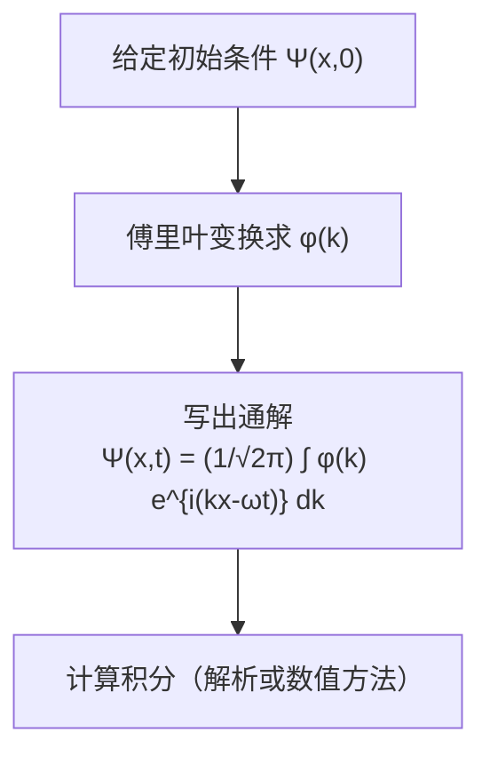

**与离散谱的对比**：

| | 离散谱（如势阱） | 连续谱（自由粒子） |
|---|---|---|
| **展开** | $\Psi = \sum_n c_n \psi_n e^{-iE_n t/\hbar}$ | $\Psi = \frac{1}{\sqrt{2\pi}}\int \phi(k) e^{i(kx-\omega t)} dk$ |
| **系数** | $c_n$（离散标签） | $\phi(k)$（连续标签） |
| **求系数** | 内积：$c_n = \int \psi_n^* \Psi(x,0) dx$ | 傅里叶变换：$\phi(k) = \frac{1}{\sqrt{2\pi}}\int \Psi(x,0)e^{-ikx}dx$ |
| **概率** | $\|c_n\|^2$ = 得到 $E_n$ 的概率 | $\|\phi(k)\|^2 dk$ = 动量在 $\hbar k$ 到 $\hbar(k+dk)$ 间的概率 |
| **归一化** | $\sum_n \|c_n\|^2 = 1$ | $\int_{-\infty}^{\infty} \|\phi(k)\|^2 dk = 1$ |

最后一行值得强调。利用 **Parseval 定理**（傅里叶变换的等距性）：

$$\int_{-\infty}^{\infty} |\Psi(x,0)|^2 dx = \int_{-\infty}^{\infty} |\phi(k)|^2 dk$$

如果 $\Psi(x,0)$ 归一化，则 $\phi(k)$ 也自动归一化。这使得 $|\phi(k)|^2$ 可以自然地解释为动量空间中的概率密度。

### 2.4.5 例子：高斯波包

让我们用一个具体的例子来展示波包的构造和演化。

设初始波函数为中心在原点、宽度为 $a$ 的高斯波包，同时赋予它平均动量 $\hbar k_0$：

$$\Psi(x,0) = \left(\frac{1}{2\pi a^2}\right)^{1/4} e^{-x^2/4a^2} \cdot e^{ik_0 x}$$

（已归一化。）

**第一步：求 $\phi(k)$**

$$\phi(k) = \frac{1}{\sqrt{2\pi}} \int_{-\infty}^{\infty} \Psi(x,0) e^{-ikx} dx = \frac{1}{\sqrt{2\pi}} \left(\frac{1}{2\pi a^2}\right)^{1/4} \int_{-\infty}^{\infty} e^{-x^2/4a^2} e^{i(k_0-k)x} dx$$

利用高斯积分公式 $\int_{-\infty}^{\infty} e^{-\alpha x^2 + \beta x} dx = \sqrt{\frac{\pi}{\alpha}} e^{\beta^2/4\alpha}$，取 $\alpha = 1/(4a^2)$，$\beta = i(k_0-k)$：

$$\phi(k) = \frac{1}{\sqrt{2\pi}} \left(\frac{1}{2\pi a^2}\right)^{1/4} \cdot \sqrt{4\pi a^2} \cdot e^{-(k-k_0)^2 a^2}$$

化简：

$$\phi(k) = \left(\frac{2a^2}{\pi}\right)^{1/4} e^{-(k-k_0)^2 a^2}$$

这也是一个高斯函数，中心在 $k = k_0$，宽度为 $1/(2a)$。

**注意**：位置空间的宽度为 $a$，动量空间（$k$ 空间）的宽度为 $\sim 1/a$。这正是不确定性原理的体现——位置越"窄"（$a$ 小），动量就越"宽"（$1/a$ 大），反之亦然。

**第二步：时间演化**

$$\Psi(x,t) = \frac{1}{\sqrt{2\pi}} \int_{-\infty}^{\infty} \phi(k) e^{i(kx - \hbar k^2 t/2m)} dk$$

代入 $\phi(k)$：

$$\Psi(x,t) = \frac{1}{\sqrt{2\pi}} \left(\frac{2a^2}{\pi}\right)^{1/4} \int_{-\infty}^{\infty} e^{-(k-k_0)^2 a^2} e^{i(kx - \hbar k^2 t/2m)} dk$$

令 $q = k - k_0$，则 $k = q + k_0$：

$$\Psi(x,t) = \frac{1}{\sqrt{2\pi}} \left(\frac{2a^2}{\pi}\right)^{1/4} e^{i(k_0 x - \hbar k_0^2 t/2m)} \int_{-\infty}^{\infty} e^{-q^2 a^2} e^{i q x} e^{-i\hbar(2k_0 q + q^2)t/2m} dq$$

将指数合并（忽略 $q$ 的高次项的详细展开，直接完成高斯积分），最终结果为：

$$\Psi(x,t) = \left(\frac{1}{2\pi}\right)^{1/4} \frac{1}{\sqrt{a + i\hbar t/2ma}} \exp\left[-\frac{(x - v_g t)^2}{4a^2(1 + i\hbar t/2ma^2)}\right] \exp\left[i\left(k_0 x - \frac{\hbar k_0^2}{2m}t\right)\right]$$

其中 $v_g = \hbar k_0 / m$ 是**群速度**（稍后详述）。

**概率密度**：

$$|\Psi(x,t)|^2 = \frac{1}{\sqrt{2\pi} \, w(t)} \exp\left[-\frac{(x - v_g t)^2}{2w(t)^2}\right]$$

其中波包的宽度随时间增长：

$$w(t) = a\sqrt{1 + \left(\frac{\hbar t}{2ma^2}\right)^2}$$

**物理图景**：
- 波包的中心以速度 $v_g = \hbar k_0 / m$ 运动——这正是经典粒子的速度 $v = p/m$。
- 波包的宽度 $w(t)$ 随时间增大——波包在"扩散"。
- 初始时刻 $w(0) = a$；当 $t \gg 2ma^2/\hbar$ 时，$w(t) \approx \hbar t / (2ma)$，线性增长。

> **扩散的物理解释**：波包由许多不同动量的平面波叠加而成。不同动量的分量以不同速度运动，随着时间推移，它们逐渐"走散"，导致波包变宽。这是自由粒子的量子色散效应。

### 2.4.6 相速度与群速度

自由粒子的色散关系（$\omega$ 与 $k$ 的关系）为：

$$\omega(k) = \frac{\hbar k^2}{2m}$$

这是一个**色散关系**：$\omega$ 不是 $k$ 的线性函数。这导致了相速度和群速度的不同。

---

#### 相速度 (Phase velocity)

**相速度**是单一平面波相位面（等相位面 $kx - \omega t = \text{常数}$）的传播速度：

$$\boxed{v_{\text{phase}} = \frac{\omega}{k} = \frac{\hbar k}{2m} = \frac{p}{2m}}$$

这个结果令人不安：经典粒子的速度是 $v_{\text{classical}} = p/m$，而相速度只有它的**一半**！

这是否矛盾？不——因为相速度描述的是单一频率的正弦波纹的移动速度，而不是粒子（或波包）的移动速度。

---

#### 群速度 (Group velocity)

**群速度**是波包包络（振幅调制）的传播速度。对于一个窄频谱的波包（中心波数为 $k_0$），群速度定义为：

$$\boxed{v_{\text{group}} = \left.\frac{d\omega}{dk}\right|_{k=k_0}}$$

对于自由粒子：

$$v_{\text{group}} = \frac{d}{dk}\left(\frac{\hbar k^2}{2m}\right) = \frac{\hbar k_0}{m} = \frac{p}{m}$$

**群速度恰好等于经典粒子的速度！**

---

#### 推导：为什么波包以群速度移动

为了理解群速度的来源，考虑两个频率接近的平面波的叠加：

$$\Psi = e^{i(k_1 x - \omega_1 t)} + e^{i(k_2 x - \omega_2 t)}$$

令 $k_1 = k_0 + \Delta k$，$k_2 = k_0 - \Delta k$，$\omega_1 = \omega_0 + \Delta\omega$，$\omega_2 = \omega_0 - \Delta\omega$：

$$\Psi = e^{i(k_0 x - \omega_0 t)} \left[e^{i(\Delta k \cdot x - \Delta\omega \cdot t)} + e^{-i(\Delta k \cdot x - \Delta\omega \cdot t)}\right]$$

$$= 2\cos(\Delta k \cdot x - \Delta\omega \cdot t) \cdot e^{i(k_0 x - \omega_0 t)}$$

- 因子 $e^{i(k_0 x - \omega_0 t)}$ 是以相速度 $v_{\text{phase}} = \omega_0/k_0$ 移动的**载波**。
- 因子 $\cos(\Delta k \cdot x - \Delta\omega \cdot t)$ 是以群速度 $v_{\text{group}} = \Delta\omega / \Delta k$ 移动的**包络**。

当 $\Delta k \to 0$ 时，$\Delta\omega / \Delta k \to d\omega/dk$，这就是群速度的定义。

**群速度等于经典速度的证明**：

由色散关系 $\omega = \hbar k^2 / 2m$ 以及 $E = \hbar\omega$，$p = \hbar k$：

$$v_{\text{group}} = \frac{d\omega}{dk} = \frac{dE/\hbar}{dp/\hbar} = \frac{dE}{dp}$$

对于自由粒子，$E = p^2/2m$，因此：

$$v_{\text{group}} = \frac{dE}{dp} = \frac{p}{m} = v_{\text{classical}}$$

这个结果非常优美：**波包以经典粒子的速度移动**。尽管单个平面波的相速度只有经典速度的一半，但波包作为整体以正确的经典速度传播。

> **总结**：
> $$v_{\text{phase}} = \frac{\omega}{k} = \frac{p}{2m} = \frac{1}{2}v_{\text{classical}}$$
> $$v_{\text{group}} = \frac{d\omega}{dk} = \frac{p}{m} = v_{\text{classical}}$$

### 2.4.7 色散关系的一般讨论

相速度与群速度之间的关系 $v_{\text{group}} = v_{\text{phase}} + k \frac{dv_{\text{phase}}}{dk}$（读者可自行验证），对于非色散介质（$v_{\text{phase}}$ 与 $k$ 无关），两者相等。但自由粒子的色散关系 $\omega \propto k^2$ 是色散的，因此相速度与群速度不同。

色散的直接后果是**波包扩散**：不同频率分量以不同的相速度传播，导致波包随时间展宽。这正是我们在 2.4.5 节的高斯波包中看到的现象。

**take way:
$\omega$ 与 $k$ 的关系就叫做色散关系: $$\omega = \omega(k)$$
群速度和相速度由不同的定义给出.
他们的速度不一样, 于是波包就会扩大**

### 2.4.8 $\phi(k)$ 的物理意义：动量空间波函数

函数 $\phi(k)$ 不仅仅是数学上的傅里叶系数——它有深刻的物理意义。

由 $p = \hbar k$，定义动量空间波函数：

$$\Phi(p) = \frac{1}{\sqrt{\hbar}} \phi(p/\hbar)$$

则 $|\Phi(p)|^2 dp$ 给出了在 $p$ 到 $p + dp$ 之间找到粒子动量的概率。等价地，$|\phi(k)|^2 dk$ 给出了在 $\hbar k$ 到 $\hbar(k + dk)$ 之间找到粒子动量的概率。

这一解释将在第3章（广义统计诠释）中获得系统的阐述。在那里我们将看到，$\phi(k)$ 是波函数在动量本征态上的展开系数，正如 $c_n$ 是波函数在能量本征态上的展开系数。

---

### 习题 2.13

**(a)** 证明自由粒子的色散关系可以写为 $v_{\text{group}} = 2 v_{\text{phase}}$。

**(b)** 对于光子（电磁波），色散关系为 $\omega = ck$（$c$ 为光速）。计算光子的相速度和群速度，并验证它们相等。为什么光的波包不会扩散（在真空中）？

**(c)** 对于有质量的相对论粒子，色散关系为 $\omega = c\sqrt{k^2 + (mc/\hbar)^2}$。证明 $v_{\text{phase}} \cdot v_{\text{group}} = c^2$，并解释为什么相速度总是大于光速但这并不违反相对论。

---

### 习题 2.14

设自由粒子的初始波函数为：

$$\Psi(x,0) = \begin{cases} A & \text{if } -a < x < a \\ 0 & \text{otherwise} \end{cases}$$

**(a)** 求归一化常数 $A$。

**(b)** 求 $\phi(k)$。

**(c)** 利用 Parseval 定理验证 $\int |\phi(k)|^2 dk = 1$。

**(d)** 讨论 $\phi(k)$ 的形状。当 $a$ 增大时，$\phi(k)$ 变窄还是变宽？这如何体现不确定性原理？

---

### 习题 2.15（思考题）

一个学生说："既然自由粒子的定态不是物理态，那么自由粒子就没有确定的能量。"

**(a)** 这个说法正确吗？为什么？

**(b)** 自由粒子的能量不确定度 $\sigma_E$ 与什么有关？能否为零？

**(c)** 如果我们测量自由粒子的能量，会得到什么结果？测量后波函数变成什么？

---

### 习题 2.16（计算题）

对于高斯波包 $\Psi(x,0) = (2\pi a^2)^{-1/4} e^{-x^2/4a^2} e^{ik_0 x}$：

**(a)** 计算初始时刻的 $\sigma_x$ 和 $\sigma_p$，验证 $\sigma_x \sigma_p = \hbar/2$（最小不确定性波包）。

**(b)** 利用 $w(t) = a\sqrt{1 + (\hbar t / 2ma^2)^2}$ 计算在 $t > 0$ 时刻的 $\sigma_x$。此时 $\sigma_x \sigma_p$ 还等于 $\hbar/2$ 吗？

**(c)** 对于一个电子（$m = 9.11 \times 10^{-31}$ kg），初始宽度 $a = 10^{-10}$ m（约一个原子大小），计算波包宽度翻倍所需的时间。

---

### Key Takeaway: 2.4 自由粒子

| 要点                | 内容                                                                        |
| ----------------- | ------------------------------------------------------------------------- |
| **定态薛定谔方程**       | $\psi(x) = Ae^{ikx}$，$E = \hbar^2 k^2/2m$（连续谱）                            |
| **不可归一化**         | 平面波不是物理态，不能描述真实粒子                                                         |
| **波包**            | $\Psi(x,t) = \frac{1}{\sqrt{2\pi}}\int \phi(k)e^{i(kx-\omega t)}dk$（可归一化） |
| **$\phi(k)$ 的求法** | 傅里叶变换：$\phi(k) = \frac{1}{\sqrt{2\pi}}\int \Psi(x,0)e^{-ikx}dx$           |
| **相速度**           | $v_{\text{phase}} = \omega/k = p/2m$（不是经典速度）                              |
| **群速度**           | $v_{\text{group}} = d\omega/dk = p/m$（等于经典速度）                             |
| **波包扩散**          | 色散导致波包随时间展宽                                                               |

---

## 2.5 德尔塔函数势 (The Delta-Function Potential)

> **本节核心问题**：如何处理势能中的奇异性（$\delta$ 函数）？束缚态与散射态有什么本质区别？

前几节中我们遇到了两种极端情况：无限深势阱将粒子完全困住（只有束缚态），自由粒子完全自由（只有散射态）。现在我们研究一个同时具有束缚态和散射态的系统——**$\delta$ 函数势**。

这个看似人为的模型实际上极其重要：
1. 它是为数不多可以**精确求解**的同时包含束缚态和散射态的系统。
2. 它展示了处理势能奇异性的核心技巧——**边界条件匹配**。
3. 它引入了散射理论的基本概念：反射系数和透射系数。

### 2.5.1 $\delta$ 函数势的定义

考虑势能：

$$\boxed{V(x) = -\alpha \, \delta(x)}$$

其中 $\alpha > 0$ 是一个正常数（量纲为 $\text{能量} \times \text{长度}$，即 $\text{J}\cdot\text{m}$），$\delta(x)$ 是狄拉克 $\delta$ 函数。

**物理图景**：这是一个极度窄但极度深的势阱，位于 $x = 0$ 处。势阱的宽度趋于零，深度趋于无穷，但"面积"（宽度 $\times$ 深度）保持为有限值 $\alpha$。

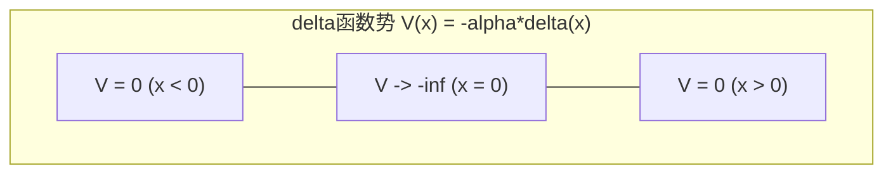

**$\delta$ 函数的基本性质**（回忆）：

$$\delta(x) = \begin{cases} 0 & x \neq 0 \\ \infty & x = 0 \end{cases}, \quad \int_{-\infty}^{\infty} \delta(x) dx = 1$$

关键性质（筛选性质）：

$$\int_{-\infty}^{\infty} f(x) \delta(x-a) dx = f(a)$$

### 2.5.2 束缚态与散射态的区分

在深入求解之前，让我们先理解**束缚态**和**散射态**的一般概念。

对于一个满足 $V(x) \to 0$（当 $|x| \to \infty$）的势能，定态薛定谔方程 $-\frac{\hbar^2}{2m}\psi'' + V\psi = E\psi$ 在远离势能区域（$|x| \to \infty$）简化为：

$$\psi'' = -\frac{2mE}{\hbar^2}\psi$$

- **如果 $E < 0$**：方程变为 $\psi'' = \kappa^2 \psi$（$\kappa = \sqrt{-2mE}/\hbar > 0$），解为 $e^{\pm\kappa x}$。为了归一化，$\psi$ 在 $x \to +\infty$ 时必须取 $e^{-\kappa x}$，在 $x \to -\infty$ 时必须取 $e^{+\kappa x}$。波函数在远处**指数衰减**——粒子被"束缚"在势能区域附近。这就是**束缚态**。

- **如果 $E > 0$**：方程变为 $\psi'' = -k^2\psi$（$k = \sqrt{2mE}/\hbar > 0$），解为 $e^{\pm ikx}$——**振荡的平面波**。粒子不被束缚，可以从远处来、散射后又跑到远处去。这就是**散射态**。

$$\boxed{\begin{aligned} E < 0 &\quad \Rightarrow \quad \text{束缚态（bound state）：波函数在无穷远衰减为零} \\ E > 0 &\quad \Rightarrow \quad \text{散射态（scattering state）：波函数在无穷远振荡} \end{aligned}}$$

> **注意**：这里 $E = 0$ 是分界点，因为我们选择 $V(\pm\infty) = 0$ 作为势能的参考零点。如果势能在无穷远不为零，分界点会改变。

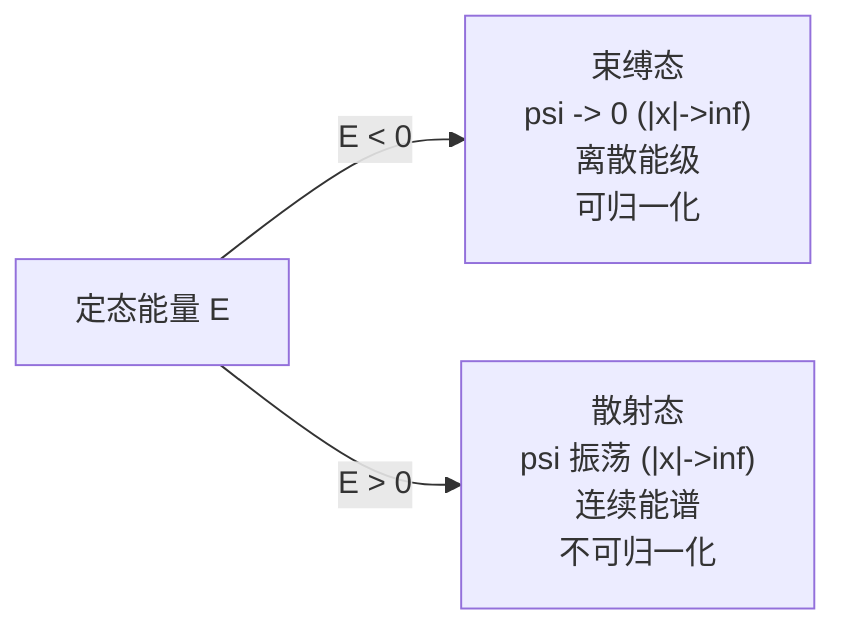

### 2.5.3 束缚态 ($E < 0$)：求解

设 $E < 0$，定义：

$$\kappa \equiv \frac{\sqrt{-2mE}}{\hbar} > 0$$

在 $x \neq 0$ 处（此时 $V = 0$），定态薛定谔方程为：

$$\frac{d^2\psi}{dx^2} = \kappa^2 \psi$$

**区域 I ($x < 0$)**：

$$\psi_I(x) = Ae^{\kappa x} + Be^{-\kappa x}$$

由于 $x \to -\infty$ 时需要 $\psi \to 0$，必须 $B = 0$：

$$\psi_I(x) = Ae^{\kappa x} \quad (x < 0)$$

**区域 II ($x > 0$)**：

$$\psi_{II}(x) = Ce^{\kappa x} + De^{-\kappa x}$$

由于 $x \to +\infty$ 时需要 $\psi \to 0$，必须 $C = 0$：

$$\psi_{II}(x) = De^{-\kappa x} \quad (x > 0)$$

#### 边界条件 1：波函数的连续性

波函数在 $x = 0$ 处必须连续：

$$\psi_I(0) = \psi_{II}(0) \quad \Rightarrow \quad A = D$$

因此：

$$\psi(x) = Ae^{-\kappa|x|}$$

#### 边界条件 2：导数的不连续性（核心技巧）

在普通势能下，波函数的导数也是连续的。但 $\delta$ 函数势在 $x = 0$ 处是无穷大的，这导致了导数的**不连续性**。

**推导**：将定态薛定谔方程在 $x = -\epsilon$ 到 $x = +\epsilon$ 之间积分：

$$-\frac{\hbar^2}{2m}\int_{-\epsilon}^{+\epsilon} \frac{d^2\psi}{dx^2} dx + \int_{-\epsilon}^{+\epsilon} V(x)\psi(x) dx = E\int_{-\epsilon}^{+\epsilon} \psi(x) dx$$

逐项分析：

**左边第一项**：

$$-\frac{\hbar^2}{2m}\int_{-\epsilon}^{+\epsilon} \frac{d^2\psi}{dx^2} dx = -\frac{\hbar^2}{2m}\left[\frac{d\psi}{dx}\bigg|_{+\epsilon} - \frac{d\psi}{dx}\bigg|_{-\epsilon}\right] = -\frac{\hbar^2}{2m}\Delta\left(\frac{d\psi}{dx}\right)$$

**左边第二项**：

$$\int_{-\epsilon}^{+\epsilon} V(x)\psi(x) dx = -\alpha \int_{-\epsilon}^{+\epsilon} \delta(x)\psi(x) dx = -\alpha\psi(0)$$

**右边**：

$$E\int_{-\epsilon}^{+\epsilon} \psi(x) dx \to 0 \quad (\epsilon \to 0)$$

因为 $\psi$ 在 $x = 0$ 附近有界，积分区间趋于零。

令 $\epsilon \to 0$，得到：

$$\boxed{\Delta\left(\frac{d\psi}{dx}\right) \equiv \lim_{\epsilon \to 0}\left[\psi'(\epsilon) - \psi'(-\epsilon)\right] = -\frac{2m\alpha}{\hbar^2}\psi(0)}$$

这就是 $\delta$ 函数势导致的**导数跳跃条件**。

#### 应用跳跃条件

计算导数：

$$\psi'(x) = \begin{cases} A\kappa e^{\kappa x} & x < 0 \\ -A\kappa e^{-\kappa x} & x > 0 \end{cases}$$

在 $x = 0$ 处的跳跃：

$$\Delta(\psi') = (-A\kappa) - (A\kappa) = -2A\kappa$$

代入跳跃条件：

$$-2A\kappa = -\frac{2m\alpha}{\hbar^2} A$$

$A \neq 0$（否则无解），因此：

$$\kappa = \frac{m\alpha}{\hbar^2}$$

由此得到能量：

$$E = -\frac{\hbar^2\kappa^2}{2m} = -\frac{m\alpha^2}{2\hbar^2}$$

$$\boxed{E = -\frac{m\alpha^2}{2\hbar^2}}$$

**$\delta$ 函数势阱恰好有一个束缚态**，能量为 $E = -m\alpha^2/2\hbar^2$。

#### 归一化

$$\int_{-\infty}^{\infty} |\psi|^2 dx = |A|^2 \int_{-\infty}^{\infty} e^{-2\kappa|x|} dx = |A|^2 \cdot \frac{2}{2\kappa} = \frac{|A|^2}{\kappa}$$

令其等于 1：$A = \sqrt{\kappa}$。代入 $\kappa = m\alpha/\hbar^2$：

$$\boxed{\psi(x) = \frac{\sqrt{m\alpha}}{\hbar} \, e^{-m\alpha|x|/\hbar^2}}$$

波函数是一个以 $x = 0$ 为中心的指数衰减"帐篷"形状，衰减长度为 $\hbar^2/(m\alpha)$。

### 2.5.4 散射态 ($E > 0$)：反射与透射

现在考虑 $E > 0$ 的情况。在 $x \neq 0$ 处，定态薛定谔方程为：

$$\frac{d^2\psi}{dx^2} = -k^2\psi, \quad k \equiv \frac{\sqrt{2mE}}{\hbar}$$

通解为振荡函数。我们设想一个从**左边**入射的粒子：

**区域 I ($x < 0$)**：

$$\psi_I(x) = Ae^{ikx} + Be^{-ikx}$$

- $Ae^{ikx}$：**入射波**（向右行进）
- $Be^{-ikx}$：**反射波**（向左行进）

**区域 II ($x > 0$)**：

$$\psi_{II}(x) = Fe^{ikx} + Ge^{-ikx}$$

- $Fe^{ikx}$：**透射波**（向右行进）
- $Ge^{-ikx}$：从右边入射的波

对于从左边入射的设定，右边没有入射波，因此 $G = 0$：

$$\psi_{II}(x) = Fe^{ikx}$$

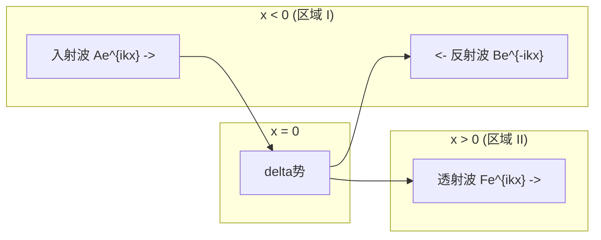

#### 边界条件匹配

**连续性**（$\psi$ 在 $x = 0$ 连续）：

$$A + B = F \tag{1}$$

**导数跳跃条件**：

$$\psi'_{II}(0) - \psi'_I(0) = -\frac{2m\alpha}{\hbar^2}\psi(0)$$

$$ikF - ik(A - B) = -\frac{2m\alpha}{\hbar^2}(A + B)$$

$$ik(F - A + B) = -\frac{2m\alpha}{\hbar^2}(A + B) \tag{2}$$

利用 $(1)$ 中 $F = A + B$ 代入 $(2)$：

$$ik(A + B - A + B) = -\frac{2m\alpha}{\hbar^2}(A + B)$$

$$2ikB = -\frac{2m\alpha}{\hbar^2}(A + B)$$

定义无量纲参数：

$$\beta \equiv \frac{m\alpha}{\hbar^2 k}$$

则：

$$ikB = -\beta k(A + B) \quad \Rightarrow \quad iB = -\beta(A + B)$$

$$B(i + \beta) = -\beta A \quad \Rightarrow \quad B = \frac{-\beta}{i + \beta} A$$

以及：

$$\frac{F}{A} = 1 + \frac{B}{A} = 1 + \frac{-\beta}{i + \beta} = \frac{i + \beta - \beta}{i + \beta} = \frac{i}{i + \beta}$$

#### 反射系数与透射系数

**反射系数** $R$ 定义为反射波概率流与入射波概率流之比。由于所有波的波数相同（$k$），概率流正比于振幅的模方：

$$R \equiv \frac{|B|^2}{|A|^2}$$

$$R = \left|\frac{-\beta}{i + \beta}\right|^2 = \frac{\beta^2}{1 + \beta^2}$$

代入 $\beta = m\alpha/(\hbar^2 k)$ 和 $E = \hbar^2 k^2/(2m)$：

$$\boxed{R = \frac{1}{1 + 2\hbar^2 E/(m\alpha^2)} = \frac{m\alpha^2}{m\alpha^2 + 2\hbar^2 E} = \frac{1}{1 + 2E/E_0}}$$

其中 $E_0 \equiv m\alpha^2/(2\hbar^2)$（恰好是束缚态能量的绝对值）。

**透射系数**：

$$T \equiv \frac{|F|^2}{|A|^2} = \left|\frac{i}{i + \beta}\right|^2 = \frac{1}{1 + \beta^2}$$

$$\boxed{T = \frac{1}{1 + m\alpha^2/(2\hbar^2 E)} = \frac{2\hbar^2 E}{m\alpha^2 + 2\hbar^2 E} = \frac{1}{1 + E_0/(2E)}}$$

#### 验证 $R + T = 1$

$$R + T = \frac{\beta^2}{1 + \beta^2} + \frac{1}{1 + \beta^2} = \frac{\beta^2 + 1}{1 + \beta^2} = 1 \quad \checkmark$$

**概率守恒**：入射粒子要么被反射，要么被透射，没有其他可能。

#### 物理分析

1. **低能极限** $E \to 0^+$（$\beta \to \infty$）：$R \to 1$，$T \to 0$。低能粒子几乎完全被反射。

2. **高能极限** $E \to \infty$（$\beta \to 0$）：$R \to 0$，$T \to 1$。高能粒子几乎完全透射。

3. **经典对比**：经典力学中，无论能量多大，粒子经过 $\delta$ 函数势阱时完全不会被反射（势阱只是加速粒子通过）。$R \neq 0$ 是纯粹的量子效应——**即使势阱（而非势垒）也会引起反射**，这在经典力学中是不可能的。

4. **反弹性势垒**（$\alpha < 0$，即 $\delta$ 函数势垒）：只需将公式中的 $\alpha$ 替换为 $|\alpha|$。由于 $R$ 和 $T$ 只依赖 $\alpha^2$，**势垒和势阱给出完全相同的反射和透射系数**！这又是一个令人惊讶的量子效应。

### 2.5.5 $\delta$ 函数势的完整能谱总结

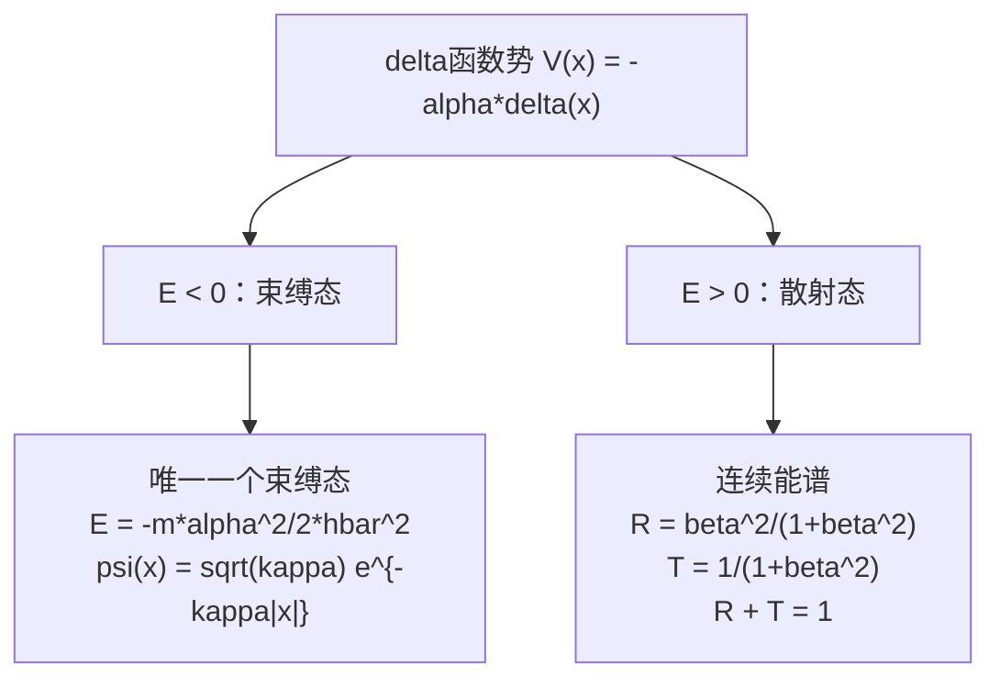

### 2.5.6 编程题：$\delta$ 函数势的可视化

以下是一道编程题，帮助读者通过可视化深入理解 $\delta$ 函数势的物理。

**题目**：用 Python 完成以下任务：

**(a)** 绘制束缚态波函数 $\psi(x) = \sqrt{\kappa}\,e^{-\kappa|x|}$ 及其概率密度 $|\psi(x)|^2$。取 $\kappa = 1$（自然单位）。

**(b)** 在同一张图上绘制反射系数 $R(E)$ 和透射系数 $T(E)$ 作为入射能量 $E$ 的函数（$E > 0$），并验证 $R + T = 1$。横轴用 $E/E_0$（其中 $E_0 = m\alpha^2/2\hbar^2$）表示。

**(c)** 制作一个动画或多帧图，展示不同能量下散射态波函数 $|\psi(x)|^2$ 的分布，显示势阱左右两侧的振幅差异。

**参考代码**（供读者对照）：

```python
import numpy as np
import matplotlib.pyplot as plt

# 设置中文字体
plt.rcParams['font.sans-serif'] = ['SimHei']
plt.rcParams['axes.unicode_minus'] = False

# ===== (a) 束缚态波函数 =====
kappa = 1.0  # 自然单位
x = np.linspace(-5, 5, 1000)
psi_bound = np.sqrt(kappa) * np.exp(-kappa * np.abs(x))
prob_bound = psi_bound ** 2

fig, axes = plt.subplots(1, 2, figsize=(14, 5))

# 波函数
axes[0].plot(x, psi_bound, 'b-', linewidth=2, label=r'$\psi(x)$')
axes[0].axvline(x=0, color='r', linestyle='--', alpha=0.5, label=r'$\delta$势位置')
axes[0].set_xlabel('x', fontsize=14)
axes[0].set_ylabel(r'$\psi(x)$', fontsize=14)
axes[0].set_title(r'束缚态波函数 ($\kappa=1$)', fontsize=14)
axes[0].legend(fontsize=12)
axes[0].grid(True, alpha=0.3)

# 概率密度
axes[1].fill_between(x, prob_bound, alpha=0.3, color='blue')
axes[1].plot(x, prob_bound, 'b-', linewidth=2, label=r'$|\psi(x)|^2$')
axes[1].axvline(x=0, color='r', linestyle='--', alpha=0.5, label=r'$\delta$势位置')
axes[1].set_xlabel('x', fontsize=14)
axes[1].set_ylabel(r'$|\psi(x)|^2$', fontsize=14)
axes[1].set_title('束缚态概率密度', fontsize=14)
axes[1].legend(fontsize=12)
axes[1].grid(True, alpha=0.3)

plt.tight_layout()
plt.savefig('delta_bound_state.png', dpi=150, bbox_inches='tight')
plt.show()

# ===== (b) 反射系数与透射系数 =====
# E/E0 作为横轴，E0 = m*alpha^2 / (2*hbar^2)
E_ratio = np.linspace(0.01, 10, 500)  # E/E0
# R = 1 / (1 + 2*E/E0)，T = 1 - R
R = 1.0 / (1.0 + 2.0 * E_ratio)
T = 1.0 - R

fig, ax = plt.subplots(figsize=(8, 5))
ax.plot(E_ratio, R, 'r-', linewidth=2, label='反射系数 R')
ax.plot(E_ratio, T, 'b-', linewidth=2, label='透射系数 T')
ax.plot(E_ratio, R + T, 'k--', linewidth=1, alpha=0.5, label='R + T (验证)')
ax.set_xlabel(r'$E / E_0$', fontsize=14)
ax.set_ylabel('系数', fontsize=14)
ax.set_title(r'$\delta$函数势的反射与透射系数', fontsize=14)
ax.legend(fontsize=12)
ax.set_ylim(-0.05, 1.15)
ax.grid(True, alpha=0.3)

plt.tight_layout()
plt.savefig('delta_RT_coefficients.png', dpi=150, bbox_inches='tight')
plt.show()

# ===== (c) 不同能量下的散射态波函数 =====
# 散射态波函数：左侧 psi = e^{ikx} + B/A * e^{-ikx}，右侧 psi = F/A * e^{ikx}
# B/A = -beta/(i + beta)，F/A = i/(i + beta)，beta = m*alpha/(hbar^2 * k)
# 用自然单位 (m=hbar=1)，alpha = sqrt(2*E0) = sqrt(2)（取 E0=1）

alpha_nat = np.sqrt(2.0)  # 自然单位下的 alpha（对应 E0 = 1）
x_scat = np.linspace(-10, 10, 2000)

fig, axes = plt.subplots(2, 2, figsize=(14, 10))
energies = [0.5, 1.0, 3.0, 10.0]  # E/E0 的值

for idx, E_over_E0 in enumerate(energies):
    ax = axes[idx // 2][idx % 2]
    E_val = E_over_E0  # E0 = 1 的自然单位
    k_val = np.sqrt(2.0 * E_val)  # k = sqrt(2mE)/hbar，m=hbar=1
    beta_val = alpha_nat / (k_val)  # beta = m*alpha/(hbar^2 * k)

    # 系数
    B_over_A = -beta_val / (1j + beta_val)
    F_over_A = 1j / (1j + beta_val)

    # 波函数（取 A=1）
    psi_left = np.exp(1j * k_val * x_scat) + B_over_A * np.exp(-1j * k_val * x_scat)
    psi_right = F_over_A * np.exp(1j * k_val * x_scat)

    # 组合
    psi_scat = np.where(x_scat < 0, psi_left, psi_right)
    prob_scat = np.abs(psi_scat) ** 2

    ax.plot(x_scat, prob_scat, 'b-', linewidth=1.5)
    ax.axvline(x=0, color='r', linestyle='--', alpha=0.5)

    R_val = np.abs(B_over_A) ** 2
    T_val = np.abs(F_over_A) ** 2
    ax.set_title(f'$E/E_0 = {E_over_E0}$, R={R_val:.3f}, T={T_val:.3f}', fontsize=12)
    ax.set_xlabel('x', fontsize=12)
    ax.set_ylabel(r'$|\psi(x)|^2$', fontsize=12)
    ax.grid(True, alpha=0.3)

plt.suptitle(r'不同能量下的散射态概率密度 ($\delta$函数势)', fontsize=14, y=1.02)
plt.tight_layout()
plt.savefig('delta_scattering_states.png', dpi=150, bbox_inches='tight')
plt.show()
```

---

### 习题 2.17

考虑**双 $\delta$ 函数势** $V(x) = -\alpha[\delta(x+a) + \delta(x-a)]$，其中 $\alpha > 0$，$a > 0$。

**(a)** 利用势能的宇称对称性 $V(x) = V(-x)$，论证束缚态波函数要么是偶函数，要么是奇函数。

**(b)** 对于偶宇称束缚态（$E < 0$），写出波函数在三个区域（$x < -a$，$-a < x < a$，$x > a$）的一般形式，施加连续性条件和导数跳跃条件，推导束缚态能量满足的超越方程。

**(c)** 证明偶宇称态始终存在（至少有一个解），但奇宇称态只在 $\alpha$ 足够大时才存在。

---

### 习题 2.18

**(a)** 对于 $\delta$ 函数势阱的束缚态，计算 $\langle x \rangle$，$\langle x^2 \rangle$，$\sigma_x$。

**(b)** 计算 $\langle p \rangle$ 和 $\langle p^2 \rangle$。（提示：$\psi(x)$ 在 $x = 0$ 不可微，但你可以利用 $\langle p^2 \rangle = 2m\langle T \rangle = 2m(E - \langle V \rangle)$ 和 $\langle V \rangle = -\alpha|\psi(0)|^2$。）

**(c)** 计算 $\sigma_p$，并验证不确定性原理 $\sigma_x \sigma_p \geq \hbar/2$。

---

### 习题 2.19（概念题）

**(a)** 在经典力学中，一个粒子从左边以能量 $E > 0$ 入射，经过一个势阱（如 $V < 0$ 的区域）。粒子会被反射吗？解释你的答案。

**(b)** 在量子力学中，$\delta$ 函数势阱（$\alpha > 0$）对入射粒子的反射系数为 $R = \beta^2/(1+\beta^2) > 0$。这意味着即使势阱也会反射粒子。请从波动的角度给出直观解释。

**(c)** 如果我们将 $\delta$ 函数势阱替换为 $\delta$ 函数势垒（$V = +\alpha\delta(x)$，$\alpha > 0$），反射系数和透射系数如何变化？

---

### 习题 2.20

证明：对于 $\delta$ 函数势 $V(x) = -\alpha\delta(x)$（$\alpha > 0$），散射态的透射系数可以写为：

$$T = \frac{1}{1 + \frac{m\alpha^2}{2\hbar^2 E}}$$

验证 $T$ 在 $E \to 0^+$ 时趋于 0，在 $E \to \infty$ 时趋于 1，并画出 $T(E)$ 的草图。讨论：是否存在某个能量使得 $T = 1$（完全透射）？

---

### 习题 2.21（编程题）

编写一个 Python 程序，完成以下任务：

**(a)** 对于 $\delta$ 函数势阱的束缚态 $\psi(x) = \sqrt{\kappa}e^{-\kappa|x|}$，数值验证归一化条件 $\int_{-\infty}^{\infty}|\psi|^2 dx = 1$。

**(b)** 数值计算 $\langle x^2 \rangle$ 和 $\langle p^2 \rangle$（对 $\langle p^2 \rangle$ 使用 $\langle p^2 \rangle = -\hbar^2 \int \psi^* \psi'' dx$，注意 $\psi''$ 在 $x = 0$ 处需要特殊处理），并与解析结果比较。

**(c)** 绘制 $R(E)$ 和 $T(E)$ 的图像（横轴为 $E/E_0$，纵轴为系数值），并在图上标出 $R = T = 0.5$ 对应的能量。这个特殊能量与 $E_0$ 有什么关系？

---

### Key Takeaway: 2.5 德尔塔函数势

| 要点 | 内容 |
|------|------|
| **势能** | $V(x) = -\alpha\delta(x)$，$\alpha > 0$ |
| **束缚态** | 唯一一个：$E = -m\alpha^2/2\hbar^2$，$\psi = \sqrt{\kappa}\,e^{-\kappa\|x\|}$ |
| **导数跳跃条件** | $\Delta(\psi') = -\frac{2m\alpha}{\hbar^2}\psi(0)$（核心技巧） |
| **散射态** | $R = \frac{\beta^2}{1+\beta^2}$，$T = \frac{1}{1+\beta^2}$，$R + T = 1$ |
| **$\beta$ 定义** | $\beta = m\alpha/(\hbar^2 k)$，其中 $k = \sqrt{2mE}/\hbar$ |
| **低能极限** | $R \to 1$，$T \to 0$（几乎全反射） |
| **高能极限** | $R \to 0$，$T \to 1$（几乎全透射） |
| **经典对比** | 经典力学中势阱不反射粒子——反射是量子效应 |

---

## 2.6 有限深方势阱 (The Finite Square Well)

### 2.6.1 问题的提出

在2.2节中，我们研究了**无限深方势阱**——阱壁无穷高，粒子被绝对囚禁，永远无法逃逸。这是一个极其有用的"玩具模型"，但现实中的势阱深度总是有限的。电子在原子中被库仑势束缚、中子在原子核中被核力束缚——这些真实的物理系统更接近**有限深方势阱**。

有限深势阱与无限深势阱相比，带来了三个根本性的新特征：

1. **波函数穿透势壁**：粒子有一定概率出现在经典禁区中——这是隧穿效应的体现。
2. **束缚态数目有限**：势阱越浅、越窄，能容纳的束缚态越少。极端情况下，一个很浅的势阱可能只有一个束缚态。
3. **超越方程**：能级不再有简洁的解析表达式，需要通过图解法或数值方法求解。

考虑如下的有限深方势阱：

$$\boxed{V(x) = \begin{cases} -V_0 & \text{if } -a \le x \le a \\ 0 & \text{if } |x| > a \end{cases}}$$

其中 $V_0 > 0$ 是势阱深度，$2a$ 是势阱宽度。我们将势阱外部的势能设为零（而非将阱底设为零），这是一种常用的约定，对于散射问题尤为方便。

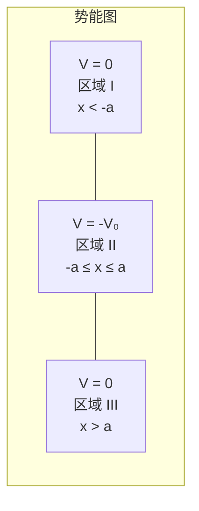

> **约定说明**：注意这里的势阱底部在 $V = -V_0$，阱外在 $V = 0$。束缚态的能量满足 $-V_0 < E < 0$。有些教材将阱底定为 $V = 0$，阱外为 $V = V_0$，此时束缚态能量满足 $0 < E < V_0$。两种约定在物理上完全等价，只要保持自洽即可。本节采用前一种约定，与Griffiths教材一致。

---

### 2.6.2 分区求解定态薛定谔方程

对于束缚态，我们需要 $-V_0 < E < 0$。

定态薛定谔方程为：

$$-\frac{\hbar^2}{2m} \frac{d^2\psi}{dx^2} + V(x)\psi = E\psi$$

我们将空间分为三个区域分别求解。

#### 区域 I：$x < -a$（左侧阱外）

此区域 $V = 0$，方程变为：

$$-\frac{\hbar^2}{2m} \frac{d^2\psi}{dx^2} = E\psi$$

由于 $E < 0$，定义正实数：

$$\boxed{\kappa \equiv \frac{\sqrt{-2mE}}{\hbar} > 0}$$

方程变为：

$$\frac{d^2\psi}{dx^2} = \kappa^2 \psi$$

通解为：

$$\psi_I(x) = Ae^{\kappa x} + Be^{-\kappa x}$$

物理约束：当 $x \to -\infty$ 时，$e^{-\kappa x} \to \infty$，波函数发散，不可归一化。因此必须 $B = 0$：

$$\psi_I(x) = Ae^{\kappa x} \quad (x < -a)$$

波函数在左侧阱外**指数衰减**（从右向左衰减）。

#### 区域 II：$-a \le x \le a$（阱内）

此区域 $V = -V_0$，方程变为：

$$-\frac{\hbar^2}{2m} \frac{d^2\psi}{dx^2} - V_0\psi = E\psi$$

即：

$$\frac{d^2\psi}{dx^2} = -\frac{2m(E + V_0)}{\hbar^2}\psi$$

由于 $E > -V_0$（束缚态条件），$E + V_0 > 0$，定义正实数：

$$\boxed{l \equiv \frac{\sqrt{2m(E + V_0)}}{\hbar} > 0}$$

方程变为：

$$\frac{d^2\psi}{dx^2} = -l^2 \psi$$

通解为正弦和余弦的线性组合：

$$\psi_{II}(x) = C\sin(lx) + D\cos(lx)$$

#### 区域 III：$x > a$（右侧阱外）

与区域 I 相同，$V = 0$，方程为：

$$\frac{d^2\psi}{dx^2} = \kappa^2 \psi$$

通解为：

$$\psi_{III}(x) = Fe^{\kappa x} + Ge^{-\kappa x}$$

物理约束：当 $x \to +\infty$ 时，$e^{\kappa x} \to \infty$，必须 $F = 0$：

$$\psi_{III}(x) = Ge^{-\kappa x} \quad (x > a)$$

波函数在右侧阱外也**指数衰减**。

#### $\kappa$ 和 $l$ 的关系

注意一个重要关系。由 $\kappa$ 和 $l$ 的定义：

$$\kappa^2 + l^2 = \frac{-2mE}{\hbar^2} + \frac{2m(E+V_0)}{\hbar^2} = \frac{2mV_0}{\hbar^2}$$

即：

$$\boxed{\kappa^2 + l^2 = \frac{2mV_0}{\hbar^2}}$$

这是一个只依赖于势阱参数（$m$, $V_0$）的**常数**，不依赖于能量 $E$。这个约束将在图解法中发挥关键作用。

---

### 2.6.3 利用宇称简化问题

有限深方势阱的势能 $V(x)$ 关于 $x = 0$ 对称：$V(-x) = V(x)$。这意味着哈密顿量具有**空间反演对称性**（宇称对称性）。

根据对称性原理（将在第6章详细讨论），对于对称势的束缚态，波函数可以选择为具有确定宇称的：

- **偶宇称解**（even parity）：$\psi(-x) = \psi(x)$
- **奇宇称解**（odd parity）：$\psi(-x) = -\psi(x)$

> **为什么可以这样做？** 如果 $\psi(x)$ 是能量 $E$ 对应的解，那么 $\psi(-x)$ 也是（因为势能关于原点对称）。对于非简并能级（一维束缚态总是非简并的），$\psi(x)$ 和 $\psi(-x)$ 必须线性相关，即 $\psi(-x) = c\psi(x)$。再次反演得 $\psi(x) = c^2\psi(x)$，因此 $c = \pm 1$。这就是说，波函数必然是偶函数或奇函数。

利用宇称分类，我们可以将四个边界条件（两个匹配点各两个条件）简化为两个。下面分别处理偶宇称和奇宇称情形。

---

### 2.6.4 偶宇称解的完整推导

对于偶宇称解 $\psi(-x) = \psi(x)$，阱内只保留余弦项（偶函数），正弦项（奇函数）系数为零：

$$\psi_{II}(x) = D\cos(lx)$$

由宇称对称性，左右阱外的波函数相互关联。在右侧阱外：

$$\psi_{III}(x) = Ge^{-\kappa x} \quad (x > a)$$

宇称条件 $\psi(-x) = \psi(x)$ 要求在左侧阱外：

$$\psi_I(x) = Ge^{\kappa x} \quad (x < -a)$$

（即 $A = G$。）

现在，我们只需在 $x = a$ 处施加匹配条件。（由于宇称对称性，$x = -a$ 处的匹配条件自动满足。）

**匹配条件**：波函数及其一阶导数在 $x = a$ 处连续：

**条件一**：$\psi$ 在 $x = a$ 处连续：

$$D\cos(la) = Ge^{-\kappa a} \tag{1}$$

**条件二**：$\frac{d\psi}{dx}$ 在 $x = a$ 处连续：

$$-Dl\sin(la) = -G\kappa e^{-\kappa a} \tag{2}$$

将式(2)除以式(1)（假设 $D\cos(la) \neq 0$，即 $\cos(la) \neq 0$）：

$$\frac{-Dl\sin(la)}{D\cos(la)} = \frac{-G\kappa e^{-\kappa a}}{Ge^{-\kappa a}}$$

$$l\tan(la) = \kappa$$

或写成：

$$\boxed{\tan(la) = \frac{\kappa}{l}} \quad \text{（偶宇称解的超越方程）}$$

这是一个关于 $E$ 的**超越方程**（transcendental equation），因为 $l$ 和 $\kappa$ 都是 $E$ 的函数。它无法用初等函数求解，但可以通过图解法直观地理解解的结构。

---

### 2.6.5 奇宇称解的推导

对于奇宇称解 $\psi(-x) = -\psi(x)$，阱内只保留正弦项（奇函数）：

$$\psi_{II}(x) = C\sin(lx)$$

在右侧阱外：

$$\psi_{III}(x) = Ge^{-\kappa x} \quad (x > a)$$

宇称条件 $\psi(-x) = -\psi(x)$ 要求在左侧阱外：

$$\psi_I(x) = -Ge^{\kappa x} \quad (x < -a)$$

在 $x = a$ 处施加匹配条件：

**条件一**：$\psi$ 在 $x = a$ 处连续：

$$C\sin(la) = Ge^{-\kappa a} \tag{3}$$

**条件二**：$\frac{d\psi}{dx}$ 在 $x = a$ 处连续：

$$Cl\cos(la) = -G\kappa e^{-\kappa a} \tag{4}$$

将式(4)除以式(3)（假设 $\sin(la) \neq 0$）：

$$\frac{Cl\cos(la)}{C\sin(la)} = \frac{-G\kappa e^{-\kappa a}}{Ge^{-\kappa a}}$$

$$l\cot(la) = -\kappa$$

即：

$$\boxed{-\cot(la) = \frac{\kappa}{l}} \quad \text{（奇宇称解的超越方程）}$$

或等价地写成：

$$\tan(la) = -\frac{l}{\kappa}$$

---

### 2.6.6 图解法：束缚态能级的确定

两个超越方程——偶宇称的 $\tan(la) = \kappa/l$ 和奇宇称的 $-\cot(la) = \kappa/l$——无法解析求解。但我们可以用一种优美的**图解法**来可视化所有解的存在性和特征。

#### 引入无量纲变量

令：

$$z \equiv la, \quad z_0 \equiv \frac{a}{\hbar}\sqrt{2mV_0}$$

由 $\kappa^2 + l^2 = 2mV_0/\hbar^2$，得：

$$\kappa a = \sqrt{z_0^2 - z^2}$$

因此 $\kappa/l = \kappa a/(la) = \sqrt{z_0^2 - z^2}/z$。

**偶宇称超越方程**变为：

$$\boxed{\tan z = \sqrt{\frac{z_0^2}{z^2} - 1} = \frac{\sqrt{z_0^2 - z^2}}{z}}$$

**奇宇称超越方程**变为：

$$\boxed{-\cot z = \frac{\sqrt{z_0^2 - z^2}}{z}}$$

注意：$z$ 的取值范围为 $0 < z < z_0$（因为 $l > 0$ 且 $\kappa > 0$ 要求 $la < z_0$）。

参数 $z_0$ 完全由势阱的物理参数决定：

$$z_0 = \frac{a}{\hbar}\sqrt{2mV_0}$$

$z_0$ 越大，表示势阱越深或越宽（或粒子质量越大）。

#### 图解法的原理

图解法的思路是：在同一张图上，分别画出超越方程的左边和右边作为 $z$ 的函数，它们的**交点**就是方程的解。

**右边**（两种宇称共用）：

$$f(z) = \frac{\sqrt{z_0^2 - z^2}}{z}$$

这是一个在 $z = 0$ 处发散（$f \to \infty$）、在 $z = z_0$ 处为零的单调递减函数。几何上，它是以原点为圆心、$z_0$ 为半径的四分之一圆的斜率（$\sqrt{z_0^2 - z^2}$ 对 $z$ 的比值）。

**左边**：

- 偶宇称：$\tan z$，周期为 $\pi$，在 $z = (n+1/2)\pi$（$n = 0, 1, 2, \ldots$）处有垂直渐近线，在每个周期内从 $0$ 单调递增至 $+\infty$。
- 奇宇称：$-\cot z$，周期为 $\pi$，在 $z = n\pi$（$n = 1, 2, 3, \ldots$）处有垂直渐近线，在每个周期内从 $-\infty$ 单调递增至 $+\infty$。

**但注意**：我们需要交点在 $\tan z > 0$（偶宇称）或 $-\cot z > 0$（奇宇称）的区域，因为右边 $f(z) > 0$。

- 对于 $\tan z > 0$，$z$ 在 $(0, \pi/2)$, $(\pi, 3\pi/2)$, $(2\pi, 5\pi/2)$, ... 区间内。
- 对于 $-\cot z > 0$，$z$ 在 $(\pi/2, \pi)$, $(3\pi/2, 2\pi)$, ... 区间内。

这意味着偶宇称解和奇宇称解**交替出现**：基态（最低能级）是偶宇称，第一激发态是奇宇称，第二激发态是偶宇称，如此交替。

#### 图形描述

想象以下图形（横轴为 $z$，纵轴为函数值）：

1. 画出 $\tan z$ 的正值分支：在区间 $(0, \pi/2)$ 从 $0$ 升到 $+\infty$，在 $(\pi, 3\pi/2)$ 从 $0$ 升到 $+\infty$，......
2. 画出 $-\cot z$ 的正值分支：在区间 $(\pi/2, \pi)$ 从 $+\infty$ 降到 $0$（实际上是从 $0$ 升到 $+\infty$），......
3. 画出右边的圆弧函数 $f(z) = \sqrt{z_0^2 - z^2}/z$：从 $z = 0^+$ 处的 $+\infty$ 平滑下降到 $z = z_0$ 处的 $0$。

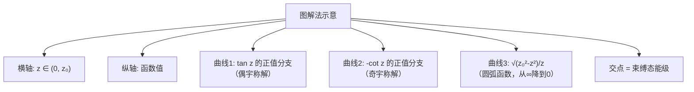

每一条 $\tan z$（偶宇称）或 $-\cot z$（奇宇称）的正值分支与圆弧函数 $f(z)$ 有**恰好零个或一个**交点。当 $z_0$ 足够大时，更多的分支有交点，即有更多的束缚态。

#### 束缚态数目

束缚态的数目由 $z_0$ 决定。$\tan z$ 和 $-\cot z$ 的正值分支分别出现在半宽为 $\pi/2$ 的区间内，按顺序排列在 $z$ 轴上：

| 分支序号 | 区间 | 宇称 |
|----------|------|------|
| 第1支 | $(0, \pi/2)$ | 偶 |
| 第2支 | $(\pi/2, \pi)$ | 奇 |
| 第3支 | $(\pi, 3\pi/2)$ | 偶 |
| 第4支 | $(3\pi/2, 2\pi)$ | 奇 |
| ... | ... | ... |

圆弧函数 $f(z)$ 在 $z = z_0$ 处降为零。因此，只有那些起始区间左端点小于 $z_0$ 的分支才有可能与 $f(z)$ 相交。

**束缚态数目**等于 $z_0$ 所覆盖的 $\pi/2$ 区间数：

$$\boxed{N = \left\lfloor \frac{z_0}{\pi/2} \right\rfloor + 1 = \left\lfloor \frac{2z_0}{\pi} \right\rfloor + 1}$$

其中 $\lfloor \cdot \rfloor$ 表示取整（向下取整）。更精确地说：

- $0 < z_0 \le \pi/2$：**1个**束缚态（偶宇称基态）
- $\pi/2 < z_0 \le \pi$：**2个**束缚态（1偶 + 1奇）
- $\pi < z_0 \le 3\pi/2$：**3个**束缚态（2偶 + 1奇）
- $3\pi/2 < z_0 \le 2\pi$：**4个**束缚态（2偶 + 2奇）
- ......

> **关键结论**：无论势阱多浅、多窄（只要 $V_0 > 0$），**至少存在一个束缚态**。这是一维有限深方势阱的一个重要性质。（注意：这个结论不适用于三维球对称有限深方势阱——在三维中，过浅的势阱可能不存在束缚态。）

---

### 2.6.7 从超越方程求能量

一旦通过图解法（或数值方法）确定了 $z$ 的值（记为 $z_n$，$n = 1, 2, 3, \ldots$），就可以反推能量。

由 $z = la$ 和 $l = \sqrt{2m(E + V_0)}/\hbar$：

$$E + V_0 = \frac{\hbar^2 l^2}{2m} = \frac{\hbar^2 z_n^2}{2ma^2}$$

因此：

$$\boxed{E_n = \frac{\hbar^2 z_n^2}{2ma^2} - V_0}$$

由于 $0 < z_n < z_0$，我们有 $-V_0 < E_n < 0$，确实是束缚态能量。

#### 波函数的构造

确定 $z_n$（从而确定 $l_n$ 和 $\kappa_n$）后，偶宇称波函数为：

$$\psi_n(x) = \begin{cases} D_n \cos(l_n a) \cdot e^{\kappa_n(x+a)} & x < -a \\[4pt] D_n \cos(l_n x) & -a \le x \le a \\[4pt] D_n \cos(l_n a) \cdot e^{-\kappa_n(x-a)} & x > a \end{cases}$$

其中我们利用了 $x = a$ 处的连续性条件 $G = D\cos(la) \cdot e^{\kappa a}$，并将 $e^{-\kappa a}$ 因子吸收到指数中，使表达式在 $x = \pm a$ 处自动连续。归一化常数 $D_n$ 由 $\int_{-\infty}^{\infty} |\psi_n|^2 dx = 1$ 确定。

奇宇称波函数类似，将 $\cos$ 替换为 $\sin$。

> **物理图景**：波函数在阱内是振荡的（正弦/余弦），在阱外是指数衰减的。粒子有**非零概率**出现在经典禁区（$|x| > a$）中！这是纯量子效应，经典力学中粒子绝不可能出现在势能高于总能量的区域。

---

### 2.6.8 与无限深势阱的比较

有限深势阱与无限深势阱的比较揭示了"真实性"带来的物理修正。我们来系统地对比这两个模型。

#### 能级对比

| 特征        | 无限深势阱 ($V_0 \to \infty$)                     | 有限深势阱                                           |
| --------- | -------------------------------------------- | ----------------------------------------------- |
| **束缚态数目** | 无穷多                                          | 有限个（$N \approx 2z_0/\pi + 1$）                   |
| **能量公式**  | $E_n = \frac{n^2\pi^2\hbar^2}{2m(2a)^2}$（解析） | $E_n = \frac{\hbar^2 z_n^2}{2ma^2} - V_0$（超越方程） |
| **能级间距**  | 随 $n$ 增大而增大                                  | 类似，但高能级被压缩                                      |
| **基态能量**  | $E_1 > 0$（以阱底为零）                             | $E_1 > -V_0$（以阱外为零）但比无限深势阱低                     |

#### 波函数对比

| 特征 | 无限深势阱 | 有限深势阱 |
|------|------|------|
| **阱外波函数** | 严格为零 | 指数衰减，非零 |
| **阱壁处** | $\psi = 0$（硬边界） | $\psi \neq 0$（软边界） |
| **有效阱宽** | $2a$（精确） | $> 2a$（波函数渗透到阱外） |
| **节点数** | 第 $n$ 个态有 $n-1$ 个节点 | 相同（阱内） |

#### 极限行为：$V_0 \to \infty$

当 $V_0 \to \infty$ 时，$z_0 \to \infty$，圆弧函数 $f(z)$ 变得几乎垂直下降。超越方程的解趋近于 $\tan z$ 或 $-\cot z$ 的零点：

- 偶宇称：$\tan z \to \infty$，即 $z \to (n - \frac{1}{2})\pi$，$n = 1, 2, 3, \ldots$
- 奇宇称：$-\cot z \to \infty$，即 $z \to n\pi$，$n = 1, 2, 3, \ldots$

合并后，$z$ 取值为 $\frac{\pi}{2}, \pi, \frac{3\pi}{2}, 2\pi, \ldots$，即 $z_n = n\pi/2$。

对应的"阱内"能量 $E + V_0 = \frac{\hbar^2 z_n^2}{2ma^2} = \frac{n^2\pi^2\hbar^2}{8ma^2}$。

这正是宽度为 $2a$ 的无限深方势阱的能级公式（将阱底能量设为零）：

$$E_n^{\text{阱内}} = \frac{n^2\pi^2\hbar^2}{2m(2a)^2}$$

**验证成功**：有限深势阱在 $V_0 \to \infty$ 极限下，精确地回归无限深势阱的结果。

同时，$\kappa = \sqrt{-2mE}/\hbar \to \infty$（因为 $E \to -\infty$ 同时 $E + V_0$ 有限），波函数在阱外的衰减长度 $1/\kappa \to 0$，渗透消失，恢复了硬边界条件。

---

### 2.6.9 宽势阱与窄势阱

#### 宽势阱（$z_0 \gg 1$）

当 $z_0 = a\sqrt{2mV_0}/\hbar \gg 1$ 时（势阱很深或很宽），有许多束缚态。低能级的解 $z_n$ 接近 $n\pi/2$，能量接近无限深势阱的结果。

物理上，低能粒子"感受不到"势壁是有限的——波函数集中在阱内，渗透到阱外的部分可以忽略。只有当能量接近阱顶（$E \to 0^-$）时，有限深度的效应才显著。

#### 窄势阱（$z_0 < \pi/2$）

当 $z_0 < \pi/2$ 时，只有**一个束缚态**（偶宇称基态）。这个基态的波函数渗透到阱外很远的地方（$\kappa$ 很小，衰减长度 $1/\kappa$ 很大），粒子在阱外被发现的概率可能很大。

极端情况 $z_0 \to 0$（势阱极浅极窄）：唯一的束缚态能量趋近于零（$E \to 0^-$），波函数几乎完全展开在阱外。

> **物理直觉**：一维有限深方势阱总有至少一个束缚态，这与三维情况不同。直觉上，一维势阱无论多浅，总能"捕获"粒子——虽然捕获得很弱，粒子大部分时间"在外面"。

---

### 2.6.10 散射态简述

当 $E > 0$ 时，粒子的总能量大于势阱外部的势能，粒子不被束缚，称为**散射态**。

对于散射态，三个区域的解均为振荡形式：

- 区域 I（$x < -a$）：$\psi_I = Ae^{ikx} + Be^{-ikx}$，其中 $k = \sqrt{2mE}/\hbar$
- 区域 II（$-a \le x \le a$）：$\psi_{II} = Ce^{ilx} + De^{-ilx}$，其中 $l = \sqrt{2m(E+V_0)}/\hbar$
- 区域 III（$x > a$）：$\psi_{III} = Fe^{ikx} + Ge^{-ikx}$

物理上，$Ae^{ikx}$ 代表从左入射的波，$Be^{-ikx}$ 代表被反射的波，$Fe^{ikx}$ 代表透射的波。如果粒子从左方入射，则 $G = 0$（右侧没有入射波）。

通过匹配 $x = \pm a$ 处的边界条件，可以求出**透射系数**：

$$T = \frac{|F|^2}{|A|^2} = \frac{1}{1 + \frac{V_0^2}{4E(E+V_0)}\sin^2(2la)}$$

**共振透射**：当 $\sin(2la) = 0$，即 $2la = n\pi$（$n = 1, 2, 3, \ldots$）时，$T = 1$——粒子完全透射，没有反射！这称为**Ramsauer-Townsend 效应**，在低能电子散射实验中已被观测到。

共振条件 $2la = n\pi$ 恰好对应于势阱内恰好容纳半波长整数倍的驻波，这与光学中薄膜干涉的增透条件（膜厚等于半波长的整数倍）完全类似。

---

### 习题 2.22

**(概念理解)** 一个有限深方势阱的参数为 $V_0$ 和 $a$。

**(a)** 证明无论 $V_0$ 和 $a$ 取何值（只要 $V_0 > 0$），至少存在一个束缚态。

**(b)** 恰好存在三个束缚态时，$z_0 = a\sqrt{2mV_0}/\hbar$ 的取值范围是什么？

**(c)** 如果势阱深度加倍（$V_0 \to 2V_0$），同时宽度减半（$a \to a/2$），束缚态数目是否改变？为什么？

---

### 习题 2.23

**(计算练习)** 一个电子（$m = 9.11 \times 10^{-31}$ kg）被限制在宽度 $2a = 1.0$ nm、深度 $V_0 = 2.0$ eV 的有限深方势阱中。

**(a)** 计算 $z_0$。

**(b)** 确定束缚态的数目。

**(c)** 通过图解法（或数值方法）估算基态能量 $E_1$。

**(d)** 计算基态波函数在阱外的衰减长度 $1/\kappa_1$，并与阱宽比较。

（提示：$\hbar = 1.055 \times 10^{-34}$ J·s，$1$ eV $= 1.602 \times 10^{-19}$ J。）

---

### 习题 2.24

**(思考题)** 比较有限深势阱和无限深势阱中的基态能量（以阱底为参考点）。

**(a)** 直觉上，有限深势阱的基态能量应该高于还是低于无限深势阱的基态能量？给出物理论证。

**(b)** 从不确定性原理的角度解释你的答案。（提示：考虑波函数的有效"展开范围"与动量不确定性的关系。）

**(c)** 在 $V_0 \to \infty$ 的极限下，两者之差趋近于零。解释为什么。

---

### 习题 2.25

**(思考题)** 关于散射态，考虑 Ramsauer-Townsend 效应。

**(a)** 共振透射条件 $2la = n\pi$ 的物理含义是什么？

**(b)** 对于固定的势阱参数，哪些入射能量会导致完全透射？

**(c)** 这个现象与光学中的哪个效应类似？给出类比。

---

### 习题 2.26（编程题）

**数值求解有限深方势阱的束缚态能级和波函数。**

使用 Python 完成以下任务：

**(a)** 编写程序，绘制图解法所需的图形：在同一张图上画出 $\tan z$（偶宇称）、$-\cot z$（奇宇称）和 $\sqrt{z_0^2 - z^2}/z$ 的图形。取 $z_0 = 8$，找出所有交点。

**(b)** 使用 `scipy.optimize.brentq`（或其他根搜索算法）精确求解超越方程，得到所有束缚态的 $z_n$ 值和对应的能量 $E_n$。

**(c)** 对于每个束缚态，绘制归一化波函数 $\psi_n(x)$（包括阱内和阱外部分）。在同一张图上标出势阱的轮廓。

**(d)** 改变 $z_0$（如 $z_0 = 1, 2, 4, 8, 16$），观察束缚态数目和能级间距的变化。

参考代码框架：

```python
import numpy as np
import matplotlib.pyplot as plt
from scipy.optimize import brentq

# ============================================================
# 有限深方势阱束缚态的数值求解
# ============================================================

# --- 参数设置 ---
z0 = 8.0  # 无量纲参数 z0 = a * sqrt(2mV0) / hbar

# --- (a) 图解法 ---
z = np.linspace(0.01, z0 - 0.01, 10000)  # 避开端点奇异性

# 右侧函数（两种宇称共用）
rhs = np.sqrt(z0**2 - z**2) / z

# 偶宇称: tan(z)
tan_z = np.tan(z)
# 奇宇称: -cot(z)
neg_cot_z = -1.0 / np.tan(z)

# 为了避免 tan/cot 的发散导致图形混乱，
# 将绝对值过大的点设为 NaN
tan_z[np.abs(tan_z) > 50] = np.nan
neg_cot_z[np.abs(neg_cot_z) > 50] = np.nan

plt.figure(figsize=(10, 6))
plt.plot(z, tan_z, 'b-', label=r'$\tan z$（偶宇称）', linewidth=0.8)
plt.plot(z, neg_cot_z, 'r--', label=r'$-\cot z$（奇宇称）', linewidth=0.8)
plt.plot(z, rhs, 'k-', label=r'$\sqrt{z_0^2 - z^2}/z$', linewidth=2)
plt.xlabel(r'$z$', fontsize=14)
plt.ylabel('函数值', fontsize=14)
plt.title(f'有限深方势阱图解法 ($z_0 = {z0}$)', fontsize=14)
plt.ylim(-1, 15)
plt.xlim(0, z0 + 0.5)
plt.axhline(y=0, color='gray', linewidth=0.5)
plt.legend(fontsize=12)
plt.grid(True, alpha=0.3)
plt.tight_layout()
plt.savefig('finite_well_graphical.png', dpi=150)
plt.show()

# --- (b) 数值求解超越方程 ---

def even_eq(z):
    """偶宇称超越方程: tan(z) - sqrt(z0^2 - z^2)/z = 0"""
    if z >= z0:
        return -1e10
    return np.tan(z) - np.sqrt(z0**2 - z**2) / z

def odd_eq(z):
    """奇宇称超越方程: -cot(z) - sqrt(z0^2 - z^2)/z = 0"""
    if z >= z0:
        return -1e10
    return -1.0 / np.tan(z) - np.sqrt(z0**2 - z**2) / z

# 在每个半周期区间内搜索根
solutions = []
parity_labels = []

n_max = int(z0 / (np.pi / 2)) + 1  # 最大分支数
for n in range(n_max):
    # 每个分支的区间
    z_left = n * np.pi / 2 + 1e-10
    z_right = (n + 1) * np.pi / 2 - 1e-10

    # 确保区间不超过 z0
    if z_left >= z0:
        break
    z_right = min(z_right, z0 - 1e-10)

    if n % 2 == 0:
        # 偶宇称分支
        try:
            sol = brentq(even_eq, z_left, z_right)
            solutions.append(sol)
            parity_labels.append('偶')
        except ValueError:
            pass  # 此区间无解
    else:
        # 奇宇称分支
        try:
            sol = brentq(odd_eq, z_left, z_right)
            solutions.append(sol)
            parity_labels.append('奇')
        except ValueError:
            pass

print(f"z0 = {z0}")
print(f"束缚态数目: {len(solutions)}")
print("-" * 50)
for i, (zn, par) in enumerate(zip(solutions, parity_labels)):
    # 能量 E_n/V0 = (z_n/z0)^2 - 1
    E_ratio = (zn / z0)**2 - 1
    print(f"  态 {i+1} ({par}宇称): z = {zn:.6f}, E/V0 = {E_ratio:.6f}")

# --- (c) 绘制波函数 ---

# 设定物理参数（以 a = 1, 2m/hbar^2 = 1 为单位）
a = 1.0
V0 = z0**2 / a**2  # 从 z0 反推 V0（在自然单位下）

x = np.linspace(-3*a, 3*a, 1000)

fig, axes = plt.subplots(len(solutions), 1,
                          figsize=(10, 3*len(solutions)),
                          sharex=True)
if len(solutions) == 1:
    axes = [axes]

for i, (zn, par) in enumerate(zip(solutions, parity_labels)):
    ln = zn / a          # 波矢 l
    kappan = np.sqrt(z0**2 - zn**2) / a  # 衰减常数 kappa

    psi = np.zeros_like(x)
    for j, xi in enumerate(x):
        if xi < -a:
            # 区域 I
            if par == '偶':
                psi[j] = np.cos(ln * a) * np.exp(kappan * (xi + a))
            else:
                psi[j] = np.sin(ln * a) * np.exp(kappan * (xi + a))
        elif xi <= a:
            # 区域 II
            if par == '偶':
                psi[j] = np.cos(ln * xi)
            else:
                psi[j] = np.sin(ln * xi)
        else:
            # 区域 III
            if par == '偶':
                psi[j] = np.cos(ln * a) * np.exp(-kappan * (xi - a))
            else:
                psi[j] = -np.sin(ln * a) * np.exp(-kappan * (xi - a))
                # 注意奇宇称的符号

    # 归一化
    norm = np.trapz(psi**2, x)
    psi /= np.sqrt(norm)

    ax = axes[i]
    ax.plot(x/a, psi, 'b-', linewidth=1.5)
    ax.axvline(x=-1, color='gray', linestyle='--', alpha=0.5)
    ax.axvline(x=1, color='gray', linestyle='--', alpha=0.5)
    ax.axhline(y=0, color='gray', linewidth=0.5)
    ax.fill_between([-3, -1], -0.5, 0.5, alpha=0.05, color='red')
    ax.fill_between([1, 3], -0.5, 0.5, alpha=0.05, color='red')
    E_ratio = (zn / z0)**2 - 1
    ax.set_title(f'态 {i+1}（{par}宇称），$E/V_0 = {E_ratio:.4f}$',
                 fontsize=12)
    ax.set_ylabel(r'$\psi(x)$', fontsize=12)
    ax.set_xlim(-3, 3)

axes[-1].set_xlabel(r'$x/a$', fontsize=12)
plt.tight_layout()
plt.savefig('finite_well_wavefunctions.png', dpi=150)
plt.show()

# --- (d) z0 对束缚态数目的影响 ---
print("\n不同 z0 下的束缚态数目:")
print("-" * 30)
for z0_test in [1, 2, 4, 8, 16]:
    # 快速计算束缚态数目
    N_approx = int(2 * z0_test / np.pi) + 1
    print(f"  z0 = {z0_test:5.1f} -> 约 {N_approx} 个束缚态")
```

**说明**：
- 代码中使用无量纲化处理，令 $a = 1$，$2m/\hbar^2 = 1$，则 $V_0 = z_0^2$。
- `brentq` 是 Brent 方法的实现，在给定区间内高效搜索函数零点，需要区间两端函数值异号。
- 图形中灰色虚线标记了势阱壁的位置 $x = \pm a$，浅红色区域是经典禁区。
- 运行代码后，尝试调节 $z_0$ 的值，观察束缚态数目、能级间距和波函数渗透深度的变化。

---

### Key Takeaway: 2.6 有限深方势阱

| 要点                      | 内容                                                                                         |
| ----------------------- | ------------------------------------------------------------------------------------------ |
| **势能定义**                | $V = -V_0$（$x\le a$），$V = 0$（$x> a$）                                                       |
| **参数 $\kappa, l$**      | $\kappa = \sqrt{-2mE}/\hbar$，$l = \sqrt{2m(E+V_0)}/\hbar$，$\kappa^2 + l^2 = 2mV_0/\hbar^2$ |
| **偶宇称超越方程**             | $\tan z = \sqrt{z_0^2/z^2 - 1}$，其中 $z = la$，$z_0 = a\sqrt{2mV_0}/\hbar$                    |
| **奇宇称超越方程**             | $-\cot z = \sqrt{z_0^2/z^2 - 1}$                                                           |
| **图解法**                 | 画 $\tan z$/$-\cot z$ 与圆弧函数的交点 = 束缚态能级                                                      |
| **束缚态数目**               | $N = \lfloor 2z_0/\pi \rfloor + 1$，至少1个                                                    |
| **阱外波函数**               | 指数衰减 $\sim e^{-\kappa x}$，粒子可出现在经典禁区                                                       |
| **$V_0 \to \infty$ 极限** | 回归无限深势阱结果                                                                                  |
| **散射态**                 | $E > 0$ 时有共振透射（Ramsauer-Townsend 效应）                                                       |

---

## 本章总结

### 核心思路

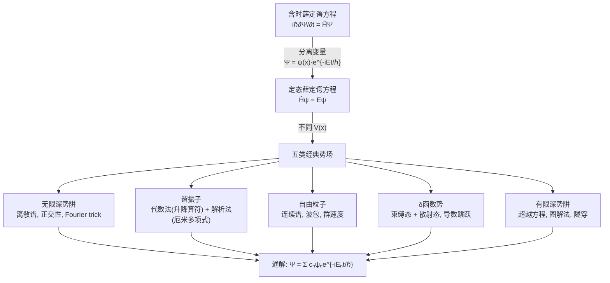

### 各势场的核心成果对比

| 势场 | 能谱类型 | 能级公式 | 关键数学工具 | 核心物理 |
|------|----------|----------|-------------|----------|
| **无限深势阱** | 离散 | $E_n = \frac{n^2\pi^2\hbar^2}{2ma^2}$ | 傅里叶级数 | 能量量子化、零点能 |
| **谐振子** | 离散 | $E_n = (n+\frac{1}{2})\hbar\omega$ | 升降算符、厄米多项式 | 等间距能谱、零点能 |
| **自由粒子** | 连续 | $E = \frac{\hbar^2 k^2}{2m}$（任意 $k$） | 傅里叶变换 | 波包扩散、群速度 |
| **δ函数势** | 离散+连续 | 束缚态：$E = -\frac{m\alpha^2}{2\hbar^2}$ | 导数跳跃条件 | 隧穿、量子反射 |
| **有限深势阱** | 离散+连续 | 超越方程确定 | 图解法/数值法 | 波函数渗透、有限束缚态 |

### 关键公式汇总

| 公式名称    | 表达式                                                                       |     |     |
| ------- | ------------------------------------------------------------------------- | --- | --- |
| 定态薛定谔方程 | $-\frac{\hbar^2}{2m}\frac{d^2\psi}{dx^2} + V\psi = E\psi$                 |     |     |
| 通解      | $\Psi(x,t) = \sum c_n \psi_n(x) e^{-iE_n t/\hbar}$                        |     |     |
| 正交归一性   | $\int \psi_m^* \psi_n \, dx = \delta_{mn}$                                |     |     |
| 谐振子升降算符 | $\hat{a}_\pm = \frac{1}{\sqrt{2\hbar m\omega}}(\mp i\hat{p} + m\omega x)$ |     |     |
| 群速度     | $v_g = \frac{d\omega}{dk}$（等于经典速度）                                        |     |     |
| 反射+透射   | $R + T = 1$                                                               |     |     |

### 物理图景总结

1. **能量量子化**源于边界条件对波函数的约束——正如弦的驻波只能有特定频率。
2. **零点能**是不确定性原理的直接结果——粒子不能静止在势阱底部。
3. **隧穿效应**意味着粒子可以出现在经典禁区——波函数在禁区中指数衰减但不为零。
4. **离散谱与连续谱**的分野在于是否存在边界约束：束缚态→离散，散射态→连续。
5. **代数法（算符法）** 将微分方程问题转化为代数问题，是量子力学最强大的工具之一。

---

**第2章完**

下一章我们将进入形式理论（Formalism），将本章的具体结果抽象为严谨的线性代数框架——希尔伯特空间、狄拉克符号、厄米算符的一般理论，以及不确定性原理的严格证明。
