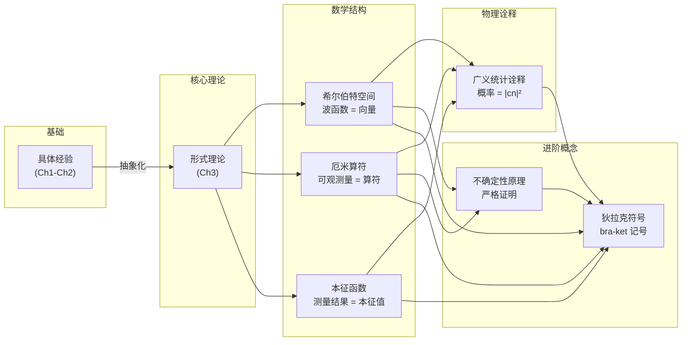
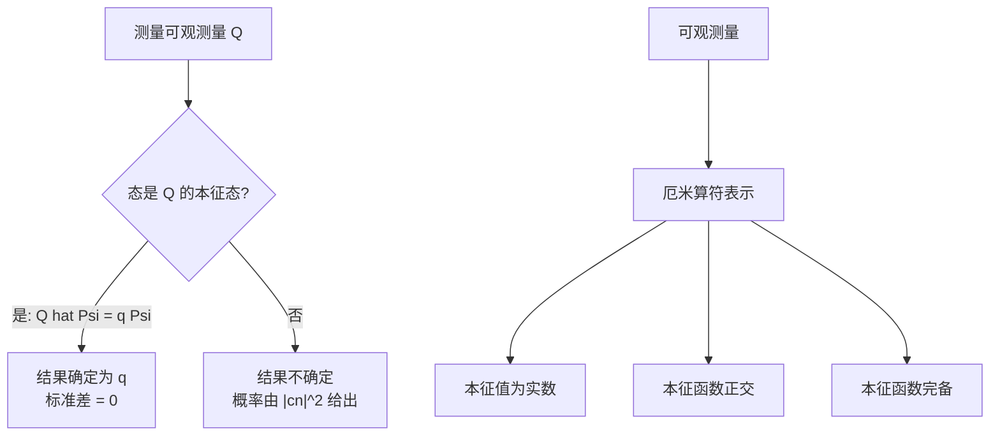
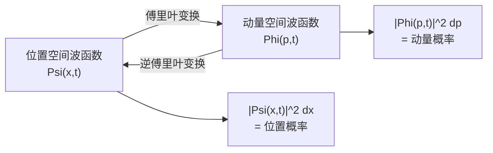
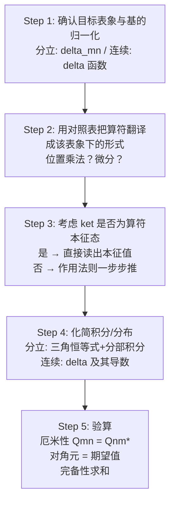
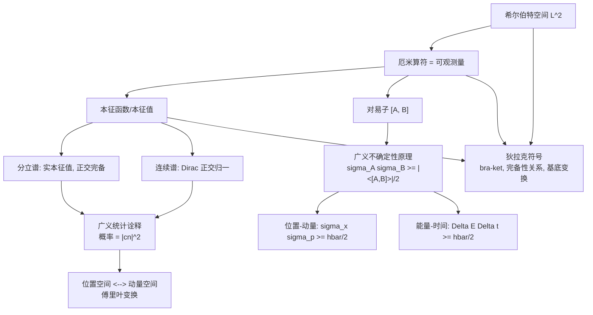

# 第3章：形式理论

> **本章核心问题**：量子力学的数学框架是什么？如何将前两章的具体结论推广为一套严谨的一般理论？

在前两章中，我们通过一系列具体的一维势场问题，积累了大量关于量子力学的"经验"：能量量子化、本征函数的正交性、展开系数的概率意义、不确定性原理等。其中一些看似是特定势场的巧合（如谐振子的等间距能谱），另一些则似乎具有普遍性（如本征函数的正交性、测量结果的概率规则）。

本章的目标是**将这些经验上升为系统的理论**。我们将用线性代数的语言——希尔伯特空间、厄米算符、本征值问题——重新表述量子力学，并引入优雅的狄拉克符号（Dirac notation）。这不仅使理论更加简洁统一，也为处理三维问题和更复杂的体系奠定了基础。

**提醒**：本章的数学抽象程度较高，但没有本质上的新物理——我们只是在更一般的层面上证明和表述已经发现的规律。每当迷失在抽象之中时，请回忆第2章的具体例子。



---

## 3.1 希尔伯特空间 (Hilbert Space)

### 3.1.1 从有限维到无限维：向量的类比

在有限维空间中，描述一个向量 $|\alpha\rangle$ 最自然的方式是给出它在某组正交归一基 $\{|e_n\rangle\}$ 下的分量 $(a_1, a_2, \ldots, a_N)$：

$$|\alpha\rangle \to \mathbf{a} = \begin{pmatrix} a_1 \\ a_2 \\ \vdots \\ a_N \end{pmatrix}$$

两个向量的**内积**是一个复数：

$$\langle \alpha | \beta \rangle = a_1^* b_1 + a_2^* b_2 + \cdots + a_N^* b_N$$

**线性变换**（算符）用矩阵表示，作用于向量产生新的向量。

量子力学中，"向量"是**波函数**，它们生活在**无限维**空间中。本征函数集合 $\{\psi_n(x)\}$ 扮演基向量的角色，展开系数 $\{c_n\}$ 就是"分量"。有限维中的求和 $\sum$ 变成了积分 $\int$，分量有限个变成了可能无穷多个——正是这种推广使得数学变得微妙。


> **核心类比**：

|        有限维线性代数         |       量子力学（无限维）       |
| :--------------------: | :-------------------: |
| 向量 $\| \alpha \rangle$ |    波函数 $\Psi(x,t)$    |
|  基向量 $\| e_n \rangle$  |   本征函数 $\psi_n(x)$    |
|        分量 $a_n$        |      展开系数 $c_n$       |
|  内积 $\sum a_n^* b_n$   | 内积 $\int f^* g \, dx$ |
|           矩阵           |          算符           |

### 3.1.2 平方可积函数空间 $L^2$

一个自然的问题是：量子力学中的波函数生活在什么样的空间中？

物理要求波函数可以归一化：$\int |\Psi|^2 dx = 1$。这意味着波函数必须是**平方可积的**。满足

$$\int_a^b |f(x)|^2 dx < \infty$$

的所有函数 $f(x)$ 构成的集合，在指定区间 $[a, b]$ 上形成一个向量空间，数学家称之为 $L^2(a,b)$，物理学家称之为**希尔伯特空间**（Hilbert space）。

$$\boxed{\text{量子力学中，波函数生活在希尔伯特空间中。}}$$

**为什么 $L^2$ 是一个向量空间？** 需要验证两个关键性质：
1. **封闭性**：如果 $f(x)$ 和 $g(x)$ 都是平方可积的，那么它们的线性组合 $af(x) + bg(x)$ 也是平方可积的。
2. **零向量**：函数 $f(x) = 0$ 显然平方可积。

第一个性质的证明依赖于施瓦茨不等式（稍后讨论）。直觉上：如果 $|f|^2$ 和 $|g|^2$ 的积分都有限，那么 $|f + g|^2 \le 2(|f|^2 + |g|^2)$ 的积分也有限。

> **注意**：所有归一化的函数构成的集合**不是**向量空间，因为两个归一化函数之和一般不再归一化（不满足封闭性）。

### 3.1.3 内积的定义与性质

在希尔伯特空间中，我们定义两个函数 $f(x)$ 和 $g(x)$ 的**内积**为：

$$\boxed{\langle f | g \rangle \equiv \int_a^b f(x)^* g(x) \, dx}$$

这个定义需要满足内积的三条公理：

**性质一：共轭对称性**

$$\langle g | f \rangle = \langle f | g \rangle^*$$

**证明**：

$$\langle g | f \rangle = \int g^* f \, dx = \left( \int f^* g \, dx \right)^* = \langle f | g \rangle^*$$

交换内积中的两个函数，等价于取复共轭。这意味着 $\langle f | g \rangle$ 一般是复数，但 $\langle f | f \rangle$ 总是实数。

**性质二：对第二个变量的线性**

$$\langle f | ag + bh \rangle = a\langle f | g \rangle + b\langle f | h \rangle$$

其中 $a, b$ 是复常数。注意，对**第一个**变量是**反线性的**（共轭线性的）：

$$\langle af + bg | h \rangle = a^*\langle f | h \rangle + b^*\langle g | h \rangle$$

复共轭来自第一个函数的复共轭 $f^*$。

**性质三：正定性**

$$\langle f | f \rangle = \int_a^b |f(x)|^2 dx \ge 0$$

等号成立当且仅当 $f(x) = 0$（几乎处处为零）。

利用内积的语言，我们可以统一定义以下概念：

- **归一化**：$\langle f | f \rangle = 1$
- **正交**：$\langle f | g \rangle = 0$
- **正交归一集**：$\langle f_m | f_n \rangle = \delta_{mn}$

### 3.1.4 施瓦茨不等式 (Schwarz Inequality)

希尔伯特空间中最重要的不等式是**施瓦茨不等式**（也称柯西-施瓦茨不等式）：

$$\boxed{|\langle f | g \rangle|^2 \le \langle f | f \rangle \langle g | g \rangle}$$

或等价地：

$$\left| \int_a^b f(x)^* g(x) \, dx \right|^2 \le \int_a^b |f(x)|^2 dx \cdot \int_a^b |g(x)|^2 dx$$

这是有限维中 $|\mathbf{a} \cdot \mathbf{b}|^2 \le |\mathbf{a}|^2 |\mathbf{b}|^2$ 的无限维推广。

**证明**：

设 $f$ 和 $g$ 是希尔伯特空间中的任意两个函数。对于任意复数 $z$，构造函数 $h = f - zg$。由内积的正定性：

$$\langle h | h \rangle = \langle f - zg | f - zg \rangle \ge 0$$

展开：

$$\langle f | f \rangle - z\langle f | g \rangle - z^*\langle g | f \rangle + |z|^2 \langle g | g \rangle \ge 0$$

这对任意 $z$ 成立。为了得到最强的限制，选取使左边最小的 $z$。令

$$z = \frac{\langle g | f \rangle}{\langle g | g \rangle}$$

（假设 $g \neq 0$，否则不等式平凡成立。）代入：

$$\langle f | f \rangle - \frac{\langle g | f \rangle}{\langle g | g \rangle}\langle f | g \rangle - \frac{\langle f | g \rangle}{\langle g | g \rangle}\langle g | f \rangle + \frac{|\langle g | f \rangle|^2}{\langle g | g \rangle^2}\langle g | g \rangle \ge 0$$

注意 $\langle f | g \rangle = \langle g | f \rangle^*$，所以 $\langle g | f \rangle \cdot \langle f | g \rangle = |\langle f | g \rangle|^2$。化简：

$$\langle f | f \rangle - \frac{|\langle f | g \rangle|^2}{\langle g | g \rangle} - \frac{|\langle f | g \rangle|^2}{\langle g | g \rangle} + \frac{|\langle f | g \rangle|^2}{\langle g | g \rangle} \ge 0$$

$$\langle f | f \rangle - \frac{|\langle f | g \rangle|^2}{\langle g | g \rangle} \ge 0$$

移项即得：

$$|\langle f | g \rangle|^2 \le \langle f | f \rangle \langle g | g \rangle$$

**证毕。** $\blacksquare$

**等号成立的条件**：$\langle h | h \rangle = 0$，即 $h = 0$，即 $f = zg$——当且仅当 $f$ 是 $g$ 的**常数倍**时，施瓦茨不等式取等号。这一条件将在3.5节证明不确定性原理时扮演关键角色。

> **物理意义**：施瓦茨不等式保证了希尔伯特空间中内积的良好定义。如果 $f$ 和 $g$ 都是平方可积的，那么它们的内积 $\langle f | g \rangle$ 一定收敛到有限值。正是施瓦茨不等式保证了平方可积函数之和仍然是平方可积的（即 $L^2$ 的封闭性）。

### 3.1.5 正交归一集与完备性

一组函数 $\{f_n(x)\}$ 如果满足：

$$\langle f_m | f_n \rangle = \delta_{mn}$$

就称为**正交归一的**（orthonormal）。

如果希尔伯特空间中**任何**函数都可以展开为这组函数的线性组合：

$$f(x) = \sum_{n=1}^{\infty} c_n f_n(x)$$

就称这组函数是**完备的**（complete）。

当正交归一集是完备的时，展开系数的计算方式与有限维完全相同——使用**傅里叶技巧**：

$$c_n = \langle f_n | f \rangle$$

我们已经在第2章中看到了这个公式的多个例子：
- 无限深势阱的本征函数 $\left\{\sqrt{\frac{2}{a}}\sin\frac{n\pi x}{a}\right\}$ 是 $(0, a)$ 上的完备正交归一集。
- 谐振子的本征函数 $\{\psi_n(x)\}$ 是 $(-\infty, \infty)$ 上的完备正交归一集。

---

### 习题 3.1

**(a)** 证明：所有平方可积函数的集合构成一个向量空间（参照附录 A.1 中向量空间的定义）。提示：关键是证明两个平方可积函数之和仍然平方可积。利用不等式 $|f + g|^2 \le 2(|f|^2 + |g|^2)$。

**(b)** 所有**归一化的**函数构成的集合是否构成向量空间？为什么？

**(c)** 验证公式 $\langle f | g \rangle = \int_a^b f^* g \, dx$ 满足内积的三条公理。

---

### 习题 3.2

**(a)** 对于什么范围的 $\nu$，函数 $f(x) = x^{\nu}$ 在区间 $(0, 1]$ 上属于希尔伯特空间？（假设 $\nu$ 是实数，但不一定是正数。）

**(b)** 对于 $\nu = 1/2$ 的特殊情况，$f(x) = x^{1/2}$ 是否在该希尔伯特空间中？$xf(x) = x^{3/2}$ 呢？$(d/dx)f(x) = \frac{1}{2}x^{-1/2}$ 呢？

---

### 习题 3.3（思考题）

三维普通向量中，两个向量 $\mathbf{A}$ 和 $\mathbf{B}$ 的内积满足 $|\mathbf{A} \cdot \mathbf{B}| = |\mathbf{A}||\mathbf{B}|\cos\theta$。

**(a)** 由此推导有限维的施瓦茨不等式 $|\mathbf{A} \cdot \mathbf{B}|^2 \le |\mathbf{A}|^2|\mathbf{B}|^2$，并说明等号何时成立。

**(b)** 函数空间中的施瓦茨不等式 $|\langle f | g \rangle|^2 \le \langle f | f \rangle\langle g | g \rangle$ 是否也可以理解为"两个'向量'的夹角余弦不超过1"？如果可以，如何定义两个函数之间的"夹角"？

**(c)** 考虑区间 $[0, 1]$ 上的函数 $f(x) = x$ 和 $g(x) = x^2$。计算 $\langle f | g \rangle$、$\langle f | f \rangle$、$\langle g | g \rangle$，验证施瓦茨不等式，并求出这两个函数之间的"夹角"。

---

### Key Takeaway: 3.1 希尔伯特空间

| 要点               | 内容                                                                                                 |
| ---------------- | -------------------------------------------------------------------------------------------------- |
| **希尔伯特空间 $L^2$** | 所有平方可积函数的集合，$\int f ^2 dx < \infty$                                                                |
| **内积**           | $\langle f \| g \rangle = \int f^* g \, dx$，类比向量点积                                                 |
| **施瓦茨不等式**       | $\|\langle f \| g \rangle\|^2 \le \langle f \| f \rangle \langle g \| g \rangle$，等号当 $f \propto g$ |
| **正交归一**         | $\langle f_m \| f_n \rangle = \delta_{mn}$                                                         |
| **完备性**          | 任何 $f \in L^2$ 可展开为 $f = \sum c_n f_n$，$c_n = \langle f_n \| f \rangle$                            |
| **核心类比**         | 波函数 ↔ 向量，算符 ↔ 矩阵，展开系数 ↔ 分量                                                                         |

---

## 3.2 可观测量 (Observables)

### 3.2.1 厄米算符 (Hermitian Operators)

在第1章中，我们知道物理可观测量 $Q(x, p)$ 的期望值可以用内积表示为：

$$\langle Q \rangle = \int \Psi^* \hat{Q} \Psi \, dx = \langle \Psi | \hat{Q} \Psi \rangle$$

现在，测量结果必须是**实数**（你不会在仪表上读到复数），因此期望值也必须是实数：

$$\langle Q \rangle = \langle Q \rangle^*$$

即

$$\langle \Psi | \hat{Q} \Psi \rangle = \langle \Psi | \hat{Q} \Psi \rangle^*$$

利用内积的共轭对称性 $\langle f | g \rangle^* = \langle g | f \rangle$：

$$\langle \Psi | \hat{Q} \Psi \rangle = \langle \hat{Q}\Psi | \Psi \rangle$$

这个条件必须对**任意**波函数 $\Psi$ 成立。满足这个条件的算符具有一个特殊性质：算符可以从内积的第二个位置移到第一个位置而不改变结果。

$$\boxed{\langle f | \hat{Q} g \rangle = \langle \hat{Q} f | g \rangle \quad \text{对所有 } f, g \in L^2 \text{ 成立}}$$

满足这一条件的算符称为**厄米算符**（Hermitian operator）。

$$\boxed{\text{可观测量由厄米算符表示。}}$$

> **两种等价定义**：上面给出的"弱"定义只要求 $\langle f | \hat{Q} f \rangle = \langle \hat{Q} f | f \rangle$ 对所有 $f$ 成立（即只考虑 $f = g$ 的情况）。看起来更弱，但实际上可以证明它与"强"定义 $\langle f | \hat{Q} g \rangle = \langle \hat{Q} f | g \rangle$（对所有 $f, g$）等价。证明技巧是：先令 $f \to f + g$，再令 $f \to f + ig$，利用极化恒等式即可推出一般情况。

### 3.2.2 验证常见算符的厄米性

**位置算符 $\hat{x}$ 是厄米的吗？**

$$\langle f | \hat{x} g \rangle = \int_{-\infty}^{\infty} f^* (xg) \, dx = \int_{-\infty}^{\infty} (xf)^* g \, dx = \langle \hat{x} f | g \rangle$$

是的，因为 $x$ 是实数，$x f^* = (xf)^*$。

**动量算符 $\hat{p} = -i\hbar \frac{d}{dx}$ 是厄米的吗？**

$$\langle f | \hat{p} g \rangle = \int_{-\infty}^{\infty} f^* \left(-i\hbar \frac{dg}{dx}\right) dx$$

对右边做分部积分：

$$= -i\hbar \left[ f^* g \right]_{-\infty}^{\infty} + i\hbar \int_{-\infty}^{\infty} \frac{df^*}{dx} g \, dx$$

对于平方可积函数，$f, g \to 0$（当 $|x| \to \infty$），因此边界项为零：

$$= \int_{-\infty}^{\infty} \left(-i\hbar \frac{df}{dx}\right)^* g \, dx = \langle \hat{p} f | g \rangle$$

关键在于：$i$ 的复共轭（来自 $(f^*)' = (f')^*$ 中无需共轭，但 $-i\hbar$ 的 $-i$ 共轭为 $+i$）与分部积分的负号**恰好抵消**，使得 $\hat{p}$ 是厄米的。

> **反例**：算符 $\hat{D} = d/dx$ **不是**厄米的。分部积分给出 $\langle f | \hat{D} g \rangle = -\langle \hat{D} f | g \rangle$（多了一个负号）。因此 $d/dx$ 不对应任何可观测量。

**哈密顿算符 $\hat{H} = -\frac{\hbar^2}{2m}\frac{d^2}{dx^2} + V(x)$ 是厄米的吗？**

$V(x)$ 项与 $\hat{x}$ 类似，因为 $V$ 是实函数。动能项包含 $\hat{p}^2/(2m)$，而 $\hat{p}$ 是厄米的，$\hat{p}^2 = \hat{p}\hat{p}$ 也是厄米的（可以两次运用 $\hat{p}$ 的厄米性证明），所以 $\hat{H}$ 是厄米的。

### 3.2.3 厄米共轭与伴随算符

对于一般的（不一定是厄米的）算符 $\hat{Q}$，我们定义它的**厄米共轭**（或**伴随算符**）$\hat{Q}^{\dagger}$ 为满足以下条件的算符：

$$\boxed{\langle f | \hat{Q} g \rangle = \langle \hat{Q}^{\dagger} f | g \rangle \quad \text{对所有 } f, g \text{ 成立}}$$

一个厄米算符等于它自己的厄米共轭：

$$\hat{Q} = \hat{Q}^{\dagger} \quad \Longleftrightarrow \quad \hat{Q} \text{ 是厄米的}$$

厄米共轭的一些有用性质：

- $(\hat{Q}\hat{R})^{\dagger} = \hat{R}^{\dagger}\hat{Q}^{\dagger}$（注意**顺序反转**）
- $(\hat{Q} + \hat{R})^{\dagger} = \hat{Q}^{\dagger} + \hat{R}^{\dagger}$
- $(c\hat{Q})^{\dagger} = c^*\hat{Q}^{\dagger}$，其中 $c$ 是复常数

### 3.2.4 确定态 (Determinate States)

通常，对一组处于相同量子态 $\Psi$ 的系统测量某个可观测量 $Q$，每次得到的结果**不同**——这是量子力学的基本特征。但是否存在这样的特殊态，使得每次测量 $Q$ 都一定得到**相同的值**？

如果存在，那么 $Q$ 的标准差为零：

$$\sigma_Q^2 = \langle (\hat{Q} - \langle Q \rangle)^2 \rangle = \langle \Psi | (\hat{Q} - q)^2 \Psi \rangle = 0$$

其中 $q = \langle Q \rangle$ 是每次测量都得到的确定值。由于 $\hat{Q}$ 是厄米的（因此 $\hat{Q} - q$ 也是厄米的），我们可以将算符移到内积的左边：

$$\langle (\hat{Q} - q)\Psi | (\hat{Q} - q)\Psi \rangle = 0$$

而内积 $\langle h | h \rangle = 0$ 当且仅当 $h = 0$，因此：

$$(\hat{Q} - q)\Psi = 0 \quad \Longrightarrow \quad \hat{Q}\Psi = q\Psi$$

这就是**本征值方程**！$\Psi$ 是 $\hat{Q}$ 的**本征函数**（eigenfunction），$q$ 是对应的**本征值**（eigenvalue）。

$$\boxed{\text{确定态是算符 } \hat{Q} \text{ 的本征函数。测量 } Q \text{ 的结果一定是本征值 } q \text{。}}$$

**例子**：
- 定态 $\psi_n$ 是 $\hat{H}$ 的本征函数，每次测量能量一定得到 $E_n$。
- 但 $\psi_n$ 一般不是 $\hat{p}$ 的本征函数，因此测量动量会得到不同的值。

**一些术语**：
- 本征值是一个**数**（不是算符或函数）。
- 所有本征值的集合称为算符的**谱**（spectrum）。
- 如果两个或更多线性独立的本征函数共享同一个本征值，称该本征值是**简并的**（degenerate）。
- 零函数（$f = 0$）不算本征函数（因为任何算符乘以零都给零）。



---

### 习题 3.4

**(a)** 证明：两个厄米算符之**和**是厄米的。

**(b)** 设 $\hat{Q}$ 是厄米的，$\alpha$ 是一个复常数。$\alpha\hat{Q}$ 在什么条件下是厄米的？

**(c)** 两个厄米算符的**乘积** $\hat{Q}\hat{R}$ 何时是厄米的？（提示：$(\hat{Q}\hat{R})^{\dagger} = \hat{R}^{\dagger}\hat{Q}^{\dagger} = \hat{R}\hat{Q}$，它等于 $\hat{Q}\hat{R}$ 当且仅当什么条件？）

**(d)** 验证位置算符 $\hat{x}$ 和哈密顿算符 $\hat{H} = -\frac{\hbar^2}{2m}\frac{d^2}{dx^2} + V(x)$（$V$ 为实函数）都是厄米的。

---

### 习题 3.5

**(a)** 求 $x$、$i$、$d/dx$ 的厄米共轭。

**(b)** 证明 $(\hat{Q}\hat{R})^{\dagger} = \hat{R}^{\dagger}\hat{Q}^{\dagger}$。

**(c)** 构造谐振子升算符 $\hat{a}_+$ 的厄米共轭。（回忆 $\hat{a}_+ = \frac{1}{\sqrt{2\hbar m\omega}}(-i\hat{p} + m\omega x)$。）

---

### 习题 3.6

考虑算符 $\hat{Q} = \frac{d^2}{d\phi^2}$，其中 $\phi$ 是极坐标中的方位角，函数满足周期性边界条件 $f(\phi + 2\pi) = f(\phi)$。

**(a)** $\hat{Q}$ 是厄米的吗？（利用分部积分验证 $\langle f | \hat{Q} g \rangle = \langle \hat{Q} f | g \rangle$。）

**(b)** 求 $\hat{Q}$ 的本征函数和本征值。

**(c)** $\hat{Q}$ 的谱是什么？谱是否简并？

---

### 习题 3.7（思考题）

**(a)** 如果 $f(x)$ 和 $g(x)$ 都是某算符 $\hat{Q}$ 的本征函数，对应**相同的**本征值 $q$，证明它们的任意线性组合 $\alpha f + \beta g$ 也是 $\hat{Q}$ 的本征函数，本征值仍然是 $q$。

**(b)** 验证 $f(x) = e^x$ 和 $g(x) = e^{-x}$ 都是算符 $d^2/dx^2$ 的本征函数，本征值均为 $1$。构造 $f$ 和 $g$ 的两个线性组合，使它们在区间 $(-1, 1)$ 上正交。

---

### Key Takeaway: 3.2 可观测量

| 要点 | 内容 |
|------|------|
| **核心要求** | 测量结果为实数 $\Rightarrow$ 期望值为实数 $\Rightarrow$ 算符必须厄米 |
| **厄米算符** | $\langle f \| \hat{Q}g \rangle = \langle \hat{Q}f \| g \rangle$，等价于 $\hat{Q} = \hat{Q}^{\dagger}$ |
| **常见厄米算符** | $\hat{x}$（位置）、$\hat{p} = -i\hbar d/dx$（动量）、$\hat{H}$（哈密顿量） |
| **伴随算符** | $\langle f \| \hat{Q}g \rangle = \langle \hat{Q}^{\dagger}f \| g \rangle$；$(\hat{Q}\hat{R})^{\dagger} = \hat{R}^{\dagger}\hat{Q}^{\dagger}$ |
| **确定态** | $\sigma_Q = 0 \Rightarrow \hat{Q}\Psi = q\Psi$（本征值方程） |
| **本征值 vs 本征函数** | 测量结果 = 本征值（实数），量子态 = 本征函数 |

---

## 3.3 厄米算符的特征函数 (Eigenfunctions of a Hermitian Operator)

上一节我们知道了：确定态是算符的本征函数，测量结果是本征值。现在我们来研究厄米算符本征函数的性质。根据谱的类型，可以分为两类：

- **分立谱**（discrete spectrum）：本征值是分开的、可数的。本征函数在希尔伯特空间中，是物理上可实现的态。（例如：谐振子的哈密顿量。）
- **连续谱**（continuous spectrum）：本征值充满一个连续区间。本征函数不可归一化，不在希尔伯特空间中。（例如：自由粒子的哈密顿量、动量算符。）
- 有些算符兼具两种谱。（例如：有限深势阱的哈密顿量。）

### 3.3.1 分立谱：两大定理

对于分立谱，厄米算符的（可归一化的）本征函数有两个极其重要的性质：

---

**定理1：厄米算符的本征值是实数。**

**证明**：设 $\hat{Q}f = qf$，其中 $f \neq 0$。利用厄米性：

$$\langle f | \hat{Q}f \rangle = \langle \hat{Q}f | f \rangle$$

左边：$\langle f | qf \rangle = q\langle f | f \rangle$

右边：$\langle qf | f \rangle = q^*\langle f | f \rangle$

（本征值 $q$ 是数，从内积中取出时，在第一个位置需要取共轭。）

因此 $q\langle f | f \rangle = q^*\langle f | f \rangle$。由于 $f \neq 0$，$\langle f | f \rangle \neq 0$，所以：

$$q = q^*$$

即 $q$ 是**实数**。$\blacksquare$

**物理意义**：测量结果是实数，这当然是物理上必须的——你不可能在仪表上读到一个复数。

---

**定理2：属于不同本征值的本征函数正交。**

**证明**：设 $\hat{Q}f = qf$，$\hat{Q}g = q'g$，且 $q \neq q'$。利用厄米性：

$$\langle f | \hat{Q}g \rangle = \langle \hat{Q}f | g \rangle$$

左边：$q'\langle f | g \rangle$

右边：$q^*\langle f | g \rangle = q\langle f | g \rangle$（因为由定理1，$q$ 是实数）

因此 $(q' - q)\langle f | g \rangle = 0$。由于 $q' \neq q$，必有：

$$\langle f | g \rangle = 0$$

$\blacksquare$

这就解释了为什么无限深势阱、谐振子等系统的本征函数是正交的——不是巧合，而是厄米算符本征函数的**普遍性质**。

---

**关于简并的处理**：定理2只对不同本征值有效。如果两个（或多个）线性独立的本征函数共享同一个本征值（简并），它们**不一定**正交。但可以使用**格拉姆-施密特正交化**过程，在简并子空间内构造正交的本征函数。因此，**即使存在简并，本征函数也总可以选为正交归一的**。

---

**公理（完备性）**：可观测量对应的厄米算符的本征函数是**完备的**：希尔伯特空间中的任何函数都可以表示为这些本征函数的线性组合。

$$f(x) = \sum_n c_n f_n(x), \quad c_n = \langle f_n | f \rangle$$

> 完备性在有限维情况下可以严格证明（厄米矩阵的特征向量张成全空间），但在无限维情况下不容易证明，我们将它作为量子力学的一条**公理**接受。

### 3.3.2 连续谱：狄拉克正交归一性

当谱是连续的，情况更加微妙。本征函数不可归一化，它们不在希尔伯特空间中。但它们仍然具有定理1和定理2的**类似物**，只需将克罗内克 $\delta$ 替换为狄拉克 $\delta$ 函数。

**例3.1：动量算符的本征函数**

动量算符 $\hat{p} = -i\hbar \frac{d}{dx}$ 的本征值方程为：

$$-i\hbar \frac{d}{dx}f_p(x) = p \cdot f_p(x)$$

通解为：

$$f_p(x) = Ae^{ipx/\hbar}$$

这对任何（复数）$p$ 都成立，但只有**实数** $p$ 才能给出物理上有意义的结果。对于实数 $p$，$f_p$ 是振荡函数，**不可归一化**——动量算符没有在希尔伯特空间中的本征函数。

然而，如果我们选取归一化常数 $A = 1/\sqrt{2\pi\hbar}$，则：

$$f_p(x) = \frac{1}{\sqrt{2\pi\hbar}} e^{ipx/\hbar}$$

满足**狄拉克正交归一性**：

$$\boxed{\langle f_{p'} | f_p \rangle = \int_{-\infty}^{\infty} f_{p'}^*(x) f_p(x) \, dx = \delta(p - p')}$$

这里用到了狄拉克 $\delta$ 函数的积分表示 $\frac{1}{2\pi\hbar}\int_{-\infty}^{\infty} e^{i(p-p')x/\hbar} dx = \delta(p-p')$。

同时，这些本征函数也是**完备的**：

$$f(x) = \int_{-\infty}^{\infty} c(p) f_p(x) \, dp = \frac{1}{\sqrt{2\pi\hbar}} \int_{-\infty}^{\infty} c(p) e^{ipx/\hbar} dp$$

展开系数（连续情况下称为**傅里叶变换**）通过傅里叶技巧得到：

$$c(p) = \langle f_p | f \rangle = \frac{1}{\sqrt{2\pi\hbar}} \int_{-\infty}^{\infty} e^{-ipx/\hbar} f(x) \, dx$$

---

**例3.2：位置算符的本征函数**

位置算符 $\hat{x}$ 的本征值方程为：

$$\hat{x} \, g_y(x) = x \cdot g_y(x) = y \cdot g_y(x)$$

什么函数被 $x$ 乘后等于被常数 $y$ 乘？只有在 $x = y$ 处不为零的函数。答案是：

$$g_y(x) = \delta(x - y)$$

本征值 $y$ 可以是任何实数——位置算符的谱是全体实数，连续的。

狄拉克正交归一性：

$$\langle g_{y'} | g_y \rangle = \int_{-\infty}^{\infty} \delta(x - y') \delta(x - y) \, dx = \delta(y - y')$$

完备性：

$$f(x) = \int_{-\infty}^{\infty} c(y) g_y(x) \, dy = \int_{-\infty}^{\infty} c(y) \delta(x - y) \, dy$$

其中 $c(y) = f(y)$（平凡但自洽）。

### 3.3.3 分立谱与连续谱的对比

| | 分立谱 | 连续谱 |
|---|---|---|
| **本征值** | 可数集合 $q_1, q_2, \ldots$ | 连续区间 |
| **本征函数** | 可归一化，$\in L^2$ | 不可归一化，$\notin L^2$ |
| **正交归一性** | $\langle f_m \| f_n \rangle = \delta_{mn}$（克罗内克） | $\langle f_{q'} \| f_q \rangle = \delta(q - q')$（狄拉克） |
| **展开方式** | $f = \sum_n c_n f_n$ | $f = \int c(q) f_q \, dq$ |
| **系数求法** | $c_n = \langle f_n \| f \rangle$ | $c(q) = \langle f_q \| f \rangle$ |
| **概率意义** | $\|c_n\|^2$ = 得到 $q_n$ 的概率 | $\|c(q)\|^2 dq$ = 得到 $[q, q+dq]$ 的概率 |
| **例子** | 无限深势阱、谐振子 | 自由粒子、动量算符 |

---

### 习题 3.8

**(a)** 在第2章例3.1中，我们考虑了算符 $\hat{Q} = i\frac{d}{d\phi}$（$\phi$ 为方位角，$f(\phi + 2\pi) = f(\phi)$）。验证其本征值 $q = 0, \pm 1, \pm 2, \ldots$ 确实都是实数，且属于不同本征值的本征函数确实正交。

**(b)** 对习题3.6中的算符 $\hat{Q} = d^2/d\phi^2$ 做同样的验证。

---

### 习题 3.9

**(a)** 举出第2章中一个（除谐振子外的）哈密顿量只有**分立谱**的例子。

**(b)** 举出一个（除自由粒子外的）哈密顿量只有**连续谱**的例子。

**(c)** 举出一个（除有限深势阱外的）哈密顿量**同时具有**分立谱和连续谱的例子。

---

### 习题 3.10（概念题）

无限深势阱的基态 $\psi_1(x) = \sqrt{2/a}\sin(\pi x/a)$ 是否是动量算符 $\hat{p}$ 的本征函数？

如果是，它的动量是什么？如果不是，为什么不是？（提示：将 $\sin$ 用指数函数表示。）

---

### 习题 3.11

一个质量为 $m$ 的粒子束缚在 $\delta$ 函数势阱 $V(x) = -\alpha\delta(x)$ 中（$\alpha > 0$）。

**(a)** 写出束缚态的位置空间波函数 $\Psi(x, t)$（第2章结果）。

**(b)** 计算动量空间波函数 $\Phi(p, t) = \frac{1}{\sqrt{2\pi\hbar}}\int_{-\infty}^{\infty} e^{-ipx/\hbar}\Psi(x, t) \, dx$。

**(c)** 测量动量的结果大于 $p_0 = m\alpha/\hbar$ 的概率是多少？（答案：$\frac{1}{4} - \frac{1}{2\pi} \approx 0.091$。）

---

### Key Takeaway: 3.3 厄米算符的特征函数

| 要点          | 内容                                                                   |
| ----------- | -------------------------------------------------------------------- |
| **定理1**     | 厄米算符的本征值是实数                                                          |
| **定理2**     | 属于不同本征值的本征函数正交                                                       |
| **简并处理**    | Gram-Schmidt 正交化，总可以选为正交归一                                           |
| **完备性（公理）** | 本征函数构成完备集，任何函数可展开                                                    |
| **连续谱**     | 本征函数不可归一化，但有 Dirac 正交归一性 $\langle f_{q'}\|f_q\rangle = \delta(q-q')$ |
| **动量本征函数**  | $f_p(x) = \frac{1}{\sqrt{2\pi\hbar}}e^{ipx/\hbar}$，完备性 = 傅里叶变换       |
| **位置本征函数**  | $g_y(x) = \delta(x-y)$                                               |

---

## 3.4 广义统计诠释 (Generalized Statistical Interpretation)

### 3.4.1 从特例到一般

在第1章中，我们学到了：
- $|\Psi(x,t)|^2 dx$ 是在 $x$ 到 $x + dx$ 之间找到粒子的概率。

在第2章中，我们发现了：
- $|c_n|^2$ 是测量能量得到 $E_n$ 的概率，其中 $c_n = \langle \psi_n | \Psi \rangle$。

现在我们可以将这些特例统一为一个优美的一般性原理：

> **广义统计诠释**：如果在态 $\Psi(x, t)$ 上测量可观测量 $Q(x, p)$，测量结果一定是算符 $\hat{Q}$ 的某个本征值。
>
> - 若 $\hat{Q}$ 的谱是**分立的**，本征值为 $q_n$，对应正交归一化本征函数 $f_n(x)$，则测量得到 $q_n$ 的概率为
>
> $$\boxed{|c_n|^2, \quad \text{其中 } c_n = \langle f_n | \Psi \rangle}$$
>
> - 若 $\hat{Q}$ 的谱是**连续的**，对应 Dirac 正交归一化本征函数 $f_z(x)$，则测量结果落在 $dz$ 范围内的概率为
>
> $$\boxed{|c(z)|^2 dz, \quad \text{其中 } c(z) = \langle f_z | \Psi \rangle}$$
>
> 测量后，波函数**坍缩**到对应的本征态。

### 3.4.2 自洽性验证

这个诠释与我们已知的结果一致吗？

**位置测量**：位置算符 $\hat{x}$ 的本征函数是 $g_y(x) = \delta(x - y)$（见例3.2）。展开系数为：

$$c(y) = \langle g_y | \Psi \rangle = \int_{-\infty}^{\infty} \delta(x - y)\Psi(x, t) \, dx = \Psi(y, t)$$

测量位置得到 $y$ 附近 $dy$ 范围的概率为 $|c(y)|^2 dy = |\Psi(y, t)|^2 dy$，正好是**玻恩诠释**。

**能量测量**：哈密顿量 $\hat{H}$ 的本征函数是定态 $\psi_n(x)$，本征值为 $E_n$。展开系数为：

$$c_n = \langle \psi_n | \Psi \rangle$$

测量能量得到 $E_n$ 的概率为 $|c_n|^2$，与第2章的结果一致。

### 3.4.3 期望值公式

利用完备性和正交归一性，期望值的一般公式为：

$$\langle Q \rangle = \sum_n q_n |c_n|^2$$

**验证**：

$$\langle Q \rangle = \langle \Psi | \hat{Q}\Psi \rangle = \left\langle \sum_{n'} c_{n'} f_{n'} \left| \hat{Q} \sum_n c_n f_n \right. \right\rangle = \sum_{n'}\sum_n c_{n'}^* c_n q_n \langle f_{n'} | f_n \rangle$$

$$= \sum_{n'}\sum_n c_{n'}^* c_n q_n \delta_{n'n} = \sum_n q_n |c_n|^2$$

归一化条件：

$$\sum_n |c_n|^2 = 1$$

这同样可以从 $\langle \Psi | \Psi \rangle = 1$ 推出。

### 3.4.4 动量空间波函数

广义统计诠释中最重要的应用之一是**动量测量**。动量算符的本征函数为 $f_p(x) = \frac{1}{\sqrt{2\pi\hbar}}e^{ipx/\hbar}$，因此展开系数为：

$$c(p) = \langle f_p | \Psi \rangle = \frac{1}{\sqrt{2\pi\hbar}} \int_{-\infty}^{\infty} e^{-ipx/\hbar} \Psi(x, t) \, dx$$

这正是波函数的**傅里叶变换**。我们给它一个专门的名字和符号：

$$\boxed{\Phi(p, t) = \frac{1}{\sqrt{2\pi\hbar}} \int_{-\infty}^{\infty} e^{-ipx/\hbar} \Psi(x, t) \, dx}$$

称为**动量空间波函数**。逆变换为：

$$\Psi(x, t) = \frac{1}{\sqrt{2\pi\hbar}} \int_{-\infty}^{\infty} e^{ipx/\hbar} \Phi(p, t) \, dp$$

$|\Phi(p, t)|^2 dp$ 是测量动量得到 $p$ 到 $p + dp$ 之间的概率。



### 3.4.5 帕塞瓦尔定理与动量空间中的算符

位置空间与动量空间包含**完全相同的信息**。帕塞瓦尔定理（Parseval's theorem）保证了归一化的一致性：

$$\int_{-\infty}^{\infty} |\Psi(x,t)|^2 dx = \int_{-\infty}^{\infty} |\Phi(p,t)|^2 dp = 1$$

在动量空间中计算期望值也很方便。位置和动量的期望值分别为：

| | 位置空间 | 动量空间 |
|---|---|---|
| $\hat{x}$ | $x$（直接乘） | $i\hbar\frac{\partial}{\partial p}$ |
| $\hat{p}$ | $-i\hbar\frac{\partial}{\partial x}$ | $p$（直接乘） |

一般公式：

$$\langle Q \rangle = \begin{cases} \int \Psi^* \hat{Q}\left(x, -i\hbar\frac{\partial}{\partial x}\right) \Psi \, dx & \text{（位置空间）} \\ \int \Phi^* \hat{Q}\left(i\hbar\frac{\partial}{\partial p}, p\right) \Phi \, dp & \text{（动量空间）} \end{cases}$$

---

### 习题 3.12

一个粒子处于谐振子基态 $\psi_0(x) = \left(\frac{m\omega}{\pi\hbar}\right)^{1/4} e^{-m\omega x^2/(2\hbar)}$。

**(a)** 求动量空间波函数 $\Phi(p, t)$。

**(b)** 测量动量的结果超出经典允许范围（对应相同能量 $E_0 = \frac{1}{2}\hbar\omega$）的概率是多少？（精确到两位有效数字。提示：查阅误差函数表或用数值计算。答案约为 $0.16$。）

---

### 习题 3.13

证明：在动量空间中，位置算符的表示为 $\hat{x} \to i\hbar\frac{\partial}{\partial p}$。即证明：

$$\langle x \rangle = \int_{-\infty}^{\infty} \Phi^* \left(i\hbar \frac{\partial}{\partial p}\right) \Phi \, dp$$

提示：注意 $x e^{ipx/\hbar} = -i\hbar \frac{\partial}{\partial p} e^{ipx/\hbar}$。

---

### 习题 3.14（计算题）

自由粒子的初始波函数为 $\Psi(x, 0) = Ae^{-a|x|}$（$a > 0$）。

**(a)** 求归一化常数 $A$。

**(b)** 求动量空间波函数 $\Phi(p, 0)$。

**(c)** 验证帕塞瓦尔定理 $\int|\Psi|^2 dx = \int|\Phi|^2 dp$。

**(d)** 计算 $\langle p^2 \rangle$（在动量空间中计算更方便）。

---

### Key Takeaway: 3.4 广义统计诠释

| 要点 | 内容 |
|------|------|
| **核心原理** | 测量 $Q$ 得到的一定是 $\hat{Q}$ 的本征值；概率 = $\|c_n\|^2$ 或 $\|c(z)\|^2 dz$ |
| **展开系数** | $c_n = \langle f_n \| \Psi \rangle$（分立），$c(z) = \langle f_z \| \Psi \rangle$（连续） |
| **归一化** | $\sum_n \|c_n\|^2 = 1$ 或 $\int \|c(z)\|^2 dz = 1$ |
| **期望值** | $\langle Q \rangle = \sum_n q_n \|c_n\|^2$ |
| **动量空间波函数** | $\Phi(p,t)$ = $\Psi(x,t)$ 的傅里叶变换 |
| **帕塞瓦尔定理** | $\int \|\Psi\|^2 dx = \int \|\Phi\|^2 dp = 1$ |
| **动量空间算符** | $\hat{x} \to i\hbar\partial/\partial p$，$\hat{p} \to p$ |

---

## 3.5 不确定性原理 (The Uncertainty Principle)

在第1章中，我们定性地陈述了位置-动量不确定性关系 $\sigma_x \sigma_p \ge \hbar/2$。现在，借助本章发展的形式化工具，我们可以给出**严格的证明**——不仅针对位置和动量，而是针对**任意一对可观测量**。

### 3.5.1 广义不确定性原理的证明

**目标**：对于任意两个可观测量 $A$ 和 $B$（对应厄米算符 $\hat{A}$ 和 $\hat{B}$），证明

$$\boxed{\sigma_A^2 \sigma_B^2 \ge \left(\frac{1}{2i}\langle[\hat{A}, \hat{B}]\rangle\right)^2}$$

其中 $[\hat{A}, \hat{B}] \equiv \hat{A}\hat{B} - \hat{B}\hat{A}$ 是**对易子**（commutator）。

**证明**（分三步）：

---

**第一步：构造辅助函数**

对于可观测量 $A$，定义：

$$f \equiv (\hat{A} - \langle A \rangle)\Psi$$

则方差为：

$$\sigma_A^2 = \langle (\hat{A} - \langle A \rangle)^2 \rangle = \langle f | f \rangle$$

类似地定义 $g \equiv (\hat{B} - \langle B \rangle)\Psi$，得到 $\sigma_B^2 = \langle g | g \rangle$。

---

**第二步：应用施瓦茨不等式**

由施瓦茨不等式：

$$\sigma_A^2 \sigma_B^2 = \langle f | f \rangle \langle g | g \rangle \ge |\langle f | g \rangle|^2$$

---

**第三步：分离虚部**

对于任意复数 $z$，$|z|^2 = [\text{Re}(z)]^2 + [\text{Im}(z)]^2 \ge [\text{Im}(z)]^2 = \left[\frac{1}{2i}(z - z^*)\right]^2$。

令 $z = \langle f | g \rangle$，则：

$$\sigma_A^2 \sigma_B^2 \ge \left[\frac{1}{2i}(\langle f | g \rangle - \langle g | f \rangle)\right]^2$$

现在计算 $\langle f | g \rangle - \langle g | f \rangle$。利用 $\hat{A}$ 和 $\hat{B}$ 的厄米性（因此 $\hat{A} - \langle A \rangle$ 和 $\hat{B} - \langle B \rangle$ 也是厄米的）：

$$\langle f | g \rangle = \langle (\hat{A} - \langle A \rangle)\Psi | (\hat{B} - \langle B \rangle)\Psi \rangle = \langle \Psi | (\hat{A} - \langle A \rangle)(\hat{B} - \langle B \rangle)\Psi \rangle$$

展开乘积：

$$= \langle \hat{A}\hat{B} \rangle - \langle A \rangle\langle B \rangle$$

类似地，$\langle g | f \rangle = \langle \hat{B}\hat{A} \rangle - \langle A \rangle\langle B \rangle$。因此：

$$\langle f | g \rangle - \langle g | f \rangle = \langle \hat{A}\hat{B} \rangle - \langle \hat{B}\hat{A} \rangle = \langle \hat{A}\hat{B} - \hat{B}\hat{A} \rangle = \langle [\hat{A}, \hat{B}] \rangle$$

将其代回：

$$\sigma_A^2 \sigma_B^2 \ge \left(\frac{1}{2i}\langle[\hat{A}, \hat{B}]\rangle\right)^2$$

**证毕。** $\blacksquare$

> **注意**：右边除以 $i$ 似乎会让结果变为负数或虚数？其实不会。两个厄米算符的对易子乘以 $i$ 是厄米的（可以验证），因此 $\frac{1}{i}\langle[\hat{A}, \hat{B}]\rangle$ 是实数。实际上 $[\hat{A}, \hat{B}]$ 本身是反厄米的（anti-Hermitian），它的期望值是纯虚数，除以 $i$ 后变成实数。

### 3.5.2 位置-动量不确定性关系

作为广义不确定性原理的最重要特例，取 $\hat{A} = \hat{x}$，$\hat{B} = \hat{p}$。我们在第2章中已经计算过（也可以直接验证）：

$$[\hat{x}, \hat{p}] = i\hbar$$

这是量子力学中最基本的对易关系，称为**正则对易关系**。代入广义不确定性原理：

$$\sigma_x^2 \sigma_p^2 \ge \left(\frac{1}{2i} \cdot i\hbar\right)^2 = \left(\frac{\hbar}{2}\right)^2$$

因此：

$$\boxed{\sigma_x \sigma_p \ge \frac{\hbar}{2}}$$

这就是**海森堡不确定性原理**的严格证明。

### 3.5.3 相容与不相容可观测量

广义不确定性原理揭示了一个深刻的概念：

- **不相容可观测量**：$[\hat{A}, \hat{B}] \neq 0$。位置和动量不可能同时有确定值——不存在同时是 $\hat{x}$ 和 $\hat{p}$ 本征函数的态。
- **相容可观测量**：$[\hat{A}, \hat{B}] = 0$。可以找到同时是 $\hat{A}$ 和 $\hat{B}$ 本征函数的完备集——两个量可以同时有确定值。

> **例如**：在氢原子中，$\hat{H}$、$\hat{L}^2$、$\hat{L}_z$ 两两对易，因此存在同时确定能量、角动量大小、角动量 $z$ 分量的态——这就是用量子数 $n, l, m$ 标记的态。

### 3.5.4 最小不确定性波包

什么样的波函数使得不确定性原理取等号 $\sigma_x \sigma_p = \hbar/2$？

回顾证明中的两个不等式：
1. 施瓦茨不等式取等号要求 $f = cg$，即 $(\hat{A} - \langle A \rangle)\Psi = c(\hat{B} - \langle B \rangle)\Psi$。
2. 丢弃实部要求 $\text{Re}(\langle f | g \rangle) = 0$，即常数 $c$ 必须是**纯虚数** $c = ia$（$a$ 为实数）。

对于位置-动量，条件变为：

$$\left(-i\hbar\frac{d}{dx} - \langle p \rangle\right)\Psi = ia(x - \langle x \rangle)\Psi$$

这是一阶常微分方程，解为：

$$\boxed{\Psi(x) = A \exp\left[-\frac{a}{2\hbar}(x - \langle x \rangle)^2 + \frac{i\langle p \rangle x}{\hbar}\right]}$$

这是一个**高斯波包**——以 $\langle x \rangle$ 为中心，以 $\langle p \rangle/\hbar$ 为波数的高斯函数。

**结论**：最小不确定性波包一定是高斯型的。我们在第1章和第2章中遇到的两个例子——谐振子基态和自由粒子高斯波包——确实都是高斯型，正满足 $\sigma_x \sigma_p = \hbar/2$。

### 3.5.5 广义 Ehrenfest 定理

在证明能量-时间不确定性原理之前，我们先推导一个非常有用的结果。对于不显含时间的可观测量 $\hat{Q}$，其期望值的时间导数为：

$$\boxed{\frac{d}{dt}\langle Q \rangle = \frac{i}{\hbar}\langle [\hat{H}, \hat{Q}] \rangle + \left\langle \frac{\partial \hat{Q}}{\partial t} \right\rangle}$$

当 $\hat{Q}$ 不显含时间时（通常如此），第二项为零，得到：

$$\frac{d}{dt}\langle Q \rangle = \frac{i}{\hbar}\langle [\hat{H}, \hat{Q}] \rangle$$

**推导**：

$$\frac{d}{dt}\langle Q \rangle = \frac{d}{dt}\langle \Psi | \hat{Q}\Psi \rangle = \left\langle \frac{\partial \Psi}{\partial t} \bigg| \hat{Q}\Psi \right\rangle + \left\langle \Psi \bigg| \hat{Q}\frac{\partial \Psi}{\partial t} \right\rangle$$

利用薛定谔方程 $i\hbar \frac{\partial \Psi}{\partial t} = \hat{H}\Psi$，得 $\frac{\partial \Psi}{\partial t} = \frac{1}{i\hbar}\hat{H}\Psi$：

$$= \left\langle \frac{1}{i\hbar}\hat{H}\Psi \bigg| \hat{Q}\Psi \right\rangle + \left\langle \Psi \bigg| \hat{Q}\frac{1}{i\hbar}\hat{H}\Psi \right\rangle$$

$$= -\frac{1}{i\hbar}\langle \hat{H}\Psi | \hat{Q}\Psi \rangle + \frac{1}{i\hbar}\langle \Psi | \hat{Q}\hat{H}\Psi \rangle$$

利用 $\hat{H}$ 的厄米性，$\langle \hat{H}\Psi | \hat{Q}\Psi \rangle = \langle \Psi | \hat{H}\hat{Q}\Psi \rangle$：

$$= \frac{1}{i\hbar}\left[\langle \Psi | \hat{Q}\hat{H}\Psi \rangle - \langle \Psi | \hat{H}\hat{Q}\Psi \rangle\right] = \frac{i}{\hbar}\langle [\hat{H}, \hat{Q}] \rangle$$

**重要推论**：如果 $\hat{Q}$ 与 $\hat{H}$ 对易，即 $[\hat{H}, \hat{Q}] = 0$，则 $\frac{d}{dt}\langle Q \rangle = 0$，$Q$ 的期望值**不随时间变化**——$Q$ 是一个**守恒量**。

### 3.5.6 能量-时间不确定性原理

位置-动量不确定性原理 $\sigma_x \sigma_p \ge \hbar/2$ 常与以下公式放在一起：

$$\Delta E \, \Delta t \ge \frac{\hbar}{2}$$

但要注意：这两个公式的含义**完全不同**。在量子力学中，时间 $t$ 不是一个算符——它是**参数**（自变量），$\Delta t$ 不是"时间测量的标准差"。那么 $\Delta t$ 到底是什么？

**推导**：在广义不确定性原理 $\sigma_A^2\sigma_B^2 \ge \left(\frac{1}{2i}\langle[\hat{A}, \hat{B}]\rangle\right)^2$ 中，取 $\hat{A} = \hat{H}$，$\hat{B} = \hat{Q}$（任意不显含时间的可观测量），利用广义 Ehrenfest 定理：

$$\sigma_H^2 \sigma_Q^2 \ge \left(\frac{1}{2i} \cdot \frac{\hbar}{i}\frac{d\langle Q\rangle}{dt}\right)^2 = \left(\frac{\hbar}{2}\right)^2 \left(\frac{d\langle Q\rangle}{dt}\right)^2$$

即：

$$\sigma_H \sigma_Q \ge \frac{\hbar}{2}\left|\frac{d\langle Q\rangle}{dt}\right|$$

定义：

$$\Delta E \equiv \sigma_H, \quad \Delta t \equiv \frac{\sigma_Q}{|d\langle Q\rangle/dt|}$$

则得到：

$$\boxed{\Delta E \, \Delta t \ge \frac{\hbar}{2}}$$

**$\Delta t$ 的物理意义**：$\Delta t$ 是**可观测量 $Q$ 的期望值变化一个标准差所需的时间**。它衡量的是系统"发生显著变化"的时间尺度。

- 如果 $\Delta E$ 很小（能量接近确定），则 $\Delta t$ 很大——所有可观测量的期望值变化缓慢，系统近似静止。
- 在极端情况下，定态（$\Delta E = 0$）中所有期望值都不随时间变化（$\Delta t = \infty$）——定态"什么都不发生"。
- 如果系统变化很快（$\Delta t$ 很小），则能量必有较大的不确定性。

> **常见误解**："能量可以在短时间内'借用'"——这是对能量-时间不确定性原理的错误理解。量子力学**没有**允许违反能量守恒。$\Delta E \, \Delta t \ge \hbar/2$ 只是说：能量不确定的系统变化更快。

**例题：不稳定粒子的质量谱宽**

$\Delta$ 粒子的寿命约 $\tau \sim 10^{-23}$ 秒。取 $\Delta t \sim \tau$，则：

$$\Delta E \sim \frac{\hbar}{2\tau} \sim \frac{1.05 \times 10^{-34}}{2 \times 10^{-23}} \approx 5 \times 10^{-12} \text{ J} \approx 30 \text{ MeV}$$

实验上测到 $\Delta$ 粒子的质量谱宽约 120 MeV（半高宽），与此估计量级一致。一个寿命如此短的粒子，其质量（即静能 $mc^2$）根本无法精确确定。

---

### 习题 3.15

**(a)** 证明对易子恒等式：

$$[\hat{A} + \hat{B}, \hat{C}] = [\hat{A}, \hat{C}] + [\hat{B}, \hat{C}]$$

$$[\hat{A}\hat{B}, \hat{C}] = \hat{A}[\hat{B}, \hat{C}] + [\hat{A}, \hat{C}]\hat{B}$$

**(b)** 证明 $[x^n, \hat{p}] = i\hbar n x^{n-1}$。

**(c)** 更一般地，证明 $[f(x), \hat{p}] = i\hbar \frac{df}{dx}$，其中 $f(x)$ 是可以泰勒展开的函数。

**(d)** 证明对谐振子 $[\hat{H}, \hat{a}_{\pm}] = \pm\hbar\omega\hat{a}_{\pm}$。

---

### 习题 3.16

证明"你的名字"不确定性原理：位置的不确定性 $\sigma_x$ 与能量的不确定性 $\sigma_H$ 之间满足

$$\sigma_x \sigma_H \ge \frac{\hbar}{2m}|\langle p \rangle|$$

对于定态，这给出什么？为什么不意外？

---

### 习题 3.17（计算题）

将广义 Ehrenfest 定理 $\frac{d}{dt}\langle Q \rangle = \frac{i}{\hbar}\langle[\hat{H}, \hat{Q}]\rangle$ 分别应用到以下情况：

**(a)** $\hat{Q} = 1$（恒等算符）。

**(b)** $\hat{Q} = \hat{H}$。

**(c)** $\hat{Q} = \hat{x}$。

**(d)** $\hat{Q} = \hat{p}$。

对每种情况，解读所得结论的物理意义。（提示：与能量守恒、Ehrenfest 定理对照。）

---

### 习题 3.18

证明：两个不对易的算符不可能有**完备的公共本征函数集**。即证明：如果 $\hat{P}$ 和 $\hat{Q}$ 有一组完备的公共本征函数，则 $[\hat{P}, \hat{Q}]f = 0$ 对希尔伯特空间中的任何函数 $f$ 成立。

---

### 习题 3.19（编程题）

用 Python 数值验证高斯波包的不确定性关系。

**(a)** 考虑归一化高斯波包 $\Psi(x) = \left(\frac{2a}{\pi}\right)^{1/4} e^{-ax^2}$，数值计算 $\sigma_x$ 和 $\sigma_p$（通过数值积分或傅里叶变换），验证 $\sigma_x\sigma_p = \hbar/2$。

**(b)** 考虑"扰动"的波函数 $\Psi(x) = A(1 + \beta x^2)e^{-ax^2}$（$\beta$ 为实参数），画出 $\sigma_x\sigma_p$ 作为 $\beta$ 的函数的图像。验证不确定性乘积总是 $\ge \hbar/2$，且仅当 $\beta = 0$（纯高斯）时取等号。

```python
import numpy as np
from scipy import integrate
import matplotlib.pyplot as plt

# --- 基本参数 ---
hbar = 1.0  # 使用自然单位 hbar = 1
a = 1.0     # 高斯宽度参数

# --- (a) 验证纯高斯波包 ---
# 位置空间波函数
def psi_gauss(x, a_param):
    """归一化高斯波函数"""
    return (2 * a_param / np.pi)**0.25 * np.exp(-a_param * x**2)

# 数值计算 sigma_x
x = np.linspace(-10, 10, 10000)
dx = x[1] - x[0]
psi = psi_gauss(x, a)
prob_x = np.abs(psi)**2

x_avg = np.trapezoid(x * prob_x, x)
x2_avg = np.trapezoid(x**2 * prob_x, x)
sigma_x = np.sqrt(x2_avg - x_avg**2)

# 动量空间波函数（傅里叶变换）
p = np.fft.fftshift(np.fft.fftfreq(len(x), d=dx)) * 2 * np.pi * hbar
phi = np.fft.fftshift(np.fft.fft(psi)) * dx / np.sqrt(2 * np.pi * hbar)
prob_p = np.abs(phi)**2

# 归一化动量空间概率
norm_p = np.trapezoid(prob_p, p)
prob_p /= norm_p

p_avg = np.trapezoid(p * prob_p, p)
p2_avg = np.trapezoid(p**2 * prob_p, p)
sigma_p = np.sqrt(p2_avg - p_avg**2)

print(f"sigma_x = {sigma_x:.6f}")
print(f"sigma_p = {sigma_p:.6f}")
print(f"sigma_x * sigma_p = {sigma_x * sigma_p:.6f}")
print(f"hbar/2 = {hbar/2:.6f}")
print(f"Ratio to hbar/2: {sigma_x * sigma_p / (hbar/2):.6f}")

# --- (b) 扰动波函数 ---
beta_vals = np.linspace(-0.8, 2.0, 200)
products = []

for beta in beta_vals:
    psi_mod = (1 + beta * x**2) * np.exp(-a * x**2)
    # 归一化
    norm = np.trapezoid(np.abs(psi_mod)**2, x)
    psi_mod /= np.sqrt(norm)

    prob_mod = np.abs(psi_mod)**2
    x_avg_m = np.trapezoid(x * prob_mod, x)
    x2_avg_m = np.trapezoid(x**2 * prob_mod, x)
    sx = np.sqrt(max(x2_avg_m - x_avg_m**2, 0))

    # 动量空间
    phi_mod = np.fft.fftshift(np.fft.fft(psi_mod)) * dx / np.sqrt(2 * np.pi * hbar)
    prob_p_mod = np.abs(phi_mod)**2
    norm_pm = np.trapezoid(prob_p_mod, p)
    if norm_pm > 0:
        prob_p_mod /= norm_pm

    p_avg_m = np.trapezoid(p * prob_p_mod, p)
    p2_avg_m = np.trapezoid(p**2 * prob_p_mod, p)
    sp = np.sqrt(max(p2_avg_m - p_avg_m**2, 0))

    products.append(sx * sp)

# 画图
fig, ax = plt.subplots(figsize=(8, 5))
ax.plot(beta_vals, products, 'b-', linewidth=2, label=r'$\sigma_x \sigma_p$')
ax.axhline(y=hbar/2, color='r', linestyle='--', linewidth=1.5,
           label=r'$\hbar/2$ (lower bound)')
ax.set_xlabel(r'$\beta$', fontsize=14)
ax.set_ylabel(r'$\sigma_x \sigma_p$', fontsize=14)
ax.set_title('Uncertainty Product vs Perturbation Parameter', fontsize=14)
ax.legend(fontsize=12)
ax.set_ylim(0, max(products) * 1.1)
ax.grid(True, alpha=0.3)
plt.tight_layout()
plt.savefig('uncertainty_product.png', dpi=150)
plt.show()
```

---

### Key Takeaway: 3.5 不确定性原理

| 要点 | 内容 |
|------|------|
| **广义不确定性原理** | $\sigma_A^2\sigma_B^2 \ge \left(\frac{1}{2i}\langle[\hat{A},\hat{B}]\rangle\right)^2$ |
| **位置-动量** | $[\hat{x},\hat{p}] = i\hbar \Rightarrow \sigma_x\sigma_p \ge \hbar/2$ |
| **不相容/相容** | $[\hat{A},\hat{B}] \neq 0$：不能同时确定；$= 0$：可以同时确定 |
| **最小不确定性波包** | 高斯波包，$\sigma_x\sigma_p = \hbar/2$ |
| **广义 Ehrenfest 定理** | $\frac{d}{dt}\langle Q\rangle = \frac{i}{\hbar}\langle[\hat{H},\hat{Q}]\rangle$；$[\hat{H},\hat{Q}]=0 \Rightarrow Q$ 守恒 |
| **能量-时间** | $\Delta E\,\Delta t \ge \hbar/2$，$\Delta t = \sigma_Q / \|d\langle Q\rangle/dt\|$（系统变化的时间尺度） |

---

## 3.6 矢量与算符 (Vectors and Operators)

### 3.6.1 希尔伯特空间中的基

在二维或三维空间中，描述一个向量 $\mathbf{A}$ 的方式取决于你选择的坐标系。选择 $(x, y)$ 坐标系，$\mathbf{A}$ 由分量 $(A_x, A_y)$ 表示。换一组轴 $(x', y')$，**同一个向量**有不同的分量 $(A_x', A_y')$。向量本身是独立于坐标选择的——它"就在那里"。

量子力学中完全类似。系统的状态由一个抽象的**态矢量** $|S(t)\rangle$ 表示，它生活在希尔伯特空间中，独立于任何特定的基。但我们可以选择不同的基来表示它：

**位置基**：选取 $\hat{x}$ 的本征态 $\{|x\rangle\}$ 作为基。态矢量 $|S(t)\rangle$ 在位置基下的"分量"就是**位置空间波函数**：

$$\Psi(x, t) = \langle x | S(t) \rangle$$

**动量基**：选取 $\hat{p}$ 的本征态 $\{|p\rangle\}$ 作为基。态矢量在动量基下的"分量"就是**动量空间波函数**：

$$\Phi(p, t) = \langle p | S(t) \rangle$$

**能量基**：选取 $\hat{H}$ 的本征态 $\{|n\rangle\}$ 作为基（假设谱是分立的）。态矢量的"分量"是**展开系数**：

$$c_n(t) = \langle n | S(t) \rangle$$

三种表示包含**完全相同的信息**——就像同一个向量在不同坐标系中的分量一样。

---

### 3.6.2 狄拉克符号 (Dirac Notation)

这一部分由deepseek重新生成
#### 一、为什么需要狄拉克符号？

在量子力学中，我们处理的是**态矢量**——它们描述了量子系统的状态。但在不同的情况下，我们可能需要用不同的方式来表示这些矢量：有时用列向量，有时用函数，有时用抽象的符号。

狄拉克符号的核心思想是：**把“矢量本身”和“与矢量做内积的操作”分开看待**，并用一种统一的、不依赖于具体表象的符号来表示它们。

这就好比我们平时说“向量 $\vec{v}$”时，不管它是用 $(1,2,3)$ 表示，还是用 $3\hat{i}+4\hat{j}$ 表示，我们都能理解。狄拉克符号让量子态的表示也具有这种“抽象性”。

---

#### 二、右矢 $|\beta\rangle$：矢量本身

**右矢**就是量子力学中的**态矢量**。

- 在有限维空间（比如自旋 $\frac{1}{2}$ 系统）中，一个右矢就是一个**列向量**：

$$|\beta\rangle = \begin{pmatrix} b_1 \\ b_2 \\ \vdots \\ b_n \end{pmatrix}$$

这里的 $b_1, b_2, \dots$ 是复数，表示态在某个基下的分量。

- 在无限维空间（比如粒子的位置波函数）中，一个右矢就是一个**函数** $\beta(x)$，但我们不写成 $\beta(x)$，而是写成 $|\beta\rangle$，强调它是一个抽象的矢量，而 $\beta(x)$ 只是它在“位置基”下的具体表示。

**关键点**：右矢是一个“对象”，它可以：
- 乘以复数：$c|\beta\rangle$
- 相加：$|\alpha\rangle + |\beta\rangle$
- 被算符作用：$\hat{A}|\beta\rangle$

**类比**：就像你有一个向量 $\vec{v}$，不管你在什么坐标系下描述它，这个向量本身是存在的。$|\beta\rangle$ 就是这个抽象的向量本身。

---

#### 三、左矢 $\langle \alpha|$：线性泛函

**左矢**不是一个矢量，它是一个**线性函数**——它的工作是：吃进去一个右矢，吐出来一个复数。

- 在有限维空间中，左矢对应一个**行向量**，其分量是右矢分量的**复共轭**：

如果 $|\alpha\rangle = \begin{pmatrix} a_1 \\ a_2 \\ \vdots \\ a_n \end{pmatrix}$，那么

$$\langle \alpha| = \begin{pmatrix} a_1^* & a_2^* & \cdots & a_n^* \end{pmatrix}$$

- 在无限维空间中，左矢对应“取复共轭然后积分”的操作：

$$\langle f| = \int f^*(x) \, [\cdots] \, dx$$

这里的 $[\cdots]$ 是一个空位，等着被一个右矢填进去。

**为什么要有左矢？**

因为在量子力学中，内积 $\langle \alpha | \beta \rangle$ 非常重要。狄拉克的洞察是：内积是由两个不同性质的对象合作完成的——左矢负责“提取”右矢中的信息并产生一个数。

**类比**：右矢就像一本书，左矢就像一双眼睛——眼睛阅读书，得到信息（一个数）。不同的左矢（不同的阅读方式）从同一个右矢中得到不同的数。

---

#### 四、内积 $\langle \alpha | \beta \rangle$：左矢作用在右矢上

当左矢 $\langle \alpha|$ 作用在右矢 $|\beta\rangle$ 上时，我们得到内积：

- 有限维情况：
$$\langle \alpha | \beta \rangle = \begin{pmatrix} a_1^* & a_2^* & \cdots & a_n^* \end{pmatrix} \begin{pmatrix} b_1 \\ b_2 \\ \vdots \\ b_n \end{pmatrix} = a_1^* b_1 + a_2^* b_2 + \cdots + a_n^* b_n$$

这就是标准的复内积定义。

- 无限维情况（波函数）：
$$\langle f | g \rangle = \int f^*(x) g(x) \, dx$$

这就是函数空间中的内积。

**重要性质**：
- $\langle \alpha | \beta \rangle = \langle \beta | \alpha \rangle^*$（共轭对称性）
- $\langle \alpha | \alpha \rangle \ge 0$，且等于 0 当且仅当 $|\alpha\rangle = 0$（正定性）
- $\langle \alpha | (c_1|\beta_1\rangle + c_2|\beta_2\rangle) = c_1\langle \alpha | \beta_1 \rangle + c_2\langle \alpha | \beta_2 \rangle$（对右矢线性）
- $(c_1\langle \alpha_1| + c_2\langle \alpha_2|)|\beta\rangle = c_1^*\langle \alpha_1 | \beta \rangle + c_2^*\langle \alpha_2 | \beta \rangle$（对左矢反线性）

**最后一行的反线性很重要**：左矢的系数在拿出来时要取复共轭。这是因为 $\langle c\alpha| = c^* \langle \alpha|$。

---

#### 五、投影算符 $|\alpha\rangle\langle\alpha|$：外积

现在我们把右矢和左矢**乘在一起**，但顺序是右矢在前、左矢在后：

$$\hat{P} = |\alpha\rangle\langle\alpha|$$

这是一个**算符**（可以作用在右矢上），它的作用方式是从右向左读：

$$\hat{P} |\beta\rangle = (|\alpha\rangle\langle\alpha|) |\beta\rangle = |\alpha\rangle (\langle\alpha|\beta\rangle)$$

**解读**：
1. 先计算 $\langle\alpha|\beta\rangle$，这是一个复数（$|\beta\rangle$ 在 $|\alpha\rangle$ 方向上的“投影幅度”）
2. 把这个复数乘到 $|\alpha\rangle$ 上，得到一个新的右矢

**几何意义**：这个算符把任何矢量投影到 $|\alpha\rangle$ 方向。如果 $|\alpha\rangle$ 是归一化的（$\langle\alpha|\alpha\rangle = 1$），那么：

- $\hat{P}|\alpha\rangle = |\alpha\rangle$（它自身投影到自身不变）
- $\hat{P}|\beta\rangle$ 是 $|\beta\rangle$ 在 $|\alpha\rangle$ 方向上的分量

**幂等性**：投影算符两次作用等于一次作用

$$\hat{P}^2 = |\alpha\rangle\langle\alpha|\alpha\rangle\langle\alpha| = |\alpha\rangle \cdot 1 \cdot \langle\alpha| = |\alpha\rangle\langle\alpha| = \hat{P}$$

这很好理解：投影一次后，矢量已经躺在 $|\alpha\rangle$ 方向上了，再投影一次不会改变它。

**为什么叫“外积”？**
- 内积 $\langle\alpha|\beta\rangle$ 是“左乘右”，得到复数
- 外积 $|\alpha\rangle\langle\beta|$ 是“右乘左”，得到算符

---

#### 六、为什么 $|\alpha\rangle\langle\alpha|$ 是投影？

我们用一个二维例子来理解。假设 $|\alpha\rangle = \begin{pmatrix} 1 \\ 0 \end{pmatrix}$（归一化），那么：

$$|\alpha\rangle\langle\alpha| = \begin{pmatrix} 1 \\ 0 \end{pmatrix} \begin{pmatrix} 1 & 0 \end{pmatrix} = \begin{pmatrix} 1 & 0 \\ 0 & 0 \end{pmatrix}$$

作用在任意矢量 $|\beta\rangle = \begin{pmatrix} a \\ b \end{pmatrix}$ 上：

$$\begin{pmatrix} 1 & 0 \\ 0 & 0 \end{pmatrix} \begin{pmatrix} a \\ b \end{pmatrix} = \begin{pmatrix} a \\ 0 \end{pmatrix}$$

确实，它只保留了 $x$ 分量，把 $y$ 分量清零了——这就是投影到 $x$ 轴。

如果 $|\alpha\rangle$ 是其他方向，比如 $|\alpha\rangle = \begin{pmatrix} \cos\theta \\ \sin\theta \end{pmatrix}$，那么 $|\alpha\rangle\langle\alpha|$ 会投影到那个方向。

---

#### 七、完备性关系（恒等分解）

这是狄拉克符号中最强大的工具。假设我们有一组正交归一基 $\{|e_n\rangle\}$：

- 正交：$\langle e_m | e_n \rangle = 0$ 当 $m \neq n$
- 归一：$\langle e_n | e_n \rangle = 1$
- 完备：任何一个态 $|\psi\rangle$ 都可以用这组基展开

**展开公式**：
$$|\psi\rangle = \sum_n c_n |e_n\rangle$$

其中系数 $c_n = \langle e_n | \psi \rangle$（因为基是正交归一的，用 $\langle e_n|$ 左乘两边可得）。

把 $c_n$ 代回去：

$$|\psi\rangle = \sum_n |e_n\rangle \langle e_n | \psi \rangle$$

注意右边：$\sum_n |e_n\rangle \langle e_n|$ 是一个算符，它作用在 $|\psi\rangle$ 上得到了 $|\psi\rangle$ 本身。这意味着：

$$\boxed{\sum_n |e_n\rangle \langle e_n| = \hat{1}}$$

这里的 $\hat{1}$ 是**恒等算符**——它作用在任何态上都不改变那个态。

**为什么这个式子这么重要？**

因为它允许我们在不同基之间自由转换。比如，我们想计算 $\langle \alpha | \beta \rangle$，但我们只知道 $|\alpha\rangle$ 在基 $\{|e_n\rangle\}$ 下的分量，$|\beta\rangle$ 在基 $\{|f_m\rangle\}$ 下的分量。我们可以这样操作：

$$\langle \alpha | \beta \rangle = \langle \alpha | \hat{1} | \beta \rangle = \sum_n \langle \alpha | e_n \rangle \langle e_n | \beta \rangle$$

或者：

$$\langle \alpha | \beta \rangle = \sum_{m,n} \langle \alpha | e_n \rangle \langle e_n | f_m \rangle \langle f_m | \beta \rangle$$

通过插入恒等算符，我们可以把不同基下的表示连接起来。

**直观理解**：恒等算符就像“1”，乘以任何数不改变它。但这里的“1”是以一种巧妙的方式写成的——把它拆成一堆投影算符的和，每个投影算符 $|e_n\rangle\langle e_n|$ 提取出 $|\psi\rangle$ 在 $|e_n\rangle$ 方向上的分量，然后全部加起来就还原了 $|\psi\rangle$ 本身。

---

#### 八、连续基的完备性关系

对于连续谱（比如位置），基矢 $\{|x\rangle\}$ 满足：

$$\langle x | x' \rangle = \delta(x - x')$$

这里 $\delta$ 是狄拉克 δ 函数，不是普通的克罗内克 δ。这种基是“连续归一化”的，而不是“归一化为 1”。

完备性关系变成积分：

$$\int dx \, |x\rangle \langle x| = \hat{1}$$

验证：作用在 $|\psi\rangle$ 上

$$\int dx \, |x\rangle \langle x | \psi \rangle = \int dx \, \psi(x) |x\rangle = |\psi\rangle$$

这正好是波函数 $\psi(x)$ 作为分量、$|x\rangle$ 作为基矢的展开。

同理，动量基：

$$\int dp \, |p\rangle \langle p| = \hat{1}$$

能量基可能是分立谱（束缚态）和连续谱（散射态）的组合，需要分别处理。

---

#### 九、实际应用：在不同表象之间转换

假设我们想从位置波函数 $\psi(x) = \langle x | \psi \rangle$ 得到动量波函数 $\tilde{\psi}(p) = \langle p | \psi \rangle$。

在 $\tilde{\psi}(p)$ 中插入位置基的恒等算符：

$$\tilde{\psi}(p) = \langle p | \psi \rangle = \langle p | \hat{1} | \psi \rangle = \int dx \, \langle p | x \rangle \langle x | \psi \rangle$$

我们知道 $\langle p | x \rangle = \frac{1}{\sqrt{2\pi\hbar}} e^{-ipx/\hbar}$（这是动量本征态在位置表象下的波函数），而 $\langle x | \psi \rangle = \psi(x)$。所以：

$$\tilde{\psi}(p) = \frac{1}{\sqrt{2\pi\hbar}} \int dx \, e^{-ipx/\hbar} \psi(x)$$

这正是傅里叶变换。**恒等算符的插入，让我们从一个表象自然地过渡到另一个表象**。

---

#### 十、总结：狄拉克符号的威力

| 概念    | 表示                                      | 含义                                                        |
| ----- | --------------------------------------- | --------------------------------------------------------- |
| 右矢    | $\psi\rangle$                           | 抽象的态矢量                                                    |
| 左矢    | $\langle \phi$                          | 线性泛函，吃右矢吐复数                                               |
| 内积    | $\langle \phi\psi \rangle$              | 复数，表示两个态的重叠                                               |
| 外积/投影 | $\psi\rangle\langle \phi$               | 算符，可以把一个态映射到另一个                                           |
| 投影算符  | $\alpha\rangle\langle\alpha$            | 投影到 $\alpha\rangle$ 方向 （其中$\langle\alpha\alpha\rangle=1$） |
| 完备性   | $\sum_n e_n\rangle\langle e_n= \hat{1}$ | 基的完备性，用于插入变换                                              |


**核心思想**：
- 右矢和左矢是对偶的，内积是它们结合的方式
- 投影算符是“测量”的数学表达
- 完备性关系让我们可以自由地切换视角（表象）
- 所有量子力学的公式都可以用这种符号优雅地写出，不依赖于具体选择什么基


### 3.6.3 基底变换

完备性关系的威力在于它让基底变换变得极其简洁。

**例：从位置空间到动量空间**

$$\Phi(p, t) = \langle p | S(t) \rangle = \left\langle p \left| \left(\int dx \, |x\rangle\langle x|\right) \right| S(t) \right\rangle = \int \langle p | x \rangle \langle x | S(t) \rangle \, dx$$

$$= \int \langle p | x \rangle \, \Psi(x, t) \, dx$$

其中 $\langle p | x \rangle = \langle x | p \rangle^* = [f_p(x)]^* = \frac{1}{\sqrt{2\pi\hbar}}e^{-ipx/\hbar}$。代入：

$$\Phi(p, t) = \frac{1}{\sqrt{2\pi\hbar}}\int e^{-ipx/\hbar}\Psi(x, t) \, dx$$

正是傅里叶变换公式。整个推导只需"插入恒等算符"一步。

**算符在不同基下的表示**：

位置算符 $\hat{x}$ 在位置基中就是"乘以 $x$"，在动量基中则是 $i\hbar\frac{\partial}{\partial p}$：

$$\hat{x} \to \begin{cases} x & \text{（位置空间）} \\ i\hbar\frac{\partial}{\partial p} & \text{（动量空间）} \end{cases}$$

$$\hat{p} \to \begin{cases} -i\hbar\frac{\partial}{\partial x} & \text{（位置空间）} \\ p & \text{（动量空间）} \end{cases}$$

> **洞见**：问"动量算符是什么？"的最佳回答是 $\hat{p}$——一个抽象算符。"$-i\hbar d/dx$"只是它在位置基中的表示，"$p$"是它在动量基中的表示。就像"$\mathbf{A}$ 是什么？"的回答不是"$(A_x, A_y)$"——那只是一种坐标表示。

### 3.6.4 矩阵元与有限维系统

对于有限维系统（如自旋），态矢量用列向量表示，算符用矩阵表示。算符 $\hat{Q}$ 的**矩阵元**为：

$$Q_{mn} = \langle e_m | \hat{Q} | e_n \rangle$$

算符 $\hat{Q}$ 将向量 $|\alpha\rangle = \sum_n a_n |e_n\rangle$ 映射为 $|\beta\rangle = \sum_m b_m |e_m\rangle$，分量变换规则为：

$$b_m = \sum_n Q_{mn} a_n$$

**例：二态系统**

考虑一个只有两个基态 $|1\rangle$、$|2\rangle$ 的系统。最一般的态为：

$$|S\rangle = a|1\rangle + b|2\rangle = \begin{pmatrix} a \\ b \end{pmatrix}, \quad |a|^2 + |b|^2 = 1$$

哈密顿量可以表示为 $2 \times 2$ 厄米矩阵：

$$\mathbf{H} = \begin{pmatrix} h & g \\ g & h \end{pmatrix}$$

（$h, g$ 为实常数。）求解 $|S(t)\rangle$ 的步骤：

1. **解定态方程**：找 $\mathbf{H}$ 的本征值 $E_{\pm} = h \pm g$ 和本征向量 $|s_{\pm}\rangle = \frac{1}{\sqrt{2}}\begin{pmatrix} 1 \\ \pm 1 \end{pmatrix}$。

2. **展开初态**：例如 $|S(0)\rangle = |1\rangle = \frac{1}{\sqrt{2}}(|s_+\rangle + |s_-\rangle)$。

3. **加上时间因子**：

$$|S(t)\rangle = \frac{1}{\sqrt{2}}\left[e^{-iE_+t/\hbar}|s_+\rangle + e^{-iE_-t/\hbar}|s_-\rangle\right]$$

$$= e^{-iht/\hbar}\begin{pmatrix} \cos(gt/\hbar) \\ -i\sin(gt/\hbar) \end{pmatrix}$$

这个简单的二态系统模型将在后续章节中反复出现（例如自旋进动、氨分子微波激射器等）。

---

### 3.6.5（补充）表象理论与矩阵元的系统计算

> **为什么要加这一节？**
> 3.6.4 只给出了矩阵元在**有限维**（如二态系统）下的定义 $Q_{mn} = \langle e_m|\hat Q|e_n\rangle$，但实际解题时常遇到的是：
> - 在**动量表象**中算 $\hat L_x, \hat L_x^2$ 的矩阵元（涉及 $\delta$ 函数的导数）；
> - 在**能量本征基**中算 $\hat x, \hat p$ 的矩阵元（涉及分立谱的积分计算）；
> - 在一个表象中求本征函数，再和另一个表象对照。
>
> 这些都属于"**表象理论**"的统一框架。本节系统整理这套方法，并以三个 worked example 对照 HW6 题型。

---

#### 一、什么是矩阵元？——从你已经会的线代讲起

> 这里我们**不**一上来就写 $\langle m|\hat Q|n\rangle$。先回到最朴素的 2×2 矩阵，看清楚这个东西"到底是怎么被读出来的"，再一步步搬到量子力学。

##### 1.1 先问一个最蠢的问题：线代里的矩阵元是怎么来的？

考虑一个最普通的 $2\times 2$ 矩阵

$$A = \begin{pmatrix} 3 & 5 \\ 7 & 2\end{pmatrix}$$

我问你：这四个数 $3,5,7,2$ 分别叫什么？你会说"矩阵元" $a_{11}, a_{12}, a_{21}, a_{22}$。

**但这些数究竟是"什么"？** 换个角度看：定义两个基向量

$$\vec e_1 = \begin{pmatrix}1\\0\end{pmatrix},\quad \vec e_2 = \begin{pmatrix}0\\1\end{pmatrix}$$

动手算一下 $\vec e_1^T A\,\vec e_2$：

$$\vec e_1^T A\,\vec e_2 = \begin{pmatrix}1 & 0\end{pmatrix}\begin{pmatrix}3 & 5\\ 7 & 2\end{pmatrix}\begin{pmatrix}0\\1\end{pmatrix} = \begin{pmatrix}1 & 0\end{pmatrix}\begin{pmatrix}5\\2\end{pmatrix} = 5 = a_{12}$$

**发现**：**矩阵元 $a_{ij}$ 就是"用第 $i$ 个基向量从左边夹，用第 $j$ 个基向量从右边夹，得到的那个数"**：

$$\boxed{a_{ij} = \vec e_i^T\,A\,\vec e_j}$$

你可以把它想成**"用基向量去探测矩阵"**：左边那个基向量选"哪一行"，右边那个基向量选"哪一列"，夹出来的就是那个位置的元素。

##### 1.2 翻译到量子力学——只改三个记号

量子力学里：
- 向量 $\vec v$ → 态矢量 $|\psi\rangle$；
- 转置 $\vec v^T$ → 厄米共轭 $\langle \psi|$（"左矢"）；
- 矩阵 $A$ → 算符 $\hat Q$；
- 基向量 $\vec e_i$ → 基矢 $|n\rangle$（比如能量本征态）。

把 $a_{ij} = \vec e_i^T A\vec e_j$ **逐个符号翻译**：

$$\boxed{Q_{mn} = \langle m|\hat Q|n\rangle}$$

**就是这么个东西。这就是矩阵元的第一性原理。**

它的念法就是："用基矢 $|n\rangle$ 喂给算符 $\hat Q$，得到新矢量 $\hat Q|n\rangle$；再用 $\langle m|$ 来测它和 $|m\rangle$ 方向的重叠"——**这步"测重叠"就是内积**。

##### 1.3 为什么要算矩阵元？（动机）

因为**一旦你知道了所有 $Q_{mn}$，就等于知道了算符 $\hat Q$ 的一切**。证明：

任何态 $|\psi\rangle$ 都可以展开成 $|\psi\rangle = \sum_n c_n|n\rangle$，其中 $c_n = \langle n|\psi\rangle$（这就是"向量的坐标"）。那么

$$\hat Q|\psi\rangle = \sum_n c_n\,\hat Q|n\rangle$$

它在基 $\{|m\rangle\}$ 下的第 $m$ 个分量是

$$\langle m|\hat Q|\psi\rangle = \sum_n c_n\underbrace{\langle m|\hat Q|n\rangle}_{Q_{mn}} = \sum_n Q_{mn}c_n$$

右边就是**矩阵 $Q$ 乘列向量 $c$ 的第 $m$ 行**。完全回到线代。换句话说：

> **$Q_{mn}$ 就是把抽象算符 $\hat Q$ "翻译成具体数阵"的桥梁。有了 $Q_{mn}$，算 $\hat Q|\psi\rangle$ 就是做矩阵乘法。**

##### 1.4 从分立基到连续基：只是把求和换成积分

上面都是**分立基**（能量本征基）。但如果基是连续的（位置基 $|x\rangle$、动量基 $|p\rangle$），求和变积分，Kronecker $\delta$ 变 Dirac $\delta$。对照表：

|         | 分立基 $\{n\rangle\}$（如能量基）                       | 连续基 $\{b\rangle\}$（如 $x\rangle,p\rangle$）         |
| ------- | ---------------------------------------------- | ------------------------------------------------- |
| 正交归一    | $\langle m\|n\rangle = \delta_{mn}$            | $\langle b'\|b\rangle = \delta(b'-b)$             |
| 完备性     | $\sum_n \|n\rangle\langle n\|=\hat{\mathbb 1}$ | $\int db\,\|b\rangle\langle b\|=\hat{\mathbb 1}$  |
| 态的分量    | $c_n=\langle n\|\psi\rangle$ (数)               | $\psi(b)=\langle b\|\psi\rangle$ (函数)             |
| **矩阵元** | $Q_{mn}=\langle m\|\hat Q\|n\rangle$ (数阵)      | $Q(b',b)=\langle b'\|\hat Q\|b\rangle$ (双变量函数/分布) |
| 作用公式    | $(Q\psi)_m=\sum_n Q_{mn}c_n$                   | $(Q\psi)(b')=\int db\,Q(b',b)\psi(b)$             |

**连续基唯一需要心理准备的一点**：矩阵元 $Q(b',b)$ 可能不是"普通函数"，而是 $\delta(b'-b)$ 或它的导数。别怕——它只是"连续版的矩阵元"，角色完全一样，就是**积分核**。

##### 补充
$c_n$ 是给定一个具体态 $|\psi\rangle$ 后，你亲自算出来的数。公式只有一句：

  $$\boxed{c_n = \langle n|\psi\rangle}$$

  但"怎么算这个内积"要看你手里的 $|\psi\rangle$ 以什么形式给出。四种常见情形：

  情形 A：$|\psi\rangle$ 以位置波函数 $\psi(x)$ 给出

  基矢 $|n\rangle$ 在位置表象下是 $u_n(x) = \langle x|n\rangle$。插入位置完备性 $\int|x\rangle\langle x|dx = \hat{\mathbb 1}$：

  $$c_n = \langle n|\psi\rangle = \int dx,\langle n|x\rangle\langle x|\psi\rangle = \int dx,u_n^*(x),\psi(x)$$

  例：一维势阱初态 $\psi(x,0) = Ax(a-x)$，本征函数 $u_n = \sqrt{2/a}\sin(n\pi x/a)$，则
  $$c_n = \sqrt{\tfrac{2}{a}}\int_0^a \sin!\tfrac{n\pi x}{a}\cdot A x(a-x),dx$$
  （第 2 章做过的积分。）

  情形 B：$|\psi\rangle$ 直接以展开式给出

  如 $|\psi(0)\rangle = \tfrac{1}{\sqrt 2}|1\rangle + \tfrac{1}{\sqrt 2}|2\rangle$。此时 $c_n$ 白送的：$c_1 = c_2 = 1/\sqrt 2$，其余为 0。HW6 P2.2 中
  $|\psi(0)\rangle = |n\rangle$ 就是这种——在基 ${|n\rangle,|\bar n\rangle}$ 下 $c_n = 1, c_{\bar n}=0$。

  情形 C：$|\psi\rangle$ 以另一个基的列向量给出

  两态系统，已知 $|\psi\rangle$ 在"自然基" ${|1\rangle,|2\rangle}$ 下是 $\binom{a}{b}$，但你要换到能量基 ${|E_+\rangle,|E_-\rangle}$：

  $$c_{\pm} = \langle E_\pm|\psi\rangle = \langle E_\pm|1\rangle\cdot a + \langle E_\pm|2\rangle\cdot b$$

  内积 $\langle E_\pm|1\rangle$ 就是基变换矩阵 $U^\dagger$ 的矩阵元（能量本征矢已经在 ${|1\rangle,|2\rangle}$ 基下写出来，你只需读它的分量）。

  情形 D：题目给了动量波函数 $\Phi(p)$

  基矢在动量表象下是 $\tilde u_n(p) = \langle p|n\rangle$，则
  $$c_n = \int dp,\tilde u_n^*(p),\Phi(p)$$

  统一口诀

  ▎ "展开系数 = 在某表象下把基矢波函数和态波函数做内积"
  ▎ 位置表象就是 $\int u_n^\psi,dx$；动量表象就是 $\int \tilde u_n^\Phi,dp$；分立基直接读系数。

  做 HW6 时怎么判断？ 看题目给的是什么：
  - P1.2 想算 $\langle n|\hat x|m\rangle$ —— 这里 $c_n$ 根本不出现！因为题目已经指定两个态都是 $|n\rangle, |m\rangle$（基矢本身），$c$ 向量是
  $(0,\ldots,1,\ldots,0)$ 型。你要算的是 $Q_{mn}$ 本身。
  - P2.2 有 $|\psi(0)\rangle = |n\rangle$ —— 属于情形 B，$c_n=1$。然后换到能量基（情形 C）做时间演化，再换回来。

  如果某道具体题目你不确定 $c_n$ 从哪来，把题号告诉我，我按这四种情形贴进去。

##### 1.5 具体怎么算？三条路径（这一节的灵魂）

给定一个算符 $\hat Q$ 和一组基 $\{|n\rangle\}$（或 $\{|b\rangle\}$），**具体怎么把数 $Q_{mn}$ 算出来**？只有三条路径，对应三种题型：

| 路径 | 什么时候用 | 操作 | 对应 HW6 哪题 |
|------|-----------|------|---------------|
| **A. 本征态对角化** | $\|n\rangle$ 恰好是 $\hat Q$ 的本征态 | $\hat Q\|n\rangle = q_n\|n\rangle \Rightarrow Q_{mn} = q_n\delta_{mn}$（对角） | $\hat H$ 在能量基下 |
| **B. 位置空间积分** | 基波函数 $u_n(x)$ 和算符的位置表象 $\hat Q^{(x)}$ 都知道 | $Q_{mn} = \int dx\,u_m^*(x)\,\hat Q^{(x)}\,u_n(x)$ | P1.2（势阱 $x,p$） |
| **C. 连续基 + 作用法则** | 要在 $\{\|p\rangle\}$ 这种连续基下算 | 先查"$\hat Q$ 在该表象下长什么样"（下节对照表），再直接作用在 $\delta$ 上 | P1.1, P1.4（动量表象 $L_x, H$） |

**核心信息**：不管哪条路径，内核都是同一个——$Q_{mn} = \langle m|\hat Q|n\rangle$。差别只在"内积在该表象下具体怎么算"（求和？积分？作用在 $\delta$ 上？）。

##### 1.6 三条必记的性质

在进入具体计算之前，记住这三条，它们贯穿后面所有例题：

1. **厄米性翻译成矩阵**：$\hat Q^\dagger = \hat Q \Leftrightarrow Q_{mn} = Q_{nm}^*$。即矩阵等于它自己的**共轭转置**。做完题后总要**回头用这条验算**。

2. **对角元 = 期望值**：若 $|\psi\rangle = |n\rangle$，则 $\langle\hat Q\rangle = Q_{nn}$。物理上，对角元告诉你"该本征态下 $\hat Q$ 的平均值"。

3. **非对角元 = 跃迁振幅**：$Q_{mn}$（$m\ne n$）描述"$\hat Q$ 把多少 $|n\rangle$ 分量搬到 $|m\rangle$ 方向"。后面讲微扰理论和散射时，这就是跃迁概率的来源。

> **小结**：
> - 矩阵元 = **"用基矢夹算符"**（抄自 $\vec e_i^T A\vec e_j$）。
> - 作用 = **"矩阵乘列向量"**（$Q_{mn} c_n$ 求和）。
> - 连续基就是**"求和换积分、克罗内克 δ 换狄拉克 δ"**。
> - 具体算的时候走 A/B/C 三条路径之一，下两节把 B 和 C 彻底展开。

---

#### 二、三种表象下常用算符的对照表

> 这张表值得背下来。做 HW6 任何一题，第一步都是从这里读出算符在目标表象下的形式。

| 算符                                           | 位置表象 $\{\|x\rangle\}$                | 动量表象 $\{\|p\rangle\}$                            | 能量本征基 $\{\|n\rangle\}$                       |
| -------------------------------------------- | ------------------------------------ | ------------------------------------------------ | -------------------------------------------- |
| $\hat x$                                     | $x$（乘 $x$）                           | $+i\hbar\,\partial_p$                            | $x_{nm} = \int u_n^*(x)\,x\,u_m(x)\,dx$      |
| $\hat p$                                     | $-i\hbar\,\partial_x$                | $p$（乘 $p$）                                       | $p_{nm} = -i\hbar\int u_n^*(x)\,u_m'(x)\,dx$ |
| $V(\hat x)$                                  | $V(x)$                               | $V(i\hbar\,\partial_p)$                          | $\int u_n^* V u_m\,dx$                       |
| $T(\hat p) = \frac{\hat p^2}{2m}$            | $-\frac{\hbar^2}{2m}\partial_x^2$    | $\frac{p^2}{2m}$                                 | $\frac{p_{nk}p_{km}}{2m}$（求和）                |
| $\hat H = T+V$                               | 薛定谔微分算符                              | $\frac{p^2}{2m}+V(i\hbar\partial_p)$             | **对角**：$E_n\delta_{nm}$                      |
| $\hat L_z = \hat x\hat p_y - \hat y\hat p_x$ | $-i\hbar(x\partial_y - y\partial_x)$ | $+i\hbar(p_x\partial_{p_y} - p_y\partial_{p_x})$ |                                              |
| $\hat L_x = \hat y\hat p_z - \hat z\hat p_y$ | $-i\hbar(y\partial_z - z\partial_y)$ | $+i\hbar(p_z\partial_{p_y} - p_y\partial_{p_z})$ |                                              |
| $\hat L_y = \hat z\hat p_x - \hat x\hat p_z$ | $-i\hbar(z\partial_x - x\partial_z)$ | $+i\hbar(p_x\partial_{p_z} - p_z\partial_{p_x})$ |                                              |

**两条核心规则**：

- **位置表象** $\leftrightarrow$ **动量表象** 的对偶：$\hat x \leftrightarrow \hat p$，但微分算符前的符号要**反号**（$-i\hbar \leftrightarrow +i\hbar$）。原因是正则对易 $[\hat x, \hat p] = i\hbar$ 必须在两种表象下都成立。
- **能量本征基** 是"对角化 $\hat H$"的基。$\hat H$ 自动变对角，这正是**定态薛定谔方程**的几何含义；但 $\hat x, \hat p$ 在此基下**一般不对角**，所以才要费力计算 $x_{nm}, p_{nm}$。

> **洞见**：能量表象是量子力学中最"物理"的基——时间演化在这里简单（$c_n(t) = c_n(0)e^{-iE_n t/\hbar}$）。但要描述"位置测量""动量测量"，就必须知道 $\hat x, \hat p$ 在能量基下的矩阵元。能量基与位置/动量基之间的转换矩阵，就是能量本征函数 $u_n(x), \tilde u_n(p)$ 本身。

---

#### 三、连续谱矩阵元：$\delta$ 函数及其导数

> **承接 1.5 节的路径 C**。这里我们要做的事情很明确：在动量基 $\{|p\rangle\}$ 下，把 $\hat x$ 这个"位置算符"的矩阵元 $\langle p'|\hat x|p\rangle$ **具体算成一个表达式**。
>
> 为什么结果会涉及 $\delta$ 函数的导数？因为**基本的单位算符 $\hat{\mathbb 1}$ 在连续基下本身就是 $\langle p'|p\rangle = \delta(p'-p)$**——不是普通的 1。任何"离对角不太远"的算符，它的矩阵元只能以这个 $\delta$ 为基础做些"扰动"——而对连续变量最朴素的扰动就是**求导**。所以 $\delta, \delta', \delta''$ 会轮流登场。

这是 HW6 第一部分的核心难点。我们来把"$\hat x$ 在动量表象下的矩阵元"从头推一遍。

##### 3.1 第一块积木：$\hat p$ 本征态

$|p\rangle$ 是 $\hat p$ 的本征态，直接读出

$$\langle p'|\hat p|p\rangle = p\,\langle p'|p\rangle = p\,\delta(p'-p) = p'\,\delta(p'-p)$$

（$\delta$ 把 $p$ 和 $p'$ 锁在一起，两个写法等价。）

##### 3.2 关键推导：$\langle p'|\hat x|p\rangle$

**方法 1（插入位置完备性）**：

$$\langle p'|\hat x|p\rangle = \int dx\,\langle p'|x\rangle\,x\,\langle x|p\rangle = \frac{1}{2\pi\hbar}\int dx\, x\,e^{i(p-p')x/\hbar}$$

记 $q = p-p'$。利用"乘 $x$ 等于对指数求导一次"：

$$x\,e^{iqx/\hbar} = -i\hbar\,\frac{\partial}{\partial q}\,e^{iqx/\hbar}$$

积分出 $\delta$ 函数（$\int dx\, e^{iqx/\hbar} = 2\pi\hbar\,\delta(q)$）后：

$$\langle p'|\hat x|p\rangle = \frac{-i\hbar}{2\pi\hbar}\cdot\frac{\partial}{\partial q}\left[2\pi\hbar\,\delta(q)\right] = -i\hbar\,\frac{\partial}{\partial (p-p')}\delta(p-p')$$

整理符号（注意 $\partial_p\delta(p-p') = -\partial_{p'}\delta(p-p')$）：

$$\boxed{\langle p'|\hat x|p\rangle = i\hbar\,\frac{\partial}{\partial p'}\,\delta(p'-p) = -i\hbar\,\frac{\partial}{\partial p}\,\delta(p'-p)}$$

**方法 2（直接用"动量表象下 $\hat x = i\hbar\partial_p$"）**：把 $|p\rangle$ 的 p-表象波函数写成 $\delta(p''-p)$（以 $p''$ 为自变量），作用 $\hat x = i\hbar\partial_{p''}$ 后得到 $i\hbar\delta'(p''-p)$，再与 $\langle p'|$ 取内积（即取 $p''\to p'$），结论一致。

 ---
  回答你的问题：3.1 / 3.2 到底在干什么

  一句话：我们要搞清楚"在动量表象下，$\hat x$ 作为算符具体长什么样"——也就是把抽象的 $\hat x$ 翻译成动量空间里可以真正拿来算的东西。

  为什么需要这东西？

  你做 HW6 P1.1（$L_x$ 动量表象矩阵元）时，$\hat L_x = \hat y\hat p_z - \hat z\hat p_y$ 里有 $\hat y, \hat z$——这些是位置算符。而你在动量基 ${|p\rangle}$
  下作业。

  问题来了：$|p\rangle$ 不是 $\hat x$（或 $\hat y, \hat z$）的本征态。所以你不能像 3.1 节那样直接读出来 $\hat x|p\rangle =(\text{某数})\cdot|p\rangle$。你必须先知道"$\hat x$ 把 $|p\rangle$ 变成了什么"。

  这就是 3.2 在做的事：算出 $\langle p'|\hat x|p\rangle$——也就是 $\hat x$ 在动量基下的矩阵元。一旦知道了这个，$\hat x$ 在动量表象下的"全部信息"就握在手里了。

  3.1 vs 3.2 的关系

  ┌─────┬──────────────────────────────┬────────┬─────────────────────────────────────────────────────────────────┐
  │     │            算什么            │  难度  │                           为什么要算                            │
  ├─────┼──────────────────────────────┼────────┼─────────────────────────────────────────────────────────────────┤
  │ 3.1 │ $\langle p'|\hat p|p\rangle$ │ 送分   │ 因为 $\hat p|p\rangle = p|p\rangle$，直接读出 = $p\delta(p'-p)$ │
  ├─────┼──────────────────────────────┼────────┼─────────────────────────────────────────────────────────────────┤
  │ 3.2 │ $\langle p'|\hat x|p\rangle$ │ 需要推 │ 因为 $|p\rangle$ 不是 $\hat x$ 的本征态，必须插入完备性硬算     │
  └─────┴──────────────────────────────┴────────┴─────────────────────────────────────────────────────────────────┘

  3.1 就是热身：告诉你"本征态上矩阵元白送"。3.2 才是真戏：处理"非本征态"的一般套路。

  算完之后用来干嘛？

  两个用途，都是解 HW6 的必需品：

  用途 1：把复杂算符翻译到动量表象

  $\hat L_x = \hat y\hat p_z - \hat z\hat p_y$，其中 $\hat p_z|p\rangle = p_z|p\rangle$ 白送，而 $\hat y$ 得用 3.2 的结果。二者组合就得到 $\hat L_x$
  在动量表象下的矩阵元——HW6 P1.1 的答案。

  用途 2：知道 $\hat x$ 在动量表象下"怎么作用在波函数上"

  有了 $\langle p'|\hat x|p\rangle$，对任意动量波函数 $\tilde\psi(p) = \langle p|\psi\rangle$：

  $$p' = \int dp,\langle p'|\hat x|p\rangle,\tilde\psi(p) = i\hbar,\tilde\psi'(p')$$

  这就是你在对照表里看到的"$\hat x = i\hbar\partial_p$"的来源。对照表上那一行不是拍脑袋定的，就是 3.2 的结果换了个写法。

  两种方法在干同一件事

  - 方法 1（插入位置完备性）：从零推导。适合第一次看，知道这个公式怎么来的。
  - 方法 2（直接用 $\hat x = i\hbar\partial_p$）：快速验证。熟练之后直接套，不用重推。

  两者等价，只是推理方向相反：方法 1 是"从基本定义推出作用规则"，方法 2 是"从作用规则反查矩阵元"。

  ---
  类比一下

  好比你在线代里问："$2\times 2$ 矩阵 $A$ 作用在一个向量上，怎么作用？" 答案是 $A\vec v = \sum A_{ij}v_j$——先要知道 $A_{ij}$，才能作用。

  3.2 做的就是：在量子版的线代里，把 $\hat x$ 在动量基下的"所有 $A_{ij}$"算出来。算完之后它就是一个工具，放在工具箱里，HW6 P1.1/P1.4 直接调用。

  结论：3.1 和 3.2 是"把 $\hat x, \hat p$ 这些基本算符在动量表象下翻译成具体公式"的工作。这笔账必须提前算好，后面算 $\hat L_x, \hat H$
  这些复合算符时才能一步步组装出来。

---

##### 3.3 验证：分布怎么"用"

$\delta'$ 作为分布的定义：$\int dp\, \delta'(p-p')\,f(p) = -f'(p')$（来自分部积分）。

检验矩阵元是不是真的实现了 $\hat x$ 的作用：

$$\int dp\,\langle p'|\hat x|p\rangle\,\tilde\psi(p) = \int dp\,i\hbar\,\partial_{p'}\delta(p'-p)\,\tilde\psi(p) = i\hbar\,\partial_{p'}\tilde\psi(p')$$

这正是 $[\hat x\tilde\psi](p')$——和 3.6.3 的算符形式一致。✓

##### 3.4 一般规则（必须记住）

对任意多项式或光滑函数 $f$：

$$\boxed{\langle p'|f(\hat x)|p\rangle = f(i\hbar\,\partial_{p'})\,\delta(p'-p)}$$

特别地：

| 算符 | 动量表象矩阵元 |
|---|---|
| $\hat{\mathbb{1}}$ | $\delta(p'-p)$ |
| $\hat p^n$ | $p^n \delta(p'-p)$ |
| $\hat x$ | $i\hbar\,\partial_{p'}\delta(p'-p)$ |
| $\hat x^2$ | $-\hbar^2\,\partial_{p'}^2\,\delta(p'-p)$ |
| $\hat x^n$ | $(i\hbar)^n\,\partial_{p'}^n\,\delta(p'-p)$ |
| $V(\hat x)$ | $V(i\hbar\partial_{p'})\,\delta(p'-p)$ |
| $\hat H = \frac{\hat p^2}{2m}+V(\hat x)$ | $\frac{p^2}{2m}\delta(p'-p) + V(i\hbar\partial_{p'})\delta(p'-p)$ |

> **符号陷阱**：不同教材对"对 $p$ 求导"还是"对 $p'$ 求导"的约定不同。只要保证 $\delta$ 函数作用的总效果和"$\hat x$ 作为微分算符 $i\hbar\partial_p$"一致，哪种形式都行。标答里最常见的是 $i\hbar\partial_{p'}$。

---

#### 四、Worked Example 1：动量表象中的角动量

> **与 HW6 第一部分·1 同构**（原题是 $\hat L_x, \hat L_x^2$；此处我们选 $\hat L_z$ 演示方法，读者自行将 $(x,y)\to (y,z)$ 即得 $\hat L_x$。）

**设定**：$\hat L_z = \hat x\hat p_y - \hat y\hat p_x$。在三维动量表象 $\{|\vec p\rangle = |p_x,p_y,p_z\rangle\}$ 下，$\hat x = i\hbar\partial_{p_x}$，$\hat p_y = p_y$（直接乘）。

##### 4.1 算符形式

直接代入：

$$\hat L_z^{(p)} = (i\hbar\partial_{p_x})\cdot p_y - (i\hbar\partial_{p_y})\cdot p_x = i\hbar\,(p_y\partial_{p_x} - p_x\partial_{p_y})$$

**注意**：$[\hat x,\hat p_y]=0$，所以 $i\hbar\partial_{p_x}$ 可以和 $p_y$ 自由交换——这一步不会漏 $i\hbar$。

##### 4.2 矩阵元

$$\langle \vec p'|\hat L_z|\vec p\rangle = \langle \vec p'|(\hat x\hat p_y - \hat y\hat p_x)|\vec p\rangle$$

对右端两项分别用"**先作用本征算符，再作用位置算符**"：

$$\hat p_y|\vec p\rangle = p_y|\vec p\rangle \Rightarrow \langle \vec p'|\hat x\hat p_y|\vec p\rangle = p_y\langle \vec p'|\hat x|\vec p\rangle = p_y\,i\hbar\,\partial_{p'_x}\delta^3(\vec p'-\vec p)$$

（三维时 $\delta^3(\vec p'-\vec p) = \delta(p'_x-p_x)\delta(p'_y-p_y)\delta(p'_z-p_z)$。）

同理 $\hat y\hat p_x$ 项。合起来：

$$\boxed{\langle \vec p'|\hat L_z|\vec p\rangle = i\hbar\,\left(p_y\,\partial_{p'_x} - p_x\,\partial_{p'_y}\right)\delta^3(\vec p'-\vec p)}$$

因 $\delta^3$ 把 $\vec p$ 和 $\vec p'$ 锁在一起，也可以把 $p_y, p_x$ 写成 $p'_y, p'_x$（最后在 $\delta$ 支撑上等价）。

---
  第一层：这个式子的"字面"用法

  $$\langle\vec p'|\hat L_x|\vec p\rangle = i\hbar(p_z\partial_{p'y} - p_y\partial{p'_z})\delta^3(\vec p'-\vec p)$$

  它是一个积分核——告诉你"任何动量空间波函数 $\Phi(\vec p)$ 被 $\hat L_x$ 作用后变成什么"：

  $$[\hat L_x\Phi](\vec p') = \int d^3p,\langle\vec p'|\hat L_x|\vec p\rangle,\Phi(\vec p)$$

  代进去、用 $\delta$ 的筛选性质化简，结果就是

  $$[\hat L_x\Phi](\vec p) = i\hbar,(p_z\partial_{p_y} - p_y\partial_{p_z})\Phi(\vec p)$$

  含义：在动量表象下，$\hat L_x$ 就是这个微分算符。你之前在位置表象学的 $\hat L_x = -i\hbar(y\partial_z - z\partial_y)$，换到动量空间长这个样子。就是换件衣服而已。


 第二层：物理图像——角动量"在 $\vec p$ 空间里转圈"

  $\hat L_x$ 是"绕 x 轴的转动生成元"。位置空间的意义是"绕 $x$ 轴旋转物理空间"，动量空间的意义是"绕 $p_x$ 轴旋转 $\vec p$ 空间"。

  看算符形式 $p_z\partial_{p_y} - p_y\partial_{p_z}$：这就是二维旋转的"角向导数"（回忆 $\partial_\theta = x\partial_y - y\partial_x$
  形式）。它告诉你"$p_y\text{-}p_z$ 平面里转一圈时波函数怎么变"。

  $$\text{位置空间绕 $x$ 轴转}\quad\longleftrightarrow\quad\text{动量空间绕 }p_x\text{ 轴转}$$

  这是为什么公式长那样——不是偶然，是角动量在任何表象下都生成"该轴的旋转"。

  第三层：$\hat L_x^2$ 矩阵元在说什么

  一堆 $p_y^2\partial_{p_z'}^2 + p_z^2\partial_{p_y'}^2 - \ldots$ 看起来吓人，但物理就一句话：

  $$\hat L_x^2 \text{（在动量空间）} = \text{"绕 $p_x$ 轴的转动的二阶量"}$$

  如果再加上 $\hat L_y^2 + \hat L_z^2$，合起来就是 $\hat L^2$——它在动量空间是球面 Laplacian 在 $\vec p$ 球面上，本征值 $\hbar^2 l(l+1)$。$\hat L_x^2$
  只是单独挑出绕 x 轴那一份。

  最关键的"so what"

  ▎ 你算这个矩阵元，其实是在回答：如果题目给你一个动量空间波函数 $\Phi(\vec p)$，如何算 $\hat L_x$ 的期望值、本征态、测量概率？

  三步走：

  1. 算 $\hat L_x$ 期望值：
  $$\langle\hat L_x\rangle = \int\Phi^*(\vec p)\cdot i\hbar(p_z\partial_{p_y} - p_y\partial_{p_z})\Phi(\vec p),d^3p$$
  直接把矩阵元代入就得到这个积分。
  2. 判断 $\Phi$ 是否是 $\hat L_x$ 本征态：作用这个微分算符，看结果是否等于常数乘 $\Phi$ 本身。
  3. 如果你只有位置空间的 $\psi(\vec r)$：先傅里叶变换到 $\Phi(\vec p)$，再用动量表象公式。

---

##### 4.3 $\hat L_z^2$ 的矩阵元

思路：$\hat L_z^2$ 作为 p-表象微分算符就是 $\hat L_z^{(p)}$ 自乘：

$$\hat L_z^2 = -\hbar^2 (p_y\partial_{p_x} - p_x\partial_{p_y})^2$$

展开（注意 $[\partial_{p_x}, p_y]=0$，但 $[\partial_{p_x}, p_x] = 1$）：

$$(p_y\partial_{p_x} - p_x\partial_{p_y})^2 = p_y^2\partial_{p_x}^2 + p_x^2\partial_{p_y}^2 - 2 p_x p_y\,\partial_{p_x}\partial_{p_y} - p_x\partial_{p_x} - p_y\partial_{p_y}$$

> 展开时关键：$\partial_{p_x}(p_x\partial_{p_y}) = \partial_{p_y} + p_x\partial_{p_x}\partial_{p_y}$，多出的一阶项就是 $\hbar\nabla\cdot$ 的贡献。

故

$$\boxed{\langle \vec p'|\hat L_z^2|\vec p\rangle = -\hbar^2\left[p_y^2\partial_{p'_x}^2 + p_x^2\partial_{p'_y}^2 - 2p_xp_y\partial_{p'_x}\partial_{p'_y} - p_x\partial_{p'_x} - p_y\partial_{p'_y}\right]\delta^3(\vec p'-\vec p)}$$

**同构对 $\hat L_x$**：把 $(x,y)\to (y,z)$，$(p_x,p_y)\to(p_y,p_z)$。结论

$$\langle\vec p'|\hat L_x|\vec p\rangle = i\hbar(p_z\partial_{p'_y} - p_y\partial_{p'_z})\delta^3(\vec p'-\vec p)$$

$$\langle \vec p'|\hat L_x^2|\vec p\rangle = -\hbar^2\left[p_z^2\partial_{p'_y}^2 + p_y^2\partial_{p'_z}^2 - 2p_yp_z\partial_{p'_y}\partial_{p'_z} - p_y\partial_{p'_y} - p_z\partial_{p'_z}\right]\delta^3(\vec p'-\vec p)$$

---

#### 五、Worked Example 2：能量表象中的 $\hat x, \hat p$（无限深势阱）

> 📖 **新手视角答疑**：[为什么要做这节？宇称、选择定则、厄米性验算从零讲起 →](./答疑/Ch3_3.6.5节五_能量表象势阱矩阵元.md)

> **与 HW6 第一部分·2 同构**（原题：一维无限深势阱 $[0,a]$ 的 $\hat x, \hat p$ 矩阵元。下面直接给出完整推导，作为读者自做原题时的"同型对照"。）

##### 5.1 设定

$u_n(x) = \sqrt{2/a}\sin(n\pi x/a)$，$x\in[0,a]$，$n=1,2,\ldots$。能量表象矩阵元：

$$x_{nm} = \langle n|\hat x|m\rangle = \frac{2}{a}\int_0^a x\,\sin\!\frac{n\pi x}{a}\,\sin\!\frac{m\pi x}{a}\,dx$$

$$p_{nm} = \langle n|\hat p|m\rangle = \frac{2}{a}\int_0^a \sin\!\frac{n\pi x}{a}\,(-i\hbar)\,\frac{m\pi}{a}\cos\!\frac{m\pi x}{a}\,dx$$

##### 5.2 $x_{nm}$ 的计算

用积化和差：$2\sin A\sin B = \cos(A-B) - \cos(A+B)$。记 $k_\pm = (n\pm m)\pi/a$。

$$x_{nm} = \frac{1}{a}\int_0^a x\,[\cos(k_- x) - \cos(k_+ x)]\,dx$$

基本积分（对 $k\ne 0$）：

$$\int_0^a x\cos(kx)\,dx = \frac{\cos(ka) + ka\,\sin(ka) - 1}{k^2}$$

对 $k=k_\pm$（$n\ne m$），$k_\pm a = (n\pm m)\pi \Rightarrow \cos = (-1)^{n\pm m}$，$\sin=0$：

$$\int_0^a x\cos(k_\pm x)\,dx = \frac{(-1)^{n\pm m}-1}{k_\pm^2} = \frac{a^2[(-1)^{n\pm m}-1]}{(n\pm m)^2\pi^2}$$

注意 $(-1)^{n-m} = (-1)^{n+m}$（因 $2m$ 为偶）。合并：

$$x_{nm} = \frac{a[(-1)^{n-m}-1]}{\pi^2}\left[\frac{1}{(n-m)^2} - \frac{1}{(n+m)^2}\right] = \frac{a[(-1)^{n-m}-1]}{\pi^2}\cdot\frac{4nm}{(n^2-m^2)^2}$$

对 $n=m$：单独算 $\int_0^a x\sin^2(n\pi x/a)dx = a^2/4 \Rightarrow x_{nn} = a/2$（波函数在势阱中点对称）。

**最终结果**：

$$\boxed{\,x_{nm} = \begin{cases} \dfrac{a}{2} & n=m \\[0.4em] -\dfrac{8a\,nm}{\pi^2(n^2-m^2)^2} & n-m\text{ 为奇数} \\[0.4em] 0 & n-m\text{ 为非零偶数}\end{cases}\,}$$

##### 5.3 $p_{nm}$ 的计算

用积化和差：$2\sin A\cos B = \sin(A+B) + \sin(A-B)$。

$$\int_0^a \sin\!\frac{n\pi x}{a}\cos\!\frac{m\pi x}{a}\,dx = \frac{1}{2}\int_0^a[\sin(k_+x) + \sin(k_-x)]\,dx$$

对 $k\ne 0$：$\int_0^a \sin(kx)dx = [1-\cos(ka)]/k$。代入后化简得：

$$\int = \frac{a\,n\,[1-(-1)^{n-m}]}{\pi(n^2-m^2)} \quad (n\ne m)$$

代回 $p_{nm}$：

$$\boxed{\,p_{nm} = \begin{cases} 0 & n=m \text{ 或 } n-m\text{ 为非零偶数} \\[0.4em] -\dfrac{4 i\hbar\,nm}{a\,(n^2-m^2)} & n-m\text{ 为奇数}\end{cases}\,}$$

##### 5.4 物理解读

- **选择定则**：只有当 $n-m$ 为奇数时，$x_{nm}, p_{nm}$ 非零。这正是**宇称选择定则**的体现——把坐标原点放在势阱中心 $a/2$，波函数关于中心有确定奇偶性；$\hat x$（奇算符）只能连接不同奇偶性的态。
- **验厄米性**：$x_{nm}$ 是**实数**且对称 $x_{nm}=x_{mn}$（厄米 + 实 $\Rightarrow$ 对称）；$p_{nm}$ 是**纯虚**且 $p_{nm} = -p_{mn}$（厄米 + 纯虚 $\Rightarrow$ 反对称）。✓
- **矩阵形式**（前 4 个能级的子矩阵）：

$$\mathbf{x} = \frac{a}{2}\,\mathbb{I} - \frac{8a}{\pi^2}\begin{pmatrix} 0 & \frac{2}{9} & 0 & \frac{4}{225} \\ \frac{2}{9} & 0 & \frac{6}{25} & 0 \\ 0 & \frac{6}{25} & 0 & \frac{12}{49} \\ \frac{4}{225} & 0 & \frac{12}{49} & 0\end{pmatrix}$$

（注意：$\frac{a}{2}\mathbb{I}$ 是对角部分；非对角部分展现了"奇偶性阶梯"。）

##### 5.5 交叉验证：测不准关系

由 $\sum_m |x_{nm}|^2 = \langle n|\hat x^2|n\rangle$（完备性）可**反向算** $\langle \hat x^2\rangle_n$。把它和 $\langle\hat x\rangle_n = a/2$ 结合即得 $\sigma_x$。动量部分同理。最终 $\sigma_x\sigma_p$ 应该 $\ge \hbar/2$（读者可自行验算 $n=1$ 的情形）。

---

#### 六、Worked Example 3：动量表象中的谐振子本征函数与 $\hat H$ 矩阵元

> **与 HW6 第一部分·3,4 同构**。

##### 6.1 在 p-表象下解本征方程

哈密顿量

$$\hat H = \frac{\hat p^2}{2m} + \frac{1}{2}m\omega^2 \hat x^2$$

在动量表象下（$\hat x = i\hbar\partial_p$，$\hat p = p$）变为

$$\hat H^{(p)} = \frac{p^2}{2m} - \frac{1}{2}m\omega^2\hbar^2\,\frac{d^2}{dp^2}$$

对照位置表象

$$\hat H^{(x)} = -\frac{\hbar^2}{2m}\,\frac{d^2}{dx^2} + \frac{1}{2}m\omega^2 x^2$$

这是完美的**位置-动量对偶**：只要做代换

$$x \longleftrightarrow p, \quad m\omega \longleftrightarrow \frac{1}{m\omega}$$

（即 $\sqrt{m\omega/\hbar}\,x \leftrightarrow p/\sqrt{m\omega\hbar}$），两个方程结构相同。

##### 6.2 无量纲化

令 $\xi = \sqrt{m\omega/\hbar}\,x$，$\eta = p/\sqrt{m\omega\hbar}$。则

$$\hat H^{(x)}/(\hbar\omega/2) = -\partial_\xi^2 + \xi^2, \qquad \hat H^{(p)}/(\hbar\omega/2) = -\partial_\eta^2 + \eta^2$$

两个"Hermite 方程"完全一样。故在 p-表象下本征函数

$$\tilde u_n(p) = N_n\,H_n(\eta)\,e^{-\eta^2/2}, \qquad \eta = \frac{p}{\sqrt{m\omega\hbar}}$$

归一化 $\int |\tilde u_n|^2 dp = 1$，结合 $\int H_n^2 e^{-\eta^2}d\eta = 2^n n!\sqrt{\pi}$ 和 $dp = \sqrt{m\omega\hbar}\,d\eta$：

$$N_n = \left(\frac{1}{\pi m\omega\hbar}\right)^{1/4}\frac{1}{\sqrt{2^n n!}}$$

相对 x-表象的**相位**：对 $u_n(x)$ 做傅里叶变换得 $\tilde u_n(p) = (-i)^n \times[\text{上式}]$。故

$$\boxed{\,\tilde u_n(p) = \frac{(-i)^n}{(\pi m\omega\hbar)^{1/4}\sqrt{2^n n!}}\,H_n\!\left(\frac{p}{\sqrt{m\omega\hbar}}\right)e^{-p^2/(2m\omega\hbar)}\,}$$

前几项具体形式：

| $n$ | $\tilde u_n(p)$（省略归一化常数 $N_n$） |
|---|---|
| 0 | $e^{-p^2/(2m\omega\hbar)}$（Gauss 包，在 p 空间也是 Gauss！） |
| 1 | $(-i)\cdot 2\eta\,e^{-\eta^2/2}$，$\eta = p/\sqrt{m\omega\hbar}$ |
| 2 | $(-1)(4\eta^2-2)e^{-\eta^2/2}$ |

> **物理洞见**：谐振子基态在位置和动量表象下"**长得一模一样**"（都是 Gauss），这就是为什么它是**最小不确定态**（饱和 $\sigma_x\sigma_p = \hbar/2$）——位置与动量的"权重"完全对称。

##### 6.3 动量表象下 $\hat H$ 的矩阵元

直接用第三节的规则：

$$\boxed{\,\langle p'|\hat H|p\rangle = \frac{p^2}{2m}\delta(p'-p) - \frac{m\omega^2\hbar^2}{2}\,\frac{\partial^2}{\partial p'^2}\,\delta(p'-p)\,}$$

**验证**：对任意 $\tilde\psi(p)$

$$\int dp\,\langle p'|\hat H|p\rangle\tilde\psi(p) = \frac{p'^2}{2m}\tilde\psi(p') - \frac{m\omega^2\hbar^2}{2}\tilde\psi''(p')$$

正是 $\hat H^{(p)}\tilde\psi$。✓

**等价的能量表象形式**：若把 $\hat H$ 写在自己的本征基 $\{|n\rangle\}$ 下，则 $H_{nk} = E_n \delta_{nk}$（对角），$E_n=(n+\tfrac{1}{2})\hbar\omega$。

---

#### 七、表象变换的一般图景

##### 7.1 基变换公式

设 $\{|e_n\rangle\}$ 和 $\{|f_\alpha\rangle\}$ 是同一希尔伯特空间的两组正交归一基（或连续基），**转换矩阵**

$$U_{n\alpha} \equiv \langle e_n|f_\alpha\rangle$$

则算符矩阵元的变换（插入完备性 $\sum_n|e_n\rangle\langle e_n| = \hat{\mathbb 1}$）：

$$Q^{(f)}_{\alpha\beta} = \langle f_\alpha|\hat Q|f_\beta\rangle = \sum_{n,m}\underbrace{\langle f_\alpha|e_n\rangle}_{U^*_{n\alpha}}\,Q^{(e)}_{nm}\,\underbrace{\langle e_m|f_\beta\rangle}_{U_{m\beta}}$$

$$\boxed{\,Q^{(f)} = U^\dagger Q^{(e)}\,U\,}$$

这就是线性代数中的**相似变换**。$U$ 是**酉矩阵**：$U^\dagger U = UU^\dagger = \mathbb{I}$（因两组基都正交归一）。

##### 7.2 连续-分立混合情形

若 $\{|e\rangle\}$ 连续（如位置基 $|x\rangle$）、$\{|f_\alpha\rangle\}$ 分立（如能量基 $|n\rangle$），"$U$" 就是**波函数** $u_n(x) = \langle x|n\rangle$。于是

$$Q_{nm} = \int\!\!\int dx\,dx'\,u_n^*(x)\,Q(x,x')\,u_m(x')$$

对局域算符（$Q(x,x') = Q(x)\delta(x-x')$）塌缩为熟悉的

$$Q_{nm} = \int dx\,u_n^*(x)\,Q(x)\,u_m(x)$$

5.2-5.3 节的势阱矩阵元正是这种情形。

##### 7.3 同一算符，三种面貌

以谐振子为例：

| 基 | $\hat H$ 的形式 |
|---|---|
| 位置基 | $-\frac{\hbar^2}{2m}\partial_x^2 + \frac{1}{2}m\omega^2 x^2$ |
| 动量基 | $\frac{p^2}{2m} - \frac{m\omega^2\hbar^2}{2}\partial_p^2$ |
| 能量基 | $\text{diag}(E_0, E_1, E_2, \ldots) = \hbar\omega\,\text{diag}(\frac{1}{2},\frac{3}{2},\frac{5}{2},\ldots)$ |

**同一个物理算符**，三张完全不同的"面孔"。选哪个取决于你想做什么——求谱选能量基，看实空间分布选位置基，看动量分布选动量基。

---

#### 八、解题范式清单（必记）

遇到"求 ____ 表象中 ____ 算符的矩阵元"这类题目，按以下五步走：



**常见坑（逐一对照自己的解答）**：

1. **符号约定**：位置表象 $\hat p = -i\hbar\partial_x$；动量表象 $\hat x = +i\hbar\partial_p$。**符号反号**容易弄错。
2. **$\delta'$ 符号**：$\partial_p\delta(p-p') = -\partial_{p'}\delta(p-p')$。最终答案写成对 $p$ 求导还是对 $p'$ 求导，都对，但必须自洽。
3. **连续基不是归一化为 1**：$\langle p|p\rangle = \delta(0) = \infty$（分布意义）。不要把它和分立基 $\langle n|n\rangle = 1$ 混淆。
4. **乘法顺序**：$\hat A\hat B|\psi\rangle$ 是 $\hat A$ 先作用在 $\hat B|\psi\rangle$ 上。作用到基矢时，$\langle b'|\hat A\hat B|b\rangle = \langle b'|\hat A(\hat B|b\rangle)$。
5. **不同表象下的同一个算符**：物理上**相同**，矩阵元**不同**。不要期望"在动量表象下 $\hat H$ 应该比位置表象简单"——形式上复杂度是一样的。

---

#### 九、习题（补充）

##### 习题 3.24（概念）

(a) 在动量表象中写出 $V(\hat x) = \frac{1}{2}kx^2$ 的矩阵元 $\langle p'|V|p\rangle$，明确写成 $\delta$ 函数及其导数的组合。

(b) 利用 (a) 的结果，证明 $\langle p'|\hat H|p\rangle$ 是**实且对称**的（$= \langle p|\hat H|p'\rangle^*$），验证 $\hat H$ 的厄米性。

##### 习题 3.25（计算）

在一维无限深势阱 $[0,a]$ 的能量本征基下：

(a) 求 $\hat H^2$ 的矩阵元 $(H^2)_{nm}$。提示：由于 $\hat H$ 在自己本征基下对角，答案立刻可得。

(b) 利用 $\sum_k |p_{nk}|^2 = \langle n|\hat p^2|n\rangle = 2m\langle n|\hat T|n\rangle = 2m E_n$（因 $V=0$ 在阱内），**反向验证** 5.3 节 $p_{nm}$ 公式：对 $n=1$，计算级数 $\sum_{k\ge 2,\,k\text{ 偶}}|p_{1k}|^2$，应等于 $2m E_1 = (\pi\hbar/a)^2$。

##### 习题 3.26（同构 HW6 P1.1）

在动量表象中求 $\hat L_z = \hat x\hat p_y - \hat y\hat p_x$ 的矩阵元 $\langle \vec p'|\hat L_z|\vec p\rangle$ 和 $\langle \vec p'|\hat L_z^2|\vec p\rangle$。  
*（本节 4.2 给出了方法，你需要把公式完整写出，并检验厄米性。）*

##### 习题 3.27（同构 HW6 P1.3，代数法）

用升降算符 $\hat a = \sqrt{\frac{m\omega}{2\hbar}}(\hat x + \frac{i}{m\omega}\hat p)$，$\hat a^\dagger$ 推导谐振子能量表象中的矩阵元

$$x_{nm} = \sqrt{\frac{\hbar}{2m\omega}}\left(\sqrt{m}\,\delta_{n,m-1} + \sqrt{n}\,\delta_{n,m+1}\right)$$

$$p_{nm} = i\sqrt{\frac{m\omega\hbar}{2}}\left(\sqrt{m}\,\delta_{n,m-1}\cdot(-1) + \sqrt{n}\,\delta_{n,m+1}\right)$$

（提示：$\hat x = \sqrt{\hbar/(2m\omega)}(\hat a + \hat a^\dagger)$，$\hat p = i\sqrt{m\omega\hbar/2}(\hat a^\dagger - \hat a)$，然后用 $\hat a|m\rangle = \sqrt m|m-1\rangle$ 等。）

##### 习题 3.28（同构 HW6 P2.2，二能级振荡）

两态系统基矢 $\{|1\rangle, |2\rangle\}$，$\hat H_0 = E_0\mathbb{I}$ 且 $\hat H'|1\rangle = \beta|2\rangle, \hat H'|2\rangle = \beta|1\rangle$（$\beta\in\mathbb R$）。

(a) 写出 $\hat H = \hat H_0 + \hat H'$ 在 $\{|1\rangle,|2\rangle\}$ 下的 $2\times 2$ 矩阵。

(b) 求 $\hat H$ 的本征值和本征矢。

(c) 初态 $|\psi(0)\rangle = |1\rangle$，求 $|\psi(t)\rangle$ 并计算 $P_{1\to 2}(t) = |\langle 2|\psi(t)\rangle|^2$。把 $\beta$ 换成 $\alpha, E_0$ 换成 $mc^2$，对照 HW6 原题。

##### 习题 3.29（编程）

数值验证势阱矩阵元：

```python
import numpy as np
import matplotlib.pyplot as plt
from scipy.integrate import quad

# 无限深势阱参数
a = 1.0
hbar = 1.0

def u(n, x):
    """归一化本征函数"""
    return np.sqrt(2/a) * np.sin(n*np.pi*x/a)

def x_matrix_element(n, m):
    """数值计算 x_{nm}"""
    integrand = lambda x: u(n, x) * x * u(m, x)
    result, _ = quad(integrand, 0, a)
    return result

def x_analytic(n, m):
    """解析公式"""
    if n == m:
        return a/2
    if (n - m) % 2 == 0:
        return 0.0
    return -8*a*n*m / (np.pi**2 * (n**2 - m**2)**2)

# 构造前 6 个能级的矩阵
N = 6
x_num = np.array([[x_matrix_element(n, m) for m in range(1, N+1)]
                  for n in range(1, N+1)])
x_ana = np.array([[x_analytic(n, m) for m in range(1, N+1)]
                  for n in range(1, N+1)])

# 比较
print("最大误差:", np.max(np.abs(x_num - x_ana)))

# 可视化矩阵（热图）
fig, axes = plt.subplots(1, 2, figsize=(10, 4))
for ax, M, title in [(axes[0], x_num, 'Numerical'),
                     (axes[1], x_ana, 'Analytical')]:
    im = ax.imshow(M, cmap='RdBu_r', vmin=-0.2, vmax=a/2)
    ax.set_title(f'{title}: $x_{{nm}}$')
    ax.set_xlabel('m'); ax.set_ylabel('n')
    ax.set_xticks(range(N)); ax.set_xticklabels(range(1, N+1))
    ax.set_yticks(range(N)); ax.set_yticklabels(range(1, N+1))
    plt.colorbar(im, ax=ax)
plt.tight_layout()
plt.savefig('infinite_well_x_matrix.png', dpi=150)
plt.show()
```

观察矩阵的**棋盘结构**（零元在奇偶性相同的位置），对应选择定则。

---

#### Key Takeaway: 3.6.5（补充）表象与矩阵元

| 要点 | 内容 |
|---|---|
| **矩阵元定义** | $Q(b',b) = \langle b'\|\hat Q\|b\rangle$，分立基是数阵，连续基是双变量函数（分布） |
| **连续谱核心公式** | $\langle p'\|f(\hat x)\|p\rangle = f(i\hbar\partial_{p'})\delta(p'-p)$ |
| **三表象对照** | 位置基乘 $x$，动量基乘 $p$，能量基对角化 $\hat H$；对照表必记 |
| **基变换** | $Q^{(f)} = U^\dagger Q^{(e)} U$，$U_{n\alpha}=\langle e_n\|f_\alpha\rangle$ 酉 |
| **势阱选择定则** | $x_{nm}, p_{nm}$ 非零 iff $n-m$ 奇 |
| **谐振子 p-表象** | 形式对偶位置表象；基态在两空间都是 Gauss |
| **解题五步** | 确表象 → 翻算符 → 作用法则 → 化简 → 验算 |

---

### 习题 3.20

证明投影算符 $\hat{P} = |\alpha\rangle\langle\alpha|$（$|\alpha\rangle$ 已归一化）是**幂等的**：$\hat{P}^2 = \hat{P}$。求 $\hat{P}$ 的本征值，并描述其本征向量的特征。

---

### 习题 3.21

算符 $\hat{Q}$ 是厄米的，证明其矩阵元满足 $Q_{mn} = Q_{nm}^*$。即厄米算符对应的矩阵等于其转置共轭。

---

### 习题 3.22（计算题）

考虑一个三维矢量空间，正交归一基为 $|1\rangle, |2\rangle, |3\rangle$。两个右矢定义为：

$$|\alpha\rangle = i|1\rangle - 2|2\rangle - i|3\rangle, \quad |\beta\rangle = i|1\rangle + 2|3\rangle$$

**(a)** 写出 $\langle\alpha|$ 和 $\langle\beta|$（用对偶基 $\langle 1|, \langle 2|, \langle 3|$ 表示）。

**(b)** 计算 $\langle\alpha|\beta\rangle$ 和 $\langle\beta|\alpha\rangle$，验证 $\langle\beta|\alpha\rangle = \langle\alpha|\beta\rangle^*$。

**(c)** 构造算符 $\hat{A} = |\alpha\rangle\langle\beta|$ 的 $3 \times 3$ 矩阵。$\hat{A}$ 是厄米的吗？

---

### 习题 3.23（编程题）

用 Python 演示二态系统的时间演化和测量概率。

**(a)** 对于哈密顿量 $H = \begin{pmatrix} 1 & 0.5 \\ 0.5 & 1 \end{pmatrix}$（单位取 $\hbar = 1$），初态为 $|S(0)\rangle = |1\rangle = \begin{pmatrix} 1 \\ 0 \end{pmatrix}$，画出在态 $|1\rangle$ 和 $|2\rangle$ 上的测量概率 $P_1(t)$ 和 $P_2(t)$ 随时间的变化。

**(b)** 改变 $H$ 的非对角元 $g$（保持 $h = 1$ 不变），比较不同 $g$ 值下概率振荡的频率和幅度。

```python
import numpy as np
import matplotlib.pyplot as plt

# --- 基本参数 ---
hbar = 1.0
h_val = 1.0   # 对角元
g_vals = [0.2, 0.5, 1.0]  # 不同的非对角元

t = np.linspace(0, 20, 1000)

fig, axes = plt.subplots(len(g_vals), 1, figsize=(10, 3 * len(g_vals)),
                         sharex=True)

for idx, g_val in enumerate(g_vals):
    # 本征值
    E_plus = h_val + g_val
    E_minus = h_val - g_val

    # 初态 |1> 在能量本征基下的展开：
    # |1> = (1/sqrt(2))(|s+> + |s->)
    # |S(t)> = (1/sqrt(2))[e^{-iE+t}|s+> + e^{-iE-t}|s->]
    # 在 |1>, |2> 基下的分量：
    # <1|S(t)> = e^{-iht}cos(gt)
    # <2|S(t)> = -i e^{-iht}sin(gt)

    P1 = np.cos(g_val * t / hbar)**2
    P2 = np.sin(g_val * t / hbar)**2

    ax = axes[idx]
    ax.plot(t, P1, 'b-', linewidth=2, label=r'$P_1(t)$')
    ax.plot(t, P2, 'r--', linewidth=2, label=r'$P_2(t)$')
    ax.set_ylabel('Probability', fontsize=12)
    ax.set_title(f'g = {g_val}, Rabi frequency = {g_val/hbar:.2f}',
                 fontsize=12)
    ax.legend(fontsize=11, loc='right')
    ax.set_ylim(-0.05, 1.05)
    ax.grid(True, alpha=0.3)

axes[-1].set_xlabel(r'$t$', fontsize=14)
fig.suptitle('Two-Level System: Probability Oscillation',
             fontsize=14, y=1.01)
plt.tight_layout()
plt.savefig('two_level_system.png', dpi=150)
plt.show()
```

---

### 3.6.6（补充）二能级系统：定态与时间演化

> 📖 **新手视角答疑**：[为什么学完了还不会做中子-反中子振荡？ →](./答疑/Ch3_3.6.6_二能级系统时间演化.md)
>
> **为什么要加这一节？**
> 3.6.4 末尾给了一个"玩具级"二态例子 $H = \begin{pmatrix}h & g\\ g & h\end{pmatrix}$ 三步带过。很多读者学完以为这只是"矩阵元记号"的附带演示，没意识到**这是量子力学中一类最重要的物理问题**——从氨分子反转、中子-反中子振荡、K 介子振荡，到 NMR 进动、量子比特逻辑门，几乎都归结为它。
> 本节把这个模型立起来，系统讲解"**对角化哈密顿量 → 展开初态 → 按本征能量演化 → 投影回原基**"的四步范式，配两个 worked example 打通到底。学完之后，凡看到"两个简并（或近简并）的态被某种相互作用耦合"的题，立刻能写出完整解答。

---

#### 一、从 3.6.4 的例子说起：我们其实已经会了

第 2.1 节告诉我们，一维定态薛定谔方程解完之后，**任何波函数的时间演化**都形如

$$\Psi(x,t) = \sum_n c_n\,\psi_n(x)\,e^{-iE_n t/\hbar},\quad c_n = \int\psi_n^*(x)\Psi(x,0)\,dx \tag{*}$$

这里 $\{\psi_n\}$ 是**能量本征态**。

**推广到抽象希尔伯特空间**：把 $\psi_n(x)$ 抽象为 $|n\rangle$，把 $\int\psi_n^*\Psi\,dx$ 抽象为 $\langle n|\psi(0)\rangle$：

$$\boxed{\,|\psi(t)\rangle = \sum_n |n\rangle\langle n|\psi(0)\rangle\,e^{-iE_n t/\hbar}\,} \tag{**}$$

**公式 (\*\*) 是本节的主角**。它对**任何**满足 $\hat H|n\rangle = E_n|n\rangle$ 的体系都成立，无论有限维还是无限维。

**关键的观念转折**：
- 如果题目给我们的基 $\{|1\rangle,|2\rangle\}$ **原本就是 $\hat H$ 的本征态**，公式 (**) 立刻可用；
- 但**大多数情形相反**——题目给的是"物理基"（如中子 $|n\rangle$ 与反中子 $|\bar n\rangle$、氨分子的两种构型），**裸哈密顿量 $\hat H_0$ 在此基下对角，但加上相互作用 $\hat H'$ 后的总哈密顿量 $\hat H = \hat H_0 + \hat H'$ 不再对角**。这时必须先**对角化 $\hat H$** 得到新本征基 $\{|+\rangle, |-\rangle\}$，才能用公式 (**)。

对角化本身就是 3.6.3 讲过的**基底变换**——只不过在 3.6.3 节我们是把位置基变到动量基，这里是把"物理基"变到**能量本征基**。概念完全一样，数学工具完全相同。

3.6.4 那 5 行其实完整地走过一遍，但太简略。下面我们慢慢讲。

---

#### 二、一般二能级系统的哈密顿量

**设置**：体系有两个正交归一基态 $|1\rangle, |2\rangle$，满足 $\langle i|j\rangle = \delta_{ij}$。总哈密顿量在这个基下是 $2\times 2$ 矩阵：

$$\boxed{\,H = \begin{pmatrix} E_1 & V \\ V^* & E_2\end{pmatrix}\,}$$

其中 $E_1, E_2\in\mathbb R$ 是基态的"裸能量"，$V\in\mathbb C$ 是耦合项（相互作用 $\hat H'$ 的非对角矩阵元）。**厄米性**要求 $H^\dagger = H$，即对角元实、非对角元共轭配对——已内建。

**常用重参数化**：引入**平均能量**与**能量差的一半**

$$\bar E = \frac{E_1+E_2}{2},\qquad \Delta = \frac{E_1-E_2}{2}$$

则

$$H = \bar E\,\mathbb I + \begin{pmatrix}\Delta & V\\ V^* & -\Delta\end{pmatrix}$$

**$\bar E\mathbb I$ 部分**只是一个整体能量零点选择，在时间演化时只贡献全局相位 $e^{-i\bar E t/\hbar}$，**不影响概率**。所有物理内容在括号里那个**无迹 (traceless)** 矩阵。这就是为什么我们总说"能级劈裂"关心的是能量**差**，而不是能量的绝对值。

> **小提醒**：若 $V$ 是**实数**（绝大多数教材题目、包括用户给出的中子-反中子题目都是），矩阵 $H = \begin{pmatrix}E_1 & V\\ V & E_2\end{pmatrix}$ 是**实对称**的，本征态可取成**实向量**。下面默认 $V\in\mathbb R$ 且 $V>0$，复耦合的推广见第七节注解。

---

#### 三、对角化：能级劈裂与本征态

**1. 本征值**（解 $\det(H-E\mathbb I)=0$）：

$$(E_1-E)(E_2-E) - V^2 = 0$$

展开得 $E^2 - (E_1+E_2)E + (E_1 E_2 - V^2) = 0$。标准二次方程解：

$$\boxed{\,E_\pm = \bar E \pm \sqrt{\Delta^2 + V^2}\,}$$

**能级劈裂**：

$$\boxed{\,\hbar\Omega \equiv E_+ - E_- = 2\sqrt{\Delta^2 + V^2}\,}$$

$\Omega$ 叫**（广义）Rabi 频率**。**关键观察**：即使 $|1\rangle,|2\rangle$ 原本简并（$\Delta=0$），**耦合 $V$ 也会把它们劈裂**开 $2V$——这就是著名的**避免交叉 (avoided crossing)** 现象，量子力学中无处不在。

**2. 本征态**：引入**混合角** $\theta \in [0,\pi/2]$：

$$\boxed{\,\tan(2\theta) = \frac{V}{\Delta}\,}\quad\Longleftrightarrow\quad \sin(2\theta)=\frac{V}{\sqrt{\Delta^2+V^2}},\ \cos(2\theta)=\frac{\Delta}{\sqrt{\Delta^2+V^2}}$$

归一化本征态为

$$\boxed{\,|+\rangle = \cos\theta\,|1\rangle + \sin\theta\,|2\rangle,\qquad |-\rangle = -\sin\theta\,|1\rangle + \cos\theta\,|2\rangle\,}$$

（对应 $E_+, E_-$。直接代入 $H|+\rangle = E_+|+\rangle$ 可验证。）

> **正交归一自检**：$\langle +|-\rangle = -\sin\theta\cos\theta + \cos\theta\sin\theta = 0$ ✓；$\langle +|+\rangle = \cos^2\theta + \sin^2\theta = 1$ ✓。

**3. 两个重要极限**：

| 情形 | $\Delta = 0$（对称简并） | $|\Delta|\gg V$（弱耦合） |
|---|---|---|
| 混合角 $\theta$ | $\pi/4$（**最大混合**） | $\theta \approx \frac{V}{2\Delta}\to 0$（**几乎不混**） |
| 本征态 | $\frac{1}{\sqrt 2}(\|1\rangle\pm\|2\rangle)$ | 近似就是 $\|1\rangle,\|2\rangle$ 本身 |
| 能级劈裂 $2\sqrt{\Delta^2+V^2}$ | $2V$ | $\approx 2\|\Delta\| + V^2/\|\Delta\|+\cdots$ |

**几何图景**（几个章节之后你会更深刻地看到）：哈密顿量无迹部分 $\begin{pmatrix}\Delta & V\\ V & -\Delta\end{pmatrix} = \Delta\sigma_z + V\sigma_x$ 相当于指向 $(V, 0, \Delta)$ 方向的"有效磁场向量"。混合角 $2\theta$ 正是这个向量与 $z$ 轴的夹角：
- $\Delta$ 大 → 向量几乎沿 $z$ → 本征态仍是 $|1\rangle,|2\rangle$；
- $V$ 大 → 向量几乎沿 $x$ → 本征态是 $|1\rangle\pm|2\rangle$ 的对称/反对称组合。

---

#### 四、时间演化：四步范式

给定任意初态 $|\psi(0)\rangle$，求 $|\psi(t)\rangle$ 与各种跃迁概率——这是整个模型的核心问题。按公式 (**)，严格按以下四步执行：

**步骤 1：展开到能量本征基**

$$|\psi(0)\rangle = c_+|+\rangle + c_-|-\rangle,\qquad c_\pm = \langle\pm|\psi(0)\rangle$$

**步骤 2：每个分量乘相位因子**

$$|\psi(t)\rangle = c_+\,e^{-iE_+ t/\hbar}|+\rangle + c_-\,e^{-iE_- t/\hbar}|-\rangle$$

**步骤 3：投影回原基底**

若要测某个原基态 $|k\rangle$（$k = 1$ 或 $2$）的概率幅：

$$\langle k|\psi(t)\rangle = c_+\,e^{-iE_+ t/\hbar}\langle k|+\rangle + c_-\,e^{-iE_- t/\hbar}\langle k|-\rangle$$

**步骤 4：取模方**

$$P_k(t) = |\langle k|\psi(t)\rangle|^2$$

**核心结论**：若初态 $|\psi(0)\rangle = |1\rangle$，从 $|1\rangle\to|2\rangle$ 的跃迁概率为（推导见 Worked Example 2）

$$\boxed{\,P_{1\to 2}(t) = \frac{V^2}{\Delta^2+V^2}\,\sin^2\!\left(\frac{\Omega t}{2}\right),\quad \Omega = \frac{2\sqrt{\Delta^2+V^2}}{\hbar}\,}$$

这是 **Rabi 振荡通用公式**。要理解它：
- **振荡频率** $\Omega$ 由**总劈裂**决定，即使简并（$\Delta=0$），只要 $V\ne 0$ 就有振荡；
- **振荡幅度** $\dfrac{V^2}{\Delta^2+V^2}$ 由耦合与失谐的相对大小决定——**失谐越大，最大跃迁概率越小**（这就是共振现象的起源）；
- 当 $\Delta=0$（**完全共振/简并**）时，振荡幅度 = 1，意味着初态一定周期性地**完全**转化成另一个态，我们称之为**完美振荡**。

**守恒律自检**：$P_1(t) + P_2(t) = 1$ 必须在**任意时刻**成立（归一性）。写完解后务必验证这个关系。

---

#### 五、Worked Example 1：简并对称二能级（$\Delta=0$）

> **题目**：两个简并态 $|a\rangle, |b\rangle$，本征能量均为 $E_0$。某相互作用 $\hat W$ 把它们耦合：$\hat W|a\rangle = V|b\rangle,\ \hat W|b\rangle = V|a\rangle$（$V\in\mathbb R_{>0}$）。初态 $|\psi(0)\rangle = |a\rangle$，求 $t$ 时刻测到 $|b\rangle$ 的概率。

**步骤 1：写哈密顿量矩阵**

总哈密顿量 $\hat H = \hat H_0 + \hat W$，其中 $\hat H_0 = E_0\mathbb I$。在 $\{|a\rangle, |b\rangle\}$ 基下：

$$H = \begin{pmatrix}\langle a|\hat H|a\rangle & \langle a|\hat H|b\rangle\\ \langle b|\hat H|a\rangle & \langle b|\hat H|b\rangle\end{pmatrix} = \begin{pmatrix}E_0 & V\\ V & E_0\end{pmatrix}$$

对照第二节：$\bar E = E_0$，$\Delta = 0$。

**步骤 2：对角化**

本征方程 $\det(H-E\mathbb I) = (E_0-E)^2 - V^2 = 0$ 给出

$$E_\pm = E_0 \pm V$$

本征向量（简并情形 $\theta=\pi/4$）：

$$|+\rangle = \frac{1}{\sqrt 2}(|a\rangle + |b\rangle),\qquad |-\rangle = \frac{1}{\sqrt 2}(-|a\rangle + |b\rangle)$$

> **约定说明**：下面我们用更对称的记法 $|-\rangle = \frac{1}{\sqrt 2}(|a\rangle - |b\rangle)$，**整体相位** $-1$ 不影响任何物理概率。

**验算**：
$$H|+\rangle = \tfrac{1}{\sqrt 2}(H|a\rangle + H|b\rangle) = \tfrac{1}{\sqrt 2}[(E_0|a\rangle+V|b\rangle) + (V|a\rangle+E_0|b\rangle)] = (E_0+V)|+\rangle\ \checkmark$$

**步骤 3：展开初态**

由 $|\pm\rangle = \frac{1}{\sqrt 2}(|a\rangle\pm|b\rangle)$ 反解得：

$$|a\rangle = \frac{1}{\sqrt 2}(|+\rangle + |-\rangle),\qquad |b\rangle = \frac{1}{\sqrt 2}(|+\rangle - |-\rangle)$$

所以 $c_+ = c_- = 1/\sqrt 2$。

**步骤 4：时间演化**

按公式 (**)：

$$|\psi(t)\rangle = \frac{1}{\sqrt 2}\left[e^{-iE_+t/\hbar}|+\rangle + e^{-iE_-t/\hbar}|-\rangle\right]$$

代回 $|a\rangle, |b\rangle$：

$$|\psi(t)\rangle = \frac{1}{2}\left[e^{-iE_+t/\hbar}(|a\rangle+|b\rangle) + e^{-iE_-t/\hbar}(|a\rangle-|b\rangle)\right]$$

合并同类项：

$$|\psi(t)\rangle = \underbrace{\tfrac{1}{2}(e^{-iE_+t/\hbar}+e^{-iE_-t/\hbar})}_{\text{系数 }A(t)}|a\rangle + \underbrace{\tfrac{1}{2}(e^{-iE_+t/\hbar}-e^{-iE_-t/\hbar})}_{\text{系数 }B(t)}|b\rangle$$

**提取全局相位**：令 $\varphi = Vt/\hbar$，注意 $E_\pm t/\hbar = E_0 t/\hbar \pm\varphi$，所以

$$A(t) = e^{-iE_0 t/\hbar}\cdot\frac{e^{-i\varphi}+e^{+i\varphi}}{2} = e^{-iE_0 t/\hbar}\cos\varphi$$

$$B(t) = e^{-iE_0 t/\hbar}\cdot\frac{e^{-i\varphi}-e^{+i\varphi}}{2} = -i\,e^{-iE_0 t/\hbar}\sin\varphi$$

最终：

$$\boxed{\,|\psi(t)\rangle = e^{-iE_0 t/\hbar}\left[\cos\!\left(\tfrac{Vt}{\hbar}\right)|a\rangle - i\sin\!\left(\tfrac{Vt}{\hbar}\right)|b\rangle\right]\,}$$

**步骤 5：跃迁概率**

$$P_{a\to b}(t) = |\langle b|\psi(t)\rangle|^2 = \left|-i\sin\!\left(\tfrac{Vt}{\hbar}\right)\right|^2 = \sin^2\!\left(\frac{Vt}{\hbar}\right)$$

$$\boxed{\,P_{a\to b}(t) = \sin^2\!\left(\frac{Vt}{\hbar}\right)\,}$$

**自检**：$P_{a\to a}(t) = \cos^2(Vt/\hbar)$，$P_{a\to a} + P_{a\to b} = \cos^2 + \sin^2 = 1$ ✓

**物理讨论**：
- **概率振荡周期** $T_{\text{prob}} = \pi\hbar/V$：一次"从 $|a\rangle$ 到 $|b\rangle$ 再回到 $|a\rangle$" 的概率周期。
- **耦合越大，振荡越快**：$V\uparrow\Rightarrow T_{\text{prob}}\downarrow$，直觉完全符合——相互作用越强，两态间"搬运"速率越高。
- **全局相位 $e^{-iE_0 t/\hbar}$ 不影响概率**：验证了 $\bar E\mathbb I$ 只贡献能量零点。

**→ 套用到用户的中子-反中子题目**

对照字典：

$$|a\rangle \leftrightarrow |n\rangle,\ |b\rangle\leftrightarrow |\bar n\rangle,\ E_0\leftrightarrow mc^2,\ V\leftrightarrow\alpha$$

直接代入：

$$\boxed{\,P_{n\to\bar n}(t) = \sin^2\!\left(\frac{\alpha t}{\hbar}\right)\,}$$

**物理意义**：即使中子和反中子质量严格相同、自由哈密顿量完全简并，**只要存在任何把 $|n\rangle\leftrightarrow|\bar n\rangle$ 耦合的相互作用 $\alpha$**，初态为中子的粒子**不会永远是中子**，而是以频率 $\alpha/\hbar$ 周期性振荡为反中子。这正是实验搜寻 $n$-$\bar n$ 振荡的理论基础（目前实验给出 $\alpha \lesssim 7.7\times 10^{-33}$ eV，非常小，但不是零）。这类相互作用一旦存在，意味着**重子数不守恒**——这是超出标准模型的新物理信号。

---

#### 六、Worked Example 2：非简并二能级（Rabi 公式推导）

> **题目**：$|1\rangle,|2\rangle$ 本征能量 $E_1\ne E_2$，耦合 $V\in\mathbb R_{>0}$。初态 $|1\rangle$，求 $P_{1\to 2}(t)$。

**步骤 1：矩阵** 同上，$H = \begin{pmatrix}E_1 & V\\ V & E_2\end{pmatrix}$。记 $\bar E, \Delta$ 如前。

**步骤 2：对角化** 由第三节公式：

$$E_\pm = \bar E\pm\sqrt{\Delta^2+V^2},\quad \tan(2\theta) = \frac{V}{\Delta}$$

$$|+\rangle = \cos\theta|1\rangle + \sin\theta|2\rangle,\quad |-\rangle = -\sin\theta|1\rangle + \cos\theta|2\rangle$$

**步骤 3：展开初态 $|1\rangle$**

$$|1\rangle = \cos\theta|+\rangle - \sin\theta|-\rangle$$

（可由 $|\pm\rangle$ 的表达式逆解得到，或用内积 $c_\pm = \langle\pm|1\rangle$ 直接求。）

**步骤 4：时间演化**

$$|\psi(t)\rangle = \cos\theta\,e^{-iE_+t/\hbar}|+\rangle - \sin\theta\,e^{-iE_-t/\hbar}|-\rangle$$

**步骤 5：求 $\langle 2|\psi(t)\rangle$**

利用 $\langle 2|+\rangle = \sin\theta$，$\langle 2|-\rangle = \cos\theta$：

$$\langle 2|\psi(t)\rangle = \cos\theta\sin\theta\,e^{-iE_+t/\hbar} - \sin\theta\cos\theta\,e^{-iE_-t/\hbar}$$

$$= \sin\theta\cos\theta\,\left(e^{-iE_+t/\hbar} - e^{-iE_-t/\hbar}\right) = \frac{1}{2}\sin(2\theta)\,\left(e^{-iE_+t/\hbar} - e^{-iE_-t/\hbar}\right)$$

取模方（利用恒等式 $|e^{i\alpha}-e^{i\beta}|^2 = 4\sin^2\frac{\alpha-\beta}{2}$）：

$$|\langle 2|\psi(t)\rangle|^2 = \frac{1}{4}\sin^2(2\theta)\cdot 4\sin^2\!\left(\frac{E_+-E_-}{2\hbar}t\right) = \sin^2(2\theta)\sin^2\!\left(\frac{\Omega t}{2}\right)$$

其中 $\Omega = (E_+-E_-)/\hbar = 2\sqrt{\Delta^2+V^2}/\hbar$。

**关键代换**：由 $\tan(2\theta) = V/\Delta$ 得

$$\sin(2\theta) = \frac{V}{\sqrt{\Delta^2+V^2}}\quad\Longrightarrow\quad \sin^2(2\theta) = \frac{V^2}{\Delta^2+V^2}$$

代入得最终公式：

$$\boxed{\,P_{1\to 2}(t) = \frac{V^2}{\Delta^2+V^2}\,\sin^2\!\left(\frac{\sqrt{\Delta^2+V^2}\,t}{\hbar}\right)\,}$$

这正是第四节给出的 Rabi 振荡通用公式。

**两项检验**：
- $\Delta=0$（简并）：$P_{1\to 2}(t) = \sin^2(Vt/\hbar)$，回到 Worked Example 1 ✓
- $V=0$（无耦合）：$P_{1\to 2}(t) = 0$，态不演化 ✓

**拉比共振图景**：固定 $V$，把 $\Delta$ 当作"失谐"参数：
- **失谐 $\Delta = 0$** → 完全共振，每隔 $\pi\hbar/(2V)$ 完成一次 $|1\rangle\to|2\rangle$ 完美转化；
- **失谐 $|\Delta|\gg V$** → 振荡幅度 $\sim V^2/\Delta^2\to 0$，两态几乎不交换概率。

这一现象是**射电、激光、NMR 实验的物理基础**：外加电磁场调到原子两能级共振频率时，偶极近似下问题正好约化为这个二能级模型（详见第 11 章）。

---

#### 七、物理应用巡礼

| 系统 | $|1\rangle, |2\rangle$ | $E_1, E_2$ | 耦合 $V$ | 观测现象 |
|---|---|---|---|---|
| **氨分子 NH$_3$** | 氮原子"上/下"两构型 | 双对称势阱基态（简并 $E_0$） | 隧穿振幅 $A$ | 反转振荡 → 氨激射器（24 GHz 微波） |
| **中子-反中子** | $|n\rangle,|\bar n\rangle$ | $mc^2$（简并） | 假设 $\Delta B=2$ 相互作用 $\alpha$ | 物质-反物质振荡；当前实验上限 $\alpha \lesssim 10^{-33}$ eV |
| **K 介子振荡** | $|K^0\rangle,|\bar K^0\rangle$ | 近简并 | 弱相互作用 | $CP$ 违反；$K_S\text{-}K_L$ 寿命差 |
| **中微子振荡** | $|\nu_e\rangle,|\nu_\mu\rangle$ | 略有差别 | PMNS 混合矩阵 | 太阳/大气中微子振荡（2015 诺奖） |
| **自旋 1/2 进动** | $|\uparrow\rangle,|\downarrow\rangle$ | Zeeman 劈裂 $\pm\frac{1}{2}g\mu_B B_z$ | 横向场 $\frac{1}{2}g\mu_B B_x$ | Larmor 进动；NMR / MRI |
| **激光驱动原子** | 基态 / 激发态 | $E_g, E_e$ | $-\vec d\cdot\vec E_0$（旋波后） | 受激吸收/辐射；Rabi 振荡 |
| **超导量子比特** | $|0\rangle,|1\rangle$（Josephson 能级） | 设计能隙 | 微波驱动 | 量子逻辑门（X 门 = 半个 Rabi 周期） |

**共同物理**：两个在某"自然基"下正交的态，只要存在**任何**耦合相互作用，就会产生**完全振荡**（简并情形）或**部分振荡**（非简并情形）。"稳定的单一态"在**相互作用视角**下其实是一种近似或错觉。

**关于复耦合 $V\in\mathbb C$**：若 $V = |V|e^{i\phi}$，本征态含相位 $|+\rangle = \cos\theta|1\rangle + e^{i\phi}\sin\theta|2\rangle$。概率公式保持相同形式（替换 $V^2 \to |V|^2$）。**中微子振荡的 $CP$ 违反效应**正出自这个相位 $\phi$——若 $\phi\ne 0, \pi$，则中微子和反中微子的振荡概率**不相等**，破坏 $CP$ 对称。

---

#### 八、解题范式清单（必记）

凡遇"两个态 + 耦合项"问题，严格按下表执行：

| 步骤 | 操作 | 常见陷阱 |
|---|---|---|
| ① **写矩阵** | 在"自然基" $\{\|1\rangle,\|2\rangle\}$ 下把 $\hat H = \hat H_0 + \hat H'$ 写成 $2\times 2$ | 忘记 $\hat H_0$ 的对角元；忘记厄米化 $V$ |
| ② **对角化** | 解 $\det(H-E\mathbb I)=0$，得 $E_\pm$ 与 $\|\pm\rangle$ | 简并 $\Delta=0$ 时 $\theta=\pi/4$，直接取 $(\|1\rangle\pm\|2\rangle)/\sqrt 2$ |
| ③ **展初态** | $c_\pm = \langle\pm\|\psi(0)\rangle$ | 用内积求，别猜；别忘归一化 |
| ④ **加相位** | 每个分量乘 $e^{-iE_\pm t/\hbar}$ | 用**总 $\hat H$** 的本征能量，不是 $\hat H_0$ 的 |
| ⑤ **回原基** | 把 $\|\pm\rangle$ 换回 $\|1\rangle,\|2\rangle$，提取全局相位 | 全局相位可先提出简化 |
| ⑥ **取概率** | $P_k(t) = \|\langle k\|\psi(t)\rangle\|^2$ | 验 $P_1+P_2=1$！ |

**两条速查公式**（背住就够）：

$$\boxed{\,\text{简并 }(\Delta=0)\text{：}\ P_{1\to 2}(t) = \sin^2\!\left(\tfrac{Vt}{\hbar}\right)\,}$$

$$\boxed{\,\text{一般：}\ P_{1\to 2}(t) = \dfrac{V^2}{\Delta^2+V^2}\sin^2\!\left(\tfrac{\sqrt{\Delta^2+V^2}\,t}{\hbar}\right)\,}$$

---

#### 九、习题（补充）

##### 习题 3.30（同构 — 用户中子-反中子题）

两个简并态 $|\phi_1\rangle, |\phi_2\rangle$，自由哈密顿量 $\hat H_0|\phi_i\rangle = E_0|\phi_i\rangle$。耦合 $\hat H'$ 满足

$$\hat H'|\phi_1\rangle = \gamma|\phi_2\rangle,\quad \hat H'|\phi_2\rangle = \gamma|\phi_1\rangle\quad (\gamma\in\mathbb R_{>0})$$

(a) 写出 $\hat H = \hat H_0 + \hat H'$ 在 $\{|\phi_1\rangle,|\phi_2\rangle\}$ 基下的矩阵，求本征值 $E_\pm$ 与本征态 $|\psi_\pm\rangle$。

(b) 初态 $|\psi(0)\rangle = |\phi_1\rangle$，求 $|\psi(t)\rangle$（保留全局相位因子）。

(c) 求 $P_{1\to 2}(t) = |\langle\phi_2|\psi(t)\rangle|^2$ 与 $P_{1\to 1}(t)$，验证 $P_1+P_2=1$。

(d) 现假设初态为 $|\psi(0)\rangle = \cos\alpha\,|\phi_1\rangle + \sin\alpha\,|\phi_2\rangle$（实参数 $\alpha$），求 $P_{1\to 2}(t)$。讨论 $\alpha=\pi/4$ 时发生什么——物理意义是什么？

##### 习题 3.31（非对称二能级）

$$H = \begin{pmatrix}\epsilon & \Delta_{12}\\ \Delta_{12} & -\epsilon\end{pmatrix}\quad (\epsilon, \Delta_{12}\in\mathbb R_{>0})$$

(a) 求本征值与本征态，写出混合角 $\theta$。

(b) 初态 $|\psi(0)\rangle = \begin{pmatrix}1\\0\end{pmatrix}$，求 $|\psi(t)\rangle$ 与 $P_{1\to 2}(t)$。

(c) 讨论两个极限：$\Delta_{12}\to 0$（解耦）与 $\epsilon\to 0$（共振）各自的物理含义。

(d) 当 $\epsilon = \Delta_{12}$ 时，求 $P_{1\to 2}$ 的最大值与达到最大值的最早时间。

##### 习题 3.32（氨分子反转，物理估算）

氨分子 NH$_3$ 有两个简并"金字塔"构型 $|L\rangle, |R\rangle$（氮原子位于氢平面左侧/右侧），能量均为 $E_0$。由于隧穿效应，两态之间存在耦合 $A > 0$：

$$H = \begin{pmatrix}E_0 & -A\\ -A & E_0\end{pmatrix}$$

（负号是传统约定，不影响概率。）

(a) 求 $H$ 的本征态 $|\psi_\pm\rangle$ 与本征能量 $E_\pm$。哪一个是基态？为什么对称态 $(|L\rangle + |R\rangle)/\sqrt 2$ 能量**更低**？

(b) 实验测得氨分子微波吸收线对应频率 $f = 23.87$ GHz。由此估算 $A$ 的数值（用 eV 或焦耳）。提示：$\hbar\omega = 2A$。

(c) 假设 $t=0$ 时分子处于 $|L\rangle$（比如用某种选择器选出）。求 $P_{L\to R}(t)$ 与振荡周期。

(d) **选做**：把氨分子置于均匀静电场 $\mathcal E$ 下（场方向平行于分子偶极矩轴），两构型的裸能级错开：$H_{11} = E_0+\mu\mathcal E, H_{22} = E_0 - \mu\mathcal E$，其中 $\mu$ 为电偶极矩。重新求本征能量，讨论电场如何改变反转频率——这正是**氨激射器 (ammonia maser)** 的工作原理（1954 年 Townes 诺奖工作）。

##### 习题 3.33（编程题：可视化 Rabi 振荡与失谐）

```python
import numpy as np
import matplotlib.pyplot as plt

# 基本参数（归一化 hbar = 1）
hbar = 1.0
V = 1.0  # 耦合强度
t = np.linspace(0, 10, 1000)

# 遍历不同失谐 Delta
Delta_vals = [0.0, 0.5, 1.0, 2.0]
fig, axes = plt.subplots(2, 2, figsize=(12, 8))

for ax, Delta in zip(axes.flat, Delta_vals):
    Omega = 2 * np.sqrt(Delta**2 + V**2) / hbar
    amplitude = V**2 / (Delta**2 + V**2)
    P_12 = amplitude * np.sin(Omega * t / 2) ** 2
    P_11 = 1 - P_12

    ax.plot(t, P_11, 'b-', linewidth=2, label=r'$P_{1 \to 1}(t)$')
    ax.plot(t, P_12, 'r--', linewidth=2, label=r'$P_{1 \to 2}(t)$')
    ax.axhline(amplitude, color='gray', linestyle=':',
               label=f'max amp = {amplitude:.3f}')
    ax.set_xlabel('t'); ax.set_ylabel('Probability')
    ax.set_title(fr'$\Delta = {Delta}$, $V = {V}$, $\Omega = {Omega:.3f}$')
    ax.legend(loc='right', fontsize=9)
    ax.set_ylim(-0.05, 1.1)
    ax.grid(True, alpha=0.3)

plt.tight_layout()
plt.savefig('rabi_oscillation_detuning.png', dpi=150)
plt.show()

# 输出关键量级对比
print("=" * 50)
print(f"{'Delta':>8} {'Omega':>10} {'Amplitude':>12} {'Period':>10}")
print("=" * 50)
for Delta in Delta_vals:
    Omega = 2 * np.sqrt(Delta**2 + V**2) / hbar
    amp = V**2 / (Delta**2 + V**2)
    T = 2 * np.pi / Omega
    print(f"{Delta:>8.2f} {Omega:>10.3f} {amp:>12.3f} {T:>10.3f}")
```

观察点：

- $\Delta = 0$：完全共振，幅度 = 1；
- $\Delta$ 增大：频率升高但幅度下降——**失谐压制跃迁**；
- 此代码直接作为"验证手工推导结果"的工具。

---

#### Key Takeaway: 3.6.6（补充）二能级系统

| 要点 | 内容 |
|---|---|
| **标准哈密顿量** | $H = \begin{pmatrix}E_1 & V\\ V^* & E_2\end{pmatrix}$ |
| **本征值** | $E_\pm = \bar E \pm\sqrt{\Delta^2+\|V\|^2}$，$\bar E=\frac{E_1+E_2}{2}$，$\Delta=\frac{E_1-E_2}{2}$ |
| **Rabi 频率** | $\Omega = 2\sqrt{\Delta^2+\|V\|^2}/\hbar$ |
| **混合角** | $\tan(2\theta) = \|V\|/\Delta$；简并时 $\theta=\pi/4$ |
| **简并跃迁概率** | $P_{1\to 2}(t) = \sin^2(\|V\|t/\hbar)$ |
| **一般跃迁概率** | $P_{1\to 2}(t) = \dfrac{\|V\|^2}{\Delta^2+\|V\|^2}\sin^2(\Omega t/2)$ |
| **四步范式** | 写矩阵 → 对角化 → 展开 → 演化 → 投影 → 取模方（验 $\Sigma P = 1$） |
| **物理应用** | 氨分子、中子-反中子、K 介子、中微子、自旋进动、NMR、量子比特 |
| **全局相位** | $\bar E\mathbb I$ 贡献的 $e^{-i\bar E t/\hbar}$ 不影响概率 |
| **避免交叉** | 即使裸态简并，耦合也必然导致劈裂 $2\|V\|$ |

---

### Key Takeaway: 3.6 矢量与算符

| 要点 | 内容 |
|------|------|
| **态矢量** | $\|S(t)\rangle$ 生活在希尔伯特空间中，独立于基的选择 |
| **三种表象** | 位置：$\Psi(x,t) = \langle x\|S\rangle$；动量：$\Phi(p,t) = \langle p\|S\rangle$；能量：$c_n = \langle n\|S\rangle$ |
| **bra/ket** | $\|\alpha\rangle$（右矢 = 向量），$\langle\alpha\|$（左矢 = 线性泛函） |
| **投影算符** | $\hat{P} = \|\alpha\rangle\langle\alpha\|$，幂等 $\hat{P}^2 = \hat{P}$ |
| **完备性关系** | $\sum_n \|e_n\rangle\langle e_n\| = \hat{1}$（分立）；$\int \|e_z\rangle\langle e_z\| dz = \hat{1}$（连续） |
| **基底变换** | 插入完备性关系即可；$\Phi(p) = \int\langle p\|x\rangle\Psi(x)dx$ |
| **算符的表象依赖** | $\hat{x}$：位置空间中乘 $x$，动量空间中 $i\hbar\partial/\partial p$ |

---

## 本章总结

### 核心思路



### 各节核心对比

| 节 | 关键概念 | 核心数学工具 | 核心结论 |
|---|---|---|---|
| 3.1 | 希尔伯特空间 | 内积、施瓦茨不等式 | 波函数 = 无限维向量 |
| 3.2 | 可观测量 | 厄米算符 | 可观测量 ↔ 厄米算符 |
| 3.3 | 本征函数 | 正交归一性、完备性 | 本征值实数、本征函数正交完备 |
| 3.4 | 统计诠释 | 傅里叶变换 | $\|c_n\|^2$ = 概率 |
| 3.5 | 不确定性原理 | 对易子、施瓦茨不等式 | $\sigma_A\sigma_B \ge \frac{1}{2}\|\langle[\hat{A},\hat{B}]\rangle\|$ |
| 3.6 | 狄拉克符号 | bra-ket、完备性关系 | 表象无关的量子力学 |

### 关键公式汇总

| 公式名称 | 表达式 |
|----------|--------|
| 内积 | $\langle f \| g \rangle = \int f^*g\,dx$ |
| 施瓦茨不等式 | $\|\langle f \| g \rangle\|^2 \le \langle f \| f \rangle\langle g \| g \rangle$ |
| 厄米条件 | $\langle f \| \hat{Q}g \rangle = \langle \hat{Q}f \| g \rangle$ |
| 本征值方程 | $\hat{Q}f = qf$ |
| 广义统计诠释 | 概率 = $\|c_n\|^2$，$c_n = \langle f_n \| \Psi \rangle$ |
| 动量空间波函数 | $\Phi(p,t) = \frac{1}{\sqrt{2\pi\hbar}}\int e^{-ipx/\hbar}\Psi\,dx$ |
| 广义不确定性原理 | $\sigma_A^2\sigma_B^2 \ge \left(\frac{1}{2i}\langle[\hat{A},\hat{B}]\rangle\right)^2$ |
| 正则对易关系 | $[\hat{x},\hat{p}] = i\hbar$ |
| 广义 Ehrenfest 定理 | $\frac{d}{dt}\langle Q\rangle = \frac{i}{\hbar}\langle[\hat{H},\hat{Q}]\rangle$ |
| 完备性关系 | $\sum_n \|e_n\rangle\langle e_n\| = \hat{1}$ |

### 物理图景总结

1. **量子力学是线性代数**：波函数是希尔伯特空间中的向量，可观测量是厄米算符，测量给出本征值。这个框架统一了前两章的所有结果。

2. **测量的概率规则**是**完备性**和**正交性**的自然结果。$|c_n|^2$ 是将态矢量投影到本征方向上的"分量的模方"。

3. **不确定性原理的根源**是不对易性。两个算符不对易 $\Leftrightarrow$ 不能同时对角化 $\Leftrightarrow$ 不能同时确定 $\Leftrightarrow$ 存在不确定性下限。

4. **位置空间和动量空间是同一个量子态的不同"照片"**。选择哪个表象纯粹是方便的问题——物理不依赖于表象选择。

5. **能量-时间不确定性原理**与位置-动量的本质不同：$\Delta t$ 不是"时间的标准差"，而是系统发生显著变化所需的时间。

---

**第3章完**

*教程作者：kyksj-1*
