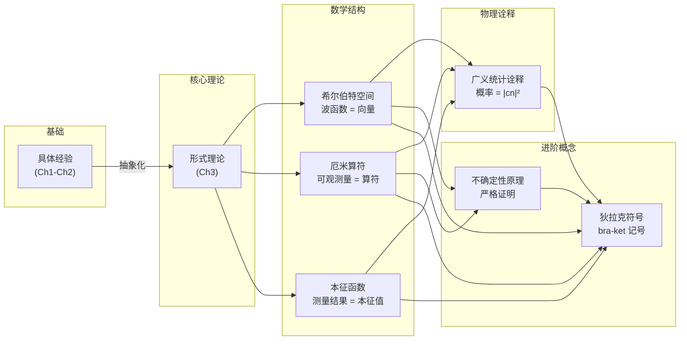
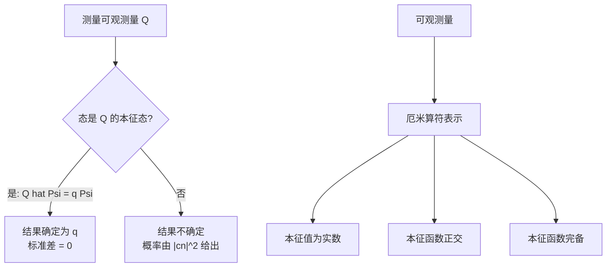
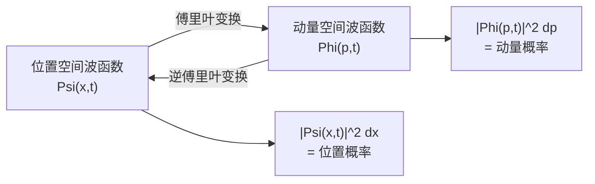
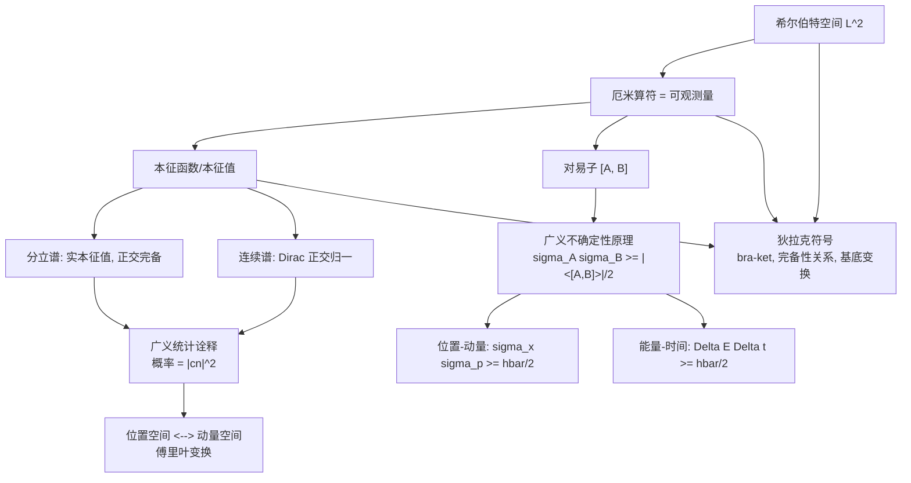

# 第3章：形式理论

> **本章核心问题**：量子力学的数学框架是什么？如何将前两章的具体结论推广为一套严谨的一般理论？

在前两章中，我们通过一系列具体的一维势场问题，积累了大量关于量子力学的"经验"：能量量子化、本征函数的正交性、展开系数的概率意义、不确定性原理等。其中一些看似是特定势场的巧合（如谐振子的等间距能谱），另一些则似乎具有普遍性（如本征函数的正交性、测量结果的概率规则）。

本章的目标是**将这些经验上升为系统的理论**。我们将用线性代数的语言——希尔伯特空间、厄米算符、本征值问题——重新表述量子力学，并引入优雅的狄拉克符号（Dirac notation）。这不仅使理论更加简洁统一，也为处理三维问题和更复杂的体系奠定了基础。

**提醒**：本章的数学抽象程度较高，但没有本质上的新物理——我们只是在更一般的层面上证明和表述已经发现的规律。每当迷失在抽象之中时，请回忆第2章的具体例子。



---

## 3.1 希尔伯特空间 (Hilbert Space)

### 3.1.1 从有限维到无限维：向量的类比

在有限维空间中，描述一个向量 $|\alpha\rangle$ 最自然的方式是给出它在某组正交归一基 $\{|e_n\rangle\}$ 下的分量 $(a_1, a_2, \ldots, a_N)$：

$$|\alpha\rangle \to \mathbf{a} = \begin{pmatrix} a_1 \\ a_2 \\ \vdots \\ a_N \end{pmatrix}$$

两个向量的**内积**是一个复数：

$$\langle \alpha | \beta \rangle = a_1^* b_1 + a_2^* b_2 + \cdots + a_N^* b_N$$

**线性变换**（算符）用矩阵表示，作用于向量产生新的向量。

量子力学中，"向量"是**波函数**，它们生活在**无限维**空间中。本征函数集合 $\{\psi_n(x)\}$ 扮演基向量的角色，展开系数 $\{c_n\}$ 就是"分量"。有限维中的求和 $\sum$ 变成了积分 $\int$，分量有限个变成了可能无穷多个——正是这种推广使得数学变得微妙。


> **核心类比**：

|        有限维线性代数         |       量子力学（无限维）       |
| :--------------------: | :-------------------: |
| 向量 $\| \alpha \rangle$ |    波函数 $\Psi(x,t)$    |
|  基向量 $\| e_n \rangle$  |   本征函数 $\psi_n(x)$    |
|        分量 $a_n$        |      展开系数 $c_n$       |
|  内积 $\sum a_n^* b_n$   | 内积 $\int f^* g \, dx$ |
|           矩阵           |          算符           |

### 3.1.2 平方可积函数空间 $L^2$

一个自然的问题是：量子力学中的波函数生活在什么样的空间中？

物理要求波函数可以归一化：$\int |\Psi|^2 dx = 1$。这意味着波函数必须是**平方可积的**。满足

$$\int_a^b |f(x)|^2 dx < \infty$$

的所有函数 $f(x)$ 构成的集合，在指定区间 $[a, b]$ 上形成一个向量空间，数学家称之为 $L^2(a,b)$，物理学家称之为**希尔伯特空间**（Hilbert space）。

$$\boxed{\text{量子力学中，波函数生活在希尔伯特空间中。}}$$

**为什么 $L^2$ 是一个向量空间？** 需要验证两个关键性质：
1. **封闭性**：如果 $f(x)$ 和 $g(x)$ 都是平方可积的，那么它们的线性组合 $af(x) + bg(x)$ 也是平方可积的。
2. **零向量**：函数 $f(x) = 0$ 显然平方可积。

第一个性质的证明依赖于施瓦茨不等式（稍后讨论）。直觉上：如果 $|f|^2$ 和 $|g|^2$ 的积分都有限，那么 $|f + g|^2 \le 2(|f|^2 + |g|^2)$ 的积分也有限。

> **注意**：所有归一化的函数构成的集合**不是**向量空间，因为两个归一化函数之和一般不再归一化（不满足封闭性）。

### 3.1.3 内积的定义与性质

在希尔伯特空间中，我们定义两个函数 $f(x)$ 和 $g(x)$ 的**内积**为：

$$\boxed{\langle f | g \rangle \equiv \int_a^b f(x)^* g(x) \, dx}$$

这个定义需要满足内积的三条公理：

**性质一：共轭对称性**

$$\langle g | f \rangle = \langle f | g \rangle^*$$

**证明**：

$$\langle g | f \rangle = \int g^* f \, dx = \left( \int f^* g \, dx \right)^* = \langle f | g \rangle^*$$

交换内积中的两个函数，等价于取复共轭。这意味着 $\langle f | g \rangle$ 一般是复数，但 $\langle f | f \rangle$ 总是实数。

**性质二：对第二个变量的线性**

$$\langle f | ag + bh \rangle = a\langle f | g \rangle + b\langle f | h \rangle$$

其中 $a, b$ 是复常数。注意，对**第一个**变量是**反线性的**（共轭线性的）：

$$\langle af + bg | h \rangle = a^*\langle f | h \rangle + b^*\langle g | h \rangle$$

复共轭来自第一个函数的复共轭 $f^*$。

**性质三：正定性**

$$\langle f | f \rangle = \int_a^b |f(x)|^2 dx \ge 0$$

等号成立当且仅当 $f(x) = 0$（几乎处处为零）。

利用内积的语言，我们可以统一定义以下概念：

- **归一化**：$\langle f | f \rangle = 1$
- **正交**：$\langle f | g \rangle = 0$
- **正交归一集**：$\langle f_m | f_n \rangle = \delta_{mn}$

### 3.1.4 施瓦茨不等式 (Schwarz Inequality)

希尔伯特空间中最重要的不等式是**施瓦茨不等式**（也称柯西-施瓦茨不等式）：

$$\boxed{|\langle f | g \rangle|^2 \le \langle f | f \rangle \langle g | g \rangle}$$

或等价地：

$$\left| \int_a^b f(x)^* g(x) \, dx \right|^2 \le \int_a^b |f(x)|^2 dx \cdot \int_a^b |g(x)|^2 dx$$

这是有限维中 $|\mathbf{a} \cdot \mathbf{b}|^2 \le |\mathbf{a}|^2 |\mathbf{b}|^2$ 的无限维推广。

**证明**：

设 $f$ 和 $g$ 是希尔伯特空间中的任意两个函数。对于任意复数 $z$，构造函数 $h = f - zg$。由内积的正定性：

$$\langle h | h \rangle = \langle f - zg | f - zg \rangle \ge 0$$

展开：

$$\langle f | f \rangle - z\langle f | g \rangle - z^*\langle g | f \rangle + |z|^2 \langle g | g \rangle \ge 0$$

这对任意 $z$ 成立。为了得到最强的限制，选取使左边最小的 $z$。令

$$z = \frac{\langle g | f \rangle}{\langle g | g \rangle}$$

（假设 $g \neq 0$，否则不等式平凡成立。）代入：

$$\langle f | f \rangle - \frac{\langle g | f \rangle}{\langle g | g \rangle}\langle f | g \rangle - \frac{\langle f | g \rangle}{\langle g | g \rangle}\langle g | f \rangle + \frac{|\langle g | f \rangle|^2}{\langle g | g \rangle^2}\langle g | g \rangle \ge 0$$

注意 $\langle f | g \rangle = \langle g | f \rangle^*$，所以 $\langle g | f \rangle \cdot \langle f | g \rangle = |\langle f | g \rangle|^2$。化简：

$$\langle f | f \rangle - \frac{|\langle f | g \rangle|^2}{\langle g | g \rangle} - \frac{|\langle f | g \rangle|^2}{\langle g | g \rangle} + \frac{|\langle f | g \rangle|^2}{\langle g | g \rangle} \ge 0$$

$$\langle f | f \rangle - \frac{|\langle f | g \rangle|^2}{\langle g | g \rangle} \ge 0$$

移项即得：

$$|\langle f | g \rangle|^2 \le \langle f | f \rangle \langle g | g \rangle$$

**证毕。** $\blacksquare$

**等号成立的条件**：$\langle h | h \rangle = 0$，即 $h = 0$，即 $f = zg$——当且仅当 $f$ 是 $g$ 的**常数倍**时，施瓦茨不等式取等号。这一条件将在3.5节证明不确定性原理时扮演关键角色。

> **物理意义**：施瓦茨不等式保证了希尔伯特空间中内积的良好定义。如果 $f$ 和 $g$ 都是平方可积的，那么它们的内积 $\langle f | g \rangle$ 一定收敛到有限值。正是施瓦茨不等式保证了平方可积函数之和仍然是平方可积的（即 $L^2$ 的封闭性）。

### 3.1.5 正交归一集与完备性

一组函数 $\{f_n(x)\}$ 如果满足：

$$\langle f_m | f_n \rangle = \delta_{mn}$$

就称为**正交归一的**（orthonormal）。

如果希尔伯特空间中**任何**函数都可以展开为这组函数的线性组合：

$$f(x) = \sum_{n=1}^{\infty} c_n f_n(x)$$

就称这组函数是**完备的**（complete）。

当正交归一集是完备的时，展开系数的计算方式与有限维完全相同——使用**傅里叶技巧**：

$$c_n = \langle f_n | f \rangle$$

我们已经在第2章中看到了这个公式的多个例子：
- 无限深势阱的本征函数 $\left\{\sqrt{\frac{2}{a}}\sin\frac{n\pi x}{a}\right\}$ 是 $(0, a)$ 上的完备正交归一集。
- 谐振子的本征函数 $\{\psi_n(x)\}$ 是 $(-\infty, \infty)$ 上的完备正交归一集。

---

### 习题 3.1

**(a)** 证明：所有平方可积函数的集合构成一个向量空间（参照附录 A.1 中向量空间的定义）。提示：关键是证明两个平方可积函数之和仍然平方可积。利用不等式 $|f + g|^2 \le 2(|f|^2 + |g|^2)$。

**(b)** 所有**归一化的**函数构成的集合是否构成向量空间？为什么？

**(c)** 验证公式 $\langle f | g \rangle = \int_a^b f^* g \, dx$ 满足内积的三条公理。

---

### 习题 3.2

**(a)** 对于什么范围的 $\nu$，函数 $f(x) = x^{\nu}$ 在区间 $(0, 1]$ 上属于希尔伯特空间？（假设 $\nu$ 是实数，但不一定是正数。）

**(b)** 对于 $\nu = 1/2$ 的特殊情况，$f(x) = x^{1/2}$ 是否在该希尔伯特空间中？$xf(x) = x^{3/2}$ 呢？$(d/dx)f(x) = \frac{1}{2}x^{-1/2}$ 呢？

---

### 习题 3.3（思考题）

三维普通向量中，两个向量 $\mathbf{A}$ 和 $\mathbf{B}$ 的内积满足 $|\mathbf{A} \cdot \mathbf{B}| = |\mathbf{A}||\mathbf{B}|\cos\theta$。

**(a)** 由此推导有限维的施瓦茨不等式 $|\mathbf{A} \cdot \mathbf{B}|^2 \le |\mathbf{A}|^2|\mathbf{B}|^2$，并说明等号何时成立。

**(b)** 函数空间中的施瓦茨不等式 $|\langle f | g \rangle|^2 \le \langle f | f \rangle\langle g | g \rangle$ 是否也可以理解为"两个'向量'的夹角余弦不超过1"？如果可以，如何定义两个函数之间的"夹角"？

**(c)** 考虑区间 $[0, 1]$ 上的函数 $f(x) = x$ 和 $g(x) = x^2$。计算 $\langle f | g \rangle$、$\langle f | f \rangle$、$\langle g | g \rangle$，验证施瓦茨不等式，并求出这两个函数之间的"夹角"。

---

### Key Takeaway: 3.1 希尔伯特空间

| 要点               | 内容                                                                                                 |
| ---------------- | -------------------------------------------------------------------------------------------------- |
| **希尔伯特空间 $L^2$** | 所有平方可积函数的集合，$\int f ^2 dx < \infty$                                                                |
| **内积**           | $\langle f \| g \rangle = \int f^* g \, dx$，类比向量点积                                                 |
| **施瓦茨不等式**       | $\|\langle f \| g \rangle\|^2 \le \langle f \| f \rangle \langle g \| g \rangle$，等号当 $f \propto g$ |
| **正交归一**         | $\langle f_m \| f_n \rangle = \delta_{mn}$                                                         |
| **完备性**          | 任何 $f \in L^2$ 可展开为 $f = \sum c_n f_n$，$c_n = \langle f_n \| f \rangle$                            |
| **核心类比**         | 波函数 ↔ 向量，算符 ↔ 矩阵，展开系数 ↔ 分量                                                                         |

---

## 3.2 可观测量 (Observables)

### 3.2.1 厄米算符 (Hermitian Operators)

在第1章中，我们知道物理可观测量 $Q(x, p)$ 的期望值可以用内积表示为：

$$\langle Q \rangle = \int \Psi^* \hat{Q} \Psi \, dx = \langle \Psi | \hat{Q} \Psi \rangle$$

现在，测量结果必须是**实数**（你不会在仪表上读到复数），因此期望值也必须是实数：

$$\langle Q \rangle = \langle Q \rangle^*$$

即

$$\langle \Psi | \hat{Q} \Psi \rangle = \langle \Psi | \hat{Q} \Psi \rangle^*$$

利用内积的共轭对称性 $\langle f | g \rangle^* = \langle g | f \rangle$：

$$\langle \Psi | \hat{Q} \Psi \rangle = \langle \hat{Q}\Psi | \Psi \rangle$$

这个条件必须对**任意**波函数 $\Psi$ 成立。满足这个条件的算符具有一个特殊性质：算符可以从内积的第二个位置移到第一个位置而不改变结果。

$$\boxed{\langle f | \hat{Q} g \rangle = \langle \hat{Q} f | g \rangle \quad \text{对所有 } f, g \in L^2 \text{ 成立}}$$

满足这一条件的算符称为**厄米算符**（Hermitian operator）。

$$\boxed{\text{可观测量由厄米算符表示。}}$$

> **两种等价定义**：上面给出的"弱"定义只要求 $\langle f | \hat{Q} f \rangle = \langle \hat{Q} f | f \rangle$ 对所有 $f$ 成立（即只考虑 $f = g$ 的情况）。看起来更弱，但实际上可以证明它与"强"定义 $\langle f | \hat{Q} g \rangle = \langle \hat{Q} f | g \rangle$（对所有 $f, g$）等价。证明技巧是：先令 $f \to f + g$，再令 $f \to f + ig$，利用极化恒等式即可推出一般情况。

### 3.2.2 验证常见算符的厄米性

**位置算符 $\hat{x}$ 是厄米的吗？**

$$\langle f | \hat{x} g \rangle = \int_{-\infty}^{\infty} f^* (xg) \, dx = \int_{-\infty}^{\infty} (xf)^* g \, dx = \langle \hat{x} f | g \rangle$$

是的，因为 $x$ 是实数，$x f^* = (xf)^*$。

**动量算符 $\hat{p} = -i\hbar \frac{d}{dx}$ 是厄米的吗？**

$$\langle f | \hat{p} g \rangle = \int_{-\infty}^{\infty} f^* \left(-i\hbar \frac{dg}{dx}\right) dx$$

对右边做分部积分：

$$= -i\hbar \left[ f^* g \right]_{-\infty}^{\infty} + i\hbar \int_{-\infty}^{\infty} \frac{df^*}{dx} g \, dx$$

对于平方可积函数，$f, g \to 0$（当 $|x| \to \infty$），因此边界项为零：

$$= \int_{-\infty}^{\infty} \left(-i\hbar \frac{df}{dx}\right)^* g \, dx = \langle \hat{p} f | g \rangle$$

关键在于：$i$ 的复共轭（来自 $(f^*)' = (f')^*$ 中无需共轭，但 $-i\hbar$ 的 $-i$ 共轭为 $+i$）与分部积分的负号**恰好抵消**，使得 $\hat{p}$ 是厄米的。

> **反例**：算符 $\hat{D} = d/dx$ **不是**厄米的。分部积分给出 $\langle f | \hat{D} g \rangle = -\langle \hat{D} f | g \rangle$（多了一个负号）。因此 $d/dx$ 不对应任何可观测量。

**哈密顿算符 $\hat{H} = -\frac{\hbar^2}{2m}\frac{d^2}{dx^2} + V(x)$ 是厄米的吗？**

$V(x)$ 项与 $\hat{x}$ 类似，因为 $V$ 是实函数。动能项包含 $\hat{p}^2/(2m)$，而 $\hat{p}$ 是厄米的，$\hat{p}^2 = \hat{p}\hat{p}$ 也是厄米的（可以两次运用 $\hat{p}$ 的厄米性证明），所以 $\hat{H}$ 是厄米的。

### 3.2.3 厄米共轭与伴随算符

对于一般的（不一定是厄米的）算符 $\hat{Q}$，我们定义它的**厄米共轭**（或**伴随算符**）$\hat{Q}^{\dagger}$ 为满足以下条件的算符：

$$\boxed{\langle f | \hat{Q} g \rangle = \langle \hat{Q}^{\dagger} f | g \rangle \quad \text{对所有 } f, g \text{ 成立}}$$

一个厄米算符等于它自己的厄米共轭：

$$\hat{Q} = \hat{Q}^{\dagger} \quad \Longleftrightarrow \quad \hat{Q} \text{ 是厄米的}$$

厄米共轭的一些有用性质：

- $(\hat{Q}\hat{R})^{\dagger} = \hat{R}^{\dagger}\hat{Q}^{\dagger}$（注意**顺序反转**）
- $(\hat{Q} + \hat{R})^{\dagger} = \hat{Q}^{\dagger} + \hat{R}^{\dagger}$
- $(c\hat{Q})^{\dagger} = c^*\hat{Q}^{\dagger}$，其中 $c$ 是复常数

### 3.2.4 确定态 (Determinate States)

通常，对一组处于相同量子态 $\Psi$ 的系统测量某个可观测量 $Q$，每次得到的结果**不同**——这是量子力学的基本特征。但是否存在这样的特殊态，使得每次测量 $Q$ 都一定得到**相同的值**？

如果存在，那么 $Q$ 的标准差为零：

$$\sigma_Q^2 = \langle (\hat{Q} - \langle Q \rangle)^2 \rangle = \langle \Psi | (\hat{Q} - q)^2 \Psi \rangle = 0$$

其中 $q = \langle Q \rangle$ 是每次测量都得到的确定值。由于 $\hat{Q}$ 是厄米的（因此 $\hat{Q} - q$ 也是厄米的），我们可以将算符移到内积的左边：

$$\langle (\hat{Q} - q)\Psi | (\hat{Q} - q)\Psi \rangle = 0$$

而内积 $\langle h | h \rangle = 0$ 当且仅当 $h = 0$，因此：

$$(\hat{Q} - q)\Psi = 0 \quad \Longrightarrow \quad \hat{Q}\Psi = q\Psi$$

这就是**本征值方程**！$\Psi$ 是 $\hat{Q}$ 的**本征函数**（eigenfunction），$q$ 是对应的**本征值**（eigenvalue）。

$$\boxed{\text{确定态是算符 } \hat{Q} \text{ 的本征函数。测量 } Q \text{ 的结果一定是本征值 } q \text{。}}$$

**例子**：
- 定态 $\psi_n$ 是 $\hat{H}$ 的本征函数，每次测量能量一定得到 $E_n$。
- 但 $\psi_n$ 一般不是 $\hat{p}$ 的本征函数，因此测量动量会得到不同的值。

**一些术语**：
- 本征值是一个**数**（不是算符或函数）。
- 所有本征值的集合称为算符的**谱**（spectrum）。
- 如果两个或更多线性独立的本征函数共享同一个本征值，称该本征值是**简并的**（degenerate）。
- 零函数（$f = 0$）不算本征函数（因为任何算符乘以零都给零）。



---

### 习题 3.4

**(a)** 证明：两个厄米算符之**和**是厄米的。

**(b)** 设 $\hat{Q}$ 是厄米的，$\alpha$ 是一个复常数。$\alpha\hat{Q}$ 在什么条件下是厄米的？

**(c)** 两个厄米算符的**乘积** $\hat{Q}\hat{R}$ 何时是厄米的？（提示：$(\hat{Q}\hat{R})^{\dagger} = \hat{R}^{\dagger}\hat{Q}^{\dagger} = \hat{R}\hat{Q}$，它等于 $\hat{Q}\hat{R}$ 当且仅当什么条件？）

**(d)** 验证位置算符 $\hat{x}$ 和哈密顿算符 $\hat{H} = -\frac{\hbar^2}{2m}\frac{d^2}{dx^2} + V(x)$（$V$ 为实函数）都是厄米的。

---

### 习题 3.5

**(a)** 求 $x$、$i$、$d/dx$ 的厄米共轭。

**(b)** 证明 $(\hat{Q}\hat{R})^{\dagger} = \hat{R}^{\dagger}\hat{Q}^{\dagger}$。

**(c)** 构造谐振子升算符 $\hat{a}_+$ 的厄米共轭。（回忆 $\hat{a}_+ = \frac{1}{\sqrt{2\hbar m\omega}}(-i\hat{p} + m\omega x)$。）

---

### 习题 3.6

考虑算符 $\hat{Q} = \frac{d^2}{d\phi^2}$，其中 $\phi$ 是极坐标中的方位角，函数满足周期性边界条件 $f(\phi + 2\pi) = f(\phi)$。

**(a)** $\hat{Q}$ 是厄米的吗？（利用分部积分验证 $\langle f | \hat{Q} g \rangle = \langle \hat{Q} f | g \rangle$。）

**(b)** 求 $\hat{Q}$ 的本征函数和本征值。

**(c)** $\hat{Q}$ 的谱是什么？谱是否简并？

---

### 习题 3.7（思考题）

**(a)** 如果 $f(x)$ 和 $g(x)$ 都是某算符 $\hat{Q}$ 的本征函数，对应**相同的**本征值 $q$，证明它们的任意线性组合 $\alpha f + \beta g$ 也是 $\hat{Q}$ 的本征函数，本征值仍然是 $q$。

**(b)** 验证 $f(x) = e^x$ 和 $g(x) = e^{-x}$ 都是算符 $d^2/dx^2$ 的本征函数，本征值均为 $1$。构造 $f$ 和 $g$ 的两个线性组合，使它们在区间 $(-1, 1)$ 上正交。

---

### Key Takeaway: 3.2 可观测量

| 要点 | 内容 |
|------|------|
| **核心要求** | 测量结果为实数 $\Rightarrow$ 期望值为实数 $\Rightarrow$ 算符必须厄米 |
| **厄米算符** | $\langle f \| \hat{Q}g \rangle = \langle \hat{Q}f \| g \rangle$，等价于 $\hat{Q} = \hat{Q}^{\dagger}$ |
| **常见厄米算符** | $\hat{x}$（位置）、$\hat{p} = -i\hbar d/dx$（动量）、$\hat{H}$（哈密顿量） |
| **伴随算符** | $\langle f \| \hat{Q}g \rangle = \langle \hat{Q}^{\dagger}f \| g \rangle$；$(\hat{Q}\hat{R})^{\dagger} = \hat{R}^{\dagger}\hat{Q}^{\dagger}$ |
| **确定态** | $\sigma_Q = 0 \Rightarrow \hat{Q}\Psi = q\Psi$（本征值方程） |
| **本征值 vs 本征函数** | 测量结果 = 本征值（实数），量子态 = 本征函数 |

---

## 3.3 厄米算符的特征函数 (Eigenfunctions of a Hermitian Operator)

上一节我们知道了：确定态是算符的本征函数，测量结果是本征值。现在我们来研究厄米算符本征函数的性质。根据谱的类型，可以分为两类：

- **分立谱**（discrete spectrum）：本征值是分开的、可数的。本征函数在希尔伯特空间中，是物理上可实现的态。（例如：谐振子的哈密顿量。）
- **连续谱**（continuous spectrum）：本征值充满一个连续区间。本征函数不可归一化，不在希尔伯特空间中。（例如：自由粒子的哈密顿量、动量算符。）
- 有些算符兼具两种谱。（例如：有限深势阱的哈密顿量。）

### 3.3.1 分立谱：两大定理

对于分立谱，厄米算符的（可归一化的）本征函数有两个极其重要的性质：

---

**定理1：厄米算符的本征值是实数。**

**证明**：设 $\hat{Q}f = qf$，其中 $f \neq 0$。利用厄米性：

$$\langle f | \hat{Q}f \rangle = \langle \hat{Q}f | f \rangle$$

左边：$\langle f | qf \rangle = q\langle f | f \rangle$

右边：$\langle qf | f \rangle = q^*\langle f | f \rangle$

（本征值 $q$ 是数，从内积中取出时，在第一个位置需要取共轭。）

因此 $q\langle f | f \rangle = q^*\langle f | f \rangle$。由于 $f \neq 0$，$\langle f | f \rangle \neq 0$，所以：

$$q = q^*$$

即 $q$ 是**实数**。$\blacksquare$

**物理意义**：测量结果是实数，这当然是物理上必须的——你不可能在仪表上读到一个复数。

---

**定理2：属于不同本征值的本征函数正交。**

**证明**：设 $\hat{Q}f = qf$，$\hat{Q}g = q'g$，且 $q \neq q'$。利用厄米性：

$$\langle f | \hat{Q}g \rangle = \langle \hat{Q}f | g \rangle$$

左边：$q'\langle f | g \rangle$

右边：$q^*\langle f | g \rangle = q\langle f | g \rangle$（因为由定理1，$q$ 是实数）

因此 $(q' - q)\langle f | g \rangle = 0$。由于 $q' \neq q$，必有：

$$\langle f | g \rangle = 0$$

$\blacksquare$

这就解释了为什么无限深势阱、谐振子等系统的本征函数是正交的——不是巧合，而是厄米算符本征函数的**普遍性质**。

---

**关于简并的处理**：定理2只对不同本征值有效。如果两个（或多个）线性独立的本征函数共享同一个本征值（简并），它们**不一定**正交。但可以使用**格拉姆-施密特正交化**过程，在简并子空间内构造正交的本征函数。因此，**即使存在简并，本征函数也总可以选为正交归一的**。

---

**公理（完备性）**：可观测量对应的厄米算符的本征函数是**完备的**：希尔伯特空间中的任何函数都可以表示为这些本征函数的线性组合。

$$f(x) = \sum_n c_n f_n(x), \quad c_n = \langle f_n | f \rangle$$

> 完备性在有限维情况下可以严格证明（厄米矩阵的特征向量张成全空间），但在无限维情况下不容易证明，我们将它作为量子力学的一条**公理**接受。

### 3.3.2 连续谱：狄拉克正交归一性

当谱是连续的，情况更加微妙。本征函数不可归一化，它们不在希尔伯特空间中。但它们仍然具有定理1和定理2的**类似物**，只需将克罗内克 $\delta$ 替换为狄拉克 $\delta$ 函数。

**例3.1：动量算符的本征函数**

动量算符 $\hat{p} = -i\hbar \frac{d}{dx}$ 的本征值方程为：

$$-i\hbar \frac{d}{dx}f_p(x) = p \cdot f_p(x)$$

通解为：

$$f_p(x) = Ae^{ipx/\hbar}$$

这对任何（复数）$p$ 都成立，但只有**实数** $p$ 才能给出物理上有意义的结果。对于实数 $p$，$f_p$ 是振荡函数，**不可归一化**——动量算符没有在希尔伯特空间中的本征函数。

然而，如果我们选取归一化常数 $A = 1/\sqrt{2\pi\hbar}$，则：

$$f_p(x) = \frac{1}{\sqrt{2\pi\hbar}} e^{ipx/\hbar}$$

满足**狄拉克正交归一性**：

$$\boxed{\langle f_{p'} | f_p \rangle = \int_{-\infty}^{\infty} f_{p'}^*(x) f_p(x) \, dx = \delta(p - p')}$$

这里用到了狄拉克 $\delta$ 函数的积分表示 $\frac{1}{2\pi\hbar}\int_{-\infty}^{\infty} e^{i(p-p')x/\hbar} dx = \delta(p-p')$。

同时，这些本征函数也是**完备的**：

$$f(x) = \int_{-\infty}^{\infty} c(p) f_p(x) \, dp = \frac{1}{\sqrt{2\pi\hbar}} \int_{-\infty}^{\infty} c(p) e^{ipx/\hbar} dp$$

展开系数（连续情况下称为**傅里叶变换**）通过傅里叶技巧得到：

$$c(p) = \langle f_p | f \rangle = \frac{1}{\sqrt{2\pi\hbar}} \int_{-\infty}^{\infty} e^{-ipx/\hbar} f(x) \, dx$$

---

**例3.2：位置算符的本征函数**

位置算符 $\hat{x}$ 的本征值方程为：

$$\hat{x} \, g_y(x) = x \cdot g_y(x) = y \cdot g_y(x)$$

什么函数被 $x$ 乘后等于被常数 $y$ 乘？只有在 $x = y$ 处不为零的函数。答案是：

$$g_y(x) = \delta(x - y)$$

本征值 $y$ 可以是任何实数——位置算符的谱是全体实数，连续的。

狄拉克正交归一性：

$$\langle g_{y'} | g_y \rangle = \int_{-\infty}^{\infty} \delta(x - y') \delta(x - y) \, dx = \delta(y - y')$$

完备性：

$$f(x) = \int_{-\infty}^{\infty} c(y) g_y(x) \, dy = \int_{-\infty}^{\infty} c(y) \delta(x - y) \, dy$$

其中 $c(y) = f(y)$（平凡但自洽）。

### 3.3.3 分立谱与连续谱的对比

| | 分立谱 | 连续谱 |
|---|---|---|
| **本征值** | 可数集合 $q_1, q_2, \ldots$ | 连续区间 |
| **本征函数** | 可归一化，$\in L^2$ | 不可归一化，$\notin L^2$ |
| **正交归一性** | $\langle f_m \| f_n \rangle = \delta_{mn}$（克罗内克） | $\langle f_{q'} \| f_q \rangle = \delta(q - q')$（狄拉克） |
| **展开方式** | $f = \sum_n c_n f_n$ | $f = \int c(q) f_q \, dq$ |
| **系数求法** | $c_n = \langle f_n \| f \rangle$ | $c(q) = \langle f_q \| f \rangle$ |
| **概率意义** | $\|c_n\|^2$ = 得到 $q_n$ 的概率 | $\|c(q)\|^2 dq$ = 得到 $[q, q+dq]$ 的概率 |
| **例子** | 无限深势阱、谐振子 | 自由粒子、动量算符 |

---

### 习题 3.8

**(a)** 在第2章例3.1中，我们考虑了算符 $\hat{Q} = i\frac{d}{d\phi}$（$\phi$ 为方位角，$f(\phi + 2\pi) = f(\phi)$）。验证其本征值 $q = 0, \pm 1, \pm 2, \ldots$ 确实都是实数，且属于不同本征值的本征函数确实正交。

**(b)** 对习题3.6中的算符 $\hat{Q} = d^2/d\phi^2$ 做同样的验证。

---

### 习题 3.9

**(a)** 举出第2章中一个（除谐振子外的）哈密顿量只有**分立谱**的例子。

**(b)** 举出一个（除自由粒子外的）哈密顿量只有**连续谱**的例子。

**(c)** 举出一个（除有限深势阱外的）哈密顿量**同时具有**分立谱和连续谱的例子。

---

### 习题 3.10（概念题）

无限深势阱的基态 $\psi_1(x) = \sqrt{2/a}\sin(\pi x/a)$ 是否是动量算符 $\hat{p}$ 的本征函数？

如果是，它的动量是什么？如果不是，为什么不是？（提示：将 $\sin$ 用指数函数表示。）

---

### 习题 3.11

一个质量为 $m$ 的粒子束缚在 $\delta$ 函数势阱 $V(x) = -\alpha\delta(x)$ 中（$\alpha > 0$）。

**(a)** 写出束缚态的位置空间波函数 $\Psi(x, t)$（第2章结果）。

**(b)** 计算动量空间波函数 $\Phi(p, t) = \frac{1}{\sqrt{2\pi\hbar}}\int_{-\infty}^{\infty} e^{-ipx/\hbar}\Psi(x, t) \, dx$。

**(c)** 测量动量的结果大于 $p_0 = m\alpha/\hbar$ 的概率是多少？（答案：$\frac{1}{4} - \frac{1}{2\pi} \approx 0.091$。）

---

### Key Takeaway: 3.3 厄米算符的特征函数

| 要点 | 内容 |
|------|------|
| **定理1** | 厄米算符的本征值是实数 |
| **定理2** | 属于不同本征值的本征函数正交 |
| **简并处理** | Gram-Schmidt 正交化，总可以选为正交归一 |
| **完备性（公理）** | 本征函数构成完备集，任何函数可展开 |
| **连续谱** | 本征函数不可归一化，但有 Dirac 正交归一性 $\langle f_{q'}\|f_q\rangle = \delta(q-q')$ |
| **动量本征函数** | $f_p(x) = \frac{1}{\sqrt{2\pi\hbar}}e^{ipx/\hbar}$，完备性 = 傅里叶变换 |
| **位置本征函数** | $g_y(x) = \delta(x-y)$ |

---

## 3.4 广义统计诠释 (Generalized Statistical Interpretation)

### 3.4.1 从特例到一般

在第1章中，我们学到了：
- $|\Psi(x,t)|^2 dx$ 是在 $x$ 到 $x + dx$ 之间找到粒子的概率。

在第2章中，我们发现了：
- $|c_n|^2$ 是测量能量得到 $E_n$ 的概率，其中 $c_n = \langle \psi_n | \Psi \rangle$。

现在我们可以将这些特例统一为一个优美的一般性原理：

> **广义统计诠释**：如果在态 $\Psi(x, t)$ 上测量可观测量 $Q(x, p)$，测量结果一定是算符 $\hat{Q}$ 的某个本征值。
>
> - 若 $\hat{Q}$ 的谱是**分立的**，本征值为 $q_n$，对应正交归一化本征函数 $f_n(x)$，则测量得到 $q_n$ 的概率为
>
> $$\boxed{|c_n|^2, \quad \text{其中 } c_n = \langle f_n | \Psi \rangle}$$
>
> - 若 $\hat{Q}$ 的谱是**连续的**，对应 Dirac 正交归一化本征函数 $f_z(x)$，则测量结果落在 $dz$ 范围内的概率为
>
> $$\boxed{|c(z)|^2 dz, \quad \text{其中 } c(z) = \langle f_z | \Psi \rangle}$$
>
> 测量后，波函数**坍缩**到对应的本征态。

### 3.4.2 自洽性验证

这个诠释与我们已知的结果一致吗？

**位置测量**：位置算符 $\hat{x}$ 的本征函数是 $g_y(x) = \delta(x - y)$（见例3.2）。展开系数为：

$$c(y) = \langle g_y | \Psi \rangle = \int_{-\infty}^{\infty} \delta(x - y)\Psi(x, t) \, dx = \Psi(y, t)$$

测量位置得到 $y$ 附近 $dy$ 范围的概率为 $|c(y)|^2 dy = |\Psi(y, t)|^2 dy$，正好是**玻恩诠释**。

**能量测量**：哈密顿量 $\hat{H}$ 的本征函数是定态 $\psi_n(x)$，本征值为 $E_n$。展开系数为：

$$c_n = \langle \psi_n | \Psi \rangle$$

测量能量得到 $E_n$ 的概率为 $|c_n|^2$，与第2章的结果一致。

### 3.4.3 期望值公式

利用完备性和正交归一性，期望值的一般公式为：

$$\langle Q \rangle = \sum_n q_n |c_n|^2$$

**验证**：

$$\langle Q \rangle = \langle \Psi | \hat{Q}\Psi \rangle = \left\langle \sum_{n'} c_{n'} f_{n'} \left| \hat{Q} \sum_n c_n f_n \right. \right\rangle = \sum_{n'}\sum_n c_{n'}^* c_n q_n \langle f_{n'} | f_n \rangle$$

$$= \sum_{n'}\sum_n c_{n'}^* c_n q_n \delta_{n'n} = \sum_n q_n |c_n|^2$$

归一化条件：

$$\sum_n |c_n|^2 = 1$$

这同样可以从 $\langle \Psi | \Psi \rangle = 1$ 推出。

### 3.4.4 动量空间波函数

广义统计诠释中最重要的应用之一是**动量测量**。动量算符的本征函数为 $f_p(x) = \frac{1}{\sqrt{2\pi\hbar}}e^{ipx/\hbar}$，因此展开系数为：

$$c(p) = \langle f_p | \Psi \rangle = \frac{1}{\sqrt{2\pi\hbar}} \int_{-\infty}^{\infty} e^{-ipx/\hbar} \Psi(x, t) \, dx$$

这正是波函数的**傅里叶变换**。我们给它一个专门的名字和符号：

$$\boxed{\Phi(p, t) = \frac{1}{\sqrt{2\pi\hbar}} \int_{-\infty}^{\infty} e^{-ipx/\hbar} \Psi(x, t) \, dx}$$

称为**动量空间波函数**。逆变换为：

$$\Psi(x, t) = \frac{1}{\sqrt{2\pi\hbar}} \int_{-\infty}^{\infty} e^{ipx/\hbar} \Phi(p, t) \, dp$$

$|\Phi(p, t)|^2 dp$ 是测量动量得到 $p$ 到 $p + dp$ 之间的概率。



### 3.4.5 帕塞瓦尔定理与动量空间中的算符

位置空间与动量空间包含**完全相同的信息**。帕塞瓦尔定理（Parseval's theorem）保证了归一化的一致性：

$$\int_{-\infty}^{\infty} |\Psi(x,t)|^2 dx = \int_{-\infty}^{\infty} |\Phi(p,t)|^2 dp = 1$$

在动量空间中计算期望值也很方便。位置和动量的期望值分别为：

| | 位置空间 | 动量空间 |
|---|---|---|
| $\hat{x}$ | $x$（直接乘） | $i\hbar\frac{\partial}{\partial p}$ |
| $\hat{p}$ | $-i\hbar\frac{\partial}{\partial x}$ | $p$（直接乘） |

一般公式：

$$\langle Q \rangle = \begin{cases} \int \Psi^* \hat{Q}\left(x, -i\hbar\frac{\partial}{\partial x}\right) \Psi \, dx & \text{（位置空间）} \\ \int \Phi^* \hat{Q}\left(i\hbar\frac{\partial}{\partial p}, p\right) \Phi \, dp & \text{（动量空间）} \end{cases}$$

---

### 习题 3.12

一个粒子处于谐振子基态 $\psi_0(x) = \left(\frac{m\omega}{\pi\hbar}\right)^{1/4} e^{-m\omega x^2/(2\hbar)}$。

**(a)** 求动量空间波函数 $\Phi(p, t)$。

**(b)** 测量动量的结果超出经典允许范围（对应相同能量 $E_0 = \frac{1}{2}\hbar\omega$）的概率是多少？（精确到两位有效数字。提示：查阅误差函数表或用数值计算。答案约为 $0.16$。）

---

### 习题 3.13

证明：在动量空间中，位置算符的表示为 $\hat{x} \to i\hbar\frac{\partial}{\partial p}$。即证明：

$$\langle x \rangle = \int_{-\infty}^{\infty} \Phi^* \left(i\hbar \frac{\partial}{\partial p}\right) \Phi \, dp$$

提示：注意 $x e^{ipx/\hbar} = -i\hbar \frac{\partial}{\partial p} e^{ipx/\hbar}$。

---

### 习题 3.14（计算题）

自由粒子的初始波函数为 $\Psi(x, 0) = Ae^{-a|x|}$（$a > 0$）。

**(a)** 求归一化常数 $A$。

**(b)** 求动量空间波函数 $\Phi(p, 0)$。

**(c)** 验证帕塞瓦尔定理 $\int|\Psi|^2 dx = \int|\Phi|^2 dp$。

**(d)** 计算 $\langle p^2 \rangle$（在动量空间中计算更方便）。

---

### Key Takeaway: 3.4 广义统计诠释

| 要点 | 内容 |
|------|------|
| **核心原理** | 测量 $Q$ 得到的一定是 $\hat{Q}$ 的本征值；概率 = $\|c_n\|^2$ 或 $\|c(z)\|^2 dz$ |
| **展开系数** | $c_n = \langle f_n \| \Psi \rangle$（分立），$c(z) = \langle f_z \| \Psi \rangle$（连续） |
| **归一化** | $\sum_n \|c_n\|^2 = 1$ 或 $\int \|c(z)\|^2 dz = 1$ |
| **期望值** | $\langle Q \rangle = \sum_n q_n \|c_n\|^2$ |
| **动量空间波函数** | $\Phi(p,t)$ = $\Psi(x,t)$ 的傅里叶变换 |
| **帕塞瓦尔定理** | $\int \|\Psi\|^2 dx = \int \|\Phi\|^2 dp = 1$ |
| **动量空间算符** | $\hat{x} \to i\hbar\partial/\partial p$，$\hat{p} \to p$ |

---

## 3.5 不确定性原理 (The Uncertainty Principle)

在第1章中，我们定性地陈述了位置-动量不确定性关系 $\sigma_x \sigma_p \ge \hbar/2$。现在，借助本章发展的形式化工具，我们可以给出**严格的证明**——不仅针对位置和动量，而是针对**任意一对可观测量**。

### 3.5.1 广义不确定性原理的证明

**目标**：对于任意两个可观测量 $A$ 和 $B$（对应厄米算符 $\hat{A}$ 和 $\hat{B}$），证明

$$\boxed{\sigma_A^2 \sigma_B^2 \ge \left(\frac{1}{2i}\langle[\hat{A}, \hat{B}]\rangle\right)^2}$$

其中 $[\hat{A}, \hat{B}] \equiv \hat{A}\hat{B} - \hat{B}\hat{A}$ 是**对易子**（commutator）。

**证明**（分三步）：

---

**第一步：构造辅助函数**

对于可观测量 $A$，定义：

$$f \equiv (\hat{A} - \langle A \rangle)\Psi$$

则方差为：

$$\sigma_A^2 = \langle (\hat{A} - \langle A \rangle)^2 \rangle = \langle f | f \rangle$$

类似地定义 $g \equiv (\hat{B} - \langle B \rangle)\Psi$，得到 $\sigma_B^2 = \langle g | g \rangle$。

---

**第二步：应用施瓦茨不等式**

由施瓦茨不等式：

$$\sigma_A^2 \sigma_B^2 = \langle f | f \rangle \langle g | g \rangle \ge |\langle f | g \rangle|^2$$

---

**第三步：分离虚部**

对于任意复数 $z$，$|z|^2 = [\text{Re}(z)]^2 + [\text{Im}(z)]^2 \ge [\text{Im}(z)]^2 = \left[\frac{1}{2i}(z - z^*)\right]^2$。

令 $z = \langle f | g \rangle$，则：

$$\sigma_A^2 \sigma_B^2 \ge \left[\frac{1}{2i}(\langle f | g \rangle - \langle g | f \rangle)\right]^2$$

现在计算 $\langle f | g \rangle - \langle g | f \rangle$。利用 $\hat{A}$ 和 $\hat{B}$ 的厄米性（因此 $\hat{A} - \langle A \rangle$ 和 $\hat{B} - \langle B \rangle$ 也是厄米的）：

$$\langle f | g \rangle = \langle (\hat{A} - \langle A \rangle)\Psi | (\hat{B} - \langle B \rangle)\Psi \rangle = \langle \Psi | (\hat{A} - \langle A \rangle)(\hat{B} - \langle B \rangle)\Psi \rangle$$

展开乘积：

$$= \langle \hat{A}\hat{B} \rangle - \langle A \rangle\langle B \rangle$$

类似地，$\langle g | f \rangle = \langle \hat{B}\hat{A} \rangle - \langle A \rangle\langle B \rangle$。因此：

$$\langle f | g \rangle - \langle g | f \rangle = \langle \hat{A}\hat{B} \rangle - \langle \hat{B}\hat{A} \rangle = \langle \hat{A}\hat{B} - \hat{B}\hat{A} \rangle = \langle [\hat{A}, \hat{B}] \rangle$$

将其代回：

$$\sigma_A^2 \sigma_B^2 \ge \left(\frac{1}{2i}\langle[\hat{A}, \hat{B}]\rangle\right)^2$$

**证毕。** $\blacksquare$

> **注意**：右边除以 $i$ 似乎会让结果变为负数或虚数？其实不会。两个厄米算符的对易子乘以 $i$ 是厄米的（可以验证），因此 $\frac{1}{i}\langle[\hat{A}, \hat{B}]\rangle$ 是实数。实际上 $[\hat{A}, \hat{B}]$ 本身是反厄米的（anti-Hermitian），它的期望值是纯虚数，除以 $i$ 后变成实数。

### 3.5.2 位置-动量不确定性关系

作为广义不确定性原理的最重要特例，取 $\hat{A} = \hat{x}$，$\hat{B} = \hat{p}$。我们在第2章中已经计算过（也可以直接验证）：

$$[\hat{x}, \hat{p}] = i\hbar$$

这是量子力学中最基本的对易关系，称为**正则对易关系**。代入广义不确定性原理：

$$\sigma_x^2 \sigma_p^2 \ge \left(\frac{1}{2i} \cdot i\hbar\right)^2 = \left(\frac{\hbar}{2}\right)^2$$

因此：

$$\boxed{\sigma_x \sigma_p \ge \frac{\hbar}{2}}$$

这就是**海森堡不确定性原理**的严格证明。

### 3.5.3 相容与不相容可观测量

广义不确定性原理揭示了一个深刻的概念：

- **不相容可观测量**：$[\hat{A}, \hat{B}] \neq 0$。位置和动量不可能同时有确定值——不存在同时是 $\hat{x}$ 和 $\hat{p}$ 本征函数的态。
- **相容可观测量**：$[\hat{A}, \hat{B}] = 0$。可以找到同时是 $\hat{A}$ 和 $\hat{B}$ 本征函数的完备集——两个量可以同时有确定值。

> **例如**：在氢原子中，$\hat{H}$、$\hat{L}^2$、$\hat{L}_z$ 两两对易，因此存在同时确定能量、角动量大小、角动量 $z$ 分量的态——这就是用量子数 $n, l, m$ 标记的态。

### 3.5.4 最小不确定性波包

什么样的波函数使得不确定性原理取等号 $\sigma_x \sigma_p = \hbar/2$？

回顾证明中的两个不等式：
1. 施瓦茨不等式取等号要求 $f = cg$，即 $(\hat{A} - \langle A \rangle)\Psi = c(\hat{B} - \langle B \rangle)\Psi$。
2. 丢弃实部要求 $\text{Re}(\langle f | g \rangle) = 0$，即常数 $c$ 必须是**纯虚数** $c = ia$（$a$ 为实数）。

对于位置-动量，条件变为：

$$\left(-i\hbar\frac{d}{dx} - \langle p \rangle\right)\Psi = ia(x - \langle x \rangle)\Psi$$

这是一阶常微分方程，解为：

$$\boxed{\Psi(x) = A \exp\left[-\frac{a}{2\hbar}(x - \langle x \rangle)^2 + \frac{i\langle p \rangle x}{\hbar}\right]}$$

这是一个**高斯波包**——以 $\langle x \rangle$ 为中心，以 $\langle p \rangle/\hbar$ 为波数的高斯函数。

**结论**：最小不确定性波包一定是高斯型的。我们在第1章和第2章中遇到的两个例子——谐振子基态和自由粒子高斯波包——确实都是高斯型，正满足 $\sigma_x \sigma_p = \hbar/2$。

### 3.5.5 广义 Ehrenfest 定理

在证明能量-时间不确定性原理之前，我们先推导一个非常有用的结果。对于不显含时间的可观测量 $\hat{Q}$，其期望值的时间导数为：

$$\boxed{\frac{d}{dt}\langle Q \rangle = \frac{i}{\hbar}\langle [\hat{H}, \hat{Q}] \rangle + \left\langle \frac{\partial \hat{Q}}{\partial t} \right\rangle}$$

当 $\hat{Q}$ 不显含时间时（通常如此），第二项为零，得到：

$$\frac{d}{dt}\langle Q \rangle = \frac{i}{\hbar}\langle [\hat{H}, \hat{Q}] \rangle$$

**推导**：

$$\frac{d}{dt}\langle Q \rangle = \frac{d}{dt}\langle \Psi | \hat{Q}\Psi \rangle = \left\langle \frac{\partial \Psi}{\partial t} \bigg| \hat{Q}\Psi \right\rangle + \left\langle \Psi \bigg| \hat{Q}\frac{\partial \Psi}{\partial t} \right\rangle$$

利用薛定谔方程 $i\hbar \frac{\partial \Psi}{\partial t} = \hat{H}\Psi$，得 $\frac{\partial \Psi}{\partial t} = \frac{1}{i\hbar}\hat{H}\Psi$：

$$= \left\langle \frac{1}{i\hbar}\hat{H}\Psi \bigg| \hat{Q}\Psi \right\rangle + \left\langle \Psi \bigg| \hat{Q}\frac{1}{i\hbar}\hat{H}\Psi \right\rangle$$

$$= -\frac{1}{i\hbar}\langle \hat{H}\Psi | \hat{Q}\Psi \rangle + \frac{1}{i\hbar}\langle \Psi | \hat{Q}\hat{H}\Psi \rangle$$

利用 $\hat{H}$ 的厄米性，$\langle \hat{H}\Psi | \hat{Q}\Psi \rangle = \langle \Psi | \hat{H}\hat{Q}\Psi \rangle$：

$$= \frac{1}{i\hbar}\left[\langle \Psi | \hat{Q}\hat{H}\Psi \rangle - \langle \Psi | \hat{H}\hat{Q}\Psi \rangle\right] = \frac{i}{\hbar}\langle [\hat{H}, \hat{Q}] \rangle$$

**重要推论**：如果 $\hat{Q}$ 与 $\hat{H}$ 对易，即 $[\hat{H}, \hat{Q}] = 0$，则 $\frac{d}{dt}\langle Q \rangle = 0$，$Q$ 的期望值**不随时间变化**——$Q$ 是一个**守恒量**。

### 3.5.6 能量-时间不确定性原理

位置-动量不确定性原理 $\sigma_x \sigma_p \ge \hbar/2$ 常与以下公式放在一起：

$$\Delta E \, \Delta t \ge \frac{\hbar}{2}$$

但要注意：这两个公式的含义**完全不同**。在量子力学中，时间 $t$ 不是一个算符——它是**参数**（自变量），$\Delta t$ 不是"时间测量的标准差"。那么 $\Delta t$ 到底是什么？

**推导**：在广义不确定性原理 $\sigma_A^2\sigma_B^2 \ge \left(\frac{1}{2i}\langle[\hat{A}, \hat{B}]\rangle\right)^2$ 中，取 $\hat{A} = \hat{H}$，$\hat{B} = \hat{Q}$（任意不显含时间的可观测量），利用广义 Ehrenfest 定理：

$$\sigma_H^2 \sigma_Q^2 \ge \left(\frac{1}{2i} \cdot \frac{\hbar}{i}\frac{d\langle Q\rangle}{dt}\right)^2 = \left(\frac{\hbar}{2}\right)^2 \left(\frac{d\langle Q\rangle}{dt}\right)^2$$

即：

$$\sigma_H \sigma_Q \ge \frac{\hbar}{2}\left|\frac{d\langle Q\rangle}{dt}\right|$$

定义：

$$\Delta E \equiv \sigma_H, \quad \Delta t \equiv \frac{\sigma_Q}{|d\langle Q\rangle/dt|}$$

则得到：

$$\boxed{\Delta E \, \Delta t \ge \frac{\hbar}{2}}$$

**$\Delta t$ 的物理意义**：$\Delta t$ 是**可观测量 $Q$ 的期望值变化一个标准差所需的时间**。它衡量的是系统"发生显著变化"的时间尺度。

- 如果 $\Delta E$ 很小（能量接近确定），则 $\Delta t$ 很大——所有可观测量的期望值变化缓慢，系统近似静止。
- 在极端情况下，定态（$\Delta E = 0$）中所有期望值都不随时间变化（$\Delta t = \infty$）——定态"什么都不发生"。
- 如果系统变化很快（$\Delta t$ 很小），则能量必有较大的不确定性。

> **常见误解**："能量可以在短时间内'借用'"——这是对能量-时间不确定性原理的错误理解。量子力学**没有**允许违反能量守恒。$\Delta E \, \Delta t \ge \hbar/2$ 只是说：能量不确定的系统变化更快。

**例题：不稳定粒子的质量谱宽**

$\Delta$ 粒子的寿命约 $\tau \sim 10^{-23}$ 秒。取 $\Delta t \sim \tau$，则：

$$\Delta E \sim \frac{\hbar}{2\tau} \sim \frac{1.05 \times 10^{-34}}{2 \times 10^{-23}} \approx 5 \times 10^{-12} \text{ J} \approx 30 \text{ MeV}$$

实验上测到 $\Delta$ 粒子的质量谱宽约 120 MeV（半高宽），与此估计量级一致。一个寿命如此短的粒子，其质量（即静能 $mc^2$）根本无法精确确定。

---

### 习题 3.15

**(a)** 证明对易子恒等式：

$$[\hat{A} + \hat{B}, \hat{C}] = [\hat{A}, \hat{C}] + [\hat{B}, \hat{C}]$$

$$[\hat{A}\hat{B}, \hat{C}] = \hat{A}[\hat{B}, \hat{C}] + [\hat{A}, \hat{C}]\hat{B}$$

**(b)** 证明 $[x^n, \hat{p}] = i\hbar n x^{n-1}$。

**(c)** 更一般地，证明 $[f(x), \hat{p}] = i\hbar \frac{df}{dx}$，其中 $f(x)$ 是可以泰勒展开的函数。

**(d)** 证明对谐振子 $[\hat{H}, \hat{a}_{\pm}] = \pm\hbar\omega\hat{a}_{\pm}$。

---

### 习题 3.16

证明"你的名字"不确定性原理：位置的不确定性 $\sigma_x$ 与能量的不确定性 $\sigma_H$ 之间满足

$$\sigma_x \sigma_H \ge \frac{\hbar}{2m}|\langle p \rangle|$$

对于定态，这给出什么？为什么不意外？

---

### 习题 3.17（计算题）

将广义 Ehrenfest 定理 $\frac{d}{dt}\langle Q \rangle = \frac{i}{\hbar}\langle[\hat{H}, \hat{Q}]\rangle$ 分别应用到以下情况：

**(a)** $\hat{Q} = 1$（恒等算符）。

**(b)** $\hat{Q} = \hat{H}$。

**(c)** $\hat{Q} = \hat{x}$。

**(d)** $\hat{Q} = \hat{p}$。

对每种情况，解读所得结论的物理意义。（提示：与能量守恒、Ehrenfest 定理对照。）

---

### 习题 3.18

证明：两个不对易的算符不可能有**完备的公共本征函数集**。即证明：如果 $\hat{P}$ 和 $\hat{Q}$ 有一组完备的公共本征函数，则 $[\hat{P}, \hat{Q}]f = 0$ 对希尔伯特空间中的任何函数 $f$ 成立。

---

### 习题 3.19（编程题）

用 Python 数值验证高斯波包的不确定性关系。

**(a)** 考虑归一化高斯波包 $\Psi(x) = \left(\frac{2a}{\pi}\right)^{1/4} e^{-ax^2}$，数值计算 $\sigma_x$ 和 $\sigma_p$（通过数值积分或傅里叶变换），验证 $\sigma_x\sigma_p = \hbar/2$。

**(b)** 考虑"扰动"的波函数 $\Psi(x) = A(1 + \beta x^2)e^{-ax^2}$（$\beta$ 为实参数），画出 $\sigma_x\sigma_p$ 作为 $\beta$ 的函数的图像。验证不确定性乘积总是 $\ge \hbar/2$，且仅当 $\beta = 0$（纯高斯）时取等号。

```python
import numpy as np
from scipy import integrate
import matplotlib.pyplot as plt

# --- 基本参数 ---
hbar = 1.0  # 使用自然单位 hbar = 1
a = 1.0     # 高斯宽度参数

# --- (a) 验证纯高斯波包 ---
# 位置空间波函数
def psi_gauss(x, a_param):
    """归一化高斯波函数"""
    return (2 * a_param / np.pi)**0.25 * np.exp(-a_param * x**2)

# 数值计算 sigma_x
x = np.linspace(-10, 10, 10000)
dx = x[1] - x[0]
psi = psi_gauss(x, a)
prob_x = np.abs(psi)**2

x_avg = np.trapezoid(x * prob_x, x)
x2_avg = np.trapezoid(x**2 * prob_x, x)
sigma_x = np.sqrt(x2_avg - x_avg**2)

# 动量空间波函数（傅里叶变换）
p = np.fft.fftshift(np.fft.fftfreq(len(x), d=dx)) * 2 * np.pi * hbar
phi = np.fft.fftshift(np.fft.fft(psi)) * dx / np.sqrt(2 * np.pi * hbar)
prob_p = np.abs(phi)**2

# 归一化动量空间概率
norm_p = np.trapezoid(prob_p, p)
prob_p /= norm_p

p_avg = np.trapezoid(p * prob_p, p)
p2_avg = np.trapezoid(p**2 * prob_p, p)
sigma_p = np.sqrt(p2_avg - p_avg**2)

print(f"sigma_x = {sigma_x:.6f}")
print(f"sigma_p = {sigma_p:.6f}")
print(f"sigma_x * sigma_p = {sigma_x * sigma_p:.6f}")
print(f"hbar/2 = {hbar/2:.6f}")
print(f"Ratio to hbar/2: {sigma_x * sigma_p / (hbar/2):.6f}")

# --- (b) 扰动波函数 ---
beta_vals = np.linspace(-0.8, 2.0, 200)
products = []

for beta in beta_vals:
    psi_mod = (1 + beta * x**2) * np.exp(-a * x**2)
    # 归一化
    norm = np.trapezoid(np.abs(psi_mod)**2, x)
    psi_mod /= np.sqrt(norm)

    prob_mod = np.abs(psi_mod)**2
    x_avg_m = np.trapezoid(x * prob_mod, x)
    x2_avg_m = np.trapezoid(x**2 * prob_mod, x)
    sx = np.sqrt(max(x2_avg_m - x_avg_m**2, 0))

    # 动量空间
    phi_mod = np.fft.fftshift(np.fft.fft(psi_mod)) * dx / np.sqrt(2 * np.pi * hbar)
    prob_p_mod = np.abs(phi_mod)**2
    norm_pm = np.trapezoid(prob_p_mod, p)
    if norm_pm > 0:
        prob_p_mod /= norm_pm

    p_avg_m = np.trapezoid(p * prob_p_mod, p)
    p2_avg_m = np.trapezoid(p**2 * prob_p_mod, p)
    sp = np.sqrt(max(p2_avg_m - p_avg_m**2, 0))

    products.append(sx * sp)

# 画图
fig, ax = plt.subplots(figsize=(8, 5))
ax.plot(beta_vals, products, 'b-', linewidth=2, label=r'$\sigma_x \sigma_p$')
ax.axhline(y=hbar/2, color='r', linestyle='--', linewidth=1.5,
           label=r'$\hbar/2$ (lower bound)')
ax.set_xlabel(r'$\beta$', fontsize=14)
ax.set_ylabel(r'$\sigma_x \sigma_p$', fontsize=14)
ax.set_title('Uncertainty Product vs Perturbation Parameter', fontsize=14)
ax.legend(fontsize=12)
ax.set_ylim(0, max(products) * 1.1)
ax.grid(True, alpha=0.3)
plt.tight_layout()
plt.savefig('uncertainty_product.png', dpi=150)
plt.show()
```

---

### Key Takeaway: 3.5 不确定性原理

| 要点 | 内容 |
|------|------|
| **广义不确定性原理** | $\sigma_A^2\sigma_B^2 \ge \left(\frac{1}{2i}\langle[\hat{A},\hat{B}]\rangle\right)^2$ |
| **位置-动量** | $[\hat{x},\hat{p}] = i\hbar \Rightarrow \sigma_x\sigma_p \ge \hbar/2$ |
| **不相容/相容** | $[\hat{A},\hat{B}] \neq 0$：不能同时确定；$= 0$：可以同时确定 |
| **最小不确定性波包** | 高斯波包，$\sigma_x\sigma_p = \hbar/2$ |
| **广义 Ehrenfest 定理** | $\frac{d}{dt}\langle Q\rangle = \frac{i}{\hbar}\langle[\hat{H},\hat{Q}]\rangle$；$[\hat{H},\hat{Q}]=0 \Rightarrow Q$ 守恒 |
| **能量-时间** | $\Delta E\,\Delta t \ge \hbar/2$，$\Delta t = \sigma_Q / \|d\langle Q\rangle/dt\|$（系统变化的时间尺度） |

---

## 3.6 矢量与算符 (Vectors and Operators)

### 3.6.1 希尔伯特空间中的基

在二维或三维空间中，描述一个向量 $\mathbf{A}$ 的方式取决于你选择的坐标系。选择 $(x, y)$ 坐标系，$\mathbf{A}$ 由分量 $(A_x, A_y)$ 表示。换一组轴 $(x', y')$，**同一个向量**有不同的分量 $(A_x', A_y')$。向量本身是独立于坐标选择的——它"就在那里"。

量子力学中完全类似。系统的状态由一个抽象的**态矢量** $|S(t)\rangle$ 表示，它生活在希尔伯特空间中，独立于任何特定的基。但我们可以选择不同的基来表示它：

**位置基**：选取 $\hat{x}$ 的本征态 $\{|x\rangle\}$ 作为基。态矢量 $|S(t)\rangle$ 在位置基下的"分量"就是**位置空间波函数**：

$$\Psi(x, t) = \langle x | S(t) \rangle$$

**动量基**：选取 $\hat{p}$ 的本征态 $\{|p\rangle\}$ 作为基。态矢量在动量基下的"分量"就是**动量空间波函数**：

$$\Phi(p, t) = \langle p | S(t) \rangle$$

**能量基**：选取 $\hat{H}$ 的本征态 $\{|n\rangle\}$ 作为基（假设谱是分立的）。态矢量的"分量"是**展开系数**：

$$c_n(t) = \langle n | S(t) \rangle$$

三种表示包含**完全相同的信息**——就像同一个向量在不同坐标系中的分量一样。

### 3.6.2 狄拉克符号 (Dirac Notation)

狄拉克提出将内积记号 $\langle \alpha | \beta \rangle$ 拆分为两个独立的对象：

- **右矢（ket）** $|\beta\rangle$：一个向量（在函数空间中是一个函数）。
- **左矢（bra）** $\langle \alpha |$：一个线性泛函——它作用于一个右矢，产生一个数（内积）。

在有限维空间中：

$$|\alpha\rangle \to \begin{pmatrix} a_1 \\ a_2 \\ \vdots \\ a_n \end{pmatrix}, \quad \langle \beta | \to \begin{pmatrix} b_1^* & b_2^* & \cdots & b_n^* \end{pmatrix}$$

内积就是矩阵乘法：$\langle \beta | \alpha \rangle = b_1^*a_1 + b_2^*a_2 + \cdots + b_n^*a_n$。

在函数空间中：$\langle f |$ 意味着"取 $f^*$ 然后积分"，即 $\langle f | = \int f^*(x) [\cdots] \, dx$，方括号等着被右矢填充。

**投影算符**：如果 $|\alpha\rangle$ 是归一化的，算符

$$\hat{P} = |\alpha\rangle\langle\alpha|$$

是**投影算符**——它将任意向量投影到 $|\alpha\rangle$ 方向：

$$\hat{P}|\beta\rangle = |\alpha\rangle\langle\alpha|\beta\rangle = (\langle\alpha|\beta\rangle)|\alpha\rangle$$

**完备性关系**（恒等分解）：如果 $\{|e_n\rangle\}$ 是一组完备的正交归一基（分立谱），则：

$$\boxed{\sum_n |e_n\rangle\langle e_n| = \hat{1}}$$

这是恒等算符——将它插入任何表达式中不改变结果。这看似平凡，却是在不同表象之间切换的核心工具。

对于连续基 $\{|e_z\rangle\}$（如位置基或动量基），完备性关系变为：

$$\boxed{\int |e_z\rangle\langle e_z| \, dz = \hat{1}}$$

**三组常用完备性关系**：

$$\int dx \, |x\rangle\langle x| = \hat{1} \quad \text{（位置基）}$$

$$\int dp \, |p\rangle\langle p| = \hat{1} \quad \text{（动量基）}$$

$$\sum_n |n\rangle\langle n| = \hat{1} \quad \text{（能量基，分立谱）}$$

### 3.6.3 基底变换

完备性关系的威力在于它让基底变换变得极其简洁。

**例：从位置空间到动量空间**

$$\Phi(p, t) = \langle p | S(t) \rangle = \left\langle p \left| \left(\int dx \, |x\rangle\langle x|\right) \right| S(t) \right\rangle = \int \langle p | x \rangle \langle x | S(t) \rangle \, dx$$

$$= \int \langle p | x \rangle \, \Psi(x, t) \, dx$$

其中 $\langle p | x \rangle = \langle x | p \rangle^* = [f_p(x)]^* = \frac{1}{\sqrt{2\pi\hbar}}e^{-ipx/\hbar}$。代入：

$$\Phi(p, t) = \frac{1}{\sqrt{2\pi\hbar}}\int e^{-ipx/\hbar}\Psi(x, t) \, dx$$

正是傅里叶变换公式。整个推导只需"插入恒等算符"一步。

**算符在不同基下的表示**：

位置算符 $\hat{x}$ 在位置基中就是"乘以 $x$"，在动量基中则是 $i\hbar\frac{\partial}{\partial p}$：

$$\hat{x} \to \begin{cases} x & \text{（位置空间）} \\ i\hbar\frac{\partial}{\partial p} & \text{（动量空间）} \end{cases}$$

$$\hat{p} \to \begin{cases} -i\hbar\frac{\partial}{\partial x} & \text{（位置空间）} \\ p & \text{（动量空间）} \end{cases}$$

> **洞见**：问"动量算符是什么？"的最佳回答是 $\hat{p}$——一个抽象算符。"$-i\hbar d/dx$"只是它在位置基中的表示，"$p$"是它在动量基中的表示。就像"$\mathbf{A}$ 是什么？"的回答不是"$(A_x, A_y)$"——那只是一种坐标表示。

### 3.6.4 矩阵元与有限维系统

对于有限维系统（如自旋），态矢量用列向量表示，算符用矩阵表示。算符 $\hat{Q}$ 的**矩阵元**为：

$$Q_{mn} = \langle e_m | \hat{Q} | e_n \rangle$$

算符 $\hat{Q}$ 将向量 $|\alpha\rangle = \sum_n a_n |e_n\rangle$ 映射为 $|\beta\rangle = \sum_m b_m |e_m\rangle$，分量变换规则为：

$$b_m = \sum_n Q_{mn} a_n$$

**例：二态系统**

考虑一个只有两个基态 $|1\rangle$、$|2\rangle$ 的系统。最一般的态为：

$$|S\rangle = a|1\rangle + b|2\rangle = \begin{pmatrix} a \\ b \end{pmatrix}, \quad |a|^2 + |b|^2 = 1$$

哈密顿量可以表示为 $2 \times 2$ 厄米矩阵：

$$\mathbf{H} = \begin{pmatrix} h & g \\ g & h \end{pmatrix}$$

（$h, g$ 为实常数。）求解 $|S(t)\rangle$ 的步骤：

1. **解定态方程**：找 $\mathbf{H}$ 的本征值 $E_{\pm} = h \pm g$ 和本征向量 $|s_{\pm}\rangle = \frac{1}{\sqrt{2}}\begin{pmatrix} 1 \\ \pm 1 \end{pmatrix}$。

2. **展开初态**：例如 $|S(0)\rangle = |1\rangle = \frac{1}{\sqrt{2}}(|s_+\rangle + |s_-\rangle)$。

3. **加上时间因子**：

$$|S(t)\rangle = \frac{1}{\sqrt{2}}\left[e^{-iE_+t/\hbar}|s_+\rangle + e^{-iE_-t/\hbar}|s_-\rangle\right]$$

$$= e^{-iht/\hbar}\begin{pmatrix} \cos(gt/\hbar) \\ -i\sin(gt/\hbar) \end{pmatrix}$$

这个简单的二态系统模型将在后续章节中反复出现（例如自旋进动、氨分子微波激射器等）。

---

### 习题 3.20

证明投影算符 $\hat{P} = |\alpha\rangle\langle\alpha|$（$|\alpha\rangle$ 已归一化）是**幂等的**：$\hat{P}^2 = \hat{P}$。求 $\hat{P}$ 的本征值，并描述其本征向量的特征。

---

### 习题 3.21

算符 $\hat{Q}$ 是厄米的，证明其矩阵元满足 $Q_{mn} = Q_{nm}^*$。即厄米算符对应的矩阵等于其转置共轭。

---

### 习题 3.22（计算题）

考虑一个三维矢量空间，正交归一基为 $|1\rangle, |2\rangle, |3\rangle$。两个右矢定义为：

$$|\alpha\rangle = i|1\rangle - 2|2\rangle - i|3\rangle, \quad |\beta\rangle = i|1\rangle + 2|3\rangle$$

**(a)** 写出 $\langle\alpha|$ 和 $\langle\beta|$（用对偶基 $\langle 1|, \langle 2|, \langle 3|$ 表示）。

**(b)** 计算 $\langle\alpha|\beta\rangle$ 和 $\langle\beta|\alpha\rangle$，验证 $\langle\beta|\alpha\rangle = \langle\alpha|\beta\rangle^*$。

**(c)** 构造算符 $\hat{A} = |\alpha\rangle\langle\beta|$ 的 $3 \times 3$ 矩阵。$\hat{A}$ 是厄米的吗？

---

### 习题 3.23（编程题）

用 Python 演示二态系统的时间演化和测量概率。

**(a)** 对于哈密顿量 $H = \begin{pmatrix} 1 & 0.5 \\ 0.5 & 1 \end{pmatrix}$（单位取 $\hbar = 1$），初态为 $|S(0)\rangle = |1\rangle = \begin{pmatrix} 1 \\ 0 \end{pmatrix}$，画出在态 $|1\rangle$ 和 $|2\rangle$ 上的测量概率 $P_1(t)$ 和 $P_2(t)$ 随时间的变化。

**(b)** 改变 $H$ 的非对角元 $g$（保持 $h = 1$ 不变），比较不同 $g$ 值下概率振荡的频率和幅度。

```python
import numpy as np
import matplotlib.pyplot as plt

# --- 基本参数 ---
hbar = 1.0
h_val = 1.0   # 对角元
g_vals = [0.2, 0.5, 1.0]  # 不同的非对角元

t = np.linspace(0, 20, 1000)

fig, axes = plt.subplots(len(g_vals), 1, figsize=(10, 3 * len(g_vals)),
                         sharex=True)

for idx, g_val in enumerate(g_vals):
    # 本征值
    E_plus = h_val + g_val
    E_minus = h_val - g_val

    # 初态 |1> 在能量本征基下的展开：
    # |1> = (1/sqrt(2))(|s+> + |s->)
    # |S(t)> = (1/sqrt(2))[e^{-iE+t}|s+> + e^{-iE-t}|s->]
    # 在 |1>, |2> 基下的分量：
    # <1|S(t)> = e^{-iht}cos(gt)
    # <2|S(t)> = -i e^{-iht}sin(gt)

    P1 = np.cos(g_val * t / hbar)**2
    P2 = np.sin(g_val * t / hbar)**2

    ax = axes[idx]
    ax.plot(t, P1, 'b-', linewidth=2, label=r'$P_1(t)$')
    ax.plot(t, P2, 'r--', linewidth=2, label=r'$P_2(t)$')
    ax.set_ylabel('Probability', fontsize=12)
    ax.set_title(f'g = {g_val}, Rabi frequency = {g_val/hbar:.2f}',
                 fontsize=12)
    ax.legend(fontsize=11, loc='right')
    ax.set_ylim(-0.05, 1.05)
    ax.grid(True, alpha=0.3)

axes[-1].set_xlabel(r'$t$', fontsize=14)
fig.suptitle('Two-Level System: Probability Oscillation',
             fontsize=14, y=1.01)
plt.tight_layout()
plt.savefig('two_level_system.png', dpi=150)
plt.show()
```

---

### Key Takeaway: 3.6 矢量与算符

| 要点 | 内容 |
|------|------|
| **态矢量** | $\|S(t)\rangle$ 生活在希尔伯特空间中，独立于基的选择 |
| **三种表象** | 位置：$\Psi(x,t) = \langle x\|S\rangle$；动量：$\Phi(p,t) = \langle p\|S\rangle$；能量：$c_n = \langle n\|S\rangle$ |
| **bra/ket** | $\|\alpha\rangle$（右矢 = 向量），$\langle\alpha\|$（左矢 = 线性泛函） |
| **投影算符** | $\hat{P} = \|\alpha\rangle\langle\alpha\|$，幂等 $\hat{P}^2 = \hat{P}$ |
| **完备性关系** | $\sum_n \|e_n\rangle\langle e_n\| = \hat{1}$（分立）；$\int \|e_z\rangle\langle e_z\| dz = \hat{1}$（连续） |
| **基底变换** | 插入完备性关系即可；$\Phi(p) = \int\langle p\|x\rangle\Psi(x)dx$ |
| **算符的表象依赖** | $\hat{x}$：位置空间中乘 $x$，动量空间中 $i\hbar\partial/\partial p$ |

---

## 本章总结

### 核心思路



### 各节核心对比

| 节 | 关键概念 | 核心数学工具 | 核心结论 |
|---|---|---|---|
| 3.1 | 希尔伯特空间 | 内积、施瓦茨不等式 | 波函数 = 无限维向量 |
| 3.2 | 可观测量 | 厄米算符 | 可观测量 ↔ 厄米算符 |
| 3.3 | 本征函数 | 正交归一性、完备性 | 本征值实数、本征函数正交完备 |
| 3.4 | 统计诠释 | 傅里叶变换 | $\|c_n\|^2$ = 概率 |
| 3.5 | 不确定性原理 | 对易子、施瓦茨不等式 | $\sigma_A\sigma_B \ge \frac{1}{2}\|\langle[\hat{A},\hat{B}]\rangle\|$ |
| 3.6 | 狄拉克符号 | bra-ket、完备性关系 | 表象无关的量子力学 |

### 关键公式汇总

| 公式名称 | 表达式 |
|----------|--------|
| 内积 | $\langle f \| g \rangle = \int f^*g\,dx$ |
| 施瓦茨不等式 | $\|\langle f \| g \rangle\|^2 \le \langle f \| f \rangle\langle g \| g \rangle$ |
| 厄米条件 | $\langle f \| \hat{Q}g \rangle = \langle \hat{Q}f \| g \rangle$ |
| 本征值方程 | $\hat{Q}f = qf$ |
| 广义统计诠释 | 概率 = $\|c_n\|^2$，$c_n = \langle f_n \| \Psi \rangle$ |
| 动量空间波函数 | $\Phi(p,t) = \frac{1}{\sqrt{2\pi\hbar}}\int e^{-ipx/\hbar}\Psi\,dx$ |
| 广义不确定性原理 | $\sigma_A^2\sigma_B^2 \ge \left(\frac{1}{2i}\langle[\hat{A},\hat{B}]\rangle\right)^2$ |
| 正则对易关系 | $[\hat{x},\hat{p}] = i\hbar$ |
| 广义 Ehrenfest 定理 | $\frac{d}{dt}\langle Q\rangle = \frac{i}{\hbar}\langle[\hat{H},\hat{Q}]\rangle$ |
| 完备性关系 | $\sum_n \|e_n\rangle\langle e_n\| = \hat{1}$ |

### 物理图景总结

1. **量子力学是线性代数**：波函数是希尔伯特空间中的向量，可观测量是厄米算符，测量给出本征值。这个框架统一了前两章的所有结果。

2. **测量的概率规则**是**完备性**和**正交性**的自然结果。$|c_n|^2$ 是将态矢量投影到本征方向上的"分量的模方"。

3. **不确定性原理的根源**是不对易性。两个算符不对易 $\Leftrightarrow$ 不能同时对角化 $\Leftrightarrow$ 不能同时确定 $\Leftrightarrow$ 存在不确定性下限。

4. **位置空间和动量空间是同一个量子态的不同"照片"**。选择哪个表象纯粹是方便的问题——物理不依赖于表象选择。

5. **能量-时间不确定性原理**与位置-动量的本质不同：$\Delta t$ 不是"时间的标准差"，而是系统发生显著变化所需的时间。

---

**第3章完**

*教程作者：kyksj-1*
