# 第4章：三维空间中的量子力学

> **本章核心问题**：如何将一维量子力学推广到三维空间？角动量和自旋是什么？

前三章中，我们在一维空间里建立了量子力学的完整框架：波函数、定态薛定谔方程、各种势场的求解技巧、以及形式理论的数学结构。但现实世界是三维的——原子中的电子在三维空间中运动，角动量是三维特有的物理量，而自旋更是没有经典对应物的全新自由度。

本章的主线是：**从一维到三维的推广，以及三维空间带来的全新物理**。我们将首先学习三维薛定谔方程的分离变量技巧（直角坐标与球坐标），然后求解氢原子——量子力学最辉煌的成就之一。接着，我们用纯代数方法系统研究角动量，引入自旋这一全新概念，最后讨论带电粒子在电磁场中的量子行为。

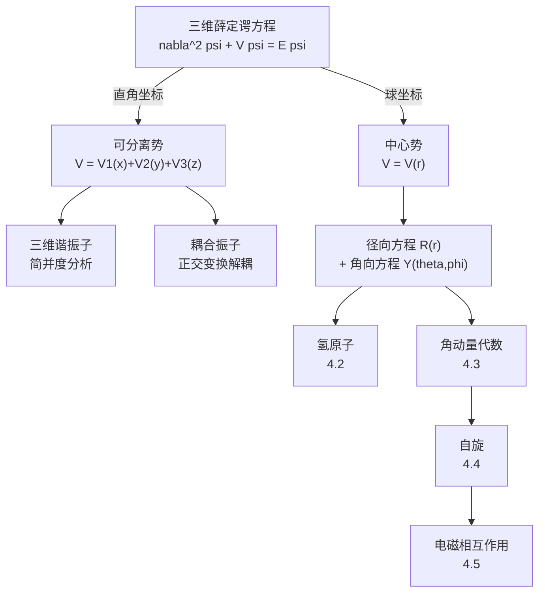

---

## 4.1 三维薛定谔方程

### 4.1.1 从一维到三维：一般形式

在一维中，定态薛定谔方程为：

$$-\frac{\hbar^2}{2m}\frac{d^2\psi}{dx^2} + V(x)\psi = E\psi$$

推广到三维，只需将一维二阶导数替换为**拉普拉斯算符** $\nabla^2$：

$$\boxed{-\frac{\hbar^2}{2m}\nabla^2\psi + V(\mathbf{r})\psi = E\psi}$$

其中 $\nabla^2$ 在不同坐标系中有不同的表达式：

**直角坐标系** $(x, y, z)$：

$$\nabla^2 = \frac{\partial^2}{\partial x^2} + \frac{\partial^2}{\partial y^2} + \frac{\partial^2}{\partial z^2}$$

**球坐标系** $(r, \theta, \phi)$：

$$\nabla^2 = \frac{1}{r^2}\frac{\partial}{\partial r}\left(r^2 \frac{\partial}{\partial r}\right) + \frac{1}{r^2\sin\theta}\frac{\partial}{\partial \theta}\left(\sin\theta \frac{\partial}{\partial \theta}\right) + \frac{1}{r^2\sin^2\theta}\frac{\partial^2}{\partial \phi^2}$$

选择哪种坐标系，取决于势能 $V(\mathbf{r})$ 的对称性。这是三维问题的第一条原则：

> **核心原则**：选择与势能对称性匹配的坐标系，使得薛定谔方程可以分离变量。

含时波函数仍然是 $\Psi(\mathbf{r}, t) = \psi(\mathbf{r})e^{-iEt/\hbar}$，归一化条件变为三维积分：

$$\int |\psi(\mathbf{r})|^2 d^3\mathbf{r} = 1$$

### 4.1.2 直角坐标系下的分离变量

当势能可以写成三个方向独立贡献之和时：

$$V(x, y, z) = V_1(x) + V_2(y) + V_3(z)$$

我们可以假设波函数也是可分离的：

$$\psi(x, y, z) = X(x)Y(y)Z(z)$$

将此代入三维薛定谔方程，两边除以 $XYZ$：

$$\underbrace{-\frac{\hbar^2}{2m}\frac{1}{X}\frac{d^2X}{dx^2} + V_1(x)}_{\text{只含 }x} + \underbrace{-\frac{\hbar^2}{2m}\frac{1}{Y}\frac{d^2Y}{dy^2} + V_2(y)}_{\text{只含 }y} + \underbrace{-\frac{\hbar^2}{2m}\frac{1}{Z}\frac{d^2Z}{dz^2} + V_3(z)}_{\text{只含 }z} = E$$

三个独立变量之和等于常数，每一部分必须分别等于常数。令 $E = E_x + E_y + E_z$，得到**三个独立的一维薛定谔方程**：

$$\boxed{-\frac{\hbar^2}{2m}\frac{d^2X}{dx^2} + V_1(x)X = E_x X}$$

$$-\frac{\hbar^2}{2m}\frac{d^2Y}{dy^2} + V_2(y)Y = E_y Y$$

$$-\frac{\hbar^2}{2m}\frac{d^2Z}{dz^2} + V_3(z)Z = E_z Z$$

**这就是直角坐标分离变量的威力**：三维问题完全分解为三个一维问题，而一维问题的求解方法我们在第2章已经掌握。总能量是三个分量之和 $E = E_x + E_y + E_z$，总波函数是三个分量之积 $\psi = X(x)Y(y)Z(z)$。

### 4.1.3 三维谐振子（直角坐标解法）

三维谐振子的势能为：

$$V(x, y, z) = \frac{1}{2}m(\omega_x^2 x^2 + \omega_y^2 y^2 + \omega_z^2 z^2)$$

这是一个可分离势，$V_1 = \frac{1}{2}m\omega_x^2 x^2$，$V_2 = \frac{1}{2}m\omega_y^2 y^2$，$V_3 = \frac{1}{2}m\omega_z^2 z^2$。

利用第2章一维谐振子的结果，每个方向的能量为：

$$E_x = \left(n_x + \frac{1}{2}\right)\hbar\omega_x, \quad E_y = \left(n_y + \frac{1}{2}\right)\hbar\omega_y, \quad E_z = \left(n_z + \frac{1}{2}\right)\hbar\omega_z$$

其中 $n_x, n_y, n_z = 0, 1, 2, \ldots$。总能量为：

$$\boxed{E_{n_x n_y n_z} = \left(n_x + \frac{1}{2}\right)\hbar\omega_x + \left(n_y + \frac{1}{2}\right)\hbar\omega_y + \left(n_z + \frac{1}{2}\right)\hbar\omega_z}$$

总波函数为三个一维谐振子波函数之积：

$$\psi_{n_x n_y n_z}(x,y,z) = \psi_{n_x}(x) \cdot \psi_{n_y}(y) \cdot \psi_{n_z}(z)$$

#### 各向同性谐振子与简并

当三个方向的频率相同 $\omega_x = \omega_y = \omega_z \equiv \omega$ 时，势能具有球对称性，称为**各向同性谐振子**。此时总能量简化为：

$$\boxed{E_N = \left(N + \frac{3}{2}\right)\hbar\omega, \quad N \equiv n_x + n_y + n_z = 0, 1, 2, \ldots}$$

对于给定的 $N$，不同的 $(n_x, n_y, n_z)$ 组合给出相同的能量——这就是**简并**。

**简并度的计算**：对于给定的 $N$，需要数满足 $n_x + n_y + n_z = N$（$n_x, n_y, n_z \ge 0$）的非负整数解的个数。固定 $n_x = k$（$0 \le k \le N$），则 $n_y + n_z = N - k$，有 $N - k + 1$ 种选法。总数为：

$$d(N) = \sum_{k=0}^{N}(N - k + 1) = \sum_{j=1}^{N+1} j = \frac{(N+1)(N+2)}{2}$$

$$\boxed{d(N) = \frac{(N+1)(N+2)}{2}}$$

| $N$ | 能量 $E_N$ | $(n_x, n_y, n_z)$ 的组合 | 简并度 $d(N)$ |
|-----|-----------|------------------------|-------------|
| 0 | $\frac{3}{2}\hbar\omega$ | $(0,0,0)$ | 1 |
| 1 | $\frac{5}{2}\hbar\omega$ | $(1,0,0),\,(0,1,0),\,(0,0,1)$ | 3 |
| 2 | $\frac{7}{2}\hbar\omega$ | $(2,0,0),\,(0,2,0),\,(0,0,2),\,(1,1,0),\,(1,0,1),\,(0,1,1)$ | 6 |
| 3 | $\frac{9}{2}\hbar\omega$ | 10种组合 | 10 |

> **物理根源**：简并的根源是**对称性**。各向同性谐振子具有完全的旋转对称性（$SO(3)$），不同方向是等价的，因此多个不同的量子态共享同一能量。这是第6章将深入探讨的主题。

#### 各向异性谐振子

当三个方向频率不全相同时，简并可能部分或完全解除。

**例：二维谐振子** $\omega_x = \omega_y \equiv \omega$，$\omega_z$ 不同。总能量为：

$$E = (n_x + n_y + 1)\hbar\omega + \left(n_z + \frac{1}{2}\right)\hbar\omega_z$$

$xy$ 平面内仍有简并（因为 $\omega_x = \omega_y$），但 $z$ 方向的量子数独立。

**例：完全非简并**。若 $\omega_x, \omega_y, \omega_z$ 两两不可公度（即 $\omega_i/\omega_j$ 为无理数），则不存在不同量子数组合给出相同能量的情况，所有能级均不简并。

---

### 习题 4.1

**(a)** 质量为 $m$ 的粒子处于三维各向同性谐振子势 $V = \frac{1}{2}m\omega^2(x^2+y^2+z^2)$ 中。写出基态和第一激发态的能量与（归一化的）波函数。

**(b)** 计算 $N = 4$ 能级的简并度，并列出所有 $(n_x, n_y, n_z)$ 组合。

**(c)** 证明各向同性谐振子第 $N$ 级的简并度为 $\frac{(N+1)(N+2)}{2}$。

---

### 习题 4.2（思考题）

一个三维谐振子的三个方向频率比为 $\omega_x : \omega_y : \omega_z = 1 : 2 : 3$。

**(a)** 写出能量的一般表达式。

**(b)** 求出前5个能级的能量值（以 $\hbar\omega_x$ 为单位），并标注各能级的简并度。

**(c)** 与各向同性情况相比，对称性的降低如何影响简并结构？

---

### 4.1.4 平移势能中心：配方法

在很多实际问题中，势能除了二次项还包含线性项。例如，在外加均匀电场 $\mathcal{E}$ 的方向（设为 $z$ 方向）上，谐振子势变为：

$$V = \frac{1}{2}m\omega^2 z^2 + qz\mathcal{E} = \frac{1}{2}m\omega^2 z^2 + fz$$

其中 $f = q\mathcal{E}$ 是线性项的系数。

**配方法**：将线性项通过配方消去：

$$V = \frac{1}{2}m\omega^2\left(z^2 + \frac{2f}{m\omega^2}z\right) = \frac{1}{2}m\omega^2\left(z + \frac{f}{m\omega^2}\right)^2 - \frac{f^2}{2m\omega^2}$$

定义新坐标 $z' = z + \frac{f}{m\omega^2} \equiv z - z_0$，其中 $z_0 = -\frac{f}{m\omega^2}$ 是平衡位置的偏移量。则：

$$V = \frac{1}{2}m\omega^2 z'^2 + \text{const}$$

这就是一个**中心平移**到 $z_0$ 的标准谐振子！能量仅增加一个常数：

$$\boxed{E_{n_z} = \left(n_z + \frac{1}{2}\right)\hbar\omega - \frac{f^2}{2m\omega^2}}$$

> **物理图景**：外加电场将谐振子的平衡位置从原点推移到 $z_0$，同时将所有能级整体下移了 $\frac{f^2}{2m\omega^2}$。但**能级间距不变**——量子数仍然标记为 $n_z = 0, 1, 2, \ldots$，相邻能级之差仍为 $\hbar\omega$。

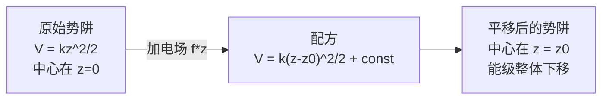

---

### 习题 4.3

一个质量为 $m$ 的带电粒子（电荷 $q$）处于三维各向同性谐振子势中，同时受到沿 $z$ 方向的均匀电场 $\mathcal{E}$。

**(a)** 写出总势能，并用配方法化简。

**(b)** 求能量本征值的完整表达式。

**(c)** 电场是否改变了能级的简并度？说明理由。

---

### 4.1.5 耦合振子与坐标旋转

#### 问题的提出

考虑一个更复杂的二维势能：

$$V(x, y) = \frac{1}{2}m\omega^2(x^2 + y^2) + m\omega^2\lambda xy$$

其中 $\lambda$ 是无量纲耦合常数（$|\lambda| < 1$ 以保证势能正定）。由于存在**交叉项** $\lambda xy$，变量 $x$ 和 $y$ 不能直接分离。

这类问题在物理中非常常见：两个振子通过弹簧耦合、分子中原子的耦合振动等。处理的核心思路是：**将二次型对角化**。

#### 矩阵表述与对角化

将势能写成矩阵形式：

$$V = \frac{1}{2}m\omega^2 \begin{pmatrix} x & y \end{pmatrix} \begin{pmatrix} 1 & \lambda \\ \lambda & 1 \end{pmatrix} \begin{pmatrix} x \\ y \end{pmatrix}$$

势能矩阵为：

$$\mathbf{M} = \begin{pmatrix} 1 & \lambda \\ \lambda & 1 \end{pmatrix}$$

要消除耦合，需要对 $\mathbf{M}$ 进行**正交对角化**。求特征值：

$$\det(\mathbf{M} - \mu \mathbf{I}) = (1-\mu)^2 - \lambda^2 = 0 \implies \mu = 1 \pm \lambda$$

特征值为 $\mu_1 = 1 + \lambda$ 和 $\mu_2 = 1 - \lambda$。由于 $|\lambda| < 1$，两个特征值均为正——**势能确实是正定的**。

对应的归一化特征向量为：

$$\mathbf{v}_1 = \frac{1}{\sqrt{2}}\begin{pmatrix} 1 \\ 1 \end{pmatrix}, \quad \mathbf{v}_2 = \frac{1}{\sqrt{2}}\begin{pmatrix} 1 \\ -1 \end{pmatrix}$$

#### 主轴旋转（正交变换）

定义新坐标（简正坐标）：

$$\begin{pmatrix} u \\ v \end{pmatrix} = \frac{1}{\sqrt{2}}\begin{pmatrix} 1 & 1 \\ 1 & -1 \end{pmatrix}\begin{pmatrix} x \\ y \end{pmatrix}$$

即 $u = \frac{x+y}{\sqrt{2}}$，$v = \frac{x-y}{\sqrt{2}}$。这是一个**旋转 $45°$** 的正交变换。

在新坐标下，势能变为对角形式：

$$V = \frac{1}{2}m\omega^2\left[(1+\lambda)u^2 + (1-\lambda)v^2\right] = \frac{1}{2}m\omega_u^2 u^2 + \frac{1}{2}m\omega_v^2 v^2$$

其中：

$$\boxed{\omega_u = \omega\sqrt{1+\lambda}, \quad \omega_v = \omega\sqrt{1-\lambda}}$$

交叉项消失了！在简正坐标下，系统变成了两个**独立的**谐振子，称为**简正模**（Normal Modes）。

#### 简正模的物理图景

- **模式 1**（坐标 $u = \frac{x+y}{\sqrt{2}}$）：两个振子**同相振动**，频率 $\omega_u = \omega\sqrt{1+\lambda}$。
- **模式 2**（坐标 $v = \frac{x-y}{\sqrt{2}}$）：两个振子**反相振动**，频率 $\omega_v = \omega\sqrt{1-\lambda}$。

若 $\lambda > 0$（耦合为排斥型），同相模频率较高，反相模频率较低；若 $\lambda < 0$（耦合为吸引型），则相反。

#### 能量本征值

直接利用一维谐振子结果：

$$\boxed{E_{n_u, n_v} = \left(n_u + \frac{1}{2}\right)\hbar\omega\sqrt{1+\lambda} + \left(n_v + \frac{1}{2}\right)\hbar\omega\sqrt{1-\lambda}}$$

波函数在简正坐标下为：

$$\psi_{n_u, n_v}(u, v) = \psi_{n_u}^{(\omega_u)}(u) \cdot \psi_{n_v}^{(\omega_v)}(v)$$

其中 $\psi_n^{(\omega)}$ 是频率为 $\omega$ 的一维谐振子的第 $n$ 个本征态。

> **方法论总结**：遇到含交叉项的二次型势能时，核心步骤为：
> 1. 将势能写成矩阵形式 $V = \frac{1}{2}\mathbf{q}^T \mathbf{M} \mathbf{q}$；
> 2. 对角化矩阵 $\mathbf{M}$，得到特征值和特征向量；
> 3. 用特征向量构造正交变换，定义简正坐标；
> 4. 在简正坐标下，系统化为独立谐振子的叠加。

这正是线性代数教程中学到的**二次型理论**（参见番外 Ch3 二次型）在量子力学中的直接应用。

---

### 习题 4.4

**(a)** 对于二维耦合势 $V = \frac{1}{2}m\omega^2(x^2 + y^2 + \lambda xy)$，直接验证在简正坐标 $u = \frac{x+y}{\sqrt{2}}$，$v = \frac{x-y}{\sqrt{2}}$ 下交叉项确实消失。

**(b)** 当 $\lambda \to 0$ 时，两个简正频率趋于什么？物理上这意味着什么？

**(c)** 当 $|\lambda| \to 1$ 时，其中一个简正频率趋于零。这在物理上意味着什么？（提示：势能在某个方向变得"软"了。）

---

### 习题 4.5（往年考题改编）

一个质量为 $m$ 的非相对论粒子在势场 $U(x,y,z) = A(x^2 + y^2 + 2\lambda xy) + B(z^2 + 2\mu z)$ 中运动，其中 $A > 0$，$B > 0$，$|\lambda| < 1$，$\mu$ 任意。

**(a)** 说明为什么 $z$ 方向可以先与 $xy$ 平面解耦。

**(b)** 对 $z$ 方向使用配方法，对 $xy$ 平面使用坐标旋转法，求出能量本征值的完整表达式。

**(c)** 将你的结果用 $A$、$B$、$\lambda$、$\mu$、$m$、$\hbar$ 以及量子数 $n_u$、$n_v$、$n_z$ 表示。

---

### 4.1.6 球坐标系下的分离变量

#### 为什么需要球坐标？

当势能仅依赖于到原点的距离 $r$，即 $V = V(r)$（**中心势**），直角坐标下的变量**无法分离**——$V(r) = V(\sqrt{x^2+y^2+z^2})$ 将三个变量纠缠在一起。但在球坐标 $(r, \theta, \phi)$ 中，势能只包含 $r$，天然地与角度变量分离。

> 自然界中最重要的中心势包括：库仑势 $V(r) = -e^2/r$（氢原子）、谐振子势 $V(r) = \frac{1}{2}m\omega^2 r^2$、核力势等。

#### 球坐标中的薛定谔方程

在球坐标中，三维薛定谔方程 $-\frac{\hbar^2}{2m}\nabla^2\psi + V(r)\psi = E\psi$ 变为：

$$-\frac{\hbar^2}{2m}\left[\frac{1}{r^2}\frac{\partial}{\partial r}\left(r^2\frac{\partial\psi}{\partial r}\right) + \frac{1}{r^2\sin\theta}\frac{\partial}{\partial\theta}\left(\sin\theta\frac{\partial\psi}{\partial\theta}\right) + \frac{1}{r^2\sin^2\theta}\frac{\partial^2\psi}{\partial\phi^2}\right] + V(r)\psi = E\psi$$

假设波函数可分离为径向部分和角向部分：

$$\psi(r, \theta, \phi) = R(r) \cdot Y(\theta, \phi)$$

代入薛定谔方程，两边乘以 $-\frac{2mr^2}{\hbar^2 RY}$，得到：

$$\underbrace{\frac{1}{R}\frac{d}{dr}\left(r^2\frac{dR}{dr}\right) - \frac{2mr^2}{\hbar^2}\left[V(r) - E\right]}_{\text{只含 } r} = \underbrace{-\frac{1}{Y}\left[\frac{1}{\sin\theta}\frac{\partial}{\partial\theta}\left(\sin\theta\frac{\partial Y}{\partial\theta}\right) + \frac{1}{\sin^2\theta}\frac{\partial^2 Y}{\partial\phi^2}\right]}_{\text{只含 } \theta, \phi}$$

左边只含 $r$，右边只含 $\theta, \phi$，因此两边必须等于同一个常数。按照惯例（也是为了与角动量理论衔接），我们将这个常数记为 $l(l+1)$：

#### 角向方程

$$\boxed{\frac{1}{\sin\theta}\frac{\partial}{\partial\theta}\left(\sin\theta\frac{\partial Y}{\partial\theta}\right) + \frac{1}{\sin^2\theta}\frac{\partial^2 Y}{\partial\phi^2} = -l(l+1)Y}$$

这个方程的解就是著名的**球谐函数** $Y_l^m(\theta, \phi)$。

角向方程可以进一步分离变量。令 $Y(\theta, \phi) = \Theta(\theta)\Phi(\phi)$，代入并乘以 $\frac{\sin^2\theta}{\Theta\Phi}$：

$$\frac{\sin\theta}{\Theta}\frac{d}{d\theta}\left(\sin\theta\frac{d\Theta}{d\theta}\right) + l(l+1)\sin^2\theta = -\frac{1}{\Phi}\frac{d^2\Phi}{d\phi^2}$$

左边只含 $\theta$，右边只含 $\phi$，令两边等于常数 $m^2$。

**$\phi$ 方程**（最简单的分离）：

$$\frac{d^2\Phi}{d\phi^2} = -m^2\Phi \implies \Phi(\phi) = e^{im\phi}$$

物理要求**单值性**（$\Phi(\phi + 2\pi) = \Phi(\phi)$），因此 $m$ 必须是整数：

$$\boxed{m = 0, \pm 1, \pm 2, \ldots}$$

**$\theta$ 方程**（伴随勒让德方程）：

$$\frac{1}{\sin\theta}\frac{d}{d\theta}\left(\sin\theta\frac{d\Theta}{d\theta}\right) + \left[l(l+1) - \frac{m^2}{\sin^2\theta}\right]\Theta = 0$$

这是**伴随勒让德方程**。它的规范解（在 $\theta = 0$ 和 $\theta = \pi$ 处不发散）存在的条件是：

$$\boxed{l = 0, 1, 2, \ldots \quad \text{且} \quad |m| \le l}$$

即 $l$ 为非负整数，$m$ 的取值范围为 $-l, -l+1, \ldots, l-1, l$（共 $2l+1$ 个值）。

解为**伴随勒让德函数** $P_l^m(\cos\theta)$，其定义如下。首先，**勒让德多项式**（$m=0$ 的情况）由罗德里格斯（Rodrigues）公式给出：

$$P_l(x) = \frac{1}{2^l l!}\frac{d^l}{dx^l}(x^2 - 1)^l$$

前几个勒让德多项式为：

| $l$ | $P_l(x)$ |
|-----|-----------|
| 0 | $1$ |
| 1 | $x$ |
| 2 | $\frac{1}{2}(3x^2 - 1)$ |
| 3 | $\frac{1}{2}(5x^3 - 3x)$ |

**伴随勒让德函数**（$m \neq 0$）：

$$P_l^m(x) = (-1)^m (1-x^2)^{|m|/2} \frac{d^{|m|}}{dx^{|m|}} P_l(x)$$

#### 球谐函数

将 $\Theta$ 和 $\Phi$ 合并，归一化后得到**球谐函数**：

$$\boxed{Y_l^m(\theta, \phi) = \epsilon \sqrt{\frac{2l+1}{4\pi}\frac{(l-|m|)!}{(l+|m|)!}} P_l^{|m|}(\cos\theta) \, e^{im\phi}}$$

其中 $\epsilon = (-1)^m$（当 $m \ge 0$ 时），$\epsilon = 1$（当 $m < 0$ 时）。

球谐函数满足正交归一条件：

$$\int_0^{2\pi}\int_0^{\pi} Y_l^m(\theta,\phi)^* Y_{l'}^{m'}(\theta,\phi) \sin\theta \, d\theta \, d\phi = \delta_{ll'}\delta_{mm'}$$

前几个球谐函数：

| $l$ | $m$ | $Y_l^m(\theta, \phi)$ |
|-----|-----|----------------------|
| 0 | 0 | $\frac{1}{\sqrt{4\pi}}$ |
| 1 | 0 | $\sqrt{\frac{3}{4\pi}}\cos\theta$ |
| 1 | $\pm 1$ | $\mp\sqrt{\frac{3}{8\pi}}\sin\theta \, e^{\pm i\phi}$ |
| 2 | 0 | $\sqrt{\frac{5}{16\pi}}(3\cos^2\theta - 1)$ |

> **核心要点**：球谐函数是**与具体势能无关的**。无论中心势 $V(r)$ 是什么形式，角向部分的解永远是球谐函数 $Y_l^m$。差别只在径向部分 $R(r)$。

#### 径向方程

将分离常数 $l(l+1)$ 代回径向部分，得到**径向方程**：

$$\frac{d}{dr}\left(r^2\frac{dR}{dr}\right) - \frac{2mr^2}{\hbar^2}\left[V(r) - E\right]R = l(l+1)R$$

通常引入替换 $u(r) = rR(r)$，将方程化简为更标准的形式。注意 $R = u/r$，$\frac{d}{dr}\left(r^2\frac{dR}{dr}\right) = r\frac{d^2u}{dr^2}$。代入得：

$$\boxed{-\frac{\hbar^2}{2m}\frac{d^2u}{dr^2} + \left[V(r) + \frac{\hbar^2}{2m}\frac{l(l+1)}{r^2}\right]u = Eu}$$

这个方程在形式上**与一维薛定谔方程完全相同**！只是多了一个**有效势**：

$$V_{\text{eff}}(r) = V(r) + \underbrace{\frac{\hbar^2}{2m}\frac{l(l+1)}{r^2}}_{\text{离心势能}}$$

离心势能项 $\frac{\hbar^2 l(l+1)}{2mr^2}$ 是角动量的贡献——它像一堵"离心势垒"，将粒子推离原点。$l$ 越大，势垒越高，粒子越不可能出现在原点附近。

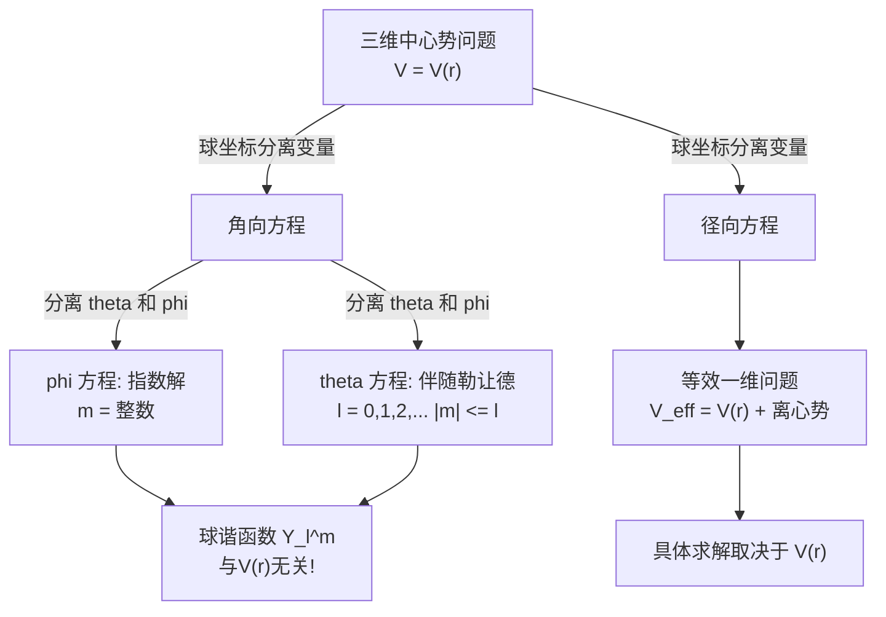

#### 径向方程的边界条件

径向波函数 $u(r) = rR(r)$ 需要满足：

1. **原点处**：$u(0) = 0$（因为 $R(r) = u(r)/r$ 必须在 $r=0$ 有限）。
2. **无穷远处**：$u(r) \to 0$（归一化要求）。

归一化条件变为：

$$\int_0^{\infty} |R(r)|^2 r^2 dr = \int_0^{\infty} |u(r)|^2 dr = 1$$

注意这里的 $r^2 dr$ 因子——它来自球坐标的体积元 $d^3\mathbf{r} = r^2\sin\theta \, dr \, d\theta \, d\phi$。

> **Key Takeaway（4.1 节）**

| 主题 | 核心方法 | 关键结论 |
|------|---------|---------|
| 直角坐标分离 | $V = V_1 + V_2 + V_3$ | 三维 $\to$ 三个独立一维问题 |
| 三维谐振子 | 直接用一维结果 | $E_N = (N+\frac{3}{2})\hbar\omega$，简并度 $\frac{(N+1)(N+2)}{2}$ |
| 配方法 | 消去线性项 | 平移中心，能量加常数，间距不变 |
| 耦合振子 | 二次型对角化 | 简正坐标 $\to$ 独立振子 |
| 球坐标分离 | $\psi = R(r)Y_l^m(\theta,\phi)$ | 角向：球谐函数（通用）；径向：等效一维 |

---

### 习题 4.6

**(a)** 验证 $Y_0^0$、$Y_1^0$、$Y_1^{\pm 1}$ 满足角向方程。

**(b)** 验证 $Y_0^0$ 和 $Y_1^0$ 的正交归一性，即 $\int (Y_0^0)^* Y_1^0 \sin\theta \, d\theta \, d\phi = 0$。

**(c)** 球谐函数在 $l = 1$ 时有多少个独立的函数？它们对应的 $m$ 值是什么？

---

### 习题 4.7（计算题）

利用 $u(r) = rR(r)$ 的替换，详细推导径向方程的标准形式：

$$-\frac{\hbar^2}{2m}\frac{d^2u}{dr^2} + \left[V(r) + \frac{\hbar^2 l(l+1)}{2mr^2}\right]u = Eu$$

提示：先计算 $\frac{d}{dr}\left(r^2\frac{dR}{dr}\right)$ 并用 $R = u/r$ 替换。

---

### 习题 4.8（编程题）

用 Python 可视化球谐函数的角分布。

**(a)** 画出 $|Y_l^m(\theta, \phi)|^2$ 在 $\phi = 0$ 平面内的极坐标图（$r = |Y_l^m|^2$ 作为 $\theta$ 的函数），分别取 $(l, m) = (0,0), (1,0), (1,1), (2,0), (2,1), (2,2)$。

**(b)** 用三维球面图展示 $|Y_2^0|^2$ 和 $|Y_2^1|^2$ 的形状（将 $|Y_l^m|^2$ 映射为球面上的径向距离）。

**(c)** 从你的图中观察：$m = 0$ 的球谐函数有什么几何特征？$|m| = l$ 的呢？

```python
import numpy as np
import matplotlib.pyplot as plt
from scipy.special import sph_harm
from mpl_toolkits.mplot3d import Axes3D

# --- (a) 极坐标图 ---
theta = np.linspace(0, 2 * np.pi, 500)

# 球谐函数 |Y_l^m|^2（scipy 中 sph_harm(m, l, phi, theta)）
# 注意：scipy 的 sph_harm 参数顺序是 (m, l, phi, theta)
# 在 phi=0 平面内，phi = 0
lm_pairs = [(0, 0), (1, 0), (1, 1), (2, 0), (2, 1), (2, 2)]

fig, axes = plt.subplots(2, 3, subplot_kw={'projection': 'polar'}, figsize=(15, 10))
axes = axes.flatten()

for idx, (l, m) in enumerate(lm_pairs):
    # theta 是极角 (0 到 pi)，在极坐标图中我们需要完整的 0 到 2pi
    theta_half = np.linspace(0, np.pi, 300)
    Y = sph_harm(m, l, 0, theta_half)  # phi=0
    r = np.abs(Y)**2

    # 映射到极坐标图: 上半部分 theta_half, 下半部分对称
    theta_full = np.concatenate([theta_half, 2*np.pi - theta_half[::-1]])
    r_full = np.concatenate([r, r[::-1]])

    axes[idx].plot(theta_full, r_full, 'b-', linewidth=2)
    axes[idx].fill(theta_full, r_full, alpha=0.3)
    axes[idx].set_title(f'$|Y_{l}^{m}|^2$', fontsize=14)

plt.tight_layout()
plt.savefig('spherical_harmonics_polar.png', dpi=150)
plt.show()

# --- (b) 三维球面图 ---
theta_3d = np.linspace(0, np.pi, 100)
phi_3d = np.linspace(0, 2*np.pi, 100)
THETA, PHI = np.meshgrid(theta_3d, phi_3d)

fig = plt.figure(figsize=(14, 6))

for idx, (l, m) in enumerate([(2, 0), (2, 1)]):
    Y = sph_harm(m, l, PHI, THETA)
    R = np.abs(Y)**2

    # 球坐标转直角坐标
    X_cart = R * np.sin(THETA) * np.cos(PHI)
    Y_cart = R * np.sin(THETA) * np.sin(PHI)
    Z_cart = R * np.cos(THETA)

    ax = fig.add_subplot(1, 2, idx+1, projection='3d')
    ax.plot_surface(X_cart, Y_cart, Z_cart, cmap='coolwarm', alpha=0.8)
    ax.set_title(f'$|Y_{l}^{m}|^2$', fontsize=14)
    ax.set_xlabel('x')
    ax.set_ylabel('y')
    ax.set_zlabel('z')

plt.tight_layout()
plt.savefig('spherical_harmonics_3d.png', dpi=150)
plt.show()
```

---

## 4.2 氢原子

> **本节核心问题**：如何求解氢原子的径向薛定谔方程？为什么能量只取分立值？为什么 $E_n$ 只依赖于主量子数 $n$？

氢原子是量子力学最辉煌的成就之一。它由一个重质子（固定在原点）和一个轻电子（质量 $m_e$，电荷 $-e$）组成，二者通过库仑引力结合。从库仑定律出发，电子的势能为：

$$V(r) = -\frac{e^2}{4\pi\epsilon_0}\frac{1}{r}$$

这是一个中心势，因此我们可以直接使用 4.1.6 节建立的球坐标分离变量框架。角向部分的解仍然是球谐函数 $Y_l^m(\theta, \phi)$——这一点与具体的中心势无关。真正需要求解的是**径向方程**：

$$-\frac{\hbar^2}{2m_e}\frac{d^2u}{dr^2} + \left[-\frac{e^2}{4\pi\epsilon_0}\frac{1}{r} + \frac{\hbar^2}{2m_e}\frac{l(l+1)}{r^2}\right]u = Eu$$

其中 $u(r) = rR(r)$。对于束缚态（$E < 0$），我们将完整求解这个方程，最终得到量子力学中最著名的结果——玻尔公式。

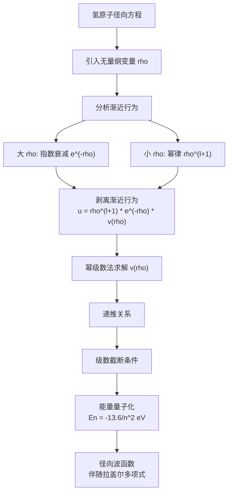

---

### 4.2.1 径向方程的求解：无量纲化与渐近分析

#### 引入无量纲变量

为了整理记号，我们首先引入参数 $\kappa$：

$$\kappa \equiv \frac{\sqrt{-2m_e E}}{\hbar}$$

对于束缚态，$E < 0$，所以 $\kappa$ 是正实数。将径向方程两边除以 $E$（注意 $E < 0$），重新整理后得到：

$$\frac{1}{\kappa^2}\frac{d^2u}{dr^2} = \left[1 - \frac{m_e e^2}{2\pi\epsilon_0\hbar^2\kappa}\cdot\frac{1}{\kappa r} + \frac{l(l+1)}{(\kappa r)^2}\right]u$$

这启示我们引入**无量纲径向坐标**和**无量纲参数**：

$$\boxed{\rho \equiv \kappa r, \quad \rho_0 \equiv \frac{m_e e^2}{2\pi\epsilon_0\hbar^2\kappa}}$$

于是径向方程变为简洁的**无量纲形式**：

$$\boxed{\frac{d^2u}{d\rho^2} = \left[1 - \frac{\rho_0}{\rho} + \frac{l(l+1)}{\rho^2}\right]u}$$

这个方程看起来不复杂，但它包含了 $1/\rho$ 和 $1/\rho^2$ 两种奇异性。直接求解非常困难，我们需要先分析方程在**两个极端区域**的行为，然后"剥离"这些渐近行为，将问题化为更温和的方程。

#### 渐近分析一：大 $\rho$ 行为（$\rho \to \infty$）

当 $\rho \to \infty$ 时，$\rho_0/\rho$ 和 $l(l+1)/\rho^2$ 项都趋于零，方程简化为：

$$\frac{d^2u}{d\rho^2} \approx u$$

通解为 $u(\rho) = Ae^{-\rho} + Be^{+\rho}$。物理要求波函数在无穷远处衰减（归一化条件），所以必须 $B = 0$：

$$u(\rho) \sim Ae^{-\rho}, \quad \rho \to \infty$$

#### 渐近分析二：小 $\rho$ 行为（$\rho \to 0$）

当 $\rho \to 0$ 时，$l(l+1)/\rho^2$ 项占主导（离心势能"爆炸"），方程近似为：

$$\frac{d^2u}{d\rho^2} \approx \frac{l(l+1)}{\rho^2}u$$

可以验证（直接代入检验），通解为 $u(\rho) = C\rho^{l+1} + D\rho^{-l}$。由于 $\rho^{-l}$ 在 $\rho \to 0$ 时发散（当 $l \ge 1$ 时爆炸，当 $l = 0$ 时 $R = u/r$ 也发散），物理上不可接受，必须 $D = 0$：

$$u(\rho) \sim C\rho^{l+1}, \quad \rho \to 0$$

> **物理直觉**：$l$ 越大，波函数在原点附近衰减得越快（$\rho^{l+1}$）。这正是离心势垒的效果——角动量越大，粒子被推得离原点越远。

#### 剥离渐近行为

既然我们知道了 $u(\rho)$ 在两个极端的行为，我们把这些因子"剥出来"，定义一个新函数 $v(\rho)$：

$$\boxed{u(\rho) = \rho^{l+1} e^{-\rho} v(\rho)}$$

$v(\rho)$ 承担着"剩余的"、非渐近的行为。如果一切顺利，$v(\rho)$ 应该比 $u(\rho)$ 更"温和"——它既不需要指数衰减（已被 $e^{-\rho}$ 吸收），也不需要在原点处急剧增长或衰减（已被 $\rho^{l+1}$ 吸收）。

将 $u = \rho^{l+1}e^{-\rho}v$ 代入无量纲径向方程，经过仔细计算（需要计算 $du/d\rho$ 和 $d^2u/d\rho^2$，过程虽然繁琐但只是链式法则的反复应用），得到 $v(\rho)$ 满足的方程：

$$\boxed{\rho\frac{d^2v}{d\rho^2} + 2(l + 1 - \rho)\frac{dv}{d\rho} + [\rho_0 - 2(l+1)]v = 0}$$

> **推导要点**（供有兴趣的读者验证）：
>
> 计算一阶导：$\frac{du}{d\rho} = \rho^l e^{-\rho}\left[(l+1-\rho)v + \rho\frac{dv}{d\rho}\right]$
>
> 计算二阶导：$\frac{d^2u}{d\rho^2} = \rho^l e^{-\rho}\left\{\left[-2l-2+\rho+\frac{l(l+1)}{\rho}\right]v + 2(l+1-\rho)\frac{dv}{d\rho} + \rho\frac{d^2v}{d\rho^2}\right\}$
>
> 代入原方程后，消去公共因子 $\rho^l e^{-\rho}$，整理即得上式。

这个方程已经不含 $1/\rho^2$ 奇异性了（$\rho = 0$ 是一个**正则奇点**），可以用幂级数方法求解。

---

### 4.2.2 幂级数法求解

#### 设定幂级数

假设 $v(\rho)$ 可以展开为幂级数：

$$v(\rho) = \sum_{j=0}^{\infty} c_j \rho^j$$

逐项求导：

$$\frac{dv}{d\rho} = \sum_{j=0}^{\infty} jc_j \rho^{j-1} = \sum_{j=0}^{\infty} (j+1)c_{j+1}\rho^j$$

$$\frac{d^2v}{d\rho^2} = \sum_{j=0}^{\infty} j(j+1)c_{j+1}\rho^{j-1}$$

第二个求导式中，重新标号使得求和指标对齐后，代入 $v(\rho)$ 的方程中。

#### 推导递推关系

将各项代入方程：

$$\sum_{j=0}^{\infty} j(j+1)c_{j+1}\rho^j + 2(l+1)\sum_{j=0}^{\infty}(j+1)c_{j+1}\rho^j - 2\sum_{j=0}^{\infty} jc_j\rho^j + [\rho_0 - 2(l+1)]\sum_{j=0}^{\infty}c_j\rho^j = 0$$

合并 $\rho^j$ 的系数：

$$j(j+1)c_{j+1} + 2(l+1)(j+1)c_{j+1} - 2jc_j + [\rho_0 - 2(l+1)]c_j = 0$$

整理得到**递推关系**：

$$\boxed{c_{j+1} = \frac{2(j + l + 1) - \rho_0}{(j+1)(j + 2l + 2)} c_j}$$

这是本节最重要的公式之一。它完全确定了幂级数的所有系数：给定初始值 $c_0$（由归一化确定），递推关系依次给出 $c_1, c_2, c_3, \ldots$。

#### 级数截断的必要性

现在关键的问题来了：**这个级数是否收敛？如果收敛，收敛到什么？**

观察递推关系在 $j$ 很大时的行为：

$$c_{j+1} \approx \frac{2j}{j(j+1)}c_j = \frac{2}{j+1}c_j$$

这意味着对于大 $j$，$c_j \approx \frac{2^j}{j!}c_0$。因此，级数 $v(\rho) \approx c_0 \sum \frac{2^j}{j!}\rho^j = c_0 e^{2\rho}$。

如果 $v(\rho) \sim e^{2\rho}$，那么：

$$u(\rho) = \rho^{l+1}e^{-\rho}v(\rho) \sim \rho^{l+1}e^{+\rho}$$

这在 $\rho \to \infty$ 时**发散**！波函数不可归一化，物理上不可接受。

> **这不是巧合**：$e^{+\rho}$ 正是我们在渐近分析中舍弃的那个发散解。级数如果不截断，它会"偷偷地"恢复那个被丢弃的行为。

**唯一的出路**：级数必须在某个有限项处**截断**，即存在某个最大整数 $j_{\max} = N$，使得：

$$c_{N+1} = 0 \quad \text{（从而 } c_{N+2} = c_{N+3} = \cdots = 0\text{）}$$

> **注意**：一旦 $c_{N+1} = 0$，递推关系保证此后所有系数都为零（因为分子中 $j$ 递增，不会再使分子回到零），级数变为**有限多项式**。

#### 量子化条件

令 $c_{N+1} = 0$，递推关系的分子必须为零：

$$2(N + l + 1) - \rho_0 = 0$$

定义**主量子数**：

$$\boxed{n \equiv N + l + 1, \quad N = 0, 1, 2, \ldots}$$

其中 $N$ 是级数截断时的最高幂次（即 $v(\rho)$ 是 $N$ 次多项式），$l$ 是角量子数。截断条件变为：

$$\boxed{\rho_0 = 2n}$$

这就是**能量量子化的根源**——只有当 $\rho_0$ 取特定的整数值 $2n$ 时，径向波函数才是物理上可接受的（可归一化的）。

---

### 4.2.3 能量本征值：玻尔公式

#### 从量子化条件到能级公式

参数 $\rho_0$ 与能量 $E$ 的关系为（回顾 $\rho_0$ 和 $\kappa$ 的定义）：

$$\rho_0 = \frac{m_e e^2}{2\pi\epsilon_0\hbar^2\kappa}, \quad \kappa = \frac{\sqrt{-2m_e E}}{\hbar}$$

从 $\rho_0 = 2n$ 出发，解出 $\kappa$：

$$\kappa = \frac{m_e e^2}{4\pi\epsilon_0\hbar^2 n}$$

再由 $E = -\frac{\hbar^2\kappa^2}{2m_e}$，代入得：

$$E_n = -\frac{\hbar^2}{2m_e}\left(\frac{m_e e^2}{4\pi\epsilon_0\hbar^2 n}\right)^2 = -\frac{m_e}{2\hbar^2}\left(\frac{e^2}{4\pi\epsilon_0}\right)^2\frac{1}{n^2}$$

$$\boxed{E_n = -\frac{E_1}{n^2}, \quad n = 1, 2, 3, \ldots}$$

其中**基态能量**（即**结合能**）为：

$$\boxed{E_1 = \frac{m_e}{2\hbar^2}\left(\frac{e^2}{4\pi\epsilon_0}\right)^2 = 13.6 \text{ eV}}$$

这就是举世闻名的**玻尔公式**。玻尔在 1913 年用半经典的方法得到了这个结果（那时薛定谔方程还要等 13 年才出现），而我们现在从第一性原理严格推导了它。

#### 玻尔半径

将 $\kappa = 1/(na)$ 代回 $\rho = \kappa r$，得到 $\rho = r/(na)$，其中：

$$\boxed{a \equiv \frac{4\pi\epsilon_0\hbar^2}{m_e e^2} = 0.529 \times 10^{-10} \text{ m} = 0.529 \text{ \AA}}$$

这就是**玻尔半径**——氢原子的"尺寸"标度。在 $n = 1$ 的基态中，电子的"最可能半径"恰好就是 $a$（这将在习题中验证）。

#### 能级图

前几个能级的具体值为：

| $n$ | $E_n$ (eV) | $E_n/E_1$ |
|-----|-----------|-----------|
| 1 | $-13.6$ | $1$ |
| 2 | $-3.40$ | $1/4$ |
| 3 | $-1.51$ | $1/9$ |
| 4 | $-0.850$ | $1/16$ |
| $\infty$ | $0$ | $0$（电离阈值） |

> **关键特征**：能级间距随 $n$ 增大而迅速减小。从 $n=1$ 到 $n=2$ 的能量差为 $10.2$ eV（紫外线），而从 $n=2$ 到 $n=3$ 仅为 $1.89$ eV（可见光红色区域）。当 $n \to \infty$ 时，无穷多能级挤压在 $E = 0$ 附近，$E = 0$ 以上便是连续谱（电子-质子散射态）。

---

### 4.2.4 径向波函数

#### 伴随拉盖尔多项式

截断后的多项式 $v(\rho)$ 是一个已知的特殊函数——**伴随拉盖尔多项式**。具体地：

$$v(\rho) = L_{n-l-1}^{2l+1}(2\rho)$$

其中**伴随拉盖尔多项式**定义为：

$$\boxed{L_q^p(x) \equiv (-1)^p \left(\frac{d}{dx}\right)^p L_{p+q}(x)}$$

而**拉盖尔多项式**为：

$$L_q(x) \equiv \frac{e^x}{q!}\left(\frac{d}{dx}\right)^q(e^{-x}x^q)$$

前几个拉盖尔多项式为：

| $q$ | $L_q(x)$ |
|-----|-----------|
| 0 | $1$ |
| 1 | $-x + 1$ |
| 2 | $\frac{1}{2}x^2 - 2x + 1$ |
| 3 | $-\frac{1}{6}x^3 + \frac{3}{2}x^2 - 3x + 1$ |

前几个伴随拉盖尔多项式为：

| $(q, p)$ | $L_q^p(x)$ |
|----------|-----------|
| $(0, 1)$ | $1$ |
| $(1, 1)$ | $-x + 2$ |
| $(0, 3)$ | $1$ |
| $(1, 3)$ | $-x + 4$ |

#### 归一化的径向波函数

综合以上所有结果，归一化的氢原子波函数为：

$$\boxed{\psi_{nlm}(r,\theta,\phi) = \sqrt{\left(\frac{2}{na}\right)^3 \frac{(n-l-1)!}{2n[(n+l)!]^3}} \; e^{-r/(na)} \left(\frac{2r}{na}\right)^l \left[L_{n-l-1}^{2l+1}\!\left(\frac{2r}{na}\right)\right] Y_l^m(\theta,\phi)}$$

其中径向部分为：

$$R_{nl}(r) = \sqrt{\left(\frac{2}{na}\right)^3 \frac{(n-l-1)!}{2n[(n+l)!]^3}} \; e^{-r/(na)} \left(\frac{2r}{na}\right)^l L_{n-l-1}^{2l+1}\!\left(\frac{2r}{na}\right)$$

#### 前几个径向波函数的具体表达式

以下列出常用的径向波函数（$a$ 为玻尔半径）：

**$n = 1$：**

$$\boxed{R_{10}(r) = 2a^{-3/2}\,e^{-r/a}}$$

**$n = 2$：**

$$\boxed{R_{20}(r) = \frac{1}{\sqrt{2}}\,a^{-3/2}\left(1 - \frac{r}{2a}\right)e^{-r/(2a)}}$$

$$\boxed{R_{21}(r) = \frac{1}{2\sqrt{6}}\,a^{-3/2}\,\frac{r}{a}\,e^{-r/(2a)}}$$

**$n = 3$：**

$$R_{30}(r) = \frac{2}{3\sqrt{3}}\,a^{-3/2}\left(1 - \frac{2r}{3a} + \frac{2r^2}{27a^2}\right)e^{-r/(3a)}$$

$$R_{31}(r) = \frac{8}{27\sqrt{6}}\,a^{-3/2}\left(1 - \frac{r}{6a}\right)\frac{r}{a}\,e^{-r/(3a)}$$

$$R_{32}(r) = \frac{4}{81\sqrt{30}}\,a^{-3/2}\left(\frac{r}{a}\right)^2 e^{-r/(3a)}$$

> **规律总结**：
> - $R_{nl}$ 中的多项式部分是 $n - l - 1$ 次多项式（乘以 $r^l$），所以总共有 $n - l - 1$ 个径向零点（节点）。
> - 指数衰减因子为 $e^{-r/(na)}$，$n$ 越大，波函数在空间中延伸得越远。
> - $r^l$ 因子使得 $l > 0$ 的波函数在原点处为零，$l$ 越大，波函数离原点越远——这是离心势垒的体现。

#### 径向概率密度的物理意义

在球坐标中，找到电子在 $r$ 到 $r + dr$ 之间（不论方向）的概率为：

$$P(r)\,dr = |R_{nl}|^2 r^2\,dr \cdot \underbrace{\int |Y_l^m|^2 d\Omega}_{= 1}$$

因此**径向概率密度**为：

$$\boxed{P(r) = |R_{nl}(r)|^2 r^2}$$

注意 $r^2$ 因子的重要性——它来自球坐标的体积元 $d^3\mathbf{r} = r^2 \sin\theta\,dr\,d\theta\,d\phi$。即使 $|R_{nl}|^2$ 在原点处最大（如 $R_{10}$），$r^2$ 因子在 $r = 0$ 处为零，使得径向概率密度 $P(r)$ 在原点为零。

> **$P(r)$ 与 $|R_{nl}|^2$ 的区别**：$|R_{nl}|^2$ 是波函数的径向部分的模方，而 $P(r) = |R_{nl}|^2 r^2$ 才是"在半径 $r$ 处球壳上找到电子"的概率密度。前者的最大值不一定在后者的最大值处。

**基态 $\psi_{100}$ 的例子**：

$$P_{10}(r) = |R_{10}|^2 r^2 = 4a^{-3}r^2 e^{-2r/a}$$

对 $r$ 求导令其为零：$\frac{dP_{10}}{dr} = 4a^{-3}(2r - 2r^2/a)e^{-2r/a} = 0$，解得**最可能半径** $r_{\text{mp}} = a$（玻尔半径）。

而**期望值** $\langle r \rangle$ 的计算给出：

$$\langle r \rangle_{10} = \int_0^{\infty} r \cdot P_{10}(r)\,dr = 4a^{-3}\int_0^{\infty}r^3 e^{-2r/a}dr = 4a^{-3}\cdot\frac{3!}{(2/a)^4} = \frac{3}{2}a$$

注意 $\langle r \rangle = \frac{3}{2}a > r_{\text{mp}} = a$——期望值被概率分布的长尾拉向了更大的 $r$ 值。

---

### 4.2.5 量子数系统总结

氢原子的每一个定态由三个量子数 $(n, l, m)$ 唯一标记：

$$\psi_{nlm}(r, \theta, \phi) = R_{nl}(r)\,Y_l^m(\theta, \phi)$$

| 量子数 | 名称 | 取值范围 | 物理意义 |
|-------|------|---------|---------|
| $n$ | 主量子数 | $n = 1, 2, 3, \ldots$ | 决定**能量** $E_n = -13.6/n^2$ eV，也决定波函数的整体"尺寸"（$\sim na$） |
| $l$ | 角量子数（轨道量子数） | $l = 0, 1, 2, \ldots, n-1$ | 决定**轨道角动量大小** $L = \sqrt{l(l+1)}\,\hbar$，也决定波函数的"形状"（径向节点数 $= n - l - 1$） |
| $m$ | 磁量子数 | $m = -l, -l+1, \ldots, l-1, l$ | 决定**角动量在 $z$ 方向的分量** $L_z = m\hbar$，也决定波函数的方位角依赖 |

**量子数之间的约束关系**：

$$1 \le n, \quad 0 \le l \le n - 1, \quad -l \le m \le l$$

> **为什么 $l$ 不能等于 $n$？** 因为 $l = n$ 意味着 $N = n - l - 1 = -1$，即多项式 $v(\rho)$ 的次数为负数，这没有意义（级数从 $c_0$ 开始，至少是零次多项式）。

**光谱学记号**：历史原因，$l = 0, 1, 2, 3, 4, \ldots$ 分别用字母 $s, p, d, f, g, \ldots$ 表示。例如，$(n, l) = (3, 2)$ 态记为 $3d$。

| $l$ | 0 | 1 | 2 | 3 | 4 | $\ldots$ |
|-----|---|---|---|---|---|----------|
| 字母 | $s$ | $p$ | $d$ | $f$ | $g$ | 按字母序 |
| 名称来源 | sharp | principal | diffuse | fundamental | — | — |

---

### 4.2.6 简并度

#### $n^2$ 重简并

对于给定的主量子数 $n$，能量 $E_n$ 不依赖于 $l$ 和 $m$。因此，所有具有相同 $n$ 但不同 $(l, m)$ 的态共享同一能量。

$l$ 的取值范围为 $0, 1, \ldots, n-1$。对于每个 $l$，$m$ 有 $2l + 1$ 个取值。因此**总简并度**为：

$$d(n) = \sum_{l=0}^{n-1}(2l+1)$$

利用求和公式 $\sum_{l=0}^{n-1}(2l+1) = 2\cdot\frac{(n-1)n}{2} + n = n^2$：

$$\boxed{d(n) = n^2}$$

| $n$ | $l$ 的取值 | 各 $l$ 的 $m$ 个数 | 总态数 $d(n)$ |
|-----|---------|----------------|------------|
| 1 | 0 | 1 | **1** |
| 2 | 0, 1 | 1 + 3 | **4** |
| 3 | 0, 1, 2 | 1 + 3 + 5 | **9** |
| 4 | 0, 1, 2, 3 | 1 + 3 + 5 + 7 | **16** |

> **注意**：如果考虑电子自旋（$m_s = \pm 1/2$），每个轨道态可容纳两个电子，总简并度变为 $2n^2$。这在第5章讨论原子结构时非常重要。

#### 简并的物理根源

氢原子的简并包含两个层次：

**1. 球对称性导致的简并（$m$ 简并）**：任何中心势 $V(r)$ 都具有旋转对称性，能量不依赖于 $m$。对于给定的 $l$，有 $2l+1$ 个磁量子数 $m$ 对应相同的能量。这是所有中心势的通用特征。

**2. 库仑势的额外简并（$l$ 简并）**：在氢原子中，能量不仅不依赖于 $m$，还**不依赖于 $l$**。这不是一般中心势都有的性质——例如，在无限深球形势阱中，不同 $l$ 的态具有不同的能量。

这种额外的简并被称为**"偶然简并"**（accidental degeneracy），但实际上它并不偶然。它的深层原因是库仑势具有比一般中心势更高的对称性——除了通常的 $SO(3)$ 旋转对称性外，还有一个隐藏的对称性，与**龙格-楞次矢量**（Runge-Lenz vector）守恒有关。数学上，这对应于一个更大的对称群 $SO(4)$。这个话题将在第6章对称性与守恒定律中详细讨论。

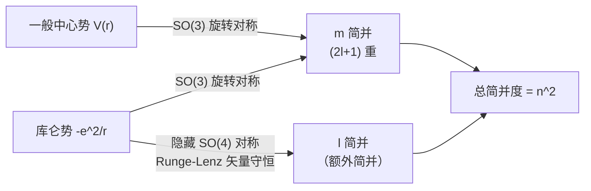

---

### 4.2.7 氢原子光谱

#### 跃迁与光子发射

当氢原子从高能级 $n_i$ 跃迁到低能级 $n_f$（$n_i > n_f$）时，释放一个光子，其能量等于两能级之差：

$$E_{\gamma} = E_{n_i} - E_{n_f} = -13.6\text{ eV}\left(\frac{1}{n_i^2} - \frac{1}{n_f^2}\right) = 13.6\text{ eV}\left(\frac{1}{n_f^2} - \frac{1}{n_i^2}\right)$$

由普朗克关系 $E_{\gamma} = h\nu$ 和 $\lambda = c/\nu$，光子的波长满足**里德伯公式**：

$$\boxed{\frac{1}{\lambda} = \mathcal{R}\left(\frac{1}{n_f^2} - \frac{1}{n_i^2}\right)}$$

其中**里德伯常数**为：

$$\boxed{\mathcal{R} = \frac{m_e}{4\pi c\hbar^3}\left(\frac{e^2}{4\pi\epsilon_0}\right)^2 = 1.097 \times 10^7 \text{ m}^{-1}}$$

#### 光谱线系

根据末态 $n_f$ 的不同，氢原子光谱分为若干**线系**：

| 线系名称 | 末态 $n_f$ | 初态 $n_i$ | 波长范围 | 发现者 |
|---------|---------|---------|--------|------|
| **莱曼系** (Lyman) | 1 | 2, 3, 4, ... | 紫外线（91.2 -- 121.6 nm） | 莱曼 (1906) |
| **巴尔末系** (Balmer) | 2 | 3, 4, 5, ... | 可见光--近紫外（364.6 -- 656.3 nm） | 巴尔末 (1885) |
| **帕邢系** (Paschen) | 3 | 4, 5, 6, ... | 近红外（820.4 -- 1875 nm） | 帕邢 (1908) |
| **布拉开系** (Brackett) | 4 | 5, 6, 7, ... | 红外 | 布拉开 (1922) |
| **普丰德系** (Pfund) | 5 | 6, 7, 8, ... | 远红外 | 普丰德 (1924) |

> **历史注记**：巴尔末系是最先被发现的，因为它的几条谱线落在人眼可见的范围内。巴尔末在 1885 年凭经验找到了公式 $\lambda = B\frac{n^2}{n^2 - 4}$（$n = 3, 4, 5, \ldots$），这比玻尔的理论早了近 30 年。量子力学的伟大之处在于：它不仅重现了巴尔末公式，还从**第一性原理**预言了里德伯常数 $\mathcal{R}$ 的精确数值，与实验吻合到小数点后若干位。

**莱曼系的系限**：当 $n_i \to \infty$ 时，$1/\lambda = \mathcal{R}(1 - 0) = \mathcal{R}$，对应 $\lambda_{\min} = 91.2$ nm。能量更高的光子（$\lambda < 91.2$ nm）会直接电离氢原子。

**巴尔末系的著名谱线**：

| 谱线 | $n_i$ | 波长 (nm) | 颜色 |
|-----|-------|---------|------|
| $H_\alpha$ | 3 | 656.3 | 红 |
| $H_\beta$ | 4 | 486.1 | 青蓝 |
| $H_\gamma$ | 5 | 434.0 | 蓝紫 |
| $H_\delta$ | 6 | 410.2 | 紫 |

> **天文学中的氢原子**：氢是宇宙中最丰富的元素。$H_\alpha$ 线（656.3 nm）是天文观测中最常用的谱线之一。通过测量遥远星系中 $H_\alpha$ 线的红移，天文学家可以测定星系的退行速度，从而推断宇宙的膨胀。

---

> **Key Takeaway（4.2 节）**

| 主题 | 核心方法 | 关键结论 |
|------|---------|---------|
| 无量纲化 | $\rho = \kappa r$，$\rho_0 = m_e e^2/(2\pi\epsilon_0\hbar^2\kappa)$ | 化简径向方程为标准形式 |
| 渐近分析 | 大 $\rho$：$e^{-\rho}$；小 $\rho$：$\rho^{l+1}$ | 剥离渐近行为，简化方程 |
| 幂级数截断 | 级数发散 $\Rightarrow$ 必须截断 | 量子化条件 $\rho_0 = 2n$ |
| 能级公式 | $E_n = -13.6/n^2$ eV | 玻尔公式，$n = 1, 2, 3, \ldots$ |
| 波函数 | $R_{nl} \propto r^l e^{-r/(na)} L_{n-l-1}^{2l+1}(2r/(na))$ | 伴随拉盖尔多项式 |
| 概率密度 | $P(r) = \|R_{nl}\|^2 r^2$ | 最可能半径 $\neq$ 期望值 $\langle r \rangle$ |
| 量子数 | $n, l, m$，约束 $0 \le l \le n-1$，$\|m\| \le l$ | 三量子数完全标记态 |
| 简并度 | $d(n) = n^2$ | 球对称 + 库仑势隐藏对称性 |
| 氢原子光谱 | $1/\lambda = \mathcal{R}(1/n_f^2 - 1/n_i^2)$ | 莱曼系（UV）、巴尔末系（可见光）等 |

---

### 习题 4.9

**(概念理解)** 关于氢原子量子数的以下陈述，判断正误并说明理由：

**(a)** $n = 3$ 的能级有 9 个简并态。

**(b)** 态 $(n, l, m) = (2, 2, 1)$ 是物理上允许的量子态。

**(c)** 在基态 $\psi_{100}$ 中，电子最可能出现在原点。

**(d)** 氢原子能级的 $n^2$ 简并完全来自于势能的球对称性。

**(e)** 如果将库仑势替换为另一个中心势 $V(r)$（非库仑），能量仍然只依赖于 $n$。

---

### 习题 4.10

**(计算题)** 对于氢原子 $n = 2$，$l = 0$ 的态，径向波函数为：

$$R_{20}(r) = \frac{1}{(2a)^{3/2}}\left(2 - \frac{r}{a}\right)e^{-r/(2a)}$$

**(a)** 验证 $R_{20}$ 满足归一化条件 $\int_0^{\infty}|R_{20}|^2 r^2\,dr = 1$。

提示：利用 $\int_0^{\infty}r^n e^{-\alpha r}dr = n!/\alpha^{n+1}$。

**(b)** 计算 $\langle r \rangle$，即径向坐标的期望值。

提示：$\langle r \rangle = \int_0^{\infty} r \cdot |R_{20}|^2 r^2\,dr$。

**(c)** 求径向概率密度 $P(r) = |R_{20}|^2 r^2$ 取极大值时的 $r$ 值。方程不要求解析解，可以用数值方法或图解法（指出近似位置即可）。

**(d)** 比较 $\langle r \rangle$ 与径向概率密度极大值的位置，解释为什么它们不相等。

---

### 习题 4.11

**(计算题)** 氢原子在 $n = 2$ 能级有 4 个简并态：$\psi_{200}$、$\psi_{211}$、$\psi_{210}$、$\psi_{21-1}$。

**(a)** 写出 $\psi_{200}$、$\psi_{210}$、$\psi_{211}$ 的完整表达式（包含径向和角向部分）。

**(b)** 计算巴尔末系 $H_\alpha$ 线（$n_i = 3 \to n_f = 2$）的波长，并与实验值 656.3 nm 比较。

**(c)** 类氢离子（核电荷为 $Ze$，单个电子）的能级公式为 $E_n(Z) = -Z^2 E_1/n^2$。对于 $\text{He}^+$（$Z = 2$），计算基态能量和电离能。

---

### 习题 4.12

**(思考题)**

**(a)** 在无限深球形势阱中（$V = 0$ 当 $r < a$，$V = \infty$ 当 $r > a$），不同 $l$ 的态是否具有相同的能量？这与氢原子的 $l$ 简并有何根本区别？

**(b)** 氢原子的 $n^2$ 简并与一个隐藏的守恒量——龙格-楞次矢量（Runge-Lenz vector）有关。在经典力学中，什么样的势场下才存在这个守恒量？（提示：考虑封闭轨道条件。）

**(c)** 如果在氢原子势能中加入一个微小的非库仑修正项（如 $V' = \beta/r^2$），$n^2$ 简并是否完全解除？哪些简并保留，哪些被打破？

---

### 习题 4.13

**(思考题)** 氢原子径向波函数 $R_{nl}$ 有 $n - l - 1$ 个节点（零点）。

**(a)** 验证 $R_{10}$、$R_{20}$、$R_{21}$ 的节点数符合这个规律。

**(b)** 从 $v(\rho) = L_{n-l-1}^{2l+1}(2\rho)$ 的多项式次数出发，解释为什么节点数恰好是 $n - l - 1$。

**(c)** 利用节点定理（在一维束缚态问题中，第 $k$ 个激发态的波函数恰好有 $k$ 个节点），解释为什么当 $l$ 固定时，$R_{nl}$ 的节点数随 $n$ 增加而增加。

---

### 习题 4.14（编程题）

用 Python 数值可视化氢原子径向概率密度 $P(r) = |R_{nl}(r)|^2 r^2$。

**(a)** 画出 $n = 1, 2, 3$（取所有允许的 $l$ 值）的径向概率密度 $P(r)$ 随 $r/a$ 的变化曲线。每个 $n$ 画一个子图，不同 $l$ 用不同颜色。

**(b)** 在图上标注各曲线的峰值位置（最可能半径），与玻尔模型的"轨道半径" $r_n = n^2 a$ 进行比较。

**(c)** 计算并输出 $\langle r \rangle$ 和 $\langle r^2 \rangle$ 的数值结果（用数值积分验证解析公式 $\langle r \rangle = \frac{a}{2}[3n^2 - l(l+1)]$）。

```python
import numpy as np
import matplotlib.pyplot as plt
from scipy.special import assoc_laguerre
from scipy.integrate import quad

# --- 参数设置 ---
a0 = 1.0  # 以玻尔半径为单位

def R_nl(r, n, l):
    """
    计算氢原子归一化径向波函数 R_nl(r)
    r: 径向坐标（以玻尔半径 a0 为单位）
    n: 主量子数
    l: 角量子数
    """
    # 归一化系数
    rho = 2.0 * r / (n * a0)
    norm = np.sqrt((2.0 / (n * a0))**3 *
                   np.math.factorial(n - l - 1) /
                   (2.0 * n * np.math.factorial(n + l)**3))
    # 伴随拉盖尔多项式
    # scipy.special.assoc_laguerre(x, n, k) 计算 L_n^k(x)
    laguerre = assoc_laguerre(rho, n - l - 1, 2 * l + 1)
    return norm * np.exp(-rho / 2.0) * rho**l * laguerre

def P_nl(r, n, l):
    """径向概率密度 P(r) = |R_nl|^2 * r^2"""
    return R_nl(r, n, l)**2 * r**2

# --- (a) 绘制径向概率密度 ---
fig, axes = plt.subplots(1, 3, figsize=(18, 5))
colors = ['#1f77b4', '#ff7f0e', '#2ca02c', '#d62728']

for idx, n in enumerate([1, 2, 3]):
    ax = axes[idx]
    r_max = n**2 * 4 + 10  # 根据 n 自适应调整绘图范围
    r = np.linspace(1e-6, r_max, 1000)

    for l in range(n):
        P = P_nl(r, n, l)
        ax.plot(r, P, color=colors[l], linewidth=2,
                label=f'l = {l}')

        # 标注峰值位置
        peak_idx = np.argmax(P)
        r_peak = r[peak_idx]
        ax.axvline(r_peak, color=colors[l], linestyle='--',
                   alpha=0.5)
        ax.annotate(f'r_mp = {r_peak:.1f}a',
                    xy=(r_peak, P[peak_idx]),
                    xytext=(r_peak + 1, P[peak_idx] * 0.8),
                    fontsize=9)

    # 标注玻尔轨道半径 n^2 * a
    r_bohr = n**2 * a0
    ax.axvline(r_bohr, color='gray', linestyle=':',
               linewidth=1.5, alpha=0.7, label=f'Bohr: $n^2 a$ = {r_bohr:.0f}a')

    ax.set_xlabel('r / a', fontsize=12)
    ax.set_ylabel('P(r) = $|R_{nl}|^2 r^2$', fontsize=12)
    ax.set_title(f'n = {n}', fontsize=14)
    ax.legend(fontsize=10)
    ax.set_xlim(0, r_max)
    ax.set_ylim(bottom=0)

plt.tight_layout()
plt.savefig('hydrogen_radial_probability.png', dpi=150)
plt.show()

# --- (c) 数值验证期望值 ---
print("=" * 50)
print("数值验证 <r> 和 <r^2>")
print("=" * 50)

for n in range(1, 4):
    for l in range(n):
        # 数值积分计算 <r>
        integrand_r = lambda r: r * P_nl(r, n, l)
        r_avg, _ = quad(integrand_r, 0, np.inf)

        # 数值积分计算 <r^2>
        integrand_r2 = lambda r: r**2 * P_nl(r, n, l)
        r2_avg, _ = quad(integrand_r2, 0, np.inf)

        # 解析公式: <r> = (a/2) * [3n^2 - l(l+1)]
        r_analytic = (a0 / 2.0) * (3 * n**2 - l * (l + 1))

        print(f"(n={n}, l={l}): <r>_num = {r_avg:.4f}a, "
              f"<r>_ana = {r_analytic:.4f}a, "
              f"<r^2>_num = {r2_avg:.4f}a^2")
```

---

## 4.3 角动量

> **本节核心问题**：能否完全不解微分方程，仅凭代数关系就确定角动量的本征值和本征态？

在 4.1 节中，我们通过球坐标下的分离变量，"自然而然"地遇到了角动量量子数 $l$ 和 $m$。球谐函数 $Y_l^m(\theta, \phi)$ 的存在条件（$l = 0, 1, 2, \ldots$，$|m| \le l$）是从微分方程的正则性要求中推导出来的。

但这种推导有一个根本性的局限：它**只适用于轨道角动量**——因为我们使用了 $\theta, \phi$ 这些空间坐标。后面我们将遇到**自旋角动量**（4.4 节），它没有经典的空间对应物，无法用 $\theta, \phi$ 来描述。

因此，我们需要一种**更普适的方法**：完全抛开微分方程，纯粹从角动量算符的**代数对易关系**出发，推导出全部本征值谱和本征态结构。这种方法不仅适用于轨道角动量，也适用于自旋角动量——事实上，它适用于**任何满足角动量对易关系的算符**。

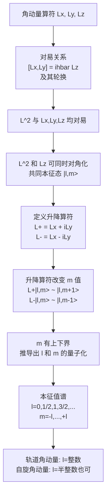

---

### 4.3.1 角动量算符与对易关系

#### 角动量算符的定义

经典力学中，角动量定义为 $\mathbf{L} = \mathbf{r} \times \mathbf{p}$。在量子力学中，我们将位置和动量替换为相应的算符 $\hat{\mathbf{r}}$ 和 $\hat{\mathbf{p}}$，得到**角动量算符**：

$$\boxed{\hat{\mathbf{L}} = \hat{\mathbf{r}} \times \hat{\mathbf{p}}}$$

写成分量形式：

$$\hat{L}_x = \hat{y}\hat{p}_z - \hat{z}\hat{p}_y$$
$$\hat{L}_y = \hat{z}\hat{p}_x - \hat{x}\hat{p}_z$$
$$\hat{L}_z = \hat{x}\hat{p}_y - \hat{y}\hat{p}_x$$

这三个表达式可以用 Levi-Civita 符号紧凑地统一为：

$$\hat{L}_i = \sum_{j,k}\epsilon_{ijk}\hat{r}_j \hat{p}_k$$

其中 $\epsilon_{ijk}$ 是全反对称张量（$\epsilon_{xyz} = +1$，交换任意两个指标变号，有重复指标则为零）。

我们还定义**角动量的平方**算符：

$$\hat{L}^2 = \hat{L}_x^2 + \hat{L}_y^2 + \hat{L}_z^2$$

#### 基本对易关系的推导

角动量算符之间的对易关系是整个角动量理论的基石。我们来严格推导 $[\hat{L}_x, \hat{L}_y]$。

**步骤 1**：写出待计算的对易子

$$[\hat{L}_x, \hat{L}_y] = [\hat{y}\hat{p}_z - \hat{z}\hat{p}_y, \;\hat{z}\hat{p}_x - \hat{x}\hat{p}_z]$$

**步骤 2**：利用对易子的双线性性质展开为四项

$$= [\hat{y}\hat{p}_z, \hat{z}\hat{p}_x] - [\hat{y}\hat{p}_z, \hat{x}\hat{p}_z] - [\hat{z}\hat{p}_y, \hat{z}\hat{p}_x] + [\hat{z}\hat{p}_y, \hat{x}\hat{p}_z]$$

**步骤 3**：逐项计算。我们需要用到基本对易关系 $[\hat{r}_i, \hat{p}_j] = i\hbar\delta_{ij}$ 以及恒等式 $[\hat{A}\hat{B}, \hat{C}] = \hat{A}[\hat{B}, \hat{C}] + [\hat{A}, \hat{C}]\hat{B}$。

**第一项**：$[\hat{y}\hat{p}_z, \hat{z}\hat{p}_x]$

$$= \hat{y}[\hat{p}_z, \hat{z}\hat{p}_x] + [\hat{y}, \hat{z}\hat{p}_x]\hat{p}_z$$

其中 $[\hat{p}_z, \hat{z}\hat{p}_x] = [\hat{p}_z, \hat{z}]\hat{p}_x + \hat{z}[\hat{p}_z, \hat{p}_x] = (-i\hbar)\hat{p}_x + 0 = -i\hbar\hat{p}_x$

而 $[\hat{y}, \hat{z}\hat{p}_x] = \hat{z}[\hat{y}, \hat{p}_x] + [\hat{y}, \hat{z}]\hat{p}_x = 0 + 0 = 0$

所以第一项 $= \hat{y}(-i\hbar\hat{p}_x) = -i\hbar\hat{y}\hat{p}_x$。

**第二项**：$[\hat{y}\hat{p}_z, \hat{x}\hat{p}_z] = 0$（所有涉及的对易子为零）。

**第三项**：$[\hat{z}\hat{p}_y, \hat{z}\hat{p}_x] = 0$（所有涉及的对易子为零）。

**第四项**：$[\hat{z}\hat{p}_y, \hat{x}\hat{p}_z]$

$[\hat{z}, \hat{x}\hat{p}_z] = \hat{x}[\hat{z}, \hat{p}_z] + [\hat{z}, \hat{x}]\hat{p}_z = \hat{x}(i\hbar) + 0 = i\hbar\hat{x}$

所以第四项 $= i\hbar\hat{x}\hat{p}_y$。

**步骤 4**：合并结果

$$[\hat{L}_x, \hat{L}_y] = -i\hbar\hat{y}\hat{p}_x - 0 - 0 + i\hbar\hat{x}\hat{p}_y = i\hbar(\hat{x}\hat{p}_y - \hat{y}\hat{p}_x) = i\hbar\hat{L}_z$$

因此：

$$\boxed{[\hat{L}_x, \hat{L}_y] = i\hbar\hat{L}_z}$$

由于 $x, y, z$ 三个方向在叉乘定义中具有**轮换对称性**（$x \to y \to z \to x$），其余两个对易关系可以直接通过轮换得到：

$$\boxed{[\hat{L}_y, \hat{L}_z] = i\hbar\hat{L}_x, \qquad [\hat{L}_z, \hat{L}_x] = i\hbar\hat{L}_y}$$

这三个对易关系可以用 Levi-Civita 符号统一为一条：

$$\boxed{[\hat{L}_i, \hat{L}_j] = i\hbar\sum_k \epsilon_{ijk}\hat{L}_k}$$

> **重要物理含义**：$\hat{L}_x$、$\hat{L}_y$、$\hat{L}_z$ 三个分量**互不对易**，这意味着它们不能同时具有确定值。由广义不确定性原理：
> $$\sigma_{L_x}\sigma_{L_y} \ge \frac{\hbar}{2}|\langle\hat{L}_z\rangle|$$

#### $\hat{L}^2$ 与各分量的对易关系

虽然三个分量互不对易，但**角动量的平方** $\hat{L}^2$ 与每个分量**都对易**。

**推导** $[\hat{L}^2, \hat{L}_z] = 0$：

$$[\hat{L}^2, \hat{L}_z] = [\hat{L}_x^2, \hat{L}_z] + [\hat{L}_y^2, \hat{L}_z] + \underbrace{[\hat{L}_z^2, \hat{L}_z]}_{= 0}$$

利用 $[\hat{A}^2, \hat{B}] = \hat{A}[\hat{A}, \hat{B}] + [\hat{A}, \hat{B}]\hat{A}$：

$$[\hat{L}_x^2, \hat{L}_z] = -i\hbar(\hat{L}_x\hat{L}_y + \hat{L}_y\hat{L}_x)$$

$$[\hat{L}_y^2, \hat{L}_z] = i\hbar(\hat{L}_y\hat{L}_x + \hat{L}_x\hat{L}_y)$$

两项相加为零。由轮换对称性：

$$\boxed{[\hat{L}^2, \hat{L}_x] = 0, \qquad [\hat{L}^2, \hat{L}_y] = 0, \qquad [\hat{L}^2, \hat{L}_z] = 0}$$

> **物理意义**：我们可以**同时测量**角动量的大小 $L^2$ 和它的**一个分量**（习惯上选 $L_z$）。但不能同时知道两个或三个分量。

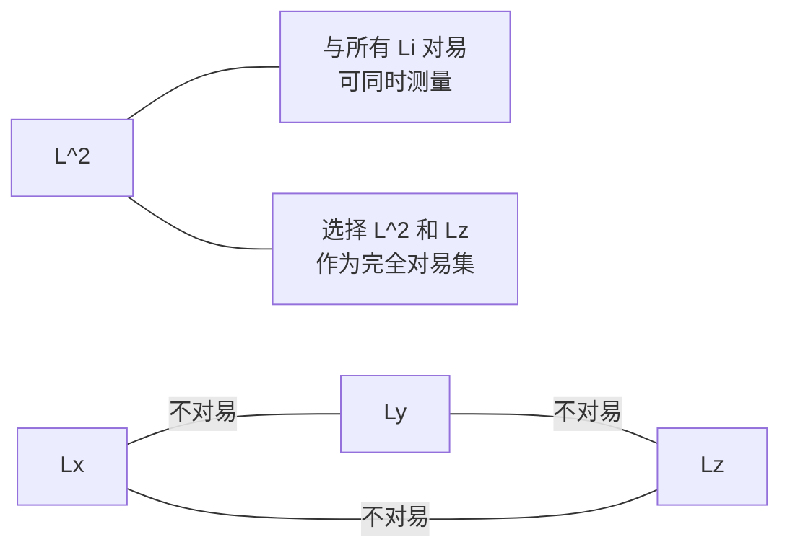

---

### 4.3.2 升降算符与对易关系

#### 升降算符的定义

$$\boxed{\hat{L}_+ \equiv \hat{L}_x + i\hat{L}_y, \qquad \hat{L}_- \equiv \hat{L}_x - i\hat{L}_y}$$

$\hat{L}_+$ 和 $\hat{L}_-$ **不是厄米算符**——它们互为厄米共轭：$\hat{L}_+^\dagger = \hat{L}_-$。

#### 升降算符的对易关系

$$\boxed{[\hat{L}_z, \hat{L}_+] = +\hbar\hat{L}_+, \qquad [\hat{L}_z, \hat{L}_-] = -\hbar\hat{L}_-}$$

$$\boxed{[\hat{L}_+, \hat{L}_-] = 2\hbar\hat{L}_z}$$

#### 用升降算符表达 $\hat{L}^2$

$$\boxed{\hat{L}^2 = \hat{L}_-\hat{L}_+ + \hat{L}_z^2 + \hbar\hat{L}_z}$$

$$\boxed{\hat{L}^2 = \hat{L}_+\hat{L}_- + \hat{L}_z^2 - \hbar\hat{L}_z}$$

由 $[\hat{L}^2, \hat{L}_i] = 0$，有 $[\hat{L}^2, \hat{L}_{\pm}] = 0$——升降算符不改变 $L^2$ 的本征值。

---

### 4.3.3 升降算符的作用

#### 共同本征态

设 $\hat{L}^2$ 和 $\hat{L}_z$ 的共同本征态为 $|l, m\rangle$：

$$\hat{L}^2|l, m\rangle = \lambda|l, m\rangle, \qquad \hat{L}_z|l, m\rangle = m\hbar|l, m\rangle$$

#### 升降算符改变 $m$

**定理**：$\hat{L}_+|l, m\rangle$（若非零）是 $\hat{L}_z$ 本征值为 $(m+1)\hbar$ 的本征态，$\hat{L}^2$ 本征值不变。

**证明**：利用 $[\hat{L}_z, \hat{L}_+] = \hbar\hat{L}_+$：

$$\hat{L}_z(\hat{L}_+|l, m\rangle) = (\hat{L}_+\hat{L}_z + \hbar\hat{L}_+)|l, m\rangle = (m+1)\hbar(\hat{L}_+|l, m\rangle)$$

#### 比例系数的推导

由 $\|\hat{L}_+|l, m\rangle\|^2 = \langle l, m|\hat{L}_-\hat{L}_+|l, m\rangle = \lambda - m(m+1)\hbar^2$，取 $\lambda = l(l+1)\hbar^2$ 后：

$$\boxed{\hat{L}_+|l, m\rangle = \hbar\sqrt{l(l+1) - m(m+1)}\;|l, m+1\rangle}$$

$$\boxed{\hat{L}_-|l, m\rangle = \hbar\sqrt{l(l+1) - m(m-1)}\;|l, m-1\rangle}$$

> **助记**：$l(l+1) - m(m \pm 1) = (l \mp m)(l \pm m + 1)$

---

### 4.3.4 本征值谱的推导

#### $m$ 有上下界

$$\langle \hat{L}^2 \rangle = \langle \hat{L}_x^2 \rangle + \langle \hat{L}_y^2 \rangle + \langle \hat{L}_z^2 \rangle \ge \langle \hat{L}_z^2 \rangle \implies \lambda \ge m^2\hbar^2$$

#### "升到头"与"降到头"

**升到头**：$\hat{L}_+|l, l_{\text{top}}\rangle = 0 \implies \lambda = l_{\text{top}}(l_{\text{top}} + 1)\hbar^2$

**降到头**：$\hat{L}_-|l, l_{\text{bot}}\rangle = 0 \implies \lambda = l_{\text{bot}}(l_{\text{bot}} - 1)\hbar^2$

联立得 $(l_{\text{top}} + l_{\text{bot}})(l_{\text{top}} - l_{\text{bot}} + 1) = 0$，唯一解为 $l_{\text{bot}} = -l_{\text{top}}$。

从 $-l_{\text{top}}$ 到 $l_{\text{top}}$ 升 $2l_{\text{top}}$ 步，必须为非负整数，故：

$$\boxed{l = 0, \frac{1}{2}, 1, \frac{3}{2}, 2, \frac{5}{2}, \ldots}$$

$$\boxed{m = -l, -l+1, \ldots, l-1, l \quad (\text{共 } 2l+1 \text{ 个值})}$$

$$\boxed{\hat{L}^2|l, m\rangle = l(l+1)\hbar^2|l, m\rangle, \qquad \hat{L}_z|l, m\rangle = m\hbar|l, m\rangle}$$

> **半整数的深意**：代数方法允许 $l$ 取**半整数**值，这预言了**自旋角动量**的存在。

| | 轨道角动量 | 自旋角动量 |
|---|---|---|
| **量子数取值** | $l = 0, 1, 2, \ldots$（整数） | $s = 0, \frac{1}{2}, 1, \frac{3}{2}, \ldots$（整数或半整数） |
| **描述方式** | 可用 $Y_l^m(\theta, \phi)$ 表示 | 不能用空间函数表示 |
| **推导方法** | 微分方程或代数法 | 只能用代数法 |
| **物理来源** | 粒子的空间运动 | 粒子的内禀性质 |

---

### 4.3.5 角动量本征态与球谐函数的联系

#### 位置表象中的角动量算符

$$\hat{L}_z = -i\hbar\frac{\partial}{\partial\phi}$$

$$\hat{L}_{\pm} = \pm\hbar e^{\pm i\phi}\left(\frac{\partial}{\partial\theta} \pm i\cot\theta\frac{\partial}{\partial\phi}\right)$$

$$\hat{L}^2 = -\hbar^2\left[\frac{1}{\sin\theta}\frac{\partial}{\partial\theta}\left(\sin\theta\frac{\partial}{\partial\theta}\right) + \frac{1}{\sin^2\theta}\frac{\partial^2}{\partial\phi^2}\right]$$

#### $Y_l^m$ 就是共同本征函数

4.1.6 节的角向方程正是 $\hat{L}^2 Y = l(l+1)\hbar^2 Y$ 的坐标表示，$\phi$ 方程对应 $\hat{L}_z\Phi = m\hbar\Phi$。因此：

$$\boxed{Y_l^m(\theta, \phi) = \langle\theta, \phi|l, m\rangle}$$

#### 用升降算符构造球谐函数

从 $\hat{L}_-Y_l^{-l} = 0$ 出发求解基态，再反复作用 $\hat{L}_+$ 递推构造全部 $Y_l^m$。

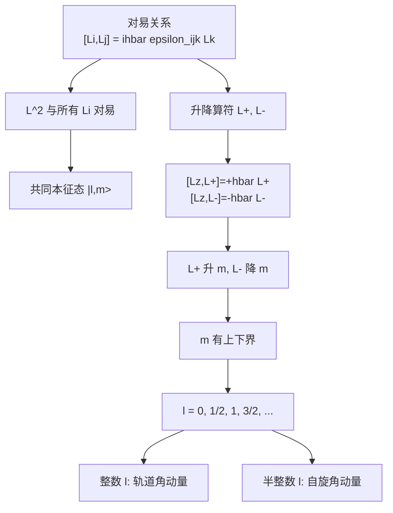

---

> **Key Takeaway（4.3 节）**

| 主题 | 核心结论 | 关键公式 |
|------|---------|---------|
| 对易关系 | $L_x, L_y, L_z$ 两两不对易 | $[\hat{L}_i, \hat{L}_j] = i\hbar\epsilon_{ijk}\hat{L}_k$ |
| $L^2$ 的特殊性 | $L^2$ 与所有分量对易 | $[\hat{L}^2, \hat{L}_i] = 0$ |
| 升降算符 | $\hat{L}_{\pm}$ 升/降 $m$ 一个单位 | $[\hat{L}_z, \hat{L}_{\pm}] = \pm\hbar\hat{L}_{\pm}$ |
| 升降系数 | 取决于 $l, m$ | $\hat{L}_{\pm}\|l,m\rangle = \hbar\sqrt{l(l+1)-m(m\pm 1)}\|l,m\pm 1\rangle$ |
| 本征值谱 | $l$ 可取整数或半整数 | $l = 0, \frac{1}{2}, 1, \ldots$；$m = -l, \ldots, l$ |
| 与球谐函数 | $Y_l^m$ 是 $L^2, L_z$ 的共同本征函数 | $Y_l^m(\theta,\phi) = \langle\theta,\phi\|l,m\rangle$ |

---

### 习题 4.15（概念理解）

**(a)** 解释为什么我们选择 $\hat{L}^2$ 和 $\hat{L}_z$ 作为同时对角化的算符对，而不是 $\hat{L}^2$ 和 $\hat{L}_x$。选择 $\hat{L}_x$ 是否同样合法？

**(b)** 对于 $l = 3$ 的角动量态，列出所有可能的 $m$ 值，并计算 $|\mathbf{L}|$（即 $\sqrt{\langle\hat{L}^2\rangle}$）和 $|L_z|_{\max}$ 的比值。

**(c)** 当 $l \to \infty$ 时，$|L_z|_{\max}/|\mathbf{L}|$ 趋于什么？这与经典极限有何关系？

---

### 习题 4.16（计算练习）

**(a)** 利用 $[\hat{L}_x, \hat{L}_y] = i\hbar\hat{L}_z$ 及其轮换关系，直接推导 $[\hat{L}^2, \hat{L}_x] = 0$。

**(b)** 验证 $\hat{L}_+\hat{L}_- + \hat{L}_-\hat{L}_+ = 2(\hat{L}^2 - \hat{L}_z^2)$。

**(c)** 对于态 $|2, 1\rangle$，计算 $\langle\hat{L}_x^2\rangle$ 和 $\langle\hat{L}_y^2\rangle$。

---

### 习题 4.17（计算练习）

**(a)** 计算 $\hat{L}_+|3, 2\rangle$、$\hat{L}_-|3, 2\rangle$、$\hat{L}_+|3, 3\rangle$、$\hat{L}_-|3, -3\rangle$ 的结果。

**(b)** 从 $\hat{L}_-Y_1^{-1} = 0$ 出发，利用 $\hat{L}_-$ 在球坐标中的微分形式，验证 $Y_1^{-1} \propto \sin\theta \, e^{-i\phi}$。

**(c)** 对 $Y_1^{-1}$ 作用 $\hat{L}_+$，计算 $Y_1^0$，验证你的结果与 4.1.6 节球谐函数表一致。

---

### 习题 4.18（往年考题改编：向量叉乘形式的对易关系）

**证明**：角动量算符满足向量叉乘形式的对易关系：

$$\boxed{\hat{\mathbf{L}} \times \hat{\mathbf{L}} = i\hbar\hat{\mathbf{L}}}$$

**(a)** 写出向量叉乘 $\hat{\mathbf{L}} \times \hat{\mathbf{L}}$ 的各分量。

**(b)** 计算 $(\hat{\mathbf{L}} \times \hat{\mathbf{L}})_x = \hat{L}_y\hat{L}_z - \hat{L}_z\hat{L}_y = [\hat{L}_y, \hat{L}_z]$，验证它等于 $i\hbar\hat{L}_x$。

**(c)** 对 $y$ 和 $z$ 分量做同样的验证，从而完成证明。

**(d)** 解释为什么 $\hat{\mathbf{L}} \times \hat{\mathbf{L}} \neq 0$ 是一个纯粹的量子效应。

---

### 习题 4.19（思考题）

**(a)** 在代数推导中，我们得到 $l$ 可以取半整数。但对于**轨道角动量**，$l$ 必须是整数。请从球谐函数的单值性条件出发，解释为什么轨道角动量排除了半整数。

**(b)** 自旋为 $1/2$ 的粒子，其 $\hat{S}^2$ 和 $\hat{S}_z$ 的本征值分别是什么？有多少个本征态？

**(c)** 假设存在某种"广义角动量"算符 $\hat{J}_x, \hat{J}_y, \hat{J}_z$，满足与轨道角动量完全相同的对易关系。本节的**全部代数推导**是否仍然成立？

---

### 习题 4.20（编程题）

用 Python 数值验证角动量升降算符的作用。

**(a)** 对于 $l = 2$，在 $|l, m\rangle$ 基底下，构造 $\hat{L}_z$、$\hat{L}_+$、$\hat{L}_-$ 和 $\hat{L}^2$ 的 $5 \times 5$ 矩阵表示。

**(b)** 数值验证 $[\hat{L}_z, \hat{L}_+] = \hbar\hat{L}_+$、$[\hat{L}_+, \hat{L}_-] = 2\hbar\hat{L}_z$、$[\hat{L}^2, \hat{L}_z] = 0$。

**(c)** 对 $\hat{L}^2$ 进行数值对角化，验证其本征值均为 $l(l+1)\hbar^2 = 6\hbar^2$。

**(d)** 将程序推广到 $l = 3$，验证相同的对易关系。

```python
import numpy as np

def build_angular_momentum_matrices(l):
    """
    构造角动量算符在 |l,m> 基底下的矩阵表示。
    基底排列顺序: m = l, l-1, ..., -l+1, -l （从大到小）

    参数:
        l: 角动量量子数（非负整数或半整数）
    返回:
        Lz, Lp, Lm, L2: 分别为 Lz, L+, L-, L^2 的矩阵（单位: hbar）
    """
    dim = int(2 * l + 1)
    m_values = np.arange(l, -l - 1, -1)

    # Lz 是对角矩阵
    Lz = np.diag(m_values)

    # L+ 升算符
    Lp = np.zeros((dim, dim))
    for i in range(1, dim):
        m = m_values[i]
        coeff = np.sqrt(l * (l + 1) - m * (m + 1))
        Lp[i - 1, i] = coeff

    # L- 降算符
    Lm = np.zeros((dim, dim))
    for i in range(dim - 1):
        m = m_values[i]
        coeff = np.sqrt(l * (l + 1) - m * (m - 1))
        Lm[i + 1, i] = coeff

    # L^2 = l(l+1) * I
    L2 = l * (l + 1) * np.eye(dim)

    return Lz, Lp, Lm, L2

def verify_commutation_relations(l):
    """数值验证角动量对易关系（hbar = 1）。"""
    Lz, Lp, Lm, L2 = build_angular_momentum_matrices(l)

    print(f"=== l = {l}, 矩阵维度 = {int(2*l+1)} ===\n")

    # [Lz, L+] = L+
    comm1 = Lz @ Lp - Lp @ Lz
    print(f"[Lz, L+] = hbar*L+: 误差 = {np.max(np.abs(comm1 - Lp)):.2e}")

    # [L+, L-] = 2*Lz
    comm2 = Lp @ Lm - Lm @ Lp
    print(f"[L+, L-] = 2*hbar*Lz: 误差 = {np.max(np.abs(comm2 - 2*Lz)):.2e}")

    # [L^2, Lz] = 0
    comm3 = L2 @ Lz - Lz @ L2
    print(f"[L^2, Lz] = 0: 误差 = {np.max(np.abs(comm3)):.2e}")

    # L^2 本征值
    eigenvalues = np.linalg.eigvalsh(L2)
    print(f"L^2 本征值: {eigenvalues} (期望 {l*(l+1):.1f})")

    # Lx^2 + Ly^2 + Lz^2 = L^2
    Lx = (Lp + Lm) / 2.0
    Ly = (Lp - Lm) / (2.0j)
    L2_check = Lx @ Lx + Ly @ Ly + Lz @ Lz
    print(f"Lx^2+Ly^2+Lz^2 = L^2: 误差 = {np.max(np.abs(L2_check - L2)):.2e}\n")

# --- 验证 ---
verify_commutation_relations(l=2)
verify_commutation_relations(l=3)
```

---

## 4.4 自旋

> **本节核心问题**：为什么需要自旋？自旋与轨道角动量有何异同？如何用有限维矩阵描述自旋？

在 4.3 节中，我们从角动量的代数对易关系出发，证明了角动量量子数 $l$ 可以取**整数或半整数**：$l = 0, \frac{1}{2}, 1, \frac{3}{2}, 2, \ldots$ 但当我们回到轨道角动量时，球谐函数的单值性条件要求 $l$ 必须是**整数**。

那半整数的情况到底有没有物理实现？答案是肯定的——**自旋**（spin）就是半整数角动量的化身。自旋是微观粒子的一种**内禀角动量**，它不来源于粒子在空间中的运动，没有经典对应物，也无法用坐标 $\theta, \phi$ 的微分算符来表示。然而，它满足与轨道角动量完全相同的代数对易关系，因此 4.3 节的全部代数推导——本征值谱、升降算符、系数公式——统统适用。

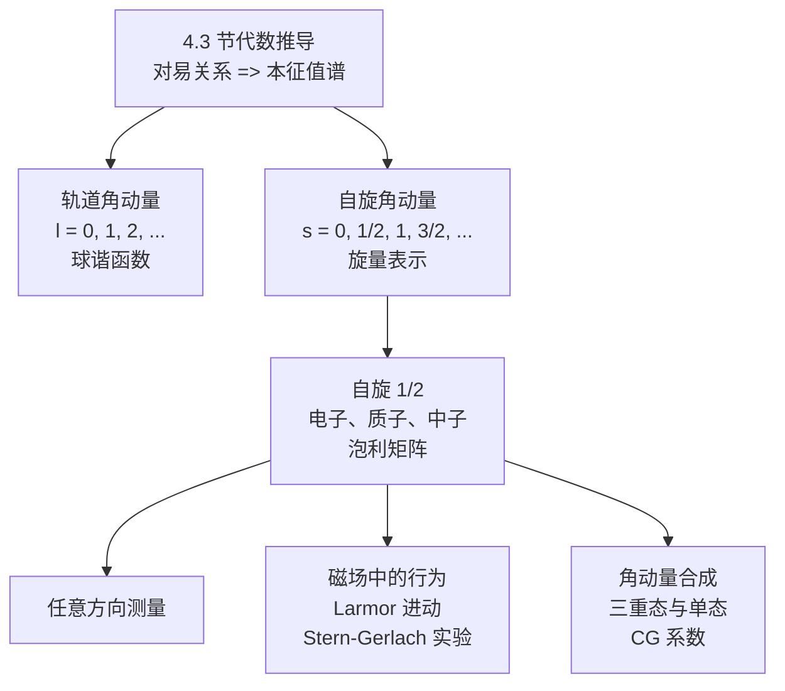

---

### 4.4.1 自旋的引入

#### 从实验到理论：自旋的发现

1922 年，斯特恩（Otto Stern）和格拉赫（Walther Gerlach）将银原子束通过一个不均匀磁场，期望由轨道角动量引起的分裂。然而实验结果令人困惑：银原子束被分裂成**恰好两束**。

对于轨道角动量 $l$，磁量子数 $m$ 可以取 $2l+1$ 个值（$m = -l, -l+1, \ldots, l$），束的数目应该是**奇数**。两束分裂对应的是 $2l+1 = 2$，即 $l = \frac{1}{2}$——一个半整数！但我们已经知道，轨道角动量的 $l$ 只能取整数。

1925 年，乌伦贝克（Uhlenbeck）和古德斯密特（Goudsmit）提出了解决方案：电子携带一种**内禀角动量**，称为**自旋**（spin），其量子数 $s = \frac{1}{2}$。银原子的基态电子处于 $l = 0$ 态（轨道角动量为零），Stern-Gerlach 实验中的分裂完全来自于自旋。

#### 自旋算符与对易关系

$$\boxed{[\hat{S}_i, \hat{S}_j] = i\hbar\,\epsilon_{ijk}\,\hat{S}_k}$$

$$[\hat{S}^2, \hat{S}_i] = 0, \quad (i = x, y, z)$$

$$\hat{S}^2|s, m_s\rangle = s(s+1)\hbar^2\,|s, m_s\rangle, \qquad \hat{S}_z|s, m_s\rangle = m_s\hbar\,|s, m_s\rangle$$

自旋升降算符：$\hat{S}_\pm = \hat{S}_x \pm i\hat{S}_y$，作用为：

$$\hat{S}_\pm|s, m_s\rangle = \hbar\sqrt{s(s+1) - m_s(m_s \pm 1)}\,|s, m_s \pm 1\rangle$$

#### 自旋与轨道角动量的关键区别

| 特征 | 轨道角动量 $\hat{\mathbf{L}}$ | 自旋角动量 $\hat{\mathbf{S}}$ |
|------|--------------------------|--------------------------|
| 对易关系 | $[\hat{L}_i, \hat{L}_j] = i\hbar\epsilon_{ijk}\hat{L}_k$ | $[\hat{S}_i, \hat{S}_j] = i\hbar\epsilon_{ijk}\hat{S}_k$ |
| 微分算符表示 | 有：$\hat{L}_z = -i\hbar\frac{\partial}{\partial\phi}$ | **没有** |
| 量子数取值 | $l = 0, 1, 2, \ldots$（仅整数） | $s = 0, \frac{1}{2}, 1, \frac{3}{2}, \ldots$ |
| 经典对应 | 粒子绕某点的角动量 | 无经典对应物 |
| 粒子依赖性 | 可取任意值 | 每种粒子有**固定的** $s$ |
| 态空间维度 | 无穷维 | 有限维（$(2s+1)$ 维） |

---

### 4.4.2 自旋 1/2

对于 $s = 1/2$，$m_s = \pm\frac{1}{2}$，态空间是**二维的**。

$$\boxed{|\!\uparrow\rangle = \begin{pmatrix} 1 \\ 0 \end{pmatrix}, \qquad |\!\downarrow\rangle = \begin{pmatrix} 0 \\ 1 \end{pmatrix}}$$

$$\boxed{\chi = \begin{pmatrix} a \\ b \end{pmatrix}, \quad |a|^2 + |b|^2 = 1}$$

#### $\hat{S}_z$、$\hat{S}^2$ 和泡利矩阵

$$\boxed{\hat{S}_z = \frac{\hbar}{2}\begin{pmatrix} 1 & 0 \\ 0 & -1 \end{pmatrix}, \qquad \hat{S}^2 = \frac{3}{4}\hbar^2\,\mathbf{I}}$$

$$\hat{S}_x = \frac{\hbar}{2}\begin{pmatrix} 0 & 1 \\ 1 & 0 \end{pmatrix}, \qquad \hat{S}_y = \frac{\hbar}{2}\begin{pmatrix} 0 & -i \\ i & 0 \end{pmatrix}$$

**泡利矩阵**（$\hat{S}_i = \frac{\hbar}{2}\sigma_i$）：

$$\boxed{\sigma_x = \begin{pmatrix} 0 & 1 \\ 1 & 0 \end{pmatrix}, \quad \sigma_y = \begin{pmatrix} 0 & -i \\ i & 0 \end{pmatrix}, \quad \sigma_z = \begin{pmatrix} 1 & 0 \\ 0 & -1 \end{pmatrix}}$$

**泡利矩阵的核心性质**：

1. 厄米：$\sigma_i^\dagger = \sigma_i$
2. 平方为单位矩阵：$\sigma_i^2 = \mathbf{I}$
3. 反对易：$\sigma_i\sigma_j + \sigma_j\sigma_i = 2\delta_{ij}\mathbf{I}$
4. 乘积公式：$\sigma_i\sigma_j = \delta_{ij}\mathbf{I} + i\epsilon_{ijk}\sigma_k$

---

### 习题 4.21

**(概念理解)**

**(a)** 为什么自旋 $s = 1/2$ 的粒子可以存在，而轨道角动量 $l = 1/2$ 不行？

**(b)** 对于自旋 $s = 1$ 的粒子，态空间是几维的？写出 $\hat{S}_z$ 在 $\{|1,1\rangle, |1,0\rangle, |1,-1\rangle\}$ 基底下的矩阵表示。

**(c)** 证明：对于自旋 $1/2$，$\hat{S}^2 = \frac{3}{4}\hbar^2\mathbf{I}$。

---

### 习题 4.22

**(计算练习)**

**(a)** 验证泡利矩阵的反对易关系 $\{\sigma_i, \sigma_j\} = 2\delta_{ij}\mathbf{I}$。

**(b)** 证明乘积公式 $\sigma_i\sigma_j = \delta_{ij}\mathbf{I} + i\epsilon_{ijk}\sigma_k$。

**(c)** 利用乘积公式证明：$(\boldsymbol{\sigma}\cdot\mathbf{A})(\boldsymbol{\sigma}\cdot\mathbf{B}) = \mathbf{A}\cdot\mathbf{B}\;\mathbf{I} + i\boldsymbol{\sigma}\cdot(\mathbf{A}\times\mathbf{B})$。

---

### 4.4.3 沿任意方向的自旋测量

沿方向 $\hat{n} = (\sin\theta\cos\phi, \sin\theta\sin\phi, \cos\theta)$ 的自旋算符：

$$\boxed{\hat{S}_n = \frac{\hbar}{2}(\boldsymbol{\sigma}\cdot\hat{n}) = \frac{\hbar}{2}\begin{pmatrix} \cos\theta & \sin\theta\,e^{-i\phi} \\ \sin\theta\,e^{i\phi} & -\cos\theta \end{pmatrix}}$$

本征值恒为 $\pm\hbar/2$。本征态：

$$\boxed{\chi_+^{(n)} = \begin{pmatrix} \cos\frac{\theta}{2} \\ e^{i\phi}\sin\frac{\theta}{2} \end{pmatrix}, \qquad \chi_-^{(n)} = \begin{pmatrix} -e^{-i\phi}\sin\frac{\theta}{2} \\ \cos\frac{\theta}{2} \end{pmatrix}}$$

---

### 习题 4.23

**(计算练习)**

**(a)** 电子处于 $\hat{S}_x$ 本征态 $\chi_+^{(x)} = \frac{1}{\sqrt{2}}\begin{pmatrix} 1 \\ 1 \end{pmatrix}$。测量 $\hat{S}_z$ 得到 $+\hbar/2$ 和 $-\hbar/2$ 的概率？

**(b)** 电子处于态 $\chi = \frac{1}{\sqrt{5}}\begin{pmatrix} 1 \\ 2i \end{pmatrix}$，计算 $\langle\hat{S}_x\rangle$、$\langle\hat{S}_y\rangle$、$\langle\hat{S}_z\rangle$。

**(c)** 对(b)验证 $\langle\hat{S}_x\rangle^2 + \langle\hat{S}_y\rangle^2 + \langle\hat{S}_z\rangle^2 \le \langle\hat{S}^2\rangle$。

---

### 4.4.4 物理应用

#### 磁场中的哈密顿量

$$\boxed{\hat{H} = -\boldsymbol{\mu}_S\cdot\mathbf{B} = \frac{e}{m_e}\hat{\mathbf{S}}\cdot\mathbf{B}}$$

#### 拉莫尔进动

均匀磁场 $\mathbf{B} = B_0\hat{z}$，拉莫尔频率 $\omega_0 = eB_0/m_e$：

$$\boxed{\langle\hat{\mathbf{S}}\rangle(t) = \frac{\hbar}{2}\Big(\sin\theta_0\cos(\phi_0 + \omega_0 t),\;\sin\theta_0\sin(\phi_0 + \omega_0 t),\;\cos\theta_0\Big)}$$

#### Stern-Gerlach 实验

不均匀磁场将银原子束分裂成恰好两束，证实自旋存在与空间量子化。

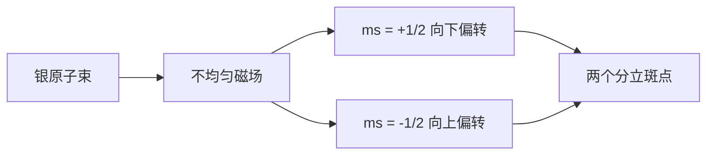

---

### 习题 4.24

**(计算练习)** 电子初始态 $|\!\uparrow\rangle$，磁场 $\mathbf{B} = B_0\hat{x}$。

**(a)** 写出 $\hat{H}$ 的矩阵表示。
**(b)** 求能量本征值和本征态。
**(c)** 写出 $\chi(t)$。
**(d)** 计算 $\langle\hat{S}_x\rangle(t)$、$\langle\hat{S}_y\rangle(t)$、$\langle\hat{S}_z\rangle(t)$。

---

### 习题 4.25（往年考题改编：旋转磁场中的自旋进动）

电子在旋转磁场 $\mathbf{B}(t) = B_0[\cos(\omega t)\hat{x} + \sin(\omega t)\hat{y}]$ 中，初始态 $|\!\uparrow\rangle$。

**(a)** 证明哈密顿量为 $\hat{H}(t) = \frac{\hbar\omega_0}{2}\begin{pmatrix} 0 & e^{-i\omega t} \\ e^{i\omega t} & 0 \end{pmatrix}$。

**(b)** 写出耦合微分方程组。

**(c)** 通过变量替换化为二阶方程。

**(d)** 求解 $\alpha(t)$ 和 $\beta(t)$，定义 $\omega_r = \sqrt{\omega^2 + \omega_0^2}$。

**(e)** 计算 $\langle S_z(t)\rangle = \frac{\hbar}{2}[1 - \frac{2\omega_0^2}{\omega_r^2}\sin^2\frac{\omega_r t}{2}]$。

**(f)** 讨论 $\omega \to 0$ 和 $\omega = 0$ 极限。

---

### 4.4.5 角动量合成

总角动量 $\hat{\mathbf{J}} = \hat{\mathbf{J}}_1 + \hat{\mathbf{J}}_2$，$j$ 的取值：

$$\boxed{j = |j_1 - j_2|, \; |j_1 - j_2| + 1, \; \ldots, \; j_1 + j_2}$$

#### 两个自旋 $1/2$ 的合成

**三重态（$j = 1$，对称）**：

$$\boxed{\begin{aligned} |1, 1\rangle &= |\!\uparrow\uparrow\rangle \\ |1, 0\rangle &= \frac{1}{\sqrt{2}}(|\!\uparrow\downarrow\rangle + |\!\downarrow\uparrow\rangle) \\ |1, -1\rangle &= |\!\downarrow\downarrow\rangle \end{aligned}}$$

**单态（$j = 0$，反对称）**：

$$\boxed{|0, 0\rangle = \frac{1}{\sqrt{2}}(|\!\uparrow\downarrow\rangle - |\!\downarrow\uparrow\rangle)}$$

#### Clebsch-Gordan 系数

$$|j, m\rangle = \sum_{m_1 + m_2 = m}\langle j_1, m_1; j_2, m_2|j, m\rangle\,|j_1, m_1; j_2, m_2\rangle$$

性质：选择定则 $m = m_1 + m_2$，三角不等式，实数，正交完备。

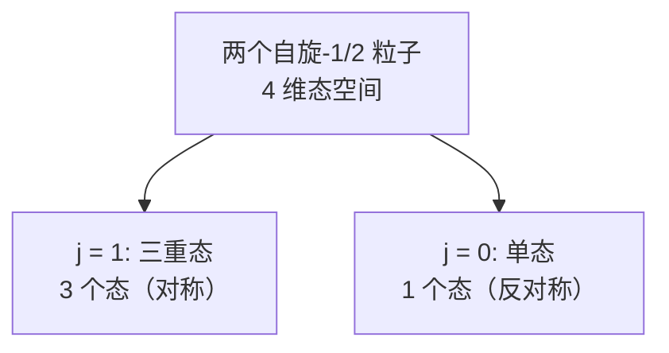

---

### 习题 4.26

**(计算练习)**

**(a)** 验证单态满足 $\hat{J}^2|0,0\rangle = 0$ 和 $\hat{J}_z|0,0\rangle = 0$。

**(b)** 对 $j_1 = 1, j_2 = 1/2$ 合成，写出 $j = 3/2$ 和 $j = 1/2$ 的所有耦合基态。

**(c)** 验证 $|j=1/2, m=1/2\rangle$ 与 $|j=3/2, m=1/2\rangle$ 正交。

---

### 习题 4.27（思考题）

**(a)** 对单态中粒子1测量 $\hat{S}_{1z}$ 得到 $+\hbar/2$ 的概率，以及此时粒子2的态。与EPR悖论的关系。

**(b)** 证明单态中沿任意方向测量自旋分量的概率均为 $1/2$。

**(c)** 三个自旋 $1/2$ 粒子的总角动量可取值？验证总态数为 $8$。

---

### 习题 4.28（编程题：自旋进动的可视化）

**(a)** 均匀磁场中拉莫尔进动的 $\langle S_x\rangle, \langle S_y\rangle, \langle S_z\rangle$ 随时间变化。

**(b)** 旋转磁场中不同 $\omega/\omega_0$ 的自旋翻转概率。

**(c)** Bloch 球上的自旋轨迹。

```python
import numpy as np
import matplotlib.pyplot as plt
from scipy.integrate import solve_ivp
from mpl_toolkits.mplot3d import Axes3D

# 泡利矩阵（hbar = 1）
sigma_x = np.array([[0, 1], [1, 0]], dtype=complex)
sigma_y = np.array([[0, -1j], [1j, 0]], dtype=complex)
sigma_z = np.array([[1, 0], [0, -1]], dtype=complex)

def spin_expectation(chi):
    """计算旋量 chi 的自旋期望值"""
    chi = np.asarray(chi, dtype=complex)
    Sx = np.real(chi.conj() @ sigma_x @ chi)
    Sy = np.real(chi.conj() @ sigma_y @ chi)
    Sz = np.real(chi.conj() @ sigma_z @ chi)
    return 0.5 * Sx, 0.5 * Sy, 0.5 * Sz

def schrodinger_rhs(t, psi_flat, H_func, *args):
    """含时薛定谔方程右端项"""
    alpha = psi_flat[0] + 1j * psi_flat[1]
    beta = psi_flat[2] + 1j * psi_flat[3]
    chi = np.array([alpha, beta])
    H = H_func(t, *args)
    dchi = -1j * H @ chi
    return [dchi[0].real, dchi[0].imag, dchi[1].real, dchi[1].imag]

# (a) 均匀磁场
omega0 = 1.0
T = 2 * np.pi / omega0
t_eval = np.linspace(0, 4*T, 500)
chi0 = np.array([1, 1], dtype=complex) / np.sqrt(2)  # 沿x向上
y0 = [chi0[0].real, chi0[0].imag, chi0[1].real, chi0[1].imag]

H_uniform = lambda t, w0: (w0/2) * sigma_z
sol = solve_ivp(schrodinger_rhs, (0, 4*T), y0, t_eval=t_eval,
                args=(H_uniform, omega0), rtol=1e-10, atol=1e-12)

Sx, Sy, Sz = [], [], []
for i in range(len(sol.t)):
    a = sol.y[0,i] + 1j*sol.y[1,i]
    b = sol.y[2,i] + 1j*sol.y[3,i]
    sx, sy, sz = spin_expectation([a, b])
    Sx.append(sx); Sy.append(sy); Sz.append(sz)

fig, ax = plt.subplots(figsize=(10, 5))
ax.plot(sol.t/T, Sx, label=r'$\langle S_x \rangle$')
ax.plot(sol.t/T, Sy, label=r'$\langle S_y \rangle$')
ax.plot(sol.t/T, Sz, '--', label=r'$\langle S_z \rangle$')
ax.set_xlabel(r'$t/T_{Larmor}$'); ax.set_ylabel(r'$\hbar/2$')
ax.set_title('Larmor Precession'); ax.legend(); ax.grid(alpha=0.3)
plt.savefig('larmor_precession.png', dpi=150)
plt.show()

# (b) 旋转磁场
H_rot = lambda t, w0, w: (w0/2)*(np.cos(w*t)*sigma_x + np.sin(w*t)*sigma_y)
y0_up = [1, 0, 0, 0]
fig, ax = plt.subplots(figsize=(10, 5))
for ratio in [0, 0.5, 1, 2, 5]:
    wd = ratio * omega0
    sol_b = solve_ivp(schrodinger_rhs, (0, 8*T), y0_up, t_eval=np.linspace(0,8*T,1000),
                      args=(H_rot, omega0, wd), rtol=1e-10, atol=1e-12)
    P_down = sol_b.y[2,:]**2 + sol_b.y[3,:]**2
    ax.plot(sol_b.t/T, P_down, label=rf'$\omega/\omega_0={ratio}$')
ax.set_xlabel(r'$t/T_{Larmor}$'); ax.set_ylabel(r'$P_\downarrow$')
ax.set_title('Spin Flip in Rotating Field'); ax.legend(); ax.grid(alpha=0.3)
plt.savefig('rotating_field_flip.png', dpi=150)
plt.show()
```

---

> **Key Takeaway（4.4 节）**

| 主题 | 核心内容 | 关键公式/结论 |
|------|---------|-------------|
| 自旋引入 | 内禀角动量，满足同样的对易关系 | $[\hat{S}_i, \hat{S}_j] = i\hbar\epsilon_{ijk}\hat{S}_k$ |
| 自旋 $1/2$ | 二维态空间，旋量表示 | $\chi = \binom{a}{b}$，$\|a\|^2 + \|b\|^2 = 1$ |
| 泡利矩阵 | $\hat{S}_i = \frac{\hbar}{2}\sigma_i$ | $\sigma_i\sigma_j = \delta_{ij}\mathbf{I} + i\epsilon_{ijk}\sigma_k$ |
| 任意方向测量 | 本征值恒为 $\pm\hbar/2$ | $\chi_+^{(n)} = (\cos\frac{\theta}{2}, e^{i\phi}\sin\frac{\theta}{2})^T$ |
| 拉莫尔进动 | 自旋绕磁场方向进动 | $\omega_0 = eB_0/m_e$ |
| Stern-Gerlach | 证实自旋与空间量子化 | 银原子束分裂为两束 |
| 角动量合成 | $j = \|j_1-j_2\|, \ldots, j_1+j_2$ | $\frac{1}{2}\otimes\frac{1}{2} = 0 \oplus 1$ |
| 三重态与单态 | 对称/反对称 | CG 系数：$m = m_1 + m_2$ |

---

## 4.5 电磁相互作用

> **本节核心问题**：带电粒子在电磁场中的量子力学行为如何描述？矢势 $\mathbf{A}$ 在量子力学中是否具有"真实的"物理效应？


---

### 4.5.1 最小耦合

#### 经典力学的铺垫

正则动量与机械动量的关系：$m\dot{\mathbf{r}} = \mathbf{p}_{\text{can}} - q\mathbf{A}$。

量子化：将正则动量替换为算符 $\hat{\mathbf{p}} = -i\hbar\nabla$：

$$\boxed{\hat{H} = \frac{1}{2m}\left(\hat{\mathbf{p}} - q\mathbf{A}\right)^2 + q\Phi = \frac{1}{2m}\left(-i\hbar\nabla - q\mathbf{A}\right)^2 + q\Phi}$$

这就是**最小耦合**处方：$\hat{\mathbf{p}} \to \hat{\mathbf{p}} - q\mathbf{A}$。

#### 展开哈密顿量

在**库仑规范** $\nabla \cdot \mathbf{A} = 0$ 下：

$$\hat{H} = \frac{\hat{\mathbf{p}}^2}{2m} - \frac{q}{m}\mathbf{A} \cdot \hat{\mathbf{p}} + \frac{q^2 A^2}{2m} + q\Phi$$

#### 均匀磁场中的特例

对称规范 $\mathbf{A} = \frac{1}{2}\mathbf{B} \times \mathbf{r}$，$\mathbf{B} = B\hat{z}$：

$$\hat{H} = \frac{\hat{\mathbf{p}}^2}{2m} - \frac{qB}{2m}\hat{L}_z + \frac{q^2 B^2}{8m}(x^2 + y^2) + q\Phi$$

> 完整的带自旋粒子哈密顿量：$\hat{H} = \frac{1}{2m}(\hat{\mathbf{p}} - q\mathbf{A})^2 + q\Phi - \frac{q}{m}\hat{\mathbf{S}} \cdot \mathbf{B}$

---

### 4.5.2 规范变换

#### 电磁势的非唯一性

$$\boxed{\mathbf{A} \to \mathbf{A}' = \mathbf{A} + \nabla\Lambda, \qquad \Phi \to \Phi' = \Phi - \frac{\partial\Lambda}{\partial t}}$$

物理场 $\mathbf{E}, \mathbf{B}$ 不变。

#### 波函数的规范变换

$$\boxed{\Psi \to \Psi' = e^{iq\Lambda/\hbar}\Psi}$$

**证明**：最小耦合动量算符在规范变换下提取整体相位因子：

$$(-i\hbar\nabla - q\mathbf{A}')\Psi' = e^{iq\Lambda/\hbar}(-i\hbar\nabla - q\mathbf{A})\Psi$$

由此可以逐步验证变换后的 $\Psi'$ 满足对应 $(\mathbf{A}', \Phi')$ 的含时薛定谔方程。

#### 物理可观测量的规范不变性

- 概率密度：$|\Psi'|^2 = |\Psi|^2$ ✓
- 机械动量期望值：$\langle \hat{\mathbf{p}} - q\mathbf{A}' \rangle_{\Psi'} = \langle \hat{\mathbf{p}} - q\mathbf{A} \rangle_{\Psi}$ ✓

> **规范不变性原则**：所有物理可观测量必须在规范变换下不变。正则动量 $\hat{\mathbf{p}}$ 的期望值是规范依赖的，不是物理可观测量；机械动量 $\hat{\mathbf{p}} - q\mathbf{A}$ 才是。

---

### 4.5.3 Aharonov-Bohm 效应

#### 思想实验

双缝装置中，在双缝之间放置无限长螺线管。螺线管内部 $\mathbf{B} \neq 0$，外部 $\mathbf{B} = 0$ 但 $\mathbf{A} \neq 0$。电子只在外部传播。

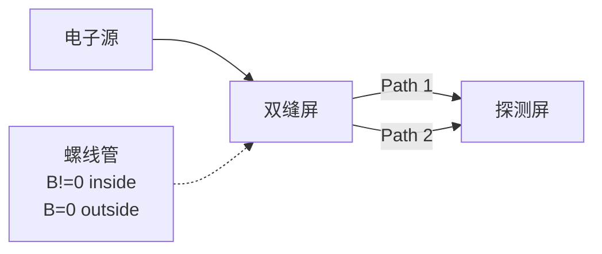

#### 相位差

沿路径传播的电子获得附加相位 $\exp(iq\int_\gamma \mathbf{A}\cdot d\mathbf{l}/\hbar)$。两路径的相位差：

$$\boxed{\Delta\phi = \frac{q\Phi_B}{\hbar}}$$

其中 $\Phi_B = \oint \mathbf{A}\cdot d\mathbf{l} = \int_S \mathbf{B}\cdot d\mathbf{S}$ 是螺线管中的总磁通量。

#### 物理含义

| 经典力学 | 量子力学 |
|:---|:---|
| $\mathbf{E}, \mathbf{B}$ 是基本物理量 | $\Phi, \mathbf{A}$ 更基本 |
| $\Phi, \mathbf{A}$ 是数学工具 | $\mathbf{E}, \mathbf{B}$ 是导出量 |
| 无力则无影响 | 无力仍有相位影响 |

AB 效应已被实验精确验证（外村彰 1986 年电子全息术实验）。

---

> **Key Takeaway（4.5 节）**

| 概念 | 关键公式/结论 |
|:-----|:-------------|
| 最小耦合 | $\hat{\mathbf{p}} \to \hat{\mathbf{p}} - q\mathbf{A}$ |
| 带电粒子哈密顿量 | $\hat{H} = \frac{1}{2m}(\hat{\mathbf{p}} - q\mathbf{A})^2 + q\Phi$ |
| 正则 vs 机械动量 | $m\mathbf{v} = \hat{\mathbf{p}} - q\mathbf{A}$（机械动量才是可观测量） |
| 规范变换 | $\mathbf{A} \to \mathbf{A}+\nabla\Lambda$，$\Psi \to e^{iq\Lambda/\hbar}\Psi$ |
| AB 相位 | $\Delta\phi = q\Phi_B/\hbar$ |
| AB 效应意义 | $\mathbf{A}$ 在 $\mathbf{B}=0$ 区域仍影响量子相位 |

---

### 习题 4.29（概念理解）

**(a)** 解释正则动量和机械动量的区别。为什么量子化的是正则动量 $\hat{\mathbf{p}} = -i\hbar\nabla$？

**(b)** 规范变换下，$\langle \hat{\mathbf{p}} \rangle$ 是否改变？$\langle \hat{\mathbf{p}} - q\mathbf{A} \rangle$ 呢？

**(c)** 经典力学能否描述 Aharonov-Bohm 效应？为什么？

---

### 习题 4.30（计算练习）

**(a)** 验证对称规范 $\mathbf{A}_1 = \frac{B_0}{2}(-y, x, 0)$ 和朗道规范 $\mathbf{A}_2 = B_0(-y, 0, 0)$ 都给出 $\mathbf{B} = B_0\hat{z}$。

**(b)** 找出 $\Lambda(\mathbf{r})$ 使得 $\mathbf{A}_2 = \mathbf{A}_1 + \nabla\Lambda$。

**(c)** 写出两种规范下电子在均匀磁场中的哈密顿量。

---

### 习题 4.31（思考题）

**(a)** 证明当 $\Phi_B = n \cdot \frac{2\pi\hbar}{|q|}$ 时 AB 效应消失。$\frac{2\pi\hbar}{|q|}$ 称为磁通量子。

**(b)** 超导体中载流子为库珀对（$q = 2e$），磁通量子变为多少？

**(c)** AB 效应是否允许超距信息传递？

---

### 习题 4.32（编程题）

模拟 Aharonov-Bohm 效应对双缝干涉图样的影响。

**(a)** 绘制 $\Delta\phi = 0, \pi/2, \pi, 3\pi/2$ 的干涉图样。

**(b)** 制作磁通量-屏幕位置的伪彩色图。

```python
import numpy as np
import matplotlib.pyplot as plt

# 参数
d = 1.0; lam = 0.1; L = 100.0; k = 2*np.pi/lam
y = np.linspace(-5, 5, 1000)
delta = k * d * y / L

def intensity(delta, dphi):
    """双缝干涉强度（含AB相位差）"""
    return np.cos((delta + dphi) / 2)**2

# (a) 四种磁通量
fig, axes = plt.subplots(2, 2, figsize=(12, 8))
for ax, dp, lab in zip(axes.flatten(),
    [0, np.pi/2, np.pi, 3*np.pi/2],
    [r'$\Delta\phi=0$', r'$\Delta\phi=\pi/2$',
     r'$\Delta\phi=\pi$', r'$\Delta\phi=3\pi/2$']):
    I = intensity(delta, dp)
    ax.plot(y, I, 'b-', lw=0.8); ax.fill_between(y, I, alpha=0.3)
    ax.set_title(lab); ax.set_ylim(0, 1.1)
    ax.set_xlabel('y'); ax.set_ylabel('Intensity')
plt.suptitle('AB Effect: Double-Slit Interference')
plt.tight_layout(); plt.savefig('AB_interference.png', dpi=150); plt.show()

# (b) 伪彩色图
dphi_range = np.linspace(0, 4*np.pi, 500)
Y, DP = np.meshgrid(delta, dphi_range)
I2d = np.cos((Y + DP) / 2)**2
fig, ax = plt.subplots(figsize=(10, 6))
ax.pcolormesh(y, dphi_range/np.pi, I2d, cmap='inferno', shading='auto')
ax.set_xlabel('y'); ax.set_ylabel(r'$\Delta\phi/\pi$')
ax.set_title('Interference vs Magnetic Flux')
plt.tight_layout(); plt.savefig('AB_2d_map.png', dpi=150); plt.show()
```

---
