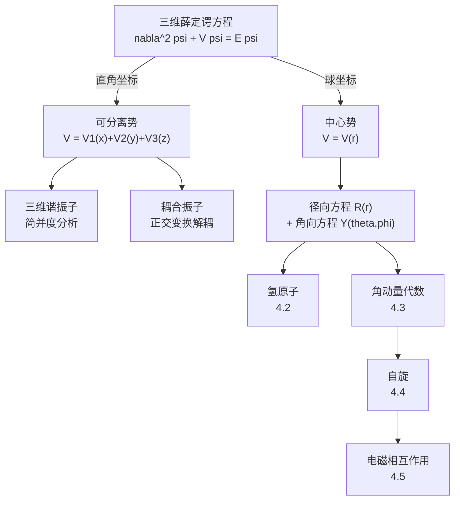
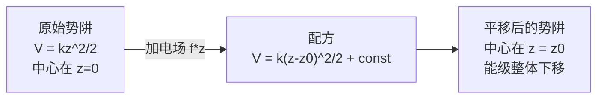
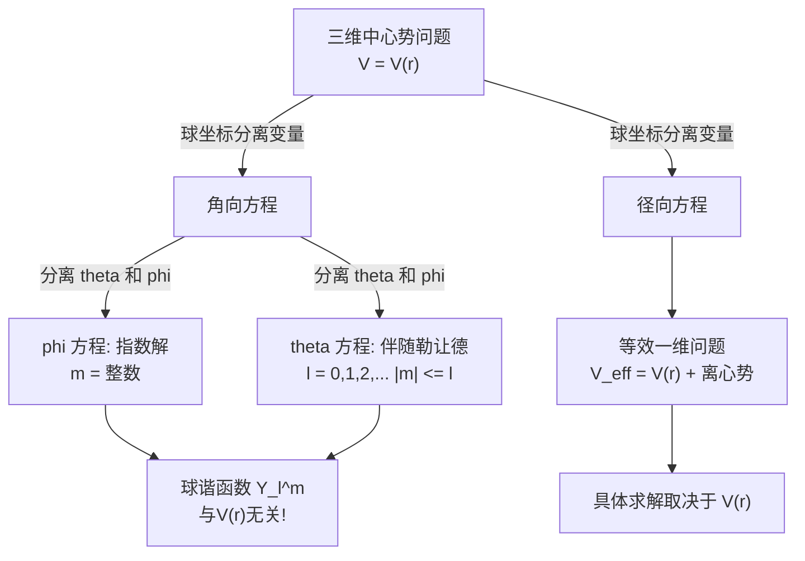

# 第4章：三维空间中的量子力学

> **本章核心问题**：如何将一维量子力学推广到三维空间？角动量和自旋是什么？

前三章中，我们在一维空间里建立了量子力学的完整框架：波函数、定态薛定谔方程、各种势场的求解技巧、以及形式理论的数学结构。但现实世界是三维的——原子中的电子在三维空间中运动，角动量是三维特有的物理量，而自旋更是没有经典对应物的全新自由度。

本章的主线是：**从一维到三维的推广，以及三维空间带来的全新物理**。我们将首先学习三维薛定谔方程的分离变量技巧（直角坐标与球坐标），然后求解氢原子——量子力学最辉煌的成就之一。接着，我们用纯代数方法系统研究角动量，引入自旋这一全新概念，最后讨论带电粒子在电磁场中的量子行为。



---

## 4.1 三维薛定谔方程

### 4.1.1 从一维到三维：一般形式

在一维中，定态薛定谔方程为：

$$-\frac{\hbar^2}{2m}\frac{d^2\psi}{dx^2} + V(x)\psi = E\psi$$

推广到三维，只需将一维二阶导数替换为**拉普拉斯算符** $\nabla^2$：

$$\boxed{-\frac{\hbar^2}{2m}\nabla^2\psi + V(\mathbf{r})\psi = E\psi}$$

其中 $\nabla^2$ 在不同坐标系中有不同的表达式：

**直角坐标系** $(x, y, z)$：

$$\nabla^2 = \frac{\partial^2}{\partial x^2} + \frac{\partial^2}{\partial y^2} + \frac{\partial^2}{\partial z^2}$$

**球坐标系** $(r, \theta, \phi)$：

$$\nabla^2 = \frac{1}{r^2}\frac{\partial}{\partial r}\left(r^2 \frac{\partial}{\partial r}\right) + \frac{1}{r^2\sin\theta}\frac{\partial}{\partial \theta}\left(\sin\theta \frac{\partial}{\partial \theta}\right) + \frac{1}{r^2\sin^2\theta}\frac{\partial^2}{\partial \phi^2}$$

选择哪种坐标系，取决于势能 $V(\mathbf{r})$ 的对称性。这是三维问题的第一条原则：

> **核心原则**：选择与势能对称性匹配的坐标系，使得薛定谔方程可以分离变量。

含时波函数仍然是 $\Psi(\mathbf{r}, t) = \psi(\mathbf{r})e^{-iEt/\hbar}$，归一化条件变为三维积分：

$$\int |\psi(\mathbf{r})|^2 d^3\mathbf{r} = 1$$

### 4.1.2 直角坐标系下的分离变量

当势能可以写成三个方向独立贡献之和时：

$$V(x, y, z) = V_1(x) + V_2(y) + V_3(z)$$

我们可以假设波函数也是可分离的：

$$\psi(x, y, z) = X(x)Y(y)Z(z)$$

将此代入三维薛定谔方程，两边除以 $XYZ$：

$$\underbrace{-\frac{\hbar^2}{2m}\frac{1}{X}\frac{d^2X}{dx^2} + V_1(x)}_{\text{只含 }x} + \underbrace{-\frac{\hbar^2}{2m}\frac{1}{Y}\frac{d^2Y}{dy^2} + V_2(y)}_{\text{只含 }y} + \underbrace{-\frac{\hbar^2}{2m}\frac{1}{Z}\frac{d^2Z}{dz^2} + V_3(z)}_{\text{只含 }z} = E$$

三个独立变量之和等于常数，每一部分必须分别等于常数。令 $E = E_x + E_y + E_z$，得到**三个独立的一维薛定谔方程**：

$$\boxed{-\frac{\hbar^2}{2m}\frac{d^2X}{dx^2} + V_1(x)X = E_x X}$$

$$-\frac{\hbar^2}{2m}\frac{d^2Y}{dy^2} + V_2(y)Y = E_y Y$$

$$-\frac{\hbar^2}{2m}\frac{d^2Z}{dz^2} + V_3(z)Z = E_z Z$$

**这就是直角坐标分离变量的威力**：三维问题完全分解为三个一维问题，而一维问题的求解方法我们在第2章已经掌握。总能量是三个分量之和 $E = E_x + E_y + E_z$，总波函数是三个分量之积 $\psi = X(x)Y(y)Z(z)$。

### 4.1.3 三维谐振子（直角坐标解法）

三维谐振子的势能为：

$$V(x, y, z) = \frac{1}{2}m(\omega_x^2 x^2 + \omega_y^2 y^2 + \omega_z^2 z^2)$$

这是一个可分离势，$V_1 = \frac{1}{2}m\omega_x^2 x^2$，$V_2 = \frac{1}{2}m\omega_y^2 y^2$，$V_3 = \frac{1}{2}m\omega_z^2 z^2$。

利用第2章一维谐振子的结果，每个方向的能量为：

$$E_x = \left(n_x + \frac{1}{2}\right)\hbar\omega_x, \quad E_y = \left(n_y + \frac{1}{2}\right)\hbar\omega_y, \quad E_z = \left(n_z + \frac{1}{2}\right)\hbar\omega_z$$

其中 $n_x, n_y, n_z = 0, 1, 2, \ldots$。总能量为：

$$\boxed{E_{n_x n_y n_z} = \left(n_x + \frac{1}{2}\right)\hbar\omega_x + \left(n_y + \frac{1}{2}\right)\hbar\omega_y + \left(n_z + \frac{1}{2}\right)\hbar\omega_z}$$

总波函数为三个一维谐振子波函数之积：

$$\psi_{n_x n_y n_z}(x,y,z) = \psi_{n_x}(x) \cdot \psi_{n_y}(y) \cdot \psi_{n_z}(z)$$

#### 各向同性谐振子与简并

当三个方向的频率相同 $\omega_x = \omega_y = \omega_z \equiv \omega$ 时，势能具有球对称性，称为**各向同性谐振子**。此时总能量简化为：

$$\boxed{E_N = \left(N + \frac{3}{2}\right)\hbar\omega, \quad N \equiv n_x + n_y + n_z = 0, 1, 2, \ldots}$$

对于给定的 $N$，不同的 $(n_x, n_y, n_z)$ 组合给出相同的能量——这就是**简并**。

**简并度的计算**：对于给定的 $N$，需要数满足 $n_x + n_y + n_z = N$（$n_x, n_y, n_z \ge 0$）的非负整数解的个数。固定 $n_x = k$（$0 \le k \le N$），则 $n_y + n_z = N - k$，有 $N - k + 1$ 种选法。总数为：

$$d(N) = \sum_{k=0}^{N}(N - k + 1) = \sum_{j=1}^{N+1} j = \frac{(N+1)(N+2)}{2}$$

$$\boxed{d(N) = \frac{(N+1)(N+2)}{2}}$$

| $N$ | 能量 $E_N$ | $(n_x, n_y, n_z)$ 的组合 | 简并度 $d(N)$ |
|-----|-----------|------------------------|-------------|
| 0 | $\frac{3}{2}\hbar\omega$ | $(0,0,0)$ | 1 |
| 1 | $\frac{5}{2}\hbar\omega$ | $(1,0,0),\,(0,1,0),\,(0,0,1)$ | 3 |
| 2 | $\frac{7}{2}\hbar\omega$ | $(2,0,0),\,(0,2,0),\,(0,0,2),\,(1,1,0),\,(1,0,1),\,(0,1,1)$ | 6 |
| 3 | $\frac{9}{2}\hbar\omega$ | 10种组合 | 10 |

> **物理根源**：简并的根源是**对称性**。各向同性谐振子具有完全的旋转对称性（$SO(3)$），不同方向是等价的，因此多个不同的量子态共享同一能量。这是第6章将深入探讨的主题。

#### 各向异性谐振子

当三个方向频率不全相同时，简并可能部分或完全解除。

**例：二维谐振子** $\omega_x = \omega_y \equiv \omega$，$\omega_z$ 不同。总能量为：

$$E = (n_x + n_y + 1)\hbar\omega + \left(n_z + \frac{1}{2}\right)\hbar\omega_z$$

$xy$ 平面内仍有简并（因为 $\omega_x = \omega_y$），但 $z$ 方向的量子数独立。

**例：完全非简并**。若 $\omega_x, \omega_y, \omega_z$ 两两不可公度（即 $\omega_i/\omega_j$ 为无理数），则不存在不同量子数组合给出相同能量的情况，所有能级均不简并。

---

### 习题 4.1

**(a)** 质量为 $m$ 的粒子处于三维各向同性谐振子势 $V = \frac{1}{2}m\omega^2(x^2+y^2+z^2)$ 中。写出基态和第一激发态的能量与（归一化的）波函数。

**(b)** 计算 $N = 4$ 能级的简并度，并列出所有 $(n_x, n_y, n_z)$ 组合。

**(c)** 证明各向同性谐振子第 $N$ 级的简并度为 $\frac{(N+1)(N+2)}{2}$。

---

### 习题 4.2（思考题）

一个三维谐振子的三个方向频率比为 $\omega_x : \omega_y : \omega_z = 1 : 2 : 3$。

**(a)** 写出能量的一般表达式。

**(b)** 求出前5个能级的能量值（以 $\hbar\omega_x$ 为单位），并标注各能级的简并度。

**(c)** 与各向同性情况相比，对称性的降低如何影响简并结构？

---

### 4.1.4 平移势能中心：配方法

在很多实际问题中，势能除了二次项还包含线性项。例如，在外加均匀电场 $\mathcal{E}$ 的方向（设为 $z$ 方向）上，谐振子势变为：

$$V = \frac{1}{2}m\omega^2 z^2 + qz\mathcal{E} = \frac{1}{2}m\omega^2 z^2 + fz$$

其中 $f = q\mathcal{E}$ 是线性项的系数。

**配方法**：将线性项通过配方消去：

$$V = \frac{1}{2}m\omega^2\left(z^2 + \frac{2f}{m\omega^2}z\right) = \frac{1}{2}m\omega^2\left(z + \frac{f}{m\omega^2}\right)^2 - \frac{f^2}{2m\omega^2}$$

定义新坐标 $z' = z + \frac{f}{m\omega^2} \equiv z - z_0$，其中 $z_0 = -\frac{f}{m\omega^2}$ 是平衡位置的偏移量。则：

$$V = \frac{1}{2}m\omega^2 z'^2 + \text{const}$$

这就是一个**中心平移**到 $z_0$ 的标准谐振子！能量仅增加一个常数：

$$\boxed{E_{n_z} = \left(n_z + \frac{1}{2}\right)\hbar\omega - \frac{f^2}{2m\omega^2}}$$

> **物理图景**：外加电场将谐振子的平衡位置从原点推移到 $z_0$，同时将所有能级整体下移了 $\frac{f^2}{2m\omega^2}$。但**能级间距不变**——量子数仍然标记为 $n_z = 0, 1, 2, \ldots$，相邻能级之差仍为 $\hbar\omega$。



---

### 习题 4.3

一个质量为 $m$ 的带电粒子（电荷 $q$）处于三维各向同性谐振子势中，同时受到沿 $z$ 方向的均匀电场 $\mathcal{E}$。

**(a)** 写出总势能，并用配方法化简。

**(b)** 求能量本征值的完整表达式。

**(c)** 电场是否改变了能级的简并度？说明理由。

---

### 4.1.5 耦合振子与坐标旋转

#### 问题的提出

考虑一个更复杂的二维势能：

$$V(x, y) = \frac{1}{2}m\omega^2(x^2 + y^2) + m\omega^2\lambda xy$$

其中 $\lambda$ 是无量纲耦合常数（$|\lambda| < 1$ 以保证势能正定）。由于存在**交叉项** $\lambda xy$，变量 $x$ 和 $y$ 不能直接分离。

这类问题在物理中非常常见：两个振子通过弹簧耦合、分子中原子的耦合振动等。处理的核心思路是：**将二次型对角化**。

#### 矩阵表述与对角化

将势能写成矩阵形式：

$$V = \frac{1}{2}m\omega^2 \begin{pmatrix} x & y \end{pmatrix} \begin{pmatrix} 1 & \lambda \\ \lambda & 1 \end{pmatrix} \begin{pmatrix} x \\ y \end{pmatrix}$$

势能矩阵为：

$$\mathbf{M} = \begin{pmatrix} 1 & \lambda \\ \lambda & 1 \end{pmatrix}$$

要消除耦合，需要对 $\mathbf{M}$ 进行**正交对角化**。求特征值：

$$\det(\mathbf{M} - \mu \mathbf{I}) = (1-\mu)^2 - \lambda^2 = 0 \implies \mu = 1 \pm \lambda$$

特征值为 $\mu_1 = 1 + \lambda$ 和 $\mu_2 = 1 - \lambda$。由于 $|\lambda| < 1$，两个特征值均为正——**势能确实是正定的**。

对应的归一化特征向量为：

$$\mathbf{v}_1 = \frac{1}{\sqrt{2}}\begin{pmatrix} 1 \\ 1 \end{pmatrix}, \quad \mathbf{v}_2 = \frac{1}{\sqrt{2}}\begin{pmatrix} 1 \\ -1 \end{pmatrix}$$

#### 主轴旋转（正交变换）

定义新坐标（简正坐标）：

$$\begin{pmatrix} u \\ v \end{pmatrix} = \frac{1}{\sqrt{2}}\begin{pmatrix} 1 & 1 \\ 1 & -1 \end{pmatrix}\begin{pmatrix} x \\ y \end{pmatrix}$$

即 $u = \frac{x+y}{\sqrt{2}}$，$v = \frac{x-y}{\sqrt{2}}$。这是一个**旋转 $45°$** 的正交变换。

在新坐标下，势能变为对角形式：

$$V = \frac{1}{2}m\omega^2\left[(1+\lambda)u^2 + (1-\lambda)v^2\right] = \frac{1}{2}m\omega_u^2 u^2 + \frac{1}{2}m\omega_v^2 v^2$$

其中：

$$\boxed{\omega_u = \omega\sqrt{1+\lambda}, \quad \omega_v = \omega\sqrt{1-\lambda}}$$

交叉项消失了！在简正坐标下，系统变成了两个**独立的**谐振子，称为**简正模**（Normal Modes）。

#### 简正模的物理图景

- **模式 1**（坐标 $u = \frac{x+y}{\sqrt{2}}$）：两个振子**同相振动**，频率 $\omega_u = \omega\sqrt{1+\lambda}$。
- **模式 2**（坐标 $v = \frac{x-y}{\sqrt{2}}$）：两个振子**反相振动**，频率 $\omega_v = \omega\sqrt{1-\lambda}$。

若 $\lambda > 0$（耦合为排斥型），同相模频率较高，反相模频率较低；若 $\lambda < 0$（耦合为吸引型），则相反。

#### 能量本征值

直接利用一维谐振子结果：

$$\boxed{E_{n_u, n_v} = \left(n_u + \frac{1}{2}\right)\hbar\omega\sqrt{1+\lambda} + \left(n_v + \frac{1}{2}\right)\hbar\omega\sqrt{1-\lambda}}$$

波函数在简正坐标下为：

$$\psi_{n_u, n_v}(u, v) = \psi_{n_u}^{(\omega_u)}(u) \cdot \psi_{n_v}^{(\omega_v)}(v)$$

其中 $\psi_n^{(\omega)}$ 是频率为 $\omega$ 的一维谐振子的第 $n$ 个本征态。

> **方法论总结**：遇到含交叉项的二次型势能时，核心步骤为：
> 1. 将势能写成矩阵形式 $V = \frac{1}{2}\mathbf{q}^T \mathbf{M} \mathbf{q}$；
> 2. 对角化矩阵 $\mathbf{M}$，得到特征值和特征向量；
> 3. 用特征向量构造正交变换，定义简正坐标；
> 4. 在简正坐标下，系统化为独立谐振子的叠加。

这正是线性代数教程中学到的**二次型理论**（参见番外 Ch3 二次型）在量子力学中的直接应用。

---

### 习题 4.4

**(a)** 对于二维耦合势 $V = \frac{1}{2}m\omega^2(x^2 + y^2 + \lambda xy)$，直接验证在简正坐标 $u = \frac{x+y}{\sqrt{2}}$，$v = \frac{x-y}{\sqrt{2}}$ 下交叉项确实消失。

**(b)** 当 $\lambda \to 0$ 时，两个简正频率趋于什么？物理上这意味着什么？

**(c)** 当 $|\lambda| \to 1$ 时，其中一个简正频率趋于零。这在物理上意味着什么？（提示：势能在某个方向变得"软"了。）

---

### 习题 4.5（往年考题改编）

一个质量为 $m$ 的非相对论粒子在势场 $U(x,y,z) = A(x^2 + y^2 + 2\lambda xy) + B(z^2 + 2\mu z)$ 中运动，其中 $A > 0$，$B > 0$，$|\lambda| < 1$，$\mu$ 任意。

**(a)** 说明为什么 $z$ 方向可以先与 $xy$ 平面解耦。

**(b)** 对 $z$ 方向使用配方法，对 $xy$ 平面使用坐标旋转法，求出能量本征值的完整表达式。

**(c)** 将你的结果用 $A$、$B$、$\lambda$、$\mu$、$m$、$\hbar$ 以及量子数 $n_u$、$n_v$、$n_z$ 表示。

---

### 4.1.6 球坐标系下的分离变量

#### 为什么需要球坐标？

当势能仅依赖于到原点的距离 $r$，即 $V = V(r)$（**中心势**），直角坐标下的变量**无法分离**——$V(r) = V(\sqrt{x^2+y^2+z^2})$ 将三个变量纠缠在一起。但在球坐标 $(r, \theta, \phi)$ 中，势能只包含 $r$，天然地与角度变量分离。

> 自然界中最重要的中心势包括：库仑势 $V(r) = -e^2/r$（氢原子）、谐振子势 $V(r) = \frac{1}{2}m\omega^2 r^2$、核力势等。

#### 球坐标中的薛定谔方程

在球坐标中，三维薛定谔方程 $-\frac{\hbar^2}{2m}\nabla^2\psi + V(r)\psi = E\psi$ 变为：

$$-\frac{\hbar^2}{2m}\left[\frac{1}{r^2}\frac{\partial}{\partial r}\left(r^2\frac{\partial\psi}{\partial r}\right) + \frac{1}{r^2\sin\theta}\frac{\partial}{\partial\theta}\left(\sin\theta\frac{\partial\psi}{\partial\theta}\right) + \frac{1}{r^2\sin^2\theta}\frac{\partial^2\psi}{\partial\phi^2}\right] + V(r)\psi = E\psi$$

假设波函数可分离为径向部分和角向部分：

$$\psi(r, \theta, \phi) = R(r) \cdot Y(\theta, \phi)$$

代入薛定谔方程，两边乘以 $-\frac{2mr^2}{\hbar^2 RY}$，得到：

$$\underbrace{\frac{1}{R}\frac{d}{dr}\left(r^2\frac{dR}{dr}\right) - \frac{2mr^2}{\hbar^2}\left[V(r) - E\right]}_{\text{只含 } r} = \underbrace{-\frac{1}{Y}\left[\frac{1}{\sin\theta}\frac{\partial}{\partial\theta}\left(\sin\theta\frac{\partial Y}{\partial\theta}\right) + \frac{1}{\sin^2\theta}\frac{\partial^2 Y}{\partial\phi^2}\right]}_{\text{只含 } \theta, \phi}$$

左边只含 $r$，右边只含 $\theta, \phi$，因此两边必须等于同一个常数。按照惯例（也是为了与角动量理论衔接），我们将这个常数记为 $l(l+1)$：

#### 角向方程

$$\boxed{\frac{1}{\sin\theta}\frac{\partial}{\partial\theta}\left(\sin\theta\frac{\partial Y}{\partial\theta}\right) + \frac{1}{\sin^2\theta}\frac{\partial^2 Y}{\partial\phi^2} = -l(l+1)Y}$$

这个方程的解就是著名的**球谐函数** $Y_l^m(\theta, \phi)$。

角向方程可以进一步分离变量。令 $Y(\theta, \phi) = \Theta(\theta)\Phi(\phi)$，代入并乘以 $\frac{\sin^2\theta}{\Theta\Phi}$：

$$\frac{\sin\theta}{\Theta}\frac{d}{d\theta}\left(\sin\theta\frac{d\Theta}{d\theta}\right) + l(l+1)\sin^2\theta = -\frac{1}{\Phi}\frac{d^2\Phi}{d\phi^2}$$

左边只含 $\theta$，右边只含 $\phi$，令两边等于常数 $m^2$。

**$\phi$ 方程**（最简单的分离）：

$$\frac{d^2\Phi}{d\phi^2} = -m^2\Phi \implies \Phi(\phi) = e^{im\phi}$$

物理要求**单值性**（$\Phi(\phi + 2\pi) = \Phi(\phi)$），因此 $m$ 必须是整数：

$$\boxed{m = 0, \pm 1, \pm 2, \ldots}$$

**$\theta$ 方程**（伴随勒让德方程）：

$$\frac{1}{\sin\theta}\frac{d}{d\theta}\left(\sin\theta\frac{d\Theta}{d\theta}\right) + \left[l(l+1) - \frac{m^2}{\sin^2\theta}\right]\Theta = 0$$

这是**伴随勒让德方程**。它的规范解（在 $\theta = 0$ 和 $\theta = \pi$ 处不发散）存在的条件是：

$$\boxed{l = 0, 1, 2, \ldots \quad \text{且} \quad |m| \le l}$$

即 $l$ 为非负整数，$m$ 的取值范围为 $-l, -l+1, \ldots, l-1, l$（共 $2l+1$ 个值）。

解为**伴随勒让德函数** $P_l^m(\cos\theta)$，其定义如下。首先，**勒让德多项式**（$m=0$ 的情况）由罗德里格斯（Rodrigues）公式给出：

$$P_l(x) = \frac{1}{2^l l!}\frac{d^l}{dx^l}(x^2 - 1)^l$$

前几个勒让德多项式为：

| $l$ | $P_l(x)$ |
|-----|-----------|
| 0 | $1$ |
| 1 | $x$ |
| 2 | $\frac{1}{2}(3x^2 - 1)$ |
| 3 | $\frac{1}{2}(5x^3 - 3x)$ |

**伴随勒让德函数**（$m \neq 0$）：

$$P_l^m(x) = (-1)^m (1-x^2)^{|m|/2} \frac{d^{|m|}}{dx^{|m|}} P_l(x)$$

#### 球谐函数

将 $\Theta$ 和 $\Phi$ 合并，归一化后得到**球谐函数**：

$$\boxed{Y_l^m(\theta, \phi) = \epsilon \sqrt{\frac{2l+1}{4\pi}\frac{(l-|m|)!}{(l+|m|)!}} P_l^{|m|}(\cos\theta) \, e^{im\phi}}$$

其中 $\epsilon = (-1)^m$（当 $m \ge 0$ 时），$\epsilon = 1$（当 $m < 0$ 时）。

球谐函数满足正交归一条件：

$$\int_0^{2\pi}\int_0^{\pi} Y_l^m(\theta,\phi)^* Y_{l'}^{m'}(\theta,\phi) \sin\theta \, d\theta \, d\phi = \delta_{ll'}\delta_{mm'}$$

前几个球谐函数：

| $l$ | $m$ | $Y_l^m(\theta, \phi)$ |
|-----|-----|----------------------|
| 0 | 0 | $\frac{1}{\sqrt{4\pi}}$ |
| 1 | 0 | $\sqrt{\frac{3}{4\pi}}\cos\theta$ |
| 1 | $\pm 1$ | $\mp\sqrt{\frac{3}{8\pi}}\sin\theta \, e^{\pm i\phi}$ |
| 2 | 0 | $\sqrt{\frac{5}{16\pi}}(3\cos^2\theta - 1)$ |

> **核心要点**：球谐函数是**与具体势能无关的**。无论中心势 $V(r)$ 是什么形式，角向部分的解永远是球谐函数 $Y_l^m$。差别只在径向部分 $R(r)$。

#### 径向方程

将分离常数 $l(l+1)$ 代回径向部分，得到**径向方程**：

$$\frac{d}{dr}\left(r^2\frac{dR}{dr}\right) - \frac{2mr^2}{\hbar^2}\left[V(r) - E\right]R = l(l+1)R$$

通常引入替换 $u(r) = rR(r)$，将方程化简为更标准的形式。注意 $R = u/r$，$\frac{d}{dr}\left(r^2\frac{dR}{dr}\right) = r\frac{d^2u}{dr^2}$。代入得：

$$\boxed{-\frac{\hbar^2}{2m}\frac{d^2u}{dr^2} + \left[V(r) + \frac{\hbar^2}{2m}\frac{l(l+1)}{r^2}\right]u = Eu}$$

这个方程在形式上**与一维薛定谔方程完全相同**！只是多了一个**有效势**：

$$V_{\text{eff}}(r) = V(r) + \underbrace{\frac{\hbar^2}{2m}\frac{l(l+1)}{r^2}}_{\text{离心势能}}$$

离心势能项 $\frac{\hbar^2 l(l+1)}{2mr^2}$ 是角动量的贡献——它像一堵"离心势垒"，将粒子推离原点。$l$ 越大，势垒越高，粒子越不可能出现在原点附近。



#### 径向方程的边界条件

径向波函数 $u(r) = rR(r)$ 需要满足：

1. **原点处**：$u(0) = 0$（因为 $R(r) = u(r)/r$ 必须在 $r=0$ 有限）。
2. **无穷远处**：$u(r) \to 0$（归一化要求）。

归一化条件变为：

$$\int_0^{\infty} |R(r)|^2 r^2 dr = \int_0^{\infty} |u(r)|^2 dr = 1$$

注意这里的 $r^2 dr$ 因子——它来自球坐标的体积元 $d^3\mathbf{r} = r^2\sin\theta \, dr \, d\theta \, d\phi$。

> **Key Takeaway（4.1 节）**

| 主题 | 核心方法 | 关键结论 |
|------|---------|---------|
| 直角坐标分离 | $V = V_1 + V_2 + V_3$ | 三维 $\to$ 三个独立一维问题 |
| 三维谐振子 | 直接用一维结果 | $E_N = (N+\frac{3}{2})\hbar\omega$，简并度 $\frac{(N+1)(N+2)}{2}$ |
| 配方法 | 消去线性项 | 平移中心，能量加常数，间距不变 |
| 耦合振子 | 二次型对角化 | 简正坐标 $\to$ 独立振子 |
| 球坐标分离 | $\psi = R(r)Y_l^m(\theta,\phi)$ | 角向：球谐函数（通用）；径向：等效一维 |

---

### 习题 4.6

**(a)** 验证 $Y_0^0$、$Y_1^0$、$Y_1^{\pm 1}$ 满足角向方程。

**(b)** 验证 $Y_0^0$ 和 $Y_1^0$ 的正交归一性，即 $\int (Y_0^0)^* Y_1^0 \sin\theta \, d\theta \, d\phi = 0$。

**(c)** 球谐函数在 $l = 1$ 时有多少个独立的函数？它们对应的 $m$ 值是什么？

---

### 习题 4.7（计算题）

利用 $u(r) = rR(r)$ 的替换，详细推导径向方程的标准形式：

$$-\frac{\hbar^2}{2m}\frac{d^2u}{dr^2} + \left[V(r) + \frac{\hbar^2 l(l+1)}{2mr^2}\right]u = Eu$$

提示：先计算 $\frac{d}{dr}\left(r^2\frac{dR}{dr}\right)$ 并用 $R = u/r$ 替换。

---

### 习题 4.8（编程题）

用 Python 可视化球谐函数的角分布。

**(a)** 画出 $|Y_l^m(\theta, \phi)|^2$ 在 $\phi = 0$ 平面内的极坐标图（$r = |Y_l^m|^2$ 作为 $\theta$ 的函数），分别取 $(l, m) = (0,0), (1,0), (1,1), (2,0), (2,1), (2,2)$。

**(b)** 用三维球面图展示 $|Y_2^0|^2$ 和 $|Y_2^1|^2$ 的形状（将 $|Y_l^m|^2$ 映射为球面上的径向距离）。

**(c)** 从你的图中观察：$m = 0$ 的球谐函数有什么几何特征？$|m| = l$ 的呢？

```python
import numpy as np
import matplotlib.pyplot as plt
from scipy.special import sph_harm
from mpl_toolkits.mplot3d import Axes3D

# --- (a) 极坐标图 ---
theta = np.linspace(0, 2 * np.pi, 500)

# 球谐函数 |Y_l^m|^2（scipy 中 sph_harm(m, l, phi, theta)）
# 注意：scipy 的 sph_harm 参数顺序是 (m, l, phi, theta)
# 在 phi=0 平面内，phi = 0
lm_pairs = [(0, 0), (1, 0), (1, 1), (2, 0), (2, 1), (2, 2)]

fig, axes = plt.subplots(2, 3, subplot_kw={'projection': 'polar'}, figsize=(15, 10))
axes = axes.flatten()

for idx, (l, m) in enumerate(lm_pairs):
    # theta 是极角 (0 到 pi)，在极坐标图中我们需要完整的 0 到 2pi
    theta_half = np.linspace(0, np.pi, 300)
    Y = sph_harm(m, l, 0, theta_half)  # phi=0
    r = np.abs(Y)**2

    # 映射到极坐标图: 上半部分 theta_half, 下半部分对称
    theta_full = np.concatenate([theta_half, 2*np.pi - theta_half[::-1]])
    r_full = np.concatenate([r, r[::-1]])

    axes[idx].plot(theta_full, r_full, 'b-', linewidth=2)
    axes[idx].fill(theta_full, r_full, alpha=0.3)
    axes[idx].set_title(f'$|Y_{l}^{m}|^2$', fontsize=14)

plt.tight_layout()
plt.savefig('spherical_harmonics_polar.png', dpi=150)
plt.show()

# --- (b) 三维球面图 ---
theta_3d = np.linspace(0, np.pi, 100)
phi_3d = np.linspace(0, 2*np.pi, 100)
THETA, PHI = np.meshgrid(theta_3d, phi_3d)

fig = plt.figure(figsize=(14, 6))

for idx, (l, m) in enumerate([(2, 0), (2, 1)]):
    Y = sph_harm(m, l, PHI, THETA)
    R = np.abs(Y)**2

    # 球坐标转直角坐标
    X_cart = R * np.sin(THETA) * np.cos(PHI)
    Y_cart = R * np.sin(THETA) * np.sin(PHI)
    Z_cart = R * np.cos(THETA)

    ax = fig.add_subplot(1, 2, idx+1, projection='3d')
    ax.plot_surface(X_cart, Y_cart, Z_cart, cmap='coolwarm', alpha=0.8)
    ax.set_title(f'$|Y_{l}^{m}|^2$', fontsize=14)
    ax.set_xlabel('x')
    ax.set_ylabel('y')
    ax.set_zlabel('z')

plt.tight_layout()
plt.savefig('spherical_harmonics_3d.png', dpi=150)
plt.show()
```

---
