# 第6章：对称性与守恒定律

> **本章核心问题**：为什么动量、角动量、能量会守恒？为什么中心势的能级有 $(2l+1)$ 重简并？为什么 $\langle\psi_a|x|\psi_b\rangle$ 在某些情形下严格为零？

在前五章里，我们用各种技巧解出了一批薛定谔方程。某些事实反复出现：

- 自由粒子（$V=0$）的动量守恒，动量本征态就是能量本征态；
- 一维无限深方势阱（$V$ 关于阱中心对称）的本征态有确定宇称；
- 中心势（$V=V(r)$）的能量与 $m$ 无关，每个能级 $(2l+1)$ 重简并；
- 氢原子里 $|n\ell m\rangle$ 的能量只取决于 $n$，不取决于 $\ell$ 或 $m$（这是库仑势独有的额外对称）。

这些不是巧合。它们都是**对称性 (symmetry)** 的直接后果。本章把这些零散的观察提炼成一条贯穿量子力学的主线：

> **对称性 ↔ 守恒量 ↔ 简并 ↔ 选择定则**

经典力学里，Noether 定理告诉我们每个连续对称性对应一个守恒量。量子力学中这条定理更直接：每个对称变换由一个**幺正算符 (unitary operator)** 实现，它的**生成元 (generator)** 就是对应的守恒量。

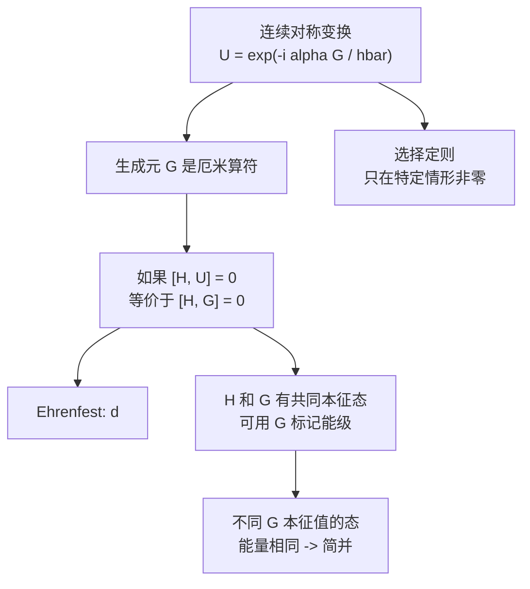

这一章会反复用到下面这个"翻译表"，建议读完之后再回来对照一次：

| 对称变换 | 幺正算符 $\hat U$ | 生成元 $\hat G$ | 守恒量 |
|------|----------|---------|------|
| 空间平移 | $\hat T(a)=e^{-ia\hat p/\hbar}$ | $\hat p$ | 动量 |
| 空间旋转 | $\hat R_{\hat n}(\phi)=e^{-i\phi\,\hat{\mathbf L}\cdot\hat n/\hbar}$ | $\hat{\mathbf L}\cdot\hat n$ | 角动量分量 |
| 时间平移 | $\hat U(t)=e^{-i\hat Ht/\hbar}$ | $\hat H$ | 能量 |
| 空间反演 | $\hat\Pi$（离散，非连续） | —— | 宇称 |

宇称是离散对称的代表：它不是连续变换，没有 Noether 意义下的"生成元"，但仍然给出选择定则。

---

## 6.0 本章符号词典

| 符号 | 含义 | 说明 |
|------|------|------|
| $\hat U$ | 幺正算符（unitary） | 满足 $\hat U^\dagger\hat U=\hat U\hat U^\dagger=\mathbb 1$ |
| $\hat G$ | 生成元（generator） | 厄米算符，$\hat U=e^{-i\alpha\hat G/\hbar}$ |
| $\hat T(a)$ | 空间平移算符 | 把波函数沿 $x$ 平移 $a$ |
| $\hat\Pi$ | 宇称（空间反演）算符 | $\hat\Pi\psi(x)=\psi(-x)$ |
| $\hat R_{\hat n}(\phi)$ | 绕 $\hat n$ 轴转角 $\phi$ 的旋转算符 | 由 $\hat{\mathbf L}\cdot\hat n$ 生成 |
| $\hat U(t)$ | 时间演化算符 | 由哈密顿量 $\hat H$ 生成 |
| $[\hat A,\hat B]$ | 对易子 | $\hat A\hat B-\hat B\hat A$ |
| $\{\hat A,\hat B\}$ | 反对易子 | $\hat A\hat B+\hat B\hat A$ |
| $\hat Q_S,\hat Q_H$ | 薛定谔/海森堡绘景中的算符 | 见 6.8 节 |
| $|\psi\rangle_S,|\psi\rangle_H$ | 薛定谔/海森堡绘景中的态 | 见 6.8 节 |
| $T^{(k)}_q$ | 球张量算符（标量 $k=0$、矢量 $k=1$） | 用于 Wigner-Eckart 定理 |

特别约定：

- 全章默认 $\hbar=1$ 仅在中间推导中使用以减少书写量；最终公式补回 $\hbar$。
- "对易"（commute）一律指 $[\hat A,\hat B]=0$。
- "不依赖时间"指算符在薛定谔绘景下 $\partial\hat Q/\partial t=0$。

---

## 6.1 空间平移算符

### 6.1.1 平移到底要做什么

在经典力学中，"把一个粒子沿 $x$ 方向平移距离 $a$"是把它的位置 $x_0$ 变成 $x_0+a$。在量子力学中，粒子的状态由波函数 $\psi(x)$ 描述，所以"平移粒子"意味着我们需要一个新的波函数 $\psi'(x)$，使得它描述的物理状态正好是原来状态平移后的样子。

直观上，如果原来在 $x_0$ 附近有个波包，平移后波包应当在 $x_0+a$ 附近。所以新波函数在 $x_0+a$ 处的值，应该等于原波函数在 $x_0$ 处的值：

$$\psi'(x_0+a)=\psi(x_0).$$

令 $x=x_0+a$，则 $x_0=x-a$，得到

$$\boxed{\psi'(x)=\psi(x-a).}$$

注意符号：平移波包"向右移 $a$"，对应于把自变量替换为 $x-a$。这是平移算符的核心定义。我们记这个变换为

$$\hat T(a)\psi(x)\equiv\psi(x-a).$$

### 6.1.2 用 $\hat p$ 写出 $\hat T(a)$

我们要证明的关键事实：

$$\boxed{\hat T(a)=\exp\!\left(-\frac{ia\hat p}{\hbar}\right),}$$

其中 $\hat p=-i\hbar\,d/dx$ 是动量算符。

**证明**：把 $\psi(x-a)$ 在 $a=0$ 附近做泰勒展开：

$$
\psi(x-a)=\sum_{n=0}^{\infty}\frac{(-a)^n}{n!}\frac{d^n\psi}{dx^n}=\sum_{n=0}^{\infty}\frac{1}{n!}\left(-a\frac{d}{dx}\right)^n\psi(x).
$$

把 $d/dx=i\hat p/\hbar$ 代入：

$$
\psi(x-a)=\sum_{n=0}^{\infty}\frac{1}{n!}\left(-\frac{ia\hat p}{\hbar}\right)^n\psi(x)=\exp\!\left(-\frac{ia\hat p}{\hbar}\right)\psi(x).
$$

证毕。

这一结果用一句话总结：**动量是空间平移的生成元**。我们后面对每一种对称变换都会得到形式完全相同的结论，请把这个推导烙在脑子里。

### 6.1.3 $\hat T(a)$ 是幺正算符

幺正算符的物理意义：变换前后内积保持，因此概率守恒。

**证明 $\hat T^\dagger(a)\hat T(a)=\mathbb 1$**：

因为 $\hat p$ 是厄米算符，$\hat p^\dagger=\hat p$。利用 $(e^{\hat A})^\dagger=e^{\hat A^\dagger}$，

$$
\hat T^\dagger(a)=\exp\!\left(\left(-\frac{ia\hat p}{\hbar}\right)^\dagger\right)=\exp\!\left(\frac{ia\hat p}{\hbar}\right)=\hat T(-a).
$$

因此

$$\hat T^\dagger(a)\hat T(a)=\hat T(-a)\hat T(a)=\hat T(0)=\mathbb 1.$$

最后一步利用了平移的群性质：

$$\hat T(a)\hat T(b)=\hat T(a+b)\quad\Longrightarrow\quad \hat T(-a)\hat T(a)=\hat T(0)=\mathbb 1.$$

### 6.1.4 验证：$\hat T(a)$ 怎么作用在位置算符上

平移后再测位置，应当得到原位置加 $a$。也就是说，

$$\hat T^\dagger(a)\hat x\hat T(a)=\hat x+a.$$

**证明**：用 Baker-Campbell-Hausdorff 形式的恒等式

$$e^{\hat A}\hat B e^{-\hat A}=\hat B+[\hat A,\hat B]+\frac{1}{2!}[\hat A,[\hat A,\hat B]]+\cdots$$

取 $\hat A=ia\hat p/\hbar$，$\hat B=\hat x$。利用 $[\hat x,\hat p]=i\hbar$，得 $[\hat A,\hat x]=(ia/\hbar)[\hat p,\hat x]=(ia/\hbar)(-i\hbar)=a$。它是 c-数，更高阶嵌套对易子为零。所以

$$\hat T^\dagger(a)\hat x\hat T(a)=e^{ia\hat p/\hbar}\hat x e^{-ia\hat p/\hbar}=\hat x+a.$$

这正是我们想要的结果：平移后再测位置就是原位置加 $a$。物理上自洽。

### 6.1.5 用图理解 $\hat T(a)$ 的两种"看法"

我们可以从两个等价角度理解 $\hat T(a)$：

| 视角 | 谁动了？ | 公式 |
|------|---------|------|
| **主动观点（active）** | 粒子动了 | $\psi'(x)=\hat T(a)\psi(x)=\psi(x-a)$ |
| **被动观点（passive）** | 坐标系动了 | $\hat x\to \hat T^\dagger(a)\hat x\hat T(a)=\hat x+a$ |

两种观点在物理预测上一致，本章统一采用主动观点。

### Key Takeaway: 6.1

| 要点 | 内容 |
|------|------|
| **平移定义** | $\hat T(a)\psi(x)=\psi(x-a)$ |
| **生成元** | $\hat T(a)=e^{-ia\hat p/\hbar}$，动量是空间平移的生成元 |
| **幺正性** | $\hat T^\dagger(a)=\hat T(-a)$，因 $\hat p$ 是厄米 |
| **群性质** | $\hat T(a)\hat T(b)=\hat T(a+b)$，阿贝尔群 |
| **算符变换** | $\hat T^\dagger(a)\hat x\hat T(a)=\hat x+a$ |

---

## 6.2 平移不变性 → 动量守恒

### 6.2.1 什么叫"哈密顿量在平移下不变"

哈密顿量 $\hat H=\hat p^2/2m+V(\hat x)$ 在平移 $\hat T(a)$ 下变换为

$$
\hat T^\dagger(a)\hat H\hat T(a)=\frac{\hat T^\dagger\hat p^2\hat T}{2m}+\hat T^\dagger V(\hat x)\hat T.
$$

第一项：$\hat p$ 和 $\hat T(a)$ 显然对易（$\hat T(a)$ 是 $\hat p$ 的函数），所以 $\hat T^\dagger\hat p^2\hat T=\hat p^2$。

第二项：利用 $\hat T^\dagger\hat x\hat T=\hat x+a$，则 $\hat T^\dagger V(\hat x)\hat T=V(\hat x+a)$（因为 $V$ 是 $\hat x$ 的解析函数，可逐阶展开）。

所以哈密顿量在平移后变成

$$\hat T^\dagger(a)\hat H\hat T(a)=\frac{\hat p^2}{2m}+V(\hat x+a).$$

**"平移不变"的物理含义**：物理结果不依赖于坐标原点的选择。这要求对所有 $a$ 都有

$$\hat T^\dagger(a)\hat H\hat T(a)=\hat H\quad\Longleftrightarrow\quad V(\hat x+a)=V(\hat x).$$

这显然要求 $V$ 是**常数**（自由粒子）。**真正"对所有 $a$ 平移不变"的系统只有自由粒子**。其他情形（如周期晶格）只对**离散平移**不变，我们留到 6.3 节。

### 6.2.2 从 $[\hat H,\hat T]=0$ 到 $[\hat H,\hat p]=0$

等价命题：$[\hat H,\hat T(a)]=0$ 对所有 $a$ 成立 $\iff$ $[\hat H,\hat p]=0$。

**证明**：

($\Leftarrow$) 若 $[\hat H,\hat p]=0$，则 $\hat H$ 与 $\hat p$ 的任意函数都对易，特别是与 $\hat T(a)=e^{-ia\hat p/\hbar}$ 对易。

($\Rightarrow$) 若 $[\hat H,\hat T(a)]=0$ 对所有 $a$，把它对 $a$ 求导并令 $a=0$：

$$
0=\left.\frac{d}{da}[\hat H,\hat T(a)]\right|_{a=0}=\left[\hat H,\left.\frac{d\hat T(a)}{da}\right|_{a=0}\right]=\left[\hat H,-\frac{i\hat p}{\hbar}\right],
$$

所以 $[\hat H,\hat p]=0$。

### 6.2.3 动量守恒：Ehrenfest 定理

由广义 Ehrenfest 定理（详见第1章和第3章）：

$$\frac{d\langle\hat Q\rangle}{dt}=\frac{i}{\hbar}\langle[\hat H,\hat Q]\rangle+\left\langle\frac{\partial\hat Q}{\partial t}\right\rangle.$$

对于 $\hat Q=\hat p$（不显含时间），如果 $[\hat H,\hat p]=0$，那么

$$\boxed{\frac{d\langle\hat p\rangle}{dt}=0.}$$

这正是经典力学中的动量守恒。在量子力学中它被精炼成一句话：

> **平移不变性 $\Longleftrightarrow$ 动量守恒**。

### 6.2.4 进一步：动量本征态是能量本征态

如果 $[\hat H,\hat p]=0$，根据线性代数中"对易厄米算符可同时对角化"的定理（详见第3章），$\hat H$ 和 $\hat p$ 有**共同本征基**。这就解释了为什么自由粒子的能量本征态可以选成平面波 $\psi_k(x)=e^{ikx}$：它们同时是 $\hat p$ 和 $\hat H$ 的本征态。

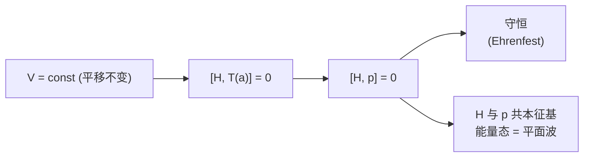

### Key Takeaway: 6.2

| 要点 | 内容 |
|------|------|
| **平移不变** | $V(\hat x+a)=V(\hat x)$ 对所有 $a$ 成立 $\Rightarrow$ $V$ 是常数 |
| **算符等式** | $[\hat H,\hat T(a)]=0\iff[\hat H,\hat p]=0$ |
| **守恒律** | $[\hat H,\hat p]=0\Rightarrow d\langle\hat p\rangle/dt=0$ |
| **物理图像** | 自由粒子的能量本征态可取为动量本征态（平面波） |

---

## 6.3 离散平移与晶格

### 6.3.1 周期势：晶格的对称性

实际固体（如金属、半导体）中电子感受到的势能是周期性的：

$$V(x+a)=V(x),$$

其中 $a$ 是晶格常数（lattice constant）。这种势能**不对所有 $a$ 平移不变**，但**对 $a$ 的整数倍 $na$ 平移不变**：

$$[\hat H,\hat T(na)]=0,\quad n\in\mathbb Z.$$

这是**离散平移对称**（discrete translational symmetry）。它不再给出连续守恒律（动量不守恒，因为 $[\hat H,\hat p]\ne 0$），但仍给出一个守恒量——一个新的"准动量"。

### 6.3.2 布洛赫定理

由于 $\hat H$ 与 $\hat T(a)$ 对易，它们有共同本征态。求 $\hat T(a)$ 的本征值：

$$\hat T(a)\psi(x)=\psi(x-a)=\lambda\psi(x).$$

幺正算符的本征值满足 $|\lambda|=1$，可写成 $\lambda=e^{-iqa}$，其中 $q$ 是一个实数（量纲为长度倒数）。所以

$$\psi(x-a)=e^{-iqa}\psi(x)\quad\Longleftrightarrow\quad \psi(x+a)=e^{iqa}\psi(x).$$

这正是**布洛赫定理（Bloch's theorem）的相位形式**：能量本征态可选成

$$\boxed{\psi_q(x)=e^{iqx}u_q(x),\quad u_q(x+a)=u_q(x).}$$

其中 $u_q(x)$ 是周期函数。$q$ 叫做**晶格动量**或**准动量**（crystal momentum），它取值在第一布里渊区 $q\in(-\pi/a,\pi/a]$ 内（区外的 $q$ 可通过加减倒格矢 $2\pi/a$ 平移回区内）。

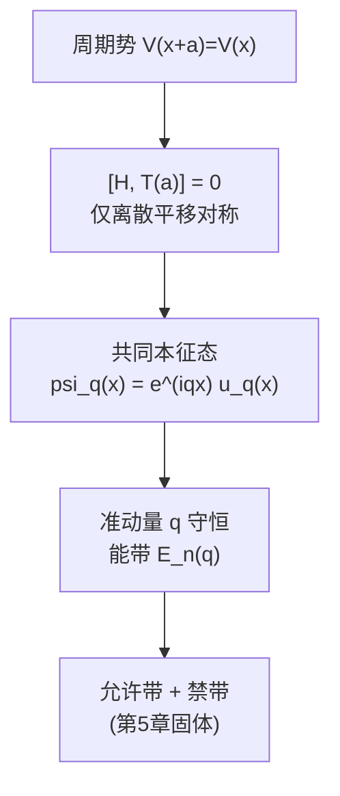

### 6.3.3 与第5章的衔接

第5章 Kronig-Penney 模型给出了能带结构。**那里得到的"允许带 + 禁带"结构，根源就在这里：离散平移对称导致 $q$ 守恒，从而能级是 $q$ 的连续函数 $E_n(q)$，称为能带**。本节只是把它的对称性来源讲清楚。

### Key Takeaway: 6.3

| 要点 | 内容 |
|------|------|
| **周期势** | $V(x+a)=V(x)$，离散平移对称 |
| **守恒量** | 准动量 $q$（不是 $\hat p$！）；连续动量 $\hat p$ 不守恒 |
| **布洛赫定理** | $\psi_q(x)=e^{iqx}u_q(x)$，$u_q$ 周期为 $a$ |
| **能带起源** | 离散对称 $\to$ $q$ 是好量子数 $\to$ 能级是 $q$ 的函数 |

---

## 6.4 宇称

到目前为止，6.1-6.3 节讲的都是**连续对称**：平移参数 $a$ 可以取任意实数，对应的幺正算符 $\hat T(a)=e^{-ia\hat p/\hbar}$ 由厄米生成元 $\hat p$ 生成。但量子力学中还存在另一类对称——**离散对称 (discrete symmetry)**，它不能写成 $e^{-i\alpha\hat G/\hbar}$ 的形式，也没有 Noether 意义下的生成元。

本节的主角是**空间反演 (space inversion)**，又称**宇称 (parity)**。它把粒子的位置 $\mathbf r$ 整体翻转到 $-\mathbf r$。尽管它只有"做"和"不做"两个状态（再做一次就回到原状态），它仍然给出一个守恒量、一组本征值、一套**选择定则 (selection rules)**——这套定则在原子物理、分子光谱、核物理里无处不在。

回想第2章里：

- 一维无限深方势阱（关于阱中心对称）的能量本征态，要么是偶函数（$\cos$），要么是奇函数（$\sin$）；
- 一维谐振子的能量本征态 $\psi_n(x)$，满足 $\psi_n(-x)=(-1)^n\psi_n(x)$；
- 氢原子球谐函数 $Y_\ell^m(\theta,\phi)$ 在 $\mathbf r\to-\mathbf r$ 下变成 $(-1)^\ell Y_\ell^m$。

这些"偶/奇"性质都不是巧合，而是因为对应哈密顿量在空间反演下不变。本节把这条"暗线"挑明。

### 6.4.1 空间反演算符的定义

我们定义**宇称算符 (parity operator)** $\hat\Pi$ 的作用为

$$\boxed{\hat\Pi\psi(\mathbf r)=\psi(-\mathbf r).}$$

一维情形下退化为 $\hat\Pi\psi(x)=\psi(-x)$。三维时为 $\mathbf r\to-\mathbf r=(-x,-y,-z)$，球坐标下 $r\to r$、$\theta\to\pi-\theta$、$\phi\to\phi+\pi$。

注意：**空间反演不是旋转**。三维空间中绕任意轴的旋转都不会把右手系变成左手系，但空间反演会。因此 $\hat\Pi$ 不属于连续旋转群 SO(3)，而是与之搭配构成更大的群 O(3)。

宇称算符在算符层面的作用：

$$\hat\Pi^\dagger\hat{\mathbf r}\hat\Pi=-\hat{\mathbf r},\qquad \hat\Pi^\dagger\hat{\mathbf p}\hat\Pi=-\hat{\mathbf p}.$$

**证明位置算符变换**：令 $\psi'(\mathbf r)=\hat\Pi\psi(\mathbf r)=\psi(-\mathbf r)$。考虑 $\hat\Pi^\dagger\hat{\mathbf r}\hat\Pi$ 作用在 $\psi$ 上的位置表示，等价地计算

$$(\hat\Pi\hat{\mathbf r}\hat\Pi^{-1})\psi(\mathbf r)=\hat\Pi(\mathbf r'\psi(\mathbf r'))|_{\mathbf r'=-\mathbf r}\;?$$

更干净的做法：在波函数上算。记 $\psi(\mathbf r)$ 在位置表象的"取值"是 $\mathbf r\psi(\mathbf r)$。则

$$\hat{\mathbf r}\hat\Pi\psi(\mathbf r)=\mathbf r\cdot\psi(-\mathbf r),\qquad \hat\Pi\hat{\mathbf r}\psi(\mathbf r)=(-\mathbf r)\psi(-\mathbf r).$$

两式相减得 $(\hat{\mathbf r}\hat\Pi+\hat\Pi\hat{\mathbf r})\psi(\mathbf r)=0$，即

$$\{\hat{\mathbf r},\hat\Pi\}=0\quad\Longleftrightarrow\quad \hat\Pi\hat{\mathbf r}=-\hat{\mathbf r}\hat\Pi.$$

结合后面要证的 $\hat\Pi^{-1}=\hat\Pi$（即 $\hat\Pi^2=\mathbb 1$），得

$$\hat\Pi^\dagger\hat{\mathbf r}\hat\Pi=\hat\Pi\hat{\mathbf r}\hat\Pi=-\hat{\mathbf r}\hat\Pi^2=-\hat{\mathbf r}.$$

**证明动量算符变换**：动量算符在位置表象下是 $\hat{\mathbf p}=-i\hbar\nabla$。注意 $\nabla_{\mathbf r}\psi(-\mathbf r)=-\nabla_{\mathbf r'}\psi(\mathbf r')|_{\mathbf r'=-\mathbf r}$，所以

$$\hat{\mathbf p}\hat\Pi\psi(\mathbf r)=-i\hbar\nabla\psi(-\mathbf r)=+i\hbar(\nabla\psi)(-\mathbf r),$$

$$\hat\Pi\hat{\mathbf p}\psi(\mathbf r)=(\hat{\mathbf p}\psi)(-\mathbf r)=-i\hbar(\nabla\psi)(-\mathbf r).$$

两式相加为零：$\{\hat{\mathbf p},\hat\Pi\}=0$，同理得 $\hat\Pi^\dagger\hat{\mathbf p}\hat\Pi=-\hat{\mathbf p}$。

总结：**$\hat{\mathbf r}$、$\hat{\mathbf p}$ 都是奇宇称算符**。

### 6.4.2 $\hat\Pi$ 既厄米又幺正

这是与连续幺正算符 $\hat T(a)=e^{-ia\hat p/\hbar}$ 显著不同的地方：连续幺正算符一般**不**厄米（除非平移参数为零）；而宇称算符**既幺正又厄米**。

**证明厄米**：要证 $\langle\phi|\hat\Pi\psi\rangle=\langle\hat\Pi\phi|\psi\rangle$。直接计算（一维即可，三维同理）：

$$
\langle\phi|\hat\Pi\psi\rangle=\int_{-\infty}^{\infty}\phi^*(x)\psi(-x)\,dx.
$$

做变量替换 $y=-x$，$dy=-dx$，积分限交换：

$$
=\int_{\infty}^{-\infty}\phi^*(-y)\psi(y)\,(-dy)=\int_{-\infty}^{\infty}\phi^*(-y)\psi(y)\,dy=\int_{-\infty}^{\infty}[\hat\Pi\phi(y)]^*\psi(y)\,dy=\langle\hat\Pi\phi|\psi\rangle.
$$

所以 $\hat\Pi^\dagger=\hat\Pi$。

**证明 $\hat\Pi^2=\mathbb 1$**：连作用两次空间反演，

$$\hat\Pi^2\psi(\mathbf r)=\hat\Pi[\psi(-\mathbf r)]=\psi(-(-\mathbf r))=\psi(\mathbf r).$$

对任意 $\psi$ 成立，所以

$$\boxed{\hat\Pi^2=\mathbb 1.}$$

**证明幺正**：结合上两条，

$$\hat\Pi^\dagger\hat\Pi=\hat\Pi\cdot\hat\Pi=\hat\Pi^2=\mathbb 1.$$

所以 $\hat\Pi$ 也是幺正的。换句话说，$\hat\Pi$ 既是可观测量（厄米），又是对称变换（幺正）——它**本身就是一个守恒量**，不需要再去找"生成元"。这正是离散对称与连续对称的关键区别。

### 6.4.3 本征值与偶/奇宇称态

由 $\hat\Pi^2=\mathbb 1$ 立刻得到 $\hat\Pi$ 的本征值。设 $\hat\Pi\psi=\eta\psi$，两边再作用一次 $\hat\Pi$：

$$\hat\Pi^2\psi=\eta\hat\Pi\psi=\eta^2\psi=\psi\quad\Longrightarrow\quad \eta^2=1\quad\Longrightarrow\quad \eta=\pm 1.$$

所以 $\hat\Pi$ 的本征值只有两个：

| 本征值 | 名称 | 波函数性质 |
|--------|------|-----------|
| $\eta=+1$ | **偶宇称态 (even parity)** | $\psi(-\mathbf r)=+\psi(\mathbf r)$ |
| $\eta=-1$ | **奇宇称态 (odd parity)** | $\psi(-\mathbf r)=-\psi(\mathbf r)$ |

任何波函数都可以分解为偶部分加奇部分：

$$\psi(\mathbf r)=\underbrace{\tfrac{1}{2}[\psi(\mathbf r)+\psi(-\mathbf r)]}_{\text{偶部 }\psi_+}+\underbrace{\tfrac{1}{2}[\psi(\mathbf r)-\psi(-\mathbf r)]}_{\text{奇部 }\psi_-}.$$

容易验证 $\hat\Pi\psi_\pm=\pm\psi_\pm$。这相当于把任意态投影到 $\hat\Pi$ 的两个本征子空间 $\mathcal H_+\oplus\mathcal H_-$ 上。投影算符为

$$\hat P_\pm=\tfrac{1}{2}(\mathbb 1\pm\hat\Pi),\qquad \hat P_+^2=\hat P_+,\;\hat P_-^2=\hat P_-,\;\hat P_+\hat P_-=0.$$

### 6.4.4 中心对称势 $\Rightarrow [\hat H,\hat\Pi]=0$

**定理**：若势能在空间反演下不变，

$$V(-\mathbf r)=V(\mathbf r),$$

则 $[\hat H,\hat\Pi]=0$。

**证明**：哈密顿量 $\hat H=\hat{\mathbf p}^2/2m+V(\hat{\mathbf r})$。

**动能项**：$\hat\Pi^\dagger\hat{\mathbf p}^2\hat\Pi=(\hat\Pi^\dagger\hat{\mathbf p}\hat\Pi)\cdot(\hat\Pi^\dagger\hat{\mathbf p}\hat\Pi)=(-\hat{\mathbf p})\cdot(-\hat{\mathbf p})=\hat{\mathbf p}^2$。动能项在宇称下不变（这与势无关，是普适的）。

**势能项**：$\hat\Pi^\dagger V(\hat{\mathbf r})\hat\Pi=V(\hat\Pi^\dagger\hat{\mathbf r}\hat\Pi)=V(-\hat{\mathbf r})$。若 $V(-\mathbf r)=V(\mathbf r)$，则 $V(-\hat{\mathbf r})=V(\hat{\mathbf r})$。

所以

$$\hat\Pi^\dagger\hat H\hat\Pi=\hat H\quad\Longleftrightarrow\quad \hat H\hat\Pi=\hat\Pi\hat H\quad\Longleftrightarrow\quad [\hat H,\hat\Pi]=0.$$

证毕。

**推论：能量本征态可选成确定宇称**。因为 $\hat H$ 与 $\hat\Pi$ 是一对对易的厄米算符，它们有共同本征基（第3章定理）。具体到非简并能级 $E_n$，对应的本征态 $\psi_n$ 自动是 $\hat\Pi$ 的本征态（要么偶要么奇）。对于简并能级，可在该简并子空间内重新对角化 $\hat\Pi$，得到偶/奇宇称的本征基。

更直接的论证：设 $\hat H\psi=E\psi$，由 $[\hat H,\hat\Pi]=0$，$\hat H(\hat\Pi\psi)=\hat\Pi\hat H\psi=E(\hat\Pi\psi)$，故 $\hat\Pi\psi$ 也是能量为 $E$ 的本征态。若 $E$ 非简并，则 $\hat\Pi\psi=\eta\psi$，由本征值取值 $\eta=\pm 1$。若简并，构造

$$\psi_\pm=\tfrac{1}{2}(\psi\pm\hat\Pi\psi)\in\mathcal H_\pm,$$

它们仍然是 $E$ 的本征态，且分别属于偶/奇宇称。

### 6.4.5 物理实例：哪些态是偶宇称、哪些是奇宇称

| 系统 | 态 | 宇称 | 原因 |
|------|-----|------|------|
| 一维谐振子 | $\psi_n(x)\propto H_n(\xi)e^{-\xi^2/2}$ | $(-1)^n$ | Hermite 多项式 $H_n(-\xi)=(-1)^n H_n(\xi)$ |
| 一维无限深方势阱（关于阱中心对称） | $\psi_n$ | $(-1)^{n-1}$（$n=1,2,\ldots$ 编号下基态为偶） | $\cos$ 偶，$\sin$ 奇 |
| 氢原子 | $\psi_{n\ell m}=R_{n\ell}(r)Y_\ell^m(\theta,\phi)$ | $(-1)^\ell$ | $R$ 只依赖 $r$（偶），$Y_\ell^m$ 在 $\mathbf r\to-\mathbf r$ 下乘 $(-1)^\ell$ |
| 三维各向同性谐振子 | $\psi_{n_x n_y n_z}$ | $(-1)^{n_x+n_y+n_z}$ | 每个方向独立 |

**重点验证：氢原子 $Y_\ell^m$ 的宇称**。在球坐标下，$\mathbf r\to-\mathbf r$ 等价于 $\theta\to\pi-\theta$、$\phi\to\phi+\pi$。已知

$$Y_\ell^m(\theta,\phi)\propto P_\ell^m(\cos\theta)e^{im\phi}.$$

变换后：

- $\cos(\pi-\theta)=-\cos\theta$，所以 $P_\ell^m(\cos\theta)\to P_\ell^m(-\cos\theta)=(-1)^{\ell-|m|}P_\ell^m(\cos\theta)$；
- $e^{im(\phi+\pi)}=(-1)^m e^{im\phi}$。

总变换因子：$(-1)^{\ell-|m|}\cdot(-1)^m=(-1)^{\ell-|m|+m}$。由于 $-|m|+m$ 是偶数（对 $m\ge 0$ 为 $0$，对 $m<0$ 为 $-2|m|$），上式简化为 $(-1)^\ell$。所以

$$\boxed{\hat\Pi Y_\ell^m(\theta,\phi)=(-1)^\ell Y_\ell^m(\theta,\phi).}$$

这条性质把"角量子数 $\ell$"与"宇称"绑在一起：$s$ 态（$\ell=0$）和 $d$ 态（$\ell=2$）是偶宇称，$p$ 态（$\ell=1$）和 $f$ 态（$\ell=3$）是奇宇称。

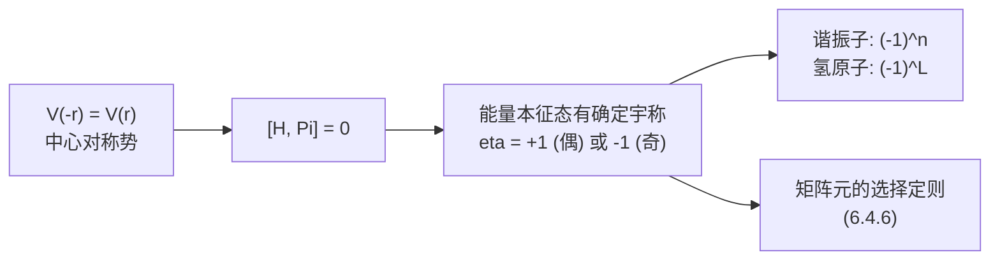

### 6.4.6 基于宇称的选择定则

**核心定理**（宇称选择定则）：

> 设算符 $\hat O$ 在空间反演下变换为 $\hat\Pi^\dagger\hat O\hat\Pi=(-1)^{\pi_O}\hat O$，其中 $\pi_O=0$（偶宇称算符）或 $\pi_O=1$（奇宇称算符）。设 $|\psi_a\rangle,|\psi_b\rangle$ 是宇称本征态，本征值分别为 $(-1)^{\pi_a},(-1)^{\pi_b}$。则
>
> $$\boxed{\pi_a+\pi_O+\pi_b\text{ 为奇} \quad\Longrightarrow\quad \langle\psi_a|\hat O|\psi_b\rangle=0.}$$

换句话说：**算符的宇称必须"打通"两个态的宇称差**，矩阵元才有机会非零。

**证明**：插入 $\hat\Pi^2=\mathbb 1$，

$$
\langle\psi_a|\hat O|\psi_b\rangle=\langle\psi_a|\hat\Pi^\dagger\hat\Pi\hat O\hat\Pi^\dagger\hat\Pi|\psi_b\rangle.
$$

注意 $\hat\Pi$ 厄米所以 $\hat\Pi^\dagger=\hat\Pi$。利用本征关系 $\hat\Pi|\psi_a\rangle=(-1)^{\pi_a}|\psi_a\rangle$（同样对 $b$），以及算符变换关系 $\hat\Pi\hat O\hat\Pi=\hat\Pi\hat O\hat\Pi^\dagger=(-1)^{\pi_O}\hat O$（注意 $\hat\Pi=\hat\Pi^\dagger$，所以两种写法等价），上式右端变为

$$\langle\psi_a|\hat\Pi\cdot(\hat\Pi\hat O\hat\Pi)\cdot\hat\Pi|\psi_b\rangle=(-1)^{\pi_a}\cdot(-1)^{\pi_O}\cdot(-1)^{\pi_b}\langle\psi_a|\hat O|\psi_b\rangle.$$

合并：

$$\langle\psi_a|\hat O|\psi_b\rangle=(-1)^{\pi_a+\pi_O+\pi_b}\langle\psi_a|\hat O|\psi_b\rangle.$$

若指数之和为奇，则 $\langle\psi_a|\hat O|\psi_b\rangle=-\langle\psi_a|\hat O|\psi_b\rangle$，即矩阵元为零。证毕。

**两种直接推论**：

| 算符宇称 | 同宇称态 $\langle a|\hat O|a'\rangle$（$\pi_a=\pi_{a'}$） | 异宇称态 $\langle a|\hat O|b\rangle$（$\pi_a\ne\pi_b$） |
|---------|--------------------------------------|--------------------------------------|
| **奇宇称**（$\hat x,\hat p,\hat{\mathbf r}$） | $\equiv 0$ | 可非零 |
| **偶宇称**（$\hat x^2,\hat H,\hat L^2,\hat r^2$） | 可非零 | $\equiv 0$ |

### 6.4.7 应用：四个零与一个非零

**应用 1：一维谐振子的位置期望值**。$\hat x$ 是奇宇称算符，$\psi_n$ 的宇称为 $(-1)^n$。同态期望值

$$\langle\psi_n|\hat x|\psi_n\rangle.$$

宇称指数和：$\pi_a+\pi_O+\pi_b=n+1+n=2n+1$（奇）。因此

$$\boxed{\langle\psi_n|\hat x|\psi_n\rangle=0,\quad \forall n.}$$

**物理含义**：定态下的位置期望值始终位于势阱中心。这与定态的稳态性质一致——若 $\langle\hat x\rangle\ne 0$，依据 Ehrenfest 定理 $\langle\hat x\rangle$ 应随时间振荡，不可能是定态。

**应用 2：氢原子基态的电偶极矩为零**。氢原子基态 $|100\rangle=\psi_{100}(\mathbf r)$，$\ell=0$，宇称为 $(-1)^0=+1$（偶）。电偶极算符 $\hat{\mathbf d}=-e\hat{\mathbf r}$（奇宇称）。同态期望

$$\langle 100|\hat x|100\rangle=\langle 100|\hat y|100\rangle=\langle 100|\hat z|100\rangle=0.$$

宇称指数和 $0+1+0=1$（奇）$\Rightarrow$ 零。同理任意 $|n\ell m\rangle$ 的电偶极矩为零（因为宇称指数 $\pi=\ell$，而 $\hat r$ 奇宇称，所以 $\pi_a+\pi_O+\pi_b=2\ell+1$ 永远为奇）。

> 这是为什么**孤立原子没有永久电偶极矩**的根本原因——只要哈密顿量有空间反演对称性，定态就有确定宇称，从而电偶极矩自动为零。

**应用 3：异宇称态之间 $\hat x$ 不为零（电偶极跃迁）**。考虑 $\langle 100|\hat x|210\rangle$：

- $|100\rangle$（$1s$）：$\ell=0$，偶宇称（$\pi_a=0$）；
- $|210\rangle$（$2p_z$）：$\ell=1$，奇宇称（$\pi_b=1$）；
- $\hat x$：奇宇称（$\pi_O=1$）。

宇称指数和 $0+1+1=2$（偶），**不被宇称强制为零**——也就是矩阵元**可能非零**（实际计算结果确实非零，留作习题）。这正是**电偶极跃迁 $2p\to 1s$ 之所以被允许**的对称性根据。

更一般地，电偶极跃迁要求

$$(-1)^{\ell_f}\cdot(-1)\cdot(-1)^{\ell_i}=+1\quad\Longrightarrow\quad \ell_f+\ell_i\text{ 为奇}\quad\Longrightarrow\quad \Delta\ell\text{ 为奇}.$$

宇称对称只能给到这一步——它告诉我们 $\Delta\ell$ 必须为奇（即排除 $\Delta\ell=0,\pm 2,\ldots$）。要进一步把 $\Delta\ell$ 限制为 $\pm 1$，需要旋转对称（角动量代数），那要等到 **6.7 节** Wigner-Eckart 定理。

**应用 4：偶宇称算符不能连接异宇称态**。例如 $\langle 100|\hat r^2|210\rangle=0$，因为 $\hat r^2$ 偶宇称（$\pi_O=0$），宇称指数和 $0+0+1=1$（奇）。

将这些例子整理为一张速查表：

| 矩阵元 | 算符宇称 | 态宇称对 | 指数和 | 结论 |
|--------|---------|---------|--------|------|
| $\langle\psi_n|\hat x|\psi_n\rangle$（谐振子） | 奇 | 同 | 奇 | $=0$ |
| $\langle\psi_n|\hat x^2|\psi_n\rangle$ | 偶 | 同 | 偶 | 一般非零 |
| $\langle 100|\hat z|100\rangle$（氢原子） | 奇 | 同 | 奇 | $=0$ |
| $\langle 100|\hat z|210\rangle$ | 奇 | 异 | 偶 | 一般非零 |
| $\langle 100|\hat r^2|210\rangle$ | 偶 | 异 | 奇 | $=0$ |
| $\langle 200|\hat z|100\rangle$（$2s\to 1s$） | 奇 | 同（都偶） | 奇 | $=0$（**$2s\to 1s$ 电偶极禁戒**） |

最后一行非常重要：氢原子 $2s$ 态的电偶极跃迁到基态被宇称禁戒（两者都是 $\ell$ 偶），所以 $2s$ 态寿命极长（实验上由二光子过程主导）。

### 6.4.8 离散对称的特殊性：没有 Noether 生成元，仍然守恒

宇称与平移、旋转、时间平移有一个本质区别：**它没有连续参数**。$\hat\Pi$ 不能写成 $e^{-i\alpha\hat G/\hbar}$ 的形式——做"半个空间反演"是没有意义的。

回顾 6.1 节，我们对连续对称的处理框架是：

$$\hat U(\alpha)=e^{-i\alpha\hat G/\hbar}\quad\xrightarrow{\;[\hat H,\hat U]=0\;}\quad [\hat H,\hat G]=0\quad\xrightarrow{\;\text{Ehrenfest}\;}\quad \frac{d\langle\hat G\rangle}{dt}=0.$$

对宇称，这条"翻译链"在第一步就走不通——没有生成元 $\hat G$ 可以微商。但**好消息**是：$\hat\Pi$ 本身既是幺正又是厄米的，**它就同时扮演了"对称变换"和"守恒量"两个角色**。所以离散对称的守恒律框架可以简化为

$$[\hat H,\hat\Pi]=0\quad\xrightarrow{\;\text{Ehrenfest}\;}\quad \frac{d\langle\hat\Pi\rangle}{dt}=0.$$

具体物理含义：**若初态有确定宇称，则在中心对称势下，时间演化过程中宇称保持不变**。这一守恒律仍然给出选择定则，仍然给出量子数标记，只不过取值离散为 $\pm 1$ 而非连续实数。

我们用一张图总结连续对称与离散对称的对比：

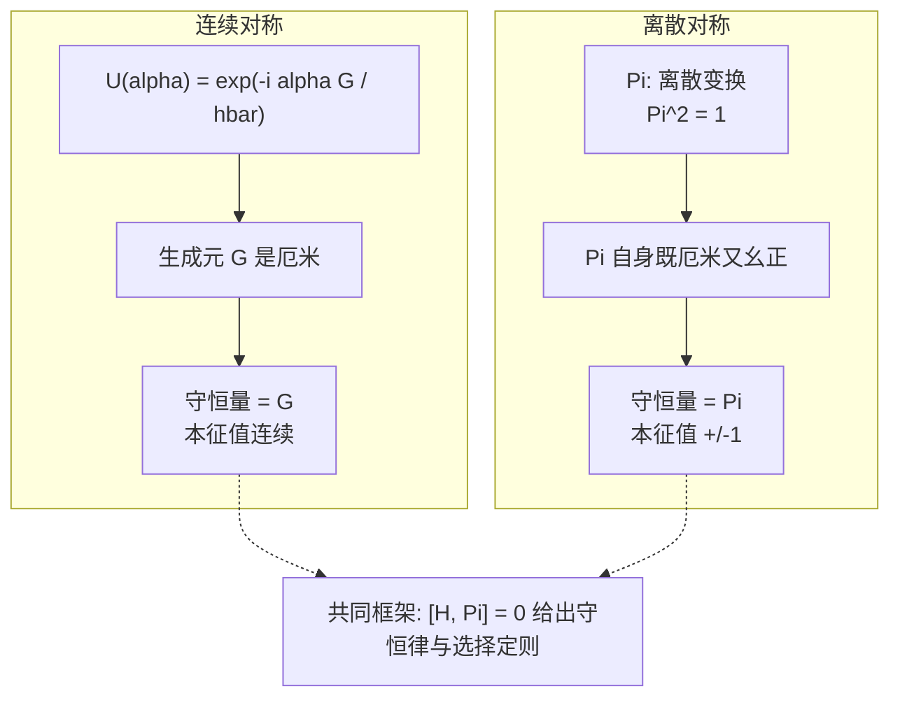

### 6.4.9 一个常见误区：宇称守恒并非"普适规律"

宇称守恒来自空间反演对称 $V(-\mathbf r)=V(\mathbf r)$。如果势能没有这个对称性，宇称就不守恒。例如：

- **加上均匀外电场**：$V=V_{\text{中心}}(r)-e\mathcal E z$，势能项 $-e\mathcal E z$ 是奇宇称的，因此 $\hat H$ 不再与 $\hat\Pi$ 对易。这就是为什么 Stark 效应里能态会被"混合"——$|2s\rangle$ 和 $|2p\rangle$（异宇称）通过外场耦合，原本严格为零的矩阵元变得非零。
- **手性分子（chirality）**：分子势能整体反演下变成"镜像异构体"，并不还原。
- **弱相互作用**（基本物理）：1956 年杨振宁和李政道指出弱相互作用下宇称不守恒，吴健雄 1957 年实验确认。这是 20 世纪粒子物理最重大的发现之一。

提醒：**对称性是物理假设，不是数学公理**。每次使用宇称选择定则前，先问一句"哈密顿量到底有没有空间反演对称？"——这就是物理学家在做的事。

### Key Takeaway: 6.4

| 要点 | 内容 |
|------|------|
| **定义** | $\hat\Pi\psi(\mathbf r)=\psi(-\mathbf r)$，$\hat\Pi^\dagger\hat{\mathbf r}\hat\Pi=-\hat{\mathbf r}$，$\hat\Pi^\dagger\hat{\mathbf p}\hat\Pi=-\hat{\mathbf p}$ |
| **基本性质** | $\hat\Pi^2=\mathbb 1$、既厄米又幺正、本征值 $\eta=\pm 1$ |
| **守恒条件** | $V(-\mathbf r)=V(\mathbf r)\Rightarrow [\hat H,\hat\Pi]=0$，能量本征态可选成偶/奇宇称 |
| **典型宇称** | 谐振子 $\psi_n$：$(-1)^n$；氢原子 $\psi_{n\ell m}$：$(-1)^\ell$ |
| **选择定则** | $\langle a|\hat O|b\rangle=0$ 当 $\pi_a+\pi_O+\pi_b$ 为奇 |
| **位置矩阵元** | 同宇称态 $\langle\psi|\hat{\mathbf r}|\psi\rangle\equiv 0$；电偶极跃迁要求 $\Delta\ell$ 为奇 |
| **离散性** | 无 Noether 生成元，但 $\hat\Pi$ 自身就是守恒量；本征值离散为 $\pm 1$ |
| **守恒是物理假设** | 外电场、手性分子、弱相互作用下宇称不守恒 |

---

## 6.5 旋转算符

### 6.5.1 旋转要做什么

6.1 节我们建立了平移与动量的关系：动量 $\hat p$ 是空间平移的生成元。本节做完全平行的工作，把"平移→动量"换成"旋转→角动量"。读者会发现，几乎每一步都能在 6.1 节中找到对应。

**经典图像**：在三维空间中，绕单位矢量 $\hat n$ 转角 $\phi$ 是一个 $SO(3)$ 变换。它把位置矢量 $\mathbf r$ 变为 $R_{\hat n}(\phi)\mathbf r$，其中 $R_{\hat n}(\phi)$ 是一个正交矩阵。

**量子图像**：粒子的态是波函数 $\psi(\mathbf r)$，"旋转粒子"意味着我们要构造一个新波函数 $\psi'(\mathbf r)$，使其描述的物理状态等于原状态绕 $\hat n$ 转 $\phi$ 后的样子。

仿照 6.1 节的"波包向右移 $a$ 等价于自变量替换为 $x-a$"，旋转后的新波函数应满足：

$$\psi'(R_{\hat n}(\phi)\mathbf r)=\psi(\mathbf r)\quad\Longleftrightarrow\quad \psi'(\mathbf r)=\psi(R_{\hat n}^{-1}(\phi)\mathbf r)=\psi(R_{\hat n}(-\phi)\mathbf r).$$

我们记这个变换为

$$\hat R_{\hat n}(\phi)\psi(\mathbf r)\equiv\psi(R_{\hat n}(-\phi)\mathbf r).$$

下面我们要证明：**轨道角动量是空间旋转的生成元**。

---

### 6.5.2 $\hat L_z$ 是绕 $z$ 轴旋转的生成元

为说明思路，先取最简单的情形：绕 $z$ 轴旋转。在球坐标 $(r,\theta,\phi)$ 下，绕 $z$ 轴转 $\varphi$ 角只改变方位角 $\phi$，不改变 $r,\theta$：

$$R_{\hat z}(\varphi):\quad (r,\theta,\phi)\mapsto(r,\theta,\phi+\varphi).$$

所以波函数变换为

$$\hat R_{\hat z}(\varphi)\psi(r,\theta,\phi)=\psi(r,\theta,\phi-\varphi).$$

把 $\psi$ 看作 $\phi$ 的函数（$r,\theta$ 固定），上式就是 6.1 节的一维平移——只是把 $x\to\phi$、$a\to\varphi$。

**HW Problem 4.56(a) 的证明**：对 $\phi$ 做泰勒展开。设 $f(\phi)$ 是任意可解析展开的函数，则

$$
f(\phi+\varphi)=\sum_{n=0}^{\infty}\frac{\varphi^n}{n!}\frac{d^nf}{d\phi^n}=\sum_{n=0}^{\infty}\frac{1}{n!}\left(\varphi\frac{d}{d\phi}\right)^nf(\phi).
$$

利用 4.3.5 节给出的角动量算符位置表象表达式

$$\hat L_z=-i\hbar\frac{\partial}{\partial\phi}\quad\Longleftrightarrow\quad \frac{d}{d\phi}=\frac{i\hat L_z}{\hbar},$$

代入上式得

$$\boxed{f(\phi+\varphi)=\sum_{n=0}^{\infty}\frac{1}{n!}\left(\frac{i\varphi\hat L_z}{\hbar}\right)^n f(\phi)=\exp\!\left(\frac{i\varphi\hat L_z}{\hbar}\right)f(\phi).}$$

证毕。

**符号说明**：这里出现的是 $+i\varphi\hat L_z/\hbar$，而非 6.1 节的 $-ia\hat p/\hbar$。两者符号差别只是因为我们这里推导的是 $f(\phi+\varphi)$，对应于 6.1 节里把波包"反向移动" $-\varphi$。统一约定为"主动旋转粒子" $+\varphi$ 时（即 $\psi'(\phi)=\psi(\phi-\varphi)$），相应的算符是

$$\hat R_{\hat z}(\varphi)=\exp\!\left(-\frac{i\varphi\hat L_z}{\hbar}\right).$$

下面我们一律使用这个"主动旋转"约定，与 6.1 节的 $\hat T(a)=\exp(-ia\hat p/\hbar)$ 完全平行。

---

### 6.5.3 绕任意轴 $\hat n$ 旋转

把上述结论推广到任意旋转轴 $\hat n=(n_x,n_y,n_z)$（单位矢量）。对一个无穷小转角 $\delta\varphi$，绕 $\hat n$ 的旋转把矢量 $\mathbf r$ 变为

$$\mathbf r\to\mathbf r+\delta\varphi\,(\hat n\times\mathbf r)+O(\delta\varphi^2).$$

相应的波函数变换为

$$\psi'(\mathbf r)=\psi(\mathbf r-\delta\varphi\,\hat n\times\mathbf r)+O(\delta\varphi^2)=\psi(\mathbf r)-\delta\varphi(\hat n\times\mathbf r)\cdot\nabla\psi(\mathbf r)+\cdots$$

利用循环恒等式 $(\hat n\times\mathbf r)\cdot\nabla=\hat n\cdot(\mathbf r\times\nabla)$，并把 $\hat{\mathbf L}=\mathbf r\times(-i\hbar\nabla)$ 代入，

$$
(\hat n\times\mathbf r)\cdot\nabla=\hat n\cdot(\mathbf r\times\nabla)=\frac{i}{\hbar}\hat n\cdot\hat{\mathbf L}.
$$

所以

$$\psi'(\mathbf r)=\left(\mathbb 1-\frac{i\delta\varphi}{\hbar}\hat n\cdot\hat{\mathbf L}+O(\delta\varphi^2)\right)\psi(\mathbf r).$$

把这一无穷小变换"指数化"（指数化的合法性来自 $\hat n\cdot\hat{\mathbf L}$ 是厄米算符，与 6.1.3 节的论证完全同构）：

$$\boxed{\hat R_{\hat n}(\varphi)=\exp\!\left(-\frac{i\varphi}{\hbar}\hat n\cdot\hat{\mathbf L}\right).}$$

**物理总结**：$\hat n\cdot\hat{\mathbf L}/\hbar$ 是绕 $\hat n$ 轴旋转的生成元。这正是 6.0 节"对应表"里第二行的内容。

**幺正性**：因 $\hat L_x,\hat L_y,\hat L_z$ 都是厄米算符，所以 $\hat n\cdot\hat{\mathbf L}$ 是厄米，故 $\hat R_{\hat n}(\varphi)$ 是幺正：

$$\hat R_{\hat n}^\dagger(\varphi)=\hat R_{\hat n}(-\varphi),\qquad \hat R_{\hat n}^\dagger\hat R_{\hat n}=\mathbb 1.$$

**注意**：与平移群不同，旋转群 $SO(3)$ 是**非阿贝尔**的。绕不同轴的旋转一般不对易：

$$\hat R_{\hat x}(\alpha)\hat R_{\hat y}(\beta)\ne\hat R_{\hat y}(\beta)\hat R_{\hat x}(\alpha).$$

这一性质的代数根源就是 $[\hat L_i,\hat L_j]=i\hbar\,\epsilon_{ijk}\hat L_k\ne 0$。

---

### 6.5.4 自旋的旋转

到目前为止我们处理的是"轨道"自由度，所以生成元自然就是轨道角动量 $\hat{\mathbf L}$。

**问题**：自旋是粒子的内禀自由度，没有空间坐标，那么"旋转一个旋量"是什么意思？

**答案**：从对称性的观点看，**任何角动量都是某种旋转的生成元**。具体地，全角动量

$$\hat{\mathbf J}=\hat{\mathbf L}+\hat{\mathbf S}$$

才是"包含自旋在内的完整旋转"的生成元。对应的旋转算符是

$$\boxed{\hat U_{\hat n}(\varphi)=\exp\!\left(-\frac{i\varphi}{\hbar}\hat n\cdot\hat{\mathbf J}\right).}$$

它作用在"坐标⊗旋量"复合空间上。如果暂时忽略空间部分，只考虑自旋部分，对应的算符就是

$$\boxed{\hat U_{\hat n}^{\mathrm{spin}}(\varphi)=\exp\!\left(-\frac{i\varphi}{\hbar}\hat n\cdot\hat{\mathbf S}\right).}$$

这就是 HW Problem 4.56(a) 提示中说的"自旋情形的旋转生成元是 $\hat{\mathbf S}\cdot\hat n/\hbar$"。注意它的形式与轨道情形完全一致——这正是角动量代数的统一之美：**所有满足 $[\hat J_i,\hat J_j]=i\hbar\epsilon_{ijk}\hat J_k$ 的算符都自动生成一个 $SU(2)$（或 $SO(3)$）旋转**，不管它来自空间转动还是来自内禀自由度。

---

### 6.5.5 自旋 1/2 的旋转矩阵（HW Problem 4.56(e)）

把上式具体写成自旋 1/2 的 $2\times 2$ 矩阵。利用 $\hat{\mathbf S}=(\hbar/2)\boldsymbol\sigma$（$\boldsymbol\sigma=(\sigma_x,\sigma_y,\sigma_z)$ 为泡利矩阵），

$$\hat U_{\hat n}^{\mathrm{spin}}(\varphi)=\exp\!\left(-\frac{i\varphi}{\hbar}\cdot\frac{\hbar}{2}\hat n\cdot\boldsymbol\sigma\right)=\exp\!\left(-\frac{i\varphi}{2}\hat n\cdot\boldsymbol\sigma\right).$$

习惯上，4.56(e) 题写成 $+i$ 号（对应于"被动旋转坐标系"或与我们这里相反的旋转方向约定），即

$$D(\hat n,\varphi)\equiv\exp\!\left(\frac{i\varphi}{2}\hat n\cdot\boldsymbol\sigma\right).$$

下面我们要证明（HW 4.56(e)）：

$$\boxed{\exp\!\left(\frac{i\varphi}{2}\hat n\cdot\boldsymbol\sigma\right)=\cos\!\left(\frac{\varphi}{2}\right)\mathbb 1+i\sin\!\left(\frac{\varphi}{2}\right)(\hat n\cdot\boldsymbol\sigma).}$$

**关键步骤一：证明 $(\hat n\cdot\boldsymbol\sigma)^2=\mathbb 1$**。

利用泡利矩阵的核心恒等式（4.4 节已证）：

$$\sigma_i\sigma_j=\delta_{ij}\mathbb 1+i\epsilon_{ijk}\sigma_k.$$

把 $\hat n\cdot\boldsymbol\sigma=n_i\sigma_i$ 自乘：

$$
(\hat n\cdot\boldsymbol\sigma)^2=n_in_j\sigma_i\sigma_j=n_in_j(\delta_{ij}\mathbb 1+i\epsilon_{ijk}\sigma_k).
$$

第一项 $n_in_i=|\hat n|^2=1$，得到 $\mathbb 1$。第二项 $\epsilon_{ijk}n_in_j=0$（反对称张量缩并对称张量），得到 $0$。所以

$$\boxed{(\hat n\cdot\boldsymbol\sigma)^2=\mathbb 1.}$$

**关键步骤二：泰勒展开分奇偶项**。

把 $\xi\equiv\varphi/2$，记 $A\equiv\hat n\cdot\boldsymbol\sigma$，则 $A^2=\mathbb 1$，从而

$$A^{2k}=(A^2)^k=\mathbb 1,\qquad A^{2k+1}=A\cdot A^{2k}=A.$$

泰勒展开

$$
e^{i\xi A}=\sum_{n=0}^{\infty}\frac{(i\xi A)^n}{n!}=\sum_{k=0}^{\infty}\frac{(i\xi)^{2k}}{(2k)!}A^{2k}+\sum_{k=0}^{\infty}\frac{(i\xi)^{2k+1}}{(2k+1)!}A^{2k+1}
$$

$$
=\sum_{k=0}^{\infty}\frac{(-1)^k\xi^{2k}}{(2k)!}\mathbb 1+i\sum_{k=0}^{\infty}\frac{(-1)^k\xi^{2k+1}}{(2k+1)!}A
$$

$$
=\cos\xi\,\mathbb 1+i\sin\xi\,A.
$$

代回 $\xi=\varphi/2$、$A=\hat n\cdot\boldsymbol\sigma$，得证。

**结论**：在自旋 1/2 子空间，绕 $\hat n$ 轴转 $\varphi$ 的旋转矩阵是

$$\boxed{D(\hat n,\varphi)=\cos\!\left(\frac{\varphi}{2}\right)\mathbb 1+i\sin\!\left(\frac{\varphi}{2}\right)(\hat n\cdot\boldsymbol\sigma).}$$

具体写出 $2\times 2$ 矩阵形式：

$$D(\hat n,\varphi)=\begin{pmatrix}\cos(\varphi/2)+in_z\sin(\varphi/2) & (in_x+n_y)\sin(\varphi/2)\\(in_x-n_y)\sin(\varphi/2) & \cos(\varphi/2)-in_z\sin(\varphi/2)\end{pmatrix}.$$

---

### 6.5.6 $2\pi$ 旋转变号、$4\pi$ 才恢复

这个公式有一个让初学者震惊的物理推论。**对自旋 1/2，取 $\varphi=2\pi$（绕任意轴转一圈）**：

$$D(\hat n,2\pi)=\cos\pi\,\mathbb 1+i\sin\pi\,(\hat n\cdot\boldsymbol\sigma)=-\mathbb 1.$$

也就是说

$$\boxed{\chi'=D(\hat n,2\pi)\chi=-\chi.}$$

**$2\pi$ 旋转把旋量变成负号**！只有再转一圈到 $4\pi$ 才恢复：

$$D(\hat n,4\pi)=\cos 2\pi\,\mathbb 1+i\sin 2\pi\,(\hat n\cdot\boldsymbol\sigma)=+\mathbb 1.$$

**这是否与经典直觉冲突？**

经典上，一个物体绕任意轴转 $2\pi$ 就回到原样。但量子力学中的旋量不是经典矢量，它只是$SU(2)$ 群（旋转群的"双覆盖"）的二维表示。$SO(3)$ 中绕 $\hat n$ 转 $\varphi=2\pi$ 是单位元素，但在 $SU(2)$ 中，对应的元素是 $-\mathbb 1$；只有 $\varphi=4\pi$ 在 $SU(2)$ 里才回到 $+\mathbb 1$。

**这是物理可观测的吗？**

直接看一个旋量是不可测的：$\chi$ 和 $-\chi$ 给出完全相同的概率密度。但若做**干涉实验**：让一束自旋 1/2 粒子分成两路，一路经过磁场旋转 $2\pi$，另一路不旋转，再合并起来。两路的相对相位差为 $\pi$，干涉条纹移动了半个周期——这是经典物体完全没有的现象。

实验：1975 年 Werner、Colella、Overhauser 用中子干涉仪首次验证了此效应。

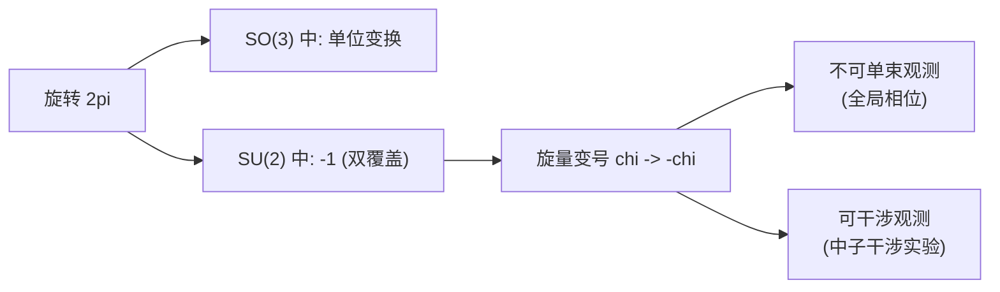

**深层原因**：泡利的"自旋统计定理"告诉我们，所有半整数自旋粒子（费米子）都共享这个 $-1$ 因子；整数自旋粒子（玻色子）则没有。这是费米-狄拉克统计与玻色-爱因斯坦统计的拓扑根源。

**自旋 1/2 算符与轨道角动量的对比**：

| 性质 | 轨道 $\hat L$ | 自旋 1/2 $\hat S$ |
|------|----------|----------|
| $\hat n\cdot\hat L$ 的本征值 | $m\hbar$，$m=-\ell,\dots,\ell$（整数） | $\pm\hbar/2$ |
| $\hat R(2\pi)$ | $\exp(-i\cdot 2\pi\cdot m)=\mathbb 1$ | $-\mathbb 1$ |
| 群结构 | $SO(3)$ | $SU(2)$（$SO(3)$ 的双覆盖） |
| 旋转矩阵指数项 | $-i\varphi\,\hat L/\hbar$ | $-i\varphi\,\boldsymbol\sigma/2$（角度减半！） |

请特别注意指数项中的因子 $1/2$：自旋 1/2 的旋转矩阵中出现的是 $\varphi/2$，因此转一圈相位累积 $\pi$，得到 $-1$。

---

### Key Takeaway: 6.5

| 要点 | 内容 |
|------|------|
| **旋转算符** | $\hat R_{\hat n}(\varphi)=\exp(-i\varphi\hat n\cdot\hat{\mathbf L}/\hbar)$ |
| **$\hat L_z$ 是生成元** | 由 $\hat L_z=-i\hbar\,\partial/\partial\phi$ 直接泰勒展开 |
| **任意角动量都生成旋转** | 自旋情形用 $\hat{\mathbf S}\cdot\hat n/\hbar$ 替换 |
| **自旋 1/2 旋转矩阵** | $\exp(i\varphi\hat n\cdot\boldsymbol\sigma/2)=\cos(\varphi/2)\mathbb 1+i\sin(\varphi/2)(\hat n\cdot\boldsymbol\sigma)$ |
| **关键引理** | $(\hat n\cdot\boldsymbol\sigma)^2=\mathbb 1$ |
| **反直觉现象** | $2\pi$ 旋转使旋量变号，$4\pi$ 才恢复（$SU(2)$ 双覆盖 $SO(3)$） |
| **群结构** | 旋转群非阿贝尔；根源是 $[\hat L_i,\hat L_j]\ne 0$ |

---

## 6.6 旋转不变性 $\to$ 角动量守恒 & 简并

我们建立了"旋转算符 $\Leftrightarrow$ 角动量"的对应。本节套用 6.2 节的逻辑回答：哪些系统对旋转不变？相应地有什么守恒律和简并？

### 6.6.1 旋转不变的判据

仿照 6.2.2 节，"哈密顿量在旋转下不变"就是：对任意 $\hat n$ 和 $\varphi$，

$$\hat R_{\hat n}^\dagger(\varphi)\hat H\hat R_{\hat n}(\varphi)=\hat H\quad\Longleftrightarrow\quad [\hat H,\hat R_{\hat n}(\varphi)]=0.$$

把它对 $\varphi$ 求导并令 $\varphi=0$，得到

$$[\hat H,\hat n\cdot\hat{\mathbf L}]=0.$$

由于 $\hat n$ 是任意方向，这等价于

$$\boxed{[\hat H,\hat L_x]=[\hat H,\hat L_y]=[\hat H,\hat L_z]=0.}$$

**三个分量都与 $\hat H$ 对易**。这是与平移不变性最大的区别：平移不变只给出一个守恒量 $\hat p$（沿一个方向），而完全的旋转不变性给出**三个**守恒量 $\hat L_x,\hat L_y,\hat L_z$。

注意：三个分量本身两两不对易（$[\hat L_i,\hat L_j]=i\hbar\epsilon_{ijk}\hat L_k\ne 0$），所以它们**不能同时具有确定值**——但它们都是好量子数的"候选"，可以分别守恒。

---

### 6.6.2 角动量守恒：Ehrenfest 定理

由广义 Ehrenfest 定理（对不显含时间的算符）：

$$\frac{d\langle\hat L_i\rangle}{dt}=\frac{i}{\hbar}\langle[\hat H,\hat L_i]\rangle=0.$$

所以

$$\boxed{\frac{d\langle\hat{\mathbf L}\rangle}{dt}=\mathbf 0.}$$

矢量形式的角动量期望值守恒——这是经典力学角动量守恒的量子对应。

同样地，$\hat L^2=\hat L_x^2+\hat L_y^2+\hat L_z^2$ 与 $\hat H$ 对易（因每个 $\hat L_i$ 都与 $\hat H$ 对易），所以 $\langle\hat L^2\rangle$ 也守恒。

更一般地，**有自旋的系统**（如氢原子加电子自旋）若 $\hat H$ 不依赖自旋（自由项）或对 $\hat{\mathbf J}=\hat{\mathbf L}+\hat{\mathbf S}$ 不变，则 $\hat{\mathbf J}$ 的三个分量都守恒。这是 4.4.5 节"全角动量是好量子数"的对称性根源。

---

### 6.6.3 中心势的旋转不变性

哪些哈密顿量是旋转不变的？最重要的一类是**中心势**：

$$\hat H=-\frac{\hbar^2}{2m}\nabla^2+V(r),\qquad r=|\mathbf r|.$$

势能 $V(r)$ 只依赖于到原点的距离 $r$，显然是球对称的——绕原点任意旋转都不改变 $V$。

**严格验证**：旋转把 $\mathbf r$ 变为 $R\mathbf r$，但 $|R\mathbf r|=|\mathbf r|=r$（正交变换保模长），所以 $V(r)$ 不变。动能项 $\nabla^2$ 也是旋转不变的（拉普拉斯算符是 $SO(3)$ 标量）。

**结论**：

$$[\hat H,\hat L_x]=[\hat H,\hat L_y]=[\hat H,\hat L_z]=0,\qquad [\hat H,\hat L^2]=0.$$

这给我们提供了"好量子数"的一组：$\{H, L^2, L_z\}$ 两两对易（注意我们只能取其中**一个**分量作为对易的成员，不能同时取两个），所以它们有共同本征基

$$|\psi_{n\ell m}\rangle:\quad \hat H|\psi_{n\ell m}\rangle=E_{n\ell}|\psi_{n\ell m}\rangle,\;\;\hat L^2|\psi_{n\ell m}\rangle=\ell(\ell+1)\hbar^2|\psi_{n\ell m}\rangle,\;\;\hat L_z|\psi_{n\ell m}\rangle=m\hbar|\psi_{n\ell m}\rangle.$$

这正是 4.1.6 节用球坐标分离变量得到的结果——但本节用对称性论证了为什么这个分离一定能做。

---

### 6.6.4 简并定理：能级 $(2\ell+1)$ 重简并

这是本节最重要的结果，请仔细看。

**命题（简并定理）**：在中心势中，能级 $E_{n\ell}$ 只依赖于 $n,\ell$，**不依赖** $m$。每个能级 $(2\ell+1)$ 重简并。

**证明（算符法）**：由 $[\hat H,\hat L_x]=[\hat H,\hat L_y]=0$，定义升降算符

$$\hat L_+=\hat L_x+i\hat L_y,\qquad \hat L_-=\hat L_x-i\hat L_y,$$

则

$$[\hat H,\hat L_\pm]=[\hat H,\hat L_x]\pm i[\hat H,\hat L_y]=0.$$

**关键一步**：设 $|\psi_{n\ell m}\rangle$ 是 $\hat H$ 的本征态，能量为 $E_{n\ell m}$。考察 $\hat L_+|\psi_{n\ell m}\rangle$：

$$
\hat H(\hat L_+|\psi_{n\ell m}\rangle)=\hat L_+\hat H|\psi_{n\ell m}\rangle=\hat L_+(E_{n\ell m}|\psi_{n\ell m}\rangle)=E_{n\ell m}(\hat L_+|\psi_{n\ell m}\rangle).
$$

第一步用了 $[\hat H,\hat L_+]=0$，第二步用了 $|\psi_{n\ell m}\rangle$ 是 $\hat H$ 的本征态。

由 4.3.3 节，$\hat L_+|\psi_{n\ell m}\rangle\propto|\psi_{n\ell,m+1}\rangle$。所以 $|\psi_{n\ell,m+1}\rangle$ 也是 $\hat H$ 的本征态，**能量相同**：

$$E_{n\ell,m+1}=E_{n\ell,m}.$$

不断作用 $\hat L_+$ 让 $m$ 增加，作用 $\hat L_-$ 让 $m$ 减小，遍历 $m=-\ell,-\ell+1,\dots,\ell$ 的全部 $(2\ell+1)$ 个值，能量都相等：

$$\boxed{E_{n\ell,m}=E_{n\ell},\qquad m=-\ell,-\ell+1,\dots,\ell.}$$

每个 $(n,\ell)$ 能级对应 $(2\ell+1)$ 个简并态。证毕。

**物理图景**：升降算符 $\hat L_\pm$ 把"自转方向不同"的态联系起来。如果哈密顿量不偏爱任何方向（球对称），那么 $z$ 分量取不同值的态自然能量相等——经典上对应于"一个绕原点的轨道，把它整体绕 $x$ 轴翻转一下，能量当然不变"。

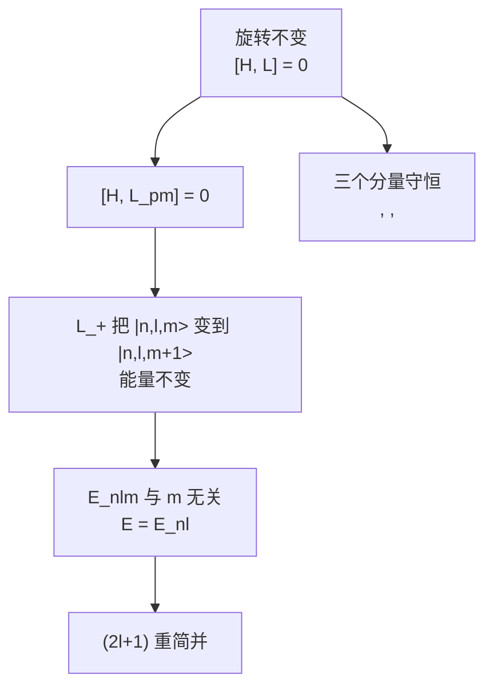

---

### 6.6.5 与第4章氢原子简并的对照

回到 4.2.6 节我们曾遇到的氢原子能级简并。

**氢原子的特殊之处**：能级 $E_n=-13.6\,\text{eV}/n^2$ 不仅与 $m$ 无关，而且**与 $\ell$ 无关**！$n$ 给定时，$\ell$ 可取 $0,1,\dots,n-1$，每个 $\ell$ 又有 $(2\ell+1)$ 个 $m$，总简并度为

$$\sum_{\ell=0}^{n-1}(2\ell+1)=n^2.$$

**两种简并的对比**：

| 简并类型 | 来源 | 出现条件 |
|----------|------|----------|
| $m$ 简并（$2\ell+1$ 重） | 旋转对称（$SO(3)$） | **所有中心势** $V(r)$ |
| $\ell$ 简并（额外） | 库仑势独有的 $SO(4)$ 对称 | **仅 $V\propto 1/r$ 和三维谐振子** |

**$m$ 简并是普遍的**：本节证明了任何中心势 $V(r)$ 都有 $(2\ell+1)$ 重简并。我们对氢原子能用，对类氢离子能用，对三维方阱、三维谐振子，凡是中心势就都能用。

**$\ell$ 简并是"额外"的**：库仑势 $V=-e^2/(4\pi\epsilon_0 r)$ 除了 $SO(3)$ 之外，还有一个隐藏的对称——存在守恒矢量 **Runge-Lenz 矢量**

$$\hat{\mathbf A}=\frac{1}{2m}(\hat{\mathbf p}\times\hat{\mathbf L}-\hat{\mathbf L}\times\hat{\mathbf p})-\frac{e^2}{4\pi\epsilon_0}\frac{\hat{\mathbf r}}{r}.$$

经典上 $\mathbf A$ 是椭圆轨道长轴方向的守恒矢量（解释了为什么开普勒轨道的近日点不进动）。$\hat{\mathbf A}$ 与 $\hat{\mathbf L}$ 一起构成 $SO(4)$ 代数，这个更高的对称导致了 $\ell$ 简并。

**类比**：三维各向同性谐振子有 $SU(3)$ 对称，也给出"额外"简并（同 $n$ 但不同 $\ell$ 的能级相等）。这是 4.1.3 节我们曾遇到过的现象。

读者只需知道结论：$(2\ell+1)$ 重简并是球对称的普遍后果，更高的简并提示更大的隐藏对称。深入讨论留给量子力学后续课程。

---

### Key Takeaway: 6.6

| 要点 | 内容 |
|------|------|
| **旋转不变判据** | $[\hat H,\hat L_i]=0$ 对 $i=x,y,z$ 同时成立 |
| **三个守恒量** | $\langle\hat L_x\rangle,\langle\hat L_y\rangle,\langle\hat L_z\rangle$ 全部不依赖时间 |
| **中心势** | $V=V(r)$ 自动旋转不变；$\hat H$ 与 $\hat L^2,\hat L_z$ 对易 |
| **简并定理** | 中心势能级 $E_{n\ell}$ 与 $m$ 无关，$(2\ell+1)$ 重简并 |
| **证明核心** | $[\hat H,\hat L_\pm]=0$ 使 $\hat L_\pm$ 在等能子空间内"搬运"态 |
| **氢原子额外简并** | $\ell$ 简并源于 $SO(4)$（Runge-Lenz）；非中心势普遍现象 |

---

## 6.7 旋转选择定则

至此我们建立了"对称 $\to$ 守恒 $\to$ 简并"的完整链条。本节进入"对称 $\to$ 选择定则"的部分：对称性如何决定哪些跃迁矩阵元 $\langle\psi_a|\hat O|\psi_b\rangle$ **必然为零**？

回顾 6.4 节，宇称给出选择定则：如果 $\hat O$ 在宇称下变换为 $-\hat O$，则在两个同宇称态之间的矩阵元为零（"奇算符在偶态间为零"）。本节我们用旋转对称做出更强的判据。

下面我们将看到，**算符按它们在旋转下的变换分类**——标量算符、矢量算符、更一般的球张量算符——每一类都对应一组选择定则。这是 **Wigner-Eckart 定理** 的内容，本节只讲两个最重要的特例。

---

### 6.7.1 算符的旋转分类

回顾经典物理中算符的分类（按变换性质）：

- **标量** $S$：旋转不改变其值（如 $r^2$、$\mathbf p^2$、能量）；
- **矢量** $\mathbf V$：旋转把它变为 $R\mathbf V$（如 $\mathbf r$、$\mathbf p$、$\mathbf L$）；
- **张量**：分量在旋转下按更复杂规律变换。

在量子力学中，"算符在旋转下如何变换"由对易关系编码。具体地，对幺正变换 $\hat R$，算符 $\hat O$ 变为

$$\hat O\to \hat R^\dagger\hat O\hat R.$$

对无穷小旋转 $\hat R=\mathbb 1-i\delta\varphi\,\hat n\cdot\hat{\mathbf L}/\hbar+\cdots$，

$$\hat R^\dagger\hat O\hat R=\hat O+\frac{i\delta\varphi}{\hbar}[\hat n\cdot\hat{\mathbf L},\hat O]+O(\delta\varphi^2).$$

所以**算符在旋转下的变换性质完全由它与 $\hat{\mathbf L}$ 的对易关系决定**。这是量子力学中算符分类的基础。

---

### 6.7.2 标量算符 (Scalar Operators)

**定义**：算符 $\hat S$ 称为**标量算符**，如果它在所有旋转下不变。由 6.7.1 节，等价定义是

$$\boxed{[\hat L_i,\hat S]=0,\qquad i=x,y,z.}$$

也即 $[\hat{\mathbf L},\hat S]=0$。

**例子**：$\hat H$（中心势中）、$\hat L^2$、$\hat{\mathbf p}^2$、$\hat r^2$、$\hat{\mathbf p}\cdot\hat{\mathbf r}$ 等都是标量。

**选择定则**：考察标量算符 $\hat S$ 在共同本征基 $|n\ell m\rangle$（其中 $n$ 是"其他量子数"，如径向量子数）中的矩阵元

$$\langle n'\ell'm'|\hat S|n\ell m\rangle.$$

由 $[\hat L_z,\hat S]=0$，

$$\langle n'\ell'm'|[\hat L_z,\hat S]|n\ell m\rangle=0.$$

把 $[\hat L_z,\hat S]=\hat L_z\hat S-\hat S\hat L_z$ 展开，利用 $\hat L_z$ 是厄米且 $\hat L_z|n\ell m\rangle=m\hbar|n\ell m\rangle$、$\langle n'\ell'm'|\hat L_z=m'\hbar\langle n'\ell'm'|$：

$$0=(m'-m)\hbar\,\langle n'\ell'm'|\hat S|n\ell m\rangle.$$

所以矩阵元非零必须 $m'=m$，即 $\Delta m=0$。

类似地，由 $[\hat L^2,\hat S]=0$（这是 $[\hat L_i,\hat S]=0$ 的推论，因 $\hat L^2=\sum\hat L_i^2$），

$$0=\langle n'\ell'm'|[\hat L^2,\hat S]|n\ell m\rangle=[\ell'(\ell'+1)-\ell(\ell+1)]\hbar^2\,\langle\cdots\rangle.$$

所以非零必须 $\ell'(\ell'+1)=\ell(\ell+1)$，即 $\ell'=\ell$。

**标量算符选择定则**：

$$\boxed{\langle n'\ell'm'|\hat S|n\ell m\rangle=0\quad\text{除非}\quad \ell'=\ell\text{ 且 }m'=m.}$$

**物理含义**：标量算符不能引起 $\ell,m$ 的变化——这与经典图像一致：一个 $SO(3)$ 标量量不带"角动量"，作用之后系统的角动量子数不变。

**应用例**：氢原子中 $\hat H$ 是标量（球对称中心势），所以 $\langle n'\ell'm'|\hat H|n\ell m\rangle$ 在 $\ell\ne\ell'$ 或 $m\ne m'$ 时为零——但这正是"$\hat H$ 在 $|n\ell m\rangle$ 基下对角"的结论，与对易性预言一致。

---

### 6.7.3 矢量算符 (Vector Operators)

**经典直觉**：矢量 $\mathbf V$ 在旋转 $R$ 下变换为 $\mathbf V\to R\mathbf V$。

**量子定义**：算符三元组 $(\hat V_x,\hat V_y,\hat V_z)$ 称为**矢量算符**，如果它满足

$$\boxed{[\hat L_i,\hat V_j]=i\hbar\,\epsilon_{ijk}\hat V_k.}$$

注意此式的形式与 $[\hat L_i,\hat L_j]=i\hbar\epsilon_{ijk}\hat L_k$ 完全一致——所以 $\hat{\mathbf L}$ 本身是矢量算符。

**例子**：

- $\hat{\mathbf r}=(\hat x,\hat y,\hat z)$：由 $[\hat L_i,\hat x_j]=i\hbar\epsilon_{ijk}\hat x_k$（4.3 节可验证）；
- $\hat{\mathbf p}=(\hat p_x,\hat p_y,\hat p_z)$：类似有 $[\hat L_i,\hat p_j]=i\hbar\epsilon_{ijk}\hat p_k$；
- $\hat{\mathbf L}$ 自身；
- $\hat{\mathbf S}$（虽然不通过空间旋转生成，但在全角动量下变换为矢量）。

**直观核查**：$[\hat L_x,\hat y]=i\hbar\hat z$。展开 $\hat L_x=\hat y\hat p_z-\hat z\hat p_y$，

$$[\hat L_x,\hat y]=[\hat y\hat p_z,\hat y]-[\hat z\hat p_y,\hat y]=0-\hat z[\hat p_y,\hat y]=-\hat z(-i\hbar)=i\hbar\hat z.\checkmark$$

---

### 6.7.4 球张量分量与 $\hat L_z$ 对易关系

**动机**：上面 $[\hat L_i,\hat V_j]$ 的笛卡尔形式不便于推选择定则——我们更喜欢"角动量好量子数"的语言。把矢量重组为下列三个**球张量分量**：

$$\boxed{\hat V_{+1}=-\frac{\hat V_x+i\hat V_y}{\sqrt 2},\qquad \hat V_0=\hat V_z,\qquad \hat V_{-1}=\frac{\hat V_x-i\hat V_y}{\sqrt 2}.}$$

（符号约定按 Sakurai/Griffiths，与球谐函数 $Y_1^q$ 的归一化一致。）

下面证明：**这三个分量在 $\hat L_z$ 下表现得像 $\ell=1$ 的角动量本征态**。

**$\hat L_z$ 的对易关系推导**：

从笛卡尔形式 $[\hat L_z,\hat V_x]=i\hbar\hat V_y$ 和 $[\hat L_z,\hat V_y]=-i\hbar\hat V_x$ 出发（这是 $[\hat L_i,\hat V_j]=i\hbar\epsilon_{ijk}\hat V_k$ 的两个具体例）。

- 对 $\hat V_0=\hat V_z$：

$$[\hat L_z,\hat V_0]=[\hat L_z,\hat V_z]=i\hbar\epsilon_{zzk}\hat V_k=0.$$

- 对 $\hat V_{+1}=-(\hat V_x+i\hat V_y)/\sqrt 2$：

$$
[\hat L_z,\hat V_{+1}]=-\frac{1}{\sqrt 2}\left([\hat L_z,\hat V_x]+i[\hat L_z,\hat V_y]\right)=-\frac{1}{\sqrt 2}\left(i\hbar\hat V_y+i(-i\hbar\hat V_x)\right)
$$

$$
=-\frac{\hbar}{\sqrt 2}(\hat V_x+i\hat V_y)=\hbar\cdot\left(-\frac{\hat V_x+i\hat V_y}{\sqrt 2}\right)=\hbar\hat V_{+1}.
$$

- 对 $\hat V_{-1}=(\hat V_x-i\hat V_y)/\sqrt 2$ 类似可得：

$$[\hat L_z,\hat V_{-1}]=-\hbar\hat V_{-1}.$$

**统一公式**：

$$\boxed{[\hat L_z,\hat V_q]=q\hbar\hat V_q,\qquad q=-1,0,+1.}$$

这与 4.3.3 节"$\hat L_z$ 升降算符的对易关系"$[\hat L_z,\hat L_\pm]=\pm\hbar\hat L_\pm$ 同构——只是这里 $q$ 取 $\{-1,0,+1\}$ 三个值，对应"自旋 1 的本征值"。

---

### 6.7.5 $\hat L_\pm$ 与球张量分量的对易关系

类似地推导 $\hat L_\pm=\hat L_x\pm i\hat L_y$ 与 $\hat V_q$ 的对易关系（用于推导 $\Delta\ell$ 选择定则）：

由 $[\hat L_x,\hat V_y]=i\hbar\hat V_z$、$[\hat L_y,\hat V_z]=i\hbar\hat V_x$、$[\hat L_y,\hat V_x]=-i\hbar\hat V_z$、$[\hat L_x,\hat V_z]=-i\hbar\hat V_y$（按 $\epsilon_{ijk}$ 展开），经过一些代数（不抄写过程，请读者作为练习），可得

$$\boxed{[\hat L_+,\hat V_{+1}]=0,\qquad [\hat L_+,\hat V_0]=\hbar\sqrt 2\,\hat V_{+1},\qquad [\hat L_+,\hat V_{-1}]=\hbar\sqrt 2\,\hat V_0,}$$

以及对 $\hat L_-$ 对称的关系：

$$[\hat L_-,\hat V_{-1}]=0,\qquad [\hat L_-,\hat V_0]=\hbar\sqrt 2\,\hat V_{-1},\qquad [\hat L_-,\hat V_{+1}]=\hbar\sqrt 2\,\hat V_0.$$

**对比 4.3.3 节角动量升降算符的作用规则**：

$$\hat L_\pm|\ell,m\rangle=\hbar\sqrt{\ell(\ell+1)-m(m\pm 1)}\,|\ell,m\pm 1\rangle.$$

对 $\ell=1$（$m=-1,0,+1$）代入：

$$\hat L_+|1,+1\rangle=0,\quad \hat L_+|1,0\rangle=\hbar\sqrt 2\,|1,+1\rangle,\quad \hat L_+|1,-1\rangle=\hbar\sqrt 2\,|1,0\rangle.$$

**完全一致**！换句话说，**$\hat V_q$ 在 $\hat L_z$ 和 $\hat L_\pm$ 作用下的"行为"与 $|\ell=1,m=q\rangle$ 角动量态完全相同**。这正是"矢量算符按 $\ell=1$ 球张量变换"的精确含义。

形式上：用张量产品语言，$\hat V_q|n\ell m\rangle$ 这种态的"角动量分量"应当像 $|1,q\rangle\otimes|\ell,m\rangle$ 的耦合一样——而这种耦合的总角动量 $\ell'$ 只能取 $|\ell-1|,\ell,\ell+1$（角动量合成规则，4.4.5 节），$z$ 分量必须 $m'=m+q$。这就给出了选择定则。

---

### 6.7.6 矢量算符选择定则

**$\Delta m$ 选择定则**：考察 $[\hat L_z,\hat V_q]=q\hbar\hat V_q$ 在 $|n\ell m\rangle$ 基下的矩阵元

$$\langle n'\ell'm'|[\hat L_z,\hat V_q]|n\ell m\rangle=q\hbar\langle n'\ell'm'|\hat V_q|n\ell m\rangle.$$

左边展开为 $(m'-m)\hbar\langle\cdots\rangle$，所以

$$(m'-m-q)\hbar\,\langle n'\ell'm'|\hat V_q|n\ell m\rangle=0.$$

**结论**：

$$\boxed{\langle n'\ell'm'|\hat V_q|n\ell m\rangle\ne 0\Longrightarrow m'-m=q.}$$

由于 $q=0,\pm 1$，这意味着

$$\boxed{\Delta m=m'-m\in\{0,\pm 1\}.}$$

**$\Delta\ell$ 选择定则**：可由 $[\hat L_\pm,\hat V_q]$ 的矩阵元和角动量耦合规则推出（细节涉及 Wigner-Eckart 定理的证明，参考 Sakurai《现代量子力学》第 3 章）。结论是：

$$\boxed{\Delta\ell=\ell'-\ell\in\{-1,0,+1\},\quad\text{但 }\ell=\ell'=0\text{ 例外（矩阵元一定为零）}.}$$

例外是因为 $0\otimes 1=1$（角动量合成结果），不含 $\ell'=0$。

**矢量算符选择定则总结**：

$$\boxed{\langle n'\ell'm'|\hat V_q|n\ell m\rangle\ne 0\Longrightarrow \Delta\ell\in\{0,\pm 1\}\text{（除 }\ell=\ell'=0\text{）},\;\Delta m=q\in\{0,\pm 1\}.}$$

---

### 6.7.7 电偶极跃迁选择定则

这是矢量算符选择定则最著名的应用：**原子跃迁的电偶极辐射**。第 9-11 章会讨论原子如何辐射光子，主要过程是"电偶极跃迁"，相关算符是位置算符 $\hat{\mathbf r}$（按 $-e\hat{\mathbf r}$ 给出电偶极矩）。

**$\hat{\mathbf r}$ 是矢量算符** $\Longrightarrow$ 由 6.7.6 节得到

$$\Delta\ell\in\{0,\pm 1\},\quad \Delta m\in\{0,\pm 1\}.$$

**结合宇称（6.4 节）的约束**：

$\hat{\mathbf r}$ 在宇称下变号（$\hat\Pi\hat{\mathbf r}\hat\Pi^\dagger=-\hat{\mathbf r}$），是**奇宇称算符**。原子态 $|\psi_{n\ell m}\rangle$ 的宇称是 $(-1)^\ell$（4.3.5 节）。

由 6.4 节的宇称选择定则，$\langle n'\ell'm'|\hat{\mathbf r}|n\ell m\rangle\ne 0$ 要求两态宇称**不同**：

$$(-1)^{\ell'}=-(-1)^\ell\Longrightarrow \ell'-\ell\text{ 是奇数}.$$

所以宇称排除 $\Delta\ell=0$ 的情形！与旋转对称限制 $\Delta\ell\in\{0,\pm 1\}$ 求交集，得到

$$\boxed{\Delta\ell=\pm 1,\qquad \Delta m=0,\pm 1.}$$

这就是著名的**电偶极跃迁选择定则**。

**两种对称协同作用**：

| 对称 | 给出的限制 |
|------|------------|
| 宇称（离散） | 排除 $\Delta\ell=0$（要求宇称不同） |
| 旋转（连续） | 限制 $|\Delta\ell|\le 1$ 及 $\Delta m\in\{0,\pm 1\}$ |
| **两者合作** | $\Delta\ell=\pm 1$、$\Delta m=0,\pm 1$ |

**物理图像**：电偶极辐射的光子带走 $\ell_\gamma=1$ 的角动量（光子是自旋 1 的玻色子）和 $\Delta m=\pm 1$（圆偏振）或 $\Delta m=0$（线偏振）的 $z$ 分量。原子失去这部分角动量来满足守恒——所以原子的 $\ell$ 变化 $\pm 1$、$m$ 变化 $0,\pm 1$。

**实例**：

- 氢原子从 $2p$（$\ell=1$）到 $1s$（$\ell=0$）：$\Delta\ell=-1$，**允许**（Lyman-α 线）；
- 氢原子从 $2s$（$\ell=0$）到 $1s$（$\ell=0$）：$\Delta\ell=0$，**禁戒**（$2s$ 是亚稳态，寿命极长）；
- 从 $3d$（$\ell=2$）到 $1s$（$\ell=0$）：$\Delta\ell=-2$，**禁戒**（需要更高阶过程如电四极跃迁）。

这一节为第 11.3 节"原子的自发辐射"的全面计算奠定了对称性基础。

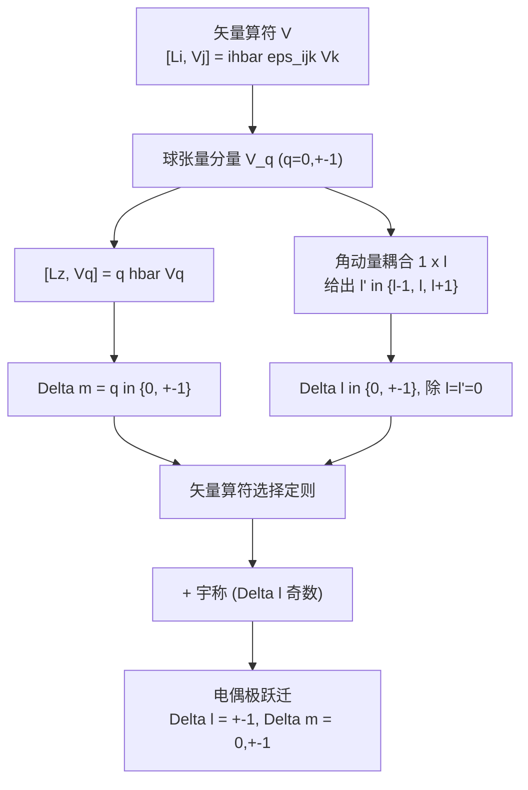

---

### Key Takeaway: 6.7

| 要点 | 内容 |
|------|------|
| **算符分类** | 由 $[\hat{\mathbf L},\hat O]$ 决定算符的旋转变换性质 |
| **标量算符** | $[\hat L_i,\hat S]=0$；选择定则 $\Delta\ell=\Delta m=0$ |
| **矢量算符** | $[\hat L_i,\hat V_j]=i\hbar\epsilon_{ijk}\hat V_k$ |
| **球张量分量** | $\hat V_0=\hat V_z$，$\hat V_{\pm 1}=\mp(\hat V_x\pm i\hat V_y)/\sqrt 2$ |
| **关键对易** | $[\hat L_z,\hat V_q]=q\hbar\hat V_q$；$\hat V_q$ 如 $\ell=1$ 态 |
| **矢量选择定则** | $\Delta\ell\in\{0,\pm 1\}$（除 $\ell=\ell'=0$），$\Delta m=q\in\{0,\pm 1\}$ |
| **电偶极跃迁** | 宇称 + 旋转合作：$\Delta\ell=\pm 1$、$\Delta m=0,\pm 1$ |
| **更广推广** | Wigner-Eckart 定理处理任意秩球张量算符（本节为特例） |

---

## 6.8 时间平移与海森堡绘景

到目前为止，本章的主线是"空间对称性 $\to$ 守恒量"。我们处理过空间平移（动量守恒）、宇称（选择定则）、空间旋转（角动量守恒）。还有一种最基本的连续对称性没有处理：**时间平移 (time translation)**。

时间平移的生成元是哈密顿量 $\hat H$，对应的守恒量就是能量。这一节我们要做三件事：

1. 把"时间演化"用一个幺正算符 $\hat U(t)=e^{-i\hat Ht/\hbar}$ 表达出来；
2. 由此立刻得出**能量守恒**（当 $\hat H$ 不显含时间时）；
3. 引入**海森堡绘景**——一种让"算符随时间演化、态不动"的等价图像。它与薛定谔绘景给出完全相同的物理预言，但在概念上更接近经典力学，并将"对称性 ↔ 守恒量"这条主线推向极致。

> **约定**：本节始终假设 $\hat H$ 不显含时间。$\hat H$ 显含时间的情形要用 Dyson 级数处理，超出本章范围。

### 6.8.1 时间演化算符 $\hat U(t)$

#### 从薛定谔方程到 $\hat U(t)$

薛定谔方程

$$i\hbar\,\frac{d}{dt}|\psi(t)\rangle=\hat H\,|\psi(t)\rangle$$

是关于 $|\psi(t)\rangle$ 的一阶线性微分方程。把它看作"$|\psi\rangle$ 在态空间中的演化方程"，由于 $\hat H$ 不显含时间，可以形式地积分：

$$|\psi(t)\rangle=\exp\!\left(-\frac{i\hat Ht}{\hbar}\right)|\psi(0)\rangle.$$

我们把这个起"演化作用"的算符定义为**时间演化算符 (time-evolution operator)**：

$$\boxed{\hat U(t)\equiv\exp\!\left(-\frac{i\hat Ht}{\hbar}\right),\qquad |\psi(t)\rangle=\hat U(t)|\psi(0)\rangle.}$$

形式上 $\hat U(t)$ 与第 6.1 节的 $\hat T(a)=e^{-ia\hat p/\hbar}$ 完全对称——只是把"空间位移 $a$"换成了"时间位移 $t$"，把生成元 $\hat p$ 换成了 $\hat H$。

#### 用本征基写出 $\hat U(t)$ 的作用方式

如果 $\{|n\rangle\}$ 是 $\hat H$ 的完备正交本征基，$\hat H|n\rangle=E_n|n\rangle$，则

$$\hat U(t)=\sum_n e^{-iE_n t/\hbar}|n\rangle\langle n|.$$

把任意初态展开为 $|\psi(0)\rangle=\sum_n c_n|n\rangle$，演化后

$$|\psi(t)\rangle=\sum_n c_n e^{-iE_n t/\hbar}|n\rangle.$$

这正是第 2 章和第 3 章里反复用到的"叠加 + 各自挂相位"做法。$\hat U(t)$ 把这件事提升为算符语言。

### 6.8.2 $\hat U(t)$ 的三大性质

#### 幺正性

由于 $\hat H$ 厄米（$\hat H^\dagger=\hat H$）：

$$\hat U^\dagger(t)=\exp\!\left(\!\left(-\frac{i\hat Ht}{\hbar}\right)^\dagger\right)=\exp\!\left(\frac{i\hat Ht}{\hbar}\right)=\hat U(-t).$$

于是

$$\boxed{\hat U^\dagger(t)\hat U(t)=\hat U(-t)\hat U(t)=\hat U(0)=\mathbb 1.}$$

幺正性的物理含义：内积不变，概率守恒。把它写到态矢上：

$$\langle\psi(t)|\psi(t)\rangle=\langle\psi(0)|\hat U^\dagger(t)\hat U(t)|\psi(0)\rangle=\langle\psi(0)|\psi(0)\rangle.$$

这正是第 1 章用波函数和分部积分证明过的"概率守恒"，在算符语言下变成一行字。

#### 群结构

$$\boxed{\hat U(t_1)\hat U(t_2)=\hat U(t_1+t_2).}$$

证明：因为 $\hat H$ 与自身对易，两个指数可合并：

$$\hat U(t_1)\hat U(t_2)=e^{-i\hat Ht_1/\hbar}e^{-i\hat Ht_2/\hbar}=e^{-i\hat H(t_1+t_2)/\hbar}=\hat U(t_1+t_2).$$

特别 $\hat U(0)=\mathbb 1$，$\hat U(-t)=\hat U^{-1}(t)=\hat U^\dagger(t)$。所以 $\{\hat U(t):t\in\mathbb R\}$ 构成一个**单参数阿贝尔幺正群**——和空间平移 $\{\hat T(a)\}$ 的结构完全相同。

#### 由 $\hat U(t)$ 反推薛定谔方程

对定义直接求导：

$$\frac{d\hat U}{dt}=\frac{d}{dt}\exp\!\left(-\frac{i\hat Ht}{\hbar}\right)=-\frac{i\hat H}{\hbar}\exp\!\left(-\frac{i\hat Ht}{\hbar}\right)=-\frac{i\hat H}{\hbar}\hat U(t),$$

即

$$\boxed{i\hbar\,\frac{d\hat U(t)}{dt}=\hat H\,\hat U(t),\qquad \hat U(0)=\mathbb 1.}$$

这是关于**算符** $\hat U$ 的薛定谔方程。把它作用在任意 $|\psi(0)\rangle$ 上，立刻得到关于**态** $|\psi(t)\rangle$ 的薛定谔方程。

> **逻辑顺序**：薛定谔方程 $\Leftrightarrow$ $\hat U(t)=e^{-i\hat Ht/\hbar}$ 是等价的两种表述。前者强调"瞬时变化率"，后者强调"幺正群"。

### 6.8.3 能量守恒

哈密顿量 $\hat H$ 与时间演化算符 $\hat U(t)$ 的对易子

$$[\hat H,\hat U(t)]=[\hat H,e^{-i\hat Ht/\hbar}]=0$$

显然为零——任何算符都和自身的解析函数对易。这正是"$\hat H$ 与时间平移对易"这件事的算符表述。

由广义 Ehrenfest 定理（第 3 章 3.5.5 节）：

$$\frac{d\langle\hat H\rangle}{dt}=\frac{i}{\hbar}\langle[\hat H,\hat H]\rangle+\left\langle\frac{\partial\hat H}{\partial t}\right\rangle=0+0=0,$$

第一项因 $[\hat H,\hat H]=0$ 为零，第二项因本节假设 $\hat H$ 不显含时间为零。所以

$$\boxed{\frac{d\langle\hat H\rangle}{dt}=0.}$$

这就是**能量守恒**。它的对称性来源已经清楚：**时间平移不变性 $\Longleftrightarrow$ 能量守恒**。

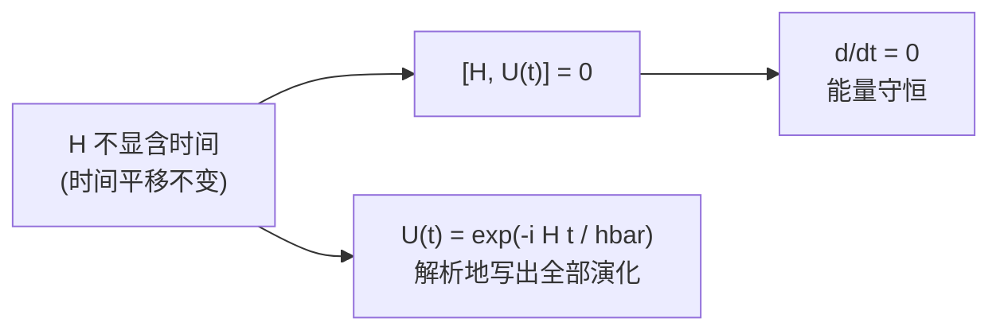

> **与经典力学的呼应**：经典 Hamilton 力学中 $dH/dt=\partial H/\partial t$，若 $H$ 不显含时间则能量守恒。量子力学的结论形式完全相同，只是把"数值 $H$"换成了"期望值 $\langle\hat H\rangle$"。

### 6.8.4 薛定谔绘景 vs. 海森堡绘景

#### 同一物理的两种"分账方式"

物理上能直接观测的只有**期望值**

$$\langle\hat Q\rangle(t)=\langle\psi(t)|\hat Q|\psi(t)\rangle.$$

把 $|\psi(t)\rangle=\hat U(t)|\psi(0)\rangle$ 代入：

$$\langle\hat Q\rangle(t)=\langle\psi(0)|\hat U^\dagger(t)\hat Q\hat U(t)|\psi(0)\rangle.$$

这条等式可以从两个角度解读：

| 绘景 | 谁在动？ | 态 | 算符 |
|------|----------|----|------|
| **薛定谔绘景 (Schrödinger picture, S)** | 态在动 | $|\psi_S(t)\rangle=\hat U(t)|\psi(0)\rangle$ | $\hat Q_S=\hat Q$（不动） |
| **海森堡绘景 (Heisenberg picture, H)** | 算符在动 | $|\psi_H\rangle=|\psi(0)\rangle$（不动） | $\hat Q_H(t)=\hat U^\dagger(t)\hat Q_S\hat U(t)$ |

两种绘景就像同一个舞台上的两种"分账方式"：要么让演员（态）走、布景（算符）不动；要么让布景动、演员站定。物理本身（期望值、跃迁概率、谱）完全一致。

#### 等价性证明

直接验算期望值：

$$
\begin{aligned}
\langle\psi_S(t)|\hat Q_S|\psi_S(t)\rangle
&=\langle\psi(0)|\hat U^\dagger(t)\hat Q_S\hat U(t)|\psi(0)\rangle\\
&=\langle\psi_H|\,\underbrace{\hat U^\dagger(t)\hat Q_S\hat U(t)}_{=\hat Q_H(t)}\,|\psi_H\rangle\\
&=\langle\psi_H|\hat Q_H(t)|\psi_H\rangle.
\end{aligned}
$$

两种绘景给出**严格相同**的期望值。在 $t=0$ 时刻两绘景重合：$|\psi_H\rangle=|\psi_S(0)\rangle$，$\hat Q_H(0)=\hat Q_S$。

> **风格提示**：在文献中，未加下标的算符默认是薛定谔绘景的（如 $\hat x$、$\hat p$、$\hat H$）。海森堡绘景下的算符通常显式带 $H$ 下标或时间依赖。

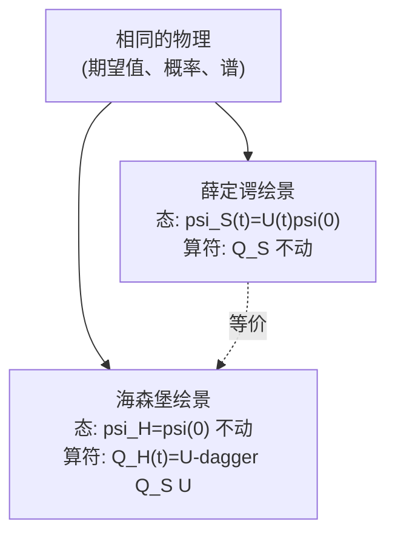

### 6.8.5 海森堡运动方程

既然海森堡绘景中"动的是算符"，自然要问：**$\hat Q_H(t)$ 满足什么微分方程？**

#### 直接求导

由定义 $\hat Q_H(t)=\hat U^\dagger(t)\hat Q_S(t)\hat U(t)$（这里允许 $\hat Q_S$ 在薛定谔绘景下显含时间，记作 $\hat Q_S(t)$）。对 $t$ 求导：

$$\frac{d\hat Q_H}{dt}=\frac{d\hat U^\dagger}{dt}\hat Q_S\hat U+\hat U^\dagger\frac{\partial\hat Q_S}{\partial t}\hat U+\hat U^\dagger\hat Q_S\frac{d\hat U}{dt}.$$

代入

$$\frac{d\hat U}{dt}=-\frac{i}{\hbar}\hat H\hat U,\qquad \frac{d\hat U^\dagger}{dt}=\frac{i}{\hbar}\hat U^\dagger\hat H,$$

得

$$\frac{d\hat Q_H}{dt}=\frac{i}{\hbar}\hat U^\dagger\hat H\hat Q_S\hat U-\frac{i}{\hbar}\hat U^\dagger\hat Q_S\hat H\hat U+\hat U^\dagger\frac{\partial\hat Q_S}{\partial t}\hat U.$$

#### 关键一步：把 $\hat H$ "夹"成海森堡形式

由于 $[\hat H,\hat U(t)]=0$，可以把 $\hat H$ 自由地"穿过" $\hat U$ 和 $\hat U^\dagger$。换言之：

$$\hat H_H(t)=\hat U^\dagger\hat H\hat U=\hat H\hat U^\dagger\hat U=\hat H,$$

即**哈密顿量在两个绘景下相同**（当 $\hat H$ 不显含时间时）。所以

$$
\hat U^\dagger\hat H\hat Q_S\hat U=\hat U^\dagger\hat H\hat U\hat U^\dagger\hat Q_S\hat U=\hat H\,\hat Q_H,\qquad
\hat U^\dagger\hat Q_S\hat H\hat U=\hat Q_H\,\hat H.
$$

代回，得到**海森堡运动方程 (Heisenberg equation of motion)**：

$$\boxed{\frac{d\hat Q_H}{dt}=\frac{i}{\hbar}[\hat H,\hat Q_H]+\left(\frac{\partial\hat Q}{\partial t}\right)_H.}$$

其中 $(\partial\hat Q/\partial t)_H\equiv\hat U^\dagger(\partial\hat Q_S/\partial t)\hat U$ 仅在 $\hat Q_S$ 在薛定谔绘景下显含时间时出现；对绝大多数情形（位置、动量、角动量、自旋……）这一项为零。

#### 与经典 Hamilton 方程的对应

经典力学中，任意相空间函数 $f(q,p,t)$ 的时间演化为

$$\frac{df}{dt}=\{f,H\}+\frac{\partial f}{\partial t},$$

其中 $\{f,H\}$ 是**泊松括号**。把它与海森堡方程并列：

| 经典 | 量子 |
|------|------|
| $\dfrac{df}{dt}=\{f,H\}+\dfrac{\partial f}{\partial t}$ | $\dfrac{d\hat Q_H}{dt}=\dfrac{i}{\hbar}[\hat H,\hat Q_H]+\left(\dfrac{\partial\hat Q}{\partial t}\right)_H$ |

**经典与量子的对应规则**

$$\boxed{\{\,\cdot\,,\,\cdot\,\}\;\longleftrightarrow\;\frac{1}{i\hbar}[\,\cdot\,,\,\cdot\,].}$$

这就是 Dirac 早期提出的**正则量子化 (canonical quantization)** 处方：把经典 Hamilton 方程里的泊松括号换成 $(1/i\hbar)$ 倍的对易子，经典力学便升级成量子力学（在海森堡绘景下）。

> **哲学意义**：海森堡绘景在概念上比薛定谔绘景更"经典"——动力学变量（算符）随时间演化，正像经典力学里 $q(t),p(t)$ 随时间演化。这也是 1925 年海森堡先于薛定谔发现量子力学时所用的图像。

### 6.8.6 例子 1：自由粒子在海森堡绘景中

考察 $\hat H=\hat p^2/2m$（自由粒子，$\hat p$ 和 $\hat x$ 均不显含时间）。

#### 动量

$$\frac{d\hat p_H}{dt}=\frac{i}{\hbar}[\hat H,\hat p_H]=\frac{i}{\hbar}\left[\frac{\hat p^2}{2m},\hat p\right]_H=0.$$

（薛定谔绘景中 $[\hat p^2/2m,\hat p]=0$，幺正变换不改变对易子，所以海森堡绘景中也为零。）因此

$$\boxed{\hat p_H(t)=\hat p_H(0)=\hat p.}$$

动量是一个守恒量——动量算符在海森堡绘景下根本不随时间变化。

#### 位置

$$\frac{d\hat x_H}{dt}=\frac{i}{\hbar}[\hat H,\hat x_H]=\frac{i}{\hbar}\left[\frac{\hat p^2}{2m},\hat x\right]_H.$$

利用恒等式 $[\hat p^2,\hat x]=\hat p[\hat p,\hat x]+[\hat p,\hat x]\hat p=-2i\hbar\,\hat p$：

$$\frac{d\hat x_H}{dt}=\frac{i}{\hbar}\cdot\frac{-2i\hbar\,\hat p_H}{2m}=\frac{\hat p_H}{m}=\frac{\hat p_H(0)}{m}.$$

右边与时间无关（$\hat p_H(0)$ 是常算符），直接积分：

$$\boxed{\hat x_H(t)=\hat x_H(0)+\frac{\hat p_H(0)}{m}\,t.}$$

形式上与经典自由粒子 $x(t)=x(0)+p(0)t/m$ **完全一样**——只是把数变成了算符。

#### 一个有趣的副产品

把上面这条算符方程作期望值：$\langle\hat x_H(t)\rangle=\langle\hat x(0)\rangle+\langle\hat p(0)\rangle t/m$，正是 Ehrenfest 定理在自由粒子情形的特例。但在海森堡绘景里，这条结论不是关于"平均值"的近似，而是**算符之间的精确恒等式**。

进一步可以计算

$$
[\hat x_H(t),\hat x_H(0)]=\left[\hat x_H(0)+\frac{\hat p_H(0)}{m}t,\hat x_H(0)\right]=\frac{t}{m}[\hat p_H(0),\hat x_H(0)]=-\frac{i\hbar t}{m}.
$$

这是一个非平凡的等时不等的对易子，可推出"自由粒子位置-位置不确定关系" $\sigma_{x(t)}\sigma_{x(0)}\ge \hbar t/(2m)$。这种结论在薛定谔绘景里要费一番周折，在海森堡绘景中两行字就出来了。

### 6.8.7 例子 2：谐振子的升降算符

考察一维谐振子 $\hat H=\hbar\omega(\hat a_+\hat a_-+1/2)$，其中

$$[\hat a_-,\hat a_+]=1,\qquad [\hat a_+\hat a_-,\hat a_-]=-\hat a_-,\qquad [\hat a_+\hat a_-,\hat a_+]=+\hat a_+.$$

（最后两式由 $[\hat a_+\hat a_-,\hat a_\pm]=\hat a_+[\hat a_-,\hat a_\pm]+[\hat a_+,\hat a_\pm]\hat a_-$ 展开得到。）

#### 降算符 $\hat a_-(t)$

$$
\frac{d\hat a_H}{dt}=\frac{i}{\hbar}[\hat H,\hat a_-]_H=\frac{i}{\hbar}\cdot\hbar\omega\,[\hat a_+\hat a_-,\hat a_-]_H=\frac{i}{\hbar}\cdot\hbar\omega\cdot(-\hat a_H)=-i\omega\,\hat a_H.
$$

（注意常数 $1/2$ 与任何算符对易，对结果无贡献。）这是一个常系数线性 ODE，解为

$$\boxed{\hat a_-^H(t)=\hat a_-(0)\,e^{-i\omega t}.}$$

#### 升算符 $\hat a_+(t)$

完全平行的推导给出 $d\hat a_+^H/dt=+i\omega\,\hat a_+^H$，所以

$$\boxed{\hat a_+^H(t)=\hat a_+(0)\,e^{+i\omega t}.}$$

（也可由 $\hat a_+=(\hat a_-)^\dagger$ 与 $\hat U^\dagger$ 的反序性直接得出。）

#### 位置与动量

由 $\hat x=\sqrt{\hbar/(2m\omega)}(\hat a_++\hat a_-)$ 和 $\hat p=i\sqrt{\hbar m\omega/2}(\hat a_+-\hat a_-)$，立刻有

$$
\hat x_H(t)=\sqrt{\frac{\hbar}{2m\omega}}\left[\hat a_+(0)e^{i\omega t}+\hat a_-(0)e^{-i\omega t}\right],
$$

$$
\hat p_H(t)=i\sqrt{\frac{\hbar m\omega}{2}}\left[\hat a_+(0)e^{i\omega t}-\hat a_-(0)e^{-i\omega t}\right].
$$

将两式联立可解出

$$
\boxed{\hat x_H(t)=\hat x(0)\cos\omega t+\frac{\hat p(0)}{m\omega}\sin\omega t,}
$$

$$
\boxed{\hat p_H(t)=\hat p(0)\cos\omega t-m\omega\,\hat x(0)\sin\omega t.}
$$

这是**算符层面**的经典谐振子运动方程——再次完美再现经典解的形式，只是 $x(0),p(0)$ 升级为不对易的算符 $\hat x(0),\hat p(0)$。

| 系统 | 经典解 | 海森堡解 |
|------|--------|----------|
| 自由粒子 | $x(t)=x_0+p_0t/m$ | $\hat x_H(t)=\hat x(0)+\hat p(0)t/m$ |
| 谐振子 | $x(t)=x_0\cos\omega t+(p_0/m\omega)\sin\omega t$ | $\hat x_H(t)=\hat x(0)\cos\omega t+(\hat p(0)/m\omega)\sin\omega t$ |

这正是 Dirac 对应规则的极致体现：在那些经典已经线性可解的系统中，量子算符的演化方程具有与经典完全相同的函数形式。

### 6.8.8 守恒量在两个绘景中

最后回到本章的主题——守恒量。一个算符 $\hat Q$（薛定谔绘景下不显含时间）若是守恒量，等价的判据是

$$[\hat H,\hat Q]=0.$$

**在薛定谔绘景中**：算符 $\hat Q_S=\hat Q$ 本身就不依赖时间。期望值 $\langle\hat Q\rangle(t)$ 的不变性源于"态在演化、$\hat Q$ 与 $\hat U$ 对易"。

**在海森堡绘景中**：由海森堡方程

$$\frac{d\hat Q_H}{dt}=\frac{i}{\hbar}[\hat H,\hat Q_H]+0=\frac{i}{\hbar}\hat U^\dagger[\hat H,\hat Q]\hat U=0,$$

所以**守恒量在海森堡绘景下也是常算符**：$\hat Q_H(t)=\hat Q_H(0)=\hat Q$。比如自由粒子的 $\hat p$（例子 1），就是这样：动量在两个绘景下都"不动"。

这给"守恒量"一个非常干净的定义：

> **守恒量 = 在海森堡绘景下不随时间演化的算符。**

这条定义只关心算符本身的演化，与态无关——与经典力学"守恒量是相空间函数沿轨迹的常数"完全平行。本章前面所讲的所有守恒律（动量、角动量、宇称等）都可以用这条定义重新表述：

| 对称性 | 守恒量 $\hat G$ | 海森堡绘景下 |
|--------|------------------|----------------|
| 时间平移 | $\hat H$ | $\hat H_H(t)=\hat H$（"不动")|
| 空间平移 | $\hat p$ | $\hat p_H(t)=\hat p$ |
| 空间旋转 | $\hat{\mathbf L}\cdot\hat n$ | $(\hat{\mathbf L}\cdot\hat n)_H(t)=\hat{\mathbf L}\cdot\hat n$ |
| 宇称 | $\hat\Pi$ | $\hat\Pi_H(t)=\hat\Pi$ |

这就是为什么海森堡绘景被称为"量子力学最接近经典图像的表述"——守恒量真的"不动"。

### Key Takeaway: 6.8

| 要点 | 内容 |
|------|------|
| **时间演化算符** | $\hat U(t)=e^{-i\hat Ht/\hbar}$（$\hat H$ 不显含时间）|
| **幺正性** | $\hat U^\dagger(t)\hat U(t)=\mathbb 1$，源于 $\hat H$ 厄米；保证概率守恒 |
| **群结构** | $\hat U(t_1)\hat U(t_2)=\hat U(t_1+t_2)$，单参数阿贝尔幺正群 |
| **算符薛定谔方程** | $i\hbar\,d\hat U/dt=\hat H\hat U$，$\hat U(0)=\mathbb 1$ |
| **能量守恒** | $[\hat H,\hat U(t)]=0\Rightarrow d\langle\hat H\rangle/dt=0$ |
| **薛定谔绘景** | 态演化 $|\psi_S(t)\rangle=\hat U(t)|\psi(0)\rangle$，算符不动 |
| **海森堡绘景** | 态不动 $|\psi_H\rangle=|\psi(0)\rangle$，算符演化 $\hat Q_H(t)=\hat U^\dagger\hat Q_S\hat U$ |
| **等价性** | $\langle\psi_S(t)|\hat Q_S|\psi_S(t)\rangle=\langle\psi_H|\hat Q_H(t)|\psi_H\rangle$ |
| **海森堡运动方程** | $d\hat Q_H/dt=(i/\hbar)[\hat H,\hat Q_H]+(\partial\hat Q/\partial t)_H$ |
| **经典-量子对应** | 泊松括号 $\{\,,\,\}\leftrightarrow (1/i\hbar)[\,,\,]$（Dirac 正则量子化）|
| **自由粒子** | $\hat p_H(t)=\hat p(0)$；$\hat x_H(t)=\hat x(0)+\hat p(0)t/m$ |
| **谐振子升降** | $\hat a_-^H(t)=\hat a_-(0)e^{-i\omega t}$，$\hat a_+^H(t)=\hat a_+(0)e^{+i\omega t}$ |
| **守恒量新定义** | 海森堡绘景下不随时间演化的算符（$[\hat H,\hat Q]=0$）|

---

## 6.9 习题

> 说明：习题按"概念理解 → 计算练习 → 思考题 → 编程题"四类排列。建议先尝试概念题再进入计算。

### 概念理解

#### 习题 6.1 对称-守恒翻译表

下表是本章核心，请在空格处填入相应内容（不要查阅前文）。

| 对称变换 | 幺正算符 | 生成元 | 守恒量 | 典型应用场合 |
|---------|---------|--------|--------|------------|
| 空间平移 | ___ | ___ | ___ | 自由粒子 |
| 空间旋转 | ___ | ___ | ___ | 中心势 |
| 时间平移 | ___ | ___ | ___ | $\hat H$ 不显含时间 |
| 空间反演 | $\hat\Pi$ | —— | $\hat\Pi$（离散） | 偶/中心对称势 |

填完后回答：为什么宇称这一行没有"生成元"？

#### 习题 6.2 真假判断

判断下列命题真假，并简要说明理由。

1. 任意中心势 $V(r)$ 的能量本征态都同时是 $\hat L_z$ 的本征态。
2. 一维有限深方势阱（中心对称）的束缚态都有确定宇称。
3. 自由粒子的能量本征态必须是动量本征态。
4. 哈密顿量在某幺正变换下不变是该变换生成元守恒的**充分必要**条件。
5. 在海森堡绘景中，守恒量是不依赖时间的算符。
6. 周期势 $V(x+a)=V(x)$ 中粒子的连续动量 $\hat p$ 守恒。
7. 自旋 1/2 粒子绕 $z$ 轴转 $2\pi$ 之后波函数恢复原样。
8. $\langle\psi_{2s}|\hat z|\psi_{1s}\rangle$ 不为零（氢原子 $2s\to 1s$ 电偶极允许）。

#### 习题 6.3 简并的起源

中心势能级 $E_{n\ell}$ 关于 $m$ 的 $(2\ell+1)$ 重简并来源于：
1. 中心势 $V(r)$ 关于哪种对称？
2. 这种对称要求哪个对易子等于零？
3. 是 $\hat L_z$ 还是 $\hat L_\pm$ 把 $|n\ell m\rangle$ 变到能量相同的另一个本征态？
4. 氢原子能级 $E_n$ 关于 $\ell$ 的额外简并不属于一般中心势——它的根源是什么？（提示：Runge-Lenz 矢量与库仑势的 $SO(4)$ 对称）

### 计算练习

#### 习题 6.4 平移算符的具体计算

设波包 $\psi(x)=N e^{-x^2/(2a^2)}$（$N$ 为归一化常数）。

1. 求 $\hat T(x_0)\psi(x)$（用 $x_0,a$ 表示）。
2. 求 $\langle\hat x\rangle$ 在 $\hat T(x_0)\psi$ 态中的值。验证它等于原态期望值加 $x_0$。
3. 求 $\langle\hat p\rangle$ 在 $\hat T(x_0)\psi$ 态中的值，与原态对比。
4. 解释：为什么平移改变位置期望值但不改变动量期望值？

#### 习题 6.5 宇称选择定则的应用

对一维谐振子，记 $\psi_n(x)$ 为本征态。

1. 写出 $\psi_n$ 的宇称（用 $n$ 表示）。
2. 计算 $\langle\psi_0|\hat x|\psi_0\rangle$（不计算积分，仅用宇称论证）。
3. 计算 $\langle\psi_0|\hat x|\psi_1\rangle$ 是否可能非零，**理论上**它应等于多少？（提示：用升降算符 $\hat x=\sqrt{\hbar/2m\omega}(\hat a_++\hat a_-)$，$\hat a_-|0\rangle=0$、$\hat a_+|0\rangle=|1\rangle$）
4. 列出所有使 $\langle\psi_m|\hat x|\psi_n\rangle\ne 0$ 的 $(m,n)$ 对，并用宇称解释。

#### 习题 6.6 自旋 1/2 的旋转矩阵

利用公式
$$\exp\!\left(i(\boldsymbol\sigma\cdot\hat n)\varphi/2\right)=\cos(\varphi/2)\,\mathbb 1+i(\hat n\cdot\boldsymbol\sigma)\sin(\varphi/2)$$
完成以下计算（这是 HW Problem 4.56(b)(c)(d)）：

1. 构造绕 $x$ 轴转 $\pi$ 的旋转矩阵 $\hat R_{\hat x}(\pi)$，作用于 $\chi_+$，验证得到 $i\chi_-$（即除全局相位 $i$ 外变为自旋向下）。
2. 构造绕 $y$ 轴转 $\pi/2$ 的旋转矩阵 $\hat R_{\hat y}(\pi/2)$，作用于 $\chi_+$。结果应是 $x$ 方向自旋本征态 $\chi_+^{(x)}$ 乘以全局相位。
3. 构造绕 $z$ 轴转 $2\pi$ 的旋转矩阵。结果是 $-\mathbb 1$。解释：为何旋转 $2\pi$ 不恢复？这是否会产生可观测效应？

#### 习题 6.7 中心势能级简并度

某中心势 $V(r)$ 的能量本征态用 $|n\ell m\rangle$ 标记，能量为 $E_{n\ell}$（不依赖 $m$）。

1. 若 $E_{n\ell}$ 也独立于 $\ell$（如氢原子）：$n=3$ 能级的简并度是多少？
2. 若 $E_{n\ell}$ 依赖于 $\ell$（一般中心势）：$\ell=2$ 子壳层的简并度是多少？
3. 在外加均匀磁场 $\mathbf B=B\hat z$ 下，$\hat H'=-\mu_B B\hat L_z/\hbar$ 把简并解除多少？剩余简并度多少？
4. 若再加自旋（电子），$|n\ell m_\ell m_s\rangle$ 在没有自旋轨道耦合时简并度是多少？加上自旋轨道耦合后改用 $|n\ell j m_j\rangle$ 标记，简并度变成多少？

#### 习题 6.8 海森堡运动方程：谐振子

承接 6.8.7 节，验证以下结果。

1. 由 $\hat a_-^H(t)=\hat a_-(0)e^{-i\omega t}$ 和 $\hat a_+^H(t)=\hat a_+(0)e^{+i\omega t}$，写出 $\hat x_H(t),\hat p_H(t)$ 关于 $\hat x(0),\hat p(0)$ 的表达式。
2. 验证 $[\hat x_H(t),\hat p_H(t)]=i\hbar$。
3. 求等时对易子 $[\hat x_H(t),\hat x_H(0)]$。结果应是一个 c-数（不依赖于态）。这对位置-位置同时测量意味着什么？

#### 习题 6.9 矢量算符的对易关系验证

利用规范对易关系 $[\hat L_z,\hat x]=i\hbar\hat y$、$[\hat L_z,\hat y]=-i\hbar\hat x$ 及 $[\hat L_z,\hat z]=0$，验证：

1. $[\hat L_z,\hat V_0]=0$（其中 $\hat V_0=\hat z$）。
2. $[\hat L_z,\hat V_{+1}]=\hbar\hat V_{+1}$（其中 $\hat V_{+1}=-(\hat x+i\hat y)/\sqrt 2$）。
3. $[\hat L_z,\hat V_{-1}]=-\hbar\hat V_{-1}$（其中 $\hat V_{-1}=(\hat x-i\hat y)/\sqrt 2$）。
4. 由此确认矢量算符球张量分量的标准对易关系 $[\hat L_z,\hat V_q]=q\hbar\hat V_q$（$q=0,\pm 1$）。

### 思考题

#### 习题 6.10 周期势中的"准动量"为什么不是真动量

在周期势 $V(x+a)=V(x)$ 下：

1. 写出离散平移条件 $[\hat H,\hat T(a)]=0$，但 $[\hat H,\hat p]\ne 0$。给出一个具体的反例，证明动量真不守恒。
2. 准动量 $q$ 是哪个算符的本征值？这个算符是否厄米？
3. $q$ 取值在第一布里渊区 $(-\pi/a,\pi/a]$——为什么 $q$ 不能取任意实数？换言之，$q$ 和 $q+2\pi/a$ 描述同一个物理状态吗？
4. 在自由极限 $V\to 0$ 下，$q$ 与 $p/\hbar$ 是否相等？

#### 习题 6.11 时间反演对称（选读）

定义时间反演算符 $\hat\Theta$，使其满足 $\hat\Theta\,t\,\hat\Theta^{-1}=-t$。

1. 论证 $\hat\Theta$ 必须**反幺正 (antiunitary)**——即 $\hat\Theta(\alpha|\psi\rangle+\beta|\phi\rangle)=\alpha^*\hat\Theta|\psi\rangle+\beta^*\hat\Theta|\phi\rangle$。提示：考察对薛定谔方程的兼容性。
2. 推出对算符的作用：$\hat\Theta\hat x\hat\Theta^{-1}=\hat x$，$\hat\Theta\hat p\hat\Theta^{-1}=-\hat p$，$\hat\Theta\hat{\mathbf L}\hat\Theta^{-1}=-\hat{\mathbf L}$。
3. 在位置表象，单粒子无自旋时 $\hat\Theta\psi(\mathbf r)=\psi^*(\mathbf r)$。验证这与上面三条相容。
4. 时间反演不像其他对称，**不**给出守恒量。为什么？

#### 习题 6.12 简并空间中的"好量子数"

考虑两体氦原子（忽略自旋轨道耦合）：$\hat H=\hat H_0+\hat V_{ee}$，其中 $\hat H_0$ 是独立电子的中心势能，$\hat V_{ee}=e^2/|\mathbf r_1-\mathbf r_2|$ 是电子-电子排斥。

1. $\hat H_0$ 的本征态 $|n_1\ell_1 m_1; n_2\ell_2 m_2\rangle$ 在 $\hat V_{ee}$ 微扰下是否还是好基底？为什么？
2. 总角动量算符 $\hat{\mathbf L}=\hat{\mathbf L}_1+\hat{\mathbf L}_2$ 与 $\hat H$ 是否对易？$\hat L^2,\hat L_z$ 呢？
3. 应使用什么样的"耦合基"$|n_1\ell_1 n_2\ell_2 L M\rangle$ 作为微扰理论的"好基"？（这是第7章简并微扰理论的预演）

### 编程题

#### 习题 6.13 自旋 1/2 的拉莫尔进动（海森堡绘景实现）

电子置于均匀磁场 $\mathbf B=B_0\hat z$ 中，哈密顿量为 $\hat H=-\gamma B_0\hat S_z$，其中 $\gamma$ 是旋磁比。

**任务**：

1. 写出 $\hat S_x,\hat S_y,\hat S_z$ 在海森堡绘景下的运动方程。
2. 解析求解 $\hat S_x^H(t),\hat S_y^H(t),\hat S_z^H(t)$（结果应描述以频率 $\omega_L=\gamma B_0$ 在 $xy$ 平面进动）。
3. 用 Python 数值积分海森堡方程，与解析结果对照。可视化 $\langle\hat S_x\rangle,\langle\hat S_y\rangle,\langle\hat S_z\rangle$ 随时间的演化。

**代码框架**：

```python
import numpy as np
import matplotlib.pyplot as plt
from scipy.linalg import expm

hbar = 1.0   # natural units
gamma = 1.0  # gyromagnetic ratio
B0 = 1.0
omega_L = gamma * B0

# 泡利矩阵
sigma_x = np.array([[0, 1], [1, 0]], dtype=complex)
sigma_y = np.array([[0, -1j], [1j, 0]], dtype=complex)
sigma_z = np.array([[1, 0], [0, -1]], dtype=complex)

# 自旋算符 S = hbar/2 * sigma
Sx = 0.5 * hbar * sigma_x
Sy = 0.5 * hbar * sigma_y
Sz = 0.5 * hbar * sigma_z

# 哈密顿量
H = -gamma * B0 * Sz

# 初态：x 方向自旋向上 chi_+(x)
chi_x_plus = (1 / np.sqrt(2)) * np.array([1, 1], dtype=complex)

# 时间网格
t_vals = np.linspace(0, 4 * np.pi / omega_L, 200)

# 计算 <Sx>,<Sy>,<Sz> 在薛定谔绘景下
Sx_exp, Sy_exp, Sz_exp = [], [], []
for t in t_vals:
    U = expm(-1j * H * t / hbar)
    psi_t = U @ chi_x_plus
    Sx_exp.append(np.real(psi_t.conj() @ Sx @ psi_t))
    Sy_exp.append(np.real(psi_t.conj() @ Sy @ psi_t))
    Sz_exp.append(np.real(psi_t.conj() @ Sz @ psi_t))

# 解析结果对照
Sx_analytic = 0.5 * hbar * np.cos(omega_L * t_vals)
Sy_analytic = -0.5 * hbar * np.sin(omega_L * t_vals)
Sz_analytic = np.zeros_like(t_vals)

# 绘图
fig, ax = plt.subplots(figsize=(10, 5))
ax.plot(t_vals, Sx_exp, 'b-', label=r'$\langle S_x\rangle$ numerical')
ax.plot(t_vals, Sx_analytic, 'b--', alpha=0.5, label=r'$\langle S_x\rangle$ analytic')
ax.plot(t_vals, Sy_exp, 'r-', label=r'$\langle S_y\rangle$ numerical')
ax.plot(t_vals, Sy_analytic, 'r--', alpha=0.5, label=r'$\langle S_y\rangle$ analytic')
ax.plot(t_vals, Sz_exp, 'g-', label=r'$\langle S_z\rangle$ numerical')
ax.set_xlabel('t')
ax.set_ylabel('Expectation value')
ax.set_title('Larmor Precession (Schrodinger Picture Verification)')
ax.legend()
ax.grid(True, alpha=0.3)
plt.tight_layout()
plt.savefig('larmor_precession.png', dpi=150)
plt.show()
```

**思考**：
1. 进动频率 $\omega_L$ 与磁场 $B_0$ 的关系是什么？
2. 若初始自旋沿 $z$ 方向（即 $\chi_+$），数值结果会是什么样？请修改代码验证。
3. 海森堡绘景下，$\hat S_z$ 是否守恒？是否对所有初态都守恒？

#### 习题 6.14 验证布洛赫定理：Kronig-Penney 数值实现（选做）

构造 Kronig-Penney 周期势（delta 梳）：
$$V(x)=\alpha\sum_{n=-\infty}^{\infty}\delta(x-na).$$

1. 用 Bloch 假设 $\psi(x)=e^{iqx}u_q(x)$，写出 $u_q(x)$ 在 $[0,a]$ 上满足的方程及 $u_q$ 的周期条件。
2. 数值求解 $E$ 关于 $q$ 的色散关系 $E(q)$，绘制前 3 条能带。
3. 标记禁带宽度，验证能带在 $q=\pi/a$ 处打开。
4. 取参数 $\alpha\to 0$ 极限，验证回到自由粒子色散关系 $E=\hbar^2q^2/(2m)$。

> 提示：可以用矩阵法（在 Fourier 基下离散化）或直接对每个 $q$ 求超越方程数值根。

---

## 6.10 本章总结

### 6.10.1 一句话主线

> **物理量守恒 ⟺ 哈密顿量在对应变换下不变**。生成对称变换的厄米算符就是守恒量；它给出能级简并、跃迁选择定则、运动方程的全部信息。

### 6.10.2 全章逻辑图

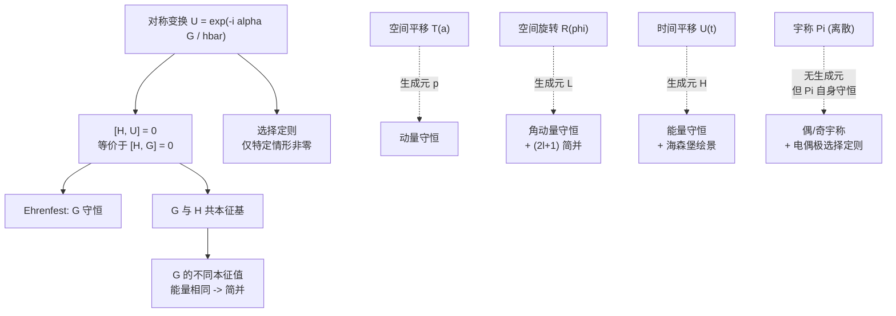

### 6.10.3 最重要公式

**对称-守恒翻译表**（务必牢记）：

| 对称 | 算符 | 生成元 | 守恒量 |
|------|------|--------|--------|
| 空间平移 | $\hat T(a)=e^{-ia\hat p/\hbar}$ | $\hat p$ | 动量 |
| 旋转 | $\hat R_{\hat n}(\phi)=e^{-i\phi\hat{\mathbf L}\cdot\hat n/\hbar}$ | $\hat{\mathbf L}\cdot\hat n$ | 角动量分量 |
| 时间平移 | $\hat U(t)=e^{-i\hat Ht/\hbar}$ | $\hat H$ | 能量 |
| 空间反演 | $\hat\Pi$（离散） | —— | 宇称 |

**核心定理**：

$$\boxed{[\hat H,\hat U]=0\iff[\hat H,\hat G]=0\Rightarrow\frac{d\langle\hat G\rangle}{dt}=0.}$$

**海森堡运动方程**：

$$\boxed{\frac{d\hat Q_H}{dt}=\frac{i}{\hbar}[\hat H,\hat Q_H]+\left(\frac{\partial\hat Q}{\partial t}\right)_H.}$$

**电偶极跃迁选择定则**（宇称 + 旋转协作）：

$$\boxed{\Delta\ell=\pm 1,\qquad \Delta m=0,\pm 1.}$$

### 6.10.4 本章真正要带走的理解

1. **守恒不是巧合，是对称的必然结果**。每次看到"$\langle\hat Q\rangle$ 不随时间变"或"能级 $N$ 重简并"时，要立刻反问"系统对应哪种对称？"
2. **生成元的统一性**：动量、角动量、能量都是某种"平移"的生成元（空间平移、旋转、时间平移）。这个观点把第1章的 $\hat p$、第4章的 $\hat L$、第3章的 $\hat H$ 串成一条线。
3. **对易关系是核心工具**：$[\hat H,\hat G]=0$ 是判断守恒的唯一标准。它同时告诉我们共同本征基的存在、简并的来源、选择定则的形式。
4. **离散对称（宇称）的特殊性**：没有 Noether 生成元，但 $\hat\Pi$ 自身既是变换又是守恒量。它给出**严格为零**的矩阵元（即"禁戒跃迁"）。
5. **绘景等价、视角不同**：薛定谔绘景把演化全归给态、海森堡绘景全归给算符。两者预言完全相同——但海森堡绘景下，"守恒量 = 不随时间演化的算符"这一定义比薛定谔绘景更接近经典力学的味道（对比 $df/dt=\{f,H\}$）。
6. **对称是物理假设**：每个对称都对应一类哈密顿量。外场、相对论修正、相互作用都可能破坏对称。所以"宇称守恒"或"角动量守恒"必须先验证 $[\hat H,\hat G]=0$，而不能盲信。

### 6.10.5 与后续章节的衔接

本章建立的语言（生成元 / 选择定则 / 海森堡绘景）会在后面反复出现：

- **第7章 不含时微扰**：6.7 节"好态"思路（$\hat A$ 与 $\hat H^0,\hat H'$ 同时对易则 $\hat A$ 的本征态为好基）在简并微扰中是核心技巧。氢原子精细结构里 $|j\ell s m_j\rangle$ 之所以是好基，正是因为 $\hat J^2$ 与 $\hat{\mathbf L}\cdot\hat{\mathbf S}$ 对易。
- **第11章 量子动力学**：11.3 节自发辐射的角向积分严格按本章 6.7 节的矢量算符选择定则进行；11.5 节绝热近似中的 Berry 相位是"广义相位"在参数空间旋转下的体现，可视为本章的延伸。
- **第12章 跋**：12.4 节不可克隆定理本质上是关于幺正算符（时间演化是幺正）线性性质的论证；密度矩阵的演化 $\hat\rho(t)=\hat U\hat\rho(0)\hat U^\dagger$ 直接套用本章的 $\hat U(t)$ 框架。

---

**第6章完**
