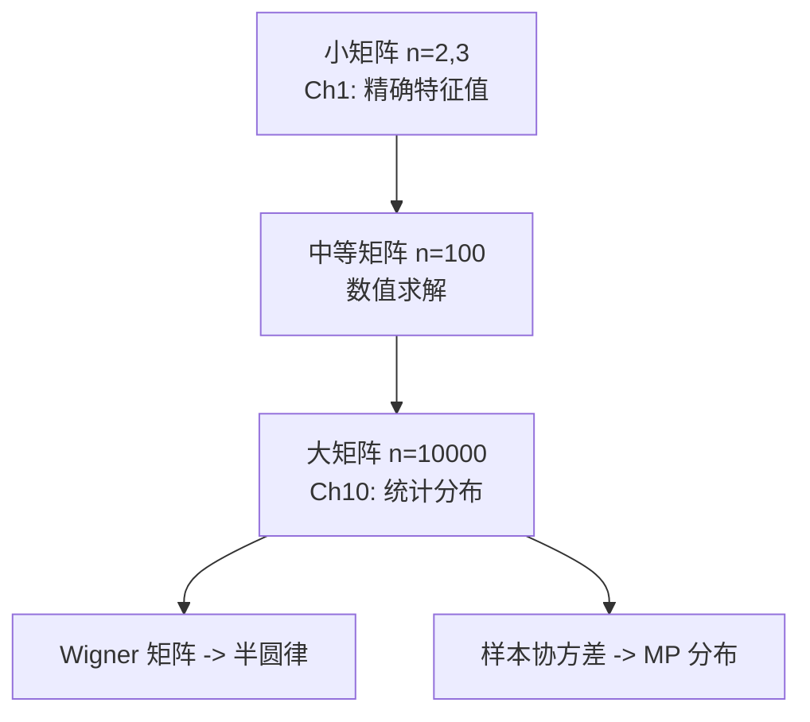

# 第10章 高维推广 (High-Dimensional Generalizations)

> **作者**：kyksj-1
> **风格致敬**：Gilbert Strang × 3Blue1Brown

---

## 本章导读

Gilbert Strang 曾说：

> "线性代数在任何维度下都是对的——但**高维空间的直觉**与低维截然不同。"

在 Ch1-Ch9 中，我们反复使用 $2 \times 2$ 和 $3 \times 3$ 矩阵来建立直觉：特征值、对角化、二次型、谱定理、正定性……这些概念在任何有限维度下都成立。然而，当维度 $n$ 从个位数增长到数百、数千乃至数百万时，**新的现象**涌现了：

- 空间变得空旷到不可思议——数据稀疏得像沙漠中的星星；
- 球体的体积趋于零——几乎所有的"体积"集中在一层薄壳上；
- 随机向量几乎彼此正交——高维空间中"方向"多到令人震惊；
- 特征值不再是孤立的数——它们形成**分布**，遵循优美的统计规律。

本章的线索：


> **与前章的关系**：本章不引入新的代数结构，而是探讨前面所有工具在高维中的**行为变化**。Ch1 的特征值变成了 Ch10.2 的谱分布；Ch2 的对角化变成了 Ch10.3 的截断 SVD；Ch3 的二次型变成了 Ch10.4 的高维鞍点；Ch6 的正交性变成了 Ch10.5 的 Johnson-Lindenstrauss 引理。

---

## 10.1 高维空间的直觉与挑战

### 10.1.1 从低维到高维：坐标、内积、范数的自然延伸

在 $\mathbb{R}^n$ 中，一个向量 $\mathbf{x} = (x_1, x_2, \ldots, x_n)^T$ 有 $n$ 个分量。低维的概念自然推广：

| 概念 | 2D/3D | $\mathbb{R}^n$ |
|------|-------|-----------------|
| 内积 | $\mathbf{u} \cdot \mathbf{v} = u_1v_1 + u_2v_2 (+\, u_3v_3)$ | $\langle \mathbf{u}, \mathbf{v}\rangle = \sum_{i=1}^n u_iv_i$ |
| 范数 | $\|\mathbf{x}\| = \sqrt{x_1^2 + x_2^2 (+\, x_3^2)}$ | $\|\mathbf{x}\| = \sqrt{\sum_{i=1}^n x_i^2}$ |
| 距离 | $d = \|\mathbf{x} - \mathbf{y}\|$ | 同左 |
| 角度 | $\cos\theta = \frac{\mathbf{u}\cdot\mathbf{v}}{\|\mathbf{u}\|\|\mathbf{v}\|}$ | 同左 |

这些**代数定义**在任何维度下都一样。问题是：**几何直觉**还一样吗？

答案是：**完全不一样**。

### 10.1.2 维度灾难（Curse of Dimensionality）

**维度灾难**是 Richard Bellman 在 1961 年提出的术语。它的核心含义是：

> 在高维空间中，固定数量的数据点变得**极度稀疏**，使得基于"邻近"的方法失效。

**定量理解**：考虑单位超立方体 $[0,1]^n$。如果我们把每个坐标轴分成 10 等份，那么：

- 在 2D 中，有 $10^2 = 100$ 个小格子——100 个样本就能"填满"
- 在 3D 中，有 $10^3 = 1000$ 个格子——需要 1000 个样本
- 在 100D 中，有 $10^{100}$ 个格子——这比宇宙中的原子数还多！

因此，在高维空间中：

$$
\boxed{\text{所需样本量随维度指数增长：} \quad N \sim k^n}
$$

这就是为什么在机器学习中，**降维**（dimensionality reduction）如此重要——我们必须找到数据真正"活动"的低维子空间。

### 10.1.3 反直觉现象一：高维球的体积趋于零

$n$ 维单位球（半径 $r = 1$）的体积为：

$$
\boxed{V_n = \frac{\pi^{n/2}}{\Gamma(n/2 + 1)}}
$$

其中 $\Gamma$ 是 Gamma 函数（$\Gamma(k+1) = k!$ 对正整数 $k$）。

| 维度 $n$ | $V_n$ |
|----------|-------|
| 1 | 2 |
| 2 | $\pi \approx 3.14$ |
| 3 | $\frac{4\pi}{3} \approx 4.19$ |
| 5 | $\approx 5.26$ |
| 10 | $\approx 2.55$ |
| 20 | $\approx 0.026$ |
| 50 | $\approx 2.6 \times 10^{-15}$ |
| 100 | $\approx 2.4 \times 10^{-40}$ |

体积先增后减，在 $n \approx 5$ 时达到最大值，然后**迅速崩塌至零**！

> **3Blue1Brown 的视角**：想象你在高维空间中画一个"球"——它被包裹在同样半径的超立方体之中。随着维度增加，超立方体的"角落"越来越多（$2^n$ 个角），而球只能占据越来越小的比例。球变成了超立方体内一个微不足道的小点。

### 10.1.4 反直觉现象二：体积集中在薄壳上

在高维球中，**几乎所有的体积集中在表面附近的薄壳中**。

考虑半径为 $R$ 的球和半径为 $R(1-\epsilon)$ 的内球，薄壳的体积占比为：

$$
\frac{V_n(R) - V_n(R(1-\epsilon))}{V_n(R)} = 1 - (1-\epsilon)^n
$$

当 $n$ 很大时，即使 $\epsilon$ 很小：

$$
\boxed{1 - (1-\epsilon)^n \to 1 \quad \text{当 } n \to \infty}
$$

例如，$\epsilon = 0.01$（1% 厚度的壳层）：

- $n = 100$ 时，薄壳占体积比 $= 1 - 0.99^{100} \approx 63.4\%$
- $n = 500$ 时，薄壳占体积比 $\approx 99.3\%$
- $n = 1000$ 时，薄壳占体积比 $\approx 99.996\%$

这意味着高维球中**没有"内部"可言**——所有的"质量"都在表面。这对高维积分、采样和统计物理都有深远影响。

### 10.1.5 反直觉现象三：高维向量几乎正交

这是最惊人的现象之一。如果我们从高维单位球面上**均匀随机**地抽取两个向量 $\mathbf{u}$ 和 $\mathbf{v}$，它们的内积：

$$
\cos\theta = \frac{\langle \mathbf{u}, \mathbf{v}\rangle}{\|\mathbf{u}\|\|\mathbf{v}\|}
$$

当 $n \to \infty$ 时，$\cos\theta$ 集中在 0 附近，方差为 $O(1/n)$。

更精确地，对单位球面上均匀分布的两个随机向量：

$$
\boxed{\mathbb{E}[\cos\theta] = 0, \quad \text{Var}[\cos\theta] = \frac{1}{n}}
$$

因此在 $n = 1000$ 维中，两个随机向量的夹角几乎必然落在 $90° \pm 2°$ 之间！

> **3Blue1Brown 的视角**：在二维中，你只有一个"正交伙伴"——垂直方向。但在 $n$ 维中，有 $n-1$ 个独立的正交方向，而只有 1 个"平行"方向。方向太多了，以至于任何两个随机方向几乎不可能对齐。这就像在一个有一百万扇门的走廊里，两个人同时挑中同一扇门的概率微乎其微。

这个现象正是 Ch10.5 中 Johnson-Lindenstrauss 引理能够成立的直觉基础。

---

## 10.2 高维中的特征值与谱

### 10.2.1 从精确求解到统计刻画

在 Ch1 中，我们对 $2\times 2$ 或 $3\times 3$ 矩阵精确求解特征值——解二次或三次特征方程。但当 $n = 10000$ 时：

- 特征方程是 10000 次多项式——无法解析求根；
- 数值方法可以求出所有特征值，但计算量为 $O(n^3)$；
- 更重要的是，**单个特征值的精确值往往不重要**——重要的是特征值的**整体分布**。

这就引出了**随机矩阵理论**（Random Matrix Theory, RMT）。

### 10.2.2 Wigner 矩阵与半圆律

**定义**：一个 $n \times n$ 的 **Wigner 矩阵** $W$ 满足：
- $W$ 是实对称的：$W_{ij} = W_{ji}$
- 上三角元素 $W_{ij}$（$i \leq j$）是独立同分布的随机变量
- 期望为零，方差为 $\sigma^2$

**Wigner 半圆律**（Semicircle Law）：当 $n \to \infty$ 时，将特征值缩放为 $\tilde{\lambda}_i = \lambda_i / (\sigma\sqrt{n})$，则特征值的经验分布趋于半圆分布：

$$
\boxed{\rho(\tilde{\lambda}) = \frac{2}{\pi}\sqrt{1 - \tilde{\lambda}^2}, \quad |\tilde{\lambda}| \leq 1}
$$

这个分布的形状是一个半圆——中间密、两端疏，所有特征值被压缩在 $[-2\sigma\sqrt{n}, \, 2\sigma\sqrt{n}]$ 的区间内。



### 10.2.3 样本协方差矩阵与 Marchenko-Pastur 分布

在统计学和机器学习中，更常见的是**样本协方差矩阵**。设有 $p$ 个特征、$n$ 个样本，数据矩阵 $X$ 为 $p \times n$，则样本协方差矩阵为：

$$
S = \frac{1}{n}XX^T
$$

当 $p, n \to \infty$，且比值 $\gamma = p/n$ 保持为常数时，$S$ 的特征值分布趋于 **Marchenko-Pastur（MP）分布**：

$$
\boxed{\rho(\lambda) = \frac{1}{2\pi\sigma^2\gamma}\frac{\sqrt{(\lambda_+ - \lambda)(\lambda - \lambda_-)}}{\lambda}, \quad \lambda_- \leq \lambda \leq \lambda_+}
$$

其中 $\lambda_\pm = \sigma^2(1 \pm \sqrt{\gamma})^2$，$\sigma^2$ 是数据元素的方差。

**关键信息**：

| 参数 | 含义 |
|------|------|
| $\gamma = p/n$ | 维度与样本量之比 |
| $\gamma < 1$ | 样本充足，谱有质量在 0 处（$p-n$ 个零特征值） |
| $\gamma = 1$ | 方阵，$\lambda_- = 0$，谱从 0 延伸到 $4\sigma^2$ |
| $\gamma > 1$ | 高维，$p > n$，有 $p-n$ 个零特征值 |

> **与 Ch1 的对比**：Ch1 告诉我们每个特征值是什么；RMT 告诉我们**大量特征值长什么样**。前者是"显微镜"，后者是"望远镜"。

### 10.2.4 谱间距与普适性

随机矩阵理论中一个更深刻的结果是**谱间距统计**（level spacing statistics）。

- 在 GOE（Gaussian Orthogonal Ensemble，实对称高斯随机矩阵）中，相邻特征值之间的间距服从**Wigner surmise**分布：

$$
p(s) \approx \frac{\pi s}{2}\exp\left(-\frac{\pi s^2}{4}\right)
$$

其中 $s$ 是归一化后的间距。

- 关键特征：**排斥效应**——特征值倾向于彼此远离，$p(0) = 0$，这与独立随机数的 Poisson 分布 $p(s) = e^{-s}$ 形成鲜明对比。

这种排斥效应在物理学中有深刻的类比：核物理中重原子核的能级间距、量子混沌系统的能谱、甚至黎曼 zeta 函数零点的分布都展现出相同的统计规律——这就是随机矩阵的**普适性**（universality）。

---

## 10.3 高维对角化与 SVD

### 10.3.1 高维对角化的数值挑战

回顾 Ch2 中的对角化：$A = PDP^{-1}$。在理论上，对角化对任何可对角化矩阵都适用。但在高维中：

**计算复杂度**：

| 操作 | 复杂度 |
|------|--------|
| 特征值分解 | $O(n^3)$ |
| SVD | $O(mn\min(m,n))$ |
| 矩阵乘法 | $O(n^3)$（朴素），$O(n^{2.37})$（理论最优） |

当 $n = 10^6$（百万维）时，$O(n^3) = O(10^{18})$——即使每秒 $10^{12}$ 次浮点运算（TFLOPS），也需要 $10^6$ 秒 $\approx$ 11.6 天！

因此在高维中，**我们几乎不做完整的对角化**。取而代之的是：
1. 只求前 $k$ 个最大（或最小）特征值——**部分特征值分解**
2. 利用矩阵结构（稀疏性、低秩性）加速
3. 使用**随机化算法**

### 10.3.2 截断 SVD 与 Eckart-Young 定理

回顾 SVD（Ch6 谱定理的推广）：任何 $m \times n$ 矩阵 $A$ 都可以分解为：

$$
A = U\Sigma V^T = \sum_{i=1}^r \sigma_i \mathbf{u}_i\mathbf{v}_i^T
$$

其中 $r = \text{rank}(A)$，$\sigma_1 \geq \sigma_2 \geq \cdots \geq \sigma_r > 0$ 是奇异值。

**截断 SVD**：只保留前 $k$ 个最大的奇异值：

$$
\boxed{A_k = \sum_{i=1}^k \sigma_i \mathbf{u}_i\mathbf{v}_i^T}
$$

**Eckart-Young 定理**（1936）：在所有秩不超过 $k$ 的矩阵中，$A_k$ 是 $A$ 的**最佳逼近**：

$$
\boxed{A_k = \arg\min_{\text{rank}(B) \leq k} \|A - B\|_F}
$$

其中 Frobenius 范数 $\|M\|_F = \sqrt{\sum_{i,j}M_{ij}^2} = \sqrt{\sum_i \sigma_i^2}$。

逼近误差为：

$$
\|A - A_k\|_F = \sqrt{\sigma_{k+1}^2 + \cdots + \sigma_r^2}
$$

> **3Blue1Brown 的视角**：SVD 把矩阵 $A$ 分解成了 $r$ 个"层"，每一层 $\sigma_i\mathbf{u}_i\mathbf{v}_i^T$ 是一个秩-1 矩阵。这些层按重要性排列（$\sigma_1$ 最大）。截断 SVD 就像是只保留一幅画的"主色调"，丢掉细节纹理——保留的层越多，画面越清晰。

### 10.3.3 随机化 SVD

当 $A$ 是 $m \times n$ 的大矩阵，且我们只需要前 $k$ 个奇异值/向量时，**随机化 SVD** 可以将复杂度从 $O(mn\min(m,n))$ 降低到 $O(mnk)$。

**核心思想**（Halko, Martinsson, Tropp, 2011）：

**步骤 1**：生成随机矩阵 $\Omega \in \mathbb{R}^{n \times (k+p)}$，其中 $p$ 是过采样参数（通常 $p = 5 \sim 10$）。

**步骤 2**：计算 $Y = A\Omega$，得到 $m \times (k+p)$ 的矩阵。这一步通过矩阵-向量乘积"探测"了 $A$ 的列空间。

**步骤 3**：对 $Y$ 做 QR 分解 $Y = QR$，$Q$ 的列空间近似 $A$ 的前 $k$ 个左奇异向量张成的空间。

**步骤 4**：计算小矩阵 $B = Q^TA$（$(k+p) \times n$），然后对 $B$ 做精确 SVD。

**步骤 5**：从 $B$ 的 SVD 恢复 $A$ 的近似 SVD。

$$
\boxed{\text{随机化 SVD 复杂度：} O(mn(k+p)) + O((k+p)^2n)}
$$

当 $k \ll \min(m,n)$ 时，这比精确 SVD 快得多。

### 10.3.4 PCA：高维数据的最优低维投影

**主成分分析**（Principal Component Analysis, PCA）是高维数据分析的基石工具。

设数据矩阵 $X \in \mathbb{R}^{p \times n}$（$p$ 个特征，$n$ 个样本），中心化后（减去均值），样本协方差矩阵为：

$$
C = \frac{1}{n-1}XX^T
$$

PCA 的目标：找到 $k$ 个正交方向 $\mathbf{w}_1, \ldots, \mathbf{w}_k$，使得数据投影到这些方向上后，**保留的方差最大**。

**结论**：$\mathbf{w}_1, \ldots, \mathbf{w}_k$ 恰好是 $C$ 的前 $k$ 个特征向量（对应最大的 $k$ 个特征值）。

> **与前章的联系**：
> - Ch1：特征向量是"矩阵自己的方向"——PCA 找到的是协方差矩阵的特征方向
> - Ch2：对角化 $C = Q\Lambda Q^T$ 把相关数据变成不相关的——这就是 PCA 的本质
> - Ch6：谱定理保证实对称矩阵有正交特征向量——PCA 的理论基础

**PCA 的 SOP**（高维版本）：

1. 中心化数据：$\tilde{X} = X - \bar{\mathbf{x}}\mathbf{1}^T$
2. 选择计算策略：
   - 若 $p < n$：直接对 $C = \frac{1}{n-1}\tilde{X}\tilde{X}^T$（$p\times p$）做特征值分解
   - 若 $p > n$：对 $\frac{1}{n-1}\tilde{X}^T\tilde{X}$（$n\times n$）做特征值分解（**对偶 PCA**）
   - 若 $p$ 和 $n$ 都很大：使用随机化 SVD
3. 取前 $k$ 个主成分，计算投影 $Z = W_k^T\tilde{X}$
4. 选择 $k$：使得累计方差解释率 $\sum_{i=1}^k\lambda_i / \sum_{i=1}^p\lambda_i \geq 0.9$（或其他阈值）

---

## 10.4 高维二次型与优化

### 10.4.1 高维 Hessian 矩阵

回顾 Ch3 和 Ch7：二次型 $Q(\mathbf{x}) = \mathbf{x}^TA\mathbf{x}$ 的性质由 $A$ 的特征值决定。在优化中，损失函数 $f(\mathbf{x})$ 在临界点处的 Hessian 矩阵 $H = \nabla^2 f$ 决定了该点的性质：

| $H$ 的特征值 | 临界点类型 |
|-------------|-----------|
| 全部 $> 0$（正定） | 局部极小值 |
| 全部 $< 0$（负定） | 局部极大值 |
| 有正有负（不定） | 鞍点 |

### 10.4.2 高维中鞍点占主导

在低维中，鞍点似乎只是特殊情况。但在高维中，**鞍点的数量远远超过局部极小值**。

**直觉论证**：在一个临界点处，$H$ 有 $n$ 个特征值。如果每个特征值独立地以概率 $1/2$ 为正，以概率 $1/2$ 为负，那么：

- 成为局部极小值（所有特征值为正）的概率 $= (1/2)^n$
- 成为鞍点（至少一个特征值为负）的概率 $= 1 - (1/2)^n$

当 $n = 100$ 时：

$$
P(\text{局部极小值}) = 2^{-100} \approx 10^{-30}
$$

几乎所有的临界点都是鞍点！

> **与深度学习的联系**（Ch9）：这解释了为什么神经网络的损失函数中，"被困在局部极小值"其实是个伪问题——真正的挑战是**鞍点**。SGD（随机梯度下降）的随机性恰好有助于逃离鞍点。

### 10.4.3 条件数在高维中的行为

回顾 Ch7，条件数 $\kappa(A) = \lambda_{\max}/\lambda_{\min}$ 衡量优化的难度。在高维中，条件数往往**非常大**。

对 $n \times n$ 的 Wishart 矩阵（$S = \frac{1}{m}X^TX$，$X$ 为 $m \times n$ 高斯矩阵），当 $m/n \to \gamma > 1$ 时：

$$
\kappa(S) \approx \left(\frac{1 + \sqrt{n/m}}{1 - \sqrt{n/m}}\right)^2
$$

当 $m \approx n$（样本量接近维度）时，$\kappa \to \infty$——协方差矩阵变得**病态**。

这就是为什么在高维统计中需要**正则化**：

$$
S_{\text{reg}} = S + \alpha I
$$

正则化将最小特征值从接近 0 提升到 $\alpha$，条件数变为 $(\lambda_{\max} + \alpha) / \alpha$。

> **与 Ch7 的联系**：Ch7 讲了正定性与条件数的关系；在高维中，这些问题被极大地放大——小矩阵上的温和病态，在高维中可能变成数值灾难。

### 10.4.4 高维梯度下降的收敛

对二次型 $f(\mathbf{x}) = \frac{1}{2}\mathbf{x}^TA\mathbf{x} - \mathbf{b}^T\mathbf{x}$，梯度下降的收敛速率为：

$$
\boxed{\|\mathbf{x}_k - \mathbf{x}^*\|_A \leq \left(\frac{\kappa - 1}{\kappa + 1}\right)^k \|\mathbf{x}_0 - \mathbf{x}^*\|_A}
$$

当 $\kappa$ 很大时，$(\kappa-1)/(\kappa+1) \approx 1 - 2/\kappa$，收敛极其缓慢。

**预条件**（Preconditioning）的思想：用一个近似逆 $M \approx A^{-1}$ 变换问题，使等效条件数 $\kappa(MA) \ll \kappa(A)$，从而加速收敛。这正是 Ch9 应用专题中预条件共轭梯度法的原理。

---

## 10.5 高维中的正交性与 Johnson-Lindenstrauss 引理

### 10.5.1 高维中的"几乎正交"

在 10.1.5 节我们已经看到：高维空间中随机向量几乎正交。让我们更精确地量化这一现象。

**定理**：设 $\mathbf{u}, \mathbf{v}$ 独立均匀分布在 $\mathbb{R}^n$ 的单位球面上，则对任意 $\epsilon > 0$：

$$
P(|\langle \mathbf{u}, \mathbf{v}\rangle| > \epsilon) \leq 2\exp\left(-\frac{n\epsilon^2}{2}\right)
$$

这是一个**指数集中不等式**——内积偏离 0 的概率以指数速度衰减。

**推论**：取 $N$ 个随机单位向量 $\mathbf{v}_1, \ldots, \mathbf{v}_N$。只要 $N \ll e^{n/2}$，这些向量几乎彼此正交。也就是说：

> 在 $n$ 维空间中，可以放下**指数多个**几乎正交的向量！

这与低维的经验完全相反——在 3D 中最多只有 3 个正交向量。

### 10.5.2 Johnson-Lindenstrauss 引理

这个"方向富余"的性质引出了高维几何中最重要的定理之一。

**JL 引理**（Johnson & Lindenstrauss, 1984）：

> 设 $\mathbf{x}_1, \ldots, \mathbf{x}_N \in \mathbb{R}^n$ 是 $N$ 个点，$0 < \epsilon < 1$。则存在一个线性映射 $f: \mathbb{R}^n \to \mathbb{R}^k$，其中
>
> $$\boxed{k = O\!\left(\frac{\log N}{\epsilon^2}\right)}$$
>
> 使得对所有 $i, j$：
>
> $$(1 - \epsilon)\|\mathbf{x}_i - \mathbf{x}_j\|^2 \leq \|f(\mathbf{x}_i) - f(\mathbf{x}_j)\|^2 \leq (1+\epsilon)\|\mathbf{x}_i - \mathbf{x}_j\|^2$$

**解读**：
- 目标维度 $k$ 只依赖于点的个数 $N$ 和精度 $\epsilon$，**与原始维度 $n$ 无关**！
- 即使原始维度是 $n = 10^6$，只要有 $N = 10^6$ 个点、要求 $\epsilon = 0.1$，投影维度只需要 $k \approx O(\log 10^6 / 0.01) \approx O(1400)$。

**构造方法**：最简单的实现是**随机投影**——

$$
f(\mathbf{x}) = \frac{1}{\sqrt{k}}R\mathbf{x}
$$

其中 $R$ 是 $k \times n$ 的随机矩阵，每个元素独立取 $\mathcal{N}(0,1)$。

### 10.5.3 JL 引理的直觉证明思路

**为什么随机投影能保持距离？**

考虑单个向量 $\mathbf{x}$ 被 $\frac{1}{\sqrt{k}}R$ 投影后的范数：

$$
\|f(\mathbf{x})\|^2 = \frac{1}{k}\|R\mathbf{x}\|^2 = \frac{1}{k}\sum_{i=1}^k (\mathbf{r}_i^T\mathbf{x})^2
$$

其中 $\mathbf{r}_i$ 是 $R$ 的第 $i$ 行（$n$ 维高斯随机向量）。

- 每个 $\mathbf{r}_i^T\mathbf{x}$ 是高斯分布 $\mathcal{N}(0, \|\mathbf{x}\|^2)$
- $\frac{1}{k}\sum_{i=1}^k (\mathbf{r}_i^T\mathbf{x})^2$ 是 $k$ 个独立同分布随机变量的平均
- 由大数定律，当 $k$ 足够大时，平均值集中在期望 $\|\mathbf{x}\|^2$ 附近

精确的集中不等式给出：当 $k = O(\log N / \epsilon^2)$ 时，对 $\binom{N}{2}$ 个距离对同时保持 $(1\pm\epsilon)$ 的概率大于 0——因此这样的投影**存在**。

### 10.5.4 随机投影的应用

**应用一：近似最近邻搜索**

在 $n$ 维空间中对 $N$ 个数据点做最近邻搜索，暴力方法需要 $O(nN)$。将所有点投影到 $k = O(\log N)$ 维后，搜索只需 $O(kN)$，而距离关系几乎保持不变。

**应用二：压缩感知入门**

如果一个信号 $\mathbf{x} \in \mathbb{R}^n$ 是**稀疏的**（只有 $s \ll n$ 个非零分量），那么可以用 $m = O(s\log(n/s))$ 次随机线性测量恢复它：

$$
\mathbf{y} = \Phi\mathbf{x}, \quad \Phi \in \mathbb{R}^{m \times n}
$$

这比 Nyquist 采样定理所要求的 $n$ 次测量少得多。压缩感知的理论基础正是 JL 引理的精神——随机投影保持稀疏向量之间的距离。

**应用三：流式数据处理**

高维数据流中，我们无法存储所有数据。随机投影允许我们维护一个**低维素描**（sketch），从中回答关于原始数据的近似查询。

---

## 10.6 编程实践

### 10.6.1 编程 1：高维球体积的 Monte Carlo 验证

```python
import numpy as np
import matplotlib.pyplot as plt
from scipy.special import gamma

# ============================================================
# 编程 1: 高维球体积的 Monte Carlo 估计与解析公式对比
# ============================================================

def unit_ball_volume_exact(n):
    """计算 n 维单位球的精确体积"""
    return np.pi ** (n / 2) / gamma(n / 2 + 1)

def unit_ball_volume_mc(n, num_samples=500000):
    """
    用 Monte Carlo 方法估计 n 维单位球的体积。
    在 [-1,1]^n 超立方体中均匀采样，计算落入球内的比例。
    超立方体体积为 2^n，球体积 = 比例 * 2^n。
    """
    # 在 [-1,1]^n 中采样
    points = np.random.uniform(-1, 1, size=(num_samples, n))
    # 计算每个点到原点的距离
    distances = np.linalg.norm(points, axis=1)
    # 落入单位球内的比例
    fraction_inside = np.mean(distances <= 1.0)
    # 超立方体体积 = 2^n
    volume_estimate = fraction_inside * (2 ** n)
    return volume_estimate, fraction_inside

# 对多个维度进行实验
dims = [2, 3, 4, 5, 6, 8, 10, 12, 15]
exact_volumes = []
mc_volumes = []
fractions = []

np.random.seed(42)
for n in dims:
    v_exact = unit_ball_volume_exact(n)
    v_mc, frac = unit_ball_volume_mc(n, num_samples=500000)
    exact_volumes.append(v_exact)
    mc_volumes.append(v_mc)
    fractions.append(frac)
    print(f"n={n:2d}: V_exact={v_exact:.6f}, V_mc={v_mc:.6f}, "
          f"fraction_inside={frac:.6f}")

# 可视化
fig, axes = plt.subplots(1, 2, figsize=(14, 5))

# 图1: 精确体积 vs 维度
dims_fine = np.arange(1, 31)
volumes_fine = [unit_ball_volume_exact(n) for n in dims_fine]
axes[0].plot(dims_fine, volumes_fine, 'b-o', markersize=4, label='Exact volume')
axes[0].set_xlabel('Dimension n', fontsize=12)
axes[0].set_ylabel('Volume of unit ball', fontsize=12)
axes[0].set_title('Volume of the n-Dimensional Unit Ball', fontsize=13)
axes[0].legend()
axes[0].grid(True, alpha=0.3)

# 图2: 球/超立方体体积比
axes[1].semilogy(dims, fractions, 'ro-', markersize=6,
                 label='MC: fraction inside ball')
axes[1].set_xlabel('Dimension n', fontsize=12)
axes[1].set_ylabel('V_ball / V_cube (log scale)', fontsize=12)
axes[1].set_title('Ball-to-Cube Volume Ratio vs Dimension', fontsize=13)
axes[1].legend()
axes[1].grid(True, alpha=0.3)

plt.tight_layout()
plt.savefig('high_dim_ball_volume.png', dpi=150, bbox_inches='tight')
plt.show()
```

### 10.6.2 编程 2：随机矩阵谱的可视化

```python
import numpy as np
import matplotlib.pyplot as plt

# ============================================================
# 编程 2: Wigner 半圆律与 Marchenko-Pastur 分布的数值验证
# ============================================================

np.random.seed(42)

fig, axes = plt.subplots(1, 2, figsize=(14, 5))

# ---- 左图: Wigner 半圆律 ----
n = 2000
# 生成 Wigner 矩阵（实对称，上三角为标准正态）
W = np.random.randn(n, n)
W = (W + W.T) / 2  # 对称化

# 特征值
eigvals_wigner = np.linalg.eigvalsh(W)
# 缩放: lambda / sqrt(n)
eigvals_scaled = eigvals_wigner / np.sqrt(n)

# 理论半圆分布
x_theory = np.linspace(-2, 2, 500)
rho_semicircle = (2 / np.pi) * np.sqrt(np.maximum(1 - (x_theory / 2) ** 2, 0))

axes[0].hist(eigvals_scaled, bins=100, density=True, alpha=0.7,
             color='steelblue', label='Empirical (n=2000)')
axes[0].plot(x_theory, rho_semicircle, 'r-', linewidth=2,
             label='Semicircle law')
axes[0].set_xlabel('Scaled eigenvalue', fontsize=12)
axes[0].set_ylabel('Density', fontsize=12)
axes[0].set_title("Wigner's Semicircle Law", fontsize=13)
axes[0].legend(fontsize=10)
axes[0].grid(True, alpha=0.3)

# ---- 右图: Marchenko-Pastur 分布 ----
p = 500   # 特征数
n_samples = 2000  # 样本数
gamma_ratio = p / n_samples  # gamma = p/n

# 生成数据矩阵
X = np.random.randn(p, n_samples)
# 样本协方差矩阵
S = (1 / n_samples) * X @ X.T

# 特征值
eigvals_mp = np.linalg.eigvalsh(S)

# 理论 MP 分布
sigma2 = 1.0
lambda_minus = sigma2 * (1 - np.sqrt(gamma_ratio)) ** 2
lambda_plus = sigma2 * (1 + np.sqrt(gamma_ratio)) ** 2

x_mp = np.linspace(lambda_minus * 0.9, lambda_plus * 1.1, 500)
# MP 密度
rho_mp = np.zeros_like(x_mp)
mask = (x_mp >= lambda_minus) & (x_mp <= lambda_plus)
rho_mp[mask] = (1 / (2 * np.pi * sigma2 * gamma_ratio)) * \
    np.sqrt((lambda_plus - x_mp[mask]) * (x_mp[mask] - lambda_minus)) / x_mp[mask]

axes[1].hist(eigvals_mp, bins=80, density=True, alpha=0.7,
             color='forestgreen', label=f'Empirical (p={p}, n={n_samples})')
axes[1].plot(x_mp, rho_mp, 'r-', linewidth=2,
             label=f'MP law (gamma={gamma_ratio:.2f})')
axes[1].axvline(lambda_minus, color='orange', linestyle='--', alpha=0.8,
                label=f'lambda_minus={lambda_minus:.3f}')
axes[1].axvline(lambda_plus, color='orange', linestyle='--', alpha=0.8,
                label=f'lambda_plus={lambda_plus:.3f}')
axes[1].set_xlabel('Eigenvalue', fontsize=12)
axes[1].set_ylabel('Density', fontsize=12)
axes[1].set_title('Marchenko-Pastur Distribution', fontsize=13)
axes[1].legend(fontsize=9)
axes[1].grid(True, alpha=0.3)

plt.tight_layout()
plt.savefig('random_matrix_spectra.png', dpi=150, bbox_inches='tight')
plt.show()
```

### 10.6.3 编程 3：Johnson-Lindenstrauss 引理的实验验证

```python
import numpy as np
import matplotlib.pyplot as plt
from itertools import combinations

# ============================================================
# 编程 3: Johnson-Lindenstrauss 引理的实验验证
# ============================================================

np.random.seed(42)

def random_projection(X, k):
    """
    将数据矩阵 X (n_features x n_samples) 随机投影到 k 维。
    使用高斯随机矩阵 R (k x n_features)。

    参数:
        X: 数据矩阵，形状 (n_features, n_samples)
        k: 目标维度
    返回:
        Y: 投影后的数据，形状 (k, n_samples)
    """
    n_features = X.shape[0]
    R = np.random.randn(k, n_features) / np.sqrt(k)
    return R @ X

def compute_pairwise_distances(X):
    """计算所有点对之间的距离（输入为 n_features x n_samples）"""
    n = X.shape[1]
    dists = []
    for i, j in combinations(range(n), 2):
        d = np.linalg.norm(X[:, i] - X[:, j])
        dists.append(d)
    return np.array(dists)

# 参数设置
n_features = 5000   # 原始维度
n_points = 200      # 数据点数
target_dims = [10, 20, 50, 100, 200, 500, 1000, 2000]

# 生成高维随机数据
X = np.random.randn(n_features, n_points)

# 原始距离
orig_dists = compute_pairwise_distances(X)

# 不同目标维度下的距离畸变
fig, axes = plt.subplots(2, 2, figsize=(14, 12))

distortion_stats = []  # 存储统计量

for k in target_dims:
    Y = random_projection(X, k)
    proj_dists = compute_pairwise_distances(Y)

    # 计算畸变比: ||f(x_i)-f(x_j)||^2 / ||x_i-x_j||^2
    ratios = (proj_dists / orig_dists) ** 2
    max_distortion = np.max(np.abs(ratios - 1))
    mean_distortion = np.mean(np.abs(ratios - 1))
    distortion_stats.append((k, max_distortion, mean_distortion))
    print(f"k={k:4d}: max |ratio-1| = {max_distortion:.4f}, "
          f"mean |ratio-1| = {mean_distortion:.4f}")

# ---- 图 1: 散点图（原始距离 vs 投影距离）----
for idx, k in enumerate([20, 100, 500, 2000]):
    ax = axes[idx // 2][idx % 2]
    Y = random_projection(X, k)
    proj_dists = compute_pairwise_distances(Y)

    ax.scatter(orig_dists, proj_dists, alpha=0.05, s=1, color='steelblue')
    max_d = max(orig_dists.max(), proj_dists.max())
    ax.plot([0, max_d], [0, max_d], 'r--', linewidth=1.5, label='y = x')
    ax.set_xlabel('Original distance', fontsize=11)
    ax.set_ylabel('Projected distance', fontsize=11)
    ax.set_title(f'k = {k} (from n = {n_features})', fontsize=12)
    ax.legend()
    ax.grid(True, alpha=0.3)
    ax.set_aspect('equal')

plt.tight_layout()
plt.savefig('jl_lemma_scatter.png', dpi=150, bbox_inches='tight')
plt.show()

# ---- 图 2: 最大畸变 vs 目标维度 ----
fig, ax = plt.subplots(figsize=(8, 5))
ks = [s[0] for s in distortion_stats]
max_dists = [s[1] for s in distortion_stats]
mean_dists = [s[2] for s in distortion_stats]

ax.plot(ks, max_dists, 'ro-', label='Max distortion', markersize=6)
ax.plot(ks, mean_dists, 'bs-', label='Mean distortion', markersize=6)
# JL 理论界: epsilon ~ sqrt(log(N)/k)
eps_theory = np.sqrt(8 * np.log(n_points) / np.array(ks))
ax.plot(ks, eps_theory, 'g--', linewidth=2, label='JL bound (approx)')
ax.set_xlabel('Target dimension k', fontsize=12)
ax.set_ylabel('Distortion', fontsize=12)
ax.set_title('Distance Distortion vs. Projection Dimension', fontsize=13)
ax.legend(fontsize=10)
ax.set_xscale('log')
ax.grid(True, alpha=0.3)

plt.tight_layout()
plt.savefig('jl_lemma_distortion.png', dpi=150, bbox_inches='tight')
plt.show()
```

---

## 10.7 Key Takeaway

| 主题 | 低维 ($n = 2, 3$) | 高维 ($n \gg 1$) | 关联章节 |
|------|-------------------|-------------------|----------|
| 球体积 | $\pi r^2$, $\frac{4}{3}\pi r^3$ | $V_n \to 0$，体积集中在薄壳 | — |
| 向量方向 | 少数几个正交方向 | 随机向量几乎都正交 | Ch6 |
| 特征值 | 精确求解特征方程 | 统计分布（半圆律、MP 分布） | Ch1, Ch2 |
| 对角化 | $O(n^3)$ 可接受 | 需要截断 SVD / 随机化 SVD | Ch2, Ch6 |
| 二次型 / Hessian | 判别局部极值 / 鞍点 | 鞍点概率 $\to 1$，条件数恶化 | Ch3, Ch7 |
| 降维 | 不必要 | PCA、随机投影是核心工具 | Ch5 |
| 距离保持 | 恒等映射即可 | JL 引理：$k = O(\log N / \epsilon^2)$ | Ch6 |
| 数值方法 | 直接法足够 | 迭代法、随机化算法、预条件 | Ch9 |

> **一句话总结**：高维空间中，低维直觉失效，但线性代数的基本定理依然成立——关键是用**统计视角**和**近似方法**替代精确计算。

---

## 习题

### 概念理解

**10.1** 判断正误并简要解释：
  - (a) 在 100 维空间中，单位球的体积大于单位超立方体 $[0,1]^{100}$ 的体积。
  - (b) 在高维空间中，从单位球中均匀采样的点几乎都落在球面附近。
  - (c) JL 引理保证可以将任意高维数据无损地投影到低维空间。

**10.2** 解释为什么 PCA 的前 $k$ 个主成分给出了数据的"最优 $k$ 维线性近似"。这里的"最优"是在什么意义下？请联系 Eckart-Young 定理说明。

**10.3** 在 Ch1 中，我们说"特征向量是矩阵自己的方向"。在随机矩阵理论的语境下，单个特征向量还有这样清晰的几何意义吗？为什么？

### 计算练习

**10.4** 计算 $n = 1, 2, \ldots, 10$ 维单位球的体积 $V_n$，找到使 $V_n$ 最大的维度。

**10.5** 设 $n = 500$，计算半径为 1 的球中、厚度为 $\epsilon = 0.05$ 的外壳（即 $0.95 \leq \|\mathbf{x}\| \leq 1$ 的区域）所占的体积比。

**10.6** 对一个 $100 \times 100$ 的 Wigner 矩阵（元素为 $\mathcal{N}(0,1)$），理论上特征值应分布在什么区间内？最大和最小特征值的近似值是多少？

### 思考题

**10.7** 为什么在深度学习中，即使损失函数有大量鞍点，SGD 仍然能找到好的解？从以下两个角度讨论：(a) 鞍点附近的 Hessian 结构；(b) SGD 的随机噪声。

**10.8** JL 引理告诉我们，$N$ 个高维点可以投影到 $k = O(\log N/\epsilon^2)$ 维并近似保持距离。如果我们需要保持的不是距离而是**内积**（如注意力机制中的 $QK^T$），JL 引理是否仍然适用？为什么？（提示：$\|\mathbf{x} - \mathbf{y}\|^2 = \|\mathbf{x}\|^2 + \|\mathbf{y}\|^2 - 2\langle\mathbf{x},\mathbf{y}\rangle$）

### 编程题

**10.9** 实验验证"高维向量几乎正交"：
  - 对 $n = 2, 5, 10, 50, 100, 500, 1000$，生成 1000 对随机单位向量
  - 计算每对的 $\cos\theta$，绘制直方图
  - 在每个直方图上叠加理论预测（$\cos\theta$ 的方差为 $1/n$）
  - 观察直方图如何随 $n$ 增大而集中到 0 附近

**10.10** 实现完整的 PCA 流程并与随机化 SVD 对比：
  - 生成一个 $p = 1000, n = 5000$ 的数据矩阵，其中前 10 个主成分解释 90% 的方差（提示：可以构造 $X = U_0 S_0 V_0^T + \sigma \cdot \text{noise}$，其中 $U_0, V_0$ 为随机正交矩阵，$S_0$ 为控制前 10 个奇异值远大于其余的对角矩阵）
  - 分别用精确 SVD 和 `sklearn.utils.extmath.randomized_svd` 提取前 10 个主成分
  - 比较两种方法的：(a) 计算时间，(b) 奇异值的相对误差，(c) 主成分子空间之间的夹角
  - 绘制前 10 个奇异值的对比图和计算时间的柱状图
