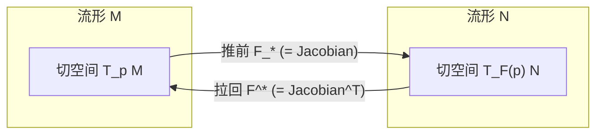
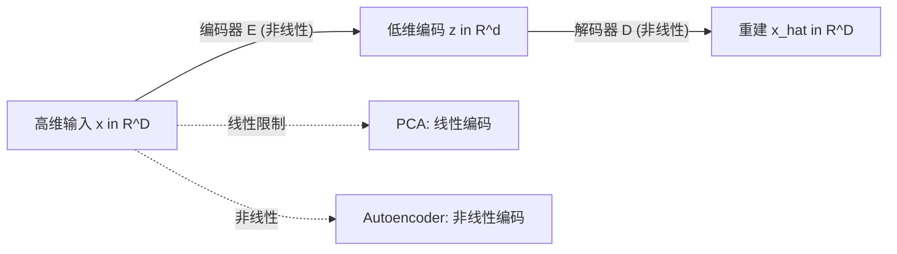
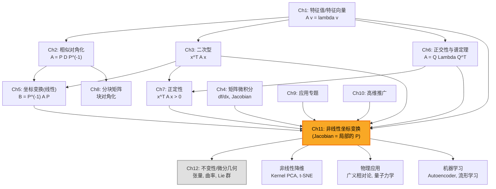

# 第11章 非线性坐标变换（选讲） (Nonlinear Coordinate Transformations)

> **作者**：kyksj-1
> **风格致敬**：Gilbert Strang × 3Blue1Brown

---

## 本章导读

在前面的章节中，我们反复强调"坐标变换"是线性代数的灵魂——相似变换、正交变换、合同变换，这些都是**线性**的。但现实世界充满了弯曲、扭转、折叠——极坐标、球坐标、广义相对论中的时空坐标，乃至深度学习中的非线性嵌入，无一例外。

本章的核心信息只有一句话：

> **非线性变换在每一点的局部行为都是线性的。Jacobian 矩阵就是那个"局部线性近似"。**

因此，前面十章所学的全部线性代数工具——特征值、对角化、二次型、谱定理——在非线性世界中**仍然适用**，只不过是在每一点**分别**适用。

这就是微积分与线性代数的深刻联姻，也是通往微分几何的桥梁（Ch12）。

---

## 11.1 从线性到非线性：为什么要推广？

### 11.1.1 线性变换的局限性

线性变换 $T: \mathbb{R}^n \to \mathbb{R}^n$ 满足 $T(\alpha \mathbf{u} + \beta \mathbf{v}) = \alpha T(\mathbf{u}) + \beta T(\mathbf{v})$。这意味着：

- 原点不动：$T(\mathbf{0}) = \mathbf{0}$
- 直线映射为直线
- 平行线映射为平行线
- 等距网格映射为平行四边形网格

线性变换只能描述**全局均匀**的拉伸、旋转、剪切。但在物理和工程中，变换往往是**因地制宜**的：

| 场景 | 变换 | 非线性特征 |
|------|------|-----------|
| 极坐标 | $(r,\theta) \to (r\cos\theta, r\sin\theta)$ | 网格线变成同心圆和射线 |
| 鱼眼镜头 | 径向畸变 | 中心直，边缘弯 |
| 地图投影 | 球面 → 平面 | 面积/角度必有失真 |
| 广义相对论 | 弯曲时空坐标 | 度量逐点变化 |
| 神经网络 | 逐层非线性变换 | 将数据"折叠"到可分区域 |

### 11.1.2 非线性变换的直觉

**3Blue1Brown 视角**：想象在一张橡胶网格纸上画好坐标线。线性变换相当于"均匀地"拉伸这张纸——网格线保持平行和等距。非线性变换则像是用手任意地揉捏这张橡胶纸：网格线弯曲了，间距也不均匀了，但如果你用放大镜看**任何一个小区域**，网格在足够小的范围内**仍然近似平行四边形**。

这就是核心直觉：**放大镜下的非线性 = 线性**。

### 11.1.3 核心思想的数学表述

设 $\mathbf{F}: \mathbb{R}^n \to \mathbb{R}^n$ 是一个光滑的非线性映射。在点 $\mathbf{x}_0$ 附近，Taylor 展开给出：

$$
\mathbf{F}(\mathbf{x}_0 + \Delta\mathbf{x}) = \mathbf{F}(\mathbf{x}_0) + \underbrace{J(\mathbf{x}_0)}_{\text{Jacobian 矩阵}} \cdot \Delta\mathbf{x} + O(\|\Delta\mathbf{x}\|^2)
$$

忽略高阶项后，$\mathbf{F}$ 在 $\mathbf{x}_0$ 附近的行为就是**线性映射** $J(\mathbf{x}_0)$。

$$
\boxed{\text{非线性变换} \approx \text{平移} + \text{线性变换（Jacobian）} + \text{高阶修正}}
$$

### 11.1.4 与 Ch5 的联系与突破

| 方面 | Ch5：线性坐标变换 | Ch11：非线性坐标变换 |
|------|-------------------|---------------------|
| 变换矩阵 | 全局一个矩阵 $P$ | 每点一个矩阵 $J(\mathbf{x})$ |
| 网格形状 | 平行四边形 | 弯曲网格 |
| 可逆条件 | $\det(P) \neq 0$（全局） | $\det(J) \neq 0$（逐点） |
| 体积变化 | $|\det(P)|$（常数） | $|\det J(\mathbf{x})|$（函数） |
| 工具 | 线性代数 | 线性代数 + 微积分 |

---

## 11.2 Jacobian 矩阵：非线性变换的"局部线性化"

### 11.2.1 定义

设 $\mathbf{F}: \mathbb{R}^n \to \mathbb{R}^m$ 是可微映射，$\mathbf{F}(\mathbf{x}) = (F_1(\mathbf{x}), \ldots, F_m(\mathbf{x}))^T$。**Jacobian 矩阵**定义为：

$$
\boxed{J(\mathbf{x}) = \frac{\partial \mathbf{F}}{\partial \mathbf{x}} = \begin{pmatrix} \frac{\partial F_1}{\partial x_1} & \cdots & \frac{\partial F_1}{\partial x_n} \\ \vdots & \ddots & \vdots \\ \frac{\partial F_m}{\partial x_1} & \cdots & \frac{\partial F_m}{\partial x_n} \end{pmatrix}}
$$

即 $J_{ij} = \frac{\partial F_i}{\partial x_j}$。这正是 Ch4（矩阵微积分）中向量函数对向量的导数。

> **Gilbert Strang 说**："Jacobian 矩阵是微积分送给线性代数的礼物——它把每个光滑映射变成了一族线性映射。"

### 11.2.2 几何意义

Jacobian 矩阵在每一点 $\mathbf{x}_0$ 描述了映射 $\mathbf{F}$ 的**局部线性行为**：

1. **列向量的含义**：$J$ 的第 $j$ 列是 $\frac{\partial \mathbf{F}}{\partial x_j}$，即沿 $x_j$ 方向的微小位移被映射到的方向和速率。

2. **行列式的含义**：$|\det J(\mathbf{x}_0)|$ 是 $\mathbf{x}_0$ 处的**局部体积缩放因子**。

3. **与重积分的联系**：

$$
\boxed{\int_{\mathbf{F}(\Omega)} f(\mathbf{y})\,d\mathbf{y} = \int_{\Omega} f(\mathbf{F}(\mathbf{x}))\,|\det J(\mathbf{x})|\,d\mathbf{x}}
$$

这就是多元微积分中换元公式的本质——$|\det J|$ 修正了体积元在非线性变换下的缩放。

### 11.2.3 Jacobian 的特征值：局部拉伸因子

在每一点 $\mathbf{x}_0$，Jacobian $J(\mathbf{x}_0)$ 是一个普通矩阵，可以计算它的特征值。

当 $J$ 可对角化时，特征值 $\lambda_1, \ldots, \lambda_n$ 就是该点处沿各特征方向的**拉伸因子**——这与 Ch1 的概念完全一致，只不过现在这些拉伸因子**随位置变化**。

- $|\lambda_i| > 1$：沿该特征方向放大
- $|\lambda_i| < 1$：沿该特征方向缩小
- $|\lambda_i| = 1$：沿该特征方向保持长度
- $\lambda_i < 0$：沿该方向反向

### 11.2.4 Jacobian 的 SVD：局部几何的完整描述

对于非方阵或非对称的 Jacobian，更自然的分解是 SVD（Ch5 中已详细讲述）：

$$
J = U\Sigma V^T
$$

在每一点，这给出了：

- $V^T$：输入空间中的最优方向选择（右奇异向量）
- $\Sigma$：各方向上的拉伸量（奇异值 $\sigma_1 \geq \sigma_2 \geq \cdots$）
- $U$：输出空间中的方向旋转（左奇异向量）

局部面积/体积缩放 = $\sigma_1 \sigma_2 \cdots \sigma_n = |\det J|$。

### 11.2.5 例：极坐标的 Jacobian

极坐标变换 $\mathbf{F}(r, \theta) = (r\cos\theta,\; r\sin\theta)$：

$$
J = \begin{pmatrix} \frac{\partial x}{\partial r} & \frac{\partial x}{\partial \theta} \\ \frac{\partial y}{\partial r} & \frac{\partial y}{\partial \theta} \end{pmatrix} = \begin{pmatrix} \cos\theta & -r\sin\theta \\ \sin\theta & r\cos\theta \end{pmatrix}
$$

$$
\det J = r\cos^2\theta + r\sin^2\theta = r
$$

**解读**：
- 面积元 $dA = r\,dr\,d\theta$——这个 $r$ 正是 $|\det J|$。
- 在 $r = 0$（原点）处，$\det J = 0$，变换退化——所有 $\theta$ 方向被映射到同一点。这就是极坐标的**坐标奇点**。

### 11.2.6 例：球坐标的 Jacobian

球坐标变换 $(r, \theta, \phi) \to (x, y, z)$：

$$
\begin{cases}
x = r\sin\theta\cos\phi \\
y = r\sin\theta\sin\phi \\
z = r\cos\theta
\end{cases}
$$

$$
J = \begin{pmatrix}
\sin\theta\cos\phi & r\cos\theta\cos\phi & -r\sin\theta\sin\phi \\
\sin\theta\sin\phi & r\cos\theta\sin\phi & r\sin\theta\cos\phi \\
\cos\theta & -r\sin\theta & 0
\end{pmatrix}
$$

$$
\boxed{\det J = r^2\sin\theta}
$$

因此体积元 $dV = r^2\sin\theta\,dr\,d\theta\,d\phi$。

**奇点分析**：
- $r = 0$：原点退化（$\theta, \phi$ 无意义）
- $\theta = 0$ 或 $\theta = \pi$：北极/南极退化（$\phi$ 无意义）

---

## 11.3 反函数定理与微分同胚

### 11.3.1 反函数定理

线性代数告诉我们：方阵 $A$ 可逆当且仅当 $\det(A) \neq 0$。非线性版本是：

> **反函数定理**：设 $\mathbf{F}: \mathbb{R}^n \to \mathbb{R}^n$ 在 $\mathbf{x}_0$ 处连续可微，且 $\det J(\mathbf{x}_0) \neq 0$。则在 $\mathbf{x}_0$ 的某个邻域内，$\mathbf{F}$ 存在**光滑的局部逆映射** $\mathbf{F}^{-1}$，且
>
> $$\boxed{J_{\mathbf{F}^{-1}}(\mathbf{y}_0) = [J_{\mathbf{F}}(\mathbf{x}_0)]^{-1}}$$

这是线性代数中"$A$ 可逆则 $A^{-1}$ 存在"的精确推广。

注意关键区别：
- 线性情况：$\det(A) \neq 0$ 保证**全局**可逆
- 非线性情况：$\det J(\mathbf{x}_0) \neq 0$ 只保证**局部**可逆

### 11.3.2 微分同胚

**定义**：若 $\mathbf{F}: U \to V$ 是双射，$\mathbf{F}$ 和 $\mathbf{F}^{-1}$ 都光滑（无穷次可微），则称 $\mathbf{F}$ 为**微分同胚**（diffeomorphism）。

微分同胚是非线性世界中"可逆线性映射"的推广：

| 线性代数 | 非线性推广 |
|---------|-----------|
| 可逆矩阵 $A$ | 微分同胚 $\mathbf{F}$ |
| $\det(A) \neq 0$ | 处处 $\det J(\mathbf{x}) \neq 0$（必要非充分） |
| $A^{-1}$ | $\mathbf{F}^{-1}$（逆映射也光滑） |
| $GL(n)$（一般线性群） | $\text{Diff}(M)$（微分同胚群） |

### 11.3.3 坐标奇点：$\det J = 0$ 的位置

当 $\det J(\mathbf{x}_0) = 0$ 时，Jacobian 矩阵在该点**退化**——某个方向的信息被"压缩"掉了。

这与 Ch2 中矩阵不可对角化的情况形成类比：不可逆意味着信息丢失。

**极坐标的坐标奇点**：

在原点 $r = 0$，$\det J = r = 0$。几何上：所有 $(0, \theta)$ 都映射到同一点 $(0, 0)$，因此从极坐标到笛卡尔坐标的映射在原点是**多对一**的，不可逆。

> **注意**：坐标奇点往往是**坐标系本身的缺陷**，而非空间的缺陷。原点本身没有任何特殊性，只是极坐标在那里"不好用"了。

### 11.3.4 隐函数定理

反函数定理的"兄弟"是**隐函数定理**，它处理的是约束方程 $\mathbf{G}(\mathbf{x}, \mathbf{y}) = \mathbf{0}$ 定义的隐式曲面。

若 $\frac{\partial \mathbf{G}}{\partial \mathbf{y}}$ 可逆（即对 $\mathbf{y}$ 的 Jacobian 非奇异），则可以局部地把 $\mathbf{y}$ 表示为 $\mathbf{x}$ 的函数 $\mathbf{y} = \mathbf{h}(\mathbf{x})$，且：

$$
\frac{\partial \mathbf{h}}{\partial \mathbf{x}} = -\left(\frac{\partial \mathbf{G}}{\partial \mathbf{y}}\right)^{-1} \frac{\partial \mathbf{G}}{\partial \mathbf{x}}
$$

这在优化中的约束处理、流形参数化中都极为重要。

---

## 11.4 流形上的线性代数

### 11.4.1 切空间：弯曲空间上的"局部平面"

**3Blue1Brown 视角**：想象一个地球仪（二维球面）。在每一点上贴一张小平面纸片，纸片刚好与球面相切。这张纸片就是该点的**切空间**（tangent space）$T_p M$。

在切空间中，向量可以相加、数乘——一切线性代数运算都成立。弯曲的空间不允许全局的线性结构，但在每个点的切空间中，线性代数**完全适用**。

$$
\boxed{T_p M \cong \mathbb{R}^n \quad \text{（切空间是 $n$ 维向量空间）}}
$$

### 11.4.2 切向量的定义

切向量可以用曲线的导数来定义。设 $\gamma(t)$ 是流形 $M$ 上一条通过点 $p = \gamma(0)$ 的曲线，则

$$
\mathbf{v} = \left.\frac{d\gamma}{dt}\right|_{t=0} \in T_p M
$$

在坐标 $(x^1, \ldots, x^n)$ 下，切向量可以展开为：

$$
\mathbf{v} = \sum_{i=1}^n v^i \frac{\partial}{\partial x^i}\bigg|_p
$$

这里 $\left\{\frac{\partial}{\partial x^i}\right\}$ 构成切空间的一组**坐标基**。

### 11.4.3 推前（Pushforward）

设 $\mathbf{F}: M \to N$ 是光滑映射。$\mathbf{F}$ 在点 $p$ 的**推前**（pushforward）是一个**线性映射**：

$$
\boxed{F_{*,p}: T_p M \to T_{\mathbf{F}(p)} N}
$$

它告诉我们：$M$ 上 $p$ 点的切向量被 $\mathbf{F}$ "推"到了 $N$ 上 $\mathbf{F}(p)$ 点的哪个切向量。

**在坐标下**，推前的矩阵表示就是 Jacobian 矩阵：

$$
(F_{*,p})^i{}_j = \frac{\partial F^i}{\partial x^j}\bigg|_p = J^i{}_j(p)
$$

> 所以 Jacobian 矩阵的"几何真身"就是推前映射的坐标表示！

### 11.4.4 拉回（Pullback）

推前是"推"切向量，拉回是"拉"余切向量（或微分形式）。

对于一个标量函数 $f: N \to \mathbb{R}$，拉回定义为：

$$
(F^* f)(p) = f(\mathbf{F}(p))
$$

对于一个 1-形式 $\omega$ on $N$，拉回为：

$$
(F^* \omega)_p(\mathbf{v}) = \omega_{\mathbf{F}(p)}(F_{*,p}\,\mathbf{v})
$$

**在坐标下**，拉回的矩阵表示是 Jacobian 的转置：

$$
(F^* \omega)_j = \sum_i \omega_i \frac{\partial F^i}{\partial x^j} = \sum_i \omega_i J^i{}_j
$$



### 11.4.5 度量张量的变换

设原坐标系中的度量张量为 $g_{ij}$，在新坐标 $y^\alpha = F^\alpha(x^1, \ldots, x^n)$ 下，度量变为：

$$
\boxed{\tilde{g}_{\alpha\beta} = \sum_{i,j} \frac{\partial x^i}{\partial y^\alpha} \frac{\partial x^j}{\partial y^\beta} g_{ij} = (J^{-1})^T g\, J^{-1}}
$$

对比 Ch3 中二次型的合同变换 $\tilde{A} = C^T A C$，形式完全一致——只不过这里的变换矩阵 $J^{-1}$ 是**逐点变化**的。

| Ch3/Ch5 线性情况 | Ch11 非线性情况 |
|-----------------|----------------|
| $\tilde{A} = P^T A P$（全局一个 $P$） | $\tilde{g} = J^{-T} g\, J^{-1}$（每点一个 $J$） |
| 合同变换保惯性指数 | 坐标变换保度量的符号结构 |

### 11.4.6 与 Ch12 的衔接

本节介绍了流形、切空间、推前/拉回、度量张量变换，这些概念在 Ch12（不变性、代数结构与微分几何）中会被进一步发展——联络、曲率、平行移动等概念将在切空间上的线性代数基础之上建立。

---

## 11.5 经典非线性变换详解

### 11.5.1 极坐标变换：完整分析

**变换公式**：

$$
\mathbf{F}(r, \theta) = \begin{pmatrix} r\cos\theta \\ r\sin\theta \end{pmatrix}
$$

**Jacobian 矩阵**：

$$
J = \begin{pmatrix} \cos\theta & -r\sin\theta \\ \sin\theta & r\cos\theta \end{pmatrix}
$$

**Jacobian 的 SVD 分析**：

$J$ 可以分解为：

$$
J = \underbrace{\begin{pmatrix} \cos\theta & -\sin\theta \\ \sin\theta & \cos\theta \end{pmatrix}}_{R(\theta)} \underbrace{\begin{pmatrix} 1 & 0 \\ 0 & r \end{pmatrix}}_{\Sigma}
$$

其中 $R(\theta)$ 是旋转矩阵。这告诉我们：
- 沿 $r$ 方向（径向）的微小位移被保持长度（奇异值 = 1）
- 沿 $\theta$ 方向（切向）的微小位移被拉伸 $r$ 倍（奇异值 = $r$）
- 然后整体旋转 $\theta$ 角

这就是为什么极坐标网格中，越远离原点，"$\theta$ 方向的格子"越大。

**度量张量**：

$$
g = J^T J = \begin{pmatrix} 1 & 0 \\ 0 & r^2 \end{pmatrix}
$$

线元 $ds^2 = dr^2 + r^2 d\theta^2$，这正是极坐标下的标准度量。

### 11.5.2 球坐标变换与 Laplacian

球坐标的度量张量为：

$$
g = \begin{pmatrix} 1 & 0 & 0 \\ 0 & r^2 & 0 \\ 0 & 0 & r^2\sin^2\theta \end{pmatrix}
$$

利用度量张量，Laplacian 算子可以用坐标无关的形式写出：

$$
\nabla^2 f = \frac{1}{\sqrt{|g|}} \sum_{i,j} \frac{\partial}{\partial x^i}\left(\sqrt{|g|}\,g^{ij} \frac{\partial f}{\partial x^j}\right)
$$

其中 $|g| = \det(g) = r^4\sin^2\theta$。代入后得到熟悉的球坐标 Laplacian：

$$
\boxed{\nabla^2 f = \frac{1}{r^2}\frac{\partial}{\partial r}\left(r^2\frac{\partial f}{\partial r}\right) + \frac{1}{r^2\sin\theta}\frac{\partial}{\partial\theta}\left(\sin\theta\frac{\partial f}{\partial\theta}\right) + \frac{1}{r^2\sin^2\theta}\frac{\partial^2 f}{\partial\phi^2}}
$$

> 这个公式看起来复杂，但它的来源只有两步：(1) 写出度量张量；(2) 套用协变导数公式。线性代数（度量张量）+ 微积分（偏导数）= 微分几何。

### 11.5.3 共形映射（选讲）

**共形映射**（conformal mapping）是保持**角度**不变的映射。在二维中，共形映射与**复分析**密切相关。

设 $w = f(z)$ 是复平面上的解析函数（$z = x + iy$，$w = u + iv$），则 $f$ 是共形映射（在 $f'(z) \neq 0$ 处）。

此时 Jacobian 为：

$$
J = \begin{pmatrix} \frac{\partial u}{\partial x} & \frac{\partial u}{\partial y} \\ \frac{\partial v}{\partial x} & \frac{\partial v}{\partial y} \end{pmatrix} = |f'(z)| \begin{pmatrix} \cos\alpha & -\sin\alpha \\ \sin\alpha & \cos\alpha \end{pmatrix}
$$

其中 $\alpha = \arg f'(z)$。Jacobian 是一个**旋转-缩放矩阵**（两个奇异值相等），因此**保角**。

**Mobius 变换**：

$$
w = \frac{az + b}{cz + d}, \quad ad - bc \neq 0
$$

Mobius 变换将圆映射为圆（直线视为半径无穷大的圆），是复平面上最基本的共形变换。它在流体力学（绕流问题）和电磁学（二维势问题）中有广泛应用。

### 11.5.4 对数/指数坐标

在信号处理和感知科学中，对数坐标是自然的选择：

$$
\mathbf{F}: (r, \theta) \mapsto (\log r, \theta)
$$

这将"等比缩放"变为"等距平移"，使得尺度不变的特征在对数坐标中表现为平移不变。人类的听觉（频率的对数感知）和视觉（对数-极坐标模型）都具有这种结构。

---

## 11.6 非线性降维：从几何到数据科学

### 11.6.1 PCA 的局限

Ch1 和 Ch6 介绍了 PCA（主成分分析）：找到数据协方差矩阵的特征值和特征向量，用最大特征值对应的方向做投影降维。

但 PCA 是**线性**的——它只能找到数据中的**线性子空间**。若数据分布在一个弯曲的低维流形上（如"瑞士卷"），PCA 会完全失败：

```
PCA 看到的：            实际结构：
    | * * *                 ___________
    |* * * *               /  * * *    \
    |* * * * *            |  * * * *   |
    | * * * *              \  * * *   /
    |   * *                 \________/
    +----------            （一张卷起来的纸）
   （投影到平面）
```

### 11.6.2 核方法（Kernel Trick）

**核心思想**：不显式地进行非线性变换 $\phi: \mathbb{R}^d \to \mathbb{R}^D$（$D \gg d$），而是通过**核函数** $k(\mathbf{x}_i, \mathbf{x}_j) = \phi(\mathbf{x}_i)^T \phi(\mathbf{x}_j)$ 隐式地计算高维空间中的内积。

**Kernel PCA** 的步骤：

1. 计算核矩阵 $K_{ij} = k(\mathbf{x}_i, \mathbf{x}_j)$
2. 中心化核矩阵：$\tilde{K} = K - \frac{1}{n}\mathbf{1}K - \frac{1}{n}K\mathbf{1} + \frac{1}{n^2}\mathbf{1}K\mathbf{1}$
3. 对 $\tilde{K}$ 做特征值分解（Ch1！）
4. 用最大特征值对应的特征向量作为降维后的坐标

常见核函数：

| 核函数 | $k(\mathbf{x}, \mathbf{y})$ | 隐式映射的特征 |
|--------|---------------------------|--------------|
| 线性核 | $\mathbf{x}^T\mathbf{y}$ | 等价于普通 PCA |
| 多项式核 | $(\mathbf{x}^T\mathbf{y} + c)^d$ | 捕捉多项式结构 |
| RBF 核 | $\exp(-\gamma\|\mathbf{x}-\mathbf{y}\|^2)$ | 映射到无穷维，捕捉局部结构 |

### 11.6.3 流形学习

流形学习的哲学：**高维数据实际上位于一个低维流形上**。目标是找到流形的内在坐标（即非线性降维）。

**t-SNE（t-distributed Stochastic Neighbor Embedding）**：
- 在高维空间中，用高斯分布衡量点对之间的"相似性"
- 在低维空间中，用 t 分布衡量相似性
- 通过最小化两个分布的 KL 散度来确定低维坐标
- 擅长保持局部结构，常用于可视化

**UMAP（Uniform Manifold Approximation and Projection）**：
- 基于 Riemannian 几何和代数拓扑
- 假设数据均匀分布在某个 Riemannian 流形上
- 用模糊单纯集（fuzzy simplicial set）建模局部连通性
- 比 t-SNE 更快，且更好地保持全局结构

### 11.6.4 自编码器：神经网络实现的非线性坐标变换

自编码器（Autoencoder）由**编码器** $\mathbf{E}: \mathbb{R}^D \to \mathbb{R}^d$ 和**解码器** $\mathbf{D}: \mathbb{R}^d \to \mathbb{R}^D$ 组成：

$$
\min_{\mathbf{E}, \mathbf{D}} \sum_i \|\mathbf{x}_i - \mathbf{D}(\mathbf{E}(\mathbf{x}_i))\|^2
$$

编码器 $\mathbf{E}$ 就是一个**学习到的非线性坐标变换**，将高维数据映射到低维"瓶颈层"。

- 若编码器和解码器都是线性的，自编码器退化为 PCA
- 非线性激活函数（ReLU、tanh 等）使自编码器能够捕捉弯曲流形



### 11.6.5 Key Takeaway：线性 vs 非线性降维

| 方面 | PCA（线性） | Kernel PCA | t-SNE / UMAP | Autoencoder |
|------|------------|-----------|--------------|-------------|
| 基础 | 特征值分解 | 核矩阵的特征值分解 | 概率/拓扑模型 | 神经网络 |
| 能捕捉 | 线性结构 | 核空间中的线性结构 | 非线性流形 | 任意非线性结构 |
| 可逆性 | 有显式逆 | 无显式逆 | 无逆 | 解码器提供近似逆 |
| 计算量 | $O(nd^2)$ | $O(n^3)$ | $O(n^2)$ | 依赖网络规模 |
| 新点映射 | 直接投影 | 需重算核 | 需重新拟合 | 直接前向传播 |

---

## 11.7 编程实践

### 11.7.1 编程 1：非线性变换的网格变形可视化

```python
import numpy as np
import matplotlib.pyplot as plt

def visualize_nonlinear_transform(F, xlim=(-2, 2), ylim=(-2, 2),
                                   nx=20, ny=20, title="Nonlinear Transform"):
    """
    可视化非线性变换对网格的变形效果。

    参数:
        F: 变换函数, 接受 (x, y) 返回 (u, v)
        xlim, ylim: 原始网格范围
        nx, ny: 网格线数量
        title: 图标题
    """
    fig, axes = plt.subplots(1, 2, figsize=(14, 6))

    # --- 原始网格 ---
    ax = axes[0]
    # 水平线
    for y_val in np.linspace(ylim[0], ylim[1], ny):
        x_line = np.linspace(xlim[0], xlim[1], 200)
        ax.plot(x_line, np.full_like(x_line, y_val), 'b-', lw=0.5, alpha=0.6)
    # 垂直线
    for x_val in np.linspace(xlim[0], xlim[1], nx):
        y_line = np.linspace(ylim[0], ylim[1], 200)
        ax.plot(np.full_like(y_line, x_val), y_line, 'r-', lw=0.5, alpha=0.6)
    ax.set_xlim(xlim[0] - 0.5, xlim[1] + 0.5)
    ax.set_ylim(ylim[0] - 0.5, ylim[1] + 0.5)
    ax.set_aspect('equal')
    ax.set_title("Original Grid", fontsize=13)
    ax.grid(False)

    # --- 变形后的网格 ---
    ax = axes[1]
    # 水平线变形
    for y_val in np.linspace(ylim[0], ylim[1], ny):
        x_line = np.linspace(xlim[0], xlim[1], 200)
        u_line, v_line = F(x_line, np.full_like(x_line, y_val))
        ax.plot(u_line, v_line, 'b-', lw=0.5, alpha=0.6)
    # 垂直线变形
    for x_val in np.linspace(xlim[0], xlim[1], nx):
        y_line = np.linspace(ylim[0], ylim[1], 200)
        u_line, v_line = F(np.full_like(y_line, x_val), y_line)
        ax.plot(u_line, v_line, 'r-', lw=0.5, alpha=0.6)
    ax.set_aspect('equal')
    ax.set_title("Transformed Grid", fontsize=13)
    ax.grid(False)

    plt.suptitle(title, fontsize=15, fontweight='bold')
    plt.tight_layout()
    plt.savefig('ch11_grid_transform.png', dpi=150, bbox_inches='tight')
    plt.show()


# --- 示例 1: 极坐标逆变换 (笛卡尔 -> 极坐标的网格) ---
def polar_transform(x, y):
    """将极坐标网格映射到笛卡尔平面 (r, theta) -> (x, y)"""
    # 这里 x 扮演 r, y 扮演 theta
    r = np.abs(x) + 0.1  # 避免 r=0
    theta = y * np.pi     # 将 y 范围映射到角度
    return r * np.cos(theta), r * np.sin(theta)

# --- 示例 2: 共形映射 w = z^2 ---
def conformal_z_squared(x, y):
    """复函数 w = z^2 的实部和虚部"""
    u = x**2 - y**2
    v = 2 * x * y
    return u, v

# --- 示例 3: 旋涡变形 ---
def swirl_transform(x, y, strength=1.0):
    """旋涡变形: 距原点越远旋转越多"""
    r = np.sqrt(x**2 + y**2)
    theta = strength * r
    u = x * np.cos(theta) - y * np.sin(theta)
    v = x * np.sin(theta) + y * np.cos(theta)
    return u, v


# 运行可视化
visualize_nonlinear_transform(conformal_z_squared,
                              xlim=(-1.5, 1.5), ylim=(-1.5, 1.5),
                              title="Conformal Map: w = z^2")

visualize_nonlinear_transform(lambda x, y: swirl_transform(x, y, strength=1.5),
                              xlim=(-2, 2), ylim=(-2, 2),
                              title="Swirl Transform (strength=1.5)")
```

### 11.7.2 编程 2：Jacobian 场的可视化

```python
import numpy as np
import matplotlib.pyplot as plt
from matplotlib.patches import Ellipse

def visualize_jacobian_field(F, J_func, xlim=(-2, 2), ylim=(-2, 2),
                              nx=8, ny=8, title="Jacobian Field"):
    """
    可视化 Jacobian 矩阵场: 在每个采样点画出 Jacobian 的特征椭圆。

    参数:
        F: 变换函数 (x, y) -> (u, v)
        J_func: Jacobian 函数 (x, y) -> 2x2 矩阵
        xlim, ylim: 网格范围
        nx, ny: 采样点数
        title: 图标题
    """
    fig, axes = plt.subplots(1, 2, figsize=(14, 6))

    # 采样点
    xs = np.linspace(xlim[0], xlim[1], nx)
    ys = np.linspace(ylim[0], ylim[1], ny)

    # --- 左图: 原始空间中的 Jacobian 特征椭圆 ---
    ax = axes[0]
    # 画变形网格作为背景
    for y_val in np.linspace(ylim[0], ylim[1], 30):
        x_line = np.linspace(xlim[0], xlim[1], 200)
        u_line, v_line = F(x_line, np.full_like(x_line, y_val))
        ax.plot(u_line, v_line, 'gray', lw=0.3, alpha=0.3)
    for x_val in np.linspace(xlim[0], xlim[1], 30):
        y_line = np.linspace(ylim[0], ylim[1], 200)
        u_line, v_line = F(np.full_like(y_line, x_val), y_line)
        ax.plot(u_line, v_line, 'gray', lw=0.3, alpha=0.3)

    # 在每个采样点画特征椭圆
    for xi in xs:
        for yi in ys:
            J = J_func(xi, yi)
            # 奇异值分解给出椭圆的半轴和旋转
            U, S, Vt = np.linalg.svd(J)
            # 椭圆中心: 变换后的位置
            cx, cy = F(np.array([xi]), np.array([yi]))
            cx, cy = float(cx), float(cy)
            # 旋转角度 (从左奇异向量)
            angle = np.degrees(np.arctan2(U[1, 0], U[0, 0]))
            # 缩放因子
            scale = 0.15
            ellipse = Ellipse((cx, cy), width=2*S[0]*scale, height=2*S[1]*scale,
                              angle=angle, fill=False, edgecolor='blue', lw=1.2)
            ax.add_patch(ellipse)
            # det(J) 的颜色编码
            det_J = np.linalg.det(J)
            ax.plot(cx, cy, 'o', color='red' if det_J < 0 else 'green',
                    markersize=2)

    ax.set_aspect('equal')
    ax.set_title("Jacobian Ellipses (in output space)", fontsize=12)

    # --- 右图: det(J) 的热力图 ---
    ax = axes[1]
    X, Y = np.meshgrid(np.linspace(xlim[0], xlim[1], 100),
                        np.linspace(ylim[0], ylim[1], 100))
    det_map = np.zeros_like(X)
    for i in range(X.shape[0]):
        for j in range(X.shape[1]):
            det_map[i, j] = np.linalg.det(J_func(X[i, j], Y[i, j]))

    im = ax.pcolormesh(X, Y, det_map, cmap='RdBu_r', shading='auto')
    ax.contour(X, Y, det_map, levels=[0], colors='black', linewidths=2)
    plt.colorbar(im, ax=ax, label='det(J)')
    ax.set_aspect('equal')
    ax.set_title("det(J) heatmap (black = singular)", fontsize=12)
    ax.set_xlabel('x')
    ax.set_ylabel('y')

    plt.suptitle(title, fontsize=14, fontweight='bold')
    plt.tight_layout()
    plt.savefig('ch11_jacobian_field.png', dpi=150, bbox_inches='tight')
    plt.show()


# --- 例: 旋涡变形的 Jacobian ---
def swirl(x, y, s=1.5):
    r = np.sqrt(x**2 + y**2)
    theta = s * r
    return (x * np.cos(theta) - y * np.sin(theta),
            x * np.sin(theta) + y * np.cos(theta))

def swirl_jacobian(x, y, s=1.5):
    """解析计算旋涡变形的 Jacobian"""
    r = np.sqrt(x**2 + y**2) + 1e-10
    theta = s * r
    ct, st = np.cos(theta), np.sin(theta)
    # 偏导数 (利用链式法则)
    dtdr = s
    drdx = x / r
    drdy = y / r
    dtdx = dtdr * drdx
    dtdy = dtdr * drdy

    dudx = ct - x * st * dtdx + y * ct * dtdx  # 不, 直接用差分更保险
    # 改用数值差分
    eps = 1e-6
    ux1, vx1 = swirl(x + eps, y, s)
    ux0, vx0 = swirl(x - eps, y, s)
    uy1, vy1 = swirl(x, y + eps, s)
    uy0, vy0 = swirl(x, y - eps, s)
    return np.array([[(ux1 - ux0) / (2*eps), (uy1 - uy0) / (2*eps)],
                     [(vx1 - vx0) / (2*eps), (vy1 - vy0) / (2*eps)]])


visualize_jacobian_field(swirl, swirl_jacobian,
                         xlim=(-2, 2), ylim=(-2, 2),
                         nx=10, ny=10,
                         title="Swirl Transform: Jacobian Field")
```

### 11.7.3 编程 3：PCA vs Kernel PCA vs t-SNE

```python
import numpy as np
import matplotlib.pyplot as plt
from sklearn.decomposition import PCA, KernelPCA
from sklearn.manifold import TSNE
from sklearn.datasets import make_swiss_roll

def compare_dimensionality_reduction():
    """
    对比线性 PCA、核 PCA 和 t-SNE 在瑞士卷数据集上的降维效果。
    """
    # 生成瑞士卷数据 (三维数据分布在二维流形上)
    n_samples = 2000
    X, color = make_swiss_roll(n_samples, noise=0.5, random_state=42)

    fig, axes = plt.subplots(1, 4, figsize=(22, 5))

    # --- 原始 3D 数据 ---
    ax = fig.add_subplot(141, projection='3d')
    ax.scatter(X[:, 0], X[:, 1], X[:, 2], c=color, cmap='Spectral',
               s=5, alpha=0.6)
    ax.set_title("Original Swiss Roll (3D)", fontsize=12)
    ax.set_xlabel('x')
    ax.set_ylabel('y')
    ax.set_zlabel('z')
    # 替换 axes[0] 为 3D
    axes[0].remove()

    # --- PCA ---
    pca = PCA(n_components=2)
    X_pca = pca.fit_transform(X)
    axes[1].scatter(X_pca[:, 0], X_pca[:, 1], c=color, cmap='Spectral',
                    s=5, alpha=0.6)
    axes[1].set_title("PCA (Linear)", fontsize=12)
    axes[1].set_xlabel('PC1')
    axes[1].set_ylabel('PC2')

    # --- Kernel PCA (RBF核) ---
    kpca = KernelPCA(n_components=2, kernel='rbf', gamma=0.01)
    X_kpca = kpca.fit_transform(X)
    axes[2].scatter(X_kpca[:, 0], X_kpca[:, 1], c=color, cmap='Spectral',
                    s=5, alpha=0.6)
    axes[2].set_title("Kernel PCA (RBF)", fontsize=12)
    axes[2].set_xlabel('kPC1')
    axes[2].set_ylabel('kPC2')

    # --- t-SNE ---
    tsne = TSNE(n_components=2, perplexity=30, random_state=42)
    X_tsne = tsne.fit_transform(X)
    axes[3].scatter(X_tsne[:, 0], X_tsne[:, 1], c=color, cmap='Spectral',
                    s=5, alpha=0.6)
    axes[3].set_title("t-SNE (Nonlinear)", fontsize=12)
    axes[3].set_xlabel('tSNE1')
    axes[3].set_ylabel('tSNE2')

    plt.suptitle("Swiss Roll: Linear vs Nonlinear Dimensionality Reduction",
                 fontsize=14, fontweight='bold')
    plt.tight_layout()
    plt.savefig('ch11_dim_reduction.png', dpi=150, bbox_inches='tight')
    plt.show()


compare_dimensionality_reduction()
```

---

## 11.8 Key Takeaway

### 线性 vs 非线性对比总结

| 概念 | 线性版本 | 非线性推广 | 联系桥梁 |
|------|---------|-----------|---------|
| 变换 | 矩阵 $A$ | 光滑映射 $\mathbf{F}$ | $J$ = 局部的 $A$ |
| 可逆性 | $\det(A) \neq 0$ | $\det J \neq 0$（逐点） | 反函数定理 |
| 逆变换 | $A^{-1}$ | $\mathbf{F}^{-1}$（局部） | $J_{\mathbf{F}^{-1}} = J^{-1}$ |
| 特征值 | 全局拉伸因子 | 局部拉伸因子（随位置变化） | $J$ 的特征值 |
| 二次型 | $\mathbf{x}^T A \mathbf{x}$（全局） | 度量 $g_{ij}(x)$（逐点） | 合同变换 → 度量变换 |
| 体积变化 | $|\det(A)|$（常数） | $|\det J(\mathbf{x})|$（函数） | 积分换元 |
| 空间 | $\mathbb{R}^n$ | 流形 $M$ | 切空间 $T_p M \cong \mathbb{R}^n$ |
| 降维 | PCA | Kernel PCA, t-SNE, Autoencoder | 核矩阵的特征分解 |

### 全书知识联系图



> **Gilbert Strang 的总结**："Linear algebra is not just about flat spaces. Through the Jacobian, it lives on every curved surface, at every point, in every tangent plane. The whole book was preparing you for this moment."

---

## 习题

### 概念理解

**11.1** 解释为什么极坐标变换在原点处不是微分同胚。从 Jacobian 行列式的角度和几何角度分别说明。

**11.2** 设 $\mathbf{F}: \mathbb{R}^2 \to \mathbb{R}^2$ 的 Jacobian 在某点为 $J = \begin{pmatrix} 2 & 0 \\ 0 & 3 \end{pmatrix}$。
(a) 描述 $\mathbf{F}$ 在该点附近的局部几何行为。
(b) 一个面积为 $\epsilon^2$ 的小正方形经过 $\mathbf{F}$ 后，面积约为多少？
(c) 该点的 Jacobian 有哪些特征值？它们的几何含义是什么？

**11.3** 判断下列说法是否正确，并简要说明理由：
(a) 若 $\mathbf{F}$ 在每一点的 Jacobian 行列式都不为零，则 $\mathbf{F}$ 是全局可逆的。
(b) 微分同胚保持流形的维数不变。
(c) 共形映射保持角度但不保持面积。

### 计算练习

**11.4** 对于变换 $\mathbf{F}(x,y) = (x^2 - y^2,\; 2xy)$（即 $w = z^2$）：
(a) 计算 Jacobian 矩阵 $J(x,y)$。
(b) 求 $\det J$。在哪些点 $\det J = 0$？
(c) 验证 $J$ 在 $\det J \neq 0$ 的点上是旋转-缩放矩阵（即两个奇异值相等）。
(d) 计算该变换下的度量张量 $g = J^T J$。

**11.5** 椭圆坐标变换定义为：
$$
x = a\cosh u \cos v, \quad y = a\sinh u \sin v
$$
(a) 计算 Jacobian 矩阵。
(b) 求 $\det J$ 并找出坐标奇点。
(c) 写出度量张量 $g$ 和线元 $ds^2$。

**11.6** 设 $\mathbf{F}(r, \theta, \phi) = (r\sin\theta\cos\phi,\; r\sin\theta\sin\phi,\; r\cos\theta)$ 是球坐标变换。
(a) 验证 $\det J = r^2 \sin\theta$。
(b) 利用度量张量推导球坐标下的梯度公式 $\nabla f$。
(c) （选做）利用 $\nabla^2 f = \frac{1}{\sqrt{|g|}} \partial_i(\sqrt{|g|}\,g^{ij}\partial_j f)$ 推导球坐标 Laplacian。

### 思考题

**11.7** 为什么说"Jacobian 矩阵是推前映射的坐标表示"？请从切向量的定义出发，用不超过半页的篇幅严格论证。

> **提示**：从曲线 $\gamma(t)$ 在流形 $M$ 上的参数化出发，考虑复合映射 $\mathbf{F} \circ \gamma$ 在 $N$ 上诱导的切向量。

**11.8** 反函数定理只保证**局部**可逆。试举一个具体例子：$\mathbf{F}$ 在每一点的 Jacobian 行列式都不为零，但 $\mathbf{F}$ 不是全局单射。

> **提示**：考虑 $\mathbf{F}: \mathbb{R}^2 \to \mathbb{R}^2$，$\mathbf{F}(r,\theta) = (e^r\cos\theta, e^r\sin\theta)$。

### 编程题

**11.9** 实现一个通用的"非线性变换网格可视化器"：
- 输入：变换函数 $\mathbf{F}$、原始域范围
- 输出：并排显示原始网格和变形网格
- 测试以下变换：(a) $w = e^z$，(b) $w = \sin z$，(c) Mobius 变换 $w = \frac{z-1}{z+1}$
- 在变形网格上叠加 $\det J$ 的等高线

> **提示**：参考 11.7.1 的代码框架，增加 $\det J$ 的等高线绘制。可用数值差分近似 Jacobian。

**11.10** 对 MNIST 手写数字数据集（或 scikit-learn 的 `load_digits`），分别用 PCA、Kernel PCA（RBF 核）、t-SNE、UMAP 进行二维降维可视化，并对比：
(a) 哪种方法最好地分离了不同数字？
(b) PCA 的前两个主成分解释了多少方差？
(c) 调整 t-SNE 的 perplexity 参数（5, 30, 100），观察结果有何变化。

> **提示**：`from sklearn.datasets import load_digits`。UMAP 需安装 `umap-learn` 包。

---

> **本章总结**：非线性坐标变换将线性代数从平坦空间推广到弯曲空间。Jacobian 矩阵是这一推广的核心工具——它在每一点提供一个线性近似，使得特征值、SVD、度量张量等概念在非线性世界中依然适用。从重积分的换元公式到流形学习，从广义相对论到神经网络，非线性变换无处不在，而线性代数始终是理解它们的基石。
