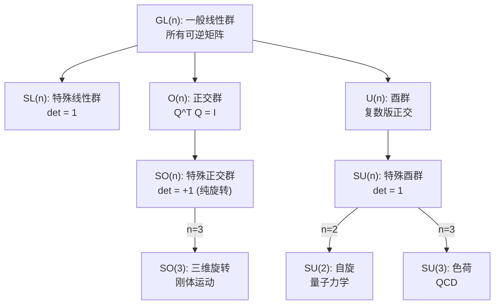
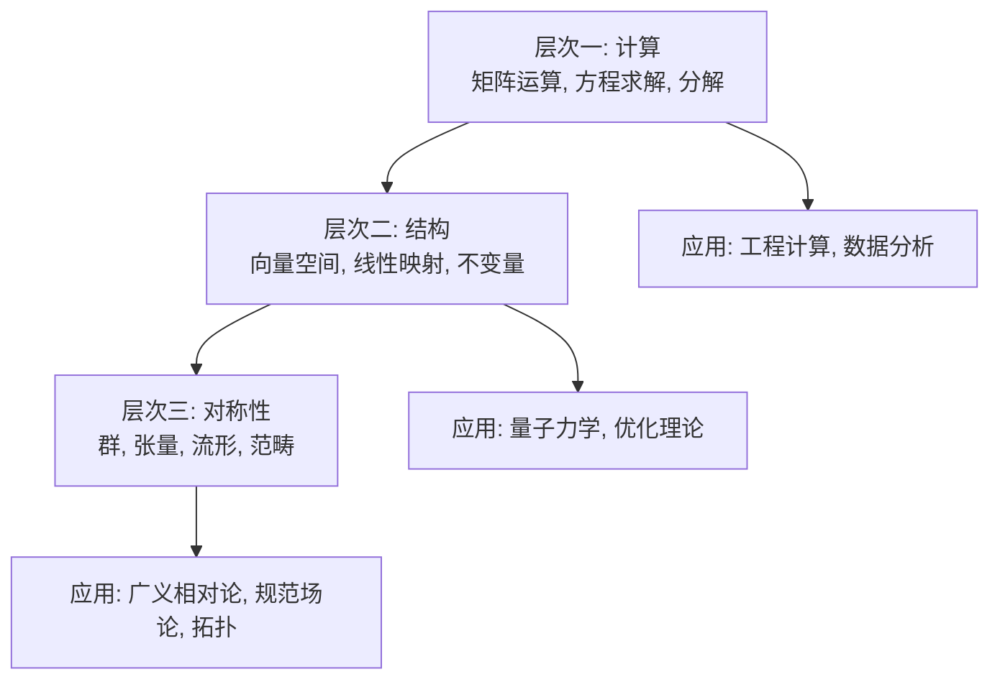

# 第12章 不变性、代数结构与微分几何（选讲）

> **作者**：kyksj-1
> **风格致敬**：Gilbert Strang × 3Blue1Brown

---

## 本章导读

本章是整本讲义的"封顶之作"。我们将跳出具体的计算技巧，从更高的视角审视线性代数的**深层结构**：

> 什么量在变换下**不变**？为什么这些不变量如此重要？线性代数的代数结构如何推广到弯曲的空间？

这些问题连接了线性代数与群论、张量分析、微分几何的边界，为进入理论物理和现代数学提供了入口。

---

## 12.1 不变量：变换下什么不变？

### 12.1.1 不变量的哲学

物理规律不依赖于坐标选择。数学的任务是找到那些在坐标变换下**保持不变**的量。

线性代数中的核心不变量：

| 不变量 | 变换类型 | 意义 |
|--------|---------|------|
| 特征值 | 相似变换 | 线性变换的"指纹" |
| 迹 | 相似变换 | 特征值之和 |
| 行列式 | 相似变换 | 特征值之积 / 体积缩放因子 |
| 秩 | 相似变换 | 像空间的维数 |
| 惯性指数 | 合同变换 | 二次型的符号结构 |
| 奇异值 | 酉变换 | "几何大小" |

### 12.1.2 特征多项式作为完全不变量

**定理**：两个矩阵相似，当且仅当它们有相同的**有理标准形**（Rational Canonical Form）。

特征多项式编码了**所有**相似不变量。但注意：相同的特征多项式不意味着相似（还需要比较初等因子/不变因子）。

### 12.1.3 迹的深层含义

迹看起来只是对角线元素之和，但它有深刻的代数含义：

$$
\text{tr}(AB) = \text{tr}(BA)
$$

这个**轮换性**使得迹在相似变换下不变：$\text{tr}(P^{-1}AP) = \text{tr}(APP^{-1}) = \text{tr}(A)$。

更深层：迹是矩阵空间上的唯一（在同构意义下）**线性泛函**，满足 $\phi(AB) = \phi(BA)$。

---

## 12.2 群与对称性

### 12.2.1 矩阵群

一个矩阵集合如果在乘法和求逆下封闭，就构成一个**群**（group）。

| 矩阵群 | 符号 | 条件 | 物理意义 |
|--------|------|------|---------|
| 一般线性群 | $GL(n, \mathbb{R})$ | 可逆矩阵 | 一般坐标变换 |
| 特殊线性群 | $SL(n, \mathbb{R})$ | $\det = 1$ | 保体积的变换 |
| 正交群 | $O(n)$ | $Q^TQ = I$ | 保距变换（旋转+反射） |
| 特殊正交群 | $SO(n)$ | $Q^TQ = I, \det = 1$ | 纯旋转 |
| 酉群 | $U(n)$ | $U^\dagger U = I$ | 量子力学中的对称性 |
| 特殊酉群 | $SU(n)$ | $U^\dagger U = I, \det = 1$ | 粒子物理规范群 |
| 辛群 | $Sp(2n)$ | 保辛结构 | 哈密顿力学 |



### 12.2.2 Lie 代数：群的"无穷小版本"

矩阵群（Lie 群）对应一个**Lie 代数**——由"无穷小生成元"构成的向量空间。

**例**：$SO(3)$ 的 Lie 代数是 $\mathfrak{so}(3)$——所有 $3\times 3$ 反对称矩阵的集合。

$$
R(\theta, \hat{n}) = e^{\theta [\hat{n}]_\times}
$$

其中 $[\hat{n}]_\times$ 是反对称矩阵（叉积矩阵）。

**Lie 括号**（对易子）：$[A, B] = AB - BA$

这与量子力学中的对易子完全一致。Lie 代数的结构常数决定了群的局部结构。

---

## 12.3 张量与多线性代数

### 12.3.1 张量是什么？

向量是一阶张量，矩阵是二阶张量。一般地，**$(p, q)$-型张量**是一个多线性映射：

$$
T: \underbrace{V^* \times \cdots \times V^*}_{p} \times \underbrace{V \times \cdots \times V}_{q} \to \mathbb{R}
$$

| 阶数 | 例 | 分量数 ($n$ 维) |
|------|-----|----------------|
| 0 | 标量 | 1 |
| 1 | 向量/余向量 | $n$ |
| 2 | 矩阵/度量张量 | $n^2$ |
| 3 | 弹性模量 | $n^3$ |
| 4 | Riemann 曲率张量 | $n^4$ |

### 12.3.2 张量的变换规则

在坐标变换 $x^i \to y^j$ 下，$(1,1)$-型张量 $T^i{}_j$ 变换为：

$$
T'^i{}_j = \frac{\partial y^i}{\partial x^k} \frac{\partial x^l}{\partial y^j} T^k{}_l
$$

这就是"逆变"和"协变"指标的含义。相似变换 $B = P^{-1}AP$ 是 $(1,1)$-型张量变换的特例。

### 12.3.3 Einstein 求和约定

重复指标自动求和：

$$
a^i b_i \equiv \sum_{i=1}^{n} a^i b_i
$$

$$
T^i{}_j v^j \equiv \sum_{j=1}^{n} T^i{}_j v^j
$$

这个约定使得张量方程异常简洁。

---

## 12.4 度量、联络与曲率

### 12.4.1 从平直到弯曲

在平直空间 $\mathbb{R}^n$ 中，度量是恒等矩阵 $g_{ij} = \delta_{ij}$。在弯曲空间（流形）中，度量 $g_{ij}(\mathbf{x})$ 是一个**随位置变化**的正定对称矩阵。

$$
ds^2 = g_{ij}dx^i dx^j
$$

**例**：球面 $S^2$ 上的度量（球坐标 $\theta, \phi$）：

$$
ds^2 = R^2 d\theta^2 + R^2\sin^2\theta \, d\phi^2 \quad \Rightarrow \quad g = R^2\begin{pmatrix} 1 & 0 \\ 0 & \sin^2\theta \end{pmatrix}
$$

$g$ 的特征值 $\lambda_1 = R^2$，$\lambda_2 = R^2\sin^2\theta$。在赤道（$\theta = \pi/2$），两个方向等同；在极点（$\theta \to 0$），$\phi$ 方向"收缩"。

### 12.4.2 Christoffel 符号与协变导数

在弯曲空间中，普通导数不再是张量（坐标变换下不遵循张量规则）。需要引入**联络**（connection）来定义"正确的"导数：

$$
\nabla_i v^j = \partial_i v^j + \Gamma^j{}_{ik} v^k
$$

其中 Christoffel 符号：

$$
\Gamma^k{}_{ij} = \frac{1}{2}g^{kl}(\partial_i g_{jl} + \partial_j g_{il} - \partial_l g_{ij})
$$

### 12.4.3 Riemann 曲率张量

空间的"弯曲程度"由 **Riemann 曲率张量** $R^i{}_{jkl}$ 度量。它是一个 4 阶张量（在 $n$ 维空间中有 $n^4$ 个分量，但对称性将独立分量减少到 $\frac{n^2(n^2-1)}{12}$ 个）。

**核心思想**：曲率测量的是"平行移动一个向量沿闭合回路一圈后，向量是否发生了旋转"。

| 维度 $n$ | 独立分量数 | 例 |
|----------|-----------|-----|
| 2 | 1 | 高斯曲率（标量） |
| 3 | 6 | Ricci 张量 |
| 4 | 20 | 广义相对论中的时空 |

---

## 12.5 线性代数的统一视角

### 12.5.1 从向量空间到范畴

线性代数的对象（向量空间）和态射（线性映射）构成一个**范畴**（Category）。

范畴论的视角强调的是**结构保持映射**（函子），而不是对象本身。

### 12.5.2 总结：线性代数的三个层次



**层次一**（Ch1-Ch4）：掌握特征值、对角化、二次型、矩阵微积分等**计算工具**。

**层次二**（Ch5-Ch8）：理解坐标变换、正交性、正定性、分块结构等**数学结构**。

**层次三**（Ch9-Ch12）：看到不变性、群对称性、张量、流形等**深层原理**，以及它们在物理和工程中的应用。

---

## 12.6 编程实践

### 12.6.1 度量张量与测地线

```python
import numpy as np
from scipy.integrate import solve_ivp
import matplotlib.pyplot as plt

def geodesic_on_sphere(R=1.0, theta0=np.pi/4, phi0=0, dtheta0=0.5, dphi0=1.0, t_span=(0, 10)):
    """
    在球面上求解测地线方程（大圆弧）。

    参数:
        R: 球面半径
        theta0, phi0: 初始位置
        dtheta0, dphi0: 初始速度
        t_span: 时间范围
    """
    def geodesic_ode(t, y):
        theta, phi, dtheta, dphi = y
        # Christoffel 符号导出的测地线方程
        ddtheta = np.sin(theta) * np.cos(theta) * dphi**2
        ddphi = -2 * np.cos(theta) / np.sin(theta) * dtheta * dphi if np.abs(np.sin(theta)) > 1e-10 else 0
        return [dtheta, dphi, ddtheta, ddphi]

    y0 = [theta0, phi0, dtheta0, dphi0]
    sol = solve_ivp(geodesic_ode, t_span, y0, max_step=0.01, dense_output=True)

    # 转换为笛卡尔坐标
    theta = sol.y[0]
    phi = sol.y[1]
    x = R * np.sin(theta) * np.cos(phi)
    y_coord = R * np.sin(theta) * np.sin(phi)
    z = R * np.cos(theta)

    # 可视化
    fig = plt.figure(figsize=(10, 8))
    ax = fig.add_subplot(111, projection='3d')

    # 画球面
    u = np.linspace(0, 2*np.pi, 50)
    v = np.linspace(0, np.pi, 50)
    xs = R * np.outer(np.sin(v), np.cos(u))
    ys = R * np.outer(np.sin(v), np.sin(u))
    zs = R * np.outer(np.cos(v), np.ones_like(u))
    ax.plot_surface(xs, ys, zs, alpha=0.2, color='lightblue')

    # 画测地线
    ax.plot(x, y_coord, z, 'r-', linewidth=3, label='Geodesic (great circle)')
    ax.plot([x[0]], [y_coord[0]], [z[0]], 'go', markersize=10, label='Start')

    ax.set_xlabel('X'); ax.set_ylabel('Y'); ax.set_zlabel('Z')
    ax.set_title('Geodesic on a Sphere\n(Metric tensor determines shortest path)')
    ax.legend()
    plt.savefig('ch12_geodesic.png', dpi=150, bbox_inches='tight')
    plt.show()


geodesic_on_sphere()
```

### 12.6.2 Lie 群与指数映射

```python
import numpy as np

def so3_exp(omega):
    """
    SO(3) 的指数映射：从 Lie 代数 so(3) 到旋转矩阵。
    使用 Rodrigues 公式。

    参数:
        omega: 3维旋转向量（方向 = 旋转轴，模 = 旋转角度）

    返回:
        R: 3x3 旋转矩阵
    """
    theta = np.linalg.norm(omega)
    if theta < 1e-10:
        return np.eye(3)

    k = omega / theta  # 单位旋转轴
    K = np.array([[0, -k[2], k[1]],
                  [k[2], 0, -k[0]],
                  [-k[1], k[0], 0]])  # 反对称矩阵 (叉积矩阵)

    # Rodrigues 公式
    R = np.eye(3) + np.sin(theta) * K + (1 - np.cos(theta)) * K @ K
    return R


# 示例：绕 z 轴旋转 90 度
omega = np.array([0, 0, np.pi/2])
R = so3_exp(omega)
print(f"旋转向量: {omega}")
print(f"旋转矩阵 R:\n{np.round(R, 4)}")
print(f"验证正交: R^T R = \n{np.round(R.T @ R, 4)}")
print(f"验证 det(R) = {np.linalg.det(R):.4f}")

# 作用在向量上
v = np.array([1, 0, 0])
v_rotated = R @ v
print(f"\n(1,0,0) 绕 z 轴旋转 90°: {np.round(v_rotated, 4)}")

# 比较矩阵指数
from scipy.linalg import expm
K = np.array([[0, -omega[2], omega[1]],
              [omega[2], 0, -omega[0]],
              [-omega[1], omega[0], 0]])
R_exp = expm(K)
print(f"\n矩阵指数 exp(K):\n{np.round(R_exp, 4)}")
print(f"与 Rodrigues 的差异: {np.linalg.norm(R - R_exp):.2e}")
```

---

## 12.7 Key Takeaway

| 概念 | 核心要点 |
|------|---------|
| 不变量 | 在变换下保持不变的量（迹、行列式、特征值等） |
| 矩阵群 | $GL, SL, O, SO, U, SU$——对称性的数学语言 |
| Lie 代数 | 群的"无穷小版本"，对易子 $[A,B] = AB - BA$ |
| 张量 | 多线性映射，服从特定变换规则 |
| 度量张量 $g_{ij}$ | 定义弯曲空间上的距离 |
| Riemann 曲率 | 度量"空间弯了多少" |
| 三个层次 | 计算 → 结构 → 对称性 |

---

## 习题

### 概念理解

**12.1** 列出至少3个相似不变量和2个合同不变量。解释为什么秩是相似不变量但不是合同不变量的例子是什么？

**12.2** 用自己的话解释"Lie 代数是 Lie 群的无穷小版本"这句话的含义。以 $SO(2)$ 和 $\mathfrak{so}(2)$ 为例说明。

### 计算练习

**12.3** 验证球面度量 $g = R^2\begin{pmatrix} 1 & 0 \\ 0 & \sin^2\theta \end{pmatrix}$ 的行列式和特征值。在 $\theta = \pi/6$ 处，"经线方向"和"纬线方向"的线元素之比是多少？

**12.4** 计算 $SO(3)$ 的旋转矩阵 $R_z(\theta) = e^{\theta L_z}$，其中 $L_z = \begin{pmatrix} 0 & -1 & 0 \\ 1 & 0 & 0 \\ 0 & 0 & 0 \end{pmatrix}$。用 Rodrigues 公式和直接矩阵指数两种方法验证。

### 思考题

**12.5** 量子力学中的对称性群 $SU(2)$ 与旋转群 $SO(3)$ 有什么关系？（提示：$SU(2)$ 是 $SO(3)$ 的双覆盖）。这对自旋-1/2 粒子意味着什么？

**12.6** 广义相对论说"引力是时空弯曲"。用度量张量和 Riemann 曲率的语言解释这句话。为什么正定性（或不定性）在这里至关重要？

### 编程题

**12.7** 实现 $SO(3)$ 的指数映射和对数映射（Rodrigues 公式）：
  - 给定旋转向量 $\omega$，计算旋转矩阵 $R = \exp([\omega]_\times)$
  - 给定旋转矩阵 $R$，反求旋转向量 $\omega$
  - 验证：$\exp(\log(R)) = R$ 和 $\log(\exp([\omega]_\times)) = [\omega]_\times$

**12.8** 可视化不同度量下的"圆"：
  - 在欧氏度量 $g = I$ 下，到原点距离为 1 的点集是圆
  - 在度量 $g = \begin{pmatrix} 4 & 1 \\ 1 & 2 \end{pmatrix}$ 下，$\mathbf{x}^T g \mathbf{x} = 1$ 是什么形状？
  - 可视化两种"圆"的对比
  - 将度量对角化，解释特征值和特征向量的几何含义

---

> **全书总结**：从特征值到不变量，从对角化到群对称性，从二次型到度量张量——线性代数提供了理解世界的一套**通用框架**。掌握它，你就拥有了打开物理学、工程学、计算机科学、金融学众多大门的**万能钥匙**。
