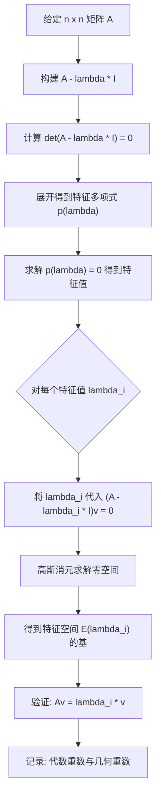
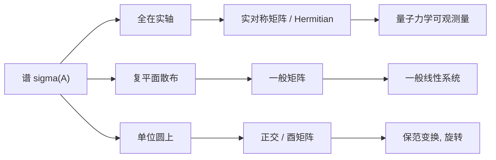

# 第1章 特征值与特征向量 (Eigenvalues and Eigenvectors)

> **作者**：kyksj-1
> **风格致敬**：Gilbert Strang × 3Blue1Brown

---

## 本章导读

特征值与特征向量是线性代数中最核心的概念之一。它们揭示了一个线性变换的**内在结构**——在纷繁复杂的变换效果中，哪些方向是"不变的"？这些方向上的拉伸因子是多少？

理解特征值，就是理解矩阵的**灵魂**。

本章将从几何直觉出发，建立严格的数学定义，给出完整的求解流程（SOP），探讨特殊矩阵的特征值性质，最后揭示特征值为何如此深刻。

---

## 1.1 从几何直觉出发：什么是特征向量？

### 1.1.1 线性变换的几何效果

在二维平面中，一个 $2\times 2$ 矩阵 $A$ 表示一个线性变换。它将平面中的每个向量 $\mathbf{v}$ 映射为一个新向量 $A\mathbf{v}$。

考虑矩阵：

$$
A = \begin{pmatrix} 2 & 1 \\ 1 & 2 \end{pmatrix}
$$

对平面中不同方向的单位向量施加这个变换，绝大多数向量**既会改变长度，也会改变方向**。例如：

$$
A\begin{pmatrix} 1 \\ 0 \end{pmatrix} = \begin{pmatrix} 2 \\ 1 \end{pmatrix}
$$

向量 $(1,0)^T$ 被映射为 $(2,1)^T$——方向改变了。

但是，有些**特殊方向**上的向量，在变换后**只发生拉伸或压缩，方向不变**（或恰好反向）：

$$
A\begin{pmatrix} 1 \\ 1 \end{pmatrix} = \begin{pmatrix} 3 \\ 3 \end{pmatrix} = 3\begin{pmatrix} 1 \\ 1 \end{pmatrix}
$$

$$
A\begin{pmatrix} 1 \\ -1 \end{pmatrix} = \begin{pmatrix} 1 \\ -1 \end{pmatrix} = 1 \cdot \begin{pmatrix} 1 \\ -1 \end{pmatrix}
$$

> **动画参考**：见 `animations/ch1_eigenvalue_visualizations.py` 中的 `EigenVectorGeometry` 场景。

### 1.1.2 特征向量与特征值的直觉

这就是特征向量的几何本质：

> **特征向量**（eigenvector）是线性变换下**方向不变**的非零向量。
> **特征值**（eigenvalue）是该方向上的**拉伸因子**。

| 现象 | 数学表达 |
|------|---------|
| 方向不变，被拉伸 3 倍 | $A\mathbf{v}_1 = 3\mathbf{v}_1$ |
| 方向不变，保持原长 | $A\mathbf{v}_2 = 1 \cdot \mathbf{v}_2$ |
| 方向反转，缩小为一半 | $A\mathbf{v}_3 = -0.5\,\mathbf{v}_3$ |

"eigen" 是德语，意思是 "own" 或 "characteristic"——特征向量就是矩阵**自己的**方向。

### 1.1.3 3Blue1Brown 的视角

想象你站在原点，看着整个平面被矩阵 $A$ "揉捏"。大多数向量被扭曲到新的方向，但有几条特殊的直线纹丝不动（只沿自身方向伸缩）。找到这些直线，就找到了理解整个变换的**钥匙**。

---

## 1.2 数学定义与基本性质

### 1.2.1 形式化定义

设 $A$ 是 $n\times n$ 的方阵。若存在非零向量 $\mathbf{v} \in \mathbb{R}^n$（或 $\mathbb{C}^n$）和标量 $\lambda$，使得

$$
\boxed{A\mathbf{v} = \lambda\mathbf{v}}
$$

则称 $\lambda$ 为 $A$ 的一个**特征值**（eigenvalue），$\mathbf{v}$ 为对应的**特征向量**（eigenvector）。

几个关键注意点：

1. **$\mathbf{v} \neq \mathbf{0}$**：零向量对任何 $\lambda$ 都满足 $A\mathbf{0} = \lambda\mathbf{0}$，没有信息量，所以排除。
2. **$\lambda$ 可以为零**：$\lambda = 0$ 意味着 $A\mathbf{v} = \mathbf{0}$，即 $\mathbf{v} \in \text{Null}(A)$。此时矩阵是奇异的。
3. **$\lambda$ 可以是复数**：即使 $A$ 是实矩阵，特征值也可能是复数（例如旋转矩阵）。

### 1.2.2 特征方程的推导

从 $A\mathbf{v} = \lambda\mathbf{v}$ 出发：

$$
A\mathbf{v} - \lambda\mathbf{v} = \mathbf{0}
$$

$$
(A - \lambda I)\mathbf{v} = \mathbf{0}
$$

要使此方程有**非零解** $\mathbf{v}$，矩阵 $(A - \lambda I)$ 必须是**奇异的**（行列式为零）：

$$
\boxed{\det(A - \lambda I) = 0}
$$

这就是**特征方程**（characteristic equation）。展开行列式得到的是关于 $\lambda$ 的 $n$ 次多项式，称为**特征多项式**（characteristic polynomial）：

$$
p(\lambda) = \det(A - \lambda I) = (-1)^n \lambda^n + \cdots
$$

### 1.2.3 特征空间

对于一个特征值 $\lambda_i$，所有满足 $(A - \lambda_i I)\mathbf{v} = \mathbf{0}$ 的向量 $\mathbf{v}$（加上零向量）构成一个**子空间**，称为 $\lambda_i$ 对应的**特征空间**（eigenspace）：

$$
E_{\lambda_i} = \text{Null}(A - \lambda_i I) = \{\mathbf{v} \in \mathbb{R}^n \mid A\mathbf{v} = \lambda_i \mathbf{v}\}
$$

特征空间的维数称为 $\lambda_i$ 的**几何重数**（geometric multiplicity）。

### 1.2.4 迹与行列式的关系

特征值和矩阵的迹（trace）、行列式之间存在优美的关系。设 $n\times n$ 矩阵 $A$ 的特征值为 $\lambda_1, \lambda_2, \ldots, \lambda_n$（含重复），则：

$$
\boxed{\text{tr}(A) = \sum_{i=1}^{n} \lambda_i = \lambda_1 + \lambda_2 + \cdots + \lambda_n}
$$

$$
\boxed{\det(A) = \prod_{i=1}^{n} \lambda_i = \lambda_1 \cdot \lambda_2 \cdots \lambda_n}
$$

**证明思路**：特征多项式 $p(\lambda) = \det(A - \lambda I)$ 的根恰好是 $\lambda_1, \ldots, \lambda_n$。展开特征多项式，比较最高次项和常数项的系数，即可得到上述关系。

具体地，对 $2 \times 2$ 矩阵 $A = \begin{pmatrix} a & b \\ c & d \end{pmatrix}$：

$$
p(\lambda) = \lambda^2 - (a+d)\lambda + (ad - bc) = (\lambda - \lambda_1)(\lambda - \lambda_2)
$$

比较系数：$\lambda_1 + \lambda_2 = a + d = \text{tr}(A)$，$\lambda_1 \lambda_2 = ad - bc = \det(A)$。

> **Key Insight**：不用算出特征值，光看迹和行列式就能获得大量信息。例如，若 $\det(A) = 0$，则至少有一个特征值为零；若 $\text{tr}(A) = 0$，则特征值"正负相消"。

---

## 1.3 求解特征值与特征向量的 SOP

下面给出一套完整的、系统化的求解流程。

### SOP 流程图



### Step 1：构建特征方程

写出 $(A - \lambda I)$，令其行列式为零。

### Step 2：展开行列式，得到特征多项式

对 $2 \times 2$ 矩阵，直接用 $\lambda^2 - \text{tr}(A)\lambda + \det(A) = 0$。

对 $3 \times 3$ 矩阵，可沿某行/某列展开，或利用公式。

### Step 3：求解特征多项式

- 二次方程：用求根公式
- 三次及以上：尝试有理根定理、因式分解，或数值方法

### Step 4：对每个特征值，求特征空间

将 $\lambda_i$ 代入 $(A - \lambda_i I)\mathbf{v} = \mathbf{0}$，通过**高斯消元**将增广矩阵化为行阶梯形，读出自由变量，写出通解。

### Step 5：验证并记录

- 验证：$A\mathbf{v} = \lambda_i \mathbf{v}$ 确实成立
- 记录每个 $\lambda_i$ 的代数重数和几何重数

### 完整例题 1：2×2 矩阵

**求** $A = \begin{pmatrix} 4 & 2 \\ 1 & 3 \end{pmatrix}$ 的特征值和特征向量。

**Step 1-2**：特征多项式

$$
\det(A - \lambda I) = \det\begin{pmatrix} 4-\lambda & 2 \\ 1 & 3-\lambda \end{pmatrix} = (4-\lambda)(3-\lambda) - 2
$$

$$
= \lambda^2 - 7\lambda + 10 = (\lambda - 5)(\lambda - 2)
$$

验证：$\text{tr}(A) = 7 = 5 + 2$，$\det(A) = 10 = 5 \times 2$。✓

**Step 3**：$\lambda_1 = 5$，$\lambda_2 = 2$

**Step 4a**：$\lambda_1 = 5$ 的特征向量

$$
(A - 5I)\mathbf{v} = \begin{pmatrix} -1 & 2 \\ 1 & -2 \end{pmatrix}\begin{pmatrix} v_1 \\ v_2 \end{pmatrix} = \begin{pmatrix} 0 \\ 0 \end{pmatrix}
$$

两行线性相关，取第一行：$-v_1 + 2v_2 = 0$，即 $v_1 = 2v_2$。

$$
\mathbf{v}_1 = t\begin{pmatrix} 2 \\ 1 \end{pmatrix},\quad t \neq 0
$$

**Step 4b**：$\lambda_2 = 2$ 的特征向量

$$
(A - 2I)\mathbf{v} = \begin{pmatrix} 2 & 2 \\ 1 & 1 \end{pmatrix}\begin{pmatrix} v_1 \\ v_2 \end{pmatrix} = \begin{pmatrix} 0 \\ 0 \end{pmatrix}
$$

$v_1 + v_2 = 0$，即 $v_1 = -v_2$。

$$
\mathbf{v}_2 = t\begin{pmatrix} -1 \\ 1 \end{pmatrix},\quad t \neq 0
$$

**Step 5**：验证

$$
A\begin{pmatrix} 2 \\ 1 \end{pmatrix} = \begin{pmatrix} 10 \\ 5 \end{pmatrix} = 5\begin{pmatrix} 2 \\ 1 \end{pmatrix} \quad \checkmark
$$

$$
A\begin{pmatrix} -1 \\ 1 \end{pmatrix} = \begin{pmatrix} -2 \\ 2 \end{pmatrix} = 2\begin{pmatrix} -1 \\ 1 \end{pmatrix} \quad \checkmark
$$

### 完整例题 2：3×3 矩阵

**求** $A = \begin{pmatrix} 1 & 2 & 0 \\ 0 & 3 & 0 \\ 2 & 1 & 4 \end{pmatrix}$ 的特征值和特征向量。

**Step 1-2**：沿第一行展开行列式

$$
\det(A - \lambda I) = \det\begin{pmatrix} 1-\lambda & 2 & 0 \\ 0 & 3-\lambda & 0 \\ 2 & 1 & 4-\lambda \end{pmatrix}
$$

沿第三列展开（该列有两个零，计算量最小）：

$$
= (4-\lambda) \det\begin{pmatrix} 1-\lambda & 2 \\ 0 & 3-\lambda \end{pmatrix}
= (4-\lambda)(1-\lambda)(3-\lambda)
$$

**Step 3**：$\lambda_1 = 1$，$\lambda_2 = 3$，$\lambda_3 = 4$

验证：$\text{tr}(A) = 1 + 3 + 4 = 8 = 1 + 3 + 4$，$\det(A) = 12 = 1 \times 3 \times 4$。✓

**Step 4a**：$\lambda_1 = 1$ 的特征向量

$$
A - I = \begin{pmatrix} 0 & 2 & 0 \\ 0 & 2 & 0 \\ 2 & 1 & 3 \end{pmatrix}
$$

高斯消元：

$$
\xrightarrow{R_2 - R_1} \begin{pmatrix} 0 & 2 & 0 \\ 0 & 0 & 0 \\ 2 & 1 & 3 \end{pmatrix}
\xrightarrow{\text{交换 } R_1, R_3} \begin{pmatrix} 2 & 1 & 3 \\ 0 & 2 & 0 \\ 0 & 0 & 0 \end{pmatrix}
$$

由 $R_2$：$2v_2 = 0 \Rightarrow v_2 = 0$。由 $R_1$：$2v_1 + 3v_3 = 0 \Rightarrow v_1 = -\frac{3}{2}v_3$。

取 $v_3 = 2$：$\mathbf{v}_1 = \begin{pmatrix} -3 \\ 0 \\ 2 \end{pmatrix}$

**Step 4b**：$\lambda_2 = 3$ 的特征向量

$$
A - 3I = \begin{pmatrix} -2 & 2 & 0 \\ 0 & 0 & 0 \\ 2 & 1 & 1 \end{pmatrix}
$$

由 $R_1$：$-2v_1 + 2v_2 = 0 \Rightarrow v_1 = v_2$。由 $R_3$：$2v_1 + v_2 + v_3 = 0 \Rightarrow v_3 = -3v_1$。

取 $v_1 = 1$：$\mathbf{v}_2 = \begin{pmatrix} 1 \\ 1 \\ -3 \end{pmatrix}$

**Step 4c**：$\lambda_3 = 4$ 的特征向量

$$
A - 4I = \begin{pmatrix} -3 & 2 & 0 \\ 0 & -1 & 0 \\ 2 & 1 & 0 \end{pmatrix}
$$

由 $R_2$：$-v_2 = 0 \Rightarrow v_2 = 0$。由 $R_1$：$-3v_1 = 0 \Rightarrow v_1 = 0$。$v_3$ 自由。

取 $v_3 = 1$：$\mathbf{v}_3 = \begin{pmatrix} 0 \\ 0 \\ 1 \end{pmatrix}$

---

## 1.4 特殊矩阵的特征值

不同类型的矩阵在特征值方面有着截然不同的性质。理解这些性质能帮助我们在具体问题中快速获取信息。

### 1.4.1 对称矩阵 ($A = A^T$)

**定理**：实对称矩阵的特征值**全部是实数**，且属于不同特征值的特征向量**互相正交**。

**证明**（特征值为实数）：

设 $A\mathbf{v} = \lambda\mathbf{v}$，其中 $A$ 实对称。对两边取共轭转置：

$$
\overline{\mathbf{v}}^T A^T = \overline{\lambda} \overline{\mathbf{v}}^T
$$

由 $A = A^T$：$\overline{\mathbf{v}}^T A = \overline{\lambda} \overline{\mathbf{v}}^T$

右乘 $\mathbf{v}$：$\overline{\mathbf{v}}^T A \mathbf{v} = \overline{\lambda} \overline{\mathbf{v}}^T \mathbf{v}$

又从 $A\mathbf{v} = \lambda\mathbf{v}$ 左乘 $\overline{\mathbf{v}}^T$：$\overline{\mathbf{v}}^T A \mathbf{v} = \lambda \overline{\mathbf{v}}^T \mathbf{v}$

因此：$\lambda \overline{\mathbf{v}}^T \mathbf{v} = \overline{\lambda} \overline{\mathbf{v}}^T \mathbf{v}$

由于 $\mathbf{v} \neq \mathbf{0}$，$\overline{\mathbf{v}}^T \mathbf{v} = \|\mathbf{v}\|^2 > 0$，所以 $\lambda = \overline{\lambda}$，即 $\lambda \in \mathbb{R}$。$\blacksquare$

**证明**（不同特征值的特征向量正交）：

设 $A\mathbf{v}_1 = \lambda_1 \mathbf{v}_1$，$A\mathbf{v}_2 = \lambda_2 \mathbf{v}_2$，$\lambda_1 \neq \lambda_2$。

$$
\lambda_1 \mathbf{v}_1^T \mathbf{v}_2 = (A\mathbf{v}_1)^T \mathbf{v}_2 = \mathbf{v}_1^T A^T \mathbf{v}_2 = \mathbf{v}_1^T A \mathbf{v}_2 = \lambda_2 \mathbf{v}_1^T \mathbf{v}_2
$$

$$
(\lambda_1 - \lambda_2) \mathbf{v}_1^T \mathbf{v}_2 = 0
$$

因为 $\lambda_1 \neq \lambda_2$，所以 $\mathbf{v}_1^T \mathbf{v}_2 = 0$。$\blacksquare$

> **深刻性**：对称矩阵的这两个性质是**谱定理**（Spectral Theorem）的核心内容。它保证了对称矩阵一定可以正交对角化，这在量子力学中意味着可观测量的测量值一定是实数。我们将在第6章深入展开。

### 1.4.2 正交矩阵 ($Q^TQ = I$)

**定理**：正交矩阵的特征值的**模为 1**，即 $|\lambda| = 1$。

**证明**：设 $Q\mathbf{v} = \lambda\mathbf{v}$。

$$
\|\mathbf{v}\|^2 = \mathbf{v}^T\mathbf{v} = (Q\mathbf{v})^T(Q\mathbf{v}) \cdot \frac{1}{|\lambda|^2} \cdot |\lambda|^2
$$

更直接地：$\|Q\mathbf{v}\|^2 = \mathbf{v}^T Q^T Q \mathbf{v} = \mathbf{v}^T \mathbf{v} = \|\mathbf{v}\|^2$

而 $\|Q\mathbf{v}\|^2 = \|\lambda\mathbf{v}\|^2 = |\lambda|^2 \|\mathbf{v}\|^2$

因此 $|\lambda|^2 = 1$，即 $|\lambda| = 1$。$\blacksquare$

> **几何理解**：正交变换保持长度不变（旋转、反射），所以特征值的绝对值只能是 1。在复平面上，特征值分布在**单位圆**上。

### 1.4.3 三角矩阵

**定理**：三角矩阵（上三角或下三角）的特征值就是**对角线元素**。

这是因为三角矩阵的行列式等于对角线元素之积：

$$
\det(A - \lambda I) = (a_{11} - \lambda)(a_{22} - \lambda)\cdots(a_{nn} - \lambda)
$$

令其为零，立即得到 $\lambda_i = a_{ii}$。

### 1.4.4 幂等矩阵 ($A^2 = A$)

**定理**：幂等矩阵的特征值只能是 $0$ 或 $1$。

**证明**：设 $A\mathbf{v} = \lambda\mathbf{v}$，则 $A^2\mathbf{v} = \lambda^2\mathbf{v}$。又 $A^2 = A$，所以 $\lambda\mathbf{v} = \lambda^2\mathbf{v}$，即 $(\lambda^2 - \lambda)\mathbf{v} = \mathbf{0}$。由 $\mathbf{v} \neq \mathbf{0}$ 得 $\lambda(\lambda - 1) = 0$。$\blacksquare$

> **应用**：投影矩阵 $P$ 满足 $P^2 = P$，所以其特征值只有 0（被投影"压扁"的方向）和 1（投影到的子空间内的方向）。

### 1.4.5 汇总表

| 矩阵类型 | 条件 | 特征值性质 |
|----------|------|-----------|
| 实对称矩阵 | $A = A^T$ | 全部实数，特征向量互相正交 |
| 正交矩阵 | $Q^TQ = I$ | $\|\lambda\| = 1$，位于单位圆 |
| 三角矩阵 | 上/下三角 | 对角线元素即为特征值 |
| 幂等矩阵 | $A^2 = A$ | $\lambda \in \{0, 1\}$ |
| 幂零矩阵 | $A^k = 0$ | $\lambda = 0$（全部） |
| 正定矩阵 | $\mathbf{x}^TA\mathbf{x} > 0$ | $\lambda > 0$（全部） |
| 反对称矩阵 | $A^T = -A$ | 纯虚数或零 |

---

## 1.5 代数重数与几何重数

### 1.5.1 定义

对于特征值 $\lambda_i$：

- **代数重数**（algebraic multiplicity, AM）：$\lambda_i$ 作为特征多项式的根的**重数**。
- **几何重数**（geometric multiplicity, GM）：特征空间 $E_{\lambda_i}$ 的**维数**，即 $\dim\text{Null}(A - \lambda_i I)$。

**核心不等式**：

$$
\boxed{1 \leq \text{GM}(\lambda_i) \leq \text{AM}(\lambda_i)}
$$

几何重数总是小于或等于代数重数。

### 1.5.2 一个关键例子：缺陷矩阵

考虑矩阵：

$$
A = \begin{pmatrix} 3 & 1 \\ 0 & 3 \end{pmatrix}
$$

特征多项式：$(\lambda - 3)^2 = 0$，唯一特征值 $\lambda = 3$，代数重数 = 2。

求特征空间：

$$
A - 3I = \begin{pmatrix} 0 & 1 \\ 0 & 0 \end{pmatrix}
$$

只有一个方程 $v_2 = 0$，得特征向量 $\mathbf{v} = t(1, 0)^T$。特征空间是一维的，几何重数 = 1。

$$
\text{GM}(3) = 1 < \text{AM}(3) = 2
$$

这种 GM < AM 的情况称为**缺陷**（defective）。缺陷矩阵**不能对角化**。这是我们在第2章要详细讨论的核心问题。

### 1.5.3 Cayley-Hamilton 定理

**定理**：每个方阵都满足自己的特征方程。即若 $p(\lambda) = \det(A - \lambda I)$ 是 $A$ 的特征多项式，则

$$
\boxed{p(A) = 0}
$$

**例**：对 $A = \begin{pmatrix} 4 & 2 \\ 1 & 3 \end{pmatrix}$，特征多项式为 $p(\lambda) = \lambda^2 - 7\lambda + 10$。

Cayley-Hamilton 断言 $A^2 - 7A + 10I = 0$。验证：

$$
A^2 = \begin{pmatrix} 18 & 14 \\ 7 & 11 \end{pmatrix},\quad
7A = \begin{pmatrix} 28 & 14 \\ 7 & 21 \end{pmatrix},\quad
A^2 - 7A + 10I = \begin{pmatrix} 0 & 0 \\ 0 & 0 \end{pmatrix} \quad \checkmark
$$

> **应用**：Cayley-Hamilton 定理可以用来将 $A$ 的高次幂表示为低次幂的线性组合。例如从 $A^2 = 7A - 10I$ 出发，可以递推计算 $A^3, A^4, \ldots$

### 1.5.4 特征值与矩阵运算

| 运算 | 原矩阵特征值 | 新矩阵特征值 |
|------|------------|------------|
| $A + cI$ | $\lambda$ | $\lambda + c$ |
| $cA$ | $\lambda$ | $c\lambda$ |
| $A^k$ | $\lambda$ | $\lambda^k$ |
| $A^{-1}$（若可逆） | $\lambda$ | $1/\lambda$ |
| $A^T$ | $\lambda$ | $\lambda$（相同） |
| $f(A)$（矩阵多项式） | $\lambda$ | $f(\lambda)$ |

**证明**（以 $A^k$ 为例）：若 $A\mathbf{v} = \lambda\mathbf{v}$，则

$$
A^2\mathbf{v} = A(A\mathbf{v}) = A(\lambda\mathbf{v}) = \lambda A\mathbf{v} = \lambda^2\mathbf{v}
$$

归纳即得 $A^k\mathbf{v} = \lambda^k\mathbf{v}$。$\blacksquare$

---

## 1.6 特征值分解的深刻性

### 1.6.1 为什么特征值如此重要？

特征值不仅仅是一个计算工具。它们揭示了**矩阵的内在动力学**。

**视角 1：矩阵是"作用"，特征值是"效果"**

一个矩阵 $A$ 对向量空间的作用，可以分解为在各个特征方向上的**独立拉伸**。如果我们选择特征向量作为基底，矩阵就变成了对角矩阵——最简单的形式。

**视角 2：线性动力系统**

考虑常微分方程 $\dot{\mathbf{x}} = A\mathbf{x}$，解为 $\mathbf{x}(t) = e^{At}\mathbf{x}_0$。特征值决定了系统的定性行为：

| 特征值条件 | 系统行为 |
|-----------|---------|
| 所有 $\text{Re}(\lambda_i) < 0$ | **稳定**：解趋向零 |
| 存在 $\text{Re}(\lambda_i) > 0$ | **不稳定**：解发散 |
| $\text{Re}(\lambda_i) = 0$（纯虚） | **振荡**：周期运动 |
| 一正一负（实数情况） | **鞍点**：部分方向收缩，部分发散 |

> **动画参考**：见 `animations/ch1_eigenvalue_visualizations.py` 中的 `LinearDynamics` 场景。

**视角 3：量子力学中的可观测量**

在量子力学中，物理可观测量（如能量、动量）对应**厄米算符**（Hermitian operator），即满足 $A^\dagger = A$ 的矩阵。谱定理保证其特征值全为实数——这恰恰是测量结果必须是实数的数学基础。特征向量则对应量子态的**本征态**。

### 1.6.2 谱的概念初步

矩阵 $A$ 的所有特征值的集合 $\sigma(A) = \{\lambda_1, \lambda_2, \ldots, \lambda_n\}$ 称为 $A$ 的**谱**（spectrum）。

谱是矩阵的"指纹"。两个相似的矩阵（$B = P^{-1}AP$）具有相同的谱。谱的分布位置（实轴？复平面？单位圆？）携带了丰富的信息：

> **动画参考**：见 `animations/ch1_eigenvalue_visualizations.py` 中的 `EigenvalueSpectrum` 场景。



---

## 1.7 编程实践

### 1.7.1 用 NumPy 求解特征值与特征向量

```python
import numpy as np

# ============================================================
# 示例 1：基本特征值求解
# ============================================================

A = np.array([[4, 2],
              [1, 3]])

# np.linalg.eig 返回 (特征值数组, 特征向量矩阵)
# 特征向量按列排列，第 i 列对应第 i 个特征值
eigenvalues, eigenvectors = np.linalg.eig(A)

print("矩阵 A:")
print(A)
print(f"\n特征值: {eigenvalues}")
print(f"特征向量矩阵 (按列):\n{eigenvectors}")

# 验证 Av = lambda * v
for i in range(len(eigenvalues)):
    lam = eigenvalues[i]
    v = eigenvectors[:, i]
    residual = A @ v - lam * v
    print(f"\nlambda_{i+1} = {lam:.4f}")
    print(f"v_{i+1} = {v}")
    print(f"残差 ||Av - lambda*v|| = {np.linalg.norm(residual):.2e}")

# ============================================================
# 示例 2：对称矩阵用 eigh（数值更稳定，且保证实数特征值）
# ============================================================

S = np.array([[2, 1],
              [1, 2]])

eigenvalues_sym, eigenvectors_sym = np.linalg.eigh(S)
print(f"\n对称矩阵的特征值: {eigenvalues_sym}")
print(f"正交特征向量:\n{eigenvectors_sym}")

# 验证正交性
print(f"v1 · v2 = {eigenvectors_sym[:, 0] @ eigenvectors_sym[:, 1]:.2e}")

# ============================================================
# 示例 3：验证迹和行列式
# ============================================================

print(f"\ntr(A) = {np.trace(A)}, sum(eigenvalues) = {np.sum(eigenvalues):.4f}")
print(f"det(A) = {np.linalg.det(A):.4f}, prod(eigenvalues) = {np.prod(eigenvalues):.4f}")
```

### 1.7.2 可视化：特征向量在变换下的行为

```python
import numpy as np
import matplotlib.pyplot as plt

def plot_eigenvectors_under_transformation(A, title="Linear Transformation"):
    """
    可视化矩阵 A 对平面向量的变换效果，高亮特征向量方向。

    参数:
        A: 2x2 numpy 数组
        title: 图标题
    """
    fig, axes = plt.subplots(1, 2, figsize=(14, 6))

    # 生成一圈单位向量
    theta = np.linspace(0, 2 * np.pi, 36, endpoint=False)
    vectors = np.array([np.cos(theta), np.sin(theta)])  # 2 x 36

    # 变换后的向量
    transformed = A @ vectors

    # 求特征值与特征向量
    eigenvalues, eigenvectors = np.linalg.eig(A)

    # 左图：变换前后的向量场
    ax = axes[0]
    for i in range(vectors.shape[1]):
        ax.arrow(0, 0, vectors[0, i], vectors[1, i],
                 head_width=0.03, head_length=0.02, fc='lightblue', ec='steelblue', alpha=0.5)
        ax.arrow(0, 0, transformed[0, i], transformed[1, i],
                 head_width=0.03, head_length=0.02, fc='lightsalmon', ec='tomato', alpha=0.5)

    # 高亮特征向量
    colors = ['darkgreen', 'darkviolet']
    for j in range(len(eigenvalues)):
        if np.isreal(eigenvalues[j]):
            v = eigenvectors[:, j].real
            lam = eigenvalues[j].real
            # 原始特征向量
            ax.arrow(0, 0, v[0], v[1], head_width=0.05, head_length=0.03,
                     fc=colors[j], ec=colors[j], linewidth=2, label=f'eigvec (lambda={lam:.2f})')
            # 变换后
            ax.arrow(0, 0, lam * v[0], lam * v[1], head_width=0.05, head_length=0.03,
                     fc=colors[j], ec=colors[j], linewidth=2, linestyle='--', alpha=0.6)

    ax.set_xlim(-4, 4)
    ax.set_ylim(-4, 4)
    ax.set_aspect('equal')
    ax.grid(True, alpha=0.3)
    ax.legend(fontsize=9)
    ax.set_title(f'{title}\nBlue: original, Red: transformed')

    # 右图：单位圆的像
    ax2 = axes[1]
    # 密集采样
    t = np.linspace(0, 2 * np.pi, 200)
    circle = np.array([np.cos(t), np.sin(t)])
    ellipse = A @ circle

    ax2.plot(circle[0], circle[1], 'b-', label='Unit circle', linewidth=1.5)
    ax2.plot(ellipse[0], ellipse[1], 'r-', label='Image under A', linewidth=1.5)

    for j in range(len(eigenvalues)):
        if np.isreal(eigenvalues[j]):
            v = eigenvectors[:, j].real
            lam = eigenvalues[j].real
            ax2.plot([0, lam * v[0]], [0, lam * v[1]], color=colors[j],
                     linewidth=2.5, label=f'lambda={lam:.2f}')

    ax2.set_xlim(-4, 4)
    ax2.set_ylim(-4, 4)
    ax2.set_aspect('equal')
    ax2.grid(True, alpha=0.3)
    ax2.legend(fontsize=9)
    ax2.set_title('Unit circle mapped to ellipse')

    plt.tight_layout()
    plt.savefig('ch1_eigenvector_visualization.png', dpi=150, bbox_inches='tight')
    plt.show()

# 运行
A = np.array([[2, 1],
              [1, 2]])
plot_eigenvectors_under_transformation(A, title="A = [[2,1],[1,2]]")
```

### 1.7.3 验证 Cayley-Hamilton 定理

```python
import numpy as np

def verify_cayley_hamilton(A):
    """
    验证 Cayley-Hamilton 定理：矩阵满足自身的特征多项式。

    参数:
        A: n x n numpy 数组
    """
    n = A.shape[0]

    # 计算特征多项式的系数
    # np.poly 返回的是首一多项式系数 [1, c_{n-1}, ..., c_1, c_0]
    eigenvalues = np.linalg.eigvals(A)
    coeffs = np.poly(eigenvalues)  # 从高次到低次

    print(f"特征多项式系数 (从高次到低次): {np.real(coeffs)}")

    # 计算 p(A) = c_n * A^n + c_{n-1} * A^{n-1} + ... + c_0 * I
    result = np.zeros_like(A, dtype=complex)
    for i, c in enumerate(coeffs):
        power = n - i
        result += c * np.linalg.matrix_power(A, power)

    print(f"p(A) 的 Frobenius 范数: {np.linalg.norm(result):.2e}")
    print(f"Cayley-Hamilton 成立: {np.linalg.norm(result) < 1e-10}")

# 测试
A = np.array([[4, 2],
              [1, 3]])
verify_cayley_hamilton(A)

B = np.array([[1, 2, 0],
              [0, 3, 0],
              [2, 1, 4]])
verify_cayley_hamilton(B)
```

---

## 1.8 Key Takeaway

| 概念 | 核心要点 |
|------|---------|
| 特征值 $\lambda$ | 线性变换在特征方向上的拉伸因子 |
| 特征向量 $\mathbf{v}$ | 变换下方向不变的非零向量 |
| 特征方程 | $\det(A - \lambda I) = 0$ |
| 迹 = 特征值之和 | $\text{tr}(A) = \sum \lambda_i$ |
| 行列式 = 特征值之积 | $\det(A) = \prod \lambda_i$ |
| 代数重数 $\geq$ 几何重数 | GM < AM 时矩阵是缺陷的，不能对角化 |
| 对称矩阵 | 特征值全实，特征向量正交——谱定理 |
| Cayley-Hamilton | 矩阵满足自身的特征多项式 |
| 谱 $\sigma(A)$ | 特征值集合，是矩阵的"指纹" |

---

## 习题

### 概念理解

**1.1** 判断正误，并简要说明理由：
  - (a) 零向量是每个矩阵的特征向量。
  - (b) 若 $\lambda = 0$ 是矩阵 $A$ 的特征值，则 $A$ 不可逆。
  - (c) 实矩阵的特征值一定是实数。
  - (d) 若 $\mathbf{v}$ 是 $A$ 的特征向量，则 $2\mathbf{v}$ 也是 $A$ 的特征向量（对应相同的特征值）。
  - (e) 一个 $n \times n$ 矩阵恰好有 $n$ 个不同的特征值。

**1.2** 设 $A$ 是 $3\times 3$ 矩阵，已知 $\text{tr}(A) = 6$，$\det(A) = 8$，且有一个特征值为 $\lambda_1 = 2$。求另外两个特征值。

**1.3** 设 $P$ 是投影矩阵（$P^2 = P$），且 $P \neq 0$，$P \neq I$。
  - (a) 证明 $P$ 的特征值只能是 0 或 1。
  - (b) $I - P$ 是什么类型的矩阵？它的特征值是什么？
  - (c) 给出一个具体的 $2\times 2$ 投影矩阵，并验证上述结论。

### 计算练习

**1.4** 求以下矩阵的特征值和特征向量：

$$
(a) \quad A = \begin{pmatrix} 5 & -2 \\ -2 & 2 \end{pmatrix} \qquad
(b) \quad B = \begin{pmatrix} 0 & -1 \\ 1 & 0 \end{pmatrix} \qquad
(c) \quad C = \begin{pmatrix} 1 & 1 & 0 \\ 0 & 2 & 1 \\ 0 & 0 & 3 \end{pmatrix}
$$

**1.5** 设 $A = \begin{pmatrix} 3 & 1 \\ 0 & 3 \end{pmatrix}$。
  - (a) 求特征值和特征空间。
  - (b) 该矩阵的代数重数和几何重数各是多少？
  - (c) 此矩阵可以对角化吗？为什么？

**1.6** 已知矩阵 $A$ 的特征值为 $\lambda_1 = 2, \lambda_2 = -1, \lambda_3 = 3$。不求 $A$ 本身，直接求以下矩阵的特征值：
  - (a) $A^2$
  - (b) $A^{-1}$
  - (c) $A + 4I$
  - (d) $A^3 - 2A + I$

**1.7** 用 Cayley-Hamilton 定理，将 $A^3$ 表示为 $A$ 和 $I$ 的线性组合，其中 $A = \begin{pmatrix} 1 & 2 \\ 0 & 3 \end{pmatrix}$。

### 思考题

**1.8** 为什么旋转矩阵 $R(\theta) = \begin{pmatrix} \cos\theta & -\sin\theta \\ \sin\theta & \cos\theta \end{pmatrix}$（$\theta \neq 0, \pi$）在**实数范围**内没有特征向量？从几何上解释这个现象。

**1.9** 设 $A$ 和 $B$ 是 $n\times n$ 矩阵。
  - (a) $AB$ 和 $BA$ 是否有相同的特征值？证明或给出反例。
    *提示：考虑非零特征值的情况，利用 $\det(\lambda I - AB) = \det(\lambda I - BA)$ 这一事实（对 $\lambda \neq 0$）。*
  - (b) $AB$ 和 $BA$ 是否有相同的特征向量？

**1.10** （深入思考）一个 $n\times n$ 实矩阵最多有多少个**实**特征值？最少呢？当 $n$ 为奇数时，是否一定存在实特征值？
  *提示：考虑实系数多项式的复根成对出现。*

### 编程题

**1.11** 编写 Python 程序：
  - (a) 随机生成 100 个 $3\times 3$ 实对称矩阵，计算所有特征值，验证它们是否全为实数。
  - (b) 随机生成 100 个 $3\times 3$ 正交矩阵（提示：对随机矩阵做 QR 分解），计算所有特征值，绘制它们在复平面上的分布。

**1.12** 编写程序模拟二维线性动力系统 $\dot{\mathbf{x}} = A\mathbf{x}$：
  - 选取三种不同的 $A$ 矩阵（稳定节点、不稳定节点、鞍点），各画出 20 条从不同初始点出发的轨迹。
  - 在图上标注特征值和特征向量方向。
  - 使用 `scipy.integrate.solve_ivp` 求解 ODE。

---

> **下一章预告**：我们已经知道特征值和特征向量揭示了矩阵的"内在方向"。那么，能否利用它们将矩阵化为最简单的对角形式？什么时候可以，什么时候不可以？这就是**相似对角化**的核心问题。
