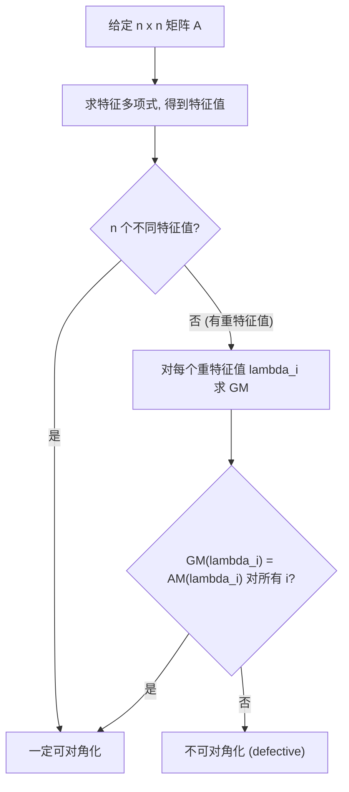

# 第2章 矩阵的相似对角化 (Matrix Diagonalization)

> **作者**：kyksj-1
> **风格致敬**：Gilbert Strang × 3Blue1Brown

---

## 本章导读

在第1章中，我们学会了提取矩阵的"灵魂"——特征值和特征向量。本章要回答一个核心问题：

> **能否选择特征向量作为基底，使得矩阵变成最简单的对角形式？**

如果可以，矩阵的幂次计算、指数函数、微分方程求解都变得极其简单。如果不可以，我们要理解为什么，以及有什么替代方案。

---

## 2.1 相似矩阵：同一变换的不同面孔

### 2.1.1 换基的思想

一个线性变换 $T: \mathbb{R}^n \to \mathbb{R}^n$ 是"客观存在"的——它与基底选择无关。但我们用矩阵描述它时，矩阵**依赖于基底的选择**。

设在标准基 $\{\mathbf{e}_1, \mathbf{e}_2, \ldots, \mathbf{e}_n\}$ 下，$T$ 的矩阵表示为 $A$。若选择另一组基 $\{\mathbf{p}_1, \mathbf{p}_2, \ldots, \mathbf{p}_n\}$，将新基按列排成矩阵 $P = [\mathbf{p}_1 \mid \mathbf{p}_2 \mid \cdots \mid \mathbf{p}_n]$，则同一变换 $T$ 在新基下的矩阵为：

$$
\boxed{B = P^{-1}AP}
$$

> **3Blue1Brown 的视角**：$P^{-1}AP$ 可以理解为一个"翻译"过程：
>$$
[T(\mathbf{v})]_{\text{new}} = \underbrace{P^{-1}}_{\text{第三步}} \underbrace{A}_{\text{第二步}} \underbrace{P}_{\text{第一步}} [\mathbf{v}]_{\text{new}}
$$
>1. **$P$（右乘）**：将输入向量从**新基语言**翻译到**标准基语言**（新基 $\to$ 标准）
>2. **$A$（中乘）**：在标准基下执行线性变换 $T$
>3. **$P^{-1}$（左乘）**：将结果从**标准基语言**翻译回**新基语言**（标准 $\to$ 新基）

### 2.1.2 相似的定义

**定义**：若存在可逆矩阵 $P$ 使得 $B = P^{-1}AP$，则称 $A$ 与 $B$ **相似**（similar），记作 $A \sim B$。

相似是一个**等价关系**：
- 自反性：$A \sim A$（取 $P = I$）
- 对称性：$A \sim B \Rightarrow B \sim A$（取 $Q = P^{-1}$）
- 传递性：$A \sim B$，$B \sim C \Rightarrow A \sim C$

### 2.1.3 相似矩阵的不变量

相似矩阵代表**同一个线性变换**，因此它们共享所有"内在"的性质：

| 不变量 | 说明 |
|--------|------|
| 特征值（含重数） | $\det(B - \lambda I) = \det(P^{-1}(A - \lambda I)P) = \det(A - \lambda I)$ |
| 迹 | $\text{tr}(P^{-1}AP) = \text{tr}(A)$（利用迹的轮换性） |
| 行列式 | $\det(P^{-1}AP) = \det(A)$ |
| 秩 | $\text{rank}(P^{-1}AP) = \text{rank}(A)$ |
| 特征多项式 | 整个多项式相同，不仅是根 |
| 最小多项式 | 相同 |

**注意**：相同的特征值是相似的**必要**条件，但**不充分**。例如 $I$ 和 $\begin{pmatrix} 1 & 1 \\ 0 & 1 \end{pmatrix}$ 有相同的特征值 $\{1, 1\}$，但不相似（$I$ 与任何矩阵相似只能是 $I$ 本身）。

---

## 2.2 对角化：核心定理与条件

### 2.2.1 对角化的定义

矩阵 $A$ 是**可对角化的**（diagonalizable），若存在可逆矩阵 $P$ 和对角矩阵 $D$，使得：

$$
\boxed{A = PDP^{-1} \quad \Longleftrightarrow \quad P^{-1}AP = D}
$$

其中 $D = \text{diag}(\lambda_1, \lambda_2, \ldots, \lambda_n)$，$P$ 的列恰好是对应的特征向量。

> **为什么叫"对角化"？** 因为 $P^{-1}AP = D$ 是对角矩阵——同一变换在特征基下的表示。

### 2.2.2 对角化的核心定理

**定理（对角化的充要条件）**：$n \times n$ 矩阵 $A$ 可对角化，当且仅当 $A$ 有 $n$ 个**线性无关**的特征向量。

**证明**：

$(\Rightarrow)$ 设 $A = PDP^{-1}$，则 $AP = PD$。设 $P = [\mathbf{p}_1 | \cdots | \mathbf{p}_n]$，比较第 $i$ 列：

$$
A\mathbf{p}_i = \lambda_i \mathbf{p}_i
$$

即 $\mathbf{p}_i$ 是特征向量。$P$ 可逆意味着 $\mathbf{p}_1, \ldots, \mathbf{p}_n$ 线性无关。

$(\Leftarrow)$ 设 $A$ 有 $n$ 个线性无关的特征向量 $\mathbf{p}_1, \ldots, \mathbf{p}_n$，对应特征值 $\lambda_1, \ldots, \lambda_n$。令 $P = [\mathbf{p}_1 | \cdots | \mathbf{p}_n]$，$D = \text{diag}(\lambda_1, \ldots, \lambda_n)$。则 $AP = PD$。由于 $P$ 的列线性无关，$P$ 可逆，故 $P^{-1}AP = D$。$\blacksquare$

### 2.2.3 对角化的充分条件

**推论 1**：若 $n \times n$ 矩阵 $A$ 有 $n$ 个**不同的**特征值，则 $A$ 可对角化。

**证明**：属于不同特征值的特征向量线性无关（这是一个经典结论）。$n$ 个不同特征值给出 $n$ 个线性无关的特征向量。$\blacksquare$

> **注意**：这是充分条件，非必要。例如 $I$ 只有一个特征值 $\lambda = 1$（重数 $n$），但显然可对角化（$I$ 已经是对角矩阵）。

**推论 2**：$A$ 可对角化 $\Longleftrightarrow$ 每个特征值的几何重数等于代数重数。

即：$\text{GM}(\lambda_i) = \text{AM}(\lambda_i)$，对所有 $i$。

### 2.2.4 不可对角化的判别

一个矩阵**不可对角化**（defective），当且仅当存在某个特征值 $\lambda_i$，其几何重数严格小于代数重数：

$$
\text{GM}(\lambda_i) < \text{AM}(\lambda_i)
$$

**经典反例**：

$$
A = \begin{pmatrix} 3 & 1 \\ 0 & 3 \end{pmatrix}
$$

特征值 $\lambda = 3$（代数重数2），但特征空间仅一维（几何重数1）。



---

## 2.3 对角化的 SOP（完整流程）

### SOP 流程

**Step 1**：求特征值

计算 $\det(A - \lambda I) = 0$，得到特征值 $\lambda_1, \lambda_2, \ldots, \lambda_k$（$k$ 个不同的特征值），记录每个的代数重数 $\text{AM}(\lambda_i)$。

**Step 2**：求特征向量

对每个 $\lambda_i$，求解 $(A - \lambda_i I)\mathbf{v} = \mathbf{0}$，得到特征空间的一组基。检查 $\text{GM}(\lambda_i) = \text{AM}(\lambda_i)$ 是否成立。

**Step 3**：判断可对角化性

- 若所有特征值都满足 $\text{GM} = \text{AM}$，则可对角化，进入 Step 4。
- 否则，不可对角化，停止（或考虑 Jordan 标准形，见拓展）。

**Step 4**：构建 $P$ 和 $D$

- $P = [\mathbf{v}_1 | \mathbf{v}_2 | \cdots | \mathbf{v}_n]$，按列排放所有特征向量
- $D = \text{diag}(\lambda_1, \lambda_2, \ldots, \lambda_n)$，对角线上放对应的特征值
- **顺序一致性**：$P$ 的第 $i$ 列对应 $D$ 的第 $i$ 个对角元素

**Step 5**：验证

检查 $AP = PD$（比验证 $P^{-1}AP = D$ 更方便，不需要求逆）。

### 完整例题 1：2×2 矩阵对角化

**对角化** $A = \begin{pmatrix} 4 & 2 \\ 1 & 3 \end{pmatrix}$

**Step 1**：特征值（沿用第1章例题1的结果）

$\lambda_1 = 5$，$\lambda_2 = 2$，各代数重数1。

**Step 2**：特征向量

$\lambda_1 = 5$：$\mathbf{v}_1 = \begin{pmatrix} 2 \\ 1 \end{pmatrix}$

$\lambda_2 = 2$：$\mathbf{v}_2 = \begin{pmatrix} -1 \\ 1 \end{pmatrix}$

**Step 3**：两个不同特征值，一定可对角化。✓

**Step 4**：

$$
P = \begin{pmatrix} 2 & -1 \\ 1 & 1 \end{pmatrix}, \quad D = \begin{pmatrix} 5 & 0 \\ 0 & 2 \end{pmatrix}
$$

**Step 5**：验证 $AP = PD$

$$
AP = \begin{pmatrix} 4 & 2 \\ 1 & 3 \end{pmatrix}\begin{pmatrix} 2 & -1 \\ 1 & 1 \end{pmatrix} = \begin{pmatrix} 10 & -2 \\ 5 & 2 \end{pmatrix}
$$

$$
PD = \begin{pmatrix} 2 & -1 \\ 1 & 1 \end{pmatrix}\begin{pmatrix} 5 & 0 \\ 0 & 2 \end{pmatrix} = \begin{pmatrix} 10 & -2 \\ 5 & 2 \end{pmatrix} \quad \checkmark
$$

### 完整例题 2：3×3 矩阵对角化

**对角化** $A = \begin{pmatrix} 2 & 0 & 0 \\ 1 & 3 & 0 \\ 0 & 0 & 2 \end{pmatrix}$

**Step 1**：$A$ 是下三角矩阵，特征值直接读出：$\lambda_1 = 2$（AM=2），$\lambda_2 = 3$（AM=1）。

**Step 2**：

$\lambda_1 = 2$：

$$
A - 2I = \begin{pmatrix} 0 & 0 & 0 \\ 1 & 1 & 0 \\ 0 & 0 & 0 \end{pmatrix}
$$

只有方程 $v_1 + v_2 = 0$，两个自由变量（$v_2$ 和 $v_3$）。

$$
\mathbf{v}_1 = \begin{pmatrix} -1 \\ 1 \\ 0 \end{pmatrix}, \quad \mathbf{v}_2 = \begin{pmatrix} 0 \\ 0 \\ 1 \end{pmatrix}
$$

GM(2) = 2 = AM(2)。✓

$\lambda_2 = 3$：

$$
A - 3I = \begin{pmatrix} -1 & 0 & 0 \\ 1 & 0 & 0 \\ 0 & 0 & -1 \end{pmatrix}
$$

得 $v_1 = 0$，$v_3 = 0$，$v_2$ 自由。

$$
\mathbf{v}_3 = \begin{pmatrix} 0 \\ 1 \\ 0 \end{pmatrix}
$$

GM(3) = 1 = AM(3)。✓

**Step 3**：可对角化。

**Step 4**：

$$
P = \begin{pmatrix} -1 & 0 & 0 \\ 1 & 0 & 1 \\ 0 & 1 & 0 \end{pmatrix}, \quad D = \begin{pmatrix} 2 & 0 & 0 \\ 0 & 2 & 0 \\ 0 & 0 & 3 \end{pmatrix}
$$

### 完整例题 3：不可对角化的情形

**判断** $A = \begin{pmatrix} 2 & 1 & 0 \\ 0 & 2 & 1 \\ 0 & 0 & 2 \end{pmatrix}$ 能否对角化。

**Step 1**：上三角矩阵，特征值 $\lambda = 2$，AM=3。

**Step 2**：

$$
A - 2I = \begin{pmatrix} 0 & 1 & 0 \\ 0 & 0 & 1 \\ 0 & 0 & 0 \end{pmatrix}
$$

$v_2 = 0$，$v_3 = 0$，$v_1$ 自由。唯一特征向量方向：$(1, 0, 0)^T$。GM(2) = 1。

**Step 3**：GM(2) = 1 < AM(2) = 3，**不可对角化**。

---

## 2.4 对角化的威力：应用

### 2.4.1 矩阵幂次

若 $A = PDP^{-1}$，则：

$$
A^k = PD^kP^{-1}
$$

其中 $D^k = \text{diag}(\lambda_1^k, \lambda_2^k, \ldots, \lambda_n^k)$。

**证明**：

$$
A^2 = (PDP^{-1})(PDP^{-1}) = PD(P^{-1}P)DP^{-1} = PD^2P^{-1}
$$

归纳即得 $A^k = PD^kP^{-1}$。$\blacksquare$

**例**：求 $A^{10}$，其中 $A = \begin{pmatrix} 4 & 2 \\ 1 & 3 \end{pmatrix}$。

$$
A^{10} = P \begin{pmatrix} 5^{10} & 0 \\ 0 & 2^{10} \end{pmatrix} P^{-1}
$$

$P^{-1} = \frac{1}{3}\begin{pmatrix} 1 & 1 \\ -1 & 2 \end{pmatrix}$

$$
A^{10} = \frac{1}{3}\begin{pmatrix} 2 & -1 \\ 1 & 1 \end{pmatrix}\begin{pmatrix} 5^{10} & 0 \\ 0 & 2^{10} \end{pmatrix}\begin{pmatrix} 1 & 1 \\ -1 & 2 \end{pmatrix}
$$

$$
= \frac{1}{3}\begin{pmatrix} 2 \cdot 5^{10} + 2^{10} & 2 \cdot 5^{10} - 2^{11} \\ 5^{10} - 2^{10} & 5^{10} + 2^{11} \end{pmatrix}
$$

不用对角化直接算 $A^{10}$，需要做9次矩阵乘法！对角化后，只需做简单标量运算。

### 2.4.2 矩阵指数函数

对角化使得矩阵指数的计算变得简单：

$$
e^{At} = P \begin{pmatrix} e^{\lambda_1 t} & & \\ & e^{\lambda_2 t} & \\ & & \ddots \end{pmatrix} P^{-1}
$$

这在求解线性常微分方程组 $\dot{\mathbf{x}} = A\mathbf{x}$ 时至关重要：通解为 $\mathbf{x}(t) = e^{At}\mathbf{x}_0$。

### 2.4.3 Fibonacci 数列

Fibonacci 数列 $F_0 = 0, F_1 = 1, F_{n+1} = F_n + F_{n-1}$ 可以写成矩阵形式：

$$
\begin{pmatrix} F_{n+1} \\ F_n \end{pmatrix} = \begin{pmatrix} 1 & 1 \\ 1 & 0 \end{pmatrix}^n \begin{pmatrix} 1 \\ 0 \end{pmatrix}
$$

设 $A = \begin{pmatrix} 1 & 1 \\ 1 & 0 \end{pmatrix}$，特征值为 $\phi = \frac{1+\sqrt{5}}{2}$（黄金比例）和 $\hat{\phi} = \frac{1-\sqrt{5}}{2}$。

对角化后可以直接得到 Fibonacci 数列的通项公式：

$$
\boxed{F_n = \frac{\phi^n - \hat{\phi}^n}{\sqrt{5}} = \frac{1}{\sqrt{5}}\left[\left(\frac{1+\sqrt{5}}{2}\right)^n - \left(\frac{1-\sqrt{5}}{2}\right)^n\right]}
$$

这就是著名的 **Binet 公式**。由于 $|\hat{\phi}| < 1$，当 $n$ 很大时 $\hat{\phi}^n \to 0$，所以 $F_n \approx \phi^n / \sqrt{5}$——Fibonacci 数列以黄金比例指数增长。

### 2.4.4 离散动力系统

考虑 $\mathbf{x}_{k+1} = A\mathbf{x}_k$，则 $\mathbf{x}_k = A^k \mathbf{x}_0$。

若 $A = PDP^{-1}$，设 $\mathbf{x}_0 = c_1\mathbf{v}_1 + c_2\mathbf{v}_2 + \cdots + c_n\mathbf{v}_n$，则：

$$
\mathbf{x}_k = c_1 \lambda_1^k \mathbf{v}_1 + c_2 \lambda_2^k \mathbf{v}_2 + \cdots + c_n \lambda_n^k \mathbf{v}_n
$$

**长期行为**由**最大特征值**（谱半径 $\rho(A) = \max|\lambda_i|$）决定。

---

## 2.5 同时对角化与可交换矩阵

### 2.5.1 定理

**定理**：两个可对角化矩阵 $A$ 和 $B$ 可以被**同一个** $P$ 同时对角化，当且仅当 $AB = BA$（它们可交换）。

即：$AB = BA \Longleftrightarrow$ 存在可逆 $P$ 使得 $P^{-1}AP$ 和 $P^{-1}BP$ 同时为对角矩阵。

> **深刻性**：在量子力学中，两个可观测量可以同时具有确定值（同时测量），当且仅当它们对应的算符可交换。这就是"同时对角化"的物理含义。

### 2.5.2 例：对角矩阵之间的交换

所有对角矩阵彼此可交换：

$$
\begin{pmatrix} a & 0 \\ 0 & b \end{pmatrix}\begin{pmatrix} c & 0 \\ 0 & d \end{pmatrix} = \begin{pmatrix} ac & 0 \\ 0 & bd \end{pmatrix} = \begin{pmatrix} c & 0 \\ 0 & d \end{pmatrix}\begin{pmatrix} a & 0 \\ 0 & b \end{pmatrix}
$$

这是显然的——在"正确的"基底（共同特征基）下，所有可交换的变换都只是各方向的独立缩放。

---

## 2.6 拓展：不可对角化时怎么办？ —— Jordan 标准形

### 2.6.1 Jordan 块

当矩阵不可对角化时，最"接近对角"的形式是 **Jordan 标准形**。

一个 $k \times k$ 的 **Jordan 块** $J_k(\lambda)$ 定义为：

$$
J_k(\lambda) = \begin{pmatrix}
\lambda & 1 & 0 & \cdots & 0 \\
0 & \lambda & 1 & \cdots & 0 \\
\vdots & & \ddots & \ddots & \vdots \\
0 & & \cdots & \lambda & 1 \\
0 & & \cdots & 0 & \lambda
\end{pmatrix}
$$

即对角线上全是 $\lambda$，上一条对角线全是1，其余为零。

### 2.6.2 Jordan 标准形定理

**定理**：每个 $n \times n$ 复矩阵 $A$ 都相似于一个 **Jordan 矩阵**：

$$
P^{-1}AP = J = \begin{pmatrix}
J_{k_1}(\lambda_1) & & \\
& J_{k_2}(\lambda_2) & \\
& & \ddots
\end{pmatrix}
$$

其中 $J_{k_i}(\lambda_i)$ 是 Jordan 块，$k_1 + k_2 + \cdots = n$。

- 若所有 Jordan 块都是 $1 \times 1$ 的，Jordan 形就是对角矩阵——矩阵可对角化。
- 若存在大于 $1\times 1$ 的 Jordan 块，矩阵不可对角化。

**例**：$A = \begin{pmatrix} 3 & 1 \\ 0 & 3 \end{pmatrix}$ 本身就是 Jordan 形 $J_2(3)$。

**例**：$A = \begin{pmatrix} 2 & 1 & 0 \\ 0 & 2 & 1 \\ 0 & 0 & 2 \end{pmatrix}$ 本身就是 $J_3(2)$。

### 2.6.3 Jordan 形的意义

Jordan 标准形是在**相似变换**意义下的**最简形式**：

| 矩阵类型 | 最简形式 |
|----------|---------|
| 可对角化 | 对角矩阵 $D$ |
| 不可对角化 | Jordan 矩阵 $J$ |

Jordan 块中超对角线上的 "1" 测量了矩阵的"缺陷程度"。

> 本章不展开 Jordan 标准形的求解方法，这在高等代数或矩阵分析课程中有详细讨论。这里只需要知道：**对角化是 Jordan 标准形的特殊情况（最好的情况）**。

---

## 2.7 编程实践

### 2.7.1 用 NumPy 进行对角化

```python
import numpy as np

def diagonalize(A, tol=1e-10):
    """
    对角化矩阵 A，返回 P, D, P_inv。

    参数:
        A: n x n numpy 数组
        tol: 判断几何重数的容差

    返回:
        P: 特征向量矩阵（若可对角化）
        D: 对角矩阵
        P_inv: P 的逆矩阵
        若不可对角化，返回 None, None, None
    """
    n = A.shape[0]
    eigenvalues, eigenvectors = np.linalg.eig(A)

    # 检查是否可对角化：P 是否可逆
    P = eigenvectors
    if abs(np.linalg.det(P)) < tol:
        print("矩阵不可对角化（特征向量不构成基）")
        return None, None, None

    D = np.diag(eigenvalues)
    P_inv = np.linalg.inv(P)

    # 验证
    residual = np.linalg.norm(A - P @ D @ P_inv)
    print(f"验证 ||A - PDP^(-1)|| = {residual:.2e}")

    return P, D, P_inv


# ============================================================
# 示例 1：可对角化
# ============================================================
A = np.array([[4, 2],
              [1, 3]])

print("=== 可对角化矩阵 ===")
P, D, P_inv = diagonalize(A)
print(f"P =\n{P}")
print(f"D =\n{D}")

# 利用对角化计算 A^10
A_10 = P @ np.diag(np.diag(D)**10) @ P_inv
print(f"\nA^10 =\n{np.real(A_10).astype(int)}")

# 验证
print(f"直接计算 A^10 =\n{np.linalg.matrix_power(A, 10)}")


# ============================================================
# 示例 2：不可对角化
# ============================================================
B = np.array([[3, 1],
              [0, 3]])

print("\n=== 不可对角化矩阵 ===")
diagonalize(B)


# ============================================================
# 示例 3：Fibonacci 数列
# ============================================================
F = np.array([[1, 1],
              [1, 0]])

P_f, D_f, P_f_inv = diagonalize(F)
print("\n=== Fibonacci ===")
for n_val in [10, 20, 30]:
    F_n = P_f @ np.diag(np.diag(D_f)**n_val) @ P_f_inv
    fib_n = int(np.round(F_n[0, 0].real))
    print(f"F({n_val}) = {fib_n}")
```

### 2.7.2 可视化对角化的几何含义

```python
import numpy as np
import matplotlib.pyplot as plt

def visualize_diagonalization(A, title="Diagonalization"):
    """
    可视化对角化的几何过程：
    左图: 标准基下的变换
    右图: 特征基下的变换（变成简单拉伸）

    参数:
        A: 2x2 numpy 数组
        title: 图标题
    """
    eigenvalues, eigenvectors = np.linalg.eig(A)

    if not np.all(np.isreal(eigenvalues)):
        print("特征值有复数，无法在实平面上可视化对角化")
        return

    eigenvalues = eigenvalues.real
    P = eigenvectors.real
    D = np.diag(eigenvalues)

    fig, axes = plt.subplots(1, 2, figsize=(14, 6))

    # 生成单位圆
    t = np.linspace(0, 2 * np.pi, 200)
    circle = np.array([np.cos(t), np.sin(t)])

    # --- 左图：标准基下 ---
    ax = axes[0]
    ellipse = A @ circle
    ax.plot(circle[0], circle[1], 'b-', linewidth=1.5, label='Unit circle')
    ax.plot(ellipse[0], ellipse[1], 'r-', linewidth=1.5, label='A * (unit circle)')

    # 画特征向量
    colors = ['darkgreen', 'darkviolet']
    for j in range(2):
        v = P[:, j]
        ax.annotate('', xy=v, xytext=(0, 0),
                     arrowprops=dict(arrowstyle='->', color=colors[j], lw=2))
        ax.annotate('', xy=eigenvalues[j] * v, xytext=(0, 0),
                     arrowprops=dict(arrowstyle='->', color=colors[j], lw=2, ls='--'))
        ax.text(v[0]*1.1, v[1]*1.1, f'v{j+1}', fontsize=11, color=colors[j])

    ax.set_aspect('equal')
    ax.grid(True, alpha=0.3)
    ax.set_title(f'Standard basis: A acts on unit circle')
    ax.legend()

    # --- 右图：特征基下（对角矩阵的效果） ---
    ax2 = axes[1]
    # 在特征基下，变换就是简单的拉伸
    ellipse_diag = D @ circle
    ax2.plot(circle[0], circle[1], 'b-', linewidth=1.5, label='Unit circle')
    ax2.plot(ellipse_diag[0], ellipse_diag[1], 'r-', linewidth=1.5,
             label=f'D * (unit circle)\nD=diag({eigenvalues[0]:.2f}, {eigenvalues[1]:.2f})')

    ax2.annotate('', xy=(1, 0), xytext=(0, 0),
                  arrowprops=dict(arrowstyle='->', color='darkgreen', lw=2))
    ax2.annotate('', xy=(eigenvalues[0], 0), xytext=(0, 0),
                  arrowprops=dict(arrowstyle='->', color='darkgreen', lw=2, ls='--'))

    ax2.annotate('', xy=(0, 1), xytext=(0, 0),
                  arrowprops=dict(arrowstyle='->', color='darkviolet', lw=2))
    ax2.annotate('', xy=(0, eigenvalues[1]), xytext=(0, 0),
                  arrowprops=dict(arrowstyle='->', color='darkviolet', lw=2, ls='--'))

    ax2.set_aspect('equal')
    ax2.grid(True, alpha=0.3)
    ax2.set_title('Eigenbasis: D acts as pure scaling')
    ax2.legend()

    plt.suptitle(title, fontsize=14, fontweight='bold')
    plt.tight_layout()
    plt.savefig('ch2_diagonalization_visualization.png', dpi=150, bbox_inches='tight')
    plt.show()

# 运行
A = np.array([[4, 2],
              [1, 3]])
visualize_diagonalization(A, "A = [[4,2],[1,3]], eigenvalues: 5, 2")
```

---

## 2.8 Key Takeaway

| 概念 | 核心要点 |
|------|---------|
| 相似矩阵 $B = P^{-1}AP$ | 同一变换在不同基底下的表示 |
| 相似不变量 | 特征值、迹、行列式、秩、特征多项式 |
| 对角化 $A = PDP^{-1}$ | $P$ 列为特征向量，$D$ 对角线为特征值 |
| 可对角化 $\Leftrightarrow$ | $n$ 个线性无关特征向量 $\Leftrightarrow$ GM=AM（对所有特征值） |
| 不同特征值 $\Rightarrow$ 可对角化 | 充分条件（非必要） |
| 矩阵幂次 | $A^k = PD^kP^{-1}$，计算量从 $O(kn^3)$ 降到 $O(n^3)$ |
| 矩阵指数 | $e^{At} = Pe^{Dt}P^{-1}$，解微分方程 |
| 同时对角化 | $AB = BA \Leftrightarrow$ 存在共同特征基 |
| Jordan 标准形 | 不可对角化时的"次好"选择 |

---

## 习题

### 概念理解

**2.1** 判断正误并说明理由：
  - (a) 若 $A$ 和 $B$ 有相同的特征值，则 $A \sim B$。
  - (b) 对角矩阵一定可对角化。
  - (c) 若 $A$ 可对角化，则 $A$ 可逆。
  - (d) 实对称矩阵一定可对角化。
  - (e) 若 $A^2 = I$，则 $A$ 可对角化。

**2.2** 设 $A \sim B$。证明：
  - (a) $A^k \sim B^k$，对所有正整数 $k$。
  - (b) 若 $A$ 可逆，则 $A^{-1} \sim B^{-1}$。
  - (c) $A + cI \sim B + cI$。

### 计算练习

**2.3** 对角化以下矩阵（若可对角化），给出 $P$ 和 $D$：

$$
(a) \quad A = \begin{pmatrix} 3 & 0 \\ 8 & -1 \end{pmatrix} \qquad
(b) \quad B = \begin{pmatrix} 1 & -1 \\ 1 & 3 \end{pmatrix} \qquad
(c) \quad C = \begin{pmatrix} 1 & 0 & 0 \\ -2 & 1 & 0 \\ 3 & 7 & 2 \end{pmatrix}
$$

**2.4** 利用对角化求 $A^{50}$，其中 $A = \begin{pmatrix} 1 & 2 \\ 0 & 3 \end{pmatrix}$。

**2.5** 设 $A = \begin{pmatrix} 0.6 & 0.2 \\ 0.4 & 0.8 \end{pmatrix}$ 是一个**马尔可夫矩阵**（每列之和为1）。
  - (a) 求特征值和特征向量。
  - (b) 利用对角化求 $\lim_{k\to\infty} A^k$。
  - (c) 解释结果的概率意义：为什么极限存在？它代表什么？

### 思考题

**2.6** 证明：幂零矩阵（$A^k = 0$ 对某个 $k$）可对角化当且仅当 $A = 0$。

**2.7** 设 $A$ 是 $n\times n$ 实矩阵，且 $A^2 = A$（幂等矩阵）。
  - (a) 证明 $A$ 可对角化。
  - (b) 证明 $\text{rank}(A) = \text{tr}(A)$。
  - *提示：先证明特征值只能是 0 和 1。*

**2.8** （Fibonacci 推广）考虑一般二阶递推 $x_{n+2} = ax_{n+1} + bx_n$。
  - 写出矩阵形式。
  - 在什么条件下矩阵可对角化？
  - 给出一般通项公式。

### 编程题

**2.9** 编写程序比较"直接计算 $A^k$"和"通过对角化计算 $A^k$"的效率。
  - 随机生成 $100\times 100$ 的可对角化矩阵
  - 分别用 `numpy.linalg.matrix_power` 和对角化方法计算 $A^k$（$k=100, 1000, 10000$）
  - 比较两种方法的运行时间和数值误差

**2.10** 实现 Fibonacci 数列的对角化计算方法，与直接递推法进行比较。对 $n = 10, 50, 100$ 计算 $F_n$，观察大 $n$ 时浮点误差的影响。

---

> **下一章预告**：矩阵对角化将方阵化为最简形式。但在许多应用中，我们关心的不是 $A\mathbf{x}$，而是 $\mathbf{x}^T A \mathbf{x}$——一个**二次型**。二次型与对角化有着深刻的联系，并且它是正定性、最优化和曲面分类的核心工具。
