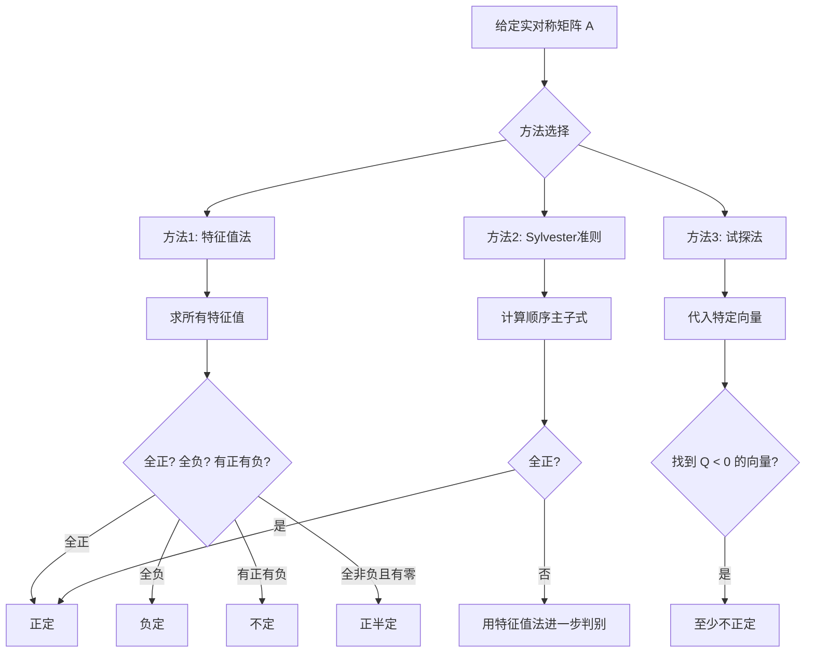
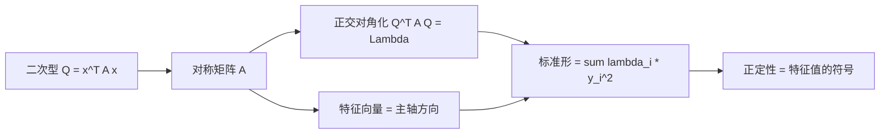

# 第3章 二次型 (Quadratic Forms)

> **作者**：kyksj-1
> **风格致敬**：Gilbert Strang × 3Blue1Brown

---

## 本章导读

在前两章中，我们研究的是矩阵对向量的**线性作用** $A\mathbf{x}$。本章转向一种看似不同却深刻相关的对象——**二次型** $Q(\mathbf{x}) = \mathbf{x}^T A \mathbf{x}$。

二次型将一个向量映射为一个**标量**。它回答的核心问题是：

> **这个标量是正的、负的，还是可正可负？**

这个看似简单的问题，背后连接着特征值、对角化、优化、稳定性分析、曲面分类等一大片数学与工程领域。

---

## 3.1 二次型的定义与矩阵表示

### 3.1.1 从多项式到矩阵

一个**二次型**（quadratic form）是关于 $n$ 个变量的齐二次多项式。

**二维情形**：

$$
Q(x_1, x_2) = a_{11}x_1^2 + 2a_{12}x_1x_2 + a_{22}x_2^2
$$

**三维情形**：

$$
Q(x_1, x_2, x_3) = a_{11}x_1^2 + a_{22}x_2^2 + a_{33}x_3^2 + 2a_{12}x_1x_2 + 2a_{13}x_1x_3 + 2a_{23}x_2x_3
$$

**关键观察**：每个二次型都可以写成矩阵形式：

$$
\boxed{Q(\mathbf{x}) = \mathbf{x}^T A \mathbf{x}}
$$

其中 $A$ 是**对称矩阵**。

**为什么要求 $A$ 对称？**

对于任意矩阵 $B$，我们总可以将其拆分为对称部分和反对称部分：

$$
B = \frac{B + B^T}{2} + \frac{B - B^T}{2}
$$

而反对称部分对二次型的贡献为零 ：$\mathbf{x}^T C \mathbf{x} = 0$（当 $C^T = -C$ 时）。 [（证明可看附录）](#反对称阵证明) <a id="反对称阵" ></a>

因此，$\mathbf{x}^T B \mathbf{x} = \mathbf{x}^T \left(\frac{B + B^T}{2}\right) \mathbf{x}$。我们总可以取 $A = \frac{B + B^T}{2}$ 为对称矩阵。

### 3.1.2 构造矩阵的 SOP

给定二次型多项式，如何写出矩阵 $A$？

**规则**：
- $x_i^2$ 的系数 → $a_{ii}$（对角线元素）
- $x_i x_j$（$i \neq j$）的系数的**一半** → $a_{ij} = a_{ji}$（对称放置）

**例 1**：$Q = 5x^2 + 4xy + 2y^2$

$$
A = \begin{pmatrix} 5 & 2 \\ 2 & 2 \end{pmatrix}
$$

验证：$\begin{pmatrix} x & y \end{pmatrix}\begin{pmatrix} 5 & 2 \\ 2 & 2 \end{pmatrix}\begin{pmatrix} x \\ y \end{pmatrix} = 5x^2 + 2xy + 2xy + 2y^2 = 5x^2 + 4xy + 2y^2$ ✓

**例 2**：$Q = x_1^2 + 4x_1x_2 - 6x_1x_3 + 3x_2^2 + 2x_2x_3 + 7x_3^2$

$$
A = \begin{pmatrix} 1 & 2 & -3 \\ 2 & 3 & 1 \\ -3 & 1 & 7 \end{pmatrix}
$$

### 3.1.3 几何解释

二次型 $Q(\mathbf{x}) = \mathbf{x}^T A \mathbf{x}$ 在 $\mathbb{R}^n$ 中定义了一个标量场。

- 在 $\mathbb{R}^2$ 中，$z = Q(x, y)$ 是一个**曲面**（碗、鞍面、柱面等）
- 等高线 $Q(x, y) = c$ 是**二次曲线**（椭圆、双曲线、抛物线等）

> **动画参考**：见 `animations/ch3_quadratic_form_visualizations.py` 中的 `QuadraticFormSurface` 场景。

---

## 3.2 二次型的分类：正定性

### 3.2.1 定义

设 $A$ 是 $n\times n$ 实对称矩阵。$Q(\mathbf{x}) = \mathbf{x}^T A \mathbf{x}$ 的符号决定了二次型的**定性**：

| 类型 | 条件 | 几何形状（$n=2$） |
|------|------|------------------|
| **正定**（positive definite） | $Q(\mathbf{x}) > 0$，$\forall \mathbf{x} \neq \mathbf{0}$ | 向上开口的碗 |
| **正半定**（positive semidefinite） | $Q(\mathbf{x}) \geq 0$，$\forall \mathbf{x}$ | 柱面或退化的碗 |
| **负定**（negative definite） | $Q(\mathbf{x}) < 0$，$\forall \mathbf{x} \neq \mathbf{0}$ | 倒碗 |
| **负半定**（negative semidefinite） | $Q(\mathbf{x}) \leq 0$，$\forall \mathbf{x}$ | 倒柱面 |
| **不定**（indefinite） | $Q$ 既可正也可负 | 马鞍面 |

### 3.2.2 特征值判别法

**定理**：设 $A$ 的特征值为 $\lambda_1 \leq \lambda_2 \leq \cdots \leq \lambda_n$。

| 类型 | 特征值条件 |
|------|-----------|
| 正定 | $\lambda_i > 0$，$\forall i$ |
| 正半定 | $\lambda_i \geq 0$，$\forall i$ |
| 负定 | $\lambda_i < 0$，$\forall i$ |
| 负半定 | $\lambda_i \leq 0$，$\forall i$ |
| 不定 | 既有正特征值又有负特征值 |

**证明**：由于 $A$ 是实对称矩阵，可以正交对角化：$A = Q\Lambda Q^T$，其中 $Q$ 正交，$\Lambda = \text{diag}(\lambda_1, \ldots, \lambda_n)$。

令 $\mathbf{y} = Q^T \mathbf{x}$（正交变换，不改变向量长度），则：

$$
\mathbf{x}^T A \mathbf{x} = \mathbf{x}^T Q\Lambda Q^T \mathbf{x} = \mathbf{y}^T \Lambda \mathbf{y} = \lambda_1 y_1^2 + \lambda_2 y_2^2 + \cdots + \lambda_n y_n^2
$$

当所有 $\lambda_i > 0$ 时，对 $\mathbf{y} \neq \mathbf{0}$，上式必为正。$\blacksquare$

**例**：$A = \begin{pmatrix} 5 & 2 \\ 2 & 2 \end{pmatrix}$

特征多项式：$\lambda^2 - 7\lambda + 6 = (\lambda - 1)(\lambda - 6) = 0$

$\lambda_1 = 1 > 0$，$\lambda_2 = 6 > 0$ → **正定**。

### 3.2.3 顺序主子式判别法（Sylvester 准则）

**定理（Sylvester's Criterion）**：实对称矩阵 $A$ 正定，当且仅当所有**顺序主子式**（leading principal minors）都为正：

$$
\Delta_1 = a_{11} > 0, \quad \Delta_2 = \det\begin{pmatrix} a_{11} & a_{12} \\ a_{21} & a_{22} \end{pmatrix} > 0, \quad \ldots, \quad \Delta_n = \det(A) > 0
$$

**例**：$A = \begin{pmatrix} 2 & -1 & 0 \\ -1 & 2 & -1 \\ 0 & -1 & 2 \end{pmatrix}$

$\Delta_1 = 2 > 0$，$\Delta_2 = 4 - 1 = 3 > 0$，$\Delta_3 = 2(4-1) + 1(-2) = 4 > 0$ → **正定**。

> **注意**：Sylvester 准则仅判别**正定**。判别负定需要交替变号：$\Delta_1 < 0, \Delta_2 > 0, \Delta_3 < 0, \ldots$。判别半正定和不定不能直接用此准则（需要检查所有主子式，不仅是顺序主子式）。

### 3.2.4 判别正定性的 SOP



---

## 3.3 标准形：化繁为简

### 3.3.1 什么是标准形？

二次型的**标准形**（canonical form）是只含平方项（无交叉项）的形式：

$$
Q = d_1 y_1^2 + d_2 y_2^2 + \cdots + d_n y_n^2
$$

通过坐标变换 $\mathbf{x} = P\mathbf{y}$，可以消去所有交叉项，得到标准形。

### 3.3.2 方法一：正交变换法（主轴定理）

**定理（主轴定理/谱定理的应用）**：每个实对称矩阵 $A$ 都可以通过**正交变换**化为对角形。即存在正交矩阵 $Q$（$Q^TQ = I$）使得：

$$
Q^T A Q = \Lambda = \text{diag}(\lambda_1, \lambda_2, \ldots, \lambda_n)
$$

令 $\mathbf{x} = Q\mathbf{y}$，则：

$$
\mathbf{x}^T A \mathbf{x} = \mathbf{y}^T (Q^T A Q) \mathbf{y} = \lambda_1 y_1^2 + \lambda_2 y_2^2 + \cdots + \lambda_n y_n^2
$$

**SOP**：

1. 求 $A$ 的特征值 $\lambda_1, \ldots, \lambda_n$ 和特征向量 $\mathbf{q}_1, \ldots, \mathbf{q}_n$
2. 将特征向量**单位正交化**（Gram-Schmidt 或直接归一化，对不同特征值的特征向量已自动正交）
3. 构建正交矩阵 $Q = [\mathbf{q}_1 | \cdots | \mathbf{q}_n]$
4. 标准形为 $Q = \lambda_1 y_1^2 + \cdots + \lambda_n y_n^2$

**完整例题**：将 $Q(x_1, x_2) = 5x_1^2 + 4x_1 x_2 + 2x_2^2$ 化为标准形。

矩阵 $A = \begin{pmatrix} 5 & 2 \\ 2 & 2 \end{pmatrix}$

**Step 1**：特征值

$\lambda^2 - 7\lambda + 6 = 0 \Rightarrow \lambda_1 = 1, \lambda_2 = 6$

**Step 2**：特征向量

$\lambda_1 = 1$：$(A - I)\mathbf{v} = 0 \Rightarrow \begin{pmatrix} 4 & 2 \\ 2 & 1 \end{pmatrix}\mathbf{v} = 0 \Rightarrow \mathbf{v}_1 = \begin{pmatrix} 1 \\ -2 \end{pmatrix}$

$\lambda_2 = 6$：$(A - 6I)\mathbf{v} = 0 \Rightarrow \begin{pmatrix} -1 & 2 \\ 2 & -4 \end{pmatrix}\mathbf{v} = 0 \Rightarrow \mathbf{v}_2 = \begin{pmatrix} 2 \\ 1 \end{pmatrix}$

验证正交：$\mathbf{v}_1 \cdot \mathbf{v}_2 = 2 - 2 = 0$ ✓

**Step 3**：单位化

$$
\mathbf{q}_1 = \frac{1}{\sqrt{5}}\begin{pmatrix} 1 \\ -2 \end{pmatrix}, \quad \mathbf{q}_2 = \frac{1}{\sqrt{5}}\begin{pmatrix} 2 \\ 1 \end{pmatrix}
$$

$$
Q = \frac{1}{\sqrt{5}}\begin{pmatrix} 1 & 2 \\ -2 & 1 \end{pmatrix}
$$

**Step 4**：标准形

$$
\boxed{Q(x_1, x_2) = y_1^2 + 6y_2^2}
$$

其中 $\begin{pmatrix} x_1 \\ x_2 \end{pmatrix} = Q\begin{pmatrix} y_1 \\ y_2 \end{pmatrix}$，即旋转角 $\theta = \arctan(2) \approx 63.43°$。

> **动画参考**：见 `animations/ch3_quadratic_form_visualizations.py` 中的 `DiagonalizationOfQuadraticForm` 场景。

### 3.3.3 方法二：配方法

不需要求特征值，直接通过代数配方消去交叉项。适合手算。

**例**：将 $Q = 2x_1^2 + 4x_1x_2 + 5x_2^2$ 化为标准形。

$$
Q = 2(x_1^2 + 2x_1x_2) + 5x_2^2 = 2(x_1 + x_2)^2 - 2x_2^2 + 5x_2^2 = 2(x_1 + x_2)^2 + 3x_2^2
$$

令 $y_1 = x_1 + x_2$，$y_2 = x_2$，得标准形 $Q = 2y_1^2 + 3y_2^2$。

> **注意**：配方法得到的变换矩阵一般**不是正交的**。如果需要正交变换，必须用方法一。

### 3.3.4 惯性定理

**定理（Sylvester 惯性定理）**：实二次型经任何非退化线性变换化为标准形后，正项、负项、零项的**个数**不变。

记 $p$ = 正特征值个数，$q$ = 负特征值个数，$r = p + q$ = 秩。

三元组 $(p, q, n-r)$ 称为二次型的**惯性指数**（signature），它是二次型在合同变换下的完全不变量。

**例**：以下三个二次型具有相同的惯性指数 $(1, 1, 0)$，即互相合同：

$$
Q_1 = x^2 - y^2, \quad Q_2 = 3x^2 - 7y^2, \quad Q_3 = x^2 + 2xy
$$

---

## 3.4 二次型与对角化的深层联系

### 3.4.1 正交对角化 = 主轴旋转

将二次型化为标准形的正交变换，几何上就是将坐标轴**旋转到特征向量方向**（称为**主轴**）。

在主轴坐标系下：
- 二次型没有交叉项
- 各方向上的"曲率"恰好是特征值



### 3.4.2 二次曲面分类

在 $\mathbb{R}^2$ 中，$Q(x, y) = c$ 定义的曲线类型由特征值决定：

| $\lambda_1, \lambda_2$ 符号 | 曲线类型 | 例 |
|---------------------------|---------|-----|
| 同正 | 椭圆 | $3x^2 + 2y^2 = 1$ |
| 同负 | 椭圆（$c < 0$ 时） | $-x^2 - 4y^2 = -1$ |
| 一正一负 | 双曲线 | $x^2 - y^2 = 1$ |
| 一个为零 | 抛物线（退化） | $x^2 = 1$（两条直线）|

推广到 $\mathbb{R}^3$ 中，可以分类椭球面、双曲面、锥面等。

### 3.4.3 Rayleigh 商

**定义**：对称矩阵 $A$ 的 **Rayleigh 商**（Rayleigh quotient）为：

$$
R(\mathbf{x}) = \frac{\mathbf{x}^T A \mathbf{x}}{\mathbf{x}^T \mathbf{x}}
$$

**定理**：

$$
\boxed{\lambda_{\min} \leq R(\mathbf{x}) \leq \lambda_{\max}}
$$

- 当 $\mathbf{x}$ 取 $\lambda_{\max}$ 的特征向量时，$R$ 取最大值 $\lambda_{\max}$
- 当 $\mathbf{x}$ 取 $\lambda_{\min}$ 的特征向量时，$R$ 取最小值 $\lambda_{\min}$

> **深刻性**：Rayleigh 商把特征值问题转化为**优化问题**。最大特征值 = 二次型在单位球上的最大值。这个思想在主成分分析（PCA）、振动分析、量子力学变分法中无处不在。

---

## 3.5 二次型的应用

### 3.5.1 多变量函数的极值判别

对于多变量函数 $f(\mathbf{x})$，在驻点 $\nabla f = \mathbf{0}$ 处，极值的类型由 **Hessian 矩阵** $H$ 决定：

$$
H_{ij} = \frac{\partial^2 f}{\partial x_i \partial x_j}
$$

在驻点附近，$f$ 的变化量近似为二次型：

$$
\Delta f \approx \frac{1}{2} \Delta\mathbf{x}^T H \Delta\mathbf{x}
$$

| Hessian 的性质 | 驻点类型 |
|---------------|---------|
| 正定 | **极小值** |
| 负定 | **极大值** |
| 不定 | **鞍点** |
| 半定 | 需进一步分析 |

**例**：$f(x, y) = x^2 + xy + y^2$

$$
H = \begin{pmatrix} 2 & 1 \\ 1 & 2 \end{pmatrix}
$$

$\Delta_1 = 2 > 0$，$\Delta_2 = 4 - 1 = 3 > 0$ → Hessian 正定 → $(0, 0)$ 是极小值。

### 3.5.2 约束优化与拉格朗日乘数

在约束 $\|\mathbf{x}\| = 1$ 下最大化 $\mathbf{x}^T A \mathbf{x}$，等价于求 $A$ 的最大特征值。

这是 **PCA**（主成分分析）的数学基础：数据的最大方差方向 = 协方差矩阵的最大特征向量。

### 3.5.3 弹性力学中的应力分析

在弹性力学中，应力张量 $\sigma$ 是一个 $3\times 3$ 对称矩阵。对角化 $\sigma$ 得到的特征值就是**主应力**，特征向量就是**主应力方向**。

二次型 $\sigma_{ij} n_i n_j$（$\mathbf{n}$ 为单位法向量）给出在方向 $\mathbf{n}$ 上的正应力。

---

## 3.6 （选讲）代数结构视角

### 3.6.1 二次型与双线性形式

二次型 $Q(\mathbf{x})$ 的背后是**双线性形式**（bilinear form）：

$$
B(\mathbf{x}, \mathbf{y}) = \mathbf{x}^T A \mathbf{y}
$$

$Q(\mathbf{x}) = B(\mathbf{x}, \mathbf{x})$ 是双线性形式的"对角线限制"。

**极化恒等式**：从二次型可以恢复双线性形式：

$$
B(\mathbf{x}, \mathbf{y}) = \frac{1}{2}[Q(\mathbf{x} + \mathbf{y}) - Q(\mathbf{x}) - Q(\mathbf{y})]
$$

### 3.6.2 合同与相似

两种等价关系的对比：

| | 相似 | 合同 |
|--|------|------|
| 关系 | $B = P^{-1}AP$ | $B = P^TAP$ |
| 不变量 | 特征值、迹、行列式 | 惯性指数（正/负/零个数） |
| 适用对象 | 线性变换 | 二次型 |
| 变换含义 | 换基 | 换基（保持二次型形式） |

> 对于**正交变换**（$P^T = P^{-1}$），相似和合同是**同一回事**。这就是为什么正交对角化同时完成了两件事。

### 3.6.3 度量与内积

二次型最深刻的角色是定义**度量**（metric）。

一般内积 $\langle \mathbf{x}, \mathbf{y} \rangle = \mathbf{x}^T G \mathbf{y}$（$G$ 正定对称）对应的"长度"为：

$$
\|\mathbf{x}\|_G^2 = \mathbf{x}^T G \mathbf{x}
$$

这是一个二次型！不同的 $G$ 定义了不同的"距离感"。在广义相对论中，$G$ 就是**度量张量** $g_{\mu\nu}$，它可以不是正定的（洛伦兹度量）——这就是时空弯曲的数学基础。

---

## 3.7 编程实践

### 3.7.1 二次型的可视化与正定性判别

```python
import numpy as np
import matplotlib.pyplot as plt
from mpl_toolkits.mplot3d import Axes3D

def analyze_quadratic_form(A, title="Quadratic Form"):
    """
    分析并可视化二维二次型 Q(x) = x^T A x。

    参数:
        A: 2x2 对称矩阵
        title: 图标题
    """
    # 特征分析
    eigenvalues, eigenvectors = np.linalg.eigh(A)
    print(f"矩阵 A = \n{A}")
    print(f"特征值: {eigenvalues}")

    # 判别正定性
    if all(eigenvalues > 0):
        definiteness = "正定 (Positive Definite)"
    elif all(eigenvalues >= 0):
        definiteness = "正半定 (Positive Semidefinite)"
    elif all(eigenvalues < 0):
        definiteness = "负定 (Negative Definite)"
    elif all(eigenvalues <= 0):
        definiteness = "负半定 (Negative Semidefinite)"
    else:
        definiteness = "不定 (Indefinite)"
    print(f"正定性: {definiteness}")

    # Sylvester 准则
    d1 = A[0, 0]
    d2 = np.linalg.det(A)
    print(f"顺序主子式: Delta_1 = {d1:.4f}, Delta_2 = {d2:.4f}")

    # 可视化
    fig = plt.figure(figsize=(16, 5))

    # 3D 曲面
    ax1 = fig.add_subplot(131, projection='3d')
    x = np.linspace(-2, 2, 100)
    y = np.linspace(-2, 2, 100)
    X, Y = np.meshgrid(x, y)
    Z = A[0,0]*X**2 + (A[0,1]+A[1,0])*X*Y + A[1,1]*Y**2

    ax1.plot_surface(X, Y, Z, cmap='coolwarm', alpha=0.8)
    ax1.set_xlabel('x')
    ax1.set_ylabel('y')
    ax1.set_zlabel('Q(x,y)')
    ax1.set_title(f'Surface: {definiteness}')

    # 等高线
    ax2 = fig.add_subplot(132)
    levels = np.linspace(Z.min(), Z.max(), 20)
    ax2.contour(X, Y, Z, levels=levels, cmap='coolwarm')
    ax2.contourf(X, Y, Z, levels=levels, cmap='coolwarm', alpha=0.3)

    # 画特征向量方向
    for j in range(2):
        v = eigenvectors[:, j]
        ax2.arrow(0, 0, v[0], v[1], head_width=0.05, head_length=0.03,
                  fc='black', ec='black', linewidth=2)
        ax2.text(v[0]*1.2, v[1]*1.2, f'lambda={eigenvalues[j]:.2f}', fontsize=10)

    ax2.set_xlabel('x')
    ax2.set_ylabel('y')
    ax2.set_aspect('equal')
    ax2.set_title('Contours with eigenvectors')

    # 标准形的等高线
    ax3 = fig.add_subplot(133)
    Z_std = eigenvalues[0]*X**2 + eigenvalues[1]*Y**2
    ax3.contour(X, Y, Z_std, levels=20, cmap='coolwarm')
    ax3.contourf(X, Y, Z_std, levels=20, cmap='coolwarm', alpha=0.3)
    ax3.set_xlabel('y1')
    ax3.set_ylabel('y2')
    ax3.set_aspect('equal')
    ax3.set_title(f'Standard form: {eigenvalues[0]:.2f}*y1^2 + {eigenvalues[1]:.2f}*y2^2')

    plt.suptitle(title, fontsize=14, fontweight='bold')
    plt.tight_layout()
    plt.savefig('ch3_quadratic_form_analysis.png', dpi=150, bbox_inches='tight')
    plt.show()


# ============================================================
# 分析不同类型的二次型
# ============================================================

# 正定
A_pd = np.array([[5, 2], [2, 2]])
analyze_quadratic_form(A_pd, "Positive Definite: 5x^2 + 4xy + 2y^2")

# 不定
A_indef = np.array([[1, 0], [0, -1]])
analyze_quadratic_form(A_indef, "Indefinite: x^2 - y^2")

# 正半定
A_psd = np.array([[1, 1], [1, 1]])
analyze_quadratic_form(A_psd, "Positive Semidefinite: x^2 + 2xy + y^2 = (x+y)^2")
```

### 3.7.2 Rayleigh 商的数值验证

```python
import numpy as np
import matplotlib.pyplot as plt

def rayleigh_quotient_analysis(A, n_samples=10000):
    """
    通过蒙特卡洛采样验证 Rayleigh 商的界。

    参数:
        A: n x n 对称矩阵
        n_samples: 采样数
    """
    n = A.shape[0]
    eigenvalues = np.linalg.eigvalsh(A)

    # 随机采样单位向量
    X = np.random.randn(n, n_samples)
    X = X / np.linalg.norm(X, axis=0)  # 单位化

    # 计算 Rayleigh 商
    R = np.array([x @ A @ x for x in X.T])

    print(f"特征值: {eigenvalues}")
    print(f"Rayleigh 商范围: [{R.min():.6f}, {R.max():.6f}]")
    print(f"理论范围: [{eigenvalues.min():.6f}, {eigenvalues.max():.6f}]")

    # 直方图
    plt.figure(figsize=(10, 5))
    plt.hist(R, bins=100, density=True, alpha=0.7, color='steelblue',
             edgecolor='white')
    for lam in eigenvalues:
        plt.axvline(lam, color='red', linestyle='--', linewidth=2,
                    label=f'lambda = {lam:.2f}')
    plt.xlabel('Rayleigh quotient R(x)')
    plt.ylabel('Density')
    plt.title('Distribution of Rayleigh quotient on unit sphere')
    plt.legend()
    plt.savefig('ch3_rayleigh_quotient.png', dpi=150, bbox_inches='tight')
    plt.show()

# 运行
A = np.array([[3, 1, 0],
              [1, 2, 1],
              [0, 1, 1]])
rayleigh_quotient_analysis(A)
```

---

## 3.8 Key Takeaway

| 概念 | 核心要点 |
|------|---------|
| 二次型 $Q(\mathbf{x}) = \mathbf{x}^T A \mathbf{x}$ | 向量 → 标量的二次函数，$A$ 取对称 |
| 正定性 | 由特征值符号决定 |
| 特征值判别 | 全正→正定，全负→负定，有正有负→不定 |
| Sylvester 准则 | 顺序主子式全正 $\Leftrightarrow$ 正定 |
| 标准形 | 通过正交变换消去交叉项，$Q = \sum \lambda_i y_i^2$ |
| 正交变换 = 主轴旋转 | 坐标轴对齐特征向量方向 |
| 惯性定理 | 正/负/零项的个数不变 |
| Rayleigh 商 | $\lambda_{\min} \leq R(\mathbf{x}) \leq \lambda_{\max}$ |
| 应用 | Hessian 判极值、PCA、应力分析、度量 |

---

## 习题

### 概念理解

**3.1** 判断正误，并简要说明理由：
  - (a) 每个二次型都对应唯一一个对称矩阵。
  - (b) 正定矩阵的所有元素都是正的。
  - (c) 若 $A$ 正定且 $B$ 正定，则 $A + B$ 正定。
  - (d) 正定矩阵一定可逆。

**3.2** 用惯性定理解释：为什么 $Q_1 = x^2 + y^2$ 和 $Q_2 = 3x^2 + 5y^2$ 本质上是"同一类"二次型（从合同的角度）？

### 计算练习

**3.3** 写出以下二次型的矩阵表示，并判别正定性：
  - (a) $Q = 4x^2 - 4xy + 3y^2$
  - (b) $Q = x^2 + 2xy + y^2$
  - (c) $Q = x_1^2 + 2x_2^2 + x_3^2 + 2x_1x_2 + 2x_2x_3$

**3.4** 用正交变换法将 $Q = 3x^2 + 2xy + 3y^2$ 化为标准形。给出正交矩阵 $Q$、新坐标与原坐标的关系、以及旋转角。

**3.5** 用配方法将 $Q = x_1^2 + 2x_1x_2 + 3x_2^2 + 4x_2x_3 + x_3^2$ 化为标准形，写出坐标变换。

**3.6** 判断矩阵 $A = \begin{pmatrix} 1 & 2 & 0 \\ 2 & 5 & 1 \\ 0 & 1 & 3 \end{pmatrix}$ 的正定性（分别用特征值法和 Sylvester 准则验证）。

### 思考题

**3.7** 设 $A$ 是 $n\times n$ 正定矩阵，$B$ 是 $m\times n$ 矩阵（$m \leq n$）且 $\text{rank}(B) = m$。证明 $BAB^T$ 是正定的。

**3.8** 证明极化恒等式：$\mathbf{x}^T A \mathbf{y} = \frac{1}{2}[Q(\mathbf{x}+\mathbf{y}) - Q(\mathbf{x}) - Q(\mathbf{y})]$，其中 $Q(\mathbf{v}) = \mathbf{v}^T A \mathbf{v}$。

**3.9** （深入）在流形 $M$ 上，Riemann 度量是每一点上的正定二次型 $g_p: T_pM \times T_pM \to \mathbb{R}$。解释为什么正定性对应"距离总为正"这一物理直觉。如果 $g$ 是不定的（如 Lorentz 度量），物理含义是什么？

### 编程题

**3.10** 编写程序：
  - 输入一个对称矩阵 $A$
  - 自动判别其正定性（用三种方法：特征值、Sylvester 准则、试探法）
  - 若正定，计算其 Cholesky 分解 $A = LL^T$
  - 可视化：3D 曲面 + 等高线 + 主轴方向

**3.11** 实现 PCA（主成分分析）：
  - 生成一个二维数据集（200个点），使其沿某个倾斜方向有更大的方差
  - 计算协方差矩阵及其特征值、特征向量
  - 绘制数据点、均值、主成分方向
  - 将数据投影到第一主成分上，观察信息保留程度

---

> **下一章预告**：在优化、机器学习和物理学中，我们经常需要对矩阵或向量进行求导。然而大多数线性代数教材对这个话题讳莫如深。第4章将系统地讲解矩阵微积分——标量对向量求导、向量对向量求导、标量对矩阵求导——并给出完整的 SOP。


---

# 附录：二次型与对称性的底层逻辑 (Deep Dive into Symmetries and Dimensionality)

本附录作为第3章的深度延展，旨在从第一性原理出发，拆解二次型背后的核心基石——对称性、正交性与空间维度守恒。我们将跨越单纯的代数计算，建立“现象 → 数学模型 → 工程化解耦”的全链路认知。

---
<a id="反对称阵证明" ></a>
## A.1 反对称矩阵的“零贡献”原理

在二次型 $Q(x) = x^T A x$ 中，我们总是假定 $A$ 为实对称矩阵。这一工程降维操作的底层支撑是：**任何反对称矩阵对二次型的能量/标量场贡献恒为零**。

### 数学证明（标量转置法）

设 $C$ 为一个 $n$ 阶反对称矩阵，即满足 $C^T = -C$。

二次型 $x^T C x$ 的计算结果是一个 $1 \times 1$ 的标量。在矩阵代数中，标量的转置等于其自身：

$$(x^T C x)^T = x^T C x$$

利用转置运算法则 $(AB)^T = B^T A^T$ 展开左式：

$$(x^T C x)^T = x^T C^T (x^T)^T = x^T (-C) x = -x^T C x$$

由此得到：

$$x^T C x = -x^T C x \implies 2x^T C x = 0 \implies x^T C x \equiv 0$$

### 工程与物理视角

- **物理意义**：如果将二次型视为物理系统（如弹簧网络）的势能，不对称的相互作用力在全局积分下会发生完美的微观抵消（由于 $c_{ij} x_i x_j$ 与 $c_{ji} x_j x_i$ 的天然对称性），不会产生任何宏观的标量能量。
    
- **工程应用**：对于任意系统矩阵 $B$，总能进行正交分解 $B = \frac{B+B^T}{2} + \frac{B-B^T}{2}$。由于反对称部分 $\frac{B-B^T}{2}$ 是信息冗余，工程师可以通过强制对称化 $A = \frac{B+B^T}{2}$，将系统的参数存储量从 $n^2$ 压缩至 $\frac{n(n+1)}{2}$，且不损失任何系统能量信息。
    
[（点击返回原文）](#反对称阵)

---

## A.2 实谱定理：实对称阵的正交对角化

实谱定理（Finite-Dimensional Spectral Theorem）宣告了一个极强的结论：**任何 $n$ 阶实对称矩阵必然可以相似对角化，且其特征向量必然可以构成正交基。**

### A.2.1 为什么不同特征值对应的特征向量必然正交？

**证明**：设实对称阵 $A=A^T$，有两个不同的特征值 $\lambda_1 \neq \lambda_2$，对应特征向量为 $v_1, v_2$。

构造内积标量 $\alpha = v_1^T A v_2$。

用两种结合方式计算该标量：

1. 右结合：$v_1^T (A v_2) = v_1^T (\lambda_2 v_2) = \lambda_2 v_1^T v_2$
    
2. 左结合：$(v_1^T A) v_2 = (A^T v_1)^T v_2 = (A v_1)^T v_2 = (\lambda_1 v_1)^T v_2 = \lambda_1 v_1^T v_2$
    
    因此：
    
    $$\lambda_2 v_1^T v_2 = \lambda_1 v_1^T v_2 \implies (\lambda_1 - \lambda_2) v_1^T v_2 = 0$$
    
    因为 $\lambda_1 \neq \lambda_2$，故必有 $v_1^T v_2 = 0$。特征向量绝对正交。
    

### A.2.2 遇到重根（代数重数 > 1）怎么办？

若特征值出现重根（如 $\lambda_1 = \lambda_2$），特征向量退化为一个连续的 $k$ 维特征子空间。该空间内的任意非零向量均为特征向量，它们不再天然两两正交。

- **解决SOP**：根据完备空间性质，算法层面总能在该 $k$ 维子空间内调用 **施密特正交化（Gram-Schmidt process）**，强行提取出一组相互正交的基底。正交化后的向量并未脱离该特征子空间，故依然是特征向量。
    

### A.2.3 为什么实对称阵绝对没有“缺陷”（必然可对角化）？

对于一般矩阵，可能存在“代数重数 > 几何重数”的情况，导致特征向量不足以张成整个空间（不可对角化）。但实对称阵被严密证明排除了这一可能。

- **归纳法证明核心**：取 $A$ 的一个单位特征向量 $v_1$，将其扩充为 $\mathbb{R}^n$ 的正交基构成矩阵 $P$。计算 $P^T A P$ 时，由于 $A$ 的对称性，第一行和第一列的非对角元素将被强制“清洗”为 0，矩阵被解耦为一个 $1 \times 1$ 的标量和一个 $(n-1) \times (n-1)$ 的对称子矩阵。通过数学归纳法，系统最终必可被完全撕裂为 $n$ 个独立的对角元素。
    

---

## A.3 正交矩阵的本质属性

正交变换是二次型标准化的核心载体，它的数学定义与物理本质高度统一。

### 为什么正交矩阵满足 $Q^T = Q^{-1}$？

设 $Q = [q_1, q_2, \dots, q_n]$ 为正交矩阵。其列向量构成标准正交基，满足克罗内克 delta 属性：

$$q_i^T q_j = \delta_{ij} = \begin{cases} 1, & i=j \\ 0, & i \neq j \end{cases}$$

计算矩阵乘积 $Q^T Q$ 的第 $(i,j)$ 个元素：

$$(Q^T Q)_{ij} = (\text{第} i \text{行}) \times (\text{第} j \text{列}) = q_i^T q_j = \delta_{ij}$$

该结果恰为单位矩阵 $I$。因此 $Q^T Q = I$，即 $Q^T$ 就是 $Q$ 的逆矩阵 $Q^{-1}$。

- **物理意义**：矩阵的逆 $Q^{-1}$ 代表“撤销”该线性变换。对于纯旋转（正交变换），你只需要将坐标系反向旋转即可恢复原状。在代数上，转置操作的计算复杂度为 $O(1)$ 或 $O(n^2)$（内存重排），而求一般逆矩阵的复杂度为 $O(n^3)$。正交矩阵提供了极其廉价的求逆方案。
    

---

## A.4 维度守恒与惯性定理 (Law of Inertia)

惯性定理宣告了二次型的绝对不变量——其正负项个数（惯性指数）不随坐标系的拉伸或扭曲而改变。其证明的底层逻辑依赖于空间的“必然碰撞”。

### A.4.1 格拉斯曼维数公式 (Grassmann's Formula)

在 $n$ 维空间 $V$ 中，对于任意两个子空间 $U$ 和 $W$，存在维度守恒律：

$$\dim(U + W) = \dim(U) + \dim(W) - \dim(U \cap W)$$

由于和空间 $U+W$ 必须被包含在母空间 $V$ 内，故 $\dim(U + W) \le n$。代入移项得出一个极具威力的**碰撞不等式**：

$$\dim(U \cap W) \ge \dim(U) + \dim(W) - n$$

- **物理直觉（鸽巢原理的空间化）**：在 3 维空间中，两个 2 维平面相交，其交集维度至少为 $2 + 2 - 3 = 1$。即它们不可能只交于一点，必须至少交于一条直线。
    

### A.4.2 惯性定理的反证法推导

**定理**：无论使用何种非退化可逆变换 $P$，二次型标准化后的正项个数 $p$ 永远不变。

**证明**：

假设存在两种变换，第一种产生了 $p$ 个正项，对应一个 $p$ 维的正能量子空间 $V_+$（其中 $\forall x \neq 0, Q(x)>0$）。

第二种产生了 $k$ 个正项，对应 $n-k$ 个非正项，构成一个 $n-k$ 维的非正能量子空间 $V_{\le 0}$（其中 $\forall x, Q(x) \le 0$）。

假设 $p > k$。根据碰撞不等式：

$$\dim(V_+ \cap V_{\le 0}) \ge p + (n - k) - n = p - k > 0$$

既然交集维度 $> 0$，说明交集中必然存在一个非零向量 $v$。

由于 $v \in V_+$，必然有 $Q(v) > 0$。

由于 $v \in V_{\le 0}$，必然有 $Q(v) \le 0$。

同一个系统的同一个状态，其能量既严格大于 0 又小于等于 0，产生了致命矛盾。故假设不成立，$p$ 必须严格等于 $k$。

### A.4.3 工程与科学应用外推

1. **物理时空的刚性**：相对论的闵可夫斯基度量拥有惯性指数 $(1, 3, 0)$。定理保证了无论观察者以多高的速度运动（进行洛伦兹变换），时间的维度永远是 1，空间的维度永远是 3，因果律无法被坐标变换摧毁。
    
2. **机器学习的鞍点探测**：在深度网络的高维损失面上，通过检查 Hessian 矩阵的惯性指数，可以无需精确求出特征向量，直接判断当前驻点是极小值点 $(n, 0, 0)$，极大值点 $(0, n, 0)$ 还是危险的马鞍点 $(p, q, 0)$。
    

---

你是否需要我将本附录中提及的“矩阵解耦与特征值求解”转化为一套标准化的 Python/NumPy 面向对象代码模板，作为这门课程最终的算法落地交付物？

## A.4 维度守恒与惯性定理 (Law of Inertia & Dimensional Conservation)

在处理复杂的高维二次型和多变量优化问题时，我们极度依赖一种不随坐标系改变而改变的“刚性”属性。惯性定理给出了这个不变量，而格拉斯曼维数公式则是保证这种刚性成立的底层基石。

### A.4.1 惯性定理 (Sylvester's Law of Inertia)

**定理表述**：对于任意一个实二次型，无论使用何种非退化的线性坐标变换 $P$ 将其化为标准形，其正项的个数（$p$）、负项的个数（$q$）和零项的个数必然保持不变。这个唯一的三元组 $(p, q, n-p-q)$ 被称为系统的**惯性指数 (Signature)**。

**物理与工程意义**：

惯性定理宣告了二次型能量场的绝对几何不变量。它保证了我们不可能通过单纯的坐标系扭曲（即合同变换），把一个包含不稳定发散方向的系统（马鞍面）“伪装”成一个绝对稳定的系统（正定的碗底）。

**反证法严密推导**：

假设存在两种不同的可逆变换，第一种变换给出了 $p$ 个正项，对应一个 $p$ 维的正能量子空间 $V_+$。在这个空间内，除了原点外，所有向量代入二次型必有 $Q(x) > 0$。

第二种变换给出了 $k$ 个正项，这意味着剩下的 $n-k$ 个维度对应着负项或零项，它们构成了一个 $n-k$ 维的非正能量子空间 $V_{\le 0}$。在这个空间内，所有向量代入二次型必有 $Q(x) \le 0$。

假设 $p > k$。根据空间维度的碰撞原则（我们将在下一节给出其底层定理依据），这两个子空间在母空间 $\mathbb{R}^n$ 中的交集维度满足：

$$\dim(V_+ \cap V_{\le 0}) \ge \dim(V_+) + \dim(V_{\le 0}) - n$$

代入假设的维度：

$$\dim(V_+ \cap V_{\le 0}) \ge p + (n - k) - n = p - k$$

由于假设了 $p > k$，因此 $p - k > 0$。

这意味着交集的维度至少为 1，即**这两个子空间必然发生“碰撞”，交集中必然存在至少一个非零向量 $v$**。

此时，致命的代数矛盾出现了：

因为 $v \in V_+$，必然有 $Q(v) > 0$。

因为 $v \in V_{\le 0}$，必然有 $Q(v) \le 0$。

同一个系统状态 $v$ 不可能同时拥有严格正和非正的能量。故假设不成立，$p$ 必须严格等于 $k$。同理可证负项个数也绝对相等。

---

### A.4.2 底层公理：格拉斯曼维数公式 (Grassmann's Formula)

在上述惯性定理的反证法中，我们使用了一个极其强硬的断言：“高维子空间加起来若超过了母空间维度，它们必定发生碰撞相交”。这个直觉的严格数学保障，正是**格拉斯曼维数公式**。

**定理表述**：

在有限维向量空间 $V$ 中，对于任意两个子空间 $U$ 和 $W$，其维度满足绝对守恒律：

$$\dim(U + W) = \dim(U) + \dim(W) - \dim(U \cap W)$$

**碰撞不等式的推导**：

由于和空间 $U+W$ 始终被限制在维度为 $n$ 的母空间 $V$ 内部，故 $\dim(U + W) \le n$。将此代入格拉斯曼公式并移项，立刻得到我们在惯性定理中使用的不等式：

$$\dim(U \cap W) \ge \dim(U) + \dim(W) - n$$

#### 格拉斯曼维数公式的严密数学证明

我们必须从最底层的线性无关与基底（Basis）出发，进行无循环论证的构造性证明。

**第一步：锚定交集空间**

设交集子空间 $U \cap W$ 的维度为 $k$。我们在其中选取一组基底：$\{v_1, v_2, \dots, v_k\}$。

**第二步：基于基扩充定理向两侧延展**

由于这组基既在 $U$ 中又在 $W$ 中，根据基扩充定理，我们可以分别向其中添加线性无关的向量，使其分别张成 $U$ 和 $W$ 的完整空间：

- 扩充为 $U$ 的基：$\{v_1, \dots, v_k, u_1, \dots, u_p\}$。此时推导出 $\dim(U) = k + p$。
    
- 扩充为 $W$ 的基：$\{v_1, \dots, v_k, w_1, \dots, w_q\}$。此时推导出 $\dim(W) = k + q$。
    

**第三步：证明全局和空间的线性无关性**

断言：上述所有基向量拼合而成的集合 $B = \{v_1, \dots, v_k, u_1, \dots, u_p, w_1, \dots, w_q\}$，构成了和空间 $U + W$ 的一组完备基。

证明基的充要条件是证明其线性无关。令其任意线性组合为零：

$$\sum_{i=1}^k \alpha_i v_i + \sum_{j=1}^p \beta_j u_j + \sum_{l=1}^q \gamma_l w_l = 0$$

我们将属于 $W$ 独有的向量移至等式右侧：

$$\sum_{i=1}^k \alpha_i v_i + \sum_{j=1}^p \beta_j u_j = - \sum_{l=1}^q \gamma_l w_l$$

观察两侧的系统归属：

- 等式左侧仅由 $v$ 和 $u$ 构成，因此该合成向量属于空间 $U$。
    
- 等式右侧仅由 $w$ 构成，因此该合成向量属于空间 $W$。
    
    既然两侧相等，说明这个向量**同时属于 $U$ 和 $W$**，即它必然属于交集空间 $U \cap W$。
    

既然该向量属于交集，它就必须能够被交集的基 $\{v_1, \dots, v_k\}$ 唯一线性表出。这意味着右侧的向量根本不需要 $w$ 的参与就能被表出。但这违背了“$w$ 是扩充基，且与 $v$ 互相线性无关”的预设前提。要打破这个僵局，唯一的数学解是右侧的系数必须全为零：所有的 $\gamma_l = 0$。

既然 $\gamma_l$ 全灭，原等式坍缩为：

$$\sum_{i=1}^k \alpha_i v_i + \sum_{j=1}^p \beta_j u_j = 0$$

因为 $v$ 和 $u$ 共同构成了 $U$ 的基底，它们天然线性无关，故强制要求所有的 $\alpha_i = 0$ 且 $\beta_j = 0$。

至此，我们证明了所有的系数 $\alpha, \beta, \gamma$ 必须全为零。集合 $B$ 线性无关，它是 $U + W$ 的合法基底。

**第四步：维度清点（证明闭环）**

计算集合 $B$ 中向量的总数：

$$\dim(U + W) = k + p + q$$

进行代数恒等变形：

$$k + p + q = (k + p) + (k + q) - k$$

代入第二步中确立的维度定义：

$$\dim(U + W) = \dim(U) + \dim(W) - \dim(U \cap W)$$

Q.E.D.

---

### A.4.3 工程与科学应用外推

1. **物理时空的绝对刚性**：狭义相对论的时空度量张量具备惯性指数 $(1, 3, 0)$。惯性定理结合维度守恒向物理学家保证：无论观察者进行多么极端的高速运动（应用任何合法的洛伦兹坐标系变换），系统的时间维度永远被锚定为 1，空间维度永远为 3。变换只能扭曲刻度，绝对无法篡改维度的本质属性。
    
2. **机器学习的鞍点探测**：在深度神经网络的高维非凸损失面中，系统经常卡在梯度为零的驻点。工程师只需提取当前状态的 Hessian 矩阵并计算其惯性指数 $(p, q, 0)$。若 $p, q$ 均不为零，惯性定理保证了这是一个无论怎么变换坐标视角都必然存在逃逸方向的马鞍面，从而指导优化器（如引入动量或二阶牛顿法）顺着负曲率方向强行逃离。
    

---

本教程已完成这部分逻辑的重置与补充。你需要我在此基础上，补充一张梳理“线性代数四大基本子空间与维度定理关系”的系统结构脑图吗？