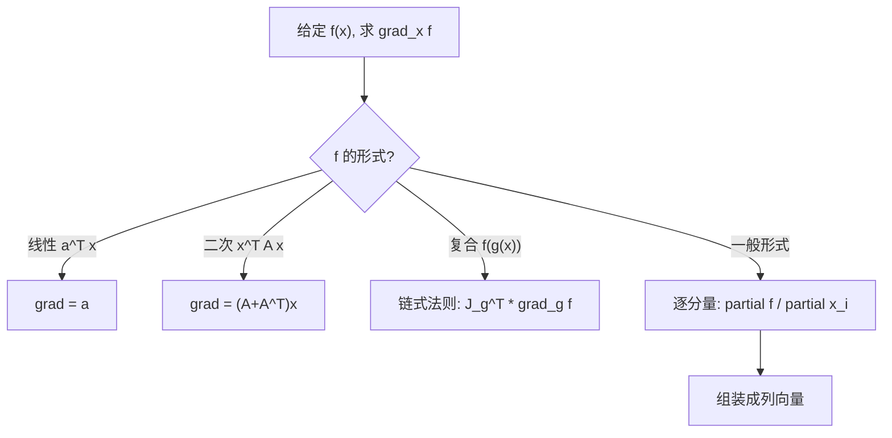

# 第4章 矩阵与向量微积分 (Matrix Calculus)

> **作者**：kyksj-1
> **风格致敬**：Gilbert Strang × 3Blue1Brown

---

## 本章导读

在优化、机器学习和物理学中，我们经常需要对包含向量和矩阵的表达式**求导**。例如：

- 梯度下降：$\mathbf{w} \leftarrow \mathbf{w} - \alpha \nabla_\mathbf{w} L$ 中的 $\nabla_\mathbf{w} L$ 如何计算？
- 正规方程：最小二乘的解 $\hat{\mathbf{x}} = (A^TA)^{-1}A^T\mathbf{b}$ 是怎么推导出来的？
- 神经网络反向传播中矩阵导数如何运作？

然而，**大多数线性代数和微积分教材对矩阵求导几乎不讲**。本章系统填补这一空白。

> **核心思想**：矩阵微积分的规则并不神秘——它们是标量微积分规则在更高维度上的**自然推广**。

---

## 4.1 预备知识：导数的本质

### 4.1.1 标量导数回顾

对于 $f: \mathbb{R} \to \mathbb{R}$，导数 $f'(x)$ 度量的是 $x$ 的微小变化 $\delta x$ 引起 $f$ 的微小变化 $\delta f$ 之间的**线性关系**：

$$
\delta f \approx f'(x) \cdot \delta x
$$

### 4.1.2 向高维推广的思路

当自变量或因变量是向量/矩阵时，"导数"仍然描述的是**输入微小变化与输出微小变化之间的线性映射**。

| 自变量 | 因变量 | "导数"的形状 | 名称 |
|--------|--------|-------------|------|
| 标量 $x$ | 标量 $f$ | 标量 | 普通导数 |
| 向量 $\mathbf{x} \in \mathbb{R}^n$ | 标量 $f$ | 向量 $\in \mathbb{R}^n$ | **梯度** |
| 向量 $\mathbf{x} \in \mathbb{R}^n$ | 向量 $\mathbf{f} \in \mathbb{R}^m$ | 矩阵 $\in \mathbb{R}^{m \times n}$ | **Jacobian** |
| 矩阵 $X \in \mathbb{R}^{m\times n}$ | 标量 $f$ | 矩阵 $\in \mathbb{R}^{m\times n}$ | **矩阵梯度** |

### 4.1.3 布局约定

矩阵微积分有两种常见的**布局约定**（layout convention）：

- **分子布局**（numerator layout）：结果的形状以分子（因变量）为准
- **分母布局**（denominator layout）：结果的形状以分母（自变量）为准

本章统一采用**分母布局**（也称为 Jacobian 表示法），这是机器学习和优化领域最常用的约定：

$$
\frac{\partial f}{\partial \mathbf{x}} \text{ 是一个行向量（$1 \times n$）} \quad \text{（分母布局）}
$$

而梯度 $\nabla_\mathbf{x} f$ 定义为其转置——一个**列向量**。

> **提示**：不同教材的约定可能不同。阅读任何矩阵微积分公式时，**首先确认布局约定**。

---

## 4.2 标量对向量求导（梯度）

### 4.2.1 定义

设 $f: \mathbb{R}^n \to \mathbb{R}$ 是标量函数，$\mathbf{x} = (x_1, x_2, \ldots, x_n)^T$。

**梯度**定义为：

$$
\boxed{\nabla_\mathbf{x} f = \begin{pmatrix} \frac{\partial f}{\partial x_1} \\ \frac{\partial f}{\partial x_2} \\ \vdots \\ \frac{\partial f}{\partial x_n} \end{pmatrix} \in \mathbb{R}^n}
$$

梯度的方向是函数**增长最快的方向**，其模是最大方向导数。

### 4.2.2 基本公式

以下是最常用的梯度公式。令 $\mathbf{a}$ 为常向量，$A$ 为常矩阵，$\mathbf{x}$ 为变量向量。

| 函数 $f(\mathbf{x})$ | 梯度 $\nabla_\mathbf{x} f$ | 推导提示 |
|----------------------|---------------------------|---------|
| $\mathbf{a}^T\mathbf{x}$ | $\mathbf{a}$ | 逐分量求导 |
| $\mathbf{x}^T\mathbf{a}$ | $\mathbf{a}$ | 同上（标量转置等于自身） |
| $\mathbf{x}^T\mathbf{x}$ | $2\mathbf{x}$ | $f = \sum x_i^2$，$\partial f/\partial x_i = 2x_i$ |
| $\mathbf{x}^T A \mathbf{x}$ | $(A + A^T)\mathbf{x}$ | 见下方详细推导 |
| $\mathbf{x}^T A \mathbf{x}$（$A$ 对称） | $2A\mathbf{x}$ | $A = A^T$ 时 |
| $\|\mathbf{x} - \mathbf{a}\|^2$ | $2(\mathbf{x} - \mathbf{a})$ | 展开并求导 |
| $\mathbf{a}^T X \mathbf{b}$ | 此为标量对矩阵求导，见4.4节 | — |

### 4.2.3 详细推导：$\nabla_\mathbf{x}(\mathbf{x}^T A \mathbf{x})$

这是最重要也最常用的梯度公式之一。

**方法一：逐分量求导（最直接）**

$$
f(\mathbf{x}) = \mathbf{x}^T A \mathbf{x} = \sum_{i=1}^{n}\sum_{j=1}^{n} a_{ij} x_i x_j
$$

$$
\frac{\partial f}{\partial x_k} = \sum_{j=1}^{n} a_{kj} x_j + \sum_{i=1}^{n} a_{ik} x_i = (A\mathbf{x})_k + (A^T\mathbf{x})_k
$$

因此：

$$
\nabla_\mathbf{x}(\mathbf{x}^T A \mathbf{x}) = A\mathbf{x} + A^T\mathbf{x} = (A + A^T)\mathbf{x}
$$

当 $A$ 对称（$A = A^T$）时，简化为 $2A\mathbf{x}$。$\blacksquare$

**方法二：微分法**

令 $\mathbf{x} \to \mathbf{x} + \delta\mathbf{x}$：

$$
f(\mathbf{x} + \delta\mathbf{x}) = (\mathbf{x} + \delta\mathbf{x})^T A (\mathbf{x} + \delta\mathbf{x})
$$
$$
= \mathbf{x}^TA\mathbf{x} + \delta\mathbf{x}^T A \mathbf{x} + \mathbf{x}^T A \delta\mathbf{x} + \underbrace{\delta\mathbf{x}^T A \delta\mathbf{x}}_{\text{二阶小量}}
$$

线性部分为 $\delta f = \delta\mathbf{x}^T A \mathbf{x} + \mathbf{x}^T A \delta\mathbf{x} = \delta\mathbf{x}^T(A + A^T)\mathbf{x}$

由 $\delta f = \nabla f^T \delta\mathbf{x}$ 比较得 $\nabla f = (A + A^T)\mathbf{x}$。$\blacksquare$

### 4.2.4 应用：最小二乘的梯度推导

最小化 $f(\mathbf{x}) = \|A\mathbf{x} - \mathbf{b}\|^2$。

展开：$f = (A\mathbf{x} - \mathbf{b})^T(A\mathbf{x} - \mathbf{b}) = \mathbf{x}^TA^TA\mathbf{x} - 2\mathbf{b}^TA\mathbf{x} + \mathbf{b}^T\mathbf{b}$

求梯度：

$$
\nabla_\mathbf{x} f = 2A^TA\mathbf{x} - 2A^T\mathbf{b}
$$

令梯度为零：$A^TA\mathbf{x} = A^T\mathbf{b}$

这就是**正规方程**（normal equations），其解为 $\hat{\mathbf{x}} = (A^TA)^{-1}A^T\mathbf{b}$。

---

## 4.3 向量对向量求导（Jacobian 矩阵）

### 4.3.1 定义

设 $\mathbf{f}: \mathbb{R}^n \to \mathbb{R}^m$，即 $\mathbf{f}(\mathbf{x}) = (f_1(\mathbf{x}), f_2(\mathbf{x}), \ldots, f_m(\mathbf{x}))^T$。

**Jacobian 矩阵**定义为：

$$
\boxed{J = \frac{\partial \mathbf{f}}{\partial \mathbf{x}} = \begin{pmatrix}
\frac{\partial f_1}{\partial x_1} & \frac{\partial f_1}{\partial x_2} & \cdots & \frac{\partial f_1}{\partial x_n} \\
\frac{\partial f_2}{\partial x_1} & \frac{\partial f_2}{\partial x_2} & \cdots & \frac{\partial f_2}{\partial x_n} \\
\vdots & \vdots & \ddots & \vdots \\
\frac{\partial f_m}{\partial x_1} & \frac{\partial f_m}{\partial x_2} & \cdots & \frac{\partial f_m}{\partial x_n}
\end{pmatrix} \in \mathbb{R}^{m \times n}}
$$

Jacobian 矩阵的第 $i$ 行是 $f_i$ 的梯度的转置。

### 4.3.2 基本公式

| 函数 $\mathbf{f}(\mathbf{x})$ | Jacobian $\frac{\partial \mathbf{f}}{\partial \mathbf{x}}$ |
|-------------------------------|----------------------------------------------------------|
| $A\mathbf{x}$ | $A$ |
| $A\mathbf{x} + \mathbf{b}$ | $A$ |
| $\mathbf{x}$ | $I$ |

### 4.3.3 Jacobian 行列式与变量替换

Jacobian 行列式 $|J| = |\det(J)|$ 在**多重积分的变量替换**中至关重要：

$$
\int_{\Omega'} f(\mathbf{y}) \, d\mathbf{y} = \int_{\Omega} f(\mathbf{g}(\mathbf{x})) |J_\mathbf{g}(\mathbf{x})| \, d\mathbf{x}
$$

**例**：极坐标变换 $x = r\cos\theta$，$y = r\sin\theta$

$$
J = \begin{pmatrix} \cos\theta & -r\sin\theta \\ \sin\theta & r\cos\theta \end{pmatrix}, \quad |J| = r
$$

因此 $dx\,dy = r\,dr\,d\theta$。

---

## 4.4 标量对矩阵求导

### 4.4.1 定义

设 $f: \mathbb{R}^{m\times n} \to \mathbb{R}$ 是矩阵的标量函数。

$$
\boxed{\frac{\partial f}{\partial X} = \begin{pmatrix}
\frac{\partial f}{\partial x_{11}} & \frac{\partial f}{\partial x_{12}} & \cdots & \frac{\partial f}{\partial x_{1n}} \\
\vdots & \vdots & \ddots & \vdots \\
\frac{\partial f}{\partial x_{m1}} & \frac{\partial f}{\partial x_{m2}} & \cdots & \frac{\partial f}{\partial x_{mn}}
\end{pmatrix} \in \mathbb{R}^{m\times n}}
$$

即对矩阵的每个元素分别求导，结果保持原矩阵的形状。

### 4.4.2 常用公式

| 函数 $f(X)$ | 导数 $\frac{\partial f}{\partial X}$ | 条件 |
|------------|--------------------------------------|------|
| $\text{tr}(X)$ | $I$ | — |
| $\text{tr}(AX)$ | $A^T$ | $A$ 为常矩阵 |
| $\text{tr}(X^TA)$ | $A$ | $A$ 为常矩阵 |
| $\text{tr}(AXB)$ | $A^TB^T$ | $A, B$ 为常矩阵 |
| $\text{tr}(X^TAX)$ | $(A + A^T)X$ | $A$ 为常矩阵 |
| $\det(X)$ | $\det(X)(X^{-1})^T = \text{adj}(X)^T$ | $X$ 可逆 |
| $\ln\det(X)$ | $(X^{-1})^T = (X^T)^{-1}$ | $X$ 正定 |
| $\mathbf{a}^T X \mathbf{b}$ | $\mathbf{a}\mathbf{b}^T$ | $\mathbf{a}, \mathbf{b}$ 为常向量 |
| $\mathbf{a}^T X^T \mathbf{b}$ | $\mathbf{b}\mathbf{a}^T$ | $\mathbf{a}, \mathbf{b}$ 为常向量 |

### 4.4.3 迹技巧（Trace Trick）

许多标量对矩阵的求导可以通过**迹**来简化。核心利用以下性质：

1. $\mathbf{x}^T A \mathbf{x} = \text{tr}(\mathbf{x}^T A \mathbf{x}) = \text{tr}(A\mathbf{x}\mathbf{x}^T)$（标量等于其迹）
2. $\text{tr}(ABC) = \text{tr}(BCA) = \text{tr}(CAB)$（迹的轮换性）
3. $\text{tr}(A^T) = \text{tr}(A)$

**推导示例**：$\frac{\partial}{\partial X}\text{tr}(AXB)$

$$
\delta f = \text{tr}(A \cdot \delta X \cdot B) = \text{tr}(BA \cdot \delta X)
$$

利用 $\delta f = \text{tr}\left(\left(\frac{\partial f}{\partial X}\right)^T \delta X\right)$，比较得：

$$
\frac{\partial f}{\partial X} = (BA)^T = A^TB^T \quad \blacksquare
$$

---

## 4.5 链式法则（Chain Rule）

### 4.5.1 标量情形回顾

$$
\frac{dz}{dx} = \frac{dz}{dy} \cdot \frac{dy}{dx}
$$

### 4.5.2 向量链式法则

设 $\mathbf{y} = \mathbf{g}(\mathbf{x})$，$f = h(\mathbf{y})$，则：

$$
\boxed{\nabla_\mathbf{x} f = J_\mathbf{g}^T \nabla_\mathbf{y} f}
$$

即 $\frac{\partial f}{\partial \mathbf{x}} = \frac{\partial f}{\partial \mathbf{y}} \cdot \frac{\partial \mathbf{y}}{\partial \mathbf{x}}$（分母布局）

### 4.5.3 神经网络中的反向传播

考虑一个简单的两层网络：

$$
\mathbf{h} = \sigma(W_1 \mathbf{x} + \mathbf{b}_1), \quad y = \mathbf{w}_2^T \mathbf{h} + b_2
$$

损失函数 $L = \frac{1}{2}(y - t)^2$。

**反向传播就是链式法则的系统应用**：

$$
\frac{\partial L}{\partial W_1} = \frac{\partial L}{\partial y} \cdot \frac{\partial y}{\partial \mathbf{h}} \cdot \frac{\partial \mathbf{h}}{\partial (W_1\mathbf{x})} \cdot \frac{\partial (W_1\mathbf{x})}{\partial W_1}
$$


---

## 4.6 矩阵微积分的 SOP

### 4.6.1 求标量对向量梯度的 SOP



### 4.6.2 求标量对矩阵梯度的 SOP

1. 将 $f(X)$ 用**迹**表示（利用 $a = \text{tr}(a)$ 和轮换性）
2. 对 $X$ 取微分：$df = \text{tr}(\cdots \, dX \, \cdots)$
3. 利用轮换性将 $dX$ 移到最右边：$df = \text{tr}(G^T \, dX)$
4. 读出 $\frac{\partial f}{\partial X} = G$

**例**：求 $\frac{\partial}{\partial X}\|AX - B\|_F^2$

$$
f = \text{tr}((AX-B)^T(AX-B)) = \text{tr}(X^TA^TAX - X^TA^TB - B^TAX + B^TB)
$$

取微分：

$$
df = \text{tr}(dX^T A^TAX + X^TA^TA \, dX - dX^T A^TB - B^TA \, dX)
$$

利用 $\text{tr}(C^T) = \text{tr}(C)$：

$$
df = \text{tr}((A^TAX)^T dX + X^TA^TA \, dX - (A^TB)^T dX - B^TA \, dX)
$$

$$
= \text{tr}((2A^TAX - 2A^TB)^T \, dX)
$$

因此：$\frac{\partial f}{\partial X} = 2A^TAX - 2A^TB = 2A^T(AX - B)$

令梯度为零：$A^TAX = A^TB$，即 $X = (A^TA)^{-1}A^TB$。

---

## 4.7 常用公式速查表

以下汇总本章所有核心公式，供快速查阅。

### 标量对向量（梯度）

| # | $f(\mathbf{x})$ | $\nabla_\mathbf{x} f$ |
|---|-----------------|----------------------|
| 1 | $\mathbf{a}^T\mathbf{x}$ | $\mathbf{a}$ |
| 2 | $\mathbf{x}^T\mathbf{x} = \|\mathbf{x}\|^2$ | $2\mathbf{x}$ |
| 3 | $\mathbf{x}^TA\mathbf{x}$ ($A$ 对称) | $2A\mathbf{x}$ |
| 4 | $\mathbf{x}^TA\mathbf{x}$ ($A$ 一般) | $(A+A^T)\mathbf{x}$ |
| 5 | $\|A\mathbf{x}-\mathbf{b}\|^2$ | $2A^T(A\mathbf{x}-\mathbf{b})$ |
| 6 | $\mathbf{a}^T\mathbf{x}\mathbf{x}^T\mathbf{b}$ | $\mathbf{a}(\mathbf{b}^T\mathbf{x}) + \mathbf{b}(\mathbf{a}^T\mathbf{x})$ |
| 7 | $\sigma(\mathbf{w}^T\mathbf{x})$ | $\sigma'(\mathbf{w}^T\mathbf{x})\mathbf{w}$ |

### 标量对矩阵

| # | $f(X)$ | $\frac{\partial f}{\partial X}$ |
|---|--------|-------------------------------|
| 1 | $\text{tr}(AX)$ | $A^T$ |
| 2 | $\text{tr}(X^TA)$ | $A$ |
| 3 | $\text{tr}(AXB)$ | $A^TB^T$ |
| 4 | $\text{tr}(X^TAX)$ ($A$ 对称) | $2AX$ |
| 5 | $\|AX-B\|_F^2$ | $2A^T(AX-B)$ |
| 6 | $\det(X)$ | $\det(X)(X^{-T})$ |
| 7 | $\ln\det(X)$ | $X^{-T}$ |

---

## 4.8 编程实践

### 4.8.1 数值验证梯度

```python
import numpy as np

def numerical_gradient(f, x, eps=1e-7):
    """
    用有限差分法数值计算梯度。

    参数:
        f: 标量函数 f(x)
        x: numpy 数组（向量或矩阵）
        eps: 扰动大小

    返回:
        grad: 与 x 同形状的梯度数组
    """
    grad = np.zeros_like(x, dtype=float)
    it = np.nditer(x, flags=['multi_index'])
    while not it.finished:
        idx = it.multi_index
        old_val = x[idx]

        x[idx] = old_val + eps
        f_plus = f(x)

        x[idx] = old_val - eps
        f_minus = f(x)

        grad[idx] = (f_plus - f_minus) / (2 * eps)
        x[idx] = old_val
        it.iternext()

    return grad


# ============================================================
# 验证: grad(x^T A x) = (A + A^T)x
# ============================================================
A = np.array([[3.0, 1.0],
              [2.0, 4.0]])
x = np.array([1.0, 2.0])

# 解析梯度
analytical_grad = (A + A.T) @ x

# 数值梯度
f = lambda v: v @ A @ v
numerical_grad = numerical_gradient(f, x.copy())

print("=== 验证 x^T A x 的梯度 ===")
print(f"解析梯度: {analytical_grad}")
print(f"数值梯度: {numerical_grad}")
print(f"差异: {np.linalg.norm(analytical_grad - numerical_grad):.2e}")


# ============================================================
# 验证: grad(||Ax - b||^2) = 2 A^T (Ax - b)
# ============================================================
A_ls = np.array([[1.0, 2.0], [3.0, 4.0], [5.0, 6.0]])
b = np.array([1.0, 2.0, 3.0])
x_ls = np.array([0.5, -0.3])

analytical_grad_ls = 2 * A_ls.T @ (A_ls @ x_ls - b)
f_ls = lambda v: np.sum((A_ls @ v - b)**2)
numerical_grad_ls = numerical_gradient(f_ls, x_ls.copy())

print("\n=== 验证 ||Ax-b||^2 的梯度 ===")
print(f"解析梯度: {analytical_grad_ls}")
print(f"数值梯度: {numerical_grad_ls}")
print(f"差异: {np.linalg.norm(analytical_grad_ls - numerical_grad_ls):.2e}")


# ============================================================
# 验证矩阵梯度: d/dX tr(AXB) = A^T B^T
# ============================================================
A_m = np.array([[1.0, 2.0], [3.0, 4.0]])
B_m = np.array([[5.0, 6.0], [7.0, 8.0]])
X_m = np.array([[0.1, 0.2], [0.3, 0.4]])

analytical_grad_m = A_m.T @ B_m.T
f_m = lambda X: np.trace(A_m @ X @ B_m)
numerical_grad_m = numerical_gradient(f_m, X_m.copy())

print("\n=== 验证 tr(AXB) 的矩阵梯度 ===")
print(f"解析梯度:\n{analytical_grad_m}")
print(f"数值梯度:\n{numerical_grad_m}")
print(f"差异: {np.linalg.norm(analytical_grad_m - numerical_grad_m):.2e}")
```

### 4.8.2 与 PyTorch 自动微分对比

```python
import numpy as np

# 如果安装了 PyTorch，可以用自动微分验证
try:
    import torch

    # 验证 x^T A x 的梯度
    A_t = torch.tensor([[3.0, 1.0], [2.0, 4.0]])
    x_t = torch.tensor([1.0, 2.0], requires_grad=True)

    f_t = x_t @ A_t @ x_t
    f_t.backward()

    print("=== PyTorch 自动微分验证 ===")
    print(f"自动微分梯度: {x_t.grad.numpy()}")
    print(f"解析梯度 (A+A^T)x: {((A_t + A_t.T) @ x_t).detach().numpy()}")

    # 验证正规方程的梯度
    A_ls_t = torch.tensor([[1.0, 2.0], [3.0, 4.0], [5.0, 6.0]])
    b_t = torch.tensor([1.0, 2.0, 3.0])
    x_ls_t = torch.tensor([0.5, -0.3], requires_grad=True)

    loss = torch.sum((A_ls_t @ x_ls_t - b_t)**2)
    loss.backward()

    print(f"\n||Ax-b||^2 的自动微分梯度: {x_ls_t.grad.numpy()}")
    print(f"解析梯度 2A^T(Ax-b): {(2 * A_ls_t.T @ (A_ls_t @ x_ls_t - b_t)).detach().numpy()}")

except ImportError:
    print("PyTorch 未安装，跳过自动微分验证")
    print("安装命令: pip install torch")
```

### 4.8.3 梯度下降实现

```python
import numpy as np
import matplotlib.pyplot as plt

def gradient_descent_quadratic(A, b, x0, lr=0.01, max_iter=100, tol=1e-8):
    """
    用梯度下降最小化 f(x) = ||Ax - b||^2。

    参数:
        A: m x n 矩阵
        b: m 维目标向量
        x0: 初始点
        lr: 学习率
        max_iter: 最大迭代次数
        tol: 收敛容差

    返回:
        x_history: 迭代轨迹
        f_history: 损失历史
    """
    x = x0.copy().astype(float)
    x_history = [x.copy()]
    f_history = [np.sum((A @ x - b)**2)]

    for i in range(max_iter):
        grad = 2 * A.T @ (A @ x - b)  # 解析梯度
        x = x - lr * grad
        loss = np.sum((A @ x - b)**2)

        x_history.append(x.copy())
        f_history.append(loss)

        if np.linalg.norm(grad) < tol:
            print(f"第 {i+1} 步收敛")
            break

    return np.array(x_history), np.array(f_history)


# ============================================================
# 示例：二维最小二乘问题
# ============================================================
A = np.array([[1, 0], [0, 2], [1, 1]], dtype=float)
b = np.array([1, 2, 2], dtype=float)

# 精确解（正规方程）
x_exact = np.linalg.lstsq(A, b, rcond=None)[0]
print(f"正规方程精确解: {x_exact}")

# 梯度下降
x0 = np.array([0.0, 0.0])
x_hist, f_hist = gradient_descent_quadratic(A, b, x0, lr=0.1, max_iter=200)

# 可视化
fig, axes = plt.subplots(1, 2, figsize=(14, 5))

# 损失曲线
axes[0].semilogy(f_hist, 'b-', linewidth=2)
axes[0].set_xlabel('Iteration')
axes[0].set_ylabel('Loss ||Ax-b||^2')
axes[0].set_title('Convergence of Gradient Descent')
axes[0].grid(True, alpha=0.3)

# 等高线与轨迹
ax = axes[1]
x1_range = np.linspace(-0.5, 2, 100)
x2_range = np.linspace(-0.5, 2, 100)
X1, X2 = np.meshgrid(x1_range, x2_range)
Z = np.zeros_like(X1)
for i in range(X1.shape[0]):
    for j in range(X1.shape[1]):
        v = np.array([X1[i,j], X2[i,j]])
        Z[i,j] = np.sum((A @ v - b)**2)

ax.contour(X1, X2, Z, levels=30, cmap='coolwarm', alpha=0.6)
ax.plot(x_hist[:, 0], x_hist[:, 1], 'ko-', markersize=3, linewidth=1, label='GD trajectory')
ax.plot(x_exact[0], x_exact[1], 'r*', markersize=15, label='Exact solution')
ax.set_xlabel('x1')
ax.set_ylabel('x2')
ax.set_title('Gradient Descent on ||Ax-b||^2')
ax.legend()
ax.set_aspect('equal')

plt.tight_layout()
plt.savefig('ch4_gradient_descent.png', dpi=150, bbox_inches='tight')
plt.show()
```

---

## 4.9 Key Takeaway

| 概念 | 核心要点 |
|------|---------|
| 梯度 $\nabla_\mathbf{x} f$ | 标量对向量求导，结果是列向量 |
| $\nabla(\mathbf{a}^T\mathbf{x}) = \mathbf{a}$ | 线性函数的梯度是常数 |
| $\nabla(\mathbf{x}^TA\mathbf{x}) = (A+A^T)\mathbf{x}$ | 二次型的核心梯度公式 |
| Jacobian 矩阵 | 向量对向量求导，$m\times n$ 矩阵 |
| 矩阵梯度 | 标量对矩阵求导，保持原矩阵形状 |
| 迹技巧 | 用 tr() 统一标量函数，利用轮换性求导 |
| 链式法则 | $\nabla_\mathbf{x} f = J^T \nabla_\mathbf{y} f$ |
| 正规方程推导 | 令 $\nabla \|A\mathbf{x}-\mathbf{b}\|^2 = 0$ |
| 布局约定 | 本章使用分母布局（机器学习标准） |

---

## 习题

### 概念理解

**4.1** 解释：为什么 $\nabla_\mathbf{x}(\mathbf{x}^T A \mathbf{x})$ 中我们要求 $A$ 对称才能得到 $2A\mathbf{x}$？如果 $A$ 不对称，结果有什么不同？

**4.2** 在分子布局和分母布局下，$\frac{\partial(\mathbf{a}^T\mathbf{x})}{\partial \mathbf{x}}$ 分别是什么形状？

### 计算练习

**4.3** 手动计算以下梯度：
  - (a) $f(\mathbf{x}) = (\mathbf{x} - \mathbf{a})^T B (\mathbf{x} - \mathbf{a})$，其中 $B$ 对称
  - (b) $f(\mathbf{x}) = \ln(\mathbf{a}^T\mathbf{x})$
  - (c) $f(\mathbf{x}) = \frac{\mathbf{x}^TA\mathbf{x}}{\mathbf{x}^T\mathbf{x}}$（Rayleigh 商）

**4.4** 计算以下矩阵导数：
  - (a) $\frac{\partial}{\partial X}\text{tr}(X^TX)$
  - (b) $\frac{\partial}{\partial X}\text{tr}((X - A)^T(X - A))$

**4.5** 对函数 $f(X) = \ln\det(X)$（$X$ 正定），用微分法推导 $\frac{\partial f}{\partial X} = X^{-T}$。
  *提示：利用 $d(\det X) = \det(X)\text{tr}(X^{-1}dX)$*

**4.6** 推导岭回归（Ridge Regression）的闭式解。最小化 $f(\mathbf{x}) = \|A\mathbf{x} - \mathbf{b}\|^2 + \alpha\|\mathbf{x}\|^2$。

### 思考题

**4.7** 在神经网络中，设单层全连接层为 $\mathbf{y} = W\mathbf{x} + \mathbf{b}$，损失函数 $L = \frac{1}{2}\|\mathbf{y} - \mathbf{t}\|^2$。
  - 推导 $\frac{\partial L}{\partial W}$ 和 $\frac{\partial L}{\partial \mathbf{b}}$
  - 解释为什么 $\frac{\partial L}{\partial W}$ 是一个外积的形式

**4.8** 证明：若 $f(\mathbf{x})$ 的 Hessian 矩阵（二阶导数矩阵）$H = \nabla^2 f$ 正定，则 $f$ 在该点取到严格局部极小值。将此与第3章的二次型正定性联系起来。

### 编程题

**4.9** 实现通用的数值梯度验证器（gradient checker）：
  - 输入：函数 $f$、解析梯度函数 $g$、测试点 $\mathbf{x}$
  - 计算数值梯度（中心差分）与解析梯度的**相对误差**
  - 对以下函数进行测试：$\mathbf{x}^TA\mathbf{x}$、$\|A\mathbf{x}-\mathbf{b}\|^2$、$\sigma(\mathbf{w}^T\mathbf{x})$

**4.10** 实现一个简单的两层神经网络，手动实现前向传播和反向传播（不使用自动微分框架）：
  - 网络结构：输入层(2) → 隐藏层(10, ReLU) → 输出层(1)
  - 用矩阵微积分推导所有梯度
  - 在一个简单数据集上训练（如 XOR 问题）
  - 用数值梯度验证你的解析梯度实现

---

> **下一章预告**：我们已经分别学习了特征值/特征向量（Ch1）、相似对角化（Ch2）、二次型（Ch3）和矩阵微积分（Ch4）。它们之间有什么深层联系？坐标变换如何将它们统一在一个框架下？这就是第5章**坐标变换与统一视角**的主题。
