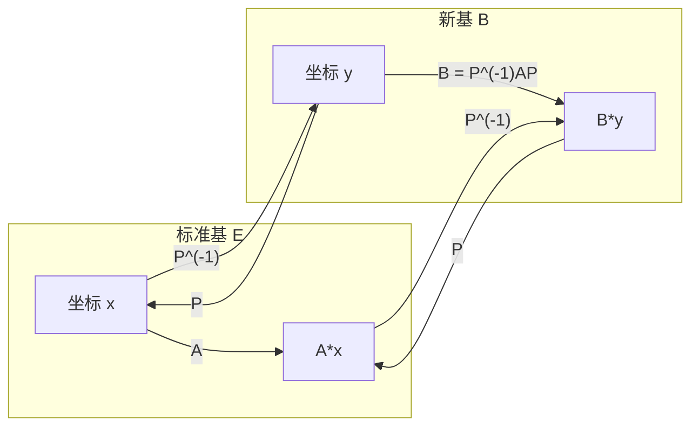
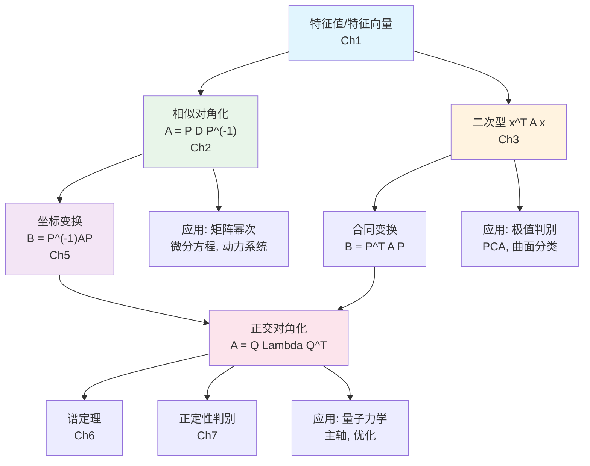
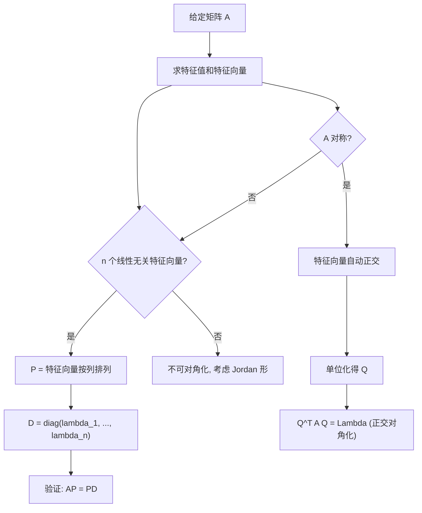
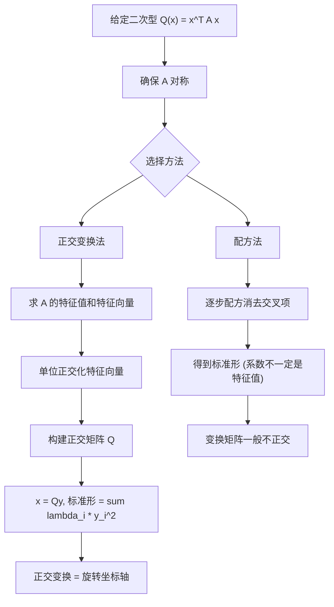
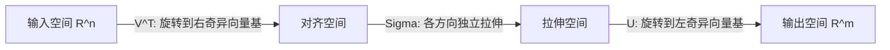
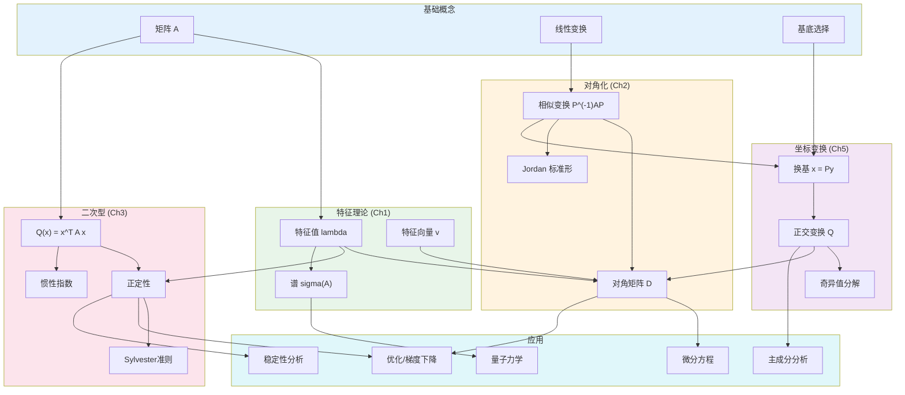

# 第5章 坐标变换与统一视角 (Change of Basis and Unified Perspective)

> **作者**：kyksj-1
> **风格致敬**：Gilbert Strang × 3Blue1Brown

---

## 本章导读

前四章分别介绍了特征值/特征向量、相似对角化、二次型和矩阵微积分。它们各有侧重，但实际上被一根红线贯穿——**坐标变换**。

本章的目标是：

1. 系统讲解**线性坐标变换**的数学机制
2. 用**统一框架**串联 Ch1-Ch3 的核心概念
3. 从多个角度给出坐标变换的 SOP
4. 通过大量 mermaid 图揭示深层联系

---

## 5.1 线性坐标变换的数学机制

### 5.1.1 基底与坐标

向量 $\mathbf{v}$ 是"客观存在"的几何对象，但要用数字表示它，必须选择一组**基底**。

设标准基为 $\mathcal{E} = \{\mathbf{e}_1, \ldots, \mathbf{e}_n\}$，新基为 $\mathcal{B} = \{\mathbf{b}_1, \ldots, \mathbf{b}_n\}$。

同一向量 $\mathbf{v}$ 在两组基底下有不同的坐标表示：

$$
\mathbf{v} = x_1\mathbf{e}_1 + \cdots + x_n\mathbf{e}_n = y_1\mathbf{b}_1 + \cdots + y_n\mathbf{b}_n
$$

记 $[\mathbf{v}]_\mathcal{E} = \mathbf{x}$，$[\mathbf{v}]_\mathcal{B} = \mathbf{y}$。

### 5.1.2 过渡矩阵

设 $P = [\mathbf{b}_1 | \mathbf{b}_2 | \cdots | \mathbf{b}_n]$ 是将新基向量按列排列的矩阵（在标准基下的坐标）。则：

$$
\boxed{\mathbf{x} = P\mathbf{y} \quad \Longleftrightarrow \quad \mathbf{y} = P^{-1}\mathbf{x}}
$$

- $P$：从新基坐标 → 标准基坐标（"翻译出去"）
- $P^{-1}$：从标准基坐标 → 新基坐标（"翻译回来"）

### 5.1.3 线性变换的基底变换

线性变换 $T$ 在标准基下的矩阵为 $A$，在新基 $\mathcal{B}$ 下的矩阵为 $B$。则：

$$
\boxed{B = P^{-1}AP}
$$

这就是**相似变换**（第2章）的本质：$A$ 和 $B$ 是**同一变换**在不同基底下的表示。



---

## 5.2 三种变换的统一

### 5.2.1 相似变换、合同变换与正交变换

在线性代数中，有三种核心的基底变换操作，它们的目标和约束各不相同：

| 变换类型 | 公式 | 约束 | 目标 | 保持不变的量 |
|---------|------|------|------|------------|
| **相似变换** | $B = P^{-1}AP$ | $P$ 可逆 | 简化线性变换 | 特征值、迹、行列式 |
| **合同变换** | $B = P^TAP$ | $P$ 可逆 | 简化二次型 | 惯性指数 |
| **正交变换** | $B = Q^TAQ = Q^{-1}AQ$ | $Q^TQ = I$ | 同时简化变换和二次型 | 全部 |

> **关键洞见**：对于**正交矩阵** $Q$，$Q^{-1} = Q^T$，所以相似变换和合同变换**合二为一**。这就是为什么对称矩阵的正交对角化如此强大——它同时完成了对角化和二次型标准化。

### 5.2.2 统一关系图



### 5.2.3 详细对照

考虑对称矩阵 $A$ 及其正交对角化 $A = Q\Lambda Q^T$：

**从对角化角度看**（Ch2）：
- $Q^{-1}AQ = \Lambda$
- 在特征基 $\{q_1, \ldots, q_n\}$ 下，变换 $A$ 变成了纯拉伸

**从二次型角度看**（Ch3）：
- $Q^TAQ = \Lambda$
- 变量替换 $\mathbf{x} = Q\mathbf{y}$ 将 $\mathbf{x}^TA\mathbf{x}$ 化为 $\sum \lambda_i y_i^2$

**从坐标变换角度看**（Ch5）：
- 旋转坐标轴到特征方向
- 新坐标系下一切都"解耦"了

---

## 5.3 坐标变换的 SOP（多角度）

### 5.3.1 角度一：对角化一个线性变换

**目标**：给定 $A$，找到基底使变换最简。



### 5.3.2 角度二：标准化一个二次型

**目标**：消去 $\mathbf{x}^TA\mathbf{x}$ 中的交叉项。



### 5.3.3 角度三：解耦一个方程组

**目标**：将耦合的微分方程组 $\dot{\mathbf{x}} = A\mathbf{x}$ 化为独立方程。

令 $\mathbf{x} = P\mathbf{y}$（$P$ 为特征向量矩阵），则：

$$
P\dot{\mathbf{y}} = AP\mathbf{y} \quad \Rightarrow \quad \dot{\mathbf{y}} = P^{-1}AP\mathbf{y} = D\mathbf{y}
$$

$$
\dot{y}_i = \lambda_i y_i \quad \Rightarrow \quad y_i(t) = y_i(0) e^{\lambda_i t}
$$

原本 $n$ 个变量耦合的系统，在特征基下变成了 $n$ 个**独立的**一阶 ODE。

### 5.3.4 角度四：主成分分析（PCA）

**目标**：找到数据方差最大的方向。

1. 计算协方差矩阵 $C = \frac{1}{n-1}X^TX$（$C$ 对称半正定）
2. 对 $C$ 正交对角化：$C = Q\Lambda Q^T$
3. 第一主成分 = $\lambda_{\max}$ 对应的特征向量
4. 投影到前 $k$ 个主成分：$Y = XQ_k$（降维）

---

## 5.4 坐标变换的几何理解

### 5.4.1 仿射变换 = 线性变换 + 平移

$$
\mathbf{y} = A\mathbf{x} + \mathbf{b}
$$

可以分解为：
1. $A$ 的线性变换（旋转 + 拉伸 + 反射）
2. 平移 $\mathbf{b}$

### 5.4.2 SVD：最一般的"坐标变换"

任何 $m\times n$ 矩阵 $A$（不必是方阵、不必对称）都有**奇异值分解**（SVD）：

$$
\boxed{A = U\Sigma V^T}
$$

其中 $U$ ($m\times m$ 正交)、$\Sigma$ ($m\times n$ 对角)、$V$ ($n\times n$ 正交)。

几何含义：$A$ 的作用 = 旋转($V^T$) → 拉伸($\Sigma$) → 旋转($U$)



SVD 统一了以下所有概念：

| 条件 | SVD 特化形式 |
|------|------------|
| $A$ 方阵、可对角化 | 对角化 $PDP^{-1}$ |
| $A$ 对称 | 谱分解 $Q\Lambda Q^T$ |
| $A$ 正交 | $U = A$, $\Sigma = I$, $V = I$ |
| $A$ 正定 | Cholesky $LL^T$ 或 $Q\Lambda Q^T$ ($\lambda_i > 0$) |

---

## 5.5 各概念之间的深层关系总图

### 5.5.1 概念关系大图



### 5.5.2 文字总结

1. **特征值/特征向量**（Ch1）是一切的起点：它们找到了矩阵"最自然的"方向。

2. **对角化**（Ch2）= 在特征方向组成的基底下表示线性变换 → 变换解耦为独立的缩放。

3. **二次型**（Ch3）= 从"变换"转向"能量/度量"的视角 → 正定性 = 能量面的形状 → 特征值 = 各主轴的曲率。

4. **坐标变换**（Ch5）= 统一工具 → 相似变换处理线性变换，合同变换处理二次型，正交变换同时处理两者。

5. **一条金线**：选择特征向量作为基底 → 线性变换对角化 → 二次型标准化 → 微分方程解耦 → 数据降维 → 量子态分解。

---

## 5.6 编程实践

### 5.6.1 坐标变换全流程可视化

```python
import numpy as np
import matplotlib.pyplot as plt

def visualize_change_of_basis(A, title="Change of Basis"):
    """
    可视化坐标变换的完整流程：标准基 → 特征基。

    参数:
        A: 2x2 对称矩阵
        title: 图标题
    """
    eigenvalues, Q = np.linalg.eigh(A)
    D = np.diag(eigenvalues)

    fig, axes = plt.subplots(1, 3, figsize=(18, 5))

    # 单位圆
    t = np.linspace(0, 2*np.pi, 200)
    circle = np.array([np.cos(t), np.sin(t)])

    # --- 图1：标准基下 A 的作用 ---
    ax = axes[0]
    ellipse = A @ circle
    ax.plot(circle[0], circle[1], 'b-', lw=1.5, label='Unit circle')
    ax.plot(ellipse[0], ellipse[1], 'r-', lw=1.5, label='A * circle')

    # 画标准基
    ax.arrow(0, 0, 1, 0, head_width=0.05, fc='blue', ec='blue', lw=1.5)
    ax.arrow(0, 0, 0, 1, head_width=0.05, fc='blue', ec='blue', lw=1.5)
    ax.text(1.1, 0, 'e1', fontsize=11, color='blue')
    ax.text(0, 1.1, 'e2', fontsize=11, color='blue')

    ax.set_xlim(-4, 4); ax.set_ylim(-4, 4)
    ax.set_aspect('equal'); ax.grid(True, alpha=0.3)
    ax.set_title('Standard basis: A acts\n(coupled)')
    ax.legend(fontsize=9)

    # --- 图2：画出特征基 ---
    ax2 = axes[1]
    ax2.plot(circle[0], circle[1], 'b-', lw=1.5, label='Unit circle')
    ax2.plot(ellipse[0], ellipse[1], 'r-', lw=1.5, label='A * circle')

    colors_ev = ['darkgreen', 'darkviolet']
    for j in range(2):
        v = Q[:, j]
        ax2.arrow(0, 0, v[0]*1.5, v[1]*1.5, head_width=0.06, fc=colors_ev[j],
                  ec=colors_ev[j], lw=2,
                  label=f'Eigenvec (lambda={eigenvalues[j]:.2f})')

    ax2.set_xlim(-4, 4); ax2.set_ylim(-4, 4)
    ax2.set_aspect('equal'); ax2.grid(True, alpha=0.3)
    ax2.set_title('Eigenvectors shown\n(natural axes)')
    ax2.legend(fontsize=9)

    # --- 图3：特征基下 D 的作用 ---
    ax3 = axes[2]
    ellipse_d = D @ circle
    ax3.plot(circle[0], circle[1], 'b-', lw=1.5, label='Unit circle')
    ax3.plot(ellipse_d[0], ellipse_d[1], 'r-', lw=1.5, label='D * circle')

    ax3.arrow(0, 0, 1.5, 0, head_width=0.06, fc='darkgreen', ec='darkgreen', lw=2)
    ax3.arrow(0, 0, 0, 1.5, head_width=0.06, fc='darkviolet', ec='darkviolet', lw=2)
    ax3.text(1.6, 0, f'lambda1={eigenvalues[0]:.2f}', fontsize=10, color='darkgreen')
    ax3.text(0.1, 1.6, f'lambda2={eigenvalues[1]:.2f}', fontsize=10, color='darkviolet')

    ax3.set_xlim(-4, 4); ax3.set_ylim(-4, 4)
    ax3.set_aspect('equal'); ax3.grid(True, alpha=0.3)
    ax3.set_title('Eigenbasis: D acts\n(decoupled scaling)')
    ax3.legend(fontsize=9)

    plt.suptitle(title, fontsize=14, fontweight='bold')
    plt.tight_layout()
    plt.savefig('ch5_change_of_basis.png', dpi=150, bbox_inches='tight')
    plt.show()


# 运行
A = np.array([[5, 2],
              [2, 2]])
visualize_change_of_basis(A, "A=[[5,2],[2,2]]: Standard basis -> Eigenbasis")
```

### 5.6.2 SVD 可视化

```python
import numpy as np
import matplotlib.pyplot as plt

def visualize_svd(A, title="SVD Decomposition"):
    """
    可视化 SVD 的三步分解过程。

    参数:
        A: 2x2 矩阵（可以不对称）
        title: 图标题
    """
    U, S, Vt = np.linalg.svd(A)
    sigma = np.diag(S)

    t = np.linspace(0, 2*np.pi, 200)
    circle = np.array([np.cos(t), np.sin(t)])

    fig, axes = plt.subplots(1, 4, figsize=(20, 4.5))

    # 原始单位圆
    axes[0].plot(circle[0], circle[1], 'b-', lw=2)
    axes[0].set_title('Step 0: Unit circle')

    # V^T 旋转
    step1 = Vt @ circle
    axes[1].plot(step1[0], step1[1], 'g-', lw=2)
    axes[1].set_title('Step 1: V^T (rotate input)')

    # Sigma 拉伸
    step2 = sigma @ step1
    axes[2].plot(step2[0], step2[1], 'orange', lw=2)
    axes[2].set_title(f'Step 2: Sigma (stretch)\nsigma1={S[0]:.2f}, sigma2={S[1]:.2f}')

    # U 旋转
    step3 = U @ step2
    axes[3].plot(step3[0], step3[1], 'r-', lw=2)
    # 验证：直接用 A
    direct = A @ circle
    axes[3].plot(direct[0], direct[1], 'k--', lw=1, alpha=0.5, label='Direct A*circle')
    axes[3].set_title('Step 3: U (rotate output)')
    axes[3].legend(fontsize=8)

    for ax in axes:
        ax.set_xlim(-4, 4); ax.set_ylim(-4, 4)
        ax.set_aspect('equal'); ax.grid(True, alpha=0.3)

    plt.suptitle(title, fontsize=14, fontweight='bold')
    plt.tight_layout()
    plt.savefig('ch5_svd_visualization.png', dpi=150, bbox_inches='tight')
    plt.show()


A = np.array([[3, 1],
              [1, 2]])
visualize_svd(A, "SVD of A=[[3,1],[1,2]]: Rotate -> Stretch -> Rotate")
```

---

## 5.7 Key Takeaway

| 概念 | 核心要点 |
|------|---------|
| 坐标变换 $\mathbf{x} = P\mathbf{y}$ | 同一向量在不同基底下的表示 |
| 相似变换 $P^{-1}AP$ | 同一**线性变换**在不同基底下的矩阵 |
| 合同变换 $P^TAP$ | 同一**二次型**在不同坐标下的矩阵 |
| 正交变换 ($P^{-1} = P^T$) | 相似 = 合同，最"干净"的换基 |
| 对角化 = 选特征基 | 变换解耦，二次型标准化 |
| SVD | 最一般的"旋转-拉伸-旋转"分解 |
| 统一红线 | 特征值 → 对角化 → 标准化 → 解耦 → 应用 |

---

## 习题

### 概念理解

**5.1** 用自己的话解释：为什么正交变换同时是相似变换又是合同变换？这在物理上意味着什么？

**5.2** 设 $A$ 是 $3\times 3$ 实对称矩阵。
  - (a) 从对角化角度描述 $A = Q\Lambda Q^T$ 的含义。
  - (b) 从二次型角度描述 $A = Q\Lambda Q^T$ 的含义。
  - (c) 从 ODE $\dot{\mathbf{x}} = A\mathbf{x}$ 求解角度描述 $A = Q\Lambda Q^T$ 的含义。

**5.3** 解释 SVD 中的三个矩阵 $U$, $\Sigma$, $V^T$ 各代表什么几何操作。为什么 SVD 对非方阵也适用？

### 计算练习

**5.4** 设 $A = \begin{pmatrix} 2 & 1 \\ 1 & 2 \end{pmatrix}$，基 $\mathcal{B} = \{(1,1)^T, (1,-1)^T\}$。
  - (a) 求过渡矩阵 $P$。
  - (b) 求 $A$ 在 $\mathcal{B}$ 下的矩阵表示 $B = P^{-1}AP$。
  - (c) 验证 $B$ 是对角矩阵。

**5.5** 对 $A = \begin{pmatrix} 1 & 3 \\ 2 & 2 \end{pmatrix}$ 进行 SVD 分解。写出 $U$, $\Sigma$, $V^T$，并验证 $A = U\Sigma V^T$。

**5.6** 将微分方程组 $\dot{x}_1 = 3x_1 + x_2$, $\dot{x}_2 = x_1 + 3x_2$ 解耦求解。写出换基后的独立方程和最终的通解。

### 思考题

**5.7** 对于非对称矩阵 $A$，$P^{-1}AP = D$ 和 $P^TAP = D'$ 一般给出不同的结果。举一个具体例子说明两者的区别。什么时候它们一致？

**5.8** PCA 中使用协方差矩阵的特征值分解，而不是直接对数据矩阵做 SVD。
  - 推导两者之间的精确关系。
  - 在实际计算中，哪种方法更稳定？为什么？

### 编程题

**5.9** 编写 PCA 的完整实现：
  - 生成三维高斯分布数据（有明显的主方向）
  - 实现 PCA，计算主成分
  - 分别用特征值分解和 SVD 两种方法实现，验证结果一致
  - 可视化：原始数据（3D）+ 主成分方向 + 投影到前两个主成分的结果（2D）

**5.10** 实现坐标变换的动态演示：
  - 画出标准基网格
  - 画出特征基网格（旋转/倾斜）
  - 动画展示矩阵 $A$ 在标准基和特征基下的变换效果对比

---

> **下一章预告**：正交性是坐标变换中最重要的性质。正交投影、最小二乘、谱定理——这些工具依赖的正是向量的正交结构。第6章将系统展开正交性理论。
