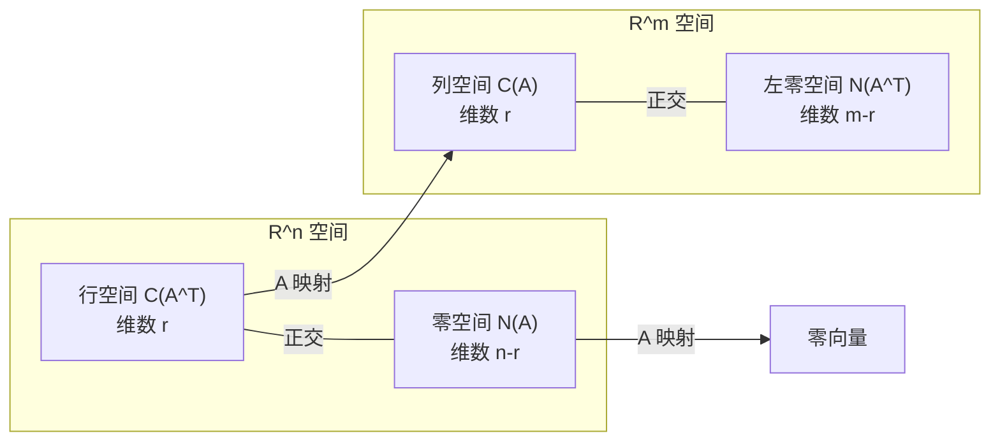
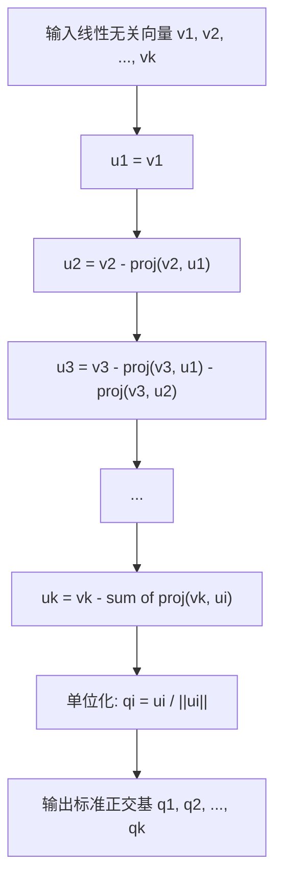
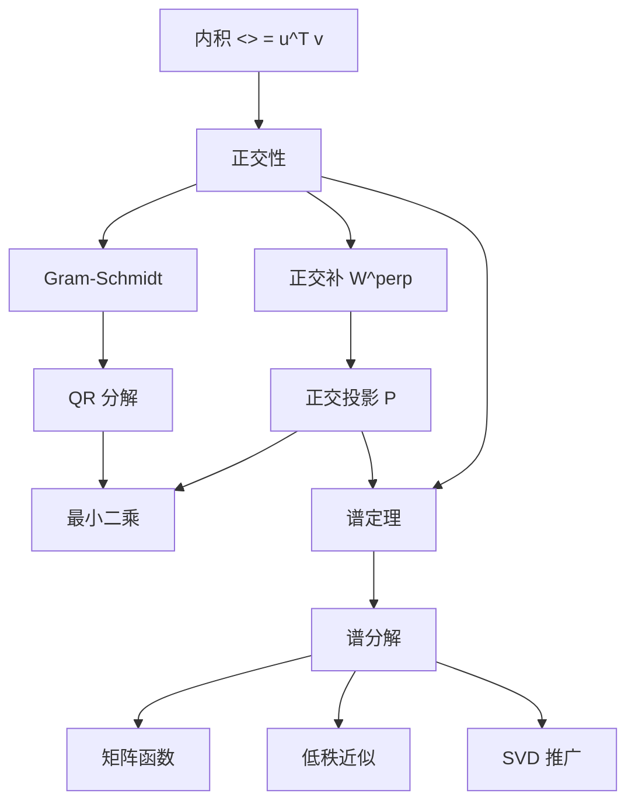

# 第6章 正交性、投影与谱定理 (Orthogonality, Projections, and the Spectral Theorem)

> **作者**：kyksj-1
> **风格致敬**：Gilbert Strang × 3Blue1Brown

---

## 本章导读

Gilbert Strang 曾说：

> "正交性是线性代数中最重要的概念——没有之一。"

为什么？因为正交性让我们能够**将复杂问题分解为独立的简单问题**。当基底彼此正交时，求系数变成了简单的内积运算；当误差与近似正交时，我们得到了最佳逼近；当特征向量彼此正交时，矩阵可以被完全"拆解"——这就是谱定理。

本章的结构是一条递进的线索：


> **与前章的关系**：Ch1-Ch2 讲了特征值和对角化的"操作"，Ch3 用正交对角化处理二次型，Ch5 从坐标变换角度统一了这些概念。本章回答更根本的问题：**为什么对称矩阵一定能正交对角化？** 这个答案就是谱定理。

---

## 6.1 内积与正交性

### 6.1.1 内积的定义

在 $\mathbb{R}^n$ 中，两个向量 $\mathbf{u}, \mathbf{v}$ 的**标准内积**（inner product）定义为：

$$
\boxed{\langle \mathbf{u}, \mathbf{v} \rangle = \mathbf{u}^T \mathbf{v} = \sum_{i=1}^n u_i v_i}
$$

内积满足四条基本性质：

| 性质 | 表达式 | 含义 |
|------|--------|------|
| 对称性 | $\langle \mathbf{u}, \mathbf{v} \rangle = \langle \mathbf{v}, \mathbf{u} \rangle$ | 顺序无关 |
| 线性 | $\langle a\mathbf{u} + b\mathbf{w}, \mathbf{v} \rangle = a\langle \mathbf{u}, \mathbf{v} \rangle + b\langle \mathbf{w}, \mathbf{v} \rangle$ | 第一个变量线性 |
| 正定性 | $\langle \mathbf{u}, \mathbf{u} \rangle \geq 0$，等号当且仅当 $\mathbf{u} = \mathbf{0}$ | 长度非负 |
| 范数 | $\|\mathbf{u}\| = \sqrt{\langle \mathbf{u}, \mathbf{u} \rangle}$ | 内积诱导范数 |

> **3Blue1Brown 的视角**：内积 $\mathbf{u}^T\mathbf{v}$ 可以理解为 $\mathbf{v}$ 在 $\mathbf{u}$ 方向上的**投影长度**乘以 $\|\mathbf{u}\|$。所以内积同时编码了"方向一致性"和"大小信息"。

### 6.1.2 正交向量与正交集

两个向量**正交**（orthogonal），当且仅当它们的内积为零：

$$
\boxed{\mathbf{u} \perp \mathbf{v} \quad \Longleftrightarrow \quad \langle \mathbf{u}, \mathbf{v} \rangle = 0}
$$

几何上，正交就是"垂直"的推广——在高维空间中，两个方向完全独立、互不干扰。

**定义**：

- **正交集**（orthogonal set）：集合 $\{\mathbf{v}_1, \ldots, \mathbf{v}_k\}$ 中任意两个不同向量正交：$\langle \mathbf{v}_i, \mathbf{v}_j \rangle = 0$（$i \neq j$）。
- **标准正交集**（orthonormal set）：正交集中每个向量都是单位向量：$\langle \mathbf{v}_i, \mathbf{v}_j \rangle = \delta_{ij}$。

其中 $\delta_{ij}$ 是 Kronecker delta：$i = j$ 时为 1，否则为 0。

**基本性质**：正交集中的非零向量一定**线性无关**。

**证明**：设 $c_1\mathbf{v}_1 + \cdots + c_k\mathbf{v}_k = \mathbf{0}$。对两边与 $\mathbf{v}_i$ 做内积：

$$
c_1\langle \mathbf{v}_1, \mathbf{v}_i \rangle + \cdots + c_k\langle \mathbf{v}_k, \mathbf{v}_i \rangle = 0
$$

由正交性，只有第 $i$ 项非零：$c_i \|\mathbf{v}_i\|^2 = 0$。因为 $\mathbf{v}_i \neq \mathbf{0}$，所以 $c_i = 0$。$\blacksquare$

### 6.1.3 正交基的威力

正交基为什么比一般基好？关键在于**求坐标变得极其简单**。

设 $\{\mathbf{q}_1, \ldots, \mathbf{q}_n\}$ 是 $\mathbb{R}^n$ 的一组标准正交基，$\mathbf{b}$ 是任意向量。则：

$$
\mathbf{b} = c_1\mathbf{q}_1 + c_2\mathbf{q}_2 + \cdots + c_n\mathbf{q}_n
$$

两边与 $\mathbf{q}_i$ 做内积：

$$
\boxed{c_i = \langle \mathbf{q}_i, \mathbf{b} \rangle = \mathbf{q}_i^T \mathbf{b}}
$$

不需要解方程组！用正交基写成矩阵形式，$Q = [\mathbf{q}_1 | \cdots | \mathbf{q}_n]$，则 $Q^TQ = I$，所以 $Q^{-1} = Q^T$，坐标变换只需一次矩阵转置乘法。

对比一般基底需要计算 $P^{-1}$（$O(n^3)$ 操作），正交基底只需 $Q^T$（$O(n^2)$ 操作）。

> **Parseval 等式**：在标准正交基下，$\|\mathbf{b}\|^2 = \sum_{i=1}^n |c_i|^2$——向量的长度等于各分量的"能量"之和，没有交叉项。

---

## 6.2 正交补与四个基本子空间

### 6.2.1 正交补

设 $W$ 是 $\mathbb{R}^n$ 的子空间。$W$ 的**正交补**（orthogonal complement）是与 $W$ 中所有向量都正交的向量集合：

$$
\boxed{W^\perp = \{\mathbf{v} \in \mathbb{R}^n \mid \langle \mathbf{v}, \mathbf{w} \rangle = 0, \; \forall \mathbf{w} \in W\}}
$$

基本性质：
- $W^\perp$ 也是子空间
- $\dim(W) + \dim(W^\perp) = n$
- $(W^\perp)^\perp = W$
- $W \cap W^\perp = \{\mathbf{0}\}$
- $\mathbb{R}^n = W \oplus W^\perp$（直和分解）

最后一条最重要：**任何向量都可以唯一分解为 $W$ 中的分量和 $W^\perp$ 中的分量**。这就是投影理论的基础。

### 6.2.2 四个基本子空间

对于 $m \times n$ 矩阵 $A$，存在四个基本子空间，它们两两正交：

| 子空间 | 记号 | 所在空间 | 维数 |
|--------|------|---------|------|
| 列空间 | $C(A)$ | $\mathbb{R}^m$ | $r$ |
| 左零空间 | $N(A^T)$ | $\mathbb{R}^m$ | $m - r$ |
| 行空间 | $C(A^T)$ | $\mathbb{R}^n$ | $r$ |
| 零空间 | $N(A)$ | $\mathbb{R}^n$ | $n - r$ |

其中 $r = \text{rank}(A)$。正交关系为：

$$
\boxed{C(A) \perp N(A^T), \quad C(A^T) \perp N(A)}
$$



> **直觉**：$A\mathbf{x} = \mathbf{b}$ 有解当且仅当 $\mathbf{b} \in C(A)$。如果 $\mathbf{b}$ 不在列空间中怎么办？把 $\mathbf{b}$ 分解为列空间的分量和左零空间的分量，取列空间的分量就是"最好的近似"——这就是最小二乘。

**证明** $N(A) \perp C(A^T)$：设 $\mathbf{x} \in N(A)$，即 $A\mathbf{x} = \mathbf{0}$。取 $C(A^T)$ 中任意向量 $A^T\mathbf{y}$，则：

$$
\langle \mathbf{x}, A^T\mathbf{y} \rangle = \mathbf{x}^T(A^T\mathbf{y}) = (A\mathbf{x})^T\mathbf{y} = \mathbf{0}^T\mathbf{y} = 0 \quad \blacksquare
$$

---

## 6.3 Gram-Schmidt 正交化与 QR 分解

### 6.3.1 问题与动机

我们已经知道正交基的优势。问题是：给定一组线性无关向量 $\{\mathbf{v}_1, \ldots, \mathbf{v}_k\}$，如何将它们变成正交基？

答案是 **Gram-Schmidt 正交化**（Gram-Schmidt process）。

### 6.3.2 算法

**核心思想**：逐个处理向量，每处理一个新向量时，减去它在已有正交向量上的投影分量。



具体公式：

$$
\mathbf{u}_1 = \mathbf{v}_1
$$

$$
\mathbf{u}_j = \mathbf{v}_j - \sum_{i=1}^{j-1} \frac{\langle \mathbf{v}_j, \mathbf{u}_i \rangle}{\langle \mathbf{u}_i, \mathbf{u}_i \rangle} \mathbf{u}_i, \quad j = 2, 3, \ldots, k
$$

$$
\boxed{\mathbf{q}_j = \frac{\mathbf{u}_j}{\|\mathbf{u}_j\|}}
$$

> **动画参考**：见 `animations/ch6_orthogonality_spectral.py` 中的 `GramSchmidtProcess` 场景。

**例**：对 $\mathbf{v}_1 = (1, 1, 0)^T$，$\mathbf{v}_2 = (1, 0, 1)^T$，$\mathbf{v}_3 = (0, 1, 1)^T$ 进行正交化。

**Step 1**：$\mathbf{u}_1 = (1,1,0)^T$

**Step 2**：

$$
\mathbf{u}_2 = \mathbf{v}_2 - \frac{\langle \mathbf{v}_2, \mathbf{u}_1 \rangle}{\|\mathbf{u}_1\|^2}\mathbf{u}_1 = \begin{pmatrix} 1\\0\\1 \end{pmatrix} - \frac{1}{2}\begin{pmatrix} 1\\1\\0 \end{pmatrix} = \begin{pmatrix} 1/2\\-1/2\\1 \end{pmatrix}
$$

**Step 3**：

$$
\mathbf{u}_3 = \mathbf{v}_3 - \frac{\langle \mathbf{v}_3, \mathbf{u}_1 \rangle}{\|\mathbf{u}_1\|^2}\mathbf{u}_1 - \frac{\langle \mathbf{v}_3, \mathbf{u}_2 \rangle}{\|\mathbf{u}_2\|^2}\mathbf{u}_2
$$

$$
= \begin{pmatrix}0\\1\\1\end{pmatrix} - \frac{1}{2}\begin{pmatrix}1\\1\\0\end{pmatrix} - \frac{1/2}{3/2}\begin{pmatrix}1/2\\-1/2\\1\end{pmatrix} = \begin{pmatrix}-2/3\\2/3\\2/3\end{pmatrix}
$$

验证：$\langle \mathbf{u}_1, \mathbf{u}_2 \rangle = 1/2 - 1/2 + 0 = 0$ ✓，$\langle \mathbf{u}_1, \mathbf{u}_3 \rangle = 0$ ✓，$\langle \mathbf{u}_2, \mathbf{u}_3 \rangle = 0$ ✓。

### 6.3.3 QR 分解

Gram-Schmidt 过程的矩阵表述就是 **QR 分解**。

设 $A = [\mathbf{v}_1 | \cdots | \mathbf{v}_n]$ 的列线性无关。Gram-Schmidt 给出标准正交向量 $\mathbf{q}_1, \ldots, \mathbf{q}_n$，反过来可以把原来的向量表示为：

$$
\mathbf{v}_j = \sum_{i=1}^{j} r_{ij}\,\mathbf{q}_i, \quad r_{ij} = \langle \mathbf{q}_i, \mathbf{v}_j \rangle
$$

写成矩阵形式：

$$
\boxed{A = QR}
$$

其中 $Q = [\mathbf{q}_1 | \cdots | \mathbf{q}_n]$ 是正交矩阵（$Q^TQ = I$），$R$ 是上三角矩阵且对角元素为正。

QR 分解是数值线性代数中求解最小二乘和特征值问题的基石。

> **数值稳定性**：经典 Gram-Schmidt 在浮点运算中可能丢失正交性。实际计算中使用**修正 Gram-Schmidt**（Modified Gram-Schmidt）或 **Householder 反射**，它们数值更稳定。

---

## 6.4 正交投影

正交投影是本章的核心——它回答了一个普遍而重要的问题：在一个子空间中，**最接近给定向量的点**是哪个？

### 6.4.1 投影到一维子空间（直线）

设直线的方向为 $\mathbf{a} \neq \mathbf{0}$，要将向量 $\mathbf{b}$ 投影到这条直线上。

投影 $\mathbf{p}$ 是 $\mathbf{a}$ 的标量倍：$\mathbf{p} = \hat{x}\mathbf{a}$。误差 $\mathbf{e} = \mathbf{b} - \mathbf{p}$ 必须与 $\mathbf{a}$ 正交：

$$
\mathbf{a}^T(\mathbf{b} - \hat{x}\mathbf{a}) = 0 \quad \Longrightarrow \quad \hat{x} = \frac{\mathbf{a}^T\mathbf{b}}{\mathbf{a}^T\mathbf{a}}
$$

$$
\boxed{\mathbf{p} = \frac{\mathbf{a}^T\mathbf{b}}{\mathbf{a}^T\mathbf{a}}\,\mathbf{a} = \frac{\mathbf{a}\mathbf{a}^T}{\mathbf{a}^T\mathbf{a}}\,\mathbf{b} = P\mathbf{b}}
$$

其中 $P = \dfrac{\mathbf{a}\mathbf{a}^T}{\mathbf{a}^T\mathbf{a}}$ 就是**投影矩阵**。

> **动画参考**：见 `animations/ch6_orthogonality_spectral.py` 中的 `OrthogonalProjection2D` 场景。

### 6.4.2 投影到一般子空间

设子空间 $W$ 的一组基为 $A = [\mathbf{a}_1 | \cdots | \mathbf{a}_k]$（$m \times k$ 矩阵，$k < m$）。将 $\mathbf{b} \in \mathbb{R}^m$ 投影到 $W = C(A)$ 上。

投影 $\mathbf{p} = A\hat{\mathbf{x}}$，其中 $\hat{\mathbf{x}} \in \mathbb{R}^k$。误差 $\mathbf{e} = \mathbf{b} - A\hat{\mathbf{x}}$ 与 $W$ 中所有向量正交：

$$
A^T(\mathbf{b} - A\hat{\mathbf{x}}) = \mathbf{0}
$$

$$
\boxed{A^TA\hat{\mathbf{x}} = A^T\mathbf{b}} \quad \text{（正规方程）}
$$

投影为：

$$
\mathbf{p} = A\hat{\mathbf{x}} = A(A^TA)^{-1}A^T\mathbf{b}
$$

$$
\boxed{P = A(A^TA)^{-1}A^T}
$$

> 当 $A$ 只有一列时，$(A^TA)^{-1} = \frac{1}{\mathbf{a}^T\mathbf{a}}$，退化为 6.4.1 的公式。

### 6.4.3 投影矩阵的性质

投影矩阵 $P$ 具有两个标志性性质：

$$
\boxed{P^2 = P \quad \text{（幂等性）}, \qquad P^T = P \quad \text{（对称性）}}
$$

**幂等性**的直觉：投影一次之后，已经落在子空间中了，再投影一次不会改变。

**对称性**的直觉：$\langle P\mathbf{u}, \mathbf{v} \rangle = \langle \mathbf{u}, P\mathbf{v} \rangle$——投影在内积下是"自伴的"。

**反过来也成立**：任何满足 $P^2 = P$ 且 $P^T = P$ 的矩阵都是某个子空间的正交投影矩阵。

> **补投影**：$I - P$ 是投影到 $W^\perp$ 的矩阵。容易验证：$(I-P)^2 = I - P$，$(I-P)^T = I - P$。

投影矩阵的特征值只有 0 和 1：

| 特征值 | 对应空间 | 含义 |
|--------|---------|------|
| $\lambda = 1$ | $C(P) = W$ | 已在子空间中，投影不变 |
| $\lambda = 0$ | $N(P) = W^\perp$ | 与子空间正交，投影为零 |

### 6.4.4 最小二乘法

投影理论的最重要应用之一是**最小二乘法**（least squares）。

当 $A\mathbf{x} = \mathbf{b}$ 无解时（$\mathbf{b} \notin C(A)$），我们寻找使残差 $\|\mathbf{b} - A\mathbf{x}\|$ 最小的 $\hat{\mathbf{x}}$。

几何上，$A\hat{\mathbf{x}} = \mathbf{p}$ 是 $\mathbf{b}$ 在 $C(A)$ 上的投影，$\hat{\mathbf{x}}$ 满足正规方程：

$$
\boxed{A^TA\hat{\mathbf{x}} = A^T\mathbf{b}}
$$

**例**：拟合直线 $y = c_0 + c_1 t$ 到数据 $(0, 6), (1, 0), (2, 0)$。

$$
A = \begin{pmatrix} 1 & 0 \\ 1 & 1 \\ 1 & 2 \end{pmatrix}, \quad \mathbf{b} = \begin{pmatrix} 6 \\ 0 \\ 0 \end{pmatrix}
$$

$$
A^TA = \begin{pmatrix} 3 & 3 \\ 3 & 5 \end{pmatrix}, \quad A^T\mathbf{b} = \begin{pmatrix} 6 \\ 0 \end{pmatrix}
$$

解正规方程：$\hat{\mathbf{x}} = (5, -3)^T$，拟合直线为 $y = 5 - 3t$。

> **与 QR 的联系**：如果对 $A$ 做 QR 分解 $A = QR$，正规方程变为 $R\hat{\mathbf{x}} = Q^T\mathbf{b}$——上三角方程，回代即解。这在数值上比直接解正规方程更稳定。

---

## 6.5 谱定理

谱定理是线性代数中最重要的定理之一。它告诉我们：**实对称矩阵一定能正交对角化**，而且其特征向量构成标准正交基。

### 6.5.1 实对称矩阵的特征值性质

在证明谱定理之前，先建立两个关键引理。

**引理1**：实对称矩阵的特征值都是实数。

**证明**：设 $A = A^T$，$A\mathbf{v} = \lambda\mathbf{v}$（$\mathbf{v} \neq \mathbf{0}$，可能是复向量）。取共轭转置：

$$
\bar{\mathbf{v}}^T A = \bar{\lambda}\bar{\mathbf{v}}^T
$$

左乘 $\mathbf{v}$，右乘 $\bar{\mathbf{v}}^T$：

$$
\bar{\mathbf{v}}^T A \mathbf{v} = \lambda\bar{\mathbf{v}}^T\mathbf{v} = \bar{\lambda}\bar{\mathbf{v}}^T\mathbf{v}
$$

因为 $\bar{\mathbf{v}}^T\mathbf{v} = \|\mathbf{v}\|^2 > 0$，所以 $\lambda = \bar{\lambda}$，即 $\lambda \in \mathbb{R}$。$\blacksquare$

**引理2**：实对称矩阵的不同特征值对应的特征向量彼此正交。

**证明**：设 $A\mathbf{v}_1 = \lambda_1\mathbf{v}_1$，$A\mathbf{v}_2 = \lambda_2\mathbf{v}_2$，$\lambda_1 \neq \lambda_2$。

$$
\lambda_1\langle \mathbf{v}_1, \mathbf{v}_2 \rangle = \langle A\mathbf{v}_1, \mathbf{v}_2 \rangle = \langle \mathbf{v}_1, A^T\mathbf{v}_2 \rangle = \langle \mathbf{v}_1, A\mathbf{v}_2 \rangle = \lambda_2\langle \mathbf{v}_1, \mathbf{v}_2 \rangle
$$

$$
(\lambda_1 - \lambda_2)\langle \mathbf{v}_1, \mathbf{v}_2 \rangle = 0
$$

因为 $\lambda_1 \neq \lambda_2$，所以 $\langle \mathbf{v}_1, \mathbf{v}_2 \rangle = 0$。$\blacksquare$

> **关键洞察**：引理 2 中 $A = A^T$ 的条件至关重要。对于非对称矩阵，不同特征值的特征向量一般**不**正交。正是对称性赋予了矩阵"自伴"的性质，使得 $\langle A\mathbf{v}_1, \mathbf{v}_2 \rangle = \langle \mathbf{v}_1, A\mathbf{v}_2 \rangle$，从而推导出正交性。

### 6.5.2 谱定理的陈述与证明

**定理（实对称矩阵的谱定理）**：设 $A \in \mathbb{R}^{n\times n}$ 是对称矩阵（$A = A^T$）。则：

1. $A$ 的所有特征值都是实数；
2. $A$ 有 $n$ 个（计重数的）特征值；
3. 存在标准正交基 $\{\mathbf{q}_1, \ldots, \mathbf{q}_n\}$，其中每个 $\mathbf{q}_i$ 都是 $A$ 的特征向量；
4. $A$ 可以写成：

$$
\boxed{A = Q\Lambda Q^T, \quad Q^TQ = I}
$$

其中 $Q = [\mathbf{q}_1 | \cdots | \mathbf{q}_n]$，$\Lambda = \text{diag}(\lambda_1, \ldots, \lambda_n)$。

**证明**（归纳法，$n$ 上的归纳）：

**基底情形**：$n = 1$ 时，$A = (a)$ 是 $1\times 1$ 矩阵，显然成立。

**归纳步骤**：假设对 $n-1$ 阶对称矩阵成立。

$A$ 是 $n$ 阶实对称矩阵。由引理 1，$A$ 至少有一个实特征值 $\lambda_1$，对应单位特征向量 $\mathbf{q}_1$。

扩充 $\mathbf{q}_1$ 为 $\mathbb{R}^n$ 的标准正交基 $\{\mathbf{q}_1, \mathbf{w}_2, \ldots, \mathbf{w}_n\}$，令 $U = [\mathbf{q}_1 | \mathbf{w}_2 | \cdots | \mathbf{w}_n]$。则：

$$
U^T A U = \begin{pmatrix} \lambda_1 & \mathbf{0}^T \\ \mathbf{0} & A' \end{pmatrix}
$$

其中 $A'$ 是 $(n-1)\times(n-1)$ 矩阵。关键：$A'$ 也是对称的（因为 $U^TAU$ 对称）。

由归纳假设，$A' = Q'\Lambda' Q'^T$，其中 $Q'$ 是 $(n-1)$ 阶正交矩阵。

令 $\tilde{Q} = U \begin{pmatrix} 1 & \mathbf{0}^T \\ \mathbf{0} & Q' \end{pmatrix}$，可以验证 $\tilde{Q}^T A \tilde{Q} = \text{diag}(\lambda_1, \Lambda')$，且 $\tilde{Q}$ 是正交矩阵。$\blacksquare$

> **为什么 $\mathbf{0}^T$ 那行全是零？** 因为对任意 $\mathbf{w}_j$（$j \geq 2$）：$(U^TAU)_{1j} = \mathbf{q}_1^T A \mathbf{w}_j = (A\mathbf{q}_1)^T\mathbf{w}_j = \lambda_1\mathbf{q}_1^T\mathbf{w}_j = 0$。对称性保证了自伴性，从而使得特征方向与其余方向自动解耦。

### 6.5.3 谱分解

将 $A = Q\Lambda Q^T$ 展开为各列：

$$
A = \sum_{i=1}^{n} \lambda_i \mathbf{q}_i \mathbf{q}_i^T
$$

每一项 $\lambda_i \mathbf{q}_i \mathbf{q}_i^T$ 是一个**秩 1 矩阵**——它把任意向量投影到 $\mathbf{q}_i$ 方向并拉伸 $\lambda_i$ 倍。

$$
\boxed{A = \lambda_1 \mathbf{q}_1\mathbf{q}_1^T + \lambda_2 \mathbf{q}_2\mathbf{q}_2^T + \cdots + \lambda_n \mathbf{q}_n\mathbf{q}_n^T}
$$

这就是**谱分解**（spectral decomposition）。它说明：

> 对称矩阵的作用 = **在各个正交方向上独立地拉伸**。

注意每个 $P_i = \mathbf{q}_i\mathbf{q}_i^T$ 恰好是投影到 $\mathbf{q}_i$ 方向的投影矩阵。因此谱分解可以写为：

$$
A = \sum_{i=1}^n \lambda_i P_i, \quad \text{其中 } P_iP_j = \delta_{ij}P_i, \quad \sum_i P_i = I
$$

$\{P_i\}$ 构成一组**正交投影的完备集**——这就是投影理论和谱理论的深层联系。

> **动画参考**：见 `animations/ch6_orthogonality_spectral.py` 中的 `SpectralDecomposition` 场景。

### 6.5.4 推广：正规矩阵

谱定理可以推广到**正规矩阵**（normal matrix）：$A^TA = AA^T$。

正规矩阵可以在**复数域**上酉对角化：$A = U\Lambda U^*$，其中 $U$ 是酉矩阵（$U^*U = I$）。

常见的正规矩阵：

| 矩阵类型 | 条件 | 特征值 |
|---------|------|--------|
| 实对称 | $A = A^T$ | 全实 |
| 反对称 | $A = -A^T$ | 纯虚或零 |
| 正交矩阵 | $A^TA = I$ | 模为 1 |
| Hermitian | $A = A^*$ | 全实 |
| 酉矩阵 | $A^*A = I$ | 模为 1 |

---

## 6.6 谱分解的力量

### 6.6.1 矩阵函数

有了谱分解 $A = Q\Lambda Q^T$，**任何**可以定义在标量上的函数都可以推广到对称矩阵上：

$$
\boxed{f(A) = Q\,f(\Lambda)\,Q^T = \sum_{i=1}^n f(\lambda_i)\,\mathbf{q}_i\mathbf{q}_i^T}
$$

| 函数 | 标量形式 | 矩阵形式 |
|------|---------|---------|
| 幂次 | $\lambda^k$ | $A^k = Q\Lambda^k Q^T$ |
| 逆 | $1/\lambda$ | $A^{-1} = Q\Lambda^{-1}Q^T$ |
| 平方根 | $\sqrt{\lambda}$ | $A^{1/2} = Q\Lambda^{1/2}Q^T$（需 $\lambda_i \geq 0$） |
| 指数 | $e^\lambda$ | $e^A = Q\,e^\Lambda Q^T$ |

> **量子力学中的应用**：可观测量（observable）是 Hermitian 算符，谱分解就是将其写成本征态投影的加权和。测量的概率由 $|\langle \mathbf{q}_i | \psi \rangle|^2$ 给出。矩阵指数 $e^{-iHt/\hbar}$ 给出时间演化。

### 6.6.2 低秩近似

谱分解自然地给出了矩阵的**最佳低秩近似**。按特征值的绝对值从大到小排列 $|\lambda_1| \geq |\lambda_2| \geq \cdots$，取前 $k$ 项：

$$
A_k = \sum_{i=1}^{k} \lambda_i \mathbf{q}_i \mathbf{q}_i^T
$$

$A_k$ 是所有秩不超过 $k$ 的对称矩阵中，在 Frobenius 范数意义下最接近 $A$ 的（Eckart-Young 定理的特殊情况）。

### 6.6.3 与 SVD 的关系

奇异值分解（SVD）$A = U\Sigma V^T$ 可以看作谱定理向**非方阵、非对称矩阵**的推广。

对于对称半正定矩阵 $A$：SVD 和谱分解**完全一致**，$U = V = Q$，$\Sigma = \Lambda$。

对于一般矩阵：SVD 对 $A^TA$（对称半正定）和 $AA^T$（对称半正定）分别做谱分解，"左右两侧"分别得到 $U$ 和 $V$。

> 这就是为什么 Ch5 中将 SVD 称为"最一般的坐标变换"——它的理论根基正是谱定理。

---

## 6.7 编程实践

### 6.7.1 Gram-Schmidt 正交化实现

```python
import numpy as np

def gram_schmidt(V):
    """经典 Gram-Schmidt 正交化

    参数:
        V: n x k 矩阵, 列向量为待正交化的向量
    返回:
        Q: n x k 正交矩阵
        R: k x k 上三角矩阵, 满足 V = QR
    """
    n, k = V.shape
    Q = np.zeros((n, k))
    R = np.zeros((k, k))

    for j in range(k):
        # 减去在已有正交向量上的投影
        v = V[:, j].copy()
        for i in range(j):
            R[i, j] = Q[:, i] @ V[:, j]
            v -= R[i, j] * Q[:, i]
        # 单位化
        R[j, j] = np.linalg.norm(v)
        if R[j, j] < 1e-10:
            raise ValueError(f"第 {j+1} 个向量线性相关")
        Q[:, j] = v / R[j, j]

    return Q, R

# 测试
V = np.array([[1, 1, 0],
              [1, 0, 1],
              [0, 1, 1]], dtype=float).T  # 3x3, 每列一个向量

Q, R = gram_schmidt(V)
print("Q (正交矩阵):\n", np.round(Q, 4))
print("\nQ^T Q (应为单位阵):\n", np.round(Q.T @ Q, 10))
print("\nQR - V (应为零):\n", np.round(Q @ R - V, 10))
```

### 6.7.2 投影与最小二乘可视化

```python
import numpy as np
import matplotlib.pyplot as plt

def projection_demo():
    """正交投影与最小二乘拟合演示"""
    # 数据点
    t = np.array([0, 1, 2])
    b = np.array([6, 0, 0])

    # 构建设计矩阵 (拟合 y = c0 + c1*t)
    A = np.column_stack([np.ones_like(t), t])

    # 正规方程求解
    x_hat = np.linalg.solve(A.T @ A, A.T @ b)
    p = A @ x_hat  # 投影
    e = b - p       # 残差

    print(f"最小二乘解: c0 = {x_hat[0]:.2f}, c1 = {x_hat[1]:.2f}")
    print(f"拟合直线: y = {x_hat[0]:.2f} + ({x_hat[1]:.2f})t")
    print(f"残差范数: {np.linalg.norm(e):.4f}")
    print(f"验证 A^T e = 0: {np.round(A.T @ e, 10)}")

    # 可视化
    fig, ax = plt.subplots(1, 1, figsize=(8, 5))
    t_fine = np.linspace(-0.5, 2.5, 100)
    y_fit = x_hat[0] + x_hat[1] * t_fine

    ax.scatter(t, b, color='red', s=100, zorder=5, label='Data points')
    ax.plot(t_fine, y_fit, 'b-', linewidth=2, label=f'Fit: y = {x_hat[0]:.1f} + ({x_hat[1]:.1f})t')

    # 画残差线
    for i in range(len(t)):
        ax.plot([t[i], t[i]], [b[i], p[i]], 'g--', linewidth=1.5)
    ax.plot([], [], 'g--', label='Residuals')

    ax.set_xlabel('t', fontsize=12)
    ax.set_ylabel('y', fontsize=12)
    ax.set_title('Least Squares Line Fitting', fontsize=14)
    ax.legend(fontsize=11)
    ax.grid(True, alpha=0.3)
    plt.tight_layout()
    plt.savefig('ch6_least_squares.png', dpi=150)
    plt.show()

projection_demo()
```

### 6.7.3 谱分解数值实验

```python
import numpy as np

def spectral_decomposition_demo():
    """谱分解演示: 分解、重建、矩阵函数"""
    # 对称矩阵
    A = np.array([[2, 1],
                  [1, 2]], dtype=float)

    # 谱分解
    eigenvalues, Q = np.linalg.eigh(A)  # eigh 专用于对称矩阵
    print("特征值:", eigenvalues)
    print("特征向量矩阵 Q:\n", np.round(Q, 4))
    print("验证 Q^T Q = I:\n", np.round(Q.T @ Q, 10))

    # 秩1分解
    print("\n--- 谱分解 A = sum lambda_i * q_i * q_i^T ---")
    A_reconstructed = np.zeros_like(A)
    for i in range(len(eigenvalues)):
        rank1 = eigenvalues[i] * np.outer(Q[:, i], Q[:, i])
        A_reconstructed += rank1
        print(f"lambda_{i+1} = {eigenvalues[i]:.2f}, 秩1分量:\n{np.round(rank1, 4)}")

    print(f"\n重建误差: {np.linalg.norm(A - A_reconstructed):.1e}")

    # 矩阵函数
    print("\n--- 矩阵函数 ---")
    # A 的平方根
    sqrt_eigenvalues = np.sqrt(eigenvalues)
    A_sqrt = Q @ np.diag(sqrt_eigenvalues) @ Q.T
    print(f"A^(1/2):\n{np.round(A_sqrt, 4)}")
    print(f"验证 A^(1/2) * A^(1/2) = A:\n{np.round(A_sqrt @ A_sqrt, 10)}")

    # 矩阵指数
    exp_eigenvalues = np.exp(eigenvalues)
    A_exp = Q @ np.diag(exp_eigenvalues) @ Q.T
    print(f"\ne^A:\n{np.round(A_exp, 4)}")
    # 与 scipy 对比
    from scipy.linalg import expm
    print(f"scipy expm(A):\n{np.round(expm(A), 4)}")

spectral_decomposition_demo()
```

---

## 6.8 Key Takeaway

| 概念 | 核心公式 | 关键直觉 |
|------|---------|---------|
| 内积与正交 | $\langle \mathbf{u}, \mathbf{v} \rangle = \mathbf{u}^T\mathbf{v}$，$\perp \Leftrightarrow = 0$ | 正交 = 独立、不干扰 |
| 正交补 | $\dim W + \dim W^\perp = n$ | 空间 = 子空间 + 其正交补 |
| Gram-Schmidt | $\mathbf{u}_j = \mathbf{v}_j - \sum \text{proj}$ | 逐步"去掉"已有方向的分量 |
| QR 分解 | $A = QR$ | Gram-Schmidt 的矩阵表达 |
| 投影矩阵 | $P = A(A^TA)^{-1}A^T$ | $P^2 = P$，$P^T = P$ |
| 最小二乘 | $A^TA\hat{\mathbf{x}} = A^T\mathbf{b}$ | 投影 = 最佳近似 |
| 谱定理 | $A = Q\Lambda Q^T$（$A$ 对称） | 对称矩阵一定正交对角化 |
| 谱分解 | $A = \sum \lambda_i \mathbf{q}_i\mathbf{q}_i^T$ | 在正交方向上独立拉伸 |
| 矩阵函数 | $f(A) = Qf(\Lambda)Q^T$ | 在特征方向上分别作用 |



---

## 习题

### 概念理解

**6.1** 设 $\mathbf{u} = (1, 2, 3)^T$，$\mathbf{v} = (a, -1, 1)^T$。求 $a$ 使得 $\mathbf{u} \perp \mathbf{v}$。

**6.2** 证明：如果 $\mathbf{u} \perp \mathbf{v}$，则 $\|\mathbf{u} + \mathbf{v}\|^2 = \|\mathbf{u}\|^2 + \|\mathbf{v}\|^2$（勾股定理的推广）。

**6.3** 设 $P$ 是投影矩阵（$P^2 = P$，$P^T = P$）。证明 $\|P\mathbf{x}\| \leq \|\mathbf{x}\|$ 对所有 $\mathbf{x}$ 成立。（提示：用 $\mathbf{x} = P\mathbf{x} + (I - P)\mathbf{x}$ 的正交分解。）

### 计算练习

**6.4** 对向量组 $\mathbf{v}_1 = (1, 0, 1)^T$，$\mathbf{v}_2 = (0, 1, 1)^T$ 进行 Gram-Schmidt 正交化，并写出 QR 分解。

**6.5** 求 $\mathbf{b} = (1, 2, 3)^T$ 在 $W = \text{span}\{(1, 0, 0)^T, (0, 1, 0)^T\}$ 上的正交投影，并写出投影矩阵 $P$。

**6.6** 用最小二乘法拟合抛物线 $y = c_0 + c_1 t + c_2 t^2$ 到数据 $(0,1), (1,2), (2,4), (3,8)$。

**6.7** 对 $A = \begin{pmatrix} 3 & 1 \\ 1 & 3 \end{pmatrix}$ 进行谱分解，写出 $A = \lambda_1 \mathbf{q}_1\mathbf{q}_1^T + \lambda_2 \mathbf{q}_2\mathbf{q}_2^T$ 的显式形式，并用谱分解计算 $A^3$ 和 $A^{-1}$。

### 思考题

**6.8** 为什么 Gram-Schmidt 正交化在数值计算中会丢失正交性？修正 Gram-Schmidt 是如何改进的？（提示：比较 $\langle \mathbf{v}_j, \mathbf{u}_i \rangle$ 和 $\langle \mathbf{v}_j - \sum_{k<i}\text{proj}_k, \mathbf{u}_i \rangle$ 的计算顺序。）

**6.9** 谱定理的证明中，为什么对**非对称**矩阵这种归纳论证会失败？给出一个 $2\times 2$ 非对称矩阵的例子，说明其不能正交对角化。

**6.10** 投影矩阵 $P$ 和 $I - P$ 的特征值分别是 $\{0, 1\}$。解释为什么 $P$ 和 $I - P$ 有相同的特征向量但不同的特征值。这与 $\mathbb{R}^n = W \oplus W^\perp$ 有什么关系？

### 编程题

**6.11** 实现修正 Gram-Schmidt（Modified Gram-Schmidt），与经典版本对比：
- 生成一组接近线性相关的向量（如 Hilbert 矩阵的列）
- 分别用经典 GS 和修正 GS 正交化
- 比较 $\|Q^TQ - I\|_F$ 的大小
- 用图表展示正交性损失随矩阵条件数的变化

**6.12** 用谱分解实现矩阵平方根函数 `matrix_sqrt(A)`，要求：
- 检查 $A$ 是否对称半正定
- 计算 $A^{1/2}$ 并验证 $A^{1/2}A^{1/2} = A$
- 将结果与 `scipy.linalg.sqrtm` 对比
- 对一个 $5\times 5$ 随机正定矩阵测试
