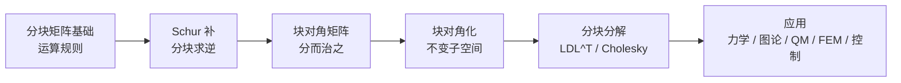
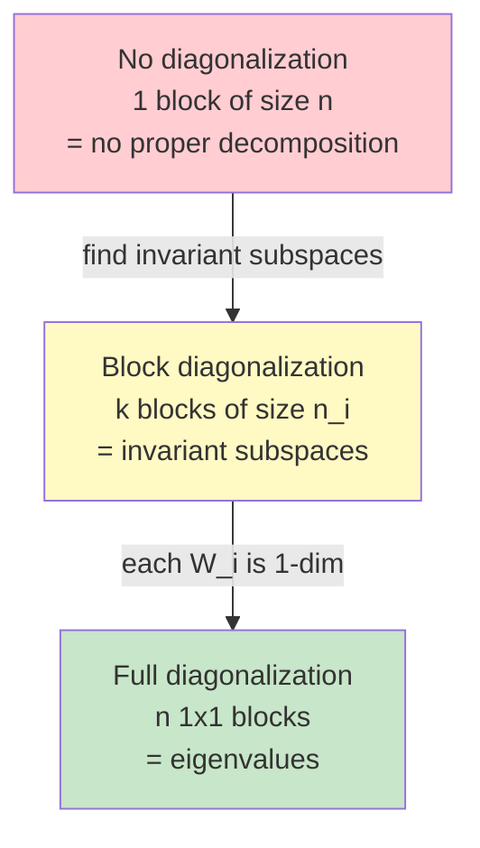

# 第8章 分块矩阵与块对角化 (Block Matrices and Block Diagonalization)

> **作者**：kyksj-1
> **风格致敬**：Gilbert Strang × 3Blue1Brown

---

## 本章导读

Gilbert Strang 说过：

> "分块矩阵是线性代数中的'分而治之'——把一个大问题切成几个小问题，分别解决，再合在一起。"

当矩阵的规模增大，直接操作变得笨拙且缓慢。但如果矩阵内部存在**结构**——某些区域之间的耦合较弱，或者系统天然由几个子系统组成——我们就可以把矩阵"切成块"，像操作标量一样操作这些块。

这不只是一种记号上的便利。块对角化揭示了系统的**可分解性**：耦合振动可以解耦为独立模态，图的社区结构对应邻接矩阵的近似块对角形式，量子力学中无相互作用的子系统对应张量积的块结构。



> **与前章的关系**：Ch2 的相似对角化是块对角化的**特例**（每个块都是 $1 \times 1$）。Ch7 的 Cholesky 分解有自然的分块推广。本章是从"单个矩阵"走向"矩阵的结构"的关键一步。

---

## 8.1 分块矩阵基础

### 8.1.1 什么是分块矩阵

将一个 $m \times n$ 矩阵 $A$ 按行和列进行分割，每个子矩阵称为一个**块**（block）：

$$
A = \begin{pmatrix} A_{11} & A_{12} & \cdots & A_{1q} \\ A_{21} & A_{22} & \cdots & A_{2q} \\ \vdots & \vdots & \ddots & \vdots \\ A_{p1} & A_{p2} & \cdots & A_{pq} \end{pmatrix}
$$

其中 $A_{ij}$ 是 $m_i \times n_j$ 的子矩阵，且 $\sum m_i = m$，$\sum n_j = n$。

> **3Blue1Brown 的视角**：想象一个大城市的地图，被划分为几个区。每个区内部有自己的交通网络，区与区之间通过干道连接。分块矩阵就是这种"区域化"的数学表达——块内的元素是局部关系，块间的元素是全局耦合。

**最常用的情形**——$2 \times 2$ 分块：

$$
M = \begin{pmatrix} A & B \\ C & D \end{pmatrix}
$$

其中 $A$ 是 $p \times p$，$B$ 是 $p \times q$，$C$ 是 $q \times p$，$D$ 是 $q \times q$。本章大量公式都基于这个 $2 \times 2$ 分块结构。

### 8.1.2 分块加法与数乘

分块加法**逐块进行**，前提是两个矩阵的分块方式相同：

$$
\begin{pmatrix} A_{11} & A_{12} \\ A_{21} & A_{22} \end{pmatrix} + \begin{pmatrix} B_{11} & B_{12} \\ B_{21} & B_{22} \end{pmatrix} = \begin{pmatrix} A_{11}+B_{11} & A_{12}+B_{12} \\ A_{21}+B_{21} & A_{22}+B_{22} \end{pmatrix}
$$

数乘同理：$\alpha \begin{pmatrix} A & B \\ C & D \end{pmatrix} = \begin{pmatrix} \alpha A & \alpha B \\ \alpha C & \alpha D \end{pmatrix}$

### 8.1.3 分块乘法

这是分块矩阵最重要的运算规则。**只要分块尺寸相容**，块矩阵的乘法规则与标量矩阵乘法**形式完全一致**：

$$
\boxed{\begin{pmatrix} A & B \\ C & D \end{pmatrix}\begin{pmatrix} E & F \\ G & H \end{pmatrix} = \begin{pmatrix} AE+BG & AF+BH \\ CE+DG & CF+DH \end{pmatrix}}
$$

**关键注意**：块的乘法**不可交换**！$AE + BG$ 中 $A$ 必须在 $E$ 的左边，因为子矩阵乘法不交换。

**相容条件**：左矩阵的列分割方式 = 右矩阵的行分割方式。即左矩阵的 $n_j$ 必须等于右矩阵对应行块的行数。

**例**：设 $A = \begin{pmatrix} 1 & 0 & 2 \\ 0 & 1 & 3 \end{pmatrix}$，按 $2+1$ 列分块和 $2$ 行分块：

$$
A = \begin{pmatrix} I_2 & \mathbf{b} \end{pmatrix}, \quad I_2 = \begin{pmatrix} 1 & 0 \\ 0 & 1 \end{pmatrix}, \quad \mathbf{b} = \begin{pmatrix} 2 \\ 3 \end{pmatrix}
$$

若 $B = \begin{pmatrix} \mathbf{x} \\ y \end{pmatrix}$，其中 $\mathbf{x} \in \mathbb{R}^2$，$y \in \mathbb{R}$，则：

$$
AB = \begin{pmatrix} I_2 & \mathbf{b} \end{pmatrix}\begin{pmatrix} \mathbf{x} \\ y \end{pmatrix} = I_2\mathbf{x} + \mathbf{b}y = \mathbf{x} + y\mathbf{b}
$$

这比逐元素展开要**直观得多**。

### 8.1.4 分块转置

$$
\boxed{\begin{pmatrix} A & B \\ C & D \end{pmatrix}^T = \begin{pmatrix} A^T & C^T \\ B^T & D^T \end{pmatrix}}
$$

注意：不仅**位置**要转（$B$ 和 $C$ 互换），每个块**自身也要转置**。

---

## 8.2 分块矩阵的逆与 Schur 补

### 8.2.1 从高斯消元到分块消元

回忆 $2 \times 2$ 标量方程组的消元：

$$
\begin{pmatrix} a & b \\ c & d \end{pmatrix}\begin{pmatrix} x \\ y \end{pmatrix} = \begin{pmatrix} e \\ f \end{pmatrix}
$$

第一步消去下方的 $c$：用第一行乘以 $c/a$，从第二行减去。剩下的"有效系数"是 $d - cb/a$——这就是 **Schur 补**的原型。

现在把同样的思路用到**块矩阵**上：

$$
\begin{pmatrix} A & B \\ C & D \end{pmatrix}\begin{pmatrix} \mathbf{x} \\ \mathbf{y} \end{pmatrix} = \begin{pmatrix} \mathbf{e} \\ \mathbf{f} \end{pmatrix}
$$

第一个方程：$A\mathbf{x} + B\mathbf{y} = \mathbf{e}$，解出 $\mathbf{x} = A^{-1}(\mathbf{e} - B\mathbf{y})$（假设 $A$ 可逆）。

代入第二个方程：$CA^{-1}(\mathbf{e} - B\mathbf{y}) + D\mathbf{y} = \mathbf{f}$，整理得：

$$
(D - CA^{-1}B)\mathbf{y} = \mathbf{f} - CA^{-1}\mathbf{e}
$$

### 8.2.2 Schur 补的定义

**定义**：设 $M = \begin{pmatrix} A & B \\ C & D \end{pmatrix}$，$A$ 可逆，则 $D$ 相对于 $A$ 的 **Schur 补**（Schur complement）为：

$$
\boxed{S = D - CA^{-1}B}
$$

类似地，若 $D$ 可逆，$A$ 相对于 $D$ 的 Schur 补为 $T = A - BD^{-1}C$。

> **直觉**：Schur 补 $S$ 是"消去 $\mathbf{x}$ 之后，$\mathbf{y}$ 方程中的有效系数矩阵"。它衡量了 $D$ 在**扣除 $A$ 通道的间接影响**后的"净效应"。

### 8.2.3 分块求逆公式

若 $A$ 和 $S = D - CA^{-1}B$ 都可逆，则：

$$
\boxed{\begin{pmatrix} A & B \\ C & D \end{pmatrix}^{-1} = \begin{pmatrix} A^{-1} + A^{-1}BS^{-1}CA^{-1} & -A^{-1}BS^{-1} \\ -S^{-1}CA^{-1} & S^{-1} \end{pmatrix}}
$$

**验证**（右下角）：将 $M^{-1}$ 乘以 $M$ 的第二列 $\begin{pmatrix} B \\ D \end{pmatrix}$，第二个分量：

$$
-S^{-1}CA^{-1}B + S^{-1}D = S^{-1}(D - CA^{-1}B) = S^{-1}S = I \quad \checkmark
$$

**分块 LDU 分解**——上述公式的等价形式：

$$
\begin{pmatrix} A & B \\ C & D \end{pmatrix} = \begin{pmatrix} I & 0 \\ CA^{-1} & I \end{pmatrix}\begin{pmatrix} A & 0 \\ 0 & S \end{pmatrix}\begin{pmatrix} I & A^{-1}B \\ 0 & I \end{pmatrix}
$$

这正是高斯消元的分块版本！左因子是下三角（行操作），右因子是上三角（列操作），中间是"块对角"。

### 8.2.4 Schur 补的行列式公式

从分块 LDU 分解直接得到：

$$
\boxed{\det(M) = \det(A) \cdot \det(S) = \det(A) \cdot \det(D - CA^{-1}B)}
$$

这个公式在统计学（多元高斯分布的条件分布）和图论（基尔霍夫矩阵树定理）中频繁出现。

### 8.2.5 Schur 补与正定性

**定理**：设 $M = \begin{pmatrix} A & B \\ B^T & D \end{pmatrix}$ 是对称矩阵，$A$ 正定。则：

$$
M \text{ 正定} \quad \Longleftrightarrow \quad S = D - B^TA^{-1}B \text{ 正定}
$$

**证明**：由分块 LDU 分解，$M = L\begin{pmatrix} A & 0 \\ 0 & S \end{pmatrix}L^T$，其中 $L$ 可逆。所以 $\mathbf{z}^TM\mathbf{z} > 0$ 当且仅当中间的块对角矩阵正定，即 $A$ 和 $S$ 都正定。$\blacksquare$

> **回顾 Ch7**：这给出了正定性的又一等价条件——可以逐块检验。$n \times n$ 矩阵的正定性可以递归地归结为越来越小的 Schur 补的正定性。

---

## 8.3 块对角矩阵及其性质

### 8.3.1 定义与记号

**块对角矩阵**（block diagonal matrix）的非对角块全为零：

$$
\boxed{A = \text{diag}(A_1, A_2, \ldots, A_k) = \begin{pmatrix} A_1 & & \\ & A_2 & \\ & & \ddots & \\ & & & A_k \end{pmatrix}}
$$

也写作 $A = A_1 \oplus A_2 \oplus \cdots \oplus A_k$，其中 $\oplus$ 表示**直和**（direct sum）。

### 8.3.2 "分而治之"性质

块对角矩阵的核心优势：**所有运算都可以在各块上独立进行**。

| 运算 | 公式 | 说明 |
|------|------|------|
| 行列式 | $\det(A) = \prod_i \det(A_i)$ | 各块行列式之积 |
| 逆 | $A^{-1} = \text{diag}(A_1^{-1}, \ldots, A_k^{-1})$ | 各块分别求逆 |
| 特征值 | $\sigma(A) = \bigcup_i \sigma(A_i)$ | 全体特征值是各块特征值的并集 |
| 矩阵幂 | $A^m = \text{diag}(A_1^m, \ldots, A_k^m)$ | 各块分别取幂 |
| 矩阵指数 | $e^A = \text{diag}(e^{A_1}, \ldots, e^{A_k})$ | 各块分别取指数 |
| 特征多项式 | $p_A(\lambda) = \prod_i p_{A_i}(\lambda)$ | 各块特征多项式之积 |

**证明（特征值）**：设 $A_i \mathbf{v}_i = \lambda \mathbf{v}_i$。构造 $\mathbf{w} = (0, \ldots, \mathbf{v}_i, \ldots, 0)^T$（只在第 $i$ 块非零），则 $A\mathbf{w} = \lambda\mathbf{w}$。反之，$A\mathbf{w} = \lambda\mathbf{w}$ 意味着每个块 $A_i$ 作用在 $\mathbf{w}$ 的对应分量上得到 $\lambda$ 倍，所以 $\lambda$ 必是某个 $A_i$ 的特征值。$\blacksquare$

### 8.3.3 计算复杂度的降低

假设 $A$ 是 $n \times n$ 块对角矩阵，有 $k$ 个大小为 $n/k$ 的块（等分情形）。

| 运算 | 不分块 | 分块后 | 加速比 |
|------|--------|--------|--------|
| 求逆 | $O(n^3)$ | $k \cdot O((n/k)^3) = O(n^3/k^2)$ | $k^2$ |
| 行列式 | $O(n^3)$ | $O(n^3/k^2)$ | $k^2$ |
| 特征值 | $O(n^3)$ | $O(n^3/k^2)$ | $k^2$ |

> **10 个 100×100 的块** vs **一个 1000×1000 矩阵**：加速 100 倍。这就是为什么发现和利用块结构在数值计算中至关重要。

### 8.3.4 块上三角与块下三角

块上三角矩阵的行列式仍然是对角块行列式之积：

$$
\det\begin{pmatrix} A_{11} & A_{12} & A_{13} \\ 0 & A_{22} & A_{23} \\ 0 & 0 & A_{33} \end{pmatrix} = \det(A_{11})\det(A_{22})\det(A_{33})
$$

特征值同样是各对角块特征值的并集（证明类似标量情形：块三角矩阵的 $\det(A - \lambda I)$ 仍是块三角的行列式）。

---

## 8.4 块对角化：不变子空间视角

### 8.4.1 不变子空间

**定义**：设 $A$ 是 $n \times n$ 矩阵。子空间 $W \subseteq \mathbb{R}^n$ 是 $A$ 的**不变子空间**（invariant subspace），若：

$$
\boxed{A\mathbf{w} \in W, \quad \forall \mathbf{w} \in W}
$$

即 $A$ 把 $W$ 中的向量映射回 $W$ 内部，不会"跑出去"。

**典型例子**：
- 特征向量 $\mathbf{v}$ 张成的一维子空间 $\text{span}\{\mathbf{v}\}$ 是不变子空间
- 对应同一特征值的特征空间 $E_\lambda$ 是不变子空间
- $\{0\}$ 和 $\mathbb{R}^n$ 是平凡的不变子空间
- $A$ 的列空间 $\text{Col}(A)$ 是 $A^2$ 的不变子空间

### 8.4.2 块对角化定理

**定理**：矩阵 $A$ 可以通过相似变换化为块对角形式

$$
P^{-1}AP = \begin{pmatrix} B_1 & & \\ & B_2 & \\ & & \ddots & \\ & & & B_k \end{pmatrix}
$$

当且仅当 $\mathbb{R}^n$ 可以分解为 $A$ 的不变子空间的**直和**：

$$
\boxed{\mathbb{R}^n = W_1 \oplus W_2 \oplus \cdots \oplus W_k}
$$

此时 $P = [\text{basis of } W_1 | \text{basis of } W_2 | \cdots | \text{basis of } W_k]$，$B_i$ 是 $A$ 在 $W_i$ 上的限制。

**证明**：设 $W_i$ 的基为 $\{\mathbf{p}_{i1}, \ldots, \mathbf{p}_{in_i}\}$。因为 $W_i$ 是不变子空间，$A\mathbf{p}_{ij}$ 仍在 $W_i$ 中，可以用 $W_i$ 的基线性表示。这意味着 $A$ 作用在 $P$ 的第 $i$ 块列上，结果仍然只在第 $i$ 块列的张成空间内——对应 $P^{-1}AP$ 的第 $i$ 个对角块。非对角块为零，因为不同不变子空间之间没有"泄漏"。$\blacksquare$

**推论**：Ch2 的相似对角化是特例——当每个不变子空间都是一维的（由特征向量张成），块就是 $1 \times 1$ 的标量（特征值）。



### 8.4.3 块对角化的 SOP

**步骤**：

1. **找不变子空间**：计算 $A$ 的特征值和特征空间。
2. **分组**：将特征空间按需求分组。例如，实矩阵的共轭复特征值对应的二维不变子空间可以合为一个 $2 \times 2$ 实块。
3. **构造变换矩阵**：$P$ 的列是各不变子空间的基向量。
4. **计算各块**：$B_i = P_i^{-1}AP_i$（或从 $P^{-1}AP$ 中提取）。

**例**：$A = \begin{pmatrix} 2 & 1 & 0 \\ 0 & 2 & 0 \\ 0 & 0 & 3 \end{pmatrix}$

特征值：$\lambda_1 = 2$（代数重数 2），$\lambda_2 = 3$（代数重数 1）。

$E_2 = \text{span}\{(1,0,0)^T\}$——几何重数为 1，不够对角化。但 $W_1 = \text{span}\{(1,0,0)^T, (0,1,0)^T\}$（$\lambda = 2$ 对应的广义特征空间）是不变子空间，$W_2 = \text{span}\{(0,0,1)^T\}$ 也是。

取 $P = I$（基底已经合适），块对角化为：

$$
A = \begin{pmatrix} 2 & 1 \\ 0 & 2 \end{pmatrix} \oplus \begin{pmatrix} 3 \end{pmatrix}
$$

虽然不能完全对角化（$2 \times 2$ 块有非对角元素），但至少分成了**独立的两块**。

### 8.4.4 实矩阵的实块对角化

实矩阵可能有复特征值。与其引入复数，不如保持在实数域内，使用 $2 \times 2$ 实块处理共轭对。

**定理**：设 $A \in \mathbb{R}^{n \times n}$，特征值为 $\lambda_1, \ldots, \lambda_r \in \mathbb{R}$ 和共轭对 $\alpha_j \pm i\beta_j$（$j = 1, \ldots, s$），且 $A$ 可对角化。则存在实可逆矩阵 $P$ 使得：

$$
P^{-1}AP = \text{diag}\left(\lambda_1, \ldots, \lambda_r, \begin{pmatrix} \alpha_1 & -\beta_1 \\ \beta_1 & \alpha_1 \end{pmatrix}, \ldots, \begin{pmatrix} \alpha_s & -\beta_s \\ \beta_s & \alpha_s \end{pmatrix}\right)
$$

**例**：旋转矩阵 $R_\theta = \begin{pmatrix} \cos\theta & -\sin\theta \\ \sin\theta & \cos\theta \end{pmatrix}$ 的特征值是 $e^{\pm i\theta}$。它在实数域已经是最简形式——一个 $2 \times 2$ 实块，对应旋转角 $\theta$。

---

## 8.5 分块 LDL^T 与块 Cholesky

### 8.5.1 分块 LDL^T 分解

对正定对称矩阵 $M = \begin{pmatrix} A & B \\ B^T & D \end{pmatrix}$，分块 LDU 分解（见 8.2.3）因对称性简化为 LDL^T：

$$
\boxed{M = \begin{pmatrix} I & 0 \\ B^TA^{-1} & I \end{pmatrix}\begin{pmatrix} A & 0 \\ 0 & S \end{pmatrix}\begin{pmatrix} I & A^{-1}B \\ 0 & I \end{pmatrix}}
$$

其中 $S = D - B^TA^{-1}B$ 是 Schur 补。

### 8.5.2 块 Cholesky 分解

将 Cholesky 分解（Ch7）推广到分块层面。设 $M$ 正定，按 $p + q$ 分块：

$$
M = \begin{pmatrix} A & B \\ B^T & D \end{pmatrix} = \begin{pmatrix} L_A & 0 \\ L_{BA} & L_S \end{pmatrix}\begin{pmatrix} L_A^T & L_{BA}^T \\ 0 & L_S^T \end{pmatrix}
$$

其中：
- $L_A$：$A = L_AL_A^T$ 的 Cholesky 因子
- $L_{BA} = B^T L_A^{-T}$（解三角方程组）
- $L_S$：Schur 补 $S = D - B^TA^{-1}B$ 的 Cholesky 因子

**应用场景**：当 $A$ 的 Cholesky 因子已经算好，新增一些行和列后，不需要从头算整个矩阵的 Cholesky——只需计算 Schur 补的 Cholesky。这在**在线学习**和**增量更新**中至关重要。

---

## 8.6 应用

### 8.6.1 耦合振动系统的解耦

考虑三个质量块通过弹簧耦合的系统，运动方程为 $M\ddot{\mathbf{x}} + K\mathbf{x} = 0$。

若弹簧网络的拓扑使得刚度矩阵 $K$ 是（近似）块对角的，系统可以**解耦**为独立的子系统。

**具体例子**：两组弹簧-质量系统通过一根弱弹簧连接：

```
[系统 A: 强耦合]  ——弱弹簧——  [系统 B: 强耦合]
 m1 ==k1== m2          k_w         m3 ==k2== m4
```

刚度矩阵结构：

$$
K = \begin{pmatrix} K_A & K_{AB} \\ K_{AB}^T & K_B \end{pmatrix}
$$

当 $k_w \ll k_1, k_2$ 时，$K_{AB}$ 很小，系统近似块对角。此时：

- **零阶近似**：$K_{AB} = 0$，两个子系统完全独立，各自的振动模态互不影响
- **微扰修正**：弱耦合引起模态的**微小分裂**（类似量子力学中的微扰论）

**模态分析 SOP**：
1. 忽略耦合，分别对 $K_A$ 和 $K_B$ 做特征值分解
2. 得到各子系统的本征频率 $\omega_{A,i}$ 和 $\omega_{B,j}$
3. 当需要精确结果时，在块对角基底下加入耦合项的修正

### 8.6.2 图的邻接矩阵与社区检测

图 $G$ 的邻接矩阵 $A$ 编码了节点之间的连接关系。若图具有**社区结构**（community structure），则存在节点排列使得 $A$ 近似块对角：

$$
A \approx \begin{pmatrix} A_1 & \text{sparse} \\ \text{sparse} & A_2 \end{pmatrix}
$$

每个对角块 $A_i$ 对应一个**社区**（内部连接密集），非对角块是社区间的稀疏连接。

**谱聚类算法**正是利用了这一思想：

1. 构造图的 Laplacian 矩阵 $L = D - A$（$D$ 是度矩阵）
2. 计算 $L$ 的最小几个特征值和特征向量
3. 用特征向量作为节点的嵌入坐标，进行聚类

块对角结构使得 $L$ 的零特征值的重数等于连通分量的个数。对于近似块对角的情形，最小的几个特征值都接近零，对应的特征向量揭示了社区的归属关系。

### 8.6.3 量子力学中的张量积与复合系统

两个**无相互作用**的量子系统，其 Hamilton 量为：

$$
H = H_A \otimes I_B + I_A \otimes H_B
$$

其中 $\otimes$ 是 Kronecker 积（张量积）。若 $H_A$ 是 $n_A \times n_A$，$H_B$ 是 $n_B \times n_B$，则 $H$ 是 $n_An_B \times n_An_B$。

**关键性质**：$H$ 的特征值是 $\lambda_i^{(A)} + \lambda_j^{(B)}$ 的所有组合，特征向量是 $\mathbf{v}_i^{(A)} \otimes \mathbf{v}_j^{(B)}$。

这正是块结构的体现：在 $H_A$ 的特征基下，$H$ 化为：

$$
H = \begin{pmatrix} \lambda_1^{(A)}I + H_B & & \\ & \lambda_2^{(A)}I + H_B & \\ & & \ddots \end{pmatrix}
$$

每个块 $\lambda_i^{(A)}I + H_B$ 可以独立对角化。**复合系统的问题被分解为子系统问题的组合**。

当存在相互作用 $V$ 时，块不再对角，需要微扰论或数值方法处理——但分块结构仍然提供了良好的起点和近似。

### 8.6.4 有限元方法中的稀疏分块结构

有限元法将连续域离散化为网格单元。全局刚度矩阵 $K_{\text{global}}$ 通过**组装**（assembly）各单元刚度矩阵 $K_e$ 得到：

$$
K_{\text{global}} = \sum_{e} L_e^T K_e L_e
$$

其中 $L_e$ 是将局部自由度映射到全局自由度的布尔矩阵。

$K_{\text{global}}$ 天然具有**稀疏分块结构**：只有相邻单元对应的自由度之间有非零耦合。通过**子结构法**（substructuring），可以：

1. 将网格划分为若干子域
2. 消去各子域的内部自由度（得到 Schur 补）
3. 只需在界面自由度上求解一个**缩减系统**

$$
S_{\text{interface}} \mathbf{u}_{\text{interface}} = \mathbf{f}_{\text{reduced}}
$$

这里 $S_{\text{interface}}$ 是界面上的 Schur 补，规模远小于原系统。这就是有限元并行求解器（如 FETI 方法）的基础。

### 8.6.5 多体控制系统的可控性分解

线性系统 $\dot{\mathbf{x}} = A\mathbf{x} + B\mathbf{u}$ 可以通过**Kalman 可控性分解**化为块三角形式：

$$
\tilde{A} = \begin{pmatrix} A_c & A_{12} \\ 0 & A_{\bar{c}} \end{pmatrix}, \quad \tilde{B} = \begin{pmatrix} B_c \\ 0 \end{pmatrix}
$$

其中 $(A_c, B_c)$ 是可控部分，$A_{\bar{c}}$ 是不可控部分。输入 $\mathbf{u}$ 只能影响可控子空间。

**不变子空间的角色**：可控子空间 $\mathcal{C} = \text{Im}[B | AB | A^2B | \cdots]$ 是 $A$ 的不变子空间（加上 $B$ 的像空间），其正交补也是 $A^T$ 的不变子空间。这个分解将系统的**可达部分**和**不可达部分**完全隔离。

对于多智能体编队控制，每个智能体是一个子系统，整体系统矩阵自然是分块结构：

$$
A = \begin{pmatrix} A_1 & & \\ & \ddots & \\ & & A_N \end{pmatrix} + \underbrace{L \otimes G}_{\text{coupling}}
$$

$L$ 是通信图的 Laplacian，$G$ 是耦合增益矩阵。当 $L$ 可对角化时，整个系统可以块对角化为 $N$ 个**独立的低维问题**，极大简化控制器设计。

---

## 8.7 编程实践

### 8.7.1 分块矩阵运算

```python
import numpy as np

def block_multiply(M1_blocks, M2_blocks):
    """
    分块矩阵乘法。

    参数:
        M1_blocks: 左矩阵的分块列表（二维列表，每个元素是 ndarray）
        M2_blocks: 右矩阵的分块列表
    返回:
        结果的分块列表
    """
    p = len(M1_blocks)       # 左矩阵的块行数
    q = len(M2_blocks[0])    # 右矩阵的块列数
    r = len(M1_blocks[0])    # 左矩阵的块列数 = 右矩阵的块行数

    result = [[None] * q for _ in range(p)]
    for i in range(p):
        for j in range(q):
            s = M1_blocks[i][0] @ M2_blocks[0][j]
            for k in range(1, r):
                s = s + M1_blocks[i][k] @ M2_blocks[k][j]
            result[i][j] = s
    return result


# ============================================================
# 示例：验证分块乘法
# ============================================================
A = np.array([[1, 2], [3, 4]])
B = np.array([[5], [6]])
C = np.array([[7, 8]])
D = np.array([[9]])

M1 = [[A, B], [C, D]]  # 3x3 矩阵的 2x2 分块

E = np.eye(2)
F = np.array([[1], [0]])
G = np.array([[0, 1]])
H = np.array([[2]])

M2 = [[E, F], [G, H]]  # 3x3 矩阵的 2x2 分块

# 分块乘法
result_blocks = block_multiply(M1, M2)
print("分块乘法结果（左上块）:")
print(result_blocks[0][0])

# 用普通乘法验证
M1_full = np.block([[A, B], [C, D]])
M2_full = np.block([[E, F], [G, H]])
print("\n普通乘法结果:")
print(M1_full @ M2_full)
```

### 8.7.2 Schur 补与分块求逆

```python
import numpy as np

def schur_complement(A, B, C, D):
    """
    计算 Schur 补 S = D - C A^{-1} B。

    参数:
        A, B, C, D: 2x2 分块矩阵 M = [[A, B], [C, D]] 的各块
    返回:
        Schur 补 S
    """
    A_inv = np.linalg.inv(A)
    return D - C @ A_inv @ B


def block_inverse(A, B, C, D):
    """
    利用 Schur 补计算 2x2 分块矩阵的逆。

    参数:
        A, B, C, D: 分块 M = [[A, B], [C, D]]
    返回:
        M 的逆矩阵（分块形式的四个块）
    """
    A_inv = np.linalg.inv(A)
    S = schur_complement(A, B, C, D)
    S_inv = np.linalg.inv(S)

    # 分块求逆公式
    top_left = A_inv + A_inv @ B @ S_inv @ C @ A_inv
    top_right = -A_inv @ B @ S_inv
    bot_left = -S_inv @ C @ A_inv
    bot_right = S_inv

    return top_left, top_right, bot_left, bot_right


# ============================================================
# 示例：正定矩阵的 Schur 补
# ============================================================
A = np.array([[4.0, 1.0], [1.0, 3.0]])
B = np.array([[0.5, 0.2], [0.3, 0.1]])
D = np.array([[5.0, 1.0], [1.0, 6.0]])
C = B.T  # 对称情形

M = np.block([[A, B], [C, D]])
print(f"M 的特征值: {np.linalg.eigvalsh(M)}")
print(f"M 正定: {all(np.linalg.eigvalsh(M) > 0)}")

S = schur_complement(A, B, C, D)
print(f"\nSchur 补 S =\n{S}")
print(f"S 的特征值: {np.linalg.eigvalsh(S)}")
print(f"S 正定: {all(np.linalg.eigvalsh(S) > 0)}")

# 分块求逆 vs 直接求逆
TL, TR, BL, BR = block_inverse(A, B, C, D)
M_inv_block = np.block([[TL, TR], [BL, BR]])
M_inv_direct = np.linalg.inv(M)
print(f"\n分块求逆与直接求逆的误差: {np.linalg.norm(M_inv_block - M_inv_direct):.2e}")
```

### 8.7.3 块对角化演示

```python
import numpy as np
import matplotlib.pyplot as plt
from scipy.linalg import block_diag

def find_block_diagonalization(A, tol=1e-10):
    """
    尝试对矩阵 A 进行块对角化。
    通过分析特征值的重数和广义特征空间实现。

    参数:
        A: n x n 方阵
        tol: 判断特征值相等的容差
    返回:
        P: 变换矩阵
        blocks: 各对角块的列表
    """
    n = A.shape[0]
    eigenvalues, eigenvectors = np.linalg.eig(A)

    # 按特征值分组
    groups = {}
    for i, lam in enumerate(eigenvalues):
        found = False
        for key in groups:
            if abs(lam - key) < tol:
                groups[key].append(i)
                found = True
                break
        if not found:
            groups[lam] = [i]

    # 构造变换矩阵和块
    P_cols = []
    blocks = []
    for lam, indices in groups.items():
        vecs = eigenvectors[:, indices]
        P_cols.append(vecs)
        # 该块 = V^{-1} A V（限制在该子空间上）
        block = np.linalg.lstsq(vecs, A @ vecs, rcond=None)[0]
        blocks.append(block)

    P = np.hstack(P_cols)
    return P, blocks


def visualize_block_structure(A, title="Matrix Structure"):
    """
    可视化矩阵的块结构（用颜色深浅表示元素大小）。

    参数:
        A: 矩阵
        title: 图标题
    """
    fig, ax = plt.subplots(figsize=(6, 5))
    im = ax.imshow(np.abs(A), cmap='Blues', interpolation='none')
    ax.set_title(title, fontsize=13)
    plt.colorbar(im, ax=ax, shrink=0.8)
    ax.set_xlabel('Column index')
    ax.set_ylabel('Row index')
    return fig


# ============================================================
# 示例：块对角化一个有明显块结构的矩阵
# ============================================================
np.random.seed(42)
B1 = np.array([[2.0, 1.0], [0.0, 3.0]])
B2 = np.array([[5.0, -1.0, 0.0],
               [0.0,  4.0, 2.0],
               [0.0,  0.0, 6.0]])
A_block = block_diag(B1, B2)

# 用随机可逆矩阵做相似变换，"打乱"块结构
Q = np.random.randn(5, 5)
Q = Q / np.linalg.norm(Q, axis=0)  # 列归一化
A_mixed = Q @ A_block @ np.linalg.inv(Q)

print("原始矩阵 A（块结构被相似变换打乱）:")
print(np.round(A_mixed, 3))

P, blocks = find_block_diagonalization(A_mixed)
print("\n恢复的块:")
for i, b in enumerate(blocks):
    print(f"Block {i+1} ({b.shape[0]}x{b.shape[1]}):")
    print(np.round(b.real, 3))

# 验证
A_recovered = P @ block_diag(*blocks) @ np.linalg.inv(P)
print(f"\n重构误差: {np.linalg.norm(A_mixed - A_recovered.real):.2e}")

# 可视化
fig1 = visualize_block_structure(A_mixed, "Before Block Diagonalization")
fig1.savefig('ch8_before_block_diag.png', dpi=150, bbox_inches='tight')

A_diag_form = np.linalg.inv(P) @ A_mixed @ P
fig2 = visualize_block_structure(np.abs(A_diag_form.real), "After Block Diagonalization")
fig2.savefig('ch8_after_block_diag.png', dpi=150, bbox_inches='tight')
plt.show()
```

---

## 8.8 Key Takeaway

| 概念 | 核心要点 |
|------|---------|
| 分块乘法 | 形式与标量乘法一致，但块的顺序不可交换 |
| Schur 补 $S = D - CA^{-1}B$ | 消去一组变量后的"有效系数"，连接条件概率、消元、正定性 |
| $\det(M) = \det(A)\det(S)$ | 行列式分解为两步 |
| 块对角矩阵 | 所有运算在各块上独立进行，计算量降低 $k^2$ 倍 |
| 块对角化 $\Leftrightarrow$ 不变子空间直和 | 对角化的推广，每个块对应一个不变子空间 |
| 相似对角化 | 块对角化的特例（$1 \times 1$ 块） |
| 实块对角化 | 复共轭对用 $2 \times 2$ 实块表示 |
| 块 Cholesky | 正定矩阵的增量分解，Schur 补是关键 |
| 应用 | 振动解耦、图分割、张量积、有限元子结构、控制分解 |

---

## 习题

### 概念理解

**8.1** 判断正误并说明理由：
  - (a) 分块矩阵的乘法要求两个矩阵的分块方式完全相同。
  - (b) 块上三角矩阵的行列式等于对角块行列式之积。
  - (c) 若 $A$ 可块对角化为两个块，则 $A$ 的特征多项式可以因式分解为两个较低次多项式之积。
  - (d) 任何方阵都可以块对角化。

**8.2** 用自己的语言解释：为什么 Schur 补 $S = D - CA^{-1}B$ 可以理解为"消去 $\mathbf{x}$ 后 $\mathbf{y}$ 的有效系数"？

### 计算练习

**8.3** 计算以下分块矩阵的乘积：

$$
\begin{pmatrix} I_2 & A \\ 0 & I_3 \end{pmatrix}\begin{pmatrix} I_2 & -A \\ 0 & I_3 \end{pmatrix}, \quad A = \begin{pmatrix} 1 & 0 & 2 \\ 3 & 1 & 0 \end{pmatrix}
$$

结果有何特殊含义？

**8.4** 设 $M = \begin{pmatrix} 2 & 1 & 0 \\ 1 & 3 & 1 \\ 0 & 1 & 4 \end{pmatrix}$。将 $M$ 按 $2+1$ 分块，计算 Schur 补 $S$，并验证 $\det(M) = \det(A)\det(S)$。

**8.5** 对以下矩阵进行块对角化，写出变换矩阵 $P$ 和各对角块：

$$
A = \begin{pmatrix} 3 & 0 & 0 \\ 0 & 1 & -1 \\ 0 & 1 & 1 \end{pmatrix}
$$

（提示：注意复特征值，使用实块对角化。）

**8.6** 设 $A = \begin{pmatrix} 4 & 2 \\ 2 & 5 \end{pmatrix}$，$B = \begin{pmatrix} 1 \\ 1 \end{pmatrix}$，$D = (3)$。构造 $M = \begin{pmatrix} A & B \\ B^T & D \end{pmatrix}$，计算块 Cholesky 分解。

### 思考题

**8.7** 设 $A$ 是 $n \times n$ 矩阵，$A$ 的最小多项式是 $m(\lambda) = (\lambda - \lambda_1)^{r_1}\cdots(\lambda - \lambda_k)^{r_k}$。证明 $\mathbb{R}^n$ 可以分解为 $A$ 的 $k$ 个不变子空间的直和（广义特征空间分解）。（提示：考虑 $W_i = \ker(A - \lambda_i I)^{r_i}$。）

**8.8** 为什么图的 Laplacian 矩阵 $L = D - A$ 的零特征值重数等于连通分量的个数？用块对角结构解释。（提示：对节点重新排列，使得同一连通分量的节点相邻。）

### 编程题

**8.9** 实现**子结构法**求解分块线性方程组：
  - 构造一个 $100 \times 100$ 的正定矩阵 $M$，按 $50+50$ 分块
  - 分别用直接求逆和 Schur 补方法求解 $M\mathbf{x} = \mathbf{b}$
  - 比较两种方法的计算时间和数值精度
  - 将分块数增加到 $4$ 块（$25+25+25+25$），使用递归 Schur 补，观察效率变化

**8.10** 实现**谱聚类**算法：
  - 生成一个有 3 个社区、共 90 个节点的随机图（社区内连接概率 0.5，社区间 0.02）
  - 计算图 Laplacian 的特征值和特征向量
  - 可视化：(a) 邻接矩阵的热力图（节点按社区排列和随机排列），(b) Laplacian 最小 5 个特征值，(c) 用前 3 个特征向量作为坐标的节点嵌入散点图

**8.11** 量子力学中的块结构：
  - 构造二维谐振子的 Hamilton 量 $H = H_x \otimes I + I \otimes H_y$，其中 $H_x, H_y$ 各取前 10 个能级的截断矩阵
  - 验证 $H$ 的特征值是 $E_{n_x} + E_{n_y}$ 的所有组合
  - 加入耦合项 $V = \epsilon \cdot x \otimes y$（$\epsilon$ 为小参数），观察块结构如何被耦合"打破"
  - 绘制能级图：$\epsilon = 0$ 时的简并能级如何在 $\epsilon > 0$ 时分裂

---

> **下一章预告**：学完了线性代数的核心工具之后，是时候把它们用起来了。第9章将通过量子力学、深度学习、金融等领域的实际问题，展示特征值、对角化、二次型、正定性和分块结构如何联合工作。
