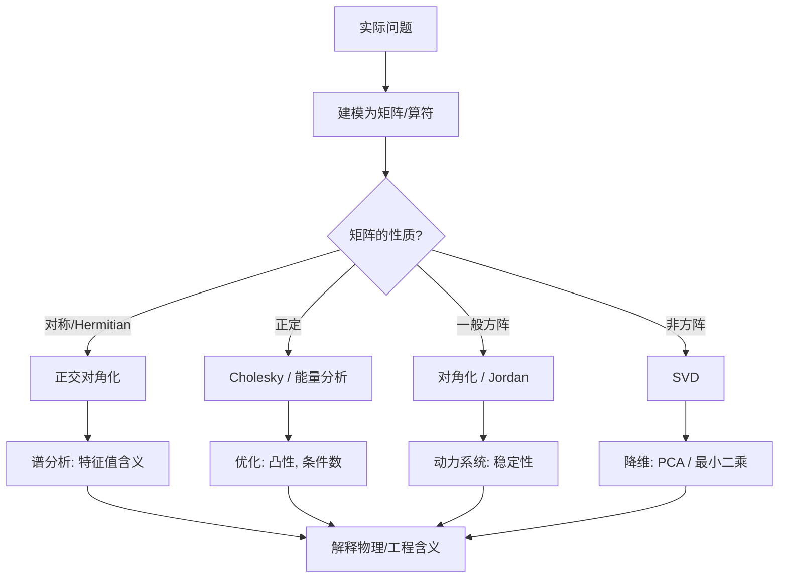

# 第9章 应用专题 (Applications)

> **作者**：kyksj-1
> **风格致敬**：Gilbert Strang × 3Blue1Brown

---

## 本章导读

前八章系统建立了特征值、对角化、二次型、正交性、正定性等工具。本章要回答一个终极问题：

> **这些工具在真实世界中究竟有什么用？**

我们将穿越五大领域——量子力学、优化与输运、深度学习、金融、刚体力学——展示线性代数如何成为现代科学与工程的**通用语言**。

每个领域都给出**非入门级**的例子和完整的代码实现。

---

## 9.1 量子力学中的应用

### 9.1.1 可观测量与厄米算符

在量子力学中，物理可观测量（能量、动量、角动量等）对应**厄米算符**（Hermitian operator），即满足 $\hat{A}^\dagger = \hat{A}$ 的算符。

在有限维空间中，厄米算符就是**厄米矩阵**（$A^\dagger = A$，实矩阵退化为对称矩阵）。

**谱定理的物理意义**：

| 数学 | 物理 |
|------|------|
| 特征值 $\lambda_i$ | 可观测量的**测量值**（一定是实数） |
| 特征向量 $\|n\rangle$ | 对应测量值的**本征态** |
| 谱分解 $\hat{A} = \sum \lambda_i \|i\rangle\langle i\|$ | 可观测量在本征态上的展开 |
| 概率 $|\langle i|\psi\rangle|^2$ | 测量得到 $\lambda_i$ 的概率 |

### 9.1.2 例题：三维耦合势场中的能级

考虑一个粒子处于三维耦合谐振势中：

$$
V(x, y, z) = \frac{1}{2}(k_{xx}x^2 + k_{yy}y^2 + k_{zz}z^2 + 2k_{xy}xy + 2k_{xz}xz + 2k_{yz}yz)
$$

这个势能是一个**二次型**：$V = \frac{1}{2}\mathbf{r}^T K \mathbf{r}$，其中 $K$ 是刚度矩阵（对称正定）。

**核心洞见**：通过正交对角化 $K = Q\Lambda Q^T$，可以将耦合的三维问题分解为三个**独立的**一维谐振子。

在新坐标 $\boldsymbol{\xi} = Q^T \mathbf{r}$ 下：

$$
V = \frac{1}{2}(\lambda_1 \xi_1^2 + \lambda_2 \xi_2^2 + \lambda_3 \xi_3^2)
$$

总能量本征值为：

$$
\boxed{E_{n_1 n_2 n_3} = \hbar\omega_1(n_1 + \tfrac{1}{2}) + \hbar\omega_2(n_2 + \tfrac{1}{2}) + \hbar\omega_3(n_3 + \tfrac{1}{2})}
$$

其中 $\omega_i = \sqrt{\lambda_i / m}$，$n_i = 0, 1, 2, \ldots$

```python
import numpy as np
from itertools import product

def coupled_harmonic_oscillator_3d(K, m=1.0, hbar=1.0, n_levels=10):
    """
    求解三维耦合谐振势的能级。

    参数:
        K: 3x3 刚度矩阵（对称正定）
        m: 粒子质量
        hbar: 约化普朗克常数
        n_levels: 显示的能级数
    """
    # 正交对角化
    eigenvalues, Q = np.linalg.eigh(K)
    omega = np.sqrt(eigenvalues / m)

    print(f"刚度矩阵 K:\n{K}")
    print(f"特征值 (k_1, k_2, k_3): {eigenvalues}")
    print(f"主轴频率 (omega_1, omega_2, omega_3): {omega}")
    print(f"旋转矩阵 Q:\n{np.round(Q, 4)}")

    # 计算能级
    max_n = 5
    levels = []
    for n1, n2, n3 in product(range(max_n), repeat=3):
        E = hbar * (omega[0]*(n1+0.5) + omega[1]*(n2+0.5) + omega[2]*(n3+0.5))
        levels.append((E, n1, n2, n3))

    levels.sort()
    print(f"\n前 {n_levels} 个能级:")
    for i, (E, n1, n2, n3) in enumerate(levels[:n_levels]):
        print(f"  E = {E:.4f}, (n1,n2,n3) = ({n1},{n2},{n3})")

    return eigenvalues, Q, levels


# 具体例子：有耦合项的势场
K = np.array([[5.0, 1.0, 0.5],
              [1.0, 3.0, 0.3],
              [0.5, 0.3, 4.0]])
coupled_harmonic_oscillator_3d(K)
```

### 9.1.3 自旋-1/2 系统与 Pauli 矩阵

自旋-1/2 粒子的自旋算符由 **Pauli 矩阵**表示：

$$
\sigma_x = \begin{pmatrix} 0 & 1 \\ 1 & 0 \end{pmatrix}, \quad
\sigma_y = \begin{pmatrix} 0 & -i \\ i & 0 \end{pmatrix}, \quad
\sigma_z = \begin{pmatrix} 1 & 0 \\ 0 & -1 \end{pmatrix}
$$

每个 Pauli 矩阵的特征值都是 $\pm 1$（对应自旋向上/向下），互相之间的**对易关系**决定了哪些可观测量可以同时测量。

$$
[\sigma_x, \sigma_y] = 2i\sigma_z \neq 0
$$

$\sigma_x$ 和 $\sigma_y$ 不可交换 → 不可同时对角化 → 不可同时测量（不确定性原理的矩阵本质）。

### 9.1.4 量子态的演化与矩阵指数

Schrodinger 方程的形式解：

$$
|\psi(t)\rangle = e^{-i\hat{H}t/\hbar}|\psi(0)\rangle
$$

如果 $\hat{H}$ 可对角化：$H = U\Lambda U^\dagger$，则：

$$
e^{-iHt/\hbar} = U \, \text{diag}(e^{-i\lambda_1 t/\hbar}, \ldots, e^{-i\lambda_n t/\hbar}) \, U^\dagger
$$

这就是对角化在量子力学中的直接应用。

---

## 9.2 多变量优化与输运问题

### 9.2.1 Newton 法的完整推导

考虑无约束优化 $\min_\mathbf{x} f(\mathbf{x})$。在当前点 $\mathbf{x}_k$ 处 Taylor 展开到二阶：

$$
f(\mathbf{x}_k + \delta) \approx f(\mathbf{x}_k) + \nabla f^T \delta + \frac{1}{2}\delta^T H \delta
$$

令关于 $\delta$ 的导数为零：$H\delta = -\nabla f$，得到 Newton 步长：

$$
\boxed{\delta^* = -H^{-1}\nabla f}
$$

**正定性的角色**：
- $H$ 正定 → $\delta^*$ 是下降方向 → Newton 法向极小值前进
- $H$ 不定 → $\delta^*$ 可能指向鞍点方向 → 需要修正（如 trust region）

### 9.2.2 实战：Rosenbrock 函数优化

Rosenbrock 函数是一个经典的难优化问题：

$$
f(x, y) = (1-x)^2 + 100(y - x^2)^2
$$

最小值在 $(1, 1)$，但函数有一个狭长的"香蕉形"谷底，条件数极大。

```python
import numpy as np
import matplotlib.pyplot as plt
from scipy.optimize import minimize

def rosenbrock(x):
    """Rosenbrock 函数"""
    return (1 - x[0])**2 + 100 * (x[1] - x[0]**2)**2

def rosenbrock_grad(x):
    """Rosenbrock 梯度"""
    dfdx = -2*(1 - x[0]) - 400*x[0]*(x[1] - x[0]**2)
    dfdy = 200*(x[1] - x[0]**2)
    return np.array([dfdx, dfdy])

def rosenbrock_hessian(x):
    """Rosenbrock Hessian"""
    H = np.array([
        [2 - 400*(x[1] - 3*x[0]**2), -400*x[0]],
        [-400*x[0], 200]
    ])
    return H

# 比较不同优化方法
x0 = np.array([-1.5, 1.5])
methods = ['Nelder-Mead', 'CG', 'BFGS', 'Newton-CG']
results = {}

for method in methods:
    if method == 'Newton-CG':
        res = minimize(rosenbrock, x0, method=method,
                      jac=rosenbrock_grad, hess=rosenbrock_hessian)
    elif method in ['CG', 'BFGS']:
        res = minimize(rosenbrock, x0, method=method, jac=rosenbrock_grad)
    else:
        res = minimize(rosenbrock, x0, method=method)
    results[method] = res
    print(f"{method:15s}: x* = [{res.x[0]:.6f}, {res.x[1]:.6f}], "
          f"f(x*) = {res.fun:.2e}, nfev = {res.nfev}")

# 可视化
fig, ax = plt.subplots(figsize=(10, 8))
x_range = np.linspace(-2, 2, 200)
y_range = np.linspace(-1, 3, 200)
X, Y = np.meshgrid(x_range, y_range)
Z = (1-X)**2 + 100*(Y-X**2)**2

ax.contour(X, Y, np.log10(Z + 1), levels=30, cmap='viridis')
ax.plot(1, 1, 'r*', markersize=20, label='Minimum (1,1)')
ax.plot(x0[0], x0[1], 'ko', markersize=10, label='Start')

# 画 Hessian 在最优点的等高线（椭圆）
H_opt = rosenbrock_hessian([1, 1])
eigenvalues_H = np.linalg.eigvalsh(H_opt)
print(f"\nHessian at (1,1): eigenvalues = {eigenvalues_H}")
print(f"Condition number = {eigenvalues_H.max()/eigenvalues_H.min():.1f}")

ax.set_xlabel('x'); ax.set_ylabel('y')
ax.set_title('Rosenbrock function (log scale contours)\n'
             f'Hessian condition number at minimum: {eigenvalues_H.max()/eigenvalues_H.min():.0f}')
ax.legend()
plt.savefig('ch9_rosenbrock.png', dpi=150, bbox_inches='tight')
plt.show()
```

### 9.2.3 输运问题：最优传输

最优传输（Optimal Transport）将一个概率分布"搬运"到另一个分布，使总成本最小。

离散形式：给定源分布 $\mathbf{a}$，目标分布 $\mathbf{b}$，成本矩阵 $C$，求传输方案 $T$：

$$
\min_{T \geq 0} \langle C, T \rangle_F \quad \text{s.t.} \quad T\mathbf{1} = \mathbf{a}, \; T^T\mathbf{1} = \mathbf{b}
$$

Sinkhorn 算法利用矩阵的**交替行列缩放**高效求解正则化版本。

```python
import numpy as np

def sinkhorn(C, a, b, reg=0.1, max_iter=100):
    """
    Sinkhorn 算法求解正则化最优传输。

    参数:
        C: n x m 成本矩阵
        a: n 维源分布（和为1）
        b: m 维目标分布（和为1）
        reg: 正则化参数（熵正则）
        max_iter: 最大迭代次数

    返回:
        T: 最优传输方案
    """
    K = np.exp(-C / reg)  # Gibbs 核
    u = np.ones_like(a)

    for _ in range(max_iter):
        v = b / (K.T @ u)
        u = a / (K @ v)

    T = np.diag(u) @ K @ np.diag(v)
    cost = np.sum(T * C)
    return T, cost


# 示例：两个一维分布的传输
n = 50
x_src = np.linspace(0, 1, n)
x_tgt = np.linspace(0, 1, n)

# 源分布：双峰高斯
a = np.exp(-(x_src - 0.3)**2 / 0.01) + np.exp(-(x_src - 0.7)**2 / 0.01)
a /= a.sum()

# 目标分布：单峰高斯
b = np.exp(-(x_tgt - 0.5)**2 / 0.02)
b /= b.sum()

# 成本矩阵（欧氏距离的平方）
C = (x_src[:, None] - x_tgt[None, :])**2

T, cost = sinkhorn(C, a, b, reg=0.005)
print(f"最优传输成本: {cost:.6f}")
print(f"传输矩阵的形状: {T.shape}")
print(f"传输矩阵的行和误差: {np.max(np.abs(T.sum(axis=1) - a)):.2e}")
print(f"传输矩阵的列和误差: {np.max(np.abs(T.sum(axis=0) - b)):.2e}")
```

---

## 9.3 深度学习中的应用

### 9.3.1 注意力机制 (Attention) 的线性代数本质

Transformer 的核心——**缩放点积注意力**：

$$
\text{Attention}(Q, K, V) = \text{softmax}\left(\frac{QK^T}{\sqrt{d_k}}\right) V
$$

**线性代数视角**：
- $QK^T$：计算 Query 和 Key 之间的**内积相似度矩阵**（$n \times n$）
- softmax：将相似度转化为概率权重
- 乘以 $V$：对 Value 做**加权组合**（一种"软投影"）

注意力矩阵 $A = \text{softmax}(QK^T/\sqrt{d_k})$ 是一个**行随机矩阵**（每行和为1），它本质上是一种**自适应投影**。

```python
import numpy as np

def scaled_dot_product_attention(Q, K, V):
    """
    实现缩放点积注意力。

    参数:
        Q: (seq_len, d_k) Query 矩阵
        K: (seq_len, d_k) Key 矩阵
        V: (seq_len, d_v) Value 矩阵

    返回:
        output: (seq_len, d_v) 注意力输出
        attention_weights: (seq_len, seq_len) 注意力权重矩阵
    """
    d_k = Q.shape[-1]

    # 相似度矩阵
    scores = Q @ K.T / np.sqrt(d_k)

    # softmax（数值稳定版）
    scores_shifted = scores - scores.max(axis=-1, keepdims=True)
    exp_scores = np.exp(scores_shifted)
    attention_weights = exp_scores / exp_scores.sum(axis=-1, keepdims=True)

    # 加权组合
    output = attention_weights @ V

    return output, attention_weights


# 示例
np.random.seed(42)
seq_len, d_k, d_v = 6, 4, 4
Q = np.random.randn(seq_len, d_k)
K = np.random.randn(seq_len, d_k)
V = np.random.randn(seq_len, d_v)

output, attn = scaled_dot_product_attention(Q, K, V)
print(f"注意力权重矩阵 (每行和为1):\n{np.round(attn, 3)}")
print(f"\n行和验证: {attn.sum(axis=1)}")

# 分析注意力矩阵的谱
eigenvalues_attn = np.linalg.eigvals(attn)
print(f"\n注意力矩阵的特征值模: {np.abs(eigenvalues_attn).round(4)}")
print("（行随机矩阵的最大特征值 = 1）")
```

### 9.3.2 损失函数地形与 Hessian 分析

深度学习中损失函数 $L(\boldsymbol{\theta})$ 的地形结构由 Hessian $H = \nabla^2 L$ 决定：

| Hessian 特性 | 地形含义 | 训练影响 |
|-------------|---------|---------|
| 正定 | 局部极小值（碗底） | 稳定收敛 |
| 不定（有正有负特征值） | 鞍点 | SGD 能逃逸 |
| 接近奇异（条件数极大） | 狭长谷底 | 训练困难 |
| 大量接近零的特征值 | 平坦方向 | 多解等价 |

**现代发现**：深度网络的 Hessian 通常有大量接近零的特征值和少量大特征值，形成**"块状"谱**。这意味着损失地形在大多数方向上几乎是平的。

```python
import numpy as np

def analyze_loss_landscape(model_fn, params, loss_fn, data, n_directions=2):
    """
    沿随机方向分析损失地形（简化版）。

    参数:
        model_fn: 模型函数 model_fn(params, x) -> predictions
        params: 参数向量
        loss_fn: 损失函数 loss_fn(predictions, targets) -> scalar
        data: (x, y) 数据
        n_directions: 探测方向数
    """
    x, y = data
    n_params = len(params)

    # 生成随机方向
    directions = []
    for _ in range(n_directions):
        d = np.random.randn(n_params)
        d /= np.linalg.norm(d)
        directions.append(d)

    # 沿方向扫描
    alphas = np.linspace(-1, 1, 101)
    losses = np.zeros((n_directions, len(alphas)))

    for i, d in enumerate(directions):
        for j, alpha in enumerate(alphas):
            perturbed = params + alpha * d
            pred = model_fn(perturbed, x)
            losses[i, j] = loss_fn(pred, y)

    # 数值估计 Hessian（仅沿探测方向）
    center_loss = loss_fn(model_fn(params, x), y)
    eps = 1e-4
    hessian_diag = []
    for d in directions:
        l_plus = loss_fn(model_fn(params + eps*d, x), y)
        l_minus = loss_fn(model_fn(params - eps*d, x), y)
        h = (l_plus - 2*center_loss + l_minus) / eps**2
        hessian_diag.append(h)

    print(f"损失在当前点: {center_loss:.6f}")
    print(f"沿随机方向的曲率: {hessian_diag}")
    print("正曲率 → 碗底方向; 负曲率 → 鞍点方向; 接近零 → 平坦方向")

    return alphas, losses


# 简单示例：线性回归的损失地形
np.random.seed(42)
n, d = 50, 3
X = np.random.randn(n, d)
w_true = np.array([1.0, -2.0, 0.5])
y = X @ w_true + 0.1 * np.random.randn(n)

model = lambda w, x: x @ w
loss = lambda pred, y: np.mean((pred - y)**2)

w0 = np.zeros(d)
alphas, losses = analyze_loss_landscape(model, w0, loss, (X, y))

# 解析 Hessian
H = 2/n * X.T @ X
print(f"\n解析 Hessian 的特征值: {np.linalg.eigvalsh(H)}")
print(f"条件数: {np.linalg.cond(H):.2f}")
```

### 9.3.3 扩散模型中的噪声调度

扩散模型（如 DDPM）的核心操作是逐步加噪和去噪：

$$
\mathbf{x}_t = \sqrt{\bar{\alpha}_t}\,\mathbf{x}_0 + \sqrt{1 - \bar{\alpha}_t}\,\boldsymbol{\epsilon}
$$

协方差结构：$\text{Cov}(\mathbf{x}_t) = \bar{\alpha}_t \text{Cov}(\mathbf{x}_0) + (1-\bar{\alpha}_t)I$

这是两个正定矩阵的**凸组合**（仍然正定），其特征值随 $t$ 的变化揭示了信息损失的过程。

```python
import numpy as np
import matplotlib.pyplot as plt

def diffusion_covariance_analysis(Sigma_0, n_steps=100):
    """
    分析扩散过程中协方差矩阵特征值的演化。

    参数:
        Sigma_0: 原始数据的协方差矩阵（正定）
        n_steps: 扩散步数
    """
    # 线性噪声调度
    betas = np.linspace(1e-4, 0.02, n_steps)
    alphas = 1 - betas
    alpha_bar = np.cumprod(alphas)

    eigenvalues_0 = np.linalg.eigvalsh(Sigma_0)
    d = len(eigenvalues_0)

    # 在正交基下，Sigma_t 的特征值
    eigenvalues_t = np.zeros((n_steps, d))
    for t in range(n_steps):
        ab = alpha_bar[t]
        eigenvalues_t[t] = ab * eigenvalues_0 + (1 - ab)

    # 可视化
    plt.figure(figsize=(12, 5))

    plt.subplot(121)
    for i in range(d):
        plt.plot(eigenvalues_t[:, i], label=f'lambda_{i+1}')
    plt.axhline(y=1, color='k', ls='--', alpha=0.5, label='Pure noise (I)')
    plt.xlabel('Diffusion step t')
    plt.ylabel('Eigenvalue of Cov(x_t)')
    plt.title('Eigenvalue evolution during diffusion')
    plt.legend()

    plt.subplot(122)
    kappa = eigenvalues_t.max(axis=1) / eigenvalues_t.min(axis=1)
    plt.plot(kappa, 'r-', lw=2)
    plt.xlabel('Diffusion step t')
    plt.ylabel('Condition number')
    plt.title('Condition number -> 1 (isotropic noise)')

    plt.tight_layout()
    plt.savefig('ch9_diffusion_eigenvalues.png', dpi=150, bbox_inches='tight')
    plt.show()


# 原始数据有明显的方向性（条件数大）
Sigma_0 = np.array([[5.0, 2.0, 0.5],
                    [2.0, 2.0, 0.3],
                    [0.5, 0.3, 0.5]])
diffusion_covariance_analysis(Sigma_0)
```

---

## 9.4 关系总览与综合 SOP

### 9.4.1 跨领域概念映射

```mermaid
flowchart TD
    subgraph Core["线性代数核心"]
        EIG["特征值/特征向量"]
        DIAG["对角化"]
        QF["二次型"]
        PD["正定性"]
        ORTH["正交性"]
    end

    subgraph QM["量子力学"]
        OBS["可观测量 = Hermitian"]
        MEAS["测量值 = 特征值"]
        STATE["本征态 = 特征向量"]
        COMM["对易 = 同时对角化"]
    end

    subgraph OPT["优化"]
        HESS["Hessian = 二次型"]
        CONV["凸性 = 正定"]
        COND["条件数 = 优化难度"]
        NEWTON["Newton法 = H^(-1) grad"]
    end

    subgraph DL["深度学习"]
        ATTN["注意力 = 相似度矩阵"]
        LOSS["损失地形 = Hessian谱"]
        DIFF["扩散 = 协方差演化"]
    end

    subgraph FIN["金融"]
        COV["协方差 = 风险"]
        PORT["投资组合 = 二次优化"]
        PCAF["PCA = 因子分析"]
    end

    subgraph MECH["力学"]
        INER["惯性张量 = 对称正定"]
        STAB["稳定性 = 特征值符号"]
        MODE["简正模态 = 特征向量"]
    end

    EIG --> MEAS
    EIG --> STAB
    DIAG --> COMM
    DIAG --> MODE
    QF --> HESS
    QF --> COV
    PD --> CONV
    PD --> INER
    ORTH --> STATE
    ORTH --> PCAF
    ORTH --> ATTN

    style Core fill:#e3f2fd
    style QM fill:#e8f5e9
    style OPT fill:#fff3e0
    style DL fill:#f3e5f5
    style FIN fill:#fce4ec
    style MECH fill:#e0f7fa
```



### 9.4.2 问题解决 SOP

面对一个实际问题，线性代数的使用流程：



---

## 9.5-9.7 金融、刚体力学与高维推广

> 详见附录文件或后续更新。

---

## 习题

### 概念理解

**9.1** 解释为什么量子力学中可观测量必须用厄米矩阵表示。如果用非厄米矩阵，物理上会出什么问题？

**9.2** 在优化问题中，"条件数"和"收敛速度"是什么关系？用二次函数 $f(\mathbf{x}) = \frac{1}{2}\mathbf{x}^TA\mathbf{x}$ 给出定量分析。

**9.3** Transformer 中的注意力矩阵是行随机矩阵。证明行随机矩阵的最大特征值为 1，对应特征向量为 $\mathbf{1}$。

### 计算练习

**9.4** 一个三维耦合谐振势 $V = 2x^2 + 3y^2 + 4z^2 + 2xy - 2yz$。
  - 写出刚度矩阵 $K$
  - 求主轴方向和主频率
  - 写出前5个能级（取 $m = \hbar = 1$）

**9.5** 对矩阵 $A = \begin{pmatrix} -1 & 2 \\ -3 & -1 \end{pmatrix}$ 代表的线性系统 $\dot{\mathbf{x}} = A\mathbf{x}$：
  - 判断稳定性
  - 画出相图（编程）
  - 求 Lyapunov 函数

### 思考题

**9.6** 扩散模型中，为什么协方差矩阵的条件数随扩散步数趋向 1？这对"去噪"过程意味着什么？

**9.7** 比较三种方法的适用场景：特征值分解、Cholesky 分解、SVD。各自最擅长解决什么类型的问题？

### 编程题

**9.8** 实现一个完整的 Markowitz 投资组合优化器：
  - 模拟 5 只资产 500 天的收益率（含相关性）
  - 计算协方差矩阵，分析其特征值（主成分 = 风险因子）
  - 求解有效前沿（至少 20 个点）
  - 可视化：有效前沿、各资产位置、最小方差组合

**9.9** 模拟 Euler 方程（刚体无力矩旋转）：
  - 选取三个不同的主转动惯量 $I_1 < I_2 < I_3$
  - 分别给出绕三个主轴附近的初始角速度
  - 用 `scipy.integrate.solve_ivp` 数值求解
  - 展示中间轴不稳定性（Tennis Racket 定理）

---

> **下一章预告**：高维空间中的线性代数有什么新的现象？维数灾难如何影响计算？随机矩阵理论告诉我们什么？第10章将探讨高维推广。
