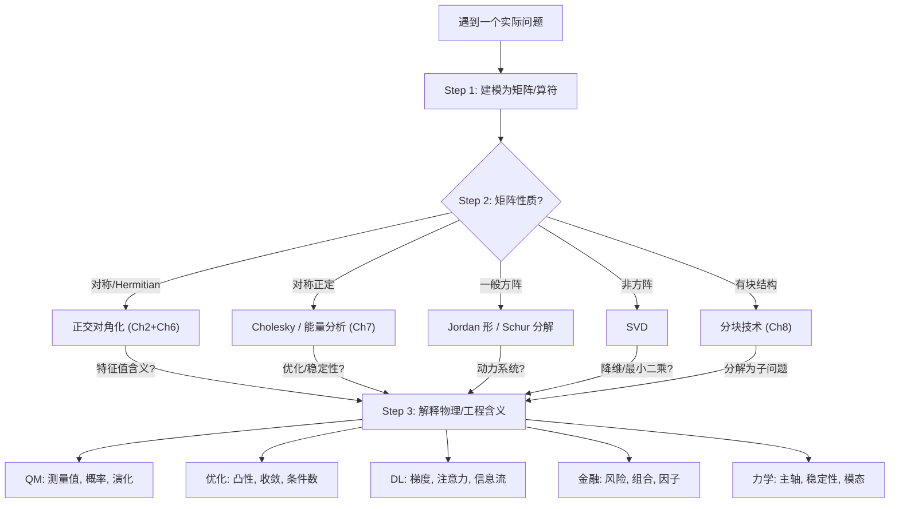

# 第9章 应用专题（下）：金融、刚体力学与综合视角

> **作者**：kyksj-1
> **风格致敬**：Gilbert Strang × 3Blue1Brown

---

## 本篇导读

上篇展示了线性代数在量子力学、优化与深度学习中的威力。本篇继续两个同样深刻的领域——**金融**与**刚体力学**——并在最后给出一幅**全景地图**，将前八章的所有工具与本章五大领域串联起来。

Gilbert Strang 说过：

> "线性代数之所以无处不在，是因为线性是我们理解世界的第一近似——而这个近似出奇地好。"

---

## 9.5 金融中的应用

### 9.5.1 协方差矩阵：风险的数学肖像

金融学的核心问题之一：**如何度量和管理风险？**

设有 $n$ 只资产，其日收益率为随机向量 $\mathbf{r} = (r_1, r_2, \ldots, r_n)^T$。协方差矩阵

$$
\boxed{\Sigma = \text{Cov}(\mathbf{r}) = E[(\mathbf{r} - \boldsymbol{\mu})(\mathbf{r} - \boldsymbol{\mu})^T]}
$$

完整编码了资产之间的风险结构：

| $\Sigma$ 的元素 | 含义 |
|----------------|------|
| $\Sigma_{ii} = \sigma_i^2$ | 第 $i$ 只资产的**方差**（自身波动率） |
| $\Sigma_{ij}$ ($i \neq j$) | 资产 $i$ 与 $j$ 的**协方差**（联动程度） |
| 特征值 $\lambda_1 \geq \cdots \geq \lambda_n$ | **主风险因子**的方差贡献 |
| 特征向量 $\mathbf{v}_k$ | 第 $k$ 个主风险因子的**资产暴露方向** |

> **3Blue1Brown 的视角**：把 $n$ 只资产的收益率看作 $\mathbb{R}^n$ 中的随机点云。协方差矩阵 $\Sigma$ 描述了这个点云的**形状**——它是一个椭球。特征向量是椭球的主轴方向，特征值是沿各主轴的"伸展量"。最大的特征值对应点云最"胖"的方向——那就是风险最集中的方向。

#### 实际市场数据的谱特征

真实市场的协方差矩阵有一个显著特征：**少数几个特征值远大于其余**。

- **第一主成分**（最大特征值）通常解释了 30%-50% 的总方差，对应**市场因子**——所有资产同涨同跌的倾向
- **第二、三主成分**对应**行业因子**或**风格因子**（如价值 vs 成长）
- **剩余主成分**的特征值很小，对应个股特异性噪声

这正是 **PCA（主成分分析）** 在金融中如此重要的原因：高维的资产空间可以用少数几个风险因子有效近似。

### 9.5.2 Markowitz 投资组合理论：二次型的胜利

Harry Markowitz 在 1952 年提出的均值-方差框架，是线性代数在金融中最经典的应用。

**问题设定**：投资者持有 $n$ 只资产，权重为 $\mathbf{w} = (w_1, \ldots, w_n)^T$（$\sum w_i = 1$）。

- 期望收益：$\mu_p = \mathbf{w}^T \boldsymbol{\mu}$
- 投资组合方差（风险）：$\sigma_p^2 = \mathbf{w}^T \Sigma \mathbf{w}$

注意：$\sigma_p^2 = \mathbf{w}^T \Sigma \mathbf{w}$ 就是一个**二次型**！（回顾 Ch3）。$\Sigma$ 正定保证了风险始终为正。

#### 最小方差组合

$$
\min_{\mathbf{w}} \; \mathbf{w}^T \Sigma \mathbf{w} \quad \text{s.t.} \quad \mathbf{1}^T \mathbf{w} = 1
$$

用 Lagrange 乘子法：

$$
\mathcal{L} = \mathbf{w}^T \Sigma \mathbf{w} - \lambda(\mathbf{1}^T\mathbf{w} - 1)
$$

$$
\frac{\partial \mathcal{L}}{\partial \mathbf{w}} = 2\Sigma\mathbf{w} - \lambda\mathbf{1} = 0 \implies \mathbf{w} = \frac{\lambda}{2}\Sigma^{-1}\mathbf{1}
$$

代入约束 $\mathbf{1}^T\mathbf{w} = 1$：

$$
\boxed{\mathbf{w}_{\text{GMV}} = \frac{\Sigma^{-1}\mathbf{1}}{\mathbf{1}^T\Sigma^{-1}\mathbf{1}}}
$$

这就是**全局最小方差组合**（Global Minimum Variance Portfolio）。注意它**完全不需要预估收益率** $\boldsymbol{\mu}$，只依赖协方差矩阵——这是其在实际中如此受欢迎的原因。

#### 有效前沿的参数化

给定目标收益 $\mu_{\text{target}}$，求最小风险：

$$
\min_{\mathbf{w}} \; \mathbf{w}^T\Sigma\mathbf{w} \quad \text{s.t.} \quad \mathbf{w}^T\boldsymbol{\mu} = \mu_{\text{target}}, \quad \mathbf{1}^T\mathbf{w} = 1
$$

双约束 Lagrange 方程的解为：

$$
\mathbf{w}^*(\mu_{\text{target}}) = \Sigma^{-1}\begin{pmatrix} \boldsymbol{\mu} & \mathbf{1} \end{pmatrix} \begin{pmatrix} \boldsymbol{\mu}^T\Sigma^{-1}\boldsymbol{\mu} & \boldsymbol{\mu}^T\Sigma^{-1}\mathbf{1} \\ \mathbf{1}^T\Sigma^{-1}\boldsymbol{\mu} & \mathbf{1}^T\Sigma^{-1}\mathbf{1} \end{pmatrix}^{-1} \begin{pmatrix} \mu_{\text{target}} \\ 1 \end{pmatrix}
$$

设 $a = \boldsymbol{\mu}^T\Sigma^{-1}\boldsymbol{\mu}$，$b = \boldsymbol{\mu}^T\Sigma^{-1}\mathbf{1}$，$c = \mathbf{1}^T\Sigma^{-1}\mathbf{1}$，有效前沿上的最小方差为：

$$
\boxed{\sigma_p^2(\mu_{\text{target}}) = \frac{a - 2b\mu_{\text{target}} + c\mu_{\text{target}}^2}{ac - b^2}}
$$

这是 $\mu_{\text{target}}$ 的**二次函数**——在 $(\sigma_p, \mu_p)$ 平面上画出的就是经典的**双曲线**（有效前沿）。

#### 谱分解视角下的投资组合

在 $\Sigma$ 的特征基 $\{\mathbf{v}_1, \ldots, \mathbf{v}_n\}$ 下，令 $\tilde{\mathbf{w}} = Q^T\mathbf{w}$（$Q$ 是特征向量矩阵），则：

$$
\sigma_p^2 = \mathbf{w}^T\Sigma\mathbf{w} = \sum_{k=1}^{n} \lambda_k \tilde{w}_k^2
$$

**物理意义**：投资组合的风险可以分解为在各主成分方向上的**风险暴露**。$\tilde{w}_k$ 大意味着组合在第 $k$ 个风险因子上暴露多。

**风险预算**（Risk Budgeting）：要求组合在每个主成分上的风险贡献相等：$\lambda_k \tilde{w}_k^2 = \text{const}$，这给出 $|\tilde{w}_k| \propto 1/\sqrt{\lambda_k}$——即在高波动方向上少配权重，低波动方向上多配。这就是**风险平价**（Risk Parity）策略的数学本质。

### 9.5.3 风险度量：VaR 与谱分解

**在险价值**（Value at Risk, VaR）是金融监管的核心指标。

设投资组合收益 $r_p = \mathbf{w}^T\mathbf{r} \sim \mathcal{N}(\mu_p, \sigma_p^2)$，则 $\alpha$ 水平的 VaR 为：

$$
\boxed{\text{VaR}_\alpha = -(\mu_p + z_\alpha \sigma_p) = -(\mathbf{w}^T\boldsymbol{\mu} + z_\alpha \sqrt{\mathbf{w}^T\Sigma\mathbf{w}})}
$$

其中 $z_\alpha$ 是标准正态分布的 $\alpha$ 分位数（如 $z_{0.05} \approx -1.645$）。

**边际 VaR**（Marginal VaR）：第 $i$ 只资产对 VaR 的贡献

$$
\frac{\partial \text{VaR}}{\partial w_i} = -z_\alpha \cdot \frac{(\Sigma\mathbf{w})_i}{\sigma_p}
$$

这里 $\Sigma\mathbf{w}$ 可以用谱分解展开：$\Sigma\mathbf{w} = \sum_k \lambda_k \mathbf{v}_k(\mathbf{v}_k^T\mathbf{w})$。每个主成分 $\mathbf{v}_k$ 对边际风险的贡献一目了然。

#### 压力测试：沿特征向量方向的极端情景

监管部门要求的压力测试可以用特征向量方向来构造：

- **最坏情景**：沿 $\mathbf{v}_1$（最大特征值方向）施加 $k\sigma_1$ 的冲击
- **行业冲击**：沿行业因子对应的特征向量方向施加冲击
- **尾部风险**：考虑多个主成分同时发生极端偏移

### 9.5.4 因子模型与降维

金融中广泛使用的**因子模型**：

$$
\mathbf{r} = \boldsymbol{\alpha} + B\mathbf{f} + \boldsymbol{\epsilon}
$$

其中 $\mathbf{f} \in \mathbb{R}^k$ 是 $k$ 个公共因子（$k \ll n$），$B \in \mathbb{R}^{n \times k}$ 是**因子载荷矩阵**，$\boldsymbol{\epsilon}$ 是特异性噪声。

协方差矩阵的因子分解：

$$
\Sigma = B\Sigma_f B^T + D
$$

其中 $\Sigma_f$ 是因子协方差矩阵，$D$ 是对角的特异性方差矩阵。

**与 PCA 的关系**：如果直接对 $\Sigma$ 做特征值分解，取前 $k$ 个特征值和特征向量：

$$
\Sigma \approx \sum_{j=1}^{k} \lambda_j \mathbf{v}_j\mathbf{v}_j^T + \text{residual}
$$

这等价于一个**统计因子模型**，其中 $B = (\sqrt{\lambda_1}\mathbf{v}_1, \ldots, \sqrt{\lambda_k}\mathbf{v}_k)$。

Fama-French 三因子模型的三个因子（市场、规模、价值）可以理解为协方差矩阵前三个主成分的**经济学命名**。

### 9.5.5 完整代码实现

```python
import numpy as np
import matplotlib.pyplot as plt
from scipy.optimize import minimize

# ============================================================
# 模拟资产收益率数据（含因子结构）
# ============================================================
def simulate_factor_returns(n_assets=10, n_days=1000, n_factors=3, seed=42):
    """
    使用因子模型生成具有真实结构的资产收益率。

    参数:
        n_assets: 资产数量
        n_days: 交易日数
        n_factors: 公共因子数
        seed: 随机种子
    返回:
        returns: (n_days, n_assets) 收益率矩阵
        mu: 期望收益向量
        Sigma: 协方差矩阵
    """
    np.random.seed(seed)

    # 因子载荷矩阵（模拟行业结构）
    B = np.random.randn(n_assets, n_factors) * 0.3
    # 第一个因子是市场因子（所有资产正暴露）
    B[:, 0] = np.abs(B[:, 0]) + 0.2

    # 因子收益
    factor_returns = np.random.randn(n_days, n_factors) * 0.01

    # 特异性收益（各资产独立噪声）
    idio_vol = np.random.uniform(0.005, 0.02, n_assets)
    idio_returns = np.random.randn(n_days, n_assets) * idio_vol

    # 期望收益（年化 5%-15%）
    annual_mu = np.random.uniform(0.05, 0.15, n_assets)
    daily_mu = annual_mu / 252

    # 合成收益率
    returns = daily_mu + factor_returns @ B.T + idio_returns

    mu = returns.mean(axis=0)
    Sigma = np.cov(returns, rowvar=False)

    return returns, mu, Sigma


# ============================================================
# 有效前沿计算
# ============================================================
def efficient_frontier(mu, Sigma, n_points=50, allow_short=True):
    """
    计算 Markowitz 有效前沿。

    参数:
        mu: 期望收益向量
        Sigma: 协方差矩阵
        n_points: 前沿上的点数
        allow_short: 是否允许卖空
    返回:
        mus_ef: 前沿上的期望收益
        sigmas_ef: 前沿上的标准差
        weights_ef: 各点的权重向量
    """
    n = len(mu)

    if allow_short:
        # 解析解
        Sigma_inv = np.linalg.inv(Sigma)
        ones = np.ones(n)
        a = mu @ Sigma_inv @ mu
        b = mu @ Sigma_inv @ ones
        c = ones @ Sigma_inv @ ones

        mu_min = b / c
        mu_max = mu.max() * 1.2
        mus_ef = np.linspace(mu_min * 0.8, mu_max, n_points)
        sigmas_ef = np.sqrt((a - 2*b*mus_ef + c*mus_ef**2) / (a*c - b**2))

        # 各点的权重
        weights_ef = []
        for mu_target in mus_ef:
            lam = (c*mu_target - b) / (a*c - b**2)
            gamma = (a - b*mu_target) / (a*c - b**2)
            w = Sigma_inv @ (lam*mu + gamma*ones)
            weights_ef.append(w)
        weights_ef = np.array(weights_ef)
    else:
        # 数值解（有约束）
        mus_ef = np.linspace(mu.min(), mu.max(), n_points)
        sigmas_ef = []
        weights_ef = []

        for mu_target in mus_ef:
            # 目标：最小化 w^T Sigma w
            def objective(w):
                return w @ Sigma @ w

            constraints = [
                {'type': 'eq', 'fun': lambda w: np.sum(w) - 1},
                {'type': 'eq', 'fun': lambda w: w @ mu - mu_target}
            ]
            bounds = [(0, 1)] * n  # 不允许卖空
            w0 = np.ones(n) / n

            res = minimize(objective, w0, method='SLSQP',
                          constraints=constraints, bounds=bounds)
            if res.success:
                sigmas_ef.append(np.sqrt(res.fun))
                weights_ef.append(res.x)
            else:
                sigmas_ef.append(np.nan)
                weights_ef.append(np.full(n, np.nan))

        sigmas_ef = np.array(sigmas_ef)
        weights_ef = np.array(weights_ef)

    return mus_ef, sigmas_ef, weights_ef


# ============================================================
# PCA 风险分析
# ============================================================
def pca_risk_analysis(Sigma, asset_names=None):
    """
    对协方差矩阵进行 PCA 分析。

    参数:
        Sigma: 协方差矩阵
        asset_names: 资产名称列表
    """
    eigenvalues, eigenvectors = np.linalg.eigh(Sigma)
    # 从大到小排序
    idx = np.argsort(eigenvalues)[::-1]
    eigenvalues = eigenvalues[idx]
    eigenvectors = eigenvectors[:, idx]

    total_var = eigenvalues.sum()
    explained_ratio = eigenvalues / total_var
    cumulative_ratio = np.cumsum(explained_ratio)

    n = len(eigenvalues)
    if asset_names is None:
        asset_names = [f"Asset {i+1}" for i in range(n)]

    print("=" * 60)
    print("PCA 风险因子分析")
    print("=" * 60)
    for k in range(min(5, n)):
        print(f"\nPC{k+1}: 解释方差比 = {explained_ratio[k]:.1%}, "
              f"累计 = {cumulative_ratio[k]:.1%}")
        # 显示该主成分的前3大载荷
        loadings = eigenvectors[:, k]
        top_idx = np.argsort(np.abs(loadings))[::-1][:3]
        for i in top_idx:
            print(f"  {asset_names[i]}: {loadings[i]:+.3f}")

    return eigenvalues, eigenvectors, explained_ratio


# ============================================================
# VaR 计算与分解
# ============================================================
def var_analysis(w, mu, Sigma, alpha=0.05):
    """
    计算投资组合的 VaR 并按主成分分解。

    参数:
        w: 投资组合权重
        mu: 期望收益
        Sigma: 协方差矩阵
        alpha: 置信水平（如 0.05 表示 95% VaR）
    """
    from scipy.stats import norm

    z_alpha = norm.ppf(alpha)  # 负值
    mu_p = w @ mu
    sigma_p = np.sqrt(w @ Sigma @ w)
    var = -(mu_p + z_alpha * sigma_p)

    # 边际 VaR
    marginal_var = -z_alpha * (Sigma @ w) / sigma_p

    # 主成分分解
    eigenvalues, V = np.linalg.eigh(Sigma)
    idx = np.argsort(eigenvalues)[::-1]
    eigenvalues = eigenvalues[idx]
    V = V[:, idx]

    # 组合在各主成分上的暴露
    w_pc = V.T @ w  # 主成分权重
    risk_contrib = eigenvalues * w_pc**2  # 各PC的风险贡献
    risk_contrib_pct = risk_contrib / risk_contrib.sum()

    print(f"投资组合 VaR ({1-alpha:.0%}): {var*252**0.5:.4f} (年化)")
    print(f"期望日收益: {mu_p:.6f}, 日波动率: {sigma_p:.6f}")
    print(f"\n风险按主成分分解:")
    for k in range(min(5, len(eigenvalues))):
        print(f"  PC{k+1}: 贡献 {risk_contrib_pct[k]:.1%}")

    return var, marginal_var, risk_contrib_pct


# ============================================================
# 综合演示
# ============================================================
# 生成数据
asset_names = ['银行A', '银行B', '科技C', '科技D', '能源E',
               '消费F', '医药G', '地产H', '通信I', '材料J']
returns, mu, Sigma = simulate_factor_returns(n_assets=10, n_days=1000)

# PCA 分析
eigenvalues, eigvecs, explained = pca_risk_analysis(Sigma, asset_names)

# 有效前沿
mus_ef, sigmas_ef, weights_ef = efficient_frontier(mu, Sigma, n_points=100)
mus_ef_ns, sigmas_ef_ns, weights_ef_ns = efficient_frontier(
    mu, Sigma, n_points=50, allow_short=False
)

# 最小方差组合
Sigma_inv = np.linalg.inv(Sigma)
ones = np.ones(len(mu))
w_gmv = Sigma_inv @ ones / (ones @ Sigma_inv @ ones)
mu_gmv = w_gmv @ mu
sigma_gmv = np.sqrt(w_gmv @ Sigma @ w_gmv)

# VaR 分析
var_analysis(w_gmv, mu, Sigma)

# ============================================================
# 可视化
# ============================================================
fig, axes = plt.subplots(2, 2, figsize=(14, 12))

# (1) 有效前沿
ax = axes[0, 0]
# 年化
ax.plot(sigmas_ef * np.sqrt(252), mus_ef * 252, 'b-', lw=2,
        label='Efficient Frontier (with short)')
valid = ~np.isnan(sigmas_ef_ns)
ax.plot(sigmas_ef_ns[valid] * np.sqrt(252), mus_ef_ns[valid] * 252,
        'r--', lw=2, label='Efficient Frontier (long only)')
# 各资产
for i in range(len(mu)):
    sigma_i = np.sqrt(Sigma[i, i]) * np.sqrt(252)
    ax.plot(sigma_i, mu[i]*252, 'ko', markersize=6)
    ax.annotate(asset_names[i], (sigma_i, mu[i]*252),
               fontsize=7, ha='left')
ax.plot(sigma_gmv*np.sqrt(252), mu_gmv*252, 'g*', markersize=15,
        label='GMV Portfolio')
ax.set_xlabel('Annualized Volatility')
ax.set_ylabel('Annualized Return')
ax.set_title('Markowitz Efficient Frontier')
ax.legend(fontsize=8)

# (2) PCA 方差解释
ax = axes[0, 1]
cumulative = np.cumsum(explained)
ax.bar(range(1, len(explained)+1), explained, alpha=0.7, label='Individual')
ax.plot(range(1, len(explained)+1), cumulative, 'ro-', label='Cumulative')
ax.axhline(y=0.9, color='k', ls='--', alpha=0.3, label='90% threshold')
ax.set_xlabel('Principal Component')
ax.set_ylabel('Explained Variance Ratio')
ax.set_title('PCA Risk Factor Analysis')
ax.legend(fontsize=8)

# (3) 协方差矩阵热力图
ax = axes[1, 0]
# 转为相关系数矩阵更直观
D_inv = np.diag(1.0 / np.sqrt(np.diag(Sigma)))
corr = D_inv @ Sigma @ D_inv
im = ax.imshow(corr, cmap='RdBu_r', vmin=-1, vmax=1, interpolation='none')
ax.set_xticks(range(len(asset_names)))
ax.set_yticks(range(len(asset_names)))
ax.set_xticklabels(asset_names, rotation=45, ha='right', fontsize=7)
ax.set_yticklabels(asset_names, fontsize=7)
ax.set_title('Correlation Matrix')
plt.colorbar(im, ax=ax, shrink=0.8)

# (4) GMV 组合权重
ax = axes[1, 1]
colors = ['green' if w > 0 else 'red' for w in w_gmv]
ax.barh(range(len(w_gmv)), w_gmv, color=colors, alpha=0.7)
ax.set_yticks(range(len(asset_names)))
ax.set_yticklabels(asset_names, fontsize=8)
ax.axvline(x=0, color='k', lw=0.5)
ax.set_xlabel('Weight')
ax.set_title('Global Minimum Variance Portfolio Weights')

plt.tight_layout()
plt.savefig('ch9_finance_portfolio.png', dpi=150, bbox_inches='tight')
plt.show()

print(f"\n最小方差组合年化收益: {mu_gmv*252:.2%}")
print(f"最小方差组合年化波动: {sigma_gmv*np.sqrt(252):.2%}")
```

### 9.5.6 Cholesky 分解在蒙特卡洛模拟中的应用

生成具有给定协方差结构的随机样本，需要对 $\Sigma$ 做 Cholesky 分解：$\Sigma = LL^T$。

设 $\mathbf{z} \sim \mathcal{N}(0, I)$，则 $\mathbf{x} = L\mathbf{z} + \boldsymbol{\mu}$ 满足 $\mathbf{x} \sim \mathcal{N}(\boldsymbol{\mu}, \Sigma)$。

**验证**：$\text{Cov}(\mathbf{x}) = L\text{Cov}(\mathbf{z})L^T = LIL^T = LL^T = \Sigma$ $\checkmark$

这是 Ch7 Cholesky 分解在金融中的直接应用。蒙特卡洛定价（如期权定价）和风险模拟中，每天需要生成数百万条相关的资产路径，Cholesky 分解的效率至关重要。

```python
import numpy as np

def monte_carlo_portfolio_simulation(mu, Sigma, w, n_paths=10000,
                                      n_days=252, seed=42):
    """
    蒙特卡洛模拟投资组合的收益路径。

    参数:
        mu: 日期望收益向量
        Sigma: 日协方差矩阵
        w: 投资组合权重
        n_paths: 模拟路径数
        n_days: 模拟天数
        seed: 随机种子
    返回:
        portfolio_values: (n_paths, n_days+1) 组合价值路径
    """
    np.random.seed(seed)
    n_assets = len(mu)

    # Cholesky 分解
    L = np.linalg.cholesky(Sigma)

    # 生成相关的日收益率
    portfolio_values = np.ones((n_paths, n_days + 1))
    for t in range(n_days):
        z = np.random.randn(n_paths, n_assets)
        r = mu + z @ L.T  # 相关的日收益率
        portfolio_return = r @ w  # 组合日收益
        portfolio_values[:, t+1] = portfolio_values[:, t] * (1 + portfolio_return)

    # 统计
    final_values = portfolio_values[:, -1]
    var_95 = np.percentile(final_values, 5) - 1  # 95% VaR（损失）
    cvar_95 = final_values[final_values <= np.percentile(final_values, 5)].mean() - 1

    print(f"蒙特卡洛模拟 ({n_paths} 条路径, {n_days} 天)")
    print(f"  期望终值: {final_values.mean():.4f}")
    print(f"  中位终值: {np.median(final_values):.4f}")
    print(f"  95% VaR:  {var_95:.4f} ({var_95*100:.2f}%)")
    print(f"  95% CVaR: {cvar_95:.4f} ({cvar_95*100:.2f}%)")

    return portfolio_values
```

### 9.5.7 深入思考：为什么协方差矩阵估计如此困难？

一个 $n$ 只资产的协方差矩阵有 $n(n+1)/2$ 个自由参数。当 $n = 500$（标准的大盘指数），需要估计约 125,000 个参数。如果只有 $T = 252$ 天（一年）的数据，样本协方差矩阵

$$
\hat{\Sigma} = \frac{1}{T-1}\sum_{t=1}^{T}(\mathbf{r}_t - \bar{\mathbf{r}})(\mathbf{r}_t - \bar{\mathbf{r}})^T
$$

的秩最多为 $\min(n, T-1)$——当 $n > T$ 时，$\hat{\Sigma}$ **甚至不可逆**！

**解决方案**都与线性代数紧密相关：

1. **收缩估计**（Shrinkage）：$\hat{\Sigma}_{\text{shrink}} = (1-\delta)\hat{\Sigma} + \delta F$，其中 $F$ 是结构化目标（如对角矩阵或单因子模型），$\delta \in [0,1]$。这是将样本协方差"收缩"向一个低维结构。

2. **因子模型**：$\Sigma = B\Sigma_f B^T + D$，参数数从 $O(n^2)$ 降至 $O(nk)$（$k$ 为因子数）。

3. **随机矩阵理论**（Marchenko-Pastur 定律）：告诉我们在 $n/T = \gamma$ 固定时，样本特征值的分布。小特征值被高估，大特征值被低估——需要**去噪**（eigenvalue clipping）。

> 这些都是 Ch10（高维推广）的前奏。高维空间中，"维度灾难"让协方差估计成为一个深刻的统计学问题。

---

## 9.6 刚体力学中的应用

### 9.6.1 惯性张量：一个实实在在的对称正定矩阵

刚体力学是线性代数最古老也最直观的应用之一。一个刚体绕某轴旋转时，其动能和角动量都由一个 $3 \times 3$ 的矩阵——**惯性张量**——决定。

**定义**：对于质量分布 $\rho(\mathbf{r})$ 的刚体，惯性张量的矩阵表示为：

$$
\boxed{I_{ij} = \int_V \rho(\mathbf{r})\left(\|\mathbf{r}\|^2 \delta_{ij} - r_i r_j\right) dV}
$$

展开成分量形式：

$$
\mathbf{I} = \begin{pmatrix}
I_{xx} & -I_{xy} & -I_{xz} \\
-I_{yx} & I_{yy} & -I_{yz} \\
-I_{zx} & -I_{zy} & I_{zz}
\end{pmatrix}
$$

其中 $I_{xx} = \int \rho(y^2 + z^2)\,dV$ 是绕 $x$ 轴的转动惯量，$I_{xy} = \int \rho \, xy \,dV$ 是惯性积。

**关键性质**：
- $\mathbf{I}$ 是**对称**的：$I_{ij} = I_{ji}$（直接从定义得出）
- $\mathbf{I}$ 是**正定**的：$\boldsymbol{\omega}^T \mathbf{I} \boldsymbol{\omega} = \int \rho |\boldsymbol{\omega} \times \mathbf{r}|^2 dV > 0$（只要 $\boldsymbol{\omega} \neq 0$ 且质量不全在旋转轴上）
- 特征值 = **主转动惯量** $I_1, I_2, I_3$
- 特征向量 = **主轴方向**

**旋转动能的二次型形式**：

$$
\boxed{T = \frac{1}{2}\boldsymbol{\omega}^T \mathbf{I} \boldsymbol{\omega} = \frac{1}{2}(I_1\omega_1^2 + I_2\omega_2^2 + I_3\omega_3^2)}
$$

后面的等式在主轴坐标系下成立。这就是 Ch3 二次型的完美物理实例——通过正交对角化（找到主轴），耦合的动能表达式变成了三个独立项的和。

#### 角动量与主轴

$$
\mathbf{L} = \mathbf{I}\boldsymbol{\omega}
$$

**关键洞见**：一般情况下 $\mathbf{L}$ 与 $\boldsymbol{\omega}$ **不平行**！只有当 $\boldsymbol{\omega}$ 沿主轴方向时，$\mathbf{L} = I_k \boldsymbol{\omega}$ 才平行。这就是"特征向量方向保持不变"的物理含义——**沿主轴旋转时，角动量方向和角速度方向一致**。

> **3Blue1Brown 的视角**：惯性张量 $\mathbf{I}$ 把角速度向量"扭曲"成角动量向量。这个扭曲由一个椭球（惯性椭球）描述。只有三个特殊方向（主轴）不被扭曲——它们就是特征向量。

### 9.6.2 非平凡几何体的惯性张量

**例1：均匀实心长方体**（边长 $a, b, c$，质量 $M$）

$$
\mathbf{I} = \frac{M}{12}\begin{pmatrix} b^2+c^2 & 0 & 0 \\ 0 & a^2+c^2 & 0 \\ 0 & 0 & a^2+b^2 \end{pmatrix}
$$

对称轴就是主轴，所以惯性张量已经是对角的。

**例2：均匀实心椭球**（半轴 $a, b, c$，质量 $M$）

$$
\mathbf{I} = \frac{M}{5}\begin{pmatrix} b^2+c^2 & 0 & 0 \\ 0 & a^2+c^2 & 0 \\ 0 & 0 & a^2+b^2 \end{pmatrix}
$$

系数从 $1/12$ 变为 $1/5$，但结构不变。

**例3：需要对角化的情形**——绕非对称轴倾斜放置的物体。

考虑一个 L 形均匀薄板（在 $xy$ 平面内），由两个矩形拼接而成。此时惯性积 $I_{xy} \neq 0$，需要正交对角化来找主轴。

```python
import numpy as np

def inertia_tensor_composite(bodies):
    """
    计算由多个简单子体组成的复合刚体的惯性张量。
    使用平行轴定理 (Parallel Axis Theorem)。

    参数:
        bodies: 列表, 每个元素是字典:
            {'mass': m, 'I_cm': 3x3 array, 'cm': (x,y,z)}
            I_cm 是绕质心的惯性张量, cm 是质心位置
    返回:
        I_total: 绕原点的总惯性张量
        cm_total: 总质心位置
    """
    M_total = sum(b['mass'] for b in bodies)
    cm_total = sum(b['mass'] * np.array(b['cm']) for b in bodies) / M_total

    I_total = np.zeros((3, 3))
    for b in bodies:
        m = b['mass']
        d = np.array(b['cm']) - cm_total  # 相对总质心的位移
        # 平行轴定理: I = I_cm + m(|d|^2 E - d d^T)
        I_total += b['I_cm'] + m * (np.dot(d, d) * np.eye(3) - np.outer(d, d))

    return I_total, cm_total


# L 形薄板：两个矩形拼接
# 矩形1: 竖直部分, 2x6, 质心在 (1, 3)
m1 = 12.0  # 面密度 * 面积
I1_cm = m1/12 * np.diag([6**2, 2**2, 6**2 + 2**2])  # 薄板近似

# 矩形2: 水平部分, 4x2, 质心在 (4, 1)
m2 = 8.0
I2_cm = m2/12 * np.diag([2**2, 4**2, 2**2 + 4**2])

bodies = [
    {'mass': m1, 'I_cm': I1_cm, 'cm': np.array([1.0, 3.0, 0.0])},
    {'mass': m2, 'I_cm': I2_cm, 'cm': np.array([4.0, 1.0, 0.0])}
]

I_total, cm = inertia_tensor_composite(bodies)
print(f"总质心: ({cm[0]:.2f}, {cm[1]:.2f}, {cm[2]:.2f})")
print(f"\n惯性张量 (绕总质心):\n{np.round(I_total, 2)}")

# 特征值分解 → 主轴
eigenvalues, eigenvectors = np.linalg.eigh(I_total)
print(f"\n主转动惯量: {eigenvalues}")
print(f"主轴方向:\n{np.round(eigenvectors, 4)}")

# 验证：主轴方向偏转的角度
for i in range(3):
    v = eigenvectors[:, i]
    if abs(v[2]) < 0.01:  # 在 xy 平面内
        angle = np.degrees(np.arctan2(v[1], v[0]))
        print(f"  主轴 {i+1}: 在 xy 平面内偏转 {angle:.1f} 度")
```

### 9.6.3 Euler 方程与自由旋转

当刚体不受外力矩时（$\boldsymbol{\tau} = 0$），角动量守恒：$d\mathbf{L}/dt = 0$（惯性系中）。但在随体坐标系（body frame）中，Euler 方程为：

$$
\boxed{\begin{cases}
I_1 \dot{\omega}_1 - (I_2 - I_3)\omega_2\omega_3 = 0 \\
I_2 \dot{\omega}_2 - (I_3 - I_1)\omega_3\omega_1 = 0 \\
I_3 \dot{\omega}_3 - (I_1 - I_2)\omega_1\omega_2 = 0
\end{cases}}
$$

这是一组**非线性** ODE。但线性代数为我们提供了分析稳定性的利器。

#### 线性化与稳定性分析

考虑绕第 $k$ 主轴的稳态旋转：$\boldsymbol{\omega}_0 = (0, 0, \Omega)^T$（以第3轴为例）。施加小扰动 $\boldsymbol{\omega} = (\epsilon_1, \epsilon_2, \Omega + \epsilon_3)^T$，保留一阶项：

$$
\dot{\epsilon}_1 = \frac{(I_2 - I_3)}{I_1}\Omega\,\epsilon_2, \qquad
\dot{\epsilon}_2 = \frac{(I_3 - I_1)}{I_2}\Omega\,\epsilon_1
$$

写成矩阵形式：

$$
\begin{pmatrix} \dot{\epsilon}_1 \\ \dot{\epsilon}_2 \end{pmatrix} = \underbrace{\begin{pmatrix} 0 & \alpha \\ \beta & 0 \end{pmatrix}}_{A} \begin{pmatrix} \epsilon_1 \\ \epsilon_2 \end{pmatrix}
$$

其中 $\alpha = \frac{(I_2-I_3)}{I_1}\Omega$，$\beta = \frac{(I_3-I_1)}{I_2}\Omega$。

**特征值**：$\lambda^2 = \alpha\beta$，即

$$
\lambda = \pm\sqrt{\alpha\beta} = \pm\Omega\sqrt{\frac{(I_2-I_3)(I_3-I_1)}{I_1 I_2}}
$$

**稳定性判据**：

| 旋转轴 | $\alpha\beta$ 的符号 | 特征值 | 稳定性 |
|--------|---------------------|--------|--------|
| 最大惯量轴 ($I_3 > I_2 > I_1$) | $\alpha\beta > 0$ → $\alpha\beta < 0$... | 纯虚 | **稳定**（进动） |
| 最小惯量轴 | | 纯虚 | **稳定**（进动） |
| 中间惯量轴 ($I_1 < I_2 < I_3$, 绕 $I_2$) | $\alpha\beta > 0$ | 实数，一正一负 | **不稳定** |

让我们仔细推导中间轴的情况。设 $I_1 < I_2 < I_3$，绕第2轴旋转：

$$
\alpha = \frac{(I_1 - I_3)}{I_2}\Omega < 0, \qquad \beta = \frac{(I_3 - I_2)}{I_1}\Omega > 0 \quad \text{(若 } \Omega > 0\text{)}
$$

等等，让我重新仔细推导。绕第2轴：$\boldsymbol{\omega}_0 = (0, \Omega, 0)^T$。

Euler 方程线性化后：

$$
\dot{\epsilon}_1 = \frac{(I_2 - I_3)}{I_1}\Omega\,\epsilon_3, \qquad
\dot{\epsilon}_3 = \frac{(I_1 - I_2)}{I_3}\Omega\,\epsilon_1
$$

$$
\lambda^2 = \frac{(I_2-I_3)(I_1-I_2)}{I_1 I_3}\Omega^2
$$

因为 $I_1 < I_2 < I_3$：$(I_2 - I_3) < 0$ 且 $(I_1 - I_2) < 0$，所以 $\lambda^2 > 0$。

$$
\boxed{\lambda = \pm\Omega\sqrt{\frac{(I_2-I_3)(I_1-I_2)}{I_1 I_3}} \in \mathbb{R}}
$$

一个正实特征值意味着扰动**指数增长**——中间轴是**不稳定**的！

### 9.6.4 Tennis Racket 定理（中间轴定理）

**定理**（Dzhanibekov 效应 / Tennis Racket 定理）：绕三个主轴中**中间转动惯量**对应轴的旋转是**不稳定**的。微小扰动会导致复杂的翻转运动。

这个定理在太空中被苏联宇航员 Vladimir Dzhanibekov 于 1985 年意外发现：一颗旋转的螺母在微重力环境中会周期性地"翻转"。在地球上，你可以用手机或书本演示——抛起并让它绕中间轴旋转，观察它的翻转。

**数学证明**（用我们的特征值分析）：

设 $I_1 < I_2 < I_3$。绕三个主轴旋转的稳定性：

1. **绕轴1**（最小惯量）：$\lambda^2 = \frac{(I_1-I_3)(I_1-I_2)}{I_2 I_3}\Omega^2$。$(I_1-I_3)<0, (I_1-I_2)<0$，所以 $\lambda^2 < 0$，特征值**纯虚** → 稳定振荡。

2. **绕轴2**（中间惯量）：$\lambda^2 = \frac{(I_2-I_3)(I_2-I_1)}{I_1 I_3}\Omega^2$。$(I_2-I_3)<0, (I_2-I_1)>0$，所以 $\lambda^2 < 0$...

等一下，让我更仔细地推导。正确的 Euler 方程线性化需要对每个轴分别做。

**完整推导**：绕第 $k$ 轴稳态旋转 $\boldsymbol{\omega}_0 = \Omega\hat{e}_k$，对另外两个方向 $i, j$（$\{i,j,k\}$ 为偶排列）的线性化方程：

$$
I_i\dot{\epsilon}_i = (I_j - I_k)\Omega\,\epsilon_j, \qquad I_j\dot{\epsilon}_j = (I_k - I_i)\Omega\,\epsilon_i
$$

$$
\lambda^2 = \frac{(I_j - I_k)(I_k - I_i)}{I_i I_j}\Omega^2
$$

**绕轴1**（$k=1, i=2, j=3$）：$\lambda^2 = \frac{(I_3-I_1)(I_1-I_2)}{I_2 I_3}\Omega^2$。$(I_3-I_1) > 0, (I_1-I_2) < 0$ → $\lambda^2 < 0$ → **纯虚** → **稳定** ✓

**绕轴3**（$k=3, i=1, j=2$）：$\lambda^2 = \frac{(I_2-I_3)(I_3-I_1)}{I_1 I_2}\Omega^2$。$(I_2-I_3) < 0, (I_3-I_1) > 0$ → $\lambda^2 < 0$ → **纯虚** → **稳定** ✓

**绕轴2**（$k=2, i=3, j=1$）：$\lambda^2 = \frac{(I_1-I_2)(I_2-I_3)}{I_3 I_1}\Omega^2$。$(I_1-I_2) < 0, (I_2-I_3) < 0$ → $\lambda^2 > 0$ → **实数** → **不稳定** ✗

$$
\boxed{\text{中间轴旋转不稳定} \iff \lambda^2 = \frac{(I_1-I_2)(I_2-I_3)}{I_1 I_3}\Omega^2 > 0}
$$

这个不等式在 $I_1 < I_2 < I_3$ 时**恒成立**。$\blacksquare$

### 9.6.5 完整数值模拟

```python
import numpy as np
from scipy.integrate import solve_ivp
import matplotlib.pyplot as plt

def euler_equations(t, omega, I1, I2, I3):
    """
    Euler 方程（无外力矩）。

    参数:
        t: 时间
        omega: [omega_1, omega_2, omega_3] 角速度
        I1, I2, I3: 主转动惯量
    """
    w1, w2, w3 = omega
    dw1 = (I2 - I3) / I1 * w2 * w3
    dw2 = (I3 - I1) / I2 * w3 * w1
    dw3 = (I1 - I2) / I3 * w1 * w2
    return [dw1, dw2, dw3]


def simulate_rigid_body(I1, I2, I3, omega0, T=20, n_points=5000):
    """
    模拟刚体自由旋转。

    参数:
        I1, I2, I3: 主转动惯量 (I1 < I2 < I3)
        omega0: 初始角速度 [w1, w2, w3]
        T: 模拟时长
        n_points: 时间点数
    """
    t_span = (0, T)
    t_eval = np.linspace(0, T, n_points)

    sol = solve_ivp(euler_equations, t_span, omega0, t_eval=t_eval,
                    args=(I1, I2, I3), method='RK45', rtol=1e-10)

    # 验证守恒量
    omega = sol.y.T
    E = 0.5 * (I1*omega[:,0]**2 + I2*omega[:,1]**2 + I3*omega[:,2]**2)
    L2 = (I1*omega[:,0])**2 + (I2*omega[:,1])**2 + (I3*omega[:,2])**2

    return sol.t, omega, E, L2


# ============================================================
# 三个主轴附近的初始条件，展示稳定性差异
# ============================================================
I1, I2, I3 = 1.0, 2.0, 3.0  # I1 < I2 < I3
Omega = 5.0
eps = 0.1  # 小扰动

scenarios = {
    'Axis 1 (min I, STABLE)':   [Omega, eps, eps],
    'Axis 2 (mid I, UNSTABLE)': [eps, Omega, eps],
    'Axis 3 (max I, STABLE)':   [eps, eps, Omega],
}

fig, axes = plt.subplots(3, 2, figsize=(14, 15))

for idx, (name, omega0) in enumerate(scenarios.items()):
    t, omega, E, L2 = simulate_rigid_body(I1, I2, I3, omega0, T=30)

    # 角速度随时间演化
    ax = axes[idx, 0]
    ax.plot(t, omega[:, 0], label='omega_1', lw=1.2)
    ax.plot(t, omega[:, 1], label='omega_2', lw=1.2)
    ax.plot(t, omega[:, 2], label='omega_3', lw=1.2)
    ax.set_xlabel('Time')
    ax.set_ylabel('Angular velocity')
    ax.set_title(name)
    ax.legend(fontsize=8)

    # 相空间轨迹（在角动量球上的投影）
    ax = axes[idx, 1]
    L = np.column_stack([I1*omega[:, 0], I2*omega[:, 1], I3*omega[:, 2]])
    ax.plot(L[:, 0], L[:, 2], lw=0.5, alpha=0.8)
    ax.plot(L[0, 0], L[0, 2], 'go', markersize=8, label='Start')
    ax.set_xlabel('L_1')
    ax.set_ylabel('L_3')
    ax.set_title(f'Angular momentum trajectory (L1-L3 plane)')
    ax.set_aspect('equal')
    ax.legend(fontsize=8)

    # 守恒量验证
    print(f"\n{name}:")
    print(f"  能量守恒: max|dE/E| = {np.max(np.abs(E - E[0])/E[0]):.2e}")
    print(f"  角动量守恒: max|dL^2/L^2| = {np.max(np.abs(L2 - L2[0])/L2[0]):.2e}")

    # 特征值分析
    k = np.argmax(np.abs(omega0))
    if k == 0:
        i, j = 1, 2
    elif k == 1:
        i, j = 2, 0
    else:
        i, j = 0, 1
    Is = [I1, I2, I3]
    lam_sq = (Is[i]-Is[k]) * (Is[k]-Is[j]) / (Is[i]*Is[j]) * omega0[k]**2
    if lam_sq < 0:
        print(f"  lambda = ±{np.sqrt(-lam_sq):.3f}i (纯虚 → 稳定振荡)")
    else:
        print(f"  lambda = ±{np.sqrt(lam_sq):.3f} (实数 → 不稳定!)")

plt.tight_layout()
plt.savefig('ch9_tennis_racket.png', dpi=150, bbox_inches='tight')
plt.show()
```

### 9.6.6 Poinsot 构造：能量椭球与角动量球

自由旋转的刚体满足两个守恒律：

- **能量守恒**：$2T = I_1\omega_1^2 + I_2\omega_2^2 + I_3\omega_3^2 = \text{const}$（$\omega$-空间中的椭球面）
- **角动量守恒**：$I_1^2\omega_1^2 + I_2^2\omega_2^2 + I_3^2\omega_3^2 = L^2 = \text{const}$（另一个椭球面）

角速度矢量 $\boldsymbol{\omega}(t)$ 的轨迹就是这两个椭球面的**交线**。

- 绕最大/最小轴旋转时，交线是围绕该轴的**闭合曲线**（稳定）
- 绕中间轴旋转时，交线经过鞍点——轨迹不在附近闭合（不稳定）

这就是 Tennis Racket 定理的**几何证明**——不需要线性化，直接从椭球的拓扑结构得出。

```python
import numpy as np
import matplotlib.pyplot as plt
from mpl_toolkits.mplot3d import Axes3D

def plot_poinsot_construction(I1, I2, I3, E, L_sq):
    """
    绘制 Poinsot 构造：能量椭球与角动量椭球的交线。

    参数:
        I1, I2, I3: 主转动惯量
        E: 动能 (2T = 2E)
        L_sq: 角动量模方 L^2
    """
    # 在球坐标下参数化
    theta = np.linspace(0, np.pi, 300)
    phi = np.linspace(0, 2*np.pi, 300)
    THETA, PHI = np.meshgrid(theta, phi)

    # 能量椭球: I1*w1^2 + I2*w2^2 + I3*w3^2 = 2E
    # w = r * (sin(th)cos(ph), sin(th)sin(ph), cos(th))
    # r^2 * (I1 sin^2(th)cos^2(ph) + I2 sin^2(th)sin^2(ph) + I3 cos^2(th)) = 2E
    denom_E = I1*np.sin(THETA)**2*np.cos(PHI)**2 + \
              I2*np.sin(THETA)**2*np.sin(PHI)**2 + I3*np.cos(THETA)**2
    R_E = np.sqrt(2*E / denom_E)

    X_E = R_E * np.sin(THETA) * np.cos(PHI)
    Y_E = R_E * np.sin(THETA) * np.sin(PHI)
    Z_E = R_E * np.cos(THETA)

    # 角动量椭球: I1^2*w1^2 + I2^2*w2^2 + I3^2*w3^2 = L^2
    denom_L = I1**2*np.sin(THETA)**2*np.cos(PHI)**2 + \
              I2**2*np.sin(THETA)**2*np.sin(PHI)**2 + I3**2*np.cos(THETA)**2
    R_L = np.sqrt(L_sq / denom_L)

    X_L = R_L * np.sin(THETA) * np.cos(PHI)
    Y_L = R_L * np.sin(THETA) * np.sin(PHI)
    Z_L = R_L * np.cos(THETA)

    fig = plt.figure(figsize=(12, 5))

    ax1 = fig.add_subplot(121, projection='3d')
    ax1.plot_surface(X_E, Y_E, Z_E, alpha=0.3, color='blue', label='Energy')
    ax1.plot_surface(X_L, Y_L, Z_L, alpha=0.3, color='red', label='Ang. Mom.')
    ax1.set_xlabel('omega_1')
    ax1.set_ylabel('omega_2')
    ax1.set_zlabel('omega_3')
    ax1.set_title('Poinsot Construction\n(Energy + Angular Momentum Ellipsoids)')

    # 数值交线
    # 在能量椭球面上，检查哪些点也近似在角动量椭球上
    R_L_on_E = np.sqrt(L_sq / (I1**2*X_E**2 + I2**2*Y_E**2 + I3**2*Z_E**2 + 1e-30))
    R_actual = np.sqrt(X_E**2 + Y_E**2 + Z_E**2)
    mask = np.abs(R_L_on_E * np.sqrt(I1**2*np.sin(THETA)**2*np.cos(PHI)**2 +
                   I2**2*np.sin(THETA)**2*np.sin(PHI)**2 +
                   I3**2*np.cos(THETA)**2) - np.sqrt(L_sq)) / np.sqrt(L_sq) < 0.02

    ax2 = fig.add_subplot(122, projection='3d')
    ax2.scatter(X_E[mask], Y_E[mask], Z_E[mask], s=1, c='purple', alpha=0.5)
    ax2.set_xlabel('omega_1')
    ax2.set_ylabel('omega_2')
    ax2.set_zlabel('omega_3')
    ax2.set_title('Intersection Curves\n(Possible omega trajectories)')

    plt.tight_layout()
    plt.savefig('ch9_poinsot.png', dpi=150, bbox_inches='tight')
    plt.show()


# 选择接近中间轴的初始条件
I1, I2, I3 = 1.0, 2.0, 3.0
omega0 = np.array([0.5, 5.0, 0.5])  # 近似绕中间轴
E = 0.5 * (I1*omega0[0]**2 + I2*omega0[1]**2 + I3*omega0[2]**2)
L_sq = (I1*omega0[0])**2 + (I2*omega0[1])**2 + (I3*omega0[2])**2
plot_poinsot_construction(I1, I2, I3, E, L_sq)
```

### 9.6.7 应力张量与主应力

弹性力学中，材料内部某点的应力状态由 $3 \times 3$ **应力张量** $\boldsymbol{\sigma}$ 描述：

$$
\boldsymbol{\sigma} = \begin{pmatrix} \sigma_{xx} & \tau_{xy} & \tau_{xz} \\ \tau_{yx} & \sigma_{yy} & \tau_{yz} \\ \tau_{zx} & \tau_{zy} & \sigma_{zz} \end{pmatrix}
$$

角动量守恒保证了 $\boldsymbol{\sigma}$ 是**对称**的（$\tau_{ij} = \tau_{ji}$）。

**主应力分析**：对 $\boldsymbol{\sigma}$ 做特征值分解：

$$
\boldsymbol{\sigma} = Q\,\text{diag}(\sigma_1, \sigma_2, \sigma_3)\,Q^T
$$

- **特征值** $\sigma_1 \geq \sigma_2 \geq \sigma_3$：**主应力**（material coordinate system中的法向应力，剪应力为零）
- **特征向量**：**主应力方向**

#### von Mises 屈服准则

材料是否会发生塑性变形，由 **von Mises 等效应力**判定：

$$
\boxed{\sigma_{\text{VM}} = \sqrt{\frac{1}{2}\left[(\sigma_1-\sigma_2)^2 + (\sigma_2-\sigma_3)^2 + (\sigma_3-\sigma_1)^2\right]}}
$$

当 $\sigma_{\text{VM}} \geq \sigma_Y$（屈服强度）时，材料屈服。

注意这个表达式是主应力差的**二次型**——它度量的是应力张量的**偏差部分**（deviatoric part）的"大小"。

$$
\sigma_{\text{VM}} = \sqrt{\frac{3}{2}\text{tr}(\mathbf{s}^2)}, \quad \mathbf{s} = \boldsymbol{\sigma} - \frac{1}{3}\text{tr}(\boldsymbol{\sigma})I
$$

其中 $\mathbf{s}$ 是偏应力张量（去掉了各向同性部分——即静水压力）。

#### Mohr 圆的线性代数解释

Mohr 圆是分析二维应力状态的经典图形工具。在主应力坐标下，任意截面上的法向应力 $\sigma_n$ 和剪应力 $\tau_n$ 满足：

$$
\sigma_n = \frac{\sigma_1 + \sigma_2}{2} + \frac{\sigma_1 - \sigma_2}{2}\cos 2\theta, \quad
\tau_n = \frac{\sigma_1 - \sigma_2}{2}\sin 2\theta
$$

这是一个以 $\left(\frac{\sigma_1+\sigma_2}{2}, 0\right)$ 为圆心、$\frac{\sigma_1-\sigma_2}{2}$ 为半径的圆。

**线性代数视角**：旋转角 $\theta$ 的截面对应基底变换 $Q(\theta)$。应力变换 $\boldsymbol{\sigma}' = Q^T\boldsymbol{\sigma}Q$ 就是 Ch5 坐标变换的直接应用。Mohr 圆上的每个点对应一种基底选择下的应力分量。

```python
import numpy as np
import matplotlib.pyplot as plt

def stress_analysis_3d(sigma):
    """
    三维应力张量分析：主应力、von Mises、Mohr 圆。

    参数:
        sigma: 3x3 对称应力张量
    """
    # 主应力
    principal, directions = np.linalg.eigh(sigma)
    idx = np.argsort(principal)[::-1]
    principal = principal[idx]
    directions = directions[:, idx]

    s1, s2, s3 = principal

    # von Mises 等效应力
    vm = np.sqrt(0.5*((s1-s2)**2 + (s2-s3)**2 + (s3-s1)**2))

    # 偏应力张量
    s_dev = sigma - np.trace(sigma)/3 * np.eye(3)

    # 不变量
    I1 = np.trace(sigma)
    I2 = 0.5*(np.trace(sigma)**2 - np.trace(sigma@sigma))
    I3 = np.linalg.det(sigma)

    print("=" * 50)
    print("三维应力分析")
    print("=" * 50)
    print(f"应力张量:\n{np.round(sigma, 3)}")
    print(f"\n主应力: sigma_1={s1:.3f}, sigma_2={s2:.3f}, sigma_3={s3:.3f}")
    print(f"主方向:\n{np.round(directions, 4)}")
    print(f"\nvon Mises 等效应力: {vm:.3f}")
    print(f"静水压力: {I1/3:.3f}")
    print(f"应力不变量: I1={I1:.3f}, I2={I2:.3f}, I3={I3:.3f}")

    # 绘制三维 Mohr 圆
    fig, ax = plt.subplots(figsize=(10, 7))

    # 三个 Mohr 圆
    for (si, sj, color, label) in [
        (s1, s2, 'blue', f'sigma_1-sigma_2 plane'),
        (s2, s3, 'red', f'sigma_2-sigma_3 plane'),
        (s1, s3, 'green', f'sigma_1-sigma_3 plane (max shear)')
    ]:
        center = (si + sj) / 2
        radius = abs(si - sj) / 2
        theta_range = np.linspace(0, 2*np.pi, 200)
        sigma_n = center + radius * np.cos(theta_range)
        tau_n = radius * np.sin(theta_range)
        ax.plot(sigma_n, tau_n, color=color, lw=2, label=label)

    # 标记主应力
    for i, s in enumerate(principal):
        ax.plot(s, 0, 'ko', markersize=8)
        ax.annotate(f'sigma_{i+1}={s:.1f}', (s, 0),
                   textcoords='offset points', xytext=(5, 10), fontsize=9)

    # 最大剪应力
    tau_max = (s1 - s3) / 2
    ax.plot([(s1+s3)/2, (s1+s3)/2], [-tau_max, tau_max],
            'k--', alpha=0.5, lw=1)
    ax.annotate(f'tau_max = {tau_max:.2f}', ((s1+s3)/2, tau_max),
               textcoords='offset points', xytext=(10, 5), fontsize=9)

    ax.axhline(0, color='k', lw=0.5)
    ax.axvline(0, color='k', lw=0.5)
    ax.set_xlabel('Normal stress sigma_n', fontsize=12)
    ax.set_ylabel('Shear stress tau_n', fontsize=12)
    ax.set_title(f"3D Mohr's Circles\nvon Mises = {vm:.2f}", fontsize=13)
    ax.legend(fontsize=9)
    ax.set_aspect('equal')
    ax.grid(True, alpha=0.3)

    plt.savefig('ch9_mohr_circles.png', dpi=150, bbox_inches='tight')
    plt.show()

    return principal, vm


# 一个非平凡的三维应力状态
sigma = np.array([
    [120.0, -40.0,  30.0],
    [-40.0,  80.0, -20.0],
    [ 30.0, -20.0,  50.0]
])
stress_analysis_3d(sigma)
```

### 9.6.8 陀螺力学与进动

对称陀螺（$I_1 = I_2 \neq I_3$）在重力场中的运动是经典力学中最美丽的问题之一。

Euler 方程在对称情形下有精确解：

$$
\omega_1(t) = A\cos(\Omega_p t + \phi), \quad \omega_2(t) = A\sin(\Omega_p t + \phi), \quad \omega_3 = \text{const}
$$

其中进动频率为：

$$
\boxed{\Omega_p = \frac{I_3 - I_1}{I_1}\omega_3}
$$

这意味着 $\boldsymbol{\omega}$ 在体坐标系中绕第3轴做**匀速圆锥运动**。

**小振动分析**：在进动状态附近施加扰动，得到的线性化方程的特征值给出**章动频率**（nutation frequency）。这是一个 $4 \times 4$ 矩阵的特征值问题（因为涉及角度和角速度两对共轭变量）。

---

## 9.7 综合总览与 SOP

### 9.7.1 全景概念映射

```mermaid
flowchart TD
    subgraph CORE["线性代数核心工具 (Ch1-Ch8)"]
        EIG["特征值/特征向量<br/>(Ch1)"]
        DIAG["相似对角化<br/>(Ch2)"]
        QF["二次型<br/>(Ch3)"]
        DIFF["矩阵微积分<br/>(Ch4)"]
        COORD["坐标变换<br/>(Ch5)"]
        ORTH["正交性/谱定理<br/>(Ch6)"]
        PD["正定性<br/>(Ch7)"]
        BLOCK["分块矩阵<br/>(Ch8)"]
    end

    subgraph QM["量子力学"]
        Q1["可观测量 = Hermitian 矩阵"]
        Q2["测量值 = 特征值"]
        Q3["本征态 = 特征向量"]
        Q4["演化 = 矩阵指数 exp(-iHt)"]
        Q5["对易 = 可同时对角化"]
        Q6["耦合系统 = 张量积的块结构"]
    end

    subgraph OPT["优化与输运"]
        O1["Hessian = 二次型矩阵"]
        O2["凸性 = Hessian 正定"]
        O3["条件数 = 优化难度"]
        O4["Newton 法 = H^{-1} grad"]
        O5["预条件 = 改善条件数"]
        O6["最优传输 = 矩阵缩放"]
    end

    subgraph DL["深度学习"]
        D1["注意力 = 相似度矩阵"]
        D2["损失地形 = Hessian 谱分析"]
        D3["梯度爆炸/消失 = 权重奇异值"]
        D4["扩散模型 = 协方差演化"]
        D5["BatchNorm = 白化变换"]
    end

    subgraph FIN["金融"]
        F1["协方差矩阵 = 风险结构"]
        F2["PCA = 风险因子分解"]
        F3["投资组合 = 二次优化"]
        F4["VaR = 协方差的函数"]
        F5["Cholesky = MC 模拟"]
        F6["收缩估计 = 正则化"]
    end

    subgraph MECH["力学"]
        M1["惯性张量 = 对称正定矩阵"]
        M2["主轴 = 特征向量"]
        M3["稳定性 = 线性化特征值"]
        M4["应力分析 = 谱分解"]
        M5["简正模态 = 广义特征值"]
        M6["Mohr 圆 = 坐标变换"]
    end

    EIG --> Q2
    EIG --> M3
    EIG --> F2
    DIAG --> Q5
    DIAG --> M5
    QF --> O1
    QF --> F3
    QF --> M1
    DIFF --> O4
    DIFF --> D3
    COORD --> Q4
    COORD --> M6
    ORTH --> Q3
    ORTH --> D1
    ORTH --> M2
    PD --> O2
    PD --> F1
    PD --> M1
    BLOCK --> Q6
    BLOCK --> F5

    style CORE fill:#e3f2fd
    style QM fill:#e8f5e9
    style OPT fill:#fff3e0
    style DL fill:#f3e5f5
    style FIN fill:#fce4ec
    style MECH fill:#e0f7fa
```



### 9.7.2 工具选择 SOP

面对一个新问题，如何选择合适的线性代数工具？



### 9.7.3 跨领域对照表

| 线性代数概念 | 量子力学 | 优化 | 深度学习 | 金融 | 力学 |
|:------------|:--------|:-----|:---------|:-----|:-----|
| 特征值 | 可观测量的测量值 | Hessian 曲率 | 损失地形形状 | 主风险因子方差 | 主转动惯量 |
| 特征向量 | 量子态基底 | 最陡/最缓方向 | 主梯度方向 | 风险因子方向 | 主轴方向 |
| 正定性 | 概率正性 | 局部极小值 | 收敛区域 | 风险非负 | 动能正性 |
| 条件数 | 测量灵敏度 | 收敛速度 | 训练困难度 | 组合稳定性 | 频率比 |
| 对角化 | 找到好基底 | 解耦变量 | 白化输入 | 因子分解 | 找主轴 |
| Cholesky | 正定验证 | 预条件器 | — | 蒙特卡洛采样 | — |
| 谱分解 | $A = \sum\lambda_i|i\rangle\langle i|$ | 二次近似 | 低秩近似 | PCA 降维 | 模态叠加 |
| 二次型 $\mathbf{x}^T A\mathbf{x}$ | 期望值 | 目标函数 | 损失函数 | 组合方差 | 动能/势能 |

### 9.7.4 "线性代数思维"的四个层次

1. **计算层**：会算特征值、会做矩阵分解——这是工具使用
2. **结构层**：识别问题中的对称性、正定性、块结构——这是建模能力
3. **几何层**：理解特征向量为什么是"不变方向"，正定为什么是"碗底"——这是直觉
4. **统一层**：看到不同领域中同一个矩阵操作的不同"化身"——这是线性代数的精神

本教程从第1章到第9章，正是沿着这四个层次逐步递进。

---

## 9.8 Key Takeaway

| 领域 | 核心矩阵 | 关键操作 | 物理/工程含义 |
|------|---------|---------|--------------|
| 金融 | 协方差矩阵 $\Sigma$ | PCA, Cholesky | 风险因子分解, MC 模拟 |
| 金融 | Markowitz | $\min \mathbf{w}^T\Sigma\mathbf{w}$ | 最优风险-收益权衡 |
| 刚体力学 | 惯性张量 $\mathbf{I}$ | 正交对角化 | 主轴, 旋转动能 |
| 刚体力学 | Euler 方程线性化 | 特征值分析 | 中间轴不稳定性 |
| 弹性力学 | 应力张量 $\boldsymbol{\sigma}$ | 特征值分解 | 主应力, von Mises |
| 综合 | — | 建模 → 分解 → 解释 | 四个层次的线性代数思维 |

---

## 习题

### 概念理解

**9.12** 解释为什么 Markowitz 最小方差组合不需要估计期望收益 $\boldsymbol{\mu}$，只需要协方差矩阵 $\Sigma$。这在实际中有什么优势和局限？

**9.13** 用自己的语言解释 Tennis Racket 定理：为什么绕中间轴旋转不稳定？给出特征值层面的论证。

**9.14** 协方差矩阵的特征值在金融中的含义是什么？如果一个 100 只股票的协方差矩阵的第一个特征值占总方差的 40%，这说明什么？

### 计算练习

**9.15** 给定三只资产，期望收益 $\boldsymbol{\mu} = (0.10, 0.15, 0.12)^T$（年化），协方差矩阵

$$
\Sigma = \begin{pmatrix} 0.04 & 0.01 & 0.005 \\ 0.01 & 0.09 & 0.02 \\ 0.005 & 0.02 & 0.06 \end{pmatrix}
$$

  - (a) 计算全局最小方差组合的权重
  - (b) 计算该组合的年化收益和波动率
  - (c) 计算 95% VaR（假设收益服从正态分布）
  - (d) 对 $\Sigma$ 做 PCA，前两个主成分解释了多少方差？

**9.16** 一个均匀实心锥体（底面半径 $R$，高 $h$，质量 $M$），其惯性张量（绕质心）为：

$$
\mathbf{I} = M\begin{pmatrix} \frac{3}{20}(R^2 + \frac{h^2}{4}) & 0 & 0 \\ 0 & \frac{3}{20}(R^2 + \frac{h^2}{4}) & 0 \\ 0 & 0 & \frac{3}{10}R^2 \end{pmatrix}
$$

  - (a) 这是一个什么类型的陀螺（扁/长陀螺）？取决于 $R/h$ 的什么条件？
  - (b) 当绕对称轴以角速度 $\omega_3$ 旋转时，章动频率是多少？
  - (c) 取 $R = h$，数值模拟自由旋转，验证你的分析结果。

**9.17** 对以下应力张量求主应力、主方向和 von Mises 等效应力：

$$
\boldsymbol{\sigma} = \begin{pmatrix} 200 & -50 & 0 \\ -50 & 100 & 30 \\ 0 & 30 & -50 \end{pmatrix} \;\text{(MPa)}
$$

如果材料的屈服强度为 $\sigma_Y = 300$ MPa，该点是否屈服？画出三维 Mohr 圆。

### 思考题

**9.18** 金融中的"维度灾难"：当资产数 $n$ 远大于观测天数 $T$ 时，样本协方差矩阵为什么不可逆？这对投资组合优化有什么影响？收缩估计如何缓解这个问题？

（提示：考虑样本协方差矩阵的秩。）

**9.19** 比较惯性张量（力学）和协方差矩阵（统计）的相似之处和不同之处。它们都是对称正（半）定的——这背后有什么深层原因？

（提示：两者都可以写成 $\sum m_i \mathbf{r}_i \mathbf{r}_i^T$ 或 $\sum (\mathbf{x}_i - \bar{\mathbf{x}})(\mathbf{x}_i - \bar{\mathbf{x}})^T$ 的形式。）

### 编程题

**9.20** 实现一个完整的 Markowitz 投资组合优化器：
  - 使用因子模型生成 20 只资产 3 年的日收益率数据
  - 比较三种协方差估计：样本协方差、收缩估计（Ledoit-Wolf）、因子模型协方差
  - 对每种估计分别计算有效前沿
  - 可视化：三条有效前沿的对比、三种估计方法的协方差矩阵热力图
  - 分析：哪种估计在样本外表现最好？

**9.21** 模拟 Euler 方程（刚体无力矩旋转），展示 Tennis Racket 效应：
  - 选取主转动惯量 $I_1 = 1, I_2 = 2, I_3 = 3$
  - 对绕三个主轴的初始条件分别模拟（加 5% 扰动）
  - 绘制：(a) 角速度分量随时间的演化, (b) 在角动量空间的轨迹, (c) Poinsot 构造（能量椭球与角动量椭球的交线）
  - 验证能量和角动量的守恒性

**9.22** 综合项目——**耦合弹簧-质量系统的完整分析**：
  - 构造一个 6 自由度的耦合弹簧-质量系统（两组各 3 个质量块，组间弱耦合）
  - 求解广义特征值问题 $K\mathbf{v} = \omega^2 M\mathbf{v}$
  - 分析块结构：弱耦合导致的近似块对角化
  - 展示简正模态的形状和频率
  - 比较精确解与块对角近似的误差
  - 动画展示各模态的振动

---

> **下一章预告**：当维数从 3 增长到 100、1000 甚至更高时，线性代数中的很多直觉需要修正——高维空间有许多反直觉的性质。第10章将探讨高维推广与随机矩阵理论。
